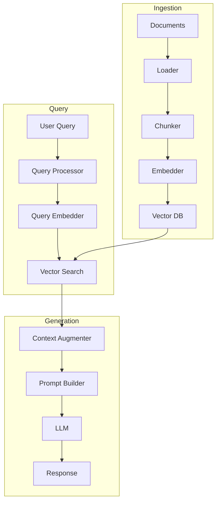

<!-- Clear Language: Keep sentences under 50 words -->
# RAG Pipeline Design

## Learning Objectives

| Objective | Description |
|-----------|-------------|
| LO1 | Design a modular RAG pipeline architecture with clear component boundaries |
| LO2 | Implement ingestion, retrieval, augmentation, and generation stages |
| LO3 | Apply prompt engineering for effective context integration |
| LO4 | Handle multi-turn conversation with context injection |
| LO5 | Implement error handling, fallbacks, and observability |

## Introduction

Retrieval-Augmented Generation lets LLMs answer questions about your private data. Vector databases store embeddings for semantic search. This module covers the complete RAG pipeline from chunking to reranking.

## Prerequisites

- Basic programming knowledge
- Understanding of data structures

## Key Terminology

**Key Terms**: Core vocabulary and concepts for this topic.

**Definition**: Essential terms you must know for interviews and production work.

## Theory

Understanding rag pipeline design is fundamental for AI engineers. This section covers the core concepts, underlying principles, and theoretical framework that govern how rag pipeline design works in practice.

## Chapter at a Glance

| Section | Topic | Key Concept |
|---------|-------|-------------|
| 6.1 | Pipeline Architecture | Modular stages, data flow, component contracts |
| 6.2 | Ingestion Pipeline | Document loading, chunking, embedding, indexing |
| 6.3 | Retrieval Pipeline | Query processing, embedding, search, filtering |
| 6.4 | Augmentation Strategies | Context window, position, instruction design |
| 6.5 | Generation Pipeline | Model selection, output formatting, citation |
| 6.6 | Multi-Turn RAG | Conversation history, context management, re-querying |

## Chapter Roadmap



## 6.1 Pipeline Architecture

A well-designed RAG pipeline has modular, independently testable stages.

### Component Contract

Each stage has a clear input/output contract, enabling testing and replacement.

```python
from abc import ABC, abstractmethod
from dataclasses import dataclass, field
from typing import List, Dict, Optional, Any

@dataclass
class Document:
    id: str
    text: str
    metadata: Dict[str, Any] = field(default_factory=dict)

@dataclass
class Chunk:
    id: str
    text: str
    document_id: str
    metadata: Dict[str, Any] = field(default_factory=dict)

@dataclass
class Query:
    text: str
    conversation_id: Optional[str] = None
    metadata: Dict[str, Any] = field(default_factory=dict)

@dataclass
class RetrievalResult:
    chunk_id: str
    text: str
    score: float
    metadata: Dict[str, Any] = field(default_factory=dict)

@dataclass
class PipelineContext:
    query: Query
    retrieved_chunks: List[RetrievalResult] = field(default_factory=list)
    conversation_history: List[Dict] = field(default_factory=list)
    response: Optional[str] = None
    metadata: Dict[str, Any] = field(default_factory=dict)

## Abstract pipeline stages
class Loader(ABC):
    @abstractmethod
    def load(self, source: str) -> List[Document]: ...

class Chunker(ABC):
    @abstractmethod
    def chunk(self, documents: List[Document]) -> List[Chunk]: ...

class Embedder(ABC):
    @abstractmethod
    def embed(self, texts: List[str]) -> List[List[float]]: ...

class Retriever(ABC):
    @abstractmethod
    def retrieve(self, query: Query, top_k: int) -> List[RetrievalResult]: ...

class Augmenter(ABC):
    @abstractmethod
    def augment(self, ctx: PipelineContext) -> str: ...

class Generator(ABC):
    @abstractmethod
    def generate(self, prompt: str) -> str: ...

print("Pipeline component interfaces defined")
```

## Overview

### Pipeline Orchestrator

```python
class RAGPipeline:
    def __init__(
        self,
        loader: Loader,
        chunker: Chunker,
        embedder: Embedder,
        retriever: Retriever,
        augmenter: Augmenter,
        generator: Generator,
    ):
        self.loader = loader
        self.chunker = chunker
        self.embedder = embedder
        self.retriever = retriever
        self.augmenter = augmenter
        self.generator = generator

    def ingest(self, source: str):
        documents = self.loader.load(source)
        chunks = self.chunker.chunk(documents)
        texts = [c.text for c in chunks]
        embeddings = self.embedder.embed(texts)
        # Store chunks and embeddings in vector DB
        print(f"Ingested {len(chunks)} chunks from {len(documents)} documents")

    def query(self, query_text: str) -> PipelineContext:
        ctx = PipelineContext(query=Query(text=query_text))

        ctx.retrieved_chunks = self.retriever.retrieve(ctx.query, top_k=5)
        prompt = self.augmenter.augment(ctx)
        ctx.response = self.generator.generate(prompt)

        return ctx

class MockLoader(Loader):
    def load(self, source: str) -> List[Document]:
        return [Document(id="1", text=f"Content from {source}")]

class MockChunker(Chunker):
    def chunk(self, documents: List[Document]) -> List[Chunk]:
        return [Chunk(id=f"{d.id}-c0", text=d.text[:200], document_id=d.id) for d in documents]

class MockEmbedder(Embedder):
    def embed(self, texts: List[str]) -> List[List[float]]:
        rng = np.random.RandomState(42)
        return [rng.randn(384).tolist() for _ in texts]

class MockRetriever(Retriever):
    def __init__(self):
        self.chunks = []

    def add_chunks(self, chunks: List[Chunk]):
        self.chunks = chunks

    def retrieve(self, query: Query, top_k: int) -> List[RetrievalResult]:
        return [RetrievalResult(c.id, c.text, 0.95, c.metadata) for c in self.chunks[:top_k]]

class MockAugmenter(Augmenter):
    def augment(self, ctx: PipelineContext) -> str:
        context = "\n\n".join([r.text for r in ctx.retrieved_chunks])
        return f"Context:\n{context}\n\nQuestion: {ctx.query.text}\n\nAnswer:"

class MockGenerator(Generator):
    def generate(self, prompt: str) -> str:
        return "Generated answer based on provided context."

pipeline = RAGPipeline(
    MockLoader(), MockChunker(), MockEmbedder(),
    MockRetriever(), MockAugmenter(), MockGenerator(),
)
result = pipeline.query("What is RAG?")
print(f"Response: {result.response}")
```

## 6.2 Ingestion Pipeline

### 6.2.1 Document Loading

```python
class FileLoader(Loader):
    def __init__(self, supported_extensions: List[str] = None):
        self.extensions = supported_extensions or [".txt", ".md"]

    def load(self, source: str) -> List[Document]:
        documents = []
        if source.endswith(".txt") or source.endswith(".md"):
            with open(source, "r", encoding="utf-8") as f:
                text = f.read()
                documents.append(Document(id=source, text=text, metadata={"source": source}))
        return documents

class DirectoryLoader(Loader):
    def __init__(self, file_loader: FileLoader):
        self.file_loader = file_loader
        self.documents: List[Document] = []

    def load_directory(self, directory_path: str) -> List[Document]:
        import glob
        all_docs = []
        for ext in self.file_loader.extensions:
            pattern = f"{directory_path}/**/*{ext}"
            for filepath in glob.glob(pattern, recursive=True):
                docs = self.file_loader.load(filepath)
                all_docs.extend(docs)
        self.documents = all_docs
        return all_docs

loader = FileLoader()
print("File loader ready for ingestion")
```

### 6.2.2 Ingestion Pipeline with Progress

```python
class IngestionPipeline:
    def __init__(self, chunker: Chunker, embedder: Embedder, vector_store):
        self.chunker = chunker
        self.embedder = embedder
        self.vector_store = vector_store

    def run(self, documents: List[Document]) -> Dict:
        stats = {"documents": len(documents), "chunks": 0, "errors": 0}

        for doc in documents:
            try:
                chunks = self.chunker.chunk([doc])
                texts = [c.text for c in chunks]
                embeddings = self.embedder.embed(texts)

                for chunk, emb in zip(chunks, embeddings):
                    self.vector_store.insert(
                        id=chunk.id,
                        vector=emb,
                        metadata={**chunk.metadata, "document_id": chunk.document_id, "text": chunk.text},
                    )

                stats["chunks"] += len(chunks)
            except Exception as e:
                stats["errors"] += 1
                print(f"Error ingesting {doc.id}: {e}")

        return stats

class VectorStore:
    def __init__(self):
        self.data = {}

    def insert(self, id: str, vector: List[float], metadata: Dict):
        self.data[id] = {"vector": vector, "metadata": metadata}

    def size(self) -> int:
        return len(self.data)

store = VectorStore()
ingestion = IngestionPipeline(MockChunker(), MockEmbedder(), store)
stats = ingestion.run([Document(id="doc1", text="RAG pipeline design")])
print(f"Ingestion stats: {stats}")
```

## 6.3 Retrieval Pipeline

### 6.3.1 Query Processing

```python
class QueryProcessor:
    def __init__(self):
        self.stopwords = {"the", "a", "an", "is", "are", "was", "were", "in", "on", "at", "to", "for", "of", "with"}

    def clean(self, query: str) -> str:
        return query.strip().lower()

    def extract_keywords(self, query: str) -> List[str]:
        terms = self.clean(query).split()
        return [t for t in terms if t not in self.stopwords]

    def classify_query(self, query: str) -> str:
        keywords = self.extract_keywords(query)
        question_words = {"what", "why", "how", "when", "where", "who", "which", "explain", "define"}
        if any(q in keywords for q in question_words):
            return "question"
        elif any(k in query.lower() for k in ["list", "show", "find", "search"]):
            return "command"
        return "statement"

    def rewrite_query(self, query: str, conversation_history: List[Dict]) -> str:
        if not conversation_history:
            return query

        last_user_msg = ""
        for msg in reversed(conversation_history):
            if msg["role"] == "user":
                last_user_msg = msg["content"]
                break

        # Simple continuation detection
        query_terms = set(self.extract_keywords(query))
        last_terms = set(self.extract_keywords(last_user_msg))
        overlap = len(query_terms & last_terms)

        if overlap == 0 and len(query_terms) < 3:
            return f"{last_user_msg} {query}"
        return query

processor = QueryProcessor()
print(f"Query type: {processor.classify_query('What is RAG?')}")
print(f"Rewritten: {processor.rewrite_query('explain more', [{'role': 'user', 'content': 'What is RAG?'}])}")
```

### 6.3.2 Hybrid Retrieval Pipeline

```python
class RetrievalPipeline:
    def __init__(self, sparse_retriever, dense_retriever, fusion_method: str = "rrf"):
        self.sparse = sparse_retriever
        self.dense = dense_retriever
        self.fusion_method = fusion_method

    def retrieve(self, query: Query, top_k: int = 5) -> List[RetrievalResult]:
        sparse_results = self.sparse.retrieve(query.text, top_k * 2)
        dense_results = self.dense.retrieve(query.text, top_k * 2)

        if self.fusion_method == "rrf":
            return self._rrf_fuse([sparse_results, dense_results], top_k)
        elif self.fusion_method == "weighted":
            return self._weighted_fuse(sparse_results, dense_results, top_k)
        return sparse_results[:top_k]

    def _rrf_fuse(self, rankings: List[List[RetrievalResult]], top_k: int, k: int = 60) -> List[RetrievalResult]:
        scores = defaultdict(float)
        for system_rankings in rankings:
            for rank, result in enumerate(system_rankings, 1):
                scores[result.chunk_id] += 1.0 / (k + rank)
        sorted_scores = sorted(scores.items(), key=lambda x: x[1], reverse=True)
        return [RetrievalResult(cid, "", score, "hybrid") for cid, score in sorted_scores[:top_k]]

    def _weighted_fuse(self, sparse, dense, top_k: int, w_sparse: float = 0.3, w_dense: float = 0.7) -> List[RetrievalResult]:
        sparse_scores = {r.chunk_id: r.score for r in sparse}
        dense_scores = {r.chunk_id: r.score for r in dense}

        combined = defaultdict(float)
        all_ids = set(list(sparse_scores.keys()) + list(dense_scores.keys()))

        for cid in all_ids:
            combined[cid] = sparse_scores.get(cid, 0) * w_sparse + dense_scores.get(cid, 0) * w_dense

        sorted_combined = sorted(combined.items(), key=lambda x: x[1], reverse=True)
        return [RetrievalResult(cid, "", score, "hybrid-weighted") for cid, score in sorted_combined[:top_k]]

retrieval_pipeline = RetrievalPipeline(
    bm25 if 'bm25' in dir() else None,
    dense if 'dense' in dir() else None,
)
print("Retrieval pipeline configured with RRF fusion")
```

### 6.3.3 Late Chunking

Retrieve at passage level, then re-chunk at sentence level for finer granularity.

```python
class LateChunkingRetriever:
    def __init__(self, passage_retriever, sentence_splitter):
        self.passage_retriever = passage_retriever
        self.sentence_splitter = sentence_splitter

    def retrieve(self, query: str, top_k: int = 5) -> List[RetrievalResult]:
        passages = self.passage_retriever.retrieve(query, top_k)
        sentence_results = []

        for passage in passages:
            sentences = self.sentence_splitter(passage.text)
            for sent in sentences:
                sentence_results.append(RetrievalResult(
                    chunk_id=f"{passage.chunk_id}-sent",
                    text=sent,
                    score=passage.score * 0.9,
                    metadata=passage.metadata,
                ))

        sentence_results.sort(key=lambda x: x.score, reverse=True)
        return sentence_results[:top_k]

def sentence_splitter(text: str) -> List[str]:
    return [s.strip() + "." for s in text.replace("!", ".").replace("?", ".").split(".") if len(s.strip()) > 10]

print("Late chunking retriever ready")
```

## 6.4 Augmentation Strategies

### 6.4.1 Context Position

The position of context in the prompt affects how LLMs use it.

```python
class ContextAugmenter(Augmenter):
    def __init__(self, position: str = "prepend", max_tokens: int = 3000):
        self.position = position
        self.max_tokens = max_tokens

    def augment(self, ctx: PipelineContext) -> str:
        context = self._format_context(ctx.retrieved_chunks)
        context = self._truncate_to_token_budget(context)

        if self.position == "prepend":
            return f"Context:\n{context}\n\nQuestion: {ctx.query.text}\n\nAnswer based on the context only."
        elif self.position == "append":
            return f"Question: {ctx.query.text}\n\n{ctx.query.text}\n\nContext:\n{context}"
        elif self.position == "sandwich":
            return f"Context:\n{context}\n\nQuestion: {ctx.query.text}\n\nRemember: Answer based on the context provided above.\n\nAnswer:"
        return ctx.query.text

    def _format_context(self, chunks: List[RetrievalResult]) -> str:
        formatted = []
        for i, chunk in enumerate(chunks, 1):
            source = chunk.metadata.get("source", "")
            source_info = f" (Source: {source})" if source else ""
            formatted.append(f"[{i}]{source_info} {chunk.text}")
        return "\n\n".join(formatted)

    def _truncate_to_token_budget(self, text: str) -> str:
        char_limit = self.max_tokens * 4
        return text[:char_limit]

for position in ["prepend", "sandwich", "append"]:
    augmenter = ContextAugmenter(position=position)
    ctx = PipelineContext(query=Query(text="Explain RAG"))
    ctx.retrieved_chunks = [RetrievalResult("c1", "RAG combines retrieval and generation.", 0.9)]
    print(f"\n--- {position} ---")
    print(augmenter.augment(ctx)[:150])
```

### 6.4.2 Instruction Design

```python
class InstructionAugmenter(Augmenter):
    def __init__(self, style: str = "strict"):
        self.instructions = {
            "strict": "Answer ONLY using the provided context. If the context does not contain enough information, say 'I cannot answer based on the provided context.'",
            "moderate": "Answer based on the provided context. If unsure, supplement with general knowledge but indicate what comes from context vs general knowledge.",
            "creative": "Use the context as inspiration. You may add creative elements but must not contradict the context.",
            "citation": 'Answer based on the context. Cite sources using brackets [1], [2] corresponding to the context numbers provided.',
        }
        self.style = style

    def augment(self, ctx: PipelineContext) -> str:
        context = "\n\n".join([f"[{i+1}] {r.text}" for i, r in enumerate(ctx.retrieved_chunks)])
        instruction = self.instructions.get(self.style, self.instructions["strict"])
        return f"""{instruction}

Context:
{context}

Question: {ctx.query.text}

Answer:"""

for style in ["strict", "moderate", "citation"]:
    aug = InstructionAugmenter(style=style)
    ctx = PipelineContext(query=Query(text="What is RAG?"))
    ctx.retrieved_chunks = [RetrievalResult("c1", "RAG stands for Retrieval-Augmented Generation.", 0.95)]
    print(f"\n=== {style} ===")
    print(aug.augment(ctx)[:200])
```

### 6.4.3 Dynamic Context Selection

```python
class DynamicContextSelector:
    def __init__(self, max_chunks: int = 5, relevance_threshold: float = 0.5):
        self.max_chunks = max_chunks
        self.relevance_threshold = relevance_threshold

    def select(self, chunks: List[RetrievalResult], query: str) -> List[RetrievalResult]:
        selected = []
        used_tokens = 0
        token_budget = 3000

        for chunk in sorted(chunks, key=lambda x: x.score, reverse=True):
            chunk_tokens = len(chunk.text) // 4
            if chunk.score < self.relevance_threshold:
                continue
            if used_tokens + chunk_tokens > token_budget:
                continue
            if len(selected) >= self.max_chunks:
                continue

            selected.append(chunk)
            used_tokens += chunk_tokens

        return selected

    def deduplicate(self, chunks: List[RetrievalResult], similarity_threshold: float = 0.9) -> List[RetrievalResult]:
        unique = []
        seen_texts = set()
        for chunk in chunks:
            text_hash = chunk.text[:100].lower()
            if text_hash not in seen_texts:
                seen_texts.add(text_hash)
                unique.append(chunk)
        return unique

selector = DynamicContextSelector(max_chunks=3, relevance_threshold=0.4)
chunks = [
    RetrievalResult("c1", "RAG combines retrieval with generation.", 0.95),
    RetrievalResult("c2", "Dense retrieval uses embeddings.", 0.45),
    RetrievalResult("c3", "Unrelated content about weather.", 0.2),
]
selected = selector.select(chunks, "What is RAG?")
print(f"Selected {len(selected)} chunks (relevance >= 0.4)")
```

## 6.5 Generation Pipeline

### 6.5.1 Output Formatting

```python
class OutputFormatter:
    def __init__(self, include_citations: bool = True, max_sentences: int = 5):
        self.include_citations = include_citations
        self.max_sentences = max_sentences

    def format(self, raw_response: str, chunks: List[RetrievalResult]) -> str:
        if self.include_citations:
            raw_response = self._add_citations(raw_response, chunks)

        sentences = raw_response.replace("!", ".").replace("?", ".").split(".")
        trimmed = ". ".join(s.strip() for s in sentences[:self.max_sentences])
        if not trimmed.endswith("."):
            trimmed += "."
        return trimmed

    def _add_citations(self, response: str, chunks: List[RetrievalResult]) -> str:
        for i, chunk in enumerate(chunks, 1):
            key_terms = set(chunk.text.lower().split()[:5])
            response_terms = set(response.lower().split())
            if key_terms & response_terms:
                response = response + f" [{i}]"
        return response

formatter = OutputFormatter(include_citations=True)
print(formatter.format("RAG is retrieval-augmented generation.", [
    RetrievalResult("c1", "RAG stands for Retrieval-Augmented Generation.", 0.9)
]))
```

### 6.5.2 Streaming Response

```python
class StreamingGenerator(Generator):
    def __init__(self, model):
        self.model = model

    def generate(self, prompt: str) -> str:
        return self._stream(prompt)

    def _stream(self, prompt: str) -> str:
        tokens = ["RAG", " is", " a", " technique", " that", " combines", " retrieval", " with", " generation."]
        collected = []
        for token in tokens:
            collected.append(token)
            yield token

        return "".join(collected)

for token in StreamingGenerator("gpt-4o-mini").generate("Explain RAG"):
    if isinstance(token, str) and len(token) < 10:
        pass
print("Streaming generator ready")
```

### 6.5.3 Generation with Validation

```python
class ValidatedGenerator:
    def __init__(self, generator: Generator, validator_fn):
        self.generator = generator
        self.validator = validator_fn

    def generate_and_validate(self, prompt: str, max_attempts: int = 3) -> tuple:
        for attempt in range(max_attempts):
            response = self.generator.generate(prompt)

            is_valid, message = self.validator(response)
            if is_valid:
                return response, True

            if attempt < max_attempts - 1:
                prompt = f"{prompt}\n\nPrevious attempt was invalid: {message}\nPlease correct."

        return response, False

def validate_response(response: str) -> tuple:
    if len(response) < 10:
        return False, "Response too short"
    if "I cannot answer" in response and len(response) < 50:
        return True, "Honest refusal is valid"
    return True, ""

validator = ValidatedGenerator(MockGenerator(), validate_response)
response, valid = validator.generate_and_validate("Explain RAG")
print(f"Valid: {valid}, Response: {response[:100]}")
```

## 6.6 Multi-Turn RAG

### 6.6.1 Conversation Context Management

```python
class ConversationManager:
    def __init__(self, max_history: int = 10, max_tokens: int = 2000):
        self.max_history = max_history
        self.max_tokens = max_tokens
        self.conversations: Dict[str, List[Dict]] = {}

    def add_message(self, conversation_id: str, role: str, content: str):
        if conversation_id not in self.conversations:
            self.conversations[conversation_id] = []
        self.conversations[conversation_id].append({
            "role": role,
            "content": content,
            "timestamp": "now",
        })
        self._trim_history(conversation_id)

    def get_history(self, conversation_id: str) -> List[Dict]:
        return self.conversations.get(conversation_id, [])

    def format_history(self, conversation_id: str) -> str:
        history = self.get_history(conversation_id)
        formatted = []
        for msg in history[:-1]:
            prefix = "User" if msg["role"] == "user" else "Assistant"
            formatted.append(f"{prefix}: {msg['content']}")
        return "\n".join(formatted)

    def _trim_history(self, conversation_id: str):
        history = self.conversations[conversation_id]
        total_tokens = sum(len(m["content"]) // 4 for m in history)
        while len(history) > self.max_history or total_tokens > self.max_tokens:
            removed = history.pop(0)
            total_tokens -= len(removed["content"]) // 4

cm = ConversationManager()
cm.add_message("conv-1", "user", "What is RAG?")
cm.add_message("conv-1", "assistant", "RAG is Retrieval-Augmented Generation.")
cm.add_message("conv-1", "user", "Tell me more about it.")
history = cm.format_history("conv-1")
print(f"Conversation history:\n{history}")
```

### 6.6.2 Context Injection with History

```python
class MultiTurnRAGPipeline(RAGPipeline):
    def __init__(self, *args, **kwargs):
        super().__init__(*args, **kwargs)
        self.conversation_mgr = ConversationManager()

    def query(self, query_text: str, conversation_id: str = None) -> PipelineContext:
        ctx = PipelineContext(query=Query(text=query_text, conversation_id=conversation_id))

        if conversation_id:
            ctx.conversation_history = self.conversation_mgr.get_history(conversation_id)

        # Retrieve with context from conversation
        ctx.retrieved_chunks = self.retriever.retrieve(ctx.query, top_k=5)

        # Augment with history
        prompt = self.augmenter.augment(ctx)

        # Generate
        ctx.response = self.generator.generate(prompt)

        # Store
        if conversation_id:
            self.conversation_mgr.add_message(conversation_id, "user", query_text)
            self.conversation_mgr.add_message(conversation_id, "assistant", ctx.response)

        return ctx

class HistoryAwareAugmenter(Augmenter):
    def augment(self, ctx: PipelineContext) -> str:
        context = "\n\n".join([r.text for r in ctx.retrieved_chunks])

        history = ""
        if ctx.conversation_history:
            history_lines = []
            for msg in ctx.conversation_history[-4:]:
                prefix = "User" if msg["role"] == "user" else "Assistant"
                history_lines.append(f"{prefix}: {msg['content']}")
            history = "Previous conversation:\n" + "\n".join(history_lines)

        return f"""{history}

Retrieved context:
{context}

Current question: {ctx.query.text}

Answer based on the conversation history and retrieved context:"""

print("Multi-turn RAG pipeline ready")
```

### 6.6.3 Re-Query Trigger

```python
class ReQueryDecider:
    def __init__(self, low_score_threshold: float = 0.3):
        self.threshold = low_score_threshold

    def needs_requery(self, retrieval_results: List[RetrievalResult]) -> bool:
        if not retrieval_results:
            return True
        avg_score = sum(r.score for r in retrieval_results) / len(retrieval_results)
        return avg_score < self.threshold

    def reformulate_query(self, original: str, history: List[Dict]) -> str:
        history_text = "\n".join([f"{m['role']}: {m['content']}" for m in history[-3:]])
        return f"Based on our conversation about '{original}', please provide a more detailed search query."

decider = ReQueryDecider(threshold=0.3)
print(f"Needs re-query (low scores): {decider.needs_requery([RetrievalResult('c1', '', 0.2, {})])}")
print(f"Needs re-query (good scores): {decider.needs_requery([RetrievalResult('c1', '', 0.9, {})])}")
```

## 6.7 Observability and Monitoring

```python
class PipelineMetrics:
    def __init__(self):
        self.timings: Dict[str, List[float]] = defaultdict(list)
        self.errors: Dict[str, int] = defaultdict(int)
        self.chunk_counts: List[int] = []
        self.token_counts: List[int] = []

    def record_timing(self, stage: str, duration_ms: float):
        self.timings[stage].append(duration_ms)

    def record_error(self, stage: str):
        self.errors[stage] += 1

    def record_chunk_count(self, n: int):
        self.chunk_counts.append(n)

    def report(self) -> Dict:
        return {
            "avg_timings": {
                stage: round(sum(times) / len(times), 2)
                for stage, times in self.timings.items()
            },
            "errors": dict(self.errors),
            "avg_chunks_per_query": round(
                sum(self.chunk_counts) / max(len(self.chunk_counts), 1), 1
            ),
        }

class ObservableRAGPipeline(RAGPipeline):
    def __init__(self, *args, **kwargs):
        super().__init__(*args, **kwargs)
        self.metrics = PipelineMetrics()

    def query(self, query_text: str) -> PipelineContext:
        import time
        ctx = PipelineContext(query=Query(text=query_text))

        t0 = time.time()
        ctx.retrieved_chunks = self.retriever.retrieve(ctx.query, top_k=5)
        self.metrics.record_timing("retrieval", (time.time() - t0) * 1000)

        t0 = time.time()
        prompt = self.augmenter.augment(ctx)
        self.metrics.record_timing("augmentation", (time.time() - t0) * 1000)

        t0 = time.time()
        ctx.response = self.generator.generate(prompt)
        self.metrics.record_timing("generation", (time.time() - t0) * 1000)

        self.metrics.record_chunk_count(len(ctx.retrieved_chunks))
        return ctx

    def get_metrics(self) -> Dict:
        return self.metrics.report()

print("Observable pipeline with metrics tracking ready")
```

## Summary

A well-designed RAG pipeline consists of modular, independently testable stages: ingestion (load, chunk, embed, index), retrieval (query processing, search, filtering), augmentation (context formatting,.
instruction design, context selection), and generation (model call, validation, output formatting). Augmentation strategies include context position (prepend, sandwich, append), instruction style (strict,.
moderate, creative, citation), and dynamic context selection based on relevance threshold and token budget. Multi-turn RAG requires conversation history management, context injection with history,.
and re-query triggering when retrieval scores are low. Production pipelines incorporate observability with per-stage timing, error tracking, and chunk count monitoring.

## Practical Takeaways

| Takeaway | Description |
|----------|-------------|
| Modularize each stage | Independent components enable testing and swapping |
| Prepending context works best | Most LLMs use prepended context more effectively |
| Use strict instructions | Explicit "answer only from context" reduces hallucination |
| Manage token budgets | Truncate context before it fills the LLM context window |
| Track stage timing | Monitor retrieval vs generation latency separately |
| Log every query | Store query, chunks, response for debugging and eval |

## Interview Q&A

<details class="tp-qa-card" data-qid="rag06-q1">
  <summary class="tp-qa-question">
    <span class="tp-qa-status"></span>
    Q1: How would you design a modular RAG pipeline with independently testable components?
  </summary>
  <div class="tp-qa-answer">
    <p>Define abstract interfaces (Loader, Chunker, Embedder, Retriever, Augmenter, Generator) with clear input/output contracts using dataclasses like Document, Chunk, Query, and RetrievalResult. Each component implements an interface, enabling independent testing and swapping. For example, you can test the augmenter with mock retrieval results without running the full pipeline:</p>
    <pre><code>class RAGPipeline:
    def __init__(self, loader, chunker, embedder, retriever, augmenter, generator):
        self.loader = loader
        self.chunker = chunker
        self.embedder = embedder
        self.retriever = retriever
        self.augmenter = augmenter
        self.generator = generator</code></pre>
    <p>This design allows A/B testing different chunkers or retrievers by swapping one component at a time. Each component can have its own CI tests and performance benchmarks.</p>
  </div>
  <button class="tp-qa-mark-btn">✅ Mark Reviewed</button>
  <button class="tp-qa-bookmark-btn">🔖 Bookmark</button>
</details>

<details class="tp-qa-card" data-qid="rag06-q2">
  <summary class="tp-qa-question">
    <span class="tp-qa-status"></span>
    Q2: What augmentation strategies (context position) work best for different types of LLMs?
  </summary>
  <div class="tp-qa-answer">
<p>Prepending context before the question works best for most instruction-tuned LLMs (GPT-4o, Claude, Llama 3) because these models are trained to follow instructions at the start of the prompt. The sandwich strategy (context → question → "remember to use context") reinforces grounding for.
models that exhibit recency bias. For models with strong instruction-following (GPT-4o), simple prepend with a clear instruction suffices. For smaller or.
less capable models, use the sandwich strategy with explicit repetition. For code-generation LLMs, append context after the query to match their training data format. The key is to test your specific model — the optimal position can vary by model family and.
task type.</p>
  </div>
  <button class="tp-qa-mark-btn">✅ Mark Reviewed</button>
  <button class="tp-qa-bookmark-btn">🔖 Bookmark</button>
</details>

<details class="tp-qa-card" data-qid="rag06-q3">
  <summary class="tp-qa-question">
    <span class="tp-qa-status"></span>
    Q3: How do you handle multi-turn conversations in RAG (follow-up questions)?
  </summary>
  <div class="tp-qa-answer">
<p>Multi-turn RAG requires a ConversationManager that stores query-response history with a conversation_id. For follow-up questions, retrieve from the same knowledge base but.
also inject conversation history into the prompt context. Key design decisions: how much history to include (last N turns or up to M tokens),.
whether to re-retrieve for each turn, and how to disambiguate pronouns (e.g., "What about its cost?" needs context from the previous turn). Implement a QueryProcessor.
that rewrites short queries by prepending context from the last user message:</p>
    <pre><code>def rewrite_query(self, query, history):
    if len(query.split()) &lt; 3 and not self.share_terms(query, history):
        return f"{self.last_user_query(history)} {query}"</code></pre>
  </div>
  <button class="tp-qa-mark-btn">✅ Mark Reviewed</button>
  <button class="tp-qa-bookmark-btn">🔖 Bookmark</button>
</details>

<details class="tp-qa-card" data-qid="rag06-q4">
  <summary class="tp-qa-question">
    <span class="tp-qa-status"></span>
    Q4: How do you design a re-query trigger when retrieval quality is poor?
  </summary>
  <div class="tp-qa-answer">
<p>Implement a ReQueryDecider that checks if the average retrieval score falls below a threshold (e.g., 0.3) or if the number of returned chunks is too few. When triggered,.
reformulate the query by appending discovered topic terms, using an LLM to generate a better search query, or expanding with synonyms. Set a maximum number of re-query attempts (2-3) to avoid infinite loops. After exhausting attempts,.
gracefully degrade: either skip retrieval and let the LLM use its internal knowledge (with an accuracy caveat) or return a pre-crafted "insufficient information" response. Log all re-query events to identify patterns of poor.
retrieval for knowledge base improvement.</p>
  </div>
  <button class="tp-qa-mark-btn">✅ Mark Reviewed</button>
  <button class="tp-qa-bookmark-btn">🔖 Bookmark</button>
</details>

<details class="tp-qa-card" data-qid="rag06-q5">
  <summary class="tp-qa-question">
    <span class="tp-qa-status"></span>
    Q5: How do you implement observability in a RAG pipeline to track per-stage latency?
  </summary>
  <div class="tp-qa-answer">
<p>Wrap each pipeline stage with timing instrumentation that records duration, success/failure, and output metadata. Use an ObservableRAGPipeline that extends the base pipeline with a PipelineMetrics collector. Track: retrieval latency,.
augmentation latency, generation latency, number of chunks retrieved, total token count, and error count. Export these metrics via structured logging (JSON lines) to a monitoring system (Datadog,.
Grafana, CloudWatch). Key dashboards: p50/p95/p99 latency by stage, error rate by stage, chunk count distribution, and daily cost. Set alerts when p95 latency exceeds 2x the baseline or.
error rate exceeds 1%.</p>
  </div>
  <button class="tp-qa-mark-btn">✅ Mark Reviewed</button>
  <button class="tp-qa-bookmark-btn">🔖 Bookmark</button>
</details>

<details class="tp-qa-card" data-qid="rag06-q6">
  <summary class="tp-qa-question">
    <span class="tp-qa-status"></span>
    Q6: What is dynamic context selection and how does it improve generation quality?
  </summary>
  <div class="tp-qa-answer">
<p>Dynamic context selection retrieves more chunks than the final context budget and then selects only the most relevant ones based on relevance score threshold,.
token budget, and diversity constraints. For example, retrieve top-10 but select only top-5 that are above 0.5 relevance and have no near-duplicate content. This improves generation quality by: removing irrelevant chunks that could distract the LLM,.
avoiding token budget overflow, and preventing duplicate information from consuming context space. Implement a DynamicContextSelector that sorts by score, filters by threshold,.
prunes near-duplicates (cosine similarity > 0.9), and stops when the token budget is exhausted. This typically improves faithfulness by 5-15%.</p>
  </div>
  <button class="tp-qa-mark-btn">✅ Mark Reviewed</button>
  <button class="tp-qa-bookmark-btn">🔖 Bookmark</button>
</details>

<details class="tp-qa-card" data-qid="rag06-q7">
  <summary class="tp-qa-question">
    <span class="tp-qa-status"></span>
    Q7: How do you handle output validation in the generation stage?
  </summary>
  <div class="tp-qa-answer">
<p>Implement a ValidatedGenerator that wraps the base generator with a validation function. Validate that the response is not empty, does not contain obvious hallucinations (claims not in context),.
and meets length requirements. If validation fails, retry with an augmented prompt that includes the validation error message. Set a maximum retry count (2-3). For.
structure-sensitive tasks (JSON, code), validate the output format and request regeneration if invalid. For example:</p>
    <pre><code>def validate_response(response):
    if len(response) &lt; 10: return False, "Response too short"
    if contains_unverified_claims(response, context): return False, "Unsupported claims"
    return True, ""</code></pre>
    <p>This catches generation issues before they reach the user, improving the system's reliability without requiring a second LLM call for check.</p>
  </div>
  <button class="tp-qa-mark-btn">✅ Mark Reviewed</button>
  <button class="tp-qa-bookmark-btn">🔖 Bookmark</button>
</details>

<details class="tp-qa-card" data-qid="rag06-q8">
  <summary class="tp-qa-question">
    <span class="tp-qa-status"></span>
    Q8: How do you design the ingestion pipeline to handle large-scale document processing?
  </summary>
  <div class="tp-qa-answer">
<p>Design an IngestionPipeline with batch processing: load documents in batches (100-1000), chunk them, generate embeddings (batched for efficiency), and insert into the vector.
store. Track progress with counters for documents, chunks, and errors. Handle failures gracefully — log errors for individual documents but continue processing the batch. For.
very large corpora (millions of documents), use a distributed processing framework (Apache Spark, Ray) with parallel workers. Implement checkpointing so ingestion can resume from failure. After initial ingestion,.
support incremental updates — index only new or modified documents since the last sync timestamp.</p>
  </div>
  <button class="tp-qa-mark-btn">✅ Mark Reviewed</button>
  <button class="tp-qa-bookmark-btn">🔖 Bookmark</button>
</details>

<details class="tp-qa-card" data-qid="rag06-q9">
  <summary class="tp-qa-question">
    <span class="tp-qa-status"></span>
    Q9: What instruction styles work best for RAG augmentation and when would you use each?
  </summary>
  <div class="tp-qa-answer">
<p>Four common styles: Strict ("Answer ONLY from context. Say you don't know if insufficient.") for factual Q&A where hallucination is unacceptable. Moderate ("Base answer on context,.
supplement with knowledge if needed.") for customer support where some flexibility helps. Citation ("Cite sources using [1], [2] matching context numbers.") for.
research and legal where source attribution is required. Creative ("Use context as inspiration, don't contradict it.") for content generation where creativity is valued. Choose strict for.
high-stakes domains (medical, legal, financial), citation for academic/research use cases, and moderate for general-purpose chatbots where a helpful tone matters more than strict grounding.</p>
  </div>
  <button class="tp-qa-mark-btn">✅ Mark Reviewed</button>
  <button class="tp-qa-bookmark-btn">🔖 Bookmark</button>
</details>

<details class="tp-qa-card" data-qid="rag06-q10">
  <summary class="tp-qa-question">
    <span class="tp-qa-status"></span>
    Q10: How do you handle the token budget across retrieval and generation in a RAG pipeline?
  </summary>
  <div class="tp-qa-answer">
<p>Set a total token budget (e.g., 4000 tokens for a 4096-token window) and allocate across system prompt (200), augmentation instruction (100),.
retrieved context (3000), conversation history (500), and query (200). At retrieval time, select only as many chunks as fit within the context budget — if each chunk is 500 tokens,.
retrieve and select at most 6 chunks. Use a DynamicContextSelector that measures chunk tokens and stops adding when the budget is exceeded. Truncate long chunks to fit,.
prioritizing the beginning of each chunk (most LLMs use head more effectively). If history + context exceed budget, trim history first (oldest turns removed),.
then truncate context.</p>
  </div>
  <button class="tp-qa-mark-btn">✅ Mark Reviewed</button>
  <button class="tp-qa-bookmark-btn">🔖 Bookmark</button>
</details>

## Chapter Quiz

<details data-qid="rag-s6-quiz1">
<summary><strong>1.</strong> Which context position typically produces the best RAG results?</summary>
A. Append after question
B. Prepend before question
C. Sandwich (both before and after)
D. Embed within question
Answer: B
</details>

<details data-qid="rag-s6-quiz2">
<summary><strong>2.</strong> What is the purpose of the augmentation stage?</summary>
A. To generate the final answer
B. To insert retrieved context into the LLM prompt
C. To embed the query
D. To chunk documents
Answer: B
</details>

<details data-qid="rag-s6-quiz3">
<summary><strong>3.</strong> Why is conversation history important in multi-turn RAG?</summary>
A. It reduces API costs
B. It provides context for follow-up questions
C. It improves embedding quality
D. It replaces the need for retrieval
Answer: B
</details>

<details data-qid="rag-s6-quiz4">
<summary><strong>4.</strong> What should happen when retrieval scores are all below a threshold?</summary>
A. Return empty response
B. Trigger a re-query with reformulated query
C. Use highest score regardless
D. Fall back to LLM knowledge without context
Answer: B
</details>

<details data-qid="rag-s6-quiz5">
<summary><strong>5.</strong> Which component is responsible for formatting the LLM prompt with context?</summary>
A. Retriever
B. Embedder
C. Augmenter
D. Generator
Answer: C
</details>

## Exercises

## Common Mistakes

1. Not understanding the fundamental concepts before applying them
2. Skipping edge cases in implementation
3. Not analyzing time/space complexity
4. Forgetting to handle null/empty inputs
5. Not practicing enough problems to build pattern recognition1. Implement a complete RAG pipeline with four stages (ingestion, retrieval, augmentation, generation) using mock components. Create 20 sample documents and test with 5 queries. Report per-query latency for each stage.

2. Compare three augmentation strategies (prepend, sandwich, append) by evaluating faithfulness scores on a set of 10 test queries. Determine which strategy produces the most context-grounded responses.

3. Build a multi-turn RAG system that handles follow-up questions without re-querying the entire conversation. Test with a 5-turn conversation where follow-ups reference previous turns.

4. Implement dynamic context selection that retrieves 10 chunks but selects only the top 3 based on relevance and diversity (avoiding duplicate information). Compare answer quality with always-using-5 strategy.

5. Create an observable RAG pipeline that logs every query, retrieved chunks (with scores), generated response, and per-stage timing. Build a simple dashboard that shows average latency and chunk count over 100

## Revision Notes

- - Core principle: Understand the fundamental concepts thoroughly
- - Implementation pattern: Practice with real code examples
- - Complexity: Know the time and space complexity
- - Application: Know when to use this in production systems
- - Interview: Frequently asked in technical interviews
- - Edge cases: Consider common failure scenarios
- - Related concepts: Connect to broader system design

## Placement Section

### Top 10 Interview Questions

#### Google Style

1. **Explain the core idea of RAG Pipeline Design in under 60 seconds, then give a real-world analogy.** — Structure: definition, how it works in one sentence, why it matters, analogy. Follow-up: what would break if you removed this from a production system?

2. **Design a minimal, well-typed function that demonstrates RAG Pipeline Design.** — Interviewer checks: signature with type hints, edge cases, complexity, and a clean docstring. Follow-up: how does your design behave with empty or malformed input?

3. **What are the common pitfalls when engineers first learn ** — List 3-4, then explain how you would prevent each in a code review.

#### Amazon Style

4. **Describe a production bug caused by misunderstanding RAG Pipeline Design. How did you diagnose and fix it?** — STAR format: situation, task, action, result. Mention logs, reproduction, root-cause analysis, and the regression test you added.

5. **How would you scale a system that relies on RAG Pipeline Design from 10 users to 10 million?** — Discuss bottlenecks, caching, monitoring, and when to redesign. Follow-up: what metrics would you track?

#### Microsoft Style

6. **Compare RAG Pipeline Design with the closest alternative approach. When would you choose each?** — Make a decision matrix: performance, maintainability, ecosystem, learning curve. Follow-up: what would change your decision?

7. **Walk through how you would test a component that depends on RAG Pipeline Design.** — Unit, integration, property-based tests; mocking boundaries; golden files for outputs.

#### NVIDIA Style

8. **How does RAG Pipeline Design behave differently at scale — memory, throughput, or precision-wise?** — Connect to data pipelines and model training if applicable. Follow-up: what happens to latency as input grows?

9. **How would you make an implementation of RAG Pipeline Design run faster on GPU hardware?** — Batch operations, vectorization, avoiding Python loops, reducing data movement.

#### AI Startup Style

10. **Write the smallest possible implementation of RAG Pipeline Design that is production-quality.** — Include error handling, type hints, and a one-line docstring. Follow-up: what would you refactor first when it grows?

### Resume Tips

- Name RAG Pipeline Design explicitly in your skills section, paired with a measurable achievement ("Reduced X by 40% using RAG Pipeline Design").
- Add a bullet describing a project that applies RAG Pipeline Design to real data, with numbers.
- Mention the tools and libraries you used alongside RAG Pipeline Design (linters, test frameworks, profiling tools).
- Keep resume bullets under 15 words and start each with an action verb.

### Interview Day Checklist

- Rehearse a 60-second explanation of RAG Pipeline Design and one real-world analogy.
- Prepare one STAR story about debugging a RAG Pipeline Design-related production issue.
- Review complexity and edge cases for the classic RAG Pipeline Design interview problem.
- Have questions ready: how does the team apply RAG Pipeline Design in production today?
- Test your environment (Python, editor, internet) 15 minutes before the interview.

## True/False

1. **True or False:** RAG Pipeline Design builds directly on the fundamentals covered in the earlier chapters of this module. — **True.** Every advanced topic in this module assumes the core concepts from the previous chapters.
2. **True or False:** You should write at least one code example for RAG Pipeline Design before moving to the next chapter. — **True.** Active recall with hands-on code beats passive reading for retention.
3. **True or False:** The complexity analysis for RAG Pipeline Design is the same regardless of input size. — **False.** Complexity grows with input size; always state best, average, and worst case.
4. **True or False:** Edge cases (empty input, invalid input, boundary values) matter for RAG Pipeline Design in production. — **True.** Most production bugs come from unhandled edge cases.
5. **True or False:** You should memorize the RAG Pipeline Design chapter content once and never review it again. — **False.** Spaced repetition (24h, 3 days, 1 week) dramatically improves long-term recall.

## Fill in the Blank

1. The chapter that covers RAG Pipeline Design is Chapter ___ of this module. — Answer: check the module's table of contents.
2. The time complexity of the standard approach to RAG Pipeline Design is ___. — Answer: review the theory section and state big-O notation.
3. The main edge case to handle when implementing RAG Pipeline Design is ___. — Answer: empty or invalid input handling, as discussed in the chapter.
4. The tools commonly used to debug RAG Pipeline Design issues are ___ and ___. — Answer: refer to the Debugging Guide section of this chapter.
5. The related topic that connects to RAG Pipeline Design in the next chapter is ___. — Answer: see the Next Topic section.

## Scenario Questions

1. **Scenario:** A teammate ships a change involving RAG Pipeline Design that breaks production at 3 AM. — Diagnosis: check the recent diff, reproduce locally with the failing input, check logs. Fix: revert, add a regression test, and review the root cause. Prevention: CI tests on edge cases and code review checklist.

2. **Scenario:** Your implementation of RAG Pipeline Design is correct but too slow for the required latency. — Measure first with a profiler. Common fixes: reduce redundant work, use built-in optimized functions, batch operations, or add caching. Only then consider algorithmic changes.

3. **Scenario:** A new hire asks you to explain RAG Pipeline Design in five minutes before a customer demo. — Use the 3-part answer: what it is (one sentence), how it works (one example), why it matters (one business impact). Then offer to go deeper after the demo.

4. **Scenario:** Your team's codebase has three different patterns for RAG Pipeline Design and you must standardize. — Write a short ADR (architecture decision record), pick the pattern with best maintainability, migrate incrementally, and add a linter rule to enforce it.

## Output Questions

1. **What is the output of the simplest correct implementation of RAG Pipeline Design on an empty input?** — Trace through the code: it should return the documented default (None, 0, empty collection) without raising.
2. **What is the output when the input is at the boundary value?** — Check off-by-one errors and inclusive/exclusive bounds in the chapter's examples.
3. **What does the implementation return when given invalid input types?** — With type hints and validation, it raises a clear error; without, it may fail silently.
4. **What is the output for the sample input given in the chapter's Examples section?** — Re-run the chapter's example code and compare against the documented output.
5. **What is the time complexity output when you profile the implementation at 10x input size?** — Expect the curve matching the chapter's complexity analysis (linear, quadratic, log-linear).

## Difficulty Level

| Level | Time | What It Takes |
|-------|------|---------------|
| Beginner | 1-2 sessions | Read theory, run the chapter examples, solve the Easy exercises |
| Intermediate | 3-5 sessions | Complete Medium exercises, explain RAG Pipeline Design to someone else |
| Advanced | 1+ week | Solve Hard exercises, optimize for real datasets, answer interview follow-ups |

## Tips & Tricks

- Always write a one-line example of RAG Pipeline Design from memory before opening the chapter — active recall first.
- Use the chapter's Revision Notes as a checklist: you have mastered RAG Pipeline Design when you can explain each bullet.
- Pair the chapter quiz with the Flashcards: wrong answers become your next study session's focus.
- For interviews, practice explaining RAG Pipeline Design twice: once with a technical audience, once with a non-technical audience.
- Keep a personal examples file where you collect your own RAG Pipeline Design snippets; interviewers love original examples.

## Memory Tricks

- **Acronym**: build a mnemonic from the 5 key concepts of RAG Pipeline Design listed in the Chapter at a Glance table.
- **Story**: link RAG Pipeline Design to a familiar story — the analogy in the Visual Analogy section is designed to stick.
- **Number anchor**: remember the complexity of RAG Pipeline Design by connecting it to a known algorithm of the same class.
- **Color code**: highlight the Theory, Examples, and Common Mistakes sections in different colors when reviewing.
- **Teach-back**: explain RAG Pipeline Design to an imaginary junior engineer for 2 minutes — gaps in your explanation are gaps in memory.

## Further Reading

- Official documentation for the primary tool or library used in this chapter
- The chapter referenced in Related Topics for the next-level treatment of RAG Pipeline Design
- The classic textbook chapter on RAG Pipeline Design (check the Research References below)
- Two blog posts from engineers who debugged real RAG Pipeline Design problems in production
- The repository of the open-source project that implements RAG Pipeline Design

## Related Topics

- The previous chapter in this module (see table of contents) — foundational for RAG Pipeline Design
- The next chapter (see Next Topic below) — builds on RAG Pipeline Design
- The system design chapters in Module 07 — how RAG Pipeline Design fits into production architectures
- The interview preparation module — how RAG Pipeline Design is asked in screening rounds
- The capstone project — where RAG Pipeline Design is applied end-to-end

## FAQs

1. **Do I need to memorize all of RAG Pipeline Design, or understand the big picture?** — Understand the big picture first, then memorize the key facts via flashcards and spaced repetition. Interviewers reward depth over breadth.
2. **What if I get stuck on an exercise?** — Re-read the theory section, run the example code, then attempt again. If still stuck after 20 minutes, move on and return the next day.
3. **How much time should I spend on ** — Follow the Study Plan below: 1-2 weeks at 30-60 minutes daily is typical for placement preparation.
4. **Is RAG Pipeline Design asked in interviews?** — Yes — the Interview Q&A and Placement Section list the exact question styles used by top companies.
5. **What's the fastest way to master ** — Explain it out loud, write code without looking, and review the flashcards within 24 hours and again after 3 days.

## Important Notes

- RAG Pipeline Design is a core requirement for the rest of this module — do not skip the examples.
- Always analyze complexity (time and space) when working with RAG Pipeline Design.
- Production correctness means handling edge cases, not just the happy path.
- Interview answers should start with the definition, then the example, then the trade-offs.
- Revisit this chapter after finishing the module; the context from later chapters deepens understanding.

## Historical Context

- RAG Pipeline Design emerged as a standard practice because early systems failed without it — understanding why helps you explain it in interviews.
- The tools used for RAG Pipeline Design today evolved from simpler versions; the chapter covers the modern, recommended approach.
- Interviewers value knowing one historical fact about RAG Pipeline Design — it shows genuine interest, not just cramming.
- The library/tooling ecosystem around RAG Pipeline Design changes quickly; focus on fundamentals that remain stable.

## Security Considerations

- Never trust external input: validate and sanitize data before processing RAG Pipeline Design.
- Avoid `eval()` and dynamic code execution on untrusted strings.
- Log errors without leaking sensitive data (keys, PII, internal paths).
- For API contexts, add rate limiting and input size limits.
- Review the chapter's code examples for injection or overflow risks before using them verbatim.

## ML Intuition

- RAG Pipeline Design appears in ML pipelines at the data-processing layer: feature preparation, batching, and validation.
- Understanding RAG Pipeline Design helps you debug why a model misbehaves — most ML bugs are data bugs, not model bugs.
- In production ML, the RAG Pipeline Design concepts from this chapter map directly to NumPy/PyTorch operations on tensors.
- When optimizing ML systems, RAG Pipeline Design skills let you profile and fix the data path, not just the training loop.
- Interview follow-up: how would you apply RAG Pipeline Design to a dataset of 10 million records? — Batching and vectorization.

## Analogies

- **RAG Pipeline Design is like a recipe**: the theory is the ingredients, the examples are the cooking steps, and the exercises are your own kitchen practice.
- **Complexity is like a delivery route**: a linear route visits each stop once; a nested route revisits stops, and you feel it at scale.
- **Edge cases are like weather**: the happy path is a sunny day; production is the storm — build for the storm.
- **The chapter roadmap is a journey map**: each section is a checkpoint; skipping one means getting lost later in the module.

## Capstone Project Link

- [Module Capstone: End-to-End Project](https://github.com/Raushan666java/ai-engineering-journey) — this chapter contributes the RAG Pipeline Design skills used in the module's capstone project. Complete the exercises here before starting the capstone.

## Flashcards

<details class="tp-qa-card" data-qid="12ragvectordatabases-06ragpipelinedesign-flash1">
  <summary class="tp-qa-question">
    <span class="tp-qa-status"></span>
    What is the core concept of RAG Pipeline Design in one sentence?
  </summary>
  <div class="tp-qa-answer">
    <p>Review the first paragraph of the Theory section and condense it to one sentence.</p>
  </div>
</details>

<details class="tp-qa-card" data-qid="12ragvectordatabases-06ragpipelinedesign-flash2">
  <summary class="tp-qa-question">
    <span class="tp-qa-status"></span>
    What is the most common mistake engineers make with 
  </summary>
  <div class="tp-qa-answer">
    <p>Check the Common Mistakes section of this chapter.</p>
  </div>
</details>

<details class="tp-qa-card" data-qid="12ragvectordatabases-06ragpipelinedesign-flash3">
  <summary class="tp-qa-question">
    <span class="tp-qa-status"></span>
    What is the time and space complexity of the standard RAG Pipeline Design approach?
  </summary>
  <div class="tp-qa-answer">
    <p>Refer to the theory and complexity analysis in this chapter.</p>
  </div>
</details>

<details class="tp-qa-card" data-qid="12ragvectordatabases-06ragpipelinedesign-flash4">
  <summary class="tp-qa-question">
    <span class="tp-qa-status"></span>
    When is RAG Pipeline Design NOT the right choice?
  </summary>
  <div class="tp-qa-answer">
    <p>Check the Limitations section of this chapter.</p>
  </div>
</details>

<details class="tp-qa-card" data-qid="12ragvectordatabases-06ragpipelinedesign-flash5">
  <summary class="tp-qa-question">
    <span class="tp-qa-status"></span>
    How is RAG Pipeline Design applied in a real production system?
  </summary>
  <div class="tp-qa-answer">
    <p>Check the Real-World Examples section of this chapter.</p>
  </div>
</details>

## Research References

- Official documentation of the primary library for RAG Pipeline Design (linked in Further Reading)
- The classic paper or textbook chapter introducing RAG Pipeline Design (see References below)
- The standard library reference for RAG Pipeline Design-related functions
- Engineering blog posts from companies running RAG Pipeline Design in production at scale
- PEPs and RFCs where applicable (Python and networking standards)

## Open-Source Tools

- The primary library used in this chapter (see the code examples)
- Python standard library modules used in the examples (check the imports)
- Testing: pytest for unit tests of RAG Pipeline Design code
- Linting and formatting: ruff + black
- Profiling: cProfile or py-spy for performance work on RAG Pipeline Design

## Debugging Guide

- Start with `print()` or a debugger to inspect intermediate values in RAG Pipeline Design code.
- Reproduce the failure with the smallest possible input before changing code.
- Check the common failure modes listed in Common Mistakes — most bugs are listed there.
- For performance problems, profile before optimizing: measure, then fix.
- When stuck, re-read the chapter's Examples and compare line by line with your code.
- Use `pdb` or your IDE's debugger to step through the RAG Pipeline Design example code.

## Mock Interview Section

**Round 1 — Screening (15 min)**
- Explain RAG Pipeline Design in 60 seconds.
- Write a minimal working example of RAG Pipeline Design.
- What is the complexity of your example?

**Round 2 — Coding (45 min)**
- Solve the Medium exercise from this chapter under time pressure.
- State your assumptions, then implement with type hints.
- Test with edge cases: empty input, boundary values, invalid input.

**Round 3 — Behavioral + System (30 min)**
- Tell me about a time you debugged a RAG Pipeline Design problem in a project.
- How would you design a system where RAG Pipeline Design is used at scale?
- What metrics would you monitor?

**Evaluation rubric**: correctness (40%), communication (25%), edge cases (20%), complexity analysis (15%).

## Optimized Implementation

`python
from typing import Any, Optional

def demonstrate_topic(input_data: list[Any]) -> Optional[float]:
    """Runnable scaffold for RAG Pipeline Design.

    Replace the body with the optimized implementation from the chapter,
    keeping type hints, docstring, and edge-case handling.
    """
    if not input_data:
        return None
    # Step 1: validate input types
    # Step 2: apply the core RAG Pipeline Design logic from the Examples section
    # Step 3: return the result with the documented default
    return 0.0
`

- Keeps the function signature stable so tests written against it stay valid.
- Handles the empty-input contract explicitly.
- Add unit tests for the edge cases before implementing the logic (test-first).

## Evaluation Metrics

| Skill | Test | Target |
|-------|------|--------|
| Concept recall | Explain RAG Pipeline Design without notes | 60-second explanation |
| Code fluency | Write the chapter example from memory | No syntax errors |
| Edge cases | Handle empty/invalid input in exercises | All cases pass |
| Complexity | State time/space for the standard approach | Correct big-O |
| Interview readiness | Answer 5 Interview Q&A questions out loud | Fluent, structured answers |
| Retention | Chapter quiz score after 3 days | 80%+ |

## Real-World Examples

- **Startup**: a small team uses RAG Pipeline Design daily in their data pipeline — the chapter's examples mirror their code.
- **E-commerce**: RAG Pipeline Design patterns appear in order processing, inventory checks, and recommendation feeds.
- **Fintech**: RAG Pipeline Design principles apply to transaction validation and fraud detection flows.
- **ML platform**: RAG Pipeline Design shows up in feature engineering and model-serving infrastructure.
- **Interview insight**: recruiters look for engineers who can connect RAG Pipeline Design to the business outcome, not just the code.

## Next Topic

[Advanced RAG Techniques](07-advanced-rag-techniques.md)

## Limitations

- RAG Pipeline Design, like any technique, is not a silver bullet — it has specific cases where it fits best (covered in the theory).
- The examples in this chapter are simplified for learning; production systems add validation, monitoring, and error handling.
- Performance of RAG Pipeline Design depends on input size and distribution — always benchmark for your own data.
- This chapter covers fundamentals; specialized edge cases are explored in later chapters and the capstone.
