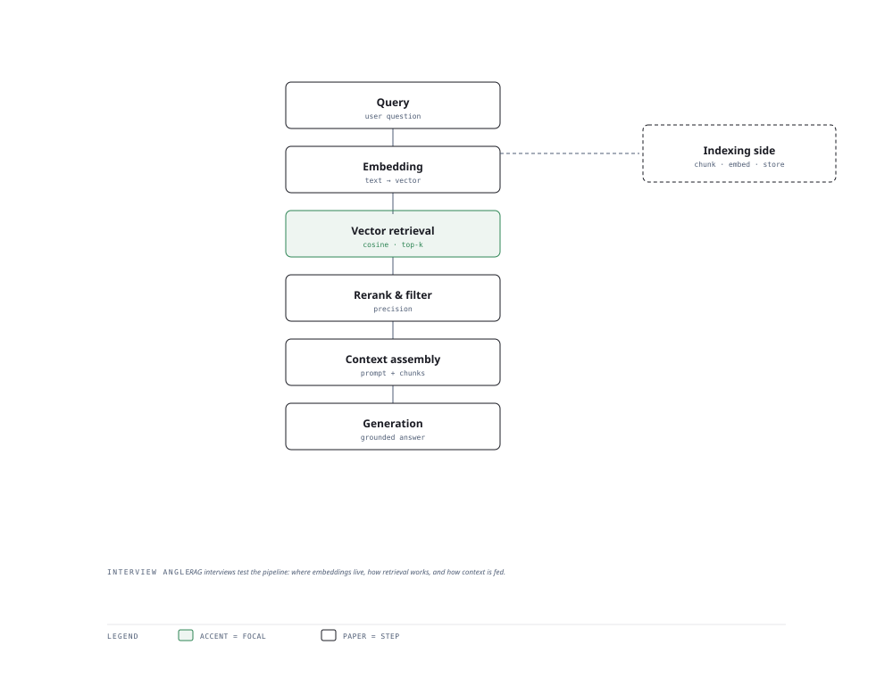

# Visual Notes — Retrieval-Augmented Generation

> One diagram, the full picture. This page is meant to be glanced at before reading the chapters, and again before interviews.

# What the diagram shows

1. **Query** — The user question is embedded into the same vector space as the corpus.
1. **Retrieve** — A vector database returns top-k candidates by similarity; reranking tightens precision.
1. **Generate** — The LLM composes an answer using the retrieved passages, reducing hallucination and grounding the response.

# Why this matters for placement

- RAG is the default production pattern for grounded answers — be ready to draw it at whiteboard speed.
- Know when vector search alone fails: out-of-vocabulary, synonyms, hybrid search fixes.

# Quick revision

- Index once (offline), query many (online): the classic asymmetry.
- Similarity: cosine on normalised embeddings; distance metrics matter at scale.
- Chunking strategy shapes recall: overlap, semantic boundaries, parent-child.
- Hybrid search (BM25 + vector) beats pure vector for lexical precision.
- Rerankers are cross-encoders: exact but slower — a two-stage pipeline is the norm.

# Related chapters

- [Introduction to RAG](01-introduction-to-rag.md)
- [Embedding models](02-embedding-models.md)
- [Chunking strategies](04-chunking-strategies.md)
- [Hybrid search](16-hybrid-search-architecture.md)

---

**One-line answer for interviews:** *"Query → embed → retrieve from vector store → rerank → generate grounded in retrieved context."*
