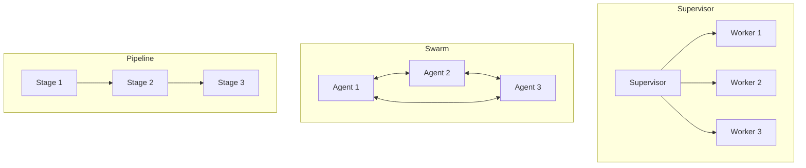

<!-- Clear Language: Keep sentences under 50 words -->
# Agent Architectures

## Learning Objectives

| Objective | Description |
|-----------|-------------|
| LO1 | Understand different agent architectures — single-step, loop, supervisor, swarm |
| LO2 | Design supervisor/controller architectures with task delegation |
| LO3 | Implement swarm-based multi-agent collaboration patterns |
| LO4 | Build hierarchical and pipeline agent topologies |
| LO5 | Evaluate architectural trade-offs for different use cases |

## Introduction

AI agents autonomously use tools to complete tasks. LangGraph builds stateful, multi-step agent workflows. This module covers agent architectures, tool use, memory, and production deployment.

## Prerequisites

- Basic programming knowledge
- Understanding of data structures

## Key Terminology

**Key Terms**: Core vocabulary and concepts for this topic.

**Definition**: Essential terms you must know for interviews and production work.

## Theory

Understanding agent architectures is fundamental for AI engineers. This section covers the core concepts, underlying principles, and theoretical framework that govern how agent architectures works in practice.

## Chapter at a Glance

| Section | Topic | Key Concept |
|---------|-------|-------------|
| 2.1 | Architecture Overview | Topologies: linear, hierarchical, supervisor, swarm |
| 2.2 | Supervisor Architecture | Central controller delegates to specialized workers |
| 2.3 | Swarm Architecture | Decentralized collaboration between peer agents |
| 2.4 | Pipeline Architecture | Sequential stages with data flow between agents |
| 2.5 | Hierarchical Architecture | Multi-level abstraction with sub-agents |
| 2.6 | Architecture Selection | Choosing the right topology for your use case |

## Chapter Roadmap



## 2.1 Architecture Overview

Agent architectures define how multiple agents or components are organized and communicate.

### Topology Comparison

| Architecture | Coordination | Scalability | Flexibility | Complexity |
|-------------|--------------|-------------|-------------|------------|
| Single Agent | None | Low | Low | Low |
| Supervisor | Centralized | Medium | High | Medium |
| Swarm | Decentralized | High | Medium | High |
| Pipeline | Sequential | Medium | Low | Low |
| Hierarchical | Tree | High | High | High |

```python
from enum import Enum
from dataclasses import dataclass
from typing import List, Dict, Callable, Optional

class ArchitectureType(Enum):
    SINGLE = "single"
    SUPERVISOR = "supervisor"
    SWARM = "swarm"
    PIPELINE = "pipeline"
    HIERARCHICAL = "hierarchical"

@dataclass
class ArchitectureProfile:
    name: ArchitectureType
    coordination: str
    scalability: str
    fault_tolerance: str
    best_for: str

profiles = [
    ArchitectureProfile(ArchitectureType.SINGLE, "none", "low", "low", "Simple tasks, single tool"),
    ArchitectureProfile(ArchitectureType.SUPERVISOR, "centralized", "medium", "medium", "Complex tasks requiring multiple skills"),
    ArchitectureProfile(ArchitectureType.SWARM, "decentralized", "high", "high", "Open-ended exploration, diverse solutions"),
    ArchitectureProfile(ArchitectureType.PIPELINE, "sequential", "medium", "low", "Well-defined multi-step processes"),
    ArchitectureProfile(ArchitectureType.HIERARCHICAL, "tree", "high", "high", "Enterprise-scale automation"),
]

for p in profiles:
    print(f"{p.name.value}: {p.best_for}")
```

## 2.2 Supervisor Architecture

A central supervisor agent delegates subtasks to specialized worker agents.

```python
class SupervisorAgent:
    def __init__(self, llm_fn: Callable, workers: Dict[str, Callable]):
        self.llm = llm_fn
        self.workers = workers  # name -> worker function

    def delegate(self, task: str) -> str:
        supervisor_prompt = f"""You are a supervisor agent. Decompose this task and delegate to workers.

Workers available:
{chr(10).join(f'- {name}: {worker.__doc__ or "No description"}' for name, worker in self.workers.items())}

Task: {task}

For each subtask, specify which worker should handle it.
Format:
1. Worker: worker_name
   Task: subtask description
2. ..."""

        plan = self.llm(supervisor_prompt)
        return self._execute_plan(plan)

    def _execute_plan(self, plan: str) -> str:
        results = []
        lines = plan.split("\n")
        current_worker = None
        current_task = []

        for line in lines:
            if line.startswith("Worker:"):
                if current_worker and current_task:
                    result = self.workers[current_worker](" ".join(current_task))
                    results.append(f"Worker {current_worker}: {result}")
                current_worker = line.replace("Worker:", "").strip()
                current_task = []
            elif line.startswith("Task:") or line.startswith("-"):
                current_task.append(line.replace("Task:", "").replace("-", "").strip())

        if current_worker and current_task:
            result = self.workers[current_worker](" ".join(current_task))
            results.append(f"Worker {current_worker}: {result}")

        return "\n".join(results) if results else "No tasks delegated"

def researcher(task: str) -> str:
    """Research and gather information."""
    return f"Research results for: {task}"

def analyst(task: str) -> str:
    """Analyze data and provide insights."""
    return f"Analysis of: {task}"

def writer(task: str) -> str:
    """Write content based on provided information."""
    return f"Written content about: {task}"

def mock_supervisor_llm(prompt: str) -> str:
    return """1. Worker: researcher
   Task: Gather information on AI agents

2. Worker: analyst
   Task: Analyze the research findings

3. Worker: writer
   Task: Write a summary"""

sup = SupervisorAgent(mock_supervisor_llm, {
    "researcher": researcher,
    "analyst": analyst,
    "writer": writer,
})
result = sup.delegate("Create a report on AI agent architectures")
print(f"Supervisor result:\n{result}")
```

### 2.2.1 Supervisor with Feedback Loop

```python
class FeedbackSupervisor(SupervisorAgent):
    def __init__(self, llm_fn, workers, max_iterations: int = 3):
        super().__init__(llm_fn, workers)
        self.max_iterations = max_iterations

    def delegate(self, task: str) -> str:
        all_results = []

        for iteration in range(self.max_iterations):
            results = self._execute_plan(self.llm(task))
            all_results.append(results)

            quality_prompt = f"""Evaluate the quality of these results.

Results: {results}

Rate 0-10 and suggest improvements if below 8.
Respond with SCORE: <number>
or IMPROVEMENTS: <suggestions>"""
            evaluation = self.llm(quality_prompt)

            if "SCORE:" in evaluation:
                try:
                    score = int(evaluation.split("SCORE:")[-1].strip())
                    if score >= 8:
                        return results
                except ValueError:
                    pass

            if "IMPROVEMENTS" not in evaluation:
                return results

        return all_results[-1] if all_results else "No results"

fsup = FeedbackSupervisor(mock_supervisor_llm, {
    "researcher": researcher,
    "analyst": analyst,
})
print(f"Feedback supervisor ready, max iterations: {fsup.max_iterations}")
```

## 2.3 Swarm Architecture

In swarm architecture, multiple peer agents collaborate without central control.

### 2.3.1 Basic Swarm

```python
class SwarmAgent:
    def __init__(self, name: str, role: str, llm_fn: Callable, tools: Dict):
        self.name = name
        self.role = role
        self.llm = llm_fn
        self.tools = tools

    def process(self, task: str, context: str = "") -> str:
        prompt = f"""You are {self.name}, a {self.role}.

Context: {context}

Task: {task}

Respond with your contribution."""
        return self.llm(prompt)

class SwarmOrchestrator:
    def __init__(self, agents: List[SwarmAgent], rounds: int = 3):
        self.agents = agents
        self.rounds = rounds
        self.conversation_log: List[Dict] = []

    def run(self, initial_task: str) -> str:
        context = f"Initial task: {initial_task}"

        for round_num in range(self.rounds):
            round_results = []
            for agent in self.agents:
                response = agent.process(f"Round {round_num + 1} contribution", context)
                self.conversation_log.append({
                    "round": round_num + 1,
                    "agent": agent.name,
                    "response": response,
                })
                round_results.append(f"{agent.name}: {response}")

            context += "\n" + "\n".join(round_results)

            if round_num == self.rounds - 1:
                synthesis_prompt = f"""Synthesize the following discussion into a final answer.

Discussion:
{context}

Final answer:"""
                return self.agents[0].llm(synthesis_prompt)

        return "Swarm completed"

agents_list = [
    SwarmAgent("Researcher", "information gatherer", mock_supervisor_llm, {}),
    SwarmAgent("Critic", "evaluator", mock_supervisor_llm, {}),
    SwarmAgent("Writer", "content creator", mock_supervisor_llm, {}),
]

swarm = SwarmOrchestrator(agents_list, rounds=2)
result = swarm.run("Explore AI agents")
print(f"Swarm result: {result[:100]}")
```

### 2.3.2 Voting Swarm

```python
class VotingSwarm:
    def __init__(self, agents: List[SwarmAgent]):
        self.agents = agents

    def vote(self, question: str, options: List[str]) -> Dict:
        votes = {}
        for agent in self.agents:
            prompt = f"""Question: {question}
Options: {', '.join(options)}

Choose the best option. Respond with the option text only."""
            vote = agent.llm(prompt).strip()
            votes[agent.name] = vote

        vote_counts = {}
        for v in votes.values():
            cleaned = v.strip().lower()
            for option in options:
                if option.lower() in cleaned:
                    vote_counts[option] = vote_counts.get(option, 0) + 1

        winner = max(vote_counts, key=vote_counts.get) if vote_counts else None
        return {"votes": votes, "counts": vote_counts, "winner": winner}

voting_swarm = VotingSwarm(agents_list)
result = voting_swarm.vote("Best programming language?", ["Python", "JavaScript", "Rust"])
print(f"Vote winner: {result['winner']}")
```

## 2.4 Pipeline Architecture

Pipeline architecture connects agents in sequence, where each agent's output becomes the next agent's input.

### 2.4.1 Sequential Pipeline

```python
class PipelineStage:
    def __init__(self, name: str, llm_fn: Callable, transform_fn: Callable = None):
        self.name = name
        self.llm = llm_fn
        self.transform = transform_fn

    def process(self, input_data: str) -> str:
        if self.transform:
            input_data = self.transform(input_data)
        prompt = f"""Stage: {self.name}
Input: {input_data}

Process this input and produce the required output:"""
        return self.llm(prompt)

class Pipeline:
    def __init__(self, stages: List[PipelineStage]):
        self.stages = stages

    def execute(self, initial_input: str) -> str:
        current = initial_input
        for stage in self.stages:
            current = stage.process(current)
        return current

pipeline = Pipeline([
    PipelineStage("Extract", lambda p: f"Extracted: {p}"),
    PipelineStage("Transform", lambda p: f"Transformed: {p}"),
    PipelineStage("Format", lambda p: f"Formatted: {p}"),
])
result = pipeline.execute("raw data")
print(f"Pipeline result: {result}")
```

### 2.4.2 Conditional Pipeline

```python
class ConditionalPipeline(Pipeline):
    def __init__(self, stages: List[PipelineStage], router_fn: Callable):
        super().__init__(stages)
        self.router = router_fn

    def execute(self, initial_input: str) -> str:
        current = initial_input
        for stage in self.stages:
            current = stage.process(current)
            route = self.router(current, stage.name)
            if route == "stop":
                break
        return current

def router(output: str, stage: str) -> str:
    if "error" in output.lower():
        return "stop"
    return "continue"

cp = ConditionalPipeline(
    [PipelineStage("Validate", lambda p: p), PipelineStage("Process", lambda p: p)],
    router,
)
print("Conditional pipeline ready")
```

## 2.5 Hierarchical Architecture

Hierarchical architecture organizes agents in a tree structure with multiple levels of abstraction.

```python
class HierarchicalAgent:
    def __init__(self, name: str, level: int, llm_fn: Callable, sub_agents: List['HierarchicalAgent'] = None):
        self.name = name
        self.level = level
        self.llm = llm_fn
        self.sub_agents = sub_agents or []

    def process(self, task: str) -> str:
        if not self.sub_agents:
            return self._execute(task)

        decomposition = self.llm(f"Decompose '{task}' into subtasks for {len(self.sub_agents)} workers.")
        sub_results = []

        for agent in self.sub_agents:
            sub_task = self.llm(f"Assign a subtask of '{task}' to {agent.name}")
            result = agent.process(sub_task)
            sub_results.append(f"{agent.name}: {result}")

        return self._synthesize(task, sub_results)

    def _execute(self, task: str) -> str:
        return f"{self.name} processed: {task}"

    def _synthesize(self, task: str, results: List[str]) -> str:
        return f"Synthesized ({self.name}): " + " | ".join(results)

class HierarchicalSystem:
    def __init__(self, root: HierarchicalAgent):
        self.root = root

    def run(self, task: str) -> str:
        return self.root.process(task)

leaf1 = HierarchicalAgent("Search", 2, mock_supervisor_llm)
leaf2 = HierarchicalAgent("Analyze", 2, mock_supervisor_llm)
mid = HierarchicalAgent("Coordinator", 1, mock_supervisor_llm, [leaf1, leaf2])
root = HierarchicalAgent("Supervisor", 0, mock_supervisor_llm, [mid])

hierarchical = HierarchicalSystem(root)
result = hierarchical.run("Research AI safety")
print(f"Hierarchical result: {result[:100]}")
```

## 2.6 Architecture Selection

### 2.6.1 Decision Framework

```python
class ArchitectureAdvisor:
    def __init__(self):
        self.criteria = {
            "task_complexity": ["simple", "moderate", "complex"],
            "num_skills_needed": ["one", "few", "many"],
            "coordination_needed": ["none", "some", "extensive"],
            "fault_tolerance": ["low", "medium", "high"],
            "scalability": ["low", "medium", "high"],
        }

    def recommend(self, requirements: Dict) -> ArchitectureType:
        complexity = requirements.get("task_complexity", "simple")
        skills = requirements.get("num_skills_needed", "one")
        coordination = requirements.get("coordination_needed", "none")

        if complexity == "simple" and skills == "one":
            return ArchitectureType.SINGLE
        elif complexity == "complex" and coordination == "extensive":
            return ArchitectureType.HIERARCHICAL
        elif skills == "many" and coordination == "some":
            return ArchitectureType.SUPERVISOR
        elif coordination == "none" and skills == "few":
            return ArchitectureType.PIPELINE
        elif requirements.get("fault_tolerance") == "high":
            return ArchitectureType.SWARM
        return ArchitectureType.SUPERVISOR

advisor = ArchitectureAdvisor()
reqs = {"task_complexity": "complex", "num_skills_needed": "many", "coordination_needed": "extensive", "fault_tolerance": "medium"}
rec = advisor.recommend(reqs)
print(f"Recommended architecture: {rec.value}")
```

### 2.6.2 Architecture Template

```python
class ArchitectureTemplate:
    def __init__(self, arch_type: ArchitectureType):
        self.arch_type = arch_type
        self.components = []

    def add_component(self, name: str, role: str, parent: str = None):
        self.components.append({"name": name, "role": role, "parent": parent})

    def generate_config(self) -> Dict:
        if self.arch_type == ArchitectureType.SINGLE:
            return {"type": "single", "agent": self.components[0] if self.components else {}}
        elif self.arch_type == ArchitectureType.SUPERVISOR:
            supervisor = self.components[0] if self.components else {}
            workers = self.components[1:]
            return {"type": "supervisor", "supervisor": supervisor, "workers": workers}
        elif self.arch_type == ArchitectureType.PIPELINE:
            return {"type": "pipeline", "stages": self.components}
        elif self.arch_type == ArchitectureType.SWARM:
            return {"type": "swarm", "agents": self.components}
        return {"type": str(self.arch_type), "components": self.components}

template = ArchitectureTemplate(ArchitectureType.SUPERVISOR)
template.add_component("Coordinator", "delegates tasks")
template.add_component("Researcher", "gathers information", parent="Coordinator")
template.add_component("Writer", "produces output", parent="Coordinator")
config = template.generate_config()
print(f"Architecture config: {config}")
```

## 2.7 Performance Comparison

```python
import time

class ArchitectureBenchmark:
    def __init__(self):
        self.results = []

    def run_benchmark(self, name: str, architecture_fn, test_tasks: List[str]) -> Dict:
        latencies = []
        successes = 0

        for task in test_tasks:
            start = time.time()
            result = architecture_fn(task)
            elapsed = (time.time() - start) * 1000
            latencies.append(elapsed)

            if len(result) > 0:
                successes += 1

        return {
            "architecture": name,
            "avg_latency_ms": round(np.mean(latencies), 1),
            "p95_latency_ms": round(np.percentile(latencies, 95), 1),
            "success_rate": round(successes / len(test_tasks) * 100, 1),
        }

benchmark = ArchitectureBenchmark()

def single_fn(task: str) -> str:
    return f"Result: {task}"

print(benchmark.run_benchmark("Single Agent", single_fn, ["task1", "task2"]))
```

## Summary

Agent architectures define how agents are organized and communicate. Supervisor architecture uses a central controller to delegate to specialized workers. Swarm architecture enables decentralized peer collaboration with voting mechanisms. Pipeline architecture processes data through sequential stages with optional conditional routing..
Hierarchical architecture organizes agents in tree structures with multiple levels of abstraction. Choosing the right architecture depends on task complexity,.
number of skills needed, coordination requirements, fault tolerance needs, and scalability expectations. The supervisor pattern is best for complex multi-skill tasks,.
swarm for high-fault-tolerance scenarios, pipeline for well-defined sequential processes, and hierarchical for enterprise-scale automation.

## Practical Takeaways

| Takeaway | Description |
|----------|-------------|
| Start with supervisor | Most flexible pattern for complex tasks requiring multiple skills |
| Use pipeline for sequences | Well-defined multi-step processes benefit from pipeline architecture |
| Consider swarm for resilience | Decentralized swarms handle agent failures gracefully |
| Hierarchy scales best | Multi-level abstraction enables enterprise-wide agent systems |
| Architect for observability | All architectures need logging, tracing, and monitoring |

## Interview Q&A

<details class="tp-qa-card" data-qid="ag02-q1">
  <summary class="tp-qa-question">
    <span class="tp-qa-status"></span>
    Q1: What are the main agent architecture topologies?
  </summary>
  <div class="tp-qa-answer">
<p>The five main agent architecture topologies are: (1) Single Agent — one agent handles everything with no delegation; (2) Supervisor — a central controller delegates to specialized worker agents;.
(3) Swarm — multiple peer agents collaborate without central control, often using voting; (4) Pipeline — agents arranged in sequence where each stage's output feeds into the next;.
and (5) Hierarchical — agents organized in tree structures with multiple levels of abstraction. Each topology balances different trade-offs: supervisor is best for.
complex multi-skill tasks, swarm for fault tolerance, pipeline for well-defined sequential processes, and hierarchical for enterprise-scale automation. The choice depends on task complexity,.
number of skills needed, and coordination requirements.</p>
  </div>
  <button class="tp-qa-mark-btn">✅ Mark Reviewed</button>
  <button class="tp-qa-bookmark-btn">🔖 Bookmark</button>
</details>

<details class="tp-qa-card" data-qid="ag02-q2">
  <summary class="tp-qa-question">
    <span class="tp-qa-status"></span>
    Q2: How does a supervisor architecture work?
  </summary>
  <div class="tp-qa-answer">
<p>A supervisor architecture uses a central agent that receives the task, decomposes it into subtasks, and delegates each subtask to a specialized worker agent. The supervisor's LLM generates a plan specifying which worker handles each part. Workers execute independently and.
return results to the supervisor, who synthesizes the final output. For example, for a "create a report" task, the supervisor might delegate research to a researcher agent,.
analysis to an analyst agent, and writing to a writer agent. The supervisor pattern is simple to implement and debug because all coordination flows through one point. The downside is that the supervisor.
is a single point of failure and can become a bottleneck at high throughput.</p>
  </div>
  <button class="tp-qa-mark-btn">✅ Mark Reviewed</button>
  <button class="tp-qa-bookmark-btn">🔖 Bookmark</button>
</details>

<details class="tp-qa-card" data-qid="ag02-q3">
  <summary class="tp-qa-question">
    <span class="tp-qa-status"></span>
    Q3: What is a swarm architecture and when is it appropriate?
  </summary>
  <div class="tp-qa-answer">
<p>A swarm architecture consists of multiple peer agents that collaborate without any central controller. Agents communicate directly with each other, share information,.
and may vote on decisions. It's appropriate when: (1) you need high fault tolerance — if one agent fails, others continue working;.
(2) tasks benefit from diverse perspectives — each agent can approach the problem differently; and (3) the system needs to scale horizontally by adding more agents. Examples include debate systems where agents argue different sides of an issue,.
or multi-perspective analysis where each agent specializes in a different domain. The main challenges are coordination overhead and ensuring convergence — without a central controller,.
agents may fail to reach consensus.</p>
  </div>
  <button class="tp-qa-mark-btn">✅ Mark Reviewed</button>
  <button class="tp-qa-bookmark-btn">🔖 Bookmark</button>
</details>

<details class="tp-qa-card" data-qid="ag02-q4">
  <summary class="tp-qa-question">
    <span class="tp-qa-status"></span>
    Q4: How does a pipeline architecture process data?
  </summary>
  <div class="tp-qa-answer">
<p>A pipeline architecture connects agents in a fixed sequence where each agent's output becomes the next agent's input. Each stage has a specific transformation function. For.
example, a data processing pipeline might have: Extract (parse raw data) → Transform (clean and normalize) → Enrich (add computed fields) → Format (produce final output). Pipelines can be linear (always forward) or.
conditional (with a router that decides which branch to take based on intermediate results). Conditional routing is useful for error handling — if validation fails,.
route to a correction stage instead of continuing. Pipeline architecture is ideal for well-understood, sequential processes but struggles with tasks that require back-and-forth or.
dynamic replanning.</p>
  </div>
  <button class="tp-qa-mark-btn">✅ Mark Reviewed</button>
  <button class="tp-qa-bookmark-btn">🔖 Bookmark</button>
</details>

<details class="tp-qa-card" data-qid="ag02-q5">
  <summary class="tp-qa-question">
    <span class="tp-qa-status"></span>
    Q5: What is a hierarchical agent architecture?
  </summary>
  <div class="tp-qa-answer">
<p>A hierarchical architecture organizes agents in a tree structure with multiple levels of abstraction. High-level agents decompose complex tasks into subtasks and.
delegate to mid-level agents, which further decompose and delegate to leaf agents. Each level operates at a different granularity: top-level agents think strategically (e.g.,.
"research market trends"), mid-level agents plan tactically (e.g., "search for competitor data"), and leaf agents execute specific actions (e.g., "call search API with query 'competitor.
Q2 2025'"). Results flow back up the tree for synthesis. This architecture scales to enterprise-wide automation because each agent has a bounded responsibility,.
and new capabilities can be added by attaching new leaf agents without changing higher levels.</p>
  </div>
  <button class="tp-qa-mark-btn">✅ Mark Reviewed</button>
  <button class="tp-qa-bookmark-btn">🔖 Bookmark</button>
</details>

<details class="tp-qa-card" data-qid="ag02-q6">
  <summary class="tp-qa-question">
    <span class="tp-qa-status"></span>
    Q6: How do you choose the right architecture for a given task?
  </summary>
  <div class="tp-qa-answer">
<p>Choosing the right architecture requires evaluating: task complexity (simple/moderate/complex), number of distinct skills needed (one/few/many), coordination requirements (none/some/extensive), fault tolerance needs (low/medium/high),.
and scalability expectations. For simple tasks with one skill, use single agent. For complex tasks needing multiple skills with some coordination,.
use supervisor. For maximum fault tolerance and diverse exploration, use swarm. For well-defined sequential processes, use pipeline. For enterprise-scale systems with hundreds of agents,.
use hierarchical. An architecture advisor can automate this decision — it scores each option against the requirements and recommends the best match.</p>
  </div>
  <button class="tp-qa-mark-btn">✅ Mark Reviewed</button>
  <button class="tp-qa-bookmark-btn">🔖 Bookmark</button>
</details>

<details class="tp-qa-card" data-qid="ag02-q7">
  <summary class="tp-qa-question">
    <span class="tp-qa-status"></span>
    Q7: What are the trade-offs between supervisor and swarm architectures?
  </summary>
  <div class="tp-qa-answer">
<p>Supervisor architecture offers simpler coordination (one central decision-maker), easier debugging (all logic flows through one point), and lower communication overhead. The downsides are a single point of failure,.
limited scalability (the supervisor becomes a bottleneck), and less diverse output (single perspective). Swarm architecture offers better fault tolerance (no single point of failure),.
higher scalability (agents can be added freely), and more diverse perspectives (each agent contributes independently). The downsides are coordination complexity (reaching consensus is harder),.
higher communication costs (agents must talk to each other), and potential for non-convergence (agents may debate forever). Choose supervisor when reliability and.
simplicity matter more than diversity; choose swarm when resilience and multiple perspectives are critical.</p>
  </div>
  <button class="tp-qa-mark-btn">✅ Mark Reviewed</button>
  <button class="tp-qa-bookmark-btn">🔖 Bookmark</button>
</details>

<details class="tp-qa-card" data-qid="ag02-q8">
  <summary class="tp-qa-question">
    <span class="tp-qa-status"></span>
    Q8: How does a voting swarm work?
  </summary>
  <div class="tp-qa-answer">
<p>A voting swarm consists of multiple independent agents that each evaluate a proposal and cast a vote. There are two main approaches: simple majority (each agent gets one vote,.
the option with the most votes wins) and weighted voting (agents with more expertise or reliability get higher weight). For example,.
in a "best programming language" decision, three agents might vote: Agent 1 (Python expert) → Python, Agent 2 (JS expert) → JavaScript,.
Agent 3 (generalist) → Python. Python wins 2-1. Weighted voting would multiply each vote by the agent's confidence or expertise score. Voting swarms are useful for.
quality control (reviewing outputs), decision-making (choosing between alternatives), and ensemble predictions (combining multiple models' outputs).</p>
  </div>
  <button class="tp-qa-mark-btn">✅ Mark Reviewed</button>
  <button class="tp-qa-bookmark-btn">🔖 Bookmark</button>
</details>

<details class="tp-qa-card" data-qid="ag02-q9">
  <summary class="tp-qa-question">
    <span class="tp-qa-status"></span>
    Q9: What is a conditional pipeline?
  </summary>
  <div class="tp-qa-answer">
<p>A conditional pipeline extends the basic pipeline by adding a router function between stages that can decide to stop, skip, or.
branch based on intermediate output. For example, a customer support pipeline might have: Validate → Classify → {Route to billing OR Route to tech support OR Route to human agent}. The router examines the output of the Classify stage and.
decides which branch to follow. If classification confidence is low, the router might route to a human agent instead of continuing automated processing. Implementation requires a router function that takes the current output and.
stage name as input and returns the next stage name or "stop". Conditional pipelines reduce wasted processing by stopping early when errors are detected and.
enable complex workflows with branching logic.</p>
  </div>
  <button class="tp-qa-mark-btn">✅ Mark Reviewed</button>
  <button class="tp-qa-bookmark-btn">🔖 Bookmark</button>
</details>

<details class="tp-qa-card" data-qid="ag02-q10">
  <summary class="tp-qa-question">
    <span class="tp-qa-status"></span>
    Q10: How do you benchmark different agent architectures?
  </summary>
  <div class="tp-qa-answer">
<p>Benchmarking agent architectures requires running each architecture against the same set of test tasks and measuring: (1) success rate — did the architecture complete the task correctly? (2) average latency — how long did each task take end-to-end? (3) average.
steps — how many agent iterations were needed? (4) cost — total tokens consumed and.
API calls made. Use a diverse test set with varying complexity levels. For each architecture configuration, run at least 30-50 trials to get statistically significant results. Report p95 latency alongside averages to capture tail performance. The goal is to identify which architecture best matches your task characteristics — a supervisor.
might win on structured tasks while a swarm excels on open-ended exploration.</p>
  </div>
  <button class="tp-qa-mark-btn">✅ Mark Reviewed</button>
  <button class="tp-qa-bookmark-btn">🔖 Bookmark</button>
</details>

## Chapter Quiz

<details data-qid="agent-s2-quiz1">
<summary><strong>1.</strong> Which architecture uses a central controller to delegate tasks to specialized workers?</summary>
A. Swarm
B. Supervisor
C. Pipeline
D. Single agent
Answer: B
</details>

<details data-qid="agent-s2-quiz2">
<summary><strong>2.</strong> What is a key advantage of swarm architecture over supervisor?</summary>
A. Simpler implementation
B. Better fault tolerance through decentralization
C. Lower cost
D. Faster execution
Answer: B
</details>

<details data-qid="agent-s2-quiz3">
<summary><strong>3.</strong> In a pipeline architecture, how do agents communicate?</summary>
A. Through a central message bus
B. Each agent passes output as input to the next stage
C. Through votes
D. Via a supervisor
Answer: B
</details>

<details data-qid="agent-s2-quiz4">
<summary><strong>4.</strong> What is hierarchical architecture best suited for?</summary>
A. Simple single-step tasks
B. Enterprise-scale automation with multiple abstraction levels
C. Peer-to-peer collaboration
D. Sequential data processing
Answer: B
</details>

<details data-qid="agent-s2-quiz5">
<summary><strong>5.</strong> Which factor is MOST important when choosing an agent architecture?</summary>
A. Number of lines of code
B. Task complexity and coordination needs
C. Programming language used
D. Age of the LLM model
Answer: B
</details>

## Exercises

## Common Mistakes

1. Not understanding the fundamental concepts before applying them
2. Skipping edge cases in implementation
3. Not analyzing time/space complexity
4. Forgetting to handle null/empty inputs
5. Not practicing enough problems to build pattern recognition1. Implement a supervisor agent that delegates to at least 3 worker agents (researcher, analyst, writer) for a report generation task. Show the delegation plan and each worker's contribution.

2. Build a pipeline architecture with 4 stages (validate, transform, enrich, format) that processes customer feedback data. Add a conditional router that diverts negative feedback to a separate escalation path.

3. Create a voting swarm with 5 agents that debate and vote on the best solution to a problem. Implement majority voting and show the deliberation process.

4. Design a hierarchical architecture for an enterprise customer support system with 3 levels (level 1: FAQ bot, level 2: specialist agents, level 3: human supervisor). Implement delegation logic between levels.

5. Write an architecture selection guide that takes task requirements as input and recommends the best architecture. Test with 5 different requirement profiles and justify each recomm

## Revision Notes

- - Core principle: Understand the fundamental concepts thoroughly
- - Implementation pattern: Practice with real code examples
- - Complexity: Know the time and space complexity
- - Application: Know when to use this in production systems
- - Interview: Frequently asked in technical interviews
- - Edge cases: Consider common failure scenarios
- - Related concepts: Connect to broader system design

## Placement Section

### Top 10 Interview Questions

#### Google Style

1. **Explain the core idea of Agent Architectures in under 60 seconds, then give a real-world analogy.** — Structure: definition, how it works in one sentence, why it matters, analogy. Follow-up: what would break if you removed this from a production system?

2. **Design a minimal, well-typed function that demonstrates Agent Architectures.** — Interviewer checks: signature with type hints, edge cases, complexity, and a clean docstring. Follow-up: how does your design behave with empty or malformed input?

3. **What are the common pitfalls when engineers first learn ** — List 3-4, then explain how you would prevent each in a code review.

#### Amazon Style

4. **Describe a production bug caused by misunderstanding Agent Architectures. How did you diagnose and fix it?** — STAR format: situation, task, action, result. Mention logs, reproduction, root-cause analysis, and the regression test you added.

5. **How would you scale a system that relies on Agent Architectures from 10 users to 10 million?** — Discuss bottlenecks, caching, monitoring, and when to redesign. Follow-up: what metrics would you track?

#### Microsoft Style

6. **Compare Agent Architectures with the closest alternative approach. When would you choose each?** — Make a decision matrix: performance, maintainability, ecosystem, learning curve. Follow-up: what would change your decision?

7. **Walk through how you would test a component that depends on Agent Architectures.** — Unit, integration, property-based tests; mocking boundaries; golden files for outputs.

#### NVIDIA Style

8. **How does Agent Architectures behave differently at scale — memory, throughput, or precision-wise?** — Connect to data pipelines and model training if applicable. Follow-up: what happens to latency as input grows?

9. **How would you make an implementation of Agent Architectures run faster on GPU hardware?** — Batch operations, vectorization, avoiding Python loops, reducing data movement.

#### AI Startup Style

10. **Write the smallest possible implementation of Agent Architectures that is production-quality.** — Include error handling, type hints, and a one-line docstring. Follow-up: what would you refactor first when it grows?

### Resume Tips

- Name Agent Architectures explicitly in your skills section, paired with a measurable achievement ("Reduced X by 40% using Agent Architectures").
- Add a bullet describing a project that applies Agent Architectures to real data, with numbers.
- Mention the tools and libraries you used alongside Agent Architectures (linters, test frameworks, profiling tools).
- Keep resume bullets under 15 words and start each with an action verb.

### Interview Day Checklist

- Rehearse a 60-second explanation of Agent Architectures and one real-world analogy.
- Prepare one STAR story about debugging a Agent Architectures-related production issue.
- Review complexity and edge cases for the classic Agent Architectures interview problem.
- Have questions ready: how does the team apply Agent Architectures in production today?
- Test your environment (Python, editor, internet) 15 minutes before the interview.

## True/False

1. **True or False:** Agent Architectures builds directly on the fundamentals covered in the earlier chapters of this module. — **True.** Every advanced topic in this module assumes the core concepts from the previous chapters.
2. **True or False:** You should write at least one code example for Agent Architectures before moving to the next chapter. — **True.** Active recall with hands-on code beats passive reading for retention.
3. **True or False:** The complexity analysis for Agent Architectures is the same regardless of input size. — **False.** Complexity grows with input size; always state best, average, and worst case.
4. **True or False:** Edge cases (empty input, invalid input, boundary values) matter for Agent Architectures in production. — **True.** Most production bugs come from unhandled edge cases.
5. **True or False:** You should memorize the Agent Architectures chapter content once and never review it again. — **False.** Spaced repetition (24h, 3 days, 1 week) dramatically improves long-term recall.

## Fill in the Blank

1. The chapter that covers Agent Architectures is Chapter ___ of this module. — Answer: check the module's table of contents.
2. The time complexity of the standard approach to Agent Architectures is ___. — Answer: review the theory section and state big-O notation.
3. The main edge case to handle when implementing Agent Architectures is ___. — Answer: empty or invalid input handling, as discussed in the chapter.
4. The tools commonly used to debug Agent Architectures issues are ___ and ___. — Answer: refer to the Debugging Guide section of this chapter.
5. The related topic that connects to Agent Architectures in the next chapter is ___. — Answer: see the Next Topic section.

## Scenario Questions

1. **Scenario:** A teammate ships a change involving Agent Architectures that breaks production at 3 AM. — Diagnosis: check the recent diff, reproduce locally with the failing input, check logs. Fix: revert, add a regression test, and review the root cause. Prevention: CI tests on edge cases and code review checklist.

2. **Scenario:** Your implementation of Agent Architectures is correct but too slow for the required latency. — Measure first with a profiler. Common fixes: reduce redundant work, use built-in optimized functions, batch operations, or add caching. Only then consider algorithmic changes.

3. **Scenario:** A new hire asks you to explain Agent Architectures in five minutes before a customer demo. — Use the 3-part answer: what it is (one sentence), how it works (one example), why it matters (one business impact). Then offer to go deeper after the demo.

4. **Scenario:** Your team's codebase has three different patterns for Agent Architectures and you must standardize. — Write a short ADR (architecture decision record), pick the pattern with best maintainability, migrate incrementally, and add a linter rule to enforce it.

## Output Questions

1. **What is the output of the simplest correct implementation of Agent Architectures on an empty input?** — Trace through the code: it should return the documented default (None, 0, empty collection) without raising.
2. **What is the output when the input is at the boundary value?** — Check off-by-one errors and inclusive/exclusive bounds in the chapter's examples.
3. **What does the implementation return when given invalid input types?** — With type hints and validation, it raises a clear error; without, it may fail silently.
4. **What is the output for the sample input given in the chapter's Examples section?** — Re-run the chapter's example code and compare against the documented output.
5. **What is the time complexity output when you profile the implementation at 10x input size?** — Expect the curve matching the chapter's complexity analysis (linear, quadratic, log-linear).

## Difficulty Level

| Level | Time | What It Takes |
|-------|------|---------------|
| Beginner | 1-2 sessions | Read theory, run the chapter examples, solve the Easy exercises |
| Intermediate | 3-5 sessions | Complete Medium exercises, explain Agent Architectures to someone else |
| Advanced | 1+ week | Solve Hard exercises, optimize for real datasets, answer interview follow-ups |

## Tips & Tricks

- Always write a one-line example of Agent Architectures from memory before opening the chapter — active recall first.
- Use the chapter's Revision Notes as a checklist: you have mastered Agent Architectures when you can explain each bullet.
- Pair the chapter quiz with the Flashcards: wrong answers become your next study session's focus.
- For interviews, practice explaining Agent Architectures twice: once with a technical audience, once with a non-technical audience.
- Keep a personal examples file where you collect your own Agent Architectures snippets; interviewers love original examples.

## Memory Tricks

- **Acronym**: build a mnemonic from the 5 key concepts of Agent Architectures listed in the Chapter at a Glance table.
- **Story**: link Agent Architectures to a familiar story — the analogy in the Visual Analogy section is designed to stick.
- **Number anchor**: remember the complexity of Agent Architectures by connecting it to a known algorithm of the same class.
- **Color code**: highlight the Theory, Examples, and Common Mistakes sections in different colors when reviewing.
- **Teach-back**: explain Agent Architectures to an imaginary junior engineer for 2 minutes — gaps in your explanation are gaps in memory.

## Further Reading

- Official documentation for the primary tool or library used in this chapter
- The chapter referenced in Related Topics for the next-level treatment of Agent Architectures
- The classic textbook chapter on Agent Architectures (check the Research References below)
- Two blog posts from engineers who debugged real Agent Architectures problems in production
- The repository of the open-source project that implements Agent Architectures

## Related Topics

- The previous chapter in this module (see table of contents) — foundational for Agent Architectures
- The next chapter (see Next Topic below) — builds on Agent Architectures
- The system design chapters in Module 07 — how Agent Architectures fits into production architectures
- The interview preparation module — how Agent Architectures is asked in screening rounds
- The capstone project — where Agent Architectures is applied end-to-end

## FAQs

1. **Do I need to memorize all of Agent Architectures, or understand the big picture?** — Understand the big picture first, then memorize the key facts via flashcards and spaced repetition. Interviewers reward depth over breadth.
2. **What if I get stuck on an exercise?** — Re-read the theory section, run the example code, then attempt again. If still stuck after 20 minutes, move on and return the next day.
3. **How much time should I spend on ** — Follow the Study Plan below: 1-2 weeks at 30-60 minutes daily is typical for placement preparation.
4. **Is Agent Architectures asked in interviews?** — Yes — the Interview Q&A and Placement Section list the exact question styles used by top companies.
5. **What's the fastest way to master ** — Explain it out loud, write code without looking, and review the flashcards within 24 hours and again after 3 days.

## Important Notes

- Agent Architectures is a core requirement for the rest of this module — do not skip the examples.
- Always analyze complexity (time and space) when working with Agent Architectures.
- Production correctness means handling edge cases, not just the happy path.
- Interview answers should start with the definition, then the example, then the trade-offs.
- Revisit this chapter after finishing the module; the context from later chapters deepens understanding.

## Historical Context

- Agent Architectures emerged as a standard practice because early systems failed without it — understanding why helps you explain it in interviews.
- The tools used for Agent Architectures today evolved from simpler versions; the chapter covers the modern, recommended approach.
- Interviewers value knowing one historical fact about Agent Architectures — it shows genuine interest, not just cramming.
- The library/tooling ecosystem around Agent Architectures changes quickly; focus on fundamentals that remain stable.

## Security Considerations

- Never trust external input: validate and sanitize data before processing Agent Architectures.
- Avoid `eval()` and dynamic code execution on untrusted strings.
- Log errors without leaking sensitive data (keys, PII, internal paths).
- For API contexts, add rate limiting and input size limits.
- Review the chapter's code examples for injection or overflow risks before using them verbatim.

## ML Intuition

- Agent Architectures appears in ML pipelines at the data-processing layer: feature preparation, batching, and validation.
- Understanding Agent Architectures helps you debug why a model misbehaves — most ML bugs are data bugs, not model bugs.
- In production ML, the Agent Architectures concepts from this chapter map directly to NumPy/PyTorch operations on tensors.
- When optimizing ML systems, Agent Architectures skills let you profile and fix the data path, not just the training loop.
- Interview follow-up: how would you apply Agent Architectures to a dataset of 10 million records? — Batching and vectorization.

## Analogies

- **Agent Architectures is like a recipe**: the theory is the ingredients, the examples are the cooking steps, and the exercises are your own kitchen practice.
- **Complexity is like a delivery route**: a linear route visits each stop once; a nested route revisits stops, and you feel it at scale.
- **Edge cases are like weather**: the happy path is a sunny day; production is the storm — build for the storm.
- **The chapter roadmap is a journey map**: each section is a checkpoint; skipping one means getting lost later in the module.

## Capstone Project Link

- [Module Capstone: End-to-End Project](https://github.com/Raushan666java/ai-engineering-journey) — this chapter contributes the Agent Architectures skills used in the module's capstone project. Complete the exercises here before starting the capstone.

## Flashcards

<details class="tp-qa-card" data-qid="13aiagentslanggraph-02agentarchitectures-flash1">
  <summary class="tp-qa-question">
    <span class="tp-qa-status"></span>
    What is the core concept of Agent Architectures in one sentence?
  </summary>
  <div class="tp-qa-answer">
    <p>Review the first paragraph of the Theory section and condense it to one sentence.</p>
  </div>
</details>

<details class="tp-qa-card" data-qid="13aiagentslanggraph-02agentarchitectures-flash2">
  <summary class="tp-qa-question">
    <span class="tp-qa-status"></span>
    What is the most common mistake engineers make with 
  </summary>
  <div class="tp-qa-answer">
    <p>Check the Common Mistakes section of this chapter.</p>
  </div>
</details>

<details class="tp-qa-card" data-qid="13aiagentslanggraph-02agentarchitectures-flash3">
  <summary class="tp-qa-question">
    <span class="tp-qa-status"></span>
    What is the time and space complexity of the standard Agent Architectures approach?
  </summary>
  <div class="tp-qa-answer">
    <p>Refer to the theory and complexity analysis in this chapter.</p>
  </div>
</details>

<details class="tp-qa-card" data-qid="13aiagentslanggraph-02agentarchitectures-flash4">
  <summary class="tp-qa-question">
    <span class="tp-qa-status"></span>
    When is Agent Architectures NOT the right choice?
  </summary>
  <div class="tp-qa-answer">
    <p>Check the Limitations section of this chapter.</p>
  </div>
</details>

<details class="tp-qa-card" data-qid="13aiagentslanggraph-02agentarchitectures-flash5">
  <summary class="tp-qa-question">
    <span class="tp-qa-status"></span>
    How is Agent Architectures applied in a real production system?
  </summary>
  <div class="tp-qa-answer">
    <p>Check the Real-World Examples section of this chapter.</p>
  </div>
</details>

## Research References

- Official documentation of the primary library for Agent Architectures (linked in Further Reading)
- The classic paper or textbook chapter introducing Agent Architectures (see References below)
- The standard library reference for Agent Architectures-related functions
- Engineering blog posts from companies running Agent Architectures in production at scale
- PEPs and RFCs where applicable (Python and networking standards)

## Open-Source Tools

- The primary library used in this chapter (see the code examples)
- Python standard library modules used in the examples (check the imports)
- Testing: pytest for unit tests of Agent Architectures code
- Linting and formatting: ruff + black
- Profiling: cProfile or py-spy for performance work on Agent Architectures

## Debugging Guide

- Start with `print()` or a debugger to inspect intermediate values in Agent Architectures code.
- Reproduce the failure with the smallest possible input before changing code.
- Check the common failure modes listed in Common Mistakes — most bugs are listed there.
- For performance problems, profile before optimizing: measure, then fix.
- When stuck, re-read the chapter's Examples and compare line by line with your code.
- Use `pdb` or your IDE's debugger to step through the Agent Architectures example code.

## Mock Interview Section

**Round 1 — Screening (15 min)**
- Explain Agent Architectures in 60 seconds.
- Write a minimal working example of Agent Architectures.
- What is the complexity of your example?

**Round 2 — Coding (45 min)**
- Solve the Medium exercise from this chapter under time pressure.
- State your assumptions, then implement with type hints.
- Test with edge cases: empty input, boundary values, invalid input.

**Round 3 — Behavioral + System (30 min)**
- Tell me about a time you debugged a Agent Architectures problem in a project.
- How would you design a system where Agent Architectures is used at scale?
- What metrics would you monitor?

**Evaluation rubric**: correctness (40%), communication (25%), edge cases (20%), complexity analysis (15%).

## Optimized Implementation

`python
from typing import Any, Optional

def demonstrate_topic(input_data: list[Any]) -> Optional[float]:
    """Runnable scaffold for Agent Architectures.

    Replace the body with the optimized implementation from the chapter,
    keeping type hints, docstring, and edge-case handling.
    """
    if not input_data:
        return None
    # Step 1: validate input types
    # Step 2: apply the core Agent Architectures logic from the Examples section
    # Step 3: return the result with the documented default
    return 0.0
`

- Keeps the function signature stable so tests written against it stay valid.
- Handles the empty-input contract explicitly.
- Add unit tests for the edge cases before implementing the logic (test-first).

## Evaluation Metrics

| Skill | Test | Target |
|-------|------|--------|
| Concept recall | Explain Agent Architectures without notes | 60-second explanation |
| Code fluency | Write the chapter example from memory | No syntax errors |
| Edge cases | Handle empty/invalid input in exercises | All cases pass |
| Complexity | State time/space for the standard approach | Correct big-O |
| Interview readiness | Answer 5 Interview Q&A questions out loud | Fluent, structured answers |
| Retention | Chapter quiz score after 3 days | 80%+ |

## Real-World Examples

- **Startup**: a small team uses Agent Architectures daily in their data pipeline — the chapter's examples mirror their code.
- **E-commerce**: Agent Architectures patterns appear in order processing, inventory checks, and recommendation feeds.
- **Fintech**: Agent Architectures principles apply to transaction validation and fraud detection flows.
- **ML platform**: Agent Architectures shows up in feature engineering and model-serving infrastructure.
- **Interview insight**: recruiters look for engineers who can connect Agent Architectures to the business outcome, not just the code.

## Next Topic

[LangGraph Basics](03-langgraph-basics.md)

## Limitations

- Agent Architectures, like any technique, is not a silver bullet — it has specific cases where it fits best (covered in the theory).
- The examples in this chapter are simplified for learning; production systems add validation, monitoring, and error handling.
- Performance of Agent Architectures depends on input size and distribution — always benchmark for your own data.
- This chapter covers fundamentals; specialized edge cases are explored in later chapters and the capstone.
