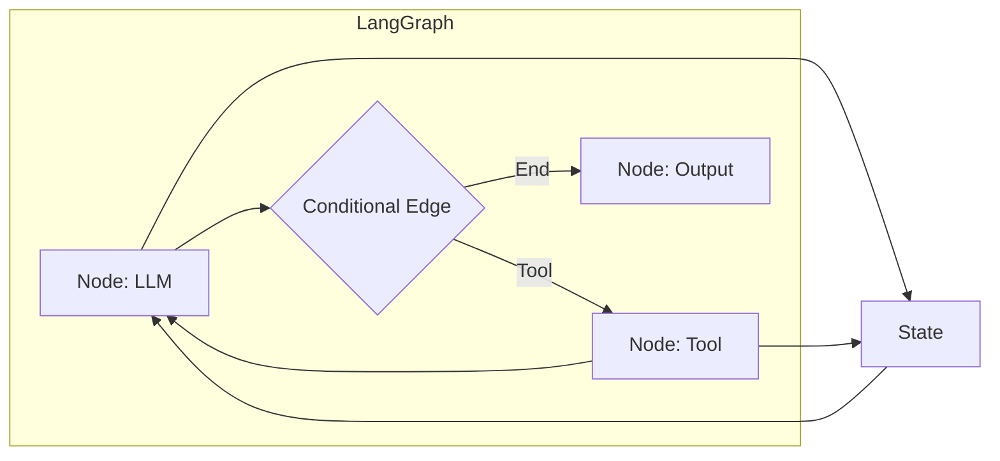

<!-- Clear Language: Keep sentences under 50 words -->
# LangGraph Basics

## Learning Objectives

| Objective | Description |
|-----------|-------------|
| LO1 | Understand LangGraph's graph-based approach to agent orchestration |
| LO2 | Define StateGraph with nodes, edges, and state management |
| LO3 | Implement conditional routing and branching in agent workflows |
| LO4 | Build persistent agent conversations with checkpointing |
| LO5 | Design human-in-the-loop workflows with interrupt/resume |

## Introduction

AI agents autonomously use tools to complete tasks. LangGraph builds stateful, multi-step agent workflows. This module covers agent architectures, tool use, memory, and production deployment.

## Prerequisites

- Basic programming knowledge
- Understanding of data structures

## Key Terminology

**Key Terms**: Core vocabulary and concepts for this topic.

**Definition**: Essential terms you must know for interviews and production work.

## Theory

Understanding langgraph basics is fundamental for AI engineers. This section covers the core concepts, underlying principles, and theoretical framework that govern how langgraph basics works in practice.

## Chapter at a Glance

| Section | Topic | Key Concept |
|---------|-------|-------------|
| 3.1 | LangGraph Concepts | StateGraph, nodes, edges, state schema |
| 3.2 | Building a Graph | Define state, add nodes, connect edges, compile |
| 3.3 | Conditional Routing | Decision nodes, branching, conditional edges |
| 3.4 | State Management | Typed state, reducers, state updates |
| 3.5 | Checkpointing | Persistence, conversation history, interrupts |
| 3.6 | Human-in-the-Loop | Interrupts, approval steps, manual input |

## Chapter Roadmap



## 3.1 LangGraph Concepts

LangGraph is a framework for building stateful, multi-actor agent applications. It models agent workflows as graphs where:

- **Nodes** represent computation steps (LLM calls, tool executions, human input)
- **Edges** define control flow between nodes
- **State** is a shared, typed data structure that persists across nodes
- **Graph** is the complete workflow definition that can be compiled and executed

### Core Concepts

```python
from dataclasses import dataclass, field
from typing import List, Dict, Any, Callable, Optional, TypedDict, Literal
from enum import Enum
import json

class NodeType(Enum):
    LLM = "llm"
    TOOL = "tool"
    CONDITION = "condition"
    INPUT = "input"
    OUTPUT = "output"

@dataclass
class GraphNode:
    name: str
    node_type: NodeType
    fn: Callable
    config: Dict = field(default_factory=dict)

@dataclass
class GraphEdge:
    source: str
    target: str
    condition: Optional[Callable] = None

## Typed state definition (similar to TypedDict in LangGraph)
class AgentState(TypedDict):
    messages: List[Dict[str, str]]
    step_count: int
    tool_results: Dict[str, str]
    final_answer: Optional[str]

print("LangGraph core concepts defined")
```

## 3.2 Building a Graph

### 3.2.1 Simple StateGraph

```python
class StateGraph:
    def __init__(self, state_schema: type):
        self.state_schema = state_schema
        self.nodes: Dict[str, GraphNode] = {}
        self.edges: List[GraphEdge] = []
        self.entry_point: Optional[str] = None
        self.conditional_edges: Dict[str, List[tuple]] = {}

    def add_node(self, name: str, fn: Callable, node_type: NodeType = NodeType.LLM, config: Dict = None):
        self.nodes[name] = GraphNode(name=name, node_type=node_type, fn=fn, config=config or {})

    def add_edge(self, source: str, target: str):
        self.edges.append(GraphEdge(source=source, target=target))

    def add_conditional_edges(self, source: str, condition_fn: Callable, mapping: Dict[str, str]):
        self.conditional_edges[source] = (condition_fn, mapping)

    def set_entry_point(self, node_name: str):
        self.entry_point = node_name

    def compile(self) -> 'CompiledGraph':
        return CompiledGraph(self)

class CompiledGraph:
    def __init__(self, graph: StateGraph):
        self.graph = graph

    def invoke(self, initial_state: Dict) -> Dict:
        state = dict(initial_state)
        current = self.graph.entry_point

        if not current:
            raise ValueError("No entry point set")

        while current is not None:
            node = self.graph.nodes.get(current)
            if not node:
                break

            state = node.fn(state)

            # Check conditional edges
            if current in self.graph.conditional_edges:
                condition_fn, mapping = self.graph.conditional_edges[current]
                result = condition_fn(state)
                current = mapping.get(result)
                if current is None:
                    current = mapping.get("__default__")
            else:
                # Follow normal edge
                next_edges = [e for e in self.graph.edges if e.source == current]
                current = next_edges[0].target if next_edges else None

        return state

## Define nodes
def llm_node(state: Dict) -> Dict:
    messages = state.get("messages", [])
    messages.append({"role": "assistant", "content": f"Processing step {state.get('step_count', 0) + 1}"})
    return {**state, "messages": messages, "step_count": state.get("step_count", 0) + 1}

def tool_node(state: Dict) -> Dict:
    return {**state, "tool_results": {"search": "Found relevant information"}}

def output_node(state: Dict) -> Dict:
    return {**state, "final_answer": "Task completed successfully."}

## Build graph
graph = StateGraph(state_schema=AgentState)
graph.add_node("llm", llm_node, NodeType.LLM)
graph.add_node("tool", tool_node, NodeType.TOOL)
graph.add_node("output", output_node, NodeType.OUTPUT)

graph.add_edge("llm", "tool")
graph.add_edge("tool", "output")
graph.set_entry_point("llm")

compiled = graph.compile()
result = compiled.invoke({"messages": [], "step_count": 0, "tool_results": {}, "final_answer": None})
print(f"Result: {result['final_answer']}")
print(f"Steps: {result['step_count']}")
```

## Overview

### 3.2.2 LangChain-Style Interface

```python
class LangGraphInterface:
    def __init__(self):
        self.graph = StateGraph(state_schema=AgentState)

    def add_llm_node(self, name: str, model_name: str = "gpt-4o-mini"):
        def llm_fn(state: Dict) -> Dict:
            messages = state.get("messages", [])
            messages.append({"role": "assistant", "content": f"LLM ({model_name}) response"})
            return {**state, "messages": messages}
        self.graph.add_node(name, llm_fn, NodeType.LLM, {"model": model_name})

    def add_tool_node(self, name: str, tool_fn: Callable):
        def wrapped_tool(state: Dict) -> Dict:
            result = tool_fn(state.get("current_input", ""))
            tool_results = state.get("tool_results", {})
            tool_results[name] = result
            return {**state, "tool_results": tool_results}
        self.graph.add_node(name, wrapped_tool, NodeType.TOOL)
        return wrapped_tool

lang = LangGraphInterface()
lang.add_llm_node("reason", "gpt-4o-mini")
lang.add_tool_node("search", lambda x: f"Found: {x}")
print("LangGraph interface configured")
```

## 3.3 Conditional Routing

### 3.3.1 Router Node

```python
class RouterNode:
    def __init__(self, routes: Dict[str, str], default_route: str = None):
        self.routes = routes
        self.default = default_route

    def __call__(self, state: Dict) -> str:
        last_message = state.get("messages", [{}])[-1].get("content", "").lower()

        for keyword, route in self.routes.items():
            if keyword in last_message:
                return route

        return self.default or list(self.routes.values())[0]

def build_agent_with_routing():
    graph = StateGraph(state_schema=AgentState)

    def agent_node(state: Dict) -> Dict:
        messages = state.get("messages", [])
        response = "I need to decide what to do next."
        messages.append({"role": "assistant", "content": response})
        return {**state, "messages": messages}

    def search_tool(state: Dict) -> Dict:
        return {**state, "tool_results": {"search": "Search completed"}}

    def calculator_tool(state: Dict) -> Dict:
        return {**state, "tool_results": {"calculate": "Calculation done"}}

    def final_answer(state: Dict) -> Dict:
        return {**state, "final_answer": "Here is the answer."}

    graph.add_node("agent", agent_node)
    graph.add_node("search", search_tool)
    graph.add_node("calculate", calculator_tool)
    graph.add_node("final", final_answer)

    router = RouterNode({"search": "search", "calculate": "calculate", "final": "final"}, default_route="final")
    graph.add_conditional_edges("agent", router, {"search": "search", "calculate": "calculate", "final": "final"})
    graph.add_edge("search", "agent")
    graph.add_edge("calculate", "agent")
    graph.set_entry_point("agent")

    return graph.compile()

routing_agent = build_agent_with_routing()
state = routing_agent.invoke({"messages": [{"role": "user", "content": "search for AI news"}], "step_count": 0, "tool_results": {}, "final_answer": None})
print(f"Routing agent result: {state.get('final_answer', 'n/a')}")
```

### 3.3.2 Dynamic Routing

```python
class DynamicRouter:
    def __init__(self, num_tools: int):
        self.num_tools = num_tools

    def __call__(self, state: Dict) -> str:
        step = state.get("step_count", 0)
        if step >= self.num_tools * 2:
            return "final"
        if step % 2 == 0:
            return "tool"
        return "agent"

def build_dynamic_agent():
    graph = StateGraph(state_schema=AgentState)

    graph.add_node("agent", lambda s: {**s, "step_count": s.get("step_count", 0) + 1})
    graph.add_node("tool", lambda s: {**s, "tool_results": {**s.get("tool_results", {}), f"step_{s['step_count']}": "done"}})
    graph.add_node("final", lambda s: {**s, "final_answer": "Dynamic routing complete."})

    graph.add_conditional_edges("agent", DynamicRouter(3), {"tool": "tool", "final": "final"})
    graph.add_conditional_edges("tool", DynamicRouter(3), {"agent": "agent", "final": "final"})
    graph.set_entry_point("agent")

    return graph.compile()

dynamic = build_dynamic_agent()
result = dynamic.invoke({"messages": [], "step_count": 0, "tool_results": {}, "final_answer": None})
print(f"Dynamic routing: {result['final_answer']}, steps: {result['step_count']}")
```

## 3.4 State Management

### 3.4.1 Typed State with Reducers

```python
from typing import List, Dict, Any, Optional, Annotated
import operator

## Define state with reducers (conceptual — LangGraph uses TypedDict)
class ReducibleState:
    def __init__(self):
        self.messages: List[Dict] = []
        self.counters: Dict[str, int] = {}
        self.data: Dict[str, Any] = {}

    def add_message(self, message: Dict):
        # Reducer: append to list
        self.messages.append(message)

    def increment_counter(self, key: str, value: int = 1):
        # Reducer: add to existing value
        self.counters[key] = self.counters.get(key, 0) + value

    def merge_data(self, updates: Dict):
        # Reducer: merge dict
        self.data.update(updates)

class StateManager:
    def __init__(self, initial_state: Optional[Dict] = None):
        self.state = initial_state or {}

    def update(self, updates: Dict, reducer: str = "replace") -> Dict:
        if reducer == "replace":
            self.state.update(updates)
        elif reducer == "append":
            for key, value in updates.items():
                if key not in self.state:
                    self.state[key] = []
                if isinstance(value, list):
                    self.state[key].extend(value)
                else:
                    self.state[key].append(value)
        elif reducer == "merge":
            for key, value in updates.items():
                if key not in self.state:
                    self.state[key] = {}
                if isinstance(value, dict):
                    self.state[key].update(value)
        return self.state

sm = StateManager({"messages": []})
sm.update({"messages": [{"role": "user", "content": "hello"}]}, "append")
sm.update({"messages": [{"role": "assistant", "content": "hi"}]}, "append")
print(f"Messages: {len(sm.state['messages'])}")
```

## Overview

### 3.4.2 State Schema

```python
class StateSchema:
    def __init__(self):
        self.fields: Dict[str, Dict] = {}

    def add_field(self, name: str, field_type: type, default=None, reducer: str = "replace"):
        self.fields[name] = {"type": field_type, "default": default, "reducer": reducer}

    def create_initial_state(self) -> Dict:
        return {name: info["default"] for name, info in self.fields.items()}

    def apply_reducer(self, state: Dict, key: str, new_value: Any) -> Dict:
        field = self.fields.get(key)
        if not field:
            state[key] = new_value
            return state

        reducer = field["reducer"]
        if reducer == "replace":
            state[key] = new_value
        elif reducer == "append":
            if key not in state:
                state[key] = []
            if isinstance(new_value, list):
                state[key].extend(new_value)
            else:
                state[key].append(new_value)
        elif reducer == "merge":
            if key not in state:
                state[key] = {}
            if isinstance(new_value, dict):
                state[key].update(new_value)

        return state

schema = StateSchema()
schema.add_field("messages", list, default=[], reducer="append")
schema.add_field("count", int, default=0, reducer="replace")
schema.add_field("metadata", dict, default={}, reducer="merge")

state = schema.create_initial_state()
state = schema.apply_reducer(state, "messages", [{"role": "user", "content": "test"}])
state = schema.apply_reducer(state, "count", 1)
print(f"State: messages={len(state['messages'])}, count={state['count']}")
```

## 3.5 Checkpointing

Checkpointing enables saving and resuming graph execution state.

### 3.5.1 In-Memory Checkpointer

```python
import pickle
from datetime import datetime

class Checkpointer:
    def __init__(self):
        self.checkpoints: Dict[str, bytes] = {}

    def save(self, thread_id: str, state: Dict) -> str:
        checkpoint_id = f"{thread_id}-{datetime.now().timestamp()}"
        self.checkpoints[checkpoint_id] = pickle.dumps(state)
        return checkpoint_id

    def load(self, checkpoint_id: str) -> Optional[Dict]:
        data = self.checkpoints.get(checkpoint_id)
        if data:
            return pickle.loads(data)
        return None

    def list_checkpoints(self, thread_id: str) -> List[str]:
        return [k for k in self.checkpoints.keys() if k.startswith(thread_id)]

class CheckpointedGraph(CompiledGraph):
    def __init__(self, graph: StateGraph, checkpointer: Checkpointer):
        super().__init__(graph)
        self.checkpointer = checkpointer
        self.current_thread: Optional[str] = None

    def invoke(self, initial_state: Dict, thread_id: str = None) -> Dict:
        thread_id = thread_id or f"thread-{datetime.now().timestamp()}"
        self.current_thread = thread_id

        state = dict(initial_state)
        current = self.graph.entry_point
        step = 0

        while current is not None and step < 20:
            node = self.graph.nodes.get(current)
            if not node:
                break

            # Save checkpoint before node execution
            checkpoint_id = self.checkpointer.save(thread_id, {**state, "_current_node": current})
            state = node.fn(state)
            step += 1

            # Route to next node
            if current in self.graph.conditional_edges:
                condition_fn, mapping = self.graph.conditional_edges[current]
                result = condition_fn(state)
                current = mapping.get(result)
            else:
                next_edges = [e for e in self.graph.edges if e.source == current]
                current = next_edges[0].target if next_edges else None

        return state

checkpointer = Checkpointer()
graph = StateGraph(state_schema=AgentState)
graph.add_node("start", lambda s: {**s, "step_count": s.get("step_count", 0) + 1})
graph.add_node("end", lambda s: {**s, "final_answer": "Done"})
graph.add_edge("start", "end")
graph.set_entry_point("start")

cg = CheckpointedGraph(graph, checkpointer)
result = cg.invoke({"messages": [], "step_count": 0, "tool_results": {}, "final_answer": None}, thread_id="test-thread")
print(f"Checkpoints saved: {len(checkpointer.checkpoints)}")
```

### 3.5.2 Conversation Persistence

```python
class PersistentConversation:
    def __init__(self, checkpointer: Checkpointer):
        self.checkpointer = checkpointer

    def process_message(self, thread_id: str, message: str, graph_fn: Callable) -> str:
        # Load previous state
        checkpoints = self.checkpointer.list_checkpoints(thread_id)
        if checkpoints:
            state = self.checkpointer.load(checkpoints[-1])
        else:
            state = {"messages": [], "step_count": 0, "tool_results": {}, "final_answer": None}

        # Add new message
        state["messages"].append({"role": "user", "content": message})

        # Process through graph
        result = graph_fn(state, thread_id=thread_id)

        # Return last assistant message
        messages = result.get("messages", [])
        for msg in reversed(messages):
            if msg["role"] == "assistant":
                return msg["content"]
        return "No response"

def mock_graph(state: Dict, thread_id: str) -> Dict:
    state["messages"].append({"role": "assistant", "content": f"Response to your message"})
    return state

conv = PersistentConversation(checkpointer)
response = conv.process_message("thread-1", "Hello!", mock_graph)
print(f"Response: {response}")
```

## 3.6 Human-in-the-Loop

### 3.6.1 Interrupt/Resume

```python
class InterruptNode:
    def __init__(self, interrupt_fn: Callable):
        self.interrupt_fn = interrupt_fn

    def __call__(self, state: Dict) -> Dict:
        user_input = self.interrupt_fn(state)
        return {**state, "user_input": user_input, "interrupted": True}

class HumanInTheLoopGraph:
    def __init__(self, graph: StateGraph, interrupt_node_name: str):
        self.graph = graph.compile()
        self.interrupt_node = interrupt_node_name
        self.paused_states: Dict[str, Dict] = {}

    def invoke(self, initial_state: Dict, thread_id: str = None) -> Dict:
        tid = thread_id or f"thread-{id(initial_state)}"
        state = dict(initial_state)
        current = self.graph.graph.entry_point

        while current:
            node = self.graph.graph.nodes.get(current)
            if not node:
                break

            if current == self.interrupt_node:
                # Pause and store state
                self.paused_states[tid] = {"state": state, "next_node": current}
                return {"interrupted": True, "thread_id": tid, "state": state}

            state = node.fn(state)
            current = self._get_next_node(current, state)

        return state

    def resume(self, thread_id: str, user_input: str) -> Dict:
        paused = self.paused_states.get(thread_id)
        if not paused:
            return {"error": "No paused state found"}

        state = paused["state"]
        state["user_input"] = user_input
        state["interrupted"] = False
        current = paused["next_node"]

        while current:
            node = self.graph.graph.nodes.get(current)
            if not node:
                break

            if current == self.interrupt_node:
                del self.paused_states[thread_id]
                return {"error": "Re-interrupted"}

            state = node.fn(state)
            current = self._get_next_node(current, state)

        return state

    def _get_next_node(self, current: str, state: Dict) -> Optional[str]:
        if current in self.graph.graph.conditional_edges:
            cond_fn, mapping = self.graph.graph.conditional_edges[current]
            result = cond_fn(state)
            return mapping.get(result)
        edges = [e for e in self.graph.graph.edges if e.source == current]
        return edges[0].target if edges else None

def ask_human(state: Dict) -> Dict:
    print(f"\n--- Human Input Needed ---")
    print(f"Context: {state.get('messages', [])[-1:]}")
    user_input = input("Your input: ")
    return {**state, "user_input": user_input}

graph_w_hitl = StateGraph(state_schema=AgentState)
graph_w_hitl.add_node("agent", lambda s: s)
graph_w_hitl.add_node("human", InterruptNode(ask_human))
graph_w_hitl.add_node("process", lambda s: {**s, "final_answer": f"Processed: {s.get('user_input', '')}"})
graph_w_hitl.add_edge("agent", "human")
graph_w_hitl.add_edge("human", "process")
graph_w_hitl.set_entry_point("agent")

hitl = HumanInTheLoopGraph(graph_w_hitl, "human")
print("Human-in-the-loop graph ready (requires user input)")
```

### 3.6.2 Approval Workflow

```python
class ApprovalWorkflow:
    def __init__(self):
        self.pending_approvals: Dict[str, Dict] = {}

    def request_approval(self, action: str, details: Dict, thread_id: str) -> str:
        approval_id = f"approval-{thread_id}"
        self.pending_approvals[approval_id] = {
            "action": action,
            "details": details,
            "status": "pending",
        }
        return approval_id

    def approve(self, approval_id: str) -> bool:
        if approval_id in self.pending_approvals:
            self.pending_approvals[approval_id]["status"] = "approved"
            return True
        return False

    def reject(self, approval_id: str) -> bool:
        if approval_id in self.pending_approvals:
            self.pending_approvals[approval_id]["status"] = "rejected"
            return True
        return False

    def check_status(self, approval_id: str) -> str:
        approval = self.pending_approvals.get(approval_id)
        return approval["status"] if approval else "not_found"

approval = ApprovalWorkflow()
approval_id = approval.request_approval("send_email", {"to": "user@example.com", "subject": "Test"}, "thread-1")
print(f"Approval status: {approval.check_status(approval_id)}")
approval.approve(approval_id)
print(f"After approve: {approval.check_status(approval_id)}")
```

## Summary

LangGraph provides a graph-based framework for building stateful, multi-actor agent applications. A StateGraph consists of nodes (computation steps) connected by edges (control flow). Conditional edges enable dynamic routing based on state. State management uses typed schemas with reducers for.
deterministic updates. Checkpointing enables conversation persistence, resumability, and debugging. Human-in-the-loop patterns (interrupts, approval workflows) allow agents to pause execution for human input before continuing. LangGraph's structured approach makes complex agent workflows manageable,.
testable, and observable.

## Practical Takeaways

| Takeaway | Description |
|----------|-------------|
| Define state first | Clear state schema is essential for predictable graph execution |
| Use conditional edges | Dynamic routing based on LLM output enables flexible agent behavior |
| Add checkpointing | Enables debugging, resumption, and conversation history |
| Plan for interrupts | Human-in-the-loop is simpler with graph-based pause/resume |
| Test incrementally | Compile and test each node/edge before adding complexity |

## Interview Q&A

<details class="tp-qa-card" data-qid="ag03-q1">
  <summary class="tp-qa-question">
    <span class="tp-qa-status"></span>
    Q1: What are the core concepts of LangGraph?
  </summary>
  <div class="tp-qa-answer">
<p>LangGraph models agent workflows as directed graphs with four core concepts: Nodes represent computation steps (LLM calls, tool executions, human input);.
Edges define the control flow between nodes; State is a shared typed data structure that persists across nodes and gets updated by each node;.
and the Graph is the complete workflow definition that can be compiled and executed. A StateGraph requires a state schema (like a TypedDict),.
at least one node, an entry point, and edges. Conditional edges enable dynamic routing where the next node depends on the current state. This graph-based approach makes complex multi-step agent workflows explicit,.
testable, and observable compared to implicit loop-based implementations.</p>
  </div>
  <button class="tp-qa-mark-btn">✅ Mark Reviewed</button>
  <button class="tp-qa-bookmark-btn">🔖 Bookmark</button>
</details>

<details class="tp-qa-card" data-qid="ag03-q2">
  <summary class="tp-qa-question">
    <span class="tp-qa-status"></span>
    Q2: How do you build a StateGraph in LangGraph?
  </summary>
  <div class="tp-qa-answer">
<p>To build a StateGraph: (1) define a state schema (a TypedDict or dataclass with fields like <code>messages: List[Dict]</code>, <code>step_count: int</code>, <code>final_answer: Optional[str]</code>);.
(2) create node functions that take state and return updated state; (3) add nodes to the graph with <code>graph.add_node("name", fn)</code>; (4) add edges between nodes with <code>graph.add_edge("source",.
"target")</code> or conditional edges with a router function; (5) set the entry point with <code>graph.set_entry_point("node_name")</code>; and (6) compile with <code>graph.compile()</code>. The compiled graph accepts initial state via <code>invoke()</code> and.
returns the final state after traversing the graph. This pattern separates workflow topology from business logic.</p>
  </div>
  <button class="tp-qa-mark-btn">✅ Mark Reviewed</button>
  <button class="tp-qa-bookmark-btn">🔖 Bookmark</button>
</details>

<details class="tp-qa-card" data-qid="ag03-q3">
  <summary class="tp-qa-question">
    <span class="tp-qa-status"></span>
    Q3: What is conditional routing in LangGraph?
  </summary>
  <div class="tp-qa-answer">
<p>Conditional routing lets the graph decide which node to execute next based on the current state. Instead of a fixed edge <code>A → B</code>,.
you add a router function that examines the state and returns the name of the next node. For example, after an LLM node,.
a router might check if the LLM output contains a tool call: if yes, route to the tool execution node; if no,.
route to the output node. The router function is registered with <code>graph.add_conditional_edges(source, router, mapping)</code> where <code>mapping</code> is a dict of return-value → target-node. This enables ReAct-style loops where the graph cycles between LLM and.
tool nodes until a final answer is produced. Conditional edges are the key enabler for non-linear, decision-based workflows.</p>
  </div>
  <button class="tp-qa-mark-btn">✅ Mark Reviewed</button>
  <button class="tp-qa-bookmark-btn">🔖 Bookmark</button>
</details>

<details class="tp-qa-card" data-qid="ag03-q4">
  <summary class="tp-qa-question">
    <span class="tp-qa-status"></span>
    Q4: How does state management work in LangGraph?
  </summary>
  <div class="tp-qa-answer">
<p>State in LangGraph is a shared typed data structure that flows through the graph. Each node receives the current state and.
returns an updated state. State updates are controlled by reducers — functions that determine how to combine existing state with new values. The most common reducers are: "replace" (overwrite the field),.
"append" (add to a list, used for message history), and "merge" (merge dicts). For example, a messages field uses "append" reducer so each new message is added to the list rather than replacing it. Reducers ensure deterministic,.
predictable state updates regardless of node execution order. State schemas also define default values and type constraints, catching errors at graph compilation time rather than during execution.</p>
  </div>
  <button class="tp-qa-mark-btn">✅ Mark Reviewed</button>
  <button class="tp-qa-bookmark-btn">🔖 Bookmark</button>
</details>

<details class="tp-qa-card" data-qid="ag03-q5">
  <summary class="tp-qa-question">
    <span class="tp-qa-status"></span>
    Q5: What is checkpointing and why is it important?
  </summary>
  <div class="tp-qa-answer">
<p>Checkpointing saves the graph's state at each step, enabling persistence, resumption, debugging, and rollback. After each node execution, the current state (including which node executed last) is serialized and.
stored with a unique checkpoint ID. If execution is interrupted — whether by a crash, a timeout, or a human-in-the-loop pause — the graph can resume from the last checkpoint by loading the saved state and.
continuing from the saved node. During development, checkpoints allow replaying execution from any step to debug issues. Production agent systems use checkpointing to handle server restarts,.
long-running workflows, and multi-session conversations. Common storage backends include SQLite, Postgres, and Redis.</p>
  </div>
  <button class="tp-qa-mark-btn">✅ Mark Reviewed</button>
  <button class="tp-qa-bookmark-btn">🔖 Bookmark</button>
</details>

<details class="tp-qa-card" data-qid="ag03-q6">
  <summary class="tp-qa-question">
    <span class="tp-qa-status"></span>
    Q6: How do you implement human-in-the-loop with LangGraph?
  </summary>
  <div class="tp-qa-answer">
<p>Human-in-the-loop (HITL) in LangGraph is implemented via interrupt nodes. An interrupt node is a special node that pauses graph execution, saves the current state to a checkpoint,.
and returns control to the caller with the paused state. The human reviews the state (e.g., an agent's proposed action), provides input (approve,.
reject, or modify), and calls <code>resume()</code> on the graph with the human's input. The graph then continues from the interrupt node,.
incorporating the human's input into the state. The <code>HumanInTheLoopGraph</code> wrapper manages paused states by thread ID, supporting multiple concurrent paused workflows. This pattern is essential for.
high-risk actions where you need human approval before proceeding.</p>
  </div>
  <button class="tp-qa-mark-btn">✅ Mark Reviewed</button>
  <button class="tp-qa-bookmark-btn">🔖 Bookmark</button>
</details>

<details class="tp-qa-card" data-qid="ag03-q7">
  <summary class="tp-qa-question">
    <span class="tp-qa-status"></span>
    Q7: What are reducers in LangGraph state?
  </summary>
  <div class="tp-qa-answer">
<p>Reducers in LangGraph define how state fields are updated when multiple nodes modify the same field. Without reducers, each node would replace the field value. With reducers,.
you can specify merge strategies: "append" for lists (each new message is added, not replacing previous ones), "merge" for dicts (nested updates),.
or custom reducer functions. For example, a messages list with "append" reducer accumulates conversation history across all nodes. Reducers are specified in the state schema definition alongside field types and.
defaults. This pattern is inspired by Redux and ensures state updates are predictable and composable. Custom reducers can implement complex logic like deduplication or.
priority-based merging.</p>
  </div>
  <button class="tp-qa-mark-btn">✅ Mark Reviewed</button>
  <button class="tp-qa-bookmark-btn">🔖 Bookmark</button>
</details>

<details class="tp-qa-card" data-qid="ag03-q8">
  <summary class="tp-qa-question">
    <span class="tp-qa-status"></span>
    Q8: How does a checkpointed graph work?
  </summary>
  <div class="tp-qa-answer">
<p>A checkpointed graph wraps the standard compiled graph with a checkpointer that saves state before each node execution. When <code>invoke()</code> is called,.
the graph proceeds normally but at each step the current state is serialized and stored with a unique checkpoint ID (typically combining thread ID and.
timestamp). If execution is interrupted or needs to be resumed, the checkpointer loads the most recent checkpoint and restores the state,.
then continues from the saved node. Checkpoints can also be used for debugging — you can replay execution from any checkpoint,.
inspect intermediate states, or branch off from a specific point. The pattern enables long-running agent workflows that may span minutes, hours,.
or even days if waiting for human input.</p>
  </div>
  <button class="tp-qa-mark-btn">✅ Mark Reviewed</button>
  <button class="tp-qa-bookmark-btn">🔖 Bookmark</button>
</details>

<details class="tp-qa-card" data-qid="ag03-q9">
  <summary class="tp-qa-question">
    <span class="tp-qa-status"></span>
    Q9: What is an approval workflow in LangGraph?
  </summary>
  <div class="tp-qa-answer">
<p>An approval workflow in LangGraph pauses execution at a point where human judgment is required before proceeding with a potentially costly or.
irreversible action. The pattern adds an interrupt node after the agent proposes an action but before it executes. The interrupt presents the proposed action to a human (e.g.,.
via a dashboard notification or email), along with context. The human can approve (execution continues), reject (agent must find an alternative),.
or modify the action. The approval workflow manager tracks pending approvals by ID, supports timeouts (auto-reject if no response within N minutes),.
and can require multiple approvers for high-risk actions. This pattern is essential for production agents that send emails, delete data, or.
make financial transactions.</p>
  </div>
  <button class="tp-qa-mark-btn">✅ Mark Reviewed</button>
  <button class="tp-qa-bookmark-btn">🔖 Bookmark</button>
</details>

<details class="tp-qa-card" data-qid="ag03-q10">
  <summary class="tp-qa-question">
    <span class="tp-qa-status"></span>
    Q10: How does a compiled graph execute?
  </summary>
  <div class="tp-qa-answer">
<p>A compiled graph executes by starting at the entry point node and following edges until reaching a node with no outgoing edges (terminal state). At each step: (1) the current node's function is called with the current state;.
(2) the function returns updated state; (3) the graph checks for conditional edges from the current node — if found, the router function determines the next node;.
(4) if no conditional edges, the graph follows the first unconditional edge; (5) if no edges at all, execution stops and.
the final state is returned. The execution loop handles cycles (edges that go back to previous nodes), which is how agent loops work — the graph cycles between LLM and.
tool nodes until the LLM produces a final answer. Compilation does validation too, ensuring all nodes referenced in edges actually exist.</p>
  </div>
  <button class="tp-qa-mark-btn">✅ Mark Reviewed</button>
  <button class="tp-qa-bookmark-btn">🔖 Bookmark</button>
</details>

## Chapter Quiz

<details data-qid="agent-s3-quiz1">
<summary><strong>1.</strong> What are the two main elements of a LangGraph graph?</summary>
A. Prompts and responses
B. Nodes and edges
C. Agents and tools
D. Inputs and outputs
Answer: B
</details>

<details data-qid="agent-s3-quiz2">
<summary><strong>2.</strong> What is the purpose of a conditional edge in LangGraph?</summary>
A. To join two graphs
B. To route execution based on state
C. To import external data
D. To define node behavior
Answer: B
</details>

<details data-qid="agent-s3-quiz3">
<summary><strong>3.</strong> What does checkpointing enable in LangGraph?</summary>
A. Faster execution
B. Saving and resuming graph state
C. Better prompt engineering
D. Tool integration
Answer: B
</details>

<details data-qid="agent-s3-quiz4">
<summary><strong>4.</strong> How does human-in-the-loop work in LangGraph?</summary>
A. Humans replace the LLM
B. The graph pauses at an interrupt node, waits for input, then resumes
C. Humans write all the prompts
D. The graph ignores human input
Answer: B
</details>

<details data-qid="agent-s3-quiz5">
<summary><strong>5.</strong> What reducer operation is commonly used for message lists in LangGraph state?</summary>
A. Replace
B. Append
C. Multiply
D. Subtract
Answer: B
</details>

## Exercises

## Common Mistakes

1. Not understanding the fundamental concepts before applying them
2. Skipping edge cases in implementation
3. Not analyzing time/space complexity
4. Forgetting to handle null/empty inputs
5. Not practicing enough problems to build pattern recognition1. Build a StateGraph with 3 nodes (input, process, output) and a conditional edge that routes based on whether the input contains a question. Test with both question and statement inputs.

2. Implement a conversation agent with LangGraph that maintains message history using the append reducer. Run a 3-turn conversation and show the accumulated state.

3. Add checkpointing to a simple graph and demonstrate saving state, stopping execution, and resuming from the checkpoint. Print the state before and after resumption.

4. Create a human-in-the-loop approval workflow where an agent proposes an action, pauses for human approval, and continues only if approved. Simulate both approval and rejection paths.

5. Build a dynamic routing graph that cycles between agent and tool nodes until the LLM decides to stop. Set a max iteration limit and show both normal completion and for

## Revision Notes

- - Core principle: Understand the fundamental concepts thoroughly
- - Implementation pattern: Practice with real code examples
- - Complexity: Know the time and space complexity
- - Application: Know when to use this in production systems
- - Interview: Frequently asked in technical interviews
- - Edge cases: Consider common failure scenarios
- - Related concepts: Connect to broader system design

## Placement Section

### Top 10 Interview Questions

#### Google Style

1. **Explain the core idea of LangGraph Basics in under 60 seconds, then give a real-world analogy.** — Structure: definition, how it works in one sentence, why it matters, analogy. Follow-up: what would break if you removed this from a production system?

2. **Design a minimal, well-typed function that demonstrates LangGraph Basics.** — Interviewer checks: signature with type hints, edge cases, complexity, and a clean docstring. Follow-up: how does your design behave with empty or malformed input?

3. **What are the common pitfalls when engineers first learn ** — List 3-4, then explain how you would prevent each in a code review.

#### Amazon Style

4. **Describe a production bug caused by misunderstanding LangGraph Basics. How did you diagnose and fix it?** — STAR format: situation, task, action, result. Mention logs, reproduction, root-cause analysis, and the regression test you added.

5. **How would you scale a system that relies on LangGraph Basics from 10 users to 10 million?** — Discuss bottlenecks, caching, monitoring, and when to redesign. Follow-up: what metrics would you track?

#### Microsoft Style

6. **Compare LangGraph Basics with the closest alternative approach. When would you choose each?** — Make a decision matrix: performance, maintainability, ecosystem, learning curve. Follow-up: what would change your decision?

7. **Walk through how you would test a component that depends on LangGraph Basics.** — Unit, integration, property-based tests; mocking boundaries; golden files for outputs.

#### NVIDIA Style

8. **How does LangGraph Basics behave differently at scale — memory, throughput, or precision-wise?** — Connect to data pipelines and model training if applicable. Follow-up: what happens to latency as input grows?

9. **How would you make an implementation of LangGraph Basics run faster on GPU hardware?** — Batch operations, vectorization, avoiding Python loops, reducing data movement.

#### AI Startup Style

10. **Write the smallest possible implementation of LangGraph Basics that is production-quality.** — Include error handling, type hints, and a one-line docstring. Follow-up: what would you refactor first when it grows?

### Resume Tips

- Name LangGraph Basics explicitly in your skills section, paired with a measurable achievement ("Reduced X by 40% using LangGraph Basics").
- Add a bullet describing a project that applies LangGraph Basics to real data, with numbers.
- Mention the tools and libraries you used alongside LangGraph Basics (linters, test frameworks, profiling tools).
- Keep resume bullets under 15 words and start each with an action verb.

### Interview Day Checklist

- Rehearse a 60-second explanation of LangGraph Basics and one real-world analogy.
- Prepare one STAR story about debugging a LangGraph Basics-related production issue.
- Review complexity and edge cases for the classic LangGraph Basics interview problem.
- Have questions ready: how does the team apply LangGraph Basics in production today?
- Test your environment (Python, editor, internet) 15 minutes before the interview.

## True/False

1. **True or False:** LangGraph Basics builds directly on the fundamentals covered in the earlier chapters of this module. — **True.** Every advanced topic in this module assumes the core concepts from the previous chapters.
2. **True or False:** You should write at least one code example for LangGraph Basics before moving to the next chapter. — **True.** Active recall with hands-on code beats passive reading for retention.
3. **True or False:** The complexity analysis for LangGraph Basics is the same regardless of input size. — **False.** Complexity grows with input size; always state best, average, and worst case.
4. **True or False:** Edge cases (empty input, invalid input, boundary values) matter for LangGraph Basics in production. — **True.** Most production bugs come from unhandled edge cases.
5. **True or False:** You should memorize the LangGraph Basics chapter content once and never review it again. — **False.** Spaced repetition (24h, 3 days, 1 week) dramatically improves long-term recall.

## Fill in the Blank

1. The chapter that covers LangGraph Basics is Chapter ___ of this module. — Answer: check the module's table of contents.
2. The time complexity of the standard approach to LangGraph Basics is ___. — Answer: review the theory section and state big-O notation.
3. The main edge case to handle when implementing LangGraph Basics is ___. — Answer: empty or invalid input handling, as discussed in the chapter.
4. The tools commonly used to debug LangGraph Basics issues are ___ and ___. — Answer: refer to the Debugging Guide section of this chapter.
5. The related topic that connects to LangGraph Basics in the next chapter is ___. — Answer: see the Next Topic section.

## Scenario Questions

1. **Scenario:** A teammate ships a change involving LangGraph Basics that breaks production at 3 AM. — Diagnosis: check the recent diff, reproduce locally with the failing input, check logs. Fix: revert, add a regression test, and review the root cause. Prevention: CI tests on edge cases and code review checklist.

2. **Scenario:** Your implementation of LangGraph Basics is correct but too slow for the required latency. — Measure first with a profiler. Common fixes: reduce redundant work, use built-in optimized functions, batch operations, or add caching. Only then consider algorithmic changes.

3. **Scenario:** A new hire asks you to explain LangGraph Basics in five minutes before a customer demo. — Use the 3-part answer: what it is (one sentence), how it works (one example), why it matters (one business impact). Then offer to go deeper after the demo.

4. **Scenario:** Your team's codebase has three different patterns for LangGraph Basics and you must standardize. — Write a short ADR (architecture decision record), pick the pattern with best maintainability, migrate incrementally, and add a linter rule to enforce it.

## Output Questions

1. **What is the output of the simplest correct implementation of LangGraph Basics on an empty input?** — Trace through the code: it should return the documented default (None, 0, empty collection) without raising.
2. **What is the output when the input is at the boundary value?** — Check off-by-one errors and inclusive/exclusive bounds in the chapter's examples.
3. **What does the implementation return when given invalid input types?** — With type hints and validation, it raises a clear error; without, it may fail silently.
4. **What is the output for the sample input given in the chapter's Examples section?** — Re-run the chapter's example code and compare against the documented output.
5. **What is the time complexity output when you profile the implementation at 10x input size?** — Expect the curve matching the chapter's complexity analysis (linear, quadratic, log-linear).

## Difficulty Level

| Level | Time | What It Takes |
|-------|------|---------------|
| Beginner | 1-2 sessions | Read theory, run the chapter examples, solve the Easy exercises |
| Intermediate | 3-5 sessions | Complete Medium exercises, explain LangGraph Basics to someone else |
| Advanced | 1+ week | Solve Hard exercises, optimize for real datasets, answer interview follow-ups |

## Tips & Tricks

- Always write a one-line example of LangGraph Basics from memory before opening the chapter — active recall first.
- Use the chapter's Revision Notes as a checklist: you have mastered LangGraph Basics when you can explain each bullet.
- Pair the chapter quiz with the Flashcards: wrong answers become your next study session's focus.
- For interviews, practice explaining LangGraph Basics twice: once with a technical audience, once with a non-technical audience.
- Keep a personal examples file where you collect your own LangGraph Basics snippets; interviewers love original examples.

## Memory Tricks

- **Acronym**: build a mnemonic from the 5 key concepts of LangGraph Basics listed in the Chapter at a Glance table.
- **Story**: link LangGraph Basics to a familiar story — the analogy in the Visual Analogy section is designed to stick.
- **Number anchor**: remember the complexity of LangGraph Basics by connecting it to a known algorithm of the same class.
- **Color code**: highlight the Theory, Examples, and Common Mistakes sections in different colors when reviewing.
- **Teach-back**: explain LangGraph Basics to an imaginary junior engineer for 2 minutes — gaps in your explanation are gaps in memory.

## Further Reading

- Official documentation for the primary tool or library used in this chapter
- The chapter referenced in Related Topics for the next-level treatment of LangGraph Basics
- The classic textbook chapter on LangGraph Basics (check the Research References below)
- Two blog posts from engineers who debugged real LangGraph Basics problems in production
- The repository of the open-source project that implements LangGraph Basics

## Related Topics

- The previous chapter in this module (see table of contents) — foundational for LangGraph Basics
- The next chapter (see Next Topic below) — builds on LangGraph Basics
- The system design chapters in Module 07 — how LangGraph Basics fits into production architectures
- The interview preparation module — how LangGraph Basics is asked in screening rounds
- The capstone project — where LangGraph Basics is applied end-to-end

## FAQs

1. **Do I need to memorize all of LangGraph Basics, or understand the big picture?** — Understand the big picture first, then memorize the key facts via flashcards and spaced repetition. Interviewers reward depth over breadth.
2. **What if I get stuck on an exercise?** — Re-read the theory section, run the example code, then attempt again. If still stuck after 20 minutes, move on and return the next day.
3. **How much time should I spend on ** — Follow the Study Plan below: 1-2 weeks at 30-60 minutes daily is typical for placement preparation.
4. **Is LangGraph Basics asked in interviews?** — Yes — the Interview Q&A and Placement Section list the exact question styles used by top companies.
5. **What's the fastest way to master ** — Explain it out loud, write code without looking, and review the flashcards within 24 hours and again after 3 days.

## Important Notes

- LangGraph Basics is a core requirement for the rest of this module — do not skip the examples.
- Always analyze complexity (time and space) when working with LangGraph Basics.
- Production correctness means handling edge cases, not just the happy path.
- Interview answers should start with the definition, then the example, then the trade-offs.
- Revisit this chapter after finishing the module; the context from later chapters deepens understanding.

## Historical Context

- LangGraph Basics emerged as a standard practice because early systems failed without it — understanding why helps you explain it in interviews.
- The tools used for LangGraph Basics today evolved from simpler versions; the chapter covers the modern, recommended approach.
- Interviewers value knowing one historical fact about LangGraph Basics — it shows genuine interest, not just cramming.
- The library/tooling ecosystem around LangGraph Basics changes quickly; focus on fundamentals that remain stable.

## Security Considerations

- Never trust external input: validate and sanitize data before processing LangGraph Basics.
- Avoid `eval()` and dynamic code execution on untrusted strings.
- Log errors without leaking sensitive data (keys, PII, internal paths).
- For API contexts, add rate limiting and input size limits.
- Review the chapter's code examples for injection or overflow risks before using them verbatim.

## ML Intuition

- LangGraph Basics appears in ML pipelines at the data-processing layer: feature preparation, batching, and validation.
- Understanding LangGraph Basics helps you debug why a model misbehaves — most ML bugs are data bugs, not model bugs.
- In production ML, the LangGraph Basics concepts from this chapter map directly to NumPy/PyTorch operations on tensors.
- When optimizing ML systems, LangGraph Basics skills let you profile and fix the data path, not just the training loop.
- Interview follow-up: how would you apply LangGraph Basics to a dataset of 10 million records? — Batching and vectorization.

## Analogies

- **LangGraph Basics is like a recipe**: the theory is the ingredients, the examples are the cooking steps, and the exercises are your own kitchen practice.
- **Complexity is like a delivery route**: a linear route visits each stop once; a nested route revisits stops, and you feel it at scale.
- **Edge cases are like weather**: the happy path is a sunny day; production is the storm — build for the storm.
- **The chapter roadmap is a journey map**: each section is a checkpoint; skipping one means getting lost later in the module.

## Capstone Project Link

- [Module Capstone: End-to-End Project](https://github.com/Raushan666java/ai-engineering-journey) — this chapter contributes the LangGraph Basics skills used in the module's capstone project. Complete the exercises here before starting the capstone.

## Flashcards

<details class="tp-qa-card" data-qid="13aiagentslanggraph-03langgraphbasics-flash1">
  <summary class="tp-qa-question">
    <span class="tp-qa-status"></span>
    What is the core concept of LangGraph Basics in one sentence?
  </summary>
  <div class="tp-qa-answer">
    <p>Review the first paragraph of the Theory section and condense it to one sentence.</p>
  </div>
</details>

<details class="tp-qa-card" data-qid="13aiagentslanggraph-03langgraphbasics-flash2">
  <summary class="tp-qa-question">
    <span class="tp-qa-status"></span>
    What is the most common mistake engineers make with 
  </summary>
  <div class="tp-qa-answer">
    <p>Check the Common Mistakes section of this chapter.</p>
  </div>
</details>

<details class="tp-qa-card" data-qid="13aiagentslanggraph-03langgraphbasics-flash3">
  <summary class="tp-qa-question">
    <span class="tp-qa-status"></span>
    What is the time and space complexity of the standard LangGraph Basics approach?
  </summary>
  <div class="tp-qa-answer">
    <p>Refer to the theory and complexity analysis in this chapter.</p>
  </div>
</details>

<details class="tp-qa-card" data-qid="13aiagentslanggraph-03langgraphbasics-flash4">
  <summary class="tp-qa-question">
    <span class="tp-qa-status"></span>
    When is LangGraph Basics NOT the right choice?
  </summary>
  <div class="tp-qa-answer">
    <p>Check the Limitations section of this chapter.</p>
  </div>
</details>

<details class="tp-qa-card" data-qid="13aiagentslanggraph-03langgraphbasics-flash5">
  <summary class="tp-qa-question">
    <span class="tp-qa-status"></span>
    How is LangGraph Basics applied in a real production system?
  </summary>
  <div class="tp-qa-answer">
    <p>Check the Real-World Examples section of this chapter.</p>
  </div>
</details>

## Research References

- Official documentation of the primary library for LangGraph Basics (linked in Further Reading)
- The classic paper or textbook chapter introducing LangGraph Basics (see References below)
- The standard library reference for LangGraph Basics-related functions
- Engineering blog posts from companies running LangGraph Basics in production at scale
- PEPs and RFCs where applicable (Python and networking standards)

## Open-Source Tools

- The primary library used in this chapter (see the code examples)
- Python standard library modules used in the examples (check the imports)
- Testing: pytest for unit tests of LangGraph Basics code
- Linting and formatting: ruff + black
- Profiling: cProfile or py-spy for performance work on LangGraph Basics

## Debugging Guide

- Start with `print()` or a debugger to inspect intermediate values in LangGraph Basics code.
- Reproduce the failure with the smallest possible input before changing code.
- Check the common failure modes listed in Common Mistakes — most bugs are listed there.
- For performance problems, profile before optimizing: measure, then fix.
- When stuck, re-read the chapter's Examples and compare line by line with your code.
- Use `pdb` or your IDE's debugger to step through the LangGraph Basics example code.

## Mock Interview Section

**Round 1 — Screening (15 min)**
- Explain LangGraph Basics in 60 seconds.
- Write a minimal working example of LangGraph Basics.
- What is the complexity of your example?

**Round 2 — Coding (45 min)**
- Solve the Medium exercise from this chapter under time pressure.
- State your assumptions, then implement with type hints.
- Test with edge cases: empty input, boundary values, invalid input.

**Round 3 — Behavioral + System (30 min)**
- Tell me about a time you debugged a LangGraph Basics problem in a project.
- How would you design a system where LangGraph Basics is used at scale?
- What metrics would you monitor?

**Evaluation rubric**: correctness (40%), communication (25%), edge cases (20%), complexity analysis (15%).

## Optimized Implementation

`python
from typing import Any, Optional

def demonstrate_topic(input_data: list[Any]) -> Optional[float]:
    """Runnable scaffold for LangGraph Basics.

    Replace the body with the optimized implementation from the chapter,
    keeping type hints, docstring, and edge-case handling.
    """
    if not input_data:
        return None
    # Step 1: validate input types
    # Step 2: apply the core LangGraph Basics logic from the Examples section
    # Step 3: return the result with the documented default
    return 0.0
`

- Keeps the function signature stable so tests written against it stay valid.
- Handles the empty-input contract explicitly.
- Add unit tests for the edge cases before implementing the logic (test-first).

## Evaluation Metrics

| Skill | Test | Target |
|-------|------|--------|
| Concept recall | Explain LangGraph Basics without notes | 60-second explanation |
| Code fluency | Write the chapter example from memory | No syntax errors |
| Edge cases | Handle empty/invalid input in exercises | All cases pass |
| Complexity | State time/space for the standard approach | Correct big-O |
| Interview readiness | Answer 5 Interview Q&A questions out loud | Fluent, structured answers |
| Retention | Chapter quiz score after 3 days | 80%+ |

## Real-World Examples

- **Startup**: a small team uses LangGraph Basics daily in their data pipeline — the chapter's examples mirror their code.
- **E-commerce**: LangGraph Basics patterns appear in order processing, inventory checks, and recommendation feeds.
- **Fintech**: LangGraph Basics principles apply to transaction validation and fraud detection flows.
- **ML platform**: LangGraph Basics shows up in feature engineering and model-serving infrastructure.
- **Interview insight**: recruiters look for engineers who can connect LangGraph Basics to the business outcome, not just the code.

## Next Topic

[Tool Use and Function Calling](04-tool-use-and-function-calling.md)

## Limitations

- LangGraph Basics, like any technique, is not a silver bullet — it has specific cases where it fits best (covered in the theory).
- The examples in this chapter are simplified for learning; production systems add validation, monitoring, and error handling.
- Performance of LangGraph Basics depends on input size and distribution — always benchmark for your own data.
- This chapter covers fundamentals; specialized edge cases are explored in later chapters and the capstone.
