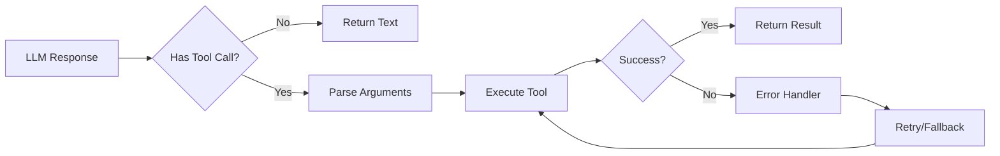

<!-- Clear Language: Keep sentences under 50 words -->
# Tool Use and Function Calling

## Learning Objectives

| Objective | Description |
|-----------|-------------|
| LO1 | Understand function calling APIs from OpenAI, Anthropic, and open-source models |
| LO2 | Design tool schemas with typed parameters and descriptions |
| LO3 | Implement tool execution with error handling and retry logic |
| LO4 | Build dynamic tool registries with automatic discovery |
| LO5 | Manage tool selection and parallel tool execution |

## Introduction

AI agents autonomously use tools to complete tasks. LangGraph builds stateful, multi-step agent workflows. This module covers agent architectures, tool use, memory, and production deployment.

## Prerequisites

- Basic programming knowledge
- Understanding of data structures

## Key Terminology

**Key Terms**: Core vocabulary and concepts for this topic.

**Definition**: Essential terms you must know for interviews and production work.

## Theory

Understanding tool use and function calling is fundamental for AI engineers. This section covers the core concepts, underlying principles, and theoretical framework that govern how tool use and function calling works in practice.

## Chapter at a Glance

| Section | Topic | Key Concept |
|---------|-------|-------------|
| 4.1 | Function Calling API | OpenAI, Anthropic, and open-source conventions |
| 4.2 | Tool Schema Design | JSON Schema for parameters, descriptions, types |
| 4.3 | Tool Execution | Argument parsing, execution, error handling |
| 4.4 | Tool Registry | Dynamic registration, discovery, versioning |
| 4.5 | Tool Selection | LLM chooses tools, constrained selection |
| 4.6 | Parallel Tools | Executing multiple tools simultaneously |

## Chapter Roadmap



## 4.1 Function Calling API

### 4.1.1 OpenAI Function Calling

OpenAI's API allows defining tools as JSON Schema objects. The model can request tool calls in its response.

```python
from typing import List, Dict, Callable, Any, Optional
import json

class OpenAITool:
    def __init__(self, name: str, description: str, parameters: Dict, fn: Callable):
        self.name = name
        self.description = description
        self.parameters = parameters
        self.fn = fn

    def to_openai_schema(self) -> Dict:
        return {
            "type": "function",
            "function": {
                "name": self.name,
                "description": self.description,
                "parameters": {
                    "type": "object",
                    "properties": self.parameters,
                    "required": [k for k, v in self.parameters.items() if v.get("required", False)],
                },
            },
        }

    def execute(self, arguments: Dict) -> str:
        try:
            result = self.fn(**arguments)
            return str(result)
        except Exception as e:
            return f"Error executing {self.name}: {e}"

## Example tool definitions
search_tool_schema = OpenAITool(
    name="web_search",
    description="Search the web for information",
    parameters={
        "query": {"type": "string", "description": "The search query", "required": True},
        "num_results": {"type": "integer", "description": "Number of results", "default": 5},
    },
    fn=lambda query, num_results=5: f"Search results for '{query}' (top {num_results})",
)

calculator_schema = OpenAITool(
    name="calculator",
    description="Evaluate mathematical expressions",
    parameters={
        "expression": {"type": "string", "description": "Math expression to evaluate", "required": True},
    },
    fn=lambda expression: str(eval(expression)),
)

print(search_tool_schema.to_openai_schema())
```

## Overview

### 4.1.2 OpenAI Function Calling Flow

```python
class OpenAIFunctionCallingAgent:
    def __init__(self, model: str, tools: List[OpenAITool], client=None):
        self.model = model
        self.tools = {t.name: t for t in tools}
        self.tool_schemas = [t.to_openai_schema() for t in tools]
        self.client = client

    def invoke(self, messages: List[Dict]) -> str:
        response = self._call_llm(messages)

        if response.get("tool_calls"):
            for tool_call in response["tool_calls"]:
                tool_name = tool_call["function"]["name"]
                arguments = json.loads(tool_call["function"]["arguments"])
                tool = self.tools.get(tool_name)

                if tool:
                    result = tool.execute(arguments)
                    messages.append({"role": "tool", "tool_call_id": tool_call["id"], "content": result})

            # Get final response after tool execution
            final = self._call_llm(messages)
            return final.get("content", "")

        return response.get("content", "")

    def _call_llm(self, messages: List[Dict]) -> Dict:
        # Mock LLM response for demonstration
        import random
        if random.random() < 0.5:
            return {
                "tool_calls": [{
                    "id": "call_1",
                    "function": {"name": "web_search", "arguments": '{"query": "AI news"}'},
                }]
            }
        return {"content": "Final answer based on tool results."}

agent = OpenAIFunctionCallingAgent("gpt-4o-mini", [search_tool_schema, calculator_schema])
result = agent.invoke([{"role": "user", "content": "Search for AI news and calculate 2+2"}])
print(f"Agent result: {result[:100]}")
```

### 4.1.3 Anthropic Tool Use

```python
class AnthropicToolFormat:
    @staticmethod
    def to_anthropic_schema(tool: OpenAITool) -> Dict:
        return {
            "name": tool.name,
            "description": tool.description,
            "input_schema": {
                "type": "object",
                "properties": tool.parameters,
                "required": [k for k, v in tool.parameters.items() if v.get("required", False)],
            },
        }

    @staticmethod
    def parse_tool_use(response: Dict) -> List[Dict]:
        tool_calls = []
        for content in response.get("content", []):
            if content.get("type") == "tool_use":
                tool_calls.append({
                    "id": content["id"],
                    "name": content["name"],
                    "input": content["input"],
                })
        return tool_calls

anthropic_tool = AnthropicToolFormat.to_anthropic_schema(search_tool_schema)
print(f"Anthropic schema: {anthropic_tool}")
```

## 4.2 Tool Schema Design

### 4.2.1 JSON Schema Builder

```python
class JSONSchemaBuilder:
    def __init__(self):
        self.properties = {}
        self.required = []

    def add_string(self, name: str, description: str, required: bool = False, enum: List[str] = None):
        prop = {"type": "string", "description": description}
        if enum:
            prop["enum"] = enum
        self.properties[name] = prop
        if required:
            self.required.append(name)
        return self

    def add_integer(self, name: str, description: str, required: bool = False, minimum: int = None, maximum: int = None):
        prop = {"type": "integer", "description": description}
        if minimum is not None:
            prop["minimum"] = minimum
        if maximum is not None:
            prop["maximum"] = maximum
        self.properties[name] = prop
        if required:
            self.required.append(name)
        return self

    def add_number(self, name: str, description: str, required: bool = False):
        self.properties[name] = {"type": "number", "description": description}
        if required:
            self.required.append(name)
        return self

    def add_boolean(self, name: str, description: str, required: bool = False):
        self.properties[name] = {"type": "boolean", "description": description}
        if required:
            self.required.append(name)
        return self

    def add_array(self, name: str, description: str, items_type: str, required: bool = False):
        self.properties[name] = {"type": "array", "items": {"type": items_type}, "description": description}
        if required:
            self.required.append(name)
        return self

    def add_object(self, name: str, description: str, properties: Dict, required: bool = False):
        self.properties[name] = {"type": "object", "properties": properties, "description": description}
        if required:
            self.required.append(name)
        return self

    def build(self) -> Dict:
        return {"type": "object", "properties": self.properties, "required": self.required}

schema_builder = JSONSchemaBuilder()
schema = (schema_builder
    .add_string("query", "Search query", required=True)
    .add_integer("limit", "Max results", minimum=1, maximum=100)
    .add_string("sort", "Sort order", enum=["relevance", "date"])
    .add_boolean("include_summaries", "Include document summaries")
    .build())
print(json.dumps(schema, indent=2))
```

### 4.2.2 Type-Safe Tool Definition

```python
from dataclasses import dataclass, field
from typing import get_type_hints, get_origin, get_args

@dataclass
class TypeSafeTool:
    name: str
    description: str
    fn: Callable

    def generate_schema(self) -> Dict:
        hints = get_type_hints(self.fn)
        import inspect
        sig = inspect.signature(self.fn)
        properties = {}
        required = []

        for param_name, param in sig.parameters.items():
            param_type = hints.get(param_name, str)
            properties[param_name] = self._type_to_schema(param_type, param_name)

            if param.default is inspect.Parameter.empty:
                required.append(param_name)

        return {
            "type": "object",
            "properties": properties,
            "required": required,
        }

    def _type_to_schema(self, typ, name: str) -> Dict:
        origin = get_origin(typ)
        if origin is list:
            args = get_args(typ)
            return {"type": "array", "items": {"type": self._primitive_type(args[0])}}
        elif origin is dict:
            return {"type": "object"}
        elif origin is Optional:
            args = get_args(typ)
            return {"type": self._primitive_type(args[0]) if args else "string"}
        else:
            return {"type": self._primitive_type(typ)}

    def _primitive_type(self, typ) -> str:
        if typ == str:
            return "string"
        elif typ == int:
            return "integer"
        elif typ == float:
            return "number"
        elif typ == bool:
            return "boolean"
        return "string"

    def execute(self, **kwargs) -> str:
        return str(self.fn(**kwargs))

@TypeSafeTool
def search_database(query: str, limit: int = 10, include_metadata: bool = False) -> str:
    """Search the database for matching records."""
    return f"Found {limit} results for '{query}' (metadata={include_metadata})"

print(f"Generated schema: {json.dumps(search_database.generate_schema(), indent=2)}")
```

## 4.3 Tool Execution

### 4.3.1 Argument Validation

```python
class ArgumentValidator:
    def __init__(self, schema: Dict):
        self.schema = schema

    def validate(self, arguments: Dict) -> List[str]:
        errors = []
        required = self.schema.get("required", [])
        properties = self.schema.get("properties", {})

        for field in required:
            if field not in arguments:
                errors.append(f"Missing required field: {field}")

        for field, value in arguments.items():
            prop = properties.get(field)
            if not prop:
                errors.append(f"Unknown field: {field}")
                continue

            expected_type = prop.get("type")
            if expected_type == "string" and not isinstance(value, str):
                errors.append(f"{field}: expected string, got {type(value).__name__}")
            elif expected_type == "integer" and not isinstance(value, int):
                errors.append(f"{field}: expected integer, got {type(value).__name__}")
            elif expected_type == "number" and not isinstance(value, (int, float)):
                errors.append(f"{field}: expected number, got {type(value).__name__}")

            if "enum" in prop and value not in prop["enum"]:
                errors.append(f"{field}: must be one of {prop['enum']}")

        return errors

validator = ArgumentValidator(schema)
print(validator.validate({"query": "AI", "limit": 5}))  # Valid
print(validator.validate({"query": 123}))  # Invalid
```

### 4.3.2 Execution with Retry

```python
import time
from functools import wraps

class ToolExecutor:
    def __init__(self, max_retries: int = 3, retry_delay: float = 1.0):
        self.max_retries = max_retries
        self.retry_delay = retry_delay

    def execute(self, tool: OpenAITool, arguments: Dict) -> str:
        last_error = None

        for attempt in range(self.max_retries):
            try:
                result = tool.execute(arguments)
                return result
            except Exception as e:
                last_error = str(e)
                if attempt < self.max_retries - 1:
                    time.sleep(self.retry_delay * (attempt + 1))

        return f"Failed after {self.max_retries} attempts: {last_error}"

    def execute_with_timeout(self, tool: OpenAITool, arguments: Dict, timeout: float = 5.0) -> str:
        import threading

        result = [None]
        error = [None]

        def target():
            try:
                result[0] = tool.execute(arguments)
            except Exception as e:
                error[0] = str(e)

        thread = threading.Thread(target=target)
        thread.start()
        thread.join(timeout)

        if thread.is_alive():
            return "Tool execution timed out"

        if error[0]:
            return f"Error: {error[0]}"

        return result[0]

executor = ToolExecutor(max_retries=3)
result = executor.execute(search_tool_schema, {"query": "AI", "num_results": 5})
print(f"Execution result: {result}")
```

### 4.3.3 Error Recovery

```python
class ToolErrorHandler:
    def __init__(self):
        self.recovery_strategies = {}

    def register_strategy(self, error_type: type, strategy_fn: Callable):
        self.recovery_strategies[error_type] = strategy_fn

    def handle(self, tool_name: str, error: Exception, arguments: Dict) -> str:
        for error_type, strategy in self.recovery_strategies.items():
            if isinstance(error, error_type):
                return strategy(tool_name, arguments)
        return f"Tool {tool_name} failed: {error}"

def handle_timeout(tool_name: str, arguments: Dict) -> str:
    return f"{tool_name} timed out. Try with smaller input."

def handle_validation(tool_name: str, arguments: Dict) -> str:
    return f"Invalid arguments for {tool_name}: {arguments}"

handler = ToolErrorHandler()
handler.register_strategy(TimeoutError, handle_timeout)
handler.register_strategy(ValueError, handle_validation)
print(handler.handle("search", ValueError("bad input"), {"query": "test"}))
```

## 4.4 Tool Registry

### 4.4.1 Dynamic Registry

```python
class DynamicToolRegistry:
    def __init__(self):
        self.tools: Dict[str, OpenAITool] = {}
        self.categories: Dict[str, List[str]] = defaultdict(list)

    def register(self, tool: OpenAITool, category: str = "general"):
        self.tools[tool.name] = tool
        self.categories[category].append(tool.name)

    def unregister(self, name: str):
        if name in self.tools:
            del self.tools[name]
            for cat in self.categories.values():
                if name in cat:
                    cat.remove(name)

    def get_by_category(self, category: str) -> List[OpenAITool]:
        return [self.tools[name] for name in self.categories.get(category, [])]

    def get_openai_schemas(self) -> List[Dict]:
        return [t.to_openai_schema() for t in self.tools.values()]

    def search_tools(self, query: str) -> List[OpenAITool]:
        query_lower = query.lower()
        return [
            t for t in self.tools.values()
            if query_lower in t.name.lower() or query_lower in t.description.lower()
        ]

    def list_all(self) -> List[Dict]:
        return [{"name": t.name, "description": t.description} for t in self.tools.values()]

registry = DynamicToolRegistry()
registry.register(search_tool_schema, "search")
registry.register(calculator_schema, "math")
print(f"Search tools: {[t.name for t in registry.get_by_category('search')]}")
print(f"Search 'calc': {[t.name for t in registry.search_tools('calc')]}")
```

### 4.4.2 Tool Discovery

```python
import inspect

class AutoToolDiscovery:
    def __init__(self):
        self.registry = DynamicToolRegistry()

    def discover_from_module(self, module):
        for name, obj in inspect.getmembers(module):
            if inspect.isfunction(obj) and hasattr(obj, "_tool_schema"):
                tool = OpenAITool(
                    name=name,
                    description=obj.__doc__ or "No description",
                    parameters=obj._tool_schema,
                    fn=obj,
                )
                self.registry.register(tool)

    def discover_from_class(self, cls):
        for name, method in inspect.getmembers(cls, predicate=inspect.isfunction):
            if not name.startswith("_"):
                sig = inspect.signature(method)
                params = {}
                for p_name, p in sig.parameters.items():
                    if p_name != "self":
                        params[p_name] = {"type": "string", "description": p_name}
                tool = OpenAITool(name=name, description=method.__doc__ or "", parameters=params, fn=method)
                self.registry.register(tool)

class DataTools:
    def query_data(self, sql: str) -> str:
        """Execute a SQL query."""
        return f"Executed: {sql}"

    def export_report(self, format: str) -> str:
        """Export data report."""
        return f"Exported as {format}"

discovery = AutoToolDiscovery()
discovery.discover_from_class(DataTools)
print(f"Discovered tools: {[t['name'] for t in discovery.registry.list_all()]}")
```

### 4.4.3 Tool Versioning

```python
class VersionedTool:
    def __init__(self, tool: OpenAITool, version: str):
        self.tool = tool
        self.version = version
        self.changelog: List[str] = []

    def to_openai_schema(self) -> Dict:
        schema = self.tool.to_openai_schema()
        schema["function"]["version"] = self.version
        return schema

class VersionedRegistry:
    def __init__(self):
        self.versions: Dict[str, List[VersionedTool]] = defaultdict(list)

    def add_tool(self, tool: OpenAITool, version: str):
        self.versions[tool.name].append(VersionedTool(tool, version))

    def get_latest(self, name: str) -> Optional[OpenAITool]:
        versions = self.versions.get(name, [])
        if versions:
            return versions[-1].tool
        return None

    def get_version(self, name: str, version: str) -> Optional[OpenAITool]:
        for vt in self.versions.get(name, []):
            if vt.version == version:
                return vt.tool
        return None

    def rollback(self, name: str) -> Optional[OpenAITool]:
        versions = self.versions.get(name, [])
        if len(versions) >= 2:
            versions.pop()
            return versions[-1].tool
        return None

vreg = VersionedRegistry()
vreg.add_tool(search_tool_schema, "1.0.0")
vreg.add_tool(search_tool_schema, "2.0.0")
latest = vreg.get_latest("web_search")
print(f"Latest version tool: {latest.name if latest else 'None'}")
```

## 4.5 Tool Selection

### 4.5.1 LLM-Based Selection

```python
class ToolSelector:
    def __init__(self, registry: DynamicToolRegistry, llm_fn: Callable):
        self.registry = registry
        self.llm = llm_fn

    def select(self, task: str, top_k: int = 3) -> List[OpenAITool]:
        tools_info = self.registry.list_all()
        prompt = f"""Given this task, select the most relevant tools.

Task: {task}

Available tools:
{chr(10).join(f'- {t["name"]}: {t["description"]}' for t in tools_info)}

Return the names of the top {top_k} most relevant tools, comma-separated."""
        response = self.llm(prompt)
        selected_names = [name.strip() for name in response.split(",")[:top_k]]
        return [self.registry.tools.get(name) for name in selected_names if name in self.registry.tools]

def mock_selector_llm(prompt: str) -> str:
    return "web_search, calculator"

selector = ToolSelector(registry, mock_selector_llm)
selected = selector.select("Search for AI news and compute stats")
print(f"Selected tools: {[t.name for t in selected if t]}")
```

### 4.5.2 Rule-Based Selection

```python
class RuleBasedSelector:
    def __init__(self, registry: DynamicToolRegistry):
        self.registry = registry
        self.rules = []

    def add_rule(self, keywords: List[str], tool_name: str):
        self.rules.append((keywords, tool_name))

    def select(self, task: str) -> List[OpenAITool]:
        selected = set()
        task_lower = task.lower()
        for keywords, tool_name in self.rules:
            if any(kw in task_lower for kw in keywords):
                tool = self.registry.tools.get(tool_name)
                if tool:
                    selected.add(tool)
        return list(selected)

rule_selector = RuleBasedSelector(registry)
rule_selector.add_rule(["search", "find", "lookup"], "web_search")
rule_selector.add_rule(["calculate", "compute", "sum", "math"], "calculator")
selected = rule_selector.select("Find information and calculate the total")
print(f"Rule-based selected: {[t.name for t in selected]}")
```

## 4.6 Parallel Tools

### 4.6.1 Parallel Execution

```python
from concurrent.futures import ThreadPoolExecutor, as_completed

class ParallelToolExecutor:
    def __init__(self, max_workers: int = 5):
        self.executor = ThreadPoolExecutor(max_workers=max_workers)

    def execute_all(self, tool_calls: List[Dict], tools: Dict[str, OpenAITool]) -> Dict[str, str]:
        futures = {}
        results = {}

        for call in tool_calls:
            tool = tools.get(call["name"])
            if tool:
                future = self.executor.submit(tool.execute, call["arguments"])
                futures[future] = call["name"]

        for future in as_completed(futures):
            name = futures[future]
            try:
                results[name] = future.result()
            except Exception as e:
                results[name] = f"Error: {e}"

        return results

parallel = ParallelToolExecutor()
calls = [
    {"name": "web_search", "arguments": {"query": "AI news", "num_results": 3}},
    {"name": "calculator", "arguments": {"expression": "2+2"}},
]
tools_dict = {"web_search": search_tool_schema, "calculator": calculator_schema}
results = parallel.execute_all(calls, tools_dict)
print(f"Parallel results: {results}")
```

### 4.6.2 Batched Tool Calls

```python
class BatchedToolCalls:
    def __init__(self):
        self.batch_queue: List[Dict] = []

    def add(self, tool_name: str, arguments: Dict, batch_key: str = "default"):
        self.batch_queue.append({"tool": tool_name, "arguments": arguments, "key": batch_key})

    def execute_batch(self, tools: Dict[str, OpenAITool], batch_size: int = 10) -> List[Dict]:
        results = []
        batches = [self.batch_queue[i:i+batch_size] for i in range(0, len(self.batch_queue), batch_size)]

        for batch in batches:
            with ThreadPoolExecutor(max_workers=len(batch)) as executor:
                futures = {}
                for call in batch:
                    tool = tools.get(call["tool"])
                    if tool:
                        future = executor.submit(tool.execute, call["arguments"])
                        futures[future] = call

                for future in as_completed(futures):
                    call = futures[future]
                    try:
                        result = future.result()
                        results.append({"tool": call["tool"], "input": call["arguments"], "output": result})
                    except Exception as e:
                        results.append({"tool": call["tool"], "error": str(e)})

        self.batch_queue.clear()
        return results

batcher = BatchedToolCalls()
batcher.add("web_search", {"query": "AI"})
batcher.add("calculator", {"expression": "10*5"})
r = batcher.execute_batch(tools_dict)
print(f"Batch results: {[x['tool'] for x in r]}")
```

## Summary

Tool use and function calling are fundamental capabilities that enable LLM agents to interact with external systems. OpenAI's function calling API uses JSON Schema for.
tool definitions, with the model deciding when to call tools and what arguments to pass. Anthropic's tool use follows a similar pattern. Well-designed tool schemas include clear descriptions,.
proper typing, and validation rules. Tool execution requires argument validation, error handling with retry logic, and recovery strategies. Dynamic tool registries enable automatic discovery and.
version management. Tool selection can be LLM-driven or rule-based, and multiple tools can be executed in parallel for efficiency.

## Practical Takeaways

| Takeaway | Description |
|----------|-------------|
| Write clear tool descriptions | The LLM uses descriptions to choose tools — invest in documentation |
| Validate arguments server-side | Never trust LLM-generated arguments without validation |
| Implement retry with backoff | Network and API failures are common — retry with exponential backoff |
| Use parallel execution | Execute independent tools simultaneously to reduce latency |
| Version your tools | Schema changes break agents — version and maintain backward compatibility |
| Register dynamically | Auto-discovery of tools reduces maintenance burden |

## Interview Q&A

<details class="tp-qa-card" data-qid="ag04-q1">
  <summary class="tp-qa-question">
    <span class="tp-qa-status"></span>
    Q1: How does OpenAI's function calling API work?
  </summary>
  <div class="tp-qa-answer">
<p>OpenAI's function calling API lets you define tools as JSON Schema objects passed in the <code>tools</code> parameter of a chat completion request. Each tool has a name,.
description, and parameters schema. When the model determines that a tool should be called, it returns a <code>tool_calls</code> response containing the tool name and.
a JSON string of arguments — it does not execute the tool itself. Your code must parse this response, execute the function with the provided arguments,.
and send the result back as a <code>tool</code> role message. The model then uses the tool result to generate its final response. This pattern supports parallel tool calls (multiple tools in one response) and.
works with both GPT-4 and GPT-3.5 models. The descriptions and parameter schemas significantly influence how accurately the model selects and populates tools.</p>
  </div>
  <button class="tp-qa-mark-btn">✅ Mark Reviewed</button>
  <button class="tp-qa-bookmark-btn">🔖 Bookmark</button>
</details>

<details class="tp-qa-card" data-qid="ag04-q2">
  <summary class="tp-qa-question">
    <span class="tp-qa-status"></span>
    Q2: What is JSON Schema for tool definitions?
  </summary>
  <div class="tp-qa-answer">
<p>JSON Schema is the standard format used by OpenAI and Anthropic to define tool parameters. A schema declares each parameter's type (string,.
integer, number, boolean, array, object), description, whether it's required, and constraints like enum values or min/max. For example, a search tool might define <code>query</code> as a required string and.
<code>limit</code> as an optional integer with minimum 1 and maximum 100. The schema is crucial because: (1) the LLM reads descriptions to understand.
what each parameter means; (2) type constraints help the LLM generate valid arguments; and (3) your code should validate received arguments against the schema before executing the tool. Well-designed schemas with clear descriptions significantly improve tool call accuracy. Build parameter schemas programmatically using builder classes for.
type safety and reusability.</p>
  </div>
  <button class="tp-qa-mark-btn">✅ Mark Reviewed</button>
  <button class="tp-qa-bookmark-btn">🔖 Bookmark</button>
</details>

<details class="tp-qa-card" data-qid="ag04-q3">
  <summary class="tp-qa-question">
    <span class="tp-qa-status"></span>
    Q3: How do you validate tool arguments?
  </summary>
  <div class="tp-qa-answer">
<p>Tool argument validation checks that the arguments generated by the LLM match the expected schema before executing the tool. A validator.
checks: required fields are present, types match (string, integer, number, boolean), enum values are valid, and constraints like min/max are satisfied. If validation fails,.
the error is returned as an observation to the LLM, which can then correct its arguments and retry. This prevents runtime errors from malformed inputs. Implementation typically compares received arguments against the JSON Schema properties,.
iterating through each field and checking its type and constraints. Server-side validation is essential because LLMs can hallucinate parameter names, omit required fields,.
or provide values of the wrong type — you should never trust LLM-generated arguments without validation.</p>
  </div>
  <button class="tp-qa-mark-btn">✅ Mark Reviewed</button>
  <button class="tp-qa-bookmark-btn">🔖 Bookmark</button>
</details>

<details class="tp-qa-card" data-qid="ag04-q4">
  <summary class="tp-qa-question">
    <span class="tp-qa-status"></span>
    Q4: What is a tool registry and why use one?
  </summary>
  <div class="tp-qa-answer">
<p>A tool registry is a centralized repository that manages tool definitions and their execution. It stores tools by name, provides methods for.
registration, lookup, and execution, and can organize tools by category. Using a registry provides: (1) a single source of truth for.
all available tools; (2) consistent schema generation for different LLM providers (OpenAI, Anthropic); (3) automatic discovery of tools from modules or.
classes; (4) search and filtering by category or keyword; and (5) versioning support for backward-compatible updates. The registry's <code>get_descriptions()</code> method produces the formatted tool list for.
the LLM prompt. A dynamic registry with auto-discovery reduces maintenance burden when adding new tools — just create the function and.
the registry finds it.</p>
  </div>
  <button class="tp-qa-mark-btn">✅ Mark Reviewed</button>
  <button class="tp-qa-bookmark-btn">🔖 Bookmark</button>
</details>

<details class="tp-qa-card" data-qid="ag04-q5">
  <summary class="tp-qa-question">
    <span class="tp-qa-status"></span>
    Q5: How do you implement retry logic for tool execution?
  </summary>
  <div class="tp-qa-answer">
<p>Tool execution retry logic wraps tool calls with automatic retry on failure, using exponential backoff to avoid overwhelming the failing service. Key parameters: max_retries (typically 3),.
initial delay (1 second), and backoff multiplier (2x). Each retry attempt waits <code>delay * multiplier^attempt</code> seconds. After exhausting all retries, the executor.
returns a descriptive error message. Timeout support is also important — a tool that hangs for 30 seconds should be interrupted rather than blocking the entire agent. Implementation uses a thread with a timeout: if the thread doesn't complete within the timeout,.
it's considered failed. Retry + timeout together handle most transient failures (network blips, rate limits, temporary service outages) without crashing the agent.</p>
  </div>
  <button class="tp-qa-mark-btn">✅ Mark Reviewed</button>
  <button class="tp-qa-bookmark-btn">🔖 Bookmark</button>
</details>

<details class="tp-qa-card" data-qid="ag04-q6">
  <summary class="tp-qa-question">
    <span class="tp-qa-status"></span>
    Q6: How does Anthropic's tool use format differ from OpenAI's?
  </summary>
  <div class="tp-qa-answer">
<p>Anthropic's tool use API follows a similar pattern but with different naming conventions. Instead of <code>tools</code> with <code>function</code> wrapper, Anthropic uses <code>tools</code> directly with <code>name</code>,.
<code>description</code>, and <code>input_schema</code> (equivalent to OpenAI's <code>parameters</code>). When the model wants to use a tool, it returns <code>tool_use</code> content blocks with <code>name</code> and.
<code>input</code> fields. The main differences are: Anthropic places tool results in <code>tool_result</code> content blocks rather than separate messages, and the response format is content-block-based rather than function-call-based. The conversion between formats is straightforward — a transformer class can bridge the two,.
allowing the same tool registry to work with both providers.</p>
  </div>
  <button class="tp-qa-mark-btn">✅ Mark Reviewed</button>
  <button class="tp-qa-bookmark-btn">🔖 Bookmark</button>
</details>

<details class="tp-qa-card" data-qid="ag04-q7">
  <summary class="tp-qa-question">
    <span class="tp-qa-status"></span>
    Q7: What is parallel tool execution and when should you use it?
  </summary>
  <div class="tp-qa-answer">
<p>Parallel tool execution runs multiple independent tool calls simultaneously using a thread pool, reducing total latency from the sum of all tool latencies to the maximum single tool latency. Use it when tools are independent (no tool's output is needed by another) and.
the system has capacity for concurrent execution. For example, searching the web, checking the weather, and looking up a database record can all run in parallel. Implementation uses <code>ThreadPoolExecutor</code> to submit all tool calls at once,.
then collects results via <code>as_completed()</code> or <code>gather()</code>. Batch execution extends this by grouping tool calls into batches of a configurable size. Parallel execution is most impactful when tools have high latency (>500ms) — for.
fast tools, the overhead of thread management may outweigh the benefit.</p>
  </div>
  <button class="tp-qa-mark-btn">✅ Mark Reviewed</button>
  <button class="tp-qa-bookmark-btn">🔖 Bookmark</button>
</details>

<details class="tp-qa-card" data-qid="ag04-q8">
  <summary class="tp-qa-question">
    <span class="tp-qa-status"></span>
    Q8: How do you design type-safe tool definitions?
  </summary>
  <div class="tp-qa-answer">
<p>Type-safe tool definitions use Python type hints and dataclasses to automatically generate JSON Schema from function signatures. A decorator or base class introspects the function's parameter types using <code>typing.get_type_hints()</code> and.
<code>inspect.signature()</code>, then maps Python types to JSON Schema types: <code>str → string</code>, <code>int → integer</code>, <code>float → number</code>, <code>bool → boolean</code>,.
<code>List[str] → array</code>. Parameters without defaults become required fields. The generated schema is cached for performance. This approach eliminates manual schema writing — you just annotate your Python function with types and.
a docstring, and the schema is derived automatically. Type-safe tools reduce bugs from schema mismatches and make the codebase more maintainable as tool schemas stay in sync with their implementations.</p>
  </div>
  <button class="tp-qa-mark-btn">✅ Mark Reviewed</button>
  <button class="tp-qa-bookmark-btn">🔖 Bookmark</button>
</details>

<details class="tp-qa-card" data-qid="ag04-q9">
  <summary class="tp-qa-question">
    <span class="tp-qa-status"></span>
    Q9: What is a versioned tool registry?
  </summary>
  <div class="tp-qa-answer">
<p>A versioned tool registry extends the basic registry to support multiple versions of the same tool, enabling backward-compatible updates and rollbacks. Each tool registration includes a version string (e.g.,.
"1.0.0", "2.0.0"). The registry stores all versions and provides methods to get the latest version, a specific version, or rollback to a previous version. This is important because updating a tool's schema can break agents that were built expecting the old schema — with versioning,.
you can keep old versions running for existing clients while developing new versions. A changelog tracks what changed between versions. In production,.
you might route 10% of traffic to a new tool version (canary) and 90% to the stable version, monitoring for issues before a full rollout.</p>
  </div>
  <button class="tp-qa-mark-btn">✅ Mark Reviewed</button>
  <button class="tp-qa-bookmark-btn">🔖 Bookmark</button>
</details>

<details class="tp-qa-card" data-qid="ag04-q10">
  <summary class="tp-qa-question">
    <span class="tp-qa-status"></span>
    Q10: How does LLM-based tool selection work?
  </summary>
  <div class="tp-qa-answer">
<p>LLM-based tool selection uses the language model itself to decide which tools are relevant for a given task. The approach feeds the task description and.
a list of all available tools (with names and descriptions) to the LLM, asking it to select the top-k most relevant tools. The LLM analyzes the task semantics and.
matches them to tool descriptions — for example, given "search for AI news and compute statistics", it selects "web_search" and "calculator". This is more flexible than rule-based selection (keyword matching) because it understands context and.
synonyms. Alternative approaches include rule-based selection (faster, deterministic) and hybrid approaches that combine both. LLM-based selection adds one extra LLM call per task but.
enables the agent to dynamically adapt its toolset to each query.</p>
  </div>
  <button class="tp-qa-mark-btn">✅ Mark Reviewed</button>
  <button class="tp-qa-bookmark-btn">🔖 Bookmark</button>
</details>

## Chapter Quiz

<details data-qid="agent-s4-quiz1">
<summary><strong>1.</strong> What format does OpenAI use for defining tool parameters?</summary>
A. XML Schema
B. JSON Schema
C. YAML Schema
D. Protocol Buffers
Answer: B
</details>

<details data-qid="agent-s4-quiz2">
<summary><strong>2.</strong> Why should tool descriptions be detailed?</summary>
A. They determine execution speed
B. The LLM uses them to decide when to call each tool
C. They control tool access permissions
D. They define return value types
Answer: B
</details>

<details data-qid="agent-s4-quiz3">
<summary><strong>3.</strong> What is the purpose of argument validation before tool execution?</summary>
A. To improve LLM performance
B. To catch malformed arguments that could cause errors
C. To reduce token usage
D. To log tool usage
Answer: B
</details>

<details data-qid="agent-s4-quiz4">
<summary><strong>4.</strong> How does parallel tool execution improve agent performance?</summary>
A. Reduces total latency for independent tool calls
B. Improves accuracy
C. Reduces token usage
D. Prevents tool conflicts
Answer: A
</details>

<details data-qid="agent-s4-quiz5">
<summary><strong>5.</strong> What should a tool registry support for production use?</summary>
A. Only registration
B. Registration, discovery, versioning, and search
C. Only execution
D. Only validation
Answer: B
</details>

## Exercises

## Common Mistakes

1. Not understanding the fundamental concepts before applying them
2. Skipping edge cases in implementation
3. Not analyzing time/space complexity
4. Forgetting to handle null/empty inputs
5. Not practicing enough problems to build pattern recognition1. Implement a function-calling agent with 3 tools (search, calculator, database query). Show the full flow: LLM response, tool call, execution, and final answer. Test with a multi-tool query.

2. Build a JSON Schema builder for a weather API tool with parameters: city (string, required), units (enum: metric/imperial), forecast_days (integer, 1-7). Generate the schema and validate correct and incorrect inputs.

3. Create a dynamic tool registry with auto-discovery from a class. Register at least 5 tools belonging to 3 categories. Demonstrate search, filtering by category, and versioning.

4. Implement a parallel tool executor that runs 4 independent tool calls simultaneously. Measure the total time vs sequential execution and report the speedup.

5. Design a tool error handler with retry (3 attempts), timeout (5 seconds), and fallback responses. Simulate a failing tool and show the recov

## Revision Notes

- - Core principle: Understand the fundamental concepts thoroughly
- - Implementation pattern: Practice with real code examples
- - Complexity: Know the time and space complexity
- - Application: Know when to use this in production systems
- - Interview: Frequently asked in technical interviews
- - Edge cases: Consider common failure scenarios
- - Related concepts: Connect to broader system design

## Placement Section

### Top 10 Interview Questions

#### Google Style

1. **Explain the core idea of Tool Use and Function Calling in under 60 seconds, then give a real-world analogy.** — Structure: definition, how it works in one sentence, why it matters, analogy. Follow-up: what would break if you removed this from a production system?

2. **Design a minimal, well-typed function that demonstrates Tool Use and Function Calling.** — Interviewer checks: signature with type hints, edge cases, complexity, and a clean docstring. Follow-up: how does your design behave with empty or malformed input?

3. **What are the common pitfalls when engineers first learn ** — List 3-4, then explain how you would prevent each in a code review.

#### Amazon Style

4. **Describe a production bug caused by misunderstanding Tool Use and Function Calling. How did you diagnose and fix it?** — STAR format: situation, task, action, result. Mention logs, reproduction, root-cause analysis, and the regression test you added.

5. **How would you scale a system that relies on Tool Use and Function Calling from 10 users to 10 million?** — Discuss bottlenecks, caching, monitoring, and when to redesign. Follow-up: what metrics would you track?

#### Microsoft Style

6. **Compare Tool Use and Function Calling with the closest alternative approach. When would you choose each?** — Make a decision matrix: performance, maintainability, ecosystem, learning curve. Follow-up: what would change your decision?

7. **Walk through how you would test a component that depends on Tool Use and Function Calling.** — Unit, integration, property-based tests; mocking boundaries; golden files for outputs.

#### NVIDIA Style

8. **How does Tool Use and Function Calling behave differently at scale — memory, throughput, or precision-wise?** — Connect to data pipelines and model training if applicable. Follow-up: what happens to latency as input grows?

9. **How would you make an implementation of Tool Use and Function Calling run faster on GPU hardware?** — Batch operations, vectorization, avoiding Python loops, reducing data movement.

#### AI Startup Style

10. **Write the smallest possible implementation of Tool Use and Function Calling that is production-quality.** — Include error handling, type hints, and a one-line docstring. Follow-up: what would you refactor first when it grows?

### Resume Tips

- Name Tool Use and Function Calling explicitly in your skills section, paired with a measurable achievement ("Reduced X by 40% using Tool Use and Function Calling").
- Add a bullet describing a project that applies Tool Use and Function Calling to real data, with numbers.
- Mention the tools and libraries you used alongside Tool Use and Function Calling (linters, test frameworks, profiling tools).
- Keep resume bullets under 15 words and start each with an action verb.

### Interview Day Checklist

- Rehearse a 60-second explanation of Tool Use and Function Calling and one real-world analogy.
- Prepare one STAR story about debugging a Tool Use and Function Calling-related production issue.
- Review complexity and edge cases for the classic Tool Use and Function Calling interview problem.
- Have questions ready: how does the team apply Tool Use and Function Calling in production today?
- Test your environment (Python, editor, internet) 15 minutes before the interview.

## True/False

1. **True or False:** Tool Use and Function Calling builds directly on the fundamentals covered in the earlier chapters of this module. — **True.** Every advanced topic in this module assumes the core concepts from the previous chapters.
2. **True or False:** You should write at least one code example for Tool Use and Function Calling before moving to the next chapter. — **True.** Active recall with hands-on code beats passive reading for retention.
3. **True or False:** The complexity analysis for Tool Use and Function Calling is the same regardless of input size. — **False.** Complexity grows with input size; always state best, average, and worst case.
4. **True or False:** Edge cases (empty input, invalid input, boundary values) matter for Tool Use and Function Calling in production. — **True.** Most production bugs come from unhandled edge cases.
5. **True or False:** You should memorize the Tool Use and Function Calling chapter content once and never review it again. — **False.** Spaced repetition (24h, 3 days, 1 week) dramatically improves long-term recall.

## Fill in the Blank

1. The chapter that covers Tool Use and Function Calling is Chapter ___ of this module. — Answer: check the module's table of contents.
2. The time complexity of the standard approach to Tool Use and Function Calling is ___. — Answer: review the theory section and state big-O notation.
3. The main edge case to handle when implementing Tool Use and Function Calling is ___. — Answer: empty or invalid input handling, as discussed in the chapter.
4. The tools commonly used to debug Tool Use and Function Calling issues are ___ and ___. — Answer: refer to the Debugging Guide section of this chapter.
5. The related topic that connects to Tool Use and Function Calling in the next chapter is ___. — Answer: see the Next Topic section.

## Scenario Questions

1. **Scenario:** A teammate ships a change involving Tool Use and Function Calling that breaks production at 3 AM. — Diagnosis: check the recent diff, reproduce locally with the failing input, check logs. Fix: revert, add a regression test, and review the root cause. Prevention: CI tests on edge cases and code review checklist.

2. **Scenario:** Your implementation of Tool Use and Function Calling is correct but too slow for the required latency. — Measure first with a profiler. Common fixes: reduce redundant work, use built-in optimized functions, batch operations, or add caching. Only then consider algorithmic changes.

3. **Scenario:** A new hire asks you to explain Tool Use and Function Calling in five minutes before a customer demo. — Use the 3-part answer: what it is (one sentence), how it works (one example), why it matters (one business impact). Then offer to go deeper after the demo.

4. **Scenario:** Your team's codebase has three different patterns for Tool Use and Function Calling and you must standardize. — Write a short ADR (architecture decision record), pick the pattern with best maintainability, migrate incrementally, and add a linter rule to enforce it.

## Output Questions

1. **What is the output of the simplest correct implementation of Tool Use and Function Calling on an empty input?** — Trace through the code: it should return the documented default (None, 0, empty collection) without raising.
2. **What is the output when the input is at the boundary value?** — Check off-by-one errors and inclusive/exclusive bounds in the chapter's examples.
3. **What does the implementation return when given invalid input types?** — With type hints and validation, it raises a clear error; without, it may fail silently.
4. **What is the output for the sample input given in the chapter's Examples section?** — Re-run the chapter's example code and compare against the documented output.
5. **What is the time complexity output when you profile the implementation at 10x input size?** — Expect the curve matching the chapter's complexity analysis (linear, quadratic, log-linear).

## Difficulty Level

| Level | Time | What It Takes |
|-------|------|---------------|
| Beginner | 1-2 sessions | Read theory, run the chapter examples, solve the Easy exercises |
| Intermediate | 3-5 sessions | Complete Medium exercises, explain Tool Use and Function Calling to someone else |
| Advanced | 1+ week | Solve Hard exercises, optimize for real datasets, answer interview follow-ups |

## Tips & Tricks

- Always write a one-line example of Tool Use and Function Calling from memory before opening the chapter — active recall first.
- Use the chapter's Revision Notes as a checklist: you have mastered Tool Use and Function Calling when you can explain each bullet.
- Pair the chapter quiz with the Flashcards: wrong answers become your next study session's focus.
- For interviews, practice explaining Tool Use and Function Calling twice: once with a technical audience, once with a non-technical audience.
- Keep a personal examples file where you collect your own Tool Use and Function Calling snippets; interviewers love original examples.

## Memory Tricks

- **Acronym**: build a mnemonic from the 5 key concepts of Tool Use and Function Calling listed in the Chapter at a Glance table.
- **Story**: link Tool Use and Function Calling to a familiar story — the analogy in the Visual Analogy section is designed to stick.
- **Number anchor**: remember the complexity of Tool Use and Function Calling by connecting it to a known algorithm of the same class.
- **Color code**: highlight the Theory, Examples, and Common Mistakes sections in different colors when reviewing.
- **Teach-back**: explain Tool Use and Function Calling to an imaginary junior engineer for 2 minutes — gaps in your explanation are gaps in memory.

## Further Reading

- Official documentation for the primary tool or library used in this chapter
- The chapter referenced in Related Topics for the next-level treatment of Tool Use and Function Calling
- The classic textbook chapter on Tool Use and Function Calling (check the Research References below)
- Two blog posts from engineers who debugged real Tool Use and Function Calling problems in production
- The repository of the open-source project that implements Tool Use and Function Calling

## Related Topics

- The previous chapter in this module (see table of contents) — foundational for Tool Use and Function Calling
- The next chapter (see Next Topic below) — builds on Tool Use and Function Calling
- The system design chapters in Module 07 — how Tool Use and Function Calling fits into production architectures
- The interview preparation module — how Tool Use and Function Calling is asked in screening rounds
- The capstone project — where Tool Use and Function Calling is applied end-to-end

## FAQs

1. **Do I need to memorize all of Tool Use and Function Calling, or understand the big picture?** — Understand the big picture first, then memorize the key facts via flashcards and spaced repetition. Interviewers reward depth over breadth.
2. **What if I get stuck on an exercise?** — Re-read the theory section, run the example code, then attempt again. If still stuck after 20 minutes, move on and return the next day.
3. **How much time should I spend on ** — Follow the Study Plan below: 1-2 weeks at 30-60 minutes daily is typical for placement preparation.
4. **Is Tool Use and Function Calling asked in interviews?** — Yes — the Interview Q&A and Placement Section list the exact question styles used by top companies.
5. **What's the fastest way to master ** — Explain it out loud, write code without looking, and review the flashcards within 24 hours and again after 3 days.

## Important Notes

- Tool Use and Function Calling is a core requirement for the rest of this module — do not skip the examples.
- Always analyze complexity (time and space) when working with Tool Use and Function Calling.
- Production correctness means handling edge cases, not just the happy path.
- Interview answers should start with the definition, then the example, then the trade-offs.
- Revisit this chapter after finishing the module; the context from later chapters deepens understanding.

## Historical Context

- Tool Use and Function Calling emerged as a standard practice because early systems failed without it — understanding why helps you explain it in interviews.
- The tools used for Tool Use and Function Calling today evolved from simpler versions; the chapter covers the modern, recommended approach.
- Interviewers value knowing one historical fact about Tool Use and Function Calling — it shows genuine interest, not just cramming.
- The library/tooling ecosystem around Tool Use and Function Calling changes quickly; focus on fundamentals that remain stable.

## Security Considerations

- Never trust external input: validate and sanitize data before processing Tool Use and Function Calling.
- Avoid `eval()` and dynamic code execution on untrusted strings.
- Log errors without leaking sensitive data (keys, PII, internal paths).
- For API contexts, add rate limiting and input size limits.
- Review the chapter's code examples for injection or overflow risks before using them verbatim.

## ML Intuition

- Tool Use and Function Calling appears in ML pipelines at the data-processing layer: feature preparation, batching, and validation.
- Understanding Tool Use and Function Calling helps you debug why a model misbehaves — most ML bugs are data bugs, not model bugs.
- In production ML, the Tool Use and Function Calling concepts from this chapter map directly to NumPy/PyTorch operations on tensors.
- When optimizing ML systems, Tool Use and Function Calling skills let you profile and fix the data path, not just the training loop.
- Interview follow-up: how would you apply Tool Use and Function Calling to a dataset of 10 million records? — Batching and vectorization.

## Analogies

- **Tool Use and Function Calling is like a recipe**: the theory is the ingredients, the examples are the cooking steps, and the exercises are your own kitchen practice.
- **Complexity is like a delivery route**: a linear route visits each stop once; a nested route revisits stops, and you feel it at scale.
- **Edge cases are like weather**: the happy path is a sunny day; production is the storm — build for the storm.
- **The chapter roadmap is a journey map**: each section is a checkpoint; skipping one means getting lost later in the module.

## Capstone Project Link

- [Module Capstone: End-to-End Project](https://github.com/Raushan666java/ai-engineering-journey) — this chapter contributes the Tool Use and Function Calling skills used in the module's capstone project. Complete the exercises here before starting the capstone.

## Flashcards

<details class="tp-qa-card" data-qid="13aiagentslanggraph-04tooluseandfunctioncalling-flash1">
  <summary class="tp-qa-question">
    <span class="tp-qa-status"></span>
    What is the core concept of Tool Use and Function Calling in one sentence?
  </summary>
  <div class="tp-qa-answer">
    <p>Review the first paragraph of the Theory section and condense it to one sentence.</p>
  </div>
</details>

<details class="tp-qa-card" data-qid="13aiagentslanggraph-04tooluseandfunctioncalling-flash2">
  <summary class="tp-qa-question">
    <span class="tp-qa-status"></span>
    What is the most common mistake engineers make with 
  </summary>
  <div class="tp-qa-answer">
    <p>Check the Common Mistakes section of this chapter.</p>
  </div>
</details>

<details class="tp-qa-card" data-qid="13aiagentslanggraph-04tooluseandfunctioncalling-flash3">
  <summary class="tp-qa-question">
    <span class="tp-qa-status"></span>
    What is the time and space complexity of the standard Tool Use and Function Calling approach?
  </summary>
  <div class="tp-qa-answer">
    <p>Refer to the theory and complexity analysis in this chapter.</p>
  </div>
</details>

<details class="tp-qa-card" data-qid="13aiagentslanggraph-04tooluseandfunctioncalling-flash4">
  <summary class="tp-qa-question">
    <span class="tp-qa-status"></span>
    When is Tool Use and Function Calling NOT the right choice?
  </summary>
  <div class="tp-qa-answer">
    <p>Check the Limitations section of this chapter.</p>
  </div>
</details>

<details class="tp-qa-card" data-qid="13aiagentslanggraph-04tooluseandfunctioncalling-flash5">
  <summary class="tp-qa-question">
    <span class="tp-qa-status"></span>
    How is Tool Use and Function Calling applied in a real production system?
  </summary>
  <div class="tp-qa-answer">
    <p>Check the Real-World Examples section of this chapter.</p>
  </div>
</details>

## Research References

- Official documentation of the primary library for Tool Use and Function Calling (linked in Further Reading)
- The classic paper or textbook chapter introducing Tool Use and Function Calling (see References below)
- The standard library reference for Tool Use and Function Calling-related functions
- Engineering blog posts from companies running Tool Use and Function Calling in production at scale
- PEPs and RFCs where applicable (Python and networking standards)

## Open-Source Tools

- The primary library used in this chapter (see the code examples)
- Python standard library modules used in the examples (check the imports)
- Testing: pytest for unit tests of Tool Use and Function Calling code
- Linting and formatting: ruff + black
- Profiling: cProfile or py-spy for performance work on Tool Use and Function Calling

## Debugging Guide

- Start with `print()` or a debugger to inspect intermediate values in Tool Use and Function Calling code.
- Reproduce the failure with the smallest possible input before changing code.
- Check the common failure modes listed in Common Mistakes — most bugs are listed there.
- For performance problems, profile before optimizing: measure, then fix.
- When stuck, re-read the chapter's Examples and compare line by line with your code.
- Use `pdb` or your IDE's debugger to step through the Tool Use and Function Calling example code.

## Mock Interview Section

**Round 1 — Screening (15 min)**
- Explain Tool Use and Function Calling in 60 seconds.
- Write a minimal working example of Tool Use and Function Calling.
- What is the complexity of your example?

**Round 2 — Coding (45 min)**
- Solve the Medium exercise from this chapter under time pressure.
- State your assumptions, then implement with type hints.
- Test with edge cases: empty input, boundary values, invalid input.

**Round 3 — Behavioral + System (30 min)**
- Tell me about a time you debugged a Tool Use and Function Calling problem in a project.
- How would you design a system where Tool Use and Function Calling is used at scale?
- What metrics would you monitor?

**Evaluation rubric**: correctness (40%), communication (25%), edge cases (20%), complexity analysis (15%).

## Optimized Implementation

`python
from typing import Any, Optional

def demonstrate_topic(input_data: list[Any]) -> Optional[float]:
    """Runnable scaffold for Tool Use and Function Calling.

    Replace the body with the optimized implementation from the chapter,
    keeping type hints, docstring, and edge-case handling.
    """
    if not input_data:
        return None
    # Step 1: validate input types
    # Step 2: apply the core Tool Use and Function Calling logic from the Examples section
    # Step 3: return the result with the documented default
    return 0.0
`

- Keeps the function signature stable so tests written against it stay valid.
- Handles the empty-input contract explicitly.
- Add unit tests for the edge cases before implementing the logic (test-first).

## Evaluation Metrics

| Skill | Test | Target |
|-------|------|--------|
| Concept recall | Explain Tool Use and Function Calling without notes | 60-second explanation |
| Code fluency | Write the chapter example from memory | No syntax errors |
| Edge cases | Handle empty/invalid input in exercises | All cases pass |
| Complexity | State time/space for the standard approach | Correct big-O |
| Interview readiness | Answer 5 Interview Q&A questions out loud | Fluent, structured answers |
| Retention | Chapter quiz score after 3 days | 80%+ |

## Real-World Examples

- **Startup**: a small team uses Tool Use and Function Calling daily in their data pipeline — the chapter's examples mirror their code.
- **E-commerce**: Tool Use and Function Calling patterns appear in order processing, inventory checks, and recommendation feeds.
- **Fintech**: Tool Use and Function Calling principles apply to transaction validation and fraud detection flows.
- **ML platform**: Tool Use and Function Calling shows up in feature engineering and model-serving infrastructure.
- **Interview insight**: recruiters look for engineers who can connect Tool Use and Function Calling to the business outcome, not just the code.

## Next Topic

[Memory and State](05-memory-and-state.md)

## Limitations

- Tool Use and Function Calling, like any technique, is not a silver bullet — it has specific cases where it fits best (covered in the theory).
- The examples in this chapter are simplified for learning; production systems add validation, monitoring, and error handling.
- Performance of Tool Use and Function Calling depends on input size and distribution — always benchmark for your own data.
- This chapter covers fundamentals; specialized edge cases are explored in later chapters and the capstone.
