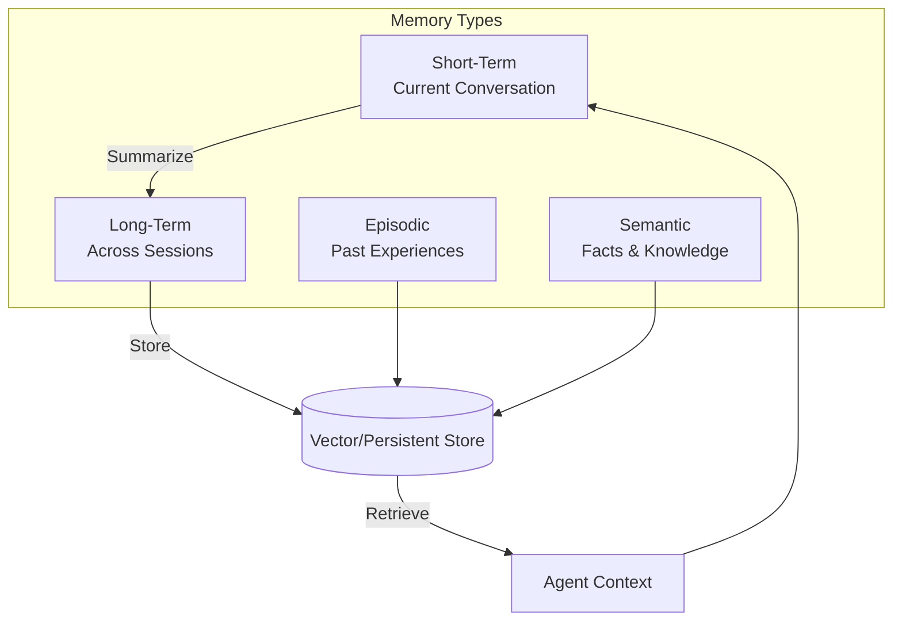

<!-- Clear Language: Keep sentences under 50 words -->
# Memory and State

## Learning Objectives

| Objective | Description |
|-----------|-------------|
| LO1 | Understand types of agent memory — short-term, long-term, episodic, semantic |
| LO2 | Implement conversation history management with token budgeting |
| LO3 | Build external memory stores using vector databases and key-value stores |
| LO4 | Design state management patterns for complex agent workflows |
| LO5 | Implement persistent agent state with save/restore mechanisms |

## Introduction

AI agents autonomously use tools to complete tasks. LangGraph builds stateful, multi-step agent workflows. This module covers agent architectures, tool use, memory, and production deployment.

## Prerequisites

- Basic programming knowledge
- Understanding of data structures

## Key Terminology

**Key Terms**: Core vocabulary and concepts for this topic.

**Definition**: Essential terms you must know for interviews and production work.

## Theory

Understanding memory and state is fundamental for AI engineers. This section covers the core concepts, underlying principles, and theoretical framework that govern how memory and state works in practice.

## Chapter at a Glance

| Section | Topic | Key Concept |
|---------|-------|-------------|
| 5.1 | Memory Types | Short-term, long-term, episodic, semantic, procedural |
| 5.2 | Conversation Memory | History management, token budgeting, summarization |
| 5.3 | External Memory | Vector stores for semantic memory, KV stores for facts |
| 5.4 | State Management | Shared state patterns, state machines, persistence |
| 5.5 | Save and Restore | Checkpointing, serialization, reloading agent state |
| 5.6 | Memory Optimization | Compression, forgetting strategies, relevance scoring |

## Chapter Roadmap



## 5.1 Memory Types

Agents need different types of memory to be effective across short and long timescales.

### Memory Classification

```python
from dataclasses import dataclass, field
from typing import List, Dict, Any, Optional, Callable
from enum import Enum
import json
import time

class MemoryType(Enum):
    SHORT_TERM = "short_term"  # Current conversation, limited window
    LONG_TERM = "long_term"  # Across sessions, persistent
    EPISODIC = "episodic"  # Past experiences and outcomes
    SEMANTIC = "semantic"  # Facts, knowledge, procedures
    WORKING = "working"  # Current task state

@dataclass
class MemoryEntry:
    content: str
    memory_type: MemoryType
    timestamp: float = field(default_factory=time.time)
    metadata: Dict = field(default_factory=dict)
    importance: float = 0.5  # 0.0 to 1.0
    access_count: int = 0

class MemoryStore:
    def __init__(self):
        self.entries: List[MemoryEntry] = []

    def add(self, content: str, memory_type: MemoryType, metadata: Dict = None, importance: float = 0.5):
        self.entries.append(MemoryEntry(
            content=content,
            memory_type=memory_type,
            metadata=metadata or {},
            importance=importance,
        ))

    def get_by_type(self, memory_type: MemoryType) -> List[MemoryEntry]:
        return [e for e in self.entries if e.memory_type == memory_type]

    def get_recent(self, n: int = 5) -> List[MemoryEntry]:
        sorted_entries = sorted(self.entries, key=lambda e: e.timestamp, reverse=True)
        return sorted_entries[:n]

    def search(self, query: str) -> List[MemoryEntry]:
        query_lower = query.lower()
        results = []
        for entry in self.entries:
            if query_lower in entry.content.lower():
                results.append(entry)
        return results

    def forget(self, before_timestamp: float):
        self.entries = [e for e in self.entries if e.timestamp >= before_timestamp]

    def consolidate(self):
        """Merge similar entries to save space."""
        pass

memory = MemoryStore()
memory.add("User prefers Python programming", MemoryType.SEMANTIC, importance=0.8)
memory.add("Searched for AI agents, found useful results", MemoryType.EPISODIC, importance=0.6)
print(f"Semantic memories: {len(memory.get_by_type(MemoryType.SEMANTIC))}")
print(f"Search 'Python': {len(memory.search('Python'))}")
```

## 5.2 Conversation Memory

### 5.2.1 Sliding Window Memory

```python
class SlidingWindowMemory:
    def __init__(self, max_messages: int = 10, max_tokens: int = 4000):
        self.messages: List[Dict] = []
        self.max_messages = max_messages
        self.max_tokens = max_tokens

    def add_message(self, role: str, content: str):
        self.messages.append({"role": role, "content": content})
        self._trim()

    def _trim(self):
        while len(self.messages) > self.max_messages:
            self.messages.pop(0)

        total_tokens = sum(len(m["content"]) // 4 for m in self.messages)
        while total_tokens > self.max_tokens and len(self.messages) > 2:
            removed = self.messages.pop(0)
            total_tokens -= len(removed["content"]) // 4

    def get_context(self) -> List[Dict]:
        return list(self.messages)

    def get_summary_prompt(self) -> str:
        history = "\n".join([f"{m['role']}: {m['content'][:200]}" for m in self.messages])
        return f"Previous conversation:\n{history}"

window = SlidingWindowMemory(max_messages=5, max_tokens=1000)
for i in range(10):
    window.add_message("user", f"Message {i}" * 10)
    window.add_message("assistant", f"Response {i}" * 10)
print(f"Window size: {len(window.messages)} messages (trimmed from 10)")
```

### 5.2.2 Summarizing Memory

```python
class SummarizingMemory:
    def __init__(self, llm_fn: Callable, summary_threshold: int = 5):
        self.llm = llm_fn
        self.summary_threshold = summary_threshold
        self.messages: List[Dict] = []
        self.summary: Optional[str] = None

    def add_message(self, role: str, content: str):
        self.messages.append({"role": role, "content": content})

        if len(self.messages) >= self.summary_threshold:
            self._generate_summary()

    def _generate_summary(self):
        full_text = "\n".join([f"{m['role']}: {m['content']}" for m in self.messages])
        summary_prompt = f"""Summarize this conversation briefly:

{full_text}

Summary:"""
        self.summary = self.llm(summary_prompt)
        self.messages = self.messages[-2:]  # Keep last 2 messages for recent context

    def get_context(self) -> str:
        parts = []
        if self.summary:
            parts.append(f"Previous conversation summary: {self.summary}")
        if self.messages:
            parts.append("Recent messages:")
            parts.extend([f"{m['role']}: {m['content'][:200]}" for m in self.messages])
        return "\n".join(parts)

sum_mem = SummarizingMemory(lambda p: "Conversation summary: User asked about AI agents.")
for i in range(6):
    sum_mem.add_message("user", f"Question {i}")
    sum_mem.add_message("assistant", f"Answer {i}")
print(f"Summary generated: {sum_mem.summary is not None}")
print(f"Remaining messages: {len(sum_mem.messages)}")
```

### 5.2.3 Hybrid Memory

```python
class HybridMemory:
    def __init__(self, max_recent: int = 5, llm_fn: Callable = None):
        self.recent: List[Dict] = []
        self.summary: Optional[str] = None
        self.max_recent = max_recent
        self.llm = llm_fn
        self.total_messages = 0

    def add(self, role: str, content: str):
        self.recent.append({"role": role, "content": content})
        self.total_messages += 1

        if len(self.recent) >= self.max_recent * 2:
            self._summarize_old()

    def _summarize_old(self):
        old_messages = self.recent[:-self.max_recent]
        if not old_messages:
            return

        text = "\n".join([f"{m['role']}: {m['content'][:200]}" for m in old_messages])
        new_summary = self.llm(f"Summarize: {text}") if self.llm else f"Summary of {len(old_messages)} messages."

        if self.summary:
            self.summary = self.llm(f"Combine summaries:\n1. {self.summary}\n2. {new_summary}") if self.llm else f"{self.summary}\n{new_summary}"
        else:
            self.summary = new_summary

        self.recent = self.recent[-self.max_recent:]

    def get_full_context(self) -> str:
        parts = []
        if self.summary:
            parts.append(f"Summary: {self.summary}")
        parts.extend([f"{m['role']}: {m['content'][:200]}" for m in self.recent])
        return "\n".join(parts)

    def stats(self) -> Dict:
        return {
            "total_messages": self.total_messages,
            "recent_messages": len(self.recent),
            "has_summary": self.summary is not None,
        }

hybrid = HybridMemory(max_recent=3, llm_fn=lambda p: "Merged summary of conversation.")
for i in range(10):
    hybrid.add("user", f"Query {i}")
    hybrid.add("assistant", f"Response {i}")
print(f"Hybrid memory stats: {hybrid.stats()}")
```

## 5.3 External Memory

### 5.3.1 Vector Memory Store

```python
class VectorMemoryStore:
    def __init__(self, dimension: int = 384):
        self.dimension = dimension
        self.memories: List[Dict] = []
        self.embeddings: List[np.ndarray] = []

    def add_memory(self, content: str, metadata: Dict = None, importance: float = 0.5):
        embedding = mock_embedder(content)
        self.memories.append({
            "content": content,
            "metadata": metadata or {},
            "importance": importance,
            "timestamp": time.time(),
        })
        self.embeddings.append(embedding)

    def search(self, query: str, top_k: int = 5) -> List[Dict]:
        query_emb = mock_embedder(query)
        similarities = []
        for i, mem_emb in enumerate(self.embeddings):
            sim = float(np.dot(query_emb, mem_emb))
            similarities.append((i, sim))

        similarities.sort(key=lambda x: x[1], reverse=True)
        results = []
        for idx, sim in similarities[:top_k]:
            mem = self.memories[idx]
            results.append({**mem, "relevance": round(sim, 4)})
        return results

    def get_recent(self, n: int = 5) -> List[Dict]:
        sorted_memories = sorted(self.memories, key=lambda m: m["timestamp"], reverse=True)
        return sorted_memories[:n]

vmem = VectorMemoryStore()
vmem.add_memory("User likes Python programming", {"source": "conversation"}, 0.8)
vmem.add_memory("Completed project on AI agents", {"source": "project"}, 0.9)
results = vmem.search("programming preferences")
print(f"Vector search results: {len(results)}")
for r in results:
    print(f"  {r['content']} (relevance: {r['relevance']})")
```

### 5.3.2 Key-Value Fact Memory

```python
class FactMemory:
    def __init__(self):
        self.facts: Dict[str, List[Dict]] = {}
        self.confidence: Dict[str, float] = {}

    def remember(self, key: str, value: str, source: str = "user", confidence: float = 0.8):
        if key not in self.facts:
            self.facts[key] = []
        self.facts[key].append({
            "value": value,
            "source": source,
            "confidence": confidence,
            "timestamp": time.time(),
        })
        self.confidence[key] = max(
            confidence,
            self.confidence.get(key, 0)
        )

    def recall(self, key: str, min_confidence: float = 0.5) -> Optional[str]:
        entries = self.facts.get(key, [])
        if not entries:
            return None
        # Return most confident recent entry
        best = max(entries, key=lambda e: e["confidence"] * (1 if e["confidence"] >= min_confidence else 0))
        return best["value"] if best["confidence"] >= min_confidence else None

    def update_confidence(self, key: str, new_confidence: float):
        if key in self.confidence:
            self.confidence[key] = (self.confidence[key] + new_confidence) / 2

    def forget(self, key: str):
        self.facts.pop(key, None)
        self.confidence.pop(key, None)

    def get_all_facts(self) -> List[Dict]:
        facts = []
        for key, entries in self.facts.items():
            for entry in entries:
                facts.append({"key": key, **entry})
        return facts

facts = FactMemory()
facts.remember("user_name", "Alice", "conversation")
facts.remember("preferred_language", "Python", "conversation")
print(f"Recalled name: {facts.recall('user_name')}")
print(f"Recalled unknown: {facts.recall('favorite_color')}")
```

### 5.3.3 Episodic Memory

```python
class EpisodicMemory:
    def __init__(self):
        self.episodes: List[Dict] = []

    def record(self, action: str, outcome: str, context: Dict, success: bool):
        self.episodes.append({
            "action": action,
            "outcome": outcome,
            "context": context,
            "success": success,
            "timestamp": time.time(),
        })

    def get_similar_experiences(self, action: str, top_k: int = 3) -> List[Dict]:
        action_lower = action.lower()
        relevant = [e for e in self.episodes if action_lower in e["action"].lower()]
        relevant.sort(key=lambda e: e["timestamp"], reverse=True)
        return relevant[:top_k]

    def get_success_rate(self, action: str) -> float:
        episodes = [e for e in self.episodes if action.lower() in e["action"].lower()]
        if not episodes:
            return 0.0
        successes = sum(1 for e in episodes if e["success"])
        return successes / len(episodes)

    def get_best_approach(self, goal: str) -> Optional[str]:
        """Find the most successful approach for a given goal."""
        relevant = [e for e in self.episodes if e["success"] and goal.lower() in str(e["context"]).lower()]
        if relevant:
            return max(relevant, key=lambda e: e["timestamp"])["action"]
        return None

episodes = EpisodicMemory()
episodes.record("web_search", "Found relevant papers", {"query": "AI agents"}, True)
episodes.record("database_query", "No results", {"query": "AI agents"}, False)
print(f"Success rate for 'search': {episodes.get_success_rate('search'):.0%}")
```

## 5.4 State Management

### 5.4.1 State Machine Pattern

```python
class AgentState:
    def __init__(self):
        self.memory = MemoryStore()
        self.conversation = SummarizingMemory(lambda p: "summary")
        self.facts = FactMemory()
        self.episodes = EpisodicMemory()
        self.current_task: Optional[str] = None
        self.step_count: int = 0
        self.max_steps: int = 20

    def reset(self):
        self.current_task = None
        self.step_count = 0

    def start_task(self, task: str):
        self.current_task = task
        self.step_count = 0

    def increment_step(self):
        self.step_count += 1
        return self.step_count <= self.max_steps

    def snapshot(self) -> Dict:
        return {
            "current_task": self.current_task,
            "step_count": self.step_count,
            "fact_count": len(self.facts.get_all_facts()),
            "episode_count": len(self.episodes.episodes),
        }

state = AgentState()
state.start_task("Research AI agents")
state.increment_step()
state.facts.remember("research_topic", "AI agents", "system")
print(f"State snapshot: {state.snapshot()}")
```

### 5.4.2 Shared State Between Agents

```python
class SharedState:
    def __init__(self):
        self.data: Dict[str, Any] = {}
        self.locks: Dict[str, bool] = {}

    def get(self, key: str, default=None):
        return self.data.get(key, default)

    def set(self, key: str, value: Any):
        self.data[key] = value

    def update(self, key: str, update_fn: Callable):
        if key in self.data:
            self.data[key] = update_fn(self.data[key])

    def acquire_lock(self, key: str) -> bool:
        if self.locks.get(key, False):
            return False
        self.locks[key] = True
        return True

    def release_lock(self, key: str):
        self.locks[key] = False

    def clear(self):
        self.data.clear()
        self.locks.clear()

shared = SharedState()
shared.set("research_results", [])
shared.update("research_results", lambda x: x + ["Found paper on AI agents"])
print(f"Shared data: {shared.get('research_results')}")
```

## 5.5 Save and Restore

### 5.5.1 State Serialization

```python
import pickle
import json
from datetime import datetime

class StateSerializer:
    @staticmethod
    def to_dict(state: AgentState) -> Dict:
        return {
            "current_task": state.current_task,
            "step_count": state.step_count,
            "max_steps": state.max_steps,
            "facts": state.facts.get_all_facts(),
            "episodes": state.episodes.episodes,
            "saved_at": datetime.now().isoformat(),
        }

    @staticmethod
    def from_dict(data: Dict) -> AgentState:
        state = AgentState()
        state.current_task = data.get("current_task")
        state.step_count = data.get("step_count", 0)
        state.max_steps = data.get("max_steps", 20)

        for fact in data.get("facts", []):
            state.facts.remember(fact["key"], fact["value"], fact.get("source", "restore"), fact.get("confidence", 0.5))

        for episode in data.get("episodes", []):
            state.episodes.record(episode["action"], episode["outcome"], episode.get("context", {}), episode.get("success", False))

        return state

    @staticmethod
    def save_to_file(state: AgentState, filepath: str):
        data = StateSerializer.to_dict(state)
        with open(filepath, "w") as f:
            json.dump(data, f, indent=2)

    @staticmethod
    def load_from_file(filepath: str) -> AgentState:
        with open(filepath, "r") as f:
            data = json.load(f)
        return StateSerializer.from_dict(data)

original = AgentState()
original.start_task("Memory research")
original.facts.remember("topic", "agent memory", "system")
original.episodes.record("search", "found papers", {"query": "memory"}, True)

serialized = StateSerializer.to_dict(original)
restored = StateSerializer.from_dict(serialized)
print(f"Original task: {original.current_task}")
print(f"Restored task: {restored.current_task}")
print(f"Facts match: {original.facts.recall('topic') == restored.facts.recall('topic')}")
```

### 5.5.2 Checkpoint Manager

```python
class CheckpointManager:
    def __init__(self, storage_dir: str = "./checkpoints"):
        self.storage_dir = storage_dir
        self.checkpoints: Dict[str, str] = {}

    def save(self, agent_id: str, state: AgentState, tag: str = "latest"):
        from pathlib import Path
        Path(self.storage_dir).mkdir(parents=True, exist_ok=True)
        timestamp = datetime.now().strftime("%Y%m%d_%H%M%S")
        filename = f"{self.storage_dir}/{agent_id}_{tag}_{timestamp}.json"
        StateSerializer.save_to_file(state, filename)
        self.checkpoints[f"{agent_id}:{tag}"] = filename
        return filename

    def load(self, agent_id: str, tag: str = "latest") -> Optional[AgentState]:
        key = f"{agent_id}:{tag}"
        filename = self.checkpoints.get(key)
        if filename:
            return StateSerializer.load_from_file(filename)
        return None

    def list_checkpoints(self, agent_id: str) -> List[str]:
        return [k for k in self.checkpoints.keys() if k.startswith(agent_id)]

    def rollback(self, agent_id: str, steps_back: int = 1) -> Optional[AgentState]:
        checkpoints = self.list_checkpoints(agent_id)
        if len(checkpoints) > steps_back:
            target = checkpoints[-steps_back - 1]
            tag = target.split(":")[1]
            return self.load(agent_id, tag)
        return None

cm = CheckpointManager("./checkpoints")
cm.save("agent-1", original, "v1")
print(f"Saved checkpoint: {cm.list_checkpoints('agent-1')}")
```

### 5.5.3 Session Persistence

```python
class SessionManager:
    def __init__(self):
        self.sessions: Dict[str, AgentState] = {}

    def create_session(self, session_id: str) -> AgentState:
        state = AgentState()
        self.sessions[session_id] = state
        return state

    def get_session(self, session_id: str) -> Optional[AgentState]:
        return self.sessions.get(session_id)

    def delete_session(self, session_id: str):
        self.sessions.pop(session_id, None)

    def cleanup_old_sessions(self, max_age_seconds: int = 3600):
        now = time.time()
        expired = []
        for sid, state in self.sessions.items():
            if hasattr(state, "_created_at"):
                if now - state._created_at > max_age_seconds:
                    expired.append(sid)
        for sid in expired:
            self.delete_session(sid)

    def stats(self) -> Dict:
        return {
            "active_sessions": len(self.sessions),
            "total_sessions": len(self.sessions),
        }

sm = SessionManager()
state_a = sm.create_session("session-1")
state_b = sm.create_session("session-2")
state_a.facts.remember("session", "one", "system")
state_b.facts.remember("session", "two", "system")
print(f"Session 1 fact: {sm.get_session('session-1').facts.recall('session')}")
print(f"Active sessions: {sm.stats()['active_sessions']}")
```

## 5.6 Memory Optimization

### 5.6.1 Importance-Based Retention

```python
class ImportanceBasedMemory:
    def __init__(self, max_entries: int = 100, importance_threshold: float = 0.3):
        self.entries: List[MemoryEntry] = []
        self.max_entries = max_entries
        self.threshold = importance_threshold

    def add(self, content: str, importance: float, metadata: Dict = None):
        if importance < self.threshold:
            return

        self.entries.append(MemoryEntry(
            content=content,
            memory_type=MemoryType.SEMANTIC,
            importance=importance,
            metadata=metadata or {},
        ))

        self._prune()

    def _prune(self):
        if len(self.entries) > self.max_entries:
            self.entries.sort(key=lambda e: (e.importance, e.timestamp), reverse=True)
            self.entries = self.entries[:self.max_entries]

    def get_important(self, min_importance: float = 0.7) -> List[MemoryEntry]:
        return [e for e in self.entries if e.importance >= min_importance]

importance_mem = ImportanceBasedMemory(max_entries=10, importance_threshold=0.3)
importance_mem.add("Critical user preference", 0.9)
importance_mem.add("Minor observation", 0.2)
print(f"Important entries: {len(importance_mem.get_important(0.7))}")
print(f"Total entries: {len(importance_mem.entries)}")
```

### 5.6.2 Forgetting Curve

```python
class ForgettingCurve:
    def __init__(self, decay_rate: float = 0.1):
        self.decay_rate = decay_rate

    def recall_probability(self, entry: MemoryEntry, current_time: float = None) -> float:
        if current_time is None:
            current_time = time.time()
        age = current_time - entry.timestamp
        hours = age / 3600
        probability = entry.importance * (2.718 ** (-self.decay_rate * hours))
        return max(0.0, min(1.0, probability))

    def should_forget(self, entry: MemoryEntry, threshold: float = 0.1) -> bool:
        return self.recall_probability(entry) < threshold

curve = ForgettingCurve(decay_rate=0.05)
old_entry = MemoryEntry(content="old info", memory_type=MemoryType.SEMANTIC, timestamp=time.time() - 86400, importance=0.5)
new_entry = MemoryEntry(content="new info", memory_type=MemoryType.SEMANTIC, timestamp=time.time(), importance=0.8)
print(f"Old recall prob: {curve.recall_probability(old_entry):.3f}")
print(f"New recall prob: {curve.recall_probability(new_entry):.3f}")
print(f"Forget old: {curve.should_forget(old_entry, 0.2)}")
```

### 5.6.3 Memory Compression

```python
class MemoryCompressor:
    def __init__(self, llm_fn: Callable):
        self.llm = llm_fn

    def compress(self, entries: List[MemoryEntry]) -> str:
        text = "\n".join([e.content for e in entries])
        compression_prompt = f"""Compress these memories into a concise summary.
Keep all important facts and preferences.

Memories:
{text}

Compressed:"""
        return self.llm(compression_prompt)

    def batch_summarize(self, entries: List[MemoryEntry], batch_size: int = 5) -> List[str]:
        summaries = []
        for i in range(0, len(entries), batch_size):
            batch = entries[i:i + batch_size]
            summary = self.compress(batch)
            summaries.append(summary)
        return summaries

compressor = MemoryCompressor(lambda p: "Compressed summary of agent memories.")
entries = [
    MemoryEntry("User prefers Python for data science", MemoryType.SEMANTIC),
    MemoryEntry("User is working on an AI agent project", MemoryType.SEMANTIC),
]
summary = compressor.compress(entries)
print(f"Compressed: {summary}")
```

## Summary

Memory and state management are critical for building capable AI agents. Short-term memory maintains the current conversation context with sliding windows and.
summarization. Long-term memory persists facts, preferences, and knowledge across sessions using vector stores and key-value stores. Episodic memory records past actions and.
outcomes for experience-based learning. State management patterns include state machines with shared state for multi-agent systems. Save/restore mechanisms with checkpointing enable persistence,.
rollback, and session management. Memory optimization techniques include importance-based retention, forgetting curves, and compression.

## Practical Takeaways

| Takeaway | Description |
|----------|-------------|
| Separate memory types | Use different stores for short-term, long-term, and episodic memory |
| Implement forgetting | Not all information is equally important — prune aggressively |
| Use vector memory | Semantic search over past interactions enables relevant recall |
| Checkpoint regularly | Save state at each step for debugging and recovery |
| Compress conversation | Summarize old turns to fit within context window limits |
| Share state carefully | Use locks for concurrent agent access to shared state |

## Interview Q&A

<details class="tp-qa-card" data-qid="ag05-q1">
  <summary class="tp-qa-question">
    <span class="tp-qa-status"></span>
    Q1: What types of memory do AI agents use?
  </summary>
  <div class="tp-qa-answer">
<p>AI agents use three types of memory. Short-term memory holds the current conversation context (recent messages, current task state) and is limited by the LLM's context window. Long-term memory persists information across sessions using external storage (databases,.
vector stores, files). Episodic memory stores specific past events and experiences that can be retrieved and replayed. Additionally, procedural memory stores how to perform tasks (tool usage patterns,.
workflows). Each memory type serves a different purpose: short-term for immediate coherence, long-term for user preferences and facts, episodic for learning from past mistakes,.
and procedural for efficient task execution. Production agents typically combine all four types, with size limits and eviction policies for each.</p>
  </div>
  <button class="tp-qa-mark-btn">✅ Mark Reviewed</button>
  <button class="tp-qa-bookmark-btn">🔖 Bookmark</button>
</details>

<details class="tp-qa-card" data-qid="ag05-q2">
  <summary class="tp-qa-question">
    <span class="tp-qa-status"></span>
    Q2: How does vector search work for long-term memory?
  </summary>
  <div class="tp-qa-answer">
<p>Vector search for memory works by converting text into embeddings (fixed-size numerical vectors using models like text-embedding-ada-002) and storing them in a vector.
database. When a new query arrives, it's embedded with the same model, and the database finds the most similar stored vectors using cosine similarity or.
dot product. The retrieved memories are then added to the LLM prompt as context. Key parameters: top-K (how many memories to retrieve),.
similarity threshold (minimum score to include), and recency boost (multiply score by a recency factor). Vector search is preferred over keyword search because it captures semantic meaning — "how do I book a flight?" matches "travel reservation process" even though they share no keywords. Popular vector.
databases include Pinecone, Qdrant, Milvus, and pgvector.</p>
  </div>
  <button class="tp-qa-mark-btn">✅ Mark Reviewed</button>
  <button class="tp-qa-bookmark-btn">🔖 Bookmark</button>
</details>

<details class="tp-qa-card" data-qid="ag05-q3">
  <summary class="tp-qa-question">
    <span class="tp-qa-status"></span>
    Q3: What is a memory manager in an agent system?
  </summary>
  <div class="tp-qa-answer">
<p>A memory manager is a centralized service that orchestrates all memory operations across an agent system. It handles: (1) storing new memories (converting text to embeddings,.
inserting into vector store with metadata like timestamp, session ID, importance score); (2) retrieving relevant memories (embedding queries, searching vector store,.
ranking and filtering results); (3) memory consolidation (merging duplicate memories, pruning outdated ones, updating importance scores based on access frequency); (4) memory decay (reducing importance of unused memories over time until they're archived);.
and (5) session management (associating memories with sessions and users). The memory manager provides a clean API for the agent to access memory without knowing the underlying storage details. It also enforces memory limits and.
implements eviction policies (remove least recently used memories when the store exceeds capacity).</p>
  </div>
  <button class="tp-qa-mark-btn">✅ Mark Reviewed</button>
  <button class="tp-qa-bookmark-btn">🔖 Bookmark</button>
</details>

<details class="tp-qa-card" data-qid="ag05-q4">
  <summary class="tp-qa-question">
    <span class="tp-qa-status"></span>
    Q4: How do you manage context window limits?
  </summary>
  <div class="tp-qa-answer">
<p>Managing context window limits requires strategies to fit the most relevant information within the LLM's token budget. Common approaches: (1) message pruning — remove oldest or.
least relevant messages while keeping recent ones; (2) message summarization — compress multiple messages into a summary, trading detail for space;.
(3) sliding window — keep only the last N messages, archiving older ones to long-term memory; (4) importance scoring — rank messages by relevance and.
drop low-scoring ones first; (5) token counting — track usage and trigger pruning when approaching the limit. Each strategy has tradeoffs: pruning is simple but.
may lose context, summarization preserves semantic content but loses verbatim details, sliding window works well for recent context but loses early conversation. Most production agents use a combination,.
with summarization for older context and a sliding window for recent messages.</p>
  </div>
  <button class="tp-qa-mark-btn">✅ Mark Reviewed</button>
  <button class="tp-qa-bookmark-btn">🔖 Bookmark</button>
</details>

<details class="tp-qa-card" data-qid="ag05-q5">
  <summary class="tp-qa-question">
    <span class="tp-qa-status"></span>
    Q5: What strategies exist for memory consolidation?
  </summary>
  <div class="tp-qa-answer">
<p>Memory consolidation strategies reorganize and optimize stored memories for better retrieval and efficiency. Key strategies: (1) deduplication — detect and merge memories with near-identical content using similarity thresholds;.
(2) abstraction — generalize specific memories into broader patterns (e.g., multiple "user liked sci-fi movies" entries become "user's top genre: sci-fi");.
(3) forgetting — reduce importance scores for memories that haven't been accessed recently; (4) hierarchical storage — keep high-level summaries in fast storage and.
detailed memories in slower storage; (5) temporal clustering — group memories by time periods for more efficient retrieval of recent context. Consolidation typically runs as a background process triggered by memory count thresholds or.
time intervals. The goal is to maintain a manageable, high-signal memory store that provides the most useful context without exceeding storage or.
retrieval latency limits.</p>
  </div>
  <button class="tp-qa-mark-btn">✅ Mark Reviewed</button>
  <button class="tp-qa-bookmark-btn">🔖 Bookmark</button>
</details>

<details class="tp-qa-card" data-qid="ag05-q6">
  <summary class="tp-qa-question">
    <span class="tp-qa-status"></span>
    Q6: How does state persistence work in LangGraph?
  </summary>
  <div class="tp-qa-answer">
<p>State persistence in LangGraph saves the graph's state at each execution step using checkpointers. A checkpointer serializes the current state (all message history,.
node results, and execution metadata) to a storage backend after each node executes. The <code>StateGraph</code> is compiled with a checkpointer instance,.
and each invocation uses a thread ID to identify the conversation session. On subsequent invocations with the same thread ID, the graph loads the last checkpoint and.
continues from that point rather than starting fresh. Persistence backends include: in-memory (for testing), SQLite (single-process, file-based), Postgres (production, multi-process), and.
Redis (high-performance, caching). State persistence enables conversation continuity — the agent remembers past interactions even across server restarts — and is essential for.
any multi-turn agent application.</p>
  </div>
  <button class="tp-qa-mark-btn">✅ Mark Reviewed</button>
  <button class="tp-qa-bookmark-btn">🔖 Bookmark</button>
</details>

<details class="tp-qa-card" data-qid="ag05-q7">
  <summary class="tp-qa-question">
    <span class="tp-qa-status"></span>
    Q7: What is semantic memory and how does it differ from episodic memory?
  </summary>
  <div class="tp-qa-answer">
<p>Semantic memory stores factual knowledge independent of specific experiences — like "Paris is the capital of France" or "user prefers email over Slack for.
notifications". Episodic memory stores specific events with temporal context — like "last time user asked about pricing, they chose the enterprise plan on March 15th". The key difference is that semantic memory stores generalizable facts extracted from experiences,.
while episodic memory stores the raw experiences themselves. For agents, semantic memory grows more useful over time as patterns emerge from many interactions. Episodic memory is better for.
debugging ("what exactly happened in that last session?") and for learning from specific past mistakes. Both are typically stored in vector.
databases but with different indexing strategies — semantic memories are clustered by topic, episodic memories by time.</p>
  </div>
  <button class="tp-qa-mark-btn">✅ Mark Reviewed</button>
  <button class="tp-qa-bookmark-btn">🔖 Bookmark</button>
</details>

<details class="tp-qa-card" data-qid="ag05-q8">
  <summary class="tp-qa-question">
    <span class="tp-qa-status"></span>
    Q8: How do you implement message pruning?
  </summary>
  <div class="tp-qa-answer">
<p>Message pruning removes selected messages from the conversation history to stay within context limits. Implementation tracks message metadata (timestamp, token count,.
role, importance score) and applies a pruning policy when total tokens exceed a threshold. The simplest policy removes oldest messages first,.
but better policies consider: message role (user messages may be more important than system messages), importance score (tagged by the agent during execution),.
and whether a message has been referenced in later responses. A summarization-based approach replaces a block of pruned messages with a generated summary. Implementation uses a <code>MessageManager</code> class with a <code>prune(max_tokens)</code> method that calculates current usage,.
identifies candidates for removal, and reconstructs the message array. Production systems log all pruned messages for debugging and audit trails.</p>
  </div>
  <button class="tp-qa-mark-btn">✅ Mark Reviewed</button>
  <button class="tp-qa-bookmark-btn">🔖 Bookmark</button>
</details>

<details class="tp-qa-card" data-qid="ag05-q9">
  <summary class="tp-qa-question">
    <span class="tp-qa-status"></span>
    Q9: What is a sliding window buffer and how does it work?
  </summary>
  <div class="tp-qa-answer">
<p>A sliding window buffer keeps only the N most recent messages in the LLM context, discarding older ones. It works by maintaining a list of messages with a fixed maximum size — when a new message arrives and.
the buffer is full, the oldest message is removed before adding the new one. The window size is typically set below the LLM's context limit (e.g.,.
7000 tokens for an 8000-token model) to leave room for system prompts and tool results. Variants include: (1) token-based window (count tokens,.
not messages); (2) time-based window (keep messages from the last N minutes); (3) importance-aware window (evict lowest-importance message). The sliding window is simple and.
efficient, but can drop important early context. Production agents often combine it with summarization — the removed older messages are summarized and.
kept as a single condensed message at the start of the window.</p>
  </div>
  <button class="tp-qa-mark-btn">✅ Mark Reviewed</button>
  <button class="tp-qa-bookmark-btn">🔖 Bookmark</button>
</details>

<details class="tp-qa-card" data-qid="ag05-q10">
  <summary class="tp-qa-question">
    <span class="tp-qa-status"></span>
    Q10: How do you implement a summary-based memory system?
  </summary>
  <div class="tp-qa-answer">
<p>A summary-based memory system maintains a running summary of the conversation that's updated after each exchange. Implementation: (1) initialize with a placeholder summary;.
(2) after each user/assistant turn, pass the current summary and new messages to an LLM to generate an updated summary; (3) always include the summary in the prompt alongside recent messages (within the sliding window). The summary is stored in.
long-term memory keyed by session ID. This preserves the gist of early conversation even when those messages are pruned from the context window. The system also stores important facts extracted from the conversation (semantic memory) and.
recent detailed history (episodic memory). When constructing the prompt, the agent includes: the running summary, recent messages from the sliding window,.
relevant semantic memories from vector search, and any relevant episodic memories. This layered approach maximizes relevant context within the token budget.</p>
  </div>
  <button class="tp-qa-mark-btn">✅ Mark Reviewed</button>
  <button class="tp-qa-bookmark-btn">🔖 Bookmark</button>
</details>

## Chapter Quiz

<details data-qid="agent-s5-quiz1">
<summary><strong>1.</strong> Which memory type stores facts and knowledge about the user?</summary>
A. Short-term memory
B. Episodic memory
C. Semantic memory
D. Working memory
Answer: C
</details>

<details data-qid="agent-s5-quiz2">
<summary><strong>2.</strong> What is the primary challenge with short-term conversation memory?</summary>
A. Storage cost
B. Context window token limits
C. Encryption requirements
D. Network latency
Answer: B
</details>

<details data-qid="agent-s5-quiz3">
<summary><strong>3.</strong> How does a summarizing memory reduce token usage?</summary>
A. By deleting all old messages
B. By compressing old conversation turns into a summary
C. By using shorter words
D. By storing messages in binary format
Answer: B
</details>

<details data-qid="agent-s5-quiz4">
<summary><strong>4.</strong> What is the purpose of importance-based retention?</summary>
A. To store all memories equally
B. To keep high-value information while discarding low-value information
C. To encrypt important memories
D. To share memories between agents
Answer: B
</details>

<details data-qid="agent-s5-quiz5">
<summary><strong>5.</strong> What does checkpointing enable in agent systems?</summary>
A. Faster execution
B. State persistence, recovery, and rollback
C. Better tool selection
D. Improved prompt engineering
Answer: B
</details>

## Exercises

## Common Mistakes

1. Not understanding the fundamental concepts before applying them
2. Skipping edge cases in implementation
3. Not analyzing time/space complexity
4. Forgetting to handle null/empty inputs
5. Not practicing enough problems to build pattern recognition1. Implement a hybrid memory system with sliding window (last 5 messages) and summarization (LLM-generated summary of older messages). Test with 15 messages and print the context.

2. Build a vector memory store that stores agent experiences as embeddings. Implement search with 10 test memories and demonstrate that semantically similar queries retrieve relevant results.

3. Create a persistent session manager that saves agent state to JSON files and restores it on subsequent interactions. Run a 3-turn conversation, save, restart, and verify state continuity.

4. Implement an importance-based forgetting system where memories with importance < 0.3 are discarded and low-access-count memories are pruned. Test with 20 entries of varying importance.

5. Design a shared state system for multi-agent collaboration with read/write locks. Simulate 3 agents reading and updating shared state concurrently without da

## Revision Notes

- - Core principle: Understand the fundamental concepts thoroughly
- - Implementation pattern: Practice with real code examples
- - Complexity: Know the time and space complexity
- - Application: Know when to use this in production systems
- - Interview: Frequently asked in technical interviews
- - Edge cases: Consider common failure scenarios
- - Related concepts: Connect to broader system design

## Placement Section

### Top 10 Interview Questions

#### Google Style

1. **Explain the core idea of Memory and State in under 60 seconds, then give a real-world analogy.** — Structure: definition, how it works in one sentence, why it matters, analogy. Follow-up: what would break if you removed this from a production system?

2. **Design a minimal, well-typed function that demonstrates Memory and State.** — Interviewer checks: signature with type hints, edge cases, complexity, and a clean docstring. Follow-up: how does your design behave with empty or malformed input?

3. **What are the common pitfalls when engineers first learn ** — List 3-4, then explain how you would prevent each in a code review.

#### Amazon Style

4. **Describe a production bug caused by misunderstanding Memory and State. How did you diagnose and fix it?** — STAR format: situation, task, action, result. Mention logs, reproduction, root-cause analysis, and the regression test you added.

5. **How would you scale a system that relies on Memory and State from 10 users to 10 million?** — Discuss bottlenecks, caching, monitoring, and when to redesign. Follow-up: what metrics would you track?

#### Microsoft Style

6. **Compare Memory and State with the closest alternative approach. When would you choose each?** — Make a decision matrix: performance, maintainability, ecosystem, learning curve. Follow-up: what would change your decision?

7. **Walk through how you would test a component that depends on Memory and State.** — Unit, integration, property-based tests; mocking boundaries; golden files for outputs.

#### NVIDIA Style

8. **How does Memory and State behave differently at scale — memory, throughput, or precision-wise?** — Connect to data pipelines and model training if applicable. Follow-up: what happens to latency as input grows?

9. **How would you make an implementation of Memory and State run faster on GPU hardware?** — Batch operations, vectorization, avoiding Python loops, reducing data movement.

#### AI Startup Style

10. **Write the smallest possible implementation of Memory and State that is production-quality.** — Include error handling, type hints, and a one-line docstring. Follow-up: what would you refactor first when it grows?

### Resume Tips

- Name Memory and State explicitly in your skills section, paired with a measurable achievement ("Reduced X by 40% using Memory and State").
- Add a bullet describing a project that applies Memory and State to real data, with numbers.
- Mention the tools and libraries you used alongside Memory and State (linters, test frameworks, profiling tools).
- Keep resume bullets under 15 words and start each with an action verb.

### Interview Day Checklist

- Rehearse a 60-second explanation of Memory and State and one real-world analogy.
- Prepare one STAR story about debugging a Memory and State-related production issue.
- Review complexity and edge cases for the classic Memory and State interview problem.
- Have questions ready: how does the team apply Memory and State in production today?
- Test your environment (Python, editor, internet) 15 minutes before the interview.

## True/False

1. **True or False:** Memory and State builds directly on the fundamentals covered in the earlier chapters of this module. — **True.** Every advanced topic in this module assumes the core concepts from the previous chapters.
2. **True or False:** You should write at least one code example for Memory and State before moving to the next chapter. — **True.** Active recall with hands-on code beats passive reading for retention.
3. **True or False:** The complexity analysis for Memory and State is the same regardless of input size. — **False.** Complexity grows with input size; always state best, average, and worst case.
4. **True or False:** Edge cases (empty input, invalid input, boundary values) matter for Memory and State in production. — **True.** Most production bugs come from unhandled edge cases.
5. **True or False:** You should memorize the Memory and State chapter content once and never review it again. — **False.** Spaced repetition (24h, 3 days, 1 week) dramatically improves long-term recall.

## Fill in the Blank

1. The chapter that covers Memory and State is Chapter ___ of this module. — Answer: check the module's table of contents.
2. The time complexity of the standard approach to Memory and State is ___. — Answer: review the theory section and state big-O notation.
3. The main edge case to handle when implementing Memory and State is ___. — Answer: empty or invalid input handling, as discussed in the chapter.
4. The tools commonly used to debug Memory and State issues are ___ and ___. — Answer: refer to the Debugging Guide section of this chapter.
5. The related topic that connects to Memory and State in the next chapter is ___. — Answer: see the Next Topic section.

## Scenario Questions

1. **Scenario:** A teammate ships a change involving Memory and State that breaks production at 3 AM. — Diagnosis: check the recent diff, reproduce locally with the failing input, check logs. Fix: revert, add a regression test, and review the root cause. Prevention: CI tests on edge cases and code review checklist.

2. **Scenario:** Your implementation of Memory and State is correct but too slow for the required latency. — Measure first with a profiler. Common fixes: reduce redundant work, use built-in optimized functions, batch operations, or add caching. Only then consider algorithmic changes.

3. **Scenario:** A new hire asks you to explain Memory and State in five minutes before a customer demo. — Use the 3-part answer: what it is (one sentence), how it works (one example), why it matters (one business impact). Then offer to go deeper after the demo.

4. **Scenario:** Your team's codebase has three different patterns for Memory and State and you must standardize. — Write a short ADR (architecture decision record), pick the pattern with best maintainability, migrate incrementally, and add a linter rule to enforce it.

## Output Questions

1. **What is the output of the simplest correct implementation of Memory and State on an empty input?** — Trace through the code: it should return the documented default (None, 0, empty collection) without raising.
2. **What is the output when the input is at the boundary value?** — Check off-by-one errors and inclusive/exclusive bounds in the chapter's examples.
3. **What does the implementation return when given invalid input types?** — With type hints and validation, it raises a clear error; without, it may fail silently.
4. **What is the output for the sample input given in the chapter's Examples section?** — Re-run the chapter's example code and compare against the documented output.
5. **What is the time complexity output when you profile the implementation at 10x input size?** — Expect the curve matching the chapter's complexity analysis (linear, quadratic, log-linear).

## Difficulty Level

| Level | Time | What It Takes |
|-------|------|---------------|
| Beginner | 1-2 sessions | Read theory, run the chapter examples, solve the Easy exercises |
| Intermediate | 3-5 sessions | Complete Medium exercises, explain Memory and State to someone else |
| Advanced | 1+ week | Solve Hard exercises, optimize for real datasets, answer interview follow-ups |

## Tips & Tricks

- Always write a one-line example of Memory and State from memory before opening the chapter — active recall first.
- Use the chapter's Revision Notes as a checklist: you have mastered Memory and State when you can explain each bullet.
- Pair the chapter quiz with the Flashcards: wrong answers become your next study session's focus.
- For interviews, practice explaining Memory and State twice: once with a technical audience, once with a non-technical audience.
- Keep a personal examples file where you collect your own Memory and State snippets; interviewers love original examples.

## Memory Tricks

- **Acronym**: build a mnemonic from the 5 key concepts of Memory and State listed in the Chapter at a Glance table.
- **Story**: link Memory and State to a familiar story — the analogy in the Visual Analogy section is designed to stick.
- **Number anchor**: remember the complexity of Memory and State by connecting it to a known algorithm of the same class.
- **Color code**: highlight the Theory, Examples, and Common Mistakes sections in different colors when reviewing.
- **Teach-back**: explain Memory and State to an imaginary junior engineer for 2 minutes — gaps in your explanation are gaps in memory.

## Further Reading

- Official documentation for the primary tool or library used in this chapter
- The chapter referenced in Related Topics for the next-level treatment of Memory and State
- The classic textbook chapter on Memory and State (check the Research References below)
- Two blog posts from engineers who debugged real Memory and State problems in production
- The repository of the open-source project that implements Memory and State

## Related Topics

- The previous chapter in this module (see table of contents) — foundational for Memory and State
- The next chapter (see Next Topic below) — builds on Memory and State
- The system design chapters in Module 07 — how Memory and State fits into production architectures
- The interview preparation module — how Memory and State is asked in screening rounds
- The capstone project — where Memory and State is applied end-to-end

## FAQs

1. **Do I need to memorize all of Memory and State, or understand the big picture?** — Understand the big picture first, then memorize the key facts via flashcards and spaced repetition. Interviewers reward depth over breadth.
2. **What if I get stuck on an exercise?** — Re-read the theory section, run the example code, then attempt again. If still stuck after 20 minutes, move on and return the next day.
3. **How much time should I spend on ** — Follow the Study Plan below: 1-2 weeks at 30-60 minutes daily is typical for placement preparation.
4. **Is Memory and State asked in interviews?** — Yes — the Interview Q&A and Placement Section list the exact question styles used by top companies.
5. **What's the fastest way to master ** — Explain it out loud, write code without looking, and review the flashcards within 24 hours and again after 3 days.

## Important Notes

- Memory and State is a core requirement for the rest of this module — do not skip the examples.
- Always analyze complexity (time and space) when working with Memory and State.
- Production correctness means handling edge cases, not just the happy path.
- Interview answers should start with the definition, then the example, then the trade-offs.
- Revisit this chapter after finishing the module; the context from later chapters deepens understanding.

## Historical Context

- Memory and State emerged as a standard practice because early systems failed without it — understanding why helps you explain it in interviews.
- The tools used for Memory and State today evolved from simpler versions; the chapter covers the modern, recommended approach.
- Interviewers value knowing one historical fact about Memory and State — it shows genuine interest, not just cramming.
- The library/tooling ecosystem around Memory and State changes quickly; focus on fundamentals that remain stable.

## Security Considerations

- Never trust external input: validate and sanitize data before processing Memory and State.
- Avoid `eval()` and dynamic code execution on untrusted strings.
- Log errors without leaking sensitive data (keys, PII, internal paths).
- For API contexts, add rate limiting and input size limits.
- Review the chapter's code examples for injection or overflow risks before using them verbatim.

## ML Intuition

- Memory and State appears in ML pipelines at the data-processing layer: feature preparation, batching, and validation.
- Understanding Memory and State helps you debug why a model misbehaves — most ML bugs are data bugs, not model bugs.
- In production ML, the Memory and State concepts from this chapter map directly to NumPy/PyTorch operations on tensors.
- When optimizing ML systems, Memory and State skills let you profile and fix the data path, not just the training loop.
- Interview follow-up: how would you apply Memory and State to a dataset of 10 million records? — Batching and vectorization.

## Analogies

- **Memory and State is like a recipe**: the theory is the ingredients, the examples are the cooking steps, and the exercises are your own kitchen practice.
- **Complexity is like a delivery route**: a linear route visits each stop once; a nested route revisits stops, and you feel it at scale.
- **Edge cases are like weather**: the happy path is a sunny day; production is the storm — build for the storm.
- **The chapter roadmap is a journey map**: each section is a checkpoint; skipping one means getting lost later in the module.

## Capstone Project Link

- [Module Capstone: End-to-End Project](https://github.com/Raushan666java/ai-engineering-journey) — this chapter contributes the Memory and State skills used in the module's capstone project. Complete the exercises here before starting the capstone.

## Flashcards

<details class="tp-qa-card" data-qid="13aiagentslanggraph-05memoryandstate-flash1">
  <summary class="tp-qa-question">
    <span class="tp-qa-status"></span>
    What is the core concept of Memory and State in one sentence?
  </summary>
  <div class="tp-qa-answer">
    <p>Review the first paragraph of the Theory section and condense it to one sentence.</p>
  </div>
</details>

<details class="tp-qa-card" data-qid="13aiagentslanggraph-05memoryandstate-flash2">
  <summary class="tp-qa-question">
    <span class="tp-qa-status"></span>
    What is the most common mistake engineers make with 
  </summary>
  <div class="tp-qa-answer">
    <p>Check the Common Mistakes section of this chapter.</p>
  </div>
</details>

<details class="tp-qa-card" data-qid="13aiagentslanggraph-05memoryandstate-flash3">
  <summary class="tp-qa-question">
    <span class="tp-qa-status"></span>
    What is the time and space complexity of the standard Memory and State approach?
  </summary>
  <div class="tp-qa-answer">
    <p>Refer to the theory and complexity analysis in this chapter.</p>
  </div>
</details>

<details class="tp-qa-card" data-qid="13aiagentslanggraph-05memoryandstate-flash4">
  <summary class="tp-qa-question">
    <span class="tp-qa-status"></span>
    When is Memory and State NOT the right choice?
  </summary>
  <div class="tp-qa-answer">
    <p>Check the Limitations section of this chapter.</p>
  </div>
</details>

<details class="tp-qa-card" data-qid="13aiagentslanggraph-05memoryandstate-flash5">
  <summary class="tp-qa-question">
    <span class="tp-qa-status"></span>
    How is Memory and State applied in a real production system?
  </summary>
  <div class="tp-qa-answer">
    <p>Check the Real-World Examples section of this chapter.</p>
  </div>
</details>

## Research References

- Official documentation of the primary library for Memory and State (linked in Further Reading)
- The classic paper or textbook chapter introducing Memory and State (see References below)
- The standard library reference for Memory and State-related functions
- Engineering blog posts from companies running Memory and State in production at scale
- PEPs and RFCs where applicable (Python and networking standards)

## Open-Source Tools

- The primary library used in this chapter (see the code examples)
- Python standard library modules used in the examples (check the imports)
- Testing: pytest for unit tests of Memory and State code
- Linting and formatting: ruff + black
- Profiling: cProfile or py-spy for performance work on Memory and State

## Debugging Guide

- Start with `print()` or a debugger to inspect intermediate values in Memory and State code.
- Reproduce the failure with the smallest possible input before changing code.
- Check the common failure modes listed in Common Mistakes — most bugs are listed there.
- For performance problems, profile before optimizing: measure, then fix.
- When stuck, re-read the chapter's Examples and compare line by line with your code.
- Use `pdb` or your IDE's debugger to step through the Memory and State example code.

## Mock Interview Section

**Round 1 — Screening (15 min)**
- Explain Memory and State in 60 seconds.
- Write a minimal working example of Memory and State.
- What is the complexity of your example?

**Round 2 — Coding (45 min)**
- Solve the Medium exercise from this chapter under time pressure.
- State your assumptions, then implement with type hints.
- Test with edge cases: empty input, boundary values, invalid input.

**Round 3 — Behavioral + System (30 min)**
- Tell me about a time you debugged a Memory and State problem in a project.
- How would you design a system where Memory and State is used at scale?
- What metrics would you monitor?

**Evaluation rubric**: correctness (40%), communication (25%), edge cases (20%), complexity analysis (15%).

## Optimized Implementation

`python
from typing import Any, Optional

def demonstrate_topic(input_data: list[Any]) -> Optional[float]:
    """Runnable scaffold for Memory and State.

    Replace the body with the optimized implementation from the chapter,
    keeping type hints, docstring, and edge-case handling.
    """
    if not input_data:
        return None
    # Step 1: validate input types
    # Step 2: apply the core Memory and State logic from the Examples section
    # Step 3: return the result with the documented default
    return 0.0
`

- Keeps the function signature stable so tests written against it stay valid.
- Handles the empty-input contract explicitly.
- Add unit tests for the edge cases before implementing the logic (test-first).

## Evaluation Metrics

| Skill | Test | Target |
|-------|------|--------|
| Concept recall | Explain Memory and State without notes | 60-second explanation |
| Code fluency | Write the chapter example from memory | No syntax errors |
| Edge cases | Handle empty/invalid input in exercises | All cases pass |
| Complexity | State time/space for the standard approach | Correct big-O |
| Interview readiness | Answer 5 Interview Q&A questions out loud | Fluent, structured answers |
| Retention | Chapter quiz score after 3 days | 80%+ |

## Real-World Examples

- **Startup**: a small team uses Memory and State daily in their data pipeline — the chapter's examples mirror their code.
- **E-commerce**: Memory and State patterns appear in order processing, inventory checks, and recommendation feeds.
- **Fintech**: Memory and State principles apply to transaction validation and fraud detection flows.
- **ML platform**: Memory and State shows up in feature engineering and model-serving infrastructure.
- **Interview insight**: recruiters look for engineers who can connect Memory and State to the business outcome, not just the code.

## Next Topic

[Multi-Agent Systems](06-multi-agent-systems.md)

## Limitations

- Memory and State, like any technique, is not a silver bullet — it has specific cases where it fits best (covered in the theory).
- The examples in this chapter are simplified for learning; production systems add validation, monitoring, and error handling.
- Performance of Memory and State depends on input size and distribution — always benchmark for your own data.
- This chapter covers fundamentals; specialized edge cases are explored in later chapters and the capstone.
