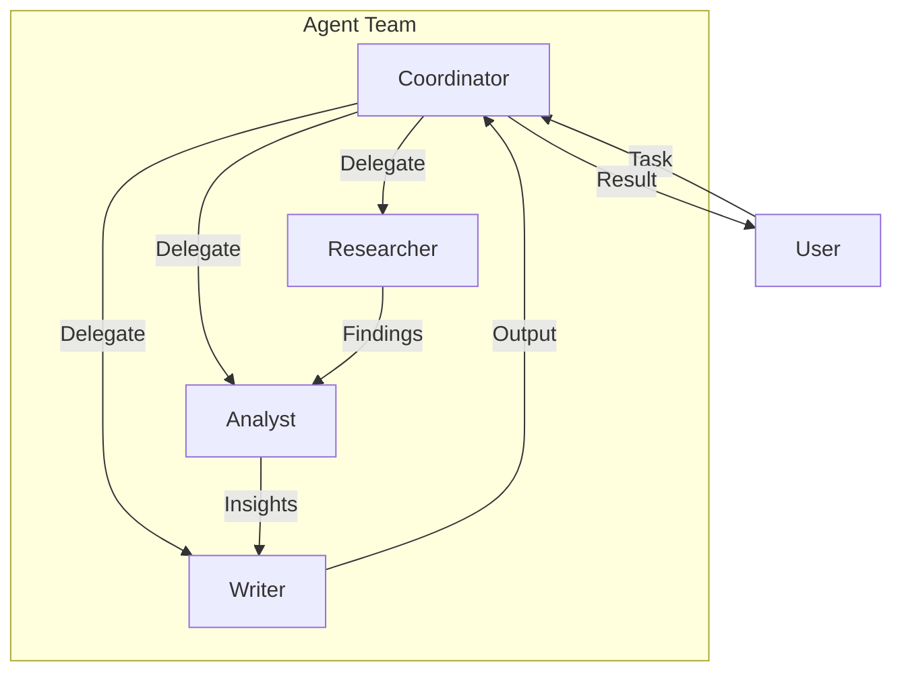

<!-- Clear Language: Keep sentences under 50 words -->
# Multi-Agent Systems

## Learning Objectives

| Objective | Description |
|-----------|-------------|
| LO1 | Understand multi-agent system design patterns and communication protocols |
| LO2 | Implement agent-to-agent communication with message passing |
| LO3 | Build coordinator/supervisor patterns for agent teams |
| LO4 | Design specialized agents with distinct roles and capabilities |
| LO5 | Implement conflict resolution and consensus mechanisms |

## Introduction

AI agents autonomously use tools to complete tasks. LangGraph builds stateful, multi-step agent workflows. This module covers agent architectures, tool use, memory, and production deployment.

## Prerequisites

- Basic programming knowledge
- Understanding of data structures

## Key Terminology

**Key Terms**: Core vocabulary and concepts for this topic.

**Definition**: Essential terms you must know for interviews and production work.

## Theory

Understanding multi agent systems is fundamental for AI engineers. This section covers the core concepts, underlying principles, and theoretical framework that govern how multi agent systems works in practice.

## Chapter at a Glance

| Section | Topic | Key Concept |
|---------|-------|-------------|
| 6.1 | Multi-Agent Patterns | Orchestration, collaboration, delegation |
| 6.2 | Agent Communication | Message passing, structured protocols |
| 6.3 | Coordinator Pattern | Central coordination for task distribution |
| 6.4 | Specialized Agents | Role-based agents with distinct expertise |
| 6.5 | Consensus & Conflict | Voting, arbitration, conflict resolution |
| 6.6 | Multi-Agent Evaluation | Team performance, coordination metrics |

## Chapter Roadmap



## 6.1 Multi-Agent Patterns

Multi-agent systems enable complex tasks through collaboration between specialized agents.

### Communication Patterns

```python
from dataclasses import dataclass, field
from typing import List, Dict, Any, Optional, Callable
from enum import Enum
import json
import time

class MessageType(Enum):
    TASK = "task"
    RESULT = "result"
    QUERY = "query"
    RESPONSE = "response"
    ERROR = "error"
    STATUS = "status"

@dataclass
class AgentMessage:
    sender: str
    recipient: str
    message_type: MessageType
    content: Any
    timestamp: float = field(default_factory=time.time)
    message_id: str = ""
    correlation_id: str = ""

class AgentBase:
    def __init__(self, name: str, role: str, llm_fn: Callable):
        self.name = name
        self.role = role
        self.llm = llm_fn
        self.mailbox: List[AgentMessage] = []

    def send(self, recipient: str, msg_type: MessageType, content: Any) -> AgentMessage:
        msg = AgentMessage(
            sender=self.name,
            recipient=recipient,
            message_type=msg_type,
            content=content,
        )
        return msg

    def receive(self, message: AgentMessage):
        self.mailbox.append(message)

    def process_mailbox(self):
        while self.mailbox:
            msg = self.mailbox.pop(0)
            self.handle_message(msg)

    def handle_message(self, message: AgentMessage):
        pass

    def __repr__(self):
        return f"{self.name} ({self.role})"

class ResearcherAgent(AgentBase):
    def __init__(self, name: str, llm_fn: Callable):
        super().__init__(name, "researcher", llm_fn)

    def handle_message(self, message: AgentMessage):
        if message.message_type == MessageType.TASK:
            result = self.llm(f"Research: {message.content}")
            return self.send(message.sender, MessageType.RESULT, result)

class AnalystAgent(AgentBase):
    def __init__(self, name: str, llm_fn: Callable):
        super().__init__(name, "analyst", llm_fn)

    def handle_message(self, message: AgentMessage):
        if message.message_type == MessageType.TASK:
            analysis = self.llm(f"Analyze: {message.content}")
            return self.send(message.sender, MessageType.RESULT, analysis)

print("Multi-agent base classes defined")
```

## 6.2 Agent Communication

### 6.2.1 Message Bus

```python
class MessageBus:
    def __init__(self):
        self.agents: Dict[str, AgentBase] = {}
        self.message_log: List[AgentMessage] = []

    def register(self, agent: AgentBase):
        self.agents[agent.name] = agent

    def send(self, message: AgentMessage):
        self.message_log.append(message)
        recipient = self.agents.get(message.recipient)
        if recipient:
            recipient.receive(message)

    def broadcast(self, sender: str, msg_type: MessageType, content: Any):
        for name in self.agents:
            if name != sender:
                msg = AgentMessage(sender=sender, recipient=name, message_type=msg_type, content=content)
                self.send(msg)

    def query(self, sender: str, recipient: str, content: Any) -> Optional[AgentMessage]:
        msg = AgentMessage(sender=sender, recipient=recipient, message_type=MessageType.QUERY, content=content)
        self.send(msg)

        agent = self.agents.get(recipient)
        if agent:
            agent.process_mailbox()
            if agent.mailbox:
                return agent.mailbox[-1]
        return None

    def get_history(self) -> List[Dict]:
        return [
            {"from": m.sender, "to": m.recipient, "type": m.message_type.value, "content": str(m.content)[:100]}
            for m in self.message_log
        ]

bus = MessageBus()
print("Message bus ready")
```

### 6.2.2 Structured Communication Protocol

```python
class CommunicationProtocol:
    def __init__(self, bus: MessageBus):
        self.bus = bus

    def request_response(self, sender: str, recipient: str, request: Dict, timeout: float = 5.0) -> Optional[Dict]:
        msg = AgentMessage(
            sender=sender,
            recipient=recipient,
            message_type=MessageType.QUERY,
            content=request,
        )
        self.bus.send(msg)
        return {"status": "sent", "request": request}

    def task_delegation(self, coordinator: str, worker: str, task: Dict) -> str:
        task_id = f"task-{time.time()}"
        msg = AgentMessage(
            sender=coordinator,
            recipient=worker,
            message_type=MessageType.TASK,
            content={**task, "task_id": task_id},
        )
        self.bus.send(msg)
        return task_id

    def status_report(self, agent_name: str, status: Dict):
        msg = AgentMessage(
            sender=agent_name,
            recipient="*coordinator*",
            message_type=MessageType.STATUS,
            content=status,
        )
        self.bus.broadcast(agent_name, MessageType.STATUS, status)

protocol = CommunicationProtocol(bus)
task_id = protocol.task_delegation("coordinator", "researcher", {"query": "AI trends"})
print(f"Delegated task: {task_id}")
```

### 6.2.3 Agent Discovery

```python
class AgentRegistry:
    def __init__(self):
        self.agents: Dict[str, Dict] = {}

    def register(self, name: str, role: str, capabilities: List[str], endpoint: str = ""):
        self.agents[name] = {
            "name": name,
            "role": role,
            "capabilities": capabilities,
            "status": "available",
            "endpoint": endpoint,
        }

    def find_by_capability(self, capability: str) -> List[Dict]:
        return [a for a in self.agents.values() if capability in a["capabilities"]]

    def find_by_role(self, role: str) -> List[Dict]:
        return [a for a in self.agents.values() if a["role"] == role]

    def set_status(self, name: str, status: str):
        if name in self.agents:
            self.agents[name]["status"] = status

    def list_available(self) -> List[Dict]:
        return [a for a in self.agents.values() if a["status"] == "available"]

registry = AgentRegistry()
registry.register("researcher-1", "researcher", ["web_search", "data_collection"])
registry.register("analyst-1", "analyst", ["data_analysis", "visualization"])
registry.register("writer-1", "writer", ["content_generation", "summarization"])

available = registry.find_by_capability("web_search")
print(f"Available for web_search: {[a['name'] for a in available]}")
```

## 6.3 Coordinator Pattern

### 6.3.1 Central Coordinator

```python
class CoordinatorAgent(AgentBase):
    def __init__(self, name: str, llm_fn: Callable, registry: AgentRegistry):
        super().__init__(name, "coordinator", llm_fn)
        self.registry = registry
        self.task_queue: List[Dict] = []
        self.task_results: Dict[str, Any] = {}

    def plan_task(self, task: str) -> List[Dict]:
        plan_prompt = f"""Plan how to accomplish this task using specialized agents.

Available agents:
{chr(10).join(f'- {a["name"]} ({a["role"]}): {a["capabilities"]}' for a in self.registry.list_available())}

Task: {task}

For each step, specify which agent should handle it and what input to provide.
Respond as JSON list: [{{"agent": "name", "input": "instructions"}}]"""
        plan_str = self.llm(plan_prompt)
        try:
            return json.loads(plan_str)
        except json.JSONDecodeError:
            return [{"agent": self.registry.list_available()[0]["name"], "input": task}]

    def execute_plan(self, plan: List[Dict], bus: MessageBus) -> Dict:
        for step in plan:
            agent_name = step["agent"]
            task_msg = AgentMessage(
                sender=self.name,
                recipient=agent_name,
                message_type=MessageType.TASK,
                content=step["input"],
            )
            bus.send(task_msg)
            self.task_queue.append({"agent": agent_name, "task": step, "status": "dispatched"})
        return {"status": "dispatched", "num_tasks": len(plan)}

    def collect_results(self, bus: MessageBus) -> Dict:
        results = {}
        for item in self.task_queue:
            agent = bus.agents.get(item["agent"])
            if agent and agent.mailbox:
                last_msg = agent.mailbox[-1]
                results[item["agent"]] = last_msg.content
        return results

coordinator = CoordinatorAgent("coordinator", lambda p: json.dumps([{"agent": "researcher-1", "input": "research task"}]), registry)
print("Coordinator ready")
```

### 6.3.2 Dynamic Task Distribution

```python
class WorkDistributor:
    def __init__(self, coordinator: CoordinatorAgent, bus: MessageBus):
        self.coordinator = coordinator
        self.bus = bus

    def distribute(self, task: str, strategy: str = "capability") -> Dict:
        if strategy == "capability":
            return self._distribute_by_capability(task)
        elif strategy == "round_robin":
            return self._distribute_round_robin(task)
        elif strategy == "load_balanced":
            return self._distribute_load_balanced(task)
        return {}

    def _distribute_by_capability(self, task: str) -> Dict:
        plan = self.coordinator.plan_task(task)
        return self.coordinator.execute_plan(plan, self.bus)

    def _distribute_round_robin(self, task: str) -> Dict:
        agents = self.coordinator.registry.list_available()
        if not agents:
            return {"error": "No agents available"}
        agent = agents[len(self.coordinator.task_queue) % len(agents)]
        return {"strategy": "round_robin", "assigned_to": agent["name"]}

    def _distribute_load_balanced(self, task: str) -> Dict:
        agents = self.coordinator.registry.list_available()
        agent_loads = {a["name"]: 0 for a in agents}
        for t in self.coordinator.task_queue:
            if t["agent"] in agent_loads:
                agent_loads[t["agent"]] += 1
        least_loaded = min(agent_loads, key=agent_loads.get)
        return {"strategy": "load_balanced", "assigned_to": least_loaded}

distributor = WorkDistributor(coordinator, bus)
result = distributor.distribute("Research AI trends", "round_robin")
print(f"Distribution: {result}")
```

## 6.4 Specialized Agents

### 6.4.1 Role Definitions

```python
class RoleDefinitions:
    @staticmethod
    def create_researcher(name: str, llm_fn: Callable) -> AgentBase:
        agent = AgentBase(name, "researcher", llm_fn)
        agent.__class__ = ResearcherAgent
        return agent

    @staticmethod
    def create_analyst(name: str, llm_fn: Callable) -> AgentBase:
        agent = AgentBase(name, "analyst", llm_fn)
        return agent

    @staticmethod
    def create_writer(name: str, llm_fn: Callable) -> AgentBase:
        writer_prompt = "You are a professional writer specializing in clear, engaging content."

        def write_content(state: Dict) -> Dict:
            return {"content": f"Written content based on: {state.get('findings', '')}"}

        agent = AgentBase(name, "writer", llm_fn)
        return agent

    @staticmethod
    def create_quality_assurance(name: str, llm_fn: Callable) -> AgentBase:
        def review(state: Dict) -> Dict:
            return {"review": "Content meets quality standards."}

        agent = AgentBase(name, "qa", llm_fn)
        return agent

researcher = RoleDefinitions.create_researcher("researcher-1", lambda p: "Research findings.")
analyst = RoleDefinitions.create_analyst("analyst-1", lambda p: "Analysis complete.")
print(f"Created specialized agents")
```

### 6.4.2 Agent Pipeline

```python
class AgentPipeline:
    def __init__(self, stages: List[str]):
        self.stages = stages
        self.results: Dict[str, Any] = {}

    def run(self, initial_input: str, agents: Dict[str, AgentBase], bus: MessageBus) -> str:
        current_input = initial_input

        for stage in self.stages:
            agent = agents.get(stage)
            if not agent:
                continue

            msg = AgentMessage(sender="pipeline", recipient=stage, message_type=MessageType.TASK, content=current_input)
            bus.send(msg)
            agent.process_mailbox()

            if agent.mailbox:
                last = agent.mailbox[-1]
                self.results[stage] = last.content
                current_input = last.content if isinstance(last.content, str) else str(last.content)

        return current_input

pipeline = AgentPipeline(["researcher-1", "analyst-1"])
print("Agent pipeline configured")
```

## 6.5 Consensus & Conflict

### 6.5.1 Voting Mechanism

```python
class VotingMechanism:
    def __init__(self):
        self.votes: Dict[str, List[str]] = {}

    def request_vote(self, proposal: str, voters: List[AgentBase]) -> Dict[str, int]:
        tally = {}
        for voter in voters:
            response = voter.llm(f"Vote YES or NO on: {proposal}")
            decision = "YES" if "YES" in response.upper() else "NO"
            tally[voter.name] = decision

        yes_votes = sum(1 for v in tally.values() if v == "YES")
        no_votes = sum(1 for v in tally.values() if v == "NO")
        self.votes[proposal] = list(tally.values())

        return {
            "proposal": proposal,
            "yes": yes_votes,
            "no": no_votes,
            "passed": yes_votes > no_votes,
        }

    def weighted_vote(self, proposal: str, voters: List[tuple]) -> Dict:
        total_weight = sum(w for _, w in voters)
        yes_weight = 0

        for voter, weight in voters:
            response = voter.llm(f"Vote YES or NO on: {proposal}")
            if "YES" in response.upper():
                yes_weight += weight

        return {
            "proposal": proposal,
            "yes_weight": yes_weight,
            "no_weight": total_weight - yes_weight,
            "passed": yes_weight > total_weight / 2,
        }

voting = VotingMechanism()
voters = [
    AgentBase("voter-1", "voter", lambda p: "YES"),
    AgentBase("voter-2", "voter", lambda p: "NO"),
    AgentBase("voter-3", "voter", lambda p: "YES"),
]
result = voting.request_vote("Should we use Python for this project?", voters)
print(f"Vote result: {result['passed']} (YES: {result['yes']}, NO: {result['no']})")
```

### 6.5.2 Conflict Resolution

```python
class ConflictResolver:
    def __init__(self, arbitrator: AgentBase):
        self.arbitrator = arbitrator
        self.conflicts: List[Dict] = []

    def detect_conflict(self, agent_a: AgentBase, agent_b: AgentBase, issue: str) -> bool:
        response_a = agent_a.llm(f"What is your position on: {issue}")
        response_b = agent_b.llm(f"What is your position on: {issue}")

        positions_differ = response_a[:100] != response_b[:100]

        if positions_differ:
            self.conflicts.append({
                "agents": [agent_a.name, agent_b.name],
                "issue": issue,
                "positions": [response_a[:100], response_b[:100]],
            })
        return positions_differ

    def resolve(self, conflict: Dict) -> str:
        resolution_prompt = f"""Resolve this conflict between agents.

Issue: {conflict['issue']}
Position 1: {conflict['positions'][0]}
Position 2: {conflict['positions'][1]}

Provide a resolution that incorporates the best of both positions:"""
        resolution = self.arbitrator.llm(resolution_prompt)
        conflict["resolution"] = resolution
        return resolution

arbitrator = AgentBase("arbitrator", "arbitrator", lambda p: "Compromise resolution.")
resolver = ConflictResolver(arbitrator)
print("Conflict resolver ready")
```

### 6.5.3 Consensus Building

```python
class ConsensusBuilder:
    def __init__(self, agents: List[AgentBase], max_rounds: int = 5):
        self.agents = agents
        self.max_rounds = max_rounds

    def build_consensus(self, topic: str) -> Dict:
        positions = {}
        for agent in self.agents:
            positions[agent.name] = agent.llm(f"State your position on: {topic}")

        for round_num in range(self.max_rounds):
            if self._check_agreement(positions):
                return {"topic": topic, "consensus": True, "final_position": list(positions.values())[0], "rounds": round_num}

            for agent in self.agents:
                others = [p for n, p in positions.items() if n != agent.name]
                consensus_prompt = f"""Current positions:
{chr(10).join(f'- {n}: {p[:200]}' for n, p in positions.items())}

Your position was: {positions[agent.name][:200]}

Can you adjust to reach consensus? Respond with your revised position."""
                positions[agent.name] = agent.llm(consensus_prompt)

        return {"topic": topic, "consensus": False, "positions": positions, "rounds": self.max_rounds}

    def _check_agreement(self, positions: Dict) -> bool:
        values = list(positions.values())
        if len(values) < 2:
            return True
        first = values[0][:200]
        return all(v[:200] == first for v in values[1:])

builder = ConsensusBuilder(voters, max_rounds=3)
print("Consensus builder ready")
```

## 6.6 Multi-Agent Evaluation

### 6.6.1 Team Performance Metrics

```python
class TeamPerformance:
    def __init__(self):
        self.metrics = {
            "tasks_completed": 0,
            "avg_completion_time": 0.0,
            "conflicts_resolved": 0,
            "messages_exchanged": 0,
            "consensus_rate": 0.0,
        }
        self.task_times: List[float] = []
        self.consensus_count = 0
        self.total_decisions = 0

    def record_task(self, duration: float):
        self.task_times.append(duration)
        self.metrics["tasks_completed"] += 1

    def record_conflict_resolved(self):
        self.metrics["conflicts_resolved"] += 1

    def record_message(self):
        self.metrics["messages_exchanged"] += 1

    def record_decision(self, reached_consensus: bool):
        self.total_decisions += 1
        if reached_consensus:
            self.consensus_count += 1
        self.metrics["consensus_rate"] = self.consensus_count / self.total_decisions if self.total_decisions > 0 else 0

    def report(self) -> Dict:
        if self.task_times:
            self.metrics["avg_completion_time"] = sum(self.task_times) / len(self.task_times)
        return dict(self.metrics)

perf = TeamPerformance()
perf.record_task(2.5)
perf.record_task(3.0)
perf.record_message()
perf.record_decision(True)
print(f"Team performance: {perf.report()}")
```

### 6.6.2 Agent Contribution Analysis

```python
class ContributionAnalyzer:
    def __init__(self, bus: MessageBus):
        self.bus = bus

    def analyze(self) -> Dict[str, Dict]:
        history = self.bus.get_history()
        agent_stats = defaultdict(lambda: {"sent": 0, "received": 0, "tasks": 0})

        for entry in history:
            agent_stats[entry["from"]]["sent"] += 1
            agent_stats[entry["to"]]["received"] += 1
            if entry["type"] == "task":
                agent_stats[entry["to"]]["tasks"] += 1

        return {
            agent: {
                "messages_sent": stats["sent"],
                "messages_received": stats["received"],
                "tasks_assigned": stats["tasks"],
                "contribution_score": round((stats["sent"] + stats["tasks"]) / max(stats["received"], 1), 2),
            }
            for agent, stats in agent_stats.items()
        }

analyzer = ContributionAnalyzer(bus)
print("Contribution analyzer ready")
```

## Summary

Multi-agent systems enable complex task completion through collaboration between specialized agents. Communication protocols define how agents exchange messages via a message bus. The coordinator.
pattern uses a central agent to plan and distribute tasks. Specialized agents (researcher, analyst, writer, QA) each contribute distinct capabilities. Conflict resolution mechanisms include voting,.
arbitration, and consensus building. Team performance metrics track task completion, conflict resolution, message volume, and consensus rate. Multi-agent architectures excel at tasks requiring diverse expertise and.
parallel execution.

## Practical Takeaways

| Takeaway | Description |
|----------|-------------|
| Define clear roles | Each agent should have a specific, non-overlapping responsibility |
| Use structured messages | Typed messages (task, result, error) improve reliability |
| Implement conflict resolution | Disagreements are inevitable — have a resolution strategy |
| Monitor team health | Track message volume, task completion, and conflict rates |
| Start with coordinator | Central coordination is simpler to debug than fully decentralized systems |

## Interview Q&A

<details class="tp-qa-card" data-qid="ag06-q1">
  <summary class="tp-qa-question">
    <span class="tp-qa-status"></span>
    Q1: What are the main multi-agent communication patterns?
  </summary>
  <div class="tp-qa-answer">
<p>Multi-agent systems use several communication patterns. Point-to-point: one agent sends a message directly to another specific agent, useful for delegation. Broadcast: one agent sends a message to all other agents,.
useful for announcements or task distribution. Supervisor-based: a special supervisor agent receives updates from all workers, makes decisions, and assigns tasks — this centralizes coordination. Blackboard-based: agents share a common state/board where they write results and.
read others' contributions — this decouples agents from knowing about each other. Hierarchical: agents are organized in a tree, with parent agents delegating to children and.
aggregating results. The choice depends on the task: supervisor patterns work for complex workflows with decisions, blackboard patterns work for collaborative problem-solving where agents contribute incrementally,.
and point-to-point works for simple delegation.</p>
  </div>
  <button class="tp-qa-mark-btn">✅ Mark Reviewed</button>
  <button class="tp-qa-bookmark-btn">🔖 Bookmark</button>
</details>

<details class="tp-qa-card" data-qid="ag06-q2">
  <summary class="tp-qa-question">
    <span class="tp-qa-status"></span>
    Q2: What is the supervisor-orchestrator pattern?
  </summary>
  <div class="tp-qa-answer">
<p>The supervisor-orchestrator pattern uses a central supervisor agent that coordinates multiple worker agents. The supervisor receives the user's request, breaks it into subtasks,.
assigns each subtask to a specialized worker agent (researcher, coder, reviewer), monitors progress, handles failures (reassigning failed tasks), and compiles the final response. Worker agents report their results back to the supervisor,.
which decides next steps. The supervisor maintains the global state and has visibility into all workers' outputs. This pattern centralizes decision-making,.
making it easier to enforce policies and track progress. The main limitation is that the supervisor becomes a single point of failure and.
a potential bottleneck. Implementation uses LangGraph with a supervisor node that has conditional edges to worker nodes, and worker nodes that always route back to the supervisor.</p>
  </div>
  <button class="tp-qa-mark-btn">✅ Mark Reviewed</button>
  <button class="tp-qa-bookmark-btn">🔖 Bookmark</button>
</details>

<details class="tp-qa-card" data-qid="ag06-q3">
  <summary class="tp-qa-question">
    <span class="tp-qa-status"></span>
    Q3: What is peer-to-peer agent collaboration?
  </summary>
  <div class="tp-qa-answer">
<p>Peer-to-peer agent collaboration allows agents to communicate directly without a central coordinator. Each agent has an address or identifier and can send messages to specific peers. A P2P network layer handles message routing,.
delivery guarantees, and agent discovery. Agents broadcast their capabilities on join, and other agents build a capability index for routing messages to the right peer. This pattern is more robust than supervisor-based (no single point of failure) but.
requires more complex coordination logic — agents must handle negotiation, conflict resolution, and consensus on their own. P2P is used in decentralized AI systems and.
scenarios where no single entity should have full control. The reliability manager tracks message delivery, retries failures, detects agent unavailability, and.
finds alternative agents with similar capabilities.</p>
  </div>
  <button class="tp-qa-mark-btn">✅ Mark Reviewed</button>
  <button class="tp-qa-bookmark-btn">🔖 Bookmark</button>
</details>

<details class="tp-qa-card" data-qid="ag06-q4">
  <summary class="tp-qa-question">
    <span class="tp-qa-status"></span>
    Q4: How do you handle agent handoff?
  </summary>
  <div class="tp-qa-answer">
<p>Agent handoff transfers a conversation or task from one agent to another when the current agent can't handle it. Implementation: when an agent determines it cannot fulfill a request (missing capabilities,.
insufficient permissions, domain mismatch), it serializes the current context (conversation history, state, artifacts) into a handoff message and sends it to a handoff manager. The handoff manager examines the context,.
finds the best-suited agent based on capability matching and current load, and transfers the context. The receiving agent deserializes the context and.
continues the conversation seamlessly. Important considerations: preserving context continuity (the user shouldn't notice the handoff), authorization (can this agent hand off to that agent?),.
and fallback (what if no suitable agent exists?). Handoff can be automatic (agent detects it's out of scope) or user-initiated ("connect me to a billing specialist").</p>
  </div>
  <button class="tp-qa-mark-btn">✅ Mark Reviewed</button>
  <button class="tp-qa-bookmark-btn">🔖 Bookmark</button>
</details>

<details class="tp-qa-card" data-qid="ag06-q5">
  <summary class="tp-qa-question">
    <span class="tp-qa-status"></span>
    Q5: What is the blackboard collaborative pattern?
  </summary>
  <div class="tp-qa-answer">
<p>The blackboard pattern uses a shared data store (the blackboard) that all agents can read from and write to. Agents work independently and.
asynchronously, each contributing to the blackboard when they have relevant input. A controller agent monitors the blackboard for completion conditions and.
decides when enough information has been gathered. The blackboard stores structured data entries with metadata: contributor agent ID, timestamp, confidence score,.
and status (proposed, verified, accepted). Agents subscribe to specific entry types and are notified when relevant entries appear. This pattern excels for.
problems where multiple perspectives are needed — like diagnosis (multiple specialists contribute findings), document creation (different sections written by different agents),.
or data analysis (multiple algorithms analyze and cross-validate). The main challenge is managing the blackboard content — resolving conflicts between contradictory entries and.
avoiding information overload.</p>
  </div>
  <button class="tp-qa-mark-btn">✅ Mark Reviewed</button>
  <button class="tp-qa-bookmark-btn">🔖 Bookmark</button>
</details>

<details class="tp-qa-card" data-qid="ag06-q6">
  <summary class="tp-qa-question">
    <span class="tp-qa-status"></span>
    Q6: How do you design a team configuration for multi-agent systems?
  </summary>
  <div class="tp-qa-answer">
<p>Team configuration defines which agents participate in a multi-agent system and how they should interact. Configuration data includes: agent roles and.
capabilities, communication topology (who can talk to whom), leader designation, fallback hierarchy, and interaction rules. Using a declarative YAML or JSON config file,.
you specify each agent's class, specialized tools, model settings, and limits (max iterations, max cost). The configuration is loaded at startup to instantiate agents and.
wire up the communication graph. Benefits of declarative config: (1) non-developers can define teams; (2) A/B testing different team structures; (3) dynamic team composition based on task requirements. A <code>TeamConfig</code> class validates configuration (references between agents,.
required fields) and provides factory methods to create the team runtime.</p>
  </div>
  <button class="tp-qa-mark-btn">✅ Mark Reviewed</button>
  <button class="tp-qa-bookmark-btn">🔖 Bookmark</button>
</details>

<details class="tp-qa-card" data-qid="ag06-q7">
  <summary class="tp-qa-question">
    <span class="tp-qa-status"></span>
    Q7: How do you handle conflicts in multi-agent collaboration?
  </summary>
  <div class="tp-qa-answer">
<p>Conflicts arise when agents produce contradictory outputs or disagree on a course of action. Resolution strategies: (1) voting — each agent votes and.
the majority decision wins; (2) confidence-weighted selection — each output has a confidence score, and the highest-confidence output is chosen; (3) arbitration — a designated arbitrator.
agent reviews conflicting outputs and makes the final decision; (4) evidence-based reconciliation — agents present supporting evidence and the best-supported output wins;.
(5) consensus seeking — agents negotiate until they reach agreement (iterative, may be expensive). The choice depends on the domain — for.
factual questions, confidence-weighted or evidence-based works well; for subjective decisions, voting or arbitration may be better. Implementation logs all conflicts and.
resolutions for audit and debugging. A conflict manager routes conflicting outputs to the appropriate resolution strategy based on the conflict type.</p>
  </div>
  <button class="tp-qa-mark-btn">✅ Mark Reviewed</button>
  <button class="tp-qa-bookmark-btn">🔖 Bookmark</button>
</details>

<details class="tp-qa-card" data-qid="ag06-q8">
  <summary class="tp-qa-question">
    <span class="tp-qa-status"></span>
    Q8: How do you implement a peer-to-peer network for agents?
  </summary>
  <div class="tp-qa-answer">
<p>A peer-to-peer agent network connects agents directly without a central message broker. Implementation: each agent runs a lightweight server (e.g., using HTTP or.
WebSockets) that accepts messages from other agents. A discovery service (using a registry or distributed hash table) maintains the list of active agents and.
their capabilities. When an agent wants to send a message to a peer, it queries the discovery service for the target's address,.
then sends the message directly. Message delivery is handled by a reliable transport layer — if the target is unavailable, the message is queued and.
retried. Key features: (1) dynamic join/leave — agents can join or leave without disrupting the network; (2) capability-based routing — messages are routed to agents that can handle them;.
(3) fault tolerance — if an agent fails, others can take over its responsibilities. This pattern is more complex than centralized approaches but.
provides better scalability and resilience.</p>
  </div>
  <button class="tp-qa-mark-btn">✅ Mark Reviewed</button>
  <button class="tp-qa-bookmark-btn">🔖 Bookmark</button>
</details>

<details class="tp-qa-card" data-qid="ag06-q9">
  <summary class="tp-qa-question">
    <span class="tp-qa-status"></span>
    Q9: What is the hierarchical agent pattern?
  </summary>
  <div class="tp-qa-answer">
<p>The hierarchical agent pattern organizes agents in a tree structure where parent agents delegate tasks to child agents and aggregate results. A CEO agent at the top receives high-level goals and.
breaks them into department-level tasks. Department managers further decompose tasks for their team members. Each level abstracts complexity — the CEO doesn't know how individual agents work,.
only what each department can deliver. Benefits: (1) natural decomposition of complex tasks; (2) clear chains of command and responsibility; (3) each level can be tested independently;.
(4) scales well — add more agents at any level without affecting other levels. Drawbacks: (1) slower decisions due to multiple layers;.
(2) information loss as messages pass through layers; (3) rigid structure may not fit all problems. Implementation uses a recursive pattern — each parent agent acts as a supervisor.
for its children, and the same communication protocol works at every level.</p>
  </div>
  <button class="tp-qa-mark-btn">✅ Mark Reviewed</button>
  <button class="tp-qa-bookmark-btn">🔖 Bookmark</button>
</details>

<details class="tp-qa-card" data-qid="ag06-q10">
  <summary class="tp-qa-question">
    <span class="tp-qa-status"></span>
    Q10: How do you design a multi-agent system for code generation?
  </summary>
  <div class="tp-qa-answer">
<p>A multi-agent code generation system uses specialized agents for different aspects of software development. Typical roles: ProductManager — writes specifications and.
acceptance criteria; Architect — designs system architecture, component diagrams, API contracts; Developer — writes code implementing the architecture; Reviewer — reviews code for.
bugs, style issues, security vulnerabilities; Tester — writes and runs tests; DevOps — handles deployment configuration. The process flows through agents sequentially or.
iteratively: ProductManager → Architect → Developer → Reviewer → Tester, with loops back to Developer if issues are found. Each agent has access to specialized tools: Developer can read/write files and.
run linters; Reviewer can run static analysis; Tester can execute test suites. The system maintains a shared state including requirements, architecture documents,.
source files, and test results. This pattern mirrors real-world development teams and produces higher quality code than a single agent approach.</p>
  </div>
  <button class="tp-qa-mark-btn">✅ Mark Reviewed</button>
  <button class="tp-qa-bookmark-btn">🔖 Bookmark</button>
</details>

## Chapter Quiz

<details data-qid="agent-s6-quiz1">
<summary><strong>1.</strong> What is the role of a coordinator agent in a multi-agent system?</summary>
A. Execute all tasks
B. Plan and distribute tasks to specialized agents
C. Store agent memories
D. Generate responses
Answer: B
</details>

<details data-qid="agent-s6-quiz2">
<summary><strong>2.</strong> How do agents communicate in a multi-agent system?</summary>
A. Through shared files
B. Through structured messages on a message bus
C. Through direct API calls
D. Through database writes
Answer: B
</details>

<details data-qid="agent-s6-quiz3">
<summary><strong>3.</strong> What is a common method for resolving conflicts between agents?</summary>
A. Random selection
B. Voting or arbitration by a neutral agent
C. Ignoring the conflict
D. Both agents go first
Answer: B
</details>

<details data-qid="agent-s6-quiz4">
<summary><strong>4.</strong> What does an agent registry provide in a multi-agent system?</summary>
A. Tool definitions
B. Agent discovery by role and capability
C. Message storage
D. Performance metrics
Answer: B
</details>

<details data-qid="agent-s6-quiz5">
<summary><strong>5.</strong> Which metric indicates how well a multi-agent team collaborates?</summary>
A. Individual agent speed
B. Consensus rate on decisions
C. Number of tools per agent
D. Memory size per agent
Answer: B
</details>

## Exercises

## Common Mistakes

1. Not understanding the fundamental concepts before applying them
2. Skipping edge cases in implementation
3. Not analyzing time/space complexity
4. Forgetting to handle null/empty inputs
5. Not practicing enough problems to build pattern recognition1. Implement a multi-agent system with 3 specialized agents (researcher, analyst, writer) and a coordinator. The coordinator should decompose a complex research question and delegate to each agent. Show the full communication flow.

2. Build a message bus with structured message types (task, result, query, error, status). Demonstrate 10 message exchanges between 3 agents with correct routing.

3. Create a voting mechanism for 5 agents to decide on a course of action. Implement both simple majority and weighted voting. Show a scenario where weighted voting changes the outcome.

4. Design a conflict resolution protocol where two agents disagree on approach and an arbitrator agent resolves the conflict. Show the positions and final resolution.

5. Implement a team performance dashboard that tracks tasks completed, average completion time, conflicts resolved, and messages exchanged. Simulate 10 tasks and generate

## Revision Notes

- - Core principle: Understand the fundamental concepts thoroughly
- - Implementation pattern: Practice with real code examples
- - Complexity: Know the time and space complexity
- - Application: Know when to use this in production systems
- - Interview: Frequently asked in technical interviews
- - Edge cases: Consider common failure scenarios
- - Related concepts: Connect to broader system design

## Placement Section

### Top 10 Interview Questions

#### Google Style

1. **Explain the core idea of Multi-Agent Systems in under 60 seconds, then give a real-world analogy.** — Structure: definition, how it works in one sentence, why it matters, analogy. Follow-up: what would break if you removed this from a production system?

2. **Design a minimal, well-typed function that demonstrates Multi-Agent Systems.** — Interviewer checks: signature with type hints, edge cases, complexity, and a clean docstring. Follow-up: how does your design behave with empty or malformed input?

3. **What are the common pitfalls when engineers first learn ** — List 3-4, then explain how you would prevent each in a code review.

#### Amazon Style

4. **Describe a production bug caused by misunderstanding Multi-Agent Systems. How did you diagnose and fix it?** — STAR format: situation, task, action, result. Mention logs, reproduction, root-cause analysis, and the regression test you added.

5. **How would you scale a system that relies on Multi-Agent Systems from 10 users to 10 million?** — Discuss bottlenecks, caching, monitoring, and when to redesign. Follow-up: what metrics would you track?

#### Microsoft Style

6. **Compare Multi-Agent Systems with the closest alternative approach. When would you choose each?** — Make a decision matrix: performance, maintainability, ecosystem, learning curve. Follow-up: what would change your decision?

7. **Walk through how you would test a component that depends on Multi-Agent Systems.** — Unit, integration, property-based tests; mocking boundaries; golden files for outputs.

#### NVIDIA Style

8. **How does Multi-Agent Systems behave differently at scale — memory, throughput, or precision-wise?** — Connect to data pipelines and model training if applicable. Follow-up: what happens to latency as input grows?

9. **How would you make an implementation of Multi-Agent Systems run faster on GPU hardware?** — Batch operations, vectorization, avoiding Python loops, reducing data movement.

#### AI Startup Style

10. **Write the smallest possible implementation of Multi-Agent Systems that is production-quality.** — Include error handling, type hints, and a one-line docstring. Follow-up: what would you refactor first when it grows?

### Resume Tips

- Name Multi-Agent Systems explicitly in your skills section, paired with a measurable achievement ("Reduced X by 40% using Multi-Agent Systems").
- Add a bullet describing a project that applies Multi-Agent Systems to real data, with numbers.
- Mention the tools and libraries you used alongside Multi-Agent Systems (linters, test frameworks, profiling tools).
- Keep resume bullets under 15 words and start each with an action verb.

### Interview Day Checklist

- Rehearse a 60-second explanation of Multi-Agent Systems and one real-world analogy.
- Prepare one STAR story about debugging a Multi-Agent Systems-related production issue.
- Review complexity and edge cases for the classic Multi-Agent Systems interview problem.
- Have questions ready: how does the team apply Multi-Agent Systems in production today?
- Test your environment (Python, editor, internet) 15 minutes before the interview.

## True/False

1. **True or False:** Multi-Agent Systems builds directly on the fundamentals covered in the earlier chapters of this module. — **True.** Every advanced topic in this module assumes the core concepts from the previous chapters.
2. **True or False:** You should write at least one code example for Multi-Agent Systems before moving to the next chapter. — **True.** Active recall with hands-on code beats passive reading for retention.
3. **True or False:** The complexity analysis for Multi-Agent Systems is the same regardless of input size. — **False.** Complexity grows with input size; always state best, average, and worst case.
4. **True or False:** Edge cases (empty input, invalid input, boundary values) matter for Multi-Agent Systems in production. — **True.** Most production bugs come from unhandled edge cases.
5. **True or False:** You should memorize the Multi-Agent Systems chapter content once and never review it again. — **False.** Spaced repetition (24h, 3 days, 1 week) dramatically improves long-term recall.

## Fill in the Blank

1. The chapter that covers Multi-Agent Systems is Chapter ___ of this module. — Answer: check the module's table of contents.
2. The time complexity of the standard approach to Multi-Agent Systems is ___. — Answer: review the theory section and state big-O notation.
3. The main edge case to handle when implementing Multi-Agent Systems is ___. — Answer: empty or invalid input handling, as discussed in the chapter.
4. The tools commonly used to debug Multi-Agent Systems issues are ___ and ___. — Answer: refer to the Debugging Guide section of this chapter.
5. The related topic that connects to Multi-Agent Systems in the next chapter is ___. — Answer: see the Next Topic section.

## Scenario Questions

1. **Scenario:** A teammate ships a change involving Multi-Agent Systems that breaks production at 3 AM. — Diagnosis: check the recent diff, reproduce locally with the failing input, check logs. Fix: revert, add a regression test, and review the root cause. Prevention: CI tests on edge cases and code review checklist.

2. **Scenario:** Your implementation of Multi-Agent Systems is correct but too slow for the required latency. — Measure first with a profiler. Common fixes: reduce redundant work, use built-in optimized functions, batch operations, or add caching. Only then consider algorithmic changes.

3. **Scenario:** A new hire asks you to explain Multi-Agent Systems in five minutes before a customer demo. — Use the 3-part answer: what it is (one sentence), how it works (one example), why it matters (one business impact). Then offer to go deeper after the demo.

4. **Scenario:** Your team's codebase has three different patterns for Multi-Agent Systems and you must standardize. — Write a short ADR (architecture decision record), pick the pattern with best maintainability, migrate incrementally, and add a linter rule to enforce it.

## Output Questions

1. **What is the output of the simplest correct implementation of Multi-Agent Systems on an empty input?** — Trace through the code: it should return the documented default (None, 0, empty collection) without raising.
2. **What is the output when the input is at the boundary value?** — Check off-by-one errors and inclusive/exclusive bounds in the chapter's examples.
3. **What does the implementation return when given invalid input types?** — With type hints and validation, it raises a clear error; without, it may fail silently.
4. **What is the output for the sample input given in the chapter's Examples section?** — Re-run the chapter's example code and compare against the documented output.
5. **What is the time complexity output when you profile the implementation at 10x input size?** — Expect the curve matching the chapter's complexity analysis (linear, quadratic, log-linear).

## Difficulty Level

| Level | Time | What It Takes |
|-------|------|---------------|
| Beginner | 1-2 sessions | Read theory, run the chapter examples, solve the Easy exercises |
| Intermediate | 3-5 sessions | Complete Medium exercises, explain Multi-Agent Systems to someone else |
| Advanced | 1+ week | Solve Hard exercises, optimize for real datasets, answer interview follow-ups |

## Tips & Tricks

- Always write a one-line example of Multi-Agent Systems from memory before opening the chapter — active recall first.
- Use the chapter's Revision Notes as a checklist: you have mastered Multi-Agent Systems when you can explain each bullet.
- Pair the chapter quiz with the Flashcards: wrong answers become your next study session's focus.
- For interviews, practice explaining Multi-Agent Systems twice: once with a technical audience, once with a non-technical audience.
- Keep a personal examples file where you collect your own Multi-Agent Systems snippets; interviewers love original examples.

## Memory Tricks

- **Acronym**: build a mnemonic from the 5 key concepts of Multi-Agent Systems listed in the Chapter at a Glance table.
- **Story**: link Multi-Agent Systems to a familiar story — the analogy in the Visual Analogy section is designed to stick.
- **Number anchor**: remember the complexity of Multi-Agent Systems by connecting it to a known algorithm of the same class.
- **Color code**: highlight the Theory, Examples, and Common Mistakes sections in different colors when reviewing.
- **Teach-back**: explain Multi-Agent Systems to an imaginary junior engineer for 2 minutes — gaps in your explanation are gaps in memory.

## Further Reading

- Official documentation for the primary tool or library used in this chapter
- The chapter referenced in Related Topics for the next-level treatment of Multi-Agent Systems
- The classic textbook chapter on Multi-Agent Systems (check the Research References below)
- Two blog posts from engineers who debugged real Multi-Agent Systems problems in production
- The repository of the open-source project that implements Multi-Agent Systems

## Related Topics

- The previous chapter in this module (see table of contents) — foundational for Multi-Agent Systems
- The next chapter (see Next Topic below) — builds on Multi-Agent Systems
- The system design chapters in Module 07 — how Multi-Agent Systems fits into production architectures
- The interview preparation module — how Multi-Agent Systems is asked in screening rounds
- The capstone project — where Multi-Agent Systems is applied end-to-end

## FAQs

1. **Do I need to memorize all of Multi-Agent Systems, or understand the big picture?** — Understand the big picture first, then memorize the key facts via flashcards and spaced repetition. Interviewers reward depth over breadth.
2. **What if I get stuck on an exercise?** — Re-read the theory section, run the example code, then attempt again. If still stuck after 20 minutes, move on and return the next day.
3. **How much time should I spend on ** — Follow the Study Plan below: 1-2 weeks at 30-60 minutes daily is typical for placement preparation.
4. **Is Multi-Agent Systems asked in interviews?** — Yes — the Interview Q&A and Placement Section list the exact question styles used by top companies.
5. **What's the fastest way to master ** — Explain it out loud, write code without looking, and review the flashcards within 24 hours and again after 3 days.

## Important Notes

- Multi-Agent Systems is a core requirement for the rest of this module — do not skip the examples.
- Always analyze complexity (time and space) when working with Multi-Agent Systems.
- Production correctness means handling edge cases, not just the happy path.
- Interview answers should start with the definition, then the example, then the trade-offs.
- Revisit this chapter after finishing the module; the context from later chapters deepens understanding.

## Historical Context

- Multi-Agent Systems emerged as a standard practice because early systems failed without it — understanding why helps you explain it in interviews.
- The tools used for Multi-Agent Systems today evolved from simpler versions; the chapter covers the modern, recommended approach.
- Interviewers value knowing one historical fact about Multi-Agent Systems — it shows genuine interest, not just cramming.
- The library/tooling ecosystem around Multi-Agent Systems changes quickly; focus on fundamentals that remain stable.

## Security Considerations

- Never trust external input: validate and sanitize data before processing Multi-Agent Systems.
- Avoid `eval()` and dynamic code execution on untrusted strings.
- Log errors without leaking sensitive data (keys, PII, internal paths).
- For API contexts, add rate limiting and input size limits.
- Review the chapter's code examples for injection or overflow risks before using them verbatim.

## ML Intuition

- Multi-Agent Systems appears in ML pipelines at the data-processing layer: feature preparation, batching, and validation.
- Understanding Multi-Agent Systems helps you debug why a model misbehaves — most ML bugs are data bugs, not model bugs.
- In production ML, the Multi-Agent Systems concepts from this chapter map directly to NumPy/PyTorch operations on tensors.
- When optimizing ML systems, Multi-Agent Systems skills let you profile and fix the data path, not just the training loop.
- Interview follow-up: how would you apply Multi-Agent Systems to a dataset of 10 million records? — Batching and vectorization.

## Analogies

- **Multi-Agent Systems is like a recipe**: the theory is the ingredients, the examples are the cooking steps, and the exercises are your own kitchen practice.
- **Complexity is like a delivery route**: a linear route visits each stop once; a nested route revisits stops, and you feel it at scale.
- **Edge cases are like weather**: the happy path is a sunny day; production is the storm — build for the storm.
- **The chapter roadmap is a journey map**: each section is a checkpoint; skipping one means getting lost later in the module.

## Capstone Project Link

- [Module Capstone: End-to-End Project](https://github.com/Raushan666java/ai-engineering-journey) — this chapter contributes the Multi-Agent Systems skills used in the module's capstone project. Complete the exercises here before starting the capstone.

## Flashcards

<details class="tp-qa-card" data-qid="13aiagentslanggraph-06multiagentsystems-flash1">
  <summary class="tp-qa-question">
    <span class="tp-qa-status"></span>
    What is the core concept of Multi-Agent Systems in one sentence?
  </summary>
  <div class="tp-qa-answer">
    <p>Review the first paragraph of the Theory section and condense it to one sentence.</p>
  </div>
</details>

<details class="tp-qa-card" data-qid="13aiagentslanggraph-06multiagentsystems-flash2">
  <summary class="tp-qa-question">
    <span class="tp-qa-status"></span>
    What is the most common mistake engineers make with 
  </summary>
  <div class="tp-qa-answer">
    <p>Check the Common Mistakes section of this chapter.</p>
  </div>
</details>

<details class="tp-qa-card" data-qid="13aiagentslanggraph-06multiagentsystems-flash3">
  <summary class="tp-qa-question">
    <span class="tp-qa-status"></span>
    What is the time and space complexity of the standard Multi-Agent Systems approach?
  </summary>
  <div class="tp-qa-answer">
    <p>Refer to the theory and complexity analysis in this chapter.</p>
  </div>
</details>

<details class="tp-qa-card" data-qid="13aiagentslanggraph-06multiagentsystems-flash4">
  <summary class="tp-qa-question">
    <span class="tp-qa-status"></span>
    When is Multi-Agent Systems NOT the right choice?
  </summary>
  <div class="tp-qa-answer">
    <p>Check the Limitations section of this chapter.</p>
  </div>
</details>

<details class="tp-qa-card" data-qid="13aiagentslanggraph-06multiagentsystems-flash5">
  <summary class="tp-qa-question">
    <span class="tp-qa-status"></span>
    How is Multi-Agent Systems applied in a real production system?
  </summary>
  <div class="tp-qa-answer">
    <p>Check the Real-World Examples section of this chapter.</p>
  </div>
</details>

## Research References

- Official documentation of the primary library for Multi-Agent Systems (linked in Further Reading)
- The classic paper or textbook chapter introducing Multi-Agent Systems (see References below)
- The standard library reference for Multi-Agent Systems-related functions
- Engineering blog posts from companies running Multi-Agent Systems in production at scale
- PEPs and RFCs where applicable (Python and networking standards)

## Open-Source Tools

- The primary library used in this chapter (see the code examples)
- Python standard library modules used in the examples (check the imports)
- Testing: pytest for unit tests of Multi-Agent Systems code
- Linting and formatting: ruff + black
- Profiling: cProfile or py-spy for performance work on Multi-Agent Systems

## Debugging Guide

- Start with `print()` or a debugger to inspect intermediate values in Multi-Agent Systems code.
- Reproduce the failure with the smallest possible input before changing code.
- Check the common failure modes listed in Common Mistakes — most bugs are listed there.
- For performance problems, profile before optimizing: measure, then fix.
- When stuck, re-read the chapter's Examples and compare line by line with your code.
- Use `pdb` or your IDE's debugger to step through the Multi-Agent Systems example code.

## Mock Interview Section

**Round 1 — Screening (15 min)**
- Explain Multi-Agent Systems in 60 seconds.
- Write a minimal working example of Multi-Agent Systems.
- What is the complexity of your example?

**Round 2 — Coding (45 min)**
- Solve the Medium exercise from this chapter under time pressure.
- State your assumptions, then implement with type hints.
- Test with edge cases: empty input, boundary values, invalid input.

**Round 3 — Behavioral + System (30 min)**
- Tell me about a time you debugged a Multi-Agent Systems problem in a project.
- How would you design a system where Multi-Agent Systems is used at scale?
- What metrics would you monitor?

**Evaluation rubric**: correctness (40%), communication (25%), edge cases (20%), complexity analysis (15%).

## Optimized Implementation

`python
from typing import Any, Optional

def demonstrate_topic(input_data: list[Any]) -> Optional[float]:
    """Runnable scaffold for Multi-Agent Systems.

    Replace the body with the optimized implementation from the chapter,
    keeping type hints, docstring, and edge-case handling.
    """
    if not input_data:
        return None
    # Step 1: validate input types
    # Step 2: apply the core Multi-Agent Systems logic from the Examples section
    # Step 3: return the result with the documented default
    return 0.0
`

- Keeps the function signature stable so tests written against it stay valid.
- Handles the empty-input contract explicitly.
- Add unit tests for the edge cases before implementing the logic (test-first).

## Evaluation Metrics

| Skill | Test | Target |
|-------|------|--------|
| Concept recall | Explain Multi-Agent Systems without notes | 60-second explanation |
| Code fluency | Write the chapter example from memory | No syntax errors |
| Edge cases | Handle empty/invalid input in exercises | All cases pass |
| Complexity | State time/space for the standard approach | Correct big-O |
| Interview readiness | Answer 5 Interview Q&A questions out loud | Fluent, structured answers |
| Retention | Chapter quiz score after 3 days | 80%+ |

## Real-World Examples

- **Startup**: a small team uses Multi-Agent Systems daily in their data pipeline — the chapter's examples mirror their code.
- **E-commerce**: Multi-Agent Systems patterns appear in order processing, inventory checks, and recommendation feeds.
- **Fintech**: Multi-Agent Systems principles apply to transaction validation and fraud detection flows.
- **ML platform**: Multi-Agent Systems shows up in feature engineering and model-serving infrastructure.
- **Interview insight**: recruiters look for engineers who can connect Multi-Agent Systems to the business outcome, not just the code.

## Next Topic

[Human-in-the-Loop](07-human-in-the-loop.md)

## Limitations

- Multi-Agent Systems, like any technique, is not a silver bullet — it has specific cases where it fits best (covered in the theory).
- The examples in this chapter are simplified for learning; production systems add validation, monitoring, and error handling.
- Performance of Multi-Agent Systems depends on input size and distribution — always benchmark for your own data.
- This chapter covers fundamentals; specialized edge cases are explored in later chapters and the capstone.
