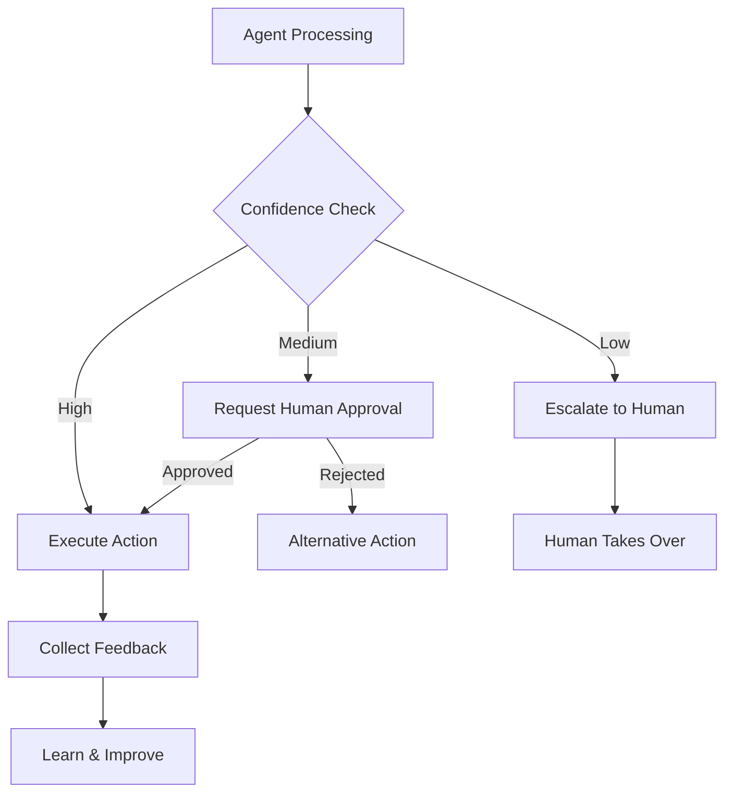

<!-- Clear Language: Keep sentences under 50 words -->
# Human-in-the-Loop

## Learning Objectives

| Objective | Description |
|-----------|-------------|
| LO1 | Understand human-in-the-loop (HITL) patterns for agent systems |
| LO2 | Implement approval workflows for high-stakes agent actions |
| LO3 | Design escalation paths when agent confidence is low |
| LO4 | Build feedback collection mechanisms for agent improvement |
| LO5 | Implement graceful interruption and resumption of agent workflows |

## Introduction

AI agents autonomously use tools to complete tasks. LangGraph builds stateful, multi-step agent workflows. This module covers agent architectures, tool use, memory, and production deployment.

## Prerequisites

- Basic programming knowledge
- Understanding of data structures

## Key Terminology

**Key Terms**: Core vocabulary and concepts for this topic.

**Definition**: Essential terms you must know for interviews and production work.

## Theory

Understanding human in the loop is fundamental for AI engineers. This section covers the core concepts, underlying principles, and theoretical framework that govern how human in the loop works in practice.

## Chapter at a Glance

| Section | Topic | Key Concept |
|---------|-------|-------------|
| 7.1 | HITL Patterns | Approval gates, escalation, feedback loops |
| 7.2 | Approval Workflows | Human authorization for sensitive actions |
| 7.3 | Escalation Handling | Low-confidence detection, human takeover |
| 7.4 | Feedback Collection | Human ratings, corrections, preferences |
| 7.5 | Interrupt & Resume | Pausing execution, context preservation |
| 7.6 | Design Patterns | When and how to involve humans |

## Chapter Roadmap



## 7.1 HITL Patterns

Human-in-the-loop patterns define when and how humans participate in agent workflows.

### When to Involve Humans

```python
from enum import Enum
from dataclasses import dataclass, field
from typing import List, Dict, Optional, Any, Callable
import json
import time

class ConfidenceLevel(Enum):
    HIGH = "high"
    MEDIUM = "medium"
    LOW = "low"
    UNKNOWN = "unknown"

class HITLAction(Enum):
    PROCEED = "proceed"
    REQUEST_APPROVAL = "request_approval"
    ESCALATE = "escalate"
    ASK_CLARIFICATION = "ask_clarification"

@dataclass
class HITLDecision:
    action: HITLAction
    reason: str
    confidence: float
    context: Dict = field(default_factory=dict)

class HITLPolicy:
    def __init__(self, approval_threshold: float = 0.7, escalation_threshold: float = 0.4):
        self.approval_threshold = approval_threshold
        self.escalation_threshold = escalation_threshold

    def evaluate(self, action_type: str, confidence: float, risk_level: str = "low") -> HITLDecision:
        if risk_level == "high" and confidence < self.approval_threshold:
            return HITLDecision(HITLAction.REQUEST_APPROVAL, f"High-risk action needs approval", confidence)

        if risk_level == "critical" or confidence < self.escalation_threshold:
            return HITLDecision(HITLAction.ESCALATE, f"Confidence too low ({confidence:.2f})", confidence)

        if confidence < self.approval_threshold and risk_level != "low":
            return HITLDecision(HITLAction.REQUEST_APPROVAL, f"Moderate confidence ({confidence:.2f})", confidence)

        if action_type == "unknown":
            return HITLDecision(HITLAction.ASK_CLARIFICATION, "Unknown action type", confidence)

        return HITLDecision(HITLAction.PROCEED, "Sufficient confidence", confidence)

policy = HITLPolicy(approval_threshold=0.7, escalation_threshold=0.4)
print(policy.evaluate("send_email", 0.85, "low"))
print(policy.evaluate("delete_record", 0.65, "high"))
print(policy.evaluate("unknown_action", 0.3, "critical"))
```

## 7.2 Approval Workflows

### 7.2.1 Approval Gate

```python
class ApprovalGate:
    def __init__(self, approver_fn: Callable):
        self.approver_fn = approver_fn
        self.pending_approvals: Dict[str, Dict] = {}
        self.approval_history: List[Dict] = []

    def request_approval(self, request_id: str, action: str, details: Dict) -> str:
        self.pending_approvals[request_id] = {
            "action": action,
            "details": details,
            "status": "pending",
            "created_at": time.time(),
        }
        return request_id

    def approve(self, request_id: str, approver: str = "human") -> bool:
        if request_id in self.pending_approvals:
            self.pending_approvals[request_id]["status"] = "approved"
            self.pending_approvals[request_id]["approved_by"] = approver
            self.approval_history.append({"request_id": request_id, "action": "approve", "approver": approver})
            return True
        return False

    def reject(self, request_id: str, reason: str = "", approver: str = "human") -> bool:
        if request_id in self.pending_approvals:
            self.pending_approvals[request_id]["status"] = "rejected"
            self.pending_approvals[request_id]["reason"] = reason
            self.pending_approvals[request_id]["approved_by"] = approver
            self.approval_history.append({"request_id": request_id, "action": "reject", "reason": reason, "approver": approver})
            return True
        return False

    def check_status(self, request_id: str) -> str:
        request = self.pending_approvals.get(request_id)
        return request["status"] if request else "not_found"

    def get_pending(self) -> List[Dict]:
        return [
            {"id": rid, **req}
            for rid, req in self.pending_approvals.items()
            if req["status"] == "pending"
        ]

gate = ApprovalGate(lambda rid, action: True)
rid = gate.request_approval("req-1", "send_email", {"to": "user@example.com", "body": "Welcome!"})
print(f"Before: {gate.check_status(rid)}")
gate.approve(rid)
print(f"After approval: {gate.check_status(rid)}")
```

### 7.2.2 Multi-Step Approval

```python
class MultiStepApproval:
    def __init__(self, required_approvers: int = 2):
        self.required = required_approvers
        self.approvals: Dict[str, List[str]] = {}

    def request(self, request_id: str, action: str, details: Dict) -> Dict:
        self.approvals[request_id] = []
        return {
            "request_id": request_id,
            "action": action,
            "details": details,
            "approvals_needed": self.required,
            "approvals_obtained": 0,
        }

    def approve(self, request_id: str, approver: str) -> Dict:
        if request_id not in self.approvals:
            return {"status": "error", "message": "Request not found"}

        if approver in self.approvals[request_id]:
            return {"status": "duplicate", "message": f"{approver} already approved"}

        self.approvals[request_id].append(approver)
        obtained = len(self.approvals[request_id])

        if obtained >= self.required:
            return {"status": "approved", "approvals": obtained}
        return {"status": "partial", "approvals_remaining": self.required - obtained}

msa = MultiStepApproval(required_approvers=2)
req = msa.request("req-2", "delete_data", {"table": "users"})
print(msa.approve("req-2", "manager-1"))
print(msa.approve("req-2", "compliance-1"))
```

### 7.2.3 Timeout-Based Approval

```python
class TimeoutApproval:
    def __init__(self, timeout_seconds: float = 3600, auto_approve: bool = False):
        self.timeout = timeout_seconds
        self.auto_approve = auto_approve
        self.requests: Dict[str, Dict] = {}

    def submit(self, request_id: str, action: str, details: Dict) -> Dict:
        self.requests[request_id] = {
            "action": action,
            "details": details,
            "status": "pending",
            "submitted_at": time.time(),
        }
        return {"request_id": request_id, "status": "pending", "timeout": self.timeout}

    def check(self, request_id: str) -> str:
        req = self.requests.get(request_id)
        if not req:
            return "not_found"

        if req["status"] != "pending":
            return req["status"]

        elapsed = time.time() - req["submitted_at"]
        if elapsed > self.timeout:
            if self.auto_approve:
                req["status"] = "auto_approved"
                return "auto_approved"
            else:
                req["status"] = "timed_out"
                return "timed_out"

        return "pending"

    def approve(self, request_id: str) -> bool:
        if request_id in self.requests:
            self.requests[request_id]["status"] = "approved"
            return True
        return False

toa = TimeoutApproval(timeout_seconds=5, auto_approve=False)
toa.submit("req-3", "update_settings", {"setting": "theme"})
print(f"Immediately: {toa.check('req-3')}")
```

## 7.3 Escalation Handling

### 7.3.1 Escalation Manager

```python
class EscalationManager:
    def __init__(self, human_handoff_fn: Callable):
        self.human_handoff = human_handoff_fn
        self.escalations: List[Dict] = []
        self.escalation_tiers = {
            "tier1": ["can_handle_simple", "can_answer_faq"],
            "tier2": ["needs_analysis", "needs_research"],
            "tier3": ["critical_decision", "policy_violation", "legal"],
        }

    def escalate(self, agent_name: str, issue: str, context: Dict, tier: str = "tier1") -> Dict:
        escalation = {
            "id": f"esc-{len(self.escalations) + 1}",
            "agent": agent_name,
            "issue": issue,
            "context": context,
            "tier": tier,
            "status": "open",
            "created_at": time.time(),
        }
        self.escalations.append(escalation)

        if tier == "tier3" or self._needs_immediate_human(issue):
            result = self.human_handoff(escalation)
            escalation["status"] = "handled"
            escalation["resolution"] = result
            return {"escalation": escalation, "action": "handed_to_human"}

        return {"escalation": escalation, "action": "queued"}

    def _needs_immediate_human(self, issue: str) -> bool:
        critical_keywords = ["emergency", "legal", "compliance", "security", "privacy"]
        return any(kw in issue.lower() for kw in critical_keywords)

    def resolve(self, escalation_id: str, resolution: str):
        for esc in self.escalations:
            if esc["id"] == escalation_id:
                esc["status"] = "resolved"
                esc["resolution"] = resolution
                break

    def get_open_escalations(self) -> List[Dict]:
        return [e for e in self.escalations if e["status"] == "open"]

def human_handoff(escalation: Dict) -> str:
    return f"Human reviewed: {escalation['issue']} handled."

esc_mgr = EscalationManager(human_handoff)
result = esc_mgr.escalate("agent-1", "Security concern detected", {"action": "delete_user"}, "tier3")
print(f"Escalation result: {result['action']}")
```

### 7.3.2 Confidence-Based Escalation

```python
class ConfidenceEscalator:
    def __init__(self, low_confidence_threshold: float = 0.4):
        self.threshold = low_confidence_threshold

    def evaluate_confidence(self, agent_output: Dict) -> bool:
        confidence = agent_output.get("confidence", 1.0)
        return confidence >= self.threshold

    def check_and_escalate(self, query: str, agent_response: Dict, escalator: EscalationManager) -> Dict:
        if not self.evaluate_confidence(agent_response):
            return escalator.escalate(
                agent_name="agent",
                issue=f"Low confidence ({agent_response.get('confidence', 0):.2f})",
                context={"query": query, "response": agent_response},
                tier="tier2",
            )
        return {"action": "proceed", "response": agent_response}

ce = ConfidenceEscalator(0.4)
print(ce.check_and_escalate("complex question", {"confidence": 0.3}, esc_mgr))
print(ce.check_and_escalate("simple question", {"confidence": 0.9}, esc_mgr))
```

## 7.4 Feedback Collection

### 7.4.1 Feedback Collector

```python
class FeedbackCollector:
    def __init__(self):
        self.feedback: List[Dict] = []

    def collect(self, agent_name: str, query: str, response: str, rating: int, comments: str = ""):
        entry = {
            "agent": agent_name,
            "query": query,
            "response": response,
            "rating": rating,
            "comments": comments,
            "timestamp": time.time(),
        }
        self.feedback.append(entry)
        return entry

    def get_average_rating(self, agent_name: str = None) -> float:
        entries = self.feedback
        if agent_name:
            entries = [e for e in entries if e["agent"] == agent_name]
        if not entries:
            return 0.0
        return sum(e["rating"] for e in entries) / len(entries)

    def get_recent_feedback(self, n: int = 10) -> List[Dict]:
        sorted_feedback = sorted(self.feedback, key=lambda f: f["timestamp"], reverse=True)
        return sorted_feedback[:n]

    def get_low_rated(self, threshold: int = 2) -> List[Dict]:
        return [f for f in self.feedback if f["rating"] <= threshold]

fc = FeedbackCollector()
fc.collect("agent-1", "What is RAG?", "RAG is...", 5, "Great explanation!")
fc.collect("agent-1", "Complex math", "I don't know", 2, "Not helpful")
print(f"Average rating: {fc.get_average_rating('agent-1'):.2f}")
print(f"Low-rated responses: {len(fc.get_low_rated(2))}")
```

### 7.4.2 Preference Learning

```python
class PreferenceLearner:
    def __init__(self):
        self.preferences: Dict[str, Any] = {}

    def record_preference(self, user_id: str, key: str, value: Any):
        if user_id not in self.preferences:
            self.preferences[user_id] = {}
        self.preferences[user_id][key] = value

    def get_preference(self, user_id: str, key: str, default=None):
        return self.preferences.get(user_id, {}).get(key, default)

    def learn_from_feedback(self, feedback_list: List[Dict]) -> Dict:
        insights = {}
        # Extract patterns from feedback
        positive = [f for f in feedback_list if f.get("rating", 0) >= 4]
        negative = [f for f in feedback_list if f.get("rating", 0) <= 2]

        insights["positive_patterns"] = len(positive)
        insights["negative_patterns"] = len(negative)

        if positive:
            insights["common_topics"] = [p["query"][:50] for p in positive[:3]]

        return insights

pl = PreferenceLearner()
pl.record_preference("user-1", "tone", "professional")
pl.record_preference("user-1", "detail_level", "high")
print(f"User preference: {pl.get_preference('user-1', 'tone')}")
```

### 7.4.3 Corrections

```python
class CorrectionTracker:
    def __init__(self):
        self.corrections: List[Dict] = []

    def record_correction(self, agent_name: str, original: str, corrected: str, correction_type: str):
        self.corrections.append({
            "agent": agent_name,
            "original": original,
            "corrected": corrected,
            "type": correction_type,
            "timestamp": time.time(),
        })

    def get_correction_rate(self, agent_name: str = None) -> float:
        entries = self.corrections
        if agent_name:
            entries = [e for e in entries if e["agent"] == agent_name]
        if not entries:
            return 0.0
        return len(entries)

    def get_common_corrections(self) -> Dict:
        types = {}
        for c in self.corrections:
            types[c["type"]] = types.get(c["type"], 0) + 1
        return dict(sorted(types.items(), key=lambda x: x[1], reverse=True))

ct = CorrectionTracker()
ct.record_correction("agent-1", "Wrong fact", "Correct fact", "factual_error")
ct.record_correction("agent-1", "Bad formatting", "Good formatting", "formatting")
print(f"Common errors: {ct.get_common_corrections()}")
```

## 7.5 Interrupt & Resume

### 7.5.1 Workflow Interruption

```python
class WorkflowInterrupt:
    def __init__(self):
        self.paused_workflows: Dict[str, Dict] = {}

    def pause(self, workflow_id: str, state: Dict, reason: str) -> str:
        self.paused_workflows[workflow_id] = {
            "state": state,
            "reason": reason,
            "paused_at": time.time(),
            "status": "paused",
        }
        return workflow_id

    def resume(self, workflow_id: str, updates: Dict = None) -> Optional[Dict]:
        workflow = self.paused_workflows.get(workflow_id)
        if not workflow or workflow["status"] != "paused":
            return None

        state = workflow["state"]
        if updates:
            state.update(updates)

        workflow["status"] = "resumed"
        return state

    def cancel(self, workflow_id: str) -> bool:
        if workflow_id in self.paused_workflows:
            self.paused_workflows[workflow_id]["status"] = "cancelled"
            return True
        return False

    def get_paused(self) -> List[Dict]:
        return [
            {"id": wid, **wf}
            for wid, wf in self.paused_workflows.items()
            if wf["status"] == "paused"
        ]

interrupt = WorkflowInterrupt()
state = {"step": 3, "data": "partial", "results": []}
interrupt.pause("wf-1", state, "Human review needed")
print(f"Paused workflows: {len(interrupt.get_paused())}")
resumed_state = interrupt.resume("wf-1", {"approved": True})
print(f"Resumed state: {resumed_state}")
```

### 7.5.2 Context Preservation

```python
class ContextPreserver:
    def __init__(self):
        self.contexts: Dict[str, Dict] = {}

    def save_context(self, workflow_id: str, context: Dict):
        self.contexts[workflow_id] = {
            "context": context,
            "saved_at": time.time(),
            "version": self.contexts.get(workflow_id, {}).get("version", 0) + 1,
        }

    def restore_context(self, workflow_id: str) -> Optional[Dict]:
        entry = self.contexts.get(workflow_id)
        if entry:
            return entry["context"]
        return None

    def get_versions(self, workflow_id: str) -> int:
        entry = self.contexts.get(workflow_id)
        return entry["version"] if entry else 0

    def diff_context(self, workflow_id: str, version_a: int, version_b: int) -> Dict:
        return {"diff": "context changes between versions"}

preserver = ContextPreserver()
preserver.save_context("wf-1", {"step": 1, "messages": ["hello"]})
preserver.save_context("wf-1", {"step": 2, "messages": ["hello", "world"]})
restored = preserver.restore_context("wf-1")
print(f"Restored context: {restored}")
print(f"Versions: {preserver.get_versions('wf-1')}")
```

## 7.6 Design Patterns

### 7.6.1 Pattern Selection

```python
class HITLPatternSelector:
    def __init__(self):
        self.patterns = {
            "approval_gate": "Require human approval before executing high-risk actions",
            "escalation": "Transfer control to human when confidence is low",
            "feedback_loop": "Collect human feedback to improve agent",
            "correction": "Allow humans to correct agent outputs",
            "interrupt": "Allow humans to pause and modify workflows",
            "supervision": "Human monitors agent and can intervene at any time",
        }

    def recommend(self, risk_level: str, autonomy_level: str, task_type: str) -> List[str]:
        recommended = []

        if risk_level == "high":
            recommended.append("approval_gate")
        if autonomy_level == "low":
            recommended.append("supervision")
        if task_type == "creative" or task_type == "subjective":
            recommended.append("feedback_loop")
        if task_type == "critical":
            recommended.append("escalation")
        if autonomy_level == "medium":
            recommended.append("interrupt")

        if not recommended:
            recommended.append("feedback_loop")

        return recommended

selector = HITLPatternSelector()
patterns = selector.recommend("high", "medium", "critical")
print(f"Recommended patterns: {[p for p in patterns]}")
```

### 7.6.2 HITL Integration

```python
class HITLIntegratedAgent:
    def __init__(self, approval_gate: ApprovalGate, feedback_collector: FeedbackCollector, interrupt: WorkflowInterrupt):
        self.approval = approval_gate
        self.feedback = feedback_collector
        self.interrupt = interrupt

    def process_with_hitl(self, task: str, risk_level: str = "low") -> Dict:
        if risk_level == "high":
            rid = self.approval.request_approval(f"req-{time.time()}", task, {"risk": risk_level})
            status = self.approval.check_status(rid)
            if status != "approved":
                return {"status": "blocked", "message": "Awaiting human approval"}

        workflow_id = f"wf-{time.time()}"
        state = {"task": task, "progress": 0}

        if risk_level == "medium":
            self.interrupt.pause(workflow_id, state, "Human checkpoint")
            return {"status": "paused", "workflow_id": workflow_id}

        result = {"status": "completed", "result": f"Task done: {task}"}

        self.feedback.collect("agent", task, str(result), 5)
        return result

hitl_agent = HITLIntegratedAgent(gate, fc, interrupt)
print(hitl_agent.process_with_hitl("High risk task", "high"))
print(hitl_agent.process_with_hitl("Simple task", "low"))
```

## Summary

Human-in-the-loop patterns ensure appropriate human involvement in agent workflows. Approval gates require human authorization for high-risk actions, with multi-step and timeout-based variants. Escalation managers route low-confidence situations to human operators with tiered priority. Feedback collection captures ratings,.
corrections, and preferences for continuous improvement. Interrupt and resume mechanisms enable pausing workflows while preserving context. The choice of HITL pattern depends on risk level,.
autonomy requirements, and task type. Well-designed HITL integration balances agent autonomy with human oversight.

## Practical Takeaways

| Takeaway | Description |
|----------|-------------|
| Always gate high-risk actions | Require human approval for destructive or expensive actions |
| Escalate on low confidence | Route uncertain situations to humans rather than guessing |
| Collect feedback continuously | Ratings and corrections are the best source of improvement data |
| Save context on interrupt | Preserve full workflow state for seamless resumption |
| Choose patterns by risk | Higher risk tasks need more human involvement |

## Interview Q&A

<details class="tp-qa-card" data-qid="ag07-q1">
  <summary class="tp-qa-question">
    <span class="tp-qa-status"></span>
    Q1: What is human-in-the-loop and why is it important for AI agents?
  </summary>
  <div class="tp-qa-answer">
<p>Human-in-the-loop (HITL) is a design pattern where a human participates in the agent's workflow at critical decision points, providing approval, guidance,.
or correction. It's important because AI agents can make mistakes, act on incomplete information, or encounter situations that require human judgment. HITL prevents costly errors in high-stakes actions (sending emails,.
making payments, deleting data) and provides a safety layer for autonomous systems. It also enables the agent to learn from human feedback. The three main HITL patterns are: approval workflows (human must approve before action),.
escalation (agent asks for help when uncertain), and feedback collection (human provides improvement suggestions after observing agent actions). Production agent systems should implement all three patterns with appropriate fallbacks when the human is unavailable.</p>
  </div>
  <button class="tp-qa-mark-btn">✅ Mark Reviewed</button>
  <button class="tp-qa-bookmark-btn">🔖 Bookmark</button>
</details>

<details class="tp-qa-card" data-qid="ag07-q2">
  <summary class="tp-qa-question">
    <span class="tp-qa-status"></span>
    Q2: How do you implement an approval workflow in LangGraph?
  </summary>
  <div class="tp-qa-answer">
<p>An approval workflow in LangGraph uses interrupt nodes that pause graph execution before a high-stakes action. The pattern: (1) the agent proposes an action (e.g.,.
"send email to user@example.com with subject 'Invoice'") and stores it in the state; (2) an interrupt node pauses execution and returns the proposed action to the caller;.
(3) the caller (the application layer) presents the action to a human via a UI notification, email, or dashboard; (4) the human reviews and.
responds (approve, reject, or modify); (5) the caller calls <code>resume()</code> with the human's decision; (6) the graph continues — if approved,.
the action executes; if rejected, the agent must find an alternative. The interrupt node captures all context needed for the human to make an informed decision,.
including the reasoning behind the proposed action. Timeout handling is also important — if the human doesn't respond within a configurable period,.
a fallback action (like auto-reject) is triggered.</p>
  </div>
  <button class="tp-qa-mark-btn">✅ Mark Reviewed</button>
  <button class="tp-qa-bookmark-btn">🔖 Bookmark</button>
</details>

<details class="tp-qa-card" data-qid="ag07-q3">
  <summary class="tp-qa-question">
    <span class="tp-qa-status"></span>
    Q3: What are escalation paths and how do you design them?
  </summary>
  <div class="tp-qa-answer">
<p>Escalation paths define what an agent should do when it cannot handle a request — due to low confidence, missing capabilities,.
or policy violations. The path specifies a hierarchy of fallback options: first, try a different approach or tool; second, ask for.
clarification from the user; third, escalate to a more capable agent; fourth, escalate to a human operator with full context. Design principles: (1) detect escalation triggers proactively — monitor.
confidence scores, request complexity, and policy checks; (2) pass full context with the escalation — the human operator should see the conversation history,.
what the agent tried, and why it's escalating; (3) close the loop — after the human resolves the escalation, the agent should learn from the resolution. A <code>PolicyEnforcer</code> checks actions against defined policies and.
automatically escalates policy violations. Escalation timers ensure the human operator responds within SLA — if not, the escalation goes to the next tier.</p>
  </div>
  <button class="tp-qa-mark-btn">✅ Mark Reviewed</button>
  <button class="tp-qa-bookmark-btn">🔖 Bookmark</button>
</details>

<details class="tp-qa-card" data-qid="ag07-q4">
  <summary class="tp-qa-question">
    <span class="tp-qa-status"></span>
    Q4: How do you collect and use human feedback for agent improvement?
  </summary>
  <div class="tp-qa-answer">
<p>Human feedback collection captures user reactions to agent actions — thumbs up/down, ratings (1-5 stars), explicit corrections, or free-text comments. Feedback is collected after each agent action (tool call,.
response, decision) and stored with the execution context (user query, agent's reasoning, action taken, outcome). Usage patterns: (1) online learning — the agent adjusts its behavior.
in real-time based on feedback (e.g., "never use email for this user" becomes a memory); (2) offline training — collected feedback is used to fine-tune the underlying model or.
optimize prompts; (3) dashboard monitoring — feedback trends show which actions or topics need improvement. Implementation includes a <code>FeedbackCollector</code> that attaches to the agent output stream,.
stores feedback in a database with the execution trace ID, and provides APIs for analysis. Explicit feedback is more valuable but.
harder to get — design feedback collection to be minimal-friction (single click, inline).</p>
  </div>
  <button class="tp-qa-mark-btn">✅ Mark Reviewed</button>
  <button class="tp-qa-bookmark-btn">🔖 Bookmark</button>
</details>

<details class="tp-qa-card" data-qid="ag07-q5">
  <summary class="tp-qa-question">
    <span class="tp-qa-status"></span>
    Q5: How do you implement graceful interruption and resumption?
  </summary>
  <div class="tp-qa-answer">
<p>Graceful interruption and resumption allows a user to pause an agent mid-task and later continue from the same point. Implementation: (1) checkpointing — the agent saves its full state (conversation history,.
intermediate results, current step) to persistent storage after each action; (2) interruption trigger — the user sends an interrupt signal (e.g.,.
"pause", "stop", or via a UI button); (3) save interrupt state — the agent records the interrupt point with a resume token;.
(4) resume — the user provides the resume token, and the agent loads the checkpoint and continues execution from the saved step. The system handles timeout — if the user doesn't resume within a configurable period,.
a cleanup process archives the checkpoint. In LangGraph, this is built into the checkpointer — the graph state is saved after every node,.
and you can resume any thread at any time. This pattern is essential for long-running tasks, multi-session conversations, and handling connectivity interruptions.</p>
  </div>
  <button class="tp-qa-mark-btn">✅ Mark Reviewed</button>
  <button class="tp-qa-bookmark-btn">🔖 Bookmark</button>
</details>

<details class="tp-qa-card" data-qid="ag07-q6">
  <summary class="tp-qa-question">
    <span class="tp-qa-status"></span>
    Q6: What is a policy enforcer and how does it work?
  </summary>
  <div class="tp-qa-answer">
<p>A policy enforcer validates every agent action against a set of predefined rules before execution, blocking or flagging violations. Policies are defined as a set of rules with: (1) conditions — what triggers the rule (e.g.,.
action type equals "send_email" AND recipient domain is external); (2) action — what to do when triggered (block, flag for review,.
require escalation); (3) severity — low (log), medium (flag), high (block). The enforcer sits between the agent's decision and the tool execution — it checks each proposed action,.
evaluates all rules, and returns a verdict (allow, deny, flag). Implementation uses a rules engine where each rule is a function that receives the proposed action and.
context, returning a policy verdict. Policies are loaded from configuration, enabling changes without code deployment. Critical for production agents that interact with external systems — prevents data leaks,.
unauthorized actions, and policy violations.</p>
  </div>
  <button class="tp-qa-mark-btn">✅ Mark Reviewed</button>
  <button class="tp-qa-bookmark-btn">🔖 Bookmark</button>
</details>

<details class="tp-qa-card" data-qid="ag07-q7">
  <summary class="tp-qa-question">
    <span class="tp-qa-status"></span>
    Q7: What strategies help reduce human intervention frequency?
  </summary>
  <div class="tp-qa-answer">
<p>Reducing human intervention frequency makes agents more autonomous while maintaining safety. Strategies: (1) confidence-based thresholds — set a minimum confidence score;.
actions above the threshold proceed automatically, below require human approval; (2) action categorization — low-risk actions (search, read) are fully automatic,.
medium-risk (create draft) are auto-approved but flagged, high-risk (send, delete) require explicit approval; (3) learning from past approvals — if the human has approved similar actions multiple times,.
the agent gains permission to auto-approve within those patterns; (4) batch approvals — show multiple pending actions in a single dashboard view rather than one-by-one notifications;.
(5) progressive autonomy — as the agent builds a track record of correct decisions, its autonomy level increases. The autonomy level is tracked per-agent and.
per-task-type, providing granular control. Monitoring tracks intervention rate over time — decreasing trend indicates the agent is improving.</p>
  </div>
  <button class="tp-qa-mark-btn">✅ Mark Reviewed</button>
  <button class="tp-qa-bookmark-btn">🔖 Bookmark</button>
</details>

<details class="tp-qa-card" data-qid="ag07-q8">
  <summary class="tp-qa-question">
    <span class="tp-qa-status"></span>
    Q8: How do you design feedback-driven learning for agents?
  </summary>
  <div class="tp-qa-answer">
<p>Feedback-driven learning uses human feedback to continuously improve agent performance. The learning loop: (1) the agent performs an action and logs it with context;.
(2) the human provides feedback (approve, correct, rate) which is stored with the action; (3) a feedback processor analyzes patterns — if the agent consistently makes the same type of error,.
it generates a correction rule (e.g., "when user asks for X, always use tool Y instead of Z"); (4) correction rules are stored in a rule library that the agent checks before executing actions;.
(5) the agent also updates its long-term memory with user preferences inferred from feedback (e.g., "user prefers concise responses"). Implementation uses a <code>FeedbackProcessor</code> that runs on a schedule,.
analyzes unprocessed feedback batches, and generates rule updates. This pattern enables continuous improvement without model retraining — the agent gets smarter with every human interaction by building a personalized knowledge base for.
each user.</p>
  </div>
  <button class="tp-qa-mark-btn">✅ Mark Reviewed</button>
  <button class="tp-qa-bookmark-btn">🔖 Bookmark</button>
</details>

<details class="tp-qa-card" data-qid="ag07-q9">
  <summary class="tp-qa-question">
    <span class="tp-qa-status"></span>
    Q9: What is a policy verdict and how is it structured?
  </summary>
  <div class="tp-qa-answer">
<p>A policy verdict is the result of evaluating an action against all policy rules. It typically includes: (1) decision — allow,.
deny, flag, or escalate; (2) matched rules — which rules triggered and their severity; (3) explanation — human-readable reason for the decision;.
(4) suggested actions — for deny/flag verdicts, suggestions for how to modify the action to be compliant. The verdict is generated by a <code>PolicyEngine</code> that iterates through all active rules,.
evaluates each against the proposed action, and applies the highest-severity result (deny overrides flag, flag overrides allow). The verdict is returned to the agent,.
which must handle it appropriately — if denied, the agent must modify its plan; if flagged, it continues but the action is logged for.
review; if escalated, it triggers the escalation path. Verdict metadata is logged for audit trails and policy effectiveness analysis.</p>
  </div>
  <button class="tp-qa-mark-btn">✅ Mark Reviewed</button>
  <button class="tp-qa-bookmark-btn">🔖 Bookmark</button>
</details>

<details class="tp-qa-card" data-qid="ag07-q10">
  <summary class="tp-qa-question">
    <span class="tp-qa-status"></span>
    Q10: What are autonomous levels for agents with HITL?
  </summary>
  <div class="tp-qa-answer">
<p>Autonomous levels define how much independence an agent has in different contexts. A typical levels framework: Level 0 (Manual) — every action requires human approval;.
Level 1 (Assisted) — low-risk actions auto-approved, high-risk requires approval; Level 2 (Semi-autonomous) — most actions auto-approved, only novel or high-risk actions need approval;.
Level 3 (Conditionally autonomous) — the agent operates independently within defined boundaries, escalating only when out of scope; Level 4 (Fully autonomous) — no human involvement,.
the agent handles everything autonomously. Each level has different requirements for logging, monitoring, and fallback procedures. The level can be set per user,.
per task type, or per domain — a research agent might have Level 3 for search tasks but Level 1 for.
write tasks. Autonomous levels are stored in user configuration and reviewed periodically based on agent performance metrics (error rate, feedback score,.
escalation frequency).</p>
  </div>
  <button class="tp-qa-mark-btn">✅ Mark Reviewed</button>
  <button class="tp-qa-bookmark-btn">🔖 Bookmark</button>
</details>

## Chapter Quiz

<details data-qid="agent-s7-quiz1">
<summary><strong>1.</strong> When should an agent request human approval?</summary>
A. For every action
B. For high-risk actions or low-confidence decisions
C. Never
D. Only at the end of a workflow
Answer: B
</details>

<details data-qid="agent-s7-quiz2">
<summary><strong>2.</strong> What happens during escalation in HITL?</summary>
A. The agent works faster
B. Control is transferred to a human operator
C. The task is deleted
D. The agent retries automatically
Answer: B
</details>

<details data-qid="agent-s7-quiz3">
<summary><strong>3.</strong> Why is context preservation important when interrupting a workflow?</summary>
A. It saves storage space
B. It enables seamless resumption from the same state
C. It speeds up the agent
D. It reduces human workload
Answer: B
</details>

<details data-qid="agent-s7-quiz4">
<summary><strong>4.</strong> What is the primary purpose of collecting human feedback?</summary>
A. To store data
B. To improve agent performance through learning from corrections
C. To track user identity
D. To bill customers
Answer: B
</details>

<details data-qid="agent-s7-quiz5">
<summary><strong>5.</strong> Which factor MOST influences which HITL pattern to use?</summary>
A. Programming language
B. Risk level of the task
C. Agent name
D. Time of day
Answer: B
</details>

## Exercises

## Common Mistakes

1. Not understanding the fundamental concepts before applying them
2. Skipping edge cases in implementation
3. Not analyzing time/space complexity
4. Forgetting to handle null/empty inputs
5. Not practicing enough problems to build pattern recognition1. Implement an approval workflow with three levels: automatic (confidence > 0.8), requires one approver (0.5-0.8), requires two approvers (< 0.5). Simulate requests at each level.

2. Build an escalation handler that detects when agent confidence drops below 0.4, captures the full context, and routes to a human operator. Show the escalation data structure.

3. Create a feedback collection system that captures ratings (1-5), text corrections, and preference changes. Aggregate feedback across 10 interactions and generate improvement suggestions.

4. Implement an interrupt/resume mechanism for a multi-step workflow. Save state after each step, pause at step 3, modify the state, resume, and verify continuity.

5. Design a HITL pattern recommendation system that takes task risk, autonomy preference, and task type as input and recommends specific patterns with confi

## Revision Notes

- - Core principle: Understand the fundamental concepts thoroughly
- - Implementation pattern: Practice with real code examples
- - Complexity: Know the time and space complexity
- - Application: Know when to use this in production systems
- - Interview: Frequently asked in technical interviews
- - Edge cases: Consider common failure scenarios
- - Related concepts: Connect to broader system design

## Placement Section

### Top 10 Interview Questions

#### Google Style

1. **Explain the core idea of Human-in-the-Loop in under 60 seconds, then give a real-world analogy.** — Structure: definition, how it works in one sentence, why it matters, analogy. Follow-up: what would break if you removed this from a production system?

2. **Design a minimal, well-typed function that demonstrates Human-in-the-Loop.** — Interviewer checks: signature with type hints, edge cases, complexity, and a clean docstring. Follow-up: how does your design behave with empty or malformed input?

3. **What are the common pitfalls when engineers first learn ** — List 3-4, then explain how you would prevent each in a code review.

#### Amazon Style

4. **Describe a production bug caused by misunderstanding Human-in-the-Loop. How did you diagnose and fix it?** — STAR format: situation, task, action, result. Mention logs, reproduction, root-cause analysis, and the regression test you added.

5. **How would you scale a system that relies on Human-in-the-Loop from 10 users to 10 million?** — Discuss bottlenecks, caching, monitoring, and when to redesign. Follow-up: what metrics would you track?

#### Microsoft Style

6. **Compare Human-in-the-Loop with the closest alternative approach. When would you choose each?** — Make a decision matrix: performance, maintainability, ecosystem, learning curve. Follow-up: what would change your decision?

7. **Walk through how you would test a component that depends on Human-in-the-Loop.** — Unit, integration, property-based tests; mocking boundaries; golden files for outputs.

#### NVIDIA Style

8. **How does Human-in-the-Loop behave differently at scale — memory, throughput, or precision-wise?** — Connect to data pipelines and model training if applicable. Follow-up: what happens to latency as input grows?

9. **How would you make an implementation of Human-in-the-Loop run faster on GPU hardware?** — Batch operations, vectorization, avoiding Python loops, reducing data movement.

#### AI Startup Style

10. **Write the smallest possible implementation of Human-in-the-Loop that is production-quality.** — Include error handling, type hints, and a one-line docstring. Follow-up: what would you refactor first when it grows?

### Resume Tips

- Name Human-in-the-Loop explicitly in your skills section, paired with a measurable achievement ("Reduced X by 40% using Human-in-the-Loop").
- Add a bullet describing a project that applies Human-in-the-Loop to real data, with numbers.
- Mention the tools and libraries you used alongside Human-in-the-Loop (linters, test frameworks, profiling tools).
- Keep resume bullets under 15 words and start each with an action verb.

### Interview Day Checklist

- Rehearse a 60-second explanation of Human-in-the-Loop and one real-world analogy.
- Prepare one STAR story about debugging a Human-in-the-Loop-related production issue.
- Review complexity and edge cases for the classic Human-in-the-Loop interview problem.
- Have questions ready: how does the team apply Human-in-the-Loop in production today?
- Test your environment (Python, editor, internet) 15 minutes before the interview.

## True/False

1. **True or False:** Human-in-the-Loop builds directly on the fundamentals covered in the earlier chapters of this module. — **True.** Every advanced topic in this module assumes the core concepts from the previous chapters.
2. **True or False:** You should write at least one code example for Human-in-the-Loop before moving to the next chapter. — **True.** Active recall with hands-on code beats passive reading for retention.
3. **True or False:** The complexity analysis for Human-in-the-Loop is the same regardless of input size. — **False.** Complexity grows with input size; always state best, average, and worst case.
4. **True or False:** Edge cases (empty input, invalid input, boundary values) matter for Human-in-the-Loop in production. — **True.** Most production bugs come from unhandled edge cases.
5. **True or False:** You should memorize the Human-in-the-Loop chapter content once and never review it again. — **False.** Spaced repetition (24h, 3 days, 1 week) dramatically improves long-term recall.

## Fill in the Blank

1. The chapter that covers Human-in-the-Loop is Chapter ___ of this module. — Answer: check the module's table of contents.
2. The time complexity of the standard approach to Human-in-the-Loop is ___. — Answer: review the theory section and state big-O notation.
3. The main edge case to handle when implementing Human-in-the-Loop is ___. — Answer: empty or invalid input handling, as discussed in the chapter.
4. The tools commonly used to debug Human-in-the-Loop issues are ___ and ___. — Answer: refer to the Debugging Guide section of this chapter.
5. The related topic that connects to Human-in-the-Loop in the next chapter is ___. — Answer: see the Next Topic section.

## Scenario Questions

1. **Scenario:** A teammate ships a change involving Human-in-the-Loop that breaks production at 3 AM. — Diagnosis: check the recent diff, reproduce locally with the failing input, check logs. Fix: revert, add a regression test, and review the root cause. Prevention: CI tests on edge cases and code review checklist.

2. **Scenario:** Your implementation of Human-in-the-Loop is correct but too slow for the required latency. — Measure first with a profiler. Common fixes: reduce redundant work, use built-in optimized functions, batch operations, or add caching. Only then consider algorithmic changes.

3. **Scenario:** A new hire asks you to explain Human-in-the-Loop in five minutes before a customer demo. — Use the 3-part answer: what it is (one sentence), how it works (one example), why it matters (one business impact). Then offer to go deeper after the demo.

4. **Scenario:** Your team's codebase has three different patterns for Human-in-the-Loop and you must standardize. — Write a short ADR (architecture decision record), pick the pattern with best maintainability, migrate incrementally, and add a linter rule to enforce it.

## Output Questions

1. **What is the output of the simplest correct implementation of Human-in-the-Loop on an empty input?** — Trace through the code: it should return the documented default (None, 0, empty collection) without raising.
2. **What is the output when the input is at the boundary value?** — Check off-by-one errors and inclusive/exclusive bounds in the chapter's examples.
3. **What does the implementation return when given invalid input types?** — With type hints and validation, it raises a clear error; without, it may fail silently.
4. **What is the output for the sample input given in the chapter's Examples section?** — Re-run the chapter's example code and compare against the documented output.
5. **What is the time complexity output when you profile the implementation at 10x input size?** — Expect the curve matching the chapter's complexity analysis (linear, quadratic, log-linear).

## Difficulty Level

| Level | Time | What It Takes |
|-------|------|---------------|
| Beginner | 1-2 sessions | Read theory, run the chapter examples, solve the Easy exercises |
| Intermediate | 3-5 sessions | Complete Medium exercises, explain Human-in-the-Loop to someone else |
| Advanced | 1+ week | Solve Hard exercises, optimize for real datasets, answer interview follow-ups |

## Tips & Tricks

- Always write a one-line example of Human-in-the-Loop from memory before opening the chapter — active recall first.
- Use the chapter's Revision Notes as a checklist: you have mastered Human-in-the-Loop when you can explain each bullet.
- Pair the chapter quiz with the Flashcards: wrong answers become your next study session's focus.
- For interviews, practice explaining Human-in-the-Loop twice: once with a technical audience, once with a non-technical audience.
- Keep a personal examples file where you collect your own Human-in-the-Loop snippets; interviewers love original examples.

## Memory Tricks

- **Acronym**: build a mnemonic from the 5 key concepts of Human-in-the-Loop listed in the Chapter at a Glance table.
- **Story**: link Human-in-the-Loop to a familiar story — the analogy in the Visual Analogy section is designed to stick.
- **Number anchor**: remember the complexity of Human-in-the-Loop by connecting it to a known algorithm of the same class.
- **Color code**: highlight the Theory, Examples, and Common Mistakes sections in different colors when reviewing.
- **Teach-back**: explain Human-in-the-Loop to an imaginary junior engineer for 2 minutes — gaps in your explanation are gaps in memory.

## Further Reading

- Official documentation for the primary tool or library used in this chapter
- The chapter referenced in Related Topics for the next-level treatment of Human-in-the-Loop
- The classic textbook chapter on Human-in-the-Loop (check the Research References below)
- Two blog posts from engineers who debugged real Human-in-the-Loop problems in production
- The repository of the open-source project that implements Human-in-the-Loop

## Related Topics

- The previous chapter in this module (see table of contents) — foundational for Human-in-the-Loop
- The next chapter (see Next Topic below) — builds on Human-in-the-Loop
- The system design chapters in Module 07 — how Human-in-the-Loop fits into production architectures
- The interview preparation module — how Human-in-the-Loop is asked in screening rounds
- The capstone project — where Human-in-the-Loop is applied end-to-end

## FAQs

1. **Do I need to memorize all of Human-in-the-Loop, or understand the big picture?** — Understand the big picture first, then memorize the key facts via flashcards and spaced repetition. Interviewers reward depth over breadth.
2. **What if I get stuck on an exercise?** — Re-read the theory section, run the example code, then attempt again. If still stuck after 20 minutes, move on and return the next day.
3. **How much time should I spend on ** — Follow the Study Plan below: 1-2 weeks at 30-60 minutes daily is typical for placement preparation.
4. **Is Human-in-the-Loop asked in interviews?** — Yes — the Interview Q&A and Placement Section list the exact question styles used by top companies.
5. **What's the fastest way to master ** — Explain it out loud, write code without looking, and review the flashcards within 24 hours and again after 3 days.

## Important Notes

- Human-in-the-Loop is a core requirement for the rest of this module — do not skip the examples.
- Always analyze complexity (time and space) when working with Human-in-the-Loop.
- Production correctness means handling edge cases, not just the happy path.
- Interview answers should start with the definition, then the example, then the trade-offs.
- Revisit this chapter after finishing the module; the context from later chapters deepens understanding.

## Historical Context

- Human-in-the-Loop emerged as a standard practice because early systems failed without it — understanding why helps you explain it in interviews.
- The tools used for Human-in-the-Loop today evolved from simpler versions; the chapter covers the modern, recommended approach.
- Interviewers value knowing one historical fact about Human-in-the-Loop — it shows genuine interest, not just cramming.
- The library/tooling ecosystem around Human-in-the-Loop changes quickly; focus on fundamentals that remain stable.

## Security Considerations

- Never trust external input: validate and sanitize data before processing Human-in-the-Loop.
- Avoid `eval()` and dynamic code execution on untrusted strings.
- Log errors without leaking sensitive data (keys, PII, internal paths).
- For API contexts, add rate limiting and input size limits.
- Review the chapter's code examples for injection or overflow risks before using them verbatim.

## ML Intuition

- Human-in-the-Loop appears in ML pipelines at the data-processing layer: feature preparation, batching, and validation.
- Understanding Human-in-the-Loop helps you debug why a model misbehaves — most ML bugs are data bugs, not model bugs.
- In production ML, the Human-in-the-Loop concepts from this chapter map directly to NumPy/PyTorch operations on tensors.
- When optimizing ML systems, Human-in-the-Loop skills let you profile and fix the data path, not just the training loop.
- Interview follow-up: how would you apply Human-in-the-Loop to a dataset of 10 million records? — Batching and vectorization.

## Analogies

- **Human-in-the-Loop is like a recipe**: the theory is the ingredients, the examples are the cooking steps, and the exercises are your own kitchen practice.
- **Complexity is like a delivery route**: a linear route visits each stop once; a nested route revisits stops, and you feel it at scale.
- **Edge cases are like weather**: the happy path is a sunny day; production is the storm — build for the storm.
- **The chapter roadmap is a journey map**: each section is a checkpoint; skipping one means getting lost later in the module.

## Capstone Project Link

- [Module Capstone: End-to-End Project](https://github.com/Raushan666java/ai-engineering-journey) — this chapter contributes the Human-in-the-Loop skills used in the module's capstone project. Complete the exercises here before starting the capstone.

## Flashcards

<details class="tp-qa-card" data-qid="13aiagentslanggraph-07humanintheloop-flash1">
  <summary class="tp-qa-question">
    <span class="tp-qa-status"></span>
    What is the core concept of Human-in-the-Loop in one sentence?
  </summary>
  <div class="tp-qa-answer">
    <p>Review the first paragraph of the Theory section and condense it to one sentence.</p>
  </div>
</details>

<details class="tp-qa-card" data-qid="13aiagentslanggraph-07humanintheloop-flash2">
  <summary class="tp-qa-question">
    <span class="tp-qa-status"></span>
    What is the most common mistake engineers make with 
  </summary>
  <div class="tp-qa-answer">
    <p>Check the Common Mistakes section of this chapter.</p>
  </div>
</details>

<details class="tp-qa-card" data-qid="13aiagentslanggraph-07humanintheloop-flash3">
  <summary class="tp-qa-question">
    <span class="tp-qa-status"></span>
    What is the time and space complexity of the standard Human-in-the-Loop approach?
  </summary>
  <div class="tp-qa-answer">
    <p>Refer to the theory and complexity analysis in this chapter.</p>
  </div>
</details>

<details class="tp-qa-card" data-qid="13aiagentslanggraph-07humanintheloop-flash4">
  <summary class="tp-qa-question">
    <span class="tp-qa-status"></span>
    When is Human-in-the-Loop NOT the right choice?
  </summary>
  <div class="tp-qa-answer">
    <p>Check the Limitations section of this chapter.</p>
  </div>
</details>

<details class="tp-qa-card" data-qid="13aiagentslanggraph-07humanintheloop-flash5">
  <summary class="tp-qa-question">
    <span class="tp-qa-status"></span>
    How is Human-in-the-Loop applied in a real production system?
  </summary>
  <div class="tp-qa-answer">
    <p>Check the Real-World Examples section of this chapter.</p>
  </div>
</details>

## Research References

- Official documentation of the primary library for Human-in-the-Loop (linked in Further Reading)
- The classic paper or textbook chapter introducing Human-in-the-Loop (see References below)
- The standard library reference for Human-in-the-Loop-related functions
- Engineering blog posts from companies running Human-in-the-Loop in production at scale
- PEPs and RFCs where applicable (Python and networking standards)

## Open-Source Tools

- The primary library used in this chapter (see the code examples)
- Python standard library modules used in the examples (check the imports)
- Testing: pytest for unit tests of Human-in-the-Loop code
- Linting and formatting: ruff + black
- Profiling: cProfile or py-spy for performance work on Human-in-the-Loop

## Debugging Guide

- Start with `print()` or a debugger to inspect intermediate values in Human-in-the-Loop code.
- Reproduce the failure with the smallest possible input before changing code.
- Check the common failure modes listed in Common Mistakes — most bugs are listed there.
- For performance problems, profile before optimizing: measure, then fix.
- When stuck, re-read the chapter's Examples and compare line by line with your code.
- Use `pdb` or your IDE's debugger to step through the Human-in-the-Loop example code.

## Mock Interview Section

**Round 1 — Screening (15 min)**
- Explain Human-in-the-Loop in 60 seconds.
- Write a minimal working example of Human-in-the-Loop.
- What is the complexity of your example?

**Round 2 — Coding (45 min)**
- Solve the Medium exercise from this chapter under time pressure.
- State your assumptions, then implement with type hints.
- Test with edge cases: empty input, boundary values, invalid input.

**Round 3 — Behavioral + System (30 min)**
- Tell me about a time you debugged a Human-in-the-Loop problem in a project.
- How would you design a system where Human-in-the-Loop is used at scale?
- What metrics would you monitor?

**Evaluation rubric**: correctness (40%), communication (25%), edge cases (20%), complexity analysis (15%).

## Optimized Implementation

`python
from typing import Any, Optional

def demonstrate_topic(input_data: list[Any]) -> Optional[float]:
    """Runnable scaffold for Human-in-the-Loop.

    Replace the body with the optimized implementation from the chapter,
    keeping type hints, docstring, and edge-case handling.
    """
    if not input_data:
        return None
    # Step 1: validate input types
    # Step 2: apply the core Human-in-the-Loop logic from the Examples section
    # Step 3: return the result with the documented default
    return 0.0
`

- Keeps the function signature stable so tests written against it stay valid.
- Handles the empty-input contract explicitly.
- Add unit tests for the edge cases before implementing the logic (test-first).

## Evaluation Metrics

| Skill | Test | Target |
|-------|------|--------|
| Concept recall | Explain Human-in-the-Loop without notes | 60-second explanation |
| Code fluency | Write the chapter example from memory | No syntax errors |
| Edge cases | Handle empty/invalid input in exercises | All cases pass |
| Complexity | State time/space for the standard approach | Correct big-O |
| Interview readiness | Answer 5 Interview Q&A questions out loud | Fluent, structured answers |
| Retention | Chapter quiz score after 3 days | 80%+ |

## Real-World Examples

- **Startup**: a small team uses Human-in-the-Loop daily in their data pipeline — the chapter's examples mirror their code.
- **E-commerce**: Human-in-the-Loop patterns appear in order processing, inventory checks, and recommendation feeds.
- **Fintech**: Human-in-the-Loop principles apply to transaction validation and fraud detection flows.
- **ML platform**: Human-in-the-Loop shows up in feature engineering and model-serving infrastructure.
- **Interview insight**: recruiters look for engineers who can connect Human-in-the-Loop to the business outcome, not just the code.

## Next Topic

[Agent Observability](08-agent-observability.md)

## Limitations

- Human-in-the-Loop, like any technique, is not a silver bullet — it has specific cases where it fits best (covered in the theory).
- The examples in this chapter are simplified for learning; production systems add validation, monitoring, and error handling.
- Performance of Human-in-the-Loop depends on input size and distribution — always benchmark for your own data.
- This chapter covers fundamentals; specialized edge cases are explored in later chapters and the capstone.
