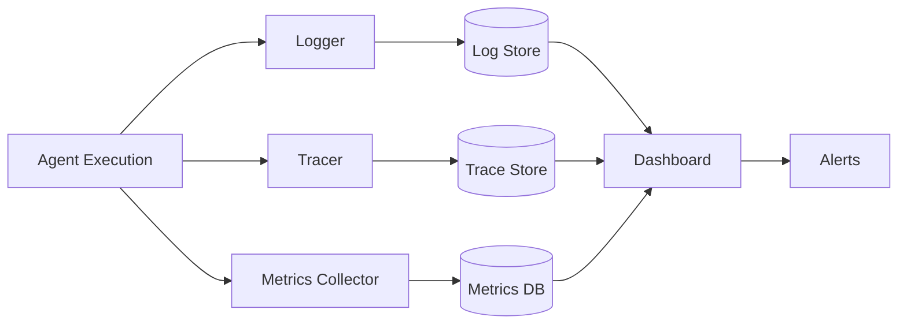

<!-- Clear Language: Keep sentences under 50 words -->
# Agent Observability

## Learning Objectives

| Objective | Description |
|-----------|-------------|
| LO1 | Understand observability dimensions for agent systems |
| LO2 | Implement logging, tracing, and metrics collection for agents |
| LO3 | Build monitoring dashboards for agent performance |
| LO4 | Design debugging tools for agent reasoning chains |
| LO5 | Implement alerting for agent failures and anomalies |

## Introduction

AI agents autonomously use tools to complete tasks. LangGraph builds stateful, multi-step agent workflows. This module covers agent architectures, tool use, memory, and production deployment.

## Prerequisites

- Basic programming knowledge
- Understanding of data structures

## Key Terminology

**Key Terms**: Core vocabulary and concepts for this topic.

**Definition**: Essential terms you must know for interviews and production work.

## Theory

Understanding agent observability is fundamental for AI engineers. This section covers the core concepts, underlying principles, and theoretical framework that govern how agent observability works in practice.

## Chapter at a Glance

| Section | Topic | Key Concept |
|---------|-------|-------------|
| 8.1 | Observability Dimensions | Logs, metrics, traces, events |
| 8.2 | Agent Logging | Structured logging, thought traces, tool calls |
| 8.3 | Tracing | Distributed traces, span hierarchy |
| 8.4 | Metrics | Performance, quality, cost metrics |
| 8.5 | Debugging | Step-by-step replay, reasoning visualization |
| 8.6 | Alerting | Anomaly detection, failure alerts |

## Chapter Roadmap



## 8.1 Observability Dimensions

Observability enables understanding and debugging agent behavior through three pillars: logs, metrics, and traces.

```python
from dataclasses import dataclass, field
from typing import List, Dict, Optional, Any, Callable
import json
import time
import uuid

@dataclass
class LogEntry:
    timestamp: float
    level: str
    agent: str
    message: str
    metadata: Dict = field(default_factory=dict)
    trace_id: str = ""

@dataclass
class Span:
    name: str
    start_time: float
    end_time: Optional[float] = None
    parent_id: Optional[str] = None
    span_id: str = field(default_factory=lambda: str(uuid.uuid4()))
    attributes: Dict = field(default_factory=dict)
    status: str = "ok"

class ObservabilityCollector:
    def __init__(self):
        self.logs: List[LogEntry] = []
        self.spans: List[Span] = []
        self.metrics: Dict[str, List[float]] = {}

    def log(self, level: str, agent: str, message: str, metadata: Dict = None, trace_id: str = ""):
        entry = LogEntry(timestamp=time.time(), level=level, agent=agent, message=message, metadata=metadata or {}, trace_id=trace_id)
        self.logs.append(entry)
        return entry

    def start_span(self, name: str, parent_id: str = None) -> Span:
        span = Span(name=name, start_time=time.time(), parent_id=parent_id)
        self.spans.append(span)
        return span

    def end_span(self, span: Span, status: str = "ok"):
        span.end_time = time.time()
        span.status = status

    def record_metric(self, name: str, value: float):
        if name not in self.metrics:
            self.metrics[name] = []
        self.metrics[name].append(value)

obs = ObservabilityCollector()
obs.log("INFO", "agent-1", "Starting task", {"task": "research"})
span = obs.start_span("web_search")
time.sleep(0.01)
obs.end_span(span)
obs.record_metric("search_latency_ms", 10.5)
print(f"Collected {len(obs.logs)} logs, {len(obs.spans)} spans, {len(obs.metrics)} metrics")
```

## 8.2 Agent Logging

### 8.2.1 Structured Agent Logger

```python
class AgentLogger:
    def __init__(self, agent_name: str):
        self.agent_name = agent_name
        self.entries: List[Dict] = []
        self.session_id = str(uuid.uuid4())

    def log_thought(self, thought: str, step: int):
        self.entries.append({
            "type": "thought",
            "agent": self.agent_name,
            "step": step,
            "content": thought,
            "timestamp": time.time(),
        })

    def log_action(self, action: str, params: Dict, step: int):
        self.entries.append({
            "type": "action",
            "agent": self.agent_name,
            "step": step,
            "action": action,
            "params": params,
            "timestamp": time.time(),
        })

    def log_observation(self, observation: str, step: int):
        self.entries.append({
            "type": "observation",
            "agent": self.agent_name,
            "step": step,
            "content": observation[:500],
            "timestamp": time.time(),
        })

    def log_error(self, error: str, step: int):
        self.entries.append({
            "type": "error",
            "agent": self.agent_name,
            "step": step,
            "error": error,
            "timestamp": time.time(),
        })

    def get_reasoning_trace(self) -> str:
        trace = []
        for entry in self.entries:
            if entry["type"] == "thought":
                trace.append(f"Step {entry['step']} - Thought: {entry['content'][:200]}")
            elif entry["type"] == "action":
                trace.append(f"Step {entry['step']} - Action: {entry['action']}({entry['params']})")
            elif entry["type"] == "observation":
                trace.append(f"Step {entry['step']} - Observed: {entry['content'][:200]}")
        return "\n".join(trace)

    def export(self) -> List[Dict]:
        return list(self.entries)

agent_logger = AgentLogger("research-agent")
agent_logger.log_thought("I need to search for AI news", 1)
agent_logger.log_action("web_search", {"query": "AI news 2025"}, 1)
agent_logger.log_observation("Found 3 relevant articles", 1)
print(agent_logger.get_reasoning_trace()[:200])
```

### 8.2.2 Log Aggregation

```python
class LogAggregator:
    def __init__(self):
        self.loggers: Dict[str, AgentLogger] = {}

    def register(self, logger: AgentLogger):
        self.loggers[logger.agent_name] = logger

    def search(self, query: str) -> List[Dict]:
        results = []
        for logger in self.loggers.values():
            for entry in logger.entries:
                if query.lower() in str(entry).lower():
                    results.append({"agent": logger.agent_name, **entry})
        return results

    def get_errors(self) -> List[Dict]:
        errors = []
        for logger in self.loggers.values():
            for entry in logger.entries:
                if entry["type"] == "error":
                    errors.append({"agent": logger.agent_name, **entry})
        return errors

    def get_session_trace(self, agent_name: str) -> str:
        logger = self.loggers.get(agent_name)
        return logger.get_reasoning_trace() if logger else ""

agg = LogAggregator()
agg.register(agent_logger)
print(f"Search 'search': {len(agg.search('search'))} results")
```

## 8.3 Tracing

### 8.3.1 Distributed Trace

```python
class TraceContext:
    def __init__(self, trace_id: str = None):
        self.trace_id = trace_id or str(uuid.uuid4())
        self.spans: List[Span] = []
        self.current_span: Optional[Span] = None

    def create_span(self, name: str) -> Span:
        span = Span(
            name=name,
            start_time=time.time(),
            parent_id=self.current_span.span_id if self.current_span else None,
        )
        self.spans.append(span)
        self.current_span = span
        return span

    def end_span(self, status: str = "ok"):
        if self.current_span:
            self.current_span.end_time = time.time()
            self.current_span.status = status
            self.current_span = None

    def to_dict(self) -> Dict:
        return {
            "trace_id": self.trace_id,
            "spans": [
                {
                    "name": s.name,
                    "duration_ms": round((s.end_time - s.start_time) * 1000, 2) if s.end_time else None,
                    "parent": s.parent_id,
                    "status": s.status,
                }
                for s in self.spans
            ],
        }

class TracedAgent:
    def __init__(self, name: str, trace: TraceContext):
        self.name = name
        self.trace = trace

    def call_tool(self, tool_name: str, fn: Callable) -> Any:
        span = self.trace.create_span(f"tool:{tool_name}")
        try:
            result = fn()
            self.trace.end_span("ok")
            return result
        except Exception as e:
            self.trace.end_span("error")
            raise

trace = TraceContext()
agent = TracedAgent("agent-1", trace)
result = agent.call_tool("search", lambda: "search results")
print(json.dumps(trace.to_dict(), indent=2))
```

### 8.3.2 Span Tree

```python
class SpanTree:
    def __init__(self, spans: List[Span]):
        self.spans = spans
        self.tree = self._build_tree()

    def _build_tree(self) -> Dict:
        nodes = {}
        for span in self.spans:
            nodes[span.span_id] = {
                "name": span.name,
                "duration_ms": round((span.end_time - span.start_time) * 1000, 2) if span.end_time else None,
                "status": span.status,
                "children": [],
            }

        roots = []
        for span in self.spans:
            if span.parent_id and span.parent_id in nodes:
                nodes[span.parent_id]["children"].append(nodes[span.span_id])
            else:
                roots.append(nodes[span.span_id])

        return {"roots": roots}

    def print_tree(self, node: Dict = None, indent: int = 0):
        if node is None:
            for root in self.tree["roots"]:
                self.print_tree(root, 0)
            return

        prefix = "  " * indent
        print(f"{prefix}{node['name']} ({node['duration_ms']}ms) [{node['status']}]")
        for child in node["children"]:
            self.print_tree(child, indent + 1)

spans = [
    Span("root", time.time(), time.time() + 0.1, None, "s1"),
    Span("child1", time.time(), time.time() + 0.05, "s1", "s2"),
    Span("child2", time.time(), time.time() + 0.08, "s1", "s3"),
]
tree = SpanTree(spans)
print("Span tree:")
tree.print_tree()
```

## 8.4 Metrics

### 8.4.1 Performance Metrics

```python
class AgentMetrics:
    def __init__(self):
        self.latencies: List[float] = []
        self.token_counts: List[int] = []
        self.tool_calls: Dict[str, int] = {}
        self.errors: List[str] = []
        self.steps_per_task: List[int] = []

    def record_latency(self, ms: float):
        self.latencies.append(ms)

    def record_tokens(self, count: int):
        self.token_counts.append(count)

    def record_tool_call(self, tool_name: str):
        self.tool_calls[tool_name] = self.tool_calls.get(tool_name, 0) + 1

    def record_error(self, error: str):
        self.errors.append(error)

    def record_steps(self, n: int):
        self.steps_per_task.append(n)

    def summary(self) -> Dict:
        return {
            "avg_latency_ms": round(sum(self.latencies) / len(self.latencies), 2) if self.latencies else 0,
            "p95_latency_ms": round(sorted(self.latencies)[int(len(self.latencies) * 0.95)], 2) if len(self.latencies) > 5 else 0,
            "total_tokens": sum(self.token_counts),
            "tool_calls": self.tool_calls,
            "error_count": len(self.errors),
            "avg_steps": round(sum(self.steps_per_task) / len(self.steps_per_task), 1) if self.steps_per_task else 0,
        }

metrics = AgentMetrics()
metrics.record_latency(150)
metrics.record_latency(200)
metrics.record_latency(180)
metrics.record_tool_call("web_search")
metrics.record_tool_call("calculator")
metrics.record_steps(3)
print(json.dumps(metrics.summary(), indent=2))
```

### 8.4.2 Quality Metrics

```python
class QualityMetrics:
    def __init__(self):
        self.success_count = 0
        self.total_count = 0
        self.hallucination_scores: List[float] = []
        self.user_ratings: List[int] = []
        self.timeout_count = 0

    def record_success(self, success: bool):
        self.total_count += 1
        if success:
            self.success_count += 1

    def record_hallucination_score(self, score: float):
        self.hallucination_scores.append(score)

    def record_rating(self, rating: int):
        self.user_ratings.append(rating)

    def record_timeout(self):
        self.timeout_count += 1

    def report(self) -> Dict:
        return {
            "success_rate": round(self.success_count / self.total_count * 100, 1) if self.total_count > 0 else 0,
            "avg_hallucination_score": round(sum(self.hallucination_scores) / len(self.hallucination_scores), 3) if self.hallucination_scores else 0,
            "avg_user_rating": round(sum(self.user_ratings) / len(self.user_ratings), 1) if self.user_ratings else 0,
            "timeout_rate": round(self.timeout_count / self.total_count * 100, 1) if self.total_count > 0 else 0,
        }

qm = QualityMetrics()
qm.record_success(True)
qm.record_success(True)
qm.record_success(False)
qm.record_rating(5)
qm.record_rating(4)
print(f"Quality report: {qm.report()}")
```

## 8.5 Debugging

### 8.5.1 Step Replay

```python
class StepReplayer:
    def __init__(self, logger: AgentLogger):
        self.logger = logger

    def replay(self, step_number: int = None) -> str:
        entries = self.logger.entries
        if step_number:
            entries = [e for e in entries if e.get("step") == step_number]

        output = []
        for entry in entries:
            if entry["type"] == "thought":
                output.append(f"🤔 Thought: {entry['content'][:200]}")
            elif entry["type"] == "action":
                output.append(f"🔧 Action: {entry['action']}({entry['params']})")
            elif entry["type"] == "observation":
                output.append(f"📝 Observation: {entry['content'][:200]}")
            elif entry["type"] == "error":
                output.append(f"❌ Error: {entry['error']}")

        return "\n".join(output)

    def step_through(self):
        for i, entry in enumerate(self.logger.entries):
            yield f"[{i}] {entry['type']}: {str(entry.get('content', entry.get('action', entry.get('error', '')))[:100]}"

replayer = StepReplayer(agent_logger)
print(replayer.replay())
```

### 8.5.2 Reasoning Visualization

```python
class ReasoningVisualizer:
    def __init__(self, entries: List[Dict]):
        self.entries = entries

    def generate_mermaid(self) -> str:
        lines = ["flowchart TD"]
        for i, entry in enumerate(self.entries):
            node_id = f"step{i}"
            if entry["type"] == "thought":
                lines.append(f"    {node_id}[\"Thought: {entry['content'][:50]}...\"]")
            elif entry["type"] == "action":
                lines.append(f"    {node_id}[\"Action: {entry['action']}\"]")
            elif entry["type"] == "observation":
                lines.append(f"    {node_id}[\"Obs: {entry['content'][:50]}...\"]")

            if i > 0:
                lines.append(f"    step{i-1} --> {node_id}")

        return "\n".join(lines)

    def generate_report(self) -> str:
        sections = []
        sections.append("# Agent Reasoning Report\n")
        for entry in self.entries:
            ts = time.strftime("%H:%M:%S", time.localtime(entry["timestamp"]))
            sections.append(f"## Step {entry.get('step', '?')} ({ts})")
            sections.append(f"- **Type**: {entry['type']}")
            if entry.get("content"):
                sections.append(f"- **Content**: {entry['content'][:300]}")
            if entry.get("action"):
                sections.append(f"- **Action**: {entry['action']}")
            if entry.get("error"):
                sections.append(f"- **Error**: {entry['error']}")
            sections.append("")
        return "\n".join(sections)

viz = ReasoningVisualizer(agent_logger.entries)
print(viz.generate_report()[:300])
```

## 8.6 Alerting

### 8.6.1 Alert Rules

```python
class AlertRule:
    def __init__(self, name: str, metric: str, condition: str, threshold: float, severity: str = "warning"):
        self.name = name
        self.metric = metric
        self.condition = condition
        self.threshold = threshold
        self.severity = severity

    def evaluate(self, value: float) -> bool:
        if self.condition == "gt":
            return value > self.threshold
        elif self.condition == "lt":
            return value < self.threshold
        elif self.condition == "gte":
            return value >= self.threshold
        elif self.condition == "lte":
            return value <= self.threshold
        return False

class AlertManager:
    def __init__(self):
        self.rules: List[AlertRule] = []
        self.alerts: List[Dict] = []
        self.notifier: Optional[Callable] = None

    def add_rule(self, rule: AlertRule):
        self.rules.append(rule)

    def check(self, metrics: Dict[str, float]):
        for rule in self.rules:
            value = metrics.get(rule.metric)
            if value is not None and rule.evaluate(value):
                alert = {
                    "rule": rule.name,
                    "metric": rule.metric,
                    "value": value,
                    "threshold": rule.threshold,
                    "severity": rule.severity,
                    "timestamp": time.time(),
                }
                self.alerts.append(alert)
                if self.notifier:
                    self.notifier(alert)

    def get_active(self) -> List[Dict]:
        return list(self.alerts)

alert_manager = AlertManager()
alert_manager.add_rule(AlertRule("high_latency", "p95_latency", "gt", 5000, "critical"))
alert_manager.add_rule(AlertRule("error_spike", "error_rate", "gt", 0.1, "warning"))
alert_manager.check({"p95_latency": 6000, "error_rate": 0.05})
print(f"Active alerts: {len(alert_manager.get_active())}")
```

### 8.6.2 Anomaly Detection

```python
class AnomalyDetector:
    def __init__(self, window_size: int = 10, std_multiplier: float = 2.0):
        self.window = window_size
        self.multiplier = std_multiplier
        self.history: Dict[str, List[float]] = {}

    def record(self, metric: str, value: float):
        if metric not in self.history:
            self.history[metric] = []
        self.history[metric].append(value)
        if len(self.history[metric]) > self.window:
            self.history[metric].pop(0)

    def is_anomaly(self, metric: str, value: float) -> bool:
        values = self.history.get(metric, [])
        if len(values) < 3:
            return False

        mean = sum(values) / len(values)
        variance = sum((v - mean) ** 2 for v in values) / len(values)
        std = variance ** 0.5

        if std == 0:
            return False
        return abs(value - mean) > self.multiplier * std

detector = AnomalyDetector(window_size=5, std_multiplier=2)
for v in [100, 110, 95, 105, 102]:
    detector.record("latency", v)
print(f"Normal value anomaly: {detector.is_anomaly('latency', 105)}")
print(f"Spike anomaly: {detector.is_anomaly('latency', 500)}")
```

## Summary

Agent observability is essential for debugging, monitoring, and improving agent systems. Structured logging captures thoughts, actions, observations, and errors at each step. Distributed tracing provides end-to-end visibility across agent workflows with span hierarchies. Performance metrics (latency,.
token usage, tool calls, steps per task) and quality metrics (success rate, hallucination scores, user ratings) enable quantitative assessment. Step replay and.
reasoning visualization tools help debug agent decision-making. Alerting rules and anomaly detection catch failures and performance degradation in real-time.

## Practical Takeaways

| Takeaway | Description |
|----------|-------------|
| Log every step | Thought, action, observation, and error at each step |
| Trace across agents | Distributed traces connect spans across agent boundaries |
| Track success rate | The single most important quality metric for agents |
| Implement replay | Step-by-step replay is invaluable for debugging failures |
| Alert on thresholds | Set alerts for latency, error rate, and step count anomalies |
| Visualize reasoning | Mermaid diagrams of agent reasoning aid communication |

## Interview Q&A

<details class="tp-qa-card" data-qid="ag08-q1">
  <summary class="tp-qa-question">
    <span class="tp-qa-status"></span>
    Q1: What are the three pillars of observability and how do they apply to agents?
  </summary>
  <div class="tp-qa-answer">
<p>The three pillars of observability are logging, metrics, and tracing. For agent systems: (1) Logging — records every agent action, LLM call,.
tool execution, and state transition with timestamps, providing a detailed audit trail for debugging and compliance; (2) Metrics — numeric measurements like success rate,.
latency percentiles (p50, p95, p99), token usage, tool call counts, and cost per request, tracked over time for performance monitoring and.
trend analysis; (3) Tracing — captures the full execution path of a single request across all components (LLM, tools, state manager,.
memory), showing the causal chain of events and enabling root cause analysis when something fails. A complete observability implementation combines all three — logs for.
detailed investigation, metrics for alerting and dashboards, and traces for understanding complex multi-step workflows. OpenTelemetry is the standard framework for instrumenting all three pillars consistently.</p>
  </div>
  <button class="tp-qa-mark-btn">✅ Mark Reviewed</button>
  <button class="tp-qa-bookmark-btn">🔖 Bookmark</button>
</details>

<details class="tp-qa-card" data-qid="ag08-q2">
  <summary class="tp-qa-question">
    <span class="tp-qa-status"></span>
    Q2: How do you instrument LLM calls for observability?
  </summary>
  <div class="tp-qa-answer">
<p>LLM call instrumentation wraps each API call with logging, timing, and tracing. Implementation: a wrapper around the LLM client records: (1) request metadata — model name,.
temperature, max tokens, system prompt size, number of messages; (2) performance data — latency (time to first token, total time), token counts (prompt,.
completion, total), cost (calculated from token counts * model rate); (3) response metadata — finish reason (stop, length, tool_calls), tool call details;.
(4) error data — error type, status code, retry count. Each LLM call is logged as a structured JSON entry with a unique trace ID linking it to the parent request. Metrics are emitted as counters (total requests,.
total tokens) and histograms (latency, tokens per request). For streaming responses, instrumentation records time-to-first-token and total streaming duration. This data enables cost tracking,.
latency optimization, and debugging of model behavior issues.</p>
  </div>
  <button class="tp-qa-mark-btn">✅ Mark Reviewed</button>
  <button class="tp-qa-bookmark-btn">🔖 Bookmark</button>
</details>

<details class="tp-qa-card" data-qid="ag08-q3">
  <summary class="tp-qa-question">
    <span class="tp-qa-status"></span>
    Q3: What metrics should you track for agent performance?
  </summary>
  <div class="tp-qa-answer">
<p>Key agent performance metrics fall into categories. Task metrics: success rate (percentage of tasks completed without errors), completion rate (percentage that reached a final answer vs. max iterations),.
average steps per task. Latency metrics: total response time (user-facing), p50/p95/p99 latency for end-to-end requests, time per step, time per tool call. Quality metrics: LLM-as-judge score,.
user feedback score (rating or thumbs up/down), hallucination rate, policy violation rate. Cost metrics: cost per request, cost per task, cost breakdown by LLM model and.
tool usage. Resource metrics: context window utilization percentage, memory retrieval latency, cache hit rate. Sprint metrics: trend over time imp. Metrics are emitted to a time-series database (Prometheus,.
CloudWatch) and displayed on dashboards. Alert thresholds are set per metric — for example, alert if p95 latency exceeds 10 seconds or.
success rate drops below 95%.</p>
  </div>
  <button class="tp-qa-mark-btn">✅ Mark Reviewed</button>
  <button class="tp-qa-bookmark-btn">🔖 Bookmark</button>
</details>

<details class="tp-qa-card" data-qid="ag08-q4">
  <summary class="tp-qa-question">
    <span class="tp-qa-status"></span>
    Q4: How do you implement distributed tracing for agent workflows?
  </summary>
  <div class="tp-qa-answer">
<p>Distributed tracing for agents tracks a single request as it flows through LLM calls, tool executions, memory retrievals, and state updates. Implementation: each incoming request gets a unique trace ID that is propagated through all downstream calls. Each operation is a span with: start time,.
end time, operation name, attributes (LLM model, tool name, memory collection name), and parent span ID (creating the causal chain). OpenTelemetry SDK provides auto-instrumentation for.
HTTP calls and manual instrumentation for custom operations. For agents, create spans for: <code>agent.run</code> (top-level), <code>llm.call</code> (per LLM invocation), <code>tool.execute</code> (per tool call),.
<code>memory.search</code>, <code>state.update</code>. Spans are collected by an OpenTelemetry collector and exported to Jaeger, Zipkin, or cloud backends. Traces enable answering questions like "which step is the slowest?" and.
"which tool fails most often?"</p>
  </div>
  <button class="tp-qa-mark-btn">✅ Mark Reviewed</button>
  <button class="tp-qa-bookmark-btn">🔖 Bookmark</button>
</details>

<details class="tp-qa-card" data-qid="ag08-q5">
  <summary class="tp-qa-question">
    <span class="tp-qa-status"></span>
    Q5: How do you build a monitoring dashboard for agents?
  </summary>
  <div class="tp-qa-answer">
<p>A monitoring dashboard provides real-time visibility into agent health and performance. Key sections: (1) Overview — request volume (requests per minute),.
success rate %, average latency, active users, total cost today; (2) Latency breakdown — p50/p95/p99 latency chart, latency by step type (LLM call,.
tool execution, total), slowest requests table; (3) Error tracking — error rate over time, top error types (timeout, rate limit, invalid tool args,.
policy violation), error by component; (4) Tool usage — tool call volume, tool latency, tool error rate, most-used tools ranking; (5) Cost analysis — cost per request,.
cost by model, cost by tool, daily/weekly cost trends; (6) Quality — average user feedback score, LLM-as-judge score trend, policy violation rate. Each section has time-range controls and.
drill-down capability. The dashboard uses a time-series database (Prometheus, Grafana, Datadog, CloudWatch) and refreshes automatically in production. Alert rules are configured per metric threshold with notification channels.</p>
  </div>
  <button class="tp-qa-mark-btn">✅ Mark Reviewed</button>
  <button class="tp-qa-bookmark-btn">🔖 Bookmark</button>
</details>

<details class="tp-qa-card" data-qid="ag08-q6">
  <summary class="tp-qa-question">
    <span class="tp-qa-status"></span>
    Q6: How do you debug agent reasoning chains?
  </summary>
  <div class="tp-qa-answer">
<p>Debugging agent reasoning chains requires tools that visualize the step-by-step decision process. A debugger shows: (1) the full conversation log — every user message,.
agent thought, tool call, and tool result; (2) the state at each step — what data was available, what changed after the step;.
(3) the decision points — why the agent chose one tool over another, what conditional edge was taken and why; (4) timing — how long each step took;.
(5) cost — tokens consumed per step. Implementation: store the full execution trace in a structured format (JSON or database), then build a UI that renders it as an interactive timeline. Each step is clickable for.
details. The debugger supports: replay (re-execute from any step with modified inputs), branching (fork execution at a point to try different decisions),.
and comparison (side-by-side view of two runs with different prompts/models). LangGraph's built-in visualization (draw_mermaid_png) shows the graph topology, while execution traces show the actual path taken.</p>
  </div>
  <button class="tp-qa-mark-btn">✅ Mark Reviewed</button>
  <button class="tp-qa-bookmark-btn">🔖 Bookmark</button>
</details>

<details class="tp-qa-card" data-qid="ag08-q7">
  <summary class="tp-qa-question">
    <span class="tp-qa-status"></span>
    Q7: How do you implement alerting for agent failures?
  </summary>
  <div class="tp-qa-answer">
<p>Alerting for agent failures monitors key metrics and triggers notifications when thresholds are exceeded. Alert rules fall into categories: (1) Availability — agent service is down (HTTP 5xx rate > threshold),.
LLM API is unreachable; (2) Performance — p95 latency exceeds SLA, request queue depth growing; (3) Quality — success rate drops below threshold,.
error rate spikes, policy violation rate increases; (4) Cost — cost per request exceeds budget, token usage unusually high; (5) Safety — repeated policy violations,.
same user triggering many escalations. Implementation: metrics are evaluated against alert rules at regular intervals. When a rule fires, the alert system: (1) creates an alert record with severity (critical,.
warning, info); (2) sends notifications via configured channels (PagerDuty, Slack, email); (3) triggers automated response if configured (e.g., scale up, rollback version). Alert fatigue is managed with: grouping (related alerts combined),.
deduplication, escalation if not acknowledged within SLA, and auto-resolve when the metric recovers.</p>
  </div>
  <button class="tp-qa-mark-btn">✅ Mark Reviewed</button>
  <button class="tp-qa-bookmark-btn">🔖 Bookmark</button>
</details>

<details class="tp-qa-card" data-qid="ag08-q8">
  <summary class="tp-qa-question">
    <span class="tp-qa-status"></span>
    Q8: How do you store and query agent execution logs?
  </summary>
  <div class="tp-qa-answer">
<p>Agent execution logs are stored in a structured format (JSON) in a log aggregation system (Elasticsearch, Loki, CloudWatch Logs). Each log entry includes: timestamp,.
trace ID, session ID, user ID, event type (llm_call, tool_call, state_change, error), event data (model, tool name, duration, tokens), and metadata (version,.
environment). Logs are indexed by trace ID for correlating related events and by timestamp for time-range queries. A log query interface supports: full-text search across all log fields,.
filtering by event type, user, or session, aggregation (count of errors by type over time), and drill-down from dashboard to specific logs. Retention policies keep detailed logs for.
30 days and aggregated summaries for longer. Structured logging (using JSON format) is critical for machine parsing — unstructured text logs make automated analysis impossible. Log volume can be high for.
agent systems, so sampling (log 1 in N requests for high-volume endpoints) may be needed for cost management.</p>
  </div>
  <button class="tp-qa-mark-btn">✅ Mark Reviewed</button>
  <button class="tp-qa-bookmark-btn">🔖 Bookmark</button>
</details>

<details class="tp-qa-card" data-qid="ag08-q9">
  <summary class="tp-qa-question">
    <span class="tp-qa-status"></span>
    Q9: What is cost tracking for AI agents and how do you implement it?
  </summary>
  <div class="tp-qa-answer">
<p>Cost tracking measures and attributes the cost of each agent interaction. Key cost components: LLM API costs (input tokens + output tokens * model-specific rates),.
tool execution costs (API calls to external services, database queries), infrastructure costs (compute, memory, storage for the agent service). Implementation: an agent cost tracker intercepts each LLM call,.
calculates prompt and completion tokens, and computes cost using a tiered rate table (different rates for GPT-4, GPT-3.5, Claude, etc.). Costs are logged per request with breakdown by component. Daily/weekly/monthly aggregation shows cost trends. Cost attribution by user,.
session, task type, or model enables chargebacks and optimization. Alerting on cost anomalies (sudden spikes) prevents budget overruns. Cost data is displayed on the monitoring dashboard alongside performance data. For.
production systems, cost-aware routing can automatically use cheaper models for simple tasks.</p>
  </div>
  <button class="tp-qa-mark-btn">✅ Mark Reviewed</button>
  <button class="tp-qa-bookmark-btn">🔖 Bookmark</button>
</details>

<details class="tp-qa-card" data-qid="ag08-q10">
  <summary class="tp-qa-question">
    <span class="tp-qa-status"></span>
    Q10: How do you implement a debug viewer for agent traces?
  </summary>
  <div class="tp-qa-answer">
<p>A debug viewer for agent traces is a UI that visualizes the execution trace interactively. Key features: (1) Timeline view — a horizontal timeline showing the sequence of steps (LLM call → tool call → tool result → LLM call),.
with each step's duration as a bar; (2) Step detail panel — clicking a step shows full details: the exact prompt sent,.
the response received, tool arguments and results, state changes; (3) State inspector — shows the full state at each step (messages,.
variables, tool outputs), with diff highlighting showing what changed from the previous step; (4) Search — search across all traces by user query,.
tool name, error type, or date range; (5) Replay — rerun the trace from any step with modified inputs or prompts to debug;.
(6) Export — export the trace as JSON for sharing or regression testing. The debug viewer connects to the log storage backend and.
transforms execution logs into an interactive visualization. This tool is essential for development debugging and production incident investigation.</p>
  </div>
  <button class="tp-qa-mark-btn">✅ Mark Reviewed</button>
  <button class="tp-qa-bookmark-btn">🔖 Bookmark</button>
</details>

## Chapter Quiz

<details data-qid="agent-s8-quiz1">
<summary><strong>1.</strong> What are the three pillars of observability?</summary>
A. Storage, compute, network
B. Logs, metrics, traces
C. Input, output, feedback
D. Build, test, deploy
Answer: B
</details>

<details data-qid="agent-s8-quiz2">
<summary><strong>2.</strong> What should be logged at each agent step?</summary>
A. Only the final answer
B. Thought, action, observation, and errors
C. Only tool calls
D. Only user messages
Answer: B
</details>

<details data-qid="agent-s8-quiz3">
<summary><strong>3.</strong> What is the purpose of a span in distributed tracing?</summary>
A. To store log entries
B. To represent a unit of work with start and end time
C. To measure token usage
D. To store user feedback
Answer: B
</details>

<details data-qid="agent-s8-quiz4">
<summary><strong>4.</strong> Which metric is MOST important for assessing agent quality?</summary>
A. Lines of code
B. Success rate on tasks
C. Number of tools
D. Memory size
Answer: B
</details>

<details data-qid="agent-s8-quiz5">
<summary><strong>5.</strong> Why use anomaly detection for agent monitoring?</summary>
A. To reduce costs
B. To detect unusual behavior that might indicate problems
C. To improve response quality
D. To generate reports
Answer: B
</details>

## Exercises

## Common Mistakes

1. Not understanding the fundamental concepts before applying them
2. Skipping edge cases in implementation
3. Not analyzing time/space complexity
4. Forgetting to handle null/empty inputs
5. Not practicing enough problems to build pattern recognition1. Implement a structured agent logger that records thought, action, observation, and error at each step. Run a 5-step agent and export the reasoning trace.

2. Build a distributed tracing system with parent-child span relationships. Trace an agent workflow that calls 2 tools and generates a response. Print the span tree.

3. Create a metrics collector that tracks latency, token counts, tool call frequency, step count, and error rate. Simulate 20 agent runs and generate a summary report.

4. Implement a step replayer for an agent that allows stepping through each reasoning stage. Demonstrate replaying a 3-step interaction and pausing at each step.

5. Design an alerting system with 3 rules (high latency, high error rate, excessive steps) that sends notifications when triggered. Simulate each alert c

## Revision Notes

- - Core principle: Understand the fundamental concepts thoroughly
- - Implementation pattern: Practice with real code examples
- - Complexity: Know the time and space complexity
- - Application: Know when to use this in production systems
- - Interview: Frequently asked in technical interviews
- - Edge cases: Consider common failure scenarios
- - Related concepts: Connect to broader system design

## Placement Section

### Top 10 Interview Questions

#### Google Style

1. **Explain the core idea of Agent Observability in under 60 seconds, then give a real-world analogy.** — Structure: definition, how it works in one sentence, why it matters, analogy. Follow-up: what would break if you removed this from a production system?

2. **Design a minimal, well-typed function that demonstrates Agent Observability.** — Interviewer checks: signature with type hints, edge cases, complexity, and a clean docstring. Follow-up: how does your design behave with empty or malformed input?

3. **What are the common pitfalls when engineers first learn ** — List 3-4, then explain how you would prevent each in a code review.

#### Amazon Style

4. **Describe a production bug caused by misunderstanding Agent Observability. How did you diagnose and fix it?** — STAR format: situation, task, action, result. Mention logs, reproduction, root-cause analysis, and the regression test you added.

5. **How would you scale a system that relies on Agent Observability from 10 users to 10 million?** — Discuss bottlenecks, caching, monitoring, and when to redesign. Follow-up: what metrics would you track?

#### Microsoft Style

6. **Compare Agent Observability with the closest alternative approach. When would you choose each?** — Make a decision matrix: performance, maintainability, ecosystem, learning curve. Follow-up: what would change your decision?

7. **Walk through how you would test a component that depends on Agent Observability.** — Unit, integration, property-based tests; mocking boundaries; golden files for outputs.

#### NVIDIA Style

8. **How does Agent Observability behave differently at scale — memory, throughput, or precision-wise?** — Connect to data pipelines and model training if applicable. Follow-up: what happens to latency as input grows?

9. **How would you make an implementation of Agent Observability run faster on GPU hardware?** — Batch operations, vectorization, avoiding Python loops, reducing data movement.

#### AI Startup Style

10. **Write the smallest possible implementation of Agent Observability that is production-quality.** — Include error handling, type hints, and a one-line docstring. Follow-up: what would you refactor first when it grows?

### Resume Tips

- Name Agent Observability explicitly in your skills section, paired with a measurable achievement ("Reduced X by 40% using Agent Observability").
- Add a bullet describing a project that applies Agent Observability to real data, with numbers.
- Mention the tools and libraries you used alongside Agent Observability (linters, test frameworks, profiling tools).
- Keep resume bullets under 15 words and start each with an action verb.

### Interview Day Checklist

- Rehearse a 60-second explanation of Agent Observability and one real-world analogy.
- Prepare one STAR story about debugging a Agent Observability-related production issue.
- Review complexity and edge cases for the classic Agent Observability interview problem.
- Have questions ready: how does the team apply Agent Observability in production today?
- Test your environment (Python, editor, internet) 15 minutes before the interview.

## True/False

1. **True or False:** Agent Observability builds directly on the fundamentals covered in the earlier chapters of this module. — **True.** Every advanced topic in this module assumes the core concepts from the previous chapters.
2. **True or False:** You should write at least one code example for Agent Observability before moving to the next chapter. — **True.** Active recall with hands-on code beats passive reading for retention.
3. **True or False:** The complexity analysis for Agent Observability is the same regardless of input size. — **False.** Complexity grows with input size; always state best, average, and worst case.
4. **True or False:** Edge cases (empty input, invalid input, boundary values) matter for Agent Observability in production. — **True.** Most production bugs come from unhandled edge cases.
5. **True or False:** You should memorize the Agent Observability chapter content once and never review it again. — **False.** Spaced repetition (24h, 3 days, 1 week) dramatically improves long-term recall.

## Fill in the Blank

1. The chapter that covers Agent Observability is Chapter ___ of this module. — Answer: check the module's table of contents.
2. The time complexity of the standard approach to Agent Observability is ___. — Answer: review the theory section and state big-O notation.
3. The main edge case to handle when implementing Agent Observability is ___. — Answer: empty or invalid input handling, as discussed in the chapter.
4. The tools commonly used to debug Agent Observability issues are ___ and ___. — Answer: refer to the Debugging Guide section of this chapter.
5. The related topic that connects to Agent Observability in the next chapter is ___. — Answer: see the Next Topic section.

## Scenario Questions

1. **Scenario:** A teammate ships a change involving Agent Observability that breaks production at 3 AM. — Diagnosis: check the recent diff, reproduce locally with the failing input, check logs. Fix: revert, add a regression test, and review the root cause. Prevention: CI tests on edge cases and code review checklist.

2. **Scenario:** Your implementation of Agent Observability is correct but too slow for the required latency. — Measure first with a profiler. Common fixes: reduce redundant work, use built-in optimized functions, batch operations, or add caching. Only then consider algorithmic changes.

3. **Scenario:** A new hire asks you to explain Agent Observability in five minutes before a customer demo. — Use the 3-part answer: what it is (one sentence), how it works (one example), why it matters (one business impact). Then offer to go deeper after the demo.

4. **Scenario:** Your team's codebase has three different patterns for Agent Observability and you must standardize. — Write a short ADR (architecture decision record), pick the pattern with best maintainability, migrate incrementally, and add a linter rule to enforce it.

## Output Questions

1. **What is the output of the simplest correct implementation of Agent Observability on an empty input?** — Trace through the code: it should return the documented default (None, 0, empty collection) without raising.
2. **What is the output when the input is at the boundary value?** — Check off-by-one errors and inclusive/exclusive bounds in the chapter's examples.
3. **What does the implementation return when given invalid input types?** — With type hints and validation, it raises a clear error; without, it may fail silently.
4. **What is the output for the sample input given in the chapter's Examples section?** — Re-run the chapter's example code and compare against the documented output.
5. **What is the time complexity output when you profile the implementation at 10x input size?** — Expect the curve matching the chapter's complexity analysis (linear, quadratic, log-linear).

## Difficulty Level

| Level | Time | What It Takes |
|-------|------|---------------|
| Beginner | 1-2 sessions | Read theory, run the chapter examples, solve the Easy exercises |
| Intermediate | 3-5 sessions | Complete Medium exercises, explain Agent Observability to someone else |
| Advanced | 1+ week | Solve Hard exercises, optimize for real datasets, answer interview follow-ups |

## Tips & Tricks

- Always write a one-line example of Agent Observability from memory before opening the chapter — active recall first.
- Use the chapter's Revision Notes as a checklist: you have mastered Agent Observability when you can explain each bullet.
- Pair the chapter quiz with the Flashcards: wrong answers become your next study session's focus.
- For interviews, practice explaining Agent Observability twice: once with a technical audience, once with a non-technical audience.
- Keep a personal examples file where you collect your own Agent Observability snippets; interviewers love original examples.

## Memory Tricks

- **Acronym**: build a mnemonic from the 5 key concepts of Agent Observability listed in the Chapter at a Glance table.
- **Story**: link Agent Observability to a familiar story — the analogy in the Visual Analogy section is designed to stick.
- **Number anchor**: remember the complexity of Agent Observability by connecting it to a known algorithm of the same class.
- **Color code**: highlight the Theory, Examples, and Common Mistakes sections in different colors when reviewing.
- **Teach-back**: explain Agent Observability to an imaginary junior engineer for 2 minutes — gaps in your explanation are gaps in memory.

## Further Reading

- Official documentation for the primary tool or library used in this chapter
- The chapter referenced in Related Topics for the next-level treatment of Agent Observability
- The classic textbook chapter on Agent Observability (check the Research References below)
- Two blog posts from engineers who debugged real Agent Observability problems in production
- The repository of the open-source project that implements Agent Observability

## Related Topics

- The previous chapter in this module (see table of contents) — foundational for Agent Observability
- The next chapter (see Next Topic below) — builds on Agent Observability
- The system design chapters in Module 07 — how Agent Observability fits into production architectures
- The interview preparation module — how Agent Observability is asked in screening rounds
- The capstone project — where Agent Observability is applied end-to-end

## FAQs

1. **Do I need to memorize all of Agent Observability, or understand the big picture?** — Understand the big picture first, then memorize the key facts via flashcards and spaced repetition. Interviewers reward depth over breadth.
2. **What if I get stuck on an exercise?** — Re-read the theory section, run the example code, then attempt again. If still stuck after 20 minutes, move on and return the next day.
3. **How much time should I spend on ** — Follow the Study Plan below: 1-2 weeks at 30-60 minutes daily is typical for placement preparation.
4. **Is Agent Observability asked in interviews?** — Yes — the Interview Q&A and Placement Section list the exact question styles used by top companies.
5. **What's the fastest way to master ** — Explain it out loud, write code without looking, and review the flashcards within 24 hours and again after 3 days.

## Important Notes

- Agent Observability is a core requirement for the rest of this module — do not skip the examples.
- Always analyze complexity (time and space) when working with Agent Observability.
- Production correctness means handling edge cases, not just the happy path.
- Interview answers should start with the definition, then the example, then the trade-offs.
- Revisit this chapter after finishing the module; the context from later chapters deepens understanding.

## Historical Context

- Agent Observability emerged as a standard practice because early systems failed without it — understanding why helps you explain it in interviews.
- The tools used for Agent Observability today evolved from simpler versions; the chapter covers the modern, recommended approach.
- Interviewers value knowing one historical fact about Agent Observability — it shows genuine interest, not just cramming.
- The library/tooling ecosystem around Agent Observability changes quickly; focus on fundamentals that remain stable.

## Security Considerations

- Never trust external input: validate and sanitize data before processing Agent Observability.
- Avoid `eval()` and dynamic code execution on untrusted strings.
- Log errors without leaking sensitive data (keys, PII, internal paths).
- For API contexts, add rate limiting and input size limits.
- Review the chapter's code examples for injection or overflow risks before using them verbatim.

## ML Intuition

- Agent Observability appears in ML pipelines at the data-processing layer: feature preparation, batching, and validation.
- Understanding Agent Observability helps you debug why a model misbehaves — most ML bugs are data bugs, not model bugs.
- In production ML, the Agent Observability concepts from this chapter map directly to NumPy/PyTorch operations on tensors.
- When optimizing ML systems, Agent Observability skills let you profile and fix the data path, not just the training loop.
- Interview follow-up: how would you apply Agent Observability to a dataset of 10 million records? — Batching and vectorization.

## Analogies

- **Agent Observability is like a recipe**: the theory is the ingredients, the examples are the cooking steps, and the exercises are your own kitchen practice.
- **Complexity is like a delivery route**: a linear route visits each stop once; a nested route revisits stops, and you feel it at scale.
- **Edge cases are like weather**: the happy path is a sunny day; production is the storm — build for the storm.
- **The chapter roadmap is a journey map**: each section is a checkpoint; skipping one means getting lost later in the module.

## Capstone Project Link

- [Module Capstone: End-to-End Project](https://github.com/Raushan666java/ai-engineering-journey) — this chapter contributes the Agent Observability skills used in the module's capstone project. Complete the exercises here before starting the capstone.

## Flashcards

<details class="tp-qa-card" data-qid="13aiagentslanggraph-08agentobservability-flash1">
  <summary class="tp-qa-question">
    <span class="tp-qa-status"></span>
    What is the core concept of Agent Observability in one sentence?
  </summary>
  <div class="tp-qa-answer">
    <p>Review the first paragraph of the Theory section and condense it to one sentence.</p>
  </div>
</details>

<details class="tp-qa-card" data-qid="13aiagentslanggraph-08agentobservability-flash2">
  <summary class="tp-qa-question">
    <span class="tp-qa-status"></span>
    What is the most common mistake engineers make with 
  </summary>
  <div class="tp-qa-answer">
    <p>Check the Common Mistakes section of this chapter.</p>
  </div>
</details>

<details class="tp-qa-card" data-qid="13aiagentslanggraph-08agentobservability-flash3">
  <summary class="tp-qa-question">
    <span class="tp-qa-status"></span>
    What is the time and space complexity of the standard Agent Observability approach?
  </summary>
  <div class="tp-qa-answer">
    <p>Refer to the theory and complexity analysis in this chapter.</p>
  </div>
</details>

<details class="tp-qa-card" data-qid="13aiagentslanggraph-08agentobservability-flash4">
  <summary class="tp-qa-question">
    <span class="tp-qa-status"></span>
    When is Agent Observability NOT the right choice?
  </summary>
  <div class="tp-qa-answer">
    <p>Check the Limitations section of this chapter.</p>
  </div>
</details>

<details class="tp-qa-card" data-qid="13aiagentslanggraph-08agentobservability-flash5">
  <summary class="tp-qa-question">
    <span class="tp-qa-status"></span>
    How is Agent Observability applied in a real production system?
  </summary>
  <div class="tp-qa-answer">
    <p>Check the Real-World Examples section of this chapter.</p>
  </div>
</details>

## Research References

- Official documentation of the primary library for Agent Observability (linked in Further Reading)
- The classic paper or textbook chapter introducing Agent Observability (see References below)
- The standard library reference for Agent Observability-related functions
- Engineering blog posts from companies running Agent Observability in production at scale
- PEPs and RFCs where applicable (Python and networking standards)

## Open-Source Tools

- The primary library used in this chapter (see the code examples)
- Python standard library modules used in the examples (check the imports)
- Testing: pytest for unit tests of Agent Observability code
- Linting and formatting: ruff + black
- Profiling: cProfile or py-spy for performance work on Agent Observability

## Debugging Guide

- Start with `print()` or a debugger to inspect intermediate values in Agent Observability code.
- Reproduce the failure with the smallest possible input before changing code.
- Check the common failure modes listed in Common Mistakes — most bugs are listed there.
- For performance problems, profile before optimizing: measure, then fix.
- When stuck, re-read the chapter's Examples and compare line by line with your code.
- Use `pdb` or your IDE's debugger to step through the Agent Observability example code.

## Mock Interview Section

**Round 1 — Screening (15 min)**
- Explain Agent Observability in 60 seconds.
- Write a minimal working example of Agent Observability.
- What is the complexity of your example?

**Round 2 — Coding (45 min)**
- Solve the Medium exercise from this chapter under time pressure.
- State your assumptions, then implement with type hints.
- Test with edge cases: empty input, boundary values, invalid input.

**Round 3 — Behavioral + System (30 min)**
- Tell me about a time you debugged a Agent Observability problem in a project.
- How would you design a system where Agent Observability is used at scale?
- What metrics would you monitor?

**Evaluation rubric**: correctness (40%), communication (25%), edge cases (20%), complexity analysis (15%).

## Optimized Implementation

`python
from typing import Any, Optional

def demonstrate_topic(input_data: list[Any]) -> Optional[float]:
    """Runnable scaffold for Agent Observability.

    Replace the body with the optimized implementation from the chapter,
    keeping type hints, docstring, and edge-case handling.
    """
    if not input_data:
        return None
    # Step 1: validate input types
    # Step 2: apply the core Agent Observability logic from the Examples section
    # Step 3: return the result with the documented default
    return 0.0
`

- Keeps the function signature stable so tests written against it stay valid.
- Handles the empty-input contract explicitly.
- Add unit tests for the edge cases before implementing the logic (test-first).

## Evaluation Metrics

| Skill | Test | Target |
|-------|------|--------|
| Concept recall | Explain Agent Observability without notes | 60-second explanation |
| Code fluency | Write the chapter example from memory | No syntax errors |
| Edge cases | Handle empty/invalid input in exercises | All cases pass |
| Complexity | State time/space for the standard approach | Correct big-O |
| Interview readiness | Answer 5 Interview Q&A questions out loud | Fluent, structured answers |
| Retention | Chapter quiz score after 3 days | 80%+ |

## Real-World Examples

- **Startup**: a small team uses Agent Observability daily in their data pipeline — the chapter's examples mirror their code.
- **E-commerce**: Agent Observability patterns appear in order processing, inventory checks, and recommendation feeds.
- **Fintech**: Agent Observability principles apply to transaction validation and fraud detection flows.
- **ML platform**: Agent Observability shows up in feature engineering and model-serving infrastructure.
- **Interview insight**: recruiters look for engineers who can connect Agent Observability to the business outcome, not just the code.

## Next Topic

[Production Agents](09-production-agents.md)

## Limitations

- Agent Observability, like any technique, is not a silver bullet — it has specific cases where it fits best (covered in the theory).
- The examples in this chapter are simplified for learning; production systems add validation, monitoring, and error handling.
- Performance of Agent Observability depends on input size and distribution — always benchmark for your own data.
- This chapter covers fundamentals; specialized edge cases are explored in later chapters and the capstone.
