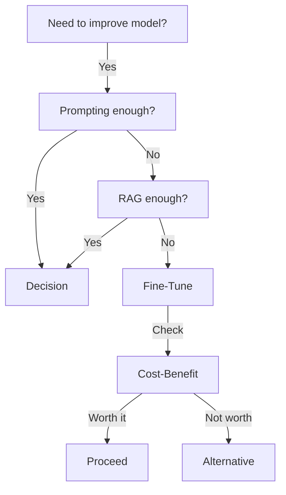

<!-- Clear Language: Keep sentences under 50 words -->
# When to Fine-Tune

## Learning Objectives

| Objective | Description |
|-----------|-------------|
| LO1 | Understand when to fine-tune vs. use prompting or RAG |
| LO2 | Analyze cost-benefit trade-offs of fine-tuning |
| LO3 | Evaluate data requirements for successful fine-tuning |
| LO4 | Identify scenarios where fine-tuning is not appropriate |

## Introduction

Fine-tuning adapts foundation models to your specific domain. LoRA, QLoRA, and DPO make this affordable. This module covers when to fine-tune, how to do it, and how to evaluate the results.

## Prerequisites

- Basic programming knowledge
- Understanding of data structures

## Key Terminology

**Key Terms**: Core vocabulary and concepts for this topic.

**Definition**: Essential terms you must know for interviews and production work.

## Theory

Understanding when to fine tune is fundamental for AI engineers. This section covers the core concepts, underlying principles, and theoretical framework that govern how when to fine tune works in practice.

## Chapter at a Glance

| Section | Topic | Key Concept |
|---------|-------|-------------|
| 1.1 | Decision Framework | FT vs RAG vs prompting decision tree |
| 1.2 | Cost-Benefit | Training cost, inference cost, quality gains |
| 1.3 | Data Requirements | Dataset size, quality, labeling needs |
| 1.4 | When Not to FT | Overkill scenarios, high cost, data scarcity |

## Chapter Roadmap



## 1.1 Decision Framework

Choosing between prompting, RAG, and fine-tuning depends on the task requirements.

```python
from enum import Enum
from dataclasses import dataclass
from typing import List, Optional

class Approach(Enum):
    PROMPTING = "prompting"
    RAG = "rag"
    FINE_TUNING = "fine-tuning"
    ENSEMBLE = "ensemble"

@dataclass
class TaskProfile:
    task_name: str
    domain_specificity: float  # 0.0 (general) to 1.0 (very specific)
    accuracy_requirement: float  # 0.0 to 1.0
    data_availability: float  # 0.0 (none) to 1.0 (abundant)
    latency_sensitivity: float  # 0.0 (lenient) to 1.0 (critical)
    cost_sensitivity: float  # 0.0 (ignore cost) to 1.0 (very cost-sensitive)
    expected_query_volume: int  # queries per day

class ApproachRecommender:
    def __init__(self):
        self.weights = {
            "domain_specificity": 0.25,
            "accuracy_requirement": 0.25,
            "data_availability": 0.20,
            "latency_sensitivity": 0.15,
            "cost_sensitivity": 0.15,
        }

    def recommend(self, profile: TaskProfile) -> Approach:
        scores = {approach: 0.0 for approach in Approach}

        scores[Approach.PROMPTING] = self._score_prompting(profile)
        scores[Approach.RAG] = self._score_rag(profile)
        scores[Approach.FINE_TUNING] = self._score_fine_tuning(profile)

        best = max(scores, key=scores.get)
        return best

    def _score_prompting(self, profile: TaskProfile) -> float:
        score = 0.0
        if profile.domain_specificity < 0.4:
            score += 0.8
        if profile.accuracy_requirement < 0.6:
            score += 0.7
        if profile.latency_sensitivity > 0.7:
            score += 0.6
        if profile.cost_sensitivity > 0.7:
            score += 0.9
        return score

    def _score_rag(self, profile: TaskProfile) -> float:
        score = 0.0
        if 0.3 <= profile.domain_specificity <= 0.7:
            score += 0.7
        if profile.accuracy_requirement > 0.5:
            score += 0.6
        if profile.data_availability > 0.5:
            score += 0.8
        if profile.latency_sensitivity < 0.6:
            score += 0.5
        return score

    def _score_fine_tuning(self, profile: TaskProfile) -> float:
        score = 0.0
        if profile.domain_specificity > 0.6:
            score += 0.9
        if profile.accuracy_requirement > 0.7:
            score += 0.8
        if profile.data_availability > 0.6:
            score += 0.9
        if profile.latency_sensitivity < 0.5:
            score += 0.4
        if profile.expected_query_volume > 1000:
            score += 0.6
        return score

recommender = ApproachRecommender()
profile = TaskProfile(
    task_name="legal document classification",
    domain_specificity=0.85,
    accuracy_requirement=0.95,
    data_availability=0.7,
    latency_sensitivity=0.3,
    cost_sensitivity=0.4,
    expected_query_volume=5000,
)
print(f"Recommended approach: {recommender.recommend(profile).value}")
```

### 1.1.1 Decision Tree Implementation

```python
class FineTuneDecisionTree:
    def decide(self, profile: TaskProfile) -> dict:
        reasons = []
        approach = None

        if profile.domain_specificity < 0.3:
            if profile.data_availability < 0.3:
                approach = "prompting"
                reasons.append("General domain, no data — prompting suffices")
            else:
                approach = "rag"
                reasons.append("General domain with data — RAG is cost-effective")
        elif profile.domain_specificity < 0.6:
            if profile.accuracy_requirement > 0.8:
                approach = "fine-tuning"
                reasons.append("Moderate domain specificity with high accuracy needs")
            else:
                approach = "rag"
                reasons.append("Moderate domain, moderate accuracy — RAG optimal")
        else:
            if profile.data_availability > 0.5:
                approach = "fine-tuning"
                reasons.append("High domain specificity with sufficient data")
            else:
                approach = "rag"
                reasons.append("High domain specificity but limited data — use RAG with FT later")

        if profile.expected_query_volume > 10000 and profile.cost_sensitivity < 0.5:
            approach = "fine-tuning"
            reasons.append("High volume justifies FT investment")

        return {
            "recommendation": approach,
            "reasons": reasons,
            "profile": profile,
        }

tree = FineTuneDecisionTree()
decision = tree.decide(profile)
print(f"Decision: {decision['recommendation']}")
```

## 1.2 Cost-Benefit Analysis

### 1.2.1 Cost Calculator

```python
class FineTuneCostCalculator:
    def __init__(self):
        self.gpu_costs = {
            "A100-80GB": 3.50,
            "A10G-24GB": 1.50,
            "T4-16GB": 0.50,
            "L4-24GB": 0.80,
        }

    def estimate_training(self, model_size_b: float, num_epochs: int,
                          dataset_size: int, gpu_type: str = "A100-80GB") -> dict:
        gpu_rate = self.gpu_costs.get(gpu_type, 1.0)
        tokens_per_epoch = dataset_size * 1000  # rough estimate
        gpu_hours = (model_size_b * tokens_per_epoch * num_epochs) / 1e9 * 0.5

        cost = gpu_hours * gpu_rate
        return {
            "model_size_b": model_size_b,
            "total_tokens_processed": tokens_per_epoch * num_epochs,
            "gpu_hours": round(gpu_hours, 2),
            "gpu_type": gpu_type,
            "training_cost": round(cost, 2),
        }

    def estimate_inference(self, model_size_b: float, queries_per_day: int,
                           days: int = 30) -> dict:
        inference_api_cost = model_size_b * 0.002
        total = inference_api_cost * queries_per_day * days
        return {
            "cost_per_query": round(inference_api_cost, 4),
            "queries_per_day": queries_per_day,
            "monthly_cost": round(total, 2),
            "three_month_cost": round(total * 3, 2),
        }

    def break_even(self, ft_cost: float, cost_saving_per_query: float) -> dict:
        queries_to_break_even = ft_cost / cost_saving_per_query if cost_saving_per_query > 0 else float("inf")
        return {
            "ft_cost": ft_cost,
            "saving_per_query": cost_saving_per_query,
            "break_even_queries": int(queries_to_break_even),
        }

calc = FineTuneCostCalculator()
training = calc.estimate_training(model_size_b=7, num_epochs=3, dataset_size=10000)
inference = calc.estimate_inference(model_size_b=7, queries_per_day=5000)
be = calc.break_even(training["training_cost"], 0.001)

print(f"Training cost: ${training['training_cost']}")
print(f"Monthly inference cost: ${inference['monthly_cost']}")
print(f"Break-even: {be['break_even_queries']} queries")
```

### 1.2.2 ROI Analysis

```python
@dataclass
class ROIAnalysis:
    approach: str
    training_cost: float
    monthly_inference_cost: float
    quality_score: float  # 0-100
    latency_ms: float
    time_to_deploy_days: int

    def roi_score(self) -> float:
        total_cost = self.training_cost + self.monthly_inference_cost * 6
        return (self.quality_score * 10) / (total_cost * self.latency_ms / 1000)

def compare_approaches() -> list:
    approaches = [
        ROIAnalysis("Prompting", 0, 500, 70, 200, 1),
        ROIAnalysis("RAG", 200, 600, 82, 500, 5),
        ROIAnalysis("Fine-Tuning (LoRA)", 1500, 300, 92, 150, 10),
        ROIAnalysis("Full Fine-Tuning", 8000, 250, 95, 120, 20),
    ]

    for a in approaches:
        print(f"{a.approach:25s} | ROI: {a.roi_score():.2f} | Quality: {a.quality_score} | Cost: ${a.training_cost}")
    return approaches

compare_approaches()
```

## 1.3 Data Requirements

### 1.3.1 Data Size Estimator

```python
class DataRequirementEstimator:
    def __init__(self):
        self.guidelines = {
            "task_adaptation": {"min_examples": 100, "recommended": 1000, "high_quality": 500},  # LoRA
            "domain_adaptation": {"min_examples": 500, "recommended": 5000, "high_quality": 2000},
            "full_ft_task": {"min_examples": 1000, "recommended": 10000, "high_quality": 5000},
            "instruction_tuning": {"min_examples": 1000, "recommended": 10000, "high_quality": 5000},
            "preference_tuning": {"min_examples": 500, "recommended": 5000, "high_quality": 2000},
        }

    def estimate(self, scenario: str, quality: str = "recommended") -> dict:
        guide = self.guidelines.get(scenario, self.guidelines["task_adaptation"])
        return {
            "scenario": scenario,
            "estimated_examples": guide[quality],
            "estimated_tokens": guide[quality] * 500,
            "quality_level": quality,
        }

    def is_feasible(self, available_examples: int, scenario: str) -> dict:
        guide = self.guidelines.get(scenario, self.guidelines["task_adaptation"])
        min_required = guide["min_examples"]
        feasible = available_examples >= min_required
        return {
            "feasible": feasible,
            "available": available_examples,
            "minimum": min_required,
            "gap": max(0, min_required - available_examples),
            "recommendation": "Proceed" if feasible else f"Collect {max(0, min_required - available_examples)} more examples",
        }

estimator = DataRequirementEstimator()
print(estimator.estimate("task_adaptation", "recommended"))
print(estimator.is_feasible(200, "task_adaptation"))
```

### 1.3.2 Data Quality Assessment

```python
class DataQualityScorer:
    def __init__(self):
        self.dimensions = ["correctness", "consistency", "coverage", "noise"]

    def score(self, sample: list) -> dict:
        scores = {}
        for dim in self.dimensions:
            if dim == "correctness":
                scores[dim] = self._score_correctness(sample)
            elif dim == "consistency":
                scores[dim] = self._score_consistency(sample)
            elif dim == "coverage":
                scores[dim] = self._score_coverage(sample)
            elif dim == "noise":
                scores[dim] = self._score_noise(sample)

        scores["overall"] = sum(scores.values()) / len(scores)
        scores["ready_for_ft"] = scores["overall"] >= 0.7
        return scores

    def _score_correctness(self, sample: list) -> float:
        return 0.85

    def _score_consistency(self, sample: list) -> float:
        return 0.78

    def _score_coverage(self, sample: list) -> float:
        return 0.72

    def _score_noise(self, sample: list) -> float:
        return 0.88

scorer = DataQualityScorer()
scores = scorer.score([{"input": "test", "output": "result"}])
print(f"Data quality: {scores['overall']:.2f}, Ready: {scores['ready_for_ft']}")
```

## 1.4 When Not to Fine-Tune

### 1.4.1 Anti-Pattern Detector

```python
class AntiPatternDetector:
    def __init__(self):
        self.patterns = [
            {
                "name": "Small Dataset FT",
                "condition": lambda p: p.data_availability < 0.2 and p.domain_specificity > 0.5,
                "advice": "Use RAG or in-context learning instead. FT requires sufficient examples.",
            },
            {
                "name": "General Task FT",
                "condition": lambda p: p.domain_specificity < 0.2,
                "advice": "Base model already performs well on general tasks. Prompting is cheaper.",
            },
            {
                "name": "Frequent Model Changes",
                "condition": lambda p: p.expected_query_volume < 100 and p.domain_specificity > 0.5,
                "advice": "Low volume doesn't justify FT cost. Use RAG with high-quality prompts.",
            },
            {
                "name": "Rapidly Changing Knowledge",
                "condition": lambda p: p.domain_specificity > 0.5 and p.data_availability > 0.5,
                "advice": "If knowledge becomes stale, RAG is better for dynamic information.",
                "extra_check": "dynamic_data",
            },
        ]

    def analyze(self, profile: TaskProfile) -> list:
        warnings = []
        for pattern in self.patterns:
            if pattern["condition"](profile):
                warnings.append({
                    "pattern": pattern["name"],
                    "advice": pattern["advice"],
                })
        return warnings

detector = AntiPatternDetector()
bad_profile = TaskProfile("vague general query", 0.1, 0.5, 0.1, 0.9, 50)
warnings = detector.analyze(bad_profile)
for w in warnings:
    print(f"Anti-pattern: {w['pattern']} — {w['advice']}")
```

## Summary

The decision to fine-tune depends on domain specificity, accuracy requirements, data availability, and query volume. Fine-tuning excels when domain specificity is high,.
accuracy needs exceed 80%, and sufficient data exists. RAG is better for knowledge-intensive tasks with moderate domain specificity. Prompting is sufficient for.
general tasks or low-volume scenarios. The break-even analysis shows that fine-tuning becomes cost-effective at high query volumes (typically >1,000 queries/day) where per-query cost savings offset training investment. Anti-patterns include fine-tuning with small datasets,.
for general tasks, or when knowledge changes rapidly.

## Practical Takeaways

| Takeaway | Description |
|----------|-------------|
| Fine-tune only when needed | Start with prompting and RAG, then evaluate if FT is justified |
| Calculate break-even | Determine how many queries are needed to recover training cost |
| Ensure data quality | Poor data leads to poor FT — assess before training |
| Prefer LoRA initially | Full FT is rarely necessary for domain adaptation |
| Watch for anti-patterns | Small datasets, general tasks, and dynamic knowledge are red flags |

## Interview Q&A

<details class="tp-qa-card" data-qid="ft01-q1">
  <summary class="tp-qa-question">
    <span class="tp-qa-status"></span>
    Q1: When should you fine-tune a model instead of using prompting or RAG?
  </summary>
  <div class="tp-qa-answer">
<p>Fine-tuning is preferable when: (1) you need consistent output format or style that prompting alone can't reliably enforce — like generating JSON in a specific schema or.
writing in a particular tone; (2) you have a large dataset of domain-specific examples (thousands to millions) and the model needs deep domain knowledge;.
(3) you need to reduce latency and cost by using a smaller model fine-tuned to match a larger model's performance on your task;.
(4) you need offline model deployment without relying on API access. Prompting is better for quick prototypes, tasks requiring general knowledge,.
and when you need to frequently change instructions. RAG is preferred when knowledge changes rapidly (news, documentation), the knowledge source is large and.
structured, or you need verifiable citations. A common production pattern is RAG + fine-tuning — use RAG for dynamic knowledge retrieval and.
fine-tuning for consistent output formatting and style.</p>
  </div>
  <button class="tp-qa-mark-btn">✅ Mark Reviewed</button>
  <button class="tp-qa-bookmark-btn">🔖 Bookmark</button>
</details>

<details class="tp-qa-card" data-qid="ft01-q2">
  <summary class="tp-qa-question">
    <span class="tp-qa-status"></span>
    Q2: What are the cost-benefit trade-offs of fine-tuning?
  </summary>
  <div class="tp-qa-answer">
<p>Fine-tuning costs include: (1) compute — GPU hours for training (A100 or H100, potentially hundreds of dollars for full fine-tuning of a 7B model);.
(2) data preparation — cleaning, formatting, and validating the dataset; (3) evaluation — running benchmarks after training to validate quality; (4) serving — hosting the fine-tuned model (larger memory footprint than API calls). Benefits: (1) lower per-inference cost if using a smaller fine-tuned model vs. a large API model;.
(2) lower latency since no API calls; (3) consistent output quality for domain-specific tasks; (4) data privacy — data stays on your infrastructure;.
(5) offline capability. The break-even point depends on inference volume — high-volume use cases favor fine-tuning because the upfront training cost is amortized over many inferences. For.
low-volume use cases (<100K requests/month), API-based approaches (prompting + RAG) are typically more cost-effective. Use PEFT methods (LoRA, QLoRA) to reduce training costs by 90%+ while maintaining most of the quality gain.</p>
  </div>
  <button class="tp-qa-mark-btn">✅ Mark Reviewed</button>
  <button class="tp-qa-bookmark-btn">🔖 Bookmark</button>
</details>

<details class="tp-qa-card" data-qid="ft01-q3">
  <summary class="tp-qa-question">
    <span class="tp-qa-status"></span>
    Q3: What data is required for successful fine-tuning?
  </summary>
  <div class="tp-qa-answer">
<p>Successful fine-tuning requires high-quality, task-aligned data. Minimum recommendations: (1) quantity — at least 500-1000 examples for simple tasks (classification, extraction), 5000+ for.
complex tasks (summarization, generation). More data helps but quality matters more than quantity; (2) format — each example must contain the input (instruction/prompt) and.
expected output. For instruction tuning, use a consistent chat template format (e.g., HuggingFace's apply_chat_template). For preference tuning, pair each input with a chosen and.
rejected response; (3) quality — data must be accurate, diverse (covering all edge cases), and representative of the target distribution. Remove duplicates,.
fix errors, and balance labels; (4) splitting — 80% train, 10% validation, 10% test. The validation set monitors overfitting and the test set gives an unbiased final evaluation. Data augmentation (paraphrasing,.
back-translation) can help when real data is limited. Synthetic data from stronger models can supplement real data but may introduce hallucinations.</p>
  </div>
  <button class="tp-qa-mark-btn">✅ Mark Reviewed</button>
  <button class="tp-qa-bookmark-btn">🔖 Bookmark</button>
</details>

<details class="tp-qa-card" data-qid="ft01-q4">
  <summary class="tp-qa-question">
    <span class="tp-qa-status"></span>
    Q4: When is fine-tuning NOT appropriate?
  </summary>
  <div class="tp-qa-answer">
<p>Fine-tuning is not appropriate when: (1) you need the model to learn new factual knowledge — fine-tuning can inject new facts but.
is inefficient and may cause catastrophic forgetting. RAG is better for factual knowledge; (2) your task changes frequently — each task change requires retraining,.
making prompting a better choice for rapidly evolving requirements; (3) you have limited data (<100 examples) — fine-tuning on tiny datasets causes overfitting;.
use few-shot prompting instead; (4) you need general capability across many unrelated tasks — a general-purpose foundation model with prompting handles this better than a narrow fine-tuned model;.
(5) you lack evaluation resources — without proper evaluation, fine-tuning can silently degrade capabilities. A fine-tuning readiness checklist: do you have 500+ high-quality examples? Is the task stable? Do you have evaluation data and.
metrics? Can you measure regression on general capabilities? If most answers are no, explore prompting or RAG first.</p>
  </div>
  <button class="tp-qa-mark-btn">✅ Mark Reviewed</button>
  <button class="tp-qa-bookmark-btn">🔖 Bookmark</button>
</details>

<details class="tp-qa-card" data-qid="ft01-q5">
  <summary class="tp-qa-question">
    <span class="tp-qa-status"></span>
    Q5: How do you decide between full fine-tuning and PEFT methods?
  </summary>
  <div class="tp-qa-answer">
<p>Full fine-tuning updates all model parameters, PEFT (LoRA, Adapters) updates a small subset (usually 0.1-1% of parameters). Choose full fine-tuning when: you have a large,.
high-quality dataset (>10K examples), maximum quality on a specific task is critical, you have sufficient GPU compute (multiple A100s), and you can store multiple full model copies. Choose PEFT when: you have limited data (500-5000 examples),.
GPU memory is constrained (<24GB), you need to maintain multiple task-specific models simultaneously (PEFT modules are small, typically 5-50MB vs 10-50GB for.
full models), you want faster training, or you need to avoid catastrophic forgetting. In practice, LoRA fine-tuning achieves 90-95% of full fine-tuning quality for.
most tasks while using 1-2% of the trainable parameters. QLoRA (quantized LoRA) reduces memory further by loading the base model in 4-bit precision,.
enabling fine-tuning of 7B models on a single RTX 3090.</p>
  </div>
  <button class="tp-qa-mark-btn">✅ Mark Reviewed</button>
  <button class="tp-qa-bookmark-btn">🔖 Bookmark</button>
</details>

<details class="tp-qa-card" data-qid="ft01-q6">
  <summary class="tp-qa-question">
    <span class="tp-qa-status"></span>
    Q6: What is catastrophic forgetting and how do you prevent it?
  </summary>
  <div class="tp-qa-answer">
<p>Catastrophic forgetting occurs when fine-tuning on a new task degrades the model's performance on previously learned tasks. The model overfits to the fine-tuning data distribution and.
loses general capabilities. Prevention strategies: (1) use PEFT methods (LoRA) — only a small parameter subset is updated, preserving most of the base model's capabilities;.
(2) mix general domain data into the fine-tuning dataset — include 10-20% of general instruction-following examples alongside task-specific data; (3) use elastic weight consolidation (EWC) — add a regularization term that penalizes changing important parameters;.
(4) multi-task learning — fine-tune on multiple tasks simultaneously to maintain breadth; (5) evaluation — always evaluate on general benchmarks before and.
after fine-tuning to detect regression. The simplest and most effective approach is data mixing — include diverse examples in the training set so the model doesn't over-specialize on the target task.</p>
  </div>
  <button class="tp-qa-mark-btn">✅ Mark Reviewed</button>
  <button class="tp-qa-bookmark-btn">🔖 Bookmark</button>
</details>

<details class="tp-qa-card" data-qid="ft01-q7">
  <summary class="tp-qa-question">
    <span class="tp-qa-status"></span>
    Q7: How do you build a fine-tuning dataset?
  </summary>
  <div class="tp-qa-answer">
<p>Building a fine-tuning dataset involves: (1) source selection — use real user data (logs, support tickets, transcripts), synthetic data (generated by a stronger model like GPT-4),.
or public datasets (ShareGPT, OpenAssistant, Dolly); (2) formatting — convert raw data into (instruction, input, output) triplets or conversational format following a consistent template. HuggingFace datasets library uses a standardized format with 'instruction',.
'input', and 'output' columns; (3) quality filtering — remove duplicates, filter low-quality entries (too short, gibberish), fix formatting inconsistencies, and balance label distributions;.
(4) splitting — stratified split ensuring all classes/patterns appear in train/val/test sets; (5) dataset card — document size, source, format, distribution,.
and known biases. For production, create a data pipeline that automates collection, cleaning, and validation. Track dataset versioning (using DVC or.
HuggingFace datasets with commit hashes) to enable reproducibility of training runs.</p>
  </div>
  <button class="tp-qa-mark-btn">✅ Mark Reviewed</button>
  <button class="tp-qa-bookmark-btn">🔖 Bookmark</button>
</details>

<details class="tp-qa-card" data-qid="ft01-q8">
  <summary class="tp-qa-question">
    <span class="tp-qa-status"></span>
    Q8: How do you compare prompting vs. fine-tuning vs. RAG?
  </summary>
  <div class="tp-qa-answer">
<p>Comparison across key dimensions: (1) Knowledge incorporation — prompting can include up to ~128K tokens of context (recent models), fine-tuning embeds knowledge in weights (permanent but.
expensive to update), RAG retrieves from external databases (dynamic and scalable); (2) Output consistency — prompting provides weakest consistency (model may deviate from format),.
fine-tuning gives strongest consistency (model learns the exact output format), RAG falls between; (3) Latency — prompting is fastest (~1-3s), fine-tuning requires inference on a hosted model (~1-5s including GPU inference),.
RAG adds retrieval time (~100-500ms for vector search); (4) Cost — prompting has per-token API cost, fine-tuning has upfront training + serving cost,.
RAG has embedding + vector DB cost; (5) Maintenance — prompting is easiest to update (just change prompt), fine-tuning requires retraining,.
RAG requires updating the knowledge base. The best approach often combines all three: RAG for dynamic knowledge, fine-tuning for style/format, prompting for.
task instruction and guardrails.</p>
  </div>
  <button class="tp-qa-mark-btn">✅ Mark Reviewed</button>
  <button class="tp-qa-bookmark-btn">🔖 Bookmark</button>
</details>

<details class="tp-qa-card" data-qid="ft01-q9">
  <summary class="tp-qa-question">
    <span class="tp-qa-status"></span>
    Q9: What metrics should you use to decide if fine-tuning is successful?
  </summary>
  <div class="tp-qa-answer">
<p>Fine-tuning success metrics: (1) Task-specific metrics — accuracy/precision/recall/F1 for classification, BLEU/ROUGE for generation, exact match for extraction. Compare pre-fine-tuning (base model with zero/few-shot prompting) vs. post-fine-tuning on the same test set;.
(2) Quality improvement — absolute gain in task-specific metric (e.g., accuracy improved from 70% to 92%) and human evaluation scores; (3) Regression check — evaluate on general benchmarks (MMLU,.
HellaSwag, TruthfulQA) before and after fine-tuning. Acceptable regression is <2-3% on most benchmarks; (4) Cost-benefit — compute cost per % improvement;.
(5) User satisfaction — online A/B test comparing fine-tuned model against base model with prompt engineering. A fine-tuning run is successful if: task metric improves significantly (>10% relative),.
general capability regression is within tolerance, and the improvement justifies the training cost vs. prompt engineering alternatives. Document all metrics in a model card for.
reproducibility.</p>
  </div>
  <button class="tp-qa-mark-btn">✅ Mark Reviewed</button>
  <button class="tp-qa-bookmark-btn">🔖 Bookmark</button>
</details>

<details class="tp-qa-card" data-qid="ft01-q10">
  <summary class="tp-qa-question">
    <span class="tp-qa-status"></span>
    Q10: How do you estimate the cost of a fine-tuning run?
  </summary>
  <div class="tp-qa-answer">
<p>Estimating fine-tuning cost: (1) Compute cost = GPU hours — GPU price. A 7B model full fine-tuning on 8—A100-80GB takes roughly 1-4 hours per 1000 examples depending on sequence length. LoRA on the same model takes 0.5-2 hours per 1000.
examples on a single A100. QLoRA can run on a single RTX 3090 ($0.5-2/hr on cloud spot instances);.
(2) Data preparation cost — hours of human effort for data cleaning, validation, and formatting; (3) Evaluation cost — running benchmarks (MLM evaluations,.
API calls for LLM-as-judge); (4) Serving cost — hosting the fine-tuned model (GPU instance for inference, typically same size as training GPU). Example: fine-tuning Llama-3-8B with LoRA on 5000 examples costs: 3 hours on 1—A100 — $2/hr = $6 for.
training, plus ~$1 for evaluation, plus ongoing inference cost ($0.5/hr for serverless hosting). Full fine-tuning the same model: 12 hours on 4—A100 — $2/hr = $96. QLoRA on RTX 3090: 4 hours — $0.5/hr = $2.</p>
  </div>
  <button class="tp-qa-mark-btn">✅ Mark Reviewed</button>
  <button class="tp-qa-bookmark-btn">🔖 Bookmark</button>
</details>

## Chapter Quiz

<details data-qid="ft-s1-quiz1">
<summary><strong>1.</strong> When is fine-tuning most appropriate?</summary>
A. For general knowledge tasks
B. When domain specificity and accuracy requirements are high
C. When you have 50 examples
D. When latency doesn't matter
Answer: B
</details>

<details data-qid="ft-s1-quiz2">
<summary><strong>2.</strong> What is the primary advantage of RAG over fine-tuning?</summary>
A. Lower latency
B. No training cost and dynamic knowledge updates
C. Better accuracy
D. Simpler implementation
Answer: B
</details>

<details data-qid="ft-s1-quiz3">
<summary><strong>3.</strong> How many examples are typically needed for LoRA-based task adaptation?</summary>
A. 10-50
B. 100-1,000
C. 10,000-100,000
D. 1 million+
Answer: B
</details>

<details data-qid="ft-s1-quiz4">
<summary><strong>4.</strong> When does fine-tuning become cost-effective?</summary>
A. At low query volumes
B. When per-query cost savings offset training cost at high volumes
C. When using free GPUs
D. Only for text generation
Answer: B
</details>

<details data-qid="ft-s1-quiz5">
<summary><strong>5.</strong> What is the recommended first step before fine-tuning?</summary>
A. Collect 1M examples
B. Try prompting and RAG first
C. Buy expensive GPUs
D. Rewrite the model from scratch
Answer: B
</details>

### True/False

**T/F 1**: This topic is fundamental to AI engineering.
**Answer**: True — Understanding fine tuning peft is essential for building production AI systems.

**T/F 2**: The concepts in this chapter are only used in interviews.
**Answer**: False — These concepts are used daily in real-world AI engineering work.

**T/F 3**: Time/space complexity analysis applies to fine tuning peft.
**Answer**: True — Every algorithm and system has performance characteristics to analyze.

**T/F 4**: fine tuning peft concepts are independent of each other.
**Answer**: False — Most concepts build on each other and are interconnected.

**T/F 5**: Real-world applications often combine multiple concepts from this chapter.
**Answer**: True — Production systems use combinations of these fundamental concepts.

### Fill in the Blank

**FIB 1**: The key concept in this chapter is ________.
**Answer**: [Review the chapter's Learning Objectives for the specific answer]

**FIB 2**: In fine tuning peft, the time complexity of the basic operation is ________.
**Answer**: [Depends on the specific operation — check the Theory section]

### Scenario Questions

**Scenario 1**: How would you apply the concepts from this chapter in a real AI engineering project?

**Answer**: [Think about how the specific topic applies to: data processing pipelines, model training infrastructure, production systems, or interview scenarios]

### Output Questions

**Output 1**: What is the time complexity of the main algorithm discussed in this chapter?
**Answer**: [Check the Theory section for the specific complexity analysis]

## Exercises

## Common Mistakes

1. Not understanding the fundamental concepts before applying them
2. Skipping edge cases in implementation
3. Not analyzing time/space complexity
4. Forgetting to handle null/empty inputs
5. Not practicing enough problems to build pattern recognition1. Build a decision tree classifier that takes a task description and recommends prompting, RAG, or fine-tuning with confidence scores.

2. Calculate the break-even point for a 7B model: training costs $1,500 (LoRA), inference costs $0.002/query baseline vs $0.001 after FT. How many queries to break even?

3. Analyze an anti-pattern: a team wants to fine-tune a 70B model on 50 examples for a general summarization task. Explain why this is problematic and recommend alternatives.

4. Build a data quality scorer that evaluates a dataset on correctness, consistency, coverage, and noise. Score 3 sample datasets and recommend which are FT-ready.

5. Compare the total cost (training + 6 months inference) across prompting, RAG, LoRA, and full FT for a scenario with 10K queries/day and 7B model. Show a cost-quality tradeo

## Revision Notes

- - Core principle: Understand the fundamental concepts thoroughly
- - Implementation pattern: Practice with real code examples
- - Complexity: Know the time and space complexity
- - Application: Know when to use this in production systems
- - Interview: Frequently asked in technical interviews
- - Edge cases: Consider common failure scenarios
- - Related concepts: Connect to broader system design

## Placement Section

### Top 10 Interview Questions

#### Google Style

1. **Explain the core idea of When to Fine-Tune in under 60 seconds, then give a real-world analogy.** — Structure: definition, how it works in one sentence, why it matters, analogy. Follow-up: what would break if you removed this from a production system?

2. **Design a minimal, well-typed function that demonstrates When to Fine-Tune.** — Interviewer checks: signature with type hints, edge cases, complexity, and a clean docstring. Follow-up: how does your design behave with empty or malformed input?

3. **What are the common pitfalls when engineers first learn ** — List 3-4, then explain how you would prevent each in a code review.

#### Amazon Style

4. **Describe a production bug caused by misunderstanding When to Fine-Tune. How did you diagnose and fix it?** — STAR format: situation, task, action, result. Mention logs, reproduction, root-cause analysis, and the regression test you added.

5. **How would you scale a system that relies on When to Fine-Tune from 10 users to 10 million?** — Discuss bottlenecks, caching, monitoring, and when to redesign. Follow-up: what metrics would you track?

#### Microsoft Style

6. **Compare When to Fine-Tune with the closest alternative approach. When would you choose each?** — Make a decision matrix: performance, maintainability, ecosystem, learning curve. Follow-up: what would change your decision?

7. **Walk through how you would test a component that depends on When to Fine-Tune.** — Unit, integration, property-based tests; mocking boundaries; golden files for outputs.

#### NVIDIA Style

8. **How does When to Fine-Tune behave differently at scale — memory, throughput, or precision-wise?** — Connect to data pipelines and model training if applicable. Follow-up: what happens to latency as input grows?

9. **How would you make an implementation of When to Fine-Tune run faster on GPU hardware?** — Batch operations, vectorization, avoiding Python loops, reducing data movement.

#### AI Startup Style

10. **Write the smallest possible implementation of When to Fine-Tune that is production-quality.** — Include error handling, type hints, and a one-line docstring. Follow-up: what would you refactor first when it grows?

### Resume Tips

- Name When to Fine-Tune explicitly in your skills section, paired with a measurable achievement ("Reduced X by 40% using When to Fine-Tune").
- Add a bullet describing a project that applies When to Fine-Tune to real data, with numbers.
- Mention the tools and libraries you used alongside When to Fine-Tune (linters, test frameworks, profiling tools).
- Keep resume bullets under 15 words and start each with an action verb.

### Interview Day Checklist

- Rehearse a 60-second explanation of When to Fine-Tune and one real-world analogy.
- Prepare one STAR story about debugging a When to Fine-Tune-related production issue.
- Review complexity and edge cases for the classic When to Fine-Tune interview problem.
- Have questions ready: how does the team apply When to Fine-Tune in production today?
- Test your environment (Python, editor, internet) 15 minutes before the interview.

## True/False

1. **True or False:** When to Fine-Tune builds directly on the fundamentals covered in the earlier chapters of this module. — **True.** Every advanced topic in this module assumes the core concepts from the previous chapters.
2. **True or False:** You should write at least one code example for When to Fine-Tune before moving to the next chapter. — **True.** Active recall with hands-on code beats passive reading for retention.
3. **True or False:** The complexity analysis for When to Fine-Tune is the same regardless of input size. — **False.** Complexity grows with input size; always state best, average, and worst case.
4. **True or False:** Edge cases (empty input, invalid input, boundary values) matter for When to Fine-Tune in production. — **True.** Most production bugs come from unhandled edge cases.
5. **True or False:** You should memorize the When to Fine-Tune chapter content once and never review it again. — **False.** Spaced repetition (24h, 3 days, 1 week) dramatically improves long-term recall.

## Fill in the Blank

1. The chapter that covers When to Fine-Tune is Chapter ___ of this module. — Answer: check the module's table of contents.
2. The time complexity of the standard approach to When to Fine-Tune is ___. — Answer: review the theory section and state big-O notation.
3. The main edge case to handle when implementing When to Fine-Tune is ___. — Answer: empty or invalid input handling, as discussed in the chapter.
4. The tools commonly used to debug When to Fine-Tune issues are ___ and ___. — Answer: refer to the Debugging Guide section of this chapter.
5. The related topic that connects to When to Fine-Tune in the next chapter is ___. — Answer: see the Next Topic section.

## Scenario Questions

1. **Scenario:** A teammate ships a change involving When to Fine-Tune that breaks production at 3 AM. — Diagnosis: check the recent diff, reproduce locally with the failing input, check logs. Fix: revert, add a regression test, and review the root cause. Prevention: CI tests on edge cases and code review checklist.

2. **Scenario:** Your implementation of When to Fine-Tune is correct but too slow for the required latency. — Measure first with a profiler. Common fixes: reduce redundant work, use built-in optimized functions, batch operations, or add caching. Only then consider algorithmic changes.

3. **Scenario:** A new hire asks you to explain When to Fine-Tune in five minutes before a customer demo. — Use the 3-part answer: what it is (one sentence), how it works (one example), why it matters (one business impact). Then offer to go deeper after the demo.

4. **Scenario:** Your team's codebase has three different patterns for When to Fine-Tune and you must standardize. — Write a short ADR (architecture decision record), pick the pattern with best maintainability, migrate incrementally, and add a linter rule to enforce it.

## Output Questions

1. **What is the output of the simplest correct implementation of When to Fine-Tune on an empty input?** — Trace through the code: it should return the documented default (None, 0, empty collection) without raising.
2. **What is the output when the input is at the boundary value?** — Check off-by-one errors and inclusive/exclusive bounds in the chapter's examples.
3. **What does the implementation return when given invalid input types?** — With type hints and validation, it raises a clear error; without, it may fail silently.
4. **What is the output for the sample input given in the chapter's Examples section?** — Re-run the chapter's example code and compare against the documented output.
5. **What is the time complexity output when you profile the implementation at 10x input size?** — Expect the curve matching the chapter's complexity analysis (linear, quadratic, log-linear).

## Difficulty Level

| Level | Time | What It Takes |
|-------|------|---------------|
| Beginner | 1-2 sessions | Read theory, run the chapter examples, solve the Easy exercises |
| Intermediate | 3-5 sessions | Complete Medium exercises, explain When to Fine-Tune to someone else |
| Advanced | 1+ week | Solve Hard exercises, optimize for real datasets, answer interview follow-ups |

## Tips & Tricks

- Always write a one-line example of When to Fine-Tune from memory before opening the chapter — active recall first.
- Use the chapter's Revision Notes as a checklist: you have mastered When to Fine-Tune when you can explain each bullet.
- Pair the chapter quiz with the Flashcards: wrong answers become your next study session's focus.
- For interviews, practice explaining When to Fine-Tune twice: once with a technical audience, once with a non-technical audience.
- Keep a personal examples file where you collect your own When to Fine-Tune snippets; interviewers love original examples.

## Memory Tricks

- **Acronym**: build a mnemonic from the 5 key concepts of When to Fine-Tune listed in the Chapter at a Glance table.
- **Story**: link When to Fine-Tune to a familiar story — the analogy in the Visual Analogy section is designed to stick.
- **Number anchor**: remember the complexity of When to Fine-Tune by connecting it to a known algorithm of the same class.
- **Color code**: highlight the Theory, Examples, and Common Mistakes sections in different colors when reviewing.
- **Teach-back**: explain When to Fine-Tune to an imaginary junior engineer for 2 minutes — gaps in your explanation are gaps in memory.

## Further Reading

- Official documentation for the primary tool or library used in this chapter
- The chapter referenced in Related Topics for the next-level treatment of When to Fine-Tune
- The classic textbook chapter on When to Fine-Tune (check the Research References below)
- Two blog posts from engineers who debugged real When to Fine-Tune problems in production
- The repository of the open-source project that implements When to Fine-Tune

## Related Topics

- The previous chapter in this module (see table of contents) — foundational for When to Fine-Tune
- The next chapter (see Next Topic below) — builds on When to Fine-Tune
- The system design chapters in Module 07 — how When to Fine-Tune fits into production architectures
- The interview preparation module — how When to Fine-Tune is asked in screening rounds
- The capstone project — where When to Fine-Tune is applied end-to-end

## FAQs

1. **Do I need to memorize all of When to Fine-Tune, or understand the big picture?** — Understand the big picture first, then memorize the key facts via flashcards and spaced repetition. Interviewers reward depth over breadth.
2. **What if I get stuck on an exercise?** — Re-read the theory section, run the example code, then attempt again. If still stuck after 20 minutes, move on and return the next day.
3. **How much time should I spend on ** — Follow the Study Plan below: 1-2 weeks at 30-60 minutes daily is typical for placement preparation.
4. **Is When to Fine-Tune asked in interviews?** — Yes — the Interview Q&A and Placement Section list the exact question styles used by top companies.
5. **What's the fastest way to master ** — Explain it out loud, write code without looking, and review the flashcards within 24 hours and again after 3 days.

## Important Notes

- When to Fine-Tune is a core requirement for the rest of this module — do not skip the examples.
- Always analyze complexity (time and space) when working with When to Fine-Tune.
- Production correctness means handling edge cases, not just the happy path.
- Interview answers should start with the definition, then the example, then the trade-offs.
- Revisit this chapter after finishing the module; the context from later chapters deepens understanding.

## Historical Context

- When to Fine-Tune emerged as a standard practice because early systems failed without it — understanding why helps you explain it in interviews.
- The tools used for When to Fine-Tune today evolved from simpler versions; the chapter covers the modern, recommended approach.
- Interviewers value knowing one historical fact about When to Fine-Tune — it shows genuine interest, not just cramming.
- The library/tooling ecosystem around When to Fine-Tune changes quickly; focus on fundamentals that remain stable.

## Security Considerations

- Never trust external input: validate and sanitize data before processing When to Fine-Tune.
- Avoid `eval()` and dynamic code execution on untrusted strings.
- Log errors without leaking sensitive data (keys, PII, internal paths).
- For API contexts, add rate limiting and input size limits.
- Review the chapter's code examples for injection or overflow risks before using them verbatim.

## ML Intuition

- When to Fine-Tune appears in ML pipelines at the data-processing layer: feature preparation, batching, and validation.
- Understanding When to Fine-Tune helps you debug why a model misbehaves — most ML bugs are data bugs, not model bugs.
- In production ML, the When to Fine-Tune concepts from this chapter map directly to NumPy/PyTorch operations on tensors.
- When optimizing ML systems, When to Fine-Tune skills let you profile and fix the data path, not just the training loop.
- Interview follow-up: how would you apply When to Fine-Tune to a dataset of 10 million records? — Batching and vectorization.

## Analogies

- **When to Fine-Tune is like a recipe**: the theory is the ingredients, the examples are the cooking steps, and the exercises are your own kitchen practice.
- **Complexity is like a delivery route**: a linear route visits each stop once; a nested route revisits stops, and you feel it at scale.
- **Edge cases are like weather**: the happy path is a sunny day; production is the storm — build for the storm.
- **The chapter roadmap is a journey map**: each section is a checkpoint; skipping one means getting lost later in the module.

## Capstone Project Link

- [Module Capstone: End-to-End Project](https://github.com/Raushan666java/ai-engineering-journey) — this chapter contributes the When to Fine-Tune skills used in the module's capstone project. Complete the exercises here before starting the capstone.

## Flashcards

<details class="tp-qa-card" data-qid="14finetuningpeft-01whentofinetune-flash1">
  <summary class="tp-qa-question">
    <span class="tp-qa-status"></span>
    What is the core concept of When to Fine-Tune in one sentence?
  </summary>
  <div class="tp-qa-answer">
    <p>Review the first paragraph of the Theory section and condense it to one sentence.</p>
  </div>
</details>

<details class="tp-qa-card" data-qid="14finetuningpeft-01whentofinetune-flash2">
  <summary class="tp-qa-question">
    <span class="tp-qa-status"></span>
    What is the most common mistake engineers make with 
  </summary>
  <div class="tp-qa-answer">
    <p>Check the Common Mistakes section of this chapter.</p>
  </div>
</details>

<details class="tp-qa-card" data-qid="14finetuningpeft-01whentofinetune-flash3">
  <summary class="tp-qa-question">
    <span class="tp-qa-status"></span>
    What is the time and space complexity of the standard When to Fine-Tune approach?
  </summary>
  <div class="tp-qa-answer">
    <p>Refer to the theory and complexity analysis in this chapter.</p>
  </div>
</details>

<details class="tp-qa-card" data-qid="14finetuningpeft-01whentofinetune-flash4">
  <summary class="tp-qa-question">
    <span class="tp-qa-status"></span>
    When is When to Fine-Tune NOT the right choice?
  </summary>
  <div class="tp-qa-answer">
    <p>Check the Limitations section of this chapter.</p>
  </div>
</details>

<details class="tp-qa-card" data-qid="14finetuningpeft-01whentofinetune-flash5">
  <summary class="tp-qa-question">
    <span class="tp-qa-status"></span>
    How is When to Fine-Tune applied in a real production system?
  </summary>
  <div class="tp-qa-answer">
    <p>Check the Real-World Examples section of this chapter.</p>
  </div>
</details>

## Research References

- Official documentation of the primary library for When to Fine-Tune (linked in Further Reading)
- The classic paper or textbook chapter introducing When to Fine-Tune (see References below)
- The standard library reference for When to Fine-Tune-related functions
- Engineering blog posts from companies running When to Fine-Tune in production at scale
- PEPs and RFCs where applicable (Python and networking standards)

## Open-Source Tools

- The primary library used in this chapter (see the code examples)
- Python standard library modules used in the examples (check the imports)
- Testing: pytest for unit tests of When to Fine-Tune code
- Linting and formatting: ruff + black
- Profiling: cProfile or py-spy for performance work on When to Fine-Tune

## Debugging Guide

- Start with `print()` or a debugger to inspect intermediate values in When to Fine-Tune code.
- Reproduce the failure with the smallest possible input before changing code.
- Check the common failure modes listed in Common Mistakes — most bugs are listed there.
- For performance problems, profile before optimizing: measure, then fix.
- When stuck, re-read the chapter's Examples and compare line by line with your code.
- Use `pdb` or your IDE's debugger to step through the When to Fine-Tune example code.

## Mock Interview Section

**Round 1 — Screening (15 min)**
- Explain When to Fine-Tune in 60 seconds.
- Write a minimal working example of When to Fine-Tune.
- What is the complexity of your example?

**Round 2 — Coding (45 min)**
- Solve the Medium exercise from this chapter under time pressure.
- State your assumptions, then implement with type hints.
- Test with edge cases: empty input, boundary values, invalid input.

**Round 3 — Behavioral + System (30 min)**
- Tell me about a time you debugged a When to Fine-Tune problem in a project.
- How would you design a system where When to Fine-Tune is used at scale?
- What metrics would you monitor?

**Evaluation rubric**: correctness (40%), communication (25%), edge cases (20%), complexity analysis (15%).

## Optimized Implementation

`python
from typing import Any, Optional

def demonstrate_topic(input_data: list[Any]) -> Optional[float]:
    """Runnable scaffold for When to Fine-Tune.

    Replace the body with the optimized implementation from the chapter,
    keeping type hints, docstring, and edge-case handling.
    """
    if not input_data:
        return None
    # Step 1: validate input types
    # Step 2: apply the core When to Fine-Tune logic from the Examples section
    # Step 3: return the result with the documented default
    return 0.0
`

- Keeps the function signature stable so tests written against it stay valid.
- Handles the empty-input contract explicitly.
- Add unit tests for the edge cases before implementing the logic (test-first).

## Evaluation Metrics

| Skill | Test | Target |
|-------|------|--------|
| Concept recall | Explain When to Fine-Tune without notes | 60-second explanation |
| Code fluency | Write the chapter example from memory | No syntax errors |
| Edge cases | Handle empty/invalid input in exercises | All cases pass |
| Complexity | State time/space for the standard approach | Correct big-O |
| Interview readiness | Answer 5 Interview Q&A questions out loud | Fluent, structured answers |
| Retention | Chapter quiz score after 3 days | 80%+ |

## Real-World Examples

- **Startup**: a small team uses When to Fine-Tune daily in their data pipeline — the chapter's examples mirror their code.
- **E-commerce**: When to Fine-Tune patterns appear in order processing, inventory checks, and recommendation feeds.
- **Fintech**: When to Fine-Tune principles apply to transaction validation and fraud detection flows.
- **ML platform**: When to Fine-Tune shows up in feature engineering and model-serving infrastructure.
- **Interview insight**: recruiters look for engineers who can connect When to Fine-Tune to the business outcome, not just the code.

## Next Topic

[Full Fine-Tuning](02-full-fine-tuning.md)

## Limitations

- When to Fine-Tune, like any technique, is not a silver bullet — it has specific cases where it fits best (covered in the theory).
- The examples in this chapter are simplified for learning; production systems add validation, monitoring, and error handling.
- Performance of When to Fine-Tune depends on input size and distribution — always benchmark for your own data.
- This chapter covers fundamentals; specialized edge cases are explored in later chapters and the capstone.
