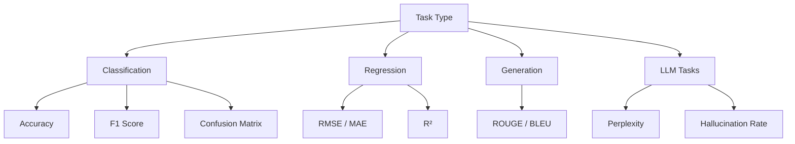

<!-- Clear Language: Keep sentences under 50 words -->
# Evaluation Metrics

## Learning Objectives

| Objective | Description |
|-----------|-------------|
| LO1 | Understand classification, generation, and regression metrics |
| LO2 | Implement accuracy, precision, recall, F1, ROUGE, BLEU |
| LO3 | Select appropriate metrics for different AI tasks |
| LO4 | Interpret metric scores and identify limitations |

## Introduction

You cannot improve what you cannot measure. Evaluation metrics, LLM-as-judge, and observability tools help you monitor and improve AI systems in production. This module covers the full evaluation stack.

## Prerequisites

- Basic programming knowledge
- Understanding of data structures

## Key Terminology

**Key Terms**: Core vocabulary and concepts for this topic.

**Definition**: Essential terms you must know for interviews and production work.

## Theory

Understanding evaluation metrics is fundamental for AI engineers. This section covers the core concepts, underlying principles, and theoretical framework that govern how evaluation metrics works in practice.

## Chapter at a Glance

| Section | Topic | Key Concept |
|---------|-------|-------------|
| 1.1 | Classification Metrics | Accuracy, precision, recall, F1, confusion matrix |
| 1.2 | Regression Metrics | RMSE, MAE, R², MAPE |
| 1.3 | Generation Metrics | ROUGE, BLEU, BERTScore, METEOR |
| 1.4 | LLM-Specific Metrics | Perplexity, calibration, hallucination rate |
| 1.5 | Metric Selection | Task-to-metric mapping, trade-offs |

## Chapter Roadmap



## 1.1 Classification Metrics

### 1.1.1 Basic Classification Metrics

```python
import numpy as np
from typing import List, Dict, Any
from collections import Counter

class ClassificationMetrics:
    def accuracy(self, y_true: List[Any], y_pred: List[Any]) -> Dict:
        correct = sum(1 for t, p in zip(y_true, y_pred) if t == p)
        total = len(y_true)
        return {"accuracy": correct / total if total > 0 else 0, "correct": correct, "total": total}

    def confusion_matrix(self, y_true: List[Any], y_pred: List[Any]) -> Dict:
        labels = sorted(set(y_true) | set(y_pred))
        matrix = {l: {l2: 0 for l2 in labels} for l in labels}
        for t, p in zip(y_true, y_pred):
            matrix[t][p] += 1
        return {"labels": labels, "matrix": matrix}

    def precision_recall_f1(self, y_true: List[Any], y_pred: List[Any]) -> Dict:
        labels = sorted(set(y_true) | set(y_pred))
        results = {}

        for label in labels:
            tp = sum(1 for t, p in zip(y_true, y_pred) if t == label and p == label)
            fp = sum(1 for t, p in zip(y_true, y_pred) if t != label and p == label)
            fn = sum(1 for t, p in zip(y_true, y_pred) if t == label and p != label)

            precision = tp / (tp + fp) if (tp + fp) > 0 else 0
            recall = tp / (tp + fn) if (tp + fn) > 0 else 0
            f1 = 2 * precision * recall / (precision + recall) if (precision + recall) > 0 else 0

            results[label] = {
                "precision": round(precision, 3),
                "recall": round(recall, 3),
                "f1": round(f1, 3),
                "support": tp + fn,
            }

        macro_f1 = np.mean([r["f1"] for r in results.values()])
        weighted_f1 = np.average(
            [r["f1"] for r in results.values()],
            weights=[r["support"] for r in results.values()],
        )

        return {
            "per_class": results,
            "macro_f1": round(macro_f1, 3),
            "weighted_f1": round(weighted_f1, 3),
        }

cm = ClassificationMetrics()
y_true = ["cat", "dog", "cat", "bird", "dog", "cat"]
y_pred = ["cat", "dog", "cat", "cat", "dog", "bird"]
print(f"Accuracy: {cm.accuracy(y_true, y_pred)}")
print(f"F1: {cm.precision_recall_f1(y_true, y_pred)}")
```

### 1.1.2 Multi-Label Metrics

```python
class MultiLabelMetrics:
    def exact_match(self, y_true: List[List[int]], y_pred: List[List[int]]) -> float:
        exact = sum(1 for t, p in zip(y_true, y_pred) if t == p)
        return exact / len(y_true) if y_true else 0

    def hamming_loss(self, y_true: List[List[int]], y_pred: List[List[int]]) -> float:
        total = 0
        mismatches = 0
        for t, p in zip(y_true, y_pred):
            for ti, pi in zip(t, p):
                total += 1
                if ti != pi:
                    mismatches += 1
        return mismatches / total if total > 0 else 0

    def micro_f1(self, y_true: List[List[int]], y_pred: List[List[int]]) -> Dict:
        tp = fp = fn = 0
        for t, p in zip(y_true, y_pred):
            for ti, pi in zip(t, p):
                if ti == 1 and pi == 1:
                    tp += 1
                elif ti == 0 and pi == 1:
                    fp += 1
                elif ti == 1 and pi == 0:
                    fn += 1

        precision = tp / (tp + fp) if (tp + fp) > 0 else 0
        recall = tp / (tp + fn) if (tp + fn) > 0 else 0
        f1 = 2 * precision * recall / (precision + recall) if (precision + recall) > 0 else 0

        return {"micro_precision": round(precision, 3), "micro_recall": round(recall, 3), "micro_f1": round(f1, 3)}

mlm = MultiLabelMetrics()
y_t = [[1, 0, 1], [0, 1, 0], [1, 1, 0]]
y_p = [[1, 0, 0], [0, 1, 1], [1, 0, 0]]
print(f"HL: {mlm.hamming_loss(y_t, y_p):.3f}, MF1: {mlm.micro_f1(y_t, y_p)}")
```

## 1.2 Regression Metrics

### 1.2.1 Regression Metrics Implementation

```python
class RegressionMetrics:
    def mae(self, y_true: np.ndarray, y_pred: np.ndarray) -> float:
        return np.mean(np.abs(y_true - y_pred))

    def mse(self, y_true: np.ndarray, y_pred: np.ndarray) -> float:
        return np.mean((y_true - y_pred) ** 2)

    def rmse(self, y_true: np.ndarray, y_pred: np.ndarray) -> float:
        return np.sqrt(self.mse(y_true, y_pred))

    def r2(self, y_true: np.ndarray, y_pred: np.ndarray) -> float:
        ss_res = np.sum((y_true - y_pred) ** 2)
        ss_tot = np.sum((y_true - np.mean(y_true)) ** 2)
        return 1 - (ss_res / ss_tot) if ss_tot > 0 else 0

    def mape(self, y_true: np.ndarray, y_pred: np.ndarray) -> float:
        mask = y_true != 0
        return np.mean(np.abs((y_true[mask] - y_pred[mask]) / y_true[mask])) * 100

    def all_metrics(self, y_true: np.ndarray, y_pred: np.ndarray) -> Dict:
        return {
            "mae": round(self.mae(y_true, y_pred), 4),
            "mse": round(self.mse(y_true, y_pred), 4),
            "rmse": round(self.rmse(y_true, y_pred), 4),
            "r2": round(self.r2(y_true, y_pred), 4),
            "mape": round(self.mape(y_true, y_pred), 2),
        }

rm = RegressionMetrics()
y_t = np.array([3.0, 5.0, 2.5, 7.0, 8.5])
y_p = np.array([2.8, 5.2, 2.7, 6.8, 8.2])
print(f"All regression metrics: {rm.all_metrics(y_t, y_p)}")
```

## 1.3 Generation Metrics

### 1.3.1 ROUGE Score

```python
class ROUGE:
    def rouge_n(self, reference: str, hypothesis: str, n: int = 1) -> Dict:
        ref_ngrams = self._get_ngrams(reference.lower().split(), n)
        hyp_ngrams = self._get_ngrams(hypothesis.lower().split(), n)

        overlap = ref_ngrams & hyp_ngrams
        overlap_count = sum(ref_ngrams.values()) if not overlap else len(overlap)

        precision = overlap_count / len(hyp_ngrams) if hyp_ngrams else 0
        recall = overlap_count / len(ref_ngrams) if ref_ngrams else 0
        f1 = 2 * precision * recall / (precision + recall) if (precision + recall) > 0 else 0

        return {f"rouge-{n}": {"p": round(precision, 3), "r": round(recall, 3), "f1": round(f1, 3)}}

    def _get_ngrams(self, tokens: List[str], n: int) -> Dict:
        return Counter(tuple(tokens[i:i + n]) for i in range(len(tokens) - n + 1))

    def rouge_l(self, reference: str, hypothesis: str) -> Dict:
        ref_tokens = reference.lower().split()
        hyp_tokens = hypothesis.lower().split()
        lcs = self._lcs_length(ref_tokens, hyp_tokens)

        precision = lcs / len(hyp_tokens) if hyp_tokens else 0
        recall = lcs / len(ref_tokens) if ref_tokens else 0
        f1 = 2 * precision * recall / (precision + recall) if (precision + recall) > 0 else 0

        return {"rouge-l": {"p": round(precision, 3), "r": round(recall, 3), "f1": round(f1, 3)}}

    def _lcs_length(self, a: List[str], b: List[str]) -> int:
        m, n = len(a), len(b)
        dp = [[0] * (n + 1) for _ in range(m + 1)]
        for i in range(1, m + 1):
            for j in range(1, n + 1):
                if a[i - 1] == b[j - 1]:
                    dp[i][j] = dp[i - 1][j - 1] + 1
                else:
                    dp[i][j] = max(dp[i - 1][j], dp[i][j - 1])
        return dp[m][n]

rouge = ROUGE()
ref = "The cat sat on the mat"
hyp = "The cat sat on a mat"
print(f"ROUGE-1: {rouge.rouge_n(ref, hyp, 1)}")
print(f"ROUGE-L: {rouge.rouge_l(ref, hyp)}")
```

### 1.3.2 BLEU Score

```python
class BLEUScorer:
    def compute(self, reference: str, hypothesis: str, max_n: int = 4) -> Dict:
        ref_tokens = reference.lower().split()
        hyp_tokens = hypothesis.lower().split()

        precisions = []
        for n in range(1, min(max_n, len(ref_tokens)) + 1):
            ref_ngrams = Counter(tuple(ref_tokens[i:i + n]) for i in range(len(ref_tokens) - n + 1))
            hyp_ngrams = Counter(tuple(hyp_tokens[i:i + n]) for i in range(len(hyp_tokens) - n + 1))

            match_count = sum(min(hyp_ngrams[g], ref_ngrams.get(g, 0)) for g in hyp_ngrams)
            total_count = max(sum(hyp_ngrams.values()), 1)

            precisions.append(match_count / total_count if total_count > 0 else 0)

        if not precisions:
            return {"bleu": 0}

        brevity_penalty = min(1, len(hyp_tokens) / max(len(ref_tokens), 1))
        geometric_mean = np.exp(np.mean([np.log(p) if p > 0 else -1e10 for p in precisions]))

        return {"bleu": round(brevity_penalty * geometric_mean, 4)}

bleu = BLEUScorer()
ref = "the cat sat on the mat"
hyp = "the cat sat on a mat"
print(f"BLEU: {bleu.compute(ref, hyp)}")
```

## 1.4 LLM-Specific Metrics

### 1.4.1 Hallucination Rate

```python
class LLMMetrics:
    def hallucination_rate(self, claims: List[str],
                            evidence: List[str]) -> Dict:
        hallucinated = 0
        for claim, ev in zip(claims, evidence):
            if not self._is_supported(claim, ev):
                hallucinated += 1

        return {
            "hallucination_rate": round(hallucinated / len(claims), 3) if claims else 0,
            "hallucinated": hallucinated,
            "total_claims": len(claims),
            "factual_accuracy": round(1 - hallucinated / len(claims), 3) if claims else 0,
        }

    def _is_supported(self, claim: str, evidence: str) -> bool:
        claim_words = set(claim.lower().split())
        ev_words = set(evidence.lower().split())
        overlap = claim_words & ev_words
        return len(overlap) / max(len(claim_words), 1) > 0.3

    def calibration_error(self, confidences: List[float],
                           correctness: List[bool], num_bins: int = 10) -> Dict:
        bins = [[] for _ in range(num_bins)]
        for conf, correct in zip(confidences, correctness):
            bin_idx = min(int(conf * num_bins), num_bins - 1)
            bins[bin_idx].append((conf, correct))

        ece = 0.0
        for i, bin_data in enumerate(bins):
            if not bin_data:
                continue
            avg_conf = np.mean([c for c, _ in bin_data])
            acc = np.mean([1.0 if cr else 0.0 for _, cr in bin_data])
            ece += len(bin_data) / len(confidences) * abs(avg_conf - acc)

        return {"expected_calibration_error": round(ece, 4)}

llm_metrics = LLMMetrics()
claims = ["Paris is the capital of France", "The Earth is flat"]
evidence = ["Paris is the capital city of France", "The Earth is roughly spherical"]
print(f"Hallucination rate: {llm_metrics.hallucination_rate(claims, evidence)}")
print(f"ECE: {llm_metrics.calibration_error([0.9, 0.6, 0.8], [True, False, True])}")
```

## 1.5 Metric Selection

### 1.5.1 Metric Recommender

```python
class MetricRecommender:
    def __init__(self):
        self.task_map = {
            "binary_classification": {
                "primary": "f1",
                "secondary": ["accuracy", "precision", "recall", "auc-roc"],
                "caution": "Use F1 for imbalanced, accuracy only for balanced",
            },
            "multi_class": {
                "primary": "macro_f1",
                "secondary": ["accuracy", "weighted_f1", "confusion_matrix"],
                "caution": "Macro F1 treats all classes equally",
            },
            "multi_label": {
                "primary": "micro_f1",
                "secondary": ["exact_match", "hamming_loss"],
                "caution": "Exact match is very strict",
            },
            "regression": {
                "primary": "rmse",
                "secondary": ["mae", "r2", "mape"],
                "caution": "R² can be misleading for non-linear relationships",
            },
            "summarization": {
                "primary": "rouge-l",
                "secondary": ["rouge-1", "rouge-2", "bertscore"],
                "caution": "ROUGE correlates weakly with human judgment",
            },
            "translation": {
                "primary": "bleu",
                "secondary": ["meteor", "chrf"],
                "caution": "BLEU penalizes valid paraphrases",
            },
            "qa": {
                "primary": "exact_match",
                "secondary": ["f1_score", "has_answer"],
                "caution": "Exact match is brittle; F1 is more lenient",
            },
        }

    def recommend(self, task: str) -> Dict:
        return self.task_map.get(task, {"primary": "accuracy", "secondary": [], "caution": "Unknown task type"})

    def check_biased_data(self, y_true: List[Any]) -> Dict:
        counts = Counter(y_true)
        total = len(y_true)
        max_pct = max(counts.values()) / total
        return {"imbalanced": max_pct > 0.8, "majority_pct": round(max_pct * 100, 1)}

rec = MetricRecommender()
print(f"Recommended for summarization: {rec.recommend('summarization')}")
```

## Summary

Evaluation metrics must match the task type: classification uses accuracy (balanced) or F1 (imbalanced), regression uses RMSE/MAE/R², generation uses ROUGE/BLEU, and.
LLM-specific tasks add perplexity, hallucination rate, and calibration error. No single metric is sufficient — always report multiple metrics and understand.
their limitations. ROUGE and BLEU correlate weakly with human judgment. F1 is preferred over accuracy for imbalanced datasets. Hallucination rate measures factual accuracy by checking if claims are supported by evidence. Calibration error.
(ECE) measures whether confidence estimates match actual accuracy.

## Practical Takeaways

| Takeaway | Description |
|----------|-------------|
| Match metric to task | Classification, regression, and generation need different metrics |
| Report multiple metrics | Single metrics can be misleading |
| Prefer F1 for imbalanced data | Accuracy is misleading when classes are skewed |
| Know metric limitations | ROUGE/BLEU miss semantic quality |
| Measure hallucination | Critical for production LLM systems |
| Check calibration | Confidence should match accuracy |

## Interview Q&A

<details class="tp-qa-card" data-qid="ev01-q1">
  <summary class="tp-qa-question">
    <span class="tp-qa-status"></span>
    Q1: How do you choose between accuracy and F1 score for classification tasks?
  </summary>
  <div class="tp-qa-answer">
<p>Accuracy measures the proportion of correct predictions out of total predictions, while F1 is the harmonic mean of precision and recall. For.
balanced datasets, accuracy is straightforward and interpretable. For imbalanced datasets (e.g., 99% legitimate transactions), accuracy is misleading because always predicting the majority class yields 99% accuracy. F1 score,.
especially macro or weighted F1, provides a better measure by considering both false positives and false negatives. A good rule of thumb: if your minority class is below 20% of the data,.
prefer macro F1 over accuracy.</p>
  </div>
  <button class="tp-qa-mark-btn">✅ Mark Reviewed</button>
  <button class="tp-qa-bookmark-btn">🔖 Bookmark</button>
</details>

<details class="tp-qa-card" data-qid="ev01-q2">
  <summary class="tp-qa-question">
    <span class="tp-qa-status"></span>
    Q2: What is the difference between RMSE and MAE, and when would you use each?
  </summary>
  <div class="tp-qa-answer">
<p>MAE (Mean Absolute Error) measures the average absolute difference between predictions and actual values, giving equal weight to all errors. RMSE (Root Mean Squared Error) squares the errors before averaging,.
which penalizes large errors more heavily. Use MAE when you want a metric in the same units as the target and.
when all error magnitudes are equally important. Use RMSE when large errors are disproportionately harmful (e.g., a house price prediction off by $100K is not just twice as bad as one off by $50K — it could mean a completely wrong market segment).</p>
  </div>
  <button class="tp-qa-mark-btn">✅ Mark Reviewed</button>
  <button class="tp-qa-bookmark-btn">🔖 Bookmark</button>
</details>

<details class="tp-qa-card" data-qid="ev01-q3">
  <summary class="tp-qa-question">
    <span class="tp-qa-status"></span>
    Q3: Why is ROUGE-N considered limited for summarization evaluation?
  </summary>
  <div class="tp-qa-answer">
<p>ROUGE-N measures n-gram overlap between a generated summary and reference summaries. Its main limitation is that it penalizes valid paraphrases — a summary that uses synonyms or.
restructures sentences to convey the same meaning receives a lower score despite being equally good. For example, "The cat sat on the mat" vs. "A cat was sitting on the rug" has low ROUGE-1 overlap even though both convey the.
same information. This weak correlation with human judgment means ROUGE should always be supplemented with semantic metrics like BERTScore or.
LLM-based evaluation.</p>
  </div>
  <button class="tp-qa-mark-btn">✅ Mark Reviewed</button>
  <button class="tp-qa-bookmark-btn">🔖 Bookmark</button>
</details>

<details class="tp-qa-card" data-qid="ev01-q4">
  <summary class="tp-qa-question">
    <span class="tp-qa-status"></span>
    Q4: How do you measure hallucination rate in LLM outputs?
  </summary>
  <div class="tp-qa-answer">
<p>Hallucination rate measures the proportion of generated claims that are not supported by the provided context or factual knowledge. The standard approach involves: (1) Extracting atomic claims from the LLM output using an NLI model or.
another LLM. (2) Checking each claim against a trusted knowledge base using semantic entailment. (3) Computing the hallucination rate as the fraction of unsupported claims. A production-grade implementation uses retrieval-augmented generation (RAG) context as the ground truth and.
flags any claim that cannot be entailed from the retrieved documents. Modern tools like NLI-based fact-checking models can automate this at scale.</p>
  </div>
  <button class="tp-qa-mark-btn">✅ Mark Reviewed</button>
  <button class="tp-qa-bookmark-btn">🔖 Bookmark</button>
</details>

<details class="tp-qa-card" data-qid="ev01-q5">
  <summary class="tp-qa-question">
    <span class="tp-qa-status"></span>
    Q5: What is calibration error and how do you compute Expected Calibration Error (ECE)?
  </summary>
  <div class="tp-qa-answer">
<p>Calibration measures whether a model's confidence estimates match its actual accuracy. For example, if a model predicts 100 samples with 90% confidence,.
roughly 90 should be correct. ECE is computed by: (1) Binning predictions by confidence intervals (e.g., 10 bins from [0,0.1] to [0.9,1.0]). (2) For.
each bin, calculating the difference between average confidence and actual accuracy. (3) Weighting each bin's difference by the fraction of samples in that bin. A perfectly calibrated model has ECE = 0. Modern LLMs tend to be overconfident (high confidence but.
lower accuracy), making calibration measurement essential before production deployment.</p>
  </div>
  <button class="tp-qa-mark-btn">✅ Mark Reviewed</button>
  <button class="tp-qa-bookmark-btn">🔖 Bookmark</button>
</details>

<details class="tp-qa-card" data-qid="ev01-q6">
  <summary class="tp-qa-question">
    <span class="tp-qa-status"></span>
    Q6: How do you evaluate a regression model when outliers are present?
  </summary>
  <div class="tp-qa-answer">
<p>When outliers are present, RMSE becomes disproportionately large because squaring amplifies the influence of outliers. Better alternatives include: (1) MAE — treats all errors linearly,.
less sensitive to outliers. (2) Huber loss — combines MSE for small errors and MAE for large errors, with a tunable delta parameter. (3) Median Absolute Error.
— uses the median instead of mean, robust to extreme values. (4) R² with robust statistics — Winsorized R² that clips extreme values. In practice,.
report multiple metrics and inspect residual plots to understand how outliers affect model performance.</p>
  </div>
  <button class="tp-qa-mark-btn">✅ Mark Reviewed</button>
  <button class="tp-qa-bookmark-btn">🔖 Bookmark</button>
</details>

<details class="tp-qa-card" data-qid="ev01-q7">
  <summary class="tp-qa-question">
    <span class="tp-qa-status"></span>
    Q7: What is perplexity and why is it used for language model evaluation?
  </summary>
  <div class="tp-qa-answer">
<p>Perplexity measures how well a language model predicts a sequence: it is the exponentiated average negative log-likelihood per token. Lower perplexity means the model is more confident in its predictions. Mathematically,.
perplexity = exp(-1/N * Σ ln P(token_i | context)). It is useful for comparing models on the same test corpus because it directly reflects the model's ability to predict the next token. However,.
perplexity has limitations: it does not correlate perfectly with human judgment, it is sensitive to tokenization, and it cannot measure factual accuracy or.
coherence directly. A strong LLM typically achieves perplexity below 20 on standard benchmarks.</p>
  </div>
  <button class="tp-qa-mark-btn">✅ Mark Reviewed</button>
  <button class="tp-qa-bookmark-btn">🔖 Bookmark</button>
</details>

<details class="tp-qa-card" data-qid="ev01-q8">
  <summary class="tp-qa-question">
    <span class="tp-qa-status"></span>
    Q8: How do you set threshold for binary classification when false positives and false negatives have different costs?
  </summary>
  <div class="tp-qa-answer">
<p>When costs differ, you should not use the default 0.5 threshold. Instead: (1) Define a cost matrix: cost(FP) and cost(FN). (2) Compute the cost ratio = cost(FP) / cost(FN). (3) Find the optimal threshold where the benefit of reducing one error.
type outweighs the cost of increasing the other. A practical approach is to plot precision-recall or ROC curves, then choose the threshold that minimizes total cost on a validation set. For.
example, in medical diagnosis, false negatives (missing a disease) may cost 10x more than false positives, so a threshold of 0.3 might be optimal instead of 0.5.</p>
  </div>
  <button class="tp-qa-mark-btn">✅ Mark Reviewed</button>
  <button class="tp-qa-bookmark-btn">🔖 Bookmark</button>
</details>

<details class="tp-qa-card" data-qid="ev01-q9">
  <summary class="tp-qa-question">
    <span class="tp-qa-status"></span>
    Q9: What is the AUC-ROC metric and what are its limitations?
  </summary>
  <div class="tp-qa-answer">
<p>AUC-ROC (Area Under the Receiver Operating Characteristic curve) measures the model's ability to distinguish between positive and negative classes across all possible thresholds. An AUC of 0.5 means random chance,.
while 1.0 means perfect separation. Its main limitation is that it considers both false positive and true positive rates equally across all thresholds,.
which may not reflect real-world operating conditions. Additionally, AUC-ROC can be overly optimistic for highly imbalanced datasets because the false positive rate is dominated by the majority class. For.
imbalanced problems, precision-recall AUC (AUPRC) is often preferred as it focuses on the positive class.</p>
  </div>
  <button class="tp-qa-mark-btn">✅ Mark Reviewed</button>
  <button class="tp-qa-bookmark-btn">🔖 Bookmark</button>
</details>

<details class="tp-qa-card" data-qid="ev01-q10">
  <summary class="tp-qa-question">
    <span class="tp-qa-status"></span>
    Q10: How do you implement a confusion matrix and derive metrics from it?
  </summary>
  <div class="tp-qa-answer">
    <pre><code>function computeClassificationMetrics(yTrue: number[], yPred: number[], numClasses: number) {
  const cm = Array.from({length: numClasses}, () =&gt; Array(numClasses).fill(0));
  yTrue.forEach((t, i) =&gt; { cm[t][yPred[i]]++; });
  const perClass = cm.map((row, i) =&gt; {
    const tp = row[i], fp = row.reduce((s, v, j) =&gt; s + (j !== i ? v : 0), 0);
    const fn = cm.reduce((s, r) =&gt; s + r[i], 0) - tp;
    const tn = yTrue.length - tp - fp - fn;
    return { precision: tp / (tp + fp) || 0, recall: tp / (tp + fn) || 0, f1: 2 * tp / (2 * tp + fp + fn) || 0 };
  });
  const macroF1 = perClass.reduce((s, c) =&gt; s + c.f1, 0) / numClasses;
  return { confusionMatrix: cm, perClass, macroF1 };
}</code></pre>
<p>A confusion matrix is a square matrix where rows represent actual classes and columns represent predicted classes. Diagonal entries are correct predictions,.
off-diagonals are errors. From it you derive: precision (TP / (TP + FP)), recall (TP / (TP + FN)), and F1 score per class. Macro F1 averages per-class F1 scores equally,.
while weighted F1 weights by class support. The function above computes all these metrics programmatically for a multi-class problem.</p>
  </div>
  <button class="tp-qa-mark-btn">✅ Mark Reviewed</button>
  <button class="tp-qa-bookmark-btn">🔖 Bookmark</button>
</details>

## Chapter Quiz

<details data-qid="eval-s1-quiz1">
<summary><strong>1.</strong> Which metric is preferred for imbalanced classification?</summary>
A. Accuracy
B. F1
C. RMSE
D. BLEU
Answer: B
</details>

<details data-qid="eval-s1-quiz2">
<summary><strong>2.</strong> What does ROUGE-L measure?</summary>
A. Exact word overlap
B. Longest common subsequence
C. N-gram precision
D. Edit distance
Answer: B
</details>

<details data-qid="eval-s1-quiz3">
<summary><strong>3.</strong> What is the range of R²?</summary>
A. [0, 1]
B. [-inf, 1]
C. [0, inf]
D. [-1, 1]
Answer: B
</details>

<details data-qid="eval-s1-quiz4">
<summary><strong>4.</strong> What does calibration error measure?</summary>
A. Model accuracy
B. Alignment between confidence and accuracy
C. Training speed
D. Memory usage
Answer: B
</details>

<details data-qid="eval-s1-quiz5">
<summary><strong>5.</strong> Why is BLEU limited for summarization?</summary>
A. It's too slow
B. It penalizes valid paraphrases
C. It requires human judges
D. It only works for English
Answer: B
</details>

### True/False

**T/F 1**: This topic is fundamental to AI engineering.
**Answer**: True — Understanding ai evaluation observability is essential for building production AI systems.

**T/F 2**: The concepts in this chapter are only used in interviews.
**Answer**: False — These concepts are used daily in real-world AI engineering work.

**T/F 3**: Time/space complexity analysis applies to ai evaluation observability.
**Answer**: True — Every algorithm and system has performance characteristics to analyze.

**T/F 4**: ai evaluation observability concepts are independent of each other.
**Answer**: False — Most concepts build on each other and are interconnected.

**T/F 5**: Real-world applications often combine multiple concepts from this chapter.
**Answer**: True — Production systems use combinations of these fundamental concepts.

### Fill in the Blank

**FIB 1**: The key concept in this chapter is ________.
**Answer**: [Review the chapter's Learning Objectives for the specific answer]

**FIB 2**: In ai evaluation observability, the time complexity of the basic operation is ________.
**Answer**: [Depends on the specific operation — check the Theory section]

### Scenario Questions

**Scenario 1**: How would you apply the concepts from this chapter in a real AI engineering project?

**Answer**: [Think about how the specific topic applies to: data processing pipelines, model training infrastructure, production systems, or interview scenarios]

### Output Questions

**Output 1**: What is the time complexity of the main algorithm discussed in this chapter?
**Answer**: [Check the Theory section for the specific complexity analysis]

## Exercises

## Common Mistakes

1. Not understanding the fundamental concepts before applying them
2. Skipping edge cases in implementation
3. Not analyzing time/space complexity
4. Forgetting to handle null/empty inputs
5. Not practicing enough problems to build pattern recognition1. Implement accuracy, precision, recall, and F1 from scratch. Test with y_true = [0,1,0,1,2,2,0,1] and y_pred = [0,1,0,0,2,1,0,1].

2. Build a confusion matrix visualizer. Generate predictions for 3 classes, compute the matrix, and calculate per-class precision/recall.

3. Implement ROUGE-1, ROUGE-2, and ROUGE-L scores. Compare reference "The quick brown fox jumps over the lazy dog" with hypothesis "A quick brown fox jumps over a lazy dog".

4. Create a hallucination detector that compares model claims against a knowledge base and reports hallucination rate, factual accuracy, and unsupported claims.

5. Build a metric recommender system. Given a task description, suggest primary and secondary metrics, and warn about metric lim

## Revision Notes

- - Core principle: Understand the fundamental concepts thoroughly
- - Implementation pattern: Practice with real code examples
- - Complexity: Know the time and space complexity
- - Application: Know when to use this in production systems
- - Interview: Frequently asked in technical interviews
- - Edge cases: Consider common failure scenarios
- - Related concepts: Connect to broader system design

## Placement Section

### Top 10 Interview Questions

#### Google Style

1. **Explain the core idea of Evaluation Metrics in under 60 seconds, then give a real-world analogy.** — Structure: definition, how it works in one sentence, why it matters, analogy. Follow-up: what would break if you removed this from a production system?

2. **Design a minimal, well-typed function that demonstrates Evaluation Metrics.** — Interviewer checks: signature with type hints, edge cases, complexity, and a clean docstring. Follow-up: how does your design behave with empty or malformed input?

3. **What are the common pitfalls when engineers first learn ** — List 3-4, then explain how you would prevent each in a code review.

#### Amazon Style

4. **Describe a production bug caused by misunderstanding Evaluation Metrics. How did you diagnose and fix it?** — STAR format: situation, task, action, result. Mention logs, reproduction, root-cause analysis, and the regression test you added.

5. **How would you scale a system that relies on Evaluation Metrics from 10 users to 10 million?** — Discuss bottlenecks, caching, monitoring, and when to redesign. Follow-up: what metrics would you track?

#### Microsoft Style

6. **Compare Evaluation Metrics with the closest alternative approach. When would you choose each?** — Make a decision matrix: performance, maintainability, ecosystem, learning curve. Follow-up: what would change your decision?

7. **Walk through how you would test a component that depends on Evaluation Metrics.** — Unit, integration, property-based tests; mocking boundaries; golden files for outputs.

#### NVIDIA Style

8. **How does Evaluation Metrics behave differently at scale — memory, throughput, or precision-wise?** — Connect to data pipelines and model training if applicable. Follow-up: what happens to latency as input grows?

9. **How would you make an implementation of Evaluation Metrics run faster on GPU hardware?** — Batch operations, vectorization, avoiding Python loops, reducing data movement.

#### AI Startup Style

10. **Write the smallest possible implementation of Evaluation Metrics that is production-quality.** — Include error handling, type hints, and a one-line docstring. Follow-up: what would you refactor first when it grows?

### Resume Tips

- Name Evaluation Metrics explicitly in your skills section, paired with a measurable achievement ("Reduced X by 40% using Evaluation Metrics").
- Add a bullet describing a project that applies Evaluation Metrics to real data, with numbers.
- Mention the tools and libraries you used alongside Evaluation Metrics (linters, test frameworks, profiling tools).
- Keep resume bullets under 15 words and start each with an action verb.

### Interview Day Checklist

- Rehearse a 60-second explanation of Evaluation Metrics and one real-world analogy.
- Prepare one STAR story about debugging a Evaluation Metrics-related production issue.
- Review complexity and edge cases for the classic Evaluation Metrics interview problem.
- Have questions ready: how does the team apply Evaluation Metrics in production today?
- Test your environment (Python, editor, internet) 15 minutes before the interview.

## True/False

1. **True or False:** Evaluation Metrics builds directly on the fundamentals covered in the earlier chapters of this module. — **True.** Every advanced topic in this module assumes the core concepts from the previous chapters.
2. **True or False:** You should write at least one code example for Evaluation Metrics before moving to the next chapter. — **True.** Active recall with hands-on code beats passive reading for retention.
3. **True or False:** The complexity analysis for Evaluation Metrics is the same regardless of input size. — **False.** Complexity grows with input size; always state best, average, and worst case.
4. **True or False:** Edge cases (empty input, invalid input, boundary values) matter for Evaluation Metrics in production. — **True.** Most production bugs come from unhandled edge cases.
5. **True or False:** You should memorize the Evaluation Metrics chapter content once and never review it again. — **False.** Spaced repetition (24h, 3 days, 1 week) dramatically improves long-term recall.

## Fill in the Blank

1. The chapter that covers Evaluation Metrics is Chapter ___ of this module. — Answer: check the module's table of contents.
2. The time complexity of the standard approach to Evaluation Metrics is ___. — Answer: review the theory section and state big-O notation.
3. The main edge case to handle when implementing Evaluation Metrics is ___. — Answer: empty or invalid input handling, as discussed in the chapter.
4. The tools commonly used to debug Evaluation Metrics issues are ___ and ___. — Answer: refer to the Debugging Guide section of this chapter.
5. The related topic that connects to Evaluation Metrics in the next chapter is ___. — Answer: see the Next Topic section.

## Scenario Questions

1. **Scenario:** A teammate ships a change involving Evaluation Metrics that breaks production at 3 AM. — Diagnosis: check the recent diff, reproduce locally with the failing input, check logs. Fix: revert, add a regression test, and review the root cause. Prevention: CI tests on edge cases and code review checklist.

2. **Scenario:** Your implementation of Evaluation Metrics is correct but too slow for the required latency. — Measure first with a profiler. Common fixes: reduce redundant work, use built-in optimized functions, batch operations, or add caching. Only then consider algorithmic changes.

3. **Scenario:** A new hire asks you to explain Evaluation Metrics in five minutes before a customer demo. — Use the 3-part answer: what it is (one sentence), how it works (one example), why it matters (one business impact). Then offer to go deeper after the demo.

4. **Scenario:** Your team's codebase has three different patterns for Evaluation Metrics and you must standardize. — Write a short ADR (architecture decision record), pick the pattern with best maintainability, migrate incrementally, and add a linter rule to enforce it.

## Output Questions

1. **What is the output of the simplest correct implementation of Evaluation Metrics on an empty input?** — Trace through the code: it should return the documented default (None, 0, empty collection) without raising.
2. **What is the output when the input is at the boundary value?** — Check off-by-one errors and inclusive/exclusive bounds in the chapter's examples.
3. **What does the implementation return when given invalid input types?** — With type hints and validation, it raises a clear error; without, it may fail silently.
4. **What is the output for the sample input given in the chapter's Examples section?** — Re-run the chapter's example code and compare against the documented output.
5. **What is the time complexity output when you profile the implementation at 10x input size?** — Expect the curve matching the chapter's complexity analysis (linear, quadratic, log-linear).

## Difficulty Level

| Level | Time | What It Takes |
|-------|------|---------------|
| Beginner | 1-2 sessions | Read theory, run the chapter examples, solve the Easy exercises |
| Intermediate | 3-5 sessions | Complete Medium exercises, explain Evaluation Metrics to someone else |
| Advanced | 1+ week | Solve Hard exercises, optimize for real datasets, answer interview follow-ups |

## Tips & Tricks

- Always write a one-line example of Evaluation Metrics from memory before opening the chapter — active recall first.
- Use the chapter's Revision Notes as a checklist: you have mastered Evaluation Metrics when you can explain each bullet.
- Pair the chapter quiz with the Flashcards: wrong answers become your next study session's focus.
- For interviews, practice explaining Evaluation Metrics twice: once with a technical audience, once with a non-technical audience.
- Keep a personal examples file where you collect your own Evaluation Metrics snippets; interviewers love original examples.

## Memory Tricks

- **Acronym**: build a mnemonic from the 5 key concepts of Evaluation Metrics listed in the Chapter at a Glance table.
- **Story**: link Evaluation Metrics to a familiar story — the analogy in the Visual Analogy section is designed to stick.
- **Number anchor**: remember the complexity of Evaluation Metrics by connecting it to a known algorithm of the same class.
- **Color code**: highlight the Theory, Examples, and Common Mistakes sections in different colors when reviewing.
- **Teach-back**: explain Evaluation Metrics to an imaginary junior engineer for 2 minutes — gaps in your explanation are gaps in memory.

## Further Reading

- Official documentation for the primary tool or library used in this chapter
- The chapter referenced in Related Topics for the next-level treatment of Evaluation Metrics
- The classic textbook chapter on Evaluation Metrics (check the Research References below)
- Two blog posts from engineers who debugged real Evaluation Metrics problems in production
- The repository of the open-source project that implements Evaluation Metrics

## Related Topics

- The previous chapter in this module (see table of contents) — foundational for Evaluation Metrics
- The next chapter (see Next Topic below) — builds on Evaluation Metrics
- The system design chapters in Module 07 — how Evaluation Metrics fits into production architectures
- The interview preparation module — how Evaluation Metrics is asked in screening rounds
- The capstone project — where Evaluation Metrics is applied end-to-end

## FAQs

1. **Do I need to memorize all of Evaluation Metrics, or understand the big picture?** — Understand the big picture first, then memorize the key facts via flashcards and spaced repetition. Interviewers reward depth over breadth.
2. **What if I get stuck on an exercise?** — Re-read the theory section, run the example code, then attempt again. If still stuck after 20 minutes, move on and return the next day.
3. **How much time should I spend on ** — Follow the Study Plan below: 1-2 weeks at 30-60 minutes daily is typical for placement preparation.
4. **Is Evaluation Metrics asked in interviews?** — Yes — the Interview Q&A and Placement Section list the exact question styles used by top companies.
5. **What's the fastest way to master ** — Explain it out loud, write code without looking, and review the flashcards within 24 hours and again after 3 days.

## Important Notes

- Evaluation Metrics is a core requirement for the rest of this module — do not skip the examples.
- Always analyze complexity (time and space) when working with Evaluation Metrics.
- Production correctness means handling edge cases, not just the happy path.
- Interview answers should start with the definition, then the example, then the trade-offs.
- Revisit this chapter after finishing the module; the context from later chapters deepens understanding.

## Historical Context

- Evaluation Metrics emerged as a standard practice because early systems failed without it — understanding why helps you explain it in interviews.
- The tools used for Evaluation Metrics today evolved from simpler versions; the chapter covers the modern, recommended approach.
- Interviewers value knowing one historical fact about Evaluation Metrics — it shows genuine interest, not just cramming.
- The library/tooling ecosystem around Evaluation Metrics changes quickly; focus on fundamentals that remain stable.

## Security Considerations

- Never trust external input: validate and sanitize data before processing Evaluation Metrics.
- Avoid `eval()` and dynamic code execution on untrusted strings.
- Log errors without leaking sensitive data (keys, PII, internal paths).
- For API contexts, add rate limiting and input size limits.
- Review the chapter's code examples for injection or overflow risks before using them verbatim.

## ML Intuition

- Evaluation Metrics appears in ML pipelines at the data-processing layer: feature preparation, batching, and validation.
- Understanding Evaluation Metrics helps you debug why a model misbehaves — most ML bugs are data bugs, not model bugs.
- In production ML, the Evaluation Metrics concepts from this chapter map directly to NumPy/PyTorch operations on tensors.
- When optimizing ML systems, Evaluation Metrics skills let you profile and fix the data path, not just the training loop.
- Interview follow-up: how would you apply Evaluation Metrics to a dataset of 10 million records? — Batching and vectorization.

## Analogies

- **Evaluation Metrics is like a recipe**: the theory is the ingredients, the examples are the cooking steps, and the exercises are your own kitchen practice.
- **Complexity is like a delivery route**: a linear route visits each stop once; a nested route revisits stops, and you feel it at scale.
- **Edge cases are like weather**: the happy path is a sunny day; production is the storm — build for the storm.
- **The chapter roadmap is a journey map**: each section is a checkpoint; skipping one means getting lost later in the module.

## Capstone Project Link

- [Module Capstone: End-to-End Project](https://github.com/Raushan666java/ai-engineering-journey) — this chapter contributes the Evaluation Metrics skills used in the module's capstone project. Complete the exercises here before starting the capstone.

## Flashcards

<details class="tp-qa-card" data-qid="15aievaluationobservability-01evaluationmetrics-flash1">
  <summary class="tp-qa-question">
    <span class="tp-qa-status"></span>
    What is the core concept of Evaluation Metrics in one sentence?
  </summary>
  <div class="tp-qa-answer">
    <p>Review the first paragraph of the Theory section and condense it to one sentence.</p>
  </div>
</details>

<details class="tp-qa-card" data-qid="15aievaluationobservability-01evaluationmetrics-flash2">
  <summary class="tp-qa-question">
    <span class="tp-qa-status"></span>
    What is the most common mistake engineers make with 
  </summary>
  <div class="tp-qa-answer">
    <p>Check the Common Mistakes section of this chapter.</p>
  </div>
</details>

<details class="tp-qa-card" data-qid="15aievaluationobservability-01evaluationmetrics-flash3">
  <summary class="tp-qa-question">
    <span class="tp-qa-status"></span>
    What is the time and space complexity of the standard Evaluation Metrics approach?
  </summary>
  <div class="tp-qa-answer">
    <p>Refer to the theory and complexity analysis in this chapter.</p>
  </div>
</details>

<details class="tp-qa-card" data-qid="15aievaluationobservability-01evaluationmetrics-flash4">
  <summary class="tp-qa-question">
    <span class="tp-qa-status"></span>
    When is Evaluation Metrics NOT the right choice?
  </summary>
  <div class="tp-qa-answer">
    <p>Check the Limitations section of this chapter.</p>
  </div>
</details>

<details class="tp-qa-card" data-qid="15aievaluationobservability-01evaluationmetrics-flash5">
  <summary class="tp-qa-question">
    <span class="tp-qa-status"></span>
    How is Evaluation Metrics applied in a real production system?
  </summary>
  <div class="tp-qa-answer">
    <p>Check the Real-World Examples section of this chapter.</p>
  </div>
</details>

## Research References

- Official documentation of the primary library for Evaluation Metrics (linked in Further Reading)
- The classic paper or textbook chapter introducing Evaluation Metrics (see References below)
- The standard library reference for Evaluation Metrics-related functions
- Engineering blog posts from companies running Evaluation Metrics in production at scale
- PEPs and RFCs where applicable (Python and networking standards)

## Open-Source Tools

- The primary library used in this chapter (see the code examples)
- Python standard library modules used in the examples (check the imports)
- Testing: pytest for unit tests of Evaluation Metrics code
- Linting and formatting: ruff + black
- Profiling: cProfile or py-spy for performance work on Evaluation Metrics

## Debugging Guide

- Start with `print()` or a debugger to inspect intermediate values in Evaluation Metrics code.
- Reproduce the failure with the smallest possible input before changing code.
- Check the common failure modes listed in Common Mistakes — most bugs are listed there.
- For performance problems, profile before optimizing: measure, then fix.
- When stuck, re-read the chapter's Examples and compare line by line with your code.
- Use `pdb` or your IDE's debugger to step through the Evaluation Metrics example code.

## Mock Interview Section

**Round 1 — Screening (15 min)**
- Explain Evaluation Metrics in 60 seconds.
- Write a minimal working example of Evaluation Metrics.
- What is the complexity of your example?

**Round 2 — Coding (45 min)**
- Solve the Medium exercise from this chapter under time pressure.
- State your assumptions, then implement with type hints.
- Test with edge cases: empty input, boundary values, invalid input.

**Round 3 — Behavioral + System (30 min)**
- Tell me about a time you debugged a Evaluation Metrics problem in a project.
- How would you design a system where Evaluation Metrics is used at scale?
- What metrics would you monitor?

**Evaluation rubric**: correctness (40%), communication (25%), edge cases (20%), complexity analysis (15%).

## Optimized Implementation

`python
from typing import Any, Optional

def demonstrate_topic(input_data: list[Any]) -> Optional[float]:
    """Runnable scaffold for Evaluation Metrics.

    Replace the body with the optimized implementation from the chapter,
    keeping type hints, docstring, and edge-case handling.
    """
    if not input_data:
        return None
    # Step 1: validate input types
    # Step 2: apply the core Evaluation Metrics logic from the Examples section
    # Step 3: return the result with the documented default
    return 0.0
`

- Keeps the function signature stable so tests written against it stay valid.
- Handles the empty-input contract explicitly.
- Add unit tests for the edge cases before implementing the logic (test-first).

## Evaluation Metrics

| Skill | Test | Target |
|-------|------|--------|
| Concept recall | Explain Evaluation Metrics without notes | 60-second explanation |
| Code fluency | Write the chapter example from memory | No syntax errors |
| Edge cases | Handle empty/invalid input in exercises | All cases pass |
| Complexity | State time/space for the standard approach | Correct big-O |
| Interview readiness | Answer 5 Interview Q&A questions out loud | Fluent, structured answers |
| Retention | Chapter quiz score after 3 days | 80%+ |

## Real-World Examples

- **Startup**: a small team uses Evaluation Metrics daily in their data pipeline — the chapter's examples mirror their code.
- **E-commerce**: Evaluation Metrics patterns appear in order processing, inventory checks, and recommendation feeds.
- **Fintech**: Evaluation Metrics principles apply to transaction validation and fraud detection flows.
- **ML platform**: Evaluation Metrics shows up in feature engineering and model-serving infrastructure.
- **Interview insight**: recruiters look for engineers who can connect Evaluation Metrics to the business outcome, not just the code.

## Next Topic

[LLM-as-Judge](02-llm-as-judge.md)

## Limitations

- Evaluation Metrics, like any technique, is not a silver bullet — it has specific cases where it fits best (covered in the theory).
- The examples in this chapter are simplified for learning; production systems add validation, monitoring, and error handling.
- Performance of Evaluation Metrics depends on input size and distribution — always benchmark for your own data.
- This chapter covers fundamentals; specialized edge cases are explored in later chapters and the capstone.
