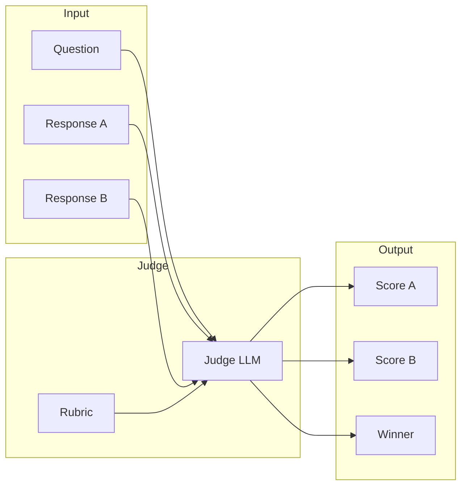

<!-- Clear Language: Keep sentences under 50 words -->
# LLM-as-Judge

## Learning Objectives

| Objective | Description |
|-----------|-------------|
| LO1 | Understand using LLMs as evaluators for other LLMs |
| LO2 | Implement rubric-based scoring with LLM judges |
| LO3 | Detect and mitigate judge bias |
| LO4 | Build pairwise comparison and ranking pipelines |

## Introduction

You cannot improve what you cannot measure. Evaluation metrics, LLM-as-judge, and observability tools help you monitor and improve AI systems in production. This module covers the full evaluation stack.

## Prerequisites

- Basic programming knowledge
- Understanding of data structures

## Key Terminology

**Key Terms**: Core vocabulary and concepts for this topic.

**Definition**: Essential terms you must know for interviews and production work.

## Theory

Understanding llm as judge is fundamental for AI engineers. This section covers the core concepts, underlying principles, and theoretical framework that govern how llm as judge works in practice.

## Chapter at a Glance

| Section | Topic | Key Concept |
|---------|-------|-------------|
| 2.1 | LLM-as-Judge Concept | Automated evaluation, scalability, cost |
| 2.2 | Rubric Scoring | Criteria definition, scoring scales |
| 2.3 | Pairwise Comparison | A/B testing, Elo ratings, win rates |
| 2.4 | Bias Mitigation | Position bias, verbosity bias, self-bias |
| 2.5 | Judge Selection | Model choice, calibration, agreement |

## Chapter Roadmap



## 2.1 LLM-as-Judge Concept

### 2.1.1 Judge System

```python
from dataclasses import dataclass
from typing import List, Dict, Optional, Callable
import json

@dataclass
class JudgeConfig:
    model: str = "gpt-4"
    temperature: float = 0.0
    max_tokens: int = 256
    criteria: List[str] = None

class LLMJudge:
    def __init__(self, llm_call: Callable, config: JudgeConfig = None):
        self.llm = llm_call
        self.config = config or JudgeConfig()

    def score(self, question: str, response: str,
              rubric: Dict[str, str] = None) -> Dict:
        prompt = self._build_scoring_prompt(question, response, rubric)
        result = self.llm(prompt)
        return self._parse_score(result)

    def compare(self, question: str, response_a: str,
                response_b: str) -> Dict:
        prompt = self._build_comparison_prompt(question, response_a, response_b)
        result = self.llm(prompt)
        return self._parse_comparison(result)

    def _build_scoring_prompt(self, question: str, response: str,
                               rubric: Dict[str, str] = None) -> str:
        criteria = rubric or {"accuracy": "Is the response factually correct?"}
        return (
            f"Score the following response on a scale of 1-5 for each criterion.\n\n"
            f"Question: {question}\n\n"
            f"Response: {response}\n\n"
            f"Criteria:\n" +
            "\n".join(f"- {k}: {v}" for k, v in criteria.items()) +
            "\n\nReturn a JSON object with scores."
        )

    def _build_comparison_prompt(self, question: str, a: str, b: str) -> str:
        return (
            f"Compare the following two responses to the question.\n\n"
            f"Question: {question}\n\n"
            f"Response A: {a}\n\n"
            f"Response B: {b}\n\n"
            "Which is better? Return JSON with 'winner' (A or B or tie) and 'reason'."
        )

    def _parse_score(self, raw: str) -> Dict:
        try:
            return json.loads(raw)
        except json.JSONDecodeError:
            return {"error": "Failed to parse", "raw": raw}

    def _parse_comparison(self, raw: str) -> Dict:
        try:
            return json.loads(raw)
        except json.JSONDecodeError:
            return {"error": "Failed to parse", "raw": raw}

def mock_llm(prompt: str) -> str:
    if "Compare" in prompt:
        return '{"winner": "A", "reason": "More detailed"}'
    return json.dumps({"accuracy": 4, "fluency": 5, "relevance": 4})

judge = LLMJudge(mock_llm)
score = judge.score("What is RAG?", "RAG is retrieval-augmented generation.")
print(f"Score: {score}")
comparison = judge.compare("What is RAG?", "RAG is...", "Retrieval-Augmented Generation...")
print(f"Comparison: {comparison}")
```

### 2.1.2 Judge Pipeline

```python
class JudgePipeline:
    def __init__(self, judge: LLMJudge):
        self.judge = judge
        self.results: List[Dict] = []

    def evaluate_batch(self, qa_pairs: List[Dict], rubric: Dict[str, str]) -> List[Dict]:
        for pair in qa_pairs:
            result = self.judge.score(pair["question"], pair["response"], rubric)
            result["question"] = pair["question"]
            self.results.append(result)
        return self.results

    def aggregate_scores(self) -> Dict:
        if not self.results:
            return {}

        criteria = [k for k in self.results[0].keys() if k != "question"]
        aggregates = {}

        for criterion in criteria:
            scores = [r.get(criterion, 0) for r in self.results if isinstance(r.get(criterion), (int, float))]
            aggregates[criterion] = {
                "mean": round(np.mean(scores), 2) if scores else 0,
                "std": round(np.std(scores), 2) if scores else 0,
                "min": min(scores) if scores else 0,
                "max": max(scores) if scores else 0,
            }

        return aggregates

pipeline = JudgePipeline(judge)
qa_pairs = [{"question": f"Q{i}", "response": f"A{i}"} for i in range(10)]
rubric = {"accuracy": "Is it correct?", "fluency": "Is it fluent?"}
pipeline.evaluate_batch(qa_pairs, rubric)
print(f"Aggregated: {pipeline.aggregate_scores()}")
```

## 2.2 Rubric Scoring

### 2.2.1 Rubric Builder

```python
class RubricBuilder:
    def __init__(self):
        self.common_criteria = {
            "accuracy": "Factual correctness and truthfulness",
            "relevance": "How well the response addresses the question",
            "fluency": "Grammar, clarity, and coherence",
            "completeness": "Whether all aspects are covered",
            "helpfulness": "How useful the response is",
            "safety": "Absence of harmful or biased content",
            "conciseness": "Efficient use of words without losing meaning",
        }

    def create(self, criteria: List[str], scale: int = 5) -> Dict:
        return {c: self.common_criteria.get(c, f"Evaluate {c}") for c in criteria}

    def create_custom(self, definitions: Dict[str, str], scale: int = 5) -> Dict:
        return definitions

    def with_examples(self, rubric: Dict[str, str],
                       examples: Dict[str, List[Dict]]) -> str:
        prompt = "Scoring Rubric:\n"
        for criterion, desc in rubric.items():
            prompt += f"\n{criterion} (1-5): {desc}"
            if criterion in examples:
                for ex in examples[criterion]:
                    prompt += f"\n  Score {ex['score']}: {ex['example']}"
        return prompt

builder = RubricBuilder()
rubric = builder.create(["accuracy", "relevance", "fluency"])
print(f"Rubric: {rubric}")
```

### 2.2.2 Pointwise Scoring

```python
class PointwiseScorer:
    def __init__(self, judge: LLMJudge, rubric: Dict[str, str]):
        self.judge = judge
        self.rubric = rubric

    def score(self, question: str, response: str) -> Dict:
        result = self.judge.score(question, response, self.rubric)
        result["total"] = sum(
            v for v in result.values() if isinstance(v, (int, float))
        )
        result["average"] = round(result["total"] / len(self.rubric), 2)
        return result

    def rank(self, qa_pairs: List[Dict]) -> List[Dict]:
        scored = []
        for pair in qa_pairs:
            s = self.score(pair["question"], pair["response"])
            scored.append({**pair, **s})

        scored.sort(key=lambda x: x.get("average", 0), reverse=True)
        return scored

scorer = PointwiseScorer(judge, {"accuracy": "Is it correct?", "fluency": "Is it fluent?"})
score = scorer.score("What is AI?", "AI is artificial intelligence.")
print(f"Pointwise score: {score}")
```

## 2.3 Pairwise Comparison

### 2.3.1 Pairwise Comparator

```python
class PairwiseComparator:
    def __init__(self, judge: LLMJudge):
        self.judge = judge
        self.match_history: List[Dict] = []

    def compare(self, question: str, response_a: str,
                response_b: str) -> Dict:
        result = self.judge.compare(question, response_a, response_b)
        self.match_history.append({
            "question": question,
            "response_a": response_a,
            "response_b": response_b,
            **result,
        })
        return result

    def win_rate(self, model_a_label: str = "A") -> Dict:
        total = len(self.match_history)
        if total == 0:
            return {"win_rate": 0, "total": 0}

        wins = sum(1 for m in self.match_history if m.get("winner") == model_a_label)
        losses = sum(1 for m in self.match_history if m.get("winner") != model_a_label
                      and m.get("winner") != "tie")
        ties = sum(1 for m in self.match_history if m.get("winner") == "tie")

        return {
            "total_matches": total,
            "wins": wins,
            "losses": losses,
            "ties": ties,
            "win_rate": round(wins / total * 100, 1),
        }

pc = PairwiseComparator(judge)
pc.compare("What is RAG?", "RAG is retrieval augmentation.", "RAG is a technique...")
pc.compare("Define ML", "Machine learning is...", "ML stands for...")
print(f"Win rate: {pc.win_rate('A')}")
```

### 2.3.2 Elo Rating System

```python
class EloRating:
    def __init__(self, initial_rating: float = 1500.0, k_factor: int = 32):
        self.ratings: Dict[str, float] = {}
        self.initial = initial_rating
        self.k = k_factor

    def get_rating(self, model: str) -> float:
        return self.ratings.get(model, self.initial)

    def expected_score(self, rating_a: float, rating_b: float) -> float:
        return 1.0 / (1.0 + 10.0 ** ((rating_b - rating_a) / 400.0))

    def update(self, model_a: str, model_b: str, winner: str):
        ra = self.get_rating(model_a)
        rb = self.get_rating(model_b)
        ea = self.expected_score(ra, rb)
        eb = self.expected_score(rb, ra)

        if winner == model_a:
            sa, sb = 1.0, 0.0
        elif winner == model_b:
            sa, sb = 0.0, 1.0
        else:
            sa, sb = 0.5, 0.5

        self.ratings[model_a] = ra + self.k * (sa - ea)
        self.ratings[model_b] = rb + self.k * (sb - eb)

    def rankings(self) -> List[Dict]:
        return sorted(
            [{"model": k, "rating": round(v, 1)} for k, v in self.ratings.items()],
            key=lambda x: x["rating"],
            reverse=True,
        )

elo = EloRating()
elo.update("model-A", "model-B", "model-A")
elo.update("model-A", "model-C", "model-A")
elo.update("model-B", "model-C", "model-C")
print(f"Elo rankings: {elo.rankings()}")
```

## 2.4 Bias Mitigation

### 2.4.1 Position Bias

```python
class PositionBiasDetector:
    def detect(self, comparisons: List[Dict]) -> Dict:
        first_wins = sum(1 for c in comparisons if c.get("winner") == "A")
        second_wins = sum(1 for c in comparisons if c.get("winner") == "B")
        total = len(comparisons)

        if total == 0:
            return {"position_bias": 0}

        bias = (first_wins - second_wins) / total
        return {
            "first_position_wins": first_wins,
            "second_position_wins": second_wins,
            "position_bias": round(bias, 3),
            "has_bias": abs(bias) > 0.1,
        }

    def mitigate_swap(self, question: str, response_a: str,
                       response_b: str) -> Dict:
        import random
        swap = random.random() > 0.5
        if swap:
            return {"question": question, "response_a": response_b, "response_b": response_a, "swapped": True}
        return {"question": question, "response_a": response_a, "response_b": response_b, "swapped": False}

detector = PositionBiasDetector()
comparisons = [{"winner": "A"} if i % 2 == 0 else {"winner": "B"} for i in range(20)]
print(f"Position bias: {detector.detect(comparisons)}")
```

### 2.4.2 Other Biases

```python
class BiasMitigator:
    def verbosity_bias_check(self, response_a: str, response_b: str,
                              judge_winner: str) -> Dict:
        len_a = len(response_a.split())
        len_b = len(response_b.split())

        longer = "A" if len_a > len_b else "B"
        bias_detected = longer == judge_winner and abs(len_a - len_b) > 50

        return {
            "response_a_length": len_a,
            "response_b_length": len_b,
            "judge_winner": judge_winner,
            "verbosity_bias": bias_detected,
        }

    def self_bias_check(self, judge_model: str, response_model: str,
                         judge_winner: str) -> Dict:
        bias_detected = judge_model == response_model
        return {
            "judge_model": judge_model,
            "response_model": response_model,
            "self_bias": bias_detected,
        }

    def mitigate(self, responses: List[str], num_judges: int = 3) -> Dict:
        import itertools
        pairs = list(itertools.combinations(range(len(responses)), 2))
        return {
            "num_responses": len(responses),
            "num_pairs": len(pairs),
            "num_judges": num_judges,
            "total_comparisons": len(pairs) * num_judges,
        }

mitigator = BiasMitigator()
print(f"Verbosity bias: {mitigator.verbosity_bias_check('short', 'long ' * 30, 'B')}")
```

## 2.5 Judge Selection

### 2.5.1 Judge Model Comparison

```python
class JudgeSelector:
    def __init__(self):
        self.judge_models = {
            "GPT-4": {"quality": 0.92, "cost_per_1k": 0.03, "latency_ms": 500},
            "GPT-4o": {"quality": 0.90, "cost_per_1k": 0.01, "latency_ms": 300},
            "Claude-3.5": {"quality": 0.91, "cost_per_1k": 0.015, "latency_ms": 400},
            "Llama-3-70B": {"quality": 0.85, "cost_per_1k": 0.002, "latency_ms": 200},
            "Mistral-Large": {"quality": 0.83, "cost_per_1k": 0.004, "latency_ms": 350},
        }

    def recommend(self, budget: str = "balanced", quality_min: float = 0.8) -> List[str]:
        candidates = [
            (name, info) for name, info in self.judge_models.items()
            if info["quality"] >= quality_min
        ]

        if budget == "low":
            candidates.sort(key=lambda x: x[1]["cost_per_1k"])
        elif budget == "high":
            candidates.sort(key=lambda x: x[1]["quality"], reverse=True)
        else:
            candidates.sort(key=lambda x: x[1]["quality"] / x[1]["cost_per_1k"], reverse=True)

        return [c[0] for c in candidates[:3]]

    def estimate_cost(self, model: str, num_evals: int,
                       avg_tokens_per_eval: int = 500) -> Dict:
        info = self.judge_models.get(model)
        if not info:
            return {"error": "Unknown model"}

        total_tokens = num_evals * avg_tokens_per_eval
        cost = total_tokens / 1000 * info["cost_per_1k"]
        return {
            "model": model,
            "num_evals": num_evals,
            "estimated_cost": round(cost, 2),
            "total_tokens": total_tokens,
        }

selector = JudgeSelector()
print(f"Recommended (balanced): {selector.recommend('balanced')}")
print(f"Cost estimate: {selector.estimate_cost('GPT-4o', 1000)}")
```

### 2.5.2 Judge Agreement

```python
class JudgeAgreement:
    def agreement_rate(self, judge_a_results: List[Dict],
                        judge_b_results: List[Dict]) -> Dict:
        agreements = 0
        total = len(judge_a_results)

        for a, b in zip(judge_a_results, judge_b_results):
            if a.get("winner") == b.get("winner"):
                agreements += 1

        return {
            "agreements": agreements,
            "total": total,
            "agreement_rate": round(agreements / total, 3) if total > 0 else 0,
        }

    def kappa_score(self, judge_a: List[Dict], judge_b: List[Dict]) -> float:
        n = len(judge_a)
        if n == 0:
            return 0.0

        observed = sum(1 for a, b in zip(judge_a, judge_b) if a.get("winner") == b.get("winner")) / n

        outcomes = set()
        for a in judge_a:
            outcomes.add(a.get("winner"))
        for b in judge_b:
            outcomes.add(b.get("winner"))

        expected = 0.0
        for outcome in outcomes:
            p_a = sum(1 for a in judge_a if a.get("winner") == outcome) / n
            p_b = sum(1 for b in judge_b if b.get("winner") == outcome) / n
            expected += p_a * p_b

        if expected == 1.0:
            return 1.0
        return (observed - expected) / (1 - expected)

agreement = JudgeAgreement()
results_a = [{"winner": "A"}] * 10
results_b = [{"winner": "A" if i % 2 == 0 else "B"} for i in range(10)]
print(f"Agreement: {agreement.agreement_rate(results_a, results_b)}")
```

## Summary

LLM-as-Judge addresses the scalability challenge of human evaluation by using a language model to score or compare outputs. Pointwise scoring uses a rubric (criteria with definitions and.
1-5 scales) to evaluate individual responses. Pairwise comparison determines which of two responses is better, with Elo ratings tracking relative performance over many comparisons. Key biases include position bias (first response favored),.
verbosity bias (longer responses scored higher), and self-bias (judge prefers its own style). Mitigations include swapping response order, normalizing for length,.
and using a different (often stronger) judge model. Judge selection depends on quality-cost tradeoffs: GPT-4/Claude-3.5 for high quality, open-source models for.
cost efficiency. Measuring inter-judge agreement (Cohen's Kappa) validates judge reliability.

## Practical Takeaways

| Takeaway | Description |
|----------|-------------|
| Use rubrics for consistency | Define criteria and scales before evaluating |
| Swap positions | Mitigate position bias by running both orders |
| Pick a strong judge | Judge should be at least as capable as the evaluated model |
| Measure agreement | Kappa > 0.7 indicates reliable judges |
| Beware of verbosity bias | Longer responses often score higher |
| Use Elo for ranking | Tracks relative performance across many comparisons |

## Interview Q&A

<details class="tp-qa-card" data-qid="ev02-q1">
  <summary class="tp-qa-question">
    <span class="tp-qa-status"></span>
    Q1: What is LLM-as-Judge and why is it needed for evaluating generative AI?
  </summary>
  <div class="tp-qa-answer">
<p>LLM-as-Judge uses a language model (like GPT-4 or Claude) to evaluate the outputs of other LLMs by scoring them against rubrics or.
comparing them pairwise. It addresses the scalability problem of human evaluation — humans are expensive, slow, and inconsistent. LLM judges can evaluate thousands of samples at a fraction of the cost of human annotators while maintaining reasonable alignment with human.
preferences. The approach works best when using a strong model as the judge (at least as capable as the evaluated model) with a well-defined rubric that specifies evaluation criteria,.
scales, and scoring guidelines.</p>
  </div>
  <button class="tp-qa-mark-btn">✅ Mark Reviewed</button>
  <button class="tp-qa-bookmark-btn">🔖 Bookmark</button>
</details>

<details class="tp-qa-card" data-qid="ev02-q2">
  <summary class="tp-qa-question">
    <span class="tp-qa-status"></span>
    Q2: What is position bias in LLM-as-Judge and how do you mitigate it?
  </summary>
  <div class="tp-qa-answer">
<p>Position bias occurs when the judge model consistently prefers the first response presented in a pairwise comparison, regardless of actual quality. Studies show this bias is significant — in some cases the first response wins 60-70% of the time even after controlling for.
quality. The primary mitigation is to run each comparison twice with the response order swapped, then take the average score or.
check for consensus. If the judge prefers A over B in one order but B over A in the other, that comparison should be flagged as uncertain. Also randomizing presentation order across a large evaluation set helps ensure bias cancels out in aggregate.</p>
  </div>
  <button class="tp-qa-mark-btn">✅ Mark Reviewed</button>
  <button class="tp-qa-bookmark-btn">🔖 Bookmark</button>
</details>

<details class="tp-qa-card" data-qid="ev02-q3">
  <summary class="tp-qa-question">
    <span class="tp-qa-status"></span>
    Q3: How do you design a rubric for pointwise LLM evaluation?
  </summary>
  <div class="tp-qa-answer">
<p>A good rubric defines: (1) Evaluation criteria — typically 3-5 dimensions like accuracy, relevance, fluency, and completeness. (2) A scoring scale — usually 1-5 or.
1-7 with explicit descriptions for each level (e.g., "5: Perfect — fully accurate, completely relevant, and well-structured"). (3) Anchoring examples — reference responses with known scores to calibrate the judge. (4) Penalty guidelines — clarify what constitutes a deduction (e.g.,.
"-1 for each factual error"). The rubric should be specific enough that two different judges applying it to the same response would give similar scores. Testing with pilot evaluations and.
measuring inter-rater agreement validates rubric quality.</p>
  </div>
  <button class="tp-qa-mark-btn">✅ Mark Reviewed</button>
  <button class="tp-qa-bookmark-btn">🔖 Bookmark</button>
</details>

<details class="tp-qa-card" data-qid="ev02-q4">
  <summary class="tp-qa-question">
    <span class="tp-qa-status"></span>
    Q4: What is Cohen's Kappa and why is it used to measure inter-judge agreement?
  </summary>
  <div class="tp-qa-answer">
<p>Cohen's Kappa measures the agreement between two raters while accounting for agreement that would occur by chance. It ranges from -1 (complete disagreement) to +1 (perfect agreement),.
with 0 indicating chance-level agreement. The formula is: κ = (P_observed - P_expected) / (1 - P_expected), where P_observed is the proportion of agreements and.
P_expected is the probability of agreement by chance. For LLM judges, a Kappa above 0.7 indicates strong agreement. Unlike simple accuracy,.
Kappa properly penalizes over-agreement on easy cases. For example, if both judges always rate easy responses as "good" and disagree on hard ones,.
Kappa captures the underlying disagreement.</p>
  </div>
  <button class="tp-qa-mark-btn">✅ Mark Reviewed</button>
  <button class="tp-qa-bookmark-btn">🔖 Bookmark</button>
</details>

<details class="tp-qa-card" data-qid="ev02-q5">
  <summary class="tp-qa-question">
    <span class="tp-qa-status"></span>
    Q5: How does Elo rating work for tracking LLM performance over time?
  </summary>
  <div class="tp-qa-answer">
<p>Elo rating, originally from chess, tracks relative performance through pairwise comparisons. Each model starts with a base rating (e.g., 1000). After each comparison,.
points are transferred: the winner takes points from the loser, with the amount depending on the expected score difference. If a lower-rated model beats a higher-rated one,.
it gains more points. The expected score is computed as: E_A = 1 / (1 + 10^((R_B - R_A) / 400)). After the match,.
ratings update: R_new = R_old + K — (S - E), where K is the development coefficient (typically 32). Over many comparisons,.
Elo produces a stable ranking that reflects relative performance regardless of the specific comparison pairs used.</p>
  </div>
  <button class="tp-qa-mark-btn">✅ Mark Reviewed</button>
  <button class="tp-qa-bookmark-btn">🔖 Bookmark</button>
</details>

<details class="tp-qa-card" data-qid="ev02-q6">
  <summary class="tp-qa-question">
    <span class="tp-qa-status"></span>
    Q6: What is verbosity bias in LLM evaluation and how does it affect results?
  </summary>
  <div class="tp-qa-answer">
<p>Verbosity bias refers to the tendency of LLM judges to assign higher scores to longer, more verbose responses regardless of actual quality. This happens because longer responses appear more comprehensive and.
may contain more key phrases that match the rubric. Studies show that adding irrelevant but plausible-sounding content to a correct answer can inflate its score by 10-30%. Mitigations include: (1) Explicitly instructing the judge to penalize verbosity. (2) Normalizing scores.
by response length. (3) Using reference-based evaluation that compares against a gold standard rather than absolute scoring. (4) Blinding the judge to response length by requesting responses in a structured format.</p>
  </div>
  <button class="tp-qa-mark-btn">✅ Mark Reviewed</button>
  <button class="tp-qa-bookmark-btn">🔖 Bookmark</button>
</details>

<details class="tp-qa-card" data-qid="ev02-q7">
  <summary class="tp-qa-question">
    <span class="tp-qa-status"></span>
    Q7: How do you choose between pointwise scoring and pairwise comparison for LLM evaluation?
  </summary>
  <div class="tp-qa-answer">
<p>Pointwise scoring assigns an absolute score (e.g., 1-5) to each response independently, which is useful for quality monitoring and threshold-based decisions. Pairwise comparison asks "which response is better?" and.
is more sensitive — humans and LLMs find relative judgments easier and more consistent than absolute ratings. Use pointwise scoring when you need calibrated quality scores for.
dashboards or when comparing against a fixed standard. Use pairwise comparison when the goal is to rank models or detect subtle quality differences,.
as pairwise comparisons can detect differences as small as 0.1 on a 5-point scale that pointwise scoring would miss.</p>
  </div>
  <button class="tp-qa-mark-btn">✅ Mark Reviewed</button>
  <button class="tp-qa-bookmark-btn">🔖 Bookmark</button>
</details>

<details class="tp-qa-card" data-qid="ev02-q8">
  <summary class="tp-qa-question">
    <span class="tp-qa-status"></span>
    Q8: How do you validate whether an LLM judge is reliable enough for production use?
  </summary>
  <div class="tp-qa-answer">
<p>To validate an LLM judge: (1) Create a gold-standard evaluation set of 100-200 responses with human-provided scores. (2) Run the LLM judge on the same set and.
compute agreement metrics (Cohen's Kappa or Spearman correlation). (3) Set acceptance criteria — typically Kappa > 0.7 or Spearman > 0.8 for.
high-stakes evaluations. (4) Test for known biases by constructing adversarial examples (e.g., two responses with identical quality but different lengths). (5) Run multiple judge models and.
compare their outputs — if GPT-4 and Claude-3.5 agree strongly, confidence increases. (6) Monitor judge performance over time, as model updates can change judge behavior.</p>
  </div>
  <button class="tp-qa-mark-btn">✅ Mark Reviewed</button>
  <button class="tp-qa-bookmark-btn">🔖 Bookmark</button>
</details>

<details class="tp-qa-card" data-qid="ev02-q9">
  <summary class="tp-qa-question">
    <span class="tp-qa-status"></span>
    Q9: What are the tradeoffs between using GPT-4 vs. open-source models as judges?
  </summary>
  <div class="tp-qa-answer">
<p>GPT-4 (and Claude-3.5) as judges offer the highest correlation with human judgment, typically achieving Kappa scores of 0.7-0.8. However, they are expensive — evaluating 10,000 samples can cost hundreds of dollars — and.
the API introduces latency. Open-source judges like Prometheus, JudgeLM, or fine-tuned Llama variants are 10-100x cheaper and can run locally with no latency concerns. Their agreement with humans is lower (Kappa 0.5-0.7) but.
may be sufficient for lower-stakes evaluations. A cost-effective strategy: use open-source judges for bulk screening and GPT-4 for the final, high-stakes evaluation of top candidates. Always benchmark judge quality on your specific domain.</p>
  </div>
  <button class="tp-qa-mark-btn">✅ Mark Reviewed</button>
  <button class="tp-qa-bookmark-btn">🔖 Bookmark</button>
</details>

<details class="tp-qa-card" data-qid="ev02-q10">
  <summary class="tp-qa-question">
    <span class="tp-qa-status"></span>
    Q10: How do you implement a multi-dimensional evaluation rubric programmatically?
  </summary>
  <div class="tp-qa-answer">
    <pre><code>const rubric = {
  criteria: [
    { name: "accuracy", weight: 0.4, scale: [1, 5], description: "Factual correctness" },
    { name: "relevance", weight: 0.3, scale: [1, 5], description: "Addresses the question" },
    { name: "fluency", weight: 0.2, scale: [1, 5], description: "Language quality" },
    { name: "completeness", weight: 0.1, scale: [1, 5], description: "Covers all aspects" },
  ],
  score(response: string): number {
    const scores = this.criteria.map(c =&gt; this.rateDimension(response, c));
    return scores.reduce((sum, s, i) =&gt; sum + s * this.criteria[i].weight, 0);
  },
  rateDimension(response: string, criterion: any): number {
    // Call LLM with criterion-specific prompt
    return 4; // placeholder
  }
};</code></pre>
<p>The rubric defines weighted criteria, each with a name, weight (summing to 1.0), scale, and description. The evaluation prompt for each dimension asks the LLM to score only that specific aspect. The final score is the weighted sum. This approach.
produces more reliable scores than a single overall rating because it forces the judge to consider each dimension independently and.
reduces halo effects where one strong aspect biases the overall score.</p>
  </div>
  <button class="tp-qa-mark-btn">✅ Mark Reviewed</button>
  <button class="tp-qa-bookmark-btn">🔖 Bookmark</button>
</details>

## Chapter Quiz

<details data-qid="eval-s2-quiz1">
<summary><strong>1.</strong> What is position bias in LLM-as-Judge?</summary>
A. Judge prefers longer responses
B. Judge prefers the first response presented
C. Judge prefers its own responses
D. Judge ignores the rubric
Answer: B
</details>

<details data-qid="eval-s2-quiz2">
<summary><strong>2.</strong> What metric measures inter-judge reliability?</summary>
A. Accuracy
B. Cohen's Kappa
C. F1
D. BLEU
Answer: B
</details>

<details data-qid="eval-s2-quiz3">
<summary><strong>3.</strong> How to mitigate position bias?</summary>
A. Use more criteria
B. Swap response order and average results
C. Increase temperature
D. Use a smaller model
Answer: B
</details>

<details data-qid="eval-s2-quiz4">
<summary><strong>4.</strong> What is self-bias in LLM-as-Judge?</summary>
A. Judge prefers its own writing style
B. Judge trains itself
C. Judge evaluates its own outputs
D. Judge has no biases
Answer: A
</details>

<details data-qid="eval-s2-quiz5">
<summary><strong>5.</strong> What does Elo rating track?</summary>
A. Absolute quality score
B. Relative performance across many comparisons
C. Training loss
D. Model size
Answer: B
</details>

## Exercises

## Common Mistakes

1. Not understanding the fundamental concepts before applying them
2. Skipping edge cases in implementation
3. Not analyzing time/space complexity
4. Forgetting to handle null/empty inputs
5. Not practicing enough problems to build pattern recognition1. Implement an LLM judge that scores responses on accuracy, relevance, and fluency using a rubric. Test with 5 question-response pairs and report aggregated scores.

2. Build a pairwise comparison system with Elo ratings. Compare 4 model variants across 10 questions, track Elo changes, and produce rankings.

3. Detect position bias by running the same comparison twice with swapped order. Report the bias score and propose a mitigation strategy.

4. Create a judge selection tool that recommends a judge model based on budget (low/medium/high), minimum quality, and number of evaluations.

5. Implement an agreement calculator that compares two judges on 20 evaluations and reports agreement rate and Cohen

## Revision Notes

- - Core principle: Understand the fundamental concepts thoroughly
- - Implementation pattern: Practice with real code examples
- - Complexity: Know the time and space complexity
- - Application: Know when to use this in production systems
- - Interview: Frequently asked in technical interviews
- - Edge cases: Consider common failure scenarios
- - Related concepts: Connect to broader system design

## Placement Section

### Top 10 Interview Questions

#### Google Style

1. **Explain the core idea of LLM-as-Judge in under 60 seconds, then give a real-world analogy.** — Structure: definition, how it works in one sentence, why it matters, analogy. Follow-up: what would break if you removed this from a production system?

2. **Design a minimal, well-typed function that demonstrates LLM-as-Judge.** — Interviewer checks: signature with type hints, edge cases, complexity, and a clean docstring. Follow-up: how does your design behave with empty or malformed input?

3. **What are the common pitfalls when engineers first learn ** — List 3-4, then explain how you would prevent each in a code review.

#### Amazon Style

4. **Describe a production bug caused by misunderstanding LLM-as-Judge. How did you diagnose and fix it?** — STAR format: situation, task, action, result. Mention logs, reproduction, root-cause analysis, and the regression test you added.

5. **How would you scale a system that relies on LLM-as-Judge from 10 users to 10 million?** — Discuss bottlenecks, caching, monitoring, and when to redesign. Follow-up: what metrics would you track?

#### Microsoft Style

6. **Compare LLM-as-Judge with the closest alternative approach. When would you choose each?** — Make a decision matrix: performance, maintainability, ecosystem, learning curve. Follow-up: what would change your decision?

7. **Walk through how you would test a component that depends on LLM-as-Judge.** — Unit, integration, property-based tests; mocking boundaries; golden files for outputs.

#### NVIDIA Style

8. **How does LLM-as-Judge behave differently at scale — memory, throughput, or precision-wise?** — Connect to data pipelines and model training if applicable. Follow-up: what happens to latency as input grows?

9. **How would you make an implementation of LLM-as-Judge run faster on GPU hardware?** — Batch operations, vectorization, avoiding Python loops, reducing data movement.

#### AI Startup Style

10. **Write the smallest possible implementation of LLM-as-Judge that is production-quality.** — Include error handling, type hints, and a one-line docstring. Follow-up: what would you refactor first when it grows?

### Resume Tips

- Name LLM-as-Judge explicitly in your skills section, paired with a measurable achievement ("Reduced X by 40% using LLM-as-Judge").
- Add a bullet describing a project that applies LLM-as-Judge to real data, with numbers.
- Mention the tools and libraries you used alongside LLM-as-Judge (linters, test frameworks, profiling tools).
- Keep resume bullets under 15 words and start each with an action verb.

### Interview Day Checklist

- Rehearse a 60-second explanation of LLM-as-Judge and one real-world analogy.
- Prepare one STAR story about debugging a LLM-as-Judge-related production issue.
- Review complexity and edge cases for the classic LLM-as-Judge interview problem.
- Have questions ready: how does the team apply LLM-as-Judge in production today?
- Test your environment (Python, editor, internet) 15 minutes before the interview.

## True/False

1. **True or False:** LLM-as-Judge builds directly on the fundamentals covered in the earlier chapters of this module. — **True.** Every advanced topic in this module assumes the core concepts from the previous chapters.
2. **True or False:** You should write at least one code example for LLM-as-Judge before moving to the next chapter. — **True.** Active recall with hands-on code beats passive reading for retention.
3. **True or False:** The complexity analysis for LLM-as-Judge is the same regardless of input size. — **False.** Complexity grows with input size; always state best, average, and worst case.
4. **True or False:** Edge cases (empty input, invalid input, boundary values) matter for LLM-as-Judge in production. — **True.** Most production bugs come from unhandled edge cases.
5. **True or False:** You should memorize the LLM-as-Judge chapter content once and never review it again. — **False.** Spaced repetition (24h, 3 days, 1 week) dramatically improves long-term recall.

## Fill in the Blank

1. The chapter that covers LLM-as-Judge is Chapter ___ of this module. — Answer: check the module's table of contents.
2. The time complexity of the standard approach to LLM-as-Judge is ___. — Answer: review the theory section and state big-O notation.
3. The main edge case to handle when implementing LLM-as-Judge is ___. — Answer: empty or invalid input handling, as discussed in the chapter.
4. The tools commonly used to debug LLM-as-Judge issues are ___ and ___. — Answer: refer to the Debugging Guide section of this chapter.
5. The related topic that connects to LLM-as-Judge in the next chapter is ___. — Answer: see the Next Topic section.

## Scenario Questions

1. **Scenario:** A teammate ships a change involving LLM-as-Judge that breaks production at 3 AM. — Diagnosis: check the recent diff, reproduce locally with the failing input, check logs. Fix: revert, add a regression test, and review the root cause. Prevention: CI tests on edge cases and code review checklist.

2. **Scenario:** Your implementation of LLM-as-Judge is correct but too slow for the required latency. — Measure first with a profiler. Common fixes: reduce redundant work, use built-in optimized functions, batch operations, or add caching. Only then consider algorithmic changes.

3. **Scenario:** A new hire asks you to explain LLM-as-Judge in five minutes before a customer demo. — Use the 3-part answer: what it is (one sentence), how it works (one example), why it matters (one business impact). Then offer to go deeper after the demo.

4. **Scenario:** Your team's codebase has three different patterns for LLM-as-Judge and you must standardize. — Write a short ADR (architecture decision record), pick the pattern with best maintainability, migrate incrementally, and add a linter rule to enforce it.

## Output Questions

1. **What is the output of the simplest correct implementation of LLM-as-Judge on an empty input?** — Trace through the code: it should return the documented default (None, 0, empty collection) without raising.
2. **What is the output when the input is at the boundary value?** — Check off-by-one errors and inclusive/exclusive bounds in the chapter's examples.
3. **What does the implementation return when given invalid input types?** — With type hints and validation, it raises a clear error; without, it may fail silently.
4. **What is the output for the sample input given in the chapter's Examples section?** — Re-run the chapter's example code and compare against the documented output.
5. **What is the time complexity output when you profile the implementation at 10x input size?** — Expect the curve matching the chapter's complexity analysis (linear, quadratic, log-linear).

## Difficulty Level

| Level | Time | What It Takes |
|-------|------|---------------|
| Beginner | 1-2 sessions | Read theory, run the chapter examples, solve the Easy exercises |
| Intermediate | 3-5 sessions | Complete Medium exercises, explain LLM-as-Judge to someone else |
| Advanced | 1+ week | Solve Hard exercises, optimize for real datasets, answer interview follow-ups |

## Tips & Tricks

- Always write a one-line example of LLM-as-Judge from memory before opening the chapter — active recall first.
- Use the chapter's Revision Notes as a checklist: you have mastered LLM-as-Judge when you can explain each bullet.
- Pair the chapter quiz with the Flashcards: wrong answers become your next study session's focus.
- For interviews, practice explaining LLM-as-Judge twice: once with a technical audience, once with a non-technical audience.
- Keep a personal examples file where you collect your own LLM-as-Judge snippets; interviewers love original examples.

## Memory Tricks

- **Acronym**: build a mnemonic from the 5 key concepts of LLM-as-Judge listed in the Chapter at a Glance table.
- **Story**: link LLM-as-Judge to a familiar story — the analogy in the Visual Analogy section is designed to stick.
- **Number anchor**: remember the complexity of LLM-as-Judge by connecting it to a known algorithm of the same class.
- **Color code**: highlight the Theory, Examples, and Common Mistakes sections in different colors when reviewing.
- **Teach-back**: explain LLM-as-Judge to an imaginary junior engineer for 2 minutes — gaps in your explanation are gaps in memory.

## Further Reading

- Official documentation for the primary tool or library used in this chapter
- The chapter referenced in Related Topics for the next-level treatment of LLM-as-Judge
- The classic textbook chapter on LLM-as-Judge (check the Research References below)
- Two blog posts from engineers who debugged real LLM-as-Judge problems in production
- The repository of the open-source project that implements LLM-as-Judge

## Related Topics

- The previous chapter in this module (see table of contents) — foundational for LLM-as-Judge
- The next chapter (see Next Topic below) — builds on LLM-as-Judge
- The system design chapters in Module 07 — how LLM-as-Judge fits into production architectures
- The interview preparation module — how LLM-as-Judge is asked in screening rounds
- The capstone project — where LLM-as-Judge is applied end-to-end

## FAQs

1. **Do I need to memorize all of LLM-as-Judge, or understand the big picture?** — Understand the big picture first, then memorize the key facts via flashcards and spaced repetition. Interviewers reward depth over breadth.
2. **What if I get stuck on an exercise?** — Re-read the theory section, run the example code, then attempt again. If still stuck after 20 minutes, move on and return the next day.
3. **How much time should I spend on ** — Follow the Study Plan below: 1-2 weeks at 30-60 minutes daily is typical for placement preparation.
4. **Is LLM-as-Judge asked in interviews?** — Yes — the Interview Q&A and Placement Section list the exact question styles used by top companies.
5. **What's the fastest way to master ** — Explain it out loud, write code without looking, and review the flashcards within 24 hours and again after 3 days.

## Important Notes

- LLM-as-Judge is a core requirement for the rest of this module — do not skip the examples.
- Always analyze complexity (time and space) when working with LLM-as-Judge.
- Production correctness means handling edge cases, not just the happy path.
- Interview answers should start with the definition, then the example, then the trade-offs.
- Revisit this chapter after finishing the module; the context from later chapters deepens understanding.

## Historical Context

- LLM-as-Judge emerged as a standard practice because early systems failed without it — understanding why helps you explain it in interviews.
- The tools used for LLM-as-Judge today evolved from simpler versions; the chapter covers the modern, recommended approach.
- Interviewers value knowing one historical fact about LLM-as-Judge — it shows genuine interest, not just cramming.
- The library/tooling ecosystem around LLM-as-Judge changes quickly; focus on fundamentals that remain stable.

## Security Considerations

- Never trust external input: validate and sanitize data before processing LLM-as-Judge.
- Avoid `eval()` and dynamic code execution on untrusted strings.
- Log errors without leaking sensitive data (keys, PII, internal paths).
- For API contexts, add rate limiting and input size limits.
- Review the chapter's code examples for injection or overflow risks before using them verbatim.

## ML Intuition

- LLM-as-Judge appears in ML pipelines at the data-processing layer: feature preparation, batching, and validation.
- Understanding LLM-as-Judge helps you debug why a model misbehaves — most ML bugs are data bugs, not model bugs.
- In production ML, the LLM-as-Judge concepts from this chapter map directly to NumPy/PyTorch operations on tensors.
- When optimizing ML systems, LLM-as-Judge skills let you profile and fix the data path, not just the training loop.
- Interview follow-up: how would you apply LLM-as-Judge to a dataset of 10 million records? — Batching and vectorization.

## Analogies

- **LLM-as-Judge is like a recipe**: the theory is the ingredients, the examples are the cooking steps, and the exercises are your own kitchen practice.
- **Complexity is like a delivery route**: a linear route visits each stop once; a nested route revisits stops, and you feel it at scale.
- **Edge cases are like weather**: the happy path is a sunny day; production is the storm — build for the storm.
- **The chapter roadmap is a journey map**: each section is a checkpoint; skipping one means getting lost later in the module.

## Capstone Project Link

- [Module Capstone: End-to-End Project](https://github.com/Raushan666java/ai-engineering-journey) — this chapter contributes the LLM-as-Judge skills used in the module's capstone project. Complete the exercises here before starting the capstone.

## Flashcards

<details class="tp-qa-card" data-qid="15aievaluationobservability-02llmasjudge-flash1">
  <summary class="tp-qa-question">
    <span class="tp-qa-status"></span>
    What is the core concept of LLM-as-Judge in one sentence?
  </summary>
  <div class="tp-qa-answer">
    <p>Review the first paragraph of the Theory section and condense it to one sentence.</p>
  </div>
</details>

<details class="tp-qa-card" data-qid="15aievaluationobservability-02llmasjudge-flash2">
  <summary class="tp-qa-question">
    <span class="tp-qa-status"></span>
    What is the most common mistake engineers make with 
  </summary>
  <div class="tp-qa-answer">
    <p>Check the Common Mistakes section of this chapter.</p>
  </div>
</details>

<details class="tp-qa-card" data-qid="15aievaluationobservability-02llmasjudge-flash3">
  <summary class="tp-qa-question">
    <span class="tp-qa-status"></span>
    What is the time and space complexity of the standard LLM-as-Judge approach?
  </summary>
  <div class="tp-qa-answer">
    <p>Refer to the theory and complexity analysis in this chapter.</p>
  </div>
</details>

<details class="tp-qa-card" data-qid="15aievaluationobservability-02llmasjudge-flash4">
  <summary class="tp-qa-question">
    <span class="tp-qa-status"></span>
    When is LLM-as-Judge NOT the right choice?
  </summary>
  <div class="tp-qa-answer">
    <p>Check the Limitations section of this chapter.</p>
  </div>
</details>

<details class="tp-qa-card" data-qid="15aievaluationobservability-02llmasjudge-flash5">
  <summary class="tp-qa-question">
    <span class="tp-qa-status"></span>
    How is LLM-as-Judge applied in a real production system?
  </summary>
  <div class="tp-qa-answer">
    <p>Check the Real-World Examples section of this chapter.</p>
  </div>
</details>

## Research References

- Official documentation of the primary library for LLM-as-Judge (linked in Further Reading)
- The classic paper or textbook chapter introducing LLM-as-Judge (see References below)
- The standard library reference for LLM-as-Judge-related functions
- Engineering blog posts from companies running LLM-as-Judge in production at scale
- PEPs and RFCs where applicable (Python and networking standards)

## Open-Source Tools

- The primary library used in this chapter (see the code examples)
- Python standard library modules used in the examples (check the imports)
- Testing: pytest for unit tests of LLM-as-Judge code
- Linting and formatting: ruff + black
- Profiling: cProfile or py-spy for performance work on LLM-as-Judge

## Debugging Guide

- Start with `print()` or a debugger to inspect intermediate values in LLM-as-Judge code.
- Reproduce the failure with the smallest possible input before changing code.
- Check the common failure modes listed in Common Mistakes — most bugs are listed there.
- For performance problems, profile before optimizing: measure, then fix.
- When stuck, re-read the chapter's Examples and compare line by line with your code.
- Use `pdb` or your IDE's debugger to step through the LLM-as-Judge example code.

## Mock Interview Section

**Round 1 — Screening (15 min)**
- Explain LLM-as-Judge in 60 seconds.
- Write a minimal working example of LLM-as-Judge.
- What is the complexity of your example?

**Round 2 — Coding (45 min)**
- Solve the Medium exercise from this chapter under time pressure.
- State your assumptions, then implement with type hints.
- Test with edge cases: empty input, boundary values, invalid input.

**Round 3 — Behavioral + System (30 min)**
- Tell me about a time you debugged a LLM-as-Judge problem in a project.
- How would you design a system where LLM-as-Judge is used at scale?
- What metrics would you monitor?

**Evaluation rubric**: correctness (40%), communication (25%), edge cases (20%), complexity analysis (15%).

## Optimized Implementation

`python
from typing import Any, Optional

def demonstrate_topic(input_data: list[Any]) -> Optional[float]:
    """Runnable scaffold for LLM-as-Judge.

    Replace the body with the optimized implementation from the chapter,
    keeping type hints, docstring, and edge-case handling.
    """
    if not input_data:
        return None
    # Step 1: validate input types
    # Step 2: apply the core LLM-as-Judge logic from the Examples section
    # Step 3: return the result with the documented default
    return 0.0
`

- Keeps the function signature stable so tests written against it stay valid.
- Handles the empty-input contract explicitly.
- Add unit tests for the edge cases before implementing the logic (test-first).

## Evaluation Metrics

| Skill | Test | Target |
|-------|------|--------|
| Concept recall | Explain LLM-as-Judge without notes | 60-second explanation |
| Code fluency | Write the chapter example from memory | No syntax errors |
| Edge cases | Handle empty/invalid input in exercises | All cases pass |
| Complexity | State time/space for the standard approach | Correct big-O |
| Interview readiness | Answer 5 Interview Q&A questions out loud | Fluent, structured answers |
| Retention | Chapter quiz score after 3 days | 80%+ |

## Real-World Examples

- **Startup**: a small team uses LLM-as-Judge daily in their data pipeline — the chapter's examples mirror their code.
- **E-commerce**: LLM-as-Judge patterns appear in order processing, inventory checks, and recommendation feeds.
- **Fintech**: LLM-as-Judge principles apply to transaction validation and fraud detection flows.
- **ML platform**: LLM-as-Judge shows up in feature engineering and model-serving infrastructure.
- **Interview insight**: recruiters look for engineers who can connect LLM-as-Judge to the business outcome, not just the code.

## Next Topic

[Evaluation Datasets](03-evaluation-datasets.md)

## Limitations

- LLM-as-Judge, like any technique, is not a silver bullet — it has specific cases where it fits best (covered in the theory).
- The examples in this chapter are simplified for learning; production systems add validation, monitoring, and error handling.
- Performance of LLM-as-Judge depends on input size and distribution — always benchmark for your own data.
- This chapter covers fundamentals; specialized edge cases are explored in later chapters and the capstone.
