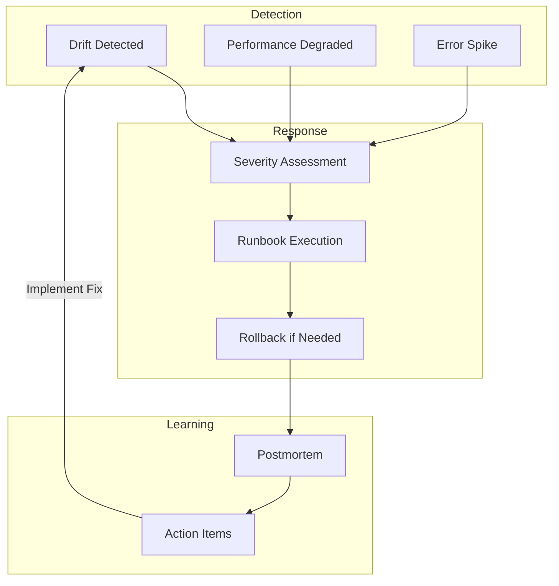

<!-- Clear Language: Keep sentences under 50 words -->
# Alerting & Incident Response

## Learning Objectives

| Objective | Description |
|-----------|-------------|
| LO1 | Design alerting rules for production AI systems |
| LO2 | Implement drift, performance, and error alerts |
| LO3 | Build incident response runbooks |
| LO4 | Establish rollback procedures and postmortem culture |

## Introduction

You cannot improve what you cannot measure. Evaluation metrics, LLM-as-judge, and observability tools help you monitor and improve AI systems in production. This module covers the full evaluation stack.

## Prerequisites

- Basic programming knowledge
- Understanding of data structures

## Key Terminology

**Key Terms**: Core vocabulary and concepts for this topic.

**Definition**: Essential terms you must know for interviews and production work.

## Theory

Understanding alerting and incident response is fundamental for AI engineers. This section covers the core concepts, underlying principles, and theoretical framework that govern how alerting and incident response works in practice.

## Chapter at a Glance

| Section | Topic | Key Concept |
|---------|-------|-------------|
| 6.1 | Alerting Strategy | Thresholds, severity levels, notification |
| 6.2 | Drift Alerts | Data drift, model drift, concept drift |
| 6.3 | Performance Alerts | Latency, throughput, error rate |
| 6.4 | Incident Response | Severity classification, runbooks |
| 6.5 | Rollback | Model rollback, data rollback, version revert |
| 6.6 | Postmortem | Blameless culture, action items |

## Chapter Roadmap



## 6.1 Alerting Strategy

### 6.1.1 Alert Manager

```python
from dataclasses import dataclass
from typing import List, Dict, Optional, Callable
import time
import json
from enum import Enum

class Severity(Enum):
    CRITICAL = "critical"
    HIGH = "high"
    MEDIUM = "medium"
    LOW = "low"
    INFO = "info"

@dataclass
class AlertConfig:
    name: str
    metric: str
    condition: str  # >, <, >=, <=, ==
    threshold: float
    severity: Severity = Severity.MEDIUM
    window_seconds: int = 60
    cooldown_seconds: int = 300
    channels: List[str] = None

class AlertManager:
    def __init__(self):
        self.rules: List[AlertConfig] = []
        self.alert_history: List[Dict] = []
        self.last_alert_time: Dict[str, float] = {}

    def add_rule(self, rule: AlertConfig):
        self.rules.append(rule)

    def evaluate(self, metric_values: Dict[str, float]) -> List[Dict]:
        fired = []

        for rule in self.rules:
            value = metric_values.get(rule.metric)
            if value is None:
                continue

            triggered = self._check_condition(value, rule.condition, rule.threshold)
            if not triggered:
                continue

            last_time = self.last_alert_time.get(rule.name, 0)
            if time.time() - last_time < rule.cooldown_seconds:
                continue

            alert = {
                "name": rule.name,
                "metric": rule.metric,
                "value": value,
                "threshold": rule.threshold,
                "severity": rule.severity.value,
                "timestamp": time.time(),
            }

            self.alert_history.append(alert)
            self.last_alert_time[rule.name] = time.time()
            fired.append(alert)

        return fired

    def _check_condition(self, value: float, condition: str,
                          threshold: float) -> bool:
        if condition == ">":
            return value > threshold
        elif condition == "<":
            return value < threshold
        elif condition == ">=":
            return value >= threshold
        elif condition == "<=":
            return value <= threshold
        elif condition == "==":
            return value == threshold
        return False

    def get_history(self, severity: str = None, limit: int = 10) -> List[Dict]:
        alerts = self.alert_history
        if severity:
            alerts = [a for a in alerts if a["severity"] == severity]
        return alerts[-limit:]

    def summary(self) -> Dict:
        counts = {}
        for alert in self.alert_history:
            sev = alert["severity"]
            counts[sev] = counts.get(sev, 0) + 1
        return {
            "total_alerts": len(self.alert_history),
            "by_severity": counts,
            "active_rules": len(self.rules),
        }

am = AlertManager()
am.add_rule(AlertConfig("High P95 Latency", "p95_latency", ">", 2000, Severity.HIGH, 60, 300))
am.add_rule(AlertConfig("Error Rate", "error_rate", ">", 0.05, Severity.CRITICAL, 60, 120))
fired = am.evaluate({"p95_latency": 2500, "error_rate": 0.08})
print(f"Fired alerts: {[a['name'] for a in fired]}")
```

### 6.1.2 Notification Channels

```python
class NotificationChannel:
    def __init__(self, name: str):
        self.name = name
        self.message_count = 0

    def send(self, alert: Dict) -> bool:
        self.message_count += 1
        print(f"[{self.name}] {alert['severity']}: {alert['name']} = {alert['value']}")
        return True

class NotificationManager:
    def __init__(self):
        self.channels: Dict[str, NotificationChannel] = {}

    def add_channel(self, channel: NotificationChannel):
        self.channels[channel.name] = channel

    def notify(self, alert: Dict, channels: List[str] = None):
        targets = channels or list(self.channels.keys())
        for name in targets:
            if name in self.channels:
                self.channels[name].send(alert)

    def notify_severity(self, alert: Dict):
        severity_channels = {
            "critical": ["pagerduty", "slack", "email"],
            "high": ["slack", "email"],
            "medium": ["slack"],
            "low": ["email"],
            "info": [],
        }
        channels = severity_channels.get(alert["severity"], [])
        self.notify(alert, channels)

nm = NotificationManager()
nm.add_channel(NotificationChannel("slack"))
nm.add_channel(NotificationChannel("email"))
alert = {"name": "High Error Rate", "severity": "critical", "value": 0.12}
nm.notify_severity(alert)
```

## 6.2 Drift Alerts

### 6.2.1 Data Drift Detector

```python
class DataDriftDetector:
    def __init__(self, reference_distribution: Dict[str, Dict]):
        self.reference = reference_distribution

    def detect(self, current_data: List[Dict]) -> Dict:
        if not current_data:
            return {"drift_detected": False, "message": "No data"}

        drift_results = {}

        for feature, ref_stats in self.reference.items():
            current_values = [d.get(feature) for d in current_data if d.get(feature) is not None]
            if not current_values:
                continue

            current_mean = np.mean(current_values)
            ref_mean = ref_stats.get("mean", 0)
            ref_std = ref_stats.get("std", 1)

            ps_value = abs(current_mean - ref_mean) / max(ref_std, 0.001)

            drift_results[feature] = {
                "ref_mean": round(ref_mean, 2),
                "current_mean": round(current_mean, 2),
                "ps_value": round(ps_value, 3),
                "drifted": ps_value > 0.5,
            }

        drifted_features = [f for f, r in drift_results.items() if r["drifted"]]
        return {
            "drift_detected": len(drifted_features) > 0,
            "drifted_features": drifted_features,
            "feature_results": drift_results,
        }

ref = {"input_length": {"mean": 150, "std": 50}, "sentiment": {"mean": 0.5, "std": 0.3}}
detector = DataDriftDetector(ref)
current = [{"input_length": 300, "sentiment": 0.8} for _ in range(20)]
print(f"Drift detected: {detector.detect(current)}")
```

### 6.2.2 Model Drift Detection

```python
class ModelDriftDetector:
    def __init__(self, baseline_accuracy: float):
        self.baseline = baseline_accuracy
        self.accuracy_history: List[float] = []

    def update(self, accuracy: float):
        self.accuracy_history.append(accuracy)

    def detect_drift(self, window: int = 10, threshold: float = 0.05) -> Dict:
        if len(self.accuracy_history) < window:
            return {"drift_detected": False, "message": f"Need {window} samples, have {len(self.accuracy_history)}"}

        recent = self.accuracy_history[-window:]
        recent_avg = np.mean(recent)
        drift = self.baseline - recent_avg

        return {
            "drift_detected": drift > threshold,
            "baseline_accuracy": round(self.baseline, 3),
            "recent_avg_accuracy": round(recent_avg, 3),
            "drift": round(drift, 3),
            "threshold": threshold,
            "alert": drift > threshold,
        }

mdd = ModelDriftDetector(baseline_accuracy=0.92)
for _ in range(15):
    mdd.update(np.random.normal(0.90, 0.03))
print(f"Model drift: {mdd.detect_drift(window=10)}")
```

## 6.3 Performance Alerts

### 6.3.1 Performance Thresholds

```python
class PerformanceThresholds:
    def __init__(self):
        self.thresholds = {
            "p95_latency_ms": {"warning": 1000, "critical": 3000},
            "error_rate": {"warning": 0.01, "critical": 0.05},
            "throughput_rps": {"warning": 50, "critical": 10},
            "cost_per_request": {"warning": 0.01, "critical": 0.05},
        }

    def check(self, metrics: Dict[str, float]) -> List[Dict]:
        alerts = []
        for metric, value in metrics.items():
            if metric not in self.thresholds:
                continue
            limits = self.thresholds[metric]
            if value >= limits["critical"]:
                alerts.append({"metric": metric, "value": value, "severity": "critical", "limit": limits["critical"]})
            elif value >= limits["warning"]:
                alerts.append({"metric": metric, "value": value, "severity": "warning", "limit": limits["warning"]})
        return alerts

    def update_threshold(self, metric: str, level: str, value: float):
        if metric in self.thresholds and level in ("warning", "critical"):
            self.thresholds[metric][level] = value

pt = PerformanceThresholds()
alerts = pt.check({"p95_latency_ms": 2500, "error_rate": 0.03})
print(f"Performance alerts: {alerts}")
```

### 6.3.2 Error Rate Monitoring

```python
class ErrorRateMonitor:
    def __init__(self, window: int = 100):
        self.window = window
        self.results: List[bool] = []

    def record(self, success: bool):
        self.results.append(success)
        if len(self.results) > self.window * 10:
            self.results = self.results[-self.window:]

    def error_rate(self) -> float:
        if not self.results:
            return 0.0
        recent = self.results[-self.window:]
        return sum(1 for r in recent if not r) / len(recent)

    def is_degraded(self, threshold: float = 0.05) -> Dict:
        rate = self.error_rate()
        return {
            "error_rate": round(rate, 4),
            "sample_size": min(len(self.results), self.window),
            "degraded": rate > threshold,
        }

    def error_categories(self, errors: List[Dict]) -> Dict:
        from collections import Counter
        categories = Counter(e.get("type", "unknown") for e in errors)
        return {
            "total": len(errors),
            "categories": dict(categories),
            "primary": categories.most_common(1)[0][0] if categories else "",
        }

erm = ErrorRateMonitor()
for _ in range(200):
    erm.record(np.random.random() > 0.03)
print(f"Error rate: {erm.is_degraded(0.05)}")
```

## 6.4 Incident Response

### 6.4.1 Incident Manager

```python
@dataclass
class Incident:
    id: str
    title: str
    severity: Severity
    description: str
    detected_at: float
    acknowledged_at: Optional[float] = None
    resolved_at: Optional[float] = None
    assigned_to: Optional[str] = None
    runbook: Optional[str] = None

class IncidentManager:
    def __init__(self):
        self.incidents: List[Incident] = []
        self.runbooks: Dict[str, List[str]] = {}
        self.oncall: List[str] = []

    def create_incident(self, title: str, severity: Severity,
                         description: str, runbook: str = None) -> str:
        inc = Incident(
            id=f"INC-{len(self.incidents) + 1:04d}",
            title=title,
            severity=severity,
            description=description,
            detected_at=time.time(),
            runbook=runbook,
        )
        self.incidents.append(inc)
        self._assign(inc)
        return inc.id

    def _assign(self, incident: Incident):
        if self.oncall:
            incident.assigned_to = self.oncall[0]
            self.oncall = self.oncall[1:] + [self.oncall[0]]

    def acknowledge(self, incident_id: str, responder: str):
        for inc in self.incidents:
            if inc.id == incident_id:
                inc.acknowledged_at = time.time()
                inc.assigned_to = responder
                break

    def resolve(self, incident_id: str):
        for inc in self.incidents:
            if inc.id == incident_id:
                inc.resolved_at = time.time()
                break

    def register_runbook(self, name: str, steps: List[str]):
        self.runbooks[name] = steps

    def get_runbook(self, name: str) -> List[str]:
        return self.runbooks.get(name, ["No runbook defined"])

    def open_incidents(self) -> List[Incident]:
        return [i for i in self.incidents if i.resolved_at is None]

    def stats(self) -> Dict:
        total = len(self.incidents)
        open_inc = len(self.open_incidents())
        return {
            "total_incidents": total,
            "open": open_inc,
            "resolved": total - open_inc,
        }

im = IncidentManager()
im.register_runbook("high_latency", [
    "1. Check P95 latency dashboard",
    "2. Identify slowest component from traces",
    "3. Check if model version recently changed",
    "4. Rollback if regression from new deployment",
    "5. Scale up if traffic surge",
])
inc_id = im.create_incident("P95 latency spike", Severity.HIGH, "P95 went from 500ms to 3s", "high_latency")
print(f"Incident: {inc_id}")
print(f"Runbook: {im.get_runbook('high_latency')}")
```

### 6.4.2 Severity Classification

```python
class SeverityClassifier:
    def classify(self, impact: str, urgency: str,
                 affected_users_pct: float) -> Severity:
        if impact == "outage" or affected_users_pct > 0.5:
            return Severity.CRITICAL
        elif urgency == "high" or affected_users_pct > 0.2:
            return Severity.HIGH
        elif impact == "partial" or affected_users_pct > 0.05:
            return Severity.MEDIUM
        else:
            return Severity.LOW

    def response_time(self, severity: Severity) -> int:
        times = {
            Severity.CRITICAL: 5,
            Severity.HIGH: 15,
            Severity.MEDIUM: 60,
            Severity.LOW: 240,
            Severity.INFO: 1440,
        }
        return times.get(severity, 60)

    def description(self, severity: Severity) -> str:
        descs = {
            Severity.CRITICAL: "Complete outage or data loss. Immediate response.",
            Severity.HIGH: "Major feature degradation. Respond within 15 min.",
            Severity.MEDIUM: "Partial impact. Respond within 1 hour.",
            Severity.LOW: "Minor issue. Respond within 4 hours.",
            Severity.INFO: "Informational. No response needed.",
        }
        return descs.get(severity, "Unknown")

sc = SeverityClassifier()
sev = sc.classify("outage", "high", 0.8)
print(f"Severity: {sev.value}, Response: {sc.response_time(sev)} min")
```

## 6.5 Rollback

### 6.5.1 Rollback Manager

```python
class RollbackManager:
    def __init__(self):
        self.deployments: List[Dict] = []
        self.current_version: Optional[str] = None
        self.rollback_history: List[Dict] = []

    def record_deployment(self, version: str, model_uri: str,
                           config: Dict = None):
        self.deployments.append({
            "version": version,
            "model_uri": model_uri,
            "config": config or {},
            "deployed_at": time.time(),
            "rollback_count": 0,
        })
        self.current_version = version

    def rollback(self, target_version: str = None) -> Dict:
        if len(self.deployments) < 2 and not target_version:
            return {"success": False, "error": "No previous version to rollback to"}

        if target_version:
            target = next((d for d in self.deployments if d["version"] == target_version), None)
            if not target:
                return {"success": False, "error": f"Version {target_version} not found"}
        else:
            target = self.deployments[-2]

        rollback = {
            "from_version": self.current_version,
            "to_version": target["version"],
            "model_uri": target["model_uri"],
            "rolled_back_at": time.time(),
            "reason": "",
        }

        self.rollback_history.append(rollback)
        self.current_version = target["version"]
        target["rollback_count"] = target.get("rollback_count", 0) + 1

        return {
            "success": True,
            "rollback": rollback,
            "current_version": self.current_version,
        }

    def rollback_stats(self) -> Dict:
        return {
            "current_version": self.current_version,
            "total_deployments": len(self.deployments),
            "total_rollbacks": len(self.rollback_history),
            "last_rollback": self.rollback_history[-1] if self.rollback_history else None,
        }

rbm = RollbackManager()
rbm.record_deployment("v1.0", "models/v1/")
rbm.record_deployment("v2.0", "models/v2/")
result = rbm.rollback()
print(f"Rollback: {result['success']} to {result['current_version']}")
```

### 6.5.2 Canary Rollback

```python
class CanaryRollback:
    def __init__(self):
        self.canary_pct = 5
        self.healthy = True

    def deploy_canary(self, new_version: str, traffic_pct: int = 5):
        self.canary_pct = traffic_pct
        print(f"Deploying {new_version} to {traffic_pct}% of traffic")

    def monitor_canary(self, error_rate: float, latency_p95: float,
                        thresholds: Dict) -> bool:
        healthy = True

        if error_rate > thresholds.get("error_rate", 0.05):
            healthy = False
        if latency_p95 > thresholds.get("latency_p95", 2000):
            healthy = False

        self.healthy = healthy
        return healthy

    def rollback_canary(self, new_version: str) -> Dict:
        if not self.healthy:
            return {
                "action": "rollback",
                "version": new_version,
                "reason": "Canary health checks failed",
                "rolled_back": True,
            }
        return {
            "action": "promote",
            "version": new_version,
            "reason": "Canary healthy",
            "rolled_back": False,
        }

canary = CanaryRollback()
canary.deploy_canary("v2.1", 5)
healthy = canary.monitor_canary(0.08, 2500, {"error_rate": 0.03, "latency_p95": 2000})
print(f"Canary healthy: {healthy}")
print(f"Action: {canary.rollback_canary('v2.1')}")
```

## 6.6 Postmortem

### 6.6.1 Postmortem Template

```python
class Postmortem:
    def __init__(self, incident_id: str, title: str):
        self.incident_id = incident_id
        self.title = title
        self.date = time.time()
        self.summary = ""
        self.timeline: List[Dict] = []
        self.root_cause = ""
        self.impact = ""
        self.action_items: List[Dict] = []
        self.lessons: List[str] = []

    def add_timeline_event(self, time_str: str, event: str):
        self.timeline.append({"time": time_str, "event": event})

    def add_action_item(self, description: str, owner: str,
                         priority: str = "medium", due_date: str = ""):
        self.action_items.append({
            "description": description,
            "owner": owner,
            "priority": priority,
            "due_date": due_date,
            "status": "open",
        })

    def generate(self) -> Dict:
        return {
            "incident_id": self.incident_id,
            "title": self.title,
            "date": self.date,
            "summary": self.summary,
            "timeline": self.timeline,
            "root_cause": self.root_cause,
            "impact": self.impact,
            "action_items": self.action_items,
            "lessons": self.lessons,
            "completed": all(a["status"] == "closed" for a in self.action_items),
        }

pm = Postmortem("INC-0001", "P95 latency spike on 2024-01-15")
pm.summary = "P95 latency increased from 500ms to 3s due to model version rollout"
pm.add_timeline_event("14:00", "Deployed v2.1 model")
pm.add_timeline_event("14:05", "P95 latency alert fired")
pm.add_timeline_event("14:06", "Incident created")
pm.add_timeline_event("14:10", "Rollback initiated")
pm.add_timeline_event("14:12", "Latency returned to baseline")
pm.root_cause = "v2.1 model had an extra attention layer causing 6x compute"
pm.add_action_item("Add pre-deployment latency benchmark", "ML team", "high")
print(f"Postmortem generated: {len(pm.action_items)} action items")
```

### 6.6.2 Action Item Tracker

```python
class ActionItemTracker:
    def __init__(self):
        self.items: List[Dict] = []

    def add(self, item: Dict):
        self.items.append(item)

    def close(self, description: str):
        for item in self.items:
            if item["description"] == description:
                item["status"] = "closed"
                item["closed_at"] = time.time()

    def open_items(self) -> List[Dict]:
        return [i for i in self.items if i.get("status") == "open"]

    def completion_rate(self) -> float:
        if not self.items:
            return 1.0
        closed = sum(1 for i in self.items if i.get("status") == "closed")
        return closed / len(self.items)

    def report(self) -> Dict:
        return {
            "total": len(self.items),
            "open": len(self.open_items()),
            "closed": len(self.items) - len(self.open_items()),
            "completion_rate": round(self.completion_rate() * 100, 1),
        }

ait = ActionItemTracker()
ait.add({"description": "Add pre-deployment benchmarking", "priority": "high", "status": "open"})
ait.add({"description": "Update monitoring thresholds", "priority": "medium", "status": "open"})
ait.close("Update monitoring thresholds")
print(f"Action item report: {ait.report()}")
```

## Summary

Alerting and incident response for AI systems requires a structured approach: define alert rules with appropriate severity (critical/high/medium/low) and cooldown periods to prevent alert fatigue. Drift alerts detect data distribution shifts (PSI > 0.5),.
model accuracy degradation (drop > 5%), and concept drift. Performance alerts trigger on P95 latency, error rate, throughput, and cost thresholds. Incident response follows severity-based runbooks with clear escalation paths. Rollback procedures include canary deployments (start with 5% traffic) and.
automated rollback when health checks fail. Postmortems create a blameless culture focused on learning — documenting timelines, root causes, action items with owners,.
and tracking completion rates.

## Practical Takeaways

| Takeaway | Description |
|----------|-------------|
| Set cooldown on alerts | Prevents notification storms from repeated violations |
| Use canary deployments | Test changes on 5% traffic before full rollout |
| Automate rollback | Health check failure should trigger immediate rollback |
| Document runbooks | Every alert type needs a clear response procedure |
| Blameless postmortems | Focus on systems, not people |
| Track action items | Completion rate indicates organizational learning |

## Interview Q&A

<details class="tp-qa-card" data-qid="ev06-q1">
  <summary class="tp-qa-question">
    <span class="tp-qa-status"></span>
    Q1: How do you design effective alert rules for an AI system without causing alert fatigue?
  </summary>
  <div class="tp-qa-answer">
<p>Effective alert rules follow the "keep signals high, noise low" principle. Key practices: (1) Use cooldown periods — after an alert fires,.
wait at least 5 minutes before firing again for the same condition. (2) Require sustained violation — alert only when the condition persists for.
N consecutive evaluation windows (e.g., P95 > 2s for 5 minutes). (3) Set appropriate severity levels — critical for user-facing issues (error.
rate > 5%), high for degradation (latency > 1s for 10 min), medium for warnings (cost spike), low for informational. (4) Use relative thresholds — "latency is 3— higher than the same time yesterday" is more robust than absolute thresholds. (5) Regularly review and.
tune alert rules based on false positive rates; retire rules with >90% false positive rate.</p>
  </div>
  <button class="tp-qa-mark-btn">✅ Mark Reviewed</button>
  <button class="tp-qa-bookmark-btn">🔖 Bookmark</button>
</details>

<details class="tp-qa-card" data-qid="ev06-q2">
  <summary class="tp-qa-question">
    <span class="tp-qa-status"></span>
    Q2: What is a canary deployment and how does it reduce deployment risk for AI models?
  </summary>
  <div class="tp-qa-answer">
<p>A canary deployment rolls out a new model version to a small percentage of traffic (typically 5-10%) before full deployment. For.
AI models, this is critical because offline metrics often don't predict online behavior — a model with better offline F1 might produce worse user experience due to latency,.
verbosity, or unexpected outputs. The canary runs for a validation period (hours to days) during which metrics (latency, error rate, user engagement,.
quality scores) are compared between the canary and the baseline. If metrics are stable or better, traffic is gradually increased (25% → 50% → 100%). If metrics degrade,.
the canary is automatically rolled back. This technique catches about 60% of production issues before full rollout.</p>
  </div>
  <button class="tp-qa-mark-btn">✅ Mark Reviewed</button>
  <button class="tp-qa-bookmark-btn">🔖 Bookmark</button>
</details>

<details class="tp-qa-card" data-qid="ev06-q3">
  <summary class="tp-qa-question">
    <span class="tp-qa-status"></span>
    Q3: How do you write an effective incident response runbook for an AI system failure?
  </summary>
  <div class="tp-qa-answer">
<p>A runbook should contain: (1) Alert description — what triggered the alert and what it means. (2) Severity classification — critical (users impacted),.
high (partial degradation), medium (potential issue), low (informational). (3) Immediate mitigation steps — "Rollback to previous model version", "Increase rate limit",.
"Failover to backup provider". (4) Investigation steps — check dashboard X, review recent deployments, inspect error logs for pattern. (5) Escalation path — who to contact if initial mitigation fails,.
including names and phone numbers. (6) Post-mitigation steps — document what happened, update the runbook. Runbooks should be tested in game days — simulated incidents where the on-call engineer follows the runbook without preparation.</p>
  </div>
  <button class="tp-qa-mark-btn">✅ Mark Reviewed</button>
  <button class="tp-qa-bookmark-btn">🔖 Bookmark</button>
</details>

<details class="tp-qa-card" data-qid="ev06-q4">
  <summary class="tp-qa-question">
    <span class="tp-qa-status"></span>
    Q4: How do you implement automated rollback for a degraded AI model in production?
  </summary>
  <div class="tp-qa-answer">
<p>Automated rollback requires: (1) Health check endpoint — returns model status (healthy/unhealthy) with the last successful prediction time and current error.
rate. (2) Health check criteria — rollback if error rate > 5% sustained for 2 minutes, or latency P95 > 3s for.
3 minutes, or prediction drift > 2 standard deviations from baseline. (3) Rollback mechanism — the deployment system (Kubernetes, CI/CD pipeline) automatically reverts to the previous stable version. (4) Traffic drain — stop sending new traffic to the bad deployment and.
let in-flight requests complete. (5) Notification — alert the on-call engineer that an automatic rollback occurred with the reason and metrics. (6) Post-rollback validation — verify the rollback resolved the issue and.
the system is stable.</p>
  </div>
  <button class="tp-qa-mark-btn">✅ Mark Reviewed</button>
  <button class="tp-qa-bookmark-btn">🔖 Bookmark</button>
</details>

<details class="tp-qa-card" data-qid="ev06-q5">
  <summary class="tp-qa-question">
    <span class="tp-qa-status"></span>
    Q5: How do you detect data drift in production AI systems?
  </summary>
  <div class="tp-qa-answer">
<p>Data drift detection monitors the distribution of incoming features and predictions. Methods: (1) Population Stability Index (PSI) — measures how much a distribution has shifted;.
PSI > 0.25 indicates significant drift. (2) Kolmogorov-Smirnov test — non-parametric test comparing reference and current distributions. (3) Jensen-Shannon divergence — symmetric measure of distribution difference. (4) Feature-level monitoring — track min,.
max, mean, std for each numeric feature; frequency for categorical features. (5) Prediction drift — monitor the distribution of model predictions over time. Set up alerts when drift exceeds thresholds (e.g.,.
PSI > 0.2 for any feature). When drift is detected, trigger retraining on recent data or investigate the cause of the shift.</p>
  </div>
  <button class="tp-qa-mark-btn">✅ Mark Reviewed</button>
  <button class="tp-qa-bookmark-btn">🔖 Bookmark</button>
</details>

<details class="tp-qa-card" data-qid="ev06-q6">
  <summary class="tp-qa-question">
    <span class="tp-qa-status"></span>
    Q6: What is a blameless postmortem and how do you write one effectively?
  </summary>
  <div class="tp-qa-answer">
<p>A blameless postmortem focuses on understanding what happened and preventing recurrence, not on who caused it. Structure: (1) Incident summary — what happened,.
when, impact (users affected, downtime duration). (2) Timeline — chronologically ordered events from detection to resolution. (3) Root cause — the technical failure that triggered the incident (e.g.,.
"rate limit not configured on new endpoint"). (4) Contributing factors — conditions that made the incident worse (e.g., "alert was silenced during maintenance"). (5) Action items — specific,.
owner-assigned tasks to prevent recurrence, with deadlines. (6) Blameless culture statement — explicitly state that the goal is learning, not blame. Effective postmortems lead to systemic improvements,.
not punitive actions.</p>
  </div>
  <button class="tp-qa-mark-btn">✅ Mark Reviewed</button>
  <button class="tp-qa-bookmark-btn">🔖 Bookmark</button>
</details>

<details class="tp-qa-card" data-qid="ev06-q7">
  <summary class="tp-qa-question">
    <span class="tp-qa-status"></span>
    Q7: How do you set up a severity classification system for AI incidents?
  </summary>
  <div class="tp-qa-answer">
<p>SEV1 (Critical) — complete service outage, incorrect predictions causing financial/harm, data breach. Response: page on-call immediately, 15-minute response time. SEV2 (High) — partial degradation (P95 latency > 3s),.
elevated error rate (>5%), feature unavailable for subset of users. Response: page on-call, 30-minute response. SEV3 (Medium) — non-critical bugs, cosmetic issues,.
single-user problems. Response: next business day ticket. SEV4 (Low) — minor issues, feature requests. Response: backlog. Each severity level has defined: response time,.
communication channels (SEV1 gets company-wide Slack alert, SEV4 gets a Jira ticket), and escalation paths. Regular incident reviews ensure severity classifications are applied consistently.</p>
  </div>
  <button class="tp-qa-mark-btn">✅ Mark Reviewed</button>
  <button class="tp-qa-bookmark-btn">🔖 Bookmark</button>
</details>

<details class="tp-qa-card" data-qid="ev06-q8">
  <summary class="tp-qa-question">
    <span class="tp-qa-status"></span>
    Q8: How do you handle concept drift specifically in LLM-based applications?
  </summary>
  <div class="tp-qa-answer">
<p>Concept drift in LLM apps occurs when the relationship between input queries and expected outputs changes. Detection approaches: (1) User behavior.
drift — monitor changes in query patterns, conversation lengths, and topic distributions. (2) LLM provider drift — models get updated without notice,.
changing output style and quality. (3) Knowledge drift — the underlying facts change (e.g., a company policy update that makes old answers incorrect). (4) Evaluation score drift — LLM-as-Judge scores trending downward over time. Mitigations: (1) Continuous evaluation — run.
daily evaluation on production samples against golden dataset. (2) Feedback loop analysis — track user satisfaction trends. (3) Scheduled model comparisons — periodically compare current vs. previous model versions. (4) Knowledge base refresh — keep RAG knowledge bases up to.
date.</p>
  </div>
  <button class="tp-qa-mark-btn">✅ Mark Reviewed</button>
  <button class="tp-qa-bookmark-btn">🔖 Bookmark</button>
</details>

<details class="tp-qa-card" data-qid="ev06-q9">
  <summary class="tp-qa-question">
    <span class="tp-qa-status"></span>
    Q9: How do you implement a notification strategy that avoids pager fatigue?
  </summary>
  <div class="tp-qa-answer">
<p>Pager fatigue prevention: (1) Severity-based routing — critical alerts page the on-call engineer, high alerts go to Slack, medium/low become Jira tickets. (2) Alert deduplication — if multiple alerts fire for.
the same root cause (e.g., "LLM API error" plus "latency spike"), group them into one notification. (3) On-call schedules — rotating shifts with clear handoff procedures. (4) Escalation policies — primary on-call gets first page,.
secondary if no response in 10 minutes, manager after 20 minutes. (5) Silent hours — suppress non-critical notifications during nights/weekends, but.
allow critical ones through. (6) Alert fatigue metrics — track notification volume per person per shift and aim for fewer than 5 pages per shift. (7) Regular review — retire alerts with >90% false positive rate.</p>
  </div>
  <button class="tp-qa-mark-btn">✅ Mark Reviewed</button>
  <button class="tp-qa-bookmark-btn">🔖 Bookmark</button>
</details>

<details class="tp-qa-card" data-qid="ev06-q10">
  <summary class="tp-qa-question">
    <span class="tp-qa-status"></span>
    Q10: How do you implement an alert rule with cooldown and sustained violation detection?
  </summary>
  <div class="tp-qa-answer">
    <pre><code>class AlertRule {
  private lastFired: number = 0;
  private consecutiveViolations: number = 0;
  constructor(private condition: () =&gt; boolean, private cooldownMs: number,
    private requiredConsecutive: number, private severity: string) {}
  evaluate(): Alert | null {
    const now = Date.now();
    if (this.condition()) {
      this.consecutiveViolations++;
      if (this.consecutiveViolations &gt;= this.requiredConsecutive
          && now - this.lastFired &gt; this.cooldownMs) {
        this.lastFired = now;
        this.consecutiveViolations = 0;
        return { severity: this.severity, firedAt: now };
      }
    } else { this.consecutiveViolations = 0; }
    return null;
  }
}</code></pre>
<p>The AlertRule class tracks consecutive violation counts and a cooldown timer. An alert fires only after the condition has been true for.
N consecutive evaluations (e.g., 3 checks at 1-minute intervals = 3 minutes of sustained violation). After firing, the cooldown prevents re-firing until the cooldown period expires. This eliminates alert storms from transient spikes while catching genuine sustained issues. The rule evaluates periodically (e.g.,.
every 60 seconds) and clears the consecutive counter when the condition is no longer met. Adjust required_consecutive based on how quickly you need to detect real issues vs. how much noise you can tolerate.</p>
  </div>
  <button class="tp-qa-mark-btn">✅ Mark Reviewed</button>
  <button class="tp-qa-bookmark-btn">🔖 Bookmark</button>
</details>

## Chapter Quiz

<details data-qid="eval-s6-quiz1">
<summary><strong>1.</strong> Why use cooldown periods on alerts?</summary>
A. To save costs
B. To prevent alert fatigue from repeated notifications
C. To reduce system load
D. To comply with regulations
Answer: B
</details>

<details data-qid="eval-s6-quiz2">
<summary><strong>2.</strong> What is a canary deployment?</summary>
A. Deploying to all users at once
B. Rolling out to a small percentage first
C. Using a different model
D. Testing in production
Answer: B
</details>

<details data-qid="eval-s6-quiz3">
<summary><strong>3.</strong> What triggers a model drift alert?</summary>
A. Increased traffic
B. Model accuracy drops below baseline by threshold amount
C. New model version
D. Cost increase
Answer: B
</details>

<details data-qid="eval-s6-quiz4">
<summary><strong>4.</strong> What is the primary goal of a postmortem?</summary>
A. Assign blame
B. Learn from incidents and prevent recurrence
C. Document errors
D. Reward the responder
Answer: B
</details>

<details data-qid="eval-s6-quiz5">
<summary><strong>5.</strong> What should happen when a canary health check fails?</summary>
A. Ignore it
B. Automatically rollback the canary
C. Promote to full deployment
D. Retry the deployment
Answer: B
</details>

## Exercises

## Common Mistakes

1. Not understanding the fundamental concepts before applying them
2. Skipping edge cases in implementation
3. Not analyzing time/space complexity
4. Forgetting to handle null/empty inputs
5. Not practicing enough problems to build pattern recognition1. Build an alert manager with 5 rules (latency, error rate, drift, throughput, cost), cooldown periods, and severity levels. Simulate metric values and report fired alerts.

2. Implement a data drift detector using PSI (population stability index). Create a reference distribution and test with current data that has shifted by 0.3, 0.5, and 1.0 standard deviations.

3. Create an incident management system with severity classification, runbook execution, and acknowledgment tracking. Simulate 3 incidents at different severities.

4. Build a rollback manager that supports version recording, rollback to N-1, canary deployment with health monitoring, and automatic rollback on threshold breach.

5. Write a postmortem generator for an incident. Include timeline, root cause, impact assessment, and 5 action items with owners and priorities. Track complet

## Revision Notes

- - Core principle: Understand the fundamental concepts thoroughly
- - Implementation pattern: Practice with real code examples
- - Complexity: Know the time and space complexity
- - Application: Know when to use this in production systems
- - Interview: Frequently asked in technical interviews
- - Edge cases: Consider common failure scenarios
- - Related concepts: Connect to broader system design

## Placement Section

### Top 10 Interview Questions

#### Google Style

1. **Explain the core idea of Alerting & Incident Response in under 60 seconds, then give a real-world analogy.** — Structure: definition, how it works in one sentence, why it matters, analogy. Follow-up: what would break if you removed this from a production system?

2. **Design a minimal, well-typed function that demonstrates Alerting & Incident Response.** — Interviewer checks: signature with type hints, edge cases, complexity, and a clean docstring. Follow-up: how does your design behave with empty or malformed input?

3. **What are the common pitfalls when engineers first learn ** — List 3-4, then explain how you would prevent each in a code review.

#### Amazon Style

4. **Describe a production bug caused by misunderstanding Alerting & Incident Response. How did you diagnose and fix it?** — STAR format: situation, task, action, result. Mention logs, reproduction, root-cause analysis, and the regression test you added.

5. **How would you scale a system that relies on Alerting & Incident Response from 10 users to 10 million?** — Discuss bottlenecks, caching, monitoring, and when to redesign. Follow-up: what metrics would you track?

#### Microsoft Style

6. **Compare Alerting & Incident Response with the closest alternative approach. When would you choose each?** — Make a decision matrix: performance, maintainability, ecosystem, learning curve. Follow-up: what would change your decision?

7. **Walk through how you would test a component that depends on Alerting & Incident Response.** — Unit, integration, property-based tests; mocking boundaries; golden files for outputs.

#### NVIDIA Style

8. **How does Alerting & Incident Response behave differently at scale — memory, throughput, or precision-wise?** — Connect to data pipelines and model training if applicable. Follow-up: what happens to latency as input grows?

9. **How would you make an implementation of Alerting & Incident Response run faster on GPU hardware?** — Batch operations, vectorization, avoiding Python loops, reducing data movement.

#### AI Startup Style

10. **Write the smallest possible implementation of Alerting & Incident Response that is production-quality.** — Include error handling, type hints, and a one-line docstring. Follow-up: what would you refactor first when it grows?

### Resume Tips

- Name Alerting & Incident Response explicitly in your skills section, paired with a measurable achievement ("Reduced X by 40% using Alerting & Incident Response").
- Add a bullet describing a project that applies Alerting & Incident Response to real data, with numbers.
- Mention the tools and libraries you used alongside Alerting & Incident Response (linters, test frameworks, profiling tools).
- Keep resume bullets under 15 words and start each with an action verb.

### Interview Day Checklist

- Rehearse a 60-second explanation of Alerting & Incident Response and one real-world analogy.
- Prepare one STAR story about debugging a Alerting & Incident Response-related production issue.
- Review complexity and edge cases for the classic Alerting & Incident Response interview problem.
- Have questions ready: how does the team apply Alerting & Incident Response in production today?
- Test your environment (Python, editor, internet) 15 minutes before the interview.

## True/False

1. **True or False:** Alerting & Incident Response builds directly on the fundamentals covered in the earlier chapters of this module. — **True.** Every advanced topic in this module assumes the core concepts from the previous chapters.
2. **True or False:** You should write at least one code example for Alerting & Incident Response before moving to the next chapter. — **True.** Active recall with hands-on code beats passive reading for retention.
3. **True or False:** The complexity analysis for Alerting & Incident Response is the same regardless of input size. — **False.** Complexity grows with input size; always state best, average, and worst case.
4. **True or False:** Edge cases (empty input, invalid input, boundary values) matter for Alerting & Incident Response in production. — **True.** Most production bugs come from unhandled edge cases.
5. **True or False:** You should memorize the Alerting & Incident Response chapter content once and never review it again. — **False.** Spaced repetition (24h, 3 days, 1 week) dramatically improves long-term recall.

## Fill in the Blank

1. The chapter that covers Alerting & Incident Response is Chapter ___ of this module. — Answer: check the module's table of contents.
2. The time complexity of the standard approach to Alerting & Incident Response is ___. — Answer: review the theory section and state big-O notation.
3. The main edge case to handle when implementing Alerting & Incident Response is ___. — Answer: empty or invalid input handling, as discussed in the chapter.
4. The tools commonly used to debug Alerting & Incident Response issues are ___ and ___. — Answer: refer to the Debugging Guide section of this chapter.
5. The related topic that connects to Alerting & Incident Response in the next chapter is ___. — Answer: see the Next Topic section.

## Scenario Questions

1. **Scenario:** A teammate ships a change involving Alerting & Incident Response that breaks production at 3 AM. — Diagnosis: check the recent diff, reproduce locally with the failing input, check logs. Fix: revert, add a regression test, and review the root cause. Prevention: CI tests on edge cases and code review checklist.

2. **Scenario:** Your implementation of Alerting & Incident Response is correct but too slow for the required latency. — Measure first with a profiler. Common fixes: reduce redundant work, use built-in optimized functions, batch operations, or add caching. Only then consider algorithmic changes.

3. **Scenario:** A new hire asks you to explain Alerting & Incident Response in five minutes before a customer demo. — Use the 3-part answer: what it is (one sentence), how it works (one example), why it matters (one business impact). Then offer to go deeper after the demo.

4. **Scenario:** Your team's codebase has three different patterns for Alerting & Incident Response and you must standardize. — Write a short ADR (architecture decision record), pick the pattern with best maintainability, migrate incrementally, and add a linter rule to enforce it.

## Output Questions

1. **What is the output of the simplest correct implementation of Alerting & Incident Response on an empty input?** — Trace through the code: it should return the documented default (None, 0, empty collection) without raising.
2. **What is the output when the input is at the boundary value?** — Check off-by-one errors and inclusive/exclusive bounds in the chapter's examples.
3. **What does the implementation return when given invalid input types?** — With type hints and validation, it raises a clear error; without, it may fail silently.
4. **What is the output for the sample input given in the chapter's Examples section?** — Re-run the chapter's example code and compare against the documented output.
5. **What is the time complexity output when you profile the implementation at 10x input size?** — Expect the curve matching the chapter's complexity analysis (linear, quadratic, log-linear).

## Difficulty Level

| Level | Time | What It Takes |
|-------|------|---------------|
| Beginner | 1-2 sessions | Read theory, run the chapter examples, solve the Easy exercises |
| Intermediate | 3-5 sessions | Complete Medium exercises, explain Alerting & Incident Response to someone else |
| Advanced | 1+ week | Solve Hard exercises, optimize for real datasets, answer interview follow-ups |

## Tips & Tricks

- Always write a one-line example of Alerting & Incident Response from memory before opening the chapter — active recall first.
- Use the chapter's Revision Notes as a checklist: you have mastered Alerting & Incident Response when you can explain each bullet.
- Pair the chapter quiz with the Flashcards: wrong answers become your next study session's focus.
- For interviews, practice explaining Alerting & Incident Response twice: once with a technical audience, once with a non-technical audience.
- Keep a personal examples file where you collect your own Alerting & Incident Response snippets; interviewers love original examples.

## Memory Tricks

- **Acronym**: build a mnemonic from the 5 key concepts of Alerting & Incident Response listed in the Chapter at a Glance table.
- **Story**: link Alerting & Incident Response to a familiar story — the analogy in the Visual Analogy section is designed to stick.
- **Number anchor**: remember the complexity of Alerting & Incident Response by connecting it to a known algorithm of the same class.
- **Color code**: highlight the Theory, Examples, and Common Mistakes sections in different colors when reviewing.
- **Teach-back**: explain Alerting & Incident Response to an imaginary junior engineer for 2 minutes — gaps in your explanation are gaps in memory.

## Further Reading

- Official documentation for the primary tool or library used in this chapter
- The chapter referenced in Related Topics for the next-level treatment of Alerting & Incident Response
- The classic textbook chapter on Alerting & Incident Response (check the Research References below)
- Two blog posts from engineers who debugged real Alerting & Incident Response problems in production
- The repository of the open-source project that implements Alerting & Incident Response

## Related Topics

- The previous chapter in this module (see table of contents) — foundational for Alerting & Incident Response
- The next chapter (see Next Topic below) — builds on Alerting & Incident Response
- The system design chapters in Module 07 — how Alerting & Incident Response fits into production architectures
- The interview preparation module — how Alerting & Incident Response is asked in screening rounds
- The capstone project — where Alerting & Incident Response is applied end-to-end

## FAQs

1. **Do I need to memorize all of Alerting & Incident Response, or understand the big picture?** — Understand the big picture first, then memorize the key facts via flashcards and spaced repetition. Interviewers reward depth over breadth.
2. **What if I get stuck on an exercise?** — Re-read the theory section, run the example code, then attempt again. If still stuck after 20 minutes, move on and return the next day.
3. **How much time should I spend on ** — Follow the Study Plan below: 1-2 weeks at 30-60 minutes daily is typical for placement preparation.
4. **Is Alerting & Incident Response asked in interviews?** — Yes — the Interview Q&A and Placement Section list the exact question styles used by top companies.
5. **What's the fastest way to master ** — Explain it out loud, write code without looking, and review the flashcards within 24 hours and again after 3 days.

## Important Notes

- Alerting & Incident Response is a core requirement for the rest of this module — do not skip the examples.
- Always analyze complexity (time and space) when working with Alerting & Incident Response.
- Production correctness means handling edge cases, not just the happy path.
- Interview answers should start with the definition, then the example, then the trade-offs.
- Revisit this chapter after finishing the module; the context from later chapters deepens understanding.

## Historical Context

- Alerting & Incident Response emerged as a standard practice because early systems failed without it — understanding why helps you explain it in interviews.
- The tools used for Alerting & Incident Response today evolved from simpler versions; the chapter covers the modern, recommended approach.
- Interviewers value knowing one historical fact about Alerting & Incident Response — it shows genuine interest, not just cramming.
- The library/tooling ecosystem around Alerting & Incident Response changes quickly; focus on fundamentals that remain stable.

## Security Considerations

- Never trust external input: validate and sanitize data before processing Alerting & Incident Response.
- Avoid `eval()` and dynamic code execution on untrusted strings.
- Log errors without leaking sensitive data (keys, PII, internal paths).
- For API contexts, add rate limiting and input size limits.
- Review the chapter's code examples for injection or overflow risks before using them verbatim.

## ML Intuition

- Alerting & Incident Response appears in ML pipelines at the data-processing layer: feature preparation, batching, and validation.
- Understanding Alerting & Incident Response helps you debug why a model misbehaves — most ML bugs are data bugs, not model bugs.
- In production ML, the Alerting & Incident Response concepts from this chapter map directly to NumPy/PyTorch operations on tensors.
- When optimizing ML systems, Alerting & Incident Response skills let you profile and fix the data path, not just the training loop.
- Interview follow-up: how would you apply Alerting & Incident Response to a dataset of 10 million records? — Batching and vectorization.

## Analogies

- **Alerting & Incident Response is like a recipe**: the theory is the ingredients, the examples are the cooking steps, and the exercises are your own kitchen practice.
- **Complexity is like a delivery route**: a linear route visits each stop once; a nested route revisits stops, and you feel it at scale.
- **Edge cases are like weather**: the happy path is a sunny day; production is the storm — build for the storm.
- **The chapter roadmap is a journey map**: each section is a checkpoint; skipping one means getting lost later in the module.

## Capstone Project Link

- [Module Capstone: End-to-End Project](https://github.com/Raushan666java/ai-engineering-journey) — this chapter contributes the Alerting & Incident Response skills used in the module's capstone project. Complete the exercises here before starting the capstone.

## Flashcards

<details class="tp-qa-card" data-qid="15aievaluationobservability-06alertingandincidentresponse-flash1">
  <summary class="tp-qa-question">
    <span class="tp-qa-status"></span>
    What is the core concept of Alerting & Incident Response in one sentence?
  </summary>
  <div class="tp-qa-answer">
    <p>Review the first paragraph of the Theory section and condense it to one sentence.</p>
  </div>
</details>

<details class="tp-qa-card" data-qid="15aievaluationobservability-06alertingandincidentresponse-flash2">
  <summary class="tp-qa-question">
    <span class="tp-qa-status"></span>
    What is the most common mistake engineers make with 
  </summary>
  <div class="tp-qa-answer">
    <p>Check the Common Mistakes section of this chapter.</p>
  </div>
</details>

<details class="tp-qa-card" data-qid="15aievaluationobservability-06alertingandincidentresponse-flash3">
  <summary class="tp-qa-question">
    <span class="tp-qa-status"></span>
    What is the time and space complexity of the standard Alerting & Incident Response approach?
  </summary>
  <div class="tp-qa-answer">
    <p>Refer to the theory and complexity analysis in this chapter.</p>
  </div>
</details>

<details class="tp-qa-card" data-qid="15aievaluationobservability-06alertingandincidentresponse-flash4">
  <summary class="tp-qa-question">
    <span class="tp-qa-status"></span>
    When is Alerting & Incident Response NOT the right choice?
  </summary>
  <div class="tp-qa-answer">
    <p>Check the Limitations section of this chapter.</p>
  </div>
</details>

<details class="tp-qa-card" data-qid="15aievaluationobservability-06alertingandincidentresponse-flash5">
  <summary class="tp-qa-question">
    <span class="tp-qa-status"></span>
    How is Alerting & Incident Response applied in a real production system?
  </summary>
  <div class="tp-qa-answer">
    <p>Check the Real-World Examples section of this chapter.</p>
  </div>
</details>

## Research References

- Official documentation of the primary library for Alerting & Incident Response (linked in Further Reading)
- The classic paper or textbook chapter introducing Alerting & Incident Response (see References below)
- The standard library reference for Alerting & Incident Response-related functions
- Engineering blog posts from companies running Alerting & Incident Response in production at scale
- PEPs and RFCs where applicable (Python and networking standards)

## Open-Source Tools

- The primary library used in this chapter (see the code examples)
- Python standard library modules used in the examples (check the imports)
- Testing: pytest for unit tests of Alerting & Incident Response code
- Linting and formatting: ruff + black
- Profiling: cProfile or py-spy for performance work on Alerting & Incident Response

## Debugging Guide

- Start with `print()` or a debugger to inspect intermediate values in Alerting & Incident Response code.
- Reproduce the failure with the smallest possible input before changing code.
- Check the common failure modes listed in Common Mistakes — most bugs are listed there.
- For performance problems, profile before optimizing: measure, then fix.
- When stuck, re-read the chapter's Examples and compare line by line with your code.
- Use `pdb` or your IDE's debugger to step through the Alerting & Incident Response example code.

## Mock Interview Section

**Round 1 — Screening (15 min)**
- Explain Alerting & Incident Response in 60 seconds.
- Write a minimal working example of Alerting & Incident Response.
- What is the complexity of your example?

**Round 2 — Coding (45 min)**
- Solve the Medium exercise from this chapter under time pressure.
- State your assumptions, then implement with type hints.
- Test with edge cases: empty input, boundary values, invalid input.

**Round 3 — Behavioral + System (30 min)**
- Tell me about a time you debugged a Alerting & Incident Response problem in a project.
- How would you design a system where Alerting & Incident Response is used at scale?
- What metrics would you monitor?

**Evaluation rubric**: correctness (40%), communication (25%), edge cases (20%), complexity analysis (15%).

## Optimized Implementation

`python
from typing import Any, Optional

def demonstrate_topic(input_data: list[Any]) -> Optional[float]:
    """Runnable scaffold for Alerting & Incident Response.

    Replace the body with the optimized implementation from the chapter,
    keeping type hints, docstring, and edge-case handling.
    """
    if not input_data:
        return None
    # Step 1: validate input types
    # Step 2: apply the core Alerting & Incident Response logic from the Examples section
    # Step 3: return the result with the documented default
    return 0.0
`

- Keeps the function signature stable so tests written against it stay valid.
- Handles the empty-input contract explicitly.
- Add unit tests for the edge cases before implementing the logic (test-first).

## Evaluation Metrics

| Skill | Test | Target |
|-------|------|--------|
| Concept recall | Explain Alerting & Incident Response without notes | 60-second explanation |
| Code fluency | Write the chapter example from memory | No syntax errors |
| Edge cases | Handle empty/invalid input in exercises | All cases pass |
| Complexity | State time/space for the standard approach | Correct big-O |
| Interview readiness | Answer 5 Interview Q&A questions out loud | Fluent, structured answers |
| Retention | Chapter quiz score after 3 days | 80%+ |

## Real-World Examples

- **Startup**: a small team uses Alerting & Incident Response daily in their data pipeline — the chapter's examples mirror their code.
- **E-commerce**: Alerting & Incident Response patterns appear in order processing, inventory checks, and recommendation feeds.
- **Fintech**: Alerting & Incident Response principles apply to transaction validation and fraud detection flows.
- **ML platform**: Alerting & Incident Response shows up in feature engineering and model-serving infrastructure.
- **Interview insight**: recruiters look for engineers who can connect Alerting & Incident Response to the business outcome, not just the code.

## Limitations

- Alerting & Incident Response, like any technique, is not a silver bullet — it has specific cases where it fits best (covered in the theory).
- The examples in this chapter are simplified for learning; production systems add validation, monitoring, and error handling.
- Performance of Alerting & Incident Response depends on input size and distribution — always benchmark for your own data.
- This chapter covers fundamentals; specialized edge cases are explored in later chapters and the capstone.
