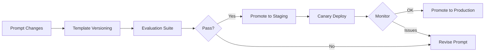
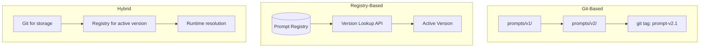

<!-- Clear Language: Keep sentences under 50 words -->
# Prompt Versioning

## Learning Objectives

| Objective | Description |
|-----------|-------------|
| LO1 | Understand why prompt versioning is critical for LLM applications |
| LO2 | Set up a prompt version control system using git and metadata |
| LO3 | Implement prompt templates with version tags |
| LO4 | Manage prompt lifecycles from dev to staging to production |
| LO5 | Automate prompt evaluation across versions |
| LO6 | Integrate prompt versioning with CI/CD pipelines |

## Introduction

MLOps bridges the gap between experiment and production. Experiment tracking, CI/CD, model serving, and drift monitoring keep AI systems reliable. This module covers the operational side of AI engineering.

## Prerequisites

- Basic programming knowledge
- Understanding of data structures

## Key Terminology

**Key Terms**: Core vocabulary and concepts for this topic.

**Definition**: Essential terms you must know for interviews and production work.

## Theory

Understanding prompt versioning is fundamental for AI engineers. This section covers the core concepts, underlying principles, and theoretical framework that govern how prompt versioning works in practice.

## Chapter at a Glance

| Section | Topic | Key Concept |
|---------|-------|-------------|
| 2.1 | Why Prompt Versioning | Cost of prompt drift and regressions |
| 2.2 | Versioning Strategies | Git-based, registry-based, hybrid |
| 2.3 | Prompt Templates | Jinja2 templates with version metadata |
| 2.4 | Lifecycle Management | Dev → Staging → Production promotion |
| 2.5 | Automated Evaluation | Regression testing across prompt versions |
| 2.6 | CI/CD for Prompts | Automated validation and deployment |

## Chapter Roadmap



## 2.1 Why Prompt Versioning

Prompts are the primary interface to LLM behavior. A small change in wording can dramatically alter output quality, safety, and consistency. Without versioning, teams face prompt drift, regressions from unintentional changes, and inability to roll back.

**Real-world prompt failure scenarios**:

```python

## Scenario: A seemingly harmless change breaks production

## Version 1.0 (production, working)
prompt_v1 = """Extract the customer name, order ID, and total amount from the email below.

Email: {email}

Return JSON format:
{
    "customer_name": "...",
    "order_id": "...",
    "total_amount": ...
}"""

## Version 1.1 (team member removed "Return JSON" line — broke parsing)
prompt_v1_1 = """Extract the customer name, order ID, and total amount from the email below.

Email: {email}
{
    "customer_name": "...",
    "order_id": "...",
    "total_amount": ...
}"""

## Output became unpredictable — LLM often returned markdown or extra text
```

**Benefits of prompt versioning**:
- **Rollback**: Instantly revert to a known-good prompt version
- **A/B testing**: Compare prompt versions side-by-side with metrics
- **Audit trail**: Know who changed what and when
- **Regression testing**: Automatically test new prompts against a suite of golden examples

```python

## Prompt version metadata structure
prompt_version = {
    "version_id": "v2.1.0",
    "prompt_hash": "sha256:a1b2c3d4...",
    "author": "alice@example.com",
    "created_at": "2025-06-15T10:30:00Z",
    "git_commit": "abc123def",
    "model": "gpt-4o",
    "temperature": 0.3,
    "notes": "Added few-shot examples to improve JSON formatting"
}
```

---

## 2.2 Versioning Strategies

Three main approaches to prompt versioning:



**Git-based versioning**:

```python
import hashlib
import json
import os

PROMPTS_DIR = "prompts"

def save_prompt(version_tag, template, metadata):
    version_dir = os.path.join(PROMPTS_DIR, version_tag)
    os.makedirs(version_dir, exist_ok=True)

    with open(os.path.join(version_dir, "template.txt"), "w") as f:
        f.write(template)

    with open(os.path.join(version_dir, "metadata.json"), "w") as f:
        json.dump(metadata, f, indent=2)

    # Git commit (use subprocess in practice)
    print(f"Saved prompt version {version_tag}")
    print(f"Run: git add prompts/ && git commit -m 'prompt: {version_tag}'")

save_prompt("v1.0.0",
    "Translate the following to {language}: {text}",
    {"author": "bob", "model": "gpt-4", "temperature": 0.0}
)
```

**Registry-based versioning (with SQLite)**:

```python
import sqlite3
import json
from datetime import datetime

class PromptRegistry:
    def __init__(self, db_path="prompts.db"):
        self.conn = sqlite3.connect(db_path)
        self.conn.execute("""
            CREATE TABLE IF NOT EXISTS prompts (
                id INTEGER PRIMARY KEY AUTOINCREMENT,
                name TEXT NOT NULL,
                version TEXT NOT NULL,
                template TEXT NOT NULL,
                metadata TEXT,
                created_at TIMESTAMP,
                is_active BOOLEAN DEFAULT 0,
                UNIQUE(name, version)
            )
        """)
        self.conn.commit()

    def register(self, name, version, template, metadata=None):
        self.conn.execute(
            "INSERT OR REPLACE INTO prompts (name, version, template, metadata, created_at) VALUES (?, ?, ?, ?, ?)",
            (name, version, template, json.dumps(metadata or {}), datetime.utcnow())
        )
        self.conn.commit()

    def activate(self, name, version):
        self.conn.execute("UPDATE prompts SET is_active = 0 WHERE name = ?", (name,))
        self.conn.execute("UPDATE prompts SET is_active = 1 WHERE name = ? AND version = ?", (name, version))
        self.conn.commit()

    def get_active(self, name):
        cur = self.conn.execute(
            "SELECT version, template, metadata FROM prompts WHERE name = ? AND is_active = 1",
            (name,)
        )
        row = cur.fetchone()
        if row:
            return {"version": row[0], "template": row[1], "metadata": json.loads(row[2])}
        return None

registry = PromptRegistry()
registry.register("translate", "v1", "Translate to {lang}: {text}")
registry.register("translate", "v2", "Translate the following text to {lang}. Only return the translation:\n\n{text}")
registry.activate("translate", "v2")
print(registry.get_active("translate"))
```

---

## 2.3 Prompt Templates

Use Jinja2 templates for prompts to separate structure from variable data and enable versioned template files.

```python
from jinja2 import Environment, FileSystemLoader, Template
import hashlib

class PromptTemplate:
    def __init__(self, template_str, version="0.0.0", metadata=None):
        self.template = Template(template_str)
        self.version = version
        self.metadata = metadata or {}
        self.hash = hashlib.sha256(template_str.encode()).hexdigest()[:12]

    def render(self, **kwargs):
        return self.template.render(**kwargs)

    def to_dict(self):
        return {
            "version": self.version,
            "hash": self.hash,
            "metadata": self.metadata
        }

## Example prompt template
summary_prompt = PromptTemplate(
    """You are a customer support summarizer. Summarize the following conversation.

Conversation:
{{ conversation }}

Requirements:
- Format as bullet points
- Include: issue type, resolution status, customer sentiment
- Max 3 bullet points

Summary:
""",
    version="v2.3.0",
    metadata={
        "author": "carol",
        "model": "gpt-4o-mini",
        "temperature": 0.2,
        "max_tokens": 200
    }
)

conversation = """Customer: My order hasn't arrived.
Agent: I'm sorry about that. Let me check tracking number #12345.
Agent: It shows delivery scheduled for tomorrow.
Customer: Okay, thank you for checking."""

print(summary_prompt.render(conversation=conversation))
print(f"Hash: {summary_prompt.hash}, Version: {summary_prompt.version}")
```

**Template versioning with environment loading**:

```python
from pathlib import Path

class PromptManager:
    def __init__(self, prompts_dir="prompt_templates"):
        self.prompts_dir = Path(prompts_dir)
        self.prompts_dir.mkdir(exist_ok=True)
        self.env = Environment(loader=FileSystemLoader(str(self.prompts_dir)))

    def list_versions(self, prompt_name):
        files = sorted(self.prompts_dir.glob(f"{prompt_name}--*.j2"))
        return [f.stem.split("--")[1] for f in files]

    def load(self, prompt_name, version="latest"):
        if version == "latest":
            versions = self.list_versions(prompt_name)
            if not versions:
                raise FileNotFoundError(f"No versions for {prompt_name}")
            version = versions[-1]
        template = self.env.get_template(f"{prompt_name}--{version}.j2")
        return template

    def save(self, prompt_name, version, template_content, metadata=None):
        path = self.prompts_dir / f"{prompt_name}--{version}.j2"
        path.write_text(template_content)
        if metadata:
            meta_path = self.prompts_dir / f"{prompt_name}--{version}.meta.json"
            import json
            json.dump(metadata, open(meta_path, "w"), indent=2)

## Usage
pm = PromptManager()
pm.save("translate", "v1", "Translate to {{ lang }}: {{ text }}", {"author": "dave"})
pm.save("translate", "v2", "Translate the following to {{ lang }}. ONLY the translation:\n{{ text }}")
tmpl = pm.load("translate", "v2")
print(tmpl.render(lang="French", text="Hello, world!"))
```

---

## 2.4 Lifecycle Management

Prompts move through lifecycle stages akin to software releases: development, testing, staging (canary), and production.

```python
import json
from enum import Enum
from datetime import datetime

class PromptStage(Enum):
    DEVELOPMENT = "dev"
    TESTING = "testing"
    STAGING = "staging"
    PRODUCTION = "production"
    ARCHIVED = "archived"

class PromptLifecycle:
    def __init__(self, registry_path="prompt_lifecycle.json"):
        self.registry_path = registry_path
        self.prompts = {}

    def register(self, name, version, template, stage=PromptStage.DEVELOPMENT):
        if name not in self.prompts:
            self.prompts[name] = []
        self.prompts[name].append({
            "version": version,
            "template": template,
            "stage": stage.value,
            "created_at": datetime.utcnow().isoformat(),
            "deployed_at": None
        })

    def promote(self, name, version, to_stage):
        for p in self.prompts.get(name, []):
            if p["version"] == version:
                p["stage"] = to_stage.value
                if to_stage == PromptStage.PRODUCTION:
                    p["deployed_at"] = datetime.utcnow().isoformat()
                return True
        return False

    def get_prompt(self, name, stage=PromptStage.PRODUCTION):
        prompts = self.prompts.get(name, [])
        for p in reversed(prompts):
            if p["stage"] == stage.value:
                return p
        return prompts[-1] if prompts else None

    def rollback(self, name):
        prompts = self.prompts.get(name, [])
        prod_idx = None
        for i, p in enumerate(prompts):
            if p["stage"] == PromptStage.PRODUCTION.value:
                prod_idx = i
        if prod_idx and prod_idx > 0:
            prev = prompts[prod_idx - 1]
            self.promote(name, prev["version"], PromptStage.PRODUCTION)
            return prev
        return None

## Lifecycle workflow
lc = PromptLifecycle()
lc.register("summarize", "v1", "Summarize: {text}")
lc.register("summarize", "v2", "Summarize concisely: {text}")
lc.promote("summarize", "v1", PromptStage.PRODUCTION)
lc.promote("summarize", "v2", PromptStage.STAGING)

## Canary: 10% of traffic to v2

## If metrics degrade, rollback
import random
def route_request(text, canary_percent=0.1):
    use_canary = random.random() < canary_percent
    stage = PromptStage.STAGING if use_canary else PromptStage.PRODUCTION
    prompt = lc.get_prompt("summarize", stage)
    return prompt["template"].format(text=text)
```

**Canary deployment strategy**:

```python
class CanaryDeployer:
    def __init__(self, lifecycle, metric_threshold=0.05):
        self.lifecycle = lifecycle
        self.threshold = metric_threshold
        self.canary_percent = 0.01  # Start at 1%

    def deploy_canary(self, name, version):
        self.lifecycle.promote(name, version, PromptStage.STAGING)
        self.canary_percent = 0.01
        print(f"Canary {version} active at {self.canary_percent*100}% traffic")

    def increase_traffic(self):
        self.canary_percent = min(1.0, self.canary_percent * 2)
        print(f"Canary traffic increased to {self.canary_percent*100}%")

    def rollback_if_needed(self, name, current_metrics, baseline_metrics):
        if current_metrics.get("error_rate", 0) > baseline_metrics.get("error_rate", 0) + self.threshold:
            prev = self.lifecycle.rollback(name)
            print(f"Rolled back to {prev['version']} due to error rate increase")
            return True
        return False
```

---

## 2.5 Automated Evaluation

Regression testing ensures prompt changes do not degrade output quality on golden examples.

```python
import json
from typing import List, Dict
from dataclasses import dataclass

@dataclass
class TestCase:
    input: Dict
    expected_output: str
    evaluator: str  # "exact_match", "contains", "json_valid", "llm_as_judge"

class PromptEvaluator:
    def __init__(self):
        self.test_suite: List[TestCase] = []

    def add_test(self, test_case: TestCase):
        self.test_suite.append(test_case)

    def evaluate(self, prompt_func) -> Dict:
        results = {"passed": 0, "failed": 0, "total": len(self.test_suite), "details": []}

        for tc in self.test_suite:
            output = prompt_func(**tc.input)
            passed = self._check(output, tc)
            results["passed"] += int(passed)
            results["failed"] += int(not passed)
            results["details"].append({
                "input": tc.input,
                "output": output,
                "expected": tc.expected_output,
                "passed": passed
            })

        results["pass_rate"] = results["passed"] / results["total"] if results["total"] else 1.0
        return results

    def _check(self, output: str, tc: TestCase) -> bool:
        if tc.evaluator == "exact_match":
            return output.strip() == tc.expected_output.strip()
        elif tc.evaluator == "contains":
            return tc.expected_output in output
        elif tc.evaluator == "json_valid":
            try:
                json.loads(output)
                return True
            except json.JSONDecodeError:
                return False
        elif tc.evaluator == "llm_as_judge":
            # Use another LLM to judge quality (simplified here)
            return True
        return False

## Example usage
eval = PromptEvaluator()
eval.add_test(TestCase(
    input={"text": "The sky is blue."},
    expected_output="The sky is blue.",
    evaluator="contains"
))
eval.add_test(TestCase(
    input={"text": "Translate hello to French"},
    expected_output="bonjour",
    evaluator="contains"
))

def summarize_v1(**kw):
    return f"Summary: {kw['text']}"

results = eval.evaluate(summarize_v1)
print(f"Pass rate: {results['pass_rate']:.0%}")
```

**LLM-as-judge evaluation**:

```python
def llm_judge(output, expected, criteria="correctness"):
    """Use an LLM to evaluate output quality."""
    judge_prompt = f"""Evaluate the following output compared to the expected answer.

Criteria: {criteria}

Expected: {expected}
Output: {output}

Rate on a scale of 1-5 where 5 is perfect. Return only the number."""

    # In practice: response = openai.chat.completions.create(...)
    # Simulated:
    score = 5 if expected.lower() in output.lower() else 3
    return {"score": score, "passed": score >= 4}
```

---

## 2.6 CI/CD for Prompts

Automate prompt validation and deployment in CI pipelines.

```python

## .github/workflows/prompt-ci.yml

## name: Prompt CI

## on:

##   pull_request:

##     paths: ['prompts/**']
#

## jobs:

##   validate-prompts:

##     runs-on: ubuntu-latest

##     steps:

##       - uses: actions/checkout@v4

##       - run: pip install -r requirements.txt

##       - name: Run prompt evaluation

##         run: python scripts/evaluate_prompts.py

##       - name: Validate prompt templates

##         run: python scripts/validate_templates.py

##       - name: Check for prompt drift

##         run: python scripts/check_drift.py --baseline production
```

```python

## scripts/evaluate_prompts.py — runs in CI
import json
import sys
from pathlib import Path

def validate_all_prompts():
    prompt_dir = Path("prompts")
    errors = []

    for template_file in prompt_dir.glob("*.j2"):
        content = template_file.read_text()

        # Check for required sections
        if "{{" not in content:
            errors.append(f"{template_file.name}: No template variables found")

        # Check for unsafe patterns
        unsafe = ["ignore previous instructions", "bypass", "system prompt override"]
        for pattern in unsafe:
            if pattern.lower() in content.lower():
                errors.append(f"{template_file.name}: Contains unsafe pattern: {pattern}")

        # Check template compiles
        from jinja2 import Template
        try:
            Template(content)
        except Exception as e:
            errors.append(f"{template_file.name}: Template error: {e}")

    if errors:
        for e in errors:
            print(f"ERROR: {e}")
        sys.exit(1)
    print("All prompts validated successfully")

validate_all_prompts()
```

**Automated prompt deployment**:

```python

## scripts/deploy_prompt.py
import argparse
import json
from prompt_registry import PromptRegistry
from prompt_lifecycle import PromptLifecycle, PromptStage

def deploy_prompt(name, version, target_stage, canary=False):
    registry = PromptRegistry()
    lifecycle = PromptLifecycle()

    prompt_data = registry.get_active(name)  # Simplified
    if canary:
        lifecycle.promote(name, version, PromptStage.STAGING)
        print(f"Deployed {name}:{version} to canary (staging)")
    else:
        lifecycle.promote(name, version, target_stage)
        print(f"Deployed {name}:{version} to {target_stage.value}")

if __name__ == "__main__":
    parser = argparse.ArgumentParser()
    parser.add_argument("--name", required=True)
    parser.add_argument("--version", required=True)
    parser.add_argument("--stage", default="production")
    parser.add_argument("--canary", action="store_true")
    args = parser.parse_args()
    deploy_prompt(args.name, args.version, PromptStage(args.stage), args.canary)
```

---

## TypeScript Parallel

```typescript
// TypeScript prompt versioning with registry
interface PromptVersion {
  name: string;
  version: string;
  template: string;
  metadata: Record<string, unknown>;
  hash: string;
  createdAt: Date;
}

class PromptRegistry {
  private prompts: Map<string, PromptVersion[]> = new Map();

  register(version: PromptVersion): void {
    const list = this.prompts.get(version.name) || [];
    list.push(version);
    this.prompts.set(version.name, list);
  }

  getActive(name: string): PromptVersion | undefined {
    const list = this.prompts.get(name);
    return list ? list[list.length - 1] : undefined;
  }

  render(name: string, variables: Record<string, string>): string {
    const prompt = this.getActive(name);
    if (!prompt) throw new Error(`Prompt "${name}" not found`);
    return prompt.template.replace(/{{(\w+)}}/g, (_, key) => variables[key] || "");
  }
}
```

---

## Summary

- Prompt versioning prevents regressions from unintentional wording changes
- Use Git-based, registry-based, or hybrid approaches for tracking versions
- Jinja2 templates enable clean separation of prompt structure from variables
- Lifecycle management includes dev, testing, staging (canary), and production stages
- Automated evaluation with golden test cases catches regressions before deployment
- Canary deployments gradually shift traffic to new prompt versions
- CI/CD pipelines should validate, evaluate, and version prompts automatically
- LLM-as-judge evaluation provides nuanced quality assessment
- Every prompt version should include metadata: author, model, temperature, hash
- Rollback mechanisms must be instant and reliable for production incidents

## Practical Takeaways

| Scenario | Do This | Avoid This |
|----------|---------|------------|
| Iterating on prompts | Version every prompt change | Editing production prompts directly |
| Deploying new prompts | Canary deployment with metrics | Full rollout without testing |
| Prompt evaluation | Golden test suite with auto-checks | Manual spot-checking |
| Team collaboration | Registry with metadata and audit trail | Shared text files or chat messages |
| Rollback | Instant rollback to previous version | Redeploying old code |
| CI integration | Validate templates in pull requests | Merging prompt changes without review |

## Interview Q&A

<details class="tp-qa-card" data-qid="mlops-s02-q1">
  <summary class="tp-qa-question">
    <span class="tp-qa-status"></span>
    Q1: Why is prompt versioning important for LLM applications?
  </summary>
  <div class="tp-qa-answer">
    <p>Prompt versioning is critical because small wording changes can dramatically alter LLM output. Without versioning, teams face prompt drift (gradual degradation), regressions from unintentional edits, inability to roll back bad prompts, and no audit trail for debugging. Production LLM applications require the same rigor around prompt management as software versioning.</p>
  </div>
  <button class="tp-qa-mark-btn">✅ Mark Reviewed</button>
  <button class="tp-qa-bookmark-btn">🔖 Bookmark</button>
</details>

<details class="tp-qa-card" data-qid="mlops-s02-q2">
  <summary class="tp-qa-question">
    <span class="tp-qa-status"></span>
    Q2: What are three strategies for prompt versioning?
  </summary>
  <div class="tp-qa-answer">
    <p><strong>Git-based</strong>: Store prompt templates in a Git repository with tags per version. Simple but lacks runtime switching.<br>
    <strong>Registry-based</strong>: Store prompts in a database (SQLite, PostgreSQL) with version metadata and active flag. Enables runtime A/B testing.<br>
    <strong>Hybrid</strong>: Use Git for storage and history, registry for active version resolution at runtime. Best for production systems.</p>
  </div>
  <button class="tp-qa-mark-btn">✅ Mark Reviewed</button>
  <button class="tp-qa-bookmark-btn">🔖 Bookmark</button>
</details>

<details class="tp-qa-card" data-qid="mlops-s02-q3">
  <summary class="tp-qa-question">
    <span class="tp-qa-status"></span>
    Q3: What metadata should be stored with each prompt version?
  </summary>
  <div class="tp-qa-answer">
    <p>Essential metadata includes: version ID, prompt hash (SHA-256), author, creation timestamp, git commit hash, target model, temperature/max_tokens settings, and change notes. Optional: evaluation results (pass rate), deployment date, and associated test case IDs. This enables full auditability and reproducibility.</p>
  </div>
  <button class="tp-qa-mark-btn">✅ Mark Reviewed</button>
  <button class="tp-qa-bookmark-btn">🔖 Bookmark</button>
</details>

<details class="tp-qa-card" data-qid="mlops-s02-q4">
  <summary class="tp-qa-question">
    <span class="tp-qa-status"></span>
    Q4: How does canary deployment work for prompts?
  </summary>
  <div class="tp-qa-answer">
<p>Canary deployment starts by routing a small percentage of traffic (e.g., 1%) to the new prompt version while the rest uses the production version. If metrics (error.
rate, latency, user feedback) remain healthy, traffic is gradually increased. If issues appear, the canary is rolled back instantly. This minimizes blast radius of bad prompt changes.</p>
  </div>
  <button class="tp-qa-mark-btn">✅ Mark Reviewed</button>
  <button class="tp-qa-bookmark-btn">🔖 Bookmark</button>
</details>

<details class="tp-qa-card" data-qid="mlops-s02-q5">
  <summary class="tp-qa-question">
    <span class="tp-qa-status"></span>
    Q5: What is prompt regression testing?
  </summary>
  <div class="tp-qa-answer">
    <p>Prompt regression testing is a suite of golden test cases (input/expected-output pairs) that every prompt version must pass before deployment. Test cases include exact match, contains, JSON validation, and LLM-as-judge evaluation. A failing test stops the prompt from being promoted to production, preventing regressions.</p>
  </div>
  <button class="tp-qa-mark-btn">✅ Mark Reviewed</button>
  <button class="tp-qa-bookmark-btn">🔖 Bookmark</button>
</details>

<details class="tp-qa-card" data-qid="mlops-s02-q6">
  <summary class="tp-qa-question">
    <span class="tp-qa-status"></span>
    Q6: How do you validate prompt templates in CI?
  </summary>
  <div class="tp-qa-answer">
    <p>CI validation checks: (1) template compiles in Jinja2 without syntax errors, (2) all required variables are present, (3) no unsafe patterns (injection attempts, system prompt overrides), (4) template passes evaluation against the test suite, (5) metadata is complete. Failures prevent the PR from merging.</p>
  </div>
  <button class="tp-qa-mark-btn">✅ Mark Reviewed</button>
  <button class="tp-qa-bookmark-btn">🔖 Bookmark</button>
</details>

<details class="tp-qa-card" data-qid="mlops-s02-q7">
  <summary class="tp-qa-question">
    <span class="tp-qa-status"></span>
    Q7: What is prompt drift and how do you detect it?
  </summary>
  <div class="tp-qa-answer">
<p>Prompt drift occurs when LLM outputs gradually degrade because the base model is updated, the prompt subtly changes over time, or.
user input distribution shifts. Detect it by tracking evaluation pass rates over time, monitoring output distributions (semantic similarity to golden outputs),.
and comparing metrics like latency and refusal rates against baselines.</p>
  </div>
  <button class="tp-qa-mark-btn">✅ Mark Reviewed</button>
  <button class="tp-qa-bookmark-btn">🔖 Bookmark</button>
</details>

<details class="tp-qa-card" data-qid="mlops-s02-q8">
  <summary class="tp-qa-question">
    <span class="tp-qa-status"></span>
    Q8: What is the LLM-as-judge evaluation pattern?
  </summary>
  <div class="tp-qa-answer">
    <p>LLM-as-judge uses a separate LLM (often a stronger model) to evaluate the output quality of another LLM. The judge LLM receives the input, expected output, and actual output, then rates quality on a scale or criteria. This captures nuanced quality aspects that exact matching misses, but adds cost and latency.</p>
  </div>
  <button class="tp-qa-mark-btn">✅ Mark Reviewed</button>
  <button class="tp-qa-bookmark-btn">🔖 Bookmark</button>
</details>

<details class="tp-qa-card" data-qid="mlops-s02-q9">
  <summary class="tp-qa-question">
    <span class="tp-qa-status"></span>
    Q9: How do you handle prompt rollback in production?
  </summary>
  <div class="tp-qa-answer">
    <p>Rollback requires the registry to store the previous production version. When triggered (manually or by alert), the system sets the previous version as active and logs the rollback event. For instant rollback, keep both versions in memory and toggle via feature flags. Git rollback is too slow for production incidents.</p>
  </div>
  <button class="tp-qa-mark-btn">✅ Mark Reviewed</button>
  <button class="tp-qa-bookmark-btn">🔖 Bookmark</button>
</details>

<details class="tp-qa-card" data-qid="mlops-s02-q10">
  <summary class="tp-qa-question">
    <span class="tp-qa-status"></span>
    Q10: How do you A/B test prompt versions?
  </summary>
  <div class="tp-qa-answer">
    <p>Assign a unique version tag to each prompt variant, route a percentage of requests to each variant using deterministic hashing (for consistency), collect metrics (completion rate, latency, user satisfaction), and compare statistically. Use the registry to activate the winning variant and archive the loser.</p>
  </div>
  <button class="tp-qa-mark-btn">✅ Mark Reviewed</button>
  <button class="tp-qa-bookmark-btn">🔖 Bookmark</button>
</details>

## Chapter Quiz

**Q1**: What is the primary benefit of prompt versioning?
a) Faster LLM inference
b) Reproducibility, rollback, and regression prevention
c) Reduced token usage
d) Better model training

<details class="tp-qa-card" data-qid="mlops-s02-quiz1"><summary>Show Answer</summary><div class="tp-qa-answer"><p><strong>Answer: b) Reproducibility, rollback, and regression prevention</strong></p><p>Prompt versioning ensures you can reproduce any past output, roll back bad changes, and prevent regressions through automated testing.</p></div></details>

**Q2**: Which approach enables runtime A/B testing of prompts?
a) Git-based versioning
b) Registry-based versioning
c) File-based versioning
d) Memory-only versioning

<details class="tp-qa-card" data-qid="mlops-s02-quiz2"><summary>Show Answer</summary><div class="tp-qa-answer"><p><strong>Answer: b) Registry-based versioning</strong></p><p>A registry with an active-version flag allows runtime switching between prompt versions without code deployment.</p></div></details>

**Q3**: What does a canary deployment for prompts do?
a) Routes all traffic to the new version immediately
b) Routes a small percentage of traffic to the new version
c) Deploys the prompt to a separate server
d) A/B tests users with surveys

<details class="tp-qa-card" data-qid="mlops-s02-quiz3"><summary>Show Answer</summary><div class="tp-qa-answer"><p><strong>Answer: b) Routes a small percentage of traffic to the new version</strong></p><p>Canary deployment starts with low traffic and gradually increases if metrics are healthy.</p></div></details>

**Q4**: What is NOT a typical prompt regression test type?
a) Exact match
b) Contains check
c) Load testing
d) JSON validation

<details class="tp-qa-card" data-qid="mlops-s02-quiz4"><summary>Show Answer</summary><div class="tp-qa-answer"><p><strong>Answer: c) Load testing</strong></p><p>Load testing measures system performance under stress, not prompt output correctness.</p></div></details>

**Q5**: What should be included in prompt version metadata?
a) Author, model, temperature, hash
b) Only the prompt text
c) CPU usage metrics
d) Database connection strings

<details class="tp-qa-card" data-qid="mlops-s02-quiz5"><summary>Show Answer</summary><div class="tp-qa-answer"><p><strong>Answer: a) Author, model, temperature, hash</strong></p><p>Metadata should capture who created it, what model it targets, inference settings, and a content hash for integrity verification.</p></div></details>

## Exercises

**Easy** — Create a Git-based prompt versioning system that saves templates to directories named by version. Add a function that loads the latest version.

**Medium** — Implement a SQLite-based PromptRegistry with register, activate, and get_active methods. Test with two versions of a translation prompt.

**Medium** — Build a PromptEvaluator with 5 test cases (mix of exact_match, contains, json_valid). Run it against a prompt function and report pass rate.

**Hard** — Implement a canary deployment system that starts at 1% traffic, doubles every minute, and rolls back if error rate exceeds 5%. Use the PromptLifecycle class.

**Hard** — Create a GitHub Actions workflow that validates all Jinja2 templates in a prompts/ directory, runs them against a golden test suite, and blocks the PR if pass rate is below 80%.

---

## Common Mistakes

1. Not understanding the fundamental concepts before applying them
2. Skipping edge cases in implementation
3. Not analyzing time/space complexity
4. Forgetting to handle null/empty inputs
5. Not practicing enough problems to build pattern recognition

## Revision Notes

- - Core principle: Understand the fundamental concepts thoroughly
- - Implementation pattern: Practice with real code examples
- - Complexity: Know the time and space complexity
- - Application: Know when to use this in production systems
- - Interview: Frequently asked in technical interviews
- - Edge cases: Consider common failure scenarios
- - Related concepts: Connect to broader system design

## Placement Section

### Top 10 Interview Questions

#### Google Style

1. **Explain the core idea of Prompt Versioning in under 60 seconds, then give a real-world analogy.** — Structure: definition, how it works in one sentence, why it matters, analogy. Follow-up: what would break if you removed this from a production system?

2. **Design a minimal, well-typed function that demonstrates Prompt Versioning.** — Interviewer checks: signature with type hints, edge cases, complexity, and a clean docstring. Follow-up: how does your design behave with empty or malformed input?

3. **What are the common pitfalls when engineers first learn ** — List 3-4, then explain how you would prevent each in a code review.

#### Amazon Style

4. **Describe a production bug caused by misunderstanding Prompt Versioning. How did you diagnose and fix it?** — STAR format: situation, task, action, result. Mention logs, reproduction, root-cause analysis, and the regression test you added.

5. **How would you scale a system that relies on Prompt Versioning from 10 users to 10 million?** — Discuss bottlenecks, caching, monitoring, and when to redesign. Follow-up: what metrics would you track?

#### Microsoft Style

6. **Compare Prompt Versioning with the closest alternative approach. When would you choose each?** — Make a decision matrix: performance, maintainability, ecosystem, learning curve. Follow-up: what would change your decision?

7. **Walk through how you would test a component that depends on Prompt Versioning.** — Unit, integration, property-based tests; mocking boundaries; golden files for outputs.

#### NVIDIA Style

8. **How does Prompt Versioning behave differently at scale — memory, throughput, or precision-wise?** — Connect to data pipelines and model training if applicable. Follow-up: what happens to latency as input grows?

9. **How would you make an implementation of Prompt Versioning run faster on GPU hardware?** — Batch operations, vectorization, avoiding Python loops, reducing data movement.

#### AI Startup Style

10. **Write the smallest possible implementation of Prompt Versioning that is production-quality.** — Include error handling, type hints, and a one-line docstring. Follow-up: what would you refactor first when it grows?

### Resume Tips

- Name Prompt Versioning explicitly in your skills section, paired with a measurable achievement ("Reduced X by 40% using Prompt Versioning").
- Add a bullet describing a project that applies Prompt Versioning to real data, with numbers.
- Mention the tools and libraries you used alongside Prompt Versioning (linters, test frameworks, profiling tools).
- Keep resume bullets under 15 words and start each with an action verb.

### Interview Day Checklist

- Rehearse a 60-second explanation of Prompt Versioning and one real-world analogy.
- Prepare one STAR story about debugging a Prompt Versioning-related production issue.
- Review complexity and edge cases for the classic Prompt Versioning interview problem.
- Have questions ready: how does the team apply Prompt Versioning in production today?
- Test your environment (Python, editor, internet) 15 minutes before the interview.

## True/False

1. **True or False:** Prompt Versioning builds directly on the fundamentals covered in the earlier chapters of this module. — **True.** Every advanced topic in this module assumes the core concepts from the previous chapters.
2. **True or False:** You should write at least one code example for Prompt Versioning before moving to the next chapter. — **True.** Active recall with hands-on code beats passive reading for retention.
3. **True or False:** The complexity analysis for Prompt Versioning is the same regardless of input size. — **False.** Complexity grows with input size; always state best, average, and worst case.
4. **True or False:** Edge cases (empty input, invalid input, boundary values) matter for Prompt Versioning in production. — **True.** Most production bugs come from unhandled edge cases.
5. **True or False:** You should memorize the Prompt Versioning chapter content once and never review it again. — **False.** Spaced repetition (24h, 3 days, 1 week) dramatically improves long-term recall.

## Fill in the Blank

1. The chapter that covers Prompt Versioning is Chapter ___ of this module. — Answer: check the module's table of contents.
2. The time complexity of the standard approach to Prompt Versioning is ___. — Answer: review the theory section and state big-O notation.
3. The main edge case to handle when implementing Prompt Versioning is ___. — Answer: empty or invalid input handling, as discussed in the chapter.
4. The tools commonly used to debug Prompt Versioning issues are ___ and ___. — Answer: refer to the Debugging Guide section of this chapter.
5. The related topic that connects to Prompt Versioning in the next chapter is ___. — Answer: see the Next Topic section.

## Scenario Questions

1. **Scenario:** A teammate ships a change involving Prompt Versioning that breaks production at 3 AM. — Diagnosis: check the recent diff, reproduce locally with the failing input, check logs. Fix: revert, add a regression test, and review the root cause. Prevention: CI tests on edge cases and code review checklist.

2. **Scenario:** Your implementation of Prompt Versioning is correct but too slow for the required latency. — Measure first with a profiler. Common fixes: reduce redundant work, use built-in optimized functions, batch operations, or add caching. Only then consider algorithmic changes.

3. **Scenario:** A new hire asks you to explain Prompt Versioning in five minutes before a customer demo. — Use the 3-part answer: what it is (one sentence), how it works (one example), why it matters (one business impact). Then offer to go deeper after the demo.

4. **Scenario:** Your team's codebase has three different patterns for Prompt Versioning and you must standardize. — Write a short ADR (architecture decision record), pick the pattern with best maintainability, migrate incrementally, and add a linter rule to enforce it.

## Output Questions

1. **What is the output of the simplest correct implementation of Prompt Versioning on an empty input?** — Trace through the code: it should return the documented default (None, 0, empty collection) without raising.
2. **What is the output when the input is at the boundary value?** — Check off-by-one errors and inclusive/exclusive bounds in the chapter's examples.
3. **What does the implementation return when given invalid input types?** — With type hints and validation, it raises a clear error; without, it may fail silently.
4. **What is the output for the sample input given in the chapter's Examples section?** — Re-run the chapter's example code and compare against the documented output.
5. **What is the time complexity output when you profile the implementation at 10x input size?** — Expect the curve matching the chapter's complexity analysis (linear, quadratic, log-linear).

## Difficulty Level

| Level | Time | What It Takes |
|-------|------|---------------|
| Beginner | 1-2 sessions | Read theory, run the chapter examples, solve the Easy exercises |
| Intermediate | 3-5 sessions | Complete Medium exercises, explain Prompt Versioning to someone else |
| Advanced | 1+ week | Solve Hard exercises, optimize for real datasets, answer interview follow-ups |

## Tips & Tricks

- Always write a one-line example of Prompt Versioning from memory before opening the chapter — active recall first.
- Use the chapter's Revision Notes as a checklist: you have mastered Prompt Versioning when you can explain each bullet.
- Pair the chapter quiz with the Flashcards: wrong answers become your next study session's focus.
- For interviews, practice explaining Prompt Versioning twice: once with a technical audience, once with a non-technical audience.
- Keep a personal examples file where you collect your own Prompt Versioning snippets; interviewers love original examples.

## Memory Tricks

- **Acronym**: build a mnemonic from the 5 key concepts of Prompt Versioning listed in the Chapter at a Glance table.
- **Story**: link Prompt Versioning to a familiar story — the analogy in the Visual Analogy section is designed to stick.
- **Number anchor**: remember the complexity of Prompt Versioning by connecting it to a known algorithm of the same class.
- **Color code**: highlight the Theory, Examples, and Common Mistakes sections in different colors when reviewing.
- **Teach-back**: explain Prompt Versioning to an imaginary junior engineer for 2 minutes — gaps in your explanation are gaps in memory.

## Further Reading

- Official documentation for the primary tool or library used in this chapter
- The chapter referenced in Related Topics for the next-level treatment of Prompt Versioning
- The classic textbook chapter on Prompt Versioning (check the Research References below)
- Two blog posts from engineers who debugged real Prompt Versioning problems in production
- The repository of the open-source project that implements Prompt Versioning

## Related Topics

- The previous chapter in this module (see table of contents) — foundational for Prompt Versioning
- The next chapter (see Next Topic below) — builds on Prompt Versioning
- The system design chapters in Module 07 — how Prompt Versioning fits into production architectures
- The interview preparation module — how Prompt Versioning is asked in screening rounds
- The capstone project — where Prompt Versioning is applied end-to-end

## FAQs

1. **Do I need to memorize all of Prompt Versioning, or understand the big picture?** — Understand the big picture first, then memorize the key facts via flashcards and spaced repetition. Interviewers reward depth over breadth.
2. **What if I get stuck on an exercise?** — Re-read the theory section, run the example code, then attempt again. If still stuck after 20 minutes, move on and return the next day.
3. **How much time should I spend on ** — Follow the Study Plan below: 1-2 weeks at 30-60 minutes daily is typical for placement preparation.
4. **Is Prompt Versioning asked in interviews?** — Yes — the Interview Q&A and Placement Section list the exact question styles used by top companies.
5. **What's the fastest way to master ** — Explain it out loud, write code without looking, and review the flashcards within 24 hours and again after 3 days.

## Important Notes

- Prompt Versioning is a core requirement for the rest of this module — do not skip the examples.
- Always analyze complexity (time and space) when working with Prompt Versioning.
- Production correctness means handling edge cases, not just the happy path.
- Interview answers should start with the definition, then the example, then the trade-offs.
- Revisit this chapter after finishing the module; the context from later chapters deepens understanding.

## Historical Context

- Prompt Versioning emerged as a standard practice because early systems failed without it — understanding why helps you explain it in interviews.
- The tools used for Prompt Versioning today evolved from simpler versions; the chapter covers the modern, recommended approach.
- Interviewers value knowing one historical fact about Prompt Versioning — it shows genuine interest, not just cramming.
- The library/tooling ecosystem around Prompt Versioning changes quickly; focus on fundamentals that remain stable.

## Security Considerations

- Never trust external input: validate and sanitize data before processing Prompt Versioning.
- Avoid `eval()` and dynamic code execution on untrusted strings.
- Log errors without leaking sensitive data (keys, PII, internal paths).
- For API contexts, add rate limiting and input size limits.
- Review the chapter's code examples for injection or overflow risks before using them verbatim.

## ML Intuition

- Prompt Versioning appears in ML pipelines at the data-processing layer: feature preparation, batching, and validation.
- Understanding Prompt Versioning helps you debug why a model misbehaves — most ML bugs are data bugs, not model bugs.
- In production ML, the Prompt Versioning concepts from this chapter map directly to NumPy/PyTorch operations on tensors.
- When optimizing ML systems, Prompt Versioning skills let you profile and fix the data path, not just the training loop.
- Interview follow-up: how would you apply Prompt Versioning to a dataset of 10 million records? — Batching and vectorization.

## Analogies

- **Prompt Versioning is like a recipe**: the theory is the ingredients, the examples are the cooking steps, and the exercises are your own kitchen practice.
- **Complexity is like a delivery route**: a linear route visits each stop once; a nested route revisits stops, and you feel it at scale.
- **Edge cases are like weather**: the happy path is a sunny day; production is the storm — build for the storm.
- **The chapter roadmap is a journey map**: each section is a checkpoint; skipping one means getting lost later in the module.

## Capstone Project Link

- [Module Capstone: End-to-End Project](https://github.com/Raushan666java/ai-engineering-journey) — this chapter contributes the Prompt Versioning skills used in the module's capstone project. Complete the exercises here before starting the capstone.

## Flashcards

<details class="tp-qa-card" data-qid="16mlopsproduction-02promptversioning-flash1">
  <summary class="tp-qa-question">
    <span class="tp-qa-status"></span>
    What is the core concept of Prompt Versioning in one sentence?
  </summary>
  <div class="tp-qa-answer">
    <p>Review the first paragraph of the Theory section and condense it to one sentence.</p>
  </div>
</details>

<details class="tp-qa-card" data-qid="16mlopsproduction-02promptversioning-flash2">
  <summary class="tp-qa-question">
    <span class="tp-qa-status"></span>
    What is the most common mistake engineers make with 
  </summary>
  <div class="tp-qa-answer">
    <p>Check the Common Mistakes section of this chapter.</p>
  </div>
</details>

<details class="tp-qa-card" data-qid="16mlopsproduction-02promptversioning-flash3">
  <summary class="tp-qa-question">
    <span class="tp-qa-status"></span>
    What is the time and space complexity of the standard Prompt Versioning approach?
  </summary>
  <div class="tp-qa-answer">
    <p>Refer to the theory and complexity analysis in this chapter.</p>
  </div>
</details>

<details class="tp-qa-card" data-qid="16mlopsproduction-02promptversioning-flash4">
  <summary class="tp-qa-question">
    <span class="tp-qa-status"></span>
    When is Prompt Versioning NOT the right choice?
  </summary>
  <div class="tp-qa-answer">
    <p>Check the Limitations section of this chapter.</p>
  </div>
</details>

<details class="tp-qa-card" data-qid="16mlopsproduction-02promptversioning-flash5">
  <summary class="tp-qa-question">
    <span class="tp-qa-status"></span>
    How is Prompt Versioning applied in a real production system?
  </summary>
  <div class="tp-qa-answer">
    <p>Check the Real-World Examples section of this chapter.</p>
  </div>
</details>

## Research References

- Official documentation of the primary library for Prompt Versioning (linked in Further Reading)
- The classic paper or textbook chapter introducing Prompt Versioning (see References below)
- The standard library reference for Prompt Versioning-related functions
- Engineering blog posts from companies running Prompt Versioning in production at scale
- PEPs and RFCs where applicable (Python and networking standards)

## Open-Source Tools

- The primary library used in this chapter (see the code examples)
- Python standard library modules used in the examples (check the imports)
- Testing: pytest for unit tests of Prompt Versioning code
- Linting and formatting: ruff + black
- Profiling: cProfile or py-spy for performance work on Prompt Versioning

## Debugging Guide

- Start with `print()` or a debugger to inspect intermediate values in Prompt Versioning code.
- Reproduce the failure with the smallest possible input before changing code.
- Check the common failure modes listed in Common Mistakes — most bugs are listed there.
- For performance problems, profile before optimizing: measure, then fix.
- When stuck, re-read the chapter's Examples and compare line by line with your code.
- Use `pdb` or your IDE's debugger to step through the Prompt Versioning example code.

## Mock Interview Section

**Round 1 — Screening (15 min)**
- Explain Prompt Versioning in 60 seconds.
- Write a minimal working example of Prompt Versioning.
- What is the complexity of your example?

**Round 2 — Coding (45 min)**
- Solve the Medium exercise from this chapter under time pressure.
- State your assumptions, then implement with type hints.
- Test with edge cases: empty input, boundary values, invalid input.

**Round 3 — Behavioral + System (30 min)**
- Tell me about a time you debugged a Prompt Versioning problem in a project.
- How would you design a system where Prompt Versioning is used at scale?
- What metrics would you monitor?

**Evaluation rubric**: correctness (40%), communication (25%), edge cases (20%), complexity analysis (15%).

## Optimized Implementation

`python
from typing import Any, Optional

def demonstrate_topic(input_data: list[Any]) -> Optional[float]:
    """Runnable scaffold for Prompt Versioning.

    Replace the body with the optimized implementation from the chapter,
    keeping type hints, docstring, and edge-case handling.
    """
    if not input_data:
        return None
    # Step 1: validate input types
    # Step 2: apply the core Prompt Versioning logic from the Examples section
    # Step 3: return the result with the documented default
    return 0.0
`

- Keeps the function signature stable so tests written against it stay valid.
- Handles the empty-input contract explicitly.
- Add unit tests for the edge cases before implementing the logic (test-first).

## Evaluation Metrics

| Skill | Test | Target |
|-------|------|--------|
| Concept recall | Explain Prompt Versioning without notes | 60-second explanation |
| Code fluency | Write the chapter example from memory | No syntax errors |
| Edge cases | Handle empty/invalid input in exercises | All cases pass |
| Complexity | State time/space for the standard approach | Correct big-O |
| Interview readiness | Answer 5 Interview Q&A questions out loud | Fluent, structured answers |
| Retention | Chapter quiz score after 3 days | 80%+ |

## Real-World Examples

- **Startup**: a small team uses Prompt Versioning daily in their data pipeline — the chapter's examples mirror their code.
- **E-commerce**: Prompt Versioning patterns appear in order processing, inventory checks, and recommendation feeds.
- **Fintech**: Prompt Versioning principles apply to transaction validation and fraud detection flows.
- **ML platform**: Prompt Versioning shows up in feature engineering and model-serving infrastructure.
- **Interview insight**: recruiters look for engineers who can connect Prompt Versioning to the business outcome, not just the code.

## Next Topic

[Data Versioning](03-data-versioning.md)

## Limitations

- Prompt Versioning, like any technique, is not a silver bullet — it has specific cases where it fits best (covered in the theory).
- The examples in this chapter are simplified for learning; production systems add validation, monitoring, and error handling.
- Performance of Prompt Versioning depends on input size and distribution — always benchmark for your own data.
- This chapter covers fundamentals; specialized edge cases are explored in later chapters and the capstone.
