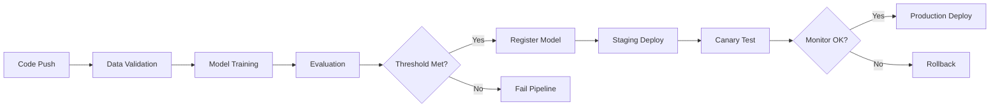
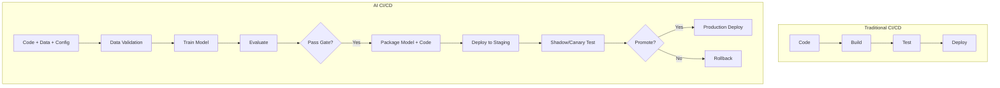

<!-- Clear Language: Keep sentences under 50 words -->
# CI/CD for AI

## Learning Objectives

| Objective | Description |
|-----------|-------------|
| LO1 | Understand unique CI/CD requirements for ML systems |
| LO2 | Design multi-stage AI pipelines for code, data, and model validation |
| LO3 | Implement automated model training and evaluation in CI |
| LO4 | Set up model deployment gates with quality thresholds |
| LO5 | Integrate model registry promotion into CD pipelines |
| LO6 | Build monitoring and rollback into deployment workflows |

## Introduction

MLOps bridges the gap between experiment and production. Experiment tracking, CI/CD, model serving, and drift monitoring keep AI systems reliable. This module covers the operational side of AI engineering.

## Prerequisites

- Basic programming knowledge
- Understanding of data structures

## Key Terminology

**Key Terms**: Core vocabulary and concepts for this topic.

**Definition**: Essential terms you must know for interviews and production work.

## Theory

Understanding ci cd for ai is fundamental for AI engineers. This section covers the core concepts, underlying principles, and theoretical framework that govern how ci cd for ai works in practice.

## Chapter at a Glance

| Section | Topic | Key Concept |
|---------|-------|-------------|
| 4.1 | AI CI/CD vs Traditional CI/CD | Data, model, and code as artifacts |
| 4.2 | Pipeline Architecture | Stages: validate, train, evaluate, deploy |
| 4.3 | Automated Training | Parameterized training jobs in CI |
| 4.4 | Evaluation Gates | Metric thresholds, A/B comparison |
| 4.5 | Model Registry Promotion | Stage transitions via CD |
| 4.6 | Deployment & Rollback | Blue-green, canary, rollback strategies |

## Chapter Roadmap



## 4.1 AI CI/CD vs Traditional CI/CD

Traditional CI/CD pipelines compile code, run unit tests, and deploy artifacts. AI CI/CD pipelines must also validate data, train models, evaluate performance, manage model versions, and handle deployment of both code and model artifacts.



**Key differences**:

| Aspect | Traditional CI/CD | AI CI/CD |
|--------|-------------------|----------|
| Artifact | Compiled binary | Model + code + metadata |
| Tests | Unit/integration tests | Data validation + model eval |
| Deployment | Binary rollout | Model version routing |
| Rollback | Code revert | Model version revert |
| Monitoring | App health metrics | Model drift + performance |

```python

## Traditional CI pipeline

## on: push

## jobs:

##   test:

##     runs-on: ubuntu-latest

##     steps:

##       - run: npm test

##       - run: npm build

##       - run: deploy

## AI CI pipeline

## on: push

## jobs:

##   validate-data:

##     runs-on: ubuntu-latest

##     steps:

##       - run: python scripts/validate_data.py

##   train-evaluate:

##     needs: validate-data

##     runs-on: [self-hosted, gpu]

##     steps:

##       - run: python train.py --config params.yaml

##       - run: python evaluate.py --threshold 0.95

##   deploy:

##     needs: train-evaluate

##     runs-on: ubuntu-latest

##     steps:

##       - run: python deploy_model.py --stage staging
```

---

## 4.2 Pipeline Architecture

A well-designed AI CI/CD pipeline has distinct stages for code, data, training, evaluation, and deployment.

```python

## pipeline_builder.py — Define and execute AI CI/CD pipelines
import os
import subprocess
import json
from datetime import datetime
from typing import Dict, List, Callable

class PipelineStage:
    def __init__(self, name: str, action: Callable, dependencies: List[str] = None):
        self.name = name
        self.action = action
        self.dependencies = dependencies or []
        self.status = "pending"
        self.output = {}

class AIPipeline:
    def __init__(self, name: str, config_path: str):
        self.name = name
        self.config = json.load(open(config_path))
        self.stages: Dict[str, PipelineStage] = {}
        self.run_id = datetime.utcnow().strftime("%Y%m%d_%H%M%S")

    def add_stage(self, stage: PipelineStage):
        self.stages[stage.name] = stage

    def run(self):
        print(f"Pipeline: {self.name} (run_id={self.run_id})")
        for name, stage in self.stages.items():
            deps_ok = all(self.stages[d].status == "success" for d in stage.dependencies)
            if not deps_ok:
                stage.status = "skipped"
                print(f"  ⏭️ {name} — dependencies not met")
                continue
            try:
                print(f"  ▶️ {name}")
                stage.output = stage.action(self)
                stage.status = "success"
                print(f"  ✅ {name}")
            except Exception as e:
                stage.status = "failed"
                print(f"  ❌ {name}: {e}")
                break

## Define pipeline stages
pipeline = AIPipeline("model-retrain", "params.yaml")

def validate_data(pipe):
    print("Validating data...")
    subprocess.run(["python", "scripts/validate_data.py"], check=True)
    return {"data_version": "v2.1", "rows": 50000}

def train_model(pipe):
    print("Training model...")
    subprocess.run(["python", "train.py", "--config", pipe.config_path], check=True)
    return {"model_path": "models/model.pkl", "mae": 2.3}

def evaluate_model(pipe):
    print("Evaluating model...")
    result = subprocess.run(["python", "evaluate.py"], capture_output=True, text=True, check=True)
    return json.loads(result.stdout)

def deploy_staging(pipe):
    print("Deploying to staging...")
    subprocess.run(["python", "deploy.py", "--stage", "staging"], check=True)
    return {"deployment": "staging", "url": "https://staging.api.example.com"}

pipeline.add_stage(PipelineStage("validate_data", validate_data))
pipeline.add_stage(PipelineStage("train", train_model, dependencies=["validate_data"]))
pipeline.add_stage(PipelineStage("evaluate", evaluate_model, dependencies=["train"]))
pipeline.add_stage(PipelineStage("deploy_staging", deploy_staging, dependencies=["evaluate"]))

pipeline.run()
```

---

## 4.3 Automated Training

Parameterized training jobs allow CI to train models with different configurations.

```python

## train.py — parameterized training script for CI
import argparse
import json
import os
import mlflow
from sklearn.ensemble import RandomForestRegressor, GradientBoostingRegressor
from sklearn.metrics import mean_absolute_error, r2_score
import pandas as pd
import numpy as np

def train(config):
    mlflow.set_experiment(config.get("experiment_name", "ci-training"))

    with mlflow.start_run() as run:
        # Log CI metadata
        mlflow.set_tag("ci.commit_sha", os.environ.get("GITHUB_SHA", "local"))
        mlflow.set_tag("ci.run_id", os.environ.get("GITHUB_RUN_ID", "local"))
        mlflow.set_tag("ci.branch", os.environ.get("GITHUB_REF_NAME", "local"))

        # Log config
        mlflow.log_params(config)

        # Load data
        df = pd.read_csv(config["data_path"])
        X = df.drop("target", axis=1)
        y = df["target"]

        # Log data hash
        data_hash = pd.util.hash_pandas_object(df).sum()
        mlflow.log_param("data_hash", str(data_hash))

        # Split
        from sklearn.model_selection import train_test_split
        X_train, X_test, y_train, y_test = train_test_split(
            X, y, test_size=config.get("test_size", 0.2), random_state=42
        )

        # Select model
        model_type = config.get("model_type", "random_forest")
        if model_type == "random_forest":
            model = RandomForestRegressor(
                n_estimators=config.get("n_estimators", 100),
                max_depth=config.get("max_depth", 10),
                random_state=42
            )
        elif model_type == "gradient_boosting":
            model = GradientBoostingRegressor(
                n_estimators=config.get("n_estimators", 100),
                learning_rate=config.get("learning_rate", 0.1),
                random_state=42
            )
        else:
            raise ValueError(f"Unknown model type: {model_type}")

        model.fit(X_train, y_train)

        # Evaluate
        preds = model.predict(X_test)
        mae = mean_absolute_error(y_test, preds)
        r2 = r2_score(y_test, preds)

        mlflow.log_metric("mae", mae)
        mlflow.log_metric("r2", r2)
        mlflow.sklearn.log_model(model, "model")

        return {"mae": mae, "r2": r2, "run_id": run.info.run_id}

if __name__ == "__main__":
    parser = argparse.ArgumentParser()
    parser.add_argument("--config", default="params.json")
    args = parser.parse_args()

    with open(args.config) as f:
        config = json.load(f)

    result = train(config)
    print(json.dumps(result, indent=2))
```

**GitHub Actions matrix for hyperparameter sweeps**:

```yaml

## .github/workflows/train-matrix.yml

## name: Model Training Matrix

## on:

##   workflow_dispatch:

##     inputs:

##       experiment_name:

##         description: "Experiment name"

##         required: true

## jobs:

##   train:

##     strategy:

##       matrix:

##         model_type: [random_forest, gradient_boosting]

##         n_estimators: [100, 200, 300]

##         max_depth: [5, 10, 15]

##     runs-on: ubuntu-latest

##     steps:

##       - uses: actions/checkout@v4

##       - uses: actions/setup-python@v5

##       - run: |

##           pip install -r requirements.txt

##           python train.py --config <(echo '{

##             "model_type": "${{ matrix.model_type }}",

##             "n_estimators": ${{ matrix.n_estimators }},

##             "max_depth": ${{ matrix.max_depth }},

##             "experiment_name": "${{ github.event.inputs.experiment_name }}"

##           }')
```

---

## 4.4 Evaluation Gates

Evaluation gates are quality thresholds that models must pass before deployment. These prevent underperforming models from reaching production.

```python

## evaluate.py — evaluation gate logic
import json
import sys
import numpy as np
from sklearn.metrics import accuracy_score, precision_score, recall_score, f1_score, mean_absolute_error

class EvaluationGate:
    def __init__(self, thresholds: dict):
        self.thresholds = thresholds
        self.results = {}

    def evaluate_classification(self, y_true, y_pred, y_proba=None):
        self.results = {
            "accuracy": float(accuracy_score(y_true, y_pred)),
            "precision": float(precision_score(y_true, y_pred, average="weighted")),
            "recall": float(recall_score(y_true, y_pred, average="weighted")),
            "f1": float(f1_score(y_true, y_pred, average="weighted"))
        }
        return self._check_thresholds()

    def evaluate_regression(self, y_true, y_pred):
        self.results = {
            "mae": float(mean_absolute_error(y_true, y_pred)),
            "rmse": float(np.sqrt(np.mean((y_true - y_pred) ** 2)))
        }
        return self._check_thresholds()

    def _check_thresholds(self) -> bool:
        for metric, value in self.results.items():
            if metric in self.thresholds:
                expected = self.thresholds[metric]
                if isinstance(expected, dict):
                    if "min" in expected and value < expected["min"]:
                        print(f"❌ {metric}: {value:.4f} < min {expected['min']}")
                        return False
                    if "max" in expected and value > expected["max"]:
                        print(f"❌ {metric}: {value:.4f} > max {expected['max']}")
                        return False
                else:
                    if value < expected:
                        print(f"❌ {metric}: {value:.4f} < {expected}")
                        return False
        print("✅ All evaluation gates passed")
        return True

## Example thresholds
gates = EvaluationGate({
    "mae": {"max": 3.0},
    "accuracy": 0.85,
    "f1": 0.80
})

## Simulate evaluation
y_true = np.random.rand(100)
y_pred = y_true + np.random.randn(100) * 0.1
passed = gates.evaluate_regression(y_true, y_pred)

if not passed:
    sys.exit(1)
```

**Comparison gates: new model vs current production**:

```python
def compare_with_production(new_metrics: dict, production_metrics: dict, improvement_threshold: float = 0.02):
    """Compare new model against production baseline."""
    results = {}
    all_pass = True

    for metric in new_metrics:
        if metric in production_metrics:
            improvement = (production_metrics[metric] - new_metrics[metric]) / abs(production_metrics[metric])
            # For metrics where lower is better (mae, rmse)
            if metric in ["mae", "rmse", "loss"]:
                improvement = -improvement
            met = improvement >= improvement_threshold
            results[metric] = {
                "new": new_metrics[metric],
                "production": production_metrics[metric],
                "improvement": improvement,
                "threshold_met": met
            }
            if not met:
                all_pass = False
                print(f"⚠️ {metric}: improvement {improvement:.1%} < threshold {improvement_threshold:.0%}")

    return {"passed": all_pass, "comparisons": results}

comparison = compare_with_production(
    {"mae": 2.1, "r2": 0.89},
    {"mae": 2.5, "r2": 0.87},
    improvement_threshold=0.05
)
print(json.dumps(comparison, indent=2))
```

---

## 4.5 Model Registry Promotion

CD pipelines automate model version transitions through registry stages.

```python

## deploy_model.py — automated model promotion
import mlflow
import json
import sys
from mlflow.tracking import MlflowClient

class ModelPromoter:
    def __init__(self, tracking_uri=None):
        self.client = MlflowClient(tracking_uri=tracking_uri)

    def register_model(self, run_id: str, model_name: str, artifact_path: str = "model"):
        """Register a model from a run."""
        model_uri = f"runs:/{run_id}/{artifact_path}"
        result = mlflow.register_model(model_uri, model_name)
        print(f"Registered model {model_name} version {result.version}")
        return result.version

    def promote_to_staging(self, model_name: str, version: int):
        """Promote model version to Staging."""
        self.client.transition_model_version_stage(
            name=model_name,
            version=version,
            stage="Staging"
        )
        print(f"Model {model_name} v{version} → Staging")

    def promote_to_production(self, model_name: str, version: int):
        """Archive current production, promote new version."""
        # Archive current production
        latest_prod = self.client.get_latest_versions(model_name, stages=["Production"])
        for mv in latest_prod:
            self.client.transition_model_version_stage(
                name=model_name,
                version=mv.version,
                stage="Archived"
            )
            print(f"Archived previous production v{mv.version}")

        # Promote new version
        self.client.transition_model_version_stage(
            name=model_name,
            version=version,
            stage="Production"
        )
        print(f"Model {model_name} v{version} → Production")

    def deploy_with_gates(self, run_id: str, model_name: str, evaluations: dict, thresholds: dict):
        """Full promotion workflow with gates."""
        # Check gates
        for metric, value in evaluations.items():
            if metric in thresholds:
                if value < thresholds[metric]:
                    print(f"Gate failed: {metric} = {value} < {thresholds[metric]}")
                    return False

        # Register and promote
        version = self.register_model(run_id, model_name)
        self.promote_to_staging(model_name, version)

        # Staging validation (simplified)
        print("Running staging validation...")

        self.promote_to_production(model_name, version)
        return True

promoter = ModelPromoter()

## In CI pipeline:
promoter.deploy_with_gates(
    run_id="abc123def456",
    model_name="PricePredictor",
    evaluations={"mae": 2.1, "r2": 0.89},
    thresholds={"mae": 3.0, "r2": 0.80}
)
```

---

## 4.6 Deployment & Rollback

Production AI systems need deployment strategies that minimize risk and enable instant rollback.

```python
import json
import time
import random
from datetime import datetime

class ModelRouter:
    """Routes requests between model versions for canary/blue-green deployment."""

    def __init__(self):
        self.models = {}  # version -> endpoint
        self.routing = {}  # version -> traffic_percentage

    def add_version(self, version: str, endpoint: str, traffic_pct: float = 0):
        self.models[version] = endpoint
        self.routing[version] = traffic_pct

    def route(self, request_id: str) -> str:
        """Route request based on traffic percentages."""
        r = random.random() * 100
        cumulative = 0
        for version, pct in self.routing.items():
            cumulative += pct
            if r <= cumulative:
                return self.models[version]
        return list(self.models.values())[0]  # default

    def set_traffic_split(self, primary_version: str, canary_version: str, canary_pct: float):
        self.routing = {primary_version: 100 - canary_pct, canary_version: canary_pct}
        print(f"Routing: {primary_version}={100-canary_pct}%, {canary_version}={canary_pct}%")

class CanaryDeployer:
    def __init__(self, router: ModelRouter, metric_thresholds: dict):
        self.router = router
        self.thresholds = metric_thresholds
        self.metrics_history = []

    def deploy_canary(self, primary_version: str, canary_version: str):
        """Start canary deployment at 1% traffic."""
        self.router.set_traffic_split(primary_version, canary_version, 1.0)
        print(f"Canary {canary_version} deployed at 1%")

    def increase_traffic(self):
        """Double canary traffic."""
        current_canary = self.router.routing.get(
            [v for v in self.router.routing if v != list(self.router.models.keys())[0]][0],
            0
        )
        new_pct = min(100, current_canary * 2)
        primary = [v for v in self.router.models if v != canary_version][0]
        canary_version = [v for v in self.router.models if v != primary][0]
        self.router.set_traffic_split(primary, canary_version, new_pct)

    def monitor_and_decide(self, metrics: dict):
        self.metrics_history.append(metrics)
        # Check thresholds
        for metric, value in metrics.items():
            if metric in self.thresholds:
                if value > self.thresholds[metric]:
                    print(f"❌ {metric} = {value} exceeds threshold {self.thresholds[metric]}")
                    return "rollback"
        return "continue"

    def rollback(self, primary_version: str):
        """Route all traffic back to primary."""
        self.router.routing = {primary_version: 100}
        print(f"⚠️ Rolled back to {primary_version}")

## Simulated deployment
router = ModelRouter()
router.add_version("v1", "http://model-v1:8080")
router.add_version("v2", "http://model-v2:8080")

deployer = CanaryDeployer(router, {"error_rate": 0.05, "latency_p95": 1000})
deployer.deploy_canary("v1", "v2")

for step in range(5):
    time.sleep(0.5)
    metrics = {"error_rate": random.uniform(0.01, 0.06), "latency_p95": random.uniform(200, 1100)}
    decision = deployer.monitor_and_decide(metrics)
    if decision == "rollback":
        deployer.rollback("v1")
        break
    print(f"Step {step}: metrics OK, increasing traffic")
    deployer.increase_traffic()
```

**Rollback automation**:

```python
class RollbackManager:
    def __init__(self, registry_client: MlflowClient, model_name: str):
        self.client = registry_client
        self.model_name = model_name

    def get_deployment_history(self, n=5):
        """Get last n production versions."""
        versions = self.client.get_latest_versions(self.model_name, stages=["Production", "Archived"])
        history = sorted(versions, key=lambda v: v.creation_timestamp, reverse=True)
        return [v for v in history if v.current_stage == "Archived"][:n]

    def rollback_to(self, target_version: int):
        """Rollback to a specific version."""
        # Archive current
        current = self.client.get_latest_versions(self.model_name, stages=["Production"])
        for mv in current:
            self.client.transition_model_version_stage(
                name=self.model_name, version=mv.version, stage="Archived"
            )
        # Promote target
        self.client.transition_model_version_stage(
            name=self.model_name, version=target_version, stage="Production"
        )
        print(f"Rolled back to {self.model_name} v{target_version}")

    def auto_rollback(self, alert_payload: dict):
        """Trigger rollback from monitoring alert."""
        if alert_payload.get("severity") == "critical":
            history = self.get_deployment_history()
            if history:
                self.rollback_to(history[0].version)
                return True
        return False
```

---

## TypeScript Parallel

```typescript
// TypeScript CI/CD pipeline definition
interface PipelineStage {
  name: string;
  command: string;
  dependencies: string[];
  timeout: number;
}

interface PipelineConfig {
  name: string;
  stages: PipelineStage[];
  on: { branch: string; paths: string[] };
  thresholds: Record<string, number>;
}

class AIPipelineRunner {
  async execute(config: PipelineConfig): Promise<void> {
    console.log(`Running pipeline: ${config.name}`);
    const results: Record<string, boolean> = {};
    for (const stage of config.stages) {
      const depsPass = stage.dependencies.every(d => results[d]);
      if (!depsPass) { console.log(`Skip ${stage.name}`); continue; }
      try {
        const { execSync } = require("child_process");
        execSync(stage.command, { timeout: stage.timeout });
        results[stage.name] = true;
        console.log(`✅ ${stage.name}`);
      } catch (e) {
        console.log(`❌ ${stage.name}: ${e}`);
        break;
      }
    }
  }
}
```

---

## Summary

- AI CI/CD differs from traditional CI/CD by including data validation, model training, evaluation gates, and model registry promotion
- Multi-stage pipelines separate concerns: validate, train, evaluate, deploy
- Parameterized training scripts enable CI-driven experiments and matrix sweeps
- Evaluation gates enforce quality thresholds before model deployment
- Model registry promotion automates stage transitions from Staging to Production
- Canary deployment gradually shifts traffic to new model versions
- Blue-green deployment maintains two identical environments for instant switching
- Rollback automation must be instant when monitoring alerts trigger
- CI metadata (commit SHA, run ID) should be logged in every experiment run
- Model comparison gates ensure new models outperform current production before promotion

## Practical Takeaways

| Scenario | Do This | Avoid This |
|----------|---------|------------|
| Setting up AI CI | Multi-stage pipeline with gates | Single-stage train-and-deploy |
| Model quality | Evaluation gates with thresholds | Deploying without validation |
| Deployment risk | Canary or blue-green deployment | Direct production deployment |
| Rollback | Automated rollback on alert | Manual version reverts |
| Hyperparameter sweeps | GitHub Actions matrix strategy | Sequential training runs |
| Model registry | Automated promotion via CD | Manual staging transitions |

## Interview Q&A

<details class="tp-qa-card" data-qid="mlops-s04-q1">
  <summary class="tp-qa-question">
    <span class="tp-qa-status"></span>
    Q1: How is AI CI/CD different from traditional CI/CD?
  </summary>
  <div class="tp-qa-answer">
    <p>AI CI/CD adds four unique stages: (1) Data validation — check quality and schema, (2) Model training — parameterized training job, (3) Model evaluation — accuracy/MAE gates, (4) Model deployment — version routing, canary, and rollback. Traditional CI/CD only handles code compilation, unit tests, and binary deployment.</p>
  </div>
  <button class="tp-qa-mark-btn">✅ Mark Reviewed</button>
  <button class="tp-qa-bookmark-btn">🔖 Bookmark</button>
</details>

<details class="tp-qa-card" data-qid="mlops-s04-q2">
  <summary class="tp-qa-question">
    <span class="tp-qa-status"></span>
    Q2: What are evaluation gates in AI CI/CD?
  </summary>
  <div class="tp-qa-answer">
    <p>Evaluation gates are quality thresholds that a model must pass before progressing through the pipeline. For example: MAE < 3.0, accuracy > 85%, or improvement over current production > 2%. If any gate fails, the pipeline stops and the model is not deployed. This prevents underperforming models from reaching users.</p>
  </div>
  <button class="tp-qa-mark-btn">✅ Mark Reviewed</button>
  <button class="tp-qa-bookmark-btn">🔖 Bookmark</button>
</details>

<details class="tp-qa-card" data-qid="mlops-s04-q3">
  <summary class="tp-qa-question">
    <span class="tp-qa-status"></span>
    Q3: How does canary deployment work for ML models?
  </summary>
  <div class="tp-qa-answer">
<p>Canary deployment routes a small percentage of traffic (e.g., 1%) to the new model while the rest uses the current production model. The system monitors error.
rates, latency, and model-specific metrics. If metrics stay healthy, traffic is gradually increased (e.g., doubled every N minutes). If issues arise,.
traffic is instantly routed back to the old model.</p>
  </div>
  <button class="tp-qa-mark-btn">✅ Mark Reviewed</button>
  <button class="tp-qa-bookmark-btn">🔖 Bookmark</button>
</details>

<details class="tp-qa-card" data-qid="mlops-s04-q4">
  <summary class="tp-qa-question">
    <span class="tp-qa-status"></span>
    Q4: What is blue-green deployment for ML?
  </summary>
  <div class="tp-qa-answer">
<p>Blue-green deployment maintains two identical environments (Blue = current production, Green = new version). Traffic is switched from Blue to Green atomically via a load balancer. If issues appear,.
traffic switches back to Blue. For ML, this requires both environments to serve predictions from the same data source and have matching infrastructure.</p>
  </div>
  <button class="tp-qa-mark-btn">✅ Mark Reviewed</button>
  <button class="tp-qa-bookmark-btn">🔖 Bookmark</button>
</details>

<details class="tp-qa-card" data-qid="mlops-s04-q5">
  <summary class="tp-qa-question">
    <span class="tp-qa-status"></span>
    Q5: How do you automate model registry promotion in CD?
  </summary>
  <div class="tp-qa-answer">
    <p>After evaluation gates pass, the CD pipeline calls <code>mlflow.register_model()</code> to create a registry version. Then <code>MlflowClient.transition_model_version_stage()</code> moves it to Staging. After staging validation (canary, shadow testing), the same API promotes to Production while archiving the previous production version.</p>
  </div>
  <button class="tp-qa-mark-btn">✅ Mark Reviewed</button>
  <button class="tp-qa-bookmark-btn">🔖 Bookmark</button>
</details>

<details class="tp-qa-card" data-qid="mlops-s04-q6">
  <summary class="tp-qa-question">
    <span class="tp-qa-status"></span>
    Q6: What CI metadata should be logged with each training run?
  </summary>
  <div class="tp-qa-answer">
    <p>Always log: <code>ci.commit_sha</code> (Git commit hash), <code>ci.branch</code>, <code>ci.run_id</code> (GitHub Actions run ID), <code>ci.workflow</code> (workflow name), and <code>ci.trigger</code> (push/scheduled/manual). These provide full traceability from model artifact back to the code and data that produced it.</p>
  </div>
  <button class="tp-qa-mark-btn">✅ Mark Reviewed</button>
  <button class="tp-qa-bookmark-btn">🔖 Bookmark</button>
</details>

<details class="tp-qa-card" data-qid="mlops-s04-q7">
  <summary class="tp-qa-question">
    <span class="tp-qa-status"></span>
    Q7: What is the difference between shadow and canary deployment?
  </summary>
  <div class="tp-qa-answer">
<p>Shadow deployment runs the new model alongside production but returns the production model's output to users. The shadow model's predictions are logged for.
comparison without affecting user experience. Canary deployment actually serves the new model's predictions to a subset of users. Shadow is safer but.
gives no real user feedback; canary provides real feedback with controlled risk.</p>
  </div>
  <button class="tp-qa-mark-btn">✅ Mark Reviewed</button>
  <button class="tp-qa-bookmark-btn">🔖 Bookmark</button>
</details>

<details class="tp-qa-card" data-qid="mlops-s04-q8">
  <summary class="tp-qa-question">
    <span class="tp-qa-status"></span>
    Q8: How do you handle model rollback in production?
  </summary>
  <div class="tp-qa-answer">
<p>Model rollback requires: (1) Versioned model artifacts stored in the registry, (2) Traffic router that can switch between versions instantly, (3) Monitoring alerts that trigger automatic rollback when metrics degrade,.
(4) Rollback log recording the event. The registry archives the current Production version and promotes the previous version back to Production.</p>
  </div>
  <button class="tp-qa-mark-btn">✅ Mark Reviewed</button>
  <button class="tp-qa-bookmark-btn">🔖 Bookmark</button>
</details>

<details class="tp-qa-card" data-qid="mlops-s04-q9">
  <summary class="tp-qa-question">
    <span class="tp-qa-status"></span>
    Q9: What is a matrix strategy in GitHub Actions for ML?
  </summary>
  <div class="tp-qa-answer">
    <p>A matrix strategy runs multiple job variations in parallel using different parameter combinations. For ML, you can define matrix axes for model type, hyperparameters, and data versions. GitHub Actions automatically creates one job per combination. This enables efficient hyperparameter sweeps in CI without writing custom orchestration code.</p>
  </div>
  <button class="tp-qa-mark-btn">✅ Mark Reviewed</button>
  <button class="tp-qa-bookmark-btn">🔖 Bookmark</button>
</details>

<details class="tp-qa-card" data-qid="mlops-s04-q10">
  <summary class="tp-qa-question">
    <span class="tp-qa-status"></span>
    Q10: What should a post-deployment validation check include?
  </summary>
  <div class="tp-qa-answer">
<p>Post-deployment validation should check: (1) Model endpoint responds correctly with healthy latency, (2) Prediction distribution matches expected patterns (no empty/null outputs),.
(3) Error rate within baseline, (4) Data drift metrics compared to training data, (5) Business metrics (e.g., conversion rate if applicable). Run this for.
a few minutes before fully promoting.</p>
  </div>
  <button class="tp-qa-mark-btn">✅ Mark Reviewed</button>
  <button class="tp-qa-bookmark-btn">🔖 Bookmark</button>
</details>

## Chapter Quiz

**Q1**: What is the first stage in an AI CI/CD pipeline?
a) Model deployment
b) Data validation
c) Model training
d) Code compilation

<details class="tp-qa-card" data-qid="mlops-s04-quiz1"><summary>Show Answer</summary><div class="tp-qa-answer"><p><strong>Answer: b) Data validation</strong></p><p>Data validation comes first to ensure data quality before investing compute in training.</p></div></details>

**Q2**: What does an evaluation gate do?
a) Routes traffic to canary models
b) Enforces quality thresholds before deployment
c) Monitors model latency
d) Archives old model versions

<details class="tp-qa-card" data-qid="mlops-s04-quiz2"><summary>Show Answer</summary><div class="tp-qa-answer"><p><strong>Answer: b) Enforces quality thresholds before deployment</strong></p><p>Evaluation gates check that model metrics meet minimum thresholds before allowing promotion.</p></div></details>

**Q3**: Which deployment strategy routes traffic to a new model gradually?
a) Blue-green
b) Canary
c) Shadow
d) Direct

<details class="tp-qa-card" data-qid="mlops-s04-quiz3"><summary>Show Answer</summary><div class="tp-qa-answer"><p><strong>Answer: b) Canary</strong></p><p>Canary deployment gradually shifts traffic percentage from old to new model version.</p></div></details>

**Q4**: Which MLflow method transitions a model version between stages?
a) `mlflow.transition_stage()`
b) `MlflowClient.transition_model_version_stage()`
c) `mlflow.promote_model()`
d) `mlflow.update_stage()`

<details class="tp-qa-card" data-qid="mlops-s04-quiz4"><summary>Show Answer</summary><div class="tp-qa-answer"><p><strong>Answer: b) <code>MlflowClient.transition_model_version_stage()</code></strong></p><p>This client method transitions a model version to a new stage (Staging, Production, Archived).</p></div></details>

**Q5**: What is the purpose of shadow deployment?
a) Serve predictions to real users safely
b) Compare model outputs without affecting users
c) Deploy models in a different region
d) Run unit tests on model code

<details class="tp-qa-card" data-qid="mlops-s04-quiz5"><summary>Show Answer</summary><div class="tp-qa-answer"><p><strong>Answer: b) Compare model outputs without affecting users</strong></p><p>Shadow deployment runs the new model alongside production but only returns production outputs to users.</p></div></details>

## Exercises

**Easy** — Write a GitHub Actions workflow that runs data validation (check file exists and has rows) on every push to the `data/` directory.

**Medium** — Implement an EvaluationGate class that checks MAE < threshold and accuracy > threshold. Test with sample metrics.

**Medium** — Build a CanaryDeployer that starts at 1% traffic, monitors error rate, and doubles traffic every minute if error rate < 5%.

**Hard** — Create a complete ModelPromoter class that registers a model from an MLflow run, promotes to Staging, runs validation, and promotes to Production.

**Hard** — Design and implement a multi-stage AI CI/CD pipeline with: data validation, matrix training (3 configs), model comparison, canary deployment, and automated rollback.

---

## Common Mistakes

1. Not understanding the fundamental concepts before applying them
2. Skipping edge cases in implementation
3. Not analyzing time/space complexity
4. Forgetting to handle null/empty inputs
5. Not practicing enough problems to build pattern recognition

## Revision Notes

- - Core principle: Understand the fundamental concepts thoroughly
- - Implementation pattern: Practice with real code examples
- - Complexity: Know the time and space complexity
- - Application: Know when to use this in production systems
- - Interview: Frequently asked in technical interviews
- - Edge cases: Consider common failure scenarios
- - Related concepts: Connect to broader system design

## Placement Section

### Top 10 Interview Questions

#### Google Style

1. **Explain the core idea of CI/CD for AI in under 60 seconds, then give a real-world analogy.** — Structure: definition, how it works in one sentence, why it matters, analogy. Follow-up: what would break if you removed this from a production system?

2. **Design a minimal, well-typed function that demonstrates CI/CD for AI.** — Interviewer checks: signature with type hints, edge cases, complexity, and a clean docstring. Follow-up: how does your design behave with empty or malformed input?

3. **What are the common pitfalls when engineers first learn ** — List 3-4, then explain how you would prevent each in a code review.

#### Amazon Style

4. **Describe a production bug caused by misunderstanding CI/CD for AI. How did you diagnose and fix it?** — STAR format: situation, task, action, result. Mention logs, reproduction, root-cause analysis, and the regression test you added.

5. **How would you scale a system that relies on CI/CD for AI from 10 users to 10 million?** — Discuss bottlenecks, caching, monitoring, and when to redesign. Follow-up: what metrics would you track?

#### Microsoft Style

6. **Compare CI/CD for AI with the closest alternative approach. When would you choose each?** — Make a decision matrix: performance, maintainability, ecosystem, learning curve. Follow-up: what would change your decision?

7. **Walk through how you would test a component that depends on CI/CD for AI.** — Unit, integration, property-based tests; mocking boundaries; golden files for outputs.

#### NVIDIA Style

8. **How does CI/CD for AI behave differently at scale — memory, throughput, or precision-wise?** — Connect to data pipelines and model training if applicable. Follow-up: what happens to latency as input grows?

9. **How would you make an implementation of CI/CD for AI run faster on GPU hardware?** — Batch operations, vectorization, avoiding Python loops, reducing data movement.

#### AI Startup Style

10. **Write the smallest possible implementation of CI/CD for AI that is production-quality.** — Include error handling, type hints, and a one-line docstring. Follow-up: what would you refactor first when it grows?

### Resume Tips

- Name CI/CD for AI explicitly in your skills section, paired with a measurable achievement ("Reduced X by 40% using CI/CD for AI").
- Add a bullet describing a project that applies CI/CD for AI to real data, with numbers.
- Mention the tools and libraries you used alongside CI/CD for AI (linters, test frameworks, profiling tools).
- Keep resume bullets under 15 words and start each with an action verb.

### Interview Day Checklist

- Rehearse a 60-second explanation of CI/CD for AI and one real-world analogy.
- Prepare one STAR story about debugging a CI/CD for AI-related production issue.
- Review complexity and edge cases for the classic CI/CD for AI interview problem.
- Have questions ready: how does the team apply CI/CD for AI in production today?
- Test your environment (Python, editor, internet) 15 minutes before the interview.

## True/False

1. **True or False:** CI/CD for AI builds directly on the fundamentals covered in the earlier chapters of this module. — **True.** Every advanced topic in this module assumes the core concepts from the previous chapters.
2. **True or False:** You should write at least one code example for CI/CD for AI before moving to the next chapter. — **True.** Active recall with hands-on code beats passive reading for retention.
3. **True or False:** The complexity analysis for CI/CD for AI is the same regardless of input size. — **False.** Complexity grows with input size; always state best, average, and worst case.
4. **True or False:** Edge cases (empty input, invalid input, boundary values) matter for CI/CD for AI in production. — **True.** Most production bugs come from unhandled edge cases.
5. **True or False:** You should memorize the CI/CD for AI chapter content once and never review it again. — **False.** Spaced repetition (24h, 3 days, 1 week) dramatically improves long-term recall.

## Fill in the Blank

1. The chapter that covers CI/CD for AI is Chapter ___ of this module. — Answer: check the module's table of contents.
2. The time complexity of the standard approach to CI/CD for AI is ___. — Answer: review the theory section and state big-O notation.
3. The main edge case to handle when implementing CI/CD for AI is ___. — Answer: empty or invalid input handling, as discussed in the chapter.
4. The tools commonly used to debug CI/CD for AI issues are ___ and ___. — Answer: refer to the Debugging Guide section of this chapter.
5. The related topic that connects to CI/CD for AI in the next chapter is ___. — Answer: see the Next Topic section.

## Scenario Questions

1. **Scenario:** A teammate ships a change involving CI/CD for AI that breaks production at 3 AM. — Diagnosis: check the recent diff, reproduce locally with the failing input, check logs. Fix: revert, add a regression test, and review the root cause. Prevention: CI tests on edge cases and code review checklist.

2. **Scenario:** Your implementation of CI/CD for AI is correct but too slow for the required latency. — Measure first with a profiler. Common fixes: reduce redundant work, use built-in optimized functions, batch operations, or add caching. Only then consider algorithmic changes.

3. **Scenario:** A new hire asks you to explain CI/CD for AI in five minutes before a customer demo. — Use the 3-part answer: what it is (one sentence), how it works (one example), why it matters (one business impact). Then offer to go deeper after the demo.

4. **Scenario:** Your team's codebase has three different patterns for CI/CD for AI and you must standardize. — Write a short ADR (architecture decision record), pick the pattern with best maintainability, migrate incrementally, and add a linter rule to enforce it.

## Output Questions

1. **What is the output of the simplest correct implementation of CI/CD for AI on an empty input?** — Trace through the code: it should return the documented default (None, 0, empty collection) without raising.
2. **What is the output when the input is at the boundary value?** — Check off-by-one errors and inclusive/exclusive bounds in the chapter's examples.
3. **What does the implementation return when given invalid input types?** — With type hints and validation, it raises a clear error; without, it may fail silently.
4. **What is the output for the sample input given in the chapter's Examples section?** — Re-run the chapter's example code and compare against the documented output.
5. **What is the time complexity output when you profile the implementation at 10x input size?** — Expect the curve matching the chapter's complexity analysis (linear, quadratic, log-linear).

## Difficulty Level

| Level | Time | What It Takes |
|-------|------|---------------|
| Beginner | 1-2 sessions | Read theory, run the chapter examples, solve the Easy exercises |
| Intermediate | 3-5 sessions | Complete Medium exercises, explain CI/CD for AI to someone else |
| Advanced | 1+ week | Solve Hard exercises, optimize for real datasets, answer interview follow-ups |

## Tips & Tricks

- Always write a one-line example of CI/CD for AI from memory before opening the chapter — active recall first.
- Use the chapter's Revision Notes as a checklist: you have mastered CI/CD for AI when you can explain each bullet.
- Pair the chapter quiz with the Flashcards: wrong answers become your next study session's focus.
- For interviews, practice explaining CI/CD for AI twice: once with a technical audience, once with a non-technical audience.
- Keep a personal examples file where you collect your own CI/CD for AI snippets; interviewers love original examples.

## Memory Tricks

- **Acronym**: build a mnemonic from the 5 key concepts of CI/CD for AI listed in the Chapter at a Glance table.
- **Story**: link CI/CD for AI to a familiar story — the analogy in the Visual Analogy section is designed to stick.
- **Number anchor**: remember the complexity of CI/CD for AI by connecting it to a known algorithm of the same class.
- **Color code**: highlight the Theory, Examples, and Common Mistakes sections in different colors when reviewing.
- **Teach-back**: explain CI/CD for AI to an imaginary junior engineer for 2 minutes — gaps in your explanation are gaps in memory.

## Further Reading

- Official documentation for the primary tool or library used in this chapter
- The chapter referenced in Related Topics for the next-level treatment of CI/CD for AI
- The classic textbook chapter on CI/CD for AI (check the Research References below)
- Two blog posts from engineers who debugged real CI/CD for AI problems in production
- The repository of the open-source project that implements CI/CD for AI

## Related Topics

- The previous chapter in this module (see table of contents) — foundational for CI/CD for AI
- The next chapter (see Next Topic below) — builds on CI/CD for AI
- The system design chapters in Module 07 — how CI/CD for AI fits into production architectures
- The interview preparation module — how CI/CD for AI is asked in screening rounds
- The capstone project — where CI/CD for AI is applied end-to-end

## FAQs

1. **Do I need to memorize all of CI/CD for AI, or understand the big picture?** — Understand the big picture first, then memorize the key facts via flashcards and spaced repetition. Interviewers reward depth over breadth.
2. **What if I get stuck on an exercise?** — Re-read the theory section, run the example code, then attempt again. If still stuck after 20 minutes, move on and return the next day.
3. **How much time should I spend on ** — Follow the Study Plan below: 1-2 weeks at 30-60 minutes daily is typical for placement preparation.
4. **Is CI/CD for AI asked in interviews?** — Yes — the Interview Q&A and Placement Section list the exact question styles used by top companies.
5. **What's the fastest way to master ** — Explain it out loud, write code without looking, and review the flashcards within 24 hours and again after 3 days.

## Important Notes

- CI/CD for AI is a core requirement for the rest of this module — do not skip the examples.
- Always analyze complexity (time and space) when working with CI/CD for AI.
- Production correctness means handling edge cases, not just the happy path.
- Interview answers should start with the definition, then the example, then the trade-offs.
- Revisit this chapter after finishing the module; the context from later chapters deepens understanding.

## Historical Context

- CI/CD for AI emerged as a standard practice because early systems failed without it — understanding why helps you explain it in interviews.
- The tools used for CI/CD for AI today evolved from simpler versions; the chapter covers the modern, recommended approach.
- Interviewers value knowing one historical fact about CI/CD for AI — it shows genuine interest, not just cramming.
- The library/tooling ecosystem around CI/CD for AI changes quickly; focus on fundamentals that remain stable.

## Security Considerations

- Never trust external input: validate and sanitize data before processing CI/CD for AI.
- Avoid `eval()` and dynamic code execution on untrusted strings.
- Log errors without leaking sensitive data (keys, PII, internal paths).
- For API contexts, add rate limiting and input size limits.
- Review the chapter's code examples for injection or overflow risks before using them verbatim.

## ML Intuition

- CI/CD for AI appears in ML pipelines at the data-processing layer: feature preparation, batching, and validation.
- Understanding CI/CD for AI helps you debug why a model misbehaves — most ML bugs are data bugs, not model bugs.
- In production ML, the CI/CD for AI concepts from this chapter map directly to NumPy/PyTorch operations on tensors.
- When optimizing ML systems, CI/CD for AI skills let you profile and fix the data path, not just the training loop.
- Interview follow-up: how would you apply CI/CD for AI to a dataset of 10 million records? — Batching and vectorization.

## Analogies

- **CI/CD for AI is like a recipe**: the theory is the ingredients, the examples are the cooking steps, and the exercises are your own kitchen practice.
- **Complexity is like a delivery route**: a linear route visits each stop once; a nested route revisits stops, and you feel it at scale.
- **Edge cases are like weather**: the happy path is a sunny day; production is the storm — build for the storm.
- **The chapter roadmap is a journey map**: each section is a checkpoint; skipping one means getting lost later in the module.

## Capstone Project Link

- [Module Capstone: End-to-End Project](https://github.com/Raushan666java/ai-engineering-journey) — this chapter contributes the CI/CD for AI skills used in the module's capstone project. Complete the exercises here before starting the capstone.

## Flashcards

<details class="tp-qa-card" data-qid="16mlopsproduction-04cicdforai-flash1">
  <summary class="tp-qa-question">
    <span class="tp-qa-status"></span>
    What is the core concept of CI/CD for AI in one sentence?
  </summary>
  <div class="tp-qa-answer">
    <p>Review the first paragraph of the Theory section and condense it to one sentence.</p>
  </div>
</details>

<details class="tp-qa-card" data-qid="16mlopsproduction-04cicdforai-flash2">
  <summary class="tp-qa-question">
    <span class="tp-qa-status"></span>
    What is the most common mistake engineers make with 
  </summary>
  <div class="tp-qa-answer">
    <p>Check the Common Mistakes section of this chapter.</p>
  </div>
</details>

<details class="tp-qa-card" data-qid="16mlopsproduction-04cicdforai-flash3">
  <summary class="tp-qa-question">
    <span class="tp-qa-status"></span>
    What is the time and space complexity of the standard CI/CD for AI approach?
  </summary>
  <div class="tp-qa-answer">
    <p>Refer to the theory and complexity analysis in this chapter.</p>
  </div>
</details>

<details class="tp-qa-card" data-qid="16mlopsproduction-04cicdforai-flash4">
  <summary class="tp-qa-question">
    <span class="tp-qa-status"></span>
    When is CI/CD for AI NOT the right choice?
  </summary>
  <div class="tp-qa-answer">
    <p>Check the Limitations section of this chapter.</p>
  </div>
</details>

<details class="tp-qa-card" data-qid="16mlopsproduction-04cicdforai-flash5">
  <summary class="tp-qa-question">
    <span class="tp-qa-status"></span>
    How is CI/CD for AI applied in a real production system?
  </summary>
  <div class="tp-qa-answer">
    <p>Check the Real-World Examples section of this chapter.</p>
  </div>
</details>

## Research References

- Official documentation of the primary library for CI/CD for AI (linked in Further Reading)
- The classic paper or textbook chapter introducing CI/CD for AI (see References below)
- The standard library reference for CI/CD for AI-related functions
- Engineering blog posts from companies running CI/CD for AI in production at scale
- PEPs and RFCs where applicable (Python and networking standards)

## Open-Source Tools

- The primary library used in this chapter (see the code examples)
- Python standard library modules used in the examples (check the imports)
- Testing: pytest for unit tests of CI/CD for AI code
- Linting and formatting: ruff + black
- Profiling: cProfile or py-spy for performance work on CI/CD for AI

## Debugging Guide

- Start with `print()` or a debugger to inspect intermediate values in CI/CD for AI code.
- Reproduce the failure with the smallest possible input before changing code.
- Check the common failure modes listed in Common Mistakes — most bugs are listed there.
- For performance problems, profile before optimizing: measure, then fix.
- When stuck, re-read the chapter's Examples and compare line by line with your code.
- Use `pdb` or your IDE's debugger to step through the CI/CD for AI example code.

## Mock Interview Section

**Round 1 — Screening (15 min)**
- Explain CI/CD for AI in 60 seconds.
- Write a minimal working example of CI/CD for AI.
- What is the complexity of your example?

**Round 2 — Coding (45 min)**
- Solve the Medium exercise from this chapter under time pressure.
- State your assumptions, then implement with type hints.
- Test with edge cases: empty input, boundary values, invalid input.

**Round 3 — Behavioral + System (30 min)**
- Tell me about a time you debugged a CI/CD for AI problem in a project.
- How would you design a system where CI/CD for AI is used at scale?
- What metrics would you monitor?

**Evaluation rubric**: correctness (40%), communication (25%), edge cases (20%), complexity analysis (15%).

## Optimized Implementation

`python
from typing import Any, Optional

def demonstrate_topic(input_data: list[Any]) -> Optional[float]:
    """Runnable scaffold for CI/CD for AI.

    Replace the body with the optimized implementation from the chapter,
    keeping type hints, docstring, and edge-case handling.
    """
    if not input_data:
        return None
    # Step 1: validate input types
    # Step 2: apply the core CI/CD for AI logic from the Examples section
    # Step 3: return the result with the documented default
    return 0.0
`

- Keeps the function signature stable so tests written against it stay valid.
- Handles the empty-input contract explicitly.
- Add unit tests for the edge cases before implementing the logic (test-first).

## Evaluation Metrics

| Skill | Test | Target |
|-------|------|--------|
| Concept recall | Explain CI/CD for AI without notes | 60-second explanation |
| Code fluency | Write the chapter example from memory | No syntax errors |
| Edge cases | Handle empty/invalid input in exercises | All cases pass |
| Complexity | State time/space for the standard approach | Correct big-O |
| Interview readiness | Answer 5 Interview Q&A questions out loud | Fluent, structured answers |
| Retention | Chapter quiz score after 3 days | 80%+ |

## Real-World Examples

- **Startup**: a small team uses CI/CD for AI daily in their data pipeline — the chapter's examples mirror their code.
- **E-commerce**: CI/CD for AI patterns appear in order processing, inventory checks, and recommendation feeds.
- **Fintech**: CI/CD for AI principles apply to transaction validation and fraud detection flows.
- **ML platform**: CI/CD for AI shows up in feature engineering and model-serving infrastructure.
- **Interview insight**: recruiters look for engineers who can connect CI/CD for AI to the business outcome, not just the code.

## Next Topic

[Model Serving](05-model-serving.md)

## Limitations

- CI/CD for AI, like any technique, is not a silver bullet — it has specific cases where it fits best (covered in the theory).
- The examples in this chapter are simplified for learning; production systems add validation, monitoring, and error handling.
- Performance of CI/CD for AI depends on input size and distribution — always benchmark for your own data.
- This chapter covers fundamentals; specialized edge cases are explored in later chapters and the capstone.
