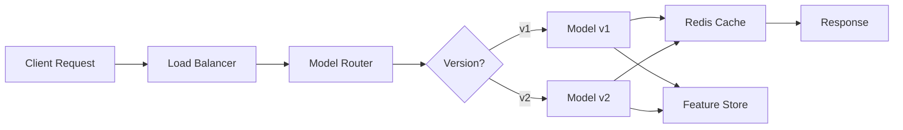

<!-- Clear Language: Keep sentences under 50 words -->
# Model Serving

## Learning Objectives

| Objective | Description |
|-----------|-------------|
| LO1 | Understand model serving architectures and deployment patterns |
| LO2 | Deploy models using FastAPI with Redis caching and batching |
| LO3 | Implement model version routing and A/B testing |
| LO4 | Set up autoscaling for serving infrastructure |
| LO5 | Optimize inference latency with quantization and ONNX |
| LO6 | Build a feature store integration for online predictions |

## Introduction

MLOps bridges the gap between experiment and production. Experiment tracking, CI/CD, model serving, and drift monitoring keep AI systems reliable. This module covers the operational side of AI engineering.

## Prerequisites

- Basic programming knowledge
- Understanding of data structures

## Key Terminology

**Key Terms**: Core vocabulary and concepts for this topic.

**Definition**: Essential terms you must know for interviews and production work.

## Theory

Understanding model serving is fundamental for AI engineers. This section covers the core concepts, underlying principles, and theoretical framework that govern how model serving works in practice.

## Chapter at a Glance

| Section | Topic | Key Concept |
|---------|-------|-------------|
| 5.1 | Serving Architectures | REST, gRPC, streaming, batch inference |
| 5.2 | FastAPI Serving | Model endpoint with async inference |
| 5.3 | Caching & Batching | Redis cache, request batching |
| 5.4 | Version Routing | A/B testing, canary, shadow serving |
| 5.5 | Autoscaling | Horizontal pod autoscaling, request-based |
| 5.6 | Inference Optimization | ONNX, quantization, TensorRT |

## Chapter Roadmap



## 5.1 Serving Architectures

Model serving is the process of making model predictions available to applications in real-time or batch mode. The choice of architecture depends on latency requirements, throughput needs, and cost constraints.

**Serving patterns**:

| Pattern | Latency | Use Case | Example |
|---------|---------|----------|---------|
| REST API | 50-500ms | Online real-time | Chatbot recommendations |
| gRPC | 10-100ms | High-throughput microservices | Feature store lookups |
| Streaming | <10ms per event | Real-time event processing | Fraud detection |
| Batch | Minutes-hours | Offline scoring | Daily customer churn prediction |

```python

## REST serving with FastAPI — the most common pattern
from fastapi import FastAPI, HTTPException
from pydantic import BaseModel, Field
import mlflow.pyfunc
import numpy as np
from typing import List, Optional
import time

app = FastAPI(title="Model Serving API", version="1.0.0")

## Model registry path
MODEL_URI = "models:/PricePredictor/Production"
model = mlflow.pyfunc.load_model(MODEL_URI)

class PredictionRequest(BaseModel):
    features: List[float] = Field(..., description="Feature vector")
    request_id: Optional[str] = None

class PredictionResponse(BaseModel):
    prediction: float
    confidence: Optional[float]
    model_version: str
    latency_ms: float

@app.post("/predict", response_model=PredictionResponse)
async def predict(request: PredictionRequest):
    start = time.time()

    # Convert to numpy array
    features = np.array(request.features).reshape(1, -1)

    # Predict
    prediction = model.predict(features)[0]

    latency = (time.time() - start) * 1000

    return PredictionResponse(
        prediction=float(prediction),
        confidence=None,
        model_version="v2.1.0",
        latency_ms=round(latency, 2)
    )

@app.get("/health")
async def health():
    return {"status": "healthy", "model": "PricePredictor", "version": "v2.1.0"}
```

**gRPC serving for high throughput**:

```python

## grpc_servicer.py — gRPC model serving

## import grpc

## from concurrent import futures

## import model_pb2

## import model_pb2_grpc

## import mlflow.pyfunc

## import numpy as np
#

## class ModelServicer(model_pb2_grpc.ModelServiceServicer):

##     def __init__(self):

##         self.model = mlflow.pyfunc.load_model("models:/PricePredictor/Production")
#

##     def Predict(self, request, context):

##         features = np.array(request.features).reshape(1, -1)

##         prediction = self.model.predict(features)[0]

##         return model_pb2.PredictResponse(prediction=float(prediction))
#

## server = grpc.server(futures.ThreadPoolExecutor(max_workers=10))

## model_pb2_grpc.add_ModelServiceServicer_to_server(ModelServicer(), server)

## server.add_insecure_port("[::]:50051")

## server.start()
```

---

## 5.2 FastAPI Serving

FastAPI provides async inference capabilities, automatic OpenAPI docs, and Pydantic validation — making it ideal for model serving.

```python

## serving_app.py — Complete model serving application
from fastapi import FastAPI, BackgroundTasks
from fastapi.middleware.cors import CORSMiddleware
from pydantic import BaseModel
import mlflow.pyfunc
import numpy as np
import pandas as pd
import logging
import time
import json
from typing import List, Dict, Optional
from datetime import datetime

logging.basicConfig(level=logging.INFO)
logger = logging.getLogger(__name__)

app = FastAPI()

app.add_middleware(
    CORSMiddleware,
    allow_origins=["*"],
    allow_methods=["*"],
    allow_headers=["*"],
)

## Load model
MODEL_PATH = "model_artifacts/production_model"
try:
    model = mlflow.pyfunc.load_model(MODEL_PATH)
    logger.info(f"Model loaded from {MODEL_PATH}")
except Exception as e:
    logger.error(f"Failed to load model: {e}")
    model = None

class BatchRequest(BaseModel):
    instances: List[Dict[str, float]]

class BatchResponse(BaseModel):
    predictions: List[float]
    model_version: str
    num_predictions: int

@app.on_event("startup")
async def load_model_on_startup():
    """Reload model on startup to ensure fresh load."""
    global model
    model = mlflow.pyfunc.load_model(MODEL_PATH)
    logger.info("Model reloaded on startup")

@app.post("/v1/predict")
async def predict_single(features: Dict[str, float]):
    """Single prediction endpoint."""
    if model is None:
        raise HTTPException(status_code=503, detail="Model not loaded")

    start = time.time()
    df = pd.DataFrame([features])
    prediction = model.predict(df)[0]

    logger.info(f"Prediction: {prediction:.4f}, latency: {(time.time()-start)*1000:.2f}ms")

    return {
        "prediction": float(prediction),
        "latency_ms": round((time.time() - start) * 1000, 2),
        "timestamp": datetime.utcnow().isoformat()
    }

@app.post("/v1/batch-predict", response_model=BatchResponse)
async def batch_predict(request: BatchRequest):
    """Batch prediction endpoint."""
    if model is None:
        raise HTTPException(status_code=503, detail="Model not loaded")

    df = pd.DataFrame(request.instances)
    predictions = model.predict(df)

    logger.info(f"Batch prediction: {len(predictions)} predictions")

    return BatchResponse(
        predictions=[float(p) for p in predictions],
        model_version="v2.1.0",
        num_predictions=len(predictions)
    )

## For running directly
if __name__ == "__main__":
    import uvicorn
    uvicorn.run(app, host="0.0.0.0", port=8080)
```

**Async inference with background tasks**:

```python
@app.post("/v1/async-predict")
async def async_predict(features: Dict[str, float], background_tasks: BackgroundTasks):
    """Async prediction that logs prediction to database in background."""
    if model is None:
        raise HTTPException(status_code=503)

    df = pd.DataFrame([features])
    prediction = model.predict(df)[0]

    # Log prediction asynchronously
    background_tasks.add_task(log_prediction_to_db, features, float(prediction))

    return {
        "prediction": float(prediction),
        "logged": True
    }

async def log_prediction_to_db(features: dict, prediction: float):
    """Simulated async database logging."""
    # In production: await db.insert("predictions", {...})
    logger.info(f"Logged prediction: {prediction} for features: {features}")
```

---

## 5.3 Caching & Batching

Caching repeated requests and batching concurrent requests significantly improve throughput.

```python

## caching.py — Redis-based prediction caching
import redis
import json
import hashlib
import numpy as np
from typing import Dict, Optional

class PredictionCache:
    def __init__(self, host="localhost", port=6379, ttl=3600):
        self.client = redis.Redis(host=host, port=port, decode_responses=True)
        self.ttl = ttl
        self.hits = 0
        self.misses = 0

    def _make_key(self, model_version: str, features: Dict) -> str:
        """Create deterministic cache key from features."""
        feature_str = json.dumps(features, sort_keys=True)
        hash_val = hashlib.sha256(feature_str.encode()).hexdigest()[:16]
        return f"pred:{model_version}:{hash_val}"

    def get(self, model_version: str, features: Dict) -> Optional[float]:
        """Get cached prediction if available."""
        key = self._make_key(model_version, features)
        result = self.client.get(key)
        if result is not None:
            self.hits += 1
            return float(result)
        self.misses += 1
        return None

    def set(self, model_version: str, features: Dict, prediction: float):
        """Cache a prediction."""
        key = self._make_key(model_version, features)
        self.client.setex(key, self.ttl, prediction)

    def stats(self) -> Dict:
        total = self.hits + self.misses
        hit_rate = self.hits / total if total > 0 else 0
        return {"hits": self.hits, "misses": self.misses, "hit_rate": hit_rate}

cache = PredictionCache()

## In prediction endpoint
@app.post("/v1/predict-with-cache")
async def predict_cached(features: Dict[str, float], model_version: str = "v2"):
    # Check cache first
    cached = cache.get(model_version, features)
    if cached is not None:
        return {"prediction": cached, "source": "cache"}

    # Compute prediction
    df = pd.DataFrame([features])
    prediction = model.predict(df)[0]

    # Cache for future requests
    cache.set(model_version, features, float(prediction))

    return {"prediction": float(prediction), "source": "model"}
```

**Request batching**:

```python
import asyncio
import numpy as np
from collections import deque
from typing import List, Callable, Awaitable

class RequestBatcher:
    """Aggregates concurrent requests into batches for efficient inference."""

    def __init__(self, model_fn: Callable, max_batch_size: int = 32, max_wait_ms: float = 10):
        self.model_fn = model_fn
        self.max_batch_size = max_batch_size
        self.max_wait = max_wait_ms / 1000
        self.queue = deque()
        self._lock = asyncio.Lock()

    async def predict(self, features: np.ndarray) -> np.ndarray:
        """Submit a single request and wait for batched result."""
        event = asyncio.Event()
        result = {}

        async with self._lock:
            self.queue.append((features, result, event))
            if len(self.queue) >= self.max_batch_size:
                asyncio.ensure_future(self._process_batch())

        await event.wait()
        return result["prediction"]

    async def _process_batch(self):
        """Process a batch of queued requests."""
        async with self._lock:
            batch = list(self.queue)
            self.queue.clear()

        if not batch:
            return

        # Stack features
        features_batch = np.vstack([item[0] for item in batch])
        predictions = await self.model_fn(features_batch)

        # Distribute results
        for i, (_, result, event) in enumerate(batch):
            result["prediction"] = predictions[i]
            event.set()

## Usage
batcher = RequestBatcher(
    model_fn=lambda x: asyncio.to_thread(model.predict, x),
    max_batch_size=32,
    max_wait_ms=10
)

@app.post("/v1/batched-predict")
async def batched_predict(features: Dict[str, float]):
    df = pd.DataFrame([features])
    prediction = await batcher.predict(df.values)
    return {"prediction": float(prediction[0])}
```

---

## 5.4 Version Routing

A model router directs requests to different model versions based on routing rules.

```python

## model_router.py — Route requests to model versions
import mlflow.pyfunc
import random
import hashlib
from typing import Dict, Optional

class ModelRouter:
    def __init__(self):
        self.versions = {}
        self.default_version = None

    def load_version(self, version_tag: str, model_uri: str):
        """Load a model version from registry."""
        self.versions[version_tag] = mlflow.pyfunc.load_model(model_uri)
        if self.default_version is None:
            self.default_version = version_tag
        print(f"Loaded {version_tag} from {model_uri}")

    def set_routing(self, routing: Dict[str, float]):
        """Set traffic percentages per version (should sum to 100)."""
        self.routing = routing

    def route(self, features: Dict, user_id: Optional[str] = None) -> tuple:
        """Route request to appropriate model version."""
        if user_id:
            # Consistent hashing for A/B testing
            version = self._consistent_hash(user_id)
        elif hasattr(self, 'routing'):
            version = self._weighted_random()
        else:
            version = self.default_version

        model = self.versions[version]
        return model.predict(pd.DataFrame([features]))[0], version

    def _consistent_hash(self, user_id: str) -> str:
        """Deterministically assign user to version."""
        hash_val = int(hashlib.md5(user_id.encode()).hexdigest()[:8], 16)
        total = sum(self.routing.values())
        bucket = hash_val % total
        cumulative = 0
        for version, pct in self.routing.items():
            cumulative += pct
            if bucket < cumulative:
                return version
        return self.default_version

    def _weighted_random(self) -> str:
        """Random assignment by weight."""
        r = random.random() * 100
        cumulative = 0
        for version, pct in self.routing.items():
            cumulative += pct
            if r <= cumulative:
                return version
        return self.default_version

router = ModelRouter()
router.load_version("v1", "models:/PricePredictor/1")
router.load_version("v2", "models:/PricePredictor/2")
router.set_routing({"v1": 90, "v2": 10})

## FastAPI endpoint using router
@app.post("/v1/route")
async def routed_predict(features: Dict[str, float], user_id: str = None):
    prediction, version = router.route(features, user_id)
    return {"prediction": float(prediction), "model_version": version}
```

---

## 5.5 Autoscaling

Autoscaling ensures serving infrastructure matches traffic demands without over-provisioning.

```python

## kubernetes_hpa.yaml — Horizontal Pod Autoscaler

## apiVersion: autoscaling/v2

## kind: HorizontalPodAutoscaler

## metadata:

##   name: model-serving-hpa

## spec:

##   scaleTargetRef:

##     apiVersion: apps/v1

##     kind: Deployment

##     name: price-predictor

##   minReplicas: 2

##   maxReplicas: 20

##   metrics:

##     - type: Resource

##       resource:

##         name: cpu

##         target:

##           type: Utilization

##           averageUtilization: 70

##     - type: Resource

##       resource:

##         name: memory

##         target:

##           type: Utilization

##           averageUtilization: 80

##     - type: Pods

##       pods:

##         metric:

##           name: prediction_latency_p95

##         target:

##           type: AverageValue

##           averageValue: 500m  # 500ms p95 latency
```

```python

## custom_autoscaler.py — Python-based autoscaling logic
import time
import psutil
import subprocess
import json
from collections import deque

class CustomAutoscaler:
    def __init__(self, min_replicas=2, max_replicas=20, target_latency_ms=200):
        self.min_replicas = min_replicas
        self.max_replicas = max_replicas
        self.target_latency = target_latency_ms
        self.latency_history = deque(maxlen=60)  # 1 minute window
        self.current_replicas = min_replicas

    def record_latency(self, latency_ms: float):
        self.latency_history.append(latency_ms)

    def get_avg_latency(self) -> float:
        if not self.latency_history:
            return 0
        return sum(self.latency_history) / len(self.latency_history)

    def compute_desired_replicas(self) -> int:
        avg_latency = self.get_avg_latency()
        if avg_latency == 0:
            return self.current_replicas

        ratio = avg_latency / self.target_latency
        desired = int(self.current_replicas * ratio)

        return max(self.min_replicas, min(self.max_replicas, desired))

    def scale(self):
        """Kubernetes-style scaling decision."""
        desired = self.compute_desired_replicas()
        if desired != self.current_replicas:
            print(f"Scaling: {self.current_replicas} -> {desired} (avg latency: {self.get_avg_latency():.0f}ms)")
            # In real deployment: Kubernetes API call
            # subprocess.run(["kubectl", "scale", "deployment/price-predictor", "--replicas", str(desired)])
            self.current_replicas = desired
        else:
            print(f"No scaling needed ({self.current_replicas} replicas)")

scaler = CustomAutoscaler(min_replicas=2, max_replicas=20)

@app.post("/v1/predict")
async def predict_with_autoscaling(features: Dict[str, float]):
    start = time.time()
    df = pd.DataFrame([features])
    prediction = model.predict(df)[0]
    latency = (time.time() - start) * 1000

    scaler.record_latency(latency)
    if random.random() < 0.1:  # Check every 10th request
        scaler.scale()

    return {"prediction": float(prediction), "latency_ms": round(latency, 2)}
```

---

## 5.6 Inference Optimization

Optimize model inference for production with quantization, ONNX, and TensorRT.

```python

## optimize_model.py — Convert sklearn model to ONNX for faster inference
from skl2onnx import convert_sklearn
from skl2onnx.common.data_types import FloatTensorType
import onnxruntime as ort
import numpy as np
import mlflow.sklearn
import time

def convert_to_onnx(model, input_dim: int, output_path: str = "model.onnx"):
    """Convert sklearn model to ONNX format."""
    initial_type = [("float_input", FloatTensorType([None, input_dim]))]
    onnx_model = convert_sklearn(model, initial_types=initial_type)
    with open(output_path, "wb") as f:
        f.write(onnx_model.SerializeToString())
    print(f"ONNX model saved to {output_path}")
    return output_path

class ONNXModelWrapper:
    """Wrapper for ONNX Runtime inference."""

    def __init__(self, onnx_path: str):
        self.session = ort.InferenceSession(onnx_path)
        self.input_name = self.session.get_inputs()[0].name

    def predict(self, X: np.ndarray) -> np.ndarray:
        # ONNX expects float32
        input_data = X.astype(np.float32)
        result = self.session.run(None, {self.input_name: input_data})
        return result[0]

## Load sklearn model, convert to ONNX, compare performance
rf_model = mlflow.sklearn.load_model("models:/PricePredictor/Production")
onnx_path = convert_to_onnx(rf_model, input_dim=10)

onnx_model = ONNXModelWrapper(onnx_path)

## Benchmark
X_test = np.random.randn(1000, 10).astype(np.float32)

## sklearn
start = time.time()
for _ in range(100):
    _ = rf_model.predict(X_test)
sklearn_time = time.time() - start

## ONNX
start = time.time()
for _ in range(100):
    _ = onnx_model.predict(X_test)
onnx_time = time.time() - start

print(f"sklearn: {sklearn_time:.3f}s, ONNX: {onnx_time:.3f}s")
print(f"Speedup: {sklearn_time/onnx_time:.1f}x")
```

**Quantization for reduced latency**:

```python
def quantize_model(model_path: str, quantized_path: str):
    """Apply dynamic quantization to reduce model size and latency."""
    import torch
    import torch.nn as nn

    # Load model
    model = torch.load(model_path)
    model.eval()

    # Dynamic quantization
    quantized_model = torch.quantization.quantize_dynamic(
        model,
        {nn.Linear, nn.GRU},  # Quantize these layer types
        dtype=torch.qint8
    )

    torch.save(quantized_model, quantized_path)

    original_size = os.path.getsize(model_path) / 1e6
    quantized_size = os.path.getsize(quantized_path) / 1e6
    print(f"Original: {original_size:.1f}MB -> Quantized: {quantized_size:.1f}MB")
    print(f"Size reduction: {(1 - quantized_size/original_size)*100:.0f}%")

## quantize_model("model.pt", "model_quantized.pt")
```

**Feature store integration**:

```python
class FeatureStoreClient:
    """Client for online feature store (e.g., Feast, Tecton)."""

    def __init__(self, feature_service_url: str):
        self.url = feature_service_url

    def get_features(self, entity_id: str, feature_refs: list) -> dict:
        """Fetch features from online store."""
        import requests
        response = requests.post(
            f"{self.url}/get-online-features",
            json={"entity_ids": [entity_id], "feature_refs": feature_refs}
        )
        return response.json()["features"][0]

feature_store = FeatureStoreClient("http://feast-serving:6566")

@app.post("/v1/predict-with-features")
async def predict_with_feature_store(entity_id: str):
    """Get features from store, then predict."""
    features = feature_store.get_features(entity_id, [
        "house_features:sqft",
        "house_features:bedrooms",
        "house_features:bathrooms",
        "house_features:year_built"
    ])
    df = pd.DataFrame([features])
    prediction = model.predict(df)[0]
    return {"prediction": float(prediction), "entity_id": entity_id}
```

---

## TypeScript Parallel

```typescript
// TypeScript model serving with routing
interface ModelVersion {
  version: string;
  predict: (features: Record<string, number>) => number;
}

class ModelRouter {
  private versions: Map<string, ModelVersion> = new Map();
  private routing: Record<string, number> = {};

  addVersion(version: ModelVersion): void {
    this.versions.set(version.version, version);
  }

  setRouting(routing: Record<string, number>): void {
    this.routing = routing;
  }

  predict(features: Record<string, number>): { prediction: number; version: string } {
    const r = Math.random() * 100;
    let cumulative = 0;
    for (const [version, pct] of Object.entries(this.routing)) {
      cumulative += pct;
      if (r <= cumulative) {
        const model = this.versions.get(version)!;
        return { prediction: model.predict(features), version };
      }
    }
    const defaultVersion = this.versions.values().next().value;
    return { prediction: defaultVersion.predict(features), version: defaultVersion.version };
  }
}
```

---

## Summary

- Model serving architectures range from REST APIs (50-500ms) to batch inference (minutes-hours)
- FastAPI provides async inference, Pydantic validation, and automatic OpenAPI docs
- Redis caching reduces repeated inference calls and latency
- Request batching aggregates concurrent requests for GPU-efficient inference
- Model routing enables A/B testing, canary deployments, and consistent hashing
- Horizontal Pod Autoscaler in Kubernetes scales replicas based on CPU, memory, or custom metrics
- ONNX Runtime provides 2-5x speedups over native sklearn inference
- Dynamic quantization reduces model size by 50-75% with minimal accuracy loss
- Feature store integration separates feature computation from model serving
- Custom autoscalers can use prediction latency as a scaling metric

## Practical Takeaways

| Scenario | Do This | Avoid This |
|----------|---------|------------|
| Real-time serving | FastAPI REST endpoint with async | Synchronous blocking endpoints |
| Repeated predictions | Redis cache with TTL | Computing prediction every time |
| GPU inference | Request batching (32-64 per batch) | Single-request GPU inference |
| Traffic spikes | Horizontal Pod Autoscaler | Manual scaling |
| Latency reduction | ONNX Runtime or quantization | Optimizing at framework level only |
| Feature management | Feature store (Feast/Tecton) | Computing features in serving code |

## Interview Q&A

<details class="tp-qa-card" data-qid="mlops-s05-q1">
  <summary class="tp-qa-question">
    <span class="tp-qa-status"></span>
    Q1: What are the common model serving patterns?
  </summary>
  <div class="tp-qa-answer">
<p>Four main patterns: (1) REST API — standard HTTP serving, best for most use cases, 50-500ms latency. (2) gRPC — high-throughput binary protocol,.
10-100ms. (3) Streaming — event-driven processing for sub-10ms real-time needs. (4) Batch — periodic offline scoring jobs for non-real-time use cases. Each trades off latency,.
throughput, and complexity.</p>
  </div>
  <button class="tp-qa-mark-btn">✅ Mark Reviewed</button>
  <button class="tp-qa-bookmark-btn">🔖 Bookmark</button>
</details>

<details class="tp-qa-card" data-qid="mlops-s05-q2">
  <summary class="tp-qa-question">
    <span class="tp-qa-status"></span>
    Q2: How does request batching improve inference throughput?
  </summary>
  <div class="tp-qa-answer">
<p>Request batching aggregates multiple inference requests into one batch for GPU/TPU processing. GPUs are optimized for parallel computation: processing a batch of 32 takes only slightly longer than processing 1. With a max_wait threshold (e.g.,.
10ms), the server collects concurrent requests and processes them together, dramatically improving throughput without unacceptable latency increase.</p>
  </div>
  <button class="tp-qa-mark-btn">✅ Mark Reviewed</button>
  <button class="tp-qa-bookmark-btn">🔖 Bookmark</button>
</details>

<details class="tp-qa-card" data-qid="mlops-s05-q3">
  <summary class="tp-qa-question">
    <span class="tp-qa-status"></span>
    Q3: How does Redis caching help model serving?
  </summary>
  <div class="tp-qa-answer">
<p>Redis caches predictions keyed by a hash of the input features with a configurable TTL. If the same input is requested again within the TTL,.
the cached prediction is returned instantly without model inference. This reduces latency for repeated queries and protects the model from redundant computation,.
especially for popular or common inputs.</p>
  </div>
  <button class="tp-qa-mark-btn">✅ Mark Reviewed</button>
  <button class="tp-qa-bookmark-btn">🔖 Bookmark</button>
</details>

<details class="tp-qa-card" data-qid="mlops-s05-q4">
  <summary class="tp-qa-question">
    <span class="tp-qa-status"></span>
    Q4: What is consistent hashing for A/B testing models?
  </summary>
  <div class="tp-qa-answer">
<p>Consistent hashing assigns users to model versions deterministically based on a hash of their user ID. The same user always gets the same model version,.
providing a consistent experience. The hash space is divided into buckets proportional to the traffic split (e.g., 90% for control, 10% for.
treatment). This enables fair A/B testing without session inconsistency.</p>
  </div>
  <button class="tp-qa-mark-btn">✅ Mark Reviewed</button>
  <button class="tp-qa-bookmark-btn">🔖 Bookmark</button>
</details>

<details class="tp-qa-card" data-qid="mlops-s05-q5">
  <summary class="tp-qa-question">
    <span class="tp-qa-status"></span>
    Q5: How does ONNX improve inference performance?
  </summary>
  <div class="tp-qa-answer">
    <p>ONNX (Open Neural Network Exchange) provides a standardized model format with a runtime that optimizes computation graphs. It performs operator fusion, constant folding, and graph-level optimizations. ONNX Runtime also supports hardware-specific backends (CUDA, TensorRT, OpenVINO). Speedups of 2-5x over native sklearn inference are common.</p>
  </div>
  <button class="tp-qa-mark-btn">✅ Mark Reviewed</button>
  <button class="tp-qa-bookmark-btn">🔖 Bookmark</button>
</details>

<details class="tp-qa-card" data-qid="mlops-s05-q6">
  <summary class="tp-qa-question">
    <span class="tp-qa-status"></span>
    Q6: What is dynamic quantization in model optimization?
  </summary>
  <div class="tp-qa-answer">
    <p>Dynamic quantization reduces model precision from float32 to int8 for weights while keeping activations in float32. This reduces model size by ~75% and improves CPU inference speed by 2-4x with minimal accuracy loss (usually <1%). It's applied post-training without requiring retraining or calibration data, making it the easiest quantization method.</p>
  </div>
  <button class="tp-qa-mark-btn">✅ Mark Reviewed</button>
  <button class="tp-qa-bookmark-btn">🔖 Bookmark</button>
</details>

<details class="tp-qa-card" data-qid="mlops-s05-q7">
  <summary class="tp-qa-question">
    <span class="tp-qa-status"></span>
    Q7: How do you implement autoscaling for model serving?
  </summary>
  <div class="tp-qa-answer">
<p>Kubernetes HPA can scale based on CPU (e.g., target 70% utilization), memory, or custom metrics like p95 latency. A custom metric pipeline (Prometheus + custom metrics adapter) publishes per-pod latency metrics. The HPA computes desired replicas as current * (current_metric / target_metric). Minimum replicas ensure baseline capacity;.
maximum prevents runaway scaling.</p>
  </div>
  <button class="tp-qa-mark-btn">✅ Mark Reviewed</button>
  <button class="tp-qa-bookmark-btn">🔖 Bookmark</button>
</details>

<details class="tp-qa-card" data-qid="mlops-s05-q8">
  <summary class="tp-qa-question">
    <span class="tp-qa-status"></span>
    Q8: What is a feature store and why use it in serving?
  </summary>
  <div class="tp-qa-answer">
    <p>A feature store (Feast, Tecton) provides a centralized repository of pre-computed features with both offline (training) and online (serving) access. It ensures training/serving feature consistency, avoids feature recomputation at inference time, and handles point-in-time correct feature lookups. Online serving uses low-latency stores (Redis, DynamoDB) for millisecond feature retrieval.</p>
  </div>
  <button class="tp-qa-mark-btn">✅ Mark Reviewed</button>
  <button class="tp-qa-bookmark-btn">🔖 Bookmark</button>
</details>

<details class="tp-qa-card" data-qid="mlops-s05-q9">
  <summary class="tp-qa-question">
    <span class="tp-qa-status"></span>
    Q9: How do you handle model versioning in serving?
  </summary>
  <div class="tp-qa-answer">
<p>Load all active model versions into memory at startup. Use a ModelRouter with traffic percentage configuration per version. The router selects the version based on random weighted selection or.
consistent hashing by user ID. Shadow traffic sends copies of requests to new versions for evaluation without affecting responses. Canary routing exposes new versions to increasing traffic.</p>
  </div>
  <button class="tp-qa-mark-btn">✅ Mark Reviewed</button>
  <button class="tp-qa-bookmark-btn">🔖 Bookmark</button>
</details>

<details class="tp-qa-card" data-qid="mlops-s05-q10">
  <summary class="tp-qa-question">
    <span class="tp-qa-status"></span>
    Q10: What metrics should you monitor for model serving?
  </summary>
  <div class="tp-qa-answer">
    <p>Essential metrics: (1) p50/p95/p99 latency — response time distribution, (2) requests per second (throughput), (3) error rate (4xx/5xx), (4) cache hit rate, (5) GPU utilization (if applicable), (6) model prediction distribution — detect if outputs shift suddenly, (7) memory and CPU usage per pod, (8) batch size distribution.</p>
  </div>
  <button class="tp-qa-mark-btn">✅ Mark Reviewed</button>
  <button class="tp-qa-bookmark-btn">🔖 Bookmark</button>
</details>

## Chapter Quiz

**Q1**: Which serving pattern is best for real-time online predictions?
a) Batch inference
b) REST API
c) Streaming
d) File export

<details class="tp-qa-card" data-qid="mlops-s05-quiz1"><summary>Show Answer</summary><div class="tp-qa-answer"><p><strong>Answer: b) REST API</strong></p><p>REST API (50-500ms) is the standard pattern for real-time online predictions.</p></div></details>

**Q2**: What is the primary benefit of request batching?
a) Lower individual request latency
b) Higher throughput on GPU
c) Simpler code
d) Lower memory usage

<details class="tp-qa-card" data-qid="mlops-s05-quiz2"><summary>Show Answer</summary><div class="tp-qa-answer"><p><strong>Answer: b) Higher throughput on GPU</strong></p><p>Batching leverages GPU parallelism to process multiple requests simultaneously, increasing throughput.</p></div></details>

**Q3**: How does consistent hashing work for A/B testing?
a) Randomly assigns users each request
b) Deterministically maps user IDs to model versions
c) Uses round-robin across versions
d) Routes based on request payload size

<details class="tp-qa-card" data-qid="mlops-s05-quiz3"><summary>Show Answer</summary><div class="tp-qa-answer"><p><strong>Answer: b) Deterministically maps user IDs to model versions</strong></p><p>Consistent hashing ensures the same user always gets the same model version for consistent experience.</p></div></details>

**Q4**: What format does ONNX Runtime use for optimized inference?
a) .pkl
b) .onnx
c) .pt
d) .h5

<details class="tp-qa-card" data-qid="mlops-s05-quiz4"><summary>Show Answer</summary><div class="tp-qa-answer"><p><strong>Answer: b) .onnx</strong></p><p>ONNX uses the .onnx format with graph-level optimizations for faster inference.</p></div></details>

**Q5**: What is the key advantage of a feature store in production serving?
a) Reduces model size
b) Ensures training-serving feature consistency
c) Increases model accuracy
d) Eliminates need for data validation

<details class="tp-qa-card" data-qid="mlops-s05-quiz5"><summary>Show Answer</summary><div class="tp-qa-answer"><p><strong>Answer: b) Ensures training-serving feature consistency</strong></p><p>Feature stores provide the same features used in training for serving, preventing training-serving skew.</p></div></details>

## Exercises

**Easy** — Deploy a scikit-learn model as a FastAPI endpoint with `/predict` and `/health` routes.

**Medium** — Add Redis caching to a model serving endpoint with TTL-based expiration and cache hit/miss logging.

**Medium** — Implement a ModelRouter with consistent hashing that routes 80% of traffic to v1 and 20% to v2 based on user ID.

**Hard** — Convert a RandomForest model to ONNX, benchmark sklearn vs ONNX inference speed over 1000 requests, report the speedup.

**Hard** — Build a complete serving stack with FastAPI, Redis cache, request batching (32 max batch), and HPA-ready Dockerfile.

---

## Common Mistakes

1. Not understanding the fundamental concepts before applying them
2. Skipping edge cases in implementation
3. Not analyzing time/space complexity
4. Forgetting to handle null/empty inputs
5. Not practicing enough problems to build pattern recognition

## Revision Notes

- - Core principle: Understand the fundamental concepts thoroughly
- - Implementation pattern: Practice with real code examples
- - Complexity: Know the time and space complexity
- - Application: Know when to use this in production systems
- - Interview: Frequently asked in technical interviews
- - Edge cases: Consider common failure scenarios
- - Related concepts: Connect to broader system design

## Placement Section

### Top 10 Interview Questions

#### Google Style

1. **Explain the core idea of Model Serving in under 60 seconds, then give a real-world analogy.** — Structure: definition, how it works in one sentence, why it matters, analogy. Follow-up: what would break if you removed this from a production system?

2. **Design a minimal, well-typed function that demonstrates Model Serving.** — Interviewer checks: signature with type hints, edge cases, complexity, and a clean docstring. Follow-up: how does your design behave with empty or malformed input?

3. **What are the common pitfalls when engineers first learn ** — List 3-4, then explain how you would prevent each in a code review.

#### Amazon Style

4. **Describe a production bug caused by misunderstanding Model Serving. How did you diagnose and fix it?** — STAR format: situation, task, action, result. Mention logs, reproduction, root-cause analysis, and the regression test you added.

5. **How would you scale a system that relies on Model Serving from 10 users to 10 million?** — Discuss bottlenecks, caching, monitoring, and when to redesign. Follow-up: what metrics would you track?

#### Microsoft Style

6. **Compare Model Serving with the closest alternative approach. When would you choose each?** — Make a decision matrix: performance, maintainability, ecosystem, learning curve. Follow-up: what would change your decision?

7. **Walk through how you would test a component that depends on Model Serving.** — Unit, integration, property-based tests; mocking boundaries; golden files for outputs.

#### NVIDIA Style

8. **How does Model Serving behave differently at scale — memory, throughput, or precision-wise?** — Connect to data pipelines and model training if applicable. Follow-up: what happens to latency as input grows?

9. **How would you make an implementation of Model Serving run faster on GPU hardware?** — Batch operations, vectorization, avoiding Python loops, reducing data movement.

#### AI Startup Style

10. **Write the smallest possible implementation of Model Serving that is production-quality.** — Include error handling, type hints, and a one-line docstring. Follow-up: what would you refactor first when it grows?

### Resume Tips

- Name Model Serving explicitly in your skills section, paired with a measurable achievement ("Reduced X by 40% using Model Serving").
- Add a bullet describing a project that applies Model Serving to real data, with numbers.
- Mention the tools and libraries you used alongside Model Serving (linters, test frameworks, profiling tools).
- Keep resume bullets under 15 words and start each with an action verb.

### Interview Day Checklist

- Rehearse a 60-second explanation of Model Serving and one real-world analogy.
- Prepare one STAR story about debugging a Model Serving-related production issue.
- Review complexity and edge cases for the classic Model Serving interview problem.
- Have questions ready: how does the team apply Model Serving in production today?
- Test your environment (Python, editor, internet) 15 minutes before the interview.

## True/False

1. **True or False:** Model Serving builds directly on the fundamentals covered in the earlier chapters of this module. — **True.** Every advanced topic in this module assumes the core concepts from the previous chapters.
2. **True or False:** You should write at least one code example for Model Serving before moving to the next chapter. — **True.** Active recall with hands-on code beats passive reading for retention.
3. **True or False:** The complexity analysis for Model Serving is the same regardless of input size. — **False.** Complexity grows with input size; always state best, average, and worst case.
4. **True or False:** Edge cases (empty input, invalid input, boundary values) matter for Model Serving in production. — **True.** Most production bugs come from unhandled edge cases.
5. **True or False:** You should memorize the Model Serving chapter content once and never review it again. — **False.** Spaced repetition (24h, 3 days, 1 week) dramatically improves long-term recall.

## Fill in the Blank

1. The chapter that covers Model Serving is Chapter ___ of this module. — Answer: check the module's table of contents.
2. The time complexity of the standard approach to Model Serving is ___. — Answer: review the theory section and state big-O notation.
3. The main edge case to handle when implementing Model Serving is ___. — Answer: empty or invalid input handling, as discussed in the chapter.
4. The tools commonly used to debug Model Serving issues are ___ and ___. — Answer: refer to the Debugging Guide section of this chapter.
5. The related topic that connects to Model Serving in the next chapter is ___. — Answer: see the Next Topic section.

## Scenario Questions

1. **Scenario:** A teammate ships a change involving Model Serving that breaks production at 3 AM. — Diagnosis: check the recent diff, reproduce locally with the failing input, check logs. Fix: revert, add a regression test, and review the root cause. Prevention: CI tests on edge cases and code review checklist.

2. **Scenario:** Your implementation of Model Serving is correct but too slow for the required latency. — Measure first with a profiler. Common fixes: reduce redundant work, use built-in optimized functions, batch operations, or add caching. Only then consider algorithmic changes.

3. **Scenario:** A new hire asks you to explain Model Serving in five minutes before a customer demo. — Use the 3-part answer: what it is (one sentence), how it works (one example), why it matters (one business impact). Then offer to go deeper after the demo.

4. **Scenario:** Your team's codebase has three different patterns for Model Serving and you must standardize. — Write a short ADR (architecture decision record), pick the pattern with best maintainability, migrate incrementally, and add a linter rule to enforce it.

## Output Questions

1. **What is the output of the simplest correct implementation of Model Serving on an empty input?** — Trace through the code: it should return the documented default (None, 0, empty collection) without raising.
2. **What is the output when the input is at the boundary value?** — Check off-by-one errors and inclusive/exclusive bounds in the chapter's examples.
3. **What does the implementation return when given invalid input types?** — With type hints and validation, it raises a clear error; without, it may fail silently.
4. **What is the output for the sample input given in the chapter's Examples section?** — Re-run the chapter's example code and compare against the documented output.
5. **What is the time complexity output when you profile the implementation at 10x input size?** — Expect the curve matching the chapter's complexity analysis (linear, quadratic, log-linear).

## Difficulty Level

| Level | Time | What It Takes |
|-------|------|---------------|
| Beginner | 1-2 sessions | Read theory, run the chapter examples, solve the Easy exercises |
| Intermediate | 3-5 sessions | Complete Medium exercises, explain Model Serving to someone else |
| Advanced | 1+ week | Solve Hard exercises, optimize for real datasets, answer interview follow-ups |

## Tips & Tricks

- Always write a one-line example of Model Serving from memory before opening the chapter — active recall first.
- Use the chapter's Revision Notes as a checklist: you have mastered Model Serving when you can explain each bullet.
- Pair the chapter quiz with the Flashcards: wrong answers become your next study session's focus.
- For interviews, practice explaining Model Serving twice: once with a technical audience, once with a non-technical audience.
- Keep a personal examples file where you collect your own Model Serving snippets; interviewers love original examples.

## Memory Tricks

- **Acronym**: build a mnemonic from the 5 key concepts of Model Serving listed in the Chapter at a Glance table.
- **Story**: link Model Serving to a familiar story — the analogy in the Visual Analogy section is designed to stick.
- **Number anchor**: remember the complexity of Model Serving by connecting it to a known algorithm of the same class.
- **Color code**: highlight the Theory, Examples, and Common Mistakes sections in different colors when reviewing.
- **Teach-back**: explain Model Serving to an imaginary junior engineer for 2 minutes — gaps in your explanation are gaps in memory.

## Further Reading

- Official documentation for the primary tool or library used in this chapter
- The chapter referenced in Related Topics for the next-level treatment of Model Serving
- The classic textbook chapter on Model Serving (check the Research References below)
- Two blog posts from engineers who debugged real Model Serving problems in production
- The repository of the open-source project that implements Model Serving

## Related Topics

- The previous chapter in this module (see table of contents) — foundational for Model Serving
- The next chapter (see Next Topic below) — builds on Model Serving
- The system design chapters in Module 07 — how Model Serving fits into production architectures
- The interview preparation module — how Model Serving is asked in screening rounds
- The capstone project — where Model Serving is applied end-to-end

## FAQs

1. **Do I need to memorize all of Model Serving, or understand the big picture?** — Understand the big picture first, then memorize the key facts via flashcards and spaced repetition. Interviewers reward depth over breadth.
2. **What if I get stuck on an exercise?** — Re-read the theory section, run the example code, then attempt again. If still stuck after 20 minutes, move on and return the next day.
3. **How much time should I spend on ** — Follow the Study Plan below: 1-2 weeks at 30-60 minutes daily is typical for placement preparation.
4. **Is Model Serving asked in interviews?** — Yes — the Interview Q&A and Placement Section list the exact question styles used by top companies.
5. **What's the fastest way to master ** — Explain it out loud, write code without looking, and review the flashcards within 24 hours and again after 3 days.

## Important Notes

- Model Serving is a core requirement for the rest of this module — do not skip the examples.
- Always analyze complexity (time and space) when working with Model Serving.
- Production correctness means handling edge cases, not just the happy path.
- Interview answers should start with the definition, then the example, then the trade-offs.
- Revisit this chapter after finishing the module; the context from later chapters deepens understanding.

## Historical Context

- Model Serving emerged as a standard practice because early systems failed without it — understanding why helps you explain it in interviews.
- The tools used for Model Serving today evolved from simpler versions; the chapter covers the modern, recommended approach.
- Interviewers value knowing one historical fact about Model Serving — it shows genuine interest, not just cramming.
- The library/tooling ecosystem around Model Serving changes quickly; focus on fundamentals that remain stable.

## Security Considerations

- Never trust external input: validate and sanitize data before processing Model Serving.
- Avoid `eval()` and dynamic code execution on untrusted strings.
- Log errors without leaking sensitive data (keys, PII, internal paths).
- For API contexts, add rate limiting and input size limits.
- Review the chapter's code examples for injection or overflow risks before using them verbatim.

## ML Intuition

- Model Serving appears in ML pipelines at the data-processing layer: feature preparation, batching, and validation.
- Understanding Model Serving helps you debug why a model misbehaves — most ML bugs are data bugs, not model bugs.
- In production ML, the Model Serving concepts from this chapter map directly to NumPy/PyTorch operations on tensors.
- When optimizing ML systems, Model Serving skills let you profile and fix the data path, not just the training loop.
- Interview follow-up: how would you apply Model Serving to a dataset of 10 million records? — Batching and vectorization.

## Analogies

- **Model Serving is like a recipe**: the theory is the ingredients, the examples are the cooking steps, and the exercises are your own kitchen practice.
- **Complexity is like a delivery route**: a linear route visits each stop once; a nested route revisits stops, and you feel it at scale.
- **Edge cases are like weather**: the happy path is a sunny day; production is the storm — build for the storm.
- **The chapter roadmap is a journey map**: each section is a checkpoint; skipping one means getting lost later in the module.

## Capstone Project Link

- [Module Capstone: End-to-End Project](https://github.com/Raushan666java/ai-engineering-journey) — this chapter contributes the Model Serving skills used in the module's capstone project. Complete the exercises here before starting the capstone.

## Flashcards

<details class="tp-qa-card" data-qid="16mlopsproduction-05modelserving-flash1">
  <summary class="tp-qa-question">
    <span class="tp-qa-status"></span>
    What is the core concept of Model Serving in one sentence?
  </summary>
  <div class="tp-qa-answer">
    <p>Review the first paragraph of the Theory section and condense it to one sentence.</p>
  </div>
</details>

<details class="tp-qa-card" data-qid="16mlopsproduction-05modelserving-flash2">
  <summary class="tp-qa-question">
    <span class="tp-qa-status"></span>
    What is the most common mistake engineers make with 
  </summary>
  <div class="tp-qa-answer">
    <p>Check the Common Mistakes section of this chapter.</p>
  </div>
</details>

<details class="tp-qa-card" data-qid="16mlopsproduction-05modelserving-flash3">
  <summary class="tp-qa-question">
    <span class="tp-qa-status"></span>
    What is the time and space complexity of the standard Model Serving approach?
  </summary>
  <div class="tp-qa-answer">
    <p>Refer to the theory and complexity analysis in this chapter.</p>
  </div>
</details>

<details class="tp-qa-card" data-qid="16mlopsproduction-05modelserving-flash4">
  <summary class="tp-qa-question">
    <span class="tp-qa-status"></span>
    When is Model Serving NOT the right choice?
  </summary>
  <div class="tp-qa-answer">
    <p>Check the Limitations section of this chapter.</p>
  </div>
</details>

<details class="tp-qa-card" data-qid="16mlopsproduction-05modelserving-flash5">
  <summary class="tp-qa-question">
    <span class="tp-qa-status"></span>
    How is Model Serving applied in a real production system?
  </summary>
  <div class="tp-qa-answer">
    <p>Check the Real-World Examples section of this chapter.</p>
  </div>
</details>

## Research References

- Official documentation of the primary library for Model Serving (linked in Further Reading)
- The classic paper or textbook chapter introducing Model Serving (see References below)
- The standard library reference for Model Serving-related functions
- Engineering blog posts from companies running Model Serving in production at scale
- PEPs and RFCs where applicable (Python and networking standards)

## Open-Source Tools

- The primary library used in this chapter (see the code examples)
- Python standard library modules used in the examples (check the imports)
- Testing: pytest for unit tests of Model Serving code
- Linting and formatting: ruff + black
- Profiling: cProfile or py-spy for performance work on Model Serving

## Debugging Guide

- Start with `print()` or a debugger to inspect intermediate values in Model Serving code.
- Reproduce the failure with the smallest possible input before changing code.
- Check the common failure modes listed in Common Mistakes — most bugs are listed there.
- For performance problems, profile before optimizing: measure, then fix.
- When stuck, re-read the chapter's Examples and compare line by line with your code.
- Use `pdb` or your IDE's debugger to step through the Model Serving example code.

## Mock Interview Section

**Round 1 — Screening (15 min)**
- Explain Model Serving in 60 seconds.
- Write a minimal working example of Model Serving.
- What is the complexity of your example?

**Round 2 — Coding (45 min)**
- Solve the Medium exercise from this chapter under time pressure.
- State your assumptions, then implement with type hints.
- Test with edge cases: empty input, boundary values, invalid input.

**Round 3 — Behavioral + System (30 min)**
- Tell me about a time you debugged a Model Serving problem in a project.
- How would you design a system where Model Serving is used at scale?
- What metrics would you monitor?

**Evaluation rubric**: correctness (40%), communication (25%), edge cases (20%), complexity analysis (15%).

## Optimized Implementation

`python
from typing import Any, Optional

def demonstrate_topic(input_data: list[Any]) -> Optional[float]:
    """Runnable scaffold for Model Serving.

    Replace the body with the optimized implementation from the chapter,
    keeping type hints, docstring, and edge-case handling.
    """
    if not input_data:
        return None
    # Step 1: validate input types
    # Step 2: apply the core Model Serving logic from the Examples section
    # Step 3: return the result with the documented default
    return 0.0
`

- Keeps the function signature stable so tests written against it stay valid.
- Handles the empty-input contract explicitly.
- Add unit tests for the edge cases before implementing the logic (test-first).

## Evaluation Metrics

| Skill | Test | Target |
|-------|------|--------|
| Concept recall | Explain Model Serving without notes | 60-second explanation |
| Code fluency | Write the chapter example from memory | No syntax errors |
| Edge cases | Handle empty/invalid input in exercises | All cases pass |
| Complexity | State time/space for the standard approach | Correct big-O |
| Interview readiness | Answer 5 Interview Q&A questions out loud | Fluent, structured answers |
| Retention | Chapter quiz score after 3 days | 80%+ |

## Real-World Examples

- **Startup**: a small team uses Model Serving daily in their data pipeline — the chapter's examples mirror their code.
- **E-commerce**: Model Serving patterns appear in order processing, inventory checks, and recommendation feeds.
- **Fintech**: Model Serving principles apply to transaction validation and fraud detection flows.
- **ML platform**: Model Serving shows up in feature engineering and model-serving infrastructure.
- **Interview insight**: recruiters look for engineers who can connect Model Serving to the business outcome, not just the code.

## Next Topic

[Drift Monitoring](06-drift-monitoring.md)

## Limitations

- Model Serving, like any technique, is not a silver bullet — it has specific cases where it fits best (covered in the theory).
- The examples in this chapter are simplified for learning; production systems add validation, monitoring, and error handling.
- Performance of Model Serving depends on input size and distribution — always benchmark for your own data.
- This chapter covers fundamentals; specialized edge cases are explored in later chapters and the capstone.
