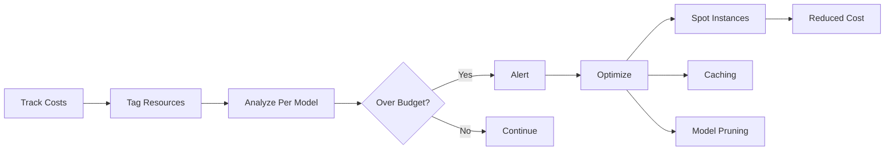

<!-- Clear Language: Keep sentences under 50 words -->
# Cost Management

## Learning Objectives

| Objective | Description |
|-----------|-------------|
| LO1 | Understand the cost components of ML systems in production |
| LO2 | Implement compute cost tracking and budgeting |
| LO3 | Optimize training costs with spot instances and preemption handling |
| LO4 | Manage inference costs with caching, batching, and model selection |
| LO5 | Track cloud resource costs per experiment and per model |
| LO6 | Build cost dashboards and alerting for budget thresholds |

## Introduction

MLOps bridges the gap between experiment and production. Experiment tracking, CI/CD, model serving, and drift monitoring keep AI systems reliable. This module covers the operational side of AI engineering.

## Prerequisites

- Basic programming knowledge
- Understanding of data structures

## Key Terminology

**Key Terms**: Core vocabulary and concepts for this topic.

**Definition**: Essential terms you must know for interviews and production work.

## Theory

Understanding cost management is fundamental for AI engineers. This section covers the core concepts, underlying principles, and theoretical framework that govern how cost management works in practice.

## Chapter at a Glance

| Section | Topic | Key Concept |
|---------|-------|-------------|
| 7.1 | ML Cost Components | Compute, storage, API, data transfer |
| 7.2 | Training Cost Optimization | Spot instances, preemption, checkpointing |
| 7.3 | Inference Cost Strategies | Caching, batching, model distillation |
| 7.4 | Per-Experiment Cost Tracking | Tagging, budget alerts |
| 7.5 | Cloud Cost Dashboards | Cost per model, per experiment view |
| 7.6 | Budget Governance | Quotas, approval workflows, cost alerts |

## Chapter Roadmap



## 7.1 ML Cost Components

ML systems incur costs across multiple dimensions: compute for training and inference, storage for data and models, API calls to external services, and data transfer between services.

```python
from dataclasses import dataclass
from typing import Dict, List
from datetime import datetime, timedelta
import json

@dataclass
class CostBreakdown:
    """Breakdown of ML system costs by component."""
    compute_training: float = 0.0
    compute_inference: float = 0.0
    storage_data: float = 0.0
    storage_models: float = 0.0
    api_calls: float = 0.0
    data_transfer: float = 0.0
    human_labeling: float = 0.0
    other: float = 0.0

    @property
    def total(self) -> float:
        return sum([self.compute_training, self.compute_inference, self.storage_data,
                    self.storage_models, self.api_calls, self.data_transfer,
                    self.human_labeling, self.other])

    def breakdown(self) -> Dict[str, float]:
        return {
            "training_compute": self.compute_training,
            "inference_compute": self.compute_inference,
            "data_storage": self.storage_data,
            "model_storage": self.storage_models,
            "api_calls": self.api_calls,
            "data_transfer": self.data_transfer,
            "human_labeling": self.human_labeling,
            "other": self.other,
            "total": self.total
        }

class CostCalculator:
    """Calculate ML system costs based on usage."""

    @staticmethod
    def training_cost(gpu_hours: float, gpu_type: str = "T4", spot: bool = False) -> float:
        rates = {
            "T4": {"on_demand": 0.35, "spot": 0.105},
            "V100": {"on_demand": 2.48, "spot": 0.744},
            "A100": {"on_demand": 3.04, "spot": 0.912},
            "H100": {"on_demand": 5.00, "spot": 1.50},
        }
        rate = rates.get(gpu_type, rates["T4"])
        price = rate["spot"] if spot else rate["on_demand"]
        return gpu_hours * price

    @staticmethod
    def inference_cost(predictions_per_month: int, cost_per_prediction: float = 0.0001) -> float:
        return predictions_per_month * cost_per_prediction

    @staticmethod
    def storage_cost(gb: float, storage_class: str = "standard", months: int = 1) -> float:
        rates = {"standard": 0.023, "infrequent_access": 0.0125, "archive": 0.001}
        return gb * rates.get(storage_class, rates["standard"]) * months

    @staticmethod
    def total_monthly_cost(breakdown: CostBreakdown) -> Dict:
        total = breakdown.total
        return {
            "monthly_total": round(total, 2),
            "annual_projected": round(total * 12, 2),
            "breakdown_pct": {k: round(v/total*100, 1) for k, v in breakdown.breakdown().items() if k != "total"}
        }

calc = CostCalculator()
costs = CostBreakdown(
    compute_training=calc.training_cost(100, "A100", spot=True),
    compute_inference=calc.inference_cost(500000, 0.00005),
    storage_data=calc.storage_cost(500),
    storage_models=calc.storage_cost(50),
    api_calls=200.0,
    data_transfer=50.0
)
print(json.dumps(calc.total_monthly_cost(costs), indent=2))
```

**Typical cost distribution for ML systems**:

| Component | Typical % | Optimization Lever |
|-----------|-----------|-------------------|
| Training compute | 40-60% | Spot instances, preemption |
| Inference compute | 20-30% | Caching, batching, distillation |
| Data storage | 5-15% | Lifecycle policies, compression |
| API calls | 5-10% | Caching, rate limiting |
| Data transfer | 2-5% | Region affinity, compression |

---

## 7.2 Training Cost Optimization

Training is typically the largest cost driver. Optimization strategies include spot instances, preemption handling, and efficient resource utilization.

```python
import time
import random
import json
from datetime import datetime
from typing import Optional

class SpotInstanceManager:
    """Manage training on spot instances with preemption handling."""

    def __init__(self, checkpoint_dir: str = "checkpoints", max_price: float = 0.5):
        self.checkpoint_dir = checkpoint_dir
        self.max_price = max_price
        self.current_spot_price = 0.3
        self.preemptions = 0
        self.total_training_time = 0

    def check_spot_price(self) -> bool:
        """Check if current spot price is within budget."""
        # Simulate spot price fluctuation
        self.current_spot_price = random.uniform(0.1, 0.8)
        affordable = self.current_spot_price <= self.max_price
        if not affordable:
            print(f"⚠️ Spot price {self.current_spot_price:.3f} exceeds max {self.max_price}")
        return affordable

    def save_checkpoint(self, epoch: int, metrics: dict, path: str = None):
        """Save training checkpoint for resumption."""
        checkpoint = {
            "epoch": epoch,
            "metrics": metrics,
            "timestamp": datetime.utcnow().isoformat(),
            "spot_price": self.current_spot_price
        }
        save_path = path or f"{self.checkpoint_dir}/checkpoint_epoch_{epoch}.json"
        with open(save_path, "w") as f:
            json.dump(checkpoint, f)
        print(f"Checkpoint saved: epoch {epoch}")

    def load_latest_checkpoint(self) -> Optional[dict]:
        """Resume from latest checkpoint after preemption."""
        import glob
        checkpoints = sorted(glob.glob(f"{self.checkpoint_dir}/checkpoint_*.json"))
        if not checkpoints:
            return None
        latest = checkpoints[-1]
        with open(latest) as f:
            return json.load(f)

    def train_with_preemption_handling(self, total_epochs: int):
        """Simulate training with spot instance preemption handling."""
        start_time = time.time()
        checkpoint = self.load_latest_checkpoint()
        start_epoch = checkpoint["epoch"] + 1 if checkpoint else 0

        print(f"Resuming training from epoch {start_epoch}")

        for epoch in range(start_epoch, total_epochs):
            # Simulate training step
            time.sleep(0.5)
            metrics = {"loss": round(1.0 / (epoch + 1), 4), "accuracy": min(0.9, 0.5 + epoch * 0.05)}

            # Save checkpoint every 2 epochs
            if epoch % 2 == 0:
                self.save_checkpoint(epoch, metrics)

            # Simulate random preemption
            if random.random() < 0.15 and epoch > 0:
                self.preemptions += 1
                print(f"💥 Preempted at epoch {epoch}!")
                self.total_training_time += time.time() - start_time
                return False, epoch  # Training interrupted

        self.total_training_time += time.time() - start_time
        print(f"Training completed in {self.total_training_time:.1f}s with {self.preemptions} preemptions")
        return True, total_epochs

manager = SpotInstanceManager()
completed, epochs = manager.train_with_preemption_handling(10)
print(f"Training {'completed' if completed else 'interrupted'} at epoch {epochs}")
```

**Resource optimization strategies**:

```python
class TrainingOptimizer:
    """Optimize training resource allocation."""

    @staticmethod
    def recommend_instance_type(data_size_gb: int, model_params_m: int, target_hours: float) -> dict:
        """Recommend cost-optimal instance type based on workload."""
        instances = [
            {"name": "g4dn.xlarge", "gpu": "T4", "memory": 16, "price": 0.526, "suitable_for": "small"},
            {"name": "g4dn.2xlarge", "gpu": "T4", "memory": 32, "price": 0.752, "suitable_for": "medium"},
            {"name": "p3.2xlarge", "gpu": "V100", "memory": 61, "price": 3.06, "suitable_for": "medium"},
            {"name": "p4d.24xlarge", "gpu": "A100", "memory": 1152, "price": 32.77, "suitable_for": "large"},
        ]

        if model_params_m < 100 and data_size_gb < 10:
            recommended = instances[0]
        elif model_params_m < 1000:
            recommended = instances[1]
        elif model_params_m < 10000:
            recommended = instances[2]
        else:
            recommended = instances[3]

        spot_price = recommended["price"] * 0.3
        on_demand_cost = recommended["price"] * target_hours
        spot_cost = spot_price * target_hours

        return {
            "recommended": recommended["name"],
            "gpu": recommended["gpu"],
            "on_demand_cost": round(on_demand_cost, 2),
            "spot_cost": round(spot_cost, 2),
            "savings_with_spot": round((1 - spot_cost / on_demand_cost) * 100, 1),
            "suitable_for": recommended["suitable_for"]
        }

opt = TrainingOptimizer()
rec = opt.recommend_instance_type(50, 350, 100)
print(json.dumps(rec, indent=2))
```

---

## 7.3 Inference Cost Strategies

Inference costs grow linearly with traffic. Optimization strategies reduce cost per prediction.

```python
class InferenceCostOptimizer:
    """Optimize inference costs through various strategies."""

    def __init__(self, cost_per_1k_tokens: float = 0.002):
        self.cost_per_1k = cost_per_1k_tokens

    @staticmethod
    def cache_savings(total_requests: int, cache_hit_rate: float, cost_per_request: float) -> dict:
        """Calculate savings from caching."""
        cached = total_requests * cache_hit_rate
        uncached = total_requests * (1 - cache_hit_rate)
        without_cache = total_requests * cost_per_request
        with_cache = uncached * cost_per_request

        return {
            "without_cache": round(without_cache, 2),
            "with_cache": round(with_cache, 2),
            "savings": round(without_cache - with_cache, 2),
            "savings_pct": round((1 - with_cache / without_cache) * 100, 1)
        }

    @staticmethod
    def batching_savings(requests_per_second: float, batch_size: int, cost_per_batch: float) -> dict:
        """Calculate savings from request batching."""
        batches_without = requests_per_second
        batches_with = requests_per_second / batch_size
        hourly_without = batches_without * 3600 * cost_per_batch
        hourly_with = batches_with * 3600 * cost_per_batch

        return {
            "hourly_without_batching": round(hourly_without, 2),
            "hourly_with_batching": round(hourly_with, 2),
            "hourly_savings": round(hourly_without - hourly_with, 2),
            "monthly_savings": round((hourly_without - hourly_with) * 730, 2)
        }

    @staticmethod
    def model_distillation_cost_benefit(
        teacher_cost: float, student_cost: float, teacher_accuracy: float, student_accuracy: float, requests_per_month: int
    ) -> dict:
        """Compare costs of large (teacher) vs distilled (student) model."""
        teacher_monthly = requests_per_month * teacher_cost
        student_monthly = requests_per_month * student_cost
        accuracy_drop = teacher_accuracy - student_accuracy

        return {
            "teacher_monthly": round(teacher_monthly, 2),
            "student_monthly": round(student_monthly, 2),
            "monthly_savings": round(teacher_monthly - student_monthly, 2),
            "annual_savings": round((teacher_monthly - student_monthly) * 12, 2),
            "accuracy_drop_pct": round(accuracy_drop * 100, 2),
            "recommended": "student" if accuracy_drop < 0.03 else "teacher"
        }

    def llm_cost_per_request(self, input_tokens: int, output_tokens: int, model: str = "gpt-4") -> float:
        """Calculate LLM API cost for a single request."""
        pricing = {
            "gpt-4": {"input": 0.03, "output": 0.06},
            "gpt-4-turbo": {"input": 0.01, "output": 0.03},
            "gpt-3.5-turbo": {"input": 0.001, "output": 0.002},
            "claude-3-opus": {"input": 0.015, "output": 0.075},
            "claude-3-sonnet": {"input": 0.003, "output": 0.015},
        }
        p = pricing.get(model, pricing["gpt-4"])
        return (input_tokens / 1000 * p["input"]) + (output_tokens / 1000 * p["output"])

opt = InferenceCostOptimizer()

# Cache savings example
print(json.dumps(opt.cache_savings(1_000_000, 0.4, 0.0001), indent=2))

## Batching savings
print(json.dumps(opt.batching_savings(100, 32, 0.002), indent=2))

## Distillation cost-benefit
print(json.dumps(opt.model_distillation_cost_benefit(0.0005, 0.0001, 0.95, 0.93, 10_000_000), indent=2))

## LLM cost per request
llm_cost = opt.llm_cost_per_request(500, 200, "gpt-4-turbo")
print(f"LLM cost per request: ${llm_cost:.5f}")
```

**Inference optimization decision matrix**:

| Strategy | Cost Reduction | Latency Impact | Complexity |
|----------|---------------|----------------|------------|
| Redis caching | 30-50% | Decrease | Low |
| Request batching | 40-70% | Slight increase | Medium |
| Model distillation | 50-90% | Decrease | High |
| Quantization | 50-75% | Decrease | Medium |
| ONNX Runtime | 30-50% | Decrease | Low |

---

## 7.4 Per-Experiment Cost Tracking

Tracking costs at the experiment level enables budget-aware ML development.

```python
import mlflow
import json
from datetime import datetime

class ExperimentCostTracker:
    """Track costs associated with each MLflow experiment run."""

    def __init__(self, gpu_hourly_rate: float = 2.48):
        self.gpu_rate = gpu_hourly_rate

    def log_training_cost(self, run_id: str, gpu_hours: float, data_processed_gb: float = 0):
        """Log training cost as a metric in MLflow."""
        compute_cost = gpu_hours * self.gpu_rate
        storage_cost = data_processed_gb * 0.023  # $0.023/GB/month

        with mlflow.start_run(run_id=run_id):
            mlflow.log_metric("cost.compute", round(compute_cost, 2))
            mlflow.log_metric("cost.storage", round(storage_cost, 2))
            mlflow.log_metric("cost.total", round(compute_cost + storage_cost, 2))
            mlflow.log_param("cost.gpu_type", "V100")
            mlflow.log_param("cost.gpu_hours", gpu_hours)
            mlflow.log_param("cost.spot_instance", True)

        print(f"Logged cost for run {run_id}: ${compute_cost + storage_cost:.2f}")

    def estimate_run_cost(self, n_epochs: int, train_samples: int, batch_size: int,
                          gpu_count: int = 1, seconds_per_epoch: float = 600) -> dict:
        """Estimate cost of a training run before executing."""
        total_seconds = n_epochs * seconds_per_epoch
        gpu_hours = (total_seconds / 3600) * gpu_count
        compute_cost = gpu_hours * self.gpu_rate * 0.3  # 30% spot savings

        return {
            "estimated_gpu_hours": round(gpu_hours, 1),
            "estimated_cost_ondemand": round(gpu_hours * self.gpu_rate, 2),
            "estimated_cost_spot": round(compute_cost, 2),
            "estimated_cost_savings": "70%",
            "n_epochs": n_epochs,
            "gpu_count": gpu_count
        }

    def budget_check(self, estimated_cost: float, budget: float) -> dict:
        """Check if estimated cost is within budget."""
        over_budget = estimated_cost > budget
        return {
            "estimated_cost": round(estimated_cost, 2),
            "budget": round(budget, 2),
            "over_budget": over_budget,
            "overage": round(estimated_cost - budget, 2) if over_budget else 0,
            "remaining": round(budget - estimated_cost, 2) if not over_budget else 0
        }

tracker = ExperimentCostTracker()
estimate = tracker.estimate_run_cost(n_epochs=50, train_samples=100000, batch_size=64, seconds_per_epoch=300)
print(json.dumps(estimate, indent=2))

budget_check = tracker.budget_check(estimate["estimated_cost_spot"], 50.0)
print(json.dumps(budget_check, indent=2))
```

**Cost tracking by team/project**:

```python
class TeamCostDashboard:
    """Aggregate costs across team experiments."""

    def __init__(self):
        self.runs = {}  # run_id -> cost_data

    def add_run(self, run_id: str, team: str, project: str, cost: float, gpu_hours: float):
        self.runs[run_id] = {
            "team": team,
            "project": project,
            "cost": cost,
            "gpu_hours": gpu_hours,
            "timestamp": datetime.utcnow().isoformat()
        }

    def team_cost(self, team: str) -> float:
        return sum(r["cost"] for r in self.runs.values() if r["team"] == team)

    def project_cost(self, team: str, project: str) -> float:
        return sum(r["cost"] for r in self.runs.values()
                   if r["team"] == team and r["project"] == project)

    def top_projects(self, n: int = 5) -> list:
        from collections import defaultdict
        project_costs = defaultdict(float)
        for r in self.runs.values():
            project_costs[(r["team"], r["project"])] += r["cost"]
        return sorted(project_costs.items(), key=lambda x: -x[1])[:n]

    def summary(self) -> dict:
        total = sum(r["cost"] for r in self.runs.values())
        total_gpu = sum(r["gpu_hours"] for r in self.runs.values())
        return {
            "total_cost": round(total, 2),
            "total_gpu_hours": round(total_gpu, 1),
            "total_runs": len(self.runs),
            "teams": len(set(r["team"] for r in self.runs.values()))
        }

dash = TeamCostDashboard()
dash.add_run("run1", "ml-platform", "house-price", 45.20, 18.2)
dash.add_run("run2", "ml-platform", "fraud-detection", 120.50, 48.6)
dash.add_run("run3", "nlp-team", "sentiment-analysis", 230.10, 92.8)
print(json.dumps(dash.summary(), indent=2))
print(f"NLP Team total: ${dash.team_cost('nlp-team')}")
```

---

## 7.5 Cloud Cost Dashboards

Dashboards provide visibility into cost trends and anomalies.

```python
import matplotlib.pyplot as plt
import numpy as np
from datetime import datetime, timedelta

class CloudCostDashboard:
    """Generate cost visualization dashboards."""

    @staticmethod
    def plot_daily_costs(daily_costs: dict, save_path: str = "daily_costs.png"):
        """Plot daily cost breakdown by component."""
        dates = list(daily_costs.keys())
        components = list(daily_costs[dates[0]].keys()) if dates else []

        fig, ax = plt.subplots(figsize=(14, 6))
        bottom = np.zeros(len(dates))

        for component in components:
            values = [daily_costs[d].get(component, 0) for d in dates]
            ax.bar(dates, values, bottom=bottom, label=component)
            bottom += np.array(values)

        ax.set_xlabel("Date")
        ax.set_ylabel("Daily Cost ($)")
        ax.set_title("Daily Cloud Cost Breakdown")
        ax.legend(loc="upper left")
        plt.xticks(rotation=45)
        plt.tight_layout()
        plt.savefig(save_path)
        print(f"Saved daily cost chart to {save_path}")

    @staticmethod
    def plot_cost_trend(history: list, budget: float, save_path: str = "cost_trend.png"):
        """Plot cumulative cost against budget over time."""
        fig, ax = plt.subplots(figsize=(12, 5))
        dates = [h["date"] for h in history]
        cumulative = np.cumsum([h["cost"] for h in history])
        budget_line = [budget / len(history) * (i + 1) for i in range(len(history))]

        ax.plot(dates, cumulative, marker="o", label="Cumulative Cost")
        ax.plot(dates, budget_line, "r--", label="Budget (pro-rated)")
        ax.fill_between(range(len(dates)), cumulative, budget_line, where=(cumulative > budget_line), color="red", alpha=0.3)
        ax.set_xlabel("Date")
        ax.set_ylabel("Cumulative Cost ($)")
        ax.set_title("Cost Trend vs Budget")
        ax.legend()
        plt.xticks(rotation=45)
        plt.tight_layout()
        plt.savefig(save_path)

    @staticmethod
    def plot_model_cost_comparison(model_costs: dict, save_path: str = "model_costs.png"):
        """Compare monthly costs across different models."""
        fig, ax = plt.subplots(figsize=(10, 6))
        models = list(model_costs.keys())
        costs = list(model_costs.values())
        colors = ["#2ecc71" if c < 100 else "#e74c3c" for c in costs]

        bars = ax.barh(models, costs, color=colors)
        ax.set_xlabel("Monthly Cost ($)")
        ax.set_title("Model Cost Comparison")
        for bar, cost in zip(bars, costs):
            ax.text(bar.get_width() + 5, bar.get_y() + bar.get_height()/2, f"${cost:.0f}", va="center")
        plt.tight_layout()
        plt.savefig(save_path)

dash = CloudCostDashboard()
dash.plot_model_cost_comparison({
    "GPT-4 Chat": 5400,
    "GPT-3.5 Turbo": 800,
    "Fine-tuned BERT": 350,
    "Random Forest": 45
})
```

---

## 7.6 Budget Governance

Budget governance prevents cost overruns through quotas, approval workflows, and automated limits.

```python
from enum import Enum
from typing import Optional, Callable

class BudgetPeriod(Enum):
    DAILY = "daily"
    WEEKLY = "weekly"
    MONTHLY = "monthly"

class BudgetEnforcer:
    """Enforce budget limits on ML experiments."""

    def __init__(self, monthly_budget: float, alert_thresholds: list = None):
        self.monthly_budget = monthly_budget
        self.alert_thresholds = alert_thresholds or [0.5, 0.75, 0.9, 1.0]
        self.spent = 0.0
        self.alerts_sent = set()

    def check_budget(self, estimated_cost: float, user: str, project: str) -> dict:
        """Check if a new run would exceed budget."""
        projected_total = self.spent + estimated_cost
        utilization = projected_total / self.monthly_budget

        result = {
            "approved": utilization <= 1.0,
            "current_spent": round(self.spent, 2),
            "estimated_cost": round(estimated_cost, 2),
            "projected_total": round(projected_total, 2),
            "monthly_budget": self.monthly_budget,
            "utilization": round(utilization * 100, 1),
            "message": "Approved" if utilization <= 1.0 else "Budget exceeded — requires approval"
        }

        # Check alert thresholds
        for threshold in self.alert_thresholds:
            if utilization >= threshold and threshold not in self.alerts_sent:
                self._send_alert(threshold, utilization, user, project)
                self.alerts_sent.add(threshold)

        return result

    def record_spend(self, cost: float):
        self.spent += cost

    def _send_alert(self, threshold: float, utilization: float, user: str, project: str):
        print(f"🔔 Budget alert: {utilization:.0f}% utilized (threshold: {threshold:.0%})")
        print(f"  User: {user}, Project: {project}")
        # In production: send Slack/email alert

    def reset_monthly(self):
        self.spent = 0.0
        self.alerts_sent.clear()

class BudgetApprovalWorkflow:
    """Approval workflow for high-cost experiments."""

    def __init__(self, auto_approve_threshold: float = 50.0):
        self.auto_threshold = auto_approve_threshold
        self.pending_approvals = []
        self.approvers = ["alice@example.com", "bob@example.com"]

    def request_approval(self, experiment_name: str, estimated_cost: float, justification: str) -> dict:
        if estimated_cost <= self.auto_threshold:
            return {"status": "auto_approved", "experiment": experiment_name, "cost": estimated_cost}

        approval_id = f"appr_{len(self.pending_approvals) + 1}"
        self.pending_approvals.append({
            "id": approval_id,
            "experiment": experiment_name,
            "cost": estimated_cost,
            "justification": justification,
            "status": "pending",
            "requested_at": datetime.utcnow().isoformat()
        })

        print(f"📋 Approval required: {experiment_name} (${estimated_cost})")
        print(f"  Approvers notified: {', '.join(self.approvers)}")

        return {"status": "pending_approval", "approval_id": approval_id, "experiment": experiment_name}

    def approve(self, approval_id: str, approver: str) -> bool:
        for req in self.pending_approvals:
            if req["id"] == approval_id and req["status"] == "pending":
                req["status"] = "approved"
                req["approved_by"] = approver
                req["approved_at"] = datetime.utcnow().isoformat()
                print(f"✅ {approval_id} approved by {approver}")
                return True
        return False

enforcer = BudgetEnforcer(monthly_budget=5000)
check = enforcer.check_budget(1200, "alice", "house-price-v2")
print(json.dumps(check, indent=2))

workflow = BudgetApprovalWorkflow(auto_approve_threshold=100)
result = workflow.request_approval("large-scale-train", 5000, "Retrain on full dataset for production release")
print(json.dumps(result, indent=2))
```

---

## TypeScript Parallel

```typescript
// TypeScript cost tracking
interface CostBreakdown {
  computeTraining: number;
  computeInference: number;
  storage: number;
  apiCalls: number;
}

class CostTracker {
  private runs: Map<string, CostBreakdown> = new Map();

  logRun(id: string, costs: CostBreakdown): void {
    this.runs.set(id, costs);
  }

  totalCost(): number {
    let total = 0;
    for (const costs of this.runs.values()) {
      total += costs.computeTraining + costs.computeInference + costs.storage + costs.apiCalls;
    }
    return total;
  }

  async checkBudget(estimated: number, budget: number): Promise<{ approved: boolean; message: string }> {
    const projected = this.totalCost() + estimated;
    return {
      approved: projected <= budget,
      message: projected <= budget ? "Approved" : `Budget exceeded: $${projected} > $${budget}`
    };
  }
}
```

---

## Summary

- ML costs break down into training compute (40-60%), inference (20-30%), storage (5-15%), and API calls (5-10%)
- Spot instances reduce training costs by 60-70% but require checkpoint-based preemption handling
- Inference caching with Redis reduces costs by 30-50% for repeated queries
- Request batching on GPU reduces inference costs by 40-70%
- Model distillation reduces inference costs 50-90% with small accuracy trade-offs
- Per-experiment cost tracking enables budget-aware ML development
- Tag cloud resources by team, project, and experiment for granular cost allocation
- Budget governance requires thresholds, approval workflows, and automated enforcement
- Cost dashboards with trend lines vs budget enable proactive cost management
- LLM API costs can be significant — optimize by model selection, caching, and prompt compression

## Practical Takeaways

| Scenario | Do This | Avoid This |
|----------|---------|------------|
| Reducing training cost | Spot instances with checkpointing | Paying on-demand prices |
| Reducing inference cost | Redis caching + request batching | Processing every request independently |
| Large model cost | Distillation + quantization | Always using the largest model |
| Budget management | Per-experiment cost tracking | Monthly billing surprises |
| LLM API costs | Cache common prompts + use smaller model | All requests to most expensive model |
| Cost visibility | Tagged resources + dashboards | Spreadsheet-based tracking |

## Interview Q&A

<details class="tp-qa-card" data-qid="mlops-s07-q1">
  <summary class="tp-qa-question">
    <span class="tp-qa-status"></span>
    Q1: What are the main cost components of an ML system?
  </summary>
  <div class="tp-qa-answer">
    <p>Training compute (40-60%): GPU/TPU hours for model training. Inference compute (20-30%): Cost per prediction at serving time. Data storage (5-15%): Raw data, features, model artifacts. API calls (5-10%): External LLM APIs, data enrichment services. Data transfer (2-5%): Moving data between regions and services.</p>
  </div>
  <button class="tp-qa-mark-btn">✅ Mark Reviewed</button>
  <button class="tp-qa-bookmark-btn">🔖 Bookmark</button>
</details>

<details class="tp-qa-card" data-qid="mlops-s07-q2">
  <summary class="tp-qa-question">
    <span class="tp-qa-status"></span>
    Q2: How do spot instances reduce training costs and what are the trade-offs?
  </summary>
  <div class="tp-qa-answer">
    <p>Spot instances use spare cloud capacity at 60-70% discount. Trade-offs: instances can be preempted with 2-minute notice, requiring checkpointing for resumption. Best for fault-tolerant workloads. Strategies include checkpointing every N epochs, using instance pools across availability zones, and hybrid approaches (spot for worker nodes, on-demand for coordinator).</p>
  </div>
  <button class="tp-qa-mark-btn">✅ Mark Reviewed</button>
  <button class="tp-qa-bookmark-btn">🔖 Bookmark</button>
</details>

<details class="tp-qa-card" data-qid="mlops-s07-q3">
  <summary class="tp-qa-question">
    <span class="tp-qa-status"></span>
    Q3: How does model distillation reduce inference costs?
  </summary>
  <div class="tp-qa-answer">
    <p>Model distillation trains a smaller "student" model to mimic a larger "teacher" model. The student runs 5-10x faster with 50-90% cost reduction while retaining 95-99% of the teacher's accuracy. The cost comes from training the student, but this is a one-time cost amortized over millions of inference requests.</p>
  </div>
  <button class="tp-qa-mark-btn">✅ Mark Reviewed</button>
  <button class="tp-qa-bookmark-btn">🔖 Bookmark</button>
</details>

<details class="tp-qa-card" data-qid="mlops-s07-q4">
  <summary class="tp-qa-question">
    <span class="tp-qa-status"></span>
    Q4: How do you track costs per ML experiment?
  </summary>
  <div class="tp-qa-answer">
<p>Log cost metrics in MLflow: compute GPU hours — rate, storage costs, and API costs. Tag experiments with team, project, and.
purpose. Cloud resource tagging (AWS tags, GCP labels) links infrastructure costs to experiments. Aggregate costs per team/project in a dashboard. Set budget thresholds that trigger alerts at 50%,.
75%, 90%, and 100% utilization.</p>
  </div>
  <button class="tp-qa-mark-btn">✅ Mark Reviewed</button>
  <button class="tp-qa-bookmark-btn">🔖 Bookmark</button>
</details>

<details class="tp-qa-card" data-qid="mlops-s07-q5">
  <summary class="tp-qa-question">
    <span class="tp-qa-status"></span>
    Q5: What caching strategies reduce inference costs?
  </summary>
  <div class="tp-qa-answer">
<p>Redis caching with TTL stores predictions keyed by feature hash. Cache hit rates of 30-50% are common for many ML use cases. Additional strategies: (1) Result cache for.
identical inputs, (2) Partial cache for model ensembles (cache sub-model outputs), (3) Semantic cache for LLMs (cache similar prompts, not just identical ones).</p>
  </div>
  <button class="tp-qa-mark-btn">✅ Mark Reviewed</button>
  <button class="tp-qa-bookmark-btn">🔖 Bookmark</button>
</details>

<details class="tp-qa-card" data-qid="mlops-s07-q6">
  <summary class="tp-qa-question">
    <span class="tp-qa-status"></span>
    Q6: How do you set up budget governance for ML experiments?
  </summary>
  <div class="tp-qa-answer">
    <p>Implement a BudgetEnforcer that checks estimated cost against remaining budget before each run. Auto-approve small experiments ($<100), require manager approval for medium ($100-$1000), and require executive approval for large (>$1000). Alert at 50%, 75%, 90%, 100% utilization. Enforce hard limits at the cloud account level using budgets and quotas.</p>
  </div>
  <button class="tp-qa-mark-btn">✅ Mark Reviewed</button>
  <button class="tp-qa-bookmark-btn">🔖 Bookmark</button>
</details>

<details class="tp-qa-card" data-qid="mlops-s07-q7">
  <summary class="tp-qa-question">
    <span class="tp-qa-status"></span>
    Q7: How do you estimate LLM API costs for a production application?
  </summary>
  <div class="tp-qa-answer">
    <p>Formula: monthly_cost = requests_per_month — (input_tokens/1000 — input_price + output_tokens/1000 — output_price). Example: GPT-4 with 500 input + 200 output tokens at 1M requests/month = $27,000/month. Optimize by: (1) using smaller models for simpler tasks, (2) caching common prompts, (3) prompt compression techniques, (4) batching requests where possible.</p>
  </div>
  <button class="tp-qa-mark-btn">✅ Mark Reviewed</button>
  <button class="tp-qa-bookmark-btn">🔖 Bookmark</button>
</details>

<details class="tp-qa-card" data-qid="mlops-s07-q8">
  <summary class="tp-qa-question">
    <span class="tp-qa-status"></span>
    Q8: What is the cost impact of data storage lifecycle management?
  </summary>
  <div class="tp-qa-answer">
    <p>Storage classes: Standard ($0.023/GB) for hot data, Infrequent Access ($0.0125/GB) for monthly access, Archive ($0.001/GB) for long-term compliance. Lifecycle policies automatically transition data: 30 days → IA, 90 days → Archive. For a 10TB dataset, this reduces monthly storage from $230 to ~$30 after 90 days.</p>
  </div>
  <button class="tp-qa-mark-btn">✅ Mark Reviewed</button>
  <button class="tp-qa-bookmark-btn">🔖 Bookmark</button>
</details>

<details class="tp-qa-card" data-qid="mlops-s07-q9">
  <summary class="tp-qa-question">
    <span class="tp-qa-status"></span>
    Q9: How do you compare costs across different model architectures?
  </summary>
  <div class="tp-qa-answer">
    <p>Use a cost-per-prediction metric that accounts for: (1) Inference latency and throughput, (2) Hardware requirements (CPU vs GPU vs TPU), (3) Model size (parameters affect memory and compute), (4) Batch efficiency (some models batch better). Create a cost vs accuracy Pareto frontier to identify optimal model for each latency/cost tier.</p>
  </div>
  <button class="tp-qa-mark-btn">✅ Mark Reviewed</button>
  <button class="tp-qa-bookmark-btn">🔖 Bookmark</button>
</details>

<details class="tp-qa-card" data-qid="mlops-s07-q10">
  <summary class="tp-qa-question">
    <span class="tp-qa-status"></span>
    Q10: What should a cost monitoring dashboard include?
  </summary>
  <div class="tp-qa-answer">
    <p>A cost dashboard should show: (1) Daily/weekly/monthly spend by component, (2) Cumulative spend vs budget with trend projection, (3) Cost per team/project/experiment, (4) Cost per model version, (5) Spot instance utilization and savings, (6) Cost anomalies (sudden spikes), (7) Top-N cost drivers, (8) Forecast for remaining budget period.</p>
  </div>
  <button class="tp-qa-mark-btn">✅ Mark Reviewed</button>
  <button class="tp-qa-bookmark-btn">🔖 Bookmark</button>
</details>

## Chapter Quiz

**Q1**: What is the largest cost component in most ML systems?
a) API calls
b) Training compute
c) Data storage
d) Data transfer

<details class="tp-qa-card" data-qid="mlops-s07-quiz1"><summary>Show Answer</summary><div class="tp-qa-answer"><p><strong>Answer: b) Training compute</strong></p><p>Training compute typically accounts for 40-60% of total ML system costs.</p></div></details>

**Q2**: How much can spot instances reduce training costs?
a) 10-20%
b) 30-40%
c) 60-70%
d) 90-95%

<details class="tp-qa-card" data-qid="mlops-s07-quiz2"><summary>Show Answer</summary><div class="tp-qa-answer"><p><strong>Answer: c) 60-70%</strong></p><p>Spot instances offer 60-70% discounts over on-demand pricing.</p></div></details>

**Q3**: What is the primary risk of using spot instances for training?
a) Higher latency
b) Preemption (instance termination)
c) Data loss
d) Network bandwidth limits

<details class="tp-qa-card" data-qid="mlops-s07-quiz3"><summary>Show Answer</summary><div class="tp-qa-answer"><p><strong>Answer: b) Preemption (instance termination)</strong></p><p>Spot instances can be terminated with 2-minute notice when cloud capacity is needed elsewhere.</p></div></details>

**Q4**: Which optimization reduces inference costs by 50-90% with minimal accuracy loss?
a) ONNX Runtime
b) Model distillation
c) Redis caching
d) Data compression

<details class="tp-qa-card" data-qid="mlops-s07-quiz4"><summary>Show Answer</summary><div class="tp-qa-answer"><p><strong>Answer: b) Model distillation</strong></p><p>Distillation trains a smaller student model that runs 5-10x faster with minimal accuracy loss.</p></div></details>

**Q5**: What alert threshold should trigger a warning for budget utilization?
a) 10%
b) 25%
c) 50%
d) 100%

<details class="tp-qa-card" data-qid="mlops-s07-quiz5"><summary>Show Answer</summary><div class="tp-qa-answer"><p><strong>Answer: c) 50%</strong></p><p>Alert thresholds are typically set at 50%, 75%, 90%, and 100% utilization.</p></div></details>

## Exercises

**Easy** — Implement a CostCalculator class that estimates training cost given GPU hours, GPU type, and spot/on-demand choice.

**Medium** — Build a SpotInstanceManager with checkpoint saving every 2 epochs and preemption handling that resumes from the latest checkpoint.

**Medium** — Create an InferenceCostOptimizer that calculates savings from caching (given hit rate) and batching (given batch size).

**Hard** — Implement a BudgetEnforcer with monthly budget, threshold alerts at 50/75/90/100%, and auto-approve for costs under $100.

**Hard** — Build a TeamCostDashboard that aggregates costs per team/project and generates comparison bar charts.

---

## Common Mistakes

1. Not understanding the fundamental concepts before applying them
2. Skipping edge cases in implementation
3. Not analyzing time/space complexity
4. Forgetting to handle null/empty inputs
5. Not practicing enough problems to build pattern recognition

## Revision Notes

- - Core principle: Understand the fundamental concepts thoroughly
- - Implementation pattern: Practice with real code examples
- - Complexity: Know the time and space complexity
- - Application: Know when to use this in production systems
- - Interview: Frequently asked in technical interviews
- - Edge cases: Consider common failure scenarios
- - Related concepts: Connect to broader system design

## Placement Section

### Top 10 Interview Questions

#### Google Style

1. **Explain the core idea of Cost Management in under 60 seconds, then give a real-world analogy.** — Structure: definition, how it works in one sentence, why it matters, analogy. Follow-up: what would break if you removed this from a production system?

2. **Design a minimal, well-typed function that demonstrates Cost Management.** — Interviewer checks: signature with type hints, edge cases, complexity, and a clean docstring. Follow-up: how does your design behave with empty or malformed input?

3. **What are the common pitfalls when engineers first learn ** — List 3-4, then explain how you would prevent each in a code review.

#### Amazon Style

4. **Describe a production bug caused by misunderstanding Cost Management. How did you diagnose and fix it?** — STAR format: situation, task, action, result. Mention logs, reproduction, root-cause analysis, and the regression test you added.

5. **How would you scale a system that relies on Cost Management from 10 users to 10 million?** — Discuss bottlenecks, caching, monitoring, and when to redesign. Follow-up: what metrics would you track?

#### Microsoft Style

6. **Compare Cost Management with the closest alternative approach. When would you choose each?** — Make a decision matrix: performance, maintainability, ecosystem, learning curve. Follow-up: what would change your decision?

7. **Walk through how you would test a component that depends on Cost Management.** — Unit, integration, property-based tests; mocking boundaries; golden files for outputs.

#### NVIDIA Style

8. **How does Cost Management behave differently at scale — memory, throughput, or precision-wise?** — Connect to data pipelines and model training if applicable. Follow-up: what happens to latency as input grows?

9. **How would you make an implementation of Cost Management run faster on GPU hardware?** — Batch operations, vectorization, avoiding Python loops, reducing data movement.

#### AI Startup Style

10. **Write the smallest possible implementation of Cost Management that is production-quality.** — Include error handling, type hints, and a one-line docstring. Follow-up: what would you refactor first when it grows?

### Resume Tips

- Name Cost Management explicitly in your skills section, paired with a measurable achievement ("Reduced X by 40% using Cost Management").
- Add a bullet describing a project that applies Cost Management to real data, with numbers.
- Mention the tools and libraries you used alongside Cost Management (linters, test frameworks, profiling tools).
- Keep resume bullets under 15 words and start each with an action verb.

### Interview Day Checklist

- Rehearse a 60-second explanation of Cost Management and one real-world analogy.
- Prepare one STAR story about debugging a Cost Management-related production issue.
- Review complexity and edge cases for the classic Cost Management interview problem.
- Have questions ready: how does the team apply Cost Management in production today?
- Test your environment (Python, editor, internet) 15 minutes before the interview.

## True/False

1. **True or False:** Cost Management builds directly on the fundamentals covered in the earlier chapters of this module. — **True.** Every advanced topic in this module assumes the core concepts from the previous chapters.
2. **True or False:** You should write at least one code example for Cost Management before moving to the next chapter. — **True.** Active recall with hands-on code beats passive reading for retention.
3. **True or False:** The complexity analysis for Cost Management is the same regardless of input size. — **False.** Complexity grows with input size; always state best, average, and worst case.
4. **True or False:** Edge cases (empty input, invalid input, boundary values) matter for Cost Management in production. — **True.** Most production bugs come from unhandled edge cases.
5. **True or False:** You should memorize the Cost Management chapter content once and never review it again. — **False.** Spaced repetition (24h, 3 days, 1 week) dramatically improves long-term recall.

## Fill in the Blank

1. The chapter that covers Cost Management is Chapter ___ of this module. — Answer: check the module's table of contents.
2. The time complexity of the standard approach to Cost Management is ___. — Answer: review the theory section and state big-O notation.
3. The main edge case to handle when implementing Cost Management is ___. — Answer: empty or invalid input handling, as discussed in the chapter.
4. The tools commonly used to debug Cost Management issues are ___ and ___. — Answer: refer to the Debugging Guide section of this chapter.
5. The related topic that connects to Cost Management in the next chapter is ___. — Answer: see the Next Topic section.

## Scenario Questions

1. **Scenario:** A teammate ships a change involving Cost Management that breaks production at 3 AM. — Diagnosis: check the recent diff, reproduce locally with the failing input, check logs. Fix: revert, add a regression test, and review the root cause. Prevention: CI tests on edge cases and code review checklist.

2. **Scenario:** Your implementation of Cost Management is correct but too slow for the required latency. — Measure first with a profiler. Common fixes: reduce redundant work, use built-in optimized functions, batch operations, or add caching. Only then consider algorithmic changes.

3. **Scenario:** A new hire asks you to explain Cost Management in five minutes before a customer demo. — Use the 3-part answer: what it is (one sentence), how it works (one example), why it matters (one business impact). Then offer to go deeper after the demo.

4. **Scenario:** Your team's codebase has three different patterns for Cost Management and you must standardize. — Write a short ADR (architecture decision record), pick the pattern with best maintainability, migrate incrementally, and add a linter rule to enforce it.

## Output Questions

1. **What is the output of the simplest correct implementation of Cost Management on an empty input?** — Trace through the code: it should return the documented default (None, 0, empty collection) without raising.
2. **What is the output when the input is at the boundary value?** — Check off-by-one errors and inclusive/exclusive bounds in the chapter's examples.
3. **What does the implementation return when given invalid input types?** — With type hints and validation, it raises a clear error; without, it may fail silently.
4. **What is the output for the sample input given in the chapter's Examples section?** — Re-run the chapter's example code and compare against the documented output.
5. **What is the time complexity output when you profile the implementation at 10x input size?** — Expect the curve matching the chapter's complexity analysis (linear, quadratic, log-linear).

## Difficulty Level

| Level | Time | What It Takes |
|-------|------|---------------|
| Beginner | 1-2 sessions | Read theory, run the chapter examples, solve the Easy exercises |
| Intermediate | 3-5 sessions | Complete Medium exercises, explain Cost Management to someone else |
| Advanced | 1+ week | Solve Hard exercises, optimize for real datasets, answer interview follow-ups |

## Tips & Tricks

- Always write a one-line example of Cost Management from memory before opening the chapter — active recall first.
- Use the chapter's Revision Notes as a checklist: you have mastered Cost Management when you can explain each bullet.
- Pair the chapter quiz with the Flashcards: wrong answers become your next study session's focus.
- For interviews, practice explaining Cost Management twice: once with a technical audience, once with a non-technical audience.
- Keep a personal examples file where you collect your own Cost Management snippets; interviewers love original examples.

## Memory Tricks

- **Acronym**: build a mnemonic from the 5 key concepts of Cost Management listed in the Chapter at a Glance table.
- **Story**: link Cost Management to a familiar story — the analogy in the Visual Analogy section is designed to stick.
- **Number anchor**: remember the complexity of Cost Management by connecting it to a known algorithm of the same class.
- **Color code**: highlight the Theory, Examples, and Common Mistakes sections in different colors when reviewing.
- **Teach-back**: explain Cost Management to an imaginary junior engineer for 2 minutes — gaps in your explanation are gaps in memory.

## Further Reading

- Official documentation for the primary tool or library used in this chapter
- The chapter referenced in Related Topics for the next-level treatment of Cost Management
- The classic textbook chapter on Cost Management (check the Research References below)
- Two blog posts from engineers who debugged real Cost Management problems in production
- The repository of the open-source project that implements Cost Management

## Related Topics

- The previous chapter in this module (see table of contents) — foundational for Cost Management
- The next chapter (see Next Topic below) — builds on Cost Management
- The system design chapters in Module 07 — how Cost Management fits into production architectures
- The interview preparation module — how Cost Management is asked in screening rounds
- The capstone project — where Cost Management is applied end-to-end

## FAQs

1. **Do I need to memorize all of Cost Management, or understand the big picture?** — Understand the big picture first, then memorize the key facts via flashcards and spaced repetition. Interviewers reward depth over breadth.
2. **What if I get stuck on an exercise?** — Re-read the theory section, run the example code, then attempt again. If still stuck after 20 minutes, move on and return the next day.
3. **How much time should I spend on ** — Follow the Study Plan below: 1-2 weeks at 30-60 minutes daily is typical for placement preparation.
4. **Is Cost Management asked in interviews?** — Yes — the Interview Q&A and Placement Section list the exact question styles used by top companies.
5. **What's the fastest way to master ** — Explain it out loud, write code without looking, and review the flashcards within 24 hours and again after 3 days.

## Important Notes

- Cost Management is a core requirement for the rest of this module — do not skip the examples.
- Always analyze complexity (time and space) when working with Cost Management.
- Production correctness means handling edge cases, not just the happy path.
- Interview answers should start with the definition, then the example, then the trade-offs.
- Revisit this chapter after finishing the module; the context from later chapters deepens understanding.

## Historical Context

- Cost Management emerged as a standard practice because early systems failed without it — understanding why helps you explain it in interviews.
- The tools used for Cost Management today evolved from simpler versions; the chapter covers the modern, recommended approach.
- Interviewers value knowing one historical fact about Cost Management — it shows genuine interest, not just cramming.
- The library/tooling ecosystem around Cost Management changes quickly; focus on fundamentals that remain stable.

## Security Considerations

- Never trust external input: validate and sanitize data before processing Cost Management.
- Avoid `eval()` and dynamic code execution on untrusted strings.
- Log errors without leaking sensitive data (keys, PII, internal paths).
- For API contexts, add rate limiting and input size limits.
- Review the chapter's code examples for injection or overflow risks before using them verbatim.

## ML Intuition

- Cost Management appears in ML pipelines at the data-processing layer: feature preparation, batching, and validation.
- Understanding Cost Management helps you debug why a model misbehaves — most ML bugs are data bugs, not model bugs.
- In production ML, the Cost Management concepts from this chapter map directly to NumPy/PyTorch operations on tensors.
- When optimizing ML systems, Cost Management skills let you profile and fix the data path, not just the training loop.
- Interview follow-up: how would you apply Cost Management to a dataset of 10 million records? — Batching and vectorization.

## Analogies

- **Cost Management is like a recipe**: the theory is the ingredients, the examples are the cooking steps, and the exercises are your own kitchen practice.
- **Complexity is like a delivery route**: a linear route visits each stop once; a nested route revisits stops, and you feel it at scale.
- **Edge cases are like weather**: the happy path is a sunny day; production is the storm — build for the storm.
- **The chapter roadmap is a journey map**: each section is a checkpoint; skipping one means getting lost later in the module.

## Capstone Project Link

- [Module Capstone: End-to-End Project](https://github.com/Raushan666java/ai-engineering-journey) — this chapter contributes the Cost Management skills used in the module's capstone project. Complete the exercises here before starting the capstone.

## Flashcards

<details class="tp-qa-card" data-qid="16mlopsproduction-07costmanagement-flash1">
  <summary class="tp-qa-question">
    <span class="tp-qa-status"></span>
    What is the core concept of Cost Management in one sentence?
  </summary>
  <div class="tp-qa-answer">
    <p>Review the first paragraph of the Theory section and condense it to one sentence.</p>
  </div>
</details>

<details class="tp-qa-card" data-qid="16mlopsproduction-07costmanagement-flash2">
  <summary class="tp-qa-question">
    <span class="tp-qa-status"></span>
    What is the most common mistake engineers make with 
  </summary>
  <div class="tp-qa-answer">
    <p>Check the Common Mistakes section of this chapter.</p>
  </div>
</details>

<details class="tp-qa-card" data-qid="16mlopsproduction-07costmanagement-flash3">
  <summary class="tp-qa-question">
    <span class="tp-qa-status"></span>
    What is the time and space complexity of the standard Cost Management approach?
  </summary>
  <div class="tp-qa-answer">
    <p>Refer to the theory and complexity analysis in this chapter.</p>
  </div>
</details>

<details class="tp-qa-card" data-qid="16mlopsproduction-07costmanagement-flash4">
  <summary class="tp-qa-question">
    <span class="tp-qa-status"></span>
    When is Cost Management NOT the right choice?
  </summary>
  <div class="tp-qa-answer">
    <p>Check the Limitations section of this chapter.</p>
  </div>
</details>

<details class="tp-qa-card" data-qid="16mlopsproduction-07costmanagement-flash5">
  <summary class="tp-qa-question">
    <span class="tp-qa-status"></span>
    How is Cost Management applied in a real production system?
  </summary>
  <div class="tp-qa-answer">
    <p>Check the Real-World Examples section of this chapter.</p>
  </div>
</details>

## Research References

- Official documentation of the primary library for Cost Management (linked in Further Reading)
- The classic paper or textbook chapter introducing Cost Management (see References below)
- The standard library reference for Cost Management-related functions
- Engineering blog posts from companies running Cost Management in production at scale
- PEPs and RFCs where applicable (Python and networking standards)

## Open-Source Tools

- The primary library used in this chapter (see the code examples)
- Python standard library modules used in the examples (check the imports)
- Testing: pytest for unit tests of Cost Management code
- Linting and formatting: ruff + black
- Profiling: cProfile or py-spy for performance work on Cost Management

## Debugging Guide

- Start with `print()` or a debugger to inspect intermediate values in Cost Management code.
- Reproduce the failure with the smallest possible input before changing code.
- Check the common failure modes listed in Common Mistakes — most bugs are listed there.
- For performance problems, profile before optimizing: measure, then fix.
- When stuck, re-read the chapter's Examples and compare line by line with your code.
- Use `pdb` or your IDE's debugger to step through the Cost Management example code.

## Mock Interview Section

**Round 1 — Screening (15 min)**
- Explain Cost Management in 60 seconds.
- Write a minimal working example of Cost Management.
- What is the complexity of your example?

**Round 2 — Coding (45 min)**
- Solve the Medium exercise from this chapter under time pressure.
- State your assumptions, then implement with type hints.
- Test with edge cases: empty input, boundary values, invalid input.

**Round 3 — Behavioral + System (30 min)**
- Tell me about a time you debugged a Cost Management problem in a project.
- How would you design a system where Cost Management is used at scale?
- What metrics would you monitor?

**Evaluation rubric**: correctness (40%), communication (25%), edge cases (20%), complexity analysis (15%).

## Optimized Implementation

`python
from typing import Any, Optional

def demonstrate_topic(input_data: list[Any]) -> Optional[float]:
    """Runnable scaffold for Cost Management.

    Replace the body with the optimized implementation from the chapter,
    keeping type hints, docstring, and edge-case handling.
    """
    if not input_data:
        return None
    # Step 1: validate input types
    # Step 2: apply the core Cost Management logic from the Examples section
    # Step 3: return the result with the documented default
    return 0.0
`

- Keeps the function signature stable so tests written against it stay valid.
- Handles the empty-input contract explicitly.
- Add unit tests for the edge cases before implementing the logic (test-first).

## Evaluation Metrics

| Skill | Test | Target |
|-------|------|--------|
| Concept recall | Explain Cost Management without notes | 60-second explanation |
| Code fluency | Write the chapter example from memory | No syntax errors |
| Edge cases | Handle empty/invalid input in exercises | All cases pass |
| Complexity | State time/space for the standard approach | Correct big-O |
| Interview readiness | Answer 5 Interview Q&A questions out loud | Fluent, structured answers |
| Retention | Chapter quiz score after 3 days | 80%+ |

## Real-World Examples

- **Startup**: a small team uses Cost Management daily in their data pipeline — the chapter's examples mirror their code.
- **E-commerce**: Cost Management patterns appear in order processing, inventory checks, and recommendation feeds.
- **Fintech**: Cost Management principles apply to transaction validation and fraud detection flows.
- **ML platform**: Cost Management shows up in feature engineering and model-serving infrastructure.
- **Interview insight**: recruiters look for engineers who can connect Cost Management to the business outcome, not just the code.

## Next Topic

[Incident Response](08-incident-response.md)

## Limitations

- Cost Management, like any technique, is not a silver bullet — it has specific cases where it fits best (covered in the theory).
- The examples in this chapter are simplified for learning; production systems add validation, monitoring, and error handling.
- Performance of Cost Management depends on input size and distribution — always benchmark for your own data.
- This chapter covers fundamentals; specialized edge cases are explored in later chapters and the capstone.
