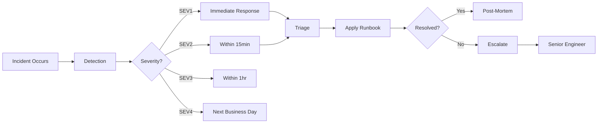

<!-- Clear Language: Keep sentences under 50 words -->
# Incident Response

## Learning Objectives

| Objective | Description |
|-----------|-------------|
| LO1 | Understand common ML production incidents and their root causes |
| LO2 | Build an incident response plan with severity levels |
| LO3 | Implement automated incident detection and alerting |
| LO4 | Design runbooks for common ML incidents |
| LO5 | Conduct post-mortems and track incident metrics |
| LO6 | Set up on-call rotations for ML systems |

## Introduction

MLOps bridges the gap between experiment and production. Experiment tracking, CI/CD, model serving, and drift monitoring keep AI systems reliable. This module covers the operational side of AI engineering.

## Prerequisites

- Basic programming knowledge
- Understanding of data structures

## Key Terminology

**Key Terms**: Core vocabulary and concepts for this topic.

**Definition**: Essential terms you must know for interviews and production work.

## Theory

Understanding incident response is fundamental for AI engineers. This section covers the core concepts, underlying principles, and theoretical framework that govern how incident response works in practice.

## Chapter at a Glance

| Section | Topic | Key Concept |
|---------|-------|-------------|
| 8.1 | ML Incident Types | Model failures, data issues, infrastructure |
| 8.2 | Severity Classification | SEV1-SEV4 with response SLAs |
| 8.3 | Incident Detection | Automated monitoring and alerting |
| 8.4 | Runbooks | Step-by-step response procedures |
| 8.5 | Post-Mortem Analysis | Root cause, timeline, action items |
| 8.6 | On-Call Practices | Rotations, escalation, incident commander |

## Chapter Roadmap



## 8.1 ML Incident Types

ML production incidents differ from traditional software incidents. They often involve silent failures where the system appears to work but produces incorrect results.

```python
from enum import Enum
from dataclasses import dataclass
from datetime import datetime
from typing import Optional, List

class IncidentType(Enum):
    MODEL_DEGRADATION = "model_degradation"  # Accuracy drop, drift
    DATA_FAILURE = "data_failure"            # Missing features, schema change
    INFRASTRUCTURE = "infrastructure"        # GPU failure, OOM, network
    PIPELINE_FAILURE = "pipeline_failure"    # Training job failure
    SECURITY = "security"                    # Model extraction, prompt injection
    LLM_HALLUCINATION = "llm_hallucination"  # Unsafe or incorrect LLM output
    LATENCY_SPIKE = "latency_spike"          # p99 latency exceeds SLA
    COST_ANOMALY = "cost_anomaly"            # Unexpected cost spike

@dataclass
class Incident:
    incident_id: str
    type: IncidentType
    severity: str  # SEV1-SEV4
    title: str
    description: str
    detected_at: datetime
    detected_by: str  # "monitoring" or "user_report"
    affected_models: List[str]
    affected_users: Optional[int] = None
    resolved_at: Optional[datetime] = None
    root_cause: Optional[str] = None
    action_items: List[str] = None

    def duration_minutes(self) -> Optional[float]:
        if self.resolved_at:
            return (self.resolved_at - self.detected_at).total_seconds() / 60
        return None

## Common ML incidents
incidents = [
    Incident("INC-001", IncidentType.MODEL_DEGRADATION, "SEV2",
             "Price prediction MAE increased 40%",
             "MAE jumped from 2.1 to 2.95 after data pipeline update introduced feature encoding bug",
             datetime.utcnow(), "monitoring", ["PricePredictor-v3"]),
    Incident("INC-002", IncidentType.DATA_FAILURE, "SEV1",
             "Critical feature 'price_history' is 100% null",
             "ETL job failed silently, all price_history features are null affecting 100% of predictions",
             datetime.utcnow(), "monitoring", ["PricePredictor-v3", "DemandForecast-v2"], 50000),
    Incident("INC-003", IncidentType.LLM_HALLUCINATION, "SEV1",
             "Customer support LLM provided incorrect refund policy",
             "Model generated fictional refund amounts, leading to customer complaints and potential liability",
             datetime.utcnow(), "user_report", ["SupportBot-v4"], 150),
]

for inc in incidents:
    print(f"{inc.severity} | {inc.incident_id} | {inc.title}")
```

**ML-specific incident challenges**:

| Challenge | Why It's Hard | Mitigation |
|-----------|---------------|------------|
| Silent failures | Model returns results but they're wrong | Distribution monitoring, A/B comparison |
| Slow degradation | Metrics drift over days/weeks | Trend analysis with statistical alerts |
| Data pipeline issues | Failures cascade silently | Data quality checks at every stage |
| LLM hallucinations | Nondeterministic outputs | Output validation, guardrails |
| Model fairness | Bias emerges over time | Fairness monitoring |

---

## 8.2 Severity Classification

A clear severity framework ensures appropriate response times and resource allocation.

```python
class SeverityFramework:
    """Define severity levels and response SLAs for ML incidents."""

    SEVERITIES = {
        "SEV1": {
            "name": "Critical",
            "description": "Complete system outage or incorrect predictions affecting >10% of users",
            "response_sla_minutes": 5,
            "resolution_sla_minutes": 60,
            "notification": "PagerDuty + Slack + Phone",
            "responder": "Incident Commander + Senior ML Engineer",
            "examples": [
                "Model returns NaN for all predictions",
                "Critical feature permanently missing",
                "LLM producing unsafe content at scale",
                "Serving endpoint down"
            ]
        },
        "SEV2": {
            "name": "Major",
            "description": "Significant degradation affecting 1-10% of users or key metric drop >20%",
            "response_sla_minutes": 15,
            "resolution_sla_minutes": 240,
            "notification": "Slack + Email",
            "responder": "ML Engineer on-call",
            "examples": [
                "MAE increased 30%+",
                "Feature pipeline delayed by >1 hour",
                "Model version serving wrong artifact"
            ]
        },
        "SEV3": {
            "name": "Minor",
            "description": "Minor degradation <1% users or non-critical metrics affected",
            "response_sla_minutes": 60,
            "resolution_sla_minutes": "Next business day",
            "notification": "Slack",
            "responder": "Team member during business hours",
            "examples": [
                "Slight accuracy drop (<5%)",
                "Non-critical feature deprecated",
                "Minor latency increase"
            ]
        },
        "SEV4": {
            "name": "Low",
            "description": "Cosmetic issues, documentation bugs, feature requests",
            "response_sla_minutes": "Next business day",
            "resolution_sla_minutes": "Next sprint",
            "notification": "Jira ticket",
            "responder": "Product owner/PM",
            "examples": [
                "Dashboard visualization bug",
                "Documentation error",
                "Non-critical alert noise"
            ]
        }
    }

    @staticmethod
    def classify(impact_pct: float, metric_drop_pct: float, is_safety: bool = False) -> str:
        """Classify incident severity based on impact."""
        if is_safety or impact_pct > 10 or metric_drop_pct > 50:
            return "SEV1"
        if impact_pct > 1 or metric_drop_pct > 20:
            return "SEV2"
        if impact_pct > 0.1 or metric_drop_pct > 5:
            return "SEV3"
        return "SEV4"

    @staticmethod
    def get_sla(severity: str) -> dict:
        return SeverityFramework.SEVERITIES.get(severity, {})

sev = SeverityFramework()
print(f"Classification: {sev.classify(impact_pct=5, metric_drop_pct=30)}")
print(sev.get_sla("SEV1")["response_sla_minutes"])
```

**Incident response flow with SLA tracking**:

```python
import time
import threading
from datetime import datetime, timedelta

class SLATracker:
    """Track response and resolution SLAs for incidents."""

    def __init__(self):
        self.active_incidents = {}

    def declare_incident(self, incident_id: str, severity: str):
        """Start tracking SLA for a new incident."""
        sla = SeverityFramework.get_sla(severity)
        now = datetime.utcnow()

        self.active_incidents[incident_id] = {
            "severity": severity,
            "response_deadline": now + timedelta(minutes=sla.get("response_sla_minutes", 60)),
            "resolution_deadline": now + timedelta(minutes=sla.get("resolution_sla_minutes", 240)) if isinstance(sla.get("resolution_sla_minutes"), int) else None,
            "response_at": None,
            "resolved_at": None
        }

        # Start monitoring thread
        threading.Thread(target=self._monitor_sla, args=(incident_id,), daemon=True).start()

    def acknowledge(self, incident_id: str):
        """Record response time."""
        if incident_id in self.active_incidents:
            self.active_incidents[incident_id]["response_at"] = datetime.utcnow()

    def resolve(self, incident_id: str):
        """Record resolution time."""
        if incident_id in self.active_incidents:
            self.active_incidents[incident_id]["resolved_at"] = datetime.utcnow()

    def _monitor_sla(self, incident_id: str):
        """Check SLA compliance and alert if breached."""
        time.sleep(30)  # Check after 30 seconds
        inc = self.active_incidents.get(incident_id)
        if inc and inc["response_at"] is None:
            print(f"🚨 SLA BREACH: {incident_id} not acknowledged before {inc['response_deadline']}")

    def sla_report(self) -> dict:
        """Generate SLA compliance report."""
        report = {"incidents": {}, "breaches": 0}
        for inc_id, data in self.active_incidents.items():
            response_time = None
            resolution_time = None
            if data["response_at"]:
                response_time = (data["response_at"] - datetime.utcnow()).total_seconds() / 60
            if data["resolved_at"]:
                resolution_time = (data["resolved_at"] - datetime.utcnow()).total_seconds() / 60

            breached = data["response_at"] is None or (data["response_at"] > data["response_deadline"])
            if breached:
                report["breaches"] += 1

            report["incidents"][inc_id] = {
                "severity": data["severity"],
                "response_time_min": round(response_time, 1) if response_time else "missed",
                "breached": breached
            }
        return report

tracker = SLATracker()
tracker.declare_incident("INC-001", "SEV1")
tracker.acknowledge("INC-001")
```

---

## 8.3 Incident Detection

Automated detection is the first line of defense against ML incidents.

```python
import time
import json
from collections import deque
from typing import Callable, Dict, Optional

class IncidentDetector:
    """Automated incident detection from monitoring metrics."""

    def __init__(self):
        self.detectors: Dict[str, Callable] = {}
        self.incident_history = []

    def register_detector(self, name: str, detector_fn: Callable):
        self.detectors[name] = detector_fn

    def run_all(self, metrics: dict) -> list:
        """Run all registered detectors and return detected incidents."""
        detected = []
        for name, fn in self.detectors.items():
            try:
                result = fn(metrics)
                if result:
                    detected.append(result)
                    self.incident_history.append(result)
                    print(f"🚨 Detected: {result['title']} (via {name})")
            except Exception as e:
                print(f"Detector {name} failed: {e}")
        return detected

## Define specific detectors
def latency_spike_detector(metrics: dict) -> Optional[dict]:
    p99 = metrics.get("latency_p99", 0)
    threshold = metrics.get("latency_threshold", 500)
    if p99 > threshold * 2:  # 2x threshold
        return {
            "type": "latency_spike",
            "severity": "SEV2",
            "title": f"Latency spike: p99={p99}ms exceeds 2x threshold",
            "metric": "latency_p99",
            "value": p99,
            "threshold": threshold
        }
    return None

def null_prediction_detector(metrics: dict) -> Optional[dict]:
    null_rate = metrics.get("null_prediction_rate", 0)
    if null_rate > 0.05:  # 5% null predictions
        return {
            "type": "model_degradation",
            "severity": "SEV1" if null_rate > 0.5 else "SEV2",
            "title": f"High null prediction rate: {null_rate:.1%}",
            "metric": "null_prediction_rate",
            "value": null_rate,
            "threshold": 0.05
        }
    return None

def drift_detector(metrics: dict) -> Optional[dict]:
    drift_score = metrics.get("drift_score", 0)
    if drift_score > 0.5:
        return {
            "type": "model_degradation",
            "severity": "SEV2",
            "title": f"Severe drift detected: drift_score={drift_score:.2f}",
            "metric": "drift_score",
            "value": drift_score,
            "threshold": 0.5
        }
    return None

def cost_anomaly_detector(metrics: dict) -> Optional[dict]:
    daily_cost = metrics.get("daily_cost", 0)
    expected_cost = metrics.get("expected_daily_cost", 100)
    if daily_cost > expected_cost * 3:
        return {
            "type": "cost_anomaly",
            "severity": "SEV3",
            "title": f"Cost anomaly: ${daily_cost} vs expected ${expected_cost}",
            "metric": "daily_cost",
            "value": daily_cost,
            "threshold": expected_cost * 3
        }
    return None

detector = IncidentDetector()
detector.register_detector("latency", latency_spike_detector)
detector.register_detector("null_prediction", null_prediction_detector)
detector.register_detector("drift", drift_detector)
detector.register_detector("cost", cost_anomaly_detector)

## Simulate metric check
metrics = {
    "latency_p99": 1200,
    "null_prediction_rate": 0.08,
    "drift_score": 0.6,
    "daily_cost": 450,
    "expected_daily_cost": 150,
    "latency_threshold": 500
}
detector.run_all(metrics)
```

---

## 8.4 Runbooks

Runbooks provide step-by-step procedures for responding to specific incident types.

```python
class Runbook:
    """A structured runbook for a specific incident type."""

    def __init__(self, name: str, incident_type: IncidentType, steps: list):
        self.name = name
        self.incident_type = incident_type
        self.steps = steps
        self.current_step = 0

    def execute(self, incident: Incident):
        """Walk through runbook steps."""
        print(f"📋 Executing runbook: {self.name}")
        print(f"   Incident: {incident.incident_id} - {incident.title}")
        print()

        for i, step in enumerate(self.steps):
            self.current_step = i
            print(f"Step {i+1}: {step['action']}")
            if step.get("command"):
                print(f"   Command: {step['command']}")
            if step.get("check"):
                print(f"   Check: {step['check']}")

            # Simulate execution
            response = input(f"   Complete step {i+1}? (y/n): ") if False else "y"
            if step.get("verify"):
                print(f"   Verify: {step['verify']}")

        print("✅ Runbook complete")

## Define runbooks for common incidents
model_degradation_runbook = Runbook(
    "Model Degradation Response",
    IncidentType.MODEL_DEGRADATION,
    [
        {"action": "Acknowledge incident and check severity", "command": "kubectl get pods -n ml-serving"},
        {"action": "Check model metrics dashboard for drift", "command": "Check Grafana: 'Model Drift' dashboard"},
        {"action": "Compare current vs reference distribution", "command": "python scripts/check_drift.py --reference production"},
        {"action": "If drift confirmed, trigger rollback", "command": "python deploy.py --rollback --model PricePredictor"},
        {"action": "Verify rollback: check MAE and prediction distribution", "check": "MAE returned to baseline (< 2.5)"},
        {"action": "Create Jira ticket for root cause investigation"},
    ]
)

data_failure_runbook = Runbook(
    "Data Pipeline Failure Response",
    IncidentType.DATA_FAILURE,
    [
        {"action": "Check data pipeline status", "command": "dvc status; airflow dags list-runs -d data_pipeline"},
        {"action": "Identify failed stage", "command": "Check Airflow logs for failure reason"},
        {"action": "If transient: retry pipeline", "command": "airflow dags trigger data_pipeline"},
        {"action": "If data corrupted: restore from backup", "command": "dvc checkout data_v1.0"},
        {"action": "Verify data quality", "command": "python scripts/validate_data.py"},
        {"action": "Re-train model on corrected data", "command": "python train.py --data-version restored_v1.0"},
    ]
)

llm_hallucination_runbook = Runbook(
    "LLM Hallucination Response",
    IncidentType.LLM_HALLUCINATION,
    [
        {"action": "Identify affected model version and prompt template"},
        {"action": "Check guardrails logs for refusal patterns"},
        {"action": "Add output validation to block incorrect responses"},
        {"action": "If widespread: rollback to previous prompt version"},
        {"action": "Update prompt with stricter constraints"},
        {"action": "Add regression test for hallucination pattern"},
    ]
)

## Store runbooks
runbooks = {
    IncidentType.MODEL_DEGRADATION: model_degradation_runbook,
    IncidentType.DATA_FAILURE: data_failure_runbook,
    IncidentType.LLM_HALLUCINATION: llm_hallucination_runbook,
}

def get_runbook(incident_type: IncidentType) -> Runbook:
    return runbooks.get(incident_type)

## Use in response flow
inc = Incident("INC-004", IncidentType.DATA_FAILURE, "SEV1",
               "Feature pipeline failure", "ETL job failed",
               datetime.utcnow(), "monitoring", ["PricePredictor"])
runbook = get_runbook(inc.type)

## runbook.execute(inc)
```

---

## 8.5 Post-Mortem Analysis

Post-mortems are blameless analyses that identify root causes and preventive actions.

```python
from datetime import datetime
from typing import List, Optional

class PostMortem:
    """Blameless post-mortem for ML incidents."""

    def __init__(self, incident: Incident):
        self.incident = incident
        self.timeline = []
        self.root_cause = None
        self.impact_assessment = {}
        self.action_items = []
        self.what_went_well = []
        self.what_went_wrong = []
        self.created_at = datetime.utcnow()

    def add_timeline_entry(self, time: str, event: str, actor: str = "system"):
        self.timeline.append({"time": time, "event": event, "actor": actor})

    def set_root_cause(self, cause: str, category: str):
        self.root_cause = {"cause": cause, "category": category}

    def add_action_item(self, description: str, owner: str, priority: str, deadline: str):
        self.action_items.append({
            "description": description,
            "owner": owner,
            "priority": priority,
            "deadline": deadline,
            "status": "open"
        })

    def generate_report(self) -> str:
        report = []
        report.append("=" * 60)
        report.append(f"POST-MORTEM: {self.incident.incident_id}")
        report.append(f"Title: {self.incident.title}")
        report.append(f"Severity: {self.incident.severity}")
        report.append(f"Date: {self.incident.detected_at.isoformat()}")
        report.append(f"Duration: {self.incident.duration_minutes():.0f} minutes")
        report.append("")

        report.append("TIMELINE:")
        for entry in self.timeline:
            report.append(f"  {entry['time']} - [{entry['actor']}] {entry['event']}")

        report.append("")
        report.append(f"ROOT CAUSE: {self.root_cause['cause']}")
        report.append(f"Category: {self.root_cause['category']}")

        report.append("")
        report.append("IMPACT:")
        report.append(f"  Affected Models: {', '.join(self.incident.affected_models)}")
        report.append(f"  Affected Users: {self.incident.affected_users or 'N/A'}")

        report.append("")
        report.append("ACTION ITEMS:")
        for i, item in enumerate(self.action_items, 1):
            report.append(f"  {i}. [{item['priority']}] {item['description']} (Owner: {item['owner']}, Due: {item['deadline']})")

        report.append("")
        report.append("WHAT WENT WELL:")
        for w in self.what_went_well:
            report.append(f"  ✅ {w}")

        report.append("")
        report.append("WHAT WENT WRONG:")
        for w in self.what_went_wrong:
            report.append(f"  ❌ {w}")

        return "\n".join(report)

## Sample post-mortem
inc = Incident("INC-002", IncidentType.DATA_FAILURE, "SEV1",
               "Critical feature null", "ETL job failed silently",
               datetime.utcnow(), "monitoring", ["PricePredictor"], 50000)
pm = PostMortem(inc)

pm.add_timeline_entry("14:00", "ETL job started", "airflow")
pm.add_timeline_entry("14:05", "ETL job failed — source DB timeout", "airflow")
pm.add_timeline_entry("14:05", "Alert suppressed — known flaky test", "monitoring")
pm.add_timeline_entry("14:30", "First user complaint received", "support")
pm.add_timeline_entry("14:35", "On-call engineer acknowledged", "team")
pm.add_timeline_entry("14:40", "Rollback to previous data version", "team")
pm.add_timeline_entry("14:55", "Service restored", "system")

pm.set_root_cause("ETL job failure alert was suppressed due to 'known flaky test' tag", "alerting")
pm.add_action_item("Remove auto-suppression for ETL failure alerts", "Alice", "P0", "2025-07-01")
pm.add_action_item("Add data quality check that runs within 5min of ETL completion", "Bob", "P0", "2025-07-05")
pm.add_action_item("Implement fallback: if ETL fails, use previous successful snapshot", "Carol", "P1", "2025-07-15")
pm.what_went_well = ["Rollback was fast (< 5 min)", "On-call responded within 5 min", "Communication was clear"]
pm.what_went_wrong = ["Alert was suppressed and missed", "No automated data quality check", "ETL failure cascaded silently"]

print(pm.generate_report())
```

---

## 8.6 On-Call Practices

Effective on-call practices ensure incidents are handled promptly without burning out team members.

```python
import random
from datetime import datetime, timedelta
from typing import List, Optional

class OnCallSchedule:
    """Manage on-call rotations for ML team."""

    def __init__(self, team_members: List[str], rotation_days: int = 7):
        self.members = team_members
        self.rotation_days = rotation_days
        self.schedule = {}  # date -> member
        self.escalation_path = ["ML Engineer", "Senior ML Engineer", "ML Engineering Manager"]
        self._generate_schedule()

    def _generate_schedule(self):
        """Generate on-call schedule for next 30 days."""
        start = datetime.utcnow()
        for i in range(30):
            date = start + timedelta(days=i)
            rotation_index = (i // self.rotation_days) % len(self.members)
            self.schedule[date.strftime("%Y-%m-%d")] = self.members[rotation_index]

    def get_on_call(self, date: datetime = None) -> str:
        date = date or datetime.utcnow()
        return self.schedule.get(date.strftime("%Y-%m-%d"), "Unassigned")

    def get_escalation(self, level: int = 0) -> str:
        return self.escalation_path[level] if level < len(self.escalation_path) else "VP Engineering"

class IncidentCommander:
    """Coordinates incident response."""

    def __init__(self, schedule: OnCallSchedule):
        self.schedule = schedule
        self.escalation_level = 0

    def handle_incident(self, incident: Incident):
        print(f"🚨 Incident: {incident.incident_id} ({incident.severity})")
        print(f"   Primary: {self.schedule.get_on_call()}")

        if incident.severity in ["SEV1", "SEV2"]:
            print(f"   Notifying: {self.schedule.get_escalation(0)}")
            print(f"   Creating: #incident-{incident.incident_id} Slack channel")

        # Runbook execution
        runbook = get_runbook(incident.type)
        if runbook:
            print(f"   Runbook: {runbook.name}")
        else:
            print(f"   No runbook found for {incident.type.value}")

    def escalate(self):
        self.escalation_level += 1
        print(f"Escalating to {self.schedule.get_escalation(self.escalation_level)}")

## On-call metrics tracking
class OnCallMetrics:
    """Track on-call performance metrics."""

    def __init__(self):
        self.incidents_per_shift = {}  # member -> count
        self.response_times = []       # list of (member, response_time_minutes)
        self.mttr = []                 # Mean Time To Resolve

    def record_response(self, member: str, response_time_min: float):
        self.response_times.append((member, response_time_min))
        self.incidents_per_shift[member] = self.incidents_per_shift.get(member, 0) + 1

    def record_resolution(self, resolution_time_min: float):
        self.mttr.append(resolution_time_min)

    def summary(self, period_days: int = 30) -> dict:
        avg_response = sum(r for _, r in self.response_times) / len(self.response_times) if self.response_times else 0
        avg_mttr = sum(self.mttr) / len(self.mttr) if self.mttr else 0
        busiest = max(self.incidents_per_shift, key=self.incidents_per_shift.get) if self.incidents_per_shift else "N/A"

        return {
            "period_days": period_days,
            "total_incidents": len(self.response_times),
            "avg_response_time_min": round(avg_response, 1),
            "avg_mttr_min": round(avg_mttr, 1),
            "busiest_member": busiest,
            "incidents_per_member": self.incidents_per_shifts
        }

## Fix typo in summary method
OnCallMetrics.summary = lambda self, period_days=30: {
    "period_days": period_days,
    "total_incidents": len(self.response_times),
    "avg_response_time_min": round(sum(r for _, r in self.response_times) / len(self.response_times), 1) if self.response_times else 0,
    "avg_mttr_min": round(sum(self.mttr) / len(self.mttr), 1) if self.mttr else 0,
    "incidents_per_member": self.incidents_per_shift
}

metrics = OnCallMetrics()
metrics.record_response("Alice", 4.5)
metrics.record_response("Bob", 12.3)
metrics.record_resolution(45)
print(json.dumps(metrics.summary(), indent=2))
```

---

## TypeScript Parallel

```typescript
// TypeScript incident response
interface Incident {
  id: string;
  type: "model_degradation" | "data_failure" | "infrastructure";
  severity: "SEV1" | "SEV2" | "SEV3" | "SEV4";
  title: string;
  detectedAt: Date;
  resolvedAt?: Date;
}

class IncidentManager {
  private incidents: Incident[] = [];

  declare(incident: Incident): void {
    this.incidents.push(incident);
    console.log(`[${incident.severity}] ${incident.id}: ${incident.title}`);
    if (incident.severity === "SEV1") {
      this.triggerPagerDuty(incident);
    }
  }

  private triggerPagerDuty(incident: Incident): void {
    console.log(`Paging on-call engineer for ${incident.id}`);
  }

  resolve(id: string): void {
    const inc = this.incidents.find(i => i.id === id);
    if (inc) {
      inc.resolvedAt = new Date();
      console.log(`Resolved ${id}`);
    }
  }

  metrics(): { total: number; open: number; avgResolutionMs: number } {
    const resolved = this.incidents.filter(i => i.resolvedAt);
    const totalMs = resolved.reduce((sum, i) => sum + (i.resolvedAt!.getTime() - i.detectedAt.getTime()), 0);
    return {
      total: this.incidents.length,
      open: this.incidents.filter(i => !i.resolvedAt).length,
      avgResolutionMs: resolved.length ? totalMs / resolved.length : 0
    };
  }
}
```

---

## Summary

- ML incidents include model degradation, data failures, infrastructure issues, LLM hallucinations, and cost anomalies
- Severity framework (SEV1-SEV4) with defined response SLAs ensures appropriate prioritization
- SEV1 incidents require response within 5 minutes and resolution within 60 minutes
- Automated detectors continuously monitor latency, null predictions, drift, and costs
- Runbooks provide step-by-step procedures for each incident type, reducing response time
- Post-mortems should be blameless, focusing on system improvements rather than individual blame
- On-call rotations with clear escalation paths prevent engineer burnout
- SLA tracking with breach alerts ensures accountability
- Silent failures (model returns results but they're wrong) are the most dangerous ML incident type
- Action items from post-mortems should be tracked to closure with owners and deadlines

## Practical Takeaways

| Scenario | Do This | Avoid This |
|----------|---------|------------|
| Incident classification | Use objective criteria (impact %, metric drop) | Subjective severity assignment |
| Response time | Automate detection + alerting | Waiting for user reports |
| Runbooks | Document step-by-step for each type | Ad-hoc response every time |
| Post-mortem | Blameless analysis with action items | Blame culture |
| On-call | Fair rotation with escalation path | Single point of failure |
| SLA tracking | Automated breach detection | Manual tracking |

## Interview Q&A

<details class="tp-qa-card" data-qid="mlops-s08-q1">
  <summary class="tp-qa-question">
    <span class="tp-qa-status"></span>
    Q1: What are the most common types of ML production incidents?
  </summary>
  <div class="tp-qa-answer">
<p>Most common: (1) Model degradation — accuracy/MAE drops due to data drift or concept drift, (2) Data pipeline failures — silent ETL failures cause missing features,.
(3) LLM hallucinations — unsafe or incorrect outputs, (4) Infrastructure issues — GPU OOM, network timeouts, (5) Latency spikes — model serving slows down,.
(6) Cost anomalies — unexpected cloud cost increases from misconfigured resources.</p>
  </div>
  <button class="tp-qa-mark-btn">✅ Mark Reviewed</button>
  <button class="tp-qa-bookmark-btn">🔖 Bookmark</button>
</details>

<details class="tp-qa-card" data-qid="mlops-s08-q2">
  <summary class="tp-qa-question">
    <span class="tp-qa-status"></span>
    Q2: How do you classify incident severity for ML systems?
  </summary>
  <div class="tp-qa-answer">
    <p>SEV1: Complete outage or >10% users affected, response within 5min. SEV2: Significant degradation affecting 1-10% users, response within 15min. SEV3: Minor degradation affecting <1% users, response within 1hr. SEV4: Cosmetic issues, next business day. ML-specific factors include null prediction rate, drift score, and safety-critical failures.</p>
  </div>
  <button class="tp-qa-mark-btn">✅ Mark Reviewed</button>
  <button class="tp-qa-bookmark-btn">🔖 Bookmark</button>
</details>

<details class="tp-qa-card" data-qid="mlops-s08-q3">
  <summary class="tp-qa-question">
    <span class="tp-qa-status"></span>
    Q3: What should a model degradation runbook include?
  </summary>
  <div class="tp-qa-answer">
<p>Steps: (1) Acknowledge and assess severity, (2) Check drift dashboard for recent changes, (3) Compare current vs reference feature distributions, (4) Check for.
recent deployment or data pipeline changes, (5) If drift confirmed, rollback model to previous version, (6) Verify rollback effectiveness with metric comparison,.
(7) Create Jira ticket for root cause investigation.</p>
  </div>
  <button class="tp-qa-mark-btn">✅ Mark Reviewed</button>
  <button class="tp-qa-bookmark-btn">🔖 Bookmark</button>
</details>

<details class="tp-qa-card" data-qid="mlops-s08-q4">
  <summary class="tp-qa-question">
    <span class="tp-qa-status"></span>
    Q4: What is a blameless post-mortem?
  </summary>
  <div class="tp-qa-answer">
<p>A blameless post-mortem focuses on understanding the system failures that led to an incident, not on who made a mistake. It assumes good intent from all team members. Key sections: timeline,.
root cause, impact assessment, action items, what went well, what went wrong. Action items must have owners and deadlines and be tracked to closure.</p>
  </div>
  <button class="tp-qa-mark-btn">✅ Mark Reviewed</button>
  <button class="tp-qa-bookmark-btn">🔖 Bookmark</button>
</details>

<details class="tp-qa-card" data-qid="mlops-s08-q5">
  <summary class="tp-qa-question">
    <span class="tp-qa-status"></span>
    Q5: How do you set up on-call rotations for ML engineers?
  </summary>
  <div class="tp-qa-answer">
    <p>Rotate weekly among qualified team members. Each rotation has: primary (first responder), secondary (backup), and escalation path (senior engineer, manager). PagerDuty handles alert routing with escalation if not acknowledged within 5 minutes. Track per-engineer incident load to ensure fair distribution. Provide post-on-call recovery time.</p>
  </div>
  <button class="tp-qa-mark-btn">✅ Mark Reviewed</button>
  <button class="tp-qa-bookmark-btn">🔖 Bookmark</button>
</details>

<details class="tp-qa-card" data-qid="mlops-s08-q6">
  <summary class="tp-qa-question">
    <span class="tp-qa-status"></span>
    Q6: What metrics should you track for incident response?
  </summary>
  <div class="tp-qa-answer">
<p>Key metrics: (1) Time to acknowledge — how long before a human responds, (2) Time to resolve (MTTR) — from detection to resolution,.
(3) Incident volume — count per week/month, (4) Severity distribution — SEV1/2/3/4 breakdown, (5) SLA breach rate — % of incidents exceeding response/resolution SLAs,.
(6) On-call load — incidents per engineer per rotation.</p>
  </div>
  <button class="tp-qa-mark-btn">✅ Mark Reviewed</button>
  <button class="tp-qa-bookmark-btn">🔖 Bookmark</button>
</details>

<details class="tp-qa-card" data-qid="mlops-s08-q7">
  <summary class="tp-qa-question">
    <span class="tp-qa-status"></span>
    Q7: How do you handle a silent model failure incident?
  </summary>
  <div class="tp-qa-answer">
<p>Silent failures are the most dangerous because the system appears healthy. Mitigations: (1) Monitor prediction distribution against expected baseline, (2) Track null/NaN prediction rates,.
(3) Implement shadow A/B comparison against a known-good model, (4) Add output validation rules (range checks, type checks), (5) Run periodic golden test set evaluations on production data.</p>
  </div>
  <button class="tp-qa-mark-btn">✅ Mark Reviewed</button>
  <button class="tp-qa-bookmark-btn">🔖 Bookmark</button>
</details>

<details class="tp-qa-card" data-qid="mlops-s08-q8">
  <summary class="tp-qa-question">
    <span class="tp-qa-status"></span>
    Q8: What is an incident commander and when do you need one?
  </summary>
  <div class="tp-qa-answer">
    <p>The incident commander coordinates response for major incidents (SEV1/SEV2). They don't fix the issue themselves — they delegate tasks, communicate status, manage escalation, and ensure the runbook is followed. Needed for any incident involving multiple teams or complex coordination. The commander role rotates among senior engineers.</p>
  </div>
  <button class="tp-qa-mark-btn">✅ Mark Reviewed</button>
  <button class="tp-qa-bookmark-btn">🔖 Bookmark</button>
</details>

<details class="tp-qa-card" data-qid="mlops-s08-q9">
  <summary class="tp-qa-question">
    <span class="tp-qa-status"></span>
    Q9: How do you prevent alert fatigue in ML monitoring?
  </summary>
  <div class="tp-qa-answer">
<p>Strategies: (1) Use threshold + duration: alert only if threshold exceeded for N consecutive windows, (2) Severity-based routing: critical alerts page immediately,.
warnings go to Slack, (3) Deduplicate related alerts into a single incident, (4) Regularly review and retire noisy alerts, (5) Implement maintenance windows for.
known issues, (6) Track alert-to-incident ratio — aim for >20%. </p>
  </div>
  <button class="tp-qa-mark-btn">✅ Mark Reviewed</button>
  <button class="tp-qa-bookmark-btn">🔖 Bookmark</button>
</details>

<details class="tp-qa-card" data-qid="mlops-s08-q10">
  <summary class="tp-qa-question">
    <span class="tp-qa-status"></span>
    Q10: What should be in a post-incident review for an ML system?
  </summary>
  <div class="tp-qa-answer">
<p>Include: (1) Detailed timeline with detection, response, and resolution times, (2) Root cause analysis (e.g., data drift, pipeline failure, model bug),.
(3) Impact assessment (users affected, financial impact), (4) What went well and what went wrong, (5) Specific, measurable action items with owners and.
deadlines, (6) Changes to monitoring, runbooks, or architecture to prevent recurrence.</p>
  </div>
  <button class="tp-qa-mark-btn">✅ Mark Reviewed</button>
  <button class="tp-qa-bookmark-btn">🔖 Bookmark</button>
</details>

## Chapter Quiz

**Q1**: What is a "silent failure" in ML systems?
a) The system crashes with no error message
b) The system returns results but they're incorrect
c) Alerts are not configured
d) Logs are not generated

<details class="tp-qa-card" data-qid="mlops-s08-quiz1"><summary>Show Answer</summary><div class="tp-qa-answer"><p><strong>Answer: b) The system returns results but they're incorrect</strong></p><p>Silent failures are especially dangerous because monitoring shows healthy metrics but predictions are wrong.</p></div></details>

**Q2**: What is the response SLA for a SEV1 incident?
a) 1 minute
b) 5 minutes
c) 15 minutes
d) 1 hour

<details class="tp-qa-card" data-qid="mlops-s08-quiz2"><summary>Show Answer</summary><div class="tp-qa-answer"><p><strong>Answer: b) 5 minutes</strong></p><p>SEV1 (Critical) incidents require acknowledgment within 5 minutes.</p></div></details>

**Q3**: What is the primary purpose of a blameless post-mortem?
a) Identify who caused the incident
b) Find system improvements to prevent recurrence
c) Assign blame for accountability
d) Document the incident for legal purposes

<details class="tp-qa-card" data-qid="mlops-s08-quiz3"><summary>Show Answer</summary><div class="tp-qa-answer"><p><strong>Answer: b) Find system improvements to prevent recurrence</strong></p><p>Blameless post-mortems focus on system-level improvements rather than individual blame.</p></div></details>

**Q4**: Which ML-specific metric should be monitored for silent failures?
a) CPU utilization
b) Null/NaN prediction rate
c) Network bandwidth
d) Number of pods

<details class="tp-qa-card" data-qid="mlops-s08-quiz4"><summary>Show Answer</summary><div class="tp-qa-answer"><p><strong>Answer: b) Null/NaN prediction rate</strong></p><p>Tracking null/NaN predictions detects silent model failures.</p></div></details>

**Q5**: What is the incident commander's primary role?
a) Fix the technical issue
b) Coordinate response and communication
c) Write the post-mortem
d) Manage the on-call schedule

<details class="tp-qa-card" data-qid="mlops-s08-quiz5"><summary>Show Answer</summary><div class="tp-qa-answer"><p><strong>Answer: b) Coordinate response and communication</strong></p><p>The incident commander coordinates the team, delegates tasks, and communicates status without fixing issues directly.</p></div></details>

## Exercises

**Easy** — Implement an IncidentDetector with three detectors: high latency (>500ms), null predictions (>5%), and drift (>0.5). Test with sample metrics.

**Medium** — Build a SeverityClassifier that determines SEV1-SEV4 based on user impact percentage and metric drop percentage.

**Medium** — Create a Runbook class with step-by-step procedures for model degradation and data failure incidents.

**Hard** — Implement a PostMortem generator that takes an Incident, builds a timeline, determines root cause, and generates action items with owners.

**Hard** — Build a complete incident response system: detectors → severity classification → runbook execution → SLA tracking → post-mortem generation.

---

## Common Mistakes

1. Not understanding the fundamental concepts before applying them
2. Skipping edge cases in implementation
3. Not analyzing time/space complexity
4. Forgetting to handle null/empty inputs
5. Not practicing enough problems to build pattern recognition

## Revision Notes

- - Core principle: Understand the fundamental concepts thoroughly
- - Implementation pattern: Practice with real code examples
- - Complexity: Know the time and space complexity
- - Application: Know when to use this in production systems
- - Interview: Frequently asked in technical interviews
- - Edge cases: Consider common failure scenarios
- - Related concepts: Connect to broader system design

## Placement Section

### Top 10 Interview Questions

#### Google Style

1. **Explain the core idea of Incident Response in under 60 seconds, then give a real-world analogy.** — Structure: definition, how it works in one sentence, why it matters, analogy. Follow-up: what would break if you removed this from a production system?

2. **Design a minimal, well-typed function that demonstrates Incident Response.** — Interviewer checks: signature with type hints, edge cases, complexity, and a clean docstring. Follow-up: how does your design behave with empty or malformed input?

3. **What are the common pitfalls when engineers first learn ** — List 3-4, then explain how you would prevent each in a code review.

#### Amazon Style

4. **Describe a production bug caused by misunderstanding Incident Response. How did you diagnose and fix it?** — STAR format: situation, task, action, result. Mention logs, reproduction, root-cause analysis, and the regression test you added.

5. **How would you scale a system that relies on Incident Response from 10 users to 10 million?** — Discuss bottlenecks, caching, monitoring, and when to redesign. Follow-up: what metrics would you track?

#### Microsoft Style

6. **Compare Incident Response with the closest alternative approach. When would you choose each?** — Make a decision matrix: performance, maintainability, ecosystem, learning curve. Follow-up: what would change your decision?

7. **Walk through how you would test a component that depends on Incident Response.** — Unit, integration, property-based tests; mocking boundaries; golden files for outputs.

#### NVIDIA Style

8. **How does Incident Response behave differently at scale — memory, throughput, or precision-wise?** — Connect to data pipelines and model training if applicable. Follow-up: what happens to latency as input grows?

9. **How would you make an implementation of Incident Response run faster on GPU hardware?** — Batch operations, vectorization, avoiding Python loops, reducing data movement.

#### AI Startup Style

10. **Write the smallest possible implementation of Incident Response that is production-quality.** — Include error handling, type hints, and a one-line docstring. Follow-up: what would you refactor first when it grows?

### Resume Tips

- Name Incident Response explicitly in your skills section, paired with a measurable achievement ("Reduced X by 40% using Incident Response").
- Add a bullet describing a project that applies Incident Response to real data, with numbers.
- Mention the tools and libraries you used alongside Incident Response (linters, test frameworks, profiling tools).
- Keep resume bullets under 15 words and start each with an action verb.

### Interview Day Checklist

- Rehearse a 60-second explanation of Incident Response and one real-world analogy.
- Prepare one STAR story about debugging a Incident Response-related production issue.
- Review complexity and edge cases for the classic Incident Response interview problem.
- Have questions ready: how does the team apply Incident Response in production today?
- Test your environment (Python, editor, internet) 15 minutes before the interview.

## True/False

1. **True or False:** Incident Response builds directly on the fundamentals covered in the earlier chapters of this module. — **True.** Every advanced topic in this module assumes the core concepts from the previous chapters.
2. **True or False:** You should write at least one code example for Incident Response before moving to the next chapter. — **True.** Active recall with hands-on code beats passive reading for retention.
3. **True or False:** The complexity analysis for Incident Response is the same regardless of input size. — **False.** Complexity grows with input size; always state best, average, and worst case.
4. **True or False:** Edge cases (empty input, invalid input, boundary values) matter for Incident Response in production. — **True.** Most production bugs come from unhandled edge cases.
5. **True or False:** You should memorize the Incident Response chapter content once and never review it again. — **False.** Spaced repetition (24h, 3 days, 1 week) dramatically improves long-term recall.

## Fill in the Blank

1. The chapter that covers Incident Response is Chapter ___ of this module. — Answer: check the module's table of contents.
2. The time complexity of the standard approach to Incident Response is ___. — Answer: review the theory section and state big-O notation.
3. The main edge case to handle when implementing Incident Response is ___. — Answer: empty or invalid input handling, as discussed in the chapter.
4. The tools commonly used to debug Incident Response issues are ___ and ___. — Answer: refer to the Debugging Guide section of this chapter.
5. The related topic that connects to Incident Response in the next chapter is ___. — Answer: see the Next Topic section.

## Scenario Questions

1. **Scenario:** A teammate ships a change involving Incident Response that breaks production at 3 AM. — Diagnosis: check the recent diff, reproduce locally with the failing input, check logs. Fix: revert, add a regression test, and review the root cause. Prevention: CI tests on edge cases and code review checklist.

2. **Scenario:** Your implementation of Incident Response is correct but too slow for the required latency. — Measure first with a profiler. Common fixes: reduce redundant work, use built-in optimized functions, batch operations, or add caching. Only then consider algorithmic changes.

3. **Scenario:** A new hire asks you to explain Incident Response in five minutes before a customer demo. — Use the 3-part answer: what it is (one sentence), how it works (one example), why it matters (one business impact). Then offer to go deeper after the demo.

4. **Scenario:** Your team's codebase has three different patterns for Incident Response and you must standardize. — Write a short ADR (architecture decision record), pick the pattern with best maintainability, migrate incrementally, and add a linter rule to enforce it.

## Output Questions

1. **What is the output of the simplest correct implementation of Incident Response on an empty input?** — Trace through the code: it should return the documented default (None, 0, empty collection) without raising.
2. **What is the output when the input is at the boundary value?** — Check off-by-one errors and inclusive/exclusive bounds in the chapter's examples.
3. **What does the implementation return when given invalid input types?** — With type hints and validation, it raises a clear error; without, it may fail silently.
4. **What is the output for the sample input given in the chapter's Examples section?** — Re-run the chapter's example code and compare against the documented output.
5. **What is the time complexity output when you profile the implementation at 10x input size?** — Expect the curve matching the chapter's complexity analysis (linear, quadratic, log-linear).

## Difficulty Level

| Level | Time | What It Takes |
|-------|------|---------------|
| Beginner | 1-2 sessions | Read theory, run the chapter examples, solve the Easy exercises |
| Intermediate | 3-5 sessions | Complete Medium exercises, explain Incident Response to someone else |
| Advanced | 1+ week | Solve Hard exercises, optimize for real datasets, answer interview follow-ups |

## Tips & Tricks

- Always write a one-line example of Incident Response from memory before opening the chapter — active recall first.
- Use the chapter's Revision Notes as a checklist: you have mastered Incident Response when you can explain each bullet.
- Pair the chapter quiz with the Flashcards: wrong answers become your next study session's focus.
- For interviews, practice explaining Incident Response twice: once with a technical audience, once with a non-technical audience.
- Keep a personal examples file where you collect your own Incident Response snippets; interviewers love original examples.

## Memory Tricks

- **Acronym**: build a mnemonic from the 5 key concepts of Incident Response listed in the Chapter at a Glance table.
- **Story**: link Incident Response to a familiar story — the analogy in the Visual Analogy section is designed to stick.
- **Number anchor**: remember the complexity of Incident Response by connecting it to a known algorithm of the same class.
- **Color code**: highlight the Theory, Examples, and Common Mistakes sections in different colors when reviewing.
- **Teach-back**: explain Incident Response to an imaginary junior engineer for 2 minutes — gaps in your explanation are gaps in memory.

## Further Reading

- Official documentation for the primary tool or library used in this chapter
- The chapter referenced in Related Topics for the next-level treatment of Incident Response
- The classic textbook chapter on Incident Response (check the Research References below)
- Two blog posts from engineers who debugged real Incident Response problems in production
- The repository of the open-source project that implements Incident Response

## Related Topics

- The previous chapter in this module (see table of contents) — foundational for Incident Response
- The next chapter (see Next Topic below) — builds on Incident Response
- The system design chapters in Module 07 — how Incident Response fits into production architectures
- The interview preparation module — how Incident Response is asked in screening rounds
- The capstone project — where Incident Response is applied end-to-end

## FAQs

1. **Do I need to memorize all of Incident Response, or understand the big picture?** — Understand the big picture first, then memorize the key facts via flashcards and spaced repetition. Interviewers reward depth over breadth.
2. **What if I get stuck on an exercise?** — Re-read the theory section, run the example code, then attempt again. If still stuck after 20 minutes, move on and return the next day.
3. **How much time should I spend on ** — Follow the Study Plan below: 1-2 weeks at 30-60 minutes daily is typical for placement preparation.
4. **Is Incident Response asked in interviews?** — Yes — the Interview Q&A and Placement Section list the exact question styles used by top companies.
5. **What's the fastest way to master ** — Explain it out loud, write code without looking, and review the flashcards within 24 hours and again after 3 days.

## Important Notes

- Incident Response is a core requirement for the rest of this module — do not skip the examples.
- Always analyze complexity (time and space) when working with Incident Response.
- Production correctness means handling edge cases, not just the happy path.
- Interview answers should start with the definition, then the example, then the trade-offs.
- Revisit this chapter after finishing the module; the context from later chapters deepens understanding.

## Historical Context

- Incident Response emerged as a standard practice because early systems failed without it — understanding why helps you explain it in interviews.
- The tools used for Incident Response today evolved from simpler versions; the chapter covers the modern, recommended approach.
- Interviewers value knowing one historical fact about Incident Response — it shows genuine interest, not just cramming.
- The library/tooling ecosystem around Incident Response changes quickly; focus on fundamentals that remain stable.

## Security Considerations

- Never trust external input: validate and sanitize data before processing Incident Response.
- Avoid `eval()` and dynamic code execution on untrusted strings.
- Log errors without leaking sensitive data (keys, PII, internal paths).
- For API contexts, add rate limiting and input size limits.
- Review the chapter's code examples for injection or overflow risks before using them verbatim.

## ML Intuition

- Incident Response appears in ML pipelines at the data-processing layer: feature preparation, batching, and validation.
- Understanding Incident Response helps you debug why a model misbehaves — most ML bugs are data bugs, not model bugs.
- In production ML, the Incident Response concepts from this chapter map directly to NumPy/PyTorch operations on tensors.
- When optimizing ML systems, Incident Response skills let you profile and fix the data path, not just the training loop.
- Interview follow-up: how would you apply Incident Response to a dataset of 10 million records? — Batching and vectorization.

## Analogies

- **Incident Response is like a recipe**: the theory is the ingredients, the examples are the cooking steps, and the exercises are your own kitchen practice.
- **Complexity is like a delivery route**: a linear route visits each stop once; a nested route revisits stops, and you feel it at scale.
- **Edge cases are like weather**: the happy path is a sunny day; production is the storm — build for the storm.
- **The chapter roadmap is a journey map**: each section is a checkpoint; skipping one means getting lost later in the module.

## Capstone Project Link

- [Module Capstone: End-to-End Project](https://github.com/Raushan666java/ai-engineering-journey) — this chapter contributes the Incident Response skills used in the module's capstone project. Complete the exercises here before starting the capstone.

## Flashcards

<details class="tp-qa-card" data-qid="16mlopsproduction-08incidentresponse-flash1">
  <summary class="tp-qa-question">
    <span class="tp-qa-status"></span>
    What is the core concept of Incident Response in one sentence?
  </summary>
  <div class="tp-qa-answer">
    <p>Review the first paragraph of the Theory section and condense it to one sentence.</p>
  </div>
</details>

<details class="tp-qa-card" data-qid="16mlopsproduction-08incidentresponse-flash2">
  <summary class="tp-qa-question">
    <span class="tp-qa-status"></span>
    What is the most common mistake engineers make with 
  </summary>
  <div class="tp-qa-answer">
    <p>Check the Common Mistakes section of this chapter.</p>
  </div>
</details>

<details class="tp-qa-card" data-qid="16mlopsproduction-08incidentresponse-flash3">
  <summary class="tp-qa-question">
    <span class="tp-qa-status"></span>
    What is the time and space complexity of the standard Incident Response approach?
  </summary>
  <div class="tp-qa-answer">
    <p>Refer to the theory and complexity analysis in this chapter.</p>
  </div>
</details>

<details class="tp-qa-card" data-qid="16mlopsproduction-08incidentresponse-flash4">
  <summary class="tp-qa-question">
    <span class="tp-qa-status"></span>
    When is Incident Response NOT the right choice?
  </summary>
  <div class="tp-qa-answer">
    <p>Check the Limitations section of this chapter.</p>
  </div>
</details>

<details class="tp-qa-card" data-qid="16mlopsproduction-08incidentresponse-flash5">
  <summary class="tp-qa-question">
    <span class="tp-qa-status"></span>
    How is Incident Response applied in a real production system?
  </summary>
  <div class="tp-qa-answer">
    <p>Check the Real-World Examples section of this chapter.</p>
  </div>
</details>

## Research References

- Official documentation of the primary library for Incident Response (linked in Further Reading)
- The classic paper or textbook chapter introducing Incident Response (see References below)
- The standard library reference for Incident Response-related functions
- Engineering blog posts from companies running Incident Response in production at scale
- PEPs and RFCs where applicable (Python and networking standards)

## Open-Source Tools

- The primary library used in this chapter (see the code examples)
- Python standard library modules used in the examples (check the imports)
- Testing: pytest for unit tests of Incident Response code
- Linting and formatting: ruff + black
- Profiling: cProfile or py-spy for performance work on Incident Response

## Debugging Guide

- Start with `print()` or a debugger to inspect intermediate values in Incident Response code.
- Reproduce the failure with the smallest possible input before changing code.
- Check the common failure modes listed in Common Mistakes — most bugs are listed there.
- For performance problems, profile before optimizing: measure, then fix.
- When stuck, re-read the chapter's Examples and compare line by line with your code.
- Use `pdb` or your IDE's debugger to step through the Incident Response example code.

## Mock Interview Section

**Round 1 — Screening (15 min)**
- Explain Incident Response in 60 seconds.
- Write a minimal working example of Incident Response.
- What is the complexity of your example?

**Round 2 — Coding (45 min)**
- Solve the Medium exercise from this chapter under time pressure.
- State your assumptions, then implement with type hints.
- Test with edge cases: empty input, boundary values, invalid input.

**Round 3 — Behavioral + System (30 min)**
- Tell me about a time you debugged a Incident Response problem in a project.
- How would you design a system where Incident Response is used at scale?
- What metrics would you monitor?

**Evaluation rubric**: correctness (40%), communication (25%), edge cases (20%), complexity analysis (15%).

## Optimized Implementation

`python
from typing import Any, Optional

def demonstrate_topic(input_data: list[Any]) -> Optional[float]:
    """Runnable scaffold for Incident Response.

    Replace the body with the optimized implementation from the chapter,
    keeping type hints, docstring, and edge-case handling.
    """
    if not input_data:
        return None
    # Step 1: validate input types
    # Step 2: apply the core Incident Response logic from the Examples section
    # Step 3: return the result with the documented default
    return 0.0
`

- Keeps the function signature stable so tests written against it stay valid.
- Handles the empty-input contract explicitly.
- Add unit tests for the edge cases before implementing the logic (test-first).

## Evaluation Metrics

| Skill | Test | Target |
|-------|------|--------|
| Concept recall | Explain Incident Response without notes | 60-second explanation |
| Code fluency | Write the chapter example from memory | No syntax errors |
| Edge cases | Handle empty/invalid input in exercises | All cases pass |
| Complexity | State time/space for the standard approach | Correct big-O |
| Interview readiness | Answer 5 Interview Q&A questions out loud | Fluent, structured answers |
| Retention | Chapter quiz score after 3 days | 80%+ |

## Real-World Examples

- **Startup**: a small team uses Incident Response daily in their data pipeline — the chapter's examples mirror their code.
- **E-commerce**: Incident Response patterns appear in order processing, inventory checks, and recommendation feeds.
- **Fintech**: Incident Response principles apply to transaction validation and fraud detection flows.
- **ML platform**: Incident Response shows up in feature engineering and model-serving infrastructure.
- **Interview insight**: recruiters look for engineers who can connect Incident Response to the business outcome, not just the code.

## Limitations

- Incident Response, like any technique, is not a silver bullet — it has specific cases where it fits best (covered in the theory).
- The examples in this chapter are simplified for learning; production systems add validation, monitoring, and error handling.
- Performance of Incident Response depends on input size and distribution — always benchmark for your own data.
- This chapter covers fundamentals; specialized edge cases are explored in later chapters and the capstone.
