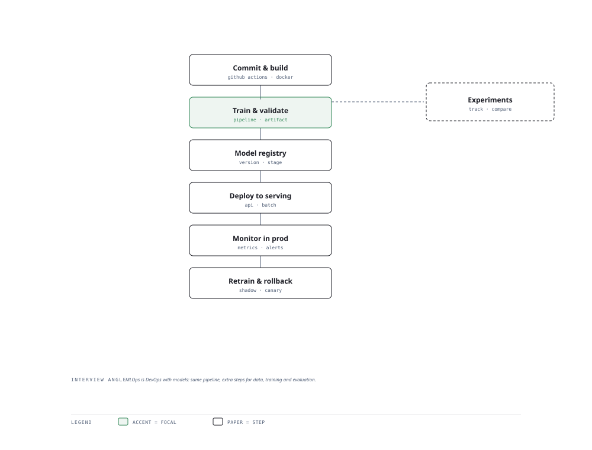

# Visual Notes — AI Delivery Pipeline

> One diagram, the full picture. This page is meant to be glanced at before reading the chapters, and again before interviews.

# What the diagram shows

1. **Build** — Version data, code and prompts together; run CI tests on every commit.
1. **Deploy** — Ship containers/services through staging; blue-green or canary to production.
1. **Drive** — Serve the model under a stable API, watch drift, and roll back fast on bad signals.

# Why this matters for placement

- DevOps-for-AI shows production maturity employers look for beyond model accuracy.
- Prompt/data versioning parallel to code versioning is the modern differentiator.

# Quick revision

- CI/CD for AI: automated evals run against a golden set before merge/deploy.
- Model registry pins artifacts; data + code + model versioned together.
- Canary deploy: route 1% traffic, compare metrics, promote or roll back.
- Drift monitoring triggers retraining or data-quality alerts.
- Cost per inference is a budget ledger; cache and batch to cut it.

# Related chapters

- [Experiment tracking](01-experiment-tracking.md)
- [Prompt versioning](02-prompt-versioning.md)
- [CI/CD for AI](04-ci-cd-for-ai.md)
- [Model serving](05-model-serving.md)

---

**One-line answer for interviews:** *"Code → build → test → package → deploy → serve → monitor, with a rollback path at every gate."*
