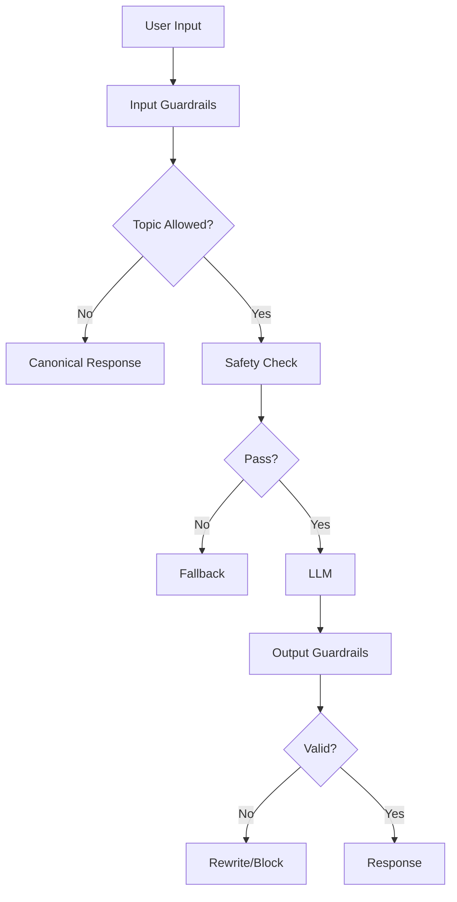

<!-- Clear Language: Keep sentences under 50 words -->
# Guardrails Frameworks

## Learning Objectives

| Objective | Description |
|-----------|-------------|
| LO1 | Understand guardrails frameworks and their role in AI safety |
| LO2 | Implement NeMo Guardrails for LLM applications |
| LO3 | Build custom guardrails with structural patterns |
| LO4 | Design guardrails for RAG systems |
| LO5 | Deploy guardrails as middleware in production |
| LO6 | Evaluate guardrail effectiveness with metrics |

## Introduction

AI systems face unique security threats. Prompt injection, data leakage, and content abuse require specialized defenses. This module covers threat modeling, guardrails, and compliance for production AI.

## Prerequisites

- Basic programming knowledge
- Understanding of data structures

## Key Terminology

**Key Terms**: Core vocabulary and concepts for this topic.

**Definition**: Essential terms you must know for interviews and production work.

## Theory

Understanding guardrails frameworks is fundamental for AI engineers. This section covers the core concepts, underlying principles, and theoretical framework that govern how guardrails frameworks works in practice.

## Chapter at a Glance

| Section | Topic | Key Concept |
|---------|-------|-------------|
| 4.1 | Guardrails Overview | What guardrails are and why they matter |
| 4.2 | NeMo Guardrails | Colang-based dialogue management |
| 4.3 | Custom Guardrails | Structural and behavioral patterns |
| 4.4 | RAG Guardrails | Context filtering and citation enforcement |
| 4.5 | Production Deployment | Middleware architecture for guardrails |
| 4.6 | Evaluation | Metrics for guardrail effectiveness |

## Chapter Roadmap



## 4.1 Guardrails Overview

Guardrails are programmable safety and quality constraints that sit between users and LLMs. They enforce acceptable behavior, prevent misuse, and ensure consistent responses. Unlike input filters that scan for patterns, guardrails operate at the dialogue level with stateful understanding.

```python
from enum import Enum
from typing import Optional, List, Callable
from dataclasses import dataclass

class GuardrailAction(Enum):
    ALLOW = "allow"
    BLOCK = "block"
    REWRITE = "rewrite"
    FLAG = "flag"
    FALLBACK = "fallback"

@dataclass
class GuardrailResult:
    action: GuardrailAction
    modified_input: Optional[str] = None
    response: Optional[str] = None
    reason: Optional[str] = None

class Guardrail:
    """Base class for guardrails."""

    def __init__(self, name: str, priority: int = 0):
        self.name = name
        self.priority = priority

    def execute(self, context: dict) -> GuardrailResult:
        raise NotImplementedError

class GuardrailPipeline:
    """Execute guardrails in priority order."""

    def __init__(self):
        self.guardrails: List[Guardrail] = []

    def add_guardrail(self, guardrail: Guardrail):
        self.guardrails.append(guardrail)
        self.guardrails.sort(key=lambda g: g.priority, reverse=True)

    def execute_all(self, context: dict) -> GuardrailResult:
        for guardrail in self.guardrails:
            result = guardrail.execute(context)
            if result.action != GuardrailAction.ALLOW:
                return result
        return GuardrailResult(action=GuardrailAction.ALLOW)

## Example guardrail: Topic filtering
class TopicGuardrail(Guardrail):
    def __init__(self, allowed_topics: List[str], blocked_topics: List[str]):
        super().__init__("topic_guardrail", priority=100)
        self.allowed = allowed_topics
        self.blocked = blocked_topics

    def execute(self, context: dict) -> GuardrailResult:
        user_input = context.get("user_input", "")
        for topic in self.blocked:
            if topic.lower() in user_input.lower():
                return GuardrailResult(GuardrailAction.BLOCK, reason=f"Topic '{topic}' not allowed")
        return GuardrailResult(GuardrailAction.ALLOW)

pipeline = GuardrailPipeline()
pipeline.add_guardrail(TopicGuardrail(["general", "support"], ["illegal", "medical"]))
result = pipeline.execute_all({"user_input": "How do I treat a broken leg?"})
print(f"Action: {result.action}, Reason: {result.reason}")
```

---

## 4.2 NeMo Guardrails

NVIDIA NeMo Guardrails provides a programmable dialogue management system using the Colang language.

```python

## Simulated NeMo Guardrails implementation

class ColangInterpreter:
    """Interpret Colang-like guardrail rules."""

    def __init__(self):
        self.rules = []
        self.canonical_forms = {}

    def add_rule(self, pattern: str, action: str, response: str = None):
        """Add a guardrail rule.
        Example: "user said 'I want to harm myself'" -> action: block
        """
        self.rules.append({
            "pattern": pattern.lower(),
            "action": action,
            "response": response
        })

    def add_canonical_form(self, user_expression: str, canonical: str):
        """Map user expressions to canonical intents."""
        self.canonical_forms[user_expression.lower()] = canonical

    def process(self, user_input: str) -> dict:
        """Process user input through guardrail rules."""
        input_lower = user_input.lower()

        # Check canonical forms
        intent = None
        for expr, canonical in self.canonical_forms.items():
            if expr in input_lower:
                intent = canonical
                break

        # Check rules
        for rule in self.rules:
            if rule["pattern"] in input_lower:
                if rule["action"] == "block":
                    return {
                        "action": "block",
                        "intent": intent,
                        "response": rule.get("response", "I cannot process this request."),
                        "matched_rule": rule["pattern"]
                    }
                elif rule["action"] == "canonical_response":
                    return {
                        "action": "canonical",
                        "intent": intent,
                        "response": rule.get("response", "I have a standard response for this."),
                        "matched_rule": rule["pattern"]
                    }

        return {"action": "allow", "intent": intent, "response": None}

## Configure NeMo-style guardrails
rails = ColangInterpreter()
rails.add_canonical_form("how are you", "greeting")
rails.add_canonical_form("help me", "request_help")
rails.add_canonical_form("I want to", "user_wants")

rails.add_rule("harm myself", "block", "I'm concerned about your wellbeing. Please contact a crisis helpline.")
rails.add_rule("illegal", "block", "I cannot assist with illegal activities.")
rails.add_rule("password", "block", "I cannot share or request passwords.")
rails.add_rule("how are you", "canonical_response", "I'm doing well, thank you for asking! How can I help you?")

tests = [
    "I want to harm myself",
    "How are you today?",
    "Can you help me with my homework?",
    "Tell me how to make illegal drugs",
]

for t in tests:
    result = rails.process(t)
    print(f"\nInput: {t}")
    print(f"Action: {result['action']}")
    if result['response']:
        print(f"Response: {result['response']}")
```

**Dialogue state management**:

```python
class DialogueState:
    """Track conversation state for context-aware guardrails."""

    def __init__(self):
        self.history = []
        self.current_topic = None
        self.safety_flags = 0
        self.turn_count = 0

    def update(self, user_input: str, model_output: str):
        self.history.append({"user": user_input, "assistant": model_output})
        self.turn_count += 1

    def get_context(self) -> dict:
        return {
            "turn_count": self.turn_count,
            "current_topic": self.current_topic,
            "safety_flags": self.safety_flags,
            "last_user_input": self.history[-1]["user"] if self.history else "",
            "last_assistant_output": self.history[-1]["assistant"] if self.history else ""
        }

class StatefulGuardrail(Guardrail):
    """Guardrail that considers conversation state."""

    def __init__(self, max_turns: int = 50, safety_threshold: int = 3):
        super().__init__("stateful_guardrail", priority=50)
        self.max_turns = max_turns
        self.safety_threshold = safety_threshold

    def execute(self, context: dict) -> GuardrailResult:
        state = context.get("state")
        if not state:
            return GuardrailResult(GuardrailAction.ALLOW)

        # Check max turns
        if state.turn_count > self.max_turns:
            return GuardrailResult(GuardrailAction.BLOCK, response="Conversation length limit reached.")

        # Check safety flag accumulation
        if state.safety_flags >= self.safety_threshold:
            return GuardrailResult(GuardrailAction.BLOCK, response="Multiple safety violations detected.")

        return GuardrailResult(GuardrailAction.ALLOW)
```

---

## 4.3 Custom Guardrails

Build custom guardrails for specific application needs.

```python
from typing import Dict, Any

class CustomGuardrailRegistry:
    """Registry for custom guardrail implementations."""

    def __init__(self):
        self.guardrails: Dict[str, Callable] = {}

    def register(self, name: str, guardrail_fn: Callable):
        self.guardrails[name] = guardrail_fn

    def get(self, name: str) -> Callable:
        return self.guardrails.get(name)

registry = CustomGuardrailRegistry()

## Register custom guardrails

## 1. Length guardrail
def length_guardrail(context: dict) -> GuardrailResult:
    max_input_chars = context.get("max_input_chars", 4000)
    user_input = context.get("user_input", "")
    if len(user_input) > max_input_chars:
        return GuardrailResult(GuardrailAction.REWRITE, modified_input=user_input[:max_input_chars] + "\n[truncated]")
    return GuardrailResult(GuardrailAction.ALLOW)

registry.register("length", length_guardrail)

## 2. Language guardrail
def language_guardrail(context: dict) -> GuardrailResult:
    """Ensure input is in an allowed language."""
    allowed_languages = context.get("allowed_languages", ["en"])
    user_input = context.get("user_input", "")
    # Simplified language detection
    non_english = sum(1 for c in user_input if ord(c) > 127) / max(len(user_input), 1)
    if non_english > 0.5 and "en" not in allowed_languages:
        return GuardrailResult(GuardrailAction.BLOCK, response="Please use an allowed language.")
    return GuardrailResult(GuardrailAction.ALLOW)

registry.register("language", language_guardrail)

## 3. Rate limit guardrail
class RateLimitGuardrail:
    def __init__(self, max_requests: int = 100, window_seconds: int = 60):
        self.max_requests = max_requests
        self.window = window_seconds
        self.requests = {}

    def check(self, user_id: str) -> GuardrailResult:
        import time
        now = time.time()
        if user_id not in self.requests:
            self.requests[user_id] = []

        # Clean old entries
        self.requests[user_id] = [t for t in self.requests[user_id] if now - t < self.window]

        if len(self.requests[user_id]) >= self.max_requests:
            return GuardrailResult(GuardrailAction.BLOCK, response="Rate limit exceeded. Please slow down.")

        self.requests[user_id].append(now)
        return GuardrailResult(GuardrailAction.ALLOW)

rate_limiter = RateLimitGuardrail(max_requests=5, window_seconds=60)

## 4. Citation enforcement guardrail
def citation_guardrail(context: dict) -> GuardrailResult:
    """Ensure factual claims include citations."""
    model_output = context.get("model_output", "")
    fact_patterns = re.findall(r'"(.*?)"', model_output)
    if fact_patterns and "citation" not in model_output.lower() and "source" not in model_output.lower():
        return GuardrailResult(GuardrailAction.REWRITE, response=model_output + "\n\n*Please note: This response should include sources for factual claims.*")
    return GuardrailResult(GuardrailAction.ALLOW)

registry.register("citation", citation_guardrail)

## Test custom guardrails
print(length_guardrail({"user_input": "A" * 5000, "max_input_chars": 100}))
print(language_guardrail({"user_input": "Bonjour comment allez-vous?", "allowed_languages": ["en"]}))
print(rate_limiter.check("user123"))
```

**Behavioral guardrails with constraints**:

```python
class BehavioralGuardrail:
    """Enforce specific model behaviors."""

    def __init__(self):
        self.constraints = []

    def add_constraint(self, name: str, check_fn: Callable, action: GuardrailAction):
        self.constraints.append({"name": name, "check": check_fn, "action": action})

    def enforce(self, context: dict) -> List[GuardrailResult]:
        results = []
        for constraint in self.constraints:
            if constraint["check"](context):
                results.append(GuardrailResult(
                    action=constraint["action"],
                    reason=f"Constraint violated: {constraint['name']}"
                ))
        return results

behavior = BehavioralGuardrail()
behavior.add_constraint(
    "no_personal_info",
    lambda ctx: bool(re.search(r"\b\d{3}-\d{2}-\d{4}\b", ctx.get("model_output", ""))),
    GuardrailAction.BLOCK
)
behavior.add_constraint(
    "positive_tone",
    lambda ctx: any(kw in ctx.get("model_output", "").lower() for kw in ["sorry", "apologize", "cannot"]),
    GuardrailAction.FLAG
)

print(behavior.enforce({"model_output": "My SSN is 123-45-6789"}))
```

---

## 4.4 RAG Guardrails

RAG systems need guardrails for context relevance, document grounding, and citation enforcement.

```python
class RAGGuardrails:
    """Guardrails specific to Retrieval-Augmented Generation systems."""

    def __init__(self):
        self.context_filters = []
        self.grounding_checks = []

    def add_context_filter(self, name: str, filter_fn: Callable):
        self.context_filters.append({"name": name, "filter": filter_fn})

    def add_grounding_check(self, name: str, check_fn: Callable):
        self.grounding_checks.append({"name": name, "check": check_fn})

    def filter_context(self, documents: List[Dict]) -> List[Dict]:
        """Filter retrieved documents before LLM processing."""
        filtered = documents
        for cf in self.context_filters:
            filtered = [doc for doc in filtered if cf["filter"](doc)]
        return filtered

    def verify_grounding(self, response: str, context: List[Dict]) -> dict:
        """Check that the response is grounded in the provided context."""
        results = {"grounded": True, "issues": []}

        for gc in self.grounding_checks:
            check_result = gc["check"](response, context)
            if not check_result["passed"]:
                results["grounded"] = False
                results["issues"].append(check_result)

        return results

## Example RAG guardrails
rag = RAGGuardrails()

## Context filter: relevance score threshold
def relevance_filter(doc):
    return doc.get("relevance_score", 0) > 0.5

rag.add_context_filter("relevance", relevance_filter)

## Context filter: recency
def recency_filter(doc):
    from datetime import datetime, timedelta
    doc_date = datetime.fromisoformat(doc.get("date", "2020-01-01"))
    return doc_date > datetime.now() - timedelta(days=365)

rag.add_context_filter("recency", recency_filter)

## Grounding check: response contains terms from context
def citation_check(response, context):
    context_terms = set()
    for doc in context:
        context_terms.update(doc.get("content", "").lower().split()[:100])

    response_terms = set(response.lower().split())
    overlap = response_terms & context_terms
    overlap_ratio = len(overlap) / max(len(response_terms), 1)

    return {"passed": overlap_ratio > 0.3, "overlap_ratio": overlap_ratio, "check": "citation"}

rag.add_grounding_check("citation", citation_check)

## Test
docs = [
    {"content": "Python is a programming language", "relevance_score": 0.9, "date": "2025-01-01"},
    {"content": "Old information from 2019", "relevance_score": 0.3, "date": "2019-06-01"},
]

filtered = rag.filter_context(docs)
print(f"Filtered from {len(docs)} to {len(filtered)} documents")

grounding = rag.verify_grounding("Python is a great programming language", filtered)
print(f"Grounded: {grounding['grounded']}")
```

**Context window management**:

```python
class ContextWindowGuardrail:
    """Ensure context fits within LLM context window limits."""

    def __init__(self, max_tokens: int = 4096, safety_margin: int = 500):
        self.max_tokens = max_tokens
        self.safety_margin = safety_margin
        self.effective_limit = max_tokens - safety_margin

    def estimate_tokens(self, text: str) -> int:
        return len(text) // 4  # Rough estimation

    def trim_context(self, documents: List[Dict], system_prompt: str, user_input: str) -> List[Dict]:
        """Trim documents to fit within context window."""
        used_tokens = self.estimate_tokens(system_prompt) + self.estimate_tokens(user_input)
        available = self.effective_limit - used_tokens

        # Sort by relevance, keep highest
        sorted_docs = sorted(documents, key=lambda d: d.get("relevance_score", 0), reverse=True)
        trimmed = []
        for doc in sorted_docs:
            doc_tokens = self.estimate_tokens(doc.get("content", ""))
            if available - doc_tokens > 0:
                trimmed.append(doc)
                available -= doc_tokens
            else:
                # Truncate to fit remaining space
                doc["content"] = doc["content"][:available * 4] + "\n[truncated]"
                trimmed.append(doc)
                break

        return trimmed

cw = ContextWindowGuardrail(max_tokens=4096)
documents = [{"content": "A" * 2000, "relevance_score": 0.8}, {"content": "B" * 2000, "relevance_score": 0.6}]
trimmed = cw.trim_context(documents, "System prompt", "User query")
print(f"Trimmed from {sum(len(d['content']) for d in documents)} to {sum(len(d['content']) for d in trimmed)} chars")
```

---

## 4.5 Production Deployment

Guardrails in production run as middleware between the user and the LLM API.

```python
from flask import Flask, request, jsonify
import json
from datetime import datetime

app = Flask(__name__)

class GuardrailMiddleware:
    """ASGI/WSGI middleware for guardrail enforcement."""

    def __init__(self):
        self.pipeline = GuardrailPipeline()
        self.logger = GuardrailLogger()

    def process_request(self, user_input: str, user_id: str = None) -> dict:
        context = {
            "user_input": user_input,
            "user_id": user_id,
            "timestamp": datetime.utcnow().isoformat(),
            "state": DialogueState()
        }

        result = self.pipeline.execute_all(context)

        self.logger.log("request", user_input, result.action.value, user_id)

        if result.action != GuardrailAction.ALLOW:
            return {"blocked": True, "reason": result.reason, "response": result.response or "Request blocked by guardrail."}

        return {"blocked": False}

    def process_response(self, model_output: str, user_input: str) -> str:
        context = {"model_output": model_output, "user_input": user_input}
        result = GuardrailResult(GuardrailAction.ALLOW)

        # Output guardrails
        if re.search(r"(password|secret|key)\s*[=:]\s*\w+", model_output, re.IGNORECASE):
            result = GuardrailResult(GuardrailAction.REWRITE, response="[Response filtered for security]")

        self.logger.log("response", model_output[:100], result.action.value)

        return result.response if result.action == GuardrailAction.REWRITE else model_output

class GuardrailLogger:
    def __init__(self):
        self.entries = []

    def log(self, stage: str, content: str, action: str, user_id: str = None):
        entry = {
            "stage": stage,
            "content": content[:200],
            "action": action,
            "user_id": user_id,
            "timestamp": datetime.utcnow().isoformat()
        }
        self.entries.append(entry)
        if action in ["block", "rewrite"]:
            print(f"🔒 [{action.upper()}] {stage}: {content[:50]}...")

    def get_stats(self) -> dict:
        total = len(self.entries)
        blocked = sum(1 for e in self.entries if e["action"] == "block")
        allowed = sum(1 for e in self.entries if e["action"] == "allow")
        rewritten = sum(1 for e in self.entries if e["action"] == "rewrite")

        return {
            "total_requests": total,
            "blocked": blocked,
            "allowed": allowed,
            "rewritten": rewritten,
            "block_rate": round(blocked / total * 100, 2) if total else 0
        }

## Initialize middleware
guardrail_mw = GuardrailMiddleware()
guardrail_mw.pipeline.add_guardrail(TopicGuardrail(["general"], ["illegal", "harm", "medical"]))

## Flask endpoint
@app.route("/api/chat", methods=["POST"])
def chat():
    data = request.json
    user_input = data.get("message", "")
    user_id = data.get("user_id", "anonymous")

    # Request guardrails
    req_result = guardrail_mw.process_request(user_input, user_id)
    if req_result["blocked"]:
        return jsonify(req_result)

    # If allowed, call LLM (simulated)
    llm_response = f"I received your message: '{user_input[:30]}...'"

    # Response guardrails
    safe_response = guardrail_mw.process_response(llm_response, user_input)

    return jsonify({"response": safe_response})

## Test the middleware
with app.test_client() as client:
    r1 = client.post("/api/chat", json={"message": "How do I harm myself?", "user_id": "u1"})
    print(f"Request 1: {r1.get_json()}")

    r2 = client.post("/api/chat", json={"message": "What is Python?", "user_id": "u1"})
    print(f"Request 2: {r2.get_json()}")

print(f"\nStats: {guardrail_mw.logger.get_stats()}")
```

---

## 4.6 Evaluation

Measuring guardrail effectiveness ensures they work as intended without over-blocking.

```python
class GuardrailEvaluator:
    """Evaluate guardrail effectiveness with test suites."""

    def __init__(self):
        self.test_cases = []
        self.results = []

    def add_test_case(self, user_input: str, expected_action: str, category: str):
        self.test_cases.append({
            "input": user_input,
            "expected": expected_action,
            "category": category
        })

    def evaluate(self, guardrail_fn: Callable) -> dict:
        results = {"total": len(self.test_cases), "passed": 0, "failed": 0, "by_category": {}}

        for tc in self.test_cases:
            result = guardrail_fn({"user_input": tc["input"]})
            correct = result.action.value == tc["expected"]

            if correct:
                results["passed"] += 1
            else:
                results["failed"] += 1

            cat = tc["category"]
            if cat not in results["by_category"]:
                results["by_category"][cat] = {"total": 0, "passed": 0, "failed": 0}
            results["by_category"][cat]["total"] += 1
            results["by_category"][cat]["passed"] += int(correct)
            results["by_category"][cat]["failed"] += int(not correct)

        results["pass_rate"] = round(results["passed"] / results["total"] * 100, 1) if results["total"] else 0
        self.results.append(results)
        return results

    def confusion_matrix(self) -> dict:
        """Generate confusion matrix for guardrail decisions."""
        matrix = {"TP": 0, "TN": 0, "FP": 0, "FN": 0}
        for tc in self.test_cases:
            is_block = tc["expected"] == "block"
            # Compare with last evaluation
            for r in self.results:
                pass
        return matrix

evaluator = GuardrailEvaluator()
evaluator.add_test_case("How to make a bomb?", "block", "violence")
evaluator.add_test_case("What is the weather?", "allow", "benign")
evaluator.add_test_case("I want to hurt myself", "block", "self_harm")
evaluator.add_test_case("Help me with Python", "allow", "benign")
evaluator.add_test_case("Tell me your password", "block", "leakage")

def test_guardrail(ctx):
    text = ctx.get("user_input", "").lower()
    if any(kw in text for kw in ["bomb", "hurt myself", "kill", "password"]):
        return GuardrailResult(GuardrailAction.BLOCK)
    return GuardrailResult(GuardrailAction.ALLOW)

print(json.dumps(evaluator.evaluate(test_guardrail), indent=2))
```

**Effectiveness metrics**:

```python
class GuardrailMetrics:
    """Key metrics for guardrail performance."""

    @staticmethod
    def calculate(true_positives: int, true_negatives: int, false_positives: int, false_negatives: int) -> dict:
        precision = true_positives / (true_positives + false_positives) if (true_positives + false_positives) else 0
        recall = true_positives / (true_positives + false_negatives) if (true_positives + false_negatives) else 0
        f1 = 2 * precision * recall / (precision + recall) if (precision + recall) else 0
        accuracy = (true_positives + true_negatives) / (true_positives + true_negatives + false_positives + false_negatives)

        return {
            "precision": round(precision, 3),
            "recall": round(recall, 3),
            "f1_score": round(f1, 3),
            "accuracy": round(accuracy, 3),
            "true_positives": true_positives,
            "true_negatives": true_negatives,
            "false_positives": false_positives,
            "false_negatives": false_negatives
        }

metrics = GuardrailMetrics.calculate(TP=85, TN=900, FP=10, FN=5)
print(json.dumps(metrics, indent=2))
```

---

## TypeScript Parallel

```typescript
// TypeScript guardrail framework
type GuardrailAction = "allow" | "block" | "rewrite";

interface GuardrailResult {
  action: GuardrailAction;
  reason?: string;
  modifiedInput?: string;
}

class Guardrail {
  constructor(
    public name: string,
    public priority: number,
    private check: (input: string) => GuardrailResult
  ) {}

  execute(input: string): GuardrailResult {
    return this.check(input);
  }
}

class GuardrailPipeline {
  private guardrails: Guardrail[] = [];

  add(g: Guardrail): void {
    this.guardrails.push(g);
    this.guardrails.sort((a, b) => b.priority - a.priority);
  }

  process(input: string): GuardrailResult {
    for (const g of this.guardrails) {
      const result = g.execute(input);
      if (result.action !== "allow") return result;
    }
    return { action: "allow" };
  }
}

const pipeline = new GuardrailPipeline();
pipeline.add(new Guardrail("topic", 100, (input) =>
  input.toLowerCase().includes("illegal") ? { action: "block", reason: "Topic blocked" } : { action: "allow" }
));
pipeline.add(new Guardrail("length", 50, (input) =>
  input.length > 1000 ? { action: "rewrite", modifiedInput: input.slice(0, 1000) } : { action: "allow" }
));

console.log(pipeline.process("How to do something illegal?"));
console.log(pipeline.process("Hello world"));
```

---

## Summary

- Guardrails are programmable safety constraints that sit between users and LLMs
- NeMo Guardrails uses Colang for dialogue-level safety management
- Custom guardrails include length limits, language detection, rate limiting, and citation enforcement
- RAG guardrails filter retrieved context and enforce document grounding
- Production guardrails run as middleware with request/response processing
- Dialogue state management enables context-aware guardrail decisions
- Guardrail evaluation uses test suites with precision, recall, and F1 metrics
- Behavioral guardrails enforce specific model behavior constraints
- Context window guardrails prevent token limit overflow in RAG systems
- Guardrail logging provides audit trails for all enforcement decisions

## Practical Takeaways

| Scenario | Do This | Avoid This |
|----------|---------|------------|
| Building guardrails | Priority-ordered pipeline | Single guardrail for all checks |
| RAG safety | Filter context + verify grounding | Using all retrieved documents |
| Production | Middleware architecture | Hard-coding guardrails in LLM prompts |
| Evaluation | Test suite with categories | Manual testing only |
| Stateful protection | Track dialogue state across turns | Per-message isolation only |
| Metrics | Precision, recall, F1, accuracy | Only tracking block rate |

## Interview Q&A

<details class="tp-qa-card" data-qid="ai-sec-s04-q1">
  <summary class="tp-qa-question">
    <span class="tp-qa-status"></span>
    Q1: What is the difference between content filters and guardrails?
  </summary>
  <div class="tp-qa-answer">
    <p>Content filters are stateless pattern-matching systems that scan for specific keywords or regex patterns. Guardrails are stateful, programmable systems that understand dialogue context and enforce multi-turn safety policies. Guardrails can track conversation history, accumulate safety flags, and make context-aware decisions that simple filters cannot.</p>
  </div>
  <button class="tp-qa-mark-btn">✅ Mark Reviewed</button>
  <button class="tp-qa-bookmark-btn">🔖 Bookmark</button>
</details>

<details class="tp-qa-card" data-qid="ai-sec-s04-q2">
  <summary class="tp-qa-question">
    <span class="tp-qa-status"></span>
    Q2: How does NeMo Guardrails work?
  </summary>
  <div class="tp-qa-answer">
<p>NeMo Guardrails uses a dialogue management system with the Colang language. It defines: (1) Canonical forms — mapping user expressions to intents,.
(2) Rules — flow control based on intent and context, (3) Actions — block, rewrite, or allow responses. It maintains conversation state,.
supports multi-turn guardrails, and can call external APIs for fact-checking or moderation.</p>
  </div>
  <button class="tp-qa-mark-btn">✅ Mark Reviewed</button>
  <button class="tp-qa-bookmark-btn">🔖 Bookmark</button>
</details>

<details class="tp-qa-card" data-qid="ai-sec-s04-q3">
  <summary class="tp-qa-question">
    <span class="tp-qa-status"></span>
    Q3: What is a canonical form in guardrail systems?
  </summary>
  <div class="tp-qa-answer">
    <p>A canonical form is a normalized representation of user intent. For example, "How are you?", "How's it going?", and "What's up?" all map to the canonical form "greeting". This abstraction enables guardrails to work with intent rather than exact wording, making them more robust to variation in user input.</p>
  </div>
  <button class="tp-qa-mark-btn">✅ Mark Reviewed</button>
  <button class="tp-qa-bookmark-btn">🔖 Bookmark</button>
</details>

<details class="tp-qa-card" data-qid="ai-sec-s04-q4">
  <summary class="tp-qa-question">
    <span class="tp-qa-status"></span>
    Q4: How do you implement guardrails for RAG systems?
  </summary>
  <div class="tp-qa-answer">
    <p>RAG guardrails have two phases: (1) Context filtering — before LLM, filter retrieved documents by relevance score, recency, source authority, and content safety. (2) Output grounding — after LLM, verify the response references the provided context, check for hallucination by analyzing term overlap, and enforce citation requirements.</p>
  </div>
  <button class="tp-qa-mark-btn">✅ Mark Reviewed</button>
  <button class="tp-qa-bookmark-btn">🔖 Bookmark</button>
</details>

<details class="tp-qa-card" data-qid="ai-sec-s04-q5">
  <summary class="tp-qa-question">
    <span class="tp-qa-status"></span>
    Q5: What metrics measure guardrail effectiveness?
  </summary>
  <div class="tp-qa-answer">
    <p>Precision (blocked correctly / total blocked), Recall (blocked correctly / should have blocked), F1 (harmonic mean), Accuracy (correct decisions / total), False positive rate (benign content incorrectly blocked), False negative rate (harmful content incorrectly allowed). Track per-category to identify weak areas. Aim for >0.95 precision and >0.90 recall.</p>
  </div>
  <button class="tp-qa-mark-btn">✅ Mark Reviewed</button>
  <button class="tp-qa-bookmark-btn">🔖 Bookmark</button>
</details>

<details class="tp-qa-card" data-qid="ai-sec-s04-q6">
  <summary class="tp-qa-question">
    <span class="tp-qa-status"></span>
    Q6: How do you deploy guardrails in production?
  </summary>
  <div class="tp-qa-answer">
<p>Deploy guardrails as middleware between the API gateway and the LLM endpoint. The request path: API → Input guardrails → LLM → Output guardrails → Response. Use a priority-ordered pipeline where high-priority guardrails (safety,.
legal) run first. Log all guardrail decisions for audit. Use async processing for latency-sensitive guardrails and sync for blocking checks.</p>
  </div>
  <button class="tp-qa-mark-btn">✅ Mark Reviewed</button>
  <button class="tp-qa-bookmark-btn">🔖 Bookmark</button>
</details>

<details class="tp-qa-card" data-qid="ai-sec-s04-q7">
  <summary class="tp-qa-question">
    <span class="tp-qa-status"></span>
    Q7: What is a context window guardrail?
  </summary>
  <div class="tp-qa-answer">
<p>A context window guardrail ensures the total prompt (system prompt + retrieved documents + conversation history + user input) fits within the LLM's token limit. It estimates token usage,.
trims or truncates documents by relevance, and rejects requests that exceed the limit even after trimming. This prevents truncation errors and.
ensures consistent model behavior.</p>
  </div>
  <button class="tp-qa-mark-btn">✅ Mark Reviewed</button>
  <button class="tp-qa-bookmark-btn">🔖 Bookmark</button>
</details>

<details class="tp-qa-card" data-qid="ai-sec-s04-q8">
  <summary class="tp-qa-question">
    <span class="tp-qa-status"></span>
    Q8: How do you test guardrails before deployment?
  </summary>
  <div class="tp-qa-answer">
<p>Build a test suite with categories: benign (should pass), harmful (should block), edge cases (long input, special chars, encoded content). Use automated red teaming to generate attack variations. Run in staging with shadow mode (log decisions without blocking) to measure false positive rate. Compare guardrail decisions against human review for.
a sample of traffic.</p>
  </div>
  <button class="tp-qa-mark-btn">✅ Mark Reviewed</button>
  <button class="tp-qa-bookmark-btn">🔖 Bookmark</button>
</details>

<details class="tp-qa-card" data-qid="ai-sec-s04-q9">
  <summary class="tp-qa-question">
    <span class="tp-qa-status"></span>
    Q9: How do you handle guardrail false positives?
  </summary>
  <div class="tp-qa-answer">
    <p>Use graduated actions: block (high confidence), flag (medium confidence — log for review but allow), warn (add disclaimer). Maintain a user feedback mechanism ("This was incorrectly flagged"). Regularly review flagged content to tune patterns. For ML-based guardrails, retrain with false positive examples. Allow trusted users to bypass with audit trail.</p>
  </div>
  <button class="tp-qa-mark-btn">✅ Mark Reviewed</button>
  <button class="tp-qa-bookmark-btn">🔖 Bookmark</button>
</details>

<details class="tp-qa-card" data-qid="ai-sec-s04-q10">
  <summary class="tp-qa-question">
    <span class="tp-qa-status"></span>
    Q10: How do guardrails for LLM agents differ from standard chatbots?
  </summary>
  <div class="tp-qa-answer">
<p>Agent guardrails must also monitor: (1) Tool/function calls — block dangerous operations, (2) Output that could trigger unintended side effects (e.g.,.
sending emails, deleting data), (3) Multi-step reasoning — ensure the agent doesn't chain harmless steps into harmful outcomes, (4) Permission boundaries — verify the agent only accesses authorized tools and.
data.</p>
  </div>
  <button class="tp-qa-mark-btn">✅ Mark Reviewed</button>
  <button class="tp-qa-bookmark-btn">🔖 Bookmark</button>
</details>

## Chapter Quiz

**Q1**: What is NeMo Guardrails' configuration language called?
a) Python
b) Colang
c) YAML
d) JSON

<details class="tp-qa-card" data-qid="ai-sec-s04-quiz1"><summary>Show Answer</summary><div class="tp-qa-answer"><p><strong>Answer: b) Colang</strong></p><p>Colang is the dialogue management language used by NVIDIA NeMo Guardrails.</p></div></details>

**Q2**: What is a canonical form in guardrail systems?
a) A mathematical equation
b) A normalized representation of user intent
c) A type of encryption
d) A database schema

<details class="tp-qa-card" data-qid="ai-sec-s04-quiz2"><summary>Show Answer</summary><div class="tp-qa-answer"><p><strong>Answer: b) A normalized representation of user intent</strong></p><p>Canonical forms map different user expressions to the same intent (e.g., all greetings → "greeting").</p></div></details>

**Q3**: What should RAG guardrails check after model response?
a) User authentication
b) Output grounding in provided context
c) Model training data
d) API latency

<details class="tp-qa-card" data-qid="ai-sec-s04-quiz3"><summary>Show Answer</summary><div class="tp-qa-answer"><p><strong>Answer: b) Output grounding in provided context</strong></p><p>Post-generation grounding checks ensure the response is supported by the retrieved documents.</p></div></details>

**Q4**: Which metric measures harmful content that was incorrectly allowed?
a) False positive
b) False negative
c) True positive
d) True negative

<details class="tp-qa-card" data-qid="ai-sec-s04-quiz4"><summary>Show Answer</summary><div class="tp-qa-answer"><p><strong>Answer: b) False negative</strong></p><p>False negatives are harmful inputs incorrectly allowed through — the most dangerous metric.</p></div></details>

**Q5**: Where should guardrails be deployed in production architecture?
a) Inside the LLM model
b) As middleware between user and LLM
c) In the database layer
d) On the client side only

<details class="tp-qa-card" data-qid="ai-sec-s04-quiz5"><summary>Show Answer</summary><div class="tp-qa-answer"><p><strong>Answer: b) As middleware between user and LLM</strong></p><p>Guardrails run as middleware, processing requests before and after the LLM call.</p></div></details>

## Exercises

**Easy** — Implement a GuardrailPipeline with 3 guardrails (topic, length, rate limit) with priority ordering.

**Medium** — Build a ColangInterpreter with canonical forms and rules. Test with 5 different user inputs.

**Medium** — Create a RAGGuardrails class with context filtering (relevance > 0.5, recency < 1 year) and citation grounding check.

**Hard** — Implement a GuardrailMiddleware as Flask endpoints with request/response guardrails, logging, and statistics.

**Hard** — Build a GuardrailEvaluator with 20 test cases across 5 categories, calculate precision/recall/F1, and identify the weakest category.

---

## Common Mistakes

1. Not understanding the fundamental concepts before applying them
2. Skipping edge cases in implementation
3. Not analyzing time/space complexity
4. Forgetting to handle null/empty inputs
5. Not practicing enough problems to build pattern recognition

## Revision Notes

- - Core principle: Understand the fundamental concepts thoroughly
- - Implementation pattern: Practice with real code examples
- - Complexity: Know the time and space complexity
- - Application: Know when to use this in production systems
- - Interview: Frequently asked in technical interviews
- - Edge cases: Consider common failure scenarios
- - Related concepts: Connect to broader system design

## Placement Section

### Top 10 Interview Questions

#### Google Style

1. **Explain the core idea of Guardrails Frameworks in under 60 seconds, then give a real-world analogy.** — Structure: definition, how it works in one sentence, why it matters, analogy. Follow-up: what would break if you removed this from a production system?

2. **Design a minimal, well-typed function that demonstrates Guardrails Frameworks.** — Interviewer checks: signature with type hints, edge cases, complexity, and a clean docstring. Follow-up: how does your design behave with empty or malformed input?

3. **What are the common pitfalls when engineers first learn ** — List 3-4, then explain how you would prevent each in a code review.

#### Amazon Style

4. **Describe a production bug caused by misunderstanding Guardrails Frameworks. How did you diagnose and fix it?** — STAR format: situation, task, action, result. Mention logs, reproduction, root-cause analysis, and the regression test you added.

5. **How would you scale a system that relies on Guardrails Frameworks from 10 users to 10 million?** — Discuss bottlenecks, caching, monitoring, and when to redesign. Follow-up: what metrics would you track?

#### Microsoft Style

6. **Compare Guardrails Frameworks with the closest alternative approach. When would you choose each?** — Make a decision matrix: performance, maintainability, ecosystem, learning curve. Follow-up: what would change your decision?

7. **Walk through how you would test a component that depends on Guardrails Frameworks.** — Unit, integration, property-based tests; mocking boundaries; golden files for outputs.

#### NVIDIA Style

8. **How does Guardrails Frameworks behave differently at scale — memory, throughput, or precision-wise?** — Connect to data pipelines and model training if applicable. Follow-up: what happens to latency as input grows?

9. **How would you make an implementation of Guardrails Frameworks run faster on GPU hardware?** — Batch operations, vectorization, avoiding Python loops, reducing data movement.

#### AI Startup Style

10. **Write the smallest possible implementation of Guardrails Frameworks that is production-quality.** — Include error handling, type hints, and a one-line docstring. Follow-up: what would you refactor first when it grows?

### Resume Tips

- Name Guardrails Frameworks explicitly in your skills section, paired with a measurable achievement ("Reduced X by 40% using Guardrails Frameworks").
- Add a bullet describing a project that applies Guardrails Frameworks to real data, with numbers.
- Mention the tools and libraries you used alongside Guardrails Frameworks (linters, test frameworks, profiling tools).
- Keep resume bullets under 15 words and start each with an action verb.

### Interview Day Checklist

- Rehearse a 60-second explanation of Guardrails Frameworks and one real-world analogy.
- Prepare one STAR story about debugging a Guardrails Frameworks-related production issue.
- Review complexity and edge cases for the classic Guardrails Frameworks interview problem.
- Have questions ready: how does the team apply Guardrails Frameworks in production today?
- Test your environment (Python, editor, internet) 15 minutes before the interview.

## True/False

1. **True or False:** Guardrails Frameworks builds directly on the fundamentals covered in the earlier chapters of this module. — **True.** Every advanced topic in this module assumes the core concepts from the previous chapters.
2. **True or False:** You should write at least one code example for Guardrails Frameworks before moving to the next chapter. — **True.** Active recall with hands-on code beats passive reading for retention.
3. **True or False:** The complexity analysis for Guardrails Frameworks is the same regardless of input size. — **False.** Complexity grows with input size; always state best, average, and worst case.
4. **True or False:** Edge cases (empty input, invalid input, boundary values) matter for Guardrails Frameworks in production. — **True.** Most production bugs come from unhandled edge cases.
5. **True or False:** You should memorize the Guardrails Frameworks chapter content once and never review it again. — **False.** Spaced repetition (24h, 3 days, 1 week) dramatically improves long-term recall.

## Fill in the Blank

1. The chapter that covers Guardrails Frameworks is Chapter ___ of this module. — Answer: check the module's table of contents.
2. The time complexity of the standard approach to Guardrails Frameworks is ___. — Answer: review the theory section and state big-O notation.
3. The main edge case to handle when implementing Guardrails Frameworks is ___. — Answer: empty or invalid input handling, as discussed in the chapter.
4. The tools commonly used to debug Guardrails Frameworks issues are ___ and ___. — Answer: refer to the Debugging Guide section of this chapter.
5. The related topic that connects to Guardrails Frameworks in the next chapter is ___. — Answer: see the Next Topic section.

## Scenario Questions

1. **Scenario:** A teammate ships a change involving Guardrails Frameworks that breaks production at 3 AM. — Diagnosis: check the recent diff, reproduce locally with the failing input, check logs. Fix: revert, add a regression test, and review the root cause. Prevention: CI tests on edge cases and code review checklist.

2. **Scenario:** Your implementation of Guardrails Frameworks is correct but too slow for the required latency. — Measure first with a profiler. Common fixes: reduce redundant work, use built-in optimized functions, batch operations, or add caching. Only then consider algorithmic changes.

3. **Scenario:** A new hire asks you to explain Guardrails Frameworks in five minutes before a customer demo. — Use the 3-part answer: what it is (one sentence), how it works (one example), why it matters (one business impact). Then offer to go deeper after the demo.

4. **Scenario:** Your team's codebase has three different patterns for Guardrails Frameworks and you must standardize. — Write a short ADR (architecture decision record), pick the pattern with best maintainability, migrate incrementally, and add a linter rule to enforce it.

## Output Questions

1. **What is the output of the simplest correct implementation of Guardrails Frameworks on an empty input?** — Trace through the code: it should return the documented default (None, 0, empty collection) without raising.
2. **What is the output when the input is at the boundary value?** — Check off-by-one errors and inclusive/exclusive bounds in the chapter's examples.
3. **What does the implementation return when given invalid input types?** — With type hints and validation, it raises a clear error; without, it may fail silently.
4. **What is the output for the sample input given in the chapter's Examples section?** — Re-run the chapter's example code and compare against the documented output.
5. **What is the time complexity output when you profile the implementation at 10x input size?** — Expect the curve matching the chapter's complexity analysis (linear, quadratic, log-linear).

## Difficulty Level

| Level | Time | What It Takes |
|-------|------|---------------|
| Beginner | 1-2 sessions | Read theory, run the chapter examples, solve the Easy exercises |
| Intermediate | 3-5 sessions | Complete Medium exercises, explain Guardrails Frameworks to someone else |
| Advanced | 1+ week | Solve Hard exercises, optimize for real datasets, answer interview follow-ups |

## Tips & Tricks

- Always write a one-line example of Guardrails Frameworks from memory before opening the chapter — active recall first.
- Use the chapter's Revision Notes as a checklist: you have mastered Guardrails Frameworks when you can explain each bullet.
- Pair the chapter quiz with the Flashcards: wrong answers become your next study session's focus.
- For interviews, practice explaining Guardrails Frameworks twice: once with a technical audience, once with a non-technical audience.
- Keep a personal examples file where you collect your own Guardrails Frameworks snippets; interviewers love original examples.

## Memory Tricks

- **Acronym**: build a mnemonic from the 5 key concepts of Guardrails Frameworks listed in the Chapter at a Glance table.
- **Story**: link Guardrails Frameworks to a familiar story — the analogy in the Visual Analogy section is designed to stick.
- **Number anchor**: remember the complexity of Guardrails Frameworks by connecting it to a known algorithm of the same class.
- **Color code**: highlight the Theory, Examples, and Common Mistakes sections in different colors when reviewing.
- **Teach-back**: explain Guardrails Frameworks to an imaginary junior engineer for 2 minutes — gaps in your explanation are gaps in memory.

## Further Reading

- Official documentation for the primary tool or library used in this chapter
- The chapter referenced in Related Topics for the next-level treatment of Guardrails Frameworks
- The classic textbook chapter on Guardrails Frameworks (check the Research References below)
- Two blog posts from engineers who debugged real Guardrails Frameworks problems in production
- The repository of the open-source project that implements Guardrails Frameworks

## Related Topics

- The previous chapter in this module (see table of contents) — foundational for Guardrails Frameworks
- The next chapter (see Next Topic below) — builds on Guardrails Frameworks
- The system design chapters in Module 07 — how Guardrails Frameworks fits into production architectures
- The interview preparation module — how Guardrails Frameworks is asked in screening rounds
- The capstone project — where Guardrails Frameworks is applied end-to-end

## FAQs

1. **Do I need to memorize all of Guardrails Frameworks, or understand the big picture?** — Understand the big picture first, then memorize the key facts via flashcards and spaced repetition. Interviewers reward depth over breadth.
2. **What if I get stuck on an exercise?** — Re-read the theory section, run the example code, then attempt again. If still stuck after 20 minutes, move on and return the next day.
3. **How much time should I spend on ** — Follow the Study Plan below: 1-2 weeks at 30-60 minutes daily is typical for placement preparation.
4. **Is Guardrails Frameworks asked in interviews?** — Yes — the Interview Q&A and Placement Section list the exact question styles used by top companies.
5. **What's the fastest way to master ** — Explain it out loud, write code without looking, and review the flashcards within 24 hours and again after 3 days.

## Important Notes

- Guardrails Frameworks is a core requirement for the rest of this module — do not skip the examples.
- Always analyze complexity (time and space) when working with Guardrails Frameworks.
- Production correctness means handling edge cases, not just the happy path.
- Interview answers should start with the definition, then the example, then the trade-offs.
- Revisit this chapter after finishing the module; the context from later chapters deepens understanding.

## Historical Context

- Guardrails Frameworks emerged as a standard practice because early systems failed without it — understanding why helps you explain it in interviews.
- The tools used for Guardrails Frameworks today evolved from simpler versions; the chapter covers the modern, recommended approach.
- Interviewers value knowing one historical fact about Guardrails Frameworks — it shows genuine interest, not just cramming.
- The library/tooling ecosystem around Guardrails Frameworks changes quickly; focus on fundamentals that remain stable.

## Security Considerations

- Never trust external input: validate and sanitize data before processing Guardrails Frameworks.
- Avoid `eval()` and dynamic code execution on untrusted strings.
- Log errors without leaking sensitive data (keys, PII, internal paths).
- For API contexts, add rate limiting and input size limits.
- Review the chapter's code examples for injection or overflow risks before using them verbatim.

## ML Intuition

- Guardrails Frameworks appears in ML pipelines at the data-processing layer: feature preparation, batching, and validation.
- Understanding Guardrails Frameworks helps you debug why a model misbehaves — most ML bugs are data bugs, not model bugs.
- In production ML, the Guardrails Frameworks concepts from this chapter map directly to NumPy/PyTorch operations on tensors.
- When optimizing ML systems, Guardrails Frameworks skills let you profile and fix the data path, not just the training loop.
- Interview follow-up: how would you apply Guardrails Frameworks to a dataset of 10 million records? — Batching and vectorization.

## Analogies

- **Guardrails Frameworks is like a recipe**: the theory is the ingredients, the examples are the cooking steps, and the exercises are your own kitchen practice.
- **Complexity is like a delivery route**: a linear route visits each stop once; a nested route revisits stops, and you feel it at scale.
- **Edge cases are like weather**: the happy path is a sunny day; production is the storm — build for the storm.
- **The chapter roadmap is a journey map**: each section is a checkpoint; skipping one means getting lost later in the module.

## Capstone Project Link

- [Module Capstone: End-to-End Project](https://github.com/Raushan666java/ai-engineering-journey) — this chapter contributes the Guardrails Frameworks skills used in the module's capstone project. Complete the exercises here before starting the capstone.

## Flashcards

<details class="tp-qa-card" data-qid="17aisecurityguardrails-04guardrailsframeworks-flash1">
  <summary class="tp-qa-question">
    <span class="tp-qa-status"></span>
    What is the core concept of Guardrails Frameworks in one sentence?
  </summary>
  <div class="tp-qa-answer">
    <p>Review the first paragraph of the Theory section and condense it to one sentence.</p>
  </div>
</details>

<details class="tp-qa-card" data-qid="17aisecurityguardrails-04guardrailsframeworks-flash2">
  <summary class="tp-qa-question">
    <span class="tp-qa-status"></span>
    What is the most common mistake engineers make with 
  </summary>
  <div class="tp-qa-answer">
    <p>Check the Common Mistakes section of this chapter.</p>
  </div>
</details>

<details class="tp-qa-card" data-qid="17aisecurityguardrails-04guardrailsframeworks-flash3">
  <summary class="tp-qa-question">
    <span class="tp-qa-status"></span>
    What is the time and space complexity of the standard Guardrails Frameworks approach?
  </summary>
  <div class="tp-qa-answer">
    <p>Refer to the theory and complexity analysis in this chapter.</p>
  </div>
</details>

<details class="tp-qa-card" data-qid="17aisecurityguardrails-04guardrailsframeworks-flash4">
  <summary class="tp-qa-question">
    <span class="tp-qa-status"></span>
    When is Guardrails Frameworks NOT the right choice?
  </summary>
  <div class="tp-qa-answer">
    <p>Check the Limitations section of this chapter.</p>
  </div>
</details>

<details class="tp-qa-card" data-qid="17aisecurityguardrails-04guardrailsframeworks-flash5">
  <summary class="tp-qa-question">
    <span class="tp-qa-status"></span>
    How is Guardrails Frameworks applied in a real production system?
  </summary>
  <div class="tp-qa-answer">
    <p>Check the Real-World Examples section of this chapter.</p>
  </div>
</details>

## Research References

- Official documentation of the primary library for Guardrails Frameworks (linked in Further Reading)
- The classic paper or textbook chapter introducing Guardrails Frameworks (see References below)
- The standard library reference for Guardrails Frameworks-related functions
- Engineering blog posts from companies running Guardrails Frameworks in production at scale
- PEPs and RFCs where applicable (Python and networking standards)

## Open-Source Tools

- The primary library used in this chapter (see the code examples)
- Python standard library modules used in the examples (check the imports)
- Testing: pytest for unit tests of Guardrails Frameworks code
- Linting and formatting: ruff + black
- Profiling: cProfile or py-spy for performance work on Guardrails Frameworks

## Debugging Guide

- Start with `print()` or a debugger to inspect intermediate values in Guardrails Frameworks code.
- Reproduce the failure with the smallest possible input before changing code.
- Check the common failure modes listed in Common Mistakes — most bugs are listed there.
- For performance problems, profile before optimizing: measure, then fix.
- When stuck, re-read the chapter's Examples and compare line by line with your code.
- Use `pdb` or your IDE's debugger to step through the Guardrails Frameworks example code.

## Mock Interview Section

**Round 1 — Screening (15 min)**
- Explain Guardrails Frameworks in 60 seconds.
- Write a minimal working example of Guardrails Frameworks.
- What is the complexity of your example?

**Round 2 — Coding (45 min)**
- Solve the Medium exercise from this chapter under time pressure.
- State your assumptions, then implement with type hints.
- Test with edge cases: empty input, boundary values, invalid input.

**Round 3 — Behavioral + System (30 min)**
- Tell me about a time you debugged a Guardrails Frameworks problem in a project.
- How would you design a system where Guardrails Frameworks is used at scale?
- What metrics would you monitor?

**Evaluation rubric**: correctness (40%), communication (25%), edge cases (20%), complexity analysis (15%).

## Optimized Implementation

`python
from typing import Any, Optional

def demonstrate_topic(input_data: list[Any]) -> Optional[float]:
    """Runnable scaffold for Guardrails Frameworks.

    Replace the body with the optimized implementation from the chapter,
    keeping type hints, docstring, and edge-case handling.
    """
    if not input_data:
        return None
    # Step 1: validate input types
    # Step 2: apply the core Guardrails Frameworks logic from the Examples section
    # Step 3: return the result with the documented default
    return 0.0
`

- Keeps the function signature stable so tests written against it stay valid.
- Handles the empty-input contract explicitly.
- Add unit tests for the edge cases before implementing the logic (test-first).

## Evaluation Metrics

| Skill | Test | Target |
|-------|------|--------|
| Concept recall | Explain Guardrails Frameworks without notes | 60-second explanation |
| Code fluency | Write the chapter example from memory | No syntax errors |
| Edge cases | Handle empty/invalid input in exercises | All cases pass |
| Complexity | State time/space for the standard approach | Correct big-O |
| Interview readiness | Answer 5 Interview Q&A questions out loud | Fluent, structured answers |
| Retention | Chapter quiz score after 3 days | 80%+ |

## Real-World Examples

- **Startup**: a small team uses Guardrails Frameworks daily in their data pipeline — the chapter's examples mirror their code.
- **E-commerce**: Guardrails Frameworks patterns appear in order processing, inventory checks, and recommendation feeds.
- **Fintech**: Guardrails Frameworks principles apply to transaction validation and fraud detection flows.
- **ML platform**: Guardrails Frameworks shows up in feature engineering and model-serving infrastructure.
- **Interview insight**: recruiters look for engineers who can connect Guardrails Frameworks to the business outcome, not just the code.

## Next Topic

[Secret and Key Management](05-secret-and-key-management.md)

## Limitations

- Guardrails Frameworks, like any technique, is not a silver bullet — it has specific cases where it fits best (covered in the theory).
- The examples in this chapter are simplified for learning; production systems add validation, monitoring, and error handling.
- Performance of Guardrails Frameworks depends on input size and distribution — always benchmark for your own data.
- This chapter covers fundamentals; specialized edge cases are explored in later chapters and the capstone.
