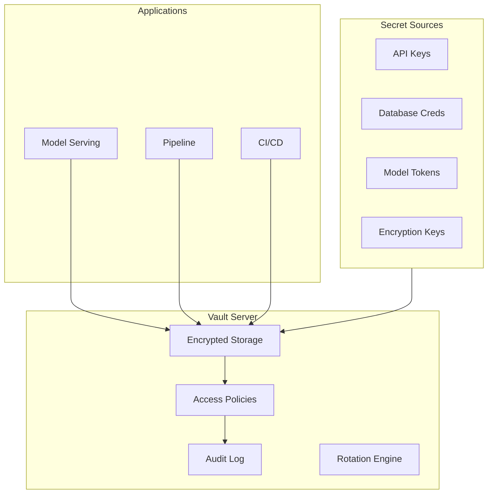

<!-- Clear Language: Keep sentences under 50 words -->
# Secret and Key Management

## Learning Objectives

| Objective | Description |
|-----------|-------------|
| LO1 | Understand secret management requirements for AI/LLM applications |
| LO2 | Implement API key rotation and lifecycle management |
| LO3 | Build vault integrations for secure credential storage |
| LO4 | Deploy environment-specific secret configurations |
| LO5 | Set up audit logging for secret access |
| LO6 | Design zero-trust architecture for model access control |

## Introduction

AI systems face unique security threats. Prompt injection, data leakage, and content abuse require specialized defenses. This module covers threat modeling, guardrails, and compliance for production AI.

## Prerequisites

- Basic programming knowledge
- Understanding of data structures

## Key Terminology

**Key Terms**: Core vocabulary and concepts for this topic.

**Definition**: Essential terms you must know for interviews and production work.

## Theory

Understanding secret and key management is fundamental for AI engineers. This section covers the core concepts, underlying principles, and theoretical framework that govern how secret and key management works in practice.

## Chapter at a Glance

| Section | Topic | Key Concept |
|---------|-------|-------------|
| 5.1 | Secret Management Overview | Types of secrets in AI systems |
| 5.2 | API Key Lifecycle | Creation, rotation, revocation |
| 5.3 | Vault Integration | HashiCorp Vault for secure storage |
| 5.4 | Environment Configuration | Dev/staging/prod secret separation |
| 5.5 | Audit & Monitoring | Secret access tracking and alerting |
| 5.6 | Zero-Trust Architecture | Model API access without hardcoded keys |

## Chapter Roadmap



## 5.1 Secret Management Overview

AI/LLM applications have more secrets than traditional applications: LLM API keys, model registry tokens, vector database credentials, embedding API keys, and fine-tuning data access tokens.

```python
import os
import json
import base64
from typing import Dict, Optional, List
from datetime import datetime, timedelta
import hashlib

class SecretType:
    LLM_API_KEY = "llm_api_key"
    DATABASE_URL = "database_url"
    MODEL_REGISTRY_TOKEN = "model_registry_token"
    VECTOR_DB_CREDENTIALS = "vector_db_credentials"
    ENCRYPTION_KEY = "encryption_key"
    CI_CD_TOKEN = "ci_cd_token"
    SERVICE_ACCOUNT = "service_account"
    WEBHOOK_SECRET = "webhook_secret"

class SecretManager:
    """Centralized secret management for AI applications."""

    def __init__(self, vault_addr: str = None):
        self.vault_addr = vault_addr
        self.cache = {}
        self.access_log = []

    def get_secret(self, secret_name: str, environment: str = "production") -> Optional[str]:
        """Retrieve a secret with access logging."""
        cache_key = f"{environment}:{secret_name}"

        # Check cache first
        if cache_key in self.cache:
            cached = self.cache[cache_key]
            if cached["expires_at"] > datetime.utcnow():
                self._log_access(secret_name, "cache_hit")
                return cached["value"]

        # Fetch from vault (simulated)
        secret = self._fetch_from_vault(secret_name, environment)
        if secret:
            self.cache[cache_key] = {
                "value": secret,
                "expires_at": datetime.utcnow() + timedelta(hours=1)
            }
            self._log_access(secret_name, "vault_fetch")
            return secret

        # Fallback to environment variable
        env_var = secret_name.upper()
        secret = os.environ.get(env_var)
        if secret:
            self._log_access(secret_name, "env_var")
            return secret

        return None

    def set_secret(self, secret_name: str, secret_value: str, environment: str = "production"):
        """Store a secret in vault (simulated)."""
        self._log_access(secret_name, "set")
        print(f"🔐 Stored secret '{secret_name}' for {environment}")

    def rotate_secret(self, secret_name: str, environment: str = "production") -> str:
        """Generate and store a new secret value."""
        import secrets
        new_secret = secrets.token_urlsafe(32)
        self.set_secret(secret_name, new_secret, environment)
        self._log_access(secret_name, "rotate")
        return new_secret

    def _fetch_from_vault(self, secret_name: str, environment: str) -> Optional[str]:
        """Simulated vault fetch."""
        return None

    def _log_access(self, secret_name: str, method: str):
        self.access_log.append({
            "secret": secret_name,
            "method": method,
            "timestamp": datetime.utcnow().isoformat()
        })

    def get_access_report(self) -> Dict:
        """Generate access report for audit."""
        from collections import Counter
        access_counts = Counter(entry["secret"] for entry in self.access_log)
        return {
            "total_accesses": len(self.access_log),
            "secrets_accessed": len(set(entry["secret"] for entry in self.access_log)),
            "most_accessed": access_counts.most_common(5),
            "recent_accesses": self.access_log[-10:]
        }

sm = SecretManager()
sm.get_secret("openai_api_key")
sm.get_secret("database_url")
print(json.dumps(sm.get_access_report(), indent=2, default=str))
```

**Common AI secrets and their risks**:

| Secret Type | Example | Risk if Leaked |
|-------------|---------|----------------|
| LLM API key | `sk-...` | Unauthorized usage, $10K+/day bills |
| Model registry token | `mlflow_...` | Model theft, unauthorized deployments |
| Vector DB credential | `qdrant_...` | Data exfiltration of knowledge base |
| Fine-tuning data token | `hf_...` | Training data theft |
| Encryption key | AES-256 key | All stored secrets compromised |

---

## 5.2 API Key Lifecycle

API keys need a complete lifecycle: creation, distribution, usage tracking, rotation, and revocation.

```python
import secrets
import hashlib
from datetime import datetime, timedelta
from typing import Optional, Dict, List
import uuid

class APIKeyManager:
    """Complete API key lifecycle management."""

    def __init__(self):
        self.keys = {}  # key_hash -> metadata
        self.revoked_keys = set()

    def create_key(self, name: str, permissions: List[str], expires_in_days: int = 90, rate_limit: int = 1000) -> Dict:
        """Create a new API key."""
        # Generate key
        key_id = str(uuid.uuid4())[:8]
        raw_key = f"sk-{key_id}-{secrets.token_urlsafe(24)}"
        key_hash = self._hash_key(raw_key)

        metadata = {
            "key_id": key_id,
            "name": name,
            "permissions": permissions,
            "created_at": datetime.utcnow(),
            "expires_at": datetime.utcnow() + timedelta(days=expires_in_days),
            "rate_limit": rate_limit,
            "usage_count": 0,
            "last_used": None,
            "status": "active"
        }

        self.keys[key_hash] = metadata
        print(f"🔑 Created key '{name}' (ID: {key_id}, expires: {metadata['expires_at'].date()})")

        return {"key": raw_key, "key_id": key_id, "metadata": {k: v for k, v in metadata.items() if k != "key_id"}}

    def validate_key(self, raw_key: str) -> Optional[Dict]:
        """Validate an API key and return its metadata."""
        key_hash = self._hash_key(raw_key)

        if raw_key in self.revoked_keys:
            return None

        metadata = self.keys.get(key_hash)
        if not metadata:
            return None

        # Check expiration
        if metadata["expires_at"] < datetime.utcnow():
            metadata["status"] = "expired"
            return None

        # Update usage
        metadata["usage_count"] += 1
        metadata["last_used"] = datetime.utcnow()

        return metadata

    def revoke_key(self, raw_key: str):
        """Revoke an API key immediately."""
        key_hash = self._hash_key(raw_key)
        if key_hash in self.keys:
            self.keys[key_hash]["status"] = "revoked"
            self.revoked_keys.add(raw_key)
            print(f"🔴 Revoked key: {self.keys[key_hash]['name']}")

    def rotate_key(self, old_key: str) -> Optional[Dict]:
        """Rotate a key: revoke old, create new with same permissions."""
        metadata = self.validate_key(old_key)
        if not metadata:
            return None

        new_key = self.create_key(
            name=f"{metadata['name']} (rotated)",
            permissions=metadata["permissions"],
            expires_in_days=90
        )

        self.revoke_key(old_key)
        return new_key

    def list_keys(self, status: str = "active") -> List[Dict]:
        return [
            {k: v for k, v in m.items() if k != "key_id"}
            for m in self.keys.values()
            if m["status"] == status
        ]

    def cleanup_expired_keys(self):
        """Remove expired keys."""
        now = datetime.utcnow()
        expired = [h for h, m in self.keys.items() if m["expires_at"] < now]
        for h in expired:
            self.keys[h]["status"] = "expired"

    def _hash_key(self, key: str) -> str:
        return hashlib.sha256(key.encode()).hexdigest()

## Simulated lifecycle
km = APIKeyManager()

prod_key = km.create_key("production-llm", ["llm:read", "llm:write"], rate_limit=5000)
dev_key = km.create_key("development-llm", ["llm:read"], rate_limit=100)

print(f"\nDev key: {dev_key['key'][:20]}...")
print(f"Validation: {km.validate_key(dev_key['key']) is not None}")

## Simulate rotation
new_prod_key = km.rotate_key(prod_key["key"])
print(f"New prod key ID: {new_prod_key['key_id']}")
print(f"Old key valid: {km.validate_key(prod_key['key']) is not None}")

## Cleanup
km.cleanup_expired_keys()
print(f"\nActive keys: {len(km.list_keys('active'))}")
```

---

## 5.3 Vault Integration

HashiCorp Vault provides centralized secret storage with encryption, access control, and audit logging.

```python
import json
from datetime import datetime
from typing import Optional, Dict, List
import requests

class VaultClient:
    """Simulated HashiCorp Vault client for secret management."""

    def __init__(self, vault_addr: str = "http://vault:8200", token: str = None):
        self.addr = vault_addr
        self.token = token
        self._secrets = {}  # In-memory secret store (simulated)
        self._policies = {}
        self.audit_log = []

    def authenticate(self, role: str, jwt: str = None) -> bool:
        """Authenticate to Vault."""
        # Simulated Kubernetes auth
        print(f"Authenticated to Vault with role: {role}")
        self.token = f"vault-token-{role}"
        return True

    def write_secret(self, path: str, data: Dict, version: int = None):
        """Write a secret to Vault."""
        if not self.token:
            raise PermissionError("Not authenticated to Vault")

        if path not in self._secrets:
            self._secrets[path] = []

        entry = {
            "data": data,
            "version": version or len(self._secrets[path]) + 1,
            "created_at": datetime.utcnow().isoformat(),
            "created_by": self.token
        }
        self._secrets[path].append(entry)

        self._log_audit("write", path)
        print(f"📝 Written secret to {path} (v{entry['version']})")

    def read_secret(self, path: str, version: int = None) -> Optional[Dict]:
        """Read a secret from Vault."""
        if path not in self._secrets:
            return None

        versions = self._secrets[path]
        if version:
            entry = next((v for v in versions if v["version"] == version), None)
        else:
            entry = versions[-1] if versions else None

        if entry:
            self._log_audit("read", path)
            return entry

        return None

    def list_secrets(self, path_prefix: str = "") -> List[str]:
        """List all secrets under a path prefix."""
        return [p for p in self._secrets.keys() if p.startswith(path_prefix)]

    def delete_secret(self, path: str):
        """Delete a secret path."""
        if path in self._secrets:
            del self._secrets[path]
            self._log_audit("delete", path)

    def set_policy(self, name: str, rules: List[Dict]):
        """Set access policy."""
        self._policies[name] = rules
        print(f"Policy '{name}' set with {len(rules)} rules")

    def _log_audit(self, operation: str, path: str):
        self.audit_log.append({
            "operation": operation,
            "path": path,
            "token": self.token,
            "timestamp": datetime.utcnow().isoformat()
        })

    def get_audit_log(self, n: int = 20) -> List[Dict]:
        return self.audit_log[-n:]

## Usage
vault = VaultClient()
vault.authenticate("ml-service")

## Store LLM API keys
vault.write_secret("llm/openai/prod", {
    "api_key": "sk-prod-...",
    "organization": "org-123",
    "rate_limit": 5000
})

vault.write_secret("llm/anthropic/prod", {
    "api_key": "sk-ant-prod-...",
    "rate_limit": 3000
})

## Store database credentials
vault.write_secret("database/vector-db", {
    "host": "qdrant.internal:6333",
    "api_key": "qdrant-secret-key",
    "tls_enabled": True
})

## Set policies
vault.set_policy("ml-engineer", [
    {"path": "llm/*", "capabilities": ["read"]},
    {"path": "database/*", "capabilities": ["read"]}
])

## Read back
secret = vault.read_secret("llm/openai/prod")
print(f"\nOpenAI key stored: {secret['data']['api_key'][:15]}...")

print(f"Audit entries: {len(vault.get_audit_log())}")
```

**Dynamic secrets for database access**:

```python
class DynamicSecretEngine:
    """Generate time-limited database credentials."""

    def __init__(self, vault_client: VaultClient):
        self.vault = vault_client
        self.active_leases = {}

    def generate_credentials(self, db_name: str, ttl_seconds: int = 3600) -> Dict:
        """Generate temporary database credentials."""
        import secrets
        lease_id = secrets.token_hex(8)

        creds = {
            "username": f"ml-{db_name}-{lease_id[:6]}",
            "password": secrets.token_urlsafe(16),
            "database": db_name,
            "lease_id": lease_id,
            "ttl": ttl_seconds,
            "expires_at": (datetime.utcnow() + timedelta(seconds=ttl_seconds)).isoformat()
        }

        self.active_leases[lease_id] = creds
        print(f"🔑 Generated dynamic credentials for {db_name} (lease: {lease_id}, TTL: {ttl_seconds}s)")
        return creds

    def renew_lease(self, lease_id: str, extend_seconds: int = 3600) -> bool:
        if lease_id in self.active_leases:
            self.active_leases[lease_id]["expires_at"] = (datetime.utcnow() + timedelta(seconds=extend_seconds)).isoformat()
            print(f"Renewed lease {lease_id} (+{extend_seconds}s)")
            return True
        return False

    def revoke_lease(self, lease_id: str):
        if lease_id in self.active_leases:
            del self.active_leases[lease_id]
            print(f"Revoked lease {lease_id}")

dyn = DynamicSecretEngine(vault)
creds = dyn.generate_credentials("analytics_db", ttl_seconds=300)
print(f"Temp user: {creds['username']}, expires: {creds['expires_at']}")
```

---

## 5.4 Environment Configuration

Different environments (dev, staging, prod) need different secrets with strict isolation.

```python
from pathlib import Path
import os

class EnvironmentSecretManager:
    """Manage secrets across environments with strict isolation."""

    def __init__(self, base_path: str = ".secrets"):
        self.base_path = Path(base_path)
        self.environments = ["development", "staging", "production"]

    def init_environment(self, env: str):
        """Initialize secret storage for an environment."""
        env_path = self.base_path / env
        env_path.mkdir(parents=True, exist_ok=True)
        (env_path / ".gitignore").write_text("*")
        print(f"Initialized secret store for {env}")

    def set_secret(self, env: str, key: str, value: str):
        """Store a secret for a specific environment."""
        env_file = self.base_path / env / f"{key}.secret"
        env_file.write_text(value)
        print(f"Set {key} for {env}")

    def get_secret(self, env: str, key: str) -> Optional[str]:
        env_file = self.base_path / env / f"{key}.secret"
        if env_file.exists():
            return env_file.read_text()
        return None

    def list_secrets(self, env: str) -> List[str]:
        env_path = self.base_path / env
        if env_path.exists():
            return [f.stem for f in env_path.glob("*.secret")]
        return []

    def validate_environment(self, env: str) -> Dict:
        """Validate that all required secrets exist for an environment."""
        required_secrets = {
            "development": ["openai_api_key", "database_url"],
            "staging": ["openai_api_key", "database_url", "model_registry_token"],
            "production": ["openai_api_key", "database_url", "model_registry_token", "encryption_key", "webhook_secret"],
        }

        required = required_secrets.get(env, [])
        existing = self.list_secrets(env)
        missing = [s for s in required if s not in existing]

        return {
            "environment": env,
            "required": len(required),
            "present": len(existing),
            "missing": missing,
            "valid": len(missing) == 0
        }

ems = EnvironmentSecretManager()
ems.init_environment("production")
ems.set_secret("production", "openai_api_key", "sk-prod-...")
ems.set_secret("production", "database_url", "postgresql://prod:pass@db:5432/ml")

validation = ems.validate_environment("production")
print(f"Production secrets: {validation['present']}/{validation['required']} valid={validation['valid']}")
if not validation["valid"]:
    print(f"Missing: {validation['missing']}")
```

**Environment-aware secret resolution**:

```python
class SecretResolver:
    """Resolve secrets with environment fallback chain."""

    def __init__(self):
        self.sources = []

    def add_source(self, name: str, resolver_fn):
        self.sources.append((name, resolver_fn))

    def resolve(self, secret_name: str, environment: str = "production") -> Optional[str]:
        for source_name, resolver_fn in self.sources:
            value = resolver_fn(secret_name, environment)
            if value:
                return value
        return None

resolver = SecretResolver()
resolver.add_source("vault", lambda n, e: f"vault-{e}-{n}" if n == "openai_api_key" else None)
resolver.add_source("env_var", lambda n, e: os.environ.get(n.upper()))
resolver.add_source("file", lambda n, e: Path(f".secrets/{e}/{n}.secret").read_text() if Path(f".secrets/{e}/{n}.secret").exists() else None)

## os.environ["OPENAI_API_KEY"] = "sk-env-..."
value = resolver.resolve("openai_api_key", "production")
print(f"Resolved: {value}")
```

---

## 5.5 Audit & Monitoring

Audit logging tracks who accessed which secrets and when, enabling security incident investigation.

```python
import json
from datetime import datetime
from typing import Dict, List, Optional

class SecretAuditLogger:
    """Audit logging for secret access."""

    def __init__(self, log_path: str = "secret_audit.log"):
        self.log_path = log_path
        self.entries = []

    def log_access(self, secret_name: str, user: str, action: str, source_ip: str = None, success: bool = True):
        entry = {
            "timestamp": datetime.utcnow().isoformat(),
            "secret": secret_name,
            "user": user,
            "action": action,
            "source_ip": source_ip,
            "success": success
        }
        self.entries.append(entry)
        self._write_entry(entry)

    def _write_entry(self, entry: Dict):
        with open(self.log_path, "a") as f:
            f.write(json.dumps(entry) + "\n")

    def query(self, user: str = None, secret: str = None, action: str = None, limit: int = 100) -> List[Dict]:
        results = self.entries
        if user:
            results = [e for e in results if e["user"] == user]
        if secret:
            results = [e for e in results if e["secret"] == secret]
        if action:
            results = [e for e in results if e["action"] == action]
        return results[-limit:]

    def detect_anomalies(self) -> List[Dict]:
        """Detect suspicious secret access patterns."""
        anomalies = []

        # Failed access attempts
        failed = [e for e in self.entries if not e["success"]]
        if len(failed) > 5:
            anomalies.append({
                "type": "multiple_failures",
                "count": len(failed),
                "users": list(set(e["user"] for e in failed)),
                "severity": "warning"
            })

        # Unusual access times
        for entry in self.entries:
            hour = int(entry["timestamp"].split("T")[1].split(":")[0])
            if hour < 6 or hour > 22:
                anomalies.append({
                    "type": "unusual_time",
                    "secret": entry["secret"],
                    "user": entry["user"],
                    "time": entry["timestamp"],
                    "severity": "info"
                })

        return anomalies

logger = SecretAuditLogger()
logger.log_access("openai_api_key", "alice", "read", "10.0.1.50")
logger.log_access("openai_api_key", "bob", "read", "10.0.1.51")
logger.log_access("database_url", "alice", "read", "10.0.1.50")
logger.log_access("openai_api_key", "unknown", "read", "203.0.113.5", success=False)

anomalies = logger.detect_anomalies()
print(f"Anomalies detected: {len(anomalies)}")
for a in anomalies:
    print(f"  [{a['severity'].upper()}] {a['type']}")
```

**Secret scanning in code**:

```python
import re

class SecretScanner:
    """Scan code for accidentally committed secrets."""

    PATTERNS = {
        "AWS Key": r"AKIA[0-9A-Z]{16}",
        "GitHub Token": r"gh[pousr]_[A-Za-z0-9_]{36,}",
        "OpenAI Key": r"sk-[A-Za-z0-9]{32,}",
        "Generic API Key": r"(?i)(api[_-]?key|apikey|secret)[\s]*[:=][\s]*['\"][A-Za-z0-9_\-]{16,}['\"]",
        "Private Key": r"-----BEGIN (RSA |EC )?PRIVATE KEY-----",
        "Database URL": r"postgres(ql)?://\w+:\w+@",
        "JWT Token": r"eyJ[A-Za-z0-9_\-]{20,}\.[A-Za-z0-9_\-]{20,}\.[A-Za-z0-9_\-]{20,}",
    }

    def __init__(self):
        self.compiled = {name: re.compile(pattern) for name, pattern in self.PATTERNS.items()}

    def scan_file(self, file_path: str) -> List[Dict]:
        findings = []
        try:
            with open(file_path, "r") as f:
                for i, line in enumerate(f, 1):
                    for name, pattern in self.compiled.items():
                        if pattern.search(line):
                            findings.append({
                                "file": file_path,
                                "line": i,
                                "type": name,
                                "snippet": line.strip()[:80]
                            })
        except Exception as e:
            pass
        return findings

    def scan_directory(self, directory: str, exclude_patterns: List[str] = None) -> List[Dict]:
        all_findings = []
        for root, dirs, files in os.walk(directory):
            # Skip .git and node_modules
            dirs[:] = [d for d in dirs if d not in [".git", "node_modules", "__pycache__", ".venv"]]
            for file in files:
                file_path = os.path.join(root, file)
                if any(file.endswith(ext) for ext in [".py", ".ts", ".js", ".yaml", ".yml", ".json", ".env", ".sh"]):
                    findings = self.scan_file(file_path)
                    all_findings.extend(findings)
        return all_findings

scanner = SecretScanner()
test_file = "test_config.py"
with open(test_file, "w") as f:
    f.write("openai_api_key = 'sk-test123456789012345678901234567'\n")

findings = scanner.scan_file(test_file)
for f in findings:
    print(f"🔴 Found {f['type']} at {f['file']}:{f['line']}")
    print(f"   {f['snippet']}")

os.remove(test_file)
```

---

## 5.6 Zero-Trust Architecture

Zero-trust for ML systems means no implicit trust based on network location — every request must authenticate and authorize.

```python
import hashlib
import hmac
import time
from typing import Optional, Dict
import jwt as pyjwt

class ZeroTrustAuth:
    """Zero-trust authentication for model API access."""

    def __init__(self, secret_key: str):
        self.secret_key = secret_key

    def generate_service_token(self, service_name: str, permissions: list, ttl_seconds: int = 3600) -> str:
        """Generate a signed JWT for service-to-service auth."""
        payload = {
            "sub": service_name,
            "permissions": permissions,
            "iat": int(time.time()),
            "exp": int(time.time()) + ttl_seconds,
            "jti": hashlib.md5(f"{service_name}-{time.time()}".encode()).hexdigest()[:16]
        }
        return pyjwt.encode(payload, self.secret_key, algorithm="HS256")

    def verify_token(self, token: str) -> Optional[Dict]:
        """Verify and decode a service token."""
        try:
            payload = pyjwt.decode(token, self.secret_key, algorithms=["HS256"])
            return payload
        except pyjwt.ExpiredSignatureError:
            print("Token expired")
            return None
        except pyjwt.InvalidTokenError:
            print("Invalid token")
            return None

    def require_permission(self, token: str, required_perm: str) -> bool:
        """Check if token has required permission."""
        payload = self.verify_token(token)
        if not payload:
            return False
        permissions = payload.get("permissions", [])
        return required_perm in permissions

## Zero-trust middleware
class ZeroTrustMiddleware:
    def __init__(self, auth: ZeroTrustAuth):
        self.auth = auth

    def authenticate_request(self, request_headers: Dict) -> Dict:
        """Authenticate and authorize an API request."""
        auth_header = request_headers.get("Authorization", "")
        if not auth_header.startswith("Bearer "):
            return {"authenticated": False, "reason": "Missing or invalid Authorization header"}

        token = auth_header[7:]
        payload = self.auth.verify_token(token)
        if not payload:
            return {"authenticated": False, "reason": "Invalid or expired token"}

        return {
            "authenticated": True,
            "service": payload["sub"],
            "permissions": payload["permissions"],
            "token_id": payload["jti"]
        }

## mTLS for transport security
class mTLSConfig:
    """Mutual TLS configuration for model serving."""

    def __init__(self, cert_path: str, key_path: str, ca_path: str):
        self.cert_path = cert_path
        self.key_path = key_path
        self.ca_path = ca_path

    def get_ssl_context(self):
        """Get SSL context for mTLS."""
        import ssl
        context = ssl.create_default_context(ssl.Purpose.CLIENT_AUTH)
        context.load_cert_chain(self.cert_path, self.key_path)
        context.load_verify_locations(cafile=self.ca_path)
        context.verify_mode = ssl.CERT_REQUIRED
        return context

## Simulated zero-trust flow
auth = ZeroTrustAuth("super-secret-key-2025")
ztmw = ZeroTrustMiddleware(auth)

token = auth.generate_service_token("model-serving-v2", ["llm:inference", "model:read"])
print(f"Token: {token[:50]}...")

request = {"Authorization": f"Bearer {token}"}
result = ztmw.authenticate_request(request)
print(f"Authenticated: {result['authenticated']}, Service: {result.get('service', 'N/A')}")

## Permission check
can_infer = auth.require_permission(token, "llm:inference")
print(f"Can infer: {can_infer}")

## Expired token test (simulated)
time.sleep(0.1)
```

---

## TypeScript Parallel

```typescript
// TypeScript secret management
import { createHash, randomBytes } from "crypto";

interface SecretEntry {
  key: string;
  value: string;
  environment: string;
  expiresAt: Date;
}

class SecretVault {
  private secrets: Map<string, SecretEntry> = new Map();

  set(key: string, value: string, env: string, ttlMs: number = 3600000): void {
    this.secrets.set(`${env}:${key}`, { key, value, environment: env, expiresAt: new Date(Date.now() + ttlMs) });
  }

  get(key: string, env: string): string | null {
    const entry = this.secrets.get(`${env}:${key}`);
    if (!entry || entry.expiresAt < new Date()) return null;
    return entry.value;
  }

  rotate(key: string, env: string): string {
    const newValue = randomBytes(32).toString("hex");
    this.set(key, newValue, env);
    return newValue;
  }
}

const vault = new SecretVault();
vault.set("openai_key", "sk-test...", "production");
console.log(vault.get("openai_key", "production"));
```

---

## Summary

- AI applications manage more secrets than traditional apps: LLM keys, model registry tokens, vector DB credentials
- API key lifecycle includes creation, distribution, usage tracking, rotation, and revocation
- HashiCorp Vault provides encrypted secret storage with policies and audit logging
- Dynamic secrets generate time-limited credentials for database access
- Environment-specific secret configuration enforces isolation between dev/staging/prod
- Audit logging tracks who accessed which secret, enabling anomaly detection
- Secret scanning in codebases prevents accidental credential commits
- Zero-trust architecture requires authentication and authorization for every API call
- mTLS provides transport-layer security with mutual certificate verification
- Secret rotation should be automated with notification to affected services

## Practical Takeaways

| Scenario | Do This | Avoid This |
|----------|---------|------------|
| Storing API keys | Vault or secrets manager | Hardcoding in source code |
| Key rotation | Automated rotation every 90 days | Never rotating keys |
| Multi-environment | Separate secret stores per environment | Sharing secrets across environments |
| Service auth | JWT tokens with short TTL | Long-lived static tokens |
| Code scanning | Pre-commit hooks for secret detection | Committing secrets even temporarily |
| Audit | Log every secret access | No audit trail |

## Interview Q&A

<details class="tp-qa-card" data-qid="ai-sec-s05-q1">
  <summary class="tp-qa-question">
    <span class="tp-qa-status"></span>
    Q1: What secrets do AI/LLM applications manage that traditional apps don't?
  </summary>
  <div class="tp-qa-answer">
    <p>AI-specific secrets include: LLM provider API keys (OpenAI, Anthropic), model registry tokens (MLflow, Hugging Face), vector database credentials (Pinecone, Qdrant, Weaviate), embedding API keys, fine-tuning data access tokens, and model encryption keys. Each of these represents a unique security risk if leaked.</p>
  </div>
  <button class="tp-qa-mark-btn">✅ Mark Reviewed</button>
  <button class="tp-qa-bookmark-btn">🔖 Bookmark</button>
</details>

<details class="tp-qa-card" data-qid="ai-sec-s05-q2">
  <summary class="tp-qa-question">
    <span class="tp-qa-status"></span>
    Q2: How does HashiCorp Vault work for secret management?
  </summary>
  <div class="tp-qa-answer">
    <p>Vault stores secrets encrypted at rest and in transit. Clients authenticate via tokens, Kubernetes auth, or LDAP. Access policies define who can read/write which paths. Vault supports: static secrets (API keys), dynamic secrets (time-limited DB creds), and encryption-as-a-service. All access is logged for audit.</p>
  </div>
  <button class="tp-qa-mark-btn">✅ Mark Reviewed</button>
  <button class="tp-qa-bookmark-btn">🔖 Bookmark</button>
</details>

<details class="tp-qa-card" data-qid="ai-sec-s05-q3">
  <summary class="tp-qa-question">
    <span class="tp-qa-status"></span>
    Q3: What is the API key lifecycle?
  </summary>
  <div class="tp-qa-answer">
    <p>Create → Distribute → Track → Rotate → Revoke. Create with metadata (name, permissions, expiry). Distribute securely (not in code, logs, or chat). Track usage patterns. Rotate periodically (90 days recommended) or immediately if compromised. Revoke by invalidating the key hash and removing from active set.</p>
  </div>
  <button class="tp-qa-mark-btn">✅ Mark Reviewed</button>
  <button class="tp-qa-bookmark-btn">🔖 Bookmark</button>
</details>

<details class="tp-qa-card" data-qid="ai-sec-s05-q4">
  <summary class="tp-qa-question">
    <span class="tp-qa-status"></span>
    Q4: How do dynamic secrets work?
  </summary>
  <div class="tp-qa-answer">
    <p>Dynamic secrets generate credentials on-demand with a limited time-to-live (TTL). The application requests credentials from Vault, gets a username/password pair that works for N minutes, uses it, then the credentials expire. This eliminates long-lived static credentials that could be stolen. Vault manages the lease lifecycle: create, renew, revoke.</p>
  </div>
  <button class="tp-qa-mark-btn">✅ Mark Reviewed</button>
  <button class="tp-qa-bookmark-btn">🔖 Bookmark</button>
</details>

<details class="tp-qa-card" data-qid="ai-sec-s05-q5">
  <summary class="tp-qa-question">
    <span class="tp-qa-status"></span>
    Q5: How do you detect secrets accidentally committed to Git?
  </summary>
  <div class="tp-qa-answer">
    <p>Use pre-commit hooks with tools like git-secrets, truffleHog, or Gitleaks. These scan staged files for patterns (AWS keys, API keys, private keys, database URLs). Also scan Git history for past leaks. Set up server-side scanning in CI/CD. If a secret is committed, rotate it immediately and purge from Git history.</p>
  </div>
  <button class="tp-qa-mark-btn">✅ Mark Reviewed</button>
  <button class="tp-qa-bookmark-btn">🔖 Bookmark</button>
</details>

<details class="tp-qa-card" data-qid="ai-sec-s05-q6">
  <summary class="tp-qa-question">
    <span class="tp-qa-status"></span>
    Q6: How do you implement zero-trust for model serving?
  </summary>
  <div class="tp-qa-answer">
    <p>Every request must authenticate and authorize: (1) Service identity via mTLS certificates, (2) JWT tokens with short TTL and permission claims, (3) Request-level authorization checking required scopes, (4) Rate limiting per identity, (5) Audit logging of all requests. No implicit trust based on network (VPC, internal IP).</p>
  </div>
  <button class="tp-qa-mark-btn">✅ Mark Reviewed</button>
  <button class="tp-qa-bookmark-btn">🔖 Bookmark</button>
</details>

<details class="tp-qa-card" data-qid="ai-sec-s05-q7">
  <summary class="tp-qa-question">
    <span class="tp-qa-status"></span>
    Q7: How do you handle secrets in CI/CD pipelines?
  </summary>
  <div class="tp-qa-answer">
    <p>Use CI/CD platform secret stores (GitHub Actions secrets, GitLab CI variables). Never expose secrets in logs, build output, or error messages. Use environment-specific variables. For ML pipelines, authenticate to Vault from CI using OIDC/JWT tokens. Scan pipeline output for accidental secret exposure.</p>
  </div>
  <button class="tp-qa-mark-btn">✅ Mark Reviewed</button>
  <button class="tp-qa-bookmark-btn">🔖 Bookmark</button>
</details>

<details class="tp-qa-card" data-qid="ai-sec-s05-q8">
  <summary class="tp-qa-question">
    <span class="tp-qa-status"></span>
    Q8: What is a secret zero-trust architecture for LLM API keys?
  </summary>
  <div class="tp-qa-answer">
<p>The application never directly holds LLM API keys. Instead: (1) A proxy/service mesh handles LLM API calls, (2) The proxy authenticates to Vault,.
retrieves the key, calls the LLM, (3) The key is held in memory only, never written to disk, (4) Downstream services authenticate to the proxy via mTLS + JWT,.
(5) The proxy enforces rate limits and audits all usage.</p>
  </div>
  <button class="tp-qa-mark-btn">✅ Mark Reviewed</button>
  <button class="tp-qa-bookmark-btn">🔖 Bookmark</button>
</details>

<details class="tp-qa-card" data-qid="ai-sec-s05-q9">
  <summary class="tp-qa-question">
    <span class="tp-qa-status"></span>
    Q9: How do you rotate secrets without downtime?
  </summary>
  <div class="tp-qa-answer">
<p>Implement dual-key support: maintain two valid keys during rotation. Steps: (1) Deploy new key alongside old, (2) Update all services to use new key,.
(3) Verify all services work with new key, (4) Revoke old key. For services that can't be updated simultaneously, have a grace period where both keys are valid. Automate the entire process.</p>
  </div>
  <button class="tp-qa-mark-btn">✅ Mark Reviewed</button>
  <button class="tp-qa-bookmark-btn">🔖 Bookmark</button>
</details>

<details class="tp-qa-card" data-qid="ai-sec-s05-q10">
  <summary class="tp-qa-question">
    <span class="tp-qa-status"></span>
    Q10: What audit log entries should you track for secret management?
  </summary>
  <div class="tp-qa-answer">
    <p>Track: (1) Secret reads — who, when, which secret, source IP, (2) Secret writes/updates, (3) Key rotation events, (4) Failed access attempts (especially repeated), (5) Policy changes, (6) Lease creation/renewal/revocation for dynamic secrets, (7) Access from unusual locations or times. Store logs in immutable storage with alerting on anomalies.</p>
  </div>
  <button class="tp-qa-mark-btn">✅ Mark Reviewed</button>
  <button class="tp-qa-bookmark-btn">🔖 Bookmark</button>
</details>

## Chapter Quiz

**Q1**: What is the recommended API key rotation period?
a) 7 days
b) 30 days
c) 90 days
d) 365 days

<details class="tp-qa-card" data-qid="ai-sec-s05-quiz1"><summary>Show Answer</summary><div class="tp-qa-answer"><p><strong>Answer: c) 90 days</strong></p><p>Industry best practice recommends rotating API keys every 90 days.</p></div></details>

**Q2**: What does HashiCorp Vault provide for secret management?
a) Only encryption
b) Encrypted storage, access policies, audit logging
c) Only key generation
d) Only key rotation

<details class="tp-qa-card" data-qid="ai-sec-s05-quiz2"><summary>Show Answer</summary><div class="tp-qa-answer"><p><strong>Answer: b) Encrypted storage, access policies, audit logging</strong></p><p>Vault provides comprehensive secret management with policies, audit, and dynamic secrets.</p></div></details>

**Q3**: What is a dynamic secret?
a) A secret that changes every second
b) A time-limited credential generated on demand
c) An encrypted static key
d) A user-provided password

<details class="tp-qa-card" data-qid="ai-sec-s05-quiz3"><summary>Show Answer</summary><div class="tp-qa-answer"><p><strong>Answer: b) A time-limited credential generated on demand</strong></p><p>Dynamic secrets have finite TTL and expire automatically, eliminating long-lived credentials.</p></div></details>

**Q4**: What is the primary benefit of zero-trust for model serving?
a) Lower latency
b) No implicit trust — every request must authenticate
c) Simpler architecture
d) Lower cost

<details class="tp-qa-card" data-qid="ai-sec-s05-quiz4"><summary>Show Answer</summary><div class="tp-qa-answer"><p><strong>Answer: b) No implicit trust — every request must authenticate</strong></p><p>Zero-trust removes implicit network trust and requires authentication for every request.</p></div></details>

**Q5**: What should you do if a secret is accidentally committed to Git?
a) Nothing, just leave it
b) Rotate the secret immediately and purge from Git history
c) Delete the file only
d) Change the file permission

<details class="tp-qa-card" data-qid="ai-sec-s05-quiz5"><summary>Show Answer</summary><div class="tp-qa-answer"><p><strong>Answer: b) Rotate the secret immediately and purge from Git history</strong></p><p>Once a secret is committed, it's compromised — rotate it and remove from history.</p></div></details>

## Exercises

**Easy** — Implement an APIKeyManager with create, validate, and revoke methods. Test the full lifecycle.

**Medium** — Build a VaultClient with write, read, list, and delete operations. Add audit logging for operations.

**Medium** — Create a SecretScanner that detects AWS keys, GitHub tokens, and OpenAI keys in files.

**Hard** — Implement a ZeroTrustAuth system with JWT generation, token verification, and permission checking.

**Hard** — Build a complete secret management system with vault integration, environment separation, audit logging, and anomaly detection.

---

## Common Mistakes

1. Not understanding the fundamental concepts before applying them
2. Skipping edge cases in implementation
3. Not analyzing time/space complexity
4. Forgetting to handle null/empty inputs
5. Not practicing enough problems to build pattern recognition

## Revision Notes

- - Core principle: Understand the fundamental concepts thoroughly
- - Implementation pattern: Practice with real code examples
- - Complexity: Know the time and space complexity
- - Application: Know when to use this in production systems
- - Interview: Frequently asked in technical interviews
- - Edge cases: Consider common failure scenarios
- - Related concepts: Connect to broader system design

## Placement Section

### Top 10 Interview Questions

#### Google Style

1. **Explain the core idea of Secret and Key Management in under 60 seconds, then give a real-world analogy.** — Structure: definition, how it works in one sentence, why it matters, analogy. Follow-up: what would break if you removed this from a production system?

2. **Design a minimal, well-typed function that demonstrates Secret and Key Management.** — Interviewer checks: signature with type hints, edge cases, complexity, and a clean docstring. Follow-up: how does your design behave with empty or malformed input?

3. **What are the common pitfalls when engineers first learn ** — List 3-4, then explain how you would prevent each in a code review.

#### Amazon Style

4. **Describe a production bug caused by misunderstanding Secret and Key Management. How did you diagnose and fix it?** — STAR format: situation, task, action, result. Mention logs, reproduction, root-cause analysis, and the regression test you added.

5. **How would you scale a system that relies on Secret and Key Management from 10 users to 10 million?** — Discuss bottlenecks, caching, monitoring, and when to redesign. Follow-up: what metrics would you track?

#### Microsoft Style

6. **Compare Secret and Key Management with the closest alternative approach. When would you choose each?** — Make a decision matrix: performance, maintainability, ecosystem, learning curve. Follow-up: what would change your decision?

7. **Walk through how you would test a component that depends on Secret and Key Management.** — Unit, integration, property-based tests; mocking boundaries; golden files for outputs.

#### NVIDIA Style

8. **How does Secret and Key Management behave differently at scale — memory, throughput, or precision-wise?** — Connect to data pipelines and model training if applicable. Follow-up: what happens to latency as input grows?

9. **How would you make an implementation of Secret and Key Management run faster on GPU hardware?** — Batch operations, vectorization, avoiding Python loops, reducing data movement.

#### AI Startup Style

10. **Write the smallest possible implementation of Secret and Key Management that is production-quality.** — Include error handling, type hints, and a one-line docstring. Follow-up: what would you refactor first when it grows?

### Resume Tips

- Name Secret and Key Management explicitly in your skills section, paired with a measurable achievement ("Reduced X by 40% using Secret and Key Management").
- Add a bullet describing a project that applies Secret and Key Management to real data, with numbers.
- Mention the tools and libraries you used alongside Secret and Key Management (linters, test frameworks, profiling tools).
- Keep resume bullets under 15 words and start each with an action verb.

### Interview Day Checklist

- Rehearse a 60-second explanation of Secret and Key Management and one real-world analogy.
- Prepare one STAR story about debugging a Secret and Key Management-related production issue.
- Review complexity and edge cases for the classic Secret and Key Management interview problem.
- Have questions ready: how does the team apply Secret and Key Management in production today?
- Test your environment (Python, editor, internet) 15 minutes before the interview.

## True/False

1. **True or False:** Secret and Key Management builds directly on the fundamentals covered in the earlier chapters of this module. — **True.** Every advanced topic in this module assumes the core concepts from the previous chapters.
2. **True or False:** You should write at least one code example for Secret and Key Management before moving to the next chapter. — **True.** Active recall with hands-on code beats passive reading for retention.
3. **True or False:** The complexity analysis for Secret and Key Management is the same regardless of input size. — **False.** Complexity grows with input size; always state best, average, and worst case.
4. **True or False:** Edge cases (empty input, invalid input, boundary values) matter for Secret and Key Management in production. — **True.** Most production bugs come from unhandled edge cases.
5. **True or False:** You should memorize the Secret and Key Management chapter content once and never review it again. — **False.** Spaced repetition (24h, 3 days, 1 week) dramatically improves long-term recall.

## Fill in the Blank

1. The chapter that covers Secret and Key Management is Chapter ___ of this module. — Answer: check the module's table of contents.
2. The time complexity of the standard approach to Secret and Key Management is ___. — Answer: review the theory section and state big-O notation.
3. The main edge case to handle when implementing Secret and Key Management is ___. — Answer: empty or invalid input handling, as discussed in the chapter.
4. The tools commonly used to debug Secret and Key Management issues are ___ and ___. — Answer: refer to the Debugging Guide section of this chapter.
5. The related topic that connects to Secret and Key Management in the next chapter is ___. — Answer: see the Next Topic section.

## Scenario Questions

1. **Scenario:** A teammate ships a change involving Secret and Key Management that breaks production at 3 AM. — Diagnosis: check the recent diff, reproduce locally with the failing input, check logs. Fix: revert, add a regression test, and review the root cause. Prevention: CI tests on edge cases and code review checklist.

2. **Scenario:** Your implementation of Secret and Key Management is correct but too slow for the required latency. — Measure first with a profiler. Common fixes: reduce redundant work, use built-in optimized functions, batch operations, or add caching. Only then consider algorithmic changes.

3. **Scenario:** A new hire asks you to explain Secret and Key Management in five minutes before a customer demo. — Use the 3-part answer: what it is (one sentence), how it works (one example), why it matters (one business impact). Then offer to go deeper after the demo.

4. **Scenario:** Your team's codebase has three different patterns for Secret and Key Management and you must standardize. — Write a short ADR (architecture decision record), pick the pattern with best maintainability, migrate incrementally, and add a linter rule to enforce it.

## Output Questions

1. **What is the output of the simplest correct implementation of Secret and Key Management on an empty input?** — Trace through the code: it should return the documented default (None, 0, empty collection) without raising.
2. **What is the output when the input is at the boundary value?** — Check off-by-one errors and inclusive/exclusive bounds in the chapter's examples.
3. **What does the implementation return when given invalid input types?** — With type hints and validation, it raises a clear error; without, it may fail silently.
4. **What is the output for the sample input given in the chapter's Examples section?** — Re-run the chapter's example code and compare against the documented output.
5. **What is the time complexity output when you profile the implementation at 10x input size?** — Expect the curve matching the chapter's complexity analysis (linear, quadratic, log-linear).

## Difficulty Level

| Level | Time | What It Takes |
|-------|------|---------------|
| Beginner | 1-2 sessions | Read theory, run the chapter examples, solve the Easy exercises |
| Intermediate | 3-5 sessions | Complete Medium exercises, explain Secret and Key Management to someone else |
| Advanced | 1+ week | Solve Hard exercises, optimize for real datasets, answer interview follow-ups |

## Tips & Tricks

- Always write a one-line example of Secret and Key Management from memory before opening the chapter — active recall first.
- Use the chapter's Revision Notes as a checklist: you have mastered Secret and Key Management when you can explain each bullet.
- Pair the chapter quiz with the Flashcards: wrong answers become your next study session's focus.
- For interviews, practice explaining Secret and Key Management twice: once with a technical audience, once with a non-technical audience.
- Keep a personal examples file where you collect your own Secret and Key Management snippets; interviewers love original examples.

## Memory Tricks

- **Acronym**: build a mnemonic from the 5 key concepts of Secret and Key Management listed in the Chapter at a Glance table.
- **Story**: link Secret and Key Management to a familiar story — the analogy in the Visual Analogy section is designed to stick.
- **Number anchor**: remember the complexity of Secret and Key Management by connecting it to a known algorithm of the same class.
- **Color code**: highlight the Theory, Examples, and Common Mistakes sections in different colors when reviewing.
- **Teach-back**: explain Secret and Key Management to an imaginary junior engineer for 2 minutes — gaps in your explanation are gaps in memory.

## Further Reading

- Official documentation for the primary tool or library used in this chapter
- The chapter referenced in Related Topics for the next-level treatment of Secret and Key Management
- The classic textbook chapter on Secret and Key Management (check the Research References below)
- Two blog posts from engineers who debugged real Secret and Key Management problems in production
- The repository of the open-source project that implements Secret and Key Management

## Related Topics

- The previous chapter in this module (see table of contents) — foundational for Secret and Key Management
- The next chapter (see Next Topic below) — builds on Secret and Key Management
- The system design chapters in Module 07 — how Secret and Key Management fits into production architectures
- The interview preparation module — how Secret and Key Management is asked in screening rounds
- The capstone project — where Secret and Key Management is applied end-to-end

## FAQs

1. **Do I need to memorize all of Secret and Key Management, or understand the big picture?** — Understand the big picture first, then memorize the key facts via flashcards and spaced repetition. Interviewers reward depth over breadth.
2. **What if I get stuck on an exercise?** — Re-read the theory section, run the example code, then attempt again. If still stuck after 20 minutes, move on and return the next day.
3. **How much time should I spend on ** — Follow the Study Plan below: 1-2 weeks at 30-60 minutes daily is typical for placement preparation.
4. **Is Secret and Key Management asked in interviews?** — Yes — the Interview Q&A and Placement Section list the exact question styles used by top companies.
5. **What's the fastest way to master ** — Explain it out loud, write code without looking, and review the flashcards within 24 hours and again after 3 days.

## Important Notes

- Secret and Key Management is a core requirement for the rest of this module — do not skip the examples.
- Always analyze complexity (time and space) when working with Secret and Key Management.
- Production correctness means handling edge cases, not just the happy path.
- Interview answers should start with the definition, then the example, then the trade-offs.
- Revisit this chapter after finishing the module; the context from later chapters deepens understanding.

## Historical Context

- Secret and Key Management emerged as a standard practice because early systems failed without it — understanding why helps you explain it in interviews.
- The tools used for Secret and Key Management today evolved from simpler versions; the chapter covers the modern, recommended approach.
- Interviewers value knowing one historical fact about Secret and Key Management — it shows genuine interest, not just cramming.
- The library/tooling ecosystem around Secret and Key Management changes quickly; focus on fundamentals that remain stable.

## Security Considerations

- Never trust external input: validate and sanitize data before processing Secret and Key Management.
- Avoid `eval()` and dynamic code execution on untrusted strings.
- Log errors without leaking sensitive data (keys, PII, internal paths).
- For API contexts, add rate limiting and input size limits.
- Review the chapter's code examples for injection or overflow risks before using them verbatim.

## ML Intuition

- Secret and Key Management appears in ML pipelines at the data-processing layer: feature preparation, batching, and validation.
- Understanding Secret and Key Management helps you debug why a model misbehaves — most ML bugs are data bugs, not model bugs.
- In production ML, the Secret and Key Management concepts from this chapter map directly to NumPy/PyTorch operations on tensors.
- When optimizing ML systems, Secret and Key Management skills let you profile and fix the data path, not just the training loop.
- Interview follow-up: how would you apply Secret and Key Management to a dataset of 10 million records? — Batching and vectorization.

## Analogies

- **Secret and Key Management is like a recipe**: the theory is the ingredients, the examples are the cooking steps, and the exercises are your own kitchen practice.
- **Complexity is like a delivery route**: a linear route visits each stop once; a nested route revisits stops, and you feel it at scale.
- **Edge cases are like weather**: the happy path is a sunny day; production is the storm — build for the storm.
- **The chapter roadmap is a journey map**: each section is a checkpoint; skipping one means getting lost later in the module.

## Capstone Project Link

- [Module Capstone: End-to-End Project](https://github.com/Raushan666java/ai-engineering-journey) — this chapter contributes the Secret and Key Management skills used in the module's capstone project. Complete the exercises here before starting the capstone.

## Flashcards

<details class="tp-qa-card" data-qid="17aisecurityguardrails-05secretandkeymanagement-flash1">
  <summary class="tp-qa-question">
    <span class="tp-qa-status"></span>
    What is the core concept of Secret and Key Management in one sentence?
  </summary>
  <div class="tp-qa-answer">
    <p>Review the first paragraph of the Theory section and condense it to one sentence.</p>
  </div>
</details>

<details class="tp-qa-card" data-qid="17aisecurityguardrails-05secretandkeymanagement-flash2">
  <summary class="tp-qa-question">
    <span class="tp-qa-status"></span>
    What is the most common mistake engineers make with 
  </summary>
  <div class="tp-qa-answer">
    <p>Check the Common Mistakes section of this chapter.</p>
  </div>
</details>

<details class="tp-qa-card" data-qid="17aisecurityguardrails-05secretandkeymanagement-flash3">
  <summary class="tp-qa-question">
    <span class="tp-qa-status"></span>
    What is the time and space complexity of the standard Secret and Key Management approach?
  </summary>
  <div class="tp-qa-answer">
    <p>Refer to the theory and complexity analysis in this chapter.</p>
  </div>
</details>

<details class="tp-qa-card" data-qid="17aisecurityguardrails-05secretandkeymanagement-flash4">
  <summary class="tp-qa-question">
    <span class="tp-qa-status"></span>
    When is Secret and Key Management NOT the right choice?
  </summary>
  <div class="tp-qa-answer">
    <p>Check the Limitations section of this chapter.</p>
  </div>
</details>

<details class="tp-qa-card" data-qid="17aisecurityguardrails-05secretandkeymanagement-flash5">
  <summary class="tp-qa-question">
    <span class="tp-qa-status"></span>
    How is Secret and Key Management applied in a real production system?
  </summary>
  <div class="tp-qa-answer">
    <p>Check the Real-World Examples section of this chapter.</p>
  </div>
</details>

## Research References

- Official documentation of the primary library for Secret and Key Management (linked in Further Reading)
- The classic paper or textbook chapter introducing Secret and Key Management (see References below)
- The standard library reference for Secret and Key Management-related functions
- Engineering blog posts from companies running Secret and Key Management in production at scale
- PEPs and RFCs where applicable (Python and networking standards)

## Open-Source Tools

- The primary library used in this chapter (see the code examples)
- Python standard library modules used in the examples (check the imports)
- Testing: pytest for unit tests of Secret and Key Management code
- Linting and formatting: ruff + black
- Profiling: cProfile or py-spy for performance work on Secret and Key Management

## Debugging Guide

- Start with `print()` or a debugger to inspect intermediate values in Secret and Key Management code.
- Reproduce the failure with the smallest possible input before changing code.
- Check the common failure modes listed in Common Mistakes — most bugs are listed there.
- For performance problems, profile before optimizing: measure, then fix.
- When stuck, re-read the chapter's Examples and compare line by line with your code.
- Use `pdb` or your IDE's debugger to step through the Secret and Key Management example code.

## Mock Interview Section

**Round 1 — Screening (15 min)**
- Explain Secret and Key Management in 60 seconds.
- Write a minimal working example of Secret and Key Management.
- What is the complexity of your example?

**Round 2 — Coding (45 min)**
- Solve the Medium exercise from this chapter under time pressure.
- State your assumptions, then implement with type hints.
- Test with edge cases: empty input, boundary values, invalid input.

**Round 3 — Behavioral + System (30 min)**
- Tell me about a time you debugged a Secret and Key Management problem in a project.
- How would you design a system where Secret and Key Management is used at scale?
- What metrics would you monitor?

**Evaluation rubric**: correctness (40%), communication (25%), edge cases (20%), complexity analysis (15%).

## Optimized Implementation

`python
from typing import Any, Optional

def demonstrate_topic(input_data: list[Any]) -> Optional[float]:
    """Runnable scaffold for Secret and Key Management.

    Replace the body with the optimized implementation from the chapter,
    keeping type hints, docstring, and edge-case handling.
    """
    if not input_data:
        return None
    # Step 1: validate input types
    # Step 2: apply the core Secret and Key Management logic from the Examples section
    # Step 3: return the result with the documented default
    return 0.0
`

- Keeps the function signature stable so tests written against it stay valid.
- Handles the empty-input contract explicitly.
- Add unit tests for the edge cases before implementing the logic (test-first).

## Evaluation Metrics

| Skill | Test | Target |
|-------|------|--------|
| Concept recall | Explain Secret and Key Management without notes | 60-second explanation |
| Code fluency | Write the chapter example from memory | No syntax errors |
| Edge cases | Handle empty/invalid input in exercises | All cases pass |
| Complexity | State time/space for the standard approach | Correct big-O |
| Interview readiness | Answer 5 Interview Q&A questions out loud | Fluent, structured answers |
| Retention | Chapter quiz score after 3 days | 80%+ |

## Real-World Examples

- **Startup**: a small team uses Secret and Key Management daily in their data pipeline — the chapter's examples mirror their code.
- **E-commerce**: Secret and Key Management patterns appear in order processing, inventory checks, and recommendation feeds.
- **Fintech**: Secret and Key Management principles apply to transaction validation and fraud detection flows.
- **ML platform**: Secret and Key Management shows up in feature engineering and model-serving infrastructure.
- **Interview insight**: recruiters look for engineers who can connect Secret and Key Management to the business outcome, not just the code.

## Next Topic

[Compliance and Ethics](06-compliance-and-ethics.md)

## Limitations

- Secret and Key Management, like any technique, is not a silver bullet — it has specific cases where it fits best (covered in the theory).
- The examples in this chapter are simplified for learning; production systems add validation, monitoring, and error handling.
- Performance of Secret and Key Management depends on input size and distribution — always benchmark for your own data.
- This chapter covers fundamentals; specialized edge cases are explored in later chapters and the capstone.
