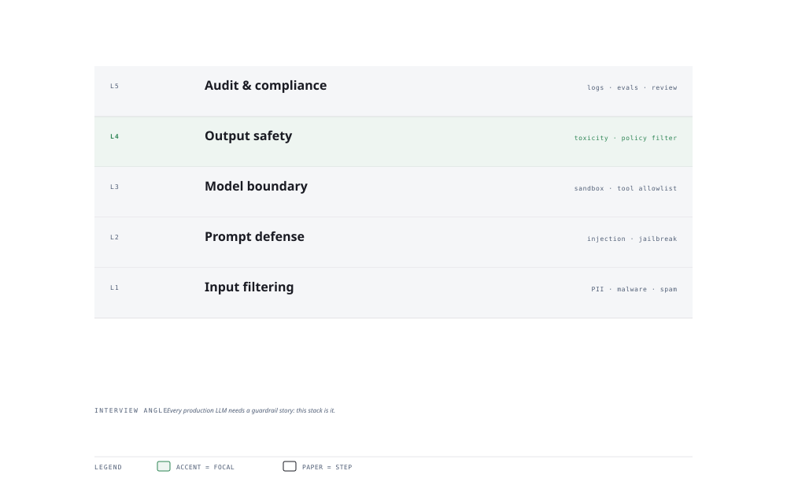

# Visual Notes — Defense-in-Depth for AI

> One diagram, the full picture. This page is meant to be glanced at before reading the chapters, and again before interviews.

# What the diagram shows

1. **Inbound** — Input filtering and prompt-injection defense catch hostile prompts before the model sees them.
1. **Model** — Guardrails constrain behaviour; output validation rejects bad or unsafe generations.
1. **Outbound** — PII protection scrubs sensitive data, and audit logging records every action.

# Why this matters for placement

- Security and compliance are now first-class AI interview topics — prompt injection is the new SQL injection.
- Showing a layered (defense-in-depth) posture beats listing a single tool.

# Quick revision

- Prompt injection ≠ SQL/command injection: it is malicious instructions inside otherwise benign input.
- Layered defense: input filtering, output validation, allowlists, human review.
- Never echo secrets into context; secrets live in a vault, injected at call time.
- Rate limits and budgets contain blast radius of abuse.
- Get consent, document retention, minimise PII — compliance by design.

# Related chapters

- [Prompt injection defense](02-prompt-injection-defense.md)
- [Content filtering](03-content-filtering.md)
- [Secret management](05-secret-and-key-management.md)
- [Data leakage PII](08-data-leakage-pii.md)

---

**One-line answer for interviews:** *"Filter inputs → defend against injection → validate outputs → strip PII → log everything for audit."*
