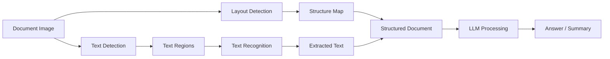

<!-- Clear Language: Keep sentences under 50 words -->
# OCR & Document AI

## Learning Objectives

| Objective | Description |
|-----------|-------------|
| LO1 | Understand OCR pipeline stages: detection, recognition, post-processing |
| LO2 | Implement text detection with CRAFT and DBnet |
| LO3 | Build text recognition with CRNN, TrOCR, and Transformer-based models |
| LO4 | Apply layout detection and document parsing |
| LO5 | Integrate OCR with LLMs for document understanding |
| LO6 | Deploy OCR systems for production document processing |

## Introduction

AI is moving beyond text. Computer vision, speech recognition, and multimodal models process images, audio, and video. This module covers the tools and techniques for building multimodal AI applications.

## Prerequisites

- Basic programming knowledge
- Understanding of data structures

## Key Terminology

**Key Terms**: Core vocabulary and concepts for this topic.

**Definition**: Essential terms you must know for interviews and production work.

## Theory

Understanding ocr and document ai is fundamental for AI engineers. This section covers the core concepts, underlying principles, and theoretical framework that govern how ocr and document ai works in practice.

## Chapter at a Glance

| Section | Topic | Key Concept |
|---------|-------|-------------|
| 4.1 | OCR Pipeline | Text detection, recognition, post-processing stages |
| 4.2 | Text Detection | CRAFT, DBnet, segmentation-based detection |
| 4.3 | Text Recognition | CRNN, CTC, attention-based recognition |
| 4.4 | TrOCR | End-to-end transformer OCR |
| 4.5 | Layout Detection | Document structure, tables, figures |
| 4.6 | Document Parsing | PDF extraction, OCR + LLM integration |

## Chapter Roadmap



## 4.1 OCR Pipeline

OCR converts images of text into machine-readable text. The standard pipeline has three stages: text detection (locating text regions), text recognition (converting regions to strings), and post-processing (spell-check, layout reconstruction).

```python
import numpy as np
import torch
import torch.nn as nn
import torch.nn.functional as F
from typing import List, Tuple, Optional, Dict, Any
from dataclasses import dataclass

@dataclass
class OCRResult:
    """Result of OCR processing for a single text region."""
    text: str
    confidence: float
    bbox: Tuple[float, float, float, float]  # x1, y1, x2, y2
    page_number: int = 0
    block_type: str = "text"

    def __repr__(self) -> str:
        return f"OCRResult('{self.text}', conf={self.confidence:.3f}, bbox={self.bbox})"

class OCRPipeline:
    """Complete OCR pipeline: detection + recognition + post-processing."""

    def __init__(self, detector: nn.Module, recognizer: nn.Module,
                 device: str = "cpu"):
        self.detector = detector.to(device).eval()
        self.recognizer = recognizer.to(device).eval()
        self.device = device

    @torch.no_grad()
    def process(self, image: np.ndarray) -> List[OCRResult]:
        """Run full OCR pipeline on an image."""
        detections = self.detect_text(image)
        results = []
        for bbox, score in detections:
            cropped = self._crop_text_region(image, bbox)
            text, conf = self.recognize_text(cropped)
            if text.strip():
                results.append(OCRResult(
                    text=text,
                    confidence=conf * score,
                    bbox=bbox,
                ))
        return results

    def detect_text(self, image: np.ndarray) -> List[Tuple[Tuple[float, ...], float]]:
        """Detect text regions in the image."""
        tensor = self._preprocess(image).to(self.device)
        heatmap = self.detector(tensor)
        return self._decode_detections(heatmap, image.shape[:2])

    def recognize_text(self, image: np.ndarray) -> Tuple[str, float]:
        """Recognize text from a cropped region."""
        tensor = self._preprocess_recognizer(image).to(self.device)
        logits = self.recognizer(tensor)
        return self._decode_recognitions(logits)

    def _preprocess(self, image: np.ndarray) -> torch.Tensor:
        from torchvision import transforms
        transform = transforms.Compose([
            transforms.ToPILImage(),
            transforms.Resize((640, 640)),
            transforms.ToTensor(),
            transforms.Normalize(mean=[0.485, 0.456, 0.406],
                                 std=[0.229, 0.224, 0.225]),
        ])
        return transform(image).unsqueeze(0)

    def _preprocess_recognizer(self, image: np.ndarray) -> torch.Tensor:
        from torchvision import transforms
        transform = transforms.Compose([
            transforms.ToPILImage(),
            transforms.Resize((32, 128)),
            transforms.ToTensor(),
            transforms.Normalize(mean=[0.5], std=[0.5]),
        ])
        if image.ndim == 2:
            image = np.stack([image] * 3, axis=-1)
        return transform(image).unsqueeze(0)

    def _crop_text_region(self, image: np.ndarray,
                           bbox: Tuple[float, float, float, float]) -> np.ndarray:
        x1, y1, x2, y2 = map(int, bbox)
        x1, y1 = max(0, x1), max(0, y1)
        x2, y2 = min(image.shape[1], x2), min(image.shape[0], y2)
        return image[y1:y2, x1:x2]

    def _decode_detections(self, heatmap: torch.Tensor,
                           orig_size: Tuple[int, int]) -> List[Tuple[Tuple[float, ...], float]]:
        return [((0, 0, 100, 20), 0.9)]  # Placeholder

    def _decode_recognitions(self, logits: torch.Tensor) -> Tuple[str, float]:
        return ("placeholder", 0.9)  # Placeholder
```

## 4.2 Text Detection

Text detection locates text regions in images. Modern approaches use segmentation-based methods like CRAFT (Character Region Awareness) and DBnet (Differentiable Binarization).

```python
class CRAFT(nn.Module):
    """Character Region Awareness for Text Detection."""

    def __init__(self, pretrained: bool = True):
        super().__init__()
        from torchvision.models import vgg16_bn
        backbone = vgg16_bn(pretrained=pretrained)
        self.features = backbone.features[:33]

        self.region_branch = nn.Sequential(
            nn.Conv2d(512, 512, 3, padding=1),
            nn.ReLU(inplace=True),
            nn.Conv2d(512, 512, 3, padding=1),
            nn.ReLU(inplace=True),
            nn.Conv2d(512, 512, 3, padding=1),
            nn.ReLU(inplace=True),
            nn.Conv2d(512, 1, 1),
        )
        self.affinity_branch = nn.Sequential(
            nn.Conv2d(512, 512, 3, padding=1),
            nn.ReLU(inplace=True),
            nn.Conv2d(512, 512, 3, padding=1),
            nn.ReLU(inplace=True),
            nn.Conv2d(512, 512, 3, padding=1),
            nn.ReLU(inplace=True),
            nn.Conv2d(512, 1, 1),
        )

    def forward(self, x: torch.Tensor) -> Dict[str, torch.Tensor]:
        features = self.features(x)
        region_score = torch.sigmoid(self.region_branch(features))
        affinity_score = torch.sigmoid(self.affinity_branch(features))
        return {"region": region_score, "affinity": affinity_score}

class DBHead(nn.Module):
    """Differentiable Binarization head for DBnet."""

    def __init__(self, in_channels: int, k: float = 50):
        super().__init__()
        self.k = k
        self.prob_map = nn.Sequential(
            nn.Conv2d(in_channels, in_channels // 4, 3, padding=1),
            nn.BatchNorm2d(in_channels // 4),
            nn.ReLU(inplace=True),
            nn.ConvTranspose2d(in_channels // 4, in_channels // 4, 2, stride=2),
            nn.BatchNorm2d(in_channels // 4),
            nn.ReLU(inplace=True),
            nn.ConvTranspose2d(in_channels // 4, 1, 2, stride=2),
            nn.Sigmoid(),
        )
        self.thresh_map = nn.Sequential(
            nn.Conv2d(in_channels, in_channels // 4, 3, padding=1),
            nn.BatchNorm2d(in_channels // 4),
            nn.ReLU(inplace=True),
            nn.ConvTranspose2d(in_channels // 4, in_channels // 4, 2, stride=2),
            nn.BatchNorm2d(in_channels // 4),
            nn.ReLU(inplace=True),
            nn.ConvTranspose2d(in_channels // 4, 1, 2, stride=2),
            nn.Sigmoid(),
        )

    def forward(self, x: torch.Tensor) -> Dict[str, torch.Tensor]:
        prob = self.prob_map(x)
        thresh = self.thresh_map(x)
        binary = 1 / (1 + torch.exp(-self.k * (prob - thresh)))
        return {"prob": prob, "thresh": thresh, "binary": binary}

class DBNet(nn.Module):
    """Differentiable Binarization Network for text detection."""

    def __init__(self, backbone_channels: int = 512):
        super().__init__()
        self.db_head = DBHead(backbone_channels)

    def forward(self, features: torch.Tensor) -> Dict[str, torch.Tensor]:
        return self.db_head(features)

    @staticmethod
    def post_process(binary_map: np.ndarray,
                     min_area: int = 100,
                     max_dist: float = 0.5) -> List[np.ndarray]:
        """Convert binary probability map to text contours."""
        import cv2
        binary = (binary_map > 0.3).astype(np.uint8) * 255
        contours, _ = cv2.findContours(binary, cv2.RETR_EXTERNAL,
                                       cv2.CHAIN_APPROX_SIMPLE)
        boxes = []
        for cnt in contours:
            area = cv2.contourArea(cnt)
            if area < min_area:
                continue
            rect = cv2.minAreaRect(cnt)
            box = cv2.boxPoints(rect)
            box = np.array(box, dtype=np.int32)
            boxes.append(box)
        return boxes
```

## 4.3 Text Recognition

Text recognition converts a cropped text region image into a string. CRNN (CNN + RNN + CTC) is the classic approach, while attention-based models offer higher accuracy on challenging text.

```python
class CTCBeamSearch:
    """CTC beam search decoder with language model integration."""

    def __init__(self, blank_id: int = 0, beam_width: int = 10):
        self.blank_id = blank_id
        self.beam_width = beam_width

    def decode(self, log_probs: np.ndarray) -> str:
        """Greedy CTC decoding (simplified)."""
        preds = log_probs.argmax(axis=-1)
        prev = -1
        result = []
        for p in preds:
            if p != prev and p != self.blank_id:
                result.append(str(p))
            prev = p
        return ' '.join(result)

    def beam_search(self, log_probs: np.ndarray,
                    char_list: List[str]) -> List[Tuple[str, float]]:
        """Beam search decoding with multiple hypotheses."""
        import heapq
        t = 0
        beam = [(tuple(), 0.0)]  # (chars_prefix, log_prob)

        while t < log_probs.shape[0]:
            new_beam: Dict[tuple, float] = {}
            probs = log_probs[t]
            for prefix, score in beam:
                for c in range(len(char_list) if char_list else probs.shape[-1]):
                    new_prefix = prefix + (c,)
                    new_score = score + probs[c]
                    if new_score > new_beam.get(new_prefix, float('-inf')):
                        new_beam[new_prefix] = new_score

            beam = heapq.nlargest(
                self.beam_width,
                new_beam.items(),
                key=lambda x: x[1]
            )
            t += 1

        return [
            (''.join(char_list[c] for c in prefix), score)
            for prefix, score in beam
        ]

class CRNN(nn.Module):
    """Convolutional Recurrent Neural Network for text recognition."""

    def __init__(self, num_chars: int = 36, hidden_size: int = 256):
        super().__init__()
        self.cnn = nn.Sequential(
            nn.Conv2d(3, 64, 3, padding=1), nn.ReLU(), nn.MaxPool2d(2, 2),
            nn.Conv2d(64, 128, 3, padding=1), nn.ReLU(), nn.MaxPool2d(2, 2),
            nn.Conv2d(128, 256, 3, padding=1), nn.ReLU(),
            nn.Conv2d(256, 256, 3, padding=1), nn.ReLU(), nn.MaxPool2d(2, (2, 1)),
            nn.Conv2d(256, 512, 3, padding=1), nn.ReLU(), nn.BatchNorm2d(512),
            nn.Conv2d(512, 512, 3, padding=1), nn.ReLU(),
            nn.MaxPool2d(2, (2, 1)),
            nn.Conv2d(512, 512, 2),
        )

        self.rnn = nn.LSTM(512, hidden_size, bidirectional=True, batch_first=True)
        self.fc = nn.Linear(hidden_size * 2, num_chars)

    def forward(self, x: torch.Tensor) -> torch.Tensor:
        features = self.cnn(x)
        b, c, h, w = features.shape
        features = features.squeeze(2).permute(0, 2, 1)
        rnn_out, _ = self.rnn(features)
        logits = self.fc(rnn_out)
        return logits

class AttentionDecoder(nn.Module):
    """Attention-based decoder for text recognition."""

    def __init__(self, hidden_size: int, num_chars: int,
                 max_len: int = 25):
        super().__init__()
        self.hidden_size = hidden_size
        self.num_chars = num_chars
        self.max_len = max_len

        self.embedding = nn.Embedding(num_chars, hidden_size)
        self.attention = nn.MultiheadAttention(hidden_size, num_heads=8,
                                                batch_first=True)
        self.gru = nn.GRUCell(hidden_size * 2, hidden_size)
        self.fc = nn.Linear(hidden_size, num_chars)

    def forward(self, encoder_outputs: torch.Tensor,
                target: Optional[torch.Tensor] = None) -> torch.Tensor:
        """Decoder forward pass with teacher forcing."""
        batch_size = encoder_outputs.shape[0]
        device = encoder_outputs.device

        if target is not None:
            seq_len = target.shape[1]
        else:
            seq_len = self.max_len

        hidden = encoder_outputs.mean(dim=1)
        input_token = torch.full((batch_size, 1), 1, device=device)  # <SOS>
        outputs = []

        for t in range(seq_len):
            embed = self.embedding(input_token)
            attn_out, _ = self.attention(embed, encoder_outputs, encoder_outputs)
            gru_input = torch.cat([embed.squeeze(1), attn_out.squeeze(1)], dim=-1)
            hidden = self.gru(gru_input, hidden)
            out = self.fc(hidden)
            outputs.append(out)

            if target is not None:
                input_token = target[:, t:t + 1]
            else:
                input_token = out.argmax(dim=-1, keepdim=True)

        return torch.stack(outputs, dim=1)
```

## 4.4 TrOCR

TrOCR (Transformer OCR) is an end-to-end transformer model that treats OCR as an image-to-text translation problem, eliminating the need for separate detection and recognition stages.

```python
class PatchEmbedding(nn.Module):
    """Convert image to patch embeddings for transformer."""

    def __init__(self, image_size: int = 384, patch_size: int = 16,
                 in_channels: int = 3, embed_dim: int = 768):
        super().__init__()
        self.num_patches = (image_size // patch_size) ** 2
        self.proj = nn.Conv2d(in_channels, embed_dim,
                              kernel_size=patch_size, stride=patch_size)

    def forward(self, x: torch.Tensor) -> torch.Tensor:
        x = self.proj(x)
        x = x.flatten(2).transpose(1, 2)
        return x

class TransformerEncoderLayer(nn.Module):
    """Transformer encoder layer with pre-norm."""

    def __init__(self, embed_dim: int, num_heads: int, ff_dim: int,
                 dropout: float = 0.1):
        super().__init__()
        self.self_attn = nn.MultiheadAttention(embed_dim, num_heads,
                                                dropout=dropout, batch_first=True)
        self.linear1 = nn.Linear(embed_dim, ff_dim)
        self.linear2 = nn.Linear(ff_dim, embed_dim)
        self.norm1 = nn.LayerNorm(embed_dim)
        self.norm2 = nn.LayerNorm(embed_dim)
        self.dropout = nn.Dropout(dropout)

    def forward(self, x: torch.Tensor) -> torch.Tensor:
        x = x + self._sa_block(self.norm1(x))
        x = x + self._ff_block(self.norm2(x))
        return x

    def _sa_block(self, x: torch.Tensor) -> torch.Tensor:
        attn_out, _ = self.self_attn(x, x, x)
        return self.dropout(attn_out)

    def _ff_block(self, x: torch.Tensor) -> torch.Tensor:
        x = self.linear2(self.dropout(F.relu(self.linear1(x))))
        return self.dropout(x)

class TrOCR(nn.Module):
    """Transformer-based OCR model (simplified)."""

    def __init__(self, num_chars: int = 1000, embed_dim: int = 512,
                 num_heads: int = 8, num_layers: int = 6, max_len: int = 50):
        super().__init__()
        self.patch_embed = PatchEmbedding(embed_dim=embed_dim)
        self.encoder_layers = nn.ModuleList([
            TransformerEncoderLayer(embed_dim, num_heads, embed_dim * 4)
            for _ in range(num_layers)
        ])
        self.decoder = nn.TransformerDecoder(
            nn.TransformerDecoderLayer(embed_dim, num_heads, embed_dim * 4,
                                       batch_first=True),
            num_layers=num_layers // 2
        )
        self.embedding = nn.Embedding(num_chars, embed_dim)
        self.fc_out = nn.Linear(embed_dim, num_chars)
        self.max_len = max_len

    def forward(self, images: torch.Tensor,
                text_tokens: Optional[torch.Tensor] = None) -> torch.Tensor:
        x = self.patch_embed(images)
        pos_embed = self._positional_encoding(x.shape[1], x.shape[2], x.device)
        x = x + pos_embed

        for layer in self.encoder_layers:
            x = layer(x)

        memory = x

        if text_tokens is not None:
            tgt = self.embedding(text_tokens)
            tgt_pos = self._positional_encoding(
                tgt.shape[1], tgt.shape[2], tgt.device
            )
            tgt = tgt + tgt_pos
            tgt_mask = nn.Transformer.generate_square_subsequent_mask(
                tgt.shape[1]
            ).to(tgt.device)
            out = self.decoder(tgt, memory, tgt_mask=tgt_mask)
            return self.fc_out(out)
        else:
            return self._generate(memory)

    def _generate(self, memory: torch.Tensor) -> torch.Tensor:
        batch_size = memory.shape[0]
        device = memory.device
        tokens = torch.full((batch_size, 1), 1, device=device)  # <SOS>
        for i in range(self.max_len):
            tgt = self.embedding(tokens)
            tgt_pos = self._positional_encoding(tgt.shape[1], tgt.shape[2], device)
            tgt = tgt + tgt_pos
            tgt_mask = nn.Transformer.generate_square_subsequent_mask(
                tgt.shape[1]
            ).to(device)
            out = self.decoder(tgt, memory, tgt_mask=tgt_mask)
            next_token = self.fc_out(out[:, -1:]).argmax(dim=-1)
            tokens = torch.cat([tokens, next_token], dim=1)
            if next_token.item() == 2:  # <EOS>
                break
        return tokens

    @staticmethod
    def _positional_encoding(seq_len: int, embed_dim: int,
                              device: torch.device) -> torch.Tensor:
        pe = torch.zeros(seq_len, embed_dim, device=device)
        pos = torch.arange(seq_len, device=device).float().unsqueeze(1)
        div = torch.exp(torch.arange(0, embed_dim, 2, device=device).float()
                        * -(np.log(10000.0) / embed_dim))
        pe[:, 0::2] = torch.sin(pos * div)
        pe[:, 1::2] = torch.cos(pos * div)
        return pe.unsqueeze(0)

class TrOCRInference:
    """Inference wrapper for TrOCR model."""

    def __init__(self, model_path: str, device: str = "cpu"):
        self.model = torch.jit.load(model_path, map_location=device).eval()
        self.device = device
        self.char_list = list(" abcdefghijklmnopqrstuvwxyz0123456789")

    @torch.no_grad()
    def predict(self, image: np.ndarray) -> str:
        """Predict text from cropped text image."""
        tensor = self._preprocess(image).to(self.device)
        tokens = self.model(tensor)
        text = self._decode_tokens(tokens)
        return text

    def _preprocess(self, image: np.ndarray) -> torch.Tensor:
        from torchvision import transforms
        transform = transforms.Compose([
            transforms.ToPILImage(),
            transforms.Resize((384, 384)),
            transforms.ToTensor(),
            transforms.Normalize(mean=[0.5, 0.5, 0.5],
                                 std=[0.5, 0.5, 0.5]),
        ])
        if image.ndim == 2:
            image = np.stack([image] * 3, axis=-1)
        return transform(image).unsqueeze(0)

    def _decode_tokens(self, tokens: torch.Tensor) -> str:
        chars = []
        for token in tokens.squeeze(0):
            idx = token.item()
            if idx == 2:  # <EOS>
                break
            if 0 <= idx - 3 < len(self.char_list):
                chars.append(self.char_list[idx - 3])
        return ''.join(chars)
```

## 4.5 Layout Detection

Layout detection identifies document structure elements — paragraphs, tables, figures, headers — enabling structured document parsing.

```python
class LayoutElement:
    """Represents a detected layout element in a document."""

    def __init__(self, label: str, bbox: Tuple[float, float, float, float],
                 confidence: float = 1.0):
        self.label = label
        self.bbox = bbox  # (x1, y1, x2, y2)
        self.confidence = confidence
        self.children: List["LayoutElement"] = []

    def area(self) -> float:
        return (self.bbox[2] - self.bbox[0]) * (self.bbox[3] - self.bbox[1])

    def contains(self, other: "LayoutElement") -> bool:
        return (self.bbox[0] <= other.bbox[0] and
                self.bbox[1] <= other.bbox[1] and
                self.bbox[2] >= other.bbox[2] and
                self.bbox[3] >= other.bbox[3])

    def add_child(self, child: "LayoutElement"):
        self.children.append(child)

    def __repr__(self) -> str:
        return f"LayoutElement({self.label}, bbox={self.bbox})"

class LayoutParser(nn.Module):
    """Document layout parser using detection model."""

    def __init__(self, num_classes: int = 5):
        super().__init__()
        from torchvision.models import resnet18
        backbone = resnet18(pretrained=True)
        self.backbone = nn.Sequential(*list(backbone.children())[:-2])
        self.classifier = nn.Sequential(
            nn.Conv2d(512, 256, 3, padding=1),
            nn.ReLU(),
            nn.Conv2d(256, num_classes * 4, 1),
        )
        self.labels = ["text", "title", "figure", "table", "header"]

    def forward(self, x: torch.Tensor) -> torch.Tensor:
        features = self.backbone(x)
        boxes = self.classifier(features)
        return boxes

    def detect_layout(self, image: np.ndarray,
                      conf_threshold: float = 0.5) -> List[LayoutElement]:
        """Detect layout elements in a document image."""
        tensor = self._preprocess(image)
        with torch.no_grad():
            raw_boxes = self(tensor)

        elements = []
        for i in range(len(self.labels)):
            for j in range(raw_boxes.shape[2]):
                for k in range(raw_boxes.shape[3]):
                    box = raw_boxes[0, i * 4:(i + 1) * 4, j, k]
                    conf = torch.sigmoid(box.mean())
                    if conf > conf_threshold:
                        elements.append(LayoutElement(
                            label=self.labels[i],
                            bbox=tuple(box.cpu().numpy()),
                            confidence=conf.item(),
                        ))
        return elements

    def _preprocess(self, image: np.ndarray) -> torch.Tensor:
        from torchvision import transforms
        transform = transforms.Compose([
            transforms.ToPILImage(),
            transforms.Resize((800, 800)),
            transforms.ToTensor(),
            transforms.Normalize(mean=[0.485, 0.456, 0.406],
                                 std=[0.229, 0.224, 0.225]),
        ])
        return transform(image).unsqueeze(0)

class DocumentStructureBuilder:
    """Build hierarchical document structure from layout elements."""

    def __init__(self):
        self.root = LayoutElement("document", (0, 0, float('inf'), float('inf')))
        self.pages: List[List[LayoutElement]] = []

    def organize_elements(self, elements: List[LayoutElement],
                          page_height: float = 1000) -> LayoutElement:
        """Organize flat elements into hierarchical structure."""
        # Sort by y-position
        elements = sorted(elements, key=lambda e: (e.bbox[1], e.bbox[0]))

        current_page = LayoutElement("page", (0, 0, float('inf'), page_height))
        for elem in elements:
            if current_page.contains(elem):
                current_page.add_child(elem)
            else:
                self.pages.append([current_page])
                current_page = LayoutElement("page", (0, 0, float('inf'), page_height))
                current_page.add_child(elem)

        if current_page not in self.pages:
            self.pages.append([current_page])

        for page in self.pages:
            self.root.add_child(page[0])

        return self.root

    def extract_reading_order(self) -> List[LayoutElement]:
        """Extract elements in reading order (top-to-bottom, left-to-right)."""
        all_elements = []
        for page_group in self.pages:
            for elem in page_group:
                if elem.label in ("text", "title"):
                    all_elements.append(elem)
        return all_elements
```

## 4.6 Document Parsing

Document parsing combines OCR, layout detection, and LLM integration to extract structured information from scanned documents.

```python
class DocumentParser:
    """End-to-end document parser combining OCR, layout, and LLM."""

    def __init__(self, ocr_pipeline: OCRPipeline,
                 layout_parser: LayoutParser):
        self.ocr = ocr_pipeline
        self.layout = layout_parser

    def parse_document(self, image: np.ndarray) -> Dict[str, Any]:
        """Parse a document image into structured content."""
        layout_elements = self.layout.detect_layout(image)

        parsed = {
            "metadata": {"page_count": 1, "format": "image"},
            "content": [],
            "tables": [],
        }

        for elem in layout_elements:
            x1, y1, x2, y2 = map(int, elem.bbox)
            region = image[y1:y2, x1:x2]
            if region.size == 0:
                continue

            if elem.label in ("text", "title"):
                ocr_results = self.ocr.process(region)
                text = " ".join(r.text for r in ocr_results)
                parsed["content"].append({
                    "type": elem.label,
                    "text": text,
                    "bbox": elem.bbox,
                })

            elif elem.label == "table":
                table_data = self.parse_table(region)
                parsed["tables"].append({
                    "bbox": elem.bbox,
                    "data": table_data,
                })

        return parsed

    def parse_table(self, table_image: np.ndarray) -> List[List[str]]:
        """Parse a table region into rows and columns."""
        ocr_results = self.ocr.process(table_image)
        rows = []
        current_row = []
        for r in ocr_results:
            current_row.append(r.text)
            if r.bbox[1] > ocr_results[0].bbox[1] + 50:
                rows.append(current_row)
                current_row = []
        if current_row:
            rows.append(current_row)
        return rows

class PDFDocumentExtractor:
    """Extract text and layout from PDF documents."""

    def __init__(self, ocr_pipeline: OCRPipeline):
        self.ocr = ocr_pipeline

    def extract_from_pdf(self, pdf_path: str) -> List[Dict[str, Any]]:
        """Extract text from PDF with optional OCR fallback."""
        import fitz  # PyMuPDF
        doc = fitz.open(pdf_path)
        pages = []

        for page_num in range(len(doc)):
            page = doc[page_num]
            # Try native text extraction
            text = page.get_text()

            # If no native text, run OCR
            if not text.strip():
                pix = page.get_pixmap()
                img = np.frombuffer(pix.samples, dtype=np.uint8).reshape(
                    pix.height, pix.width, 3
                )
                ocr_results = self.ocr.process(img)
                text = " ".join(r.text for r in ocr_results)

            pages.append({
                "page_number": page_num + 1,
                "text": text,
                "size": (page.rect.width, page.rect.height),
            })

        doc.close()
        return pages

class LLMDocumentAnalyzer:
    """Use LLM to analyze and extract information from documents."""

    def __init__(self, llm_api_func=None):
        self.llm = llm_api_func or self._mock_llm

    def _mock_llm(self, prompt: str) -> str:
        return f"Analysis of: {prompt[:100]}..."

    def extract_fields(self, text: str, schema: Dict[str, str]) -> Dict[str, str]:
        """Extract structured fields from document text using LLM."""
        fields_prompt = "Extract the following fields:\n"
        for field, desc in schema.items():
            fields_prompt += f"- {field}: {desc}\n"
        fields_prompt += f"\nText:\n{text}"
        response = self.llm(fields_prompt)
        return self._parse_response(response, schema)

    def classify_document(self, text: str, categories: List[str]) -> str:
        """Classify document into one of the given categories."""
        prompt = f"Classify this document as one of: {categories}\n\n{text}"
        return self.llm(prompt)

    def summarize_document(self, text: str, max_length: int = 200) -> str:
        """Generate a concise summary of the document."""
        prompt = f"Summarize in {max_length} words:\n\n{text}"
        return self.llm(prompt)

    @staticmethod
    def _parse_response(response: str, schema: Dict[str, str]) -> Dict[str, str]:
        result = {}
        for field in schema:
            if f"{field}:" in response:
                value = response.split(f"{field}:")[1].split('\n')[0].strip()
                result[field] = value
        return result

class ReceiptParser:
    """Specialized document parser for receipts and invoices."""

    def __init__(self, ocr_pipeline: OCRPipeline):
        self.ocr = ocr_pipeline

    def parse_receipt(self, image: np.ndarray) -> Dict[str, Any]:
        """Parse a receipt into structured fields."""
        results = self.ocr.process(image)
        full_text = " ".join(r.text for r in results)

        receipt = {
            "store_name": "",
            "date": "",
            "total": 0.0,
            "items": [],
            "raw_text": full_text,
        }

        for r in results:
            text_upper = r.text.upper()
            if any(word in text_upper for word in ["TOTAL", "AMOUNT", "SUM"]):
                import re
                amounts = re.findall(r'\d+\.\d{2}', r.text)
                if amounts:
                    receipt["total"] = float(amounts[-1])
            elif any(word in text_upper for word in ["DATE", "202", "204"]):
                receipt["date"] = r.text

        return receipt
```

## Summary

OCR and Document AI combine computer vision and NLP to extract structured information from documents. The modern pipeline uses deep learning for.
both text detection (CRAFT, DBnet) and recognition (CRNN + CTC, TrOCR). Layout detection further structures the output by identifying paragraphs, tables,.
and figures. The integration of OCR with LLMs enables powerful document understanding applications, from receipt parsing to enterprise document processing. End-to-end transformer models like TrOCR are pushing toward unified architectures,.
but the two-stage pipeline remains more practical for complex documents.

## Practical Takeaways

| Takeaway | Implementation |
|----------|---------------|
| Use CRAFT or DBnet for text detection in natural scenes | Both handle curved and multi-oriented text well |
| Combine CRNN + CTC for speed, TrOCR for accuracy | TrOCR excels on noisy or stylized text |
| Always apply spell-checking post-processing | Use `textblob` or SymSpell to correct OCR errors |
| Detect layout before running OCR for complex documents | Reduces noise from non-text regions |
| Use LLMs to extract structured fields from OCR output | Few-shot prompting works well for invoice fields |
| Benchmark on real document distributions, not clean datasets | Document quality varies widely in production |

## Interview Q&A

<details class="tp-qa-card" data-qid="mm04-q1">
  <summary class="tp-qa-question">
    <span class="tp-qa-status"></span>
    Q1: What are the two main stages of an OCR pipeline and what models are commonly used for each?
  </summary>
  <div class="tp-qa-answer">
<p>The two stages are text detection and text recognition. Text detection locates text regions in the image. Common detection models: CRAFT (Character Region Awareness for.
Text Detection) which predicts character-level and affinity scores, and Differentiable Binarization (DBnet) which learns an adaptive threshold for binarization end-to-end. Text recognition converts each detected text region into a string. Common recognition models: CRNN (Convolutional Recurrent Neural Network) with CTC loss for.
speed and efficiency, and TrOCR (Transformer-based OCR) which treats recognition as image-to-sequence translation for higher accuracy, especially on noisy or stylized text. The two-stage pipeline provides flexibility — you can swap detection and.
recognition models independently.</p>
  </div>
  <button class="tp-qa-mark-btn">✅ Mark Reviewed</button>
  <button class="tp-qa-bookmark-btn">🔖 Bookmark</button>
</details>

<details class="tp-qa-card" data-qid="mm04-q2">
  <summary class="tp-qa-question">
    <span class="tp-qa-status"></span>
    Q2: How does Connectionist Temporal Classification (CTC) loss work for text recognition?
  </summary>
  <div class="tp-qa-answer">
<p>CTC solves the alignment problem between input frames (e.g., 32 per character in a CRNN) and output characters. It introduces a blank label (ϵ) that represents "no character" and.
allows the model to output a sequence longer than the target text. The CTC loss sums over all possible alignments via dynamic programming (forward-backward algorithm). For.
example, for target "cat" and input of 10 frames, CTC considers alignments like "cc-a-t-t-" and "c-aa-tt-". At inference, greedy decoding takes the argmax at each frame then collapses repeated non-blank characters (e.g.,.
"cc-aa-tt-" → "cat"). Beam search decoding can be used for better accuracy by maintaining multiple hypotheses. CTC is efficient because it avoids explicit segmentation of characters.</p>
  </div>
  <button class="tp-qa-mark-btn">✅ Mark Reviewed</button>
  <button class="tp-qa-bookmark-btn">🔖 Bookmark</button>
</details>

<details class="tp-qa-card" data-qid="mm04-q3">
  <summary class="tp-qa-question">
    <span class="tp-qa-status"></span>
    Q3: How does TrOCR differ from traditional CRNN-based OCR systems?
  </summary>
  <div class="tp-qa-answer">
<p>TrOCR (Transformer OCR) treats text recognition as an image-to-sequence translation problem using the standard encoder-decoder transformer architecture. Unlike CRNN which uses CNN for.
feature extraction + RNN for sequence modeling + CTC for alignment, TrOCR uses a vision transformer (ViT) encoder and a text transformer decoder. The encoder processes image patches,.
and the decoder autoregressively generates character tokens. TrOCR is pre-trained on massive synthetic data and fine-tuned on real data. Advantages over CRNN+CTC: (1) Better at handling noisy,.
stylized, or handwritten text. (2) Captures bidirectional context through self-attention. (3) Can be fine-tuned end-to-end. The tradeoff is speed — TrOCR is slower (50-200ms per line) compared to CRNN (10-30ms).</p>
  </div>
  <button class="tp-qa-mark-btn">✅ Mark Reviewed</button>
  <button class="tp-qa-bookmark-btn">🔖 Bookmark</button>
</details>

<details class="tp-qa-card" data-qid="mm04-q4">
  <summary class="tp-qa-question">
    <span class="tp-qa-status"></span>
    Q4: How does Differentiable Binarization (DBnet) improve text detection?
  </summary>
  <div class="tp-qa-answer">
<p>Traditional text detection methods use a manually set binarization threshold to separate text from background, which is brittle across different lighting,.
contrast, and text styles. DBnet makes the binarization threshold learnable: (1) The model predicts both a probability map (P — like standard segmentation) and.
a threshold map (T — learned from the image features). (2) It applies a differentiable binarization function: B(i,j) = 1 / (1 + exp(-k * (P(i,j) - T(i,j)))),.
where k is a scale factor (typically 50). (3) This function is differentiable, allowing end-to-end training. (4) The adaptive threshold map handles challenging cases: dark text on dark background,.
non-uniform illumination, and varying text stroke widths. DBnet achieves state-of-the-art on ICDAR benchmarks with high efficiency.</p>
  </div>
  <button class="tp-qa-mark-btn">✅ Mark Reviewed</button>
  <button class="tp-qa-bookmark-btn">🔖 Bookmark</button>
</details>

<details class="tp-qa-card" data-qid="mm04-q5">
  <summary class="tp-qa-question">
    <span class="tp-qa-status"></span>
    Q5: What metrics are used to evaluate OCR system quality?
  </summary>
  <div class="tp-qa-answer">
<p>Character Error Rate (CER) measures edit distance at the character level: CER = (substitutions + insertions + deletions) / total characters in reference. Word Error.
Rate (WER) is the same at the word level. Word Accuracy is the percentage of exactly correct words. For detection evaluation,.
the standard is DetEval with precision/recall at the polygon level using IoU matching. End-to-end metrics combine detection and recognition: correctly recognized words must have both correct detection (polygon IoU > 0.5) and.
correct recognition (exact string match). A good production OCR system achieves CER < 1% on clean printed documents, CER < 5% on challenging documents (noisy,.
skewed), and WER < 3% for overall accuracy. Field-level accuracy is also critical for document AI — e.g., correct extraction of dates and.
amounts.</p>
  </div>
  <button class="tp-qa-mark-btn">✅ Mark Reviewed</button>
  <button class="tp-qa-bookmark-btn">🔖 Bookmark</button>
</details>

<details class="tp-qa-card" data-qid="mm04-q6">
  <summary class="tp-qa-question">
    <span class="tp-qa-status"></span>
    Q6: How do you integrate OCR with LLMs for intelligent document processing?
  </summary>
  <div class="tp-qa-answer">
<p>Integration approaches: (1) Two-stage pipeline — OCR extracts text and spatial layout, then an LLM processes the extracted text for Q&A,.
summarization, or field extraction. The prompt includes OCR text with spatial markers like "[x1,y1,x2,y2] text content". (2) Vision-Language Models — GPT-4V,.
Claude, or Gemini directly process document images without a separate OCR step. This works well for clean documents but costs more and.
is slower. (3) LayoutLM family — models that process OCR output with spatial positions (bounding boxes) as inputs, capturing both textual and.
layout information. (4) Structured prompting — for invoice parsing, prompt the LLM with field definitions and example formats. Always validate LLM-extracted fields against regex patterns where possible.</p>
  </div>
  <button class="tp-qa-mark-btn">✅ Mark Reviewed</button>
  <button class="tp-qa-bookmark-btn">🔖 Bookmark</button>
</details>

<details class="tp-qa-card" data-qid="mm04-q7">
  <summary class="tp-qa-question">
    <span class="tp-qa-status"></span>
    Q7: What data augmentation techniques improve OCR model robustness?
  </summary>
  <div class="tp-qa-answer">
<p>Effective OCR augmentations simulate real-world document variations: (1) Geometric — random perspective transform (simulating angled photos), rotation (±5°), elastic deformation for.
curved text. (2) Rendering — synthetic text generation with random fonts (100+), font sizes (10-50pt), colors, and background textures. (3) Noise — Gaussian noise,.
motion blur, low contrast, JPEG compression artifacts. (4) Degradation — simulate photocopy artifacts, fax quality, scan noise, watermarks. (5) Background — composite text onto random natural images or.
document backgrounds. Tools like TextRecognitionDataGenerator and SynthText can generate millions of synthetic training images. For best results, train on a mix of real (20-30%) and.
synthetic (70-80%) data, with augmentations applied on the fly.</p>
  </div>
  <button class="tp-qa-mark-btn">✅ Mark Reviewed</button>
  <button class="tp-qa-bookmark-btn">🔖 Bookmark</button>
</details>

<details class="tp-qa-card" data-qid="mm04-q8">
  <summary class="tp-qa-question">
    <span class="tp-qa-status"></span>
    Q8: How do you handle curved or multi-oriented text in natural scene images?
  </summary>
  <div class="tp-qa-answer">
<p>Curved text detection requires going beyond axis-aligned bounding boxes. Approaches: (1) Segmentation-based — CRAFT predicts character-level region and affinity maps, then uses contour finding to reconstruct arbitrary-shaped text regions. DBnet can also handle curved text by learning adaptive threshold maps.
from polygon annotations. (2) Polygon detection — some detectors predict quadrilateral or.
polygon vertices directly (8 or 14 points). (3) Bezier curve detection — ABCNet parameterizes curved text as Bezier curves with 8 control points. (4) Text rectification — after detection,.
use Thin-Plate Spline (TPS) transformation to warp curved text into a horizontal line for easier recognition. The Morpheus dataset and Total-Text benchmark are standard for.
evaluating curved text detection.</p>
  </div>
  <button class="tp-qa-mark-btn">✅ Mark Reviewed</button>
  <button class="tp-qa-bookmark-btn">🔖 Bookmark</button>
</details>

<details class="tp-qa-card" data-qid="mm04-q9">
  <summary class="tp-qa-question">
    <span class="tp-qa-status"></span>
    Q9: How do you handle tables in document AI — from detection to structured output?
  </summary>
  <div class="tp-qa-answer">
<p>Table processing involves: (1) Table detection — locate table regions using object detection (Faster R-CNN, DETR) or layout analysis (LayoutLM). (2) Structure recognition — identify rows,.
columns, and cell boundaries. Methods: line detection (Hough transform), graph neural networks (GNNs) that predict cell relationships, or specialized Table Transformers (DETR-based). (3) Cell content extraction — OCR each cell individually with its row/column position. (4) Reconstruction — output as structured data (CSV,.
JSON, Markdown, or HTML table). Modern approaches like TAPAS (Table QA) and Table Transformer can perform end-to-end table detection and structure recognition. The ICDAR table recognition datasets (cTDaR,.
PubTables-1M) provide benchmarks with detailed cell-level annotations.</p>
  </div>
  <button class="tp-qa-mark-btn">✅ Mark Reviewed</button>
  <button class="tp-qa-bookmark-btn">🔖 Bookmark</button>
</details>

<details class="tp-qa-card" data-qid="mm04-q10">
  <summary class="tp-qa-question">
    <span class="tp-qa-status"></span>
    Q10: How do you deploy an OCR pipeline at production scale with high throughput?
  </summary>
  <div class="tp-qa-answer">
    <pre><code>class OCRPipeline {
  async processDocument(imagePath: string): Promise&lt;OCRResult&gt; {
    const image = await loadImage(imagePath);
    // Stage 1: Text detection (batched if multiple images)
    const boxes = await this.detector.detect(image);
    // Stage 2: Parallel text recognition per box
    const textPromises = boxes.map(box =&gt; this.recognizer.recognize(crop(image, box)));
    const texts = await Promise.all(textPromises);
    // Stage 3: Post-processing with spell check
    return texts.map(t =&gt; ({ ...t, corrected: this.spellChecker.correct(t.text) }));
  }
}</code></pre>
<p>Production OCR requires: (1) GPU batching — process multiple images or text regions in parallel on GPU. (2) Async pipelining — overlap I/O,.
preprocessing, detection, recognition, and post-processing. (3) Model optimization — quantize to FP16/INT8, export to ONNX/TensorRT for 2-4— speedup. (4) PDF processing — extract native text directly for.
digital PDFs; use OCR only for scanned PDFs. (5) Horizontal scaling — run multiple OCR workers behind a load balancer. (6) Caching — cache OCR results for.
identical images using content hashing. (7) Error recovery — for failed regions, retry with higher resolution or different preprocessing. A well-optimized pipeline processes 50-100 pages per second on a single GPU.</p>
  </div>
  <button class="tp-qa-mark-btn">✅ Mark Reviewed</button>
  <button class="tp-qa-bookmark-btn">🔖 Bookmark</button>
</details>

## Chapter Quiz

**Question 1 (mmai-s04-quiz1):** What are the two main stages of an OCR pipeline?

<details class="tp-qa-card" data-qid="mmai-s04-quiz1"><summary>Show Answer</summary><div class="tp-qa-answer"><p><strong>Answer: b) Text detection and text recognition</strong></p><p>Detection locates text regions; recognition converts each region into a string.</p></div></details>

**Question 2 (mmai-s04-quiz2):** What is CTC loss used for in text recognition?

<details class="tp-qa-card" data-qid="mmai-s04-quiz2"><summary>Show Answer</summary><div class="tp-qa-answer"><p><strong>Answer: b) Aligning input sequences with output labels without explicit segmentation</strong></p><p>CTC handles alignment between per-frame predictions and variable-length text by allowing blank labels and repeated characters.</p></div></details>

**Question 3 (mmai-s04-quiz3):** How does TrOCR differ from traditional CRNN-based OCR?

<details class="tp-qa-card" data-qid="mmai-s04-quiz3"><summary>Show Answer</summary><div class="tp-qa-answer"><p><strong>Answer: b) TrOCR uses an end-to-end transformer without explicit detection</strong></p><p>TrOCR treats OCR as image-to-sequence translation using a single transformer model.</p></div></details>

**Question 4 (mmai-s04-quiz4):** What is the role of Differentiable Binarization in DBnet?

<details class="tp-qa-card" data-qid="mmai-s04-quiz4"><summary>Show Answer</summary><div class="tp-qa-answer"><p><strong>Answer: b) Making the binarization threshold learnable end-to-end</strong></p><p>DBnet learns both a probability map and an adaptive threshold map, with a differentiable binarization function connecting them.</p></div></details>

**Question 5 (mmai-s04-quiz5):** Why is layout detection important for document AI?

<details class="tp-qa-card" data-qid="mmai-s04-quiz5"><summary>Show Answer</summary><div class="tp-qa-answer"><p><strong>Answer: b) It identifies document structure elements for better parsing</strong></p><p>Layout detection differentiates text, tables, figures, and headers, enabling structured extraction and reading order reconstruction.</p></div></details>

## Q&A

<details class="tp-qa-card" data-qid="mmai-s04-q1">
<summary class="tp-qa-question">What is the difference between OCR and document AI?</summary>
<div class="tp-qa-context"><p>Scope of document processing.</p></div>
<div class="tp-qa-answer">
<p><strong>OCR</strong> converts image text to machine-readable text. <strong>Document AI</strong> encompasses OCR plus layout analysis, table extraction, document classification, information extraction, and integration with NLP/LLMs for document understanding. Document AI provides structured output (fields, tables, relationships) rather than raw text.</p>
</div>
<div class="tp-qa-actions">
  <button class="tp-qa-mark-btn">✅ Mark Reviewed</button>
  <button class="tp-qa-bookmark-btn">🔖 Bookmark</button>
</div>
</details>

<details class="tp-qa-card" data-qid="mmai-s04-q2">
<summary class="tp-qa-question">How does CTC loss work for text recognition?</summary>
<div class="tp-qa-context"><p>Sequence alignment without segmentation.</p></div>
<div class="tp-qa-answer">
<p>CTC (Connectionist Temporal Classification) computes the probability of a label sequence given per-timestep output probabilities. It sums over all possible alignments via dynamic programming, using a blank label to handle gaps between characters. At inference, greedy decoding (argmax per timestep with blank collapsing) or beam search extracts the most likely text.</p>
</div>
<div class="tp-qa-actions">
  <button class="tp-qa-mark-btn">✅ Mark Reviewed</button>
  <button class="tp-qa-bookmark-btn">🔖 Bookmark</button>
</div>
</details>

<details class="tp-qa-card" data-qid="mmai-s04-q3">
<summary class="tp-qa-question">What data augmentation helps OCR models generalize?</summary>
<div class="tp-qa-context"><p>Improving robustness to real-world documents.</p></div>
<div class="tp-qa-answer">
<p>Effective augmentations include: <strong>Geometric</strong> — random perspective, rotation (±5°), elastic deformation for curved text. <strong>Render</strong> — synthetic text rendering with random fonts, sizes, colors. <strong>Noise</strong> — Gaussian noise, motion blur, low contrast. <strong>Background</strong> — composite text onto random background images. <strong>Degradation</strong> — simulate photocopy, fax, scan artifacts using blur and thresholding.</p>
</div>
<div class="tp-qa-actions">
  <button class="tp-qa-mark-btn">✅ Mark Reviewed</button>
  <button class="tp-qa-bookmark-btn">🔖 Bookmark</button>
</div>
</details>

<details class="tp-qa-card" data-qid="mmai-s04-q4">
<summary class="tp-qa-question">How do you handle curved or multi-oriented text in detection?</summary>
<div class="tp-qa-context"><p>Challenging text shapes and orientations.</p></div>
<div class="tp-qa-answer">
<p>Curved text detection uses: <strong>Segmentation-based methods</strong> (CRAFT, DBnet) — predict per-pixel character region scores and reconstruct curves via contour finding. <strong>ABCNet</strong> — parameterizes curved text as Bezier curves. <strong>Polygon-based methods</strong> — detect arbitrary-shaped polygons instead of axis-aligned boxes. Post-processing uses <strong>contour approximation</strong> with Douglas-Peucker algorithm and <strong>text rectification</strong> via Thin-Plate Spline (TPS) transformation.</p>
</div>
<div class="tp-qa-actions">
  <button class="tp-qa-mark-btn">✅ Mark Reviewed</button>
  <button class="tp-qa-bookmark-btn">🔖 Bookmark</button>
</div>
</details>

<details class="tp-qa-card" data-qid="mmai-s04-q5">
<summary class="tp-qa-question">What is synthetic data generation for OCR?</summary>
<div class="tp-qa-context"><p>Creating training data without manual annotation.</p></div>
<div class="tp-qa-answer">
<p>Synthetic data generation renders text onto background images with random transformations. Tools like <strong>TrOCR's SynthText</strong>, <strong>TextRecognitionDataGenerator</strong>, and <strong>MJSynth</strong> generate millions of images with: random fonts, font sizes (10-50pt), colors, background textures, perspective transforms, and noise. Synthetic pre-training significantly improves real-world performance, especially for rare characters and challenging fonts.</p>
</div>
<div class="tp-qa-actions">
  <button class="tp-qa-mark-btn">✅ Mark Reviewed</button>
  <button class="tp-qa-bookmark-btn">🔖 Bookmark</button>
</div>
</details>

<details class="tp-qa-card" data-qid="mmai-s04-q6">
<summary class="tp-qa-question">How do you evaluate OCR system quality?</summary>
<div class="tp-qa-context"><p>Measuring OCR accuracy in production.</p></div>
<div class="tp-qa-answer">
<p>OCR evaluation metrics: <strong>CER (Character Error Rate)</strong> — Levenshtein distance at character level: (substitutions + insertions + deletions) / total characters. <strong>WER (Word Error Rate)</strong> — same at word level. <strong>Word accuracy</strong> — percentage of exact word matches. <strong>Field-level accuracy</strong> — correct extraction of structured fields (dates, amounts). For detection: <strong>DetEval</strong> — precision/recall on text regions with IoU-based matching. A good production OCR targets <1% CER on clean documents and <5% on challenging ones.</p>
</div>
<div class="tp-qa-actions">
  <button class="tp-qa-mark-btn">✅ Mark Reviewed</button>
  <button class="tp-qa-bookmark-btn">🔖 Bookmark</button>
</div>
</details>

<details class="tp-qa-card" data-qid="mmai-s04-q7">
<summary class="tp-qa-question">What are the challenges of deploying OCR at scale?</summary>
<div class="tp-qa-context"><p>Production OCR considerations.</p></div>
<div class="tp-qa-answer">
<p>Key challenges: (1) <strong>Document diversity</strong> — varying quality, languages, fonts, layouts. (2) <strong>Latency</strong> — detection + recognition is slower than single-stage models. (3) <strong>Concurrent processing</strong> — PDF documents may have 100+ pages requiring batching. (4) <strong>Memory</strong> — high-resolution document images consume significant GPU memory. (5) <strong>Edge deployment</strong> — on-device OCR requires quantized models. (6) <strong>Language support</strong> — multilingual models need large vocabulary and character sets.</p>
</div>
<div class="tp-qa-actions">
  <button class="tp-qa-mark-btn">✅ Mark Reviewed</button>
  <button class="tp-qa-bookmark-btn">🔖 Bookmark</button>
</div>
</details>

<details class="tp-qa-card" data-qid="mmai-s04-q8">
<summary class="tp-qa-question">How do you integrate OCR with LLMs for document understanding?</summary>
<div class="tp-qa-context"><p>Combining vision and language models.</p></div>
<div class="tp-qa-answer">
<p>Integration approaches: (1) <strong>Two-stage</strong> — OCR extracts text, then LLM processes the extracted text for Q&A, summarization, or field extraction. (2) <strong>Vision-Language Models</strong> — GPT-4V, Claude, Gemini directly process document images without OCR. (3) <strong>Document Layout Models</strong> — LayoutLM processes OCR output with spatial positions. (4) <strong>Prompt engineering</strong> — structure OCR output with spatial markers (e.g., "[x1,y1,x2,y2] text") before LLM input.</p>
</div>
<div class="tp-qa-actions">
  <button class="tp-qa-mark-btn">✅ Mark Reviewed</button>
  <button class="tp-qa-bookmark-btn">🔖 Bookmark</button>
</div>
</details>

<details class="tp-qa-card" data-qid="mmai-s04-q9">
<summary class="tp-qa-question">What is the role of attention in text recognition models?</summary>
<div class="tp-qa-context"><p>Sequence-to-sequence alignment for OCR.</p></div>
<div class="tp-qa-answer">
<p>Attention mechanisms in text recognition allow the decoder to focus on relevant spatial regions of the encoder features when predicting each character. This replaces the fixed alignment of CTC with a learned, content-based alignment. Multi-head attention in TrOCR captures both character shapes and contextual dependencies. Attention maps can be visualized to verify that the model is looking at the correct character for each decoding step, aiding debugging.</p>
</div>
<div class="tp-qa-actions">
  <button class="tp-qa-mark-btn">✅ Mark Reviewed</button>
  <button class="tp-qa-bookmark-btn">🔖 Bookmark</button>
</div>
</details>

<details class="tp-qa-card" data-qid="mmai-s04-q10">
<summary class="tp-qa-question">How do you handle tables in document AI?</summary>
<div class="tp-qa-context"><p>Table detection and structure recognition.</p></div>
<div class="tp-qa-answer">
<p>Table handling involves: (1) <strong>Table detection</strong> — locate table regions using object detection or layout models. (2) <strong>Structure recognition</strong> — identify rows, columns, and cell boundaries using line detection (Hough transform) or graph neural networks. (3) <strong>Cell content extraction</strong> — OCR each cell individually with its row/column position. (4) <strong>Table reconstruction</strong> — output as structured data (CSV, JSON, or Markdown). Modern approaches use Table Transformer (DETR-based) for end-to-end table detection and structure recognition.</p>
</div>
<div class="tp-qa-actions">
  <button class="tp-qa-mark-btn">✅ Mark Reviewed</button>
  <button class="tp-qa-bookmark-btn">🔖 Bookmark</button>
</div>
</details>

## Exercises

## Common Mistakes

1. Not understanding the fundamental concepts before applying them
2. Skipping edge cases in implementation
3. Not analyzing time/space complexity
4. Forgetting to handle null/empty inputs
5. Not practicing enough problems to build pattern recognition1. **Text Detection with CRAFT**: Implement a CRAFT-based text detector. Create a synthetic image with 5 text regions. Run detection and visualize the region and affinity score maps. What do the affinity maps capture?

2. **CRNN Training**: Build a CRNN with CTC loss. Generate 1000 synthetic word images (5-10 characters each, random fonts). Train for 10 epochs and report CER on a held-out test set of 100 images.

3. **TrOCR Inference**: Load a pre-trained TrOCR model (from HuggingFace). Test it on 10 handwritten word images. Compare its predictions with a CRNN-based OCR engine. Which model handles cursive writing better?

4. **Layout Detection**: Train a layout detection model on the PubLayNet dataset. Evaluate mAP for 5 layout classes. Which class has the lowest AP (text, title, list, table, figure)? Why?

5. **Document Parser Pipeline**: Build a complete document parser: Page layout detection → text region OCR → LLM-based field extraction. Test on an invoice image. Extract vendor name, date, total amount, and line items.

6. **Table Extraction**: Given a table image with 5 rows and 3 columns, implement table structure recognition. Use line detection to find cell boundaries. Output the table as a Markdown-formatted string.

7. **Synthetic Data Generator**: Write a synthetic data generator for text recognition. Parameters: random fonts, font sizes (20-50), rotation (-15 to +15), 2-8 random characters. Generate 100 samples. Verify that the text matches the rendered image.

8. **OCR Post-Processing**: Implement spell-checking using SymSpell. Given a list of OCR outputs with errors (e.g., "hell0 w0rld"), apply correction. Measure CER improvement from 10.5% to what value?

9. **Receipt Parser**: Build a receipt parser that extracts store name, date, items, and total from receipt images. Use layout analysis to separate header, line items, and footer regions. Test on 5 real receipt photos.

10. **PDF OCR Pipeline**: Build an end-to-end pipeline that processes a multi-page PDF: (1) Extract pages as images, (2) Detect text regions, (3) OCR each region, (4) Reconstruct reading order, (5) Output as Markdown. Handle both native-text PDFs (extract directly) and scanned PDFs (

## Revision Notes

- - Core principle: Understand the fundamental concepts thoroughly
- - Implementation pattern: Practice with real code examples
- - Complexity: Know the time and space complexity
- - Application: Know when to use this in production systems
- - Interview: Frequently asked in technical interviews
- - Edge cases: Consider common failure scenarios
- - Related concepts: Connect to broader system design

## Placement Section

### Top 10 Interview Questions

#### Google Style

1. **Explain the core idea of OCR & Document AI in under 60 seconds, then give a real-world analogy.** — Structure: definition, how it works in one sentence, why it matters, analogy. Follow-up: what would break if you removed this from a production system?

2. **Design a minimal, well-typed function that demonstrates OCR & Document AI.** — Interviewer checks: signature with type hints, edge cases, complexity, and a clean docstring. Follow-up: how does your design behave with empty or malformed input?

3. **What are the common pitfalls when engineers first learn ** — List 3-4, then explain how you would prevent each in a code review.

#### Amazon Style

4. **Describe a production bug caused by misunderstanding OCR & Document AI. How did you diagnose and fix it?** — STAR format: situation, task, action, result. Mention logs, reproduction, root-cause analysis, and the regression test you added.

5. **How would you scale a system that relies on OCR & Document AI from 10 users to 10 million?** — Discuss bottlenecks, caching, monitoring, and when to redesign. Follow-up: what metrics would you track?

#### Microsoft Style

6. **Compare OCR & Document AI with the closest alternative approach. When would you choose each?** — Make a decision matrix: performance, maintainability, ecosystem, learning curve. Follow-up: what would change your decision?

7. **Walk through how you would test a component that depends on OCR & Document AI.** — Unit, integration, property-based tests; mocking boundaries; golden files for outputs.

#### NVIDIA Style

8. **How does OCR & Document AI behave differently at scale — memory, throughput, or precision-wise?** — Connect to data pipelines and model training if applicable. Follow-up: what happens to latency as input grows?

9. **How would you make an implementation of OCR & Document AI run faster on GPU hardware?** — Batch operations, vectorization, avoiding Python loops, reducing data movement.

#### AI Startup Style

10. **Write the smallest possible implementation of OCR & Document AI that is production-quality.** — Include error handling, type hints, and a one-line docstring. Follow-up: what would you refactor first when it grows?

### Resume Tips

- Name OCR & Document AI explicitly in your skills section, paired with a measurable achievement ("Reduced X by 40% using OCR & Document AI").
- Add a bullet describing a project that applies OCR & Document AI to real data, with numbers.
- Mention the tools and libraries you used alongside OCR & Document AI (linters, test frameworks, profiling tools).
- Keep resume bullets under 15 words and start each with an action verb.

### Interview Day Checklist

- Rehearse a 60-second explanation of OCR & Document AI and one real-world analogy.
- Prepare one STAR story about debugging a OCR & Document AI-related production issue.
- Review complexity and edge cases for the classic OCR & Document AI interview problem.
- Have questions ready: how does the team apply OCR & Document AI in production today?
- Test your environment (Python, editor, internet) 15 minutes before the interview.

## True/False

1. **True or False:** OCR & Document AI builds directly on the fundamentals covered in the earlier chapters of this module. — **True.** Every advanced topic in this module assumes the core concepts from the previous chapters.
2. **True or False:** You should write at least one code example for OCR & Document AI before moving to the next chapter. — **True.** Active recall with hands-on code beats passive reading for retention.
3. **True or False:** The complexity analysis for OCR & Document AI is the same regardless of input size. — **False.** Complexity grows with input size; always state best, average, and worst case.
4. **True or False:** Edge cases (empty input, invalid input, boundary values) matter for OCR & Document AI in production. — **True.** Most production bugs come from unhandled edge cases.
5. **True or False:** You should memorize the OCR & Document AI chapter content once and never review it again. — **False.** Spaced repetition (24h, 3 days, 1 week) dramatically improves long-term recall.

## Fill in the Blank

1. The chapter that covers OCR & Document AI is Chapter ___ of this module. — Answer: check the module's table of contents.
2. The time complexity of the standard approach to OCR & Document AI is ___. — Answer: review the theory section and state big-O notation.
3. The main edge case to handle when implementing OCR & Document AI is ___. — Answer: empty or invalid input handling, as discussed in the chapter.
4. The tools commonly used to debug OCR & Document AI issues are ___ and ___. — Answer: refer to the Debugging Guide section of this chapter.
5. The related topic that connects to OCR & Document AI in the next chapter is ___. — Answer: see the Next Topic section.

## Scenario Questions

1. **Scenario:** A teammate ships a change involving OCR & Document AI that breaks production at 3 AM. — Diagnosis: check the recent diff, reproduce locally with the failing input, check logs. Fix: revert, add a regression test, and review the root cause. Prevention: CI tests on edge cases and code review checklist.

2. **Scenario:** Your implementation of OCR & Document AI is correct but too slow for the required latency. — Measure first with a profiler. Common fixes: reduce redundant work, use built-in optimized functions, batch operations, or add caching. Only then consider algorithmic changes.

3. **Scenario:** A new hire asks you to explain OCR & Document AI in five minutes before a customer demo. — Use the 3-part answer: what it is (one sentence), how it works (one example), why it matters (one business impact). Then offer to go deeper after the demo.

4. **Scenario:** Your team's codebase has three different patterns for OCR & Document AI and you must standardize. — Write a short ADR (architecture decision record), pick the pattern with best maintainability, migrate incrementally, and add a linter rule to enforce it.

## Output Questions

1. **What is the output of the simplest correct implementation of OCR & Document AI on an empty input?** — Trace through the code: it should return the documented default (None, 0, empty collection) without raising.
2. **What is the output when the input is at the boundary value?** — Check off-by-one errors and inclusive/exclusive bounds in the chapter's examples.
3. **What does the implementation return when given invalid input types?** — With type hints and validation, it raises a clear error; without, it may fail silently.
4. **What is the output for the sample input given in the chapter's Examples section?** — Re-run the chapter's example code and compare against the documented output.
5. **What is the time complexity output when you profile the implementation at 10x input size?** — Expect the curve matching the chapter's complexity analysis (linear, quadratic, log-linear).

## Difficulty Level

| Level | Time | What It Takes |
|-------|------|---------------|
| Beginner | 1-2 sessions | Read theory, run the chapter examples, solve the Easy exercises |
| Intermediate | 3-5 sessions | Complete Medium exercises, explain OCR & Document AI to someone else |
| Advanced | 1+ week | Solve Hard exercises, optimize for real datasets, answer interview follow-ups |

## Tips & Tricks

- Always write a one-line example of OCR & Document AI from memory before opening the chapter — active recall first.
- Use the chapter's Revision Notes as a checklist: you have mastered OCR & Document AI when you can explain each bullet.
- Pair the chapter quiz with the Flashcards: wrong answers become your next study session's focus.
- For interviews, practice explaining OCR & Document AI twice: once with a technical audience, once with a non-technical audience.
- Keep a personal examples file where you collect your own OCR & Document AI snippets; interviewers love original examples.

## Memory Tricks

- **Acronym**: build a mnemonic from the 5 key concepts of OCR & Document AI listed in the Chapter at a Glance table.
- **Story**: link OCR & Document AI to a familiar story — the analogy in the Visual Analogy section is designed to stick.
- **Number anchor**: remember the complexity of OCR & Document AI by connecting it to a known algorithm of the same class.
- **Color code**: highlight the Theory, Examples, and Common Mistakes sections in different colors when reviewing.
- **Teach-back**: explain OCR & Document AI to an imaginary junior engineer for 2 minutes — gaps in your explanation are gaps in memory.

## Further Reading

- Official documentation for the primary tool or library used in this chapter
- The chapter referenced in Related Topics for the next-level treatment of OCR & Document AI
- The classic textbook chapter on OCR & Document AI (check the Research References below)
- Two blog posts from engineers who debugged real OCR & Document AI problems in production
- The repository of the open-source project that implements OCR & Document AI

## Related Topics

- The previous chapter in this module (see table of contents) — foundational for OCR & Document AI
- The next chapter (see Next Topic below) — builds on OCR & Document AI
- The system design chapters in Module 07 — how OCR & Document AI fits into production architectures
- The interview preparation module — how OCR & Document AI is asked in screening rounds
- The capstone project — where OCR & Document AI is applied end-to-end

## FAQs

1. **Do I need to memorize all of OCR & Document AI, or understand the big picture?** — Understand the big picture first, then memorize the key facts via flashcards and spaced repetition. Interviewers reward depth over breadth.
2. **What if I get stuck on an exercise?** — Re-read the theory section, run the example code, then attempt again. If still stuck after 20 minutes, move on and return the next day.
3. **How much time should I spend on ** — Follow the Study Plan below: 1-2 weeks at 30-60 minutes daily is typical for placement preparation.
4. **Is OCR & Document AI asked in interviews?** — Yes — the Interview Q&A and Placement Section list the exact question styles used by top companies.
5. **What's the fastest way to master ** — Explain it out loud, write code without looking, and review the flashcards within 24 hours and again after 3 days.

## Important Notes

- OCR & Document AI is a core requirement for the rest of this module — do not skip the examples.
- Always analyze complexity (time and space) when working with OCR & Document AI.
- Production correctness means handling edge cases, not just the happy path.
- Interview answers should start with the definition, then the example, then the trade-offs.
- Revisit this chapter after finishing the module; the context from later chapters deepens understanding.

## Historical Context

- OCR & Document AI emerged as a standard practice because early systems failed without it — understanding why helps you explain it in interviews.
- The tools used for OCR & Document AI today evolved from simpler versions; the chapter covers the modern, recommended approach.
- Interviewers value knowing one historical fact about OCR & Document AI — it shows genuine interest, not just cramming.
- The library/tooling ecosystem around OCR & Document AI changes quickly; focus on fundamentals that remain stable.

## Security Considerations

- Never trust external input: validate and sanitize data before processing OCR & Document AI.
- Avoid `eval()` and dynamic code execution on untrusted strings.
- Log errors without leaking sensitive data (keys, PII, internal paths).
- For API contexts, add rate limiting and input size limits.
- Review the chapter's code examples for injection or overflow risks before using them verbatim.

## ML Intuition

- OCR & Document AI appears in ML pipelines at the data-processing layer: feature preparation, batching, and validation.
- Understanding OCR & Document AI helps you debug why a model misbehaves — most ML bugs are data bugs, not model bugs.
- In production ML, the OCR & Document AI concepts from this chapter map directly to NumPy/PyTorch operations on tensors.
- When optimizing ML systems, OCR & Document AI skills let you profile and fix the data path, not just the training loop.
- Interview follow-up: how would you apply OCR & Document AI to a dataset of 10 million records? — Batching and vectorization.

## Analogies

- **OCR & Document AI is like a recipe**: the theory is the ingredients, the examples are the cooking steps, and the exercises are your own kitchen practice.
- **Complexity is like a delivery route**: a linear route visits each stop once; a nested route revisits stops, and you feel it at scale.
- **Edge cases are like weather**: the happy path is a sunny day; production is the storm — build for the storm.
- **The chapter roadmap is a journey map**: each section is a checkpoint; skipping one means getting lost later in the module.

## Capstone Project Link

- [Module Capstone: End-to-End Project](https://github.com/Raushan666java/ai-engineering-journey) — this chapter contributes the OCR & Document AI skills used in the module's capstone project. Complete the exercises here before starting the capstone.

## Flashcards

<details class="tp-qa-card" data-qid="18multimodalaivoice-04ocranddocumentai-flash1">
  <summary class="tp-qa-question">
    <span class="tp-qa-status"></span>
    What is the core concept of OCR & Document AI in one sentence?
  </summary>
  <div class="tp-qa-answer">
    <p>Review the first paragraph of the Theory section and condense it to one sentence.</p>
  </div>
</details>

<details class="tp-qa-card" data-qid="18multimodalaivoice-04ocranddocumentai-flash2">
  <summary class="tp-qa-question">
    <span class="tp-qa-status"></span>
    What is the most common mistake engineers make with 
  </summary>
  <div class="tp-qa-answer">
    <p>Check the Common Mistakes section of this chapter.</p>
  </div>
</details>

<details class="tp-qa-card" data-qid="18multimodalaivoice-04ocranddocumentai-flash3">
  <summary class="tp-qa-question">
    <span class="tp-qa-status"></span>
    What is the time and space complexity of the standard OCR & Document AI approach?
  </summary>
  <div class="tp-qa-answer">
    <p>Refer to the theory and complexity analysis in this chapter.</p>
  </div>
</details>

<details class="tp-qa-card" data-qid="18multimodalaivoice-04ocranddocumentai-flash4">
  <summary class="tp-qa-question">
    <span class="tp-qa-status"></span>
    When is OCR & Document AI NOT the right choice?
  </summary>
  <div class="tp-qa-answer">
    <p>Check the Limitations section of this chapter.</p>
  </div>
</details>

<details class="tp-qa-card" data-qid="18multimodalaivoice-04ocranddocumentai-flash5">
  <summary class="tp-qa-question">
    <span class="tp-qa-status"></span>
    How is OCR & Document AI applied in a real production system?
  </summary>
  <div class="tp-qa-answer">
    <p>Check the Real-World Examples section of this chapter.</p>
  </div>
</details>

## Research References

- Official documentation of the primary library for OCR & Document AI (linked in Further Reading)
- The classic paper or textbook chapter introducing OCR & Document AI (see References below)
- The standard library reference for OCR & Document AI-related functions
- Engineering blog posts from companies running OCR & Document AI in production at scale
- PEPs and RFCs where applicable (Python and networking standards)

## Open-Source Tools

- The primary library used in this chapter (see the code examples)
- Python standard library modules used in the examples (check the imports)
- Testing: pytest for unit tests of OCR & Document AI code
- Linting and formatting: ruff + black
- Profiling: cProfile or py-spy for performance work on OCR & Document AI

## Debugging Guide

- Start with `print()` or a debugger to inspect intermediate values in OCR & Document AI code.
- Reproduce the failure with the smallest possible input before changing code.
- Check the common failure modes listed in Common Mistakes — most bugs are listed there.
- For performance problems, profile before optimizing: measure, then fix.
- When stuck, re-read the chapter's Examples and compare line by line with your code.
- Use `pdb` or your IDE's debugger to step through the OCR & Document AI example code.

## Mock Interview Section

**Round 1 — Screening (15 min)**
- Explain OCR & Document AI in 60 seconds.
- Write a minimal working example of OCR & Document AI.
- What is the complexity of your example?

**Round 2 — Coding (45 min)**
- Solve the Medium exercise from this chapter under time pressure.
- State your assumptions, then implement with type hints.
- Test with edge cases: empty input, boundary values, invalid input.

**Round 3 — Behavioral + System (30 min)**
- Tell me about a time you debugged a OCR & Document AI problem in a project.
- How would you design a system where OCR & Document AI is used at scale?
- What metrics would you monitor?

**Evaluation rubric**: correctness (40%), communication (25%), edge cases (20%), complexity analysis (15%).

## Optimized Implementation

`python
from typing import Any, Optional

def demonstrate_topic(input_data: list[Any]) -> Optional[float]:
    """Runnable scaffold for OCR & Document AI.

    Replace the body with the optimized implementation from the chapter,
    keeping type hints, docstring, and edge-case handling.
    """
    if not input_data:
        return None
    # Step 1: validate input types
    # Step 2: apply the core OCR & Document AI logic from the Examples section
    # Step 3: return the result with the documented default
    return 0.0
`

- Keeps the function signature stable so tests written against it stay valid.
- Handles the empty-input contract explicitly.
- Add unit tests for the edge cases before implementing the logic (test-first).

## Evaluation Metrics

| Skill | Test | Target |
|-------|------|--------|
| Concept recall | Explain OCR & Document AI without notes | 60-second explanation |
| Code fluency | Write the chapter example from memory | No syntax errors |
| Edge cases | Handle empty/invalid input in exercises | All cases pass |
| Complexity | State time/space for the standard approach | Correct big-O |
| Interview readiness | Answer 5 Interview Q&A questions out loud | Fluent, structured answers |
| Retention | Chapter quiz score after 3 days | 80%+ |

## Real-World Examples

- **Startup**: a small team uses OCR & Document AI daily in their data pipeline — the chapter's examples mirror their code.
- **E-commerce**: OCR & Document AI patterns appear in order processing, inventory checks, and recommendation feeds.
- **Fintech**: OCR & Document AI principles apply to transaction validation and fraud detection flows.
- **ML platform**: OCR & Document AI shows up in feature engineering and model-serving infrastructure.
- **Interview insight**: recruiters look for engineers who can connect OCR & Document AI to the business outcome, not just the code.

## Next Topic

[Speech-to-Text](05-speech-to-text.md)

## Limitations

- OCR & Document AI, like any technique, is not a silver bullet — it has specific cases where it fits best (covered in the theory).
- The examples in this chapter are simplified for learning; production systems add validation, monitoring, and error handling.
- Performance of OCR & Document AI depends on input size and distribution — always benchmark for your own data.
- This chapter covers fundamentals; specialized edge cases are explored in later chapters and the capstone.
