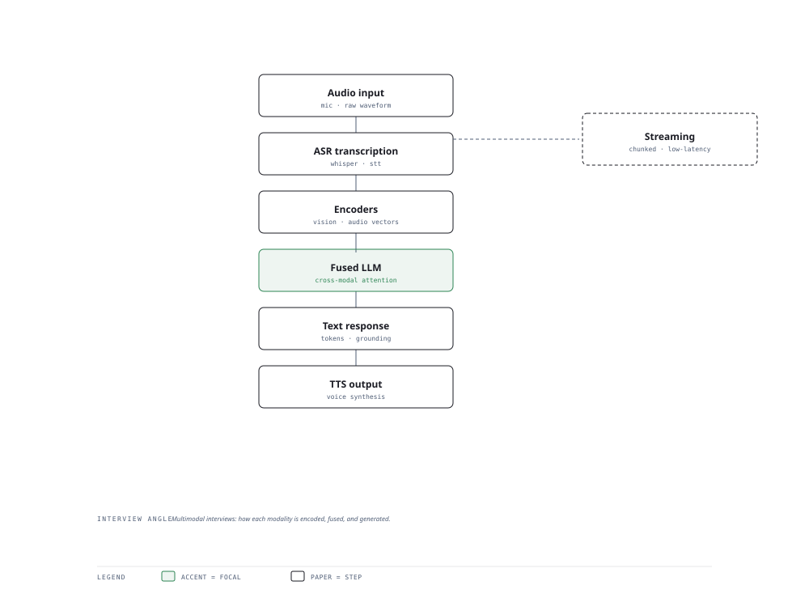

# Visual Notes — Multimodal Input to Voice Output

> One diagram, the full picture. This page is meant to be glanced at before reading the chapters, and again before interviews.

# What the diagram shows

1. **Input** — ASR turns speech into text; vision encoders turn images/video into embeddings.
1. **Fusion** — The LLM ingests text + image embeddings together for cross-modal reasoning.
1. **Output** — TTS speaks the answer; the same stack serves image captions, voice agents, and document AI.

# Why this matters for placement

- Voice agents and document AI are booming product categories — a multimodal mental model pays off.
- Explaining the pipeline (not a single model) shows you think systems-first.

# Quick revision

- ASR: Whisper-style, output text for downstream NLP; transcription ≠ understanding.
- Vision: encode images to embeddings, align with text in a joint space.
- TTS: generate natural speech; latency and prosody matter for voice UX.
- OCR drops into the RAG ingest path to make documents searchable.
- Fusing modalities late (separate encoders) is cheaper and modular.

# Related chapters

- [Computer vision basics](01-computer-vision-basics.md)
- [OCR and document AI](04-ocr-and-document-ai.md)
- [Speech to text](05-speech-to-text.md)
- [Voice agents](06-voice-agents.md)

---

**One-line answer for interviews:** *"Audio and vision are encoded, fused in the LLM, and answers come back through text or voice."*
