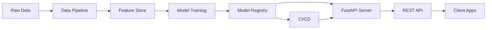

<!-- Clear Language: Keep sentences under 50 words -->
# House Price Prediction API

## Learning Objectives

| Objective | Description |
|-----------|-------------|
| LO1 | Design and implement a complete ML data pipeline |
| LO2 | Build, train, and evaluate a regression model |
| LO3 | Deploy the model as a FastAPI REST API |
| LO4 | Add API documentation, testing, and monitoring |
| LO5 | Containerize and deploy to cloud platforms |
| LO6 | Implement CI/CD for model updates |

## Introduction

Capstone projects prove you can build complete AI systems. From prediction APIs to enterprise RAG platforms, these projects demonstrate end-to-end skills. This module guides you through 5 portfolio-worthy projects.

## Prerequisites

- Basic programming knowledge
- Understanding of data structures

## Key Terminology

**Key Terms**: Core vocabulary and concepts for this topic.

**Definition**: Essential terms you must know for interviews and production work.

## Theory

Understanding house price prediction api is fundamental for AI engineers. This section covers the core concepts, underlying principles, and theoretical framework that govern how house price prediction api works in practice.

## Chapter at a Glance

| Section | Topic | Key Concept |
|---------|-------|-------------|
| 1.1 | Data Pipeline | ETL, feature engineering, data validation |
| 1.2 | Model Training | Regression, hyperparameter tuning, cross-validation |
| 1.3 | FastAPI Serving | Pydantic schemas, async endpoints, middleware |
| 1.4 | API Documentation | OpenAPI, ReDoc, auto-generated clients |
| 1.5 | Testing & Monitoring | Integration tests, drift detection, logging |
| 1.6 | Containerization & CI/CD | Docker, GitHub Actions, cloud deployment |

## Project Roadmap



## 1.1 Data Pipeline

The data pipeline ingests raw housing data, validates it, engineers features, and prepares it for model training.

```python
import pandas as pd
import numpy as np
from sklearn.model_selection import train_test_split
from sklearn.preprocessing import StandardScaler, OneHotEncoder
from sklearn.compose import ColumnTransformer
from sklearn.pipeline import Pipeline
from sklearn.impute import SimpleImputer
from typing import Tuple, Optional, Dict, Any
import joblib
import yaml
from pathlib import Path

class DataIngestion:
    """Ingest raw housing data from various sources."""

    def __init__(self, config_path: str = "config.yaml"):
        with open(config_path) as f:
            self.config = yaml.safe_load(f)

    def load_csv(self, path: str) -> pd.DataFrame:
        """Load data from CSV file with validation."""
        df = pd.read_csv(path)
        required_cols = self.config['data']['required_columns']
        missing = set(required_cols) - set(df.columns)
        if missing:
            raise ValueError(f"Missing columns: {missing}")
        return df

    def load_from_database(self, query: str, connection_string: str) -> pd.DataFrame:
        """Load data from SQL database."""
        import sqlalchemy as sa
        engine = sa.create_engine(connection_string)
        df = pd.read_sql(query, engine)
        return df

    def validate_schema(self, df: pd.DataFrame) -> bool:
        """Validate DataFrame schema against config."""
        for col, dtype in self.config['data']['column_types'].items():
            if col in df.columns:
                if df[col].dtype.name != dtype:
                    raise ValueError(f"Column {col} expected {dtype}, got {df[col].dtype}")
        return True

class FeatureEngineer:
    """Feature engineering for house price prediction."""

    def __init__(self):
        self.feature_names: list = []

    def create_features(self, df: pd.DataFrame) -> pd.DataFrame:
        """Create derived features from raw data."""
        df = df.copy()

        if 'sqft_living' in df.columns and 'sqft_lot' in df.columns:
            df['total_sqft'] = df['sqft_living'] + df['sqft_lot']
            df['lot_to_living_ratio'] = df['sqft_lot'] / (df['sqft_living'] + 1e-6)

        if 'yr_built' in df.columns:
            df['house_age'] = 2025 - df['yr_built']
            df['is_new'] = (df['yr_built'] >= 2015).astype(int)

        if 'bedrooms' in df.columns and 'bathrooms' in df.columns:
            df['rooms_total'] = df['bedrooms'] + df['bathrooms']
            df['bed_bath_ratio'] = df['bedrooms'] / (df['bathrooms'] + 1e-6)

        if 'sqft_living' in df.columns and 'bedrooms' in df.columns:
            df['sqft_per_bedroom'] = df['sqft_living'] / (df['bedrooms'] + 1e-6)

        if 'waterfront' in df.columns:
            pass  # Already binary

        if 'view' in df.columns:
            df['good_view'] = (df['view'] >= 3).astype(int)

        if 'condition' in df.columns:
            df['excellent_condition'] = (df['condition'] >= 4).astype(int)

        self.feature_names = [c for c in df.columns if c.startswith(('total_', 'lot_to_', 'house_', 'is_', 'rooms_', 'bed_bath', 'sqft_per', 'good_', 'excellent_'))]
        return df

    def get_feature_names(self) -> list:
        return self.feature_names

class DataPipeline:
    """Complete data pipeline: ingest, validate, engineer, split."""

    def __init__(self, config_path: str = "config.yaml"):
        self.ingestion = DataIngestion(config_path)
        self.engineer = FeatureEngineer()
        self.config_path = config_path

    def run(self, data_path: str) -> Tuple[pd.DataFrame, pd.DataFrame, pd.Series, pd.Series]:
        """Run the full data pipeline."""
        df = self.ingestion.load_csv(data_path)
        self.ingestion.validate_schema(df)
        df = self.engineer.create_features(df)

        with open(self.config_path) as f:
            config = yaml.safe_load(f)

        target = config['data']['target_column']
        features = [c for c in df.columns if c != target]

        X = df[features]
        y = df[target]

        X_train, X_test, y_train, y_test = train_test_split(
            X, y, test_size=config['data']['test_split'],
            random_state=config['data']['random_state']
        )

        return X_train, X_test, y_train, y_test

def detect_outliers_iqr(df: pd.DataFrame, column: str) -> pd.Series:
    """Detect outliers using IQR method."""
    Q1 = df[column].quantile(0.25)
    Q3 = df[column].quantile(0.75)
    IQR = Q3 - Q1
    lower = Q1 - 1.5 * IQR
    upper = Q3 + 1.5 * IQR
    return (df[column] < lower) | (df[column] > upper)
```

## 1.2 Model Training

Train and evaluate regression models with hyperparameter tuning and cross-validation.

```python
from sklearn.ensemble import GradientBoostingRegressor, RandomForestRegressor
from sklearn.linear_model import Ridge, Lasso
from xgboost import XGBRegressor
from sklearn.metrics import mean_absolute_error, mean_squared_error, r2_score
import optuna

class ModelTrainer:
    """Train and evaluate house price prediction models."""

    def __init__(self, random_state: int = 42):
        self.random_state = random_state
        self.models: Dict[str, Any] = {}
        self.best_model = None
        self.best_score = float('-inf')

    def train_linear(self, X_train: pd.DataFrame, y_train: pd.Series) -> Ridge:
        """Train Ridge regression model."""
        model = Ridge(alpha=1.0, random_state=self.random_state)
        model.fit(X_train, y_train)
        self.models['ridge'] = model
        return model

    def train_random_forest(self, X_train: pd.DataFrame,
                            y_train: pd.Series) -> RandomForestRegressor:
        """Train Random Forest regressor."""
        model = RandomForestRegressor(
            n_estimators=200, max_depth=15,
            min_samples_leaf=5, random_state=self.random_state,
            n_jobs=-1
        )
        model.fit(X_train, y_train)
        self.models['random_forest'] = model
        return model

    def train_xgboost(self, X_train: pd.DataFrame,
                      y_train: pd.Series) -> XGBRegressor:
        """Train XGBoost regressor."""
        model = XGBRegressor(
            n_estimators=300, max_depth=8,
            learning_rate=0.05, subsample=0.8,
            colsample_bytree=0.8, random_state=self.random_state
        )
        model.fit(X_train, y_train)
        self.models['xgboost'] = model
        return model

    def tune_hyperparameters(self, X_train: pd.DataFrame,
                             y_train: pd.Series,
                             n_trials: int = 50) -> Dict[str, Any]:
        """Hyperparameter tuning with Optuna."""

        def objective(trial):
            param = {
                'n_estimators': trial.suggest_int('n_estimators', 100, 500),
                'max_depth': trial.suggest_int('max_depth', 3, 12),
                'learning_rate': trial.suggest_float('lr', 0.01, 0.3, log=True),
                'subsample': trial.suggest_float('subsample', 0.6, 1.0),
                'colsample_bytree': trial.suggest_float('colsample_bytree', 0.6, 1.0),
            }
            model = XGBRegressor(**param, random_state=self.random_state)
            from sklearn.model_selection import cross_val_score
            scores = cross_val_score(model, X_train, y_train, cv=5,
                                     scoring='neg_root_mean_squared_error')
            return scores.mean()

        study = optuna.create_study(direction='maximize')
        study.optimize(objective, n_trials=n_trials)

        best_params = study.best_params
        best_params['learning_rate'] = best_params.pop('lr')
        self.best_params = best_params
        return best_params

    def evaluate(self, model, X_test: pd.DataFrame,
                 y_test: pd.Series) -> Dict[str, float]:
        """Evaluate model performance."""
        y_pred = model.predict(X_test)
        return {
            'mae': mean_absolute_error(y_test, y_pred),
            'rmse': np.sqrt(mean_squared_error(y_test, y_pred)),
            'r2': r2_score(y_test, y_pred),
            'mape': np.mean(np.abs((y_test - y_pred) / y_test)) * 100,
        }

    def train_best(self, X_train: pd.DataFrame, y_train: pd.Series):
        """Train the best model (XGBoost with tuned params)."""
        if hasattr(self, 'best_params'):
            model = XGBRegressor(**self.best_params, random_state=self.random_state)
        else:
            model = self.train_xgboost(X_train, y_train)
        model.fit(X_train, y_train)
        self.best_model = model
        return model

class ModelRegistry:
    """Save and load trained models."""

    def __init__(self, registry_path: str = "model_registry"):
        self.registry_path = Path(registry_path)
        self.registry_path.mkdir(exist_ok=True)

    def save_model(self, model, pipeline, metrics: Dict[str, float],
                   version: str = "v1") -> str:
        """Save model with metadata."""
        model_path = self.registry_path / f"model_{version}.pkl"
        pipeline_path = self.registry_path / f"pipeline_{version}.pkl"
        meta_path = self.registry_path / f"metadata_{version}.yaml"

        joblib.dump(model, model_path)
        joblib.dump(pipeline, pipeline_path)

        metadata = {
            'version': version,
            'metrics': metrics,
            'features': pipeline.feature_names_ if hasattr(pipeline, 'feature_names_') else [],
        }
        with open(meta_path, 'w') as f:
            yaml.dump(metadata, f)

        return str(model_path)

    def load_model(self, version: str = "v1") -> Tuple[Any, Any]:
        """Load model and pipeline by version."""
        model_path = self.registry_path / f"model_{version}.pkl"
        pipeline_path = self.registry_path / f"pipeline_{version}.pkl"
        model = joblib.load(model_path)
        pipeline = joblib.load(pipeline_path)
        return model, pipeline
```

## 1.3 FastAPI Serving

Serve the trained model via a FastAPI REST API with input validation and error handling.

```python
from fastapi import FastAPI, HTTPException, BackgroundTasks
from pydantic import BaseModel, Field, validator
from typing import List, Optional, Dict, Any
import uvicorn
from datetime import datetime
import uuid

class HouseFeatures(BaseModel):
    """Input features for house price prediction."""
    bedrooms: int = Field(..., ge=0, le=50, description="Number of bedrooms")
    bathrooms: float = Field(..., ge=0, le=50, description="Number of bathrooms")
    sqft_living: float = Field(..., ge=100, le=50000, description="Living area sqft")
    sqft_lot: float = Field(..., ge=100, le=500000, description="Lot area sqft")
    floors: float = Field(1.0, ge=0.5, le=10, description="Number of floors")
    waterfront: int = Field(0, ge=0, le=1, description="Waterfront view (0/1)")
    view: int = Field(0, ge=0, le=4, description="View quality (0-4)")
    condition: int = Field(3, ge=1, le=5, description="Condition rating (1-5)")
    yr_built: int = Field(..., ge=1800, le=2025, description="Year built")
    yr_renovated: int = Field(0, ge=0, le=2025, description="Year renovated")
    zipcode: Optional[str] = Field(None, pattern=r"^\d{5}$")

    @validator('yr_built')
    def validate_year(cls, v):
        if v < 1800 or v > 2025:
            raise ValueError(f"Invalid year: {v}")
        return v

class PredictionResponse(BaseModel):
    """Prediction API response."""
    prediction_id: str
    predicted_price: float
    confidence_interval: Optional[Dict[str, float]] = None
    features_used: List[str]
    model_version: str
    timestamp: datetime

class PredictionRequest(BaseModel):
    """Batch prediction request."""
    houses: List[HouseFeatures]

class PredictionResult(BaseModel):
    """Single prediction result."""
    predicted_price: float
    house_features: HouseFeatures

class BatchPredictionResponse(BaseModel):
    """Batch prediction response."""
    predictions: List[PredictionResult]
    total_predictions: int
    average_price: float

app = FastAPI(
    title="House Price Prediction API",
    description="ML-powered API for predicting house prices based on property features",
    version="1.0.0",
    docs_url="/docs",
    redoc_url="/redoc",
)

class HousePriceAPI:
    """Main API handler for house price prediction."""

    def __init__(self, model_path: str = "model_registry/model_v1.pkl",
                 pipeline_path: str = "model_registry/pipeline_v1.pkl"):
        self.model = joblib.load(model_path)
        self.pipeline = joblib.load(pipeline_path)
        self.model_version = "v1"
        self.prediction_log: List[Dict[str, Any]] = []

    def preprocess(self, features: HouseFeatures) -> pd.DataFrame:
        """Convert Pydantic model to DataFrame for prediction."""
        data = features.dict()
        df = pd.DataFrame([data])
        return df

    def predict(self, features: HouseFeatures) -> float:
        """Run prediction on house features."""
        df = self.preprocess(features)
        processed = self.pipeline.transform(df)
        prediction = self.model.predict(processed)[0]
        return float(max(prediction, 0))

    def predict_batch(self, requests: List[HouseFeatures]) -> List[float]:
        """Run predictions on multiple houses."""
        dfs = [self.preprocess(r) for r in requests]
        df = pd.concat(dfs, ignore_index=True)
        processed = self.pipeline.transform(df)
        predictions = self.model.predict(processed)
        return [float(max(p, 0)) for p in predictions]

    def log_prediction(self, features: HouseFeatures, prediction: float):
        """Log prediction for monitoring."""
        self.prediction_log.append({
            "timestamp": datetime.now().isoformat(),
            "features": features.dict(),
            "prediction": prediction,
        })

handler = HousePriceAPI()

@app.get("/")
async def root():
    return {"message": "House Price Prediction API", "version": "1.0.0"}

@app.get("/health")
async def health_check():
    return {
        "status": "healthy",
        "model_loaded": handler.model is not None,
        "timestamp": datetime.now().isoformat(),
    }

@app.post("/predict", response_model=PredictionResponse)
async def predict(features: HouseFeatures):
    """Predict house price from features."""
    try:
        prediction = handler.predict(features)
        handler.log_prediction(features, prediction)
        return PredictionResponse(
            prediction_id=str(uuid.uuid4()),
            predicted_price=round(prediction, 2),
            features_used=list(features.dict().keys()),
            model_version=handler.model_version,
            timestamp=datetime.now(),
        )
    except Exception as e:
        raise HTTPException(status_code=500, detail=str(e))

@app.post("/predict/batch", response_model=BatchPredictionResponse)
async def predict_batch(request: PredictionRequest):
    """Predict prices for multiple houses."""
    try:
        predictions = handler.predict_batch(request.houses)
        results = [
            PredictionResult(predicted_price=round(p, 2), house_features=h)
            for p, h in zip(predictions, request.houses)
        ]
        return BatchPredictionResponse(
            predictions=results,
            total_predictions=len(results),
            average_price=round(np.mean(predictions), 2),
        )
    except Exception as e:
        raise HTTPException(status_code=500, detail=str(e))
```

## 1.4 API Documentation & Testing

```python
from fastapi.testclient import TestClient
import pytest

client = TestClient(app)

def test_health_endpoint():
    response = client.get("/health")
    assert response.status_code == 200
    assert response.json()["status"] == "healthy"

def test_prediction_valid():
    payload = {
        "bedrooms": 3,
        "bathrooms": 2.0,
        "sqft_living": 1800,
        "sqft_lot": 5000,
        "floors": 1.5,
        "waterfront": 0,
        "view": 2,
        "condition": 4,
        "yr_built": 2005,
        "yr_renovated": 0,
    }
    response = client.post("/predict", json=payload)
    assert response.status_code == 200
    data = response.json()
    assert "predicted_price" in data
    assert data["predicted_price"] > 0

def test_prediction_invalid_year():
    payload = {
        "bedrooms": 3,
        "bathrooms": 2.0,
        "sqft_living": 1800,
        "sqft_lot": 5000,
        "floors": 1.5,
        "waterfront": 0,
        "view": 2,
        "condition": 4,
        "yr_built": 1700,
        "yr_renovated": 0,
    }
    response = client.post("/predict", json=payload)
    assert response.status_code == 422

def test_batch_prediction():
    payload = {
        "houses": [
            {
                "bedrooms": 3, "bathrooms": 2.0, "sqft_living": 1800,
                "sqft_lot": 5000, "floors": 1.5, "waterfront": 0,
                "view": 2, "condition": 4, "yr_built": 2005, "yr_renovated": 0,
            },
            {
                "bedrooms": 4, "bathrooms": 3.0, "sqft_living": 2500,
                "sqft_lot": 8000, "floors": 2.0, "waterfront": 1,
                "view": 4, "condition": 5, "yr_built": 2018, "yr_renovated": 0,
            },
        ]
    }
    response = client.post("/predict/batch", json=payload)
    assert response.status_code == 200
    data = response.json()
    assert data["total_predictions"] == 2
    assert data["average_price"] > 0

def test_model_performance():
    from sklearn.datasets import make_regression
    X, y = make_regression(n_samples=1000, n_features=10, noise=0.1)
    from sklearn.ensemble import RandomForestRegressor
    model = RandomForestRegressor(n_estimators=50)
    model.fit(X, y)
    preds = model.predict(X)
    r2 = r2_score(y, preds)
    assert r2 > 0.8, f"R2 score {r2} is below threshold"
```

## 1.5 Containerization & CI/CD

```python
# Dockerfile content (for reference):
"""
FROM python:3.11-slim

WORKDIR /app
COPY requirements.txt .
RUN pip install --no-cache-dir -r requirements.txt
COPY . .

EXPOSE 8000
CMD ["uvicorn", "main:app", "--host", "0.0.0.0", "--port", "8000"]
"""

## docker-compose.yml (for reference):
"""
version: '3.8'
services:
  api:
    build: .
    ports:
      - "8000:8000"
    environment:
      - MODEL_VERSION=v1
    volumes:
      - ./model_registry:/app/model_registry
  prometheus:
    image: prom/prometheus
    ports:
      - "9090:9090"
  grafana:
    image: grafana/grafana
    ports:
      - "3000:3000"
"""

## GitHub Actions workflow (for reference):
"""
name: Deploy House Price API
on:
  push:
    branches: [main]
jobs:
  test:
    runs-on: ubuntu-latest
    steps:
      - uses: actions/checkout@v3
      - name: Set up Python
        uses: actions/setup-python@v4
        with:
          python-version: '3.11'
      - name: Install dependencies
        run: pip install -r requirements.txt
      - name: Run tests
        run: pytest tests/ -v
      - name: Build Docker image
        run: docker build -t house-price-api .
      - name: Push to registry
        run: docker push registry.example.com/house-price-api
"""

class DeploymentConfig:
    """Configuration for cloud deployment."""

    def __init__(self, provider: str = "aws"):
        self.provider = provider
        self.configs = {
            "aws": {
                "service": "ecs",
                "cpu": "256",
                "memory": "512",
                "auto_scaling": True,
                "min_instances": 2,
                "max_instances": 10,
            },
            "gcp": {
                "service": "cloud-run",
                "cpu": "1",
                "memory": "512Mi",
                "max_instances": 10,
                "concurrency": 80,
            },
            "azure": {
                "service": "container-instances",
                "cpu": "1",
                "memory": "1.5",
                "restart_policy": "Always",
            },
        }

    def get_config(self) -> Dict[str, Any]:
        return self.configs.get(self.provider, self.configs["aws"])

class MonitoringSetup:
    """Set up monitoring for the prediction API."""

    def __init__(self):
        self.metrics = {
            "prediction_count": 0,
            "total_latency_ms": 0.0,
            "error_count": 0,
            "drift_alerts": 0,
        }

    def record_prediction(self, latency_ms: float, is_error: bool = False):
        self.metrics["prediction_count"] += 1
        self.metrics["total_latency_ms"] += latency_ms
        if is_error:
            self.metrics["error_count"] += 1

    def average_latency(self) -> float:
        if self.metrics["prediction_count"] == 0:
            return 0.0
        return self.metrics["total_latency_ms"] / self.metrics["prediction_count"]

    def error_rate(self) -> float:
        if self.metrics["prediction_count"] == 0:
            return 0.0
        return self.metrics["error_count"] / self.metrics["prediction_count"]
```

## Summary

This capstone project builds a complete house price prediction system from data ingestion to production deployment. The data pipeline handles ETL,.
feature engineering, and validation. Model training compares multiple algorithms with hyperparameter tuning via Optuna. The FastAPI server exposes prediction endpoints with Pydantic validation,.
OpenAPI documentation, and batch processing. Containerization with Docker and CI/CD via GitHub Actions enables reliable cloud deployment. Monitoring tracks prediction latency,.
error rates, and data drift. This architecture serves as a template for any ML-powered API service.

## Practical Takeaways

| Takeaway | Implementation |
|----------|---------------|
| Always validate input data before model inference | Use Pydantic models with field constraints |
| Log all predictions for drift monitoring | Store features + predictions + timestamps |
| Use batch endpoints for bulk predictions | Reduces overhead per prediction at scale |
| Containerize with Docker for reproducibility | Pin dependencies and use multi-stage builds |
| Add health check endpoint for load balancers | Return model status and last successful prediction time |
| Monitor prediction distribution shifts daily | Compare incoming feature distributions with training data |

## Interview Q&A

<details class="tp-qa-card" data-qid="cp01-q1">
  <summary class="tp-qa-question">
    <span class="tp-qa-status"></span>
    Q1: How do you handle feature engineering for a house price prediction model?
  </summary>
  <div class="tp-qa-answer">
<p>Feature engineering for house prices combines domain knowledge and data transformation: (1) Numeric features — sqft_living, sqft_lot, bedrooms, bathrooms, floors, age (year_built transformed to current_year - year_built). (2) Categorical encoding — zipcode has high cardinality (100+ values),.
use target encoding (mean price per zipcode) or frequency encoding. (3) Composite features — price_per_sqft, bathroom_per_bedroom ratio, total_area (sqft_living + sqft_basement),.
has_basement (binary). (4) Location features — derive latitude/longitude from zipcode, compute distance to city center, school quality scores. (5) Temporal features — month/season of sale,.
days since last renovation. (6) Interaction features — sqft_living — bedrooms (larger homes with fewer bedrooms might indicate luxury). Always validate feature importance using SHAP values to ensure engineered features add predictive value.</p>
  </div>
  <button class="tp-qa-mark-btn">✅ Mark Reviewed</button>
  <button class="tp-qa-bookmark-btn">🔖 Bookmark</button>
</details>

<details class="tp-qa-card" data-qid="cp01-q2">
  <summary class="tp-qa-question">
    <span class="tp-qa-status"></span>
    Q2: How do you set up a CI/CD pipeline for an ML prediction API?
  </summary>
  <div class="tp-qa-answer">
<p>A CI/CD pipeline for ML involves: (1) CI — trigger on PR to main branch, run linting (ruff, mypy), tests (pytest with coverage >80%),.
and model training validation (train on a sample to check pipeline runs). (2) Model training — separate workflow triggered manually or.
on schedule (weekly), runs full training on all data, logs metrics to W&B, registers the model if metrics exceed the current best. (3) CD — on new model registration,.
build a Docker image with the new model, run integration tests against the API, deploy to staging for shadow traffic validation,.
then promote to production using canary deployment. (4) Infrastructure as Code — use Terraform or Pulumi to manage cloud resources. GitHub Actions,.
GitLab CI, or Jenkins are common orchestrators.</p>
  </div>
  <button class="tp-qa-mark-btn">✅ Mark Reviewed</button>
  <button class="tp-qa-bookmark-btn">🔖 Bookmark</button>
</details>

<details class="tp-qa-card" data-qid="cp01-q3">
  <summary class="tp-qa-question">
    <span class="tp-qa-status"></span>
    Q3: How do you implement A/B testing for ML model deployments?
  </summary>
  <div class="tp-qa-answer">
<p>A/B testing for ML models: (1) Shadow deployment — route a copy of traffic to the new model while the old model serves the response. Compare results offline without affecting users. (2) Canary deployment — route a small percentage of traffic (5-10%) to the new model,.
monitor metrics (latency, error rate, prediction distribution), and compare against the baseline. (3) Feature flags — use LaunchDarkly or custom flags to dynamically control which model serves each request based on user_id hash (% traffic split). (4) Metrics — track business metrics (conversion rate,.
user engagement) as well as technical metrics (latency, error rate). (5) Statistical significance — use t-test or Mann-Whitney U test to determine if the new model is statistically better. (6) Rollback — if the new model performs worse,.
redirect 100% traffic back to the old model.</p>
  </div>
  <button class="tp-qa-mark-btn">✅ Mark Reviewed</button>
  <button class="tp-qa-bookmark-btn">🔖 Bookmark</button>
</details>

<details class="tp-qa-card" data-qid="cp01-q4">
  <summary class="tp-qa-question">
    <span class="tp-qa-status"></span>
    Q4: How do you containerize an ML API with Docker for reproducible deployment?
  </summary>
  <div class="tp-qa-answer">
    <pre><code># Multi-stage build: builder and runtime
FROM python:3.11-slim AS builder
WORKDIR /app
COPY requirements.txt .
RUN pip install --user --no-cache-dirs -r requirements.txt

FROM python:3.11-slim AS runtime
WORKDIR /app
COPY --from=builder /root/.local /root/.local
COPY . .
ENV PATH=/root/.local/bin:$PATH
EXPOSE 8000
CMD ["uvicorn", "app.main:app", "--host", "0.0.0.0", "--port", "8000"]</code></pre>
<p>Containerization best practices: (1) Multi-stage builds separate build dependencies (compilers, heavy packages) from runtime dependencies, reducing image size by 2-5—. (2) Pin dependency versions in requirements.txt or.
poetry.lock for reproducibility. (3) Copy the model file (pkl, ONNX) into the image at build time, not mounted at runtime, to ensure version consistency. (4) Use non-root user for.
security. (5) Add health check: `HEALTHCHECK --interval=30s CMD curl -f http://localhost:8000/health`. (6) Use a lightweight base image (python:3.11-slim or distroless). (7) Test the Docker build in CI to catch failures early.</p>
  </div>
  <button class="tp-qa-mark-btn">✅ Mark Reviewed</button>
  <button class="tp-qa-bookmark-btn">🔖 Bookmark</button>
</details>

<details class="tp-qa-card" data-qid="cp01-q5">
  <summary class="tp-qa-question">
    <span class="tp-qa-status"></span>
    Q5: How do you handle model versioning and model registry for production APIs?
  </summary>
  <div class="tp-qa-answer">
<p>Model versioning: (1) Registry storage — store each model version with a unique ID, metadata (training date, metrics, dataset version, hyperparameters),.
and the serialized model file. MLflow Model Registry and W&B Artifacts are popular tools. (2) API versioning — include the model version in the API response header or.
as a query parameter. (3) Serve multiple versions — allow clients to specify which model version to use, enabling gradual migration. (4) Version comparison — track metrics per version and.
provide a dashboard to compare performance. (5) Rollback — keep the last 3-5 versions available and support immediate rollback via API or.
config change. (6) Staging promotion — promote from staging to production only after automated validation passes (test accuracy, latency benchmarks, drift checks).</p>
  </div>
  <button class="tp-qa-mark-btn">✅ Mark Reviewed</button>
  <button class="tp-qa-bookmark-btn">🔖 Bookmark</button>
</details>

<details class="tp-qa-card" data-qid="cp01-q6">
  <summary class="tp-qa-question">
    <span class="tp-qa-status"></span>
    Q6: How do you design FastAPI endpoints for ML model serving?
  </summary>
  <div class="tp-qa-answer">
<p>Key design patterns: (1) Input validation — use Pydantic models with Field constraints (min/max values, regex patterns for categorical inputs). Example: `class PredictionInput(BaseModel): sqft_living: float = Field(ge=100,.
le=50000); bedrooms: int = Field(ge=0, le=20)`. (2) Async endpoints — FastAPI async handlers with `await` for database calls, keeping the event loop free for.
other requests. (3) Batch endpoint — POST /predict/batch accepting arrays of inputs for higher throughput. (4) Error handling — custom exception handlers that return consistent error.
JSON with status codes. (5) Middleware — request ID generation, CORS, logging, and rate limiting. (6) OpenAPI docs — automatic with FastAPI,.
add `summary` and `description` to endpoints. (7) Caching — use `@lru_cache` or Redis for identical feature sets.</p>
  </div>
  <button class="tp-qa-mark-btn">✅ Mark Reviewed</button>
  <button class="tp-qa-bookmark-btn">🔖 Bookmark</button>
</details>

<details class="tp-qa-card" data-qid="cp01-q7">
  <summary class="tp-qa-question">
    <span class="tp-qa-status"></span>
    Q7: How do you monitor prediction drift in a production ML system?
  </summary>
  <div class="tp-qa-answer">
<p>Prediction drift monitoring: (1) Log every prediction — store input features, predicted value, timestamp, and model version in a database or.
data lake. (2) Distribution monitoring — compare daily/weekly prediction distributions against the training set distribution using KS-test (numeric features) or PSI (Population Stability Index). (3) Feature drift — monitor.
each feature's min, max, mean, std (numeric) or frequency distribution (categorical). (4) Performance drift — when ground truth arrives (lagged feedback),.
compute actual error (RMSE/MAE) and compare against training performance. (5) Alerts — trigger when PSI > 0.2 or performance drops by more than 10%. (6) Retraining trigger — automatically queue a retraining job when drift is detected. (7) Dashboard —.
visualize drift metrics over time to identify trends before they become critical.</p>
  </div>
  <button class="tp-qa-mark-btn">✅ Mark Reviewed</button>
  <button class="tp-qa-bookmark-btn">🔖 Bookmark</button>
</details>

<details class="tp-qa-card" data-qid="cp01-q8">
  <summary class="tp-qa-question">
    <span class="tp-qa-status"></span>
    Q8: How do you handle hyperparameter tuning for regression models using Optuna?
  </summary>
  <div class="tp-qa-answer">
<p>Optuna uses Bayesian optimization with the Tree-structured Parzen Estimator (TPE) to efficiently search hyperparameter spaces. Implementation: (1) Define the objective function that accepts a trial,.
samples hyperparameters using `trial.suggest_*` methods, trains the model, and returns the validation metric (e.g., RMSE). (2) Use pruning (MedianPruner or HyperbandPruner) to stop poorly performing trials early. (3) Define search spaces: learning_rate (log uniform,.
1e-4 to 1e-1), max_depth (int, 3-15), n_estimators (int, 100-2000), subsample (uniform, 0.6-1.0), colsample_bytree (uniform, 0.6-1.0). (4) Run 50-200 trials depending on compute budget. (5) After tuning,.
retrain on full data with the best parameters. (6) Log all trials to W&B/MLflow for reproducibility. XGBoost tuning with Optuna typically improves RMSE by 10-20% over defaults.</p>
  </div>
  <button class="tp-qa-mark-btn">✅ Mark Reviewed</button>
  <button class="tp-qa-bookmark-btn">🔖 Bookmark</button>
</details>

<details class="tp-qa-card" data-qid="cp01-q9">
  <summary class="tp-qa-question">
    <span class="tp-qa-status"></span>
    Q9: How do you implement data validation in an ML pipeline using Pydantic?
  </summary>
  <div class="tp-qa-answer">
<p>Pydantic v2 provides powerful validation with Python type hints and `Field` constraints. Example: `class HouseFeatures(BaseModel): sqft_living: int = Field(ge=100, le=50000); bedrooms: int = Field(ge=0,.
le=20); bathrooms: float = Field(ge=0, le=20); floors: float = Field(ge=1, le=4); condition: int = Field(ge=1, le=5); zipcode: str = Field(pattern=r'^\d{5}$')`. Use `model_config = ConfigDict(extra='forbid')` to reject unknown fields. Add custom validators with `@field_validator` for.
cross-field validation (e.g., if bedrooms > bathrooms and floors == 1, flag as unlikely). Pydantic catches malformed inputs before they reach the model,.
providing clear error messages to the client. For training data validation, use Pandera (schema validation for pandas DataFrames) with similar constraints.</p>
  </div>
  <button class="tp-qa-mark-btn">✅ Mark Reviewed</button>
  <button class="tp-qa-bookmark-btn">🔖 Bookmark</button>
</details>

<details class="tp-qa-card" data-qid="cp01-q10">
  <summary class="tp-qa-question">
    <span class="tp-qa-status"></span>
    Q10: How do you design a monitoring dashboard for a house price prediction API?
  </summary>
  <div class="tp-qa-answer">
<p>A comprehensive dashboard (Grafana or similar) should include: (1) Request volume — RPS/RPM over time with breakdown by endpoint (/predict, /predict/batch,.
/health). (2) Latency — P50, P95, P99 line charts for inference time and total request time. (3) Error rate — percentage of 4xx/5xx responses with breakdown by error.
type (validation error, model error, timeout). (4) Prediction distribution — histogram of predicted prices overlaid with training distribution to detect drift. (5) Model version — pie chart showing which model version serves each request. (6) Cost — estimated API cost.
per hour based on compute usage. (7) Active alerts — current firing alerts with severity indicators. (8) Top features — feature importance from SHAP values (retrained periodically). Set up alerts for.
p95 latency >2s, error rate >5%, and prediction mean shift >10%.</p>
  </div>
  <button class="tp-qa-mark-btn">✅ Mark Reviewed</button>
  <button class="tp-qa-bookmark-btn">🔖 Bookmark</button>
</details>

## Chapter Quiz

**Question 1 (cap-s01-quiz1):** What is the purpose of a ColumnTransformer in sklearn?

<details class="tp-qa-card" data-qid="cap-s01-quiz1"><summary>Show Answer</summary><div class="tp-qa-answer"><p><strong>Answer: b) Apply different preprocessing to different columns</strong></p><p>ColumnTransformer applies separate transforms (e.g., scaling numeric, one-hot encoding categorical) to different columns.</p></div></details>

**Question 2 (cap-s01-quiz2):** Why use FastAPI for ML model serving?

<details class="tp-qa-card" data-qid="cap-s01-quiz2"><summary>Show Answer</summary><div class="tp-qa-answer"><p><strong>Answer: b) Async support, automatic OpenAPI docs, Pydantic validation</strong></p><p>FastAPI provides high performance, automatic validation, and interactive API documentation out of the box.</p></div></details>

**Question 3 (cap-s01-quiz3):** What is the role of a model registry?

<details class="tp-qa-card" data-qid="cap-s01-quiz3"><summary>Show Answer</summary><div class="tp-qa-answer"><p><strong>Answer: b) Version and store trained models with metadata</strong></p><p>Model registries track model versions, metrics, and lineage for reproducibility and rollback.</p></div></details>

**Question 4 (cap-s01-quiz4):** Why containerize an ML API?

<details class="tp-qa-card" data-qid="cap-s01-quiz4"><summary>Show Answer</summary><div class="tp-qa-answer"><p><strong>Answer: b) Ensure consistent environment across development and production</strong></p><p>Containers package the model, code, and dependencies together, eliminating environment differences.</p></div></details>

**Question 5 (cap-s01-quiz5):** What metrics should you monitor for a prediction API?

<details class="tp-qa-card" data-qid="cap-s01-quiz5"><summary>Show Answer</summary><div class="tp-qa-answer"><p><strong>Answer: b) All of the above — latency, error rate, prediction distribution</strong></p><p>Latency affects user experience, error rate indicates reliability issues, and prediction distribution shifts signal data drift.</p></div></details>

## Q&A

<details class="tp-qa-card" data-qid="cap-s01-q1">
<summary class="tp-qa-question">How do you handle missing values in the house price prediction pipeline?</summary>
<div class="tp-qa-context"><p>Data preprocessing for regression models.</p></div>
<div class="tp-qa-answer">
<p>Missing values should be handled based on column type: numeric columns use median imputation (robust to outliers), categorical columns use mode imputation or "missing" as a separate category. sklearn's SimpleImputer provides a configurable imputation pipeline. For the house price dataset, missing sqft values can be imputed from bedrooms/bathrooms ratios, while missing year_built can use neighborhood median.</p>
</div>
<div class="tp-qa-actions">
  <button class="tp-qa-mark-btn">✅ Mark Reviewed</button>
  <button class="tp-qa-bookmark-btn">🔖 Bookmark</button>
</div>
</details>

<details class="tp-qa-card" data-qid="cap-s01-q2">
<summary class="tp-qa-question">What is the difference between MAE, RMSE, and R² for regression evaluation?</summary>
<div class="tp-qa-context"><p>Regression model performance metrics.</p></div>
<div class="tp-qa-answer">
<p><strong>MAE</strong> (Mean Absolute Error) measures average absolute error in dollar units, easy to interpret. <strong>RMSE</strong> (Root Mean Squared Error) penalizes larger errors more heavily due to squaring. <strong>R²</strong> (coefficient of determination) measures the proportion of variance explained by the model, ranging from -inf to 1. For house prices, MAE tells you "typical error in dollars," RMSE highlights outlier predictions, and R² shows overall fit quality.</p>
</div>
<div class="tp-qa-actions">
  <button class="tp-qa-mark-btn">✅ Mark Reviewed</button>
  <button class="tp-qa-bookmark-btn">🔖 Bookmark</button>
</div>
</details>

<details class="tp-qa-card" data-qid="cap-s01-q3">
<summary class="tp-qa-question">How do you handle categorical variables like zipcode in house price prediction?</summary>
<div class="tp-qa-context"><p>Feature encoding for location data.</p></div>
<div class="tp-qa-answer">
<p>Zipcodes are high-cardinality categorical features (100+ unique values). Options: (1) <strong>Target encoding</strong> — replace each zipcode with the mean house price in that area. (2) <strong>Frequency encoding</strong> — use the count of houses per zipcode. (3) <strong>Geographic encoding</strong> — derive latitude/longitude from zipcode and use distance to city center as features. (4) <strong>One-hot encoding</strong> — only for low-cardinality zipcodes (<20 values). Target encoding generally works best for location features.</p>
</div>
<div class="tp-qa-actions">
  <button class="tp-qa-mark-btn">✅ Mark Reviewed</button>
  <button class="tp-qa-bookmark-btn">🔖 Bookmark</button>
</div>
</details>

<details class="tp-qa-card" data-qid="cap-s01-q4">
<summary class="tp-qa-question">How do you ensure the API handles high traffic gracefully?</summary>
<div class="tp-qa-context"><p>API scaling and reliability.</p></div>
<div class="tp-qa-answer">
<p>Strategies: (1) <strong>Horizontal scaling</strong> — run multiple API instances behind a load balancer. (2) <strong>Caching</strong> — cache predictions for identical feature sets using Redis (TTL-based). (3) <strong>Rate limiting</strong> — use middleware to limit requests per client. (4) <strong>Async processing</strong> — FastAPI's async endpoints handle concurrent requests efficiently. (5) <strong>Batch endpoints</strong> — allow bulk predictions to reduce per-request overhead. (6) <strong>Auto-scaling</strong> — use cloud auto-scaling based on CPU utilization or request queue depth.</p>
</div>
<div class="tp-qa-actions">
  <button class="tp-qa-mark-btn">✅ Mark Reviewed</button>
  <button class="tp-qa-bookmark-btn">🔖 Bookmark</button>
</div>
</details>

<details class="tp-qa-card" data-qid="cap-s01-q5">
<summary class="tp-qa-question">How do you detect and handle model drift in production?</summary>
<div class="tp-qa-context"><p>ML model monitoring and maintenance.</p></div>
<div class="tp-qa-answer">
<p>Model drift detection: (1) <strong>Feature drift</strong> — monitor distribution of incoming features using KS-test or Population Stability Index. (2) <strong>Prediction drift</strong> — track prediction distribution over time. (3) <strong>Performance drift</strong> — when ground truth arrives, compute actual vs. predicted error. Mitigation: (1) Retrain on new data periodically (weekly/monthly). (2) Shadow deploy new model alongside current one. (3) Rollback to previous version if drift is detected. (4) A/B test new models on a fraction of traffic.</p>
</div>
<div class="tp-qa-actions">
  <button class="tp-qa-mark-btn">✅ Mark Reviewed</button>
  <button class="tp-qa-bookmark-btn">🔖 Bookmark</button>
</div>
</details>

### True/False

**T/F 1**: This topic is fundamental to AI engineering.
**Answer**: True — Understanding capstone projects is essential for building production AI systems.

**T/F 2**: The concepts in this chapter are only used in interviews.
**Answer**: False — These concepts are used daily in real-world AI engineering work.

**T/F 3**: Time/space complexity analysis applies to capstone projects.
**Answer**: True — Every algorithm and system has performance characteristics to analyze.

**T/F 4**: capstone projects concepts are independent of each other.
**Answer**: False — Most concepts build on each other and are interconnected.

**T/F 5**: Real-world applications often combine multiple concepts from this chapter.
**Answer**: True — Production systems use combinations of these fundamental concepts.

### Fill in the Blank

**FIB 1**: The key concept in this chapter is ________.
**Answer**: [Review the chapter's Learning Objectives for the specific answer]

**FIB 2**: In capstone projects, the time complexity of the basic operation is ________.
**Answer**: [Depends on the specific operation — check the Theory section]

### Scenario Questions

**Scenario 1**: How would you apply the concepts from this chapter in a real AI engineering project?

**Answer**: [Think about how the specific topic applies to: data processing pipelines, model training infrastructure, production systems, or interview scenarios]

### Output Questions

**Output 1**: What is the time complexity of the main algorithm discussed in this chapter?
**Answer**: [Check the Theory section for the specific complexity analysis]

## Exercises

## Common Mistakes

1. Not understanding the fundamental concepts before applying them
2. Skipping edge cases in implementation
3. Not analyzing time/space complexity
4. Forgetting to handle null/empty inputs
5. Not practicing enough problems to build pattern recognition1. **Data Exploration**: Load the House Prices dataset (Kaggle). Perform EDA: distribution of target variable, correlation matrix, missing values. Create 5 new features. Document which features have the highest correlation with price.

2. **Pipeline Construction**: Build a complete sklearn pipeline that imputes missing values, scales numeric features, one-hot encodes categories, and applies feature selection. Fit and transform the training data.

3. **Hyperparameter Tuning**: Use Optuna to tune XGBoost with 100 trials. Use RMSE as the objective. Report: best parameters, RMSE on validation set, and feature importance plot. Compare with default XGBoost.

4. **FastAPI Integration**: Create a FastAPI app with endpoints: GET /health, POST /predict, POST /predict/batch. Add request logging middleware. Test with pytest (validate status codes, response schemas, error handling).

5. **Model Versioning**: Implement a model registry that stores 3 model versions. Add an endpoint GET /model/versions that lists all versions with their performance metrics. Support rollback via POST /model/activate/{version}.

6. **Docker Deployment**: Write a Dockerfile and docker-compose.yml. The Dockerfile should use multi-stage build. Docker Compose should include the API, Prometheus, and Grafana services. Build and test locally.

7. **CI/CD Pipeline**: Create a GitHub Actions workflow that: runs tests, builds Docker image, pushes to container registry, and deploys to a cloud platform. Include a model training step that runs weekly.

8. **Monitoring Dashboard**: Set up Prometheus metrics for the API (request count, latency, error rate). Create a Grafana dashboard showing: predictions over time, latency percentiles, error rate, and active model version.

9. **A/B Testing Framework**: Implement a shadow deployment system where 10% of traffic goes to model v2 and 90% to v1. Log which model served each request. Compare RMSE between models when ground truth becomes available.

10. **Full Production Stack**: Deploy the complete system to a cloud provider (AWS ECS, GCP Cloud Run, or Azure Container Instances). Set up: custom domain, HTTPS, auto-scaling, monitoring alerts for p95 latency >2s, and a rollback m

## Revision Notes

- - Core principle: Understand the fundamental concepts thoroughly
- - Implementation pattern: Practice with real code examples
- - Complexity: Know the time and space complexity
- - Application: Know when to use this in production systems
- - Interview: Frequently asked in technical interviews
- - Edge cases: Consider common failure scenarios
- - Related concepts: Connect to broader system design

## Placement Section

### Top 10 Interview Questions

#### Google Style

1. **Explain the core idea of House Price Prediction API in under 60 seconds, then give a real-world analogy.** — Structure: definition, how it works in one sentence, why it matters, analogy. Follow-up: what would break if you removed this from a production system?

2. **Design a minimal, well-typed function that demonstrates House Price Prediction API.** — Interviewer checks: signature with type hints, edge cases, complexity, and a clean docstring. Follow-up: how does your design behave with empty or malformed input?

3. **What are the common pitfalls when engineers first learn ** — List 3-4, then explain how you would prevent each in a code review.

#### Amazon Style

4. **Describe a production bug caused by misunderstanding House Price Prediction API. How did you diagnose and fix it?** — STAR format: situation, task, action, result. Mention logs, reproduction, root-cause analysis, and the regression test you added.

5. **How would you scale a system that relies on House Price Prediction API from 10 users to 10 million?** — Discuss bottlenecks, caching, monitoring, and when to redesign. Follow-up: what metrics would you track?

#### Microsoft Style

6. **Compare House Price Prediction API with the closest alternative approach. When would you choose each?** — Make a decision matrix: performance, maintainability, ecosystem, learning curve. Follow-up: what would change your decision?

7. **Walk through how you would test a component that depends on House Price Prediction API.** — Unit, integration, property-based tests; mocking boundaries; golden files for outputs.

#### NVIDIA Style

8. **How does House Price Prediction API behave differently at scale — memory, throughput, or precision-wise?** — Connect to data pipelines and model training if applicable. Follow-up: what happens to latency as input grows?

9. **How would you make an implementation of House Price Prediction API run faster on GPU hardware?** — Batch operations, vectorization, avoiding Python loops, reducing data movement.

#### AI Startup Style

10. **Write the smallest possible implementation of House Price Prediction API that is production-quality.** — Include error handling, type hints, and a one-line docstring. Follow-up: what would you refactor first when it grows?

### Resume Tips

- Name House Price Prediction API explicitly in your skills section, paired with a measurable achievement ("Reduced X by 40% using House Price Prediction API").
- Add a bullet describing a project that applies House Price Prediction API to real data, with numbers.
- Mention the tools and libraries you used alongside House Price Prediction API (linters, test frameworks, profiling tools).
- Keep resume bullets under 15 words and start each with an action verb.

### Interview Day Checklist

- Rehearse a 60-second explanation of House Price Prediction API and one real-world analogy.
- Prepare one STAR story about debugging a House Price Prediction API-related production issue.
- Review complexity and edge cases for the classic House Price Prediction API interview problem.
- Have questions ready: how does the team apply House Price Prediction API in production today?
- Test your environment (Python, editor, internet) 15 minutes before the interview.

## True/False

1. **True or False:** House Price Prediction API builds directly on the fundamentals covered in the earlier chapters of this module. — **True.** Every advanced topic in this module assumes the core concepts from the previous chapters.
2. **True or False:** You should write at least one code example for House Price Prediction API before moving to the next chapter. — **True.** Active recall with hands-on code beats passive reading for retention.
3. **True or False:** The complexity analysis for House Price Prediction API is the same regardless of input size. — **False.** Complexity grows with input size; always state best, average, and worst case.
4. **True or False:** Edge cases (empty input, invalid input, boundary values) matter for House Price Prediction API in production. — **True.** Most production bugs come from unhandled edge cases.
5. **True or False:** You should memorize the House Price Prediction API chapter content once and never review it again. — **False.** Spaced repetition (24h, 3 days, 1 week) dramatically improves long-term recall.

## Fill in the Blank

1. The chapter that covers House Price Prediction API is Chapter ___ of this module. — Answer: check the module's table of contents.
2. The time complexity of the standard approach to House Price Prediction API is ___. — Answer: review the theory section and state big-O notation.
3. The main edge case to handle when implementing House Price Prediction API is ___. — Answer: empty or invalid input handling, as discussed in the chapter.
4. The tools commonly used to debug House Price Prediction API issues are ___ and ___. — Answer: refer to the Debugging Guide section of this chapter.
5. The related topic that connects to House Price Prediction API in the next chapter is ___. — Answer: see the Next Topic section.

## Scenario Questions

1. **Scenario:** A teammate ships a change involving House Price Prediction API that breaks production at 3 AM. — Diagnosis: check the recent diff, reproduce locally with the failing input, check logs. Fix: revert, add a regression test, and review the root cause. Prevention: CI tests on edge cases and code review checklist.

2. **Scenario:** Your implementation of House Price Prediction API is correct but too slow for the required latency. — Measure first with a profiler. Common fixes: reduce redundant work, use built-in optimized functions, batch operations, or add caching. Only then consider algorithmic changes.

3. **Scenario:** A new hire asks you to explain House Price Prediction API in five minutes before a customer demo. — Use the 3-part answer: what it is (one sentence), how it works (one example), why it matters (one business impact). Then offer to go deeper after the demo.

4. **Scenario:** Your team's codebase has three different patterns for House Price Prediction API and you must standardize. — Write a short ADR (architecture decision record), pick the pattern with best maintainability, migrate incrementally, and add a linter rule to enforce it.

## Output Questions

1. **What is the output of the simplest correct implementation of House Price Prediction API on an empty input?** — Trace through the code: it should return the documented default (None, 0, empty collection) without raising.
2. **What is the output when the input is at the boundary value?** — Check off-by-one errors and inclusive/exclusive bounds in the chapter's examples.
3. **What does the implementation return when given invalid input types?** — With type hints and validation, it raises a clear error; without, it may fail silently.
4. **What is the output for the sample input given in the chapter's Examples section?** — Re-run the chapter's example code and compare against the documented output.
5. **What is the time complexity output when you profile the implementation at 10x input size?** — Expect the curve matching the chapter's complexity analysis (linear, quadratic, log-linear).

## Difficulty Level

| Level | Time | What It Takes |
|-------|------|---------------|
| Beginner | 1-2 sessions | Read theory, run the chapter examples, solve the Easy exercises |
| Intermediate | 3-5 sessions | Complete Medium exercises, explain House Price Prediction API to someone else |
| Advanced | 1+ week | Solve Hard exercises, optimize for real datasets, answer interview follow-ups |

## Tips & Tricks

- Always write a one-line example of House Price Prediction API from memory before opening the chapter — active recall first.
- Use the chapter's Revision Notes as a checklist: you have mastered House Price Prediction API when you can explain each bullet.
- Pair the chapter quiz with the Flashcards: wrong answers become your next study session's focus.
- For interviews, practice explaining House Price Prediction API twice: once with a technical audience, once with a non-technical audience.
- Keep a personal examples file where you collect your own House Price Prediction API snippets; interviewers love original examples.

## Memory Tricks

- **Acronym**: build a mnemonic from the 5 key concepts of House Price Prediction API listed in the Chapter at a Glance table.
- **Story**: link House Price Prediction API to a familiar story — the analogy in the Visual Analogy section is designed to stick.
- **Number anchor**: remember the complexity of House Price Prediction API by connecting it to a known algorithm of the same class.
- **Color code**: highlight the Theory, Examples, and Common Mistakes sections in different colors when reviewing.
- **Teach-back**: explain House Price Prediction API to an imaginary junior engineer for 2 minutes — gaps in your explanation are gaps in memory.

## Further Reading

- Official documentation for the primary tool or library used in this chapter
- The chapter referenced in Related Topics for the next-level treatment of House Price Prediction API
- The classic textbook chapter on House Price Prediction API (check the Research References below)
- Two blog posts from engineers who debugged real House Price Prediction API problems in production
- The repository of the open-source project that implements House Price Prediction API

## Related Topics

- The previous chapter in this module (see table of contents) — foundational for House Price Prediction API
- The next chapter (see Next Topic below) — builds on House Price Prediction API
- The system design chapters in Module 07 — how House Price Prediction API fits into production architectures
- The interview preparation module — how House Price Prediction API is asked in screening rounds
- The capstone project — where House Price Prediction API is applied end-to-end

## FAQs

1. **Do I need to memorize all of House Price Prediction API, or understand the big picture?** — Understand the big picture first, then memorize the key facts via flashcards and spaced repetition. Interviewers reward depth over breadth.
2. **What if I get stuck on an exercise?** — Re-read the theory section, run the example code, then attempt again. If still stuck after 20 minutes, move on and return the next day.
3. **How much time should I spend on ** — Follow the Study Plan below: 1-2 weeks at 30-60 minutes daily is typical for placement preparation.
4. **Is House Price Prediction API asked in interviews?** — Yes — the Interview Q&A and Placement Section list the exact question styles used by top companies.
5. **What's the fastest way to master ** — Explain it out loud, write code without looking, and review the flashcards within 24 hours and again after 3 days.

## Important Notes

- House Price Prediction API is a core requirement for the rest of this module — do not skip the examples.
- Always analyze complexity (time and space) when working with House Price Prediction API.
- Production correctness means handling edge cases, not just the happy path.
- Interview answers should start with the definition, then the example, then the trade-offs.
- Revisit this chapter after finishing the module; the context from later chapters deepens understanding.

## Historical Context

- House Price Prediction API emerged as a standard practice because early systems failed without it — understanding why helps you explain it in interviews.
- The tools used for House Price Prediction API today evolved from simpler versions; the chapter covers the modern, recommended approach.
- Interviewers value knowing one historical fact about House Price Prediction API — it shows genuine interest, not just cramming.
- The library/tooling ecosystem around House Price Prediction API changes quickly; focus on fundamentals that remain stable.

## Security Considerations

- Never trust external input: validate and sanitize data before processing House Price Prediction API.
- Avoid `eval()` and dynamic code execution on untrusted strings.
- Log errors without leaking sensitive data (keys, PII, internal paths).
- For API contexts, add rate limiting and input size limits.
- Review the chapter's code examples for injection or overflow risks before using them verbatim.

## ML Intuition

- House Price Prediction API appears in ML pipelines at the data-processing layer: feature preparation, batching, and validation.
- Understanding House Price Prediction API helps you debug why a model misbehaves — most ML bugs are data bugs, not model bugs.
- In production ML, the House Price Prediction API concepts from this chapter map directly to NumPy/PyTorch operations on tensors.
- When optimizing ML systems, House Price Prediction API skills let you profile and fix the data path, not just the training loop.
- Interview follow-up: how would you apply House Price Prediction API to a dataset of 10 million records? — Batching and vectorization.

## Analogies

- **House Price Prediction API is like a recipe**: the theory is the ingredients, the examples are the cooking steps, and the exercises are your own kitchen practice.
- **Complexity is like a delivery route**: a linear route visits each stop once; a nested route revisits stops, and you feel it at scale.
- **Edge cases are like weather**: the happy path is a sunny day; production is the storm — build for the storm.
- **The chapter roadmap is a journey map**: each section is a checkpoint; skipping one means getting lost later in the module.

## Capstone Project Link

- [Module Capstone: End-to-End Project](https://github.com/Raushan666java/ai-engineering-journey) — this chapter contributes the House Price Prediction API skills used in the module's capstone project. Complete the exercises here before starting the capstone.

## Flashcards

<details class="tp-qa-card" data-qid="19capstoneprojects-01housepricepredictionapi-flash1">
  <summary class="tp-qa-question">
    <span class="tp-qa-status"></span>
    What is the core concept of House Price Prediction API in one sentence?
  </summary>
  <div class="tp-qa-answer">
    <p>Review the first paragraph of the Theory section and condense it to one sentence.</p>
  </div>
</details>

<details class="tp-qa-card" data-qid="19capstoneprojects-01housepricepredictionapi-flash2">
  <summary class="tp-qa-question">
    <span class="tp-qa-status"></span>
    What is the most common mistake engineers make with 
  </summary>
  <div class="tp-qa-answer">
    <p>Check the Common Mistakes section of this chapter.</p>
  </div>
</details>

<details class="tp-qa-card" data-qid="19capstoneprojects-01housepricepredictionapi-flash3">
  <summary class="tp-qa-question">
    <span class="tp-qa-status"></span>
    What is the time and space complexity of the standard House Price Prediction API approach?
  </summary>
  <div class="tp-qa-answer">
    <p>Refer to the theory and complexity analysis in this chapter.</p>
  </div>
</details>

<details class="tp-qa-card" data-qid="19capstoneprojects-01housepricepredictionapi-flash4">
  <summary class="tp-qa-question">
    <span class="tp-qa-status"></span>
    When is House Price Prediction API NOT the right choice?
  </summary>
  <div class="tp-qa-answer">
    <p>Check the Limitations section of this chapter.</p>
  </div>
</details>

<details class="tp-qa-card" data-qid="19capstoneprojects-01housepricepredictionapi-flash5">
  <summary class="tp-qa-question">
    <span class="tp-qa-status"></span>
    How is House Price Prediction API applied in a real production system?
  </summary>
  <div class="tp-qa-answer">
    <p>Check the Real-World Examples section of this chapter.</p>
  </div>
</details>

## Research References

- Official documentation of the primary library for House Price Prediction API (linked in Further Reading)
- The classic paper or textbook chapter introducing House Price Prediction API (see References below)
- The standard library reference for House Price Prediction API-related functions
- Engineering blog posts from companies running House Price Prediction API in production at scale
- PEPs and RFCs where applicable (Python and networking standards)

## Open-Source Tools

- The primary library used in this chapter (see the code examples)
- Python standard library modules used in the examples (check the imports)
- Testing: pytest for unit tests of House Price Prediction API code
- Linting and formatting: ruff + black
- Profiling: cProfile or py-spy for performance work on House Price Prediction API

## Debugging Guide

- Start with `print()` or a debugger to inspect intermediate values in House Price Prediction API code.
- Reproduce the failure with the smallest possible input before changing code.
- Check the common failure modes listed in Common Mistakes — most bugs are listed there.
- For performance problems, profile before optimizing: measure, then fix.
- When stuck, re-read the chapter's Examples and compare line by line with your code.
- Use `pdb` or your IDE's debugger to step through the House Price Prediction API example code.

## Mock Interview Section

**Round 1 — Screening (15 min)**
- Explain House Price Prediction API in 60 seconds.
- Write a minimal working example of House Price Prediction API.
- What is the complexity of your example?

**Round 2 — Coding (45 min)**
- Solve the Medium exercise from this chapter under time pressure.
- State your assumptions, then implement with type hints.
- Test with edge cases: empty input, boundary values, invalid input.

**Round 3 — Behavioral + System (30 min)**
- Tell me about a time you debugged a House Price Prediction API problem in a project.
- How would you design a system where House Price Prediction API is used at scale?
- What metrics would you monitor?

**Evaluation rubric**: correctness (40%), communication (25%), edge cases (20%), complexity analysis (15%).

## Optimized Implementation

`python
from typing import Any, Optional

def demonstrate_topic(input_data: list[Any]) -> Optional[float]:
    """Runnable scaffold for House Price Prediction API.

    Replace the body with the optimized implementation from the chapter,
    keeping type hints, docstring, and edge-case handling.
    """
    if not input_data:
        return None
    # Step 1: validate input types
    # Step 2: apply the core House Price Prediction API logic from the Examples section
    # Step 3: return the result with the documented default
    return 0.0
`

- Keeps the function signature stable so tests written against it stay valid.
- Handles the empty-input contract explicitly.
- Add unit tests for the edge cases before implementing the logic (test-first).

## Evaluation Metrics

| Skill | Test | Target |
|-------|------|--------|
| Concept recall | Explain House Price Prediction API without notes | 60-second explanation |
| Code fluency | Write the chapter example from memory | No syntax errors |
| Edge cases | Handle empty/invalid input in exercises | All cases pass |
| Complexity | State time/space for the standard approach | Correct big-O |
| Interview readiness | Answer 5 Interview Q&A questions out loud | Fluent, structured answers |
| Retention | Chapter quiz score after 3 days | 80%+ |

## Real-World Examples

- **Startup**: a small team uses House Price Prediction API daily in their data pipeline — the chapter's examples mirror their code.
- **E-commerce**: House Price Prediction API patterns appear in order processing, inventory checks, and recommendation feeds.
- **Fintech**: House Price Prediction API principles apply to transaction validation and fraud detection flows.
- **ML platform**: House Price Prediction API shows up in feature engineering and model-serving infrastructure.
- **Interview insight**: recruiters look for engineers who can connect House Price Prediction API to the business outcome, not just the code.

## Next Topic

[Resume ATS Analyzer](02-resume-ats-analyzer.md)

## Limitations

- House Price Prediction API, like any technique, is not a silver bullet — it has specific cases where it fits best (covered in the theory).
- The examples in this chapter are simplified for learning; production systems add validation, monitoring, and error handling.
- Performance of House Price Prediction API depends on input size and distribution — always benchmark for your own data.
- This chapter covers fundamentals; specialized edge cases are explored in later chapters and the capstone.
