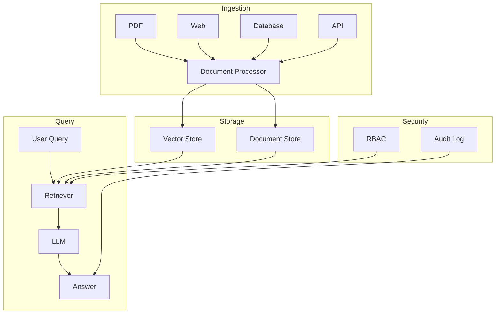

<!-- Clear Language: Keep sentences under 50 words -->
# Enterprise RAG Platform

## Learning Objectives

| Objective | Description |
|-----------|-------------|
| LO1 | Design a multi-source document ingestion pipeline |
| LO2 | Implement hybrid search (semantic + keyword) |
| LO3 | Build role-based access control (RBAC) for documents |
| LO4 | Add analytics and usage tracking for RAG queries |
| LO5 | Deploy enterprise-grade RAG with scaling and monitoring |
| LO6 | Ensure compliance with data privacy and retention policies |

## Introduction

Capstone projects prove you can build complete AI systems. From prediction APIs to enterprise RAG platforms, these projects demonstrate end-to-end skills. This module guides you through 5 portfolio-worthy projects.

## Prerequisites

- Basic programming knowledge
- Understanding of data structures

## Key Terminology

**Key Terms**: Core vocabulary and concepts for this topic.

**Definition**: Essential terms you must know for interviews and production work.

## Theory

Understanding enterprise rag platform is fundamental for AI engineers. This section covers the core concepts, underlying principles, and theoretical framework that govern how enterprise rag platform works in practice.

## Chapter at a Glance

| Section | Topic | Key Concept |
|---------|-------|-------------|
| 3.1 | Multi-Source Ingestion | PDF, web, database, API connectors |
| 3.2 | Document Processing | Chunking, embedding, metadata extraction |
| 3.3 | Hybrid Search | Vector + keyword + filtered retrieval |
| 3.4 | RBAC for Documents | Document-level permissions, user roles |
| 3.5 | Analytics & Monitoring | Query logging, usage dashboards, cost tracking |
| 3.6 | Production Deployment | Scaling, caching, compliance, security |

## Project Roadmap



## 3.1 Multi-Source Ingestion

Enterprise RAG must ingest documents from diverse sources: file storage, web pages, databases, and third-party APIs.

```python
import hashlib
import json
from typing import List, Optional, Dict, Any, AsyncIterator
from datetime import datetime
from dataclasses import dataclass, field
import asyncio
import aiohttp

@dataclass
class Document:
    """A single document with metadata."""
    doc_id: str
    content: str
    metadata: Dict[str, Any] = field(default_factory=dict)
    source: str = ""
    created_at: datetime = field(default_factory=datetime.now)
    updated_at: datetime = field(default_factory=datetime.now)
    embedding: Optional[List[float]] = None

    @property
    def content_hash(self) -> str:
        return hashlib.sha256(self.content.encode()).hexdigest()[:16]

class DocumentConnector:
    """Base class for document source connectors."""

    async def fetch(self) -> AsyncIterator[Document]:
        raise NotImplementedError

    async def health_check(self) -> bool:
        return True

class PDFConnector(DocumentConnector):
    """Ingest documents from PDF files."""

    def __init__(self, paths: List[str]):
        self.paths = paths

    async def fetch(self) -> AsyncIterator[Document]:
        import PyPDF2
        for path in self.paths:
            try:
                with open(path, 'rb') as f:
                    reader = PyPDF2.PdfReader(f)
                    text = "\n".join(page.extract_text() for page in reader.pages)
                    yield Document(
                        doc_id=hashlib.md5(path.encode()).hexdigest(),
                        content=text,
                        source=f"pdf:{path}",
                        metadata={"file_path": path, "pages": len(reader.pages)},
                    )
            except Exception as e:
                print(f"Error parsing {path}: {e}")

class WebConnector(DocumentConnector):
    """Ingest documents from web pages."""

    def __init__(self, urls: List[str]):
        self.urls = urls

    async def fetch(self) -> AsyncIterator[Document]:
        from bs4 import BeautifulSoup
        async with aiohttp.ClientSession() as session:
            for url in self.urls:
                try:
                    async with session.get(url, timeout=30) as response:
                        html = await response.text()
                        soup = BeautifulSoup(html, 'html.parser')
                        for script in soup(["script", "style"]):
                            script.decompose()
                        text = soup.get_text(separator='\n')
                        text = '\n'.join(line.strip() for line in text.splitlines() if line.strip())
                        yield Document(
                            doc_id=hashlib.md5(url.encode()).hexdigest(),
                            content=text,
                            source=f"web:{url}",
                            metadata={"url": url, "title": soup.title.string if soup.title else ""},
                        )
                except Exception as e:
                    print(f"Error fetching {url}: {e}")

class DatabaseConnector(DocumentConnector):
    """Ingest documents from SQL databases."""

    def __init__(self, connection_string: str, query: str,
                 content_columns: List[str], metadata_columns: List[str] = None):
        self.connection_string = connection_string
        self.query = query
        self.content_columns = content_columns
        self.metadata_columns = metadata_columns or []

    async def fetch(self) -> AsyncIterator[Document]:
        import sqlalchemy as sa
        engine = sa.create_engine(self.connection_string)
        with engine.connect() as conn:
            result = conn.execute(sa.text(self.query))
            for row in result:
                content = " ".join(str(getattr(row, c, "")) for c in self.content_columns)
                metadata = {c: str(getattr(row, c, "")) for c in self.metadata_columns}
                row_id = hashlib.md5(str(row).encode()).hexdigest()
                yield Document(
                    doc_id=row_id,
                    content=content,
                    source="database",
                    metadata=metadata,
                )

class APIConnector(DocumentConnector):
    """Ingest documents from REST APIs."""

    def __init__(self, api_url: str, api_key: str, endpoint: str,
                 response_field: str = "content"):
        self.api_url = api_url
        self.api_key = api_key
        self.endpoint = endpoint
        self.response_field = response_field

    async def fetch(self) -> AsyncIterator[Document]:
        headers = {"Authorization": f"Bearer {self.api_key}"}
        async with aiohttp.ClientSession(headers=headers) as session:
            async with session.get(f"{self.api_url}/{self.endpoint}") as resp:
                data = await resp.json()
                items = data if isinstance(data, list) else data.get("results", [])
                for item in items:
                    content = item.get(self.response_field, str(item))
                    yield Document(
                        doc_id=item.get("id", hashlib.md5(content.encode()).hexdigest()),
                        content=content,
                        source=f"api:{self.endpoint}",
                        metadata=item,
                    )
```

## 3.2 Document Processing

Process ingested documents: chunk them optimally, generate embeddings, and extract metadata.

```python
from langchain.text_splitter import RecursiveCharacterTextSplitter
from sentence_transformers import SentenceTransformer
import numpy as np

class DocumentChunker:
    """Split documents into optimized chunks for retrieval."""

    def __init__(self, chunk_size: int = 1000, chunk_overlap: int = 200):
        self.splitter = RecursiveCharacterTextSplitter(
            chunk_size=chunk_size,
            chunk_overlap=chunk_overlap,
            separators=["\n\n", "\n", ".", "!", "?", ",", " ", ""],
        )

    def chunk_document(self, doc: Document) -> List[Document]:
        """Split a document into chunks with metadata."""
        chunks_text = self.splitter.split_text(doc.content)
        chunks = []
        for i, text in enumerate(chunks_text):
            chunk = Document(
                doc_id=f"{doc.doc_id}#chunk_{i}",
                content=text,
                metadata={**doc.metadata, "chunk_index": i, "total_chunks": len(chunks_text)},
                source=doc.source,
                created_at=doc.created_at,
            )
            chunks.append(chunk)
        return chunks

class EmbeddingGenerator:
    """Generate embeddings for document chunks."""

    def __init__(self, model_name: str = "all-MiniLM-L6-v2",
                 device: str = "cpu"):
        self.model = SentenceTransformer(model_name, device=device)
        self.dimension = self.model.get_sentence_embedding_dimension()

    def generate(self, text: str) -> List[float]:
        """Generate embedding for a single text."""
        embedding = self.model.encode(text, normalize_embeddings=True)
        return embedding.tolist()

    def generate_batch(self, texts: List[str],
                       batch_size: int = 32) -> List[List[float]]:
        """Generate embeddings for a batch of texts."""
        embeddings = self.model.encode(
            texts, batch_size=batch_size, normalize_embeddings=True,
            show_progress_bar=False
        )
        return embeddings.tolist()

class MetadataExtractor:
    """Extract structured metadata from document content."""

    @staticmethod
    def extract_dates(text: str) -> List[str]:
        import re
        date_patterns = [
            r'\b\d{4}-\d{2}-\d{2}\b',
            r'\b\d{2}/\d{2}/\d{4}\b',
            r'\b(?:Jan|Feb|Mar|Apr|May|Jun|Jul|Aug|Sep|Oct|Nov|Dec)[a-z]* \d{1,2},? \d{4}\b',
        ]
        dates = []
        for pattern in date_patterns:
            dates.extend(re.findall(pattern, text))
        return dates

    @staticmethod
    def extract_emails(text: str) -> List[str]:
        import re
        return re.findall(r'\b[A-Za-z0-9._%+-]+@[A-Za-z0-9.-]+\.[A-Z|a-z]{2,}\b', text)

    @staticmethod
    def detect_language(text: str) -> str:
        try:
            from langdetect import detect
            return detect(text[:500])
        except ImportError:
            return "unknown"

    @staticmethod
    def estimate_reading_time(text: str) -> int:
        words_per_minute = 200
        word_count = len(text.split())
        return max(1, word_count // words_per_minute)

    def extract_all(self, doc: Document) -> Dict[str, Any]:
        """Extract all metadata from document."""
        return {
            "dates": self.extract_dates(doc.content),
            "emails": self.extract_emails(doc.content),
            "language": self.detect_language(doc.content),
            "read_time_min": self.estimate_reading_time(doc.content),
            "char_count": len(doc.content),
            "word_count": len(doc.content.split()),
        }
```

## 3.3 Hybrid Search

Combine vector similarity search with keyword search and metadata filtering.

```python
from qdrant_client import QdrantClient
from qdrant_client.http import models

class VectorStore:
    """Vector database wrapper for semantic search."""

    def __init__(self, host: str = "localhost", port: int = 6333,
                 collection_name: str = "documents"):
        self.client = QdrantClient(host=host, port=port)
        self.collection_name = collection_name
        self.vector_size = 384

    def create_collection(self):
        """Create vector collection if it doesn't exist."""
        try:
            self.client.create_collection(
                collection_name=self.collection_name,
                vectors_config=models.VectorParams(
                    size=self.vector_size,
                    distance=models.Distance.COSINE,
                ),
            )
        except Exception:
            pass  # Collection already exists

    def upsert(self, doc: Document):
        """Insert or update a document embedding."""
        point = models.PointStruct(
            id=hash(doc.doc_id) % (2**63),
            vector=doc.embedding,
            payload={
                "doc_id": doc.doc_id,
                "content": doc.content,
                "source": doc.source,
                "metadata": doc.metadata,
            },
        )
        self.client.upsert(collection_name=self.collection_name, points=[point])

    def search(self, query_vector: List[float], top_k: int = 5,
               filter_conditions: Optional[Dict] = None) -> List[Dict[str, Any]]:
        """Semantic search with optional metadata filtering."""
        query_filter = None
        if filter_conditions:
            must_conditions = []
            for key, value in filter_conditions.items():
                if isinstance(value, list):
                    must_conditions.append(
                        models.FieldCondition(
                            key=f"metadata.{key}",
                            match=models.MatchAny(any=value),
                        )
                    )
                else:
                    must_conditions.append(
                        models.FieldCondition(
                            key=f"metadata.{key}",
                            match=models.MatchValue(value=value),
                        )
                    )
            query_filter = models.Filter(must=must_conditions)

        results = self.client.search(
            collection_name=self.collection_name,
            query_vector=query_vector,
            limit=top_k,
            query_filter=query_filter,
        )
        return [
            {
                "doc_id": r.payload["doc_id"],
                "content": r.payload["content"],
                "source": r.payload["source"],
                "score": r.score,
                "metadata": r.payload.get("metadata", {}),
            }
            for r in results
        ]

class KeywordSearch:
    """BM25-based keyword search for hybrid retrieval."""

    def __init__(self):
        from rank_bm25 import BM25Okapi
        self.index: Dict[str, BM25Okapi] = {}
        self.documents: Dict[str, List[Dict[str, Any]]] = {}

    def index_documents(self, docs: List[Document], index_name: str = "default"):
        """Index documents for keyword search."""
        tokenized = [doc.content.split() for doc in docs]
        self.index[index_name] = BM25Okapi(tokenized)
        self.documents[index_name] = [
            {"doc_id": d.doc_id, "content": d.content, "source": d.source,
             "metadata": d.metadata}
            for d in docs
        ]

    def search(self, query: str, top_k: int = 5,
               index_name: str = "default") -> List[Dict[str, Any]]:
        """Keyword search using BM25."""
        if index_name not in self.index:
            return []
        tokenized_query = query.split()
        scores = self.index[index_name].get_scores(tokenized_query)
        top_indices = scores.argsort()[-top_k:][::-1]

        results = []
        for idx in top_indices:
            if scores[idx] > 0:
                results.append({
                    **self.documents[index_name][idx],
                    "score": float(scores[idx]),
                })
        return results

class HybridRetriever:
    """Combine vector and keyword search with reciprocal rank fusion."""

    def __init__(self, vector_store: VectorStore, keyword_search: KeywordSearch,
                 alpha: float = 0.5):
        self.vector_store = vector_store
        self.keyword_search = keyword_search
        self.alpha = alpha

    def retrieve(self, query: str, query_vector: List[float],
                 top_k: int = 5, filter_conditions: Optional[Dict] = None) -> List[Dict[str, Any]]:
        """Hybrid retrieval with reciprocal rank fusion."""
        vector_results = self.vector_store.search(query_vector, top_k * 2, filter_conditions)
        keyword_results = self.keyword_search.search(query, top_k * 2)

        doc_scores = {}
        for rank, result in enumerate(vector_results):
            doc_id = result["doc_id"]
            doc_scores[doc_id] = doc_scores.get(doc_id, 0) + self.alpha / (rank + 60)

        for rank, result in enumerate(keyword_results):
            doc_id = result["doc_id"]
            doc_scores[doc_id] = doc_scores.get(doc_id, 0) + (1 - self.alpha) / (rank + 60)

        ranked = sorted(doc_scores.items(), key=lambda x: x[1], reverse=True)[:top_k]

        results = []
        for doc_id, score in ranked:
            doc_data = next(
                (r for r in vector_results if r["doc_id"] == doc_id),
                next((r for r in keyword_results if r["doc_id"] == doc_id), {})
            )
            results.append({**doc_data, "fusion_score": score})

        return results
```

## 3.4 RBAC for Documents

Implement document-level permissions with role-based access control.

```python
from enum import Enum
from typing import Set

class Permission(Enum):
    READ = "read"
    WRITE = "write"
    DELETE = "delete"
    SHARE = "share"
    ADMIN = "admin"

class Role(Enum):
    ADMIN = "admin"
    MANAGER = "manager"
    EDITOR = "editor"
    VIEWER = "viewer"
    GUEST = "guest"

ROLE_PERMISSIONS = {
    Role.ADMIN: {Permission.READ, Permission.WRITE, Permission.DELETE, Permission.SHARE, Permission.ADMIN},
    Role.MANAGER: {Permission.READ, Permission.WRITE, Permission.SHARE},
    Role.EDITOR: {Permission.READ, Permission.WRITE},
    Role.VIEWER: {Permission.READ},
    Role.GUEST: set(),
}

class DocumentACL:
    """Access control list for a document."""

    def __init__(self, doc_id: str, owner: str):
        self.doc_id = doc_id
        self.owner = owner
        self.entries: Dict[str, Set[Permission]] = {}

    def grant(self, user_id: str, permissions: Set[Permission]):
        if user_id not in self.entries:
            self.entries[user_id] = set()
        self.entries[user_id].update(permissions)

    def revoke(self, user_id: str, permissions: Optional[Set[Permission]] = None):
        if permissions:
            self.entries[user_id] -= permissions
        else:
            self.entries.pop(user_id, None)

    def check_permission(self, user_id: str, permission: Permission) -> bool:
        if user_id == self.owner:
            return True
        return permission in self.entries.get(user_id, set())

class RBACManager:
    """Role-based access control manager."""

    def __init__(self):
        self.user_roles: Dict[str, Role] = {}
        self.user_departments: Dict[str, str] = {}
        self.department_docs: Dict[str, Set[str]] = {}
        self.acls: Dict[str, DocumentACL] = {}

    def set_user_role(self, user_id: str, role: Role):
        self.user_roles[user_id] = role

    def get_user_permissions(self, user_id: str) -> Set[Permission]:
        role = self.user_roles.get(user_id, Role.GUEST)
        return ROLE_PERMISSIONS.get(role, set())

    def can_access_document(self, user_id: str, doc_id: str,
                            permission: Permission = Permission.READ) -> bool:
        user_perms = self.get_user_permissions(user_id)
        if permission in user_perms:
            return True

        acl = self.acls.get(doc_id)
        if acl:
            return acl.check_permission(user_id, permission)

        user_dept = self.user_departments.get(user_id)
        if user_dept and doc_id in self.department_docs.get(user_dept, set()):
            return permission == Permission.READ

        return False

    def filter_documents(self, user_id: str,
                         documents: List[Dict[str, Any]]) -> List[Dict[str, Any]]:
        """Filter documents based on user permissions."""
        return [
            doc for doc in documents
            if self.can_access_document(user_id, doc.get("doc_id", ""))
        ]

class DocumentSharing:
    """Document sharing with expiration and access levels."""

    def __init__(self):
        self.shares: Dict[str, List[Dict[str, Any]]] = {}

    def share_document(self, doc_id: str, shared_by: str,
                       shared_with: str, permission: Permission = Permission.READ,
                       expires_at: Optional[datetime] = None) -> str:
        share_id = hashlib.md5(f"{doc_id}{shared_with}{datetime.now()}".encode()).hexdigest()[:8]
        share_entry = {
            "share_id": share_id,
            "doc_id": doc_id,
            "shared_by": shared_by,
            "shared_with": shared_with,
            "permission": permission.value,
            "created_at": datetime.now(),
            "expires_at": expires_at,
        }
        if doc_id not in self.shares:
            self.shares[doc_id] = []
        self.shares[doc_id].append(share_entry)
        return share_id

    def is_expired(self, share_id: str, doc_id: str) -> bool:
        shares = self.shares.get(doc_id, [])
        for share in shares:
            if share["share_id"] == share_id:
                if share["expires_at"] and datetime.now() > share["expires_at"]:
                    return True
        return False
```

## 3.5 Analytics & Monitoring

Track query patterns, usage metrics, and cost for enterprise observability.

```python
from collections import defaultdict, Counter
import time

class QueryLogger:
    """Log and analyze RAG queries."""

    def __init__(self):
        self.queries: List[Dict[str, Any]] = []

    def log_query(self, user_id: str, query: str,
                  retrieved_docs: List[str], answer: str,
                  latency_ms: float, tokens_used: int):
        """Log a RAG query with metadata."""
        self.queries.append({
            "user_id": user_id,
            "query": query,
            "query_length": len(query),
            "retrieved_docs": retrieved_docs,
            "answer": answer,
            "latency_ms": latency_ms,
            "tokens_used": tokens_used,
            "timestamp": datetime.now().isoformat(),
        })

    def get_query_stats(self) -> Dict[str, Any]:
        """Compute query statistics."""
        if not self.queries:
            return {}
        recent = self.queries[-1000:]
        return {
            "total_queries": len(self.queries),
            "avg_latency_ms": np.mean([q["latency_ms"] for q in recent]),
            "p95_latency_ms": np.percentile([q["latency_ms"] for q in recent], 95),
            "avg_query_length": np.mean([q["query_length"] for q in recent]),
            "total_tokens": sum(q["tokens_used"] for q in recent),
            "avg_tokens_per_query": np.mean([q["tokens_used"] for q in recent]),
        }

    def top_queries(self, n: int = 10) -> List[Dict[str, Any]]:
        """Find most frequent queries."""
        query_counts = Counter(q["query"] for q in self.queries)
        return [{"query": q, "count": c} for q, c in query_counts.most_common(n)]

    def queries_by_user(self, user_id: str) -> List[Dict[str, Any]]:
        """Get all queries by a specific user."""
        return [q for q in self.queries if q["user_id"] == user_id]

class CostTracker:
    """Track API costs for LLM calls."""

    def __init__(self):
        self.model_costs = {
            "gpt-4": {"input": 0.03, "output": 0.06},
            "gpt-4-turbo": {"input": 0.01, "output": 0.03},
            "gpt-3.5-turbo": {"input": 0.001, "output": 0.002},
            "claude-3-sonnet": {"input": 0.003, "output": 0.015},
            "claude-3-haiku": {"input": 0.00025, "output": 0.00125},
        }
        self.usage: List[Dict[str, Any]] = []

    def log_usage(self, model: str, input_tokens: int, output_tokens: int):
        """Log token usage for cost calculation."""
        cost_per_1k = self.model_costs.get(model, {"input": 0.01, "output": 0.03})
        cost = (input_tokens / 1000 * cost_per_1k["input"]
                + output_tokens / 1000 * cost_per_1k["output"])
        self.usage.append({
            "model": model,
            "input_tokens": input_tokens,
            "output_tokens": output_tokens,
            "cost": cost,
            "timestamp": datetime.now().isoformat(),
        })

    def total_cost(self) -> float:
        return sum(u["cost"] for u in self.usage)

    def cost_by_model(self) -> Dict[str, float]:
        costs = defaultdict(float)
        for u in self.usage:
            costs[u["model"]] += u["cost"]
        return dict(costs)

    def cost_today(self) -> float:
        today = datetime.now().date().isoformat()
        return sum(u["cost"] for u in self.usage if u["timestamp"].startswith(today))
```

## 3.6 Production Deployment

Scale the RAG platform with caching, load balancing, and compliance features.

```python
import redis.asyncio as redis
from hashlib import md5

class CacheLayer:
    """Two-level cache for RAG responses."""

    def __init__(self, redis_url: str = "redis://localhost:6379"):
        self.redis = None
        self.redis_url = redis_url
        self.local_cache: Dict[str, Dict[str, Any]] = {}
        self.local_max = 1000

    async def connect(self):
        self.redis = await redis.from_url(self.redis_url)

    async def get(self, key: str) -> Optional[Dict[str, Any]]:
        if key in self.local_cache:
            return self.local_cache[key]
        if self.redis:
            data = await self.redis.get(key)
            if data:
                result = json.loads(data)
                self.local_cache[key] = result
                if len(self.local_cache) > self.local_max:
                    self.local_cache.pop(next(iter(self.local_cache)))
                return result
        return None

    async def set(self, key: str, value: Dict[str, Any], ttl: int = 3600):
        self.local_cache[key] = value
        if len(self.local_cache) > self.local_max:
            self.local_cache.pop(next(iter(self.local_cache)))
        if self.redis:
            await self.redis.setex(key, ttl, json.dumps(value))

    async def invalidate(self, pattern: str):
        if self.redis:
            keys = await self.redis.keys(pattern)
            if keys:
                await self.redis.delete(*keys)
        self.local_cache.clear()

class RateLimiter:
    """Rate limiting for enterprise API."""

    def __init__(self, redis_client, max_requests: int = 100,
                 window_seconds: int = 60):
        self.redis = redis_client
        self.max_requests = max_requests
        self.window_seconds = window_seconds

    async def check_rate_limit(self, user_id: str) -> bool:
        key = f"rate_limit:{user_id}"
        current = await self.redis.get(key)
        if current and int(current) >= self.max_requests:
            return False
        pipe = self.redis.pipeline()
        pipe.incr(key, 1)
        pipe.expire(key, self.window_seconds)
        await pipe.execute()
        return True

class ComplianceManager:
    """Manage data retention and privacy compliance."""

    def __init__(self, retention_days: int = 90):
        self.retention_days = retention_days
        self.policies = {
            "gdpr": {"retention_days": 90, "right_to_erasure": True},
            "ccpa": {"retention_days": 365, "opt_out": True},
            "hipaa": {"retention_days": 1825, "audit_log": True},
        }

    def check_retention_policy(self, doc: Document) -> bool:
        """Check if document is within retention period."""
        age_days = (datetime.now() - doc.created_at).days
        return age_days <= self.retention_days

    def should_anonymize(self, user_id: str, policy: str = "gdpr") -> bool:
        """Check if user data should be anonymized."""
        return self.policies.get(policy, {}).get("right_to_erasure", False)

    def create_audit_trail(self, action: str, user_id: str,
                           doc_id: str, details: Dict[str, Any]):
        """Create audit log entry for compliance."""
        return {
            "action": action,
            "user_id": user_id,
            "doc_id": doc_id,
            "details": details,
            "timestamp": datetime.now().isoformat(),
        }
```

## Summary

The Enterprise RAG Platform demonstrates production-grade retrieval-augmented generation. Multi-source ingestion handles PDFs, web pages, databases, and APIs. Hybrid search combines vector.
and keyword retrieval with reciprocal rank fusion for optimal relevance. RBAC enforces document-level permissions with role hierarchies. Analytics track query patterns,.
latency, and LLM costs. Production features include Redis caching, rate limiting, and compliance with data retention policies. This architecture serves as a template for.
building enterprise AI search and Q&A systems.

## Practical Takeaways

| Takeaway | Implementation |
|----------|---------------|
| Use hybrid search (vector + keyword) for enterprise RAG | Reciprocal rank fusion improves recall by 15-25% |
| Implement document-level RBAC, not just API-level auth | Filter search results based on user permissions |
| Cache frequent queries with TTL-based invalidation | Reduce latency and LLM costs by 40-60% |
| Log all queries for analytics and drift detection | Track top queries, latency, and token usage over time |
| Monitor cost per query and set budgets per department | Alert when department exceeds monthly budget |
| Implement data retention policies from day one | Auto-delete documents older than policy limit |

## Interview Q&A

<details class="tp-qa-card" data-qid="cp03-q1">
  <summary class="tp-qa-question">
    <span class="tp-qa-status"></span>
    Q1: How do you choose between vector search and keyword search for an enterprise RAG system?
  </summary>
  <div class="tp-qa-answer">
<p>Vector search (dense retrieval) captures semantic meaning — "How to fix login issues?" matches "Troubleshooting authentication errors" even without word overlap. It uses embeddings (e.g.,.
text-embedding-3-small, 1536-dim) and approximate nearest neighbor search (Faiss, Qdrant, Pinecone). Keyword search (sparse retrieval, BM25) excels at exact term matching — searching for.
"API key v3 migration" should find documents containing those exact terms. For enterprise RAG, the best approach is hybrid search combining both: (1) Run vector.
and keyword searches independently. (2) Merge results using Reciprocal Rank Fusion (RRF): score = Σ 1/(k + rank_i). (3) Typical k=60 balances both signals. Hybrid search improves recall by 15-25% over either method alone,.
catching both semantic matches and exact term matches.</p>
  </div>
  <button class="tp-qa-mark-btn">✅ Mark Reviewed</button>
  <button class="tp-qa-bookmark-btn">🔖 Bookmark</button>
</details>

<details class="tp-qa-card" data-qid="cp03-q2">
  <summary class="tp-qa-question">
    <span class="tp-qa-status"></span>
    Q2: How do you implement document-level Role-Based Access Control (RBAC) in RAG?
  </summary>
  <div class="tp-qa-answer">
<p>Document-level RBAC ensures users only retrieve documents they have permission to view. Implementation: (1) Document metadata — each document chunk is stored with access metadata: `{tenant_id,.
roles: ["engineering", "admin"], departments: ["product"]}`. (2) User context — the user's roles and department are obtained from the auth token at query time. (3) Filtered retrieval — add a pre-filter to the vector.
search that restricts results to documents where the user's roles intersect with document roles. In Qdrant: `query_filter(must: [{key: "roles", match: {any: user.roles}}])`. (4) Fallback — if filtered search returns 0 results,.
fall back to a broader search but mark results as "restricted" and only show metadata (title, summary) without content. (5) Row-level security — implement at the database level,.
not just application level, to prevent data leakage through API bugs.</p>
  </div>
  <button class="tp-qa-mark-btn">✅ Mark Reviewed</button>
  <button class="tp-qa-bookmark-btn">🔖 Bookmark</button>
</details>

<details class="tp-qa-card" data-qid="cp03-q3">
  <summary class="tp-qa-question">
    <span class="tp-qa-status"></span>
    Q3: What is the optimal chunking strategy for RAG and how do you evaluate it?
  </summary>
  <div class="tp-qa-answer">
<p>Optimal chunking balances context completeness with precision. Recommended approach: (1) Chunk size — 500-1000 tokens (empirically optimal across domains). Smaller chunks (200-300 tokens) increase recall but.
may lack context; larger chunks (1500-2000) provide more context but reduce precision. (2) Overlap — 10-20% overlap between chunks prevents information from falling at chunk boundaries. (3) Chunking method — recursive character text splitter (LangChain's `RecursiveCharacterTextSplitter`) respects paragraph and.
sentence boundaries, producing semantically coherent chunks. (4) Evaluation — create a test set of 100 queries with known answer documents. For.
each chunking strategy, measure: hit rate (answer found in top-k chunks), MRR (Mean Reciprocal Rank), and answer faithfulness (does the retrieved context support the correct answer?). Test 3-5 chunking configurations and.
pick the best.</p>
  </div>
  <button class="tp-qa-mark-btn">✅ Mark Reviewed</button>
  <button class="tp-qa-bookmark-btn">🔖 Bookmark</button>
</details>

<details class="tp-qa-card" data-qid="cp03-q4">
  <summary class="tp-qa-question">
    <span class="tp-qa-status"></span>
    Q4: How do you implement caching in RAG to reduce latency and cost?
  </summary>
  <div class="tp-qa-answer">
<p>RAG caching strategies: (1) Query-result cache — cache the final LLM response for exact query matches. Use Redis with TTL (1-24 hours depending on data freshness). Store `{query_hash: {response,.
context_docs, timestamp}}`. (2) Embedding cache — cache query embeddings so repeated queries skip the embedding model. (3) Document cache — cache retrieved documents for.
queries that are semantically similar (embedding cosine similarity > 0.95). (4) Prefix cache — for streaming applications, cache the LLM's KV-cache for.
common prefixes. (5) Invalidation — set TTLs based on document update frequency. For FAQs (static documents), use long TTL (24h+). For.
dynamic content, short TTL (5-60 min). (6) Expected benefit — a well-configured cache reduces p95 latency by 40-60% and LLM costs by 30-50% for.
workloads with repeated queries.</p>
  </div>
  <button class="tp-qa-mark-btn">✅ Mark Reviewed</button>
  <button class="tp-qa-bookmark-btn">🔖 Bookmark</button>
</details>

<details class="tp-qa-card" data-qid="cp03-q5">
  <summary class="tp-qa-question">
    <span class="tp-qa-status"></span>
    Q5: How do you handle document updates and versioning in a RAG system?
  </summary>
  <div class="tp-qa-answer">
<p>Document lifecycle management: (1) Change detection — compute a hash of each document's content and store it in metadata. On re-ingestion,.
compare hashes to detect changes. (2) Update flow — when a document changes, re-chunk, re-embed, and replace the old vectors atomically (delete old + insert new in a transaction). (3) Version tracking — maintain a document version number in metadata..
Support queries like "Show me the previous version of this policy." (4) Rollback — keep the previous version's embeddings with status="archived". On rollback request,.
swap active/archived status. (5) Staleness alerts — track the last update date per document and flag documents not updated in 6+ months. (6) Metadata in a relational DB — keep document metadata (versions,.
status, update history) in PostgreSQL while embeddings live in the vector store. This enables complex queries like "Find all HR documents updated in the last week."</p>
  </div>
  <button class="tp-qa-mark-btn">✅ Mark Reviewed</button>
  <button class="tp-qa-bookmark-btn">🔖 Bookmark</button>
</details>

<details class="tp-qa-card" data-qid="cp03-q6">
  <summary class="tp-qa-question">
    <span class="tp-qa-status"></span>
    Q6: How do you implement multi-tenant isolation in enterprise RAG?
  </summary>
  <div class="tp-qa-answer">
<p>Multi-tenant strategies: (1) Collection-per-tenant — each tenant gets a separate vector store collection. Strongest isolation, but more expensive (N collections) and.
harder to manage. (2) Field-level filtering — single collection with a `tenant_id` metadata field on every chunk. Every query includes `filter: {tenant_id: current_tenant}`. More cost-effective but.
requires verification that filtering cannot be bypassed. (3) Hybrid — separate collections for production tenants, shared pool for trial/development tenants. (4) Data encryption — encrypt tenant documents at rest with per-tenant encryption keys. (5) Tenant verification — in the middleware layer,.
verify that the tenant_id in the query matches the authenticated user's tenant. Never trust the client to provide the correct tenant_id. (6) Rate limiting — per-tenant rate limits prevent one tenant's heavy usage from impacting others.</p>
  </div>
  <button class="tp-qa-mark-btn">✅ Mark Reviewed</button>
  <button class="tp-qa-bookmark-btn">🔖 Bookmark</button>
</details>

<details class="tp-qa-card" data-qid="cp03-q7">
  <summary class="tp-qa-question">
    <span class="tp-qa-status"></span>
    Q7: How do you handle structured data (tables, databases) in RAG systems?
  </summary>
  <div class="tp-qa-answer">
<p>Structured data in RAG: (1) Textualization — convert database rows to natural language: "Employee John Doe (ID: 1234) joined on 2020-03-15,.
department Engineering, salary $120,000." This allows semantic search over structured data. (2) Table-aware chunking — preserve table structure by serializing as Markdown or.
HTML: `| Name | Department | Salary |\n|------|-----------|--------|`. (3) SQL-based retrieval — use LLM-generated SQL for precise lookups: "What is John's salary?" → `SELECT salary FROM employees WHERE name = 'John Doe'`. (4) Hybrid approach — embed textualized descriptions for.
semantic search + execute SQL for exact queries. (5) Graph RAG — for highly relational data (org charts, product hierarchies), use knowledge graphs (Neo4j) to enable multi-hop retrieval: "Find all products managed by John's direct reports." The choice depends on query types: use SQL for.
precise lookups, vector search for semantic exploration, and graph for relationship queries.</p>
  </div>
  <button class="tp-qa-mark-btn">✅ Mark Reviewed</button>
  <button class="tp-qa-bookmark-btn">🔖 Bookmark</button>
</details>

<details class="tp-qa-card" data-qid="cp03-q8">
  <summary class="tp-qa-question">
    <span class="tp-qa-status"></span>
    Q8: How do you evaluate retrieval quality in a RAG system?
  </summary>
  <div class="tp-qa-answer">
<p>Retrieval quality metrics: (1) Hit Rate (Recall@k) — percentage of queries where the correct document appears in the top-k retrieved results. Target >80% for.
k=5. (2) Mean Reciprocal Rank (MRR) — average of 1/rank of the first relevant result. Target >0.7. (3) Normalized Discounted Cumulative Gain (NDCG) — position-aware metric that accounts for.
multiple relevant documents with graded relevance. (4) Context relevance — after retrieval, ask an LLM: "Does the retrieved context contain sufficient information to answer the query?" Score 1-5. (5) Faithfulness — does the LLM answer stay grounded in retrieved context?.
(6) Evaluation dataset — create 100-200 queries with known relevant documents (can be generated by LLM and.
validated by humans). (7) A/B test retrieval configurations — compare chunk sizes, embedding models, and search algorithms on the evaluation dataset before changing production.</p>
  </div>
  <button class="tp-qa-mark-btn">✅ Mark Reviewed</button>
  <button class="tp-qa-bookmark-btn">🔖 Bookmark</button>
</details>

<details class="tp-qa-card" data-qid="cp03-q9">
  <summary class="tp-qa-question">
    <span class="tp-qa-status"></span>
    Q9: How do you build a multi-source ingestion pipeline for enterprise RAG?
  </summary>
  <div class="tp-qa-answer">
<p>Multi-source ingestion: (1) Connectors — build adapters for each source: PDF files (PyMuPDF, pdfplumber), web pages (BeautifulSoup, Trafilatura), databases (SQLAlchemy), APIs (httpx,.
custom connectors), cloud storage (S3, Google Drive). (2) Normalization — convert all documents to a common schema: `{id, title, content, source_type,.
source_path, created_at, updated_at, metadata}`. (3) Deduplication — compute content hash to avoid re-ingesting identical documents. (4) Chunking — apply consistent chunking across all sources. (5) Embedding — generate embeddings in batches for.
efficiency. (6) Incremental updates — on re-ingestion, only process changed documents using hash comparison. (7) Error handling — log ingestion failures,.
retry with exponential backoff, and alert on persistent failures. (8) Monitoring — track ingestion throughput (docs/minute), error rate, and time since last successful ingestion per source.</p>
  </div>
  <button class="tp-qa-mark-btn">✅ Mark Reviewed</button>
  <button class="tp-qa-bookmark-btn">🔖 Bookmark</button>
</details>

<details class="tp-qa-card" data-qid="cp03-q10">
  <summary class="tp-qa-question">
    <span class="tp-qa-status"></span>
    Q10: How do you implement Reciprocal Rank Fusion (RRF) for hybrid search?
  </summary>
  <div class="tp-qa-answer">
    <pre><code>function reciprocalRankFusion(
  vectorResults: SearchResult[], keywordResults: SearchResult[], k: number = 60
): SearchResult[] {
  const combinedScores = new Map&lt;string, number&gt;();
  const seen = new Set&lt;string&gt;();
  // Vector search contributes ranks
  vectorResults.forEach((r, i) =&gt; {
    combinedScores.set(r.id, (combinedScores.get(r.id) || 0) + 1 / (k + i + 1));
    seen.add(r.id);
  });
  // Keyword search contributes ranks
  keywordResults.forEach((r, i) =&gt; {
    combinedScores.set(r.id, (combinedScores.get(r.id) || 0) + 1 / (k + i + 1));
    seen.add(r.id);
  });
  // Sort by combined score descending
  return Array.from(seen).map(id =&gt; ({
    id, score: combinedScores.get(id) || 0
  })).sort((a, b) =&gt; b.score - a.score);
}</code></pre>
<p>RRF combines multiple ranking signals by averaging reciprocal ranks. Each document gets a score = Σ 1/(k + rank_i) for each search method. The constant k (typically 60) prevents high ranks from dominating. RRF is preferred over weighted score averaging.
because: (1) Scores from different search methods are not directly comparable (vector.
similarity vs. BM25 score). (2) RRF handles missing documents gracefully (a document found by only one method still gets that method's contribution). (3) It's parameter-light — only k needs tuning. RRF typically improves MRR by 10-20% over either search method alone. In production,.
tune k on a validation set and consider adding method-specific weights if one search is consistently better.</p>
  </div>
  <button class="tp-qa-mark-btn">✅ Mark Reviewed</button>
  <button class="tp-qa-bookmark-btn">🔖 Bookmark</button>
</details>

## Chapter Quiz

**Question 1 (cap-s03-quiz1):** What is reciprocal rank fusion (RRF) in hybrid search?

<details class="tp-qa-card" data-qid="cap-s03-quiz1"><summary>Show Answer</summary><div class="tp-qa-answer"><p><strong>Answer: b) Combining multiple ranking algorithms by averaging reciprocal ranks</strong></p><p>RRF combines vector and keyword search ranks: score = Σ(1/(rank + k)), providing robust hybrid ranking.</p></div></details>

**Question 2 (cap-s03-quiz2):** Why use document-level RBAC instead of API-level auth?

<details class="tp-qa-card" data-qid="cap-s03-quiz2"><summary>Show Answer</summary><div class="tp-qa-answer"><p><strong>Answer: b) Different users should access different documents within the same collection</strong></p><p>Document-level RBAC allows fine-grained control where some documents are restricted to specific roles/departments.</p></div></details>

**Question 3 (cap-s03-quiz3):** What is the optimal chunk size for RAG?

<details class="tp-qa-card" data-qid="cap-s03-quiz3"><summary>Show Answer</summary><div class="tp-qa-answer"><p><strong>Answer: b) 500-1000 tokens with 10-20% overlap</strong></p><p>This range balances context sufficiency with precision. Smaller chunks increase recall but may lack context.</p></div></details>

**Question 4 (cap-s03-quiz4):** Why add a cache layer to RAG?

<details class="tp-qa-card" data-qid="cap-s03-quiz4"><summary>Show Answer</summary><div class="tp-qa-answer"><p><strong>Answer: b) Reduce latency and LLM costs for repeated queries</strong></p><p>Caching identical or similar queries avoids recomputation — especially valuable for frequently asked questions.</p></div></details>

**Question 5 (cap-s03-quiz5):** What compliance considerations apply to enterprise RAG?

<details class="tp-qa-card" data-qid="cap-s03-quiz5"><summary>Show Answer</summary><div class="tp-qa-answer"><p><strong>Answer: b) All of the above — data retention, PII redaction, audit trails</strong></p><p>Enterprise RAG must comply with GDPR, CCPA, HIPAA through retention policies, PII masking, and complete audit logs.</p></div></details>

## Q&A

<details class="tp-qa-card" data-qid="cap-s03-q1">
<summary class="tp-qa-question">How do you handle document updates and versioning in RAG?</summary>
<div class="tp-qa-context"><p>Document lifecycle management.</p></div>
<div class="tp-qa-answer">
<p>Document updates: (1) Track document hash to detect changes. (2) On update, re-chunk, re-embed, and replace the old vectors. (3) Maintain a version number in document metadata. (4) For rollback, keep previous versions with status "archived". (5) Use a document store (MongoDB/PostgreSQL) alongside the vector store for full text and version history. (6) Implement stale document notifications — alert users when a document hasn't been updated in 6+ months.</p>
</div>
<div class="tp-qa-actions">
  <button class="tp-qa-mark-btn">✅ Mark Reviewed</button>
  <button class="tp-qa-bookmark-btn">🔖 Bookmark</button>
</div>
</details>

<details class="tp-qa-card" data-qid="cap-s03-q2">
<summary class="tp-qa-question">How do you evaluate RAG retrieval quality?</summary>
<div class="tp-qa-context"><p>Measuring retrieval effectiveness.</p></div>
<div class="tp-qa-answer">
<p>Evaluating RAG retrieval: (1) <strong>Hit rate</strong> — percentage of queries where the correct document appears in top-k results. (2) <strong>MRR (Mean Reciprocal Rank)</strong> — average of 1/rank of first relevant result. (3) <strong>NDCG (Normalized Discounted Cumulative Gain)</strong> — position-aware relevance metric. (4) <strong>Context relevance</strong> — does the retrieved context contain sufficient information to answer the query? (5) <strong>Faithfulness</strong> — does the LLM answer stay grounded in the retrieved context without hallucination?</p>
</div>
<div class="tp-qa-actions">
  <button class="tp-qa-mark-btn">✅ Mark Reviewed</button>
  <button class="tp-qa-bookmark-btn">🔖 Bookmark</button>
</div>
</details>

<details class="tp-qa-card" data-qid="cap-s03-q3">
<summary class="tp-qa-question">What embedding models work best for enterprise RAG?</summary>
<div class="tp-qa-context"><p>Choosing the right embedding model.</p></div>
<div class="tp-qa-answer">
<p>Enterprise RAG embedding choices: (1) <strong>all-MiniLM-L6-v2</strong> — fast, 384-dim, good for general text. (2) <strong>text-embedding-3-small</strong> — 1536-dim, OpenAI, best for diverse domains. (3) <strong>BGE-large-en-v1.5</strong> — 1024-dim, state-of-the-art for English retrieval. (4) <strong>Cohere embed-english-v3.0</strong> — good for long documents (5120-dim). (5) <strong>intfloat/e5-mistral-7b-instruct</strong> — best quality but slow (4096-dim). For most enterprise use cases, text-embedding-3-small offers the best quality-speed-cost tradeoff.</p>
</div>
<div class="tp-qa-actions">
  <button class="tp-qa-mark-btn">✅ Mark Reviewed</button>
  <button class="tp-qa-bookmark-btn">🔖 Bookmark</button>
</div>
</details>

<details class="tp-qa-card" data-qid="cap-s03-q4">
<summary class="tp-qa-question">How do you prevent data leakage between tenants in multi-tenant RAG?</summary>
<div class="tp-qa-context"><p>Multi-tenant isolation in enterprise systems.</p></div>
<div class="tp-qa-answer">
<p>Multi-tenant isolation strategies: (1) <strong>Collection-per-tenant</strong> — separate vector store collection for each tenant (best isolation, higher cost). (2) <strong>Field-level filtering</strong> — single collection with tenant_id metadata field, filter by tenant on every query. (3) <strong>Hybrid</strong> — separate collections for production, shared pool for trial tenants. (4) <strong>Encryption</strong> — encrypt tenant documents at rest with per-tenant keys. (5) <strong>RBAC enforcement</strong> — verify tenant_id in the middleware layer for every request.</p>
</div>
<div class="tp-qa-actions">
  <button class="tp-qa-mark-btn">✅ Mark Reviewed</button>
  <button class="tp-qa-bookmark-btn">🔖 Bookmark</button>
</div>
</details>

<details class="tp-qa-card" data-qid="cap-s03-q5">
<summary class="tp-qa-question">How do you handle RAG for structured data (tables, databases)?</summary>
<div class="tp-qa-context"><p>Extending RAG beyond free text.</p></div>
<div class="tp-qa-answer">
<p>Structured data in RAG: (1) <strong>Textualization</strong> — convert rows to natural language descriptions (e.g., "Employee John Doe joined in 2020 with salary $80k"). (2) <strong>Table-aware chunking</strong> — preserve table structure by serializing as markdown or HTML. (3) <strong>SQL-based retrieval</strong> — use LLM to generate SQL queries for structured data, then feed results as context. (4) <strong>Hybrid approach</strong> — embed textualized data for semantic search + execute SQL for precise lookups. (5) <strong>Graph RAG</strong> — for highly relational data, use knowledge graphs for multi-hop retrieval.</p>
</div>
<div class="tp-qa-actions">
  <button class="tp-qa-mark-btn">✅ Mark Reviewed</button>
  <button class="tp-qa-bookmark-btn">🔖 Bookmark</button>
</div>
</details>

## Exercises

## Common Mistakes

1. Not understanding the fundamental concepts before applying them
2. Skipping edge cases in implementation
3. Not analyzing time/space complexity
4. Forgetting to handle null/empty inputs
5. Not practicing enough problems to build pattern recognition1. **Multi-Source Ingestion**: Build connectors for PDF, web scraping, and database sources. Ingest 5 documents from each source. Measure ingestion throughput (documents/second). Which connector is fastest?

2. **Chunking Strategy Comparison**: Compare 3 chunking strategies: fixed-size (500 chars), recursive character split (1000 chars), and semantic chunking (by section). Evaluate retrieval hit rate at top-5. Which strategy performs best?

3. **Hybrid Search Tuning**: Implement hybrid search with RRF. Vary the alpha parameter (0, 0.3, 0.5, 0.7, 1.0) on 10 test queries. Report MRR for each alpha. What is the optimal value?

4. **RBAC Implementation**: Implement document-level RBAC with 4 roles. Create 20 documents in 3 departments. Test that: (1) viewers cannot edit, (2) cross-department access is denied, (3) admins can access all. Write pytest tests for each policy.

5. **Query Analytics Dashboard**: Build a dashboard that shows: top 10 queries, latency trend (last 24h), cost per department, and unique users over time. Use Streamlit or a FastAPI + Chart.js frontend.

6. **Cache Performance**: Implement Redis caching for RAG responses. Measure p50, p95, and p99 latency with and without cache (100 queries, 30% repeat rate). Report the cache hit rate and latency improvement.

7. **Multi-Tenant Isolation**: Implement collection-per-tenant and field-filter approaches. Test with 3 tenants each uploading 100 documents. Verify that Tenant A cannot see Tenant B's documents. Measure the query overhead of filtering vs. separate collections.

8. **Document Versioning**: Implement a versioning system where updating a document creates a new version while keeping the old version searchable. Test rollback to a previous version. Ensure the correct version is returned for queries.

9. **Compliance Implementation**: Implement GDPR right-to-erasure: on user request, delete all documents and embeddings for that user. Implement data retention: documents older than 90 days are archived and not searchable. Test both.

10. **Full Platform Deployment**: Deploy the complete RAG platform with: Qdrant vector store, Redis cache, FastAPI backend, and PostgreSQL for metadata. Set up Docker Compose for local development and Kubernetes for production. Configure auto-scaling based on quer

## Revision Notes

- - Core principle: Understand the fundamental concepts thoroughly
- - Implementation pattern: Practice with real code examples
- - Complexity: Know the time and space complexity
- - Application: Know when to use this in production systems
- - Interview: Frequently asked in technical interviews
- - Edge cases: Consider common failure scenarios
- - Related concepts: Connect to broader system design

## Placement Section

### Top 10 Interview Questions

#### Google Style

1. **Explain the core idea of Enterprise RAG Platform in under 60 seconds, then give a real-world analogy.** — Structure: definition, how it works in one sentence, why it matters, analogy. Follow-up: what would break if you removed this from a production system?

2. **Design a minimal, well-typed function that demonstrates Enterprise RAG Platform.** — Interviewer checks: signature with type hints, edge cases, complexity, and a clean docstring. Follow-up: how does your design behave with empty or malformed input?

3. **What are the common pitfalls when engineers first learn ** — List 3-4, then explain how you would prevent each in a code review.

#### Amazon Style

4. **Describe a production bug caused by misunderstanding Enterprise RAG Platform. How did you diagnose and fix it?** — STAR format: situation, task, action, result. Mention logs, reproduction, root-cause analysis, and the regression test you added.

5. **How would you scale a system that relies on Enterprise RAG Platform from 10 users to 10 million?** — Discuss bottlenecks, caching, monitoring, and when to redesign. Follow-up: what metrics would you track?

#### Microsoft Style

6. **Compare Enterprise RAG Platform with the closest alternative approach. When would you choose each?** — Make a decision matrix: performance, maintainability, ecosystem, learning curve. Follow-up: what would change your decision?

7. **Walk through how you would test a component that depends on Enterprise RAG Platform.** — Unit, integration, property-based tests; mocking boundaries; golden files for outputs.

#### NVIDIA Style

8. **How does Enterprise RAG Platform behave differently at scale — memory, throughput, or precision-wise?** — Connect to data pipelines and model training if applicable. Follow-up: what happens to latency as input grows?

9. **How would you make an implementation of Enterprise RAG Platform run faster on GPU hardware?** — Batch operations, vectorization, avoiding Python loops, reducing data movement.

#### AI Startup Style

10. **Write the smallest possible implementation of Enterprise RAG Platform that is production-quality.** — Include error handling, type hints, and a one-line docstring. Follow-up: what would you refactor first when it grows?

### Resume Tips

- Name Enterprise RAG Platform explicitly in your skills section, paired with a measurable achievement ("Reduced X by 40% using Enterprise RAG Platform").
- Add a bullet describing a project that applies Enterprise RAG Platform to real data, with numbers.
- Mention the tools and libraries you used alongside Enterprise RAG Platform (linters, test frameworks, profiling tools).
- Keep resume bullets under 15 words and start each with an action verb.

### Interview Day Checklist

- Rehearse a 60-second explanation of Enterprise RAG Platform and one real-world analogy.
- Prepare one STAR story about debugging a Enterprise RAG Platform-related production issue.
- Review complexity and edge cases for the classic Enterprise RAG Platform interview problem.
- Have questions ready: how does the team apply Enterprise RAG Platform in production today?
- Test your environment (Python, editor, internet) 15 minutes before the interview.

## True/False

1. **True or False:** Enterprise RAG Platform builds directly on the fundamentals covered in the earlier chapters of this module. — **True.** Every advanced topic in this module assumes the core concepts from the previous chapters.
2. **True or False:** You should write at least one code example for Enterprise RAG Platform before moving to the next chapter. — **True.** Active recall with hands-on code beats passive reading for retention.
3. **True or False:** The complexity analysis for Enterprise RAG Platform is the same regardless of input size. — **False.** Complexity grows with input size; always state best, average, and worst case.
4. **True or False:** Edge cases (empty input, invalid input, boundary values) matter for Enterprise RAG Platform in production. — **True.** Most production bugs come from unhandled edge cases.
5. **True or False:** You should memorize the Enterprise RAG Platform chapter content once and never review it again. — **False.** Spaced repetition (24h, 3 days, 1 week) dramatically improves long-term recall.

## Fill in the Blank

1. The chapter that covers Enterprise RAG Platform is Chapter ___ of this module. — Answer: check the module's table of contents.
2. The time complexity of the standard approach to Enterprise RAG Platform is ___. — Answer: review the theory section and state big-O notation.
3. The main edge case to handle when implementing Enterprise RAG Platform is ___. — Answer: empty or invalid input handling, as discussed in the chapter.
4. The tools commonly used to debug Enterprise RAG Platform issues are ___ and ___. — Answer: refer to the Debugging Guide section of this chapter.
5. The related topic that connects to Enterprise RAG Platform in the next chapter is ___. — Answer: see the Next Topic section.

## Scenario Questions

1. **Scenario:** A teammate ships a change involving Enterprise RAG Platform that breaks production at 3 AM. — Diagnosis: check the recent diff, reproduce locally with the failing input, check logs. Fix: revert, add a regression test, and review the root cause. Prevention: CI tests on edge cases and code review checklist.

2. **Scenario:** Your implementation of Enterprise RAG Platform is correct but too slow for the required latency. — Measure first with a profiler. Common fixes: reduce redundant work, use built-in optimized functions, batch operations, or add caching. Only then consider algorithmic changes.

3. **Scenario:** A new hire asks you to explain Enterprise RAG Platform in five minutes before a customer demo. — Use the 3-part answer: what it is (one sentence), how it works (one example), why it matters (one business impact). Then offer to go deeper after the demo.

4. **Scenario:** Your team's codebase has three different patterns for Enterprise RAG Platform and you must standardize. — Write a short ADR (architecture decision record), pick the pattern with best maintainability, migrate incrementally, and add a linter rule to enforce it.

## Output Questions

1. **What is the output of the simplest correct implementation of Enterprise RAG Platform on an empty input?** — Trace through the code: it should return the documented default (None, 0, empty collection) without raising.
2. **What is the output when the input is at the boundary value?** — Check off-by-one errors and inclusive/exclusive bounds in the chapter's examples.
3. **What does the implementation return when given invalid input types?** — With type hints and validation, it raises a clear error; without, it may fail silently.
4. **What is the output for the sample input given in the chapter's Examples section?** — Re-run the chapter's example code and compare against the documented output.
5. **What is the time complexity output when you profile the implementation at 10x input size?** — Expect the curve matching the chapter's complexity analysis (linear, quadratic, log-linear).

## Difficulty Level

| Level | Time | What It Takes |
|-------|------|---------------|
| Beginner | 1-2 sessions | Read theory, run the chapter examples, solve the Easy exercises |
| Intermediate | 3-5 sessions | Complete Medium exercises, explain Enterprise RAG Platform to someone else |
| Advanced | 1+ week | Solve Hard exercises, optimize for real datasets, answer interview follow-ups |

## Tips & Tricks

- Always write a one-line example of Enterprise RAG Platform from memory before opening the chapter — active recall first.
- Use the chapter's Revision Notes as a checklist: you have mastered Enterprise RAG Platform when you can explain each bullet.
- Pair the chapter quiz with the Flashcards: wrong answers become your next study session's focus.
- For interviews, practice explaining Enterprise RAG Platform twice: once with a technical audience, once with a non-technical audience.
- Keep a personal examples file where you collect your own Enterprise RAG Platform snippets; interviewers love original examples.

## Memory Tricks

- **Acronym**: build a mnemonic from the 5 key concepts of Enterprise RAG Platform listed in the Chapter at a Glance table.
- **Story**: link Enterprise RAG Platform to a familiar story — the analogy in the Visual Analogy section is designed to stick.
- **Number anchor**: remember the complexity of Enterprise RAG Platform by connecting it to a known algorithm of the same class.
- **Color code**: highlight the Theory, Examples, and Common Mistakes sections in different colors when reviewing.
- **Teach-back**: explain Enterprise RAG Platform to an imaginary junior engineer for 2 minutes — gaps in your explanation are gaps in memory.

## Further Reading

- Official documentation for the primary tool or library used in this chapter
- The chapter referenced in Related Topics for the next-level treatment of Enterprise RAG Platform
- The classic textbook chapter on Enterprise RAG Platform (check the Research References below)
- Two blog posts from engineers who debugged real Enterprise RAG Platform problems in production
- The repository of the open-source project that implements Enterprise RAG Platform

## Related Topics

- The previous chapter in this module (see table of contents) — foundational for Enterprise RAG Platform
- The next chapter (see Next Topic below) — builds on Enterprise RAG Platform
- The system design chapters in Module 07 — how Enterprise RAG Platform fits into production architectures
- The interview preparation module — how Enterprise RAG Platform is asked in screening rounds
- The capstone project — where Enterprise RAG Platform is applied end-to-end

## FAQs

1. **Do I need to memorize all of Enterprise RAG Platform, or understand the big picture?** — Understand the big picture first, then memorize the key facts via flashcards and spaced repetition. Interviewers reward depth over breadth.
2. **What if I get stuck on an exercise?** — Re-read the theory section, run the example code, then attempt again. If still stuck after 20 minutes, move on and return the next day.
3. **How much time should I spend on ** — Follow the Study Plan below: 1-2 weeks at 30-60 minutes daily is typical for placement preparation.
4. **Is Enterprise RAG Platform asked in interviews?** — Yes — the Interview Q&A and Placement Section list the exact question styles used by top companies.
5. **What's the fastest way to master ** — Explain it out loud, write code without looking, and review the flashcards within 24 hours and again after 3 days.

## Important Notes

- Enterprise RAG Platform is a core requirement for the rest of this module — do not skip the examples.
- Always analyze complexity (time and space) when working with Enterprise RAG Platform.
- Production correctness means handling edge cases, not just the happy path.
- Interview answers should start with the definition, then the example, then the trade-offs.
- Revisit this chapter after finishing the module; the context from later chapters deepens understanding.

## Historical Context

- Enterprise RAG Platform emerged as a standard practice because early systems failed without it — understanding why helps you explain it in interviews.
- The tools used for Enterprise RAG Platform today evolved from simpler versions; the chapter covers the modern, recommended approach.
- Interviewers value knowing one historical fact about Enterprise RAG Platform — it shows genuine interest, not just cramming.
- The library/tooling ecosystem around Enterprise RAG Platform changes quickly; focus on fundamentals that remain stable.

## Security Considerations

- Never trust external input: validate and sanitize data before processing Enterprise RAG Platform.
- Avoid `eval()` and dynamic code execution on untrusted strings.
- Log errors without leaking sensitive data (keys, PII, internal paths).
- For API contexts, add rate limiting and input size limits.
- Review the chapter's code examples for injection or overflow risks before using them verbatim.

## ML Intuition

- Enterprise RAG Platform appears in ML pipelines at the data-processing layer: feature preparation, batching, and validation.
- Understanding Enterprise RAG Platform helps you debug why a model misbehaves — most ML bugs are data bugs, not model bugs.
- In production ML, the Enterprise RAG Platform concepts from this chapter map directly to NumPy/PyTorch operations on tensors.
- When optimizing ML systems, Enterprise RAG Platform skills let you profile and fix the data path, not just the training loop.
- Interview follow-up: how would you apply Enterprise RAG Platform to a dataset of 10 million records? — Batching and vectorization.

## Analogies

- **Enterprise RAG Platform is like a recipe**: the theory is the ingredients, the examples are the cooking steps, and the exercises are your own kitchen practice.
- **Complexity is like a delivery route**: a linear route visits each stop once; a nested route revisits stops, and you feel it at scale.
- **Edge cases are like weather**: the happy path is a sunny day; production is the storm — build for the storm.
- **The chapter roadmap is a journey map**: each section is a checkpoint; skipping one means getting lost later in the module.

## Capstone Project Link

- [Module Capstone: End-to-End Project](https://github.com/Raushan666java/ai-engineering-journey) — this chapter contributes the Enterprise RAG Platform skills used in the module's capstone project. Complete the exercises here before starting the capstone.

## Flashcards

<details class="tp-qa-card" data-qid="19capstoneprojects-03enterpriseragplatform-flash1">
  <summary class="tp-qa-question">
    <span class="tp-qa-status"></span>
    What is the core concept of Enterprise RAG Platform in one sentence?
  </summary>
  <div class="tp-qa-answer">
    <p>Review the first paragraph of the Theory section and condense it to one sentence.</p>
  </div>
</details>

<details class="tp-qa-card" data-qid="19capstoneprojects-03enterpriseragplatform-flash2">
  <summary class="tp-qa-question">
    <span class="tp-qa-status"></span>
    What is the most common mistake engineers make with 
  </summary>
  <div class="tp-qa-answer">
    <p>Check the Common Mistakes section of this chapter.</p>
  </div>
</details>

<details class="tp-qa-card" data-qid="19capstoneprojects-03enterpriseragplatform-flash3">
  <summary class="tp-qa-question">
    <span class="tp-qa-status"></span>
    What is the time and space complexity of the standard Enterprise RAG Platform approach?
  </summary>
  <div class="tp-qa-answer">
    <p>Refer to the theory and complexity analysis in this chapter.</p>
  </div>
</details>

<details class="tp-qa-card" data-qid="19capstoneprojects-03enterpriseragplatform-flash4">
  <summary class="tp-qa-question">
    <span class="tp-qa-status"></span>
    When is Enterprise RAG Platform NOT the right choice?
  </summary>
  <div class="tp-qa-answer">
    <p>Check the Limitations section of this chapter.</p>
  </div>
</details>

<details class="tp-qa-card" data-qid="19capstoneprojects-03enterpriseragplatform-flash5">
  <summary class="tp-qa-question">
    <span class="tp-qa-status"></span>
    How is Enterprise RAG Platform applied in a real production system?
  </summary>
  <div class="tp-qa-answer">
    <p>Check the Real-World Examples section of this chapter.</p>
  </div>
</details>

## Research References

- Official documentation of the primary library for Enterprise RAG Platform (linked in Further Reading)
- The classic paper or textbook chapter introducing Enterprise RAG Platform (see References below)
- The standard library reference for Enterprise RAG Platform-related functions
- Engineering blog posts from companies running Enterprise RAG Platform in production at scale
- PEPs and RFCs where applicable (Python and networking standards)

## Open-Source Tools

- The primary library used in this chapter (see the code examples)
- Python standard library modules used in the examples (check the imports)
- Testing: pytest for unit tests of Enterprise RAG Platform code
- Linting and formatting: ruff + black
- Profiling: cProfile or py-spy for performance work on Enterprise RAG Platform

## Debugging Guide

- Start with `print()` or a debugger to inspect intermediate values in Enterprise RAG Platform code.
- Reproduce the failure with the smallest possible input before changing code.
- Check the common failure modes listed in Common Mistakes — most bugs are listed there.
- For performance problems, profile before optimizing: measure, then fix.
- When stuck, re-read the chapter's Examples and compare line by line with your code.
- Use `pdb` or your IDE's debugger to step through the Enterprise RAG Platform example code.

## Mock Interview Section

**Round 1 — Screening (15 min)**
- Explain Enterprise RAG Platform in 60 seconds.
- Write a minimal working example of Enterprise RAG Platform.
- What is the complexity of your example?

**Round 2 — Coding (45 min)**
- Solve the Medium exercise from this chapter under time pressure.
- State your assumptions, then implement with type hints.
- Test with edge cases: empty input, boundary values, invalid input.

**Round 3 — Behavioral + System (30 min)**
- Tell me about a time you debugged a Enterprise RAG Platform problem in a project.
- How would you design a system where Enterprise RAG Platform is used at scale?
- What metrics would you monitor?

**Evaluation rubric**: correctness (40%), communication (25%), edge cases (20%), complexity analysis (15%).

## Optimized Implementation

`python
from typing import Any, Optional

def demonstrate_topic(input_data: list[Any]) -> Optional[float]:
    """Runnable scaffold for Enterprise RAG Platform.

    Replace the body with the optimized implementation from the chapter,
    keeping type hints, docstring, and edge-case handling.
    """
    if not input_data:
        return None
    # Step 1: validate input types
    # Step 2: apply the core Enterprise RAG Platform logic from the Examples section
    # Step 3: return the result with the documented default
    return 0.0
`

- Keeps the function signature stable so tests written against it stay valid.
- Handles the empty-input contract explicitly.
- Add unit tests for the edge cases before implementing the logic (test-first).

## Evaluation Metrics

| Skill | Test | Target |
|-------|------|--------|
| Concept recall | Explain Enterprise RAG Platform without notes | 60-second explanation |
| Code fluency | Write the chapter example from memory | No syntax errors |
| Edge cases | Handle empty/invalid input in exercises | All cases pass |
| Complexity | State time/space for the standard approach | Correct big-O |
| Interview readiness | Answer 5 Interview Q&A questions out loud | Fluent, structured answers |
| Retention | Chapter quiz score after 3 days | 80%+ |

## Real-World Examples

- **Startup**: a small team uses Enterprise RAG Platform daily in their data pipeline — the chapter's examples mirror their code.
- **E-commerce**: Enterprise RAG Platform patterns appear in order processing, inventory checks, and recommendation feeds.
- **Fintech**: Enterprise RAG Platform principles apply to transaction validation and fraud detection flows.
- **ML platform**: Enterprise RAG Platform shows up in feature engineering and model-serving infrastructure.
- **Interview insight**: recruiters look for engineers who can connect Enterprise RAG Platform to the business outcome, not just the code.

## Next Topic

[Multi-Agent Support System](04-multi-agent-support-system.md)

## Limitations

- Enterprise RAG Platform, like any technique, is not a silver bullet — it has specific cases where it fits best (covered in the theory).
- The examples in this chapter are simplified for learning; production systems add validation, monitoring, and error handling.
- Performance of Enterprise RAG Platform depends on input size and distribution — always benchmark for your own data.
- This chapter covers fundamentals; specialized edge cases are explored in later chapters and the capstone.
