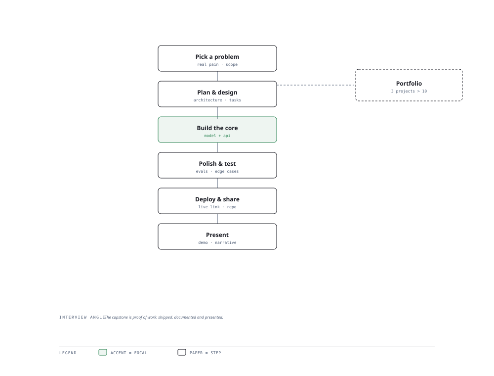

# Visual Notes — From Problem to Demo

> One diagram, the full picture. This page is meant to be glanced at before reading the chapters, and again before interviews.

# What the diagram shows

1. **Think** — Choose a real problem and define success metrics before writing code.
1. **Build** — Prototype fast: an API, a RAG platform, or a multi-agent system on a tight scope.
1. **Ship** — Test, deploy, document, then demo the story — impact over lines of code.

# Why this matters for placement

- A finished, deployed capstone is the single highest-leverage portfolio asset.
- The demo narrative — problem, build, result — is your strongest interview answer.

# Quick revision

- Scope ruthlessly: an MVP that ships beats a "complete" project that never deploys.
- Each capstone maps to a job signal: engineer / researcher / product sense.
- Measure outcome: latency, accuracy, users — a number makes it credible.
- Write the README and deploy before "polishing" the model.
- Reuse modules: one great RAG platform can power several project stories.

# Related chapters

- [Resume ATS analyzer](02-resume-ats-analyzer.md)
- [Enterprise RAG platform](03-enterprise-rag-platform.md)
- [Multi-agent support system](04-multi-agent-support-system.md)
- [Full AI SaaS platform](05-full-ai-saas-platform.md)

---

**One-line answer for interviews:** *"Pick a problem → plan → build → test → ship → present with a demo and a story."*
