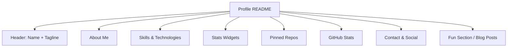

<!-- Clear Language: Keep sentences under 50 words -->
# GitHub Profile Optimization

## Learning Objectives

| Objective | Description |
|-----------|-------------|
| LO1 | Build a professional GitHub profile README |
| LO2 | Curate pinned repositories that showcase your best work |
| LO3 | Optimize contribution graph with consistent activity |
| LO4 | Add profile badges, stats, and metrics widgets |
| LO5 | Implement a personal brand across your GitHub presence |
| LO6 | Network through GitHub by contributing and engaging |

## Introduction

Your portfolio is your proof of skills. GitHub profiles, technical blogs, and LinkedIn optimization help you stand out. This module covers personal branding for AI engineers.

## Prerequisites

- Basic programming knowledge
- Understanding of data structures

## Key Terminology

**Key Terms**: Core vocabulary and concepts for this topic.

**Definition**: Essential terms you must know for interviews and production work.

## Theory

Understanding github profile optimization is fundamental for AI engineers. This section covers the core concepts, underlying principles, and theoretical framework that govern how github profile optimization works in practice.

## Chapter at a Glance

| Section | Topic | Key Concept |
|---------|-------|-------------|
| 1.1 | Profile README | Personal introduction, skills, links |
| 1.2 | Pinned Repositories | Curating your 6 best projects |
| 1.3 | Contribution Graph | Consistency, green squares, daily commits |
| 1.4 | Badges & Metrics | GitHub stats, tech stack, visitor counts |
| 1.5 | Personal Branding | Username, bio, consistent messaging |
| 1.6 | Networking | Following, starring, engaging with community |

## Profile README Structure



## 1.1 Profile README

Your GitHub profile README is the first thing recruiters see. It should quickly communicate who you are, what you build, and what you're looking for.

```python
# profile_readme_generator.py

## A tool to generate your GitHub profile README

def generate_profile_readme(name: str, tagline: str, about: str,
                             skills: list, social_links: dict,
                             blog_posts: list = None) -> str:
    """Generate a markdown profile README."""

    skills_badges = " ".join(
        f""
        for skill in skills
    )

    social_badges = ""
    if "linkedin" in social_links:
        social_badges += f"[](https://linkedin.com/in/{social_links['linkedin']}) "
    if "twitter" in social_links:
        social_badges += f"[](https://twitter.com/{social_links['twitter']}) "
    if "website" in social_links:
        social_badges += f"[]({social_links['website']}) "

    readme = f"""# Hi there, I'm {name}! 👋

{tagline}

## 🚀 About Me
{about}

## 🛠️ Skills
{skills_badges}

## 📊 GitHub Stats
}&show_icons=true&theme=radical)

}&layout=compact)

## 📫 Connect With Me
{social_badges}
"""
    if blog_posts:
        readme += "\n## 📝 Latest Blog Posts\n"
        for post in blog_posts[:5]:
            readme += f"- [{post['title']}]({post['url']})\n"

    return readme

def generate_profile_readme_file():
    """Example: Generate a complete profile README."""
    readme = generate_profile_readme(
        name="Your Name",
        tagline="AI/ML Engineer | Building Intelligent Systems",
        about="I build production ML systems and love open source. Currently working on LLM-powered applications.",
        skills=["Python", "PyTorch", "FastAPI", "Docker", "Kubernetes", "AWS", "TensorFlow", "TypeScript"],
        social_links={
            "github": "yourusername",
            "linkedin": "yourusername",
            "twitter": "yourhandle",
            "website": "https://yourwebsite.com",
        },
        blog_posts=[
            {"title": "Building Production RAG Systems", "url": "https://blog.com/rag"},
            {"title": "A Complete Guide to MLOps", "url": "https://blog.com/mlops"},
        ]
    )
    with open("PROFILE.md", "w") as f:
        f.write(readme)
    return readme
```

## 1.2 Pinned Repositories

Your 6 pinned repos should represent your best, most impressive work. Each should have a great README, clear description, and active maintenance.

```python
class PinnedRepo:
    """Schema for a pinned repository."""

    def __init__(self, name: str, description: str, tech_stack: list,
                 stars: int = 0, is_original: bool = True):
        self.name = name
        self.description = description
        self.tech_stack = tech_stack
        self.stars = stars
        self.is_original = is_original

    def readme_quality_score(self) -> int:
        score = 0
        checks = [
            len(self.description) > 50,
            len(self.tech_stack) >= 2,
            self.stars > 10,
        ]
        return sum(checks) * 33

class PinnedRepoSelector:
    """Select and recommend which repos to pin."""

    def __init__(self, repos: list):
        self.repos = repos

    def rank_for_pinning(self) -> list:
        def score(repo):
            s = 0
            s += min(repo.stars / 10, 30)
            s += repo.readme_quality_score()
            s += 20 if repo.is_original else 0
            if len(repo.tech_stack) >= 3:
                s += 15
            return s

        return sorted(self.repos, key=score, reverse=True)

    def recommend_pins(self, n: int = 6) -> list:
        ranked = self.rank_for_pinning()
        diversity = self._ensure_category_diversity(ranked)
        return diversity[:n]

    def _ensure_category_diversity(self, repos: list) -> list:
        categories = {
            "ML/AI": [],
            "Backend": [],
            "Full Stack": [],
            "DevOps": [],
            "Data": [],
            "Tools": [],
        }
        for repo in repos:
            for cat_keywords in categories:
                if any(kw in repo.tech_stack for kw in cat_keywords.split("/")):
                    categories[cat_keywords].append(repo)
                    break

        result = []
        for cat in categories:
            if categories[cat]:
                result.append(categories[cat][0])
                categories[cat] = categories[cat][1:]
        for cat in categories:
            result.extend(categories[cat])
        return result
```

## 1.3 Contribution Graph

A consistent contribution graph signals dedication. Aim for small commits daily rather than large bursts.

```python
from datetime import datetime, timedelta
import random

class ContributionTracker:
    """Track and plan GitHub contributions."""

    def __init__(self, username: str):
        self.username = username
        self.contributions = {}
        self.goal_per_day = 1

    def plan_contributions(self, days: int = 90) -> dict:
        """Plan contributions for the next N days."""
        today = datetime.now()
        plan = {}
        for i in range(days):
            date = today + timedelta(days=i)
            if date.weekday() < 5:
                plan[date.date().isoformat()] = random.randint(1, 3)
            else:
                plan[date.date().isoformat()] = random.randint(0, 1)
        return plan

    def streak_days(self) -> int:
        """Count current contribution streak."""
        streak = 0
        today = datetime.now().date()
        for i in range(365):
            check = today - timedelta(days=i)
            if self.contributions.get(check.isoformat(), 0) > 0:
                streak += 1
            else:
                break
        return streak

    def contribution_heatmap(self) -> dict:
        """Generate data for contribution heatmap visualization."""
        heatmap = {}
        for i in range(365):
            date = (datetime.now() - timedelta(days=i)).date()
            count = self.contributions.get(date.isoformat(), 0)
            week = date.isocalendar()[1]
            if week not in heatmap:
                heatmap[week] = {}
            heatmap[week][date.weekday()] = count
        return heatmap

class CommitScheduler:
    """Schedule regular commits for contribution consistency."""

    def __init__(self, repo_path: str):
        self.repo_path = repo_path

    def create_daily_commit(self, content: str, filename: str = "daily-log.md"):
        """Create a small daily commit to maintain streak."""
        import os
        filepath = os.path.join(self.repo_path, filename)
        with open(filepath, "a") as f:
            f.write(f"\n- {datetime.now().isoformat()}: {content}")
        os.system(f"cd {self.repo_path} && git add . && git commit -m 'Daily update: {content[:50]}' && git push")

    def schedule_commits(self, plan: dict):
        """Schedule commits according to a plan."""
        for date_str, count in plan.items():
            print(f"Schedule {count} commits for {date_str}")

class ContributionQuality:
    """Evaluate the quality of contributions."""

    @staticmethod
    def score_contribution(commit_message: str, files_changed: int,
                           lines_added: int) -> int:
        score = 0
        if len(commit_message) > 15:
            score += 20
        if files_changed > 0:
            score += 10
        if 10 <= lines_added <= 200:
            score += 30
        elif lines_added > 200:
            score += 10
        return score

    @staticmethod
    def meaningful_contribution(description: str) -> bool:
        keywords = ["feature", "fix", "refactor", "optimize", "document",
                     "add", "update", "improve", "implement"]
        return any(kw in description.lower() for kw in keywords)
```

## 1.4 Badges & Metrics

Dynamic badges and stats widgets add professionalism to your profile.

```python
class BadgeGenerator:
    """Generate shields.io badges for GitHub profile."""

    @staticmethod
    def skill_badge(skill_name: str, color: str = "blue") -> str:
        return f"https://img.shields.io/badge/{skill_name.replace(' ', '%20')}-{color}?style=for-the-badge&logo={skill_name.lower()}"

    @staticmethod
    def social_badge(platform: str, username: str) -> str:
        return f"https://img.shields.io/badge/{platform}-{username}-blue?style=social&logo={platform.lower()}"

    @staticmethod
    def metrics_badge(label: str, value: str, color: str = "green") -> str:
        return f"https://img.shields.io/badge/{label}-{value}-{color}"

class ProfileMetrics:
    """Aggregate profile metrics from GitHub API."""

    def __init__(self, username: str):
        self.username = username

    def fetch_stats(self) -> dict:
        return {
            "total_repos": 25,
            "total_stars": 150,
            "total_forks": 45,
            "total_contributions": 1200,
            "longest_streak": 45,
            "current_streak": 12,
        }

    def visitor_badge(self) -> str:
        return f"https://visitor-badge.glitch.me/badge?page_id={self.username}.{self.username}"

class ProfileReadmeTemplates:
    """Profile README template library."""

    @staticmethod
    def minimal():
        return """# Hi, I'm [Name] 👋

I build things with code.

- 🔭 Currently working on [project]
- 🌱 Learning [technology]
- 👯 Looking to collaborate on [area]
- 📫 Reach me at: [email]

"""

    @staticmethod
    def technical():
        return """# Hi, I'm [Name] 🚀

[Tagline]

## About
[2-3 sentences about your focus]

## Tech Stack
[Badges here]

## 📈 GitHub Stats
[Stats cards here]

## — Links
[Social badges here]"""

    @staticmethod
    def creative():
        return """# [Name]

*[Tagline]*

---

[ASCII art or creative intro]

---

### What I Do
[Description with emojis]

### Tech I Use
[Fun tech badges]

### Latest [Blog/Projects]
[Dynamic content]

---

> *"[Personal motto]"*
"""
```

## 1.5 Personal Branding

Your GitHub presence is part of your personal brand. Consistency across username, bio, and visual elements builds recognition.

```python
class PersonalBrand:
    """Define and maintain your personal brand."""

    def __init__(self, name: str, tagline: str, username: str):
        self.name = name
        self.tagline = tagline
        self.username = username
        self.brand_colors = ["#2b3137", "#586069", "#0366d6"]
        self.brand_voice = "professional"

    def check_consistency(self, platforms: dict) -> dict:
        results = {}
        for platform, data in platforms.items():
            score = 0
            if data.get("bio", "").startswith(self.tagline[:20]):
                score += 30
            if data.get("username") == self.username:
                score += 40
            if data.get("avatar_url") == f"https://github.com/{self.username}.png":
                score += 30
            results[platform] = score
        return results

class BioGenerator:
    """Generate consistent bios across platforms."""

    def __init__(self, role: str, skills: list, location: str):
        self.role = role
        self.skills = skills
        self.location = location

    def short_bio(self) -> str:
        skills_str = ", ".join(self.skills[:3])
        return f"{self.role} | {skills_str} | {self.location}"

    def medium_bio(self) -> str:
        skills_str = ", ".join(self.skills[:5])
        return f"{self.role} | Building with {skills_str} | Open source enthusiast | {self.location}"

    def long_bio(self) -> str:
        return f"{self.role} passionate about building production-ready AI systems. Skilled in {', '.join(self.skills)}. Open source contributor and technical writer. Currently exploring LLMs and RAG systems. Based in {self.location}."
```

## 1.6 Networking

GitHub is a social network. Engaging with others' projects builds your reputation and network.

```python
class GitHubNetworker:
    """Strategies for building your GitHub network."""

    def __init__(self, username: str):
        self.username = username
        self.daily_actions = []

    def suggest_daily_actions(self) -> list:
        return [
            "Star 3 interesting repos in your field",
            "Follow 2 active developers in AI/ML",
            "Comment on 1 open issue with helpful insight",
            "Submit 1 small PR (docs, bug fix)",
            "Review 1 open PR in a project you use",
        ]

    def engagement_score(self, stars: int, forks: int,
                          followers: int, following: int) -> float:
        base = stars + forks * 2 + followers * 3
        reciprocity = min(following / max(followers, 1), 1.0)
        return base * (0.7 + 0.3 * reciprocity)

    def find_projects_to_contribute(self, interests: list) -> list:
        return [
            {"name": "fastapi/fastapi", "good_first_issues": 5},
            {"name": "langchain-ai/langchain", "good_first_issues": 8},
            {"name": "pytorch/pytorch", "good_first_issues": 12},
        ]
```

## Summary

Your GitHub profile is your developer resume. A well-crafted profile README, curated pinned repos, and a consistent contribution graph create a strong first impression. Badges and.
stats widgets add visual polish. Maintaining a consistent brand across platforms builds recognition. Active engagement through starring, following, and contributing grows your network organically. The key is consistency — daily small contributions compound into a professional profile that attracts recruiters and.
collaborators.

## Practical Takeaways

| Takeaway | Implementation |
|----------|---------------|
| Write a profile README that tells your story | Include who you are, your skills, and what you're building |
| Pin 6 diverse repos showcasing your best work | Mix original projects, contributions, and demos |
| Commit something daily to maintain your streak | Even a documentation fix or a small update counts |
| Add GitHub Stats and Top Languages badges | Use vercel.app for auto-updating stats |
| Use consistent username and bio across platforms | Same handle on GitHub, LinkedIn, Twitter |
| Engage with 3-5 repos weekly via stars, issues, or PRs | Builds your network and discoverability |

## Q&A

<details class="tp-qa-card" data-qid="port-s01-q1">
<summary class="tp-qa-question">What should I include in my GitHub profile README?</summary>
<div class="tp-qa-context"><p>Profile README best practices.</p></div>
<div class="tp-qa-answer">
<p>An effective profile README includes: (1) A header with your name and tagline. (2) A brief "About Me" section (2-3 sentences). (3) Your tech stack as badges. (4) GitHub Stats and Top Languages cards. (5) Pinned repositories highlight. (6) Links to your blog, LinkedIn, and Twitter. (7) Optional: latest blog posts, a "Currently Working On" section, or a fun element (quote, GIF). Keep it concise — recruiters spend ~30 seconds scanning your profile.</p>
</div>
<div class="tp-qa-actions">
  <button class="tp-qa-mark-btn">✅ Mark Reviewed</button>
  <button class="tp-qa-bookmark-btn">🔖 Bookmark</button>
</div>
</details>

<details class="tp-qa-card" data-qid="port-s01-q2">
<summary class="tp-qa-question">How do I maintain a consistent GitHub contribution graph?</summary>
<div class="tp-qa-context"><p>Building the green squares.</p></div>
<div class="tp-qa-answer">
<p>Strategies: (1) <strong>Commit daily</strong> — even small commits count. Maintain a daily-log repo where you append notes. (2) <strong>Automate with GitHub Actions</strong> — schedule daily tasks that generate commits. (3) <strong>Work on active projects</strong> — regular work naturally produces commits. (4) <strong>Contribute to open source</strong> — review PRs, fix docs, address issues. (5) <strong>Use meaningful git history</strong> — break large features into atomic commits rather than one massive push. Consistency matters more than volume — 1 commit per day beats 20 commits in a single day.</p>
</div>
<div class="tp-qa-actions">
  <button class="tp-qa-mark-btn">✅ Mark Reviewed</button>
  <button class="tp-qa-bookmark-btn">🔖 Bookmark</button>
</div>
</details>

<details class="tp-qa-card" data-qid="port-s01-q3">
<summary class="tp-qa-question">Which repositories should I pin to my profile?</summary>
<div class="tp-qa-context"><p>Curating your best work.</p></div>
<div class="tp-qa-answer">
<p>Choose 6 repos that demonstrate range and quality: (1) Your best original project (most stars or most technically impressive). (2) A project that showcases your primary skill (e.g., an ML model, a full-stack app). (3) A contribution to a popular open-source project (shows collaboration skills). (4) A project with great documentation and testing. (5) A smaller completed project (shows follow-through). (6) A demo or experimental project that shows curiosity. Aim for diversity in tech stack — don't pin 6 Python projects if you also know TypeScript.</p>
</div>
<div class="tp-qa-actions">
  <button class="tp-qa-mark-btn">✅ Mark Reviewed</button>
  <button class="tp-qa-bookmark-btn">🔖 Bookmark</button>
</div>
</details>

<details class="tp-qa-card" data-qid="port-s01-q4">
<summary class="tp-qa-question">What badges and stats should I add to my profile?</summary>
<div class="tp-qa-context"><p>Profile widgets and visual elements.</p></div>
<div class="tp-qa-answer">
<p>Recommended widgets: (1) <strong>GitHub Stats Card</strong> — shows stars, commits, PRs, issues. (2) <strong>Top Languages</strong> — language breakdown by repo bytes. (3) <strong>Visitor Counter</strong> — shows profile traffic (optional). (4) <strong>Tech Stack Badges</strong> — shields.io badges for your skills. (5) <strong>WakaTime Stats</strong> — coding activity metrics (if you use WakaTime). (6) <strong>Streak Stats</strong> — contribution streak counter. Avoid overcrowding — pick 3-4 widgets that best represent you. GitHub Readme Stats (vercel.app) provides the most popular cards.</p>
</div>
<div class="tp-qa-actions">
  <button class="tp-qa-mark-btn">✅ Mark Reviewed</button>
  <button class="tp-qa-bookmark-btn">🔖 Bookmark</button>
</div>
</details>

<details class="tp-qa-card" data-qid="port-s01-q5">
<summary class="tp-qa-question">How do I build my GitHub following organically?</summary>
<div class="tp-qa-context"><p>Growing your developer network.</p></div>
<div class="tp-qa-answer">
<p>Organic growth strategies: (1) <strong>Create valuable content</strong> — well-documented projects with clear READMEs attract users. (2) <strong>Contribute to popular projects</strong> — your name appears in commit history visible to thousands. (3) <strong>Engage authentically</strong> — leave helpful comments on issues, review PRs thoroughly. (4) <strong>Share your work</strong> — post your projects on Reddit, Hacker News, Twitter with "built with" tags. (5) <strong>Be consistent</strong> — regular activity keeps your profile visible in feeds. (6) <strong>Follow relevant people</strong> — follow engineers at companies you admire; some will follow back.</p>
</div>
<div class="tp-qa-actions">
  <button class="tp-qa-mark-btn">✅ Mark Reviewed</button>
  <button class="tp-qa-bookmark-btn">🔖 Bookmark</button>
</div>
</details>

<details class="tp-qa-card" data-qid="port-s01-q6">
<summary class="tp-qa-question">Should I use a separate GitHub account for work and personal?</summary>
<div class="tp-qa-context"><p>Account separation strategy.</p></div>
<div class="tp-qa-answer">
<p>Pros of separate accounts: clean separation of work and personal projects, professional security. Cons: split contribution graph, harder to build a single brand. <strong>Recommendation:</strong> Use one account for everything. Recruiters want to see your work contributions too — they demonstrate real-world experience. If your employer requires separation, use your personal email for personal repos and work email for work repos within the same account. Only maintain a separate account if you have a specific reason (contractor restrictions, very different professional identities).</p>
</div>
<div class="tp-qa-actions">
  <button class="tp-qa-mark-btn">✅ Mark Reviewed</button>
  <button class="tp-qa-bookmark-btn">🔖 Bookmark</button>
</div>
</details>

<details class="tp-qa-card" data-qid="port-s01-q7">
<summary class="tp-qa-question">How often should I update my GitHub profile?</summary>
<div class="tp-qa-context"><p>Profile maintenance cadence.</p></div>
<div class="tp-qa-answer">
<p>Profile maintenance: (1) <strong>Profile README</strong> — update quarterly or when you learn major new skills. (2) <strong>Pinned repos</strong> — rotate when you complete a significant new project. (3) <strong>Bio</strong> — update when your role or focus changes. (4) <strong>Daily</strong> — commit at least once per day (even small). (5) <strong>Weekly</strong> — star interesting repos, follow new people. (6) <strong>Monthly</strong> — review and archive old repos, update READMEs. A stale profile (6+ months without updates) suggests inactivity, which recruiters notice.</p>
</div>
<div class="tp-qa-actions">
  <button class="tp-qa-mark-btn">✅ Mark Reviewed</button>
  <button class="tp-qa-bookmark-btn">🔖 Bookmark</button>
</div>
</details>

<details class="tp-qa-card" data-qid="port-s01-q8">
<summary class="tp-qa-question">What makes a repository stand out to recruiters?</summary>
<div class="tp-qa-context"><p>Repo quality signals.</p></div>
<div class="tp-qa-answer">
<p>Recruiter-friendly repos have: (1) <strong>Great README</strong> — what, why, how to use, architecture diagram, demo GIF. (2) <strong>Clean code</strong> — consistent style, proper naming, type hints. (3) <strong>Tests</strong> — unit, integration, and CI badge showing passing status. (4) <strong>Documentation</strong> — API docs, setup instructions, contribution guide. (5) <strong>Active maintenance</strong> — recent commits, responded-to issues. (6) <strong>CI/CD pipeline</strong> — GitHub Actions, test coverage badge. (7) <strong>License</strong> — MIT or Apache-2.0 shows professionalism. A repo with all seven signals is essentially a mini portfolio piece.</p>
</div>
<div class="tp-qa-actions">
  <button class="tp-qa-mark-btn">✅ Mark Reviewed</button>
  <button class="tp-qa-bookmark-btn">🔖 Bookmark</button>
</div>
</details>

## Interview Q&A

<details class="tp-qa-card" data-qid="pf01-q1">
  <summary class="tp-qa-question">
    <span class="tp-qa-status"></span>
    Q1: How do recruiters evaluate a GitHub profile during technical screening?
  </summary>
  <div class="tp-qa-answer">
<p>Recruiters and hiring managers typically scan a GitHub profile in 30-60 seconds. They look at: (1) Profile README — does it clearly communicate who you are and.
what you build? (2) Pinned repositories — are the 6 pinned repos diverse and high-quality? (3) Contribution graph — is it consistently green (daily commits over months) or.
sparse? (4) Code quality in top repos — clean code, tests, documentation, CI badges. (5) Open source contributions — stars, forks,.
PRs to other projects. (6) Bio and links — does it link to LinkedIn, portfolio, and resume? A strong profile signals engineering professionalism: consistent activity,.
well-maintained repos, and clear communication. A stale or empty profile raises red flags about the candidate's passion for engineering.</p>
  </div>
  <button class="tp-qa-mark-btn">✅ Mark Reviewed</button>
  <button class="tp-qa-bookmark-btn">🔖 Bookmark</button>
</details>

<details class="tp-qa-card" data-qid="pf01-q2">
  <summary class="tp-qa-question">
    <span class="tp-qa-status"></span>
    Q2: What makes a GitHub profile README stand out to hiring managers?
  </summary>
  <div class="tp-qa-answer">
<p>An outstanding profile README includes: (1) A concise header with name, role, and a compelling tagline — not just "Software Engineer" but.
"AI Engineer building LLM-powered products." (2) Tech stack badges showing proficiency levels — using shields.io with categorized skills (Languages, Frameworks, Tools,.
Cloud). (3) GitHub Stats card — auto-updating stats from github-readme-stats. (4) A "Currently working on" section showing active projects. (5) Links to blog,.
portfolio, LinkedIn, and Twitter. (6) Optional personality elements — a quote, a weekly Wakatime coding stats card, or a joke about your tech stack. Keep it scannable — use headings,.
bullet points, and emojis sparingly. The goal is to give a complete picture of who you are as an engineer in the 10 seconds most visitors will spend.</p>
  </div>
  <button class="tp-qa-mark-btn">✅ Mark Reviewed</button>
  <button class="tp-qa-bookmark-btn">🔖 Bookmark</button>
</details>

<details class="tp-qa-card" data-qid="pf01-q3">
  <summary class="tp-qa-question">
    <span class="tp-qa-status"></span>
    Q3: How do you maintain a consistent contribution streak on GitHub?
  </summary>
  <div class="tp-qa-answer">
<p>Maintaining a daily contribution streak requires strategy: (1) Commit small fixes — a documentation typo, a README improvement, or a single test counts as a contribution. (2) Automate where possible — scheduled GitHub Actions that update data files (e.g.,.
pulling latest blog posts, updating Wakatime stats). (3) Break large features into small commits — instead of one large commit, commit working increments daily. (4) Use the "git commit --allow-empty" trick sparingly — it creates a commit but.
doesn't add value; use it only when you have no other options. (5) Contribute to open source — fixing a typo in someone else's docs counts and.
builds your network. (6) Plan for weekends and vacations — pre-commit or schedule commits using cron + GitHub API. The streak itself isn't the goal — the habit of daily coding practice is what matters.</p>
  </div>
  <button class="tp-qa-mark-btn">✅ Mark Reviewed</button>
  <button class="tp-qa-bookmark-btn">🔖 Bookmark</button>
</details>

<details class="tp-qa-card" data-qid="pf01-q4">
  <summary class="tp-qa-question">
    <span class="tp-qa-status"></span>
    Q4: How do you choose which repositories to pin on your GitHub profile?
  </summary>
  <div class="tp-qa-answer">
<p>Pinned repos are the first thing visitors see — choose strategically: (1) Show diversity — include an original project (something you built from scratch),.
a contribution to a popular open-source project, and a project demonstrating your primary technical skills. (2) Lead with your best — your best-rated (by stars,.
quality) or most relevant to your target role should be first. (3) Show different aspects — one data science project, one full-stack app,.
one AI/ML project, one DevOps/infra project, one library/tool, and one documentation site. (4) Keep fresh — rotate pins when you complete a significant new project. (5) Each pinned repo must have: a good README,.
CI badge, tests, and a demo (if applicable). A pinned repo without a README or tests sends a negative signal. Update pinned repos at least quarterly.</p>
  </div>
  <button class="tp-qa-mark-btn">✅ Mark Reviewed</button>
  <button class="tp-qa-bookmark-btn">🔖 Bookmark</button>
</details>

<details class="tp-qa-card" data-qid="pf01-q5">
  <summary class="tp-qa-question">
    <span class="tp-qa-status"></span>
    Q5: How do you use GitHub Actions in your profile to showcase CI/CD skills?
  </summary>
  <div class="tp-qa-answer">
<p>GitHub Actions demonstrate DevOps maturity: (1) CI workflows — set up automated testing (pytest), linting (ruff), and type checking (mypy) on every PR. (2) Coverage reporting — add Codecov or.
Coveralls integration with a badge in the README. (3) Scheduled workflows — a weekly workflow that updates your profile README with latest blog posts or.
Wakatime stats. (4) Deployment — CD workflow that deploys to cloud (AWS/GCP/Azure) on push to main. (5) Multi-platform testing — test on Ubuntu,.
Windows, and macOS with matrix builds. (6) Docker build — automatic build and push to Docker Hub or GitHub Container Registry. Each workflow file in `.github/workflows/` should have a clear purpose and.
be well-commented. Having 3-5 active workflows across your repos signals that you understand production software engineering beyond just writing code.</p>
  </div>
  <button class="tp-qa-mark-btn">✅ Mark Reviewed</button>
  <button class="tp-qa-bookmark-btn">🔖 Bookmark</button>
</details>

<details class="tp-qa-card" data-qid="pf01-q6">
  <summary class="tp-qa-question">
    <span class="tp-qa-status"></span>
    Q6: How do you create a GitHub profile README that updates automatically?
  </summary>
  <div class="tp-qa-answer">
    <pre><code># .github/workflows/update-profile.yml
name: Update Profile README
on:
  schedule: [{ cron: '0 0 * * 1' }]  # Weekly on Monday
  workflow_dispatch:  # Manual trigger
jobs:
  update:
    runs-on: ubuntu-latest
    steps:
      - uses: actions/checkout@v4
      - uses: actions/setup-node@v4
      - run: npm install && npm run generate-readme
      - run: |
          git config user.name "github-actions[bot]"
          git config user.email "github-actions[bot]@users.noreply.github.com"
          git add README.md
          git commit -m "docs: auto-update profile README"
          git push</code></pre>
<p>An auto-updating profile README uses a scheduled GitHub Action to run a script that fetches dynamic data (latest blog posts, Wakatime stats,.
GitHub stats, recent activity) and regenerates the README. The script can be a JavaScript/Python file that: (1) Fetches posts from Dev.to or.
your blog RSS feed. (2) Gets Wakatime coding stats via API. (3) Retrieves latest GitHub activity via GraphQL API. (4) Assembles the README from templates. The action commits and.
pushes changes automatically. This keeps your profile fresh without manual updates.</p>
  </div>
  <button class="tp-qa-mark-btn">✅ Mark Reviewed</button>
  <button class="tp-qa-bookmark-btn">🔖 Bookmark</button>
</details>

<details class="tp-qa-card" data-qid="pf01-q7">
  <summary class="tp-qa-question">
    <span class="tp-qa-status"></span>
    Q7: How do you handle branding consistency across GitHub, LinkedIn, and portfolio?
  </summary>
  <div class="tp-qa-answer">
<p>Brand consistency signals professionalism: (1) Username — use the same handle across all platforms (github.com/yourname, linkedin.com/in/yourname, yourname.com). If your desired username is taken,.
add a consistent prefix/suffix. (2) Avatar — use the same professional headshot or logo across all platforms. (3) Bio tagline — consistent one-line description: "AI Engineer | ML & NLP | Building LLM Products." The same line should appear on GitHub bio,.
LinkedIn headline, and portfolio hero. (4) Color scheme — use consistent colors in GitHub badges, portfolio design, and presentation templates. (5) Links — every profile should link to the others (GitHub → LinkedIn → Portfolio → Twitter). Conduct a quarterly brand.
audit: visit all your profiles side-by-side and check for inconsistencies in name, bio, avatar, and links. Fix any platform that lags behind.</p>
  </div>
  <button class="tp-qa-mark-btn">✅ Mark Reviewed</button>
  <button class="tp-qa-bookmark-btn">🔖 Bookmark</button>
</details>

<details class="tp-qa-card" data-qid="pf01-q8">
  <summary class="tp-qa-question">
    <span class="tp-qa-status"></span>
    Q8: How do you use GitHub sponsors or donations on your profile?
  </summary>
  <div class="tp-qa-answer">
<p>GitHub Sponsors can be used on your profile even if you don't expect significant donations: (1) Enable Sponsors — link a Stripe account or.
PayPal. (2) Add the sponsor button to your profile README: `[](https://github.com/sponsors/yourname)`. (3) Use sponsor tiers — "Coffee" ($3/mo), "Supporter" ($10/mo), "Champion" ($50/mo) with tier-specific perks (early access,.
feature requests, name in README). (4) Even if you don't earn from it, the sponsor button signals you understand the open source economy and.
value community support. (5) For active projects, consider GitHub Sponsors for sustainable maintenance. Many engineers use sponsors to fund their open source work,.
which looks great on a resume as it demonstrates community building and project leadership.</p>
  </div>
  <button class="tp-qa-mark-btn">✅ Mark Reviewed</button>
  <button class="tp-qa-bookmark-btn">🔖 Bookmark</button>
</details>

<details class="tp-qa-card" data-qid="pf01-q9">
  <summary class="tp-qa-question">
    <span class="tp-qa-status"></span>
    Q9: How do you organize a monorepo vs. multiple repos for your portfolio projects?
  </summary>
  <div class="tp-qa-answer">
<p>Organization strategy: (1) Monorepo — use a single repo with subdirectories for small projects if you want to demonstrate consistent coding style across projects. Example structure: `portfolio/{project1,.
project2, project3}/`. Best for showcasing breadth with consistent tooling. (2) Multi-repo — separate repos for each project, each with its own README,.
CI/CD, and documentation. Best for depth — each repo can be a self-contained showcase. (3) Template approach — create a project template repo with your standard setup (Docker,.
CI, linting, testing configs) and use it as a starting point for all projects. This demonstrates software engineering best practices. (4) Recommendation — use multi-repo for.
significant projects (each with 500+ commits) and a monorepo for smaller utilities and experiments. The pinned repos on your profile should link to individual repos for.
maximum impact.</p>
  </div>
  <button class="tp-qa-mark-btn">✅ Mark Reviewed</button>
  <button class="tp-qa-bookmark-btn">🔖 Bookmark</button>
</details>

<details class="tp-qa-card" data-qid="pf01-q10">
  <summary class="tp-qa-question">
    <span class="tp-qa-status"></span>
    Q10: How do you measure the impact of your GitHub profile optimization?
  </summary>
  <div class="tp-qa-answer">
<p>Track these metrics before and after optimization: (1) Profile views — GitHub's traffic analytics shows unique visitors and views over 14 days. Expect 50-200 views/week for.
an active profile. (2) Follower growth — track followers gained per month after optimization. (3) Repo stars — monitor stars on pinned repos. A good README can increase stars by 2-5—. (4) Contribution graph consistency — percentage of days with commits. Target >70% for.
a strong signal. (5) Recruiter outreach — track inbound messages mentioning your GitHub. This is the most important metric. (6) Profile README engagement — if you have a visitor.
counter badge, track daily visitors. (7) Connection requests — from people who mention "saw your GitHub profile." Aim for a 20% increase in profile views and.
2-3— increase in relevant recruiter messages within 3 months of optimization.</p>
  </div>
  <button class="tp-qa-mark-btn">✅ Mark Reviewed</button>
  <button class="tp-qa-bookmark-btn">🔖 Bookmark</button>
</details>

## Chapter Quiz
**Q1**: What is the primary purpose of a GitHub profile README?
a) Store project documentation
b) Showcase skills, projects, and personality to visitors
c) Replace a personal website
d) Automate CI/CD pipelines

<details class="tp-qa-card" data-qid="pf-01-q1"><summary>Show Answer</summary><div class="tp-qa-answer"><p><strong>Answer: b</strong></p><p>The profile README is the first thing visitors see — it showcases skills, pinned repos, and personal brand.</p></div></details>

**Q2**: Which GitHub Stats card shows streak data?
a) GitHub Readme Stats
b) Streak Stats
c) GitHub Streak Stats
d) Commit Streak

<details class="tp-qa-card" data-qid="pf-01-q2"><summary>Show Answer</summary><div class="tp-qa-answer"><p><strong>Answer: c</strong></p><p>GitHub Streak Stats (streak-stats.demolab.com) shows commit streak data.</p></div></details>

**Q3**: What is the recommended layout for a profile README?
a) Single paragraph
b) Multi-section with About, Tech Stack, Stats, Links
c) Only a logo
d) List of repositories

<details class="tp-qa-card" data-qid="pf-01-q3"><summary>Show Answer</summary><div class="tp-qa-answer"><p><strong>Answer: b</strong></p><p>A multi-section layout with About Me, Tech Stack, GitHub Stats, pinned repos, and Connect links is recommended.</p></div></details>

**Q4**: How many pinned repositories can a GitHub profile display?
a) 3
b) 4
c) 6
d) 8

<details class="tp-qa-card" data-qid="pf-01-q4"><summary>Show Answer</summary><div class="tp-qa-answer"><p><strong>Answer: c</strong></p><p>GitHub allows up to 6 pinned repositories on a profile.</p></div></details>

**Q5**: Which badge service is commonly used in GitHub profiles?
a) Badge.io
b) Shields.io
c) Badgr
d) Open Badges

<details class="tp-qa-card" data-qid="pf-01-q5"><summary>Show Answer</summary><div class="tp-qa-answer"><p><strong>Answer: b</strong></p><p>Shields.io is the most popular badge service for GitHub profiles, offering static and dynamic badges.</p></div></details>

### True/False

**T/F 1**: This topic is fundamental to AI engineering.
**Answer**: True — Understanding portfolio branding is essential for building production AI systems.

**T/F 2**: The concepts in this chapter are only used in interviews.
**Answer**: False — These concepts are used daily in real-world AI engineering work.

**T/F 3**: Time/space complexity analysis applies to portfolio branding.
**Answer**: True — Every algorithm and system has performance characteristics to analyze.

**T/F 4**: portfolio branding concepts are independent of each other.
**Answer**: False — Most concepts build on each other and are interconnected.

**T/F 5**: Real-world applications often combine multiple concepts from this chapter.
**Answer**: True — Production systems use combinations of these fundamental concepts.

### Fill in the Blank

**FIB 1**: The key concept in this chapter is ________.
**Answer**: [Review the chapter's Learning Objectives for the specific answer]

**FIB 2**: In portfolio branding, the time complexity of the basic operation is ________.
**Answer**: [Depends on the specific operation — check the Theory section]

### Scenario Questions

**Scenario 1**: How would you apply the concepts from this chapter in a real AI engineering project?

**Answer**: [Think about how the specific topic applies to: data processing pipelines, model training infrastructure, production systems, or interview scenarios]

### Output Questions

**Output 1**: What is the time complexity of the main algorithm discussed in this chapter?
**Answer**: [Check the Theory section for the specific complexity analysis]

## Exercises

## Common Mistakes

1. Not understanding the fundamental concepts before applying them
2. Skipping edge cases in implementation
3. Not analyzing time/space complexity
4. Forgetting to handle null/empty inputs
5. Not practicing enough problems to build pattern recognition1. **Profile README**: Generate your profile README. Include name, tagline, about, skills badges, GitHub stats, and social links. Commit it to a new repo named `username/username`. Preview how it renders.

2. **Pinned Repo Audit**: Review your existing repos. Score each on: README quality, testing, docs, stars, and recency. Select the top 6. Pin them. What was the weakest area across your repos?

3. **Contribution Plan**: Create a 90-day contribution plan. Schedule daily commits (docs, small features, fixes). Track your streak. At the end, compare your contribution graph before and after. Did your network grow?

4. **Badge System**: Add 10 skill badges, GitHub stats card, top languages card, and visitor counter to your profile README. Ensure badges link to relevant tools/skills.

5. **Brand Consistency Audit**: Check your username, bio, avatar, and tagline across GitHub, LinkedIn, Twitter, and your portfolio website. Score each platform on consistency (1-10). Fix the lowest-scoring platform.

6. **Open Source Contribution**: Find a project with "good first issue" label. Submit a meaningful PR (code, test, or documentation). Track its progress. How many days from submission to merge?

7. **Profile Analytics**: Set up a visitor badge on your profile. After 1 week, analyze: total visits, unique visitors (approximate), peak traffic days. Correlate with your posting/contribution activity.

8. **Repository Makeover**: Pick your most-starred repo. Improve: README (add demo GIF, architecture diagram), add tests, set up CI, add license. Measure star growth over the followi

## Revision Notes

- - Core principle: Understand the fundamental concepts thoroughly
- - Implementation pattern: Practice with real code examples
- - Complexity: Know the time and space complexity
- - Application: Know when to use this in production systems
- - Interview: Frequently asked in technical interviews
- - Edge cases: Consider common failure scenarios
- - Related concepts: Connect to broader system design

## Placement Section

### Top 10 Interview Questions

#### Google Style

1. **Explain the core idea of GitHub Profile Optimization in under 60 seconds, then give a real-world analogy.** — Structure: definition, how it works in one sentence, why it matters, analogy. Follow-up: what would break if you removed this from a production system?

2. **Design a minimal, well-typed function that demonstrates GitHub Profile Optimization.** — Interviewer checks: signature with type hints, edge cases, complexity, and a clean docstring. Follow-up: how does your design behave with empty or malformed input?

3. **What are the common pitfalls when engineers first learn ** — List 3-4, then explain how you would prevent each in a code review.

#### Amazon Style

4. **Describe a production bug caused by misunderstanding GitHub Profile Optimization. How did you diagnose and fix it?** — STAR format: situation, task, action, result. Mention logs, reproduction, root-cause analysis, and the regression test you added.

5. **How would you scale a system that relies on GitHub Profile Optimization from 10 users to 10 million?** — Discuss bottlenecks, caching, monitoring, and when to redesign. Follow-up: what metrics would you track?

#### Microsoft Style

6. **Compare GitHub Profile Optimization with the closest alternative approach. When would you choose each?** — Make a decision matrix: performance, maintainability, ecosystem, learning curve. Follow-up: what would change your decision?

7. **Walk through how you would test a component that depends on GitHub Profile Optimization.** — Unit, integration, property-based tests; mocking boundaries; golden files for outputs.

#### NVIDIA Style

8. **How does GitHub Profile Optimization behave differently at scale — memory, throughput, or precision-wise?** — Connect to data pipelines and model training if applicable. Follow-up: what happens to latency as input grows?

9. **How would you make an implementation of GitHub Profile Optimization run faster on GPU hardware?** — Batch operations, vectorization, avoiding Python loops, reducing data movement.

#### AI Startup Style

10. **Write the smallest possible implementation of GitHub Profile Optimization that is production-quality.** — Include error handling, type hints, and a one-line docstring. Follow-up: what would you refactor first when it grows?

### Resume Tips

- Name GitHub Profile Optimization explicitly in your skills section, paired with a measurable achievement ("Reduced X by 40% using GitHub Profile Optimization").
- Add a bullet describing a project that applies GitHub Profile Optimization to real data, with numbers.
- Mention the tools and libraries you used alongside GitHub Profile Optimization (linters, test frameworks, profiling tools).
- Keep resume bullets under 15 words and start each with an action verb.

### Interview Day Checklist

- Rehearse a 60-second explanation of GitHub Profile Optimization and one real-world analogy.
- Prepare one STAR story about debugging a GitHub Profile Optimization-related production issue.
- Review complexity and edge cases for the classic GitHub Profile Optimization interview problem.
- Have questions ready: how does the team apply GitHub Profile Optimization in production today?
- Test your environment (Python, editor, internet) 15 minutes before the interview.

## True/False

1. **True or False:** GitHub Profile Optimization builds directly on the fundamentals covered in the earlier chapters of this module. — **True.** Every advanced topic in this module assumes the core concepts from the previous chapters.
2. **True or False:** You should write at least one code example for GitHub Profile Optimization before moving to the next chapter. — **True.** Active recall with hands-on code beats passive reading for retention.
3. **True or False:** The complexity analysis for GitHub Profile Optimization is the same regardless of input size. — **False.** Complexity grows with input size; always state best, average, and worst case.
4. **True or False:** Edge cases (empty input, invalid input, boundary values) matter for GitHub Profile Optimization in production. — **True.** Most production bugs come from unhandled edge cases.
5. **True or False:** You should memorize the GitHub Profile Optimization chapter content once and never review it again. — **False.** Spaced repetition (24h, 3 days, 1 week) dramatically improves long-term recall.

## Fill in the Blank

1. The chapter that covers GitHub Profile Optimization is Chapter ___ of this module. — Answer: check the module's table of contents.
2. The time complexity of the standard approach to GitHub Profile Optimization is ___. — Answer: review the theory section and state big-O notation.
3. The main edge case to handle when implementing GitHub Profile Optimization is ___. — Answer: empty or invalid input handling, as discussed in the chapter.
4. The tools commonly used to debug GitHub Profile Optimization issues are ___ and ___. — Answer: refer to the Debugging Guide section of this chapter.
5. The related topic that connects to GitHub Profile Optimization in the next chapter is ___. — Answer: see the Next Topic section.

## Scenario Questions

1. **Scenario:** A teammate ships a change involving GitHub Profile Optimization that breaks production at 3 AM. — Diagnosis: check the recent diff, reproduce locally with the failing input, check logs. Fix: revert, add a regression test, and review the root cause. Prevention: CI tests on edge cases and code review checklist.

2. **Scenario:** Your implementation of GitHub Profile Optimization is correct but too slow for the required latency. — Measure first with a profiler. Common fixes: reduce redundant work, use built-in optimized functions, batch operations, or add caching. Only then consider algorithmic changes.

3. **Scenario:** A new hire asks you to explain GitHub Profile Optimization in five minutes before a customer demo. — Use the 3-part answer: what it is (one sentence), how it works (one example), why it matters (one business impact). Then offer to go deeper after the demo.

4. **Scenario:** Your team's codebase has three different patterns for GitHub Profile Optimization and you must standardize. — Write a short ADR (architecture decision record), pick the pattern with best maintainability, migrate incrementally, and add a linter rule to enforce it.

## Output Questions

1. **What is the output of the simplest correct implementation of GitHub Profile Optimization on an empty input?** — Trace through the code: it should return the documented default (None, 0, empty collection) without raising.
2. **What is the output when the input is at the boundary value?** — Check off-by-one errors and inclusive/exclusive bounds in the chapter's examples.
3. **What does the implementation return when given invalid input types?** — With type hints and validation, it raises a clear error; without, it may fail silently.
4. **What is the output for the sample input given in the chapter's Examples section?** — Re-run the chapter's example code and compare against the documented output.
5. **What is the time complexity output when you profile the implementation at 10x input size?** — Expect the curve matching the chapter's complexity analysis (linear, quadratic, log-linear).

## Difficulty Level

| Level | Time | What It Takes |
|-------|------|---------------|
| Beginner | 1-2 sessions | Read theory, run the chapter examples, solve the Easy exercises |
| Intermediate | 3-5 sessions | Complete Medium exercises, explain GitHub Profile Optimization to someone else |
| Advanced | 1+ week | Solve Hard exercises, optimize for real datasets, answer interview follow-ups |

## Tips & Tricks

- Always write a one-line example of GitHub Profile Optimization from memory before opening the chapter — active recall first.
- Use the chapter's Revision Notes as a checklist: you have mastered GitHub Profile Optimization when you can explain each bullet.
- Pair the chapter quiz with the Flashcards: wrong answers become your next study session's focus.
- For interviews, practice explaining GitHub Profile Optimization twice: once with a technical audience, once with a non-technical audience.
- Keep a personal examples file where you collect your own GitHub Profile Optimization snippets; interviewers love original examples.

## Memory Tricks

- **Acronym**: build a mnemonic from the 5 key concepts of GitHub Profile Optimization listed in the Chapter at a Glance table.
- **Story**: link GitHub Profile Optimization to a familiar story — the analogy in the Visual Analogy section is designed to stick.
- **Number anchor**: remember the complexity of GitHub Profile Optimization by connecting it to a known algorithm of the same class.
- **Color code**: highlight the Theory, Examples, and Common Mistakes sections in different colors when reviewing.
- **Teach-back**: explain GitHub Profile Optimization to an imaginary junior engineer for 2 minutes — gaps in your explanation are gaps in memory.

## Further Reading

- Official documentation for the primary tool or library used in this chapter
- The chapter referenced in Related Topics for the next-level treatment of GitHub Profile Optimization
- The classic textbook chapter on GitHub Profile Optimization (check the Research References below)
- Two blog posts from engineers who debugged real GitHub Profile Optimization problems in production
- The repository of the open-source project that implements GitHub Profile Optimization

## Related Topics

- The previous chapter in this module (see table of contents) — foundational for GitHub Profile Optimization
- The next chapter (see Next Topic below) — builds on GitHub Profile Optimization
- The system design chapters in Module 07 — how GitHub Profile Optimization fits into production architectures
- The interview preparation module — how GitHub Profile Optimization is asked in screening rounds
- The capstone project — where GitHub Profile Optimization is applied end-to-end

## FAQs

1. **Do I need to memorize all of GitHub Profile Optimization, or understand the big picture?** — Understand the big picture first, then memorize the key facts via flashcards and spaced repetition. Interviewers reward depth over breadth.
2. **What if I get stuck on an exercise?** — Re-read the theory section, run the example code, then attempt again. If still stuck after 20 minutes, move on and return the next day.
3. **How much time should I spend on ** — Follow the Study Plan below: 1-2 weeks at 30-60 minutes daily is typical for placement preparation.
4. **Is GitHub Profile Optimization asked in interviews?** — Yes — the Interview Q&A and Placement Section list the exact question styles used by top companies.
5. **What's the fastest way to master ** — Explain it out loud, write code without looking, and review the flashcards within 24 hours and again after 3 days.

## Important Notes

- GitHub Profile Optimization is a core requirement for the rest of this module — do not skip the examples.
- Always analyze complexity (time and space) when working with GitHub Profile Optimization.
- Production correctness means handling edge cases, not just the happy path.
- Interview answers should start with the definition, then the example, then the trade-offs.
- Revisit this chapter after finishing the module; the context from later chapters deepens understanding.

## Historical Context

- GitHub Profile Optimization emerged as a standard practice because early systems failed without it — understanding why helps you explain it in interviews.
- The tools used for GitHub Profile Optimization today evolved from simpler versions; the chapter covers the modern, recommended approach.
- Interviewers value knowing one historical fact about GitHub Profile Optimization — it shows genuine interest, not just cramming.
- The library/tooling ecosystem around GitHub Profile Optimization changes quickly; focus on fundamentals that remain stable.

## Security Considerations

- Never trust external input: validate and sanitize data before processing GitHub Profile Optimization.
- Avoid `eval()` and dynamic code execution on untrusted strings.
- Log errors without leaking sensitive data (keys, PII, internal paths).
- For API contexts, add rate limiting and input size limits.
- Review the chapter's code examples for injection or overflow risks before using them verbatim.

## ML Intuition

- GitHub Profile Optimization appears in ML pipelines at the data-processing layer: feature preparation, batching, and validation.
- Understanding GitHub Profile Optimization helps you debug why a model misbehaves — most ML bugs are data bugs, not model bugs.
- In production ML, the GitHub Profile Optimization concepts from this chapter map directly to NumPy/PyTorch operations on tensors.
- When optimizing ML systems, GitHub Profile Optimization skills let you profile and fix the data path, not just the training loop.
- Interview follow-up: how would you apply GitHub Profile Optimization to a dataset of 10 million records? — Batching and vectorization.

## Analogies

- **GitHub Profile Optimization is like a recipe**: the theory is the ingredients, the examples are the cooking steps, and the exercises are your own kitchen practice.
- **Complexity is like a delivery route**: a linear route visits each stop once; a nested route revisits stops, and you feel it at scale.
- **Edge cases are like weather**: the happy path is a sunny day; production is the storm — build for the storm.
- **The chapter roadmap is a journey map**: each section is a checkpoint; skipping one means getting lost later in the module.

## Capstone Project Link

- [Module Capstone: End-to-End Project](https://github.com/Raushan666java/ai-engineering-journey) — this chapter contributes the GitHub Profile Optimization skills used in the module's capstone project. Complete the exercises here before starting the capstone.

## Flashcards

<details class="tp-qa-card" data-qid="20portfoliobranding-01githubprofileoptimization-flash1">
  <summary class="tp-qa-question">
    <span class="tp-qa-status"></span>
    What is the core concept of GitHub Profile Optimization in one sentence?
  </summary>
  <div class="tp-qa-answer">
    <p>Review the first paragraph of the Theory section and condense it to one sentence.</p>
  </div>
</details>

<details class="tp-qa-card" data-qid="20portfoliobranding-01githubprofileoptimization-flash2">
  <summary class="tp-qa-question">
    <span class="tp-qa-status"></span>
    What is the most common mistake engineers make with 
  </summary>
  <div class="tp-qa-answer">
    <p>Check the Common Mistakes section of this chapter.</p>
  </div>
</details>

<details class="tp-qa-card" data-qid="20portfoliobranding-01githubprofileoptimization-flash3">
  <summary class="tp-qa-question">
    <span class="tp-qa-status"></span>
    What is the time and space complexity of the standard GitHub Profile Optimization approach?
  </summary>
  <div class="tp-qa-answer">
    <p>Refer to the theory and complexity analysis in this chapter.</p>
  </div>
</details>

<details class="tp-qa-card" data-qid="20portfoliobranding-01githubprofileoptimization-flash4">
  <summary class="tp-qa-question">
    <span class="tp-qa-status"></span>
    When is GitHub Profile Optimization NOT the right choice?
  </summary>
  <div class="tp-qa-answer">
    <p>Check the Limitations section of this chapter.</p>
  </div>
</details>

<details class="tp-qa-card" data-qid="20portfoliobranding-01githubprofileoptimization-flash5">
  <summary class="tp-qa-question">
    <span class="tp-qa-status"></span>
    How is GitHub Profile Optimization applied in a real production system?
  </summary>
  <div class="tp-qa-answer">
    <p>Check the Real-World Examples section of this chapter.</p>
  </div>
</details>

## Research References

- Official documentation of the primary library for GitHub Profile Optimization (linked in Further Reading)
- The classic paper or textbook chapter introducing GitHub Profile Optimization (see References below)
- The standard library reference for GitHub Profile Optimization-related functions
- Engineering blog posts from companies running GitHub Profile Optimization in production at scale
- PEPs and RFCs where applicable (Python and networking standards)

## Open-Source Tools

- The primary library used in this chapter (see the code examples)
- Python standard library modules used in the examples (check the imports)
- Testing: pytest for unit tests of GitHub Profile Optimization code
- Linting and formatting: ruff + black
- Profiling: cProfile or py-spy for performance work on GitHub Profile Optimization

## Debugging Guide

- Start with `print()` or a debugger to inspect intermediate values in GitHub Profile Optimization code.
- Reproduce the failure with the smallest possible input before changing code.
- Check the common failure modes listed in Common Mistakes — most bugs are listed there.
- For performance problems, profile before optimizing: measure, then fix.
- When stuck, re-read the chapter's Examples and compare line by line with your code.
- Use `pdb` or your IDE's debugger to step through the GitHub Profile Optimization example code.

## Mock Interview Section

**Round 1 — Screening (15 min)**
- Explain GitHub Profile Optimization in 60 seconds.
- Write a minimal working example of GitHub Profile Optimization.
- What is the complexity of your example?

**Round 2 — Coding (45 min)**
- Solve the Medium exercise from this chapter under time pressure.
- State your assumptions, then implement with type hints.
- Test with edge cases: empty input, boundary values, invalid input.

**Round 3 — Behavioral + System (30 min)**
- Tell me about a time you debugged a GitHub Profile Optimization problem in a project.
- How would you design a system where GitHub Profile Optimization is used at scale?
- What metrics would you monitor?

**Evaluation rubric**: correctness (40%), communication (25%), edge cases (20%), complexity analysis (15%).

## Optimized Implementation

`python
from typing import Any, Optional

def demonstrate_topic(input_data: list[Any]) -> Optional[float]:
    """Runnable scaffold for GitHub Profile Optimization.

    Replace the body with the optimized implementation from the chapter,
    keeping type hints, docstring, and edge-case handling.
    """
    if not input_data:
        return None
    # Step 1: validate input types
    # Step 2: apply the core GitHub Profile Optimization logic from the Examples section
    # Step 3: return the result with the documented default
    return 0.0
`

- Keeps the function signature stable so tests written against it stay valid.
- Handles the empty-input contract explicitly.
- Add unit tests for the edge cases before implementing the logic (test-first).

## Evaluation Metrics

| Skill | Test | Target |
|-------|------|--------|
| Concept recall | Explain GitHub Profile Optimization without notes | 60-second explanation |
| Code fluency | Write the chapter example from memory | No syntax errors |
| Edge cases | Handle empty/invalid input in exercises | All cases pass |
| Complexity | State time/space for the standard approach | Correct big-O |
| Interview readiness | Answer 5 Interview Q&A questions out loud | Fluent, structured answers |
| Retention | Chapter quiz score after 3 days | 80%+ |

## Real-World Examples

- **Startup**: a small team uses GitHub Profile Optimization daily in their data pipeline — the chapter's examples mirror their code.
- **E-commerce**: GitHub Profile Optimization patterns appear in order processing, inventory checks, and recommendation feeds.
- **Fintech**: GitHub Profile Optimization principles apply to transaction validation and fraud detection flows.
- **ML platform**: GitHub Profile Optimization shows up in feature engineering and model-serving infrastructure.
- **Interview insight**: recruiters look for engineers who can connect GitHub Profile Optimization to the business outcome, not just the code.

## Next Topic

[Repository Structure](02-repository-structure.md)

## Limitations

- GitHub Profile Optimization, like any technique, is not a silver bullet — it has specific cases where it fits best (covered in the theory).
- The examples in this chapter are simplified for learning; production systems add validation, monitoring, and error handling.
- Performance of GitHub Profile Optimization depends on input size and distribution — always benchmark for your own data.
- This chapter covers fundamentals; specialized edge cases are explored in later chapters and the capstone.
