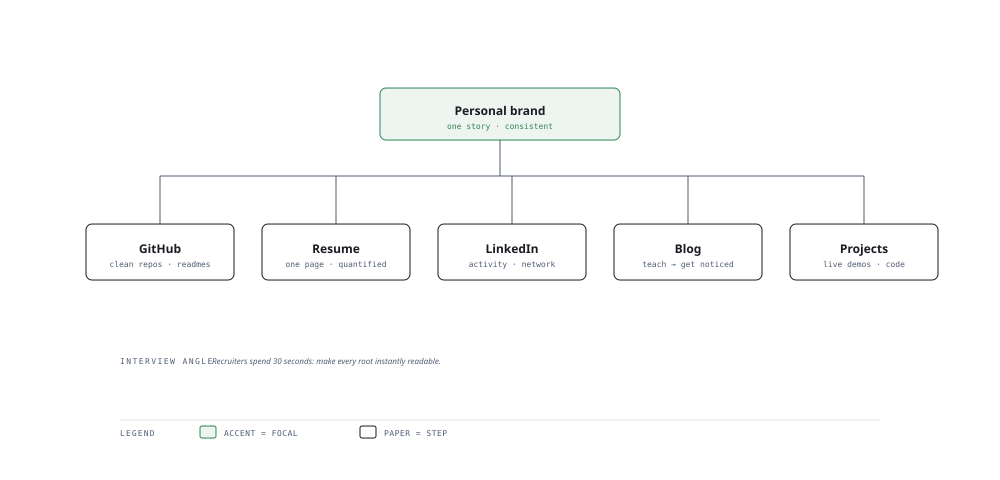

# Visual Notes — Your Personal Brand Trunk

> One diagram, the full picture. This page is meant to be glanced at before reading the chapters, and again before interviews.

# What the diagram shows

1. **Core** — Define who you are and the story you tell recruiters — the trunk.
1. **Channels** — GitHub shows code, resume summarises, LinkedIn networks, a blog teaches, projects prove.
1. **Feedback** — Each channel feeds traffic and credibility back to the trunk.

# Why this matters for placement

- Recruiters screen your GitHub and LinkedIn before your resume reaches a human.
- Consistent, opinionated, readable code reads more senior than buzzwords.

# Quick revision

- GitHub: clean READMEs, small focused repos, a visible streak of contributions.
- Resume: one page, quantified impact, keywords from the job description.
- LinkedIn: headline = role + proof; post build the network passively.
- A technical blog doubles as proof of communication — a senior skill.
- Quality over volume: 2 polished projects beat 10 half-built ones.

# Related chapters

- [GitHub profile optimization](01-github-profile-optimization.md)
- [Technical blogging](03-technical-blogging.md)
- [LinkedIn optimization](04-linkedin-optimization.md)
- [Portfolio website](06-portfolio-website.md)

---

**One-line answer for interviews:** *"GitHub, resume, LinkedIn, a blog and shipped projects all grow from one personal brand trunk."*
