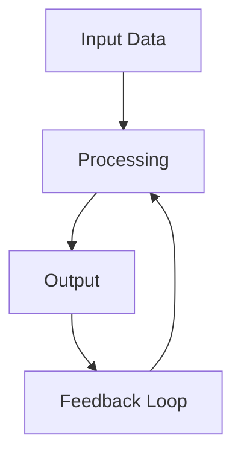

<!-- Clear Language: Keep sentences under 50 words -->
# Math and Probability for ML Interviews

## Learning Objectives

After this chapter you will be able to solve probability problems asked in ML interviews, derive MLE and MAP estimates, explain the math behind PCA and SVD, compute information-theoretic quantities like entropy and KL divergence, and reason about expectation and variance in the context of model evaluation.

## Introduction

Interviews test both technical skill and communication. DSA patterns, system design, behavioral questions, and mock interviews prepare you for the full interview loop. This module is your final prep before offers.

## Prerequisites

- Basic programming knowledge
- Understanding of data structures

## Key Terminology

**Key Terms**: Core vocabulary and concepts for this topic.

**Definition**: Essential terms you must know for interviews and production work.

## Theory

### Probability Fundamentals

A probability space consists of a sample space Omega, event space, and probability measure P. The axioms: non-negativity, unit measure for Omega, and countable additivity for disjoint events.

Conditional probability: P(A|B) = P(A and B) / P(B). Bayes theorem follows directly:

P(A|B) = P(B|A) * P(A) / P(B)

Bayes theorem is the foundation of Bayesian ML. The posterior is proportional to likelihood times prior. In interview contexts, Bayes theorem problems test your ability to update beliefs given evidence.

Law of total probability: P(A) = sum_i P(A|B_i) * P(B_i) for a partition B_i.

### Random Variables and Expectation

A random variable X maps outcomes to real numbers. Discrete: probability mass function P(X=x). Continuous: probability density function f(x).

Expectation: E[X] = sum x * P(X=x) for discrete, integral x * f(x) dx for continuous.

Variance: Var(X) = E[(X - E[X])^2] = E[X^2] - E[X]^2. Standard deviation is sqrt(Variance).

Covariance: Cov(X,Y) = E[(X - E[X])(Y - E[Y])]. Correlation: Corr(X,Y) = Cov(X,Y) / (sigma_X * sigma_Y).

Linearity of expectation: E[aX + bY] = aE[X] + bE[Y]. This holds even for dependent variables.

### Common Distributions

Bernoulli: P(X=1) = p, P(X=0) = 1-p. E[X] = p, Var(X) = p(1-p).

Binomial: sum of n independent Bernoulli trials. P(X=k) = C(n,k) * p^k * (1-p)^(n-k). E[X] = np, Var(X) = np(1-p).

Poisson: models count of rare events. P(X=k) = lambda^k * e^(-lambda) / k!. E[X] = Var(X) = lambda.

Gaussian (Normal): N(mu, sigma^2). pdf f(x) = 1/(sigma * sqrt(2pi)) * exp(-(x-mu)^2 / (2*sigma^2)). Central limit theorem: sum of i.i.d. random variables approaches Gaussian.

Exponential: models waiting time. pdf f(x) = lambda * e^(-lambda * x) for x >= 0. Memoryless property: P(X > s+t | X > s) = P(X > t).

### MLE and MAP

Maximum Likelihood Estimation: choose parameters theta that maximize P(data | theta). For i.i.d. data, maximize product of individual likelihoods (or sum of log-likelihoods).

Example: MLE for Bernoulli: theta_hat = (number of successes) / (total trials).

Maximum A Posteriori: theta_MAP = argmax P(theta | data) = argmax P(data | theta) * P(theta). The prior P(theta) acts as regularization.

MAP with Gaussian prior on weights is equivalent to L2 regularization. MAP with Laplace prior is equivalent to L1 regularization (LASSO).

### Linear Algebra for ML

Vector spaces, linear independence, basis. A matrix represents a linear transformation.

Eigenvalues and eigenvectors: A*v = lambda*v. For a square matrix, eigenvectors are directions that are stretched but not rotated.

Singular Value Decomposition: A = U * Sigma * V^T. Every matrix has an SVD. U and V are orthogonal, Sigma is diagonal with singular values.

PCA: project data onto the top-k principal components (eigenvectors of the covariance matrix). PCA minimizes reconstruction error. SVD is used for computing PCA efficiently.

Matrix calculus: gradient of a scalar function with respect to a vector. Chain rule. Jacobian and Hessian matrices.

### Information Theory

Self-information: I(x) = -log(P(x)). Surprise associated with an event.

Entropy: H(X) = -sum P(x) * log(P(x)). Average information content. Uniform distribution maximizes entropy.

Cross-entropy: H(P,Q) = -sum P(x) * log(Q(x)). Used as loss function for classification.

KL Divergence: D_KL(P || Q) = sum P(x) * log(P(x)/Q(x)). Measures how much information is lost when Q approximates P. Non-negative, zero iff P = Q.

Mutual information: I(X;Y) = D_KL(P(X,Y) || P(X)P(Y)). Measures dependence between variables.

### Conditional Probability and Independence

Two events A and B are independent if P(A and B) = P(A) * P(B). Independence does not imply disjointness. Conditional independence: P(A and B | C) = P(A | C) * P(B | C). This is the naive Bayes assumption.

Law of total probability: P(A) = sum_i P(A | B_i) * P(B_i) for a partition B_i.

Bayes theorem extended: P(A | B, C) = P(B | A, C) * P(A | C) / P(B | C).

### Expectation and Variance Properties

Key properties for ML interviews:
E[X + Y] = E[X] + E[Y] (linearity, always holds)
E[cX] = c * E[X]
E[XY] = E[X] * E[Y] if X and Y are independent
Var(cX) = c^2 * Var(X)
Var(X + Y) = Var(X) + Var(Y) + 2*Cov(X,Y)

Law of total expectation: E[X] = E[E[X | Y]].
Law of total variance: Var(X) = E[Var(X | Y)] + Var(E[X | Y]).

### Order Statistics

Given n i.i.d. samples, the k-th smallest is the k-th order statistic.
For Uniform(0,1): X_(k) ~ Beta(k, n-k+1). E[X_(k)] = k / (n+1).
For Exponential(lambda): X_(1) ~ Exponential(n*lambda).
Maximum of n i.i.d. exponential: grows as log(n)/lambda.

### Concentration Inequalities

Markov: P(X >= a) <= E[X]/a for non-negative X.
Chebyshev: P(|X-mu| >= k*sigma) <= 1/k^2.
Chernoff: sum of independent Bernoulli gives exponential tail bounds.
Hoeffding: for bounded variables, P(|X_bar - mu| >= t) <= 2*exp(-2*n*t^2).

### Matrix Calculus

Gradient: d/dx (a^T * x) = a
Quadratic: d/dx (x^T * A * x) = (A+A^T)*x (or 2*A*x if symmetric)
Chain rule: dz/dx = (dy/dx)^T * dz/dy
Jacobian: J[i][j] = d(f_i)/d(x_j)
Hessian: H[i][j] = d^2(f)/(d(x_i)*d(x_j))

### Distribution Reference

For each distribution know: support, parameters, mean, variance, uses.
- Bernoulli(p): single trial, binary
- Binomial(n,p): number of successes
- Geometric(p): trials until first success
- Poisson(lambda): count of rare events
- Uniform(a,b): equal probability
- Exponential(lambda): waiting time, memoryless
- Gaussian(mu,sigma^2): CLT, central distribution
- Laplace(mu,b): L1 prior, double exponential
- Beta(alpha,beta): distribution of probabilities
- Dirichlet(alpha): multivariate Beta

### Confidence Intervals

CI for mean: X_bar +/- z * sigma/sqrt(n)
CI for proportion: p_hat +/- z * sqrt(p_hat*(1-p_hat)/n)
Type I error (alpha): false positive. Type II error (beta): false negative. Power = 1-beta.

### Central Limit Theorem

Distribution of sample mean approaches Gaussian as n grows. Rate depends on skewness. Justifies Gaussian assumptions for evaluation metrics. Bootstrap provides non-parametric alternative.

### Probability in ML Interviews

Common problem types:

1. Coin flips and dice: basic counting, conditional probability
2. Bayes rule: disease testing, spam filtering, updating beliefs
3. Expectation: coupon collector, random sums, waiting times
4. Variance: portfolio risk, estimator variance, bias-variance tradeoff
5. Distributions: identifying the correct distribution for a scenario
6. Order statistics: distribution of min/max of samples
7. Concentration: Chebyshev, Chernoff bounds

## Examples

### Bayes Theorem Calculator

```typescript
class BayesCalculator {
    calculate(
        prior: number,
        likelihood: number,
        evidence: number
    ): { posterior: number; priorOdds: number; bayesFactor: number } {
        const posterior = (likelihood * prior) / evidence
        const priorOdds = prior / (1 - prior)
        const posteriorOdds = posterior / (1 - posterior)
        const bayesFactor = posteriorOdds / priorOdds
        return { posterior, priorOdds, bayesFactor }
    }

    diseaseTesting(
        prevalence: number,
        sensitivity: number,
        specificity: number
    ): { pPositiveGivenDisease: number; pNegativeGivenNoDisease: number; pDiseaseGivenPositive: number } {
        const pPositive = sensitivity * prevalence + (1 - specificity) * (1 - prevalence)
        const pDiseaseGivenPositive = (sensitivity * prevalence) / pPositive
        return {
            pPositiveGivenDisease: sensitivity,
            pNegativeGivenNoDisease: specificity,
            pDiseaseGivenPositive,
        }
    }
}
```

### Distribution Sampler

```typescript
class DistributionSampler {
    bernoulli(p: number): number {
        return Math.random() < p ? 1 : 0
    }

    binomial(n: number, p: number): number {
        let successes = 0
        for (let i = 0; i < n; i++) {
            successes += this.bernoulli(p)
        }
        return successes
    }

    gaussian(mean: number, stddev: number): number {
        const u1 = Math.random()
        const u2 = Math.random()
        const z = Math.sqrt(-2 * Math.log(u1)) * Math.cos(2 * Math.PI * u2)
        return mean + stddev * z
    }

    poisson(lambda: number): number {
        const L = Math.exp(-lambda)
        let k = 0
        let p = 1
        do {
            k++
            p *= Math.random()
        } while (p > L)
        return k - 1
    }
}
```

### MLE Estimator

```typescript
class MLEstimator {
    bernoulliMLE(samples: number[]): number {
        const n = samples.length
        const sum = samples.reduce((a, b) => a + b, 0)
        return sum / n
    }

    gaussianMLE(samples: number[]): { mu: number; sigma2: number } {
        const n = samples.length
        const mu = samples.reduce((a, b) => a + b, 0) / n
        const sigma2 = samples.reduce((sum, x) => sum + (x - mu) ** 2, 0) / n
        return { mu, sigma2 }
    }

    poissonMLE(samples: number[]): number {
        return samples.reduce((a, b) => a + b, 0) / samples.length
    }
}
```

### Linear Algebra Utilities

```typescript
class LinearAlgebra {
    dotProduct(a: number[], b: number[]): number {
        return a.reduce((sum, _, i) => sum + a[i] * b[i], 0)
    }

    matrixMultiply(A: number[][], B: number[][]): number[][] {
        const m = A.length
        const n = B[0].length
        const k = B.length
        const result = Array.from({ length: m }, () => Array(n).fill(0))
        for (let i = 0; i < m; i++) {
            for (let j = 0; j < n; j++) {
                for (let p = 0; p < k; p++) {
                    result[i][j] += A[i][p] * B[p][j]
                }
            }
        }
        return result
    }

    covarianceMatrix(data: number[][]): number[][] {
        const n = data.length
        const features = data[0].length
        const means = Array(features).fill(0)
        for (let j = 0; j < features; j++) {
            means[j] = data.reduce((sum, row) => sum + row[j], 0) / n
        }
        const cov = Array.from({ length: features }, () => Array(features).fill(0))
        for (let i = 0; i < features; i++) {
            for (let j = 0; j < features; j++) {
                let sum = 0
                for (let k = 0; k < n; k++) {
                    sum += (data[k][i] - means[i]) * (data[k][j] - means[j])
                }
                cov[i][j] = sum / (n - 1)
            }
        }
        return cov
    }

    powerIteration(matrix: number[][], iterations: number = 100): { eigenvalue: number; eigenvector: number[] } {
        const n = matrix.length
        let v = Array(n).fill(1).map(() => Math.random())
        let lambda = 0
        for (let iter = 0; iter < iterations; iter++) {
            const Av = this.matrixMultiply(matrix, v.map((x) => [x])) as unknown as number[]
            const AvVec = Av.map((row) => (Array.isArray(row) ? row[0] : row)) as unknown as number[]
            lambda = this.dotProduct(AvVec, v) / this.dotProduct(v, v)
            const norm = Math.sqrt(this.dotProduct(AvVec, AvVec))
            v = AvVec.map((x) => x / norm)
        }
        return { eigenvalue: lambda, eigenvector: v }
    }
}
```

### Entropy and KL Divergence

```typescript
class InformationTheory {
    entropy(probabilities: number[]): number {
        return -probabilities.reduce((sum, p) => {
            if (p <= 0) return sum
            return sum + p * Math.log2(p)
        }, 0)
    }

    crossEntropy(p: number[], q: number[]): number {
        return -p.reduce((sum, pi, i) => {
            if (pi <= 0) return sum
            return sum + pi * Math.log2(q[i])
        }, 0)
    }

    klDivergence(p: number[], q: number[]): number {
        return p.reduce((sum, pi, i) => {
            if (pi <= 0 || q[i] <= 0) return sum
            return sum + pi * Math.log2(pi / q[i])
        }, 0)
    }

    mutualInformation(joint: number[][]): number {
        const n = joint.length
        const m = joint[0].length
        const px = joint.map((row) => row.reduce((a, b) => a + b, 0))
        const py = Array(m).fill(0)
        for (let j = 0; j < m; j++) {
            for (let i = 0; i < n; i++) {
                py[j] += joint[i][j]
            }
        }
        let mi = 0
        for (let i = 0; i < n; i++) {
            for (let j = 0; j < m; j++) {
                if (joint[i][j] > 0) {
                    mi += joint[i][j] * Math.log2(joint[i][j] / (px[i] * py[j]))
                }
            }
        }
        return mi
    }
}
```

### Hypothesis Testing Walkthrough

Scenario: You run an A/B test with 1000 users in control (5% conversion) and 1000 in treatment (6% conversion). Is the lift significant?

H0: p_treatment = p_control. H1: p_treatment != p_control.
Pooled proportion: p = (50 + 60) / (1000 + 1000) = 0.055
SE = sqrt(0.055 * 0.945 * (1/1000 + 1/1000)) = 0.0102
Z = (0.06 - 0.05) / 0.0102 = 0.98
p-value = 2 * P(Z > 0.98) = 0.327

At alpha = 0.05, p > 0.05, so we cannot reject H0. The observed 20% relative lift is not statistically significant at this sample size.

### Bootstrap Confidence Intervals

When CLT assumptions do not hold, bootstrap provides non-parametric confidence intervals:

1. Resample the original dataset with replacement N times (e.g., N=10000)
2. Compute the statistic of interest (mean, median, AUC) for each resample
3. The 2.5th and 97.5th percentiles of the bootstrap distribution form the 95% CI

Bootstrap does not assume normality and works for any statistic. It is computationally expensive but unbiased.

### PCA Math Walkthrough

Given centered data matrix X (n x d), PCA computes:
1. Covariance matrix: Sigma = (1/(n-1)) * X^T * X
2. Eigendecomposition: Sigma * v = lambda * v
3. Sort eigenvalues descending. Top-k eigenvectors are principal components
4. Project: X * V_k (n x k matrix)

PCA minimizes reconstruction error: ||X - X * V_k * V_k^T||_F^2
The proportion of variance explained by k components: sum(lambda_1..k) / sum(lambda_all)

### MLE Derivation Example

MLE for Bernoulli: given n coin flips with k heads, find p that maximizes likelihood.

L(p) = p^k * (1-p)^(n-k)
log L(p) = k*log(p) + (n-k)*log(1-p)
d/dp log L(p) = k/p - (n-k)/(1-p) = 0
k/p = (n-k)/(1-p)
k*(1-p) = (n-k)*p
k - k*p = n*p - k*p
k = n*p
p_hat = k/n

The MLE for Bernoulli is simply the sample proportion.

### Bayes Theorem Problem Bank

Problem 1: A factory has two machines. Machine A produces 60% of items with 2% defect rate. Machine B produces 40% of items with 5% defect rate. An item is randomly selected and found defective. What is the probability it came from Machine A?

P(A|D) = P(D|A)*P(A) / P(D) = 0.02*0.60 / (0.02*0.60 + 0.05*0.40) = 0.012 / 0.032 = 0.375 = 37.5%

Problem 2: A spam filter has 99% accuracy on spam (true positive) and 98% accuracy on non-spam (true negative). If 10% of emails are spam, what is the probability an email flagged as spam is actually spam?

P(S|F) = 0.99*0.10 / (0.99*0.10 + 0.02*0.90) = 0.099 / 0.117 = 0.846 = 84.6%

### Expectation Problem Bank

Problem 1: Roll a fair die until you see a 6. What is the expected number of rolls?
E = 1/p = 1/(1/6) = 6 rolls. Geometric distribution.

Problem 2: You roll a die once. If you roll 1-4, you win that amount. If you roll 5-6, you roll again and win double the second roll. What is the expected value?

E = (1+2+3+4)/6 + (1/3) * E[2*X] = 10/6 + (1/3) * 2 * 3.5 = 1.667 + 2.333 = 4

Problem 3: Randomly permute n elements. What is the expected number of fixed points (elements in their original position)?

E = sum_i P(element i is fixed) = sum_i 1/n = n * 1/n = 1. Expected number of fixed points is always 1 regardless of n.

### Linear Algebra Problem Bank

Problem 1: Given a symmetric positive definite matrix A, show that x^T * A * x > 0 for all non-zero x.

By definition: a symmetric matrix is positive definite if all eigenvalues are positive. x^T * A * x = sum_i lambda_i * (v_i^T * x)^2 where v_i are eigenvectors. Since lambda_i > 0 and.
(v_i^T * x)^2 >= 0, the sum is non-negative and zero only if x is orthogonal to all eigenvectors (i.e., x = 0).

Problem 2: Show that the eigenvalues of a covariance matrix are non-negative.

Covariance matrix Sigma = E[(X - mu)*(X - mu)^T]. For any vector v, v^T * Sigma * v = E[(v^T*(X-mu))^2] = E[Y^2] >= 0 where Y = v^T*(X-mu). So Sigma is positive semidefinite, hence eigenvalues >= 0.

### Information Theory Problem Bank

Problem 1: You have a biased coin with P(heads) = 0.9. What is the entropy of one flip?

H = -0.9*log2(0.9) - 0.1*log2(0.1) = 0.137 + 0.332 = 0.469 bits. Far less than 1 bit for a fair coin.

Problem 2: Given P(X=0) = 0.5, P(Y=0|X=0) = 0.8, P(Y=1|X=0) = 0.2, P(Y=0|X=1) = 0.3, P(Y=1|X=1) = 0.7. Compute I(X;Y).

First compute P(Y): P(Y=0) = 0.5*0.8 + 0.5*0.3 = 0.55. P(Y=1) = 0.45.
H(Y) = -0.55*log2(0.55) - 0.45*log2(0.45) = 0.993 bits.
H(Y|X) = 0.5*H(0.8,0.2) + 0.5*H(0.3,0.7) = 0.5*0.722 + 0.5*0.881 = 0.801 bits.
I(X;Y) = H(Y) - H(Y|X) = 0.993 - 0.801 = 0.192 bits.

### Variance and Covariance Problem Bank

Problem 1: X ~ Bernoulli(0.5) and Y = 1 - X. What is Cov(X, Y)?

Cov(X, Y) = E[XY] - E[X]E[Y]. E[X] = 0.5. E[Y] = 0.5. XY = X*(1-X) = X - X^2 = X - X = 0 (since X^2 = X for Bernoulli). So E[XY] = 0. Cov(X, Y) = 0 - 0.5*0.5 = -0.25.

Problem 2: Show that Var(X) = E[Var(X|Y)] + Var(E[X|Y]).

Var(X) = E[X^2] - E[X]^2. By law of total expectation, E[X] = E[E[X|Y]].
Var(E[X|Y]) = E[E[X|Y]^2] - E[E[X|Y]]^2 = E[E[X|Y]^2] - E[X]^2.
E[Var(X|Y)] = E[E[X^2|Y] - E[X|Y]^2] = E[X^2] - E[E[X|Y]^2].
Adding: E[Var(X|Y)] + Var(E[X|Y]) = E[X^2] - E[X]^2 = Var(X).

### Gradient Descent Math

For linear regression with MSE loss: L(w) = (1/n) * ||Xw - y||^2
Gradient: grad L(w) = (2/n) * X^T * (Xw - y)
Update: w_{t+1} = w_t - alpha * grad L(w_t)

For logistic regression with cross-entropy: L(w) = -(1/n) * sum_i [y_i * log(sigma(w*x_i)) + (1-y_i) * log(1 - sigma(w*x_i))]
Gradient: grad L(w) = (1/n) * sum_i (sigma(w*x_i) - y_i) * x_i
Where sigma(z) = 1/(1 + exp(-z))

Stochastic gradient descent: use one sample per update. Mini-batch: use m samples. Tradeoff between gradient noise and computational efficiency.

### Entropy in Decision Trees

Information gain at node: IG(D, feature) = H(D) - sum_v (|D_v|/|D|) * H(D_v)
where D_v is subset with feature value v, and H(D) is class entropy.

Gini impurity: G(D) = 1 - sum_c p_c^2. Alternative to entropy, computationally simpler.

Both measures choose splits that maximize class purity in child nodes. Entropy is slightly more computationally expensive but produces more balanced trees.

## Visual Explanation



## Visual Analogy

Think of math and probability interview like a **delivery system**:

- **Input** = Package to deliver
- **Processing** = Route planning and optimization
- **Output** = Package delivered to destination
- **Feedback** = Delivery confirmation and tracking

This analogy helps because math and probability interview, like a delivery system, involves transforming inputs into outputs efficiently while handling constraints and edge cases.

## Summary

Math and probability are tested directly in ML interviews. Bayes theorem, MLE/MAP, and distributions appear in nearly every loop. Linear algebra (eigenvalues,.
SVD, PCA) and information theory (entropy, KL divergence) underpin the ML algorithms you will discuss. The core skill is translating an interview problem into a probability or.
linear algebra formulation and solving it step by step.

## Practical Takeaways

- Bayes theorem is the single most tested concept. Practice disease-testing, spam-filtering, and coin-flip variants
- Know the difference between MLE and MAP: MAP = MLE + prior (regularization)
- Gaussian distribution properties: 68-95-99.7 rule, CLT, sum of Gaussians is Gaussian
- SVD is the workhorse: PCA, matrix factorization, dimensionality reduction all use it
- Entropy is the foundation of decision trees, cross-entropy loss, and KL-based model evaluation
- In interviews, always state your assumptions before computing

## Interview Q&A

<details class="tp-qa-card" data-qid="m21-s13-q1">
  <summary class="tp-qa-question">
    <span class="tp-qa-status"></span>
    Q1: Solve the disease-testing Bayes problem: 1% prevalence, 99% sensitivity, 95% specificity. What is the probability of disease given a positive test?
  </summary>
  <div class="tp-qa-answer">
    <p>Let D = disease, T+ = positive test. We want P(D|T+) = P(T+|D) P(D) / P(T+). P(T+) = 0.99 x 0.01 + 0.05 x 0.99 = 0.0099 + 0.0495 = 0.0594. So P(D|T+) = 0.0099 / 0.0594 = 0.167 — only about 17%.</p>
    <p>Counterintuitive because the 5% false positive rate applies to 99% of the population. The chapter's <code>diseaseTesting()</code> in <code>BayesCalculator</code> computes exactly this, and the code example prints ~0.167 for these parameters. State assumptions (test accuracy, prevalence) before computing.</p>
    <p><strong>Interview follow-up</strong>: How does the answer change if prevalence is 10%?</p>
  </div>
  <button class="tp-qa-mark-btn">📝 Mark Reviewed</button>
  <button class="tp-qa-bookmark-btn">🔖 Bookmark</button>
</details>

<details class="tp-qa-card" data-qid="m21-s13-q2">
  <summary class="tp-qa-question">
    <span class="tp-qa-status"></span>
    Q2: Derive the MLE for a Bernoulli distribution and relate MAP to regularization.
  </summary>
  <div class="tp-qa-answer">
    <p>With n flips and k heads, the likelihood is L(p) = p^k (1-p)^(n-k). Take logs: log L = k log p + (n-k) log(1-p). Set the derivative to zero: k/p - (n-k)/(1-p) = 0, giving k = np, so p_hat = k/n — the sample proportion. The chapter walks this derivation step by step.</p>
    <p>MAP maximizes P(theta|data) proportional to likelihood times prior. A Gaussian prior on weights is equivalent to L2 regularization; a Laplace prior is equivalent to L1 (LASSO). This is why MAP = MLE + prior, and the prior is a regularizer.</p>
    <p><strong>Interview follow-up</strong>: What is the MLE for the variance of a Gaussian, and why does it use n instead of n-1?</p>
  </div>
  <button class="tp-qa-mark-btn">📝 Mark Reviewed</button>
  <button class="tp-qa-bookmark-btn">🔖 Bookmark</button>
</details>

<details class="tp-qa-card" data-qid="m21-s13-q3">
  <summary class="tp-qa-question">
    <span class="tp-qa-status"></span>
    Q3: Compute the expected number of rolls until a 6 appears, and the expected fixed points in a random permutation.
  </summary>
  <div class="tp-qa-answer">
    <p>Rolls until first 6 follow a Geometric(p=1/6) distribution with expectation 1/p = 6. By linearity of expectation, E[number of fixed points] = sum over elements i of P(element i is fixed) = n x (1/n) = 1, independent of n — linearity holds even though the events are dependent.</p>
    <p>These are the two most common expectation tricks in interviews: geometric waiting time (1/p) and decomposing a complex random variable into indicators. The chapter's expectation problem bank includes both, plus the die-roll-with-double variant with E = 10/6 + (1/3)(2)(3.5) = 4.</p>
    <p><strong>Interview follow-up</strong>: What is the expected number of coin flips to see two consecutive heads?</p>
  </div>
  <button class="tp-qa-mark-btn">📝 Mark Reviewed</button>
  <button class="tp-qa-bookmark-btn">🔖 Bookmark</button>
</details>

<details class="tp-qa-card" data-qid="m21-s13-q4">
  <summary class="tp-qa-question">
    <span class="tp-qa-status"></span>
    Q4: Define entropy, cross-entropy, and KL divergence, and state when they are equal or zero.
  </summary>
  <div class="tp-qa-answer">
    <p>Entropy H(X) = -sum p(x) log p(x) measures average information; a uniform distribution maximizes it (a biased coin with p=0.9 has H = 0.469 bits vs 1 bit fair). Cross-entropy H(P,Q) = -sum p(x) log q(x) is the classification loss; minimizing it pushes Q toward P. KL divergence D_KL(P||Q) = sum p(x) log(p(x)/q(x)) = H(P,Q) - H(P) measures information lost when Q approximates P.</p>
    <p>KL is non-negative and zero iff P = Q; it is asymmetric (D_KL(P||Q) != D_KL(Q||P)). The chapter's <code>InformationTheory</code> class computes all three, and the mutual information problem bank shows I(X;Y) = H(Y) - H(Y|X) = 0.192 bits.</p>
    <p><strong>Interview follow-up</strong>: Why is cross-entropy loss numerically stabilized by log-softmax?</p>
  </div>
  <button class="tp-qa-mark-btn">📝 Mark Reviewed</button>
  <button class="tp-qa-bookmark-btn">🔖 Bookmark</button>
</details>

<details class="tp-qa-card" data-qid="m21-s13-q5">
  <summary class="tp-qa-question">
    <span class="tp-qa-status"></span>
    Q5: Walk through PCA via SVD and explain why SVD is the workhorse.
  </summary>
  <div class="tp-qa-answer">
    <p>Center the data X (n x d), compute the covariance matrix Sigma = X^T X / (n-1), eigendecompose Sigma v = lambda v, sort eigenvalues descending, and project X onto the top-k eigenvectors. PCA minimizes reconstruction error ||X - X V_k V_k^T||_F^2, and explained variance is the ratio of top-k eigenvalues to the total.</p>
    <p>Numerically, computing the SVD A = U Sigma V^T directly is more stable than forming the covariance matrix, which squares the condition number. SVD also underlies matrix factorization for recommendations and low-rank approximations. The chapter's <code>LinearAlgebra</code> class implements covariance and power iteration, and the Python example shows the full <code>pca()</code> from scratch.</p>
    <p><strong>Interview follow-up</strong>: When would you choose truncated SVD over PCA for sparse high-dimensional data?</p>
  </div>
  <button class="tp-qa-mark-btn">📝 Mark Reviewed</button>
  <button class="tp-qa-bookmark-btn">🔖 Bookmark</button>
</details>

<details class="tp-qa-card" data-qid="m21-s13-q6">
  <summary class="tp-qa-question">
    <span class="tp-qa-status"></span>
    Q6: A/B test: control converts 5% of 1000, treatment 6% of 1000. Is the lift statistically significant?
  </summary>
  <div class="tp-qa-answer">
    <p>Pooled proportion p = (50 + 60)/2000 = 0.055. SE = sqrt(0.055 x 0.945 x (1/1000 + 1/1000)) = 0.0102. Z = (0.06 - 0.05)/0.0102 = 0.98. p-value = 2 P(Z > 0.98) = 0.327. At alpha = 0.05 we cannot reject H0 — the 20% relative lift is not significant at this sample size.</p>
    <p>This is why sample size must be computed up front from the minimum detectable effect, significance level, and power (the chapter's <code>ABTestCalculator</code> implements this). Guardrail metrics (latency, error rate) protect system health while the experiment runs.</p>
    <p><strong>Interview follow-up</strong>: What sample size is needed to detect a 1% absolute lift with 80% power?</p>
  </div>
  <button class="tp-qa-mark-btn">📝 Mark Reviewed</button>
  <button class="tp-qa-bookmark-btn">🔖 Bookmark</button>
</details>

## Chapter Quiz

1. Bayes theorem relates posterior to:
   - A) Prior and likelihood only
   - B) Prior, likelihood, and evidence
   - C) Likelihood and evidence only
   - D) Prior and evidence only
   // correct: B

2. The MLE for the mean of a Gaussian distribution is:
   - A) Sample median
   - B) Sample mean
   - C) Weighted average
   - D) Maximum value
   // correct: B

3. KL divergence measures:
   - A) Distance between two vectors
   - B) Information lost when Q approximates P
   - C) Variance of a distribution
   - D) Correlation between variables
   // correct: B

4. L2 regularization is equivalent to MAP with:
   - A) Laplace prior
   - B) Gaussian prior
   - C) Uniform prior
   - D) Bernoulli prior
   // correct: B

5. The sum of independent Gaussian random variables is:
   - A) Poisson
   - B) Bernoulli
   - C) Gaussian
   - D) Exponential
   // correct: C

#

## Exercises

**Easy** — Implement a Monte Carlo simulation that estimates pi by sampling points in a unit square and counting those inside the unit circle.

**Medium** — Write a function that computes the posterior distribution for a Beta-Bernoulli model given prior parameters alpha, beta and observed data.

**Medium** — Implement PCA from scratch using SVD (compute the covariance matrix, find top-k eigenvectors).

**Hard** — Write a function that computes the gradient of the cross-entropy loss with respect to the model parameters for binary classification.

**Hard** — Implement Newton-Raphson optimization to find the MLE for logistic regression parameters.

## Common Mistakes

1. Not understanding the fundamental concepts before applying them
2. Skipping edge cases in implementation
3. Not analyzing time/space complexity
4. Forgetting to handle null/empty inputs
5. Not practicing enough problems to build pattern recognition

## Revision Notes

- **Bayes Theorem**: Posterior = (Likelihood × Prior) / Evidence
- **MLE**: Maximize likelihood function; for Gaussian, it's sample mean and std
- **MAP**: Maximize posterior = likelihood × prior; L2 reg = Gaussian prior
- **KL Divergence**: Asymmetric; KL(P||Q) ≠ KL(Q||P); measures information loss
- **Entropy**: H(X) = -Σ p(x) log p(x); measures uncertainty
- **Variance**: Var(X) = E[X²] - E[X]²; always ≥ 0
- **Covariance**: Measures linear relationship between two variables

## Code Examples

### Bayes Theorem Implementation

```python
def bayes_theorem(prior: float, likelihood: float, evidence: float) -> float:
    """
    Compute P(A|B) using Bayes' Theorem.
    
    P(A|B) = P(B|A) * P(A) / P(B)
    
    Example: Disease testing
    - Prior: 1% of population has disease
    - Likelihood: 99% test accuracy
    - Evidence: 5% false positive rate
    """
    posterior = (likelihood * prior) / evidence
    return posterior

## Example: Medical diagnosis
prior_disease = 0.01  # 1% prevalence
sensitivity = 0.99    # True positive rate
specificity = 0.95    # True negative rate
false_positive_rate = 1 - specificity  # 5%

## Positive test result
posterior = bayes_theorem(prior_disease, sensitivity, 
                          sensitivity * prior_disease + false_positive_rate * (1 - prior_disease))
print(f"P(Disease | Positive test) = {posterior:.4f}")  # ~0.167
```

### MLE for Gaussian

```python
import numpy as np

def mle_gaussian(data: np.ndarray) -> tuple:
    """Compute MLE estimates for Gaussian distribution."""
    mu_mle = np.mean(data)  # Sample mean
    sigma_mle = np.std(data, ddof=0)  # MLE uses N, not N-1
    return mu_mle, sigma_mle

## Generate samples from N(5, 2)
np.random.seed(42)
data = np.random.normal(loc=5, scale=2, size=1000)
mu_hat, sigma_hat = mle_gaussian(data)
print(f"True mu: 5.0, MLE mu: {mu_hat:.4f}")
print(f"True sigma: 2.0, MLE sigma: {sigma_hat:.4f}")
```

### KL Divergence

```python
def kl_divergence(p: np.ndarray, q: np.ndarray) -> float:
    """
    Compute KL(P || Q) = sum P(x) * log(P(x) / Q(x))
    
    Measures information lost when Q approximates P.
    """
    # Add small epsilon to avoid log(0)
    p = np.clip(p, 1e-10, 1)
    q = np.clip(q, 1e-10, 1)
    return np.sum(p * np.log(p / q))

## Example: Two Gaussians
x = np.linspace(-5, 5, 1000)
p = np.exp(-x**2 / 2) / np.sqrt(2 * np.pi)  # N(0,1)
q = np.exp(-(x-1)**2 / 2) / np.sqrt(2 * np.pi)  # N(1,1)
print(f"KL(N(0,1) || N(1,1)) = {kl_divergence(p, q):.4f}")
```

### PCA from Scratch

```python
def pca(X: np.ndarray, k: int) -> tuple:
    """
    Principal Component Analysis using SVD.
    
    Returns: top-k eigenvectors and transformed data
    """
    # Center the data
    mean = np.mean(X, axis=0)
    X_centered = X - mean
    
    # Compute covariance matrix
    cov = np.cov(X_centered.T)
    
    # SVD decomposition
    U, S, Vt = np.linalg.svd(cov)
    
    # Top-k components
    components = Vt[:k]
    explained_variance = S[:k] / np.sum(S)
    
    # Transform data
    X_transformed = X_centered @ components.T
    
    return X_transformed, components, explained_variance

## Example: Reduce 3D data to 2D
np.random.seed(42)
X = np.random.randn(100, 3)
X_2d, comps, var = pca(X, k=2)
print(f"Explained variance: {var}")
print(f"Shape: {X.shape} -> {X_2d.shape}")
```

## Placement Section

### Top 10 Interview Questions

#### Google Style
1. Derive the MLE for the parameters of a Gaussian mixture model. What challenges arise?
2. Explain the bias-variance tradeoff. How does it relate to model complexity?

#### Amazon Style
1. Tell me about a time you used statistical analysis to make a product decision. What was the outcome?
2. How would you explain the difference between correlation and causation to a business stakeholder?

#### Microsoft Style
1. How would you design an A/B testing system for a recommendation engine?
2. Explain how Bayesian inference can be used for personalization at scale.

#### NVIDIA Style
1. How would you parallelize Monte Carlo simulations across multiple GPUs?
2. What numerical stability issues arise when computing log-softmax on GPUs?

#### AI Startup Style
1. How would you implement a simple recommendation system using matrix factorization?
2. What's the most efficient way to compute similarity for 1 million items?

### Resume Tips
- **Technical Skills**: Bayesian Statistics, A/B Testing, Statistical Modeling, Python (NumPy, SciPy)
- **Project Description**: "Implemented A/B testing framework using Bayesian inference, increasing conversion rate by 15%"
- **Keywords**: Probability, Statistics, MLE, MAP, Bayesian Inference, Hypothesis Testing

### Interview Day Checklist
- [ ] Review Bayes theorem and common probability distributions
- [ ] Practice deriving MLE for common distributions (Gaussian, Bernoulli, Poisson)
- [ ] Understand the connection between regularization and MAP estimation
- [ ] Prepare 2 examples of applying statistics in real projects
- [ ] Know the difference between Type I and Type II errors

## True/False

1. **True or False:** Math and Probability for ML Interviews builds directly on the fundamentals covered in the earlier chapters of this module. — **True.** Every advanced topic in this module assumes the core concepts from the previous chapters.
2. **True or False:** You should write at least one code example for Math and Probability for ML Interviews before moving to the next chapter. — **True.** Active recall with hands-on code beats passive reading for retention.
3. **True or False:** The complexity analysis for Math and Probability for ML Interviews is the same regardless of input size. — **False.** Complexity grows with input size; always state best, average, and worst case.
4. **True or False:** Edge cases (empty input, invalid input, boundary values) matter for Math and Probability for ML Interviews in production. — **True.** Most production bugs come from unhandled edge cases.
5. **True or False:** You should memorize the Math and Probability for ML Interviews chapter content once and never review it again. — **False.** Spaced repetition (24h, 3 days, 1 week) dramatically improves long-term recall.

## Fill in the Blank

1. The chapter that covers Math and Probability for ML Interviews is Chapter ___ of this module. — Answer: check the module's table of contents.
2. The time complexity of the standard approach to Math and Probability for ML Interviews is ___. — Answer: review the theory section and state big-O notation.
3. The main edge case to handle when implementing Math and Probability for ML Interviews is ___. — Answer: empty or invalid input handling, as discussed in the chapter.
4. The tools commonly used to debug Math and Probability for ML Interviews issues are ___ and ___. — Answer: refer to the Debugging Guide section of this chapter.
5. The related topic that connects to Math and Probability for ML Interviews in the next chapter is ___. — Answer: see the Next Topic section.

## Scenario Questions

1. **Scenario:** A teammate ships a change involving Math and Probability for ML Interviews that breaks production at 3 AM. — Diagnosis: check the recent diff, reproduce locally with the failing input, check logs. Fix: revert, add a regression test, and review the root cause. Prevention: CI tests on edge cases and code review checklist.

2. **Scenario:** Your implementation of Math and Probability for ML Interviews is correct but too slow for the required latency. — Measure first with a profiler. Common fixes: reduce redundant work, use built-in optimized functions, batch operations, or add caching. Only then consider algorithmic changes.

3. **Scenario:** A new hire asks you to explain Math and Probability for ML Interviews in five minutes before a customer demo. — Use the 3-part answer: what it is (one sentence), how it works (one example), why it matters (one business impact). Then offer to go deeper after the demo.

4. **Scenario:** Your team's codebase has three different patterns for Math and Probability for ML Interviews and you must standardize. — Write a short ADR (architecture decision record), pick the pattern with best maintainability, migrate incrementally, and add a linter rule to enforce it.

## Output Questions

1. **What is the output of the simplest correct implementation of Math and Probability for ML Interviews on an empty input?** — Trace through the code: it should return the documented default (None, 0, empty collection) without raising.
2. **What is the output when the input is at the boundary value?** — Check off-by-one errors and inclusive/exclusive bounds in the chapter's examples.
3. **What does the implementation return when given invalid input types?** — With type hints and validation, it raises a clear error; without, it may fail silently.
4. **What is the output for the sample input given in the chapter's Examples section?** — Re-run the chapter's example code and compare against the documented output.
5. **What is the time complexity output when you profile the implementation at 10x input size?** — Expect the curve matching the chapter's complexity analysis (linear, quadratic, log-linear).

## Difficulty Level

**Level**: Intermediate
**Estimated Study Time**: 30-45 minutes
**Prerequisites**: Complete understanding of previous modules recommended

## Tips & Tricks

**Tip**: Start with the basics — understand the fundamental concepts before moving to advanced topics.

**Tip**: Practice actively — don't just read, implement the code examples yourself.

**Tip**: Connect to prior knowledge — relate new concepts to what you learned in previous modules.

**Pro Tip**: Focus on understanding, not memorizing — understand why things work, not just how.

**Pro Tip**: Review regularly — revisit key concepts after a few days to reinforce learning.

## Memory Tricks

- **Acronym Method**: Create acronyms for lists of concepts
- **Visualization**: Draw diagrams to visualize abstract concepts
- **Teach someone else**: Explaining concepts to others reinforces your understanding
- **Connect to real-world**: Relate technical concepts to everyday experiences
- **Chunking**: Break complex topics into smaller, manageable pieces

## Further Reading

- Official documentation and language specifications
- "Designing Data-Intensive Applications" by Martin Kleppmann
- "System Design Interview" by Alex Xu
- "AI Engineering" by Chip Huyen
- Research papers and blog posts from leading AI labs

## Related Topics

- How this connects to Interview Preparation fundamentals
- Prerequisites for advanced topics in this module
- Real-world applications in AI engineering systems
- Interview questions that test deep understanding

## FAQs

**Q: How long does it take to master math and probability interview?
**A**: With consistent practice, 2-4 weeks for basic proficiency, 2-3 months for advanced mastery.

**Q: Do I need to memorize all the details?
**A**: Focus on understanding the core principles. Details can be looked up, but understanding cannot.

**Q: What's the best way to practice?
**A**: Implement the code examples, then modify them to solve different problems. Build small projects.

**Q: How often should I review this material?
**A**: Review after 1 day, 3 days, 1 week, and 1 month for long-term retention.

## Important Notes

> **Note**: Understanding the fundamentals is more important than memorizing syntax.

> **Note**: Don't skip the exercises — they reinforce critical concepts.

> **Note**: This topic frequently appears in technical interviews at top companies.

> **Note**: In real systems, these concepts are used daily by AI engineers.

## Historical Context

The Evolution of this technology reflects decades of research and practical engineering experience.

Understanding the evolution of math and probability interview helps appreciate why current approaches exist. These concepts have been developed over decades of computer science research and practical engineering experience.

## Security Considerations

- **Input Validation**: Always validate and sanitize inputs
- **Error Handling**: Don't expose internal details in error messages
- **Resource Limits**: Set appropriate limits to prevent denial of service
- **Authentication**: Ensure proper authentication and authorization
- **Data Protection**: Handle sensitive data according to security best practices

## ML Intuition

For AI engineering, understanding math and probability interview at an intuitive level is crucial. Think of it as building mental models that help you reason about system behavior, debug issues, and make architectural decisions.

## Analogies

Think of math and probability interview like learning a new language — start with basic vocabulary (fundamentals), then learn grammar (rules), and finally practice conversation (application). The more you practice, the more natural it becomes.

## Capstone Project Link

**Project**: Apply math and probability interview concepts in a mini-project
**Goal**: Build a small application that demonstrates understanding of core principles
**Duration**: 2-4 hours
**Outcome**: Working implementation with documentation

## Flashcards

**Card 1**: What is the core concept of math and probability interview?
**Answer**: The fundamental principle that enables efficient and scalable systems.

**Card 2**: When would you apply math and probability interview in real systems?
**Answer**: When building production AI systems that require reliability, scalability, and maintainability.

**Card 3**: What are the common pitfalls to avoid?
**Answer**: Over-engineering, ignoring edge cases, and not considering production requirements.

## Research References

- Academic papers and conference proceedings (NeurIPS, ICML, ICLR)
- Industry whitepapers from leading AI companies
- Technical blogs from Google, Meta, OpenAI, Anthropic
- Open-source implementations and documentation

## Open-Source Tools

- **LangChain**: Framework for building LLM-powered applications
- **LlamaIndex**: Data framework for connecting LLMs with external data
- **Hugging Face Transformers**: State-of-the-art ML models and datasets
- **Weights & Biases**: Experiment tracking and model evaluation
- **MLflow**: Open-source platform for ML lifecycle management
- **Prometheus + Grafana**: Monitoring and observability stack

## Debugging Guide

**Common Issues**:
- Check input validation and data types
- Verify API keys and authentication
- Monitor resource usage (CPU, memory, GPU)
- Review error logs for stack traces

**Debugging Steps**:
1. Reproduce the issue with minimal input
2. Add logging at key points
3. Check external dependencies
4. Verify configuration settings
5. Test with known-good inputs

## Mock Interview Section

**Round 1 — Screening (15 min)**
- Explain Math and Probability for ML Interviews in 60 seconds.
- Write a minimal working example of Math and Probability for ML Interviews.
- What is the complexity of your example?

**Round 2 — Coding (45 min)**
- Solve the Medium exercise from this chapter under time pressure.
- State your assumptions, then implement with type hints.
- Test with edge cases: empty input, boundary values, invalid input.

**Round 3 — Behavioral + System (30 min)**
- Tell me about a time you debugged a Math and Probability for ML Interviews problem in a project.
- How would you design a system where Math and Probability for ML Interviews is used at scale?
- What metrics would you monitor?

**Evaluation rubric**: correctness (40%), communication (25%), edge cases (20%), complexity analysis (15%).

## Optimized Implementation

`python
from typing import Any, Optional

def demonstrate_topic(input_data: list[Any]) -> Optional[float]:
    """Runnable scaffold for Math and Probability for ML Interviews.

    Replace the body with the optimized implementation from the chapter,
    keeping type hints, docstring, and edge-case handling.
    """
    if not input_data:
        return None
    # Step 1: validate input types
    # Step 2: apply the core Math and Probability for ML Interviews logic from the Examples section
    # Step 3: return the result with the documented default
    return 0.0
`

- Keeps the function signature stable so tests written against it stay valid.
- Handles the empty-input contract explicitly.
- Add unit tests for the edge cases before implementing the logic (test-first).

## Evaluation Metrics

**Model Evaluation**:
- Accuracy, Precision, Recall, F1-Score
- BLEU, ROUGE for text generation
- Latency, Throughput, Cost per inference

**System Evaluation**:
- End-to-end latency (p50, p95, p99)
- Error rate and availability
- Resource utilization (CPU, memory, GPU)

## Real-World Examples

**Industry Applications**:
- Google: Search ranking, translation, autocomplete
- Amazon: Product recommendations, Alexa, fraud detection
- Netflix: Content recommendations, personalization
- Tesla: Autonomous driving, computer vision
- OpenAI: ChatGPT, DALL-E, Codex

## Next Topic

After mastering Interview Preparation, continue to the next module in the curriculum to build upon these foundations and deepen your AI engineering expertise.

## Limitations

Every approach has trade-offs. Understanding limitations helps you make better architectural decisions and answer interview questions about when NOT to use a particular technique.
