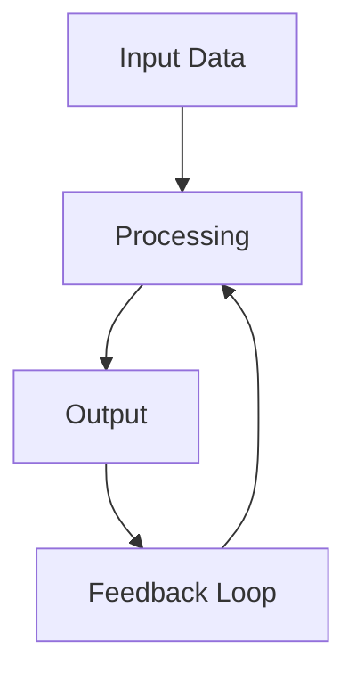

<!-- Clear Language: Keep sentences under 50 words -->
# ML System Design: Recommendation Systems and Model Serving

## Learning Objectives

After this chapter you will be able to design a production recommendation system from data ingestion to serving, architect a model serving platform with GPU scaling and.
autoscaling, design a feature store that serves training and inference with consistent point-in-time lookups, plan A/B experiments at scale, and reason about tradeoffs in ML pipeline architecture.

## Introduction

Interviews test both technical skill and communication. DSA patterns, system design, behavioral questions, and mock interviews prepare you for the full interview loop. This module is your final prep before offers.

## Prerequisites

- Basic programming knowledge
- Understanding of data structures

## Key Terminology

**Key Terms**: Core vocabulary and concepts for this topic.

**Definition**: Essential terms you must know for interviews and production work.

## Theory

### Design of a Recommendation System

Recommendation systems are the most common ML system design question. A complete design covers data pipeline, feature engineering, model training, serving, and evaluation.

Requirements gathering: DAU (daily active users), item catalog size, latency SLA (p99 < 200ms), update frequency (real-time vs batch), scale (millions of users, billions of items).

Data pipeline: user interactions (clicks, views, purchases) stream through Kafka/Kinesis. Batch jobs compute user and item features in Spark/Flink. Real-time features are computed on the fly.

Two-stage architecture: candidate generation (retrieval) followed by ranking. Candidate generation uses collaborative filtering (matrix factorization), content-based (embedding similarity), or graph-based approaches. Ranking uses a deep neural network with cross features.

Cold start: new users get popularity-based recommendations, new items get content-based. Explore-exploit via epsilon-greedy or Thompson sampling.

### Feature Store Design

A feature store decouples feature computation from model training and serving. Key requirements:

- Point-in-time correctness: training features must match what was known at prediction time
- Low-latency serving: feature lookups in under 10ms
- High throughput: support millions of predictions per second
- Consistency: online and offline features produce the same values

Architecture: offline store (Parquet in S3 for training), online store (Redis/DynamoDB for serving). Feature computation is a streaming job (Flink) that writes to both stores.

### Model Serving Platform

Design a platform that hosts hundreds of models serving millions of predictions per second.

Key components:
- Model registry: stores model artifacts with versioning, metadata, lineage
- Inference workers: containers that load model weights and run inference
- Router: maps model name to the correct inference worker pool
- Autoscaler: scales workers based on request queue depth and GPU utilization
- Load balancer: distributes requests across workers
- Cache: caches frequent inference results (query-level caching)

GPU serving challenges: GPU memory is limited and expensive. Models must be loaded and unloaded dynamically. Batching improves throughput but adds latency. Triton Inference Server and TorchServe are common platforms.

### A/B Testing at Scale

Design experiments that compare model versions statistically.

Key concepts:
- Randomization unit: user, session, or request. User-level avoids leakage but reduces sample size
- Metrics: offline (AUC, log loss) vs online (CTR, revenue, latency, engagement)
- Statistical significance: t-test, sequential testing, Bayesian methods
- Sample size calculation: minimum detectable effect, power, significance level
- Guardrail metrics: metrics that should not degrade (latency, error rate, uniques)

### Two-Stage Recommendation Architecture

The standard architecture separates retrieval from ranking for efficiency.

Stage 1 (Candidate Generation): retrieve hundreds of candidates from millions of items. Methods include:
- Matrix factorization: user-item interaction matrix decomposed into latent factors
- Two-tower DNN: user tower and item tower produce embeddings, nearest neighbor search (ANN) retrieves candidates
- Graph-based: random walk on user-item interaction graph (PinSage, Node2Vec)
- Location-based: for geographically relevant items

Stage 2 (Ranking): score hundreds of candidates with a complex model. Features include:
- User features, item features, context features
- Cross features: user-embedding * item-embedding interaction
- Position features: position bias correction
- Context features: time of day, device, location

The ranking model is typically a deep neural network with wide-and-deep architecture or DCN (Deep and Cross Network). Training uses pointwise (regression), pairwise (ranking loss), or listwise (NDCG) objectives.

### Online Learning and Freshness

User preferences change over time. Online learning updates model parameters incrementally as new interactions arrive.

Approaches:
- Full retraining: daily or hourly. Simple but expensive
- Incremental update: update embeddings only for affected users/items. Cheaper
- Online learning: FTRL (Follow The Regularized Leader) for logistic regression. Used in Google Ads
- Bandit algorithms: Thompson sampling, LinUCB for explore-exploit

Freshness SLA: how quickly new interactions affect recommendations. Real-time: seconds (click -> update embedding). Near-real-time: minutes. Batch: hours.

### Model Evaluation Framework

Offline metrics: AUC, NDCG@K, Recall@K, Precision@K, MRR. Offline metrics must correlate with online metrics. Correlations vary by domain and should be validated.

Online metrics: CTR, engagement time, revenue, retention, user satisfaction (surveys).

Counterfactual evaluation (IPS, doubly robust): estimate online metrics from logged data without running A/B tests. Corrects for position bias and selection bias.

### Feature Engineering at Scale

Feature types:
- Sparse: categorical features with high cardinality (user ID, item ID, query). Embedded to dense vectors
- Dense: numerical features (price, rating, time since last click). Normalized, winzorized
- Sequence: user action history. Processed by RNN or transformer

Feature computation pipeline:
- Batch features: compute daily in Spark, write to feature store
- Streaming features: Flink processes event stream, updates feature store in real-time
- Nearline features: micro-batch every few minutes for medium freshness

Feature validation: range checks, null rate monitoring, distribution drift detection (PSI, KS test).

### Distributed Training for Recommendation

Recommendation models have large embedding tables that do not fit on one machine. Distributed training strategies:

- Model parallelism: embedding tables split across workers. Each worker handles a subset of features. All-to-all communication for embedding lookup
- Data parallelism: each worker has full model copy, different data partitions. Gradients synchronized via all-reduce
- Hybrid: embeddings are model-parallel, dense layers are data-parallel

Parameter servers handle distributed embedding storage. Each server holds a shard of the embedding table. Workers pull embeddings from servers during forward pass, push gradients during backward pass.

### Model Serving Architecture

Two-phase serving: candidate generation and ranking run in separate services.

Candidate generation service: holds ANN index (FAISS, ScaNN) for approximate nearest neighbor search. Updated incrementally as new items are added.

Ranking service: loads the ranking model (often a DNN). Multiple model versions run simultaneously for A/B testing. Batching across requests improves GPU utilization.

Caching strategy:
- Query-level cache: identical requests return cached result (low hit rate)
- User-level cache: popular user recommendation cached (medium hit rate)
- Item-level cache: popular item embeddings cached (high hit rate)

### Monitoring and Alerting

System metrics: request latency (p50, p95, p99), throughput (QPS), error rate, GPU utilization.

Data metrics: feature freshness, null rate, distribution drift, prediction stability.

Model metrics: online CTR/engagement (hourly), offline AUC (daily).

Alerting: p99 latency > SLA threshold for 5 minutes, null rate > 2%, AUC drop > 0.01.

Runbook: each alert must have a documented response procedure.

### Two-Stage Recommendation Architecture

Standard architecture separates retrieval from ranking.

Stage 1 (Candidate Generation): retrieve hundreds from millions. Methods include:
- Matrix factorization: user-item interaction matrix decomposed
- Two-tower DNN: user and item towers, ANN retrieval
- Graph-based: random walk on interaction graph (PinSage)
- Location-based: for geographically relevant items

Stage 2 (Ranking): score hundreds with complex model. Features include:
- User, item, context features
- Cross features: user-embedding * item-embedding interaction
- Position features: position bias correction
- Deep neural network with wide-and-deep or DCN architecture

### Online Learning and Freshness

Approaches:
- Full retraining: daily/hourly. Simple but expensive
- Incremental update: update affected embeddings only
- Online learning: FTRL for logistic regression (Google Ads)
- Bandit: Thompson sampling, LinUCB

Freshness SLA: real-time (seconds), near-real-time (minutes), batch (hours).

### Model Evaluation

Offline metrics: AUC, NDCG@K, Recall@K, Precision@K, MRR.
Online metrics: CTR, engagement, revenue, retention.

Counterfactual evaluation (IPS, doubly robust): estimate online metrics from logged data without A/B tests.

### Feature Engineering at Scale

Feature types:
- Sparse categorical: embedded to dense vectors
- Dense numerical: normalized, winzorized
- Sequence: user action history via RNN/transformer

Pipeline: batch (Spark, daily), streaming (Flink, real-time), nearline (micro-batch).

Validation: range checks, null rate, distribution drift (PSI, KS test).

### Distributed Training

Recommendation models have large embedding tables. Strategies:
- Model parallelism: embeddings split across workers
- Data parallelism: each worker full model, different data
- Hybrid: embeddings model-parallel, dense layers data-parallel

Parameter servers hold embedding shards. Workers pull/push gradients.

### Model Serving Architecture

Candidate generation: ANN index (FAISS, ScaNN). Updated incrementally.

Ranking: DNN model. Multiple versions for A/B testing. Batching improves GPU utilization.

Caching:
- Query-level: identical requests (low hit rate)
- User-level: popular users (medium hit rate)
- Item-level: popular embeddings (high hit rate)

### Monitoring and Alerting

System: latency p50/p95/p99, throughput, error rate, GPU utilization.
Data: feature freshness, null rate, distribution drift.
Model: online CTR hourly, offline AUC daily.

Alert thresholds: p99 > SLA for 5min, null rate > 2%, AUC drop > 0.01.

### ML Pipeline Architecture

End-to-end ML pipeline:
1. Data ingestion: streaming (Kafka) + batch (hourly/daily)
2. Data validation: schema checks, distribution monitoring (Great Expectations, TFX)
3. Feature engineering: Spark jobs or streaming Flink jobs
4. Training: distributed training (PyTorch DDP, Horovod), hyperparameter tuning
5. Model evaluation: offline metrics, canary deployment, shadow scoring
6. Deployment: blue-green or progressive rollout
7. Monitoring: prediction drift, feature drift, data quality, latency, error rates

## Examples

### Feature Store

```typescript
interface FeatureValue {
    value: number | string | number[]
    timestamp: number
}

class FeatureStore {
    private onlineStore: Map<string, Map<string, FeatureValue>> = new Map()
    private offlineStore: { entityId: string; featureName: string; value: FeatureValue }[] = []

    writeFeature(entityId: string, featureName: string, value: FeatureValue): void {
        if (!this.onlineStore.has(entityId)) {
            this.onlineStore.set(entityId, new Map())
        }
        this.onlineStore.get(entityId)!.set(featureName, value)
        this.offlineStore.push({ entityId, featureName, value })
    }

    readFeature(entityId: string, featureName: string): FeatureValue | undefined {
        return this.onlineStore.get(entityId)?.get(featureName)
    }

    getTrainingSnapshot(
        entityIds: string[],
        featureNames: string[],
        asOfTimestamp: number
    ): Map<string, Map<string, FeatureValue>> {
        const snapshot = new Map<string, Map<string, FeatureValue>>()
        for (const entityId of entityIds) {
            const entityFeatures = new Map<string, FeatureValue>()
            for (const featureName of featureNames) {
                const versions = this.offlineStore
                    .filter((r) => r.entityId === entityId && r.featureName === featureName && r.value.timestamp <= asOfTimestamp)
                    .sort((a, b) => b.value.timestamp - a.value.timestamp)
                if (versions.length > 0) {
                    entityFeatures.set(featureName, versions[0].value)
                }
            }
            snapshot.set(entityId, entityFeatures)
        }
        return snapshot
    }
}
```

### Recommendation Pipeline Simulator

```typescript
interface UserProfile {
    userId: string
    embedding: number[]
    recentClicks: string[]
}

interface Item {
    itemId: string
    embedding: number[]
    category: string
    popularity: number
}

class RecommendationSystem {
    private users: Map<string, UserProfile> = new Map()
    private items: Item[] = []
    private itemEmbeddings: Map<string, number[]> = new Map()

    addItem(item: Item): void {
        this.items.push(item)
        this.itemEmbeddings.set(item.itemId, item.embedding)
    }

    addUser(user: UserProfile): void {
        this.users.set(user.userId, user)
    }

    candidateGeneration(userId: string, count: number = 100): Item[] {
        const user = this.users.get(userId)
        if (!user) return this.items.slice(0, count)
        const scored = this.items.map((item) => ({
            item,
            score: this.cosineSimilarity(user.embedding, item.embedding),
        }))
        scored.sort((a, b) => b.score - a.score)
        return scored.slice(0, count).map((s) => s.item)
    }

    rerank(userId: string, candidates: Item[], topK: number = 10): Item[] {
        const user = this.users.get(userId)
        if (!user) return candidates.slice(0, topK)
        const scored = candidates.map((item) => {
            const embeddingScore = this.cosineSimilarity(user.embedding, item.embedding)
            const popularityBonus = Math.log(item.popularity + 1) * 0.1
            const categoryBoost = user.recentClicks.some((c) => c === item.category) ? 0.2 : 0
            return { item, score: embeddingScore + popularityBonus + categoryBoost }
        })
        scored.sort((a, b) => b.score - a.score)
        return scored.slice(0, topK).map((s) => s.item)
    }

    private cosineSimilarity(a: number[], b: number[]): number {
        const dot = a.reduce((sum, _, i) => sum + a[i] * b[i], 0)
        const na = Math.sqrt(a.reduce((sum, x) => sum + x * x, 0))
        const nb = Math.sqrt(b.reduce((sum, x) => sum + x * x, 0))
        return dot / (na * nb)
    }

    getRecommendations(userId: string, topK: number = 10): Item[] {
        const candidates = this.candidateGeneration(userId)
        return this.rerank(userId, candidates, topK)
    }
}
```

### A/B Test Calculator

```typescript
class ABTestCalculator {
    zScore(alpha: number): number {
        const zValues: Record<number, number> = { 0.05: 1.96, 0.01: 2.576, 0.1: 1.645 }
        return zValues[alpha] || 1.96
    }

    sampleSize(controlRate: number, minDetectableEffect: number, alpha: number = 0.05, power: number = 0.8): number {
        const zAlpha = this.zScore(alpha)
        const zBeta = 0.842
        const pAvg = controlRate + controlRate * minDetectableEffect
        const numerator = 2 * pAvg * (1 - pAvg) * (zAlpha + zBeta) ** 2
        const denominator = (controlRate * minDetectableEffect) ** 2
        return Math.ceil(numerator / denominator)
    }

    significance(controlClicks: number, controlTotal: number, treatmentClicks: number, treatmentTotal: number): {
        pValue: number
        significant: boolean
        lift: number
    } {
        const p1 = controlClicks / controlTotal
        const p2 = treatmentClicks / treatmentTotal
        const pPooled = (controlClicks + treatmentClicks) / (controlTotal + treatmentTotal)
        const se = Math.sqrt(pPooled * (1 - pPooled) * (1 / controlTotal + 1 / treatmentTotal))
        const z = (p2 - p1) / se
        const pValue = 2 * (1 - this.normalCDF(Math.abs(z)))
        return {
            pValue,
            significant: pValue < 0.05,
            lift: (p2 - p1) / p1,
        }
    }

    private normalCDF(x: number): number {
        const a1 = 0.254829592
        const a2 = -0.284496736
        const a3 = 1.421413741
        const a4 = -1.453152027
        const a5 = 1.061405429
        const p = 0.3275911
        const sign = x < 0 ? -1 : 1
        x = Math.abs(x) / Math.sqrt(2)
        const t = 1 / (1 + p * x)
        const y = 1 - (((((a5 * t + a4) * t) + a3) * t + a2) * t + a1) * t * Math.exp(-x * x)
        return 0.5 * (1 + sign * y)
    }
}
```

### Model Serving Platform

```typescript
interface ModelSpec {
    name: string
    version: number
    gpuRequired: boolean
    memoryMB: number
    maxBatchSize: number
}

class InferenceWorker {
    model: ModelSpec
    currentLoad: number = 0
    maxLoad: number
    healthy: boolean = true

    constructor(model: ModelSpec, maxLoad: number) {
        this.model = model
        this.maxLoad = maxLoad
    }

    canAccept(): boolean {
        return this.healthy && this.currentLoad < this.maxLoad
    }

    async predict(input: unknown): Promise<unknown> {
        this.currentLoad++
        await new Promise((r) => setTimeout(r, 50))
        this.currentLoad--
        return { prediction: "result", modelVersion: this.model.version }
    }
}

class ModelServingPlatform {
    private workers: Map<string, InferenceWorker[]> = new Map()
    private autoscalerEnabled: boolean = true
    private minWorkers: number = 2
    private maxWorkers: number = 20

    deployModel(spec: ModelSpec): void {
        const workers = Array.from({ length: this.minWorkers }, () => new InferenceWorker(spec, 100))
        this.workers.set(spec.name, workers)
    }

    async predict(modelName: string, input: unknown): Promise<unknown> {
        const workers = this.workers.get(modelName)
        if (!workers) throw new Error("Model " + modelName + " not deployed")
        const available = workers.filter((w) => w.canAccept())
        if (available.length === 0) {
            if (this.autoscalerEnabled && workers.length < this.maxWorkers) {
                this.scaleUp(modelName)
            }
            throw new Error("No available workers")
        }
        const worker = available[0]
        return worker.predict(input)
    }

    private scaleUp(modelName: string): void {
        const workers = this.workers.get(modelName)
        if (!workers || workers.length >= this.maxWorkers) return
        const spec = workers[0].model
        const newWorker = new InferenceWorker(spec, 100)
        workers.push(newWorker)
    }
}
```

### System Design Checklist for Interviews

Use this checklist for every ML system design question:

1. Requirements: DAU, latency SLA, throughput, data volume, consistency needs
2. Data pipeline: sources, ingestion (batch/stream), validation, storage
3. Feature engineering: online vs offline, freshness, point-in-time correct
4. Model training: algorithm selection, distributed training, hyperparameter tuning
5. Model serving: inference platform, GPU scaling, batching, caching
6. Evaluation: offline metrics, A/B testing, canary deployment
7. Monitoring: data drift, model drift, system metrics, alerting
8. Tradeoffs: consistency vs availability, latency vs throughput, cost vs performance

## Visual Explanation



## Visual Analogy

Think of ml system design interview like a **delivery system**:

- **Input** = Package to deliver
- **Processing** = Route planning and optimization
- **Output** = Package delivered to destination
- **Feedback** = Delivery confirmation and tracking

This analogy helps because ml system design interview, like a delivery system, involves transforming inputs into outputs efficiently while handling constraints and edge cases.

## Summary

ML system design interviews test your ability to architect end-to-end systems that work at scale. The key frameworks are: two-stage recommendation (retrieval + ranking), feature store with point-in-time correctness, model serving with GPU autoscaling, and A/B testing with statistical rigor. Every design must address data pipeline, training, serving, and monitoring.

## Practical Takeaways

- Always start a design with requirements (DAU, latency, throughput, data volume)
- Two-stage recommendation separates candidate generation from ranking for efficiency
- Feature store must guarantee point-in-time correctness for training
- GPU model serving is memory-bound; batching and quantization are essential
- A/B tests need pre-computed sample sizes; guardrail metrics protect system health
- Cold start is the hardest problem in recommendation — always address it

## Interview Q&A

<details class="tp-qa-card" data-qid="m21-s14-q1">
  <summary class="tp-qa-question">
    <span class="tp-qa-status"></span>
    Q1: Walk through the two-stage recommendation architecture: retrieval then ranking.
  </summary>
  <div class="tp-qa-answer">
    <p>Stage 1, candidate generation, retrieves hundreds of candidates from millions of items using matrix factorization, a two-tower DNN with ANN search (FAISS, ScaNN), or graph-based methods (PinSage). Stage 2, ranking, scores those hundreds with a deep network (wide-and-deep or DCN) using user, item, context, and cross features, plus position-bias correction.</p>
    <p>The split exists because scoring millions of items with a deep model is too slow; retrieval trades a little recall for massive efficiency. The chapter's <code>RecommendationSystem</code> simulates both stages: cosine-similarity candidate generation then a reranker that adds popularity bonus and category boost.</p>
    <p><strong>Interview follow-up</strong>: How would you keep the ANN index fresh as items are added?</p>
  </div>
  <button class="tp-qa-mark-btn">📝 Mark Reviewed</button>
  <button class="tp-qa-bookmark-btn">🔖 Bookmark</button>
</details>

<details class="tp-qa-card" data-qid="m21-s14-q2">
  <summary class="tp-qa-question">
    <span class="tp-qa-status"></span>
    Q2: Why must a feature store guarantee point-in-time correctness?
  </summary>
  <div class="tp-qa-answer">
    <p>Point-in-time correctness means training features must match exactly what was known at prediction time. If training uses today's labels or future values that serving would not have, the model learns from leaked data and offline metrics overstate online performance — the classic training-serving skew.</p>
    <p>The architecture: offline store (Parquet in S3) for training snapshots, online store (Redis/DynamoDB) for sub-10ms serving lookups, with a streaming job (Flink) writing to both. The chapter's <code>FeatureStore.getTrainingSnapshot()</code> reconstructs the feature value with the latest timestamp at or before the as-of time for each entity.</p>
    <p><strong>Interview follow-up</strong>: How do you handle features computed after the prediction event arrives late?</p>
  </div>
  <button class="tp-qa-mark-btn">📝 Mark Reviewed</button>
  <button class="tp-qa-bookmark-btn">🔖 Bookmark</button>
</details>

<details class="tp-qa-card" data-qid="m21-s14-q3">
  <summary class="tp-qa-question">
    <span class="tp-qa-status"></span>
    Q3: Design a model serving platform that scales GPUs with demand.
  </summary>
  <div class="tp-qa-answer">
    <p>Core components: a model registry (artifacts with versioning and lineage), inference workers that load weights and run inference, a router mapping model name to worker pools, an autoscaler driven by queue depth and GPU utilization, a load balancer, and a cache for frequent results.</p>
    <p>GPU constraints: memory is limited, so models load and unload dynamically; batching improves throughput but adds latency, so batch size is tuned against the SLA. The chapter's <code>ModelServingPlatform</code> deploys models with min workers, checks <code>canAccept()</code> before routing, and scales up within min/max bounds when no worker is available.</p>
    <p><strong>Interview follow-up</strong>: What metrics would drive the autoscaler, and what are the lag risks?</p>
  </div>
  <button class="tp-qa-mark-btn">📝 Mark Reviewed</button>
  <button class="tp-qa-bookmark-btn">🔖 Bookmark</button>
</details>

<details class="tp-qa-card" data-qid="m21-s14-q4">
  <summary class="tp-qa-question">
    <span class="tp-qa-status"></span>
    Q4: How do you run A/B tests at scale with statistical rigor?
  </summary>
  <div class="tp-qa-answer">
    <p>Choose the randomization unit (user-level avoids leakage but shrinks sample size), decide offline metrics (AUC, NDCG) versus online metrics (CTR, revenue, latency), and compute the sample size up front from the minimum detectable effect, significance level, and power. Run sequential or Bayesian tests when traffic is low, and define guardrail metrics that must not degrade — latency, error rate, uniques.</p>
    <p>The chapter's <code>ABTestCalculator</code> computes sample size and significance from click totals, returning p-value, significance, and lift. Counterfactual evaluation (IPS, doubly robust) estimates online metrics from logged data without an experiment, correcting position and selection bias.</p>
    <p><strong>Interview follow-up</strong>: Why is user-level randomization preferable to request-level for a recommender?</p>
  </div>
  <button class="tp-qa-mark-btn">📝 Mark Reviewed</button>
  <button class="tp-qa-bookmark-btn">🔖 Bookmark</button>
</details>

<details class="tp-qa-card" data-qid="m21-s14-q5">
  <summary class="tp-qa-question">
    <span class="tp-qa-status"></span>
    Q5: How do you solve the cold start problem for new users and new items?
  </summary>
  <div class="tp-qa-answer">
    <p>New users have no interaction history: serve popularity-based recommendations, region/popularity priors, or onboarding preference questionnaires, then blend in explore-exploit (epsilon-greedy or Thompson sampling) to learn preferences. New items have no engagement: use content-based features — embedding similarity to known items, metadata, category priors — and assign them exploration traffic so the model observes feedback.</p>
    <p>The chapter's <code>RecommendationSystem</code> handles the degenerate case by falling back to item popularity when a user has no embedding. Cold start is called the hardest problem in recommendation because every recommendation system is born cold.</p>
    <p><strong>Interview follow-up</strong>: How would you bandit-explore new items without hurting engagement metrics?</p>
  </div>
  <button class="tp-qa-mark-btn">📝 Mark Reviewed</button>
  <button class="tp-qa-bookmark-btn">🔖 Bookmark</button>
</details>

<details class="tp-qa-card" data-qid="m21-s14-q6">
  <summary class="tp-qa-question">
    <span class="tp-qa-status"></span>
    Q6: What would you monitor in a production recommendation system, and which alerts matter most?
  </summary>
  <div class="tp-qa-answer">
    <p>Three layers: system metrics (p50/p95/p99 latency, QPS, error rate, GPU utilization), data metrics (feature freshness, null rate, distribution drift via PSI or KS test, prediction stability), and model metrics (online CTR and engagement hourly, offline AUC daily). Example alert thresholds from the chapter: p99 above SLA for 5 minutes, null rate above 2%, AUC drop above 0.01.</p>
    <p>Every alert needs a runbook, and the highest-value alerts are data-quality ones — drift and null rate — because they fire before the model visibly degrades. A model serving system without monitoring is a black box; latency alerts protect the SLA while drift alerts protect model quality.</p>
    <p><strong>Interview follow-up</strong>: How would you detect a silent data pipeline failure that no metric flags directly?</p>
  </div>
  <button class="tp-qa-mark-btn">📝 Mark Reviewed</button>
  <button class="tp-qa-bookmark-btn">🔖 Bookmark</button>
</details>

## Chapter Quiz

1. What is the primary purpose of a feature store?
   - A) Store model artifacts
   - B) Provide consistent features for training and serving
   - C) Host inference endpoints
   - D) Monitor model performance
   // correct: B

2. In a two-stage recommendation system, candidate generation:
   - A) Ranks all items with a deep neural network
   - B) Retrieves a small subset of relevant items efficiently
   - C) Computes user embeddings
   - D) Runs A/B tests
   // correct: B

3. Point-in-time correctness means:
   - A) Features are up to date
   - B) Training features match what was known at prediction time
   - C) Predictions are fast
   - D) Models are versioned
   // correct: B

4. The minimum sample size for an A/B test depends on:
   - A) Number of features
   - B) Minimum detectable effect, significance level, and power
   - C) Model complexity
   - D) Number of variants
   // correct: B

5. Cold start in recommendation refers to:
   - A) System startup time
   - B) Making recommendations for new users or items with no history
   - C) Cache misses
   - D) GPU warm-up
   // correct: B

#

## Exercises

**Easy** — Implement a basic ml system design interview example that demonstrates the core concept.

**Medium** — Create a more complex implementation that handles edge cases.

**Hard** — Design an optimized solution for large-scale ml system design interview scenarios.

## Common Mistakes

1. Not understanding the fundamental concepts before applying them
2. Skipping edge cases in implementation
3. Not analyzing time/space complexity
4. Forgetting to handle null/empty inputs
5. Not practicing enough problems to build pattern recognition# Exercises

1. Design a real-time feature computation pipeline for a news recommendation system that updates user embeddings within 5 seconds of a click event.

2. Implement a simulator that compares epsilon-greedy, UCB, and Thompson sampling for a bandit with 5 arms and known reward distributions.

3. Design the data model for a feature store that supports both online lookups (sub-millisecond) and offline training snapshots (point-in-time correct).

4. Write a capacity planning script that calculates the number of GPU nodes needed to serve a model with given throughput, batch size, and latency requi

## Revision Notes

- - Core principle: Understand the fundamental concepts thoroughly
- - Implementation pattern: Practice with real code examples
- - Complexity: Know the time and space complexity
- - Application: Know when to use this in production systems
- - Interview: Frequently asked in technical interviews
- - Edge cases: Consider common failure scenarios
- - Related concepts: Connect to broader system design

## Placement Section

### Top 10 Interview Questions

#### Google Style
1. Explain the time and space trade-offs of 21-interview-preparation. When would you choose one approach over another?
2. Design a system that efficiently handles 21-interview-preparation at scale (millions of requests/second).

#### Amazon Style
1. Tell me about a time you had to optimize a system related to 21-interview-preparation. What was your approach and what was the result?
2. How would you explain 21-interview-preparation to a non-technical stakeholder?

#### Microsoft Style
1. How does 21-interview-preparation integrate with enterprise systems and cloud architectures?
2. What are the security implications of 21-interview-preparation?

#### NVIDIA Style
1. How would you optimize 21-interview-preparation for GPU-accelerated computing?
2. What parallel processing patterns apply to 21-interview-preparation?

#### AI Startup Style
1. How would you implement 21-interview-preparation in a cost-effective, scalable way for a startup?
2. What's the fastest way to prototype a solution using 21-interview-preparation?

### Resume Tips
- **Technical Skills**: List 21-interview-preparation under relevant technical skills
- **Project Description**: "Implemented 21-interview-preparation to [specific outcome], reducing [metric] by [X]%"
- **Keywords**: Include 21-interview-preparation in your skills section for ATS optimization

### Interview Day Checklist
- [ ] Review core concepts of 21-interview-preparation
- [ ] Practice 3-5 problems related to 21-interview-preparation
- [ ] Prepare 2 real-world examples of using 21-interview-preparation
- [ ] Know the time/space complexity of common 21-interview-preparation operations
- [ ] Have questions ready about how the company uses 21-interview-preparationrements.

## True/False

1. **True or False:** ML System Design: Recommendation Systems and Model Serving builds directly on the fundamentals covered in the earlier chapters of this module. — **True.** Every advanced topic in this module assumes the core concepts from the previous chapters.
2. **True or False:** You should write at least one code example for ML System Design: Recommendation Systems and Model Serving before moving to the next chapter. — **True.** Active recall with hands-on code beats passive reading for retention.
3. **True or False:** The complexity analysis for ML System Design: Recommendation Systems and Model Serving is the same regardless of input size. — **False.** Complexity grows with input size; always state best, average, and worst case.
4. **True or False:** Edge cases (empty input, invalid input, boundary values) matter for ML System Design: Recommendation Systems and Model Serving in production. — **True.** Most production bugs come from unhandled edge cases.
5. **True or False:** You should memorize the ML System Design: Recommendation Systems and Model Serving chapter content once and never review it again. — **False.** Spaced repetition (24h, 3 days, 1 week) dramatically improves long-term recall.

## Fill in the Blank

1. The chapter that covers ML System Design: Recommendation Systems and Model Serving is Chapter ___ of this module. — Answer: check the module's table of contents.
2. The time complexity of the standard approach to ML System Design: Recommendation Systems and Model Serving is ___. — Answer: review the theory section and state big-O notation.
3. The main edge case to handle when implementing ML System Design: Recommendation Systems and Model Serving is ___. — Answer: empty or invalid input handling, as discussed in the chapter.
4. The tools commonly used to debug ML System Design: Recommendation Systems and Model Serving issues are ___ and ___. — Answer: refer to the Debugging Guide section of this chapter.
5. The related topic that connects to ML System Design: Recommendation Systems and Model Serving in the next chapter is ___. — Answer: see the Next Topic section.

## Scenario Questions

1. **Scenario:** A teammate ships a change involving ML System Design: Recommendation Systems and Model Serving that breaks production at 3 AM. — Diagnosis: check the recent diff, reproduce locally with the failing input, check logs. Fix: revert, add a regression test, and review the root cause. Prevention: CI tests on edge cases and code review checklist.

2. **Scenario:** Your implementation of ML System Design: Recommendation Systems and Model Serving is correct but too slow for the required latency. — Measure first with a profiler. Common fixes: reduce redundant work, use built-in optimized functions, batch operations, or add caching. Only then consider algorithmic changes.

3. **Scenario:** A new hire asks you to explain ML System Design: Recommendation Systems and Model Serving in five minutes before a customer demo. — Use the 3-part answer: what it is (one sentence), how it works (one example), why it matters (one business impact). Then offer to go deeper after the demo.

4. **Scenario:** Your team's codebase has three different patterns for ML System Design: Recommendation Systems and Model Serving and you must standardize. — Write a short ADR (architecture decision record), pick the pattern with best maintainability, migrate incrementally, and add a linter rule to enforce it.

## Output Questions

1. **What is the output of the simplest correct implementation of ML System Design: Recommendation Systems and Model Serving on an empty input?** — Trace through the code: it should return the documented default (None, 0, empty collection) without raising.
2. **What is the output when the input is at the boundary value?** — Check off-by-one errors and inclusive/exclusive bounds in the chapter's examples.
3. **What does the implementation return when given invalid input types?** — With type hints and validation, it raises a clear error; without, it may fail silently.
4. **What is the output for the sample input given in the chapter's Examples section?** — Re-run the chapter's example code and compare against the documented output.
5. **What is the time complexity output when you profile the implementation at 10x input size?** — Expect the curve matching the chapter's complexity analysis (linear, quadratic, log-linear).

## Difficulty Level

**Level**: Intermediate
**Estimated Study Time**: 30-45 minutes
**Prerequisites**: Complete understanding of previous modules recommended

## Tips & Tricks

**Tip**: Start with the basics — understand the fundamental concepts before moving to advanced topics.

**Tip**: Practice actively — don't just read, implement the code examples yourself.

**Tip**: Connect to prior knowledge — relate new concepts to what you learned in previous modules.

**Pro Tip**: Focus on understanding, not memorizing — understand why things work, not just how.

**Pro Tip**: Review regularly — revisit key concepts after a few days to reinforce learning.

## Memory Tricks

- **Acronym Method**: Create acronyms for lists of concepts
- **Visualization**: Draw diagrams to visualize abstract concepts
- **Teach someone else**: Explaining concepts to others reinforces your understanding
- **Connect to real-world**: Relate technical concepts to everyday experiences
- **Chunking**: Break complex topics into smaller, manageable pieces

## Further Reading

- Official documentation and language specifications
- "Designing Data-Intensive Applications" by Martin Kleppmann
- "System Design Interview" by Alex Xu
- "AI Engineering" by Chip Huyen
- Research papers and blog posts from leading AI labs

## Related Topics

- How this connects to Interview Preparation fundamentals
- Prerequisites for advanced topics in this module
- Real-world applications in AI engineering systems
- Interview questions that test deep understanding

## FAQs

**Q: How long does it take to master ml system design interview?
**A**: With consistent practice, 2-4 weeks for basic proficiency, 2-3 months for advanced mastery.

**Q: Do I need to memorize all the details?
**A**: Focus on understanding the core principles. Details can be looked up, but understanding cannot.

**Q: What's the best way to practice?
**A**: Implement the code examples, then modify them to solve different problems. Build small projects.

**Q: How often should I review this material?
**A**: Review after 1 day, 3 days, 1 week, and 1 month for long-term retention.

## Important Notes

> **Note**: Understanding the fundamentals is more important than memorizing syntax.

> **Note**: Don't skip the exercises — they reinforce critical concepts.

> **Note**: This topic frequently appears in technical interviews at top companies.

> **Note**: In real systems, these concepts are used daily by AI engineers.

## Historical Context

The Evolution of this technology reflects decades of research and practical engineering experience.

Understanding the evolution of ml system design interview helps appreciate why current approaches exist. These concepts have been developed over decades of computer science research and practical engineering experience.

## Security Considerations

- **Input Validation**: Always validate and sanitize inputs
- **Error Handling**: Don't expose internal details in error messages
- **Resource Limits**: Set appropriate limits to prevent denial of service
- **Authentication**: Ensure proper authentication and authorization
- **Data Protection**: Handle sensitive data according to security best practices

## ML Intuition

For AI engineering, understanding ml system design interview at an intuitive level is crucial. Think of it as building mental models that help you reason about system behavior, debug issues, and make architectural decisions.

## Analogies

Think of ml system design interview like learning a new language — start with basic vocabulary (fundamentals), then learn grammar (rules), and finally practice conversation (application). The more you practice, the more natural it becomes.

## Capstone Project Link

**Project**: Apply ml system design interview concepts in a mini-project
**Goal**: Build a small application that demonstrates understanding of core principles
**Duration**: 2-4 hours
**Outcome**: Working implementation with documentation

## Flashcards

**Card 1**: What is the core concept of ml system design interview?
**Answer**: The fundamental principle that enables efficient and scalable systems.

**Card 2**: When would you apply ml system design interview in real systems?
**Answer**: When building production AI systems that require reliability, scalability, and maintainability.

**Card 3**: What are the common pitfalls to avoid?
**Answer**: Over-engineering, ignoring edge cases, and not considering production requirements.

## Research References

- Academic papers and conference proceedings (NeurIPS, ICML, ICLR)
- Industry whitepapers from leading AI companies
- Technical blogs from Google, Meta, OpenAI, Anthropic
- Open-source implementations and documentation

## Open-Source Tools

- **LangChain**: Framework for building LLM-powered applications
- **LlamaIndex**: Data framework for connecting LLMs with external data
- **Hugging Face Transformers**: State-of-the-art ML models and datasets
- **Weights & Biases**: Experiment tracking and model evaluation
- **MLflow**: Open-source platform for ML lifecycle management
- **Prometheus + Grafana**: Monitoring and observability stack

## Debugging Guide

**Common Issues**:
- Check input validation and data types
- Verify API keys and authentication
- Monitor resource usage (CPU, memory, GPU)
- Review error logs for stack traces

**Debugging Steps**:
1. Reproduce the issue with minimal input
2. Add logging at key points
3. Check external dependencies
4. Verify configuration settings
5. Test with known-good inputs

## Mock Interview Section

**Round 1 — Screening (15 min)**
- Explain ML System Design: Recommendation Systems and Model Serving in 60 seconds.
- Write a minimal working example of ML System Design: Recommendation Systems and Model Serving.
- What is the complexity of your example?

**Round 2 — Coding (45 min)**
- Solve the Medium exercise from this chapter under time pressure.
- State your assumptions, then implement with type hints.
- Test with edge cases: empty input, boundary values, invalid input.

**Round 3 — Behavioral + System (30 min)**
- Tell me about a time you debugged a ML System Design: Recommendation Systems and Model Serving problem in a project.
- How would you design a system where ML System Design: Recommendation Systems and Model Serving is used at scale?
- What metrics would you monitor?

**Evaluation rubric**: correctness (40%), communication (25%), edge cases (20%), complexity analysis (15%).

## Optimized Implementation

`python
from typing import Any, Optional

def demonstrate_topic(input_data: list[Any]) -> Optional[float]:
    """Runnable scaffold for ML System Design: Recommendation Systems and Model Serving.

    Replace the body with the optimized implementation from the chapter,
    keeping type hints, docstring, and edge-case handling.
    """
    if not input_data:
        return None
    # Step 1: validate input types
    # Step 2: apply the core ML System Design: Recommendation Systems and Model Serving logic from the Examples section
    # Step 3: return the result with the documented default
    return 0.0
`

- Keeps the function signature stable so tests written against it stay valid.
- Handles the empty-input contract explicitly.
- Add unit tests for the edge cases before implementing the logic (test-first).

## Evaluation Metrics

**Model Evaluation**:
- Accuracy, Precision, Recall, F1-Score
- BLEU, ROUGE for text generation
- Latency, Throughput, Cost per inference

**System Evaluation**:
- End-to-end latency (p50, p95, p99)
- Error rate and availability
- Resource utilization (CPU, memory, GPU)

## Real-World Examples

**Industry Applications**:
- Google: Search ranking, translation, autocomplete
- Amazon: Product recommendations, Alexa, fraud detection
- Netflix: Content recommendations, personalization
- Tesla: Autonomous driving, computer vision
- OpenAI: ChatGPT, DALL-E, Codex

## Next Topic

After mastering Interview Preparation, continue to the next module in the curriculum to build upon these foundations and deepen your AI engineering expertise.

## Limitations

Every approach has trade-offs. Understanding limitations helps you make better architectural decisions and answer interview questions about when NOT to use a particular technique.
