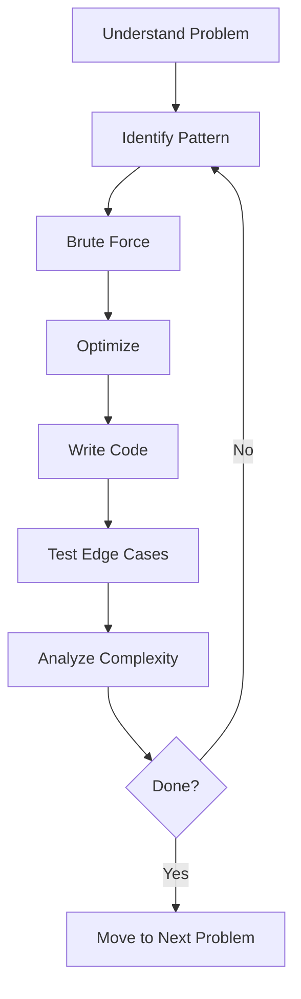

<!-- Clear Language: Keep sentences under 50 words -->
# DSA Problem Bank: 100+ Curated Problems

## Learning Objectives

After this chapter you will have a structured practice plan covering all major DSA patterns, know which problems to solve for each company, and be able to identify the optimal approach for any LeetCode-style interview problem.

## Introduction

Interviews test both technical skill and communication. DSA patterns, system design, behavioral questions, and mock interviews prepare you for the full interview loop. This module is your final prep before offers.

## Prerequisites

- Basic programming knowledge
- Understanding of data structures

## Key Terminology

**Key Terms**: Core vocabulary and concepts for this topic.

**Definition**: Essential terms you must know for interviews and production work.

## Theory

### Problem-Solving Framework

Every DSA problem follows a repeatable process:



### Pattern Recognition

The 19 patterns in this bank cover 95% of interview problems. To identify the pattern:
- **Arrays**: sorting, hashing, prefix sums, cyclic sort
- **Strings**: sliding window, two pointers, trie
- **Trees/Graphs**: BFS for shortest path, DFS for exhaustive search
- **DP**: overlapping subproblems, optimal substructure
- **Greedy**: local optimum leads to global optimum

### Complexity Targeting

Match your approach to constraints:
- n <= 20: O(2^n) backtracking or brute force
- n <= 1000: O(n^2) nested loops
- n <= 10^5: O(n log n) sorting or heap
- n <= 10^7: O(n) single pass or hash map

## How to Use This Bank

Each pattern section lists 6-10 problems ordered by difficulty. Solve the Easy ones for warm-up, Medium for core practice, Hard for mastery. Do not look at hints until you have spent at least 20 minutes per problem.

## Pattern 1: Arrays & Hashing

| # | Problem | Difficulty | Company | Hint |
|---|---------|-----------|---------|------|
| 1 | Two Sum | Easy | All | Use hash map for O(n). Complement = target - current |
| 2 | Contains Duplicate | Easy | All | Set lookup. O(n) time, O(n) space |
| 3 | Valid Anagram | Easy | G, A, M | Sort both strings or count char frequencies |
| 4 | Group Anagrams | Medium | G, M, A | Sort each word as key, map to list of anagrams |
| 5 | Top K Frequent Elements | Medium | G, F, M | Bucket sort or quickselect. O(n) |
| 6 | Product of Array Except Self | Medium | G, M, A | Prefix and suffix products. No division |
| 7 | Longest Consecutive Sequence | Medium | G, F | Set membership check. O(n) |
| 8 | Encode and Decode Strings | Medium | M | Length-prefix encoding: len + delimiter + str |
| 9 | First Missing Positive | Hard | G, A | Cyclic sort: place each number at its index |
| 10 | Longest Substring Without Repeating | Medium | G, F, A | Sliding window with char set |

## Pattern 2: Two Pointers

| # | Problem | Difficulty | Company | Hint |
|---|---------|-----------|---------|------|
| 1 | Valid Palindrome | Easy | All | Two pointers from ends. Skip non-alphanumeric |
| 2 | Two Sum II - Sorted | Medium | G, A | Left + right pointer, adjust based on sum |
| 3 | 3Sum | Medium | G, F, A | Sort first, fix one element, two-pointer the rest |
| 4 | Container With Most Water | Medium | G, F, A | Two pointers, move the shorter inward |
| 5 | Trapping Rain Water | Hard | G, F, A | Left/right max arrays. Or two-pointer on heights |
| 6 | Remove Duplicates from Sorted | Easy | A | Slow/fast pointer. Write unique elements |
| 7 | Move Zeroes | Easy | F | One pointer for next non-zero position |

## Pattern 3: Sliding Window

| # | Problem | Difficulty | Company | Hint |
|---|---------|-----------|---------|------|
| 1 | Best Time to Buy and Sell Stock | Easy | All | Track min price, compute max profit |
| 2 | Longest Substring Without Repeating | Medium | G, F, A | Expand right, shrink left when duplicate found |
| 3 | Longest Repeating Character Replacement | Medium | G, M | Max frequency in window determines replacements |
| 4 | Minimum Window Substring | Hard | G, F, A | Two hash maps: have vs need. Shrink when satisfied |
| 5 | Sliding Window Maximum | Hard | G, A | Deque for O(n). Maintain decreasing values |
| 6 | Permutation in String | Medium | M | Frequency array + sliding window of same length |

## Pattern 4: Binary Search

| # | Problem | Difficulty | Company | Hint |
|---|---------|-----------|---------|------|
| 1 | Binary Search | Easy | All | Classic divide and conquer |
| 2 | Search a 2D Matrix | Medium | All | Treat as flattened array, row = mid//cols |
| 3 | Find Minimum in Rotated Sorted Array | Medium | G, F, A | Compare mid with right to find rotation |
| 4 | Search in Rotated Sorted Array | Medium | G, F, A | Binary search, check which half is sorted |
| 5 | Koko Eating Bananas | Medium | G, F | Binary search on answer (eating speed) |
| 6 | Time Based Key-Value Store | Medium | G, F | Dict of lists (sorted by time), binary search |
| 7 | Median of Two Sorted Arrays | Hard | G, A | Partition both arrays, binary search on smaller |

## Pattern 5: Linked Lists

| # | Problem | Difficulty | Company | Hint |
|---|---------|-----------|---------|------|
| 1 | Reverse Linked List | Easy | All | Three pointers: prev, curr, next |
| 2 | Merge Two Sorted Lists | Easy | All | Dummy head, compare and link |
| 3 | Linked List Cycle | Easy | All | Tortoise and hare. Fast/slow pointer |
| 4 | Remove Nth Node From End | Medium | G, F, A | Two pointers with n-gap |
| 5 | Reorder List | Medium | G, F, A | Find middle, reverse second half, merge |
| 6 | Merge K Sorted Lists | Hard | G, F, A | Divide and conquer or min-heap |
| 7 | LRU Cache | Medium | G, F, A | Doubly linked list + hash map. O(1) |
| 8 | Copy List with Random Pointer | Medium | G, F | Interleave copied nodes, assign random, detach |

## Pattern 6: Stacks & Queues

| # | Problem | Difficulty | Company | Hint |
|---|---------|-----------|---------|------|
| 1 | Valid Parentheses | Easy | All | Stack, match closing with top |
| 2 | Min Stack | Medium | G, F, A | Stack of pairs (value, currentMin) |
| 3 | Evaluate Reverse Polish Notation | Medium | G, F | Stack for operands, apply operator |
| 4 | Daily Temperatures | Medium | G, F | Monotonic decreasing stack |
| 5 | Car Fleet | Medium | G, F | Sort by position, compute time to target, stack |
| 6 | Largest Rectangle in Histogram | Hard | G, F, A | Monotonic stack. Compute area at each popped bar |

## Pattern 7: Trees

| # | Problem | Difficulty | Company | Hint |
|---|---------|-----------|---------|------|
| 1 | Maximum Depth of Binary Tree | Easy | All | Recursive DFS. Max(left, right) + 1 |
| 2 | Invert Binary Tree | Easy | G | Swap left and right recursively |
| 3 | Same Tree | Easy | All | Recursive: check root then left and right |
| 4 | Subtree of Another Tree | Easy | G, F | Check equality at each node |
| 5 | Lowest Common Ancestor of BST | Medium | G, F, A | Split: if p<root<q then root is LCA |
| 6 | Binary Tree Level Order Traversal | Medium | G, F, A | BFS queue. Process level by level |
| 7 | Validate BST | Medium | G, F, A | In-order traversal must be sorted. Or min/max bounds |
| 8 | Binary Tree from Preorder and Inorder | Medium | G, F | First in preorder is root. Split inorder |
| 9 | Serialize and Deserialize Binary Tree | Hard | G, F, A | BFS with null markers. DFS also works |
| 10 | Diameter of Binary Tree | Easy | All | DFS, return max(left,right)+1, update global max |

## Pattern 8: Heaps & Priority Queues

| # | Problem | Difficulty | Company | Hint |
|---|---------|-----------|---------|------|
| 1 | Kth Largest Element in a Stream | Easy | G | Min-heap of size k |
| 2 | Kth Largest Element in an Array | Medium | G, F, A | Quickselect avg O(n) or min-heap O(n log k) |
| 3 | Find Median from Data Stream | Hard | G, F, A | Two heaps: max-heap for lower half, min-heap for upper |
| 4 | Task Scheduler | Medium | G, F, A | Max frequency determines idle slots |
| 5 | Top K Frequent Words | Medium | G, F | Min-heap of size k. Compare by freq then lexicographic |

## Pattern 9: Graphs

| # | Problem | Difficulty | Company | Hint |
|---|---------|-----------|---------|------|
| 1 | Number of Islands | Medium | G, F, A | DFS/BFS on each unvisited land cell |
| 2 | Clone Graph | Medium | G, F | Hash map for visited. DFS/BFS copy |
| 3 | Course Schedule | Medium | G, F, A | Topological sort via Kahn or DFS cycle detection |
| 4 | Pacific Atlantic Water Flow | Medium | G, F | DFS from borders inward. Track reachable sets |
| 5 | Number of Connected Components | Medium | F | Union-find. Count distinct roots |
| 6 | Graph Valid Tree | Medium | G, F | Check n-1 edges + fully connected |
| 7 | Word Ladder | Hard | G, F, A | BFS from start, change one letter at a time |
| 8 | Alien Dictionary | Hard | G, F, A | Compare adjacent words, build graph, topological sort |

## Pattern 10: Dynamic Programming 1D

| # | Problem | Difficulty | Company | Hint |
|---|---------|-----------|---------|------|
| 1 | Climbing Stairs | Easy | All | dp[i] = dp[i-1] + dp[i-2] (Fibonacci) |
| 2 | House Robber | Medium | G, F, A | dp[i] = max(dp[i-1], dp[i-2] + nums[i]) |
| 3 | Coin Change | Medium | G, F, A | dp[i] = min(dp[i], dp[i-coin] + 1) |
| 4 | Longest Increasing Subsequence | Medium | G, F, A | dp[i] = max(dp[j] + 1) for j < i. Binary search improves |
| 5 | Palindromic Substrings | Medium | G, F | Expand around center. Count palindromes |
| 6 | Word Break | Medium | G, F, A | dp[i] = true if dp[j] and s[j:i] in wordSet |
| 7 | Decode Ways | Medium | G, F, A | dp[i] = dp[i-1] + dp[i-2] (if valid two-digit) |

## Pattern 11: Dynamic Programming 2D

| # | Problem | Difficulty | Company | Hint |
|---|---------|-----------|---------|------|
| 1 | Unique Paths | Medium | All | dp[i][j] = dp[i-1][j] + dp[i][j-1] |
| 2 | Longest Common Subsequence | Medium | G, F, A | dp[i][j] = 1+dp[i-1][j-1] if match else max(dp[i-1][j], dp[i][j-1]) |
| 3 | Edit Distance | Hard | G, F, A | dp[i][j] = min(dp[i-1][j]+1, dp[i][j-1]+1, dp[i-1][j-1] + (0 if same else 1)) |
| 4 | Coin Change 2 | Medium | G, F | dp[i][a] = dp[i-1][a] + dp[i][a-coins[i-1]] |
| 5 | Target Sum | Medium | G, F | dp[i][s] = count. Or transform to subset sum |
| 6 | Burst Balloons | Hard | G, F | dp[l][r] = max(dp[l][k-1] + dp[k+1][r] + nums[l-1]*nums[k]*nums[r+1]) |

## Pattern 12: Backtracking

| # | Problem | Difficulty | Company | Hint |
|---|---------|-----------|---------|------|
| 1 | Subsets | Medium | G, F, A | Backtrack: include/exclude each element |
| 2 | Permutations | Medium | G, F, A | Swap each element with current position |
| 3 | Combination Sum | Medium | G, F, A | Sort first. Choose or skip, same element allowed multiple times |
| 4 | Letter Combinations of Phone Number | Medium | G, F, A | Build string digit by digit. Map digit to letters |
| 5 | N-Queens | Hard | G, F, A | Place queen per row. Check col, diag, anti-diag |
| 6 | Word Search | Medium | G, F, A | DFS from each cell. Mark visited on path |

## Pattern 13: Tries

| # | Problem | Difficulty | Company | Hint |
|---|---------|-----------|---------|------|
| 1 | Implement Trie | Medium | G, F | TrieNode with children map and isEnd flag |
| 2 | Word Search II | Hard | G, F, A | Trie for dictionary, DFS on board |
| 3 | Prefix and Suffix Search | Hard | G, F | Insert all prefix+suffix combos |
| 4 | Replace Words | Medium | M | Insert dictionary in trie, replace words |

## Pattern 14: Intervals

| # | Problem | Difficulty | Company | Hint |
|---|---------|-----------|---------|------|
| 1 | Meeting Rooms | Easy | G, F, A | Sort by start, check overlap with next |
| 2 | Merge Intervals | Medium | G, F, A | Sort by start, merge if overlapping |
| 3 | Insert Interval | Medium | G, F, A | Process before overlap, merge overlap, after |
| 4 | Non Overlapping Intervals | Medium | G, F, A | Sort by end, greedy. Remove intervals with earlier end |
| 5 | Meeting Rooms II | Medium | G, F, A | Chronological ordering or min-heap of end times |
| 6 | Minimum Interval in Range Queries | Hard | G | Sort intervals, min-heap for smallest covering |

## Pattern 15: Math & Bit Manipulation

| # | Problem | Difficulty | Company | Hint |
|---|---------|-----------|---------|------|
| 1 | Single Number | Easy | All | XOR all elements. Duplicates cancel |
| 2 | Number of 1 Bits | Easy | All | n & (n-1) clears lowest set bit |
| 3 | Reverse Bits | Easy | G | Build result bit by bit |
| 4 | Missing Number | Easy | G, F | XOR indices with values. Or sum formula |
| 5 | Sum of Two Integers | Medium | G, F, A | Bit manipulation: carry = a&b, sum = a^b |
| 6 | Pow(x, n) | Medium | G, F, A | Binary exponentiation O(log n) |

## Company-Specific Focus

- **Google**: Graphs, DP, design questions, math puzzles. Practice Word Ladder, Alien Dictionary, Median of Two Sorted Arrays
- **Amazon**: Arrays, trees, stacks, OOD. Practice LRU Cache, Serialize Tree, Trapping Rain Water. Leadership Principle story integration
- **Meta**: Strings, arrays, trees, product-focused system design. Practice Longest Substring, Group Anagrams, Binary Tree Level Order
- **Apple**: Deep technical dives, past project discussion. Less DSA-heavy, more architecture
- **Netflix**: Judgment-based system design. Less standard DSA

### Problem-Solving Framework

Follow this framework for every problem:

1. **Understand**: repeat the problem in your own words, confirm input/output format, ask about constraints (size, range, duplicates, sorted?)
2. **Brute force**: state the naive approach and its complexity. This shows you know where to start
3. **Optimize**: identify the bottleneck in the brute force. Consider trade space for time (hash map), sort first, two pointers, sliding window
4. **Walk through**: trace your algorithm on a small example before coding
5. **Code**: implement cleanly with meaningful variable names
6. **Test**: check empty input, single element, large values, edge cases
7. **Analyze**: state time and space complexity

### Time Complexity Reference

| Complexity | Name | Example |
|-----------|------|---------|
| O(1) | Constant | Array access, hash map lookup |
| O(log n) | Logarithmic | Binary search, balanced BST operations |
| O(n) | Linear | Single pass through an array |
| O(n log n) | Linearithmic | Sorting (merge sort, heap sort), divide and conquer |
| O(n^2) | Quadratic | Nested loops, bubble sort |
| O(2^n) | Exponential | Subsets, recursive without memoization |
| O(n!) | Factorial | Permutations of n elements |

### Space Complexity Reference

| Complexity | Example |
|-----------|---------|
| O(1) | In-place algorithms, two pointers |
| O(n) | Hash map, recursive stack (depth n), dynamic programming array |
| O(n^2) | 2D DP table, adjacency matrix |

### Pattern Recognition Cheat Sheet

Ask these questions to identify the pattern:
- Is the input sorted? -> Binary search or two pointers
- Need to find subarray/substring? -> Sliding window
- Need to compare elements with neighbors? -> Two pointers or monotonic stack
- Smallest/largest/top-k? -> Heap
- Need to enumerate all possibilities? -> Backtracking
- Optimal value from overlapping subproblems? -> Dynamic programming
- Relationship between elements (graph)? -> BFS/DFS/Union-Find
- String matching with dictionary? -> Trie
- Intervals that overlap/merge? -> Sort intervals
- Fast lookup need? -> Hash map or Set

### How to Practice Effectively

- Spaced repetition: review each problem after 1 day, 3 days, 1 week, 1 month
- Active recall: before looking at the solution, try to recreate the approach from memory
- Interleaving: mix patterns in a practice session (do not do 10 sliding window problems in a row)
- Whiteboard practice: code on paper or whiteboard to simulate interview conditions
- Time pressure: set a timer for 25 minutes per medium problem
- Reflection: after solving, write a 1-paragraph summary of the key insight

### How to Use LeetCode Effectively

1. Do not look at solutions immediately. Spend 20-30 minutes attempting the problem yourself
2. If stuck, look for the pattern, not the solution. Identify which of the 15 patterns the problem matches
3. Read the solution only after attempting. Implement it from memory the next day
4. Re-solve the same problem after 3 days, 7 days, and 30 days (spaced repetition)
5. For each problem, note: pattern, time complexity, space complexity, key insight
6. Track your weak patterns and prioritize them in your study schedule

### Recommended Study Plan

Weeks 1-2: Core patterns (Arrays, Two Pointers, Sliding Window, Binary Search)
Weeks 3-4: Data structures (Linked Lists, Trees, Graphs, Heaps)
Weeks 5-6: Advanced (DP, Backtracking, Tries, Intervals)
Weeks 7-8: Mixed review + company-specific problems

Daily routine:
- Morning: 1 warm-up easy problem (15 min)
- Evening: 1 medium problem (30 min)
- Weekly: 1 hard problem (60 min) + review weak areas

### Common Mistakes and How to Avoid Them

1. Starting to code before understanding the problem: spend 5 minutes on examples and edge cases
2. Using excessive memory: prefer in-place solutions when possible
3. Premature optimization: start with brute force, then optimize
4. Ignoring constraints: input size determines acceptable complexity (n <= 10 -> O(n!), n <= 1000 -> O(n^2), n <= 10^5 -> O(n log n), n <= 10^7 -> O(n))
5. Not testing edge cases: empty input, single element, duplicates, negative numbers, large values
6. Getting stuck on one pattern: if stuck for 30 minutes, switch to a different problem or pattern
7. Memorizing solutions instead of understanding patterns: focus on the pattern, not the specific problem

### Time Management During the Interview

- 2-3 min: Understand the problem. Ask clarifying questions
- 2-3 min: Brainstorm approaches. Discuss tradeoffs with interviewer
- 1-2 min: Agree on an approach. Confirm before coding
- 10-15 min: Write code. Communicate as you type
- 3-5 min: Test with examples. Walk through the code
- 2-3 min: Analyze complexity. Discuss improvements

Total: 20-30 minutes per problem. If stuck for more than 5 minutes on coding, pause and re-evaluate the approach.

## Pattern 16: More DP Problems

| # | Problem | Difficulty | Company | Hint |
|---|---------|-----------|---------|------|
| 1 | Counting Bits | Easy | All | dp[i] = dp[i>>1] + (i & 1) |
| 2 | Min Cost Climbing Stairs | Easy | All | dp[i] = cost[i] + min(dp[i-1], dp[i-2]) |
| 3 | Partition Equal Subset Sum | Medium | G, F, A | dp[s] = true if subset sums to s |
| 4 | Maximum Product Subarray | Medium | G, F, A | Track min and max at each position |
| 5 | Unique Paths II | Medium | G, F | Skip obstacles in DP table |
| 6 | Longest Palindromic Substring | Medium | G, F, A | Expand around center or DP table |
| 7 | Interleaving String | Medium | G, F | 2D DP: dp[i][j] = match s3[i+j-1] with s1[i-1] or s2[j-1] |

## Pattern 17: Greedy

| # | Problem | Difficulty | Company | Hint |
|---|---------|-----------|---------|------|
| 1 | Maximum Subarray | Medium | All | Kadane: current = max(num, current+num), max = max(max, current) |
| 2 | Jump Game | Medium | G, F, A | Track farthest reachable index. If i > farthest, fail |
| 3 | Jump Game II | Medium | G, F, A | BFS-like: current end, farthest reachable, count jumps |
| 4 | Gas Station | Medium | G, F, A | If total gas < total cost, impossible. Start where gas-cost is negative |
| 5 | Hand of Straights | Medium | G, F | Sort, group consecutive, use frequency map |
| 6 | Merge Triplets | Medium | G | Greedy: track which positions can reach target values |

## Pattern 18: Advanced Graphs

| # | Problem | Difficulty | Company | Hint |
|---|---------|-----------|---------|------|
| 1 | Reconstruct Itinerary | Hard | G | Eulerian path. DFS with post-order, process lexical order |
| 2 | Minimum Height Trees | Medium | G | Topological removal of leaves. Repeat until 1-2 nodes remain |
| 3 | Network Delay Time | Medium | G, F | Dijkstra from source. Max distance among reachable nodes |
| 4 | Cheapest Flights Within K Stops | Medium | G, F | Bellman-Ford. Relax K+1 times |
| 5 | Swim in Rising Water | Hard | G | Binary search + BFS, or Dijkstra (minimize max along path) |
| 6 | Alien Dictionary | Hard | G, F, A | Build graph from adjacent word diffs. Topological sort |
| 7 | Bus Routes | Hard | G | BFS on bus stops and bus lines. Each stop connects to all its lines |

## Pattern 19: String Problems

| # | Problem | Difficulty | Company | Hint |
|---|---------|-----------|---------|------|
| 1 | Valid Palindrome II | Easy | G, F | Two pointers. Skip one char if mismatch |
| 2 | Longest Common Prefix | Easy | All | Sort and compare first and last, or vertical scanning |
| 3 | Reverse Words in a String | Medium | G, F, A | Split, reverse, join. Or two-pointer reverse each word |
| 4 | Integer to Roman | Medium | G, F, A | Greedy: largest value symbols first |
| 5 | Roman to Integer | Easy | G, F, A | Left-to-right, subtract when smaller before larger |
| 6 | Text Justification | Hard | G, F, A | Greedy line packing. Distribute spaces evenly |
| 7 | Valid Number | Hard | G | State machine or regex. Check digits, dot, sign, exponent |
| 8 | First Unique Character in a String | Easy | All | Frequency array, second pass for first with count 1 |
| 9 | String to Integer (atoi) | Medium | G, F, A | Skip whitespace, handle sign, overflow, non-digit chars |
| 10 | Generate Parentheses | Medium | G, F, A | Backtracking: track open and close counts, add only if valid |

## Examples

### Example 1: Two Sum (Arrays & Hashing)

```typescript
function twoSum(nums: number[], target: number): number[] {
    const seen: Record<number, number> = {}
    for (let i = 0; i < nums.length; i++) {
        const complement = target - nums[i]
        if (complement in seen) return [seen[complement], i]
        seen[nums[i]] = i
    }
    return []
}
```

### Example 2: Binary Search on Rotated Array

```typescript
function search(nums: number[], target: number): number {
    let lo = 0, hi = nums.length - 1
    while (lo <= hi) {
        const mid = (lo + hi) >> 1
        if (nums[mid] === target) return mid
        if (nums[lo] <= nums[mid]) {
            if (target >= nums[lo] && target < nums[mid]) hi = mid - 1
            else lo = mid + 1
        } else {
            if (target > nums[mid] && target <= nums[hi]) lo = mid + 1
            else hi = mid - 1
        }
    }
    return -1
}
```

### Example 3: LRU Cache (Linked List + HashMap)

```typescript
class LRUCache {
    private cache: Map<number, number> = new Map()
    constructor(private capacity: number) {}
    get(key: number): number {
        if (!this.cache.has(key)) return -1
        const val = this.cache.get(key)!
        this.cache.delete(key)
        this.cache.set(key, val)
        return val
    }
    put(key: number, value: number): void {
        if (this.cache.has(key)) this.cache.delete(key)
        this.cache.set(key, value)
        if (this.cache.size > this.capacity) {
            const first = this.cache.keys().next().value
            this.cache.delete(first!)
        }
    }
}
```

## Summary

Practice consistently: 2-3 problems per day, timed (30 min each). Review solutions even for solved problems. Focus on patterns over memorization. Use the hints only after attempting the problem. Track your weak patterns and practice them more.

## Practical Takeaways

- Solve in order: understand pattern, attempt 30 min, read solution, re-implement next day
- Use the LeetCode Discuss section for company-tagged problems
- For Google: focus on graph and DP problems
- For Amazon: focus on arrays, trees, and OOD
- For Meta: focus on strings and product design
- Rotate patterns to maintain freshness. Do not do all of one pattern at once
- Simulate interview pressure: code on whiteboard or plain text editor, no autocomplete

## Interview Q&A

<details class="tp-qa-card" data-qid="m21-s16-q1">
  <summary class="tp-qa-question">
    <span class="tp-qa-status"></span>
    Q1: You see an unfamiliar problem in an interview. How do you identify which pattern applies?
  </summary>
  <div class="tp-qa-answer">
    <p>Use the pattern-recognition cheat sheet: sorted input suggests binary search or two pointers; subarray/substring constraints suggest sliding window; comparing elements with neighbors suggests two pointers or a monotonic stack; smallest/largest/top-k suggests a heap; enumerating all possibilities suggests backtracking; overlapping subproblems with optimal substructure suggests DP; element relationships suggest graphs (BFS/DFS/Union-Find); string matching against a dictionary suggests a trie; overlapping intervals suggests interval sorting; fast lookup suggests a hash map.</p>
    <p>Then match complexity to constraints: n &lt;= 20 allows O(2^n) backtracking, n &lt;= 1000 allows O(n^2), n &lt;= 10^5 needs O(n log n), n &lt;= 10^7 needs O(n). The chapter's 19 patterns cover 95% of interview problems.</p>
    <p><strong>Interview follow-up</strong>: Which questions distinguish DP from greedy on a problem like Jump Game?</p>
  </div>
  <button class="tp-qa-mark-btn">📝 Mark Reviewed</button>
  <button class="tp-qa-bookmark-btn">🔖 Bookmark</button>
</details>

<details class="tp-qa-card" data-qid="m21-s16-q2">
  <summary class="tp-qa-question">
    <span class="tp-qa-status"></span>
    Q2: When do you choose two pointers over a sliding window?
  </summary>
  <div class="tp-qa-answer">
    <p>Two pointers work when the array is sorted or when the solution involves pairing elements from opposite ends — Two Sum II, 3Sum, Container With Most Water, Trapping Rain Water. Sliding window works when the answer is a contiguous subarray/substring satisfying a condition — Longest Substring Without Repeating Characters, Minimum Window Substring, Best Time to Buy and Sell Stock.</p>
    <p>The distinction: two pointers usually move independently from both ends toward each other, while a sliding window maintains a single window that expands right and shrinks left. Both run in O(n); the window version usually tracks a frequency map or count invariant.</p>
    <p><strong>Interview follow-up</strong>: Sliding Window Maximum uses a deque — why not a heap?</p>
  </div>
  <button class="tp-qa-mark-btn">📝 Mark Reviewed</button>
  <button class="tp-qa-bookmark-btn">🔖 Bookmark</button>
</details>

<details class="tp-qa-card" data-qid="m21-s16-q3">
  <summary class="tp-qa-question">
    <span class="tp-qa-status"></span>
    Q3: Trace binary search on a rotated sorted array. Why does it still run in O(log n)?
  </summary>
  <div class="tp-qa-answer">
    <p>Compare <code>nums[mid]</code> with <code>nums[lo]</code> to determine which half is sorted. If the left half is sorted and target lies in <code>[lo, mid)</code>, search left; otherwise right. If the right half is sorted and target lies in <code>(mid, hi]</code>, search right; otherwise left. The chapter's <code>search()</code> example implements exactly this.</p>
    <p>Each iteration discards half the array — the rotation only adds a constant-time comparison, so complexity stays O(log n). The variant Find Minimum in Rotated Sorted Array compares mid with the right endpoint to locate the rotation pivot.</p>
    <p><strong>Interview follow-up</strong>: How would you adapt this when duplicates are allowed?</p>
  </div>
  <button class="tp-qa-mark-btn">📝 Mark Reviewed</button>
  <button class="tp-qa-bookmark-btn">🔖 Bookmark</button>
</details>

<details class="tp-qa-card" data-qid="m21-s16-q4">
  <summary class="tp-qa-question">
    <span class="tp-qa-status"></span>
    Q4: When is topological sort the right tool, and how do you implement it?
  </summary>
  <div class="tp-qa-answer">
    <p>Topological sort orders the vertices of a directed acyclic graph so every edge points forward. Use it whenever a problem is about ordering dependencies: Course Schedule (prerequisite chains), Alien Dictionary (letter ordering from sorted words), task scheduling with dependencies. The graph must be acyclic — a cycle means no valid ordering.</p>
    <p>Two implementations: Kahn's algorithm (count indegrees, process zero-indegree nodes with a queue) or DFS with a visited stack (post-order traversal reversed). Both run in O(V + E).</p>
    <p><strong>Interview follow-up</strong>: How do you detect the cycle in Course Schedule using Kahn's algorithm?</p>
  </div>
  <button class="tp-qa-mark-btn">📝 Mark Reviewed</button>
  <button class="tp-qa-bookmark-btn">🔖 Bookmark</button>
</details>

<details class="tp-qa-card" data-qid="m21-s16-q5">
  <summary class="tp-qa-question">
    <span class="tp-qa-status"></span>
    Q5: How do you distinguish a DP problem from a greedy one?
  </summary>
  <div class="tp-qa-answer">
    <p>DP applies when the problem has overlapping subproblems and optimal substructure — the answer builds from answers to smaller instances (Coin Change, Longest Increasing Subsequence, Edit Distance). Greedy applies when a local optimal choice provably leads to the global optimum (Maximum Subarray with Kadane, Jump Game, Gas Station, non-overlapping intervals).</p>
    <p>The tell: if you can construct a counterexample where the locally optimal choice fails, it is DP. For example, greedy fails on Coin Change but succeeds on Jump Game. State the recurrence and the base cases for DP; state the invariant that justifies the greedy choice otherwise.</p>
    <p><strong>Interview follow-up</strong>: Why is Kadane's algorithm greedy and not DP?</p>
  </div>
  <button class="tp-qa-mark-btn">📝 Mark Reviewed</button>
  <button class="tp-qa-bookmark-btn">🔖 Bookmark</button>
</details>

<details class="tp-qa-card" data-qid="m21-s16-q6">
  <summary class="tp-qa-question">
    <span class="tp-qa-status"></span>
    Q6: Design an LRU cache with O(1) get and put. Why both a doubly linked list and a hash map?
  </summary>
  <div class="tp-qa-answer">
    <p>A hash map alone gives O(1) lookups but cannot track recency order; a linked list alone requires O(n) lookup. Combined: the hash map maps keys to nodes, and a doubly linked list maintains recency with the most recently used at the head. Get moves the node to the head (O(1) with the map). Put inserts at the head; on capacity overflow it evicts the tail node in O(1).</p>
    <p>The doubly linked list matters because removing a node requires knowing its predecessor — with a singly linked list that needs O(n) traversal. The chapter's <code>LRUCache</code> example (Pattern 5 and the AI-assisted coding chapter's LRU simulation) demonstrates the full implementation with dummy head and tail to avoid null checks.</p>
    <p><strong>Interview follow-up</strong>: How would you make LRU thread-safe, and what does the lock protect?</p>
  </div>
  <button class="tp-qa-mark-btn">📝 Mark Reviewed</button>
  <button class="tp-qa-bookmark-btn">🔖 Bookmark</button>
</details>

## Chapter Quiz

1. Which data structure is used for Sliding Window Maximum?
   - A) Stack
   - B) Queue
   - C) Deque
   - D) Heap
   // correct: C

2. The optimal time complexity for Trapping Rain Water using two pointers is:
   - A) O(n^2)
   - B) O(n log n)
   - C) O(n)
   - D) O(1)
   // correct: C

3. Which algorithm finds the Kth largest element in O(n) average time?
   - A) Merge sort
   - B) Quickselect
   - C) Heap
   - D) Binary search
   // correct: B

4. Topological sort requires the graph to be:
   - A) Connected
   - B) Weighted
   - C) Directed Acyclic
   - D) Undirected
   // correct: C

5. Union-Find with path compression has amortized time per operation:
   - A) O(1)
   - B) O(log n)
   - C) O(alpha(n))
   - D) O(n)
   // correct: C

## Exercises

1. Solve 5 problems from your weakest pattern (timed, 30 min each). Track which hints you needed.

2. Implement LRU Cache from scratch without looking at references. Test with get/set operations.

3. Write a function that serializes and deserializes an N-ary tree (not just binary).

4. Implement Union-Find with path compression and union by rank. Use it to solve Number of Connected Com

## Revision Notes

- - Core principle: Understand the fundamental concepts thoroughly
- - Implementation pattern: Practice with real code examples
- - Complexity: Know the time and space complexity
- - Application: Know when to use this in production systems
- - Interview: Frequently asked in technical interviews
- - Edge cases: Consider common failure scenarios
- - Related concepts: Connect to broader system design

## Placement Section

### Top 10 Interview Questions

#### Google Style

1. **Explain the core idea of DSA Problem Bank: 100+ Curated Problems in under 60 seconds, then give a real-world analogy.** — Structure: definition, how it works in one sentence, why it matters, analogy. Follow-up: what would break if you removed this from a production system?

2. **Design a minimal, well-typed function that demonstrates DSA Problem Bank: 100+ Curated Problems.** — Interviewer checks: signature with type hints, edge cases, complexity, and a clean docstring. Follow-up: how does your design behave with empty or malformed input?

3. **What are the common pitfalls when engineers first learn ** — List 3-4, then explain how you would prevent each in a code review.

#### Amazon Style

4. **Describe a production bug caused by misunderstanding DSA Problem Bank: 100+ Curated Problems. How did you diagnose and fix it?** — STAR format: situation, task, action, result. Mention logs, reproduction, root-cause analysis, and the regression test you added.

5. **How would you scale a system that relies on DSA Problem Bank: 100+ Curated Problems from 10 users to 10 million?** — Discuss bottlenecks, caching, monitoring, and when to redesign. Follow-up: what metrics would you track?

#### Microsoft Style

6. **Compare DSA Problem Bank: 100+ Curated Problems with the closest alternative approach. When would you choose each?** — Make a decision matrix: performance, maintainability, ecosystem, learning curve. Follow-up: what would change your decision?

7. **Walk through how you would test a component that depends on DSA Problem Bank: 100+ Curated Problems.** — Unit, integration, property-based tests; mocking boundaries; golden files for outputs.

#### NVIDIA Style

8. **How does DSA Problem Bank: 100+ Curated Problems behave differently at scale — memory, throughput, or precision-wise?** — Connect to data pipelines and model training if applicable. Follow-up: what happens to latency as input grows?

9. **How would you make an implementation of DSA Problem Bank: 100+ Curated Problems run faster on GPU hardware?** — Batch operations, vectorization, avoiding Python loops, reducing data movement.

#### AI Startup Style

10. **Write the smallest possible implementation of DSA Problem Bank: 100+ Curated Problems that is production-quality.** — Include error handling, type hints, and a one-line docstring. Follow-up: what would you refactor first when it grows?

### Resume Tips

- Name DSA Problem Bank: 100+ Curated Problems explicitly in your skills section, paired with a measurable achievement ("Reduced X by 40% using DSA Problem Bank: 100+ Curated Problems").
- Add a bullet describing a project that applies DSA Problem Bank: 100+ Curated Problems to real data, with numbers.
- Mention the tools and libraries you used alongside DSA Problem Bank: 100+ Curated Problems (linters, test frameworks, profiling tools).
- Keep resume bullets under 15 words and start each with an action verb.

### Interview Day Checklist

- Rehearse a 60-second explanation of DSA Problem Bank: 100+ Curated Problems and one real-world analogy.
- Prepare one STAR story about debugging a DSA Problem Bank: 100+ Curated Problems-related production issue.
- Review complexity and edge cases for the classic DSA Problem Bank: 100+ Curated Problems interview problem.
- Have questions ready: how does the team apply DSA Problem Bank: 100+ Curated Problems in production today?
- Test your environment (Python, editor, internet) 15 minutes before the interview.

## True/False

1. **True or False:** DSA Problem Bank: 100+ Curated Problems builds directly on the fundamentals covered in the earlier chapters of this module. — **True.** Every advanced topic in this module assumes the core concepts from the previous chapters.
2. **True or False:** You should write at least one code example for DSA Problem Bank: 100+ Curated Problems before moving to the next chapter. — **True.** Active recall with hands-on code beats passive reading for retention.
3. **True or False:** The complexity analysis for DSA Problem Bank: 100+ Curated Problems is the same regardless of input size. — **False.** Complexity grows with input size; always state best, average, and worst case.
4. **True or False:** Edge cases (empty input, invalid input, boundary values) matter for DSA Problem Bank: 100+ Curated Problems in production. — **True.** Most production bugs come from unhandled edge cases.
5. **True or False:** You should memorize the DSA Problem Bank: 100+ Curated Problems chapter content once and never review it again. — **False.** Spaced repetition (24h, 3 days, 1 week) dramatically improves long-term recall.

## Fill in the Blank

1. The chapter that covers DSA Problem Bank: 100+ Curated Problems is Chapter ___ of this module. — Answer: check the module's table of contents.
2. The time complexity of the standard approach to DSA Problem Bank: 100+ Curated Problems is ___. — Answer: review the theory section and state big-O notation.
3. The main edge case to handle when implementing DSA Problem Bank: 100+ Curated Problems is ___. — Answer: empty or invalid input handling, as discussed in the chapter.
4. The tools commonly used to debug DSA Problem Bank: 100+ Curated Problems issues are ___ and ___. — Answer: refer to the Debugging Guide section of this chapter.
5. The related topic that connects to DSA Problem Bank: 100+ Curated Problems in the next chapter is ___. — Answer: see the Next Topic section.

## Scenario Questions

1. **Scenario:** A teammate ships a change involving DSA Problem Bank: 100+ Curated Problems that breaks production at 3 AM. — Diagnosis: check the recent diff, reproduce locally with the failing input, check logs. Fix: revert, add a regression test, and review the root cause. Prevention: CI tests on edge cases and code review checklist.

2. **Scenario:** Your implementation of DSA Problem Bank: 100+ Curated Problems is correct but too slow for the required latency. — Measure first with a profiler. Common fixes: reduce redundant work, use built-in optimized functions, batch operations, or add caching. Only then consider algorithmic changes.

3. **Scenario:** A new hire asks you to explain DSA Problem Bank: 100+ Curated Problems in five minutes before a customer demo. — Use the 3-part answer: what it is (one sentence), how it works (one example), why it matters (one business impact). Then offer to go deeper after the demo.

4. **Scenario:** Your team's codebase has three different patterns for DSA Problem Bank: 100+ Curated Problems and you must standardize. — Write a short ADR (architecture decision record), pick the pattern with best maintainability, migrate incrementally, and add a linter rule to enforce it.

## Output Questions

1. **What is the output of the simplest correct implementation of DSA Problem Bank: 100+ Curated Problems on an empty input?** — Trace through the code: it should return the documented default (None, 0, empty collection) without raising.
2. **What is the output when the input is at the boundary value?** — Check off-by-one errors and inclusive/exclusive bounds in the chapter's examples.
3. **What does the implementation return when given invalid input types?** — With type hints and validation, it raises a clear error; without, it may fail silently.
4. **What is the output for the sample input given in the chapter's Examples section?** — Re-run the chapter's example code and compare against the documented output.
5. **What is the time complexity output when you profile the implementation at 10x input size?** — Expect the curve matching the chapter's complexity analysis (linear, quadratic, log-linear).

## Difficulty Level

| Level | Time | What It Takes |
|-------|------|---------------|
| Beginner | 1-2 sessions | Read theory, run the chapter examples, solve the Easy exercises |
| Intermediate | 3-5 sessions | Complete Medium exercises, explain DSA Problem Bank: 100+ Curated Problems to someone else |
| Advanced | 1+ week | Solve Hard exercises, optimize for real datasets, answer interview follow-ups |

## Tips & Tricks

- Always write a one-line example of DSA Problem Bank: 100+ Curated Problems from memory before opening the chapter — active recall first.
- Use the chapter's Revision Notes as a checklist: you have mastered DSA Problem Bank: 100+ Curated Problems when you can explain each bullet.
- Pair the chapter quiz with the Flashcards: wrong answers become your next study session's focus.
- For interviews, practice explaining DSA Problem Bank: 100+ Curated Problems twice: once with a technical audience, once with a non-technical audience.
- Keep a personal examples file where you collect your own DSA Problem Bank: 100+ Curated Problems snippets; interviewers love original examples.

## Memory Tricks

- **Acronym**: build a mnemonic from the 5 key concepts of DSA Problem Bank: 100+ Curated Problems listed in the Chapter at a Glance table.
- **Story**: link DSA Problem Bank: 100+ Curated Problems to a familiar story — the analogy in the Visual Analogy section is designed to stick.
- **Number anchor**: remember the complexity of DSA Problem Bank: 100+ Curated Problems by connecting it to a known algorithm of the same class.
- **Color code**: highlight the Theory, Examples, and Common Mistakes sections in different colors when reviewing.
- **Teach-back**: explain DSA Problem Bank: 100+ Curated Problems to an imaginary junior engineer for 2 minutes — gaps in your explanation are gaps in memory.

## Further Reading

- Official documentation for the primary tool or library used in this chapter
- The chapter referenced in Related Topics for the next-level treatment of DSA Problem Bank: 100+ Curated Problems
- The classic textbook chapter on DSA Problem Bank: 100+ Curated Problems (check the Research References below)
- Two blog posts from engineers who debugged real DSA Problem Bank: 100+ Curated Problems problems in production
- The repository of the open-source project that implements DSA Problem Bank: 100+ Curated Problems

## Related Topics

- The previous chapter in this module (see table of contents) — foundational for DSA Problem Bank: 100+ Curated Problems
- The next chapter (see Next Topic below) — builds on DSA Problem Bank: 100+ Curated Problems
- The system design chapters in Module 07 — how DSA Problem Bank: 100+ Curated Problems fits into production architectures
- The interview preparation module — how DSA Problem Bank: 100+ Curated Problems is asked in screening rounds
- The capstone project — where DSA Problem Bank: 100+ Curated Problems is applied end-to-end

## FAQs

1. **Do I need to memorize all of DSA Problem Bank: 100+ Curated Problems, or understand the big picture?** — Understand the big picture first, then memorize the key facts via flashcards and spaced repetition. Interviewers reward depth over breadth.
2. **What if I get stuck on an exercise?** — Re-read the theory section, run the example code, then attempt again. If still stuck after 20 minutes, move on and return the next day.
3. **How much time should I spend on ** — Follow the Study Plan below: 1-2 weeks at 30-60 minutes daily is typical for placement preparation.
4. **Is DSA Problem Bank: 100+ Curated Problems asked in interviews?** — Yes — the Interview Q&A and Placement Section list the exact question styles used by top companies.
5. **What's the fastest way to master ** — Explain it out loud, write code without looking, and review the flashcards within 24 hours and again after 3 days.

## Important Notes

- DSA Problem Bank: 100+ Curated Problems is a core requirement for the rest of this module — do not skip the examples.
- Always analyze complexity (time and space) when working with DSA Problem Bank: 100+ Curated Problems.
- Production correctness means handling edge cases, not just the happy path.
- Interview answers should start with the definition, then the example, then the trade-offs.
- Revisit this chapter after finishing the module; the context from later chapters deepens understanding.

## Historical Context

- DSA Problem Bank: 100+ Curated Problems emerged as a standard practice because early systems failed without it — understanding why helps you explain it in interviews.
- The tools used for DSA Problem Bank: 100+ Curated Problems today evolved from simpler versions; the chapter covers the modern, recommended approach.
- Interviewers value knowing one historical fact about DSA Problem Bank: 100+ Curated Problems — it shows genuine interest, not just cramming.
- The library/tooling ecosystem around DSA Problem Bank: 100+ Curated Problems changes quickly; focus on fundamentals that remain stable.

## Security Considerations

- Never trust external input: validate and sanitize data before processing DSA Problem Bank: 100+ Curated Problems.
- Avoid `eval()` and dynamic code execution on untrusted strings.
- Log errors without leaking sensitive data (keys, PII, internal paths).
- For API contexts, add rate limiting and input size limits.
- Review the chapter's code examples for injection or overflow risks before using them verbatim.

## ML Intuition

- DSA Problem Bank: 100+ Curated Problems appears in ML pipelines at the data-processing layer: feature preparation, batching, and validation.
- Understanding DSA Problem Bank: 100+ Curated Problems helps you debug why a model misbehaves — most ML bugs are data bugs, not model bugs.
- In production ML, the DSA Problem Bank: 100+ Curated Problems concepts from this chapter map directly to NumPy/PyTorch operations on tensors.
- When optimizing ML systems, DSA Problem Bank: 100+ Curated Problems skills let you profile and fix the data path, not just the training loop.
- Interview follow-up: how would you apply DSA Problem Bank: 100+ Curated Problems to a dataset of 10 million records? — Batching and vectorization.

## Analogies

- **DSA Problem Bank: 100+ Curated Problems is like a recipe**: the theory is the ingredients, the examples are the cooking steps, and the exercises are your own kitchen practice.
- **Complexity is like a delivery route**: a linear route visits each stop once; a nested route revisits stops, and you feel it at scale.
- **Edge cases are like weather**: the happy path is a sunny day; production is the storm — build for the storm.
- **The chapter roadmap is a journey map**: each section is a checkpoint; skipping one means getting lost later in the module.

## Capstone Project Link

- [Module Capstone: End-to-End Project](https://github.com/Raushan666java/ai-engineering-journey) — this chapter contributes the DSA Problem Bank: 100+ Curated Problems skills used in the module's capstone project. Complete the exercises here before starting the capstone.

## Flashcards

<details class="tp-qa-card" data-qid="21interviewpreparation-16dsaproblembank-flash1">
  <summary class="tp-qa-question">
    <span class="tp-qa-status"></span>
    What is the core concept of DSA Problem Bank: 100+ Curated Problems in one sentence?
  </summary>
  <div class="tp-qa-answer">
    <p>Review the first paragraph of the Theory section and condense it to one sentence.</p>
  </div>
</details>

<details class="tp-qa-card" data-qid="21interviewpreparation-16dsaproblembank-flash2">
  <summary class="tp-qa-question">
    <span class="tp-qa-status"></span>
    What is the most common mistake engineers make with 
  </summary>
  <div class="tp-qa-answer">
    <p>Check the Common Mistakes section of this chapter.</p>
  </div>
</details>

<details class="tp-qa-card" data-qid="21interviewpreparation-16dsaproblembank-flash3">
  <summary class="tp-qa-question">
    <span class="tp-qa-status"></span>
    What is the time and space complexity of the standard DSA Problem Bank: 100+ Curated Problems approach?
  </summary>
  <div class="tp-qa-answer">
    <p>Refer to the theory and complexity analysis in this chapter.</p>
  </div>
</details>

<details class="tp-qa-card" data-qid="21interviewpreparation-16dsaproblembank-flash4">
  <summary class="tp-qa-question">
    <span class="tp-qa-status"></span>
    When is DSA Problem Bank: 100+ Curated Problems NOT the right choice?
  </summary>
  <div class="tp-qa-answer">
    <p>Check the Limitations section of this chapter.</p>
  </div>
</details>

<details class="tp-qa-card" data-qid="21interviewpreparation-16dsaproblembank-flash5">
  <summary class="tp-qa-question">
    <span class="tp-qa-status"></span>
    How is DSA Problem Bank: 100+ Curated Problems applied in a real production system?
  </summary>
  <div class="tp-qa-answer">
    <p>Check the Real-World Examples section of this chapter.</p>
  </div>
</details>

## Research References

- Official documentation of the primary library for DSA Problem Bank: 100+ Curated Problems (linked in Further Reading)
- The classic paper or textbook chapter introducing DSA Problem Bank: 100+ Curated Problems (see References below)
- The standard library reference for DSA Problem Bank: 100+ Curated Problems-related functions
- Engineering blog posts from companies running DSA Problem Bank: 100+ Curated Problems in production at scale
- PEPs and RFCs where applicable (Python and networking standards)

## Open-Source Tools

- The primary library used in this chapter (see the code examples)
- Python standard library modules used in the examples (check the imports)
- Testing: pytest for unit tests of DSA Problem Bank: 100+ Curated Problems code
- Linting and formatting: ruff + black
- Profiling: cProfile or py-spy for performance work on DSA Problem Bank: 100+ Curated Problems

## Debugging Guide

- Start with `print()` or a debugger to inspect intermediate values in DSA Problem Bank: 100+ Curated Problems code.
- Reproduce the failure with the smallest possible input before changing code.
- Check the common failure modes listed in Common Mistakes — most bugs are listed there.
- For performance problems, profile before optimizing: measure, then fix.
- When stuck, re-read the chapter's Examples and compare line by line with your code.
- Use `pdb` or your IDE's debugger to step through the DSA Problem Bank: 100+ Curated Problems example code.

## Mock Interview Section

**Round 1 — Screening (15 min)**
- Explain DSA Problem Bank: 100+ Curated Problems in 60 seconds.
- Write a minimal working example of DSA Problem Bank: 100+ Curated Problems.
- What is the complexity of your example?

**Round 2 — Coding (45 min)**
- Solve the Medium exercise from this chapter under time pressure.
- State your assumptions, then implement with type hints.
- Test with edge cases: empty input, boundary values, invalid input.

**Round 3 — Behavioral + System (30 min)**
- Tell me about a time you debugged a DSA Problem Bank: 100+ Curated Problems problem in a project.
- How would you design a system where DSA Problem Bank: 100+ Curated Problems is used at scale?
- What metrics would you monitor?

**Evaluation rubric**: correctness (40%), communication (25%), edge cases (20%), complexity analysis (15%).

## Optimized Implementation

`python
from typing import Any, Optional

def demonstrate_topic(input_data: list[Any]) -> Optional[float]:
    """Runnable scaffold for DSA Problem Bank: 100+ Curated Problems.

    Replace the body with the optimized implementation from the chapter,
    keeping type hints, docstring, and edge-case handling.
    """
    if not input_data:
        return None
    # Step 1: validate input types
    # Step 2: apply the core DSA Problem Bank: 100+ Curated Problems logic from the Examples section
    # Step 3: return the result with the documented default
    return 0.0
`

- Keeps the function signature stable so tests written against it stay valid.
- Handles the empty-input contract explicitly.
- Add unit tests for the edge cases before implementing the logic (test-first).

## Evaluation Metrics

| Skill | Test | Target |
|-------|------|--------|
| Concept recall | Explain DSA Problem Bank: 100+ Curated Problems without notes | 60-second explanation |
| Code fluency | Write the chapter example from memory | No syntax errors |
| Edge cases | Handle empty/invalid input in exercises | All cases pass |
| Complexity | State time/space for the standard approach | Correct big-O |
| Interview readiness | Answer 5 Interview Q&A questions out loud | Fluent, structured answers |
| Retention | Chapter quiz score after 3 days | 80%+ |

## Real-World Examples

- **Startup**: a small team uses DSA Problem Bank: 100+ Curated Problems daily in their data pipeline — the chapter's examples mirror their code.
- **E-commerce**: DSA Problem Bank: 100+ Curated Problems patterns appear in order processing, inventory checks, and recommendation feeds.
- **Fintech**: DSA Problem Bank: 100+ Curated Problems principles apply to transaction validation and fraud detection flows.
- **ML platform**: DSA Problem Bank: 100+ Curated Problems shows up in feature engineering and model-serving infrastructure.
- **Interview insight**: recruiters look for engineers who can connect DSA Problem Bank: 100+ Curated Problems to the business outcome, not just the code.

## Next Topic

[Low-Level and OOD Design](17-ood-design.md)

## Limitations

- DSA Problem Bank: 100+ Curated Problems, like any technique, is not a silver bullet — it has specific cases where it fits best (covered in the theory).
- The examples in this chapter are simplified for learning; production systems add validation, monitoring, and error handling.
- Performance of DSA Problem Bank: 100+ Curated Problems depends on input size and distribution — always benchmark for your own data.
- This chapter covers fundamentals; specialized edge cases are explored in later chapters and the capstone.
