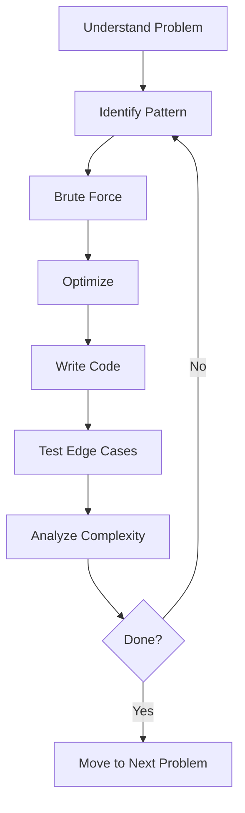

<!-- Clear Language: Keep sentences under 50 words -->
# DSA Problem Bank: 100+ Curated Problems

## Learning Objectives

After this chapter you will have a structured practice plan covering all major DSA patterns, know which problems to solve for each company, and be able to identify the optimal approach for any LeetCode-style interview problem. You will also know the complexity bounds that each pattern targets and how to adapt a solution when constraints change.

## Introduction

Interviews test technical skill and communication together. DSA patterns, system design, behavioral questions, and mock interviews prepare you for the full interview loop. This problem bank is the working core of that preparation: 19 patterns, 140+ curated problems, and a repeatable process for solving any unknown problem under time pressure. The chapter ends with interview Q&A, a quiz, and exercises you can run in TypeScript.

## Prerequisites

- Basic programming knowledge in any language
- Understanding of arrays, hash maps, linked lists, trees, and graphs
- Familiarity with big-O notation and how to compare growth rates
- A LeetCode or similar judge account for timed practice

## Key Terminology

- **Pattern**: A repeatable algorithmic strategy that solves a class of problems, such as two pointers or sliding window.
- **Optimal substructure**: A property where the optimal answer builds from optimal answers to smaller subproblems. It is the foundation of dynamic programming.
- **Overlapping subproblems**: A property where the same subproblem is solved many times. Memoization caches those results.
- **Two pointers**: Two indices moving toward each other or in the same direction to avoid nested loops.
- **Sliding window**: A contiguous subarray/substring maintained with two indices while a count or sum invariant stays valid.
- **Monotonic stack**: A stack whose values stay increasing or decreasing. It solves next-greater-element and histogram problems in O(n).
- **Topological sort**: An ordering of a directed acyclic graph where every edge points forward. Kahn's algorithm or DFS both work.
- **Union-Find**: A disjoint-set structure supporting near-constant-time find and union operations.
- **Amortized complexity**: The average cost per operation over a sequence, even if one operation is expensive.
- **Brute force**: The naive solution that checks every possibility, used as the correctness baseline.

## Theory

### Problem-Solving Framework

Every DSA problem follows a repeatable process:



The seven steps, practiced in order:

1. **Understand**: repeat the problem in your own words, confirm input and output format, ask about constraints (size, range, duplicates, sorted?).
2. **Brute force**: state the naive approach and its complexity. This shows you know where to start.
3. **Optimize**: identify the bottleneck in the brute force. Consider trading space for time (hash map), sorting first, two pointers, or a sliding window.
4. **Walk through**: trace your algorithm on a small example before coding.
5. **Code**: implement cleanly with meaningful variable names.
6. **Test**: check empty input, single element, large values, and edge cases.
7. **Analyze**: state time and space complexity with confidence.

### Pattern Recognition

The 19 patterns in this bank cover the overwhelming majority of interview problems. To identify the pattern:

- **Arrays**: sorting, hashing, prefix sums, cyclic sort
- **Strings**: sliding window, two pointers, trie
- **Trees/Graphs**: BFS for shortest path, DFS for exhaustive search
- **DP**: overlapping subproblems, optimal substructure
- **Greedy**: local optimum leads to global optimum

### Complexity Targeting

Match your approach to constraints before you code:

- n <= 20: O(2^n) backtracking or brute force
- n <= 1000: O(n^2) nested loops
- n <= 10^5: O(n log n) sorting or heap
- n <= 10^7: O(n) single pass or hash map

If your planned algorithm exceeds the bound the constraints allow, switch approach before writing code.

### Complexity Reference

| Complexity | Name | Example |
|-----------|------|---------|
| O(1) | Constant | Array access, hash map lookup |
| O(log n) | Logarithmic | Binary search, balanced BST operations |
| O(n) | Linear | Single pass through an array |
| O(n log n) | Linearithmic | Sorting (merge sort, heap sort), divide and conquer |
| O(n^2) | Quadratic | Nested loops, bubble sort |
| O(2^n) | Exponential | Subsets, recursion without memoization |
| O(n!) | Factorial | Permutations of n elements |

### Space Complexity Reference

| Complexity | Example |
|-----------|---------|
| O(1) | In-place algorithms, two pointers |
| O(n) | Hash map, recursive stack (depth n), dynamic programming array |
| O(n^2) | 2D DP table, adjacency matrix |

## How to Use This Bank

Each pattern section lists 6-10 problems ordered by difficulty. Solve the Easy ones for warm-up, Medium for core practice, Hard for mastery. Do not look at hints until you have spent at least 20 minutes per problem. After solving, record the pattern, the time complexity, and the key insight in a practice journal. Re-solve each problem after 1 day, 3 days, 1 week, and 1 month for spaced repetition.

## Pattern 1: Arrays & Hashing

| # | Problem | Difficulty | Company | Hint | LeetCode |
|---|---------|-----------|---------|------|------|
| 1 | Two Sum | Easy | All | Use hash map for O(n). Complement = target - current | [Two Sum](https://leetcode.com/problems/two-sum/) |
| 2 | Contains Duplicate | Easy | All | Set lookup. O(n) time, O(n) space | [Contains Duplicate](https://leetcode.com/problems/contains-duplicate/) |
| 3 | Valid Anagram | Easy | G, A, M | Sort both strings or count char frequencies | [Valid Anagram](https://leetcode.com/problems/valid-anagram/) |
| 4 | Group Anagrams | Medium | G, M, A | Sort each word as key, map to list of anagrams | [Group Anagrams](https://leetcode.com/problems/group-anagrams/) |
| 5 | Top K Frequent Elements | Medium | G, F, M | Bucket sort or quickselect. O(n) | [Top K Frequent Elements](https://leetcode.com/problems/top-k-frequent-elements/) |
| 6 | Product of Array Except Self | Medium | G, M, A | Prefix and suffix products. No division | [Product of Array Except Self](https://leetcode.com/problems/product-of-array-except-self/) |
| 7 | Longest Consecutive Sequence | Medium | G, F | Set membership check. O(n) | [Longest Consecutive Sequence](https://leetcode.com/problems/longest-consecutive-sequence/) |

## Pattern 2: Two Pointers

| # | Problem | Difficulty | Company | Hint | LeetCode |
|---|---------|-----------|---------|------|------|
| 1 | Valid Palindrome | Easy | All | Two pointers from ends. Skip non-alphanumeric | [Valid Palindrome](https://leetcode.com/problems/valid-palindrome/) |
| 2 | Two Sum II - Sorted | Medium | G, A | Left + right pointer, adjust based on sum | [Two Sum II - Sorted](https://leetcode.com/problems/two-sum-ii-input-array-is-sorted/) |
| 3 | 3Sum | Medium | G, F, A | Sort first, fix one element, two-pointer the rest | [3Sum](https://leetcode.com/problems/3sum/) |
| 4 | Container With Most Water | Medium | G, F, A | Two pointers, move the shorter inward | [Container With Most Water](https://leetcode.com/problems/container-with-most-water/) |
| 5 | Trapping Rain Water | Hard | G, F, A | Left/right max arrays. Or two-pointer on heights | [Trapping Rain Water](https://leetcode.com/problems/trapping-rain-water/) |
| 6 | Remove Duplicates from Sorted | Easy | A | Slow/fast pointer. Write unique elements | [Remove Duplicates from Sorted](https://leetcode.com/problems/remove-duplicates-from-sorted-array/) |
| 7 | Move Zeroes | Easy | F | One pointer for next non-zero position | [Move Zeroes](https://leetcode.com/problems/move-zeroes/) |

## Pattern 3: Sliding Window

| # | Problem | Difficulty | Company | Hint | LeetCode |
|---|---------|-----------|---------|------|------|
| 1 | Best Time to Buy and Sell Stock | Easy | All | Track min price, compute max profit | [Best Time to Buy and Sell Stock](https://leetcode.com/problems/best-time-to-buy-and-sell-stock/) |
| 2 | Longest Substring Without Repeating | Medium | G, F, A | Expand right, shrink left when duplicate found | [Longest Substring Without Repeating](https://leetcode.com/problems/longest-substring-without-repeating-characters/) |
| 3 | Longest Repeating Character Replacement | Medium | G, M | Max frequency in window determines replacements | [Longest Repeating Character Replacement](https://leetcode.com/problems/longest-repeating-character-replacement/) |
| 4 | Minimum Window Substring | Hard | G, F, A | Two hash maps: have vs need. Shrink when satisfied | [Minimum Window Substring](https://leetcode.com/problems/minimum-window-substring/) |
| 5 | Sliding Window Maximum | Hard | G, A | Deque for O(n). Maintain decreasing values | [Sliding Window Maximum](https://leetcode.com/problems/sliding-window-maximum/) |
| 6 | Permutation in String | Medium | M | Frequency array + sliding window of same length | [Permutation in String](https://leetcode.com/problems/permutation-in-string/) |

## Pattern 4: Binary Search

| # | Problem | Difficulty | Company | Hint | LeetCode |
|---|---------|-----------|---------|------|------|
| 1 | Binary Search | Easy | All | Classic divide and conquer | [Binary Search](https://leetcode.com/problems/binary-search/) |
| 2 | Search a 2D Matrix | Medium | All | Treat as flattened array, row = mid//cols | [Search a 2D Matrix](https://leetcode.com/problems/search-a-2d-matrix/) |
| 3 | Find Minimum in Rotated Sorted Array | Medium | G, F, A | Compare mid with right to find rotation | [Find Minimum in Rotated Sorted Array](https://leetcode.com/problems/find-minimum-in-rotated-sorted-array/) |
| 4 | Search in Rotated Sorted Array | Medium | G, F, A | Binary search, check which half is sorted | [Search in Rotated Sorted Array](https://leetcode.com/problems/search-in-rotated-sorted-array/) |
| 5 | Koko Eating Bananas | Medium | G, F | Binary search on answer (eating speed) | [Koko Eating Bananas](https://leetcode.com/problems/koko-eating-bananas/) |
| 6 | Time Based Key-Value Store | Medium | G, F | Dict of lists (sorted by time), binary search | [Time Based Key-Value Store](https://leetcode.com/problems/time-based-key-value-store/) |
| 7 | Median of Two Sorted Arrays | Hard | G, A | Partition both arrays, binary search on smaller | [Median of Two Sorted Arrays](https://leetcode.com/problems/median-of-two-sorted-arrays/) |

## Pattern 5: Linked Lists

| # | Problem | Difficulty | Company | Hint | LeetCode |
|---|---------|-----------|---------|------|------|
| 1 | Reverse Linked List | Easy | All | Three pointers: prev, curr, next | [Reverse Linked List](https://leetcode.com/problems/reverse-linked-list/) |
| 2 | Merge Two Sorted Lists | Easy | All | Dummy head, compare and link | [Merge Two Sorted Lists](https://leetcode.com/problems/merge-two-sorted-lists/) |
| 3 | Linked List Cycle | Easy | All | Tortoise and hare. Fast/slow pointer | [Linked List Cycle](https://leetcode.com/problems/linked-list-cycle/) |
| 4 | Remove Nth Node From End | Medium | G, F, A | Two pointers with n-gap | [Remove Nth Node From End](https://leetcode.com/problems/remove-nth-node-from-end-of-list/) |
| 5 | Reorder List | Medium | G, F, A | Find middle, reverse second half, merge | [Reorder List](https://leetcode.com/problems/reorder-list/) |
| 6 | Merge K Sorted Lists | Hard | G, F, A | Divide and conquer or min-heap | [Merge K Sorted Lists](https://leetcode.com/problems/merge-k-sorted-lists/) |
| 7 | LRU Cache | Medium | G, F, A | Doubly linked list + hash map. O(1) | [LRU Cache](https://leetcode.com/problems/lru-cache/) |
| 8 | Copy List with Random Pointer | Medium | G, F | Interleave copied nodes, assign random, detach | [Copy List with Random Pointer](https://leetcode.com/problems/copy-list-with-random-pointer/) |

## Pattern 6: Stacks & Queues

| # | Problem | Difficulty | Company | Hint | LeetCode |
|---|---------|-----------|---------|------|------|
| 1 | Valid Parentheses | Easy | All | Stack, match closing with top | [Valid Parentheses](https://leetcode.com/problems/valid-parentheses/) |
| 2 | Min Stack | Medium | G, F, A | Stack of pairs (value, currentMin) | [Min Stack](https://leetcode.com/problems/min-stack/) |
| 3 | Evaluate Reverse Polish Notation | Medium | G, F | Stack for operands, apply operator | [Evaluate Reverse Polish Notation](https://leetcode.com/problems/evaluate-reverse-polish-notation/) |
| 4 | Daily Temperatures | Medium | G, F | Monotonic decreasing stack | [Daily Temperatures](https://leetcode.com/problems/daily-temperatures/) |
| 5 | Car Fleet | Medium | G, F | Sort by position, compute time to target, stack | [Car Fleet](https://leetcode.com/problems/car-fleet/) |
| 6 | Largest Rectangle in Histogram | Hard | G, F, A | Monotonic stack. Compute area at each popped bar | [Largest Rectangle in Histogram](https://leetcode.com/problems/largest-rectangle-in-histogram/) |

## Pattern 7: Trees

| # | Problem | Difficulty | Company | Hint | LeetCode |
|---|---------|-----------|---------|------|------|
| 1 | Maximum Depth of Binary Tree | Easy | All | Recursive DFS. Max(left, right) + 1 | [Maximum Depth of Binary Tree](https://leetcode.com/problems/maximum-depth-of-binary-tree/) |
| 2 | Invert Binary Tree | Easy | G | Swap left and right recursively | [Invert Binary Tree](https://leetcode.com/problems/invert-binary-tree/) |
| 3 | Same Tree | Easy | All | Recursive: check root then left and right | [Same Tree](https://leetcode.com/problems/same-tree/) |
| 4 | Subtree of Another Tree | Easy | G, F | Check equality at each node | [Subtree of Another Tree](https://leetcode.com/problems/subtree-of-another-tree/) |
| 5 | Lowest Common Ancestor of BST | Medium | G, F, A | Split: if p<root<q then root is LCA | [Lowest Common Ancestor of BST](https://leetcode.com/problems/lowest-common-ancestor-of-a-binary-search-tree/) |
| 6 | Binary Tree Level Order Traversal | Medium | G, F, A | BFS queue. Process level by level | [Binary Tree Level Order Traversal](https://leetcode.com/problems/binary-tree-level-order-traversal/) |
| 7 | Validate BST | Medium | G, F, A | In-order traversal must be sorted. Or min/max bounds | [Validate BST](https://leetcode.com/problems/validate-binary-search-tree/) |
| 8 | Binary Tree from Preorder and Inorder | Medium | G, F | First in preorder is root. Split inorder | [Binary Tree from Preorder and Inorder](https://leetcode.com/problems/construct-binary-tree-from-preorder-and-inorder-traversal/) |
| 9 | Serialize and Deserialize Binary Tree | Hard | G, F, A | BFS with null markers. DFS also works | [Serialize and Deserialize Binary Tree](https://leetcode.com/problems/serialize-and-deserialize-binary-tree/) |
| 10 | Diameter of Binary Tree | Easy | All | DFS, return max(left,right)+1, update global max | [Diameter of Binary Tree](https://leetcode.com/problems/diameter-of-binary-tree/) |

## Pattern 8: Heaps & Priority Queues

| # | Problem | Difficulty | Company | Hint | LeetCode |
|---|---------|-----------|---------|------|------|
| 1 | Kth Largest Element in a Stream | Easy | G | Min-heap of size k | [Kth Largest Element in a Stream](https://leetcode.com/problems/kth-largest-element-in-a-stream/) |
| 2 | Kth Largest Element in an Array | Medium | G, F, A | Quickselect avg O(n) or min-heap O(n log k) | [Kth Largest Element in an Array](https://leetcode.com/problems/kth-largest-element-in-an-array/) |
| 3 | Find Median from Data Stream | Hard | G, F, A | Two heaps: max-heap for lower half, min-heap for upper | [Find Median from Data Stream](https://leetcode.com/problems/find-median-from-data-stream/) |
| 4 | Task Scheduler | Medium | G, F, A | Max frequency determines idle slots | [Task Scheduler](https://leetcode.com/problems/task-scheduler/) |
| 5 | Top K Frequent Words | Medium | G, F | Min-heap of size k. Compare by freq then lexicographic | [Top K Frequent Words](https://leetcode.com/problems/top-k-frequent-words/) |

## Pattern 9: Graphs

| # | Problem | Difficulty | Company | Hint | LeetCode |
|---|---------|-----------|---------|------|------|
| 1 | Number of Islands | Medium | G, F, A | DFS/BFS on each unvisited land cell | [Number of Islands](https://leetcode.com/problems/number-of-islands/) |
| 2 | Clone Graph | Medium | G, F | Hash map for visited. DFS/BFS copy | [Clone Graph](https://leetcode.com/problems/clone-graph/) |
| 3 | Course Schedule | Medium | G, F, A | Topological sort via Kahn or DFS cycle detection | [Course Schedule](https://leetcode.com/problems/course-schedule/) |
| 4 | Pacific Atlantic Water Flow | Medium | G, F | DFS from borders inward. Track reachable sets | [Pacific Atlantic Water Flow](https://leetcode.com/problems/pacific-atlantic-water-flow/) |
| 5 | Number of Connected Components | Medium | F | Union-find. Count distinct roots | [Number of Connected Components](https://leetcode.com/problems/number-of-connected-components-in-an-undirected-graph/) |
| 6 | Graph Valid Tree | Medium | G, F | Check n-1 edges + fully connected | [Graph Valid Tree](https://leetcode.com/problems/graph-valid-tree/) |
| 7 | Word Ladder | Hard | G, F, A | BFS from start, change one letter at a time | [Word Ladder](https://leetcode.com/problems/word-ladder/) |
| 8 | Alien Dictionary | Hard | G, F, A | Compare adjacent words, build graph, topological sort | [Alien Dictionary](https://leetcode.com/problems/alien-dictionary/) |

## Pattern 10: Dynamic Programming 1D

| # | Problem | Difficulty | Company | Hint | LeetCode |
|---|---------|-----------|---------|------|------|
| 1 | Climbing Stairs | Easy | All | dp[i] = dp[i-1] + dp[i-2] (Fibonacci) | [Climbing Stairs](https://leetcode.com/problems/climbing-stairs/) |
| 2 | House Robber | Medium | G, F, A | dp[i] = max(dp[i-1], dp[i-2] + nums[i]) | [House Robber](https://leetcode.com/problems/house-robber/) |
| 3 | Coin Change | Medium | G, F, A | dp[i] = min(dp[i], dp[i-coin] + 1) | [Coin Change](https://leetcode.com/problems/coin-change/) |
| 4 | Longest Increasing Subsequence | Medium | G, F, A | dp[i] = max(dp[j] + 1) for j < i. Binary search improves | [Longest Increasing Subsequence](https://leetcode.com/problems/longest-increasing-subsequence/) |
| 5 | Palindromic Substrings | Medium | G, F | Expand around center. Count palindromes | [Palindromic Substrings](https://leetcode.com/problems/palindromic-substrings/) |
| 6 | Word Break | Medium | G, F, A | dp[i] = true if dp[j] and s[j:i] in wordSet | [Word Break](https://leetcode.com/problems/word-break/) |
| 7 | Decode Ways | Medium | G, F, A | dp[i] = dp[i-1] + dp[i-2] (if valid two-digit) | [Decode Ways](https://leetcode.com/problems/decode-ways/) |

## Pattern 11: Dynamic Programming 2D

| # | Problem | Difficulty | Company | Hint | LeetCode |
|---|---------|-----------|---------|------|------|
| 1 | Unique Paths | Medium | All | dp[i][j] = dp[i-1][j] + dp[i][j-1] | [Unique Paths](https://leetcode.com/problems/unique-paths/) |
| 2 | Longest Common Subsequence | Medium | G, F, A | dp[i][j] = 1+dp[i-1][j-1] if match else max(dp[i-1][j], dp[i][j-1]) | [Longest Common Subsequence](https://leetcode.com/problems/longest-common-subsequence/) |
| 3 | Edit Distance | Hard | G, F, A | dp[i][j] = min(dp[i-1][j]+1, dp[i][j-1]+1, dp[i-1][j-1] + (0 if same else 1)) | [Edit Distance](https://leetcode.com/problems/edit-distance/) |
| 4 | Coin Change 2 | Medium | G, F | dp[i][a] = dp[i-1][a] + dp[i][a-coins[i-1]] | [Coin Change 2](https://leetcode.com/problems/coin-change-ii/) |
| 5 | Target Sum | Medium | G, F | dp[i][s] = count. Or transform to subset sum | [Target Sum](https://leetcode.com/problems/target-sum/) |
| 6 | Burst Balloons | Hard | G, F | dp[l][r] = max(dp[l][k-1] + dp[k+1][r] + nums[l-1]*nums[k]*nums[r+1]) | [Burst Balloons](https://leetcode.com/problems/burst-balloons/) |

## Pattern 12: Backtracking

| # | Problem | Difficulty | Company | Hint | LeetCode |
|---|---------|-----------|---------|------|------|
| 1 | Subsets | Medium | G, F, A | Backtrack: include/exclude each element | [Subsets](https://leetcode.com/problems/subsets/) |
| 2 | Permutations | Medium | G, F, A | Swap each element with current position | [Permutations](https://leetcode.com/problems/permutations/) |
| 3 | Combination Sum | Medium | G, F, A | Sort first. Choose or skip, same element allowed multiple times | [Combination Sum](https://leetcode.com/problems/combination-sum/) |
| 4 | Letter Combinations of Phone Number | Medium | G, F, A | Build string digit by digit. Map digit to letters | [Letter Combinations of Phone Number](https://leetcode.com/problems/letter-combinations-of-a-phone-number/) |
| 5 | N-Queens | Hard | G, F, A | Place queen per row. Check col, diag, anti-diag | [N-Queens](https://leetcode.com/problems/n-queens/) |
| 6 | Word Search | Medium | G, F, A | DFS from each cell. Mark visited on path | [Word Search](https://leetcode.com/problems/word-search/) |

## Pattern 13: Tries

| # | Problem | Difficulty | Company | Hint | LeetCode |
|---|---------|-----------|---------|------|------|
| 1 | Implement Trie | Medium | G, F | TrieNode with children map and isEnd flag | [Implement Trie](https://leetcode.com/problems/implement-trie-prefix-tree/) |
| 2 | Word Search II | Hard | G, F, A | Trie for dictionary, DFS on board | [Word Search II](https://leetcode.com/problems/word-search-ii/) |
| 3 | Prefix and Suffix Search | Hard | G, F | Insert all prefix+suffix combos | [Prefix and Suffix Search](https://leetcode.com/problems/prefix-and-suffix-search/) |
| 4 | Replace Words | Medium | M | Insert dictionary in trie, replace words | [Replace Words](https://leetcode.com/problems/replace-words/) |

## Pattern 14: Intervals

| # | Problem | Difficulty | Company | Hint | LeetCode |
|---|---------|-----------|---------|------|------|
| 1 | Meeting Rooms | Easy | G, F, A | Sort by start, check overlap with next | [Meeting Rooms](https://leetcode.com/problems/meeting-rooms/) |
| 2 | Merge Intervals | Medium | G, F, A | Sort by start, merge if overlapping | [Merge Intervals](https://leetcode.com/problems/merge-intervals/) |
| 3 | Insert Interval | Medium | G, F, A | Process before overlap, merge overlap, after | [Insert Interval](https://leetcode.com/problems/insert-interval/) |
| 4 | Non Overlapping Intervals | Medium | G, F, A | Sort by end, greedy. Remove intervals with earlier end | [Non Overlapping Intervals](https://leetcode.com/problems/non-overlapping-intervals/) |
| 5 | Meeting Rooms II | Medium | G, F, A | Chronological ordering or min-heap of end times | [Meeting Rooms II](https://leetcode.com/problems/meeting-rooms-ii/) |
| 6 | Minimum Interval in Range Queries | Hard | G | Sort intervals, min-heap for smallest covering | [Minimum Interval in Range Queries](https://leetcode.com/problems/minimum-interval-to-include-each-query/) |

## Pattern 15: Math & Bit Manipulation

| # | Problem | Difficulty | Company | Hint | LeetCode |
|---|---------|-----------|---------|------|------|
| 1 | Single Number | Easy | All | XOR all elements. Duplicates cancel | [Single Number](https://leetcode.com/problems/single-number/) |
| 2 | Number of 1 Bits | Easy | All | n & (n-1) clears lowest set bit | [Number of 1 Bits](https://leetcode.com/problems/number-of-1-bits/) |
| 3 | Reverse Bits | Easy | G | Build result bit by bit | [Reverse Bits](https://leetcode.com/problems/reverse-bits/) |
| 4 | Missing Number | Easy | G, F | XOR indices with values. Or sum formula | [Missing Number](https://leetcode.com/problems/missing-number/) |
| 5 | Sum of Two Integers | Medium | G, F, A | Bit manipulation: carry = a&b, sum = a^b | [Sum of Two Integers](https://leetcode.com/problems/sum-of-two-integers/) |
| 6 | Pow(x, n) | Medium | G, F, A | Binary exponentiation O(log n) | [Pow(x, n)](https://leetcode.com/problems/powx-n/) |

## Pattern 16: More DP Problems

| # | Problem | Difficulty | Company | Hint | LeetCode |
|---|---------|-----------|---------|------|------|
| 1 | Counting Bits | Easy | All | dp[i] = dp[i>>1] + (i & 1) | [Counting Bits](https://leetcode.com/problems/counting-bits/) |
| 2 | Min Cost Climbing Stairs | Easy | All | dp[i] = cost[i] + min(dp[i-1], dp[i-2]) | [Min Cost Climbing Stairs](https://leetcode.com/problems/min-cost-climbing-stairs/) |
| 3 | Partition Equal Subset Sum | Medium | G, F, A | dp[s] = true if subset sums to s | [Partition Equal Subset Sum](https://leetcode.com/problems/partition-equal-subset-sum/) |
| 4 | Maximum Product Subarray | Medium | G, F, A | Track min and max at each position | [Maximum Product Subarray](https://leetcode.com/problems/maximum-product-subarray/) |
| 5 | Unique Paths II | Medium | G, F | Skip obstacles in DP table | [Unique Paths II](https://leetcode.com/problems/unique-paths-ii/) |
| 6 | Longest Palindromic Substring | Medium | G, F, A | Expand around center or DP table | [Longest Palindromic Substring](https://leetcode.com/problems/longest-palindromic-substring/) |
| 7 | Interleaving String | Medium | G, F | 2D DP: dp[i][j] = match s3[i+j-1] with s1[i-1] or s2[j-1] | [Interleaving String](https://leetcode.com/problems/interleaving-string/) |

## Pattern 17: Greedy

| # | Problem | Difficulty | Company | Hint | LeetCode |
|---|---------|-----------|---------|------|------|
| 1 | Maximum Subarray | Medium | All | Kadane: current = max(num, current+num), max = max(max, current) | [Maximum Subarray](https://leetcode.com/problems/maximum-subarray/) |
| 2 | Jump Game | Medium | G, F, A | Track farthest reachable index. If i > farthest, fail | [Jump Game](https://leetcode.com/problems/jump-game/) |
| 3 | Jump Game II | Medium | G, F, A | BFS-like: current end, farthest reachable, count jumps | [Jump Game II](https://leetcode.com/problems/jump-game-ii/) |
| 4 | Gas Station | Medium | G, F, A | If total gas < total cost, impossible. Start where gas-cost is negative | [Gas Station](https://leetcode.com/problems/gas-station/) |
| 5 | Hand of Straights | Medium | G, F | Sort, group consecutive, use frequency map | [Hand of Straights](https://leetcode.com/problems/hand-of-straights/) |
| 6 | Merge Triplets | Medium | G | Greedy: track which positions can reach target values | [Merge Triplets](https://leetcode.com/problems/merge-triplets-to-form-target-triplet/) |

## Pattern 18: Advanced Graphs

| # | Problem | Difficulty | Company | Hint | LeetCode |
|---|---------|-----------|---------|------|------|
| 1 | Reconstruct Itinerary | Hard | G | Eulerian path. DFS with post-order, process lexical order | [Reconstruct Itinerary](https://leetcode.com/problems/reconstruct-itinerary/) |
| 2 | Minimum Height Trees | Medium | G | Topological removal of leaves. Repeat until 1-2 nodes remain | [Minimum Height Trees](https://leetcode.com/problems/minimum-height-trees/) |
| 3 | Network Delay Time | Medium | G, F | Dijkstra from source. Max distance among reachable nodes | [Network Delay Time](https://leetcode.com/problems/network-delay-time/) |
| 4 | Cheapest Flights Within K Stops | Medium | G, F | Bellman-Ford. Relax K+1 times | [Cheapest Flights Within K Stops](https://leetcode.com/problems/cheapest-flights-within-k-stops/) |
| 5 | Swim in Rising Water | Hard | G | Binary search + BFS, or Dijkstra (minimize max along path) | [Swim in Rising Water](https://leetcode.com/problems/swim-in-rising-water/) |
| 6 | Alien Dictionary | Hard | G, F, A | Build graph from adjacent word diffs. Topological sort | [Alien Dictionary](https://leetcode.com/problems/alien-dictionary/) |
| 7 | Bus Routes | Hard | G | BFS on bus stops and bus lines. Each stop connects to all its lines | [Bus Routes](https://leetcode.com/problems/bus-routes/) |

## Pattern 19: String Problems

| # | Problem | Difficulty | Company | Hint | LeetCode |
|---|---------|-----------|---------|------|------|
| 1 | Valid Palindrome II | Easy | G, F | Two pointers. Skip one char if mismatch | [Valid Palindrome II](https://leetcode.com/problems/valid-palindrome-ii/) |
| 2 | Longest Common Prefix | Easy | All | Sort and compare first and last, or vertical scanning | [Longest Common Prefix](https://leetcode.com/problems/longest-common-prefix/) |
| 3 | Reverse Words in a String | Medium | G, F, A | Split, reverse, join. Or two-pointer reverse each word | [Reverse Words in a String](https://leetcode.com/problems/reverse-words-in-a-string/) |
| 4 | Integer to Roman | Medium | G, F, A | Greedy: largest value symbols first | [Integer to Roman](https://leetcode.com/problems/integer-to-roman/) |
| 5 | Roman to Integer | Easy | G, F, A | Left-to-right, subtract when smaller before larger | [Roman to Integer](https://leetcode.com/problems/roman-to-integer/) |
| 6 | Text Justification | Hard | G, F, A | Greedy line packing. Distribute spaces evenly | [Text Justification](https://leetcode.com/problems/text-justification/) |
| 7 | Valid Number | Hard | G | State machine or regex. Check digits, dot, sign, exponent | [Valid Number](https://leetcode.com/problems/valid-number/) |
| 8 | First Unique Character in a String | Easy | All | Frequency array, second pass for first with count 1 | [First Unique Character in a String](https://leetcode.com/problems/first-unique-character-in-a-string/) |
| 9 | String to Integer (atoi) | Medium | G, F, A | Skip whitespace, handle sign, overflow, non-digit chars | [String to Integer (atoi)](https://leetcode.com/problems/string-to-integer-atoi/) |
| 10 | Generate Parentheses | Medium | G, F, A | Backtracking: track open and close counts, add only if valid | [Generate Parentheses](https://leetcode.com/problems/generate-parentheses/) |

## Company-Specific Focus

- **Google**: Graphs, DP, design questions, math puzzles. Practice Word Ladder, Alien Dictionary, Median of Two Sorted Arrays.
- **Amazon**: Arrays, trees, stacks, OOD. Practice LRU Cache, Serialize Tree, Trapping Rain Water. Prepare a Leadership Principles story.
- **Meta**: Strings, arrays, trees, product-focused system design. Practice Longest Substring, Group Anagrams, Binary Tree Level Order.
- **Apple**: Deep technical dives, past project discussion. Less DSA-heavy, more architecture.
- **Netflix**: Judgment-based system design. Less standard DSA.
- **NVIDIA**: Math, bit manipulation, and GPU-oriented algorithms. Practice Single Number, Pow(x, n), and matrix-heavy DP.
- **AI startups**: Fast iteration on arrays, strings, and hashing. Practice Two Sum variants and sliding-window text problems.

## Pattern Recognition Cheat Sheet

Ask these questions to identify the pattern:

- Is the input sorted? -> Binary search or two pointers
- Need to find subarray/substring? -> Sliding window
- Need to compare elements with neighbors? -> Two pointers or monotonic stack
- Smallest/largest/top-k? -> Heap
- Need to enumerate all possibilities? -> Backtracking
- Optimal value from overlapping subproblems? -> Dynamic programming
- Relationship between elements (graph)? -> BFS/DFS/Union-Find
- String matching with dictionary? -> Trie
- Intervals that overlap/merge? -> Sort intervals
- Fast lookup needed? -> Hash map or Set
- Prerequisite ordering between tasks? -> Topological sort

## How to Practice Effectively

- Spaced repetition: review each problem after 1 day, 3 days, 1 week, 1 month.
- Active recall: before looking at the solution, try to recreate the approach from memory.
- Interleaving: mix patterns in a practice session. Do not do 10 sliding window problems in a row.
- Whiteboard practice: code on paper or a whiteboard to simulate interview conditions.
- Time pressure: set a timer for 25 minutes per medium problem.
- Reflection: after solving, write a one-paragraph summary of the key insight.

## How to Use LeetCode Effectively

1. Do not look at solutions immediately. Spend 20-30 minutes attempting the problem yourself.
2. If stuck, look for the pattern, not the solution. Identify which of the 19 patterns the problem matches.
3. Read the solution only after attempting. Implement it from memory the next day.
4. Re-solve the same problem after 3 days, 7 days, and 30 days (spaced repetition).
5. For each problem, note: pattern, time complexity, space complexity, key insight.
6. Track your weak patterns and prioritize them in your study schedule.

## Recommended Study Plan

Weeks 1-2: Core patterns (Arrays, Two Pointers, Sliding Window, Binary Search).

Weeks 3-4: Data structures (Linked Lists, Trees, Graphs, Heaps).

Weeks 5-6: Advanced (DP, Backtracking, Tries, Intervals).

Weeks 7-8: Mixed review + company-specific problems.

Daily routine:

- Morning: 1 warm-up easy problem (15 min).
- Evening: 1 medium problem (30 min).
- Weekly: 1 hard problem (60 min) + review weak areas.

## Common Mistakes and How to Avoid Them

1. Starting to code before understanding the problem: spend 5 minutes on examples and edge cases.
2. Using excessive memory: prefer in-place solutions when possible.
3. Premature optimization: start with brute force, then optimize.
4. Ignoring constraints: input size determines acceptable complexity (n <= 10 -> O(n!), n <= 1000 -> O(n^2), n <= 10^5 -> O(n log n), n <= 10^7 -> O(n)).
5. Not testing edge cases: empty input, single element, duplicates, negative numbers, large values.
6. Getting stuck on one pattern: if stuck for 30 minutes, switch to a different problem or pattern.
7. Memorizing solutions instead of understanding patterns: focus on the pattern, not the specific problem.

## Time Management During the Interview

- 2-3 min: Understand the problem. Ask clarifying questions.
- 2-3 min: Brainstorm approaches. Discuss tradeoffs with the interviewer.
- 1-2 min: Agree on an approach. Confirm before coding.
- 10-15 min: Write code. Communicate as you type.
- 3-5 min: Test with examples. Walk through the code.
- 2-3 min: Analyze complexity. Discuss improvements.

Total: 20-30 minutes per problem. If stuck for more than 5 minutes while coding, pause and re-evaluate the approach.

## Examples

### Example 1: Two Sum (Arrays & Hashing)

```typescript
function twoSum(nums: number[], target: number): number[] {
    const seen: Record<number, number> = {}
    for (let i = 0; i < nums.length; i++) {
        const complement = target - nums[i]
        if (complement in seen) return [seen[complement], i]
        seen[nums[i]] = i
    }
    return []
}
```

**Time**: O(n) single pass. **Space**: O(n) for the hash map.

### Example 2: Binary Search on Rotated Array

```typescript
function search(nums: number[], target: number): number {
    let lo = 0, hi = nums.length - 1
    while (lo <= hi) {
        const mid = (lo + hi) >> 1
        if (nums[mid] === target) return mid
        if (nums[lo] <= nums[mid]) {
            if (target >= nums[lo] && target < nums[mid]) hi = mid - 1
            else lo = mid + 1
        } else {
            if (target > nums[mid] && target <= nums[hi]) lo = mid + 1
            else hi = mid - 1
        }
    }
    return -1
}
```

**Time**: O(log n). **Space**: O(1).

### Example 3: LRU Cache (Linked List + HashMap)

```typescript
class LRUCache {
    private cache: Map<number, number> = new Map()
    constructor(private capacity: number) {}
    get(key: number): number {
        if (!this.cache.has(key)) return -1
        const val = this.cache.get(key)!
        this.cache.delete(key)
        this.cache.set(key, val)
        return val
    }
    put(key: number, value: number): void {
        if (this.cache.has(key)) this.cache.delete(key)
        this.cache.set(key, value)
        if (this.cache.size > this.capacity) {
            const first = this.cache.keys().next().value
            this.cache.delete(first!)
        }
    }
}
```

**Time**: O(1) for both get and put. **Space**: O(capacity).

## Summary

Practice consistently: 2-3 problems per day, timed at 30 minutes each. Review solutions even for solved problems. Focus on patterns over memorization. Use the hints only after attempting the problem. Track your weak patterns and practice them more. The 19 patterns in this bank are the reusable vocabulary you carry into any interview.

## Practical Takeaways

- Solve in order: understand the pattern, attempt for 30 minutes, read the solution, re-implement the next day.
- Use the LeetCode Discuss section for company-tagged problems.
- For Google: focus on graphs and DP. For Amazon: arrays, trees, and OOD. For Meta: strings and product design.
- Rotate patterns to maintain freshness. Do not do all of one pattern at once.
- Simulate interview pressure: code on a whiteboard or plain text editor with no autocomplete.
- Re-solve your weakest pattern last in every session so it stays fresh for interviews.

## Interview Q&A

<details class="tp-qa-card" data-qid="m21-s16-q1">
  <summary class="tp-qa-question">
    <span class="tp-qa-status"></span>
    Q1: You see an unfamiliar problem in an interview. How do you identify which pattern applies?
  </summary>
  <div class="tp-qa-answer">
    <p>Use the pattern-recognition cheat sheet: sorted input suggests binary search or two pointers; subarray/substring constraints suggest sliding window; comparing elements with neighbors suggests two pointers or a monotonic stack; smallest/largest/top-k suggests a heap; enumerating all possibilities suggests backtracking; overlapping subproblems with optimal substructure suggests DP; element relationships suggest graphs (BFS/DFS/Union-Find); string matching against a dictionary suggests a trie; overlapping intervals suggests interval sorting; fast lookup suggests a hash map.</p>
    <p>Then match complexity to constraints: n &lt;= 20 allows O(2^n) backtracking, n &lt;= 1000 allows O(n^2), n &lt;= 10^5 needs O(n log n), n &lt;= 10^7 needs O(n). The chapter's 19 patterns cover the large majority of interview problems.</p>
    <p><strong>Interview follow-up</strong>: Which questions distinguish DP from greedy on a problem like Jump Game?</p>
  </div>
  <button class="tp-qa-mark-btn">Mark Reviewed</button>
  <button class="tp-qa-bookmark-btn">Bookmark</button>
</details>

<details class="tp-qa-card" data-qid="m21-s16-q2">
  <summary class="tp-qa-question">
    <span class="tp-qa-status"></span>
    Q2: When do you choose two pointers over a sliding window?
  </summary>
  <div class="tp-qa-answer">
    <p>Two pointers work when the array is sorted or when the solution involves pairing elements from opposite ends: Two Sum II, 3Sum, Container With Most Water, Trapping Rain Water. Sliding window works when the answer is a contiguous subarray or substring satisfying a condition: Longest Substring Without Repeating Characters, Minimum Window Substring, Best Time to Buy and Sell Stock.</p>
    <p>The distinction: two pointers usually move independently from both ends toward each other, while a sliding window maintains a single window that expands right and shrinks left. Both run in O(n); the window version usually tracks a frequency map or count invariant.</p>
    <p><strong>Interview follow-up</strong>: Sliding Window Maximum uses a deque. Why not a heap?</p>
  </div>
  <button class="tp-qa-mark-btn">Mark Reviewed</button>
  <button class="tp-qa-bookmark-btn">Bookmark</button>
</details>

<details class="tp-qa-card" data-qid="m21-s16-q3">
  <summary class="tp-qa-question">
    <span class="tp-qa-status"></span>
    Q3: Trace binary search on a rotated sorted array. Why does it still run in O(log n)?
  </summary>
  <div class="tp-qa-answer">
    <p>Compare <code>nums[mid]</code> with <code>nums[lo]</code> to determine which half is sorted. If the left half is sorted and target lies in <code>[lo, mid)</code>, search left; otherwise search right. If the right half is sorted and target lies in <code>(mid, hi]</code>, search right; otherwise search left. The chapter's <code>search()</code> example implements exactly this.</p>
    <p>Each iteration discards half the array. The rotation only adds a constant-time comparison, so complexity stays O(log n). The variant Find Minimum in Rotated Sorted Array compares mid with the right endpoint to locate the rotation pivot.</p>
    <p><strong>Interview follow-up</strong>: How would you adapt this when duplicates are allowed?</p>
  </div>
  <button class="tp-qa-mark-btn">Mark Reviewed</button>
  <button class="tp-qa-bookmark-btn">Bookmark</button>
</details>

<details class="tp-qa-card" data-qid="m21-s16-q4">
  <summary class="tp-qa-question">
    <span class="tp-qa-status"></span>
    Q4: When is topological sort the right tool, and how do you implement it?
  </summary>
  <div class="tp-qa-answer">
    <p>Topological sort orders the vertices of a directed acyclic graph so every edge points forward. Use it whenever a problem is about ordering dependencies: Course Schedule (prerequisite chains), Alien Dictionary (letter ordering from sorted words), task scheduling with dependencies. The graph must be acyclic; a cycle means no valid ordering exists.</p>
    <p>Two implementations: Kahn's algorithm (count indegrees, process zero-indegree nodes with a queue) or DFS with a visited stack (post-order traversal reversed). Both run in O(V + E).</p>
    <p><strong>Interview follow-up</strong>: How do you detect the cycle in Course Schedule using Kahn's algorithm?</p>
  </div>
  <button class="tp-qa-mark-btn">Mark Reviewed</button>
  <button class="tp-qa-bookmark-btn">Bookmark</button>
</details>

<details class="tp-qa-card" data-qid="m21-s16-q5">
  <summary class="tp-qa-question">
    <span class="tp-qa-status"></span>
    Q5: How do you distinguish a DP problem from a greedy one?
  </summary>
  <div class="tp-qa-answer">
    <p>DP applies when the problem has overlapping subproblems and optimal substructure. The answer builds from answers to smaller instances: Coin Change, Longest Increasing Subsequence, Edit Distance. Greedy applies when a local optimal choice provably leads to the global optimum: Maximum Subarray with Kadane, Jump Game, Gas Station, non-overlapping intervals.</p>
    <p>The tell: if you can construct a counterexample where the locally optimal choice fails, it is DP. For example, greedy fails on Coin Change but succeeds on Jump Game. State the recurrence and base cases for DP; state the invariant that justifies the greedy choice otherwise.</p>
    <p><strong>Interview follow-up</strong>: Why is Kadane's algorithm greedy and not DP?</p>
  </div>
  <button class="tp-qa-mark-btn">Mark Reviewed</button>
  <button class="tp-qa-bookmark-btn">Bookmark</button>
</details>

<details class="tp-qa-card" data-qid="m21-s16-q6">
  <summary class="tp-qa-question">
    <span class="tp-qa-status"></span>
    Q6: Design an LRU cache with O(1) get and put. Why both a doubly linked list and a hash map?
  </summary>
  <div class="tp-qa-answer">
    <p>A hash map alone gives O(1) lookups but cannot track recency order; a linked list alone requires O(n) lookup. Combined: the hash map maps keys to nodes, and a doubly linked list maintains recency with the most recently used at the head. Get moves the node to the head in O(1) using the map. Put inserts at the head; on capacity overflow it evicts the tail node in O(1).</p>
    <p>The doubly linked list matters because removing a node requires knowing its predecessor. With a singly linked list that needs O(n) traversal. The chapter's <code>LRUCache</code> example demonstrates the full implementation using a <code>Map</code>, which preserves insertion order.</p>
    <p><strong>Interview follow-up</strong>: How would you make LRU thread-safe, and what does the lock protect?</p>
  </div>
  <button class="tp-qa-mark-btn">Mark Reviewed</button>
  <button class="tp-qa-bookmark-btn">Bookmark</button>
</details>

## Chapter Quiz

**Q1**: Which data structure is used for Sliding Window Maximum?

a) Stack
b) Queue
c) Deque
d) Heap

<details class="tp-qa-card" data-qid="ip-s16-quiz1"><summary>Show Answer</summary><div class="tp-qa-answer"><p><strong>Answer: c) Deque</strong></p><p>A monotonic deque keeps indices with decreasing values. The front is the window maximum; expired indices are popped from the front. Total time is O(n).</p></div></details>

**Q2**: What is the optimal time complexity for Trapping Rain Water using two pointers?

a) O(n^2)
b) O(n log n)
c) O(n)
d) O(1)

<details class="tp-qa-card" data-qid="ip-s16-quiz2"><summary>Show Answer</summary><div class="tp-qa-answer"><p><strong>Answer: c) O(n)</strong></p><p>Two pointers move inward once each, tracking the running left and right maximum heights. Each element is visited once.</p></div></details>

**Q3**: Which algorithm finds the Kth largest element in O(n) average time?

a) Merge sort
b) Quickselect
c) Heap
d) Binary search

<details class="tp-qa-card" data-qid="ip-s16-quiz3"><summary>Show Answer</summary><div class="tp-qa-answer"><p><strong>Answer: b) Quickselect</strong></p><p>Quickselect partitions around a pivot and recurses into only one side. Average O(n); worst case O(n^2) unless the pivot is chosen well.</p></div></details>

**Q4**: Topological sort requires the graph to be:

a) Connected
b) Weighted
c) Directed Acyclic
d) Undirected

<details class="tp-qa-card" data-qid="ip-s16-quiz4"><summary>Show Answer</summary><div class="tp-qa-answer"><p><strong>Answer: c) Directed Acyclic</strong></p><p>An ordering where every edge points forward exists only for a DAG. A cycle means no valid topological order.</p></div></details>

**Q5**: Union-Find with path compression and union by rank has amortized time per operation of:

a) O(1)
b) O(log n)
c) O(alpha(n))
d) O(n)

<details class="tp-qa-card" data-qid="ip-s16-quiz5"><summary>Show Answer</summary><div class="tp-qa-answer"><p><strong>Answer: c) O(alpha(n))</strong></p><p>Path compression flattens the tree and union by rank keeps it shallow. The amortized bound is the inverse Ackermann function, nearly constant.</p></div></details>

**Q6**: Which technique detects a cycle in a singly linked list in O(1) space?

a) Hash set of visited nodes
b) Tortoise and hare pointers
c) Counting nodes in two passes
d) Reversing the list

<details class="tp-qa-card" data-qid="ip-s16-quiz6"><summary>Show Answer</summary><div class="tp-qa-answer"><p><strong>Answer: b) Tortoise and hare pointers</strong></p><p>Two pointers move at speeds 1 and 2. If they meet, a cycle exists. No extra memory is needed.</p></div></details>

## Exercises

1. Solve 5 problems from your weakest pattern, timed at 30 minutes each. Record which hints you needed and re-solve those problems after 3 days.

2. Implement LRU Cache from scratch without looking at references. Test with get and put operations covering the eviction case.

3. Write a function that serializes and deserializes an N-ary tree (not just binary). Use a pre-order traversal with a child count marker.

4. Implement Union-Find with path compression and union by rank in TypeScript. Use it to count the number of connected components in an undirected graph.

```typescript
class UnionFind {
    private parent: number[]
    private rank: number[]
    constructor(n: number) {
        this.parent = Array.from({ length: n }, (_, i) => i)
        this.rank = new Array(n).fill(0)
    }
    find(x: number): number {
        if (this.parent[x] !== x) this.parent[x] = this.find(this.parent[x])
        return this.parent[x]
    }
    union(a: number, b: number): void {
        let ra = this.find(a), rb = this.find(b)
        if (ra === rb) return
        if (this.rank[ra] < this.rank[rb]) [ra, rb] = [rb, ra]
        this.parent[rb] = ra
        if (this.rank[ra] === this.rank[rb]) this.rank[ra]++
    }
}
```

5. Implement a min-heap in TypeScript and use it for Find Median from Data Stream by pairing it with a max-heap (store negative values).

## Difficulty Level

| Level | Time | What It Takes |
|-------|------|---------------|
| Beginner | 1-2 sessions | Read the theory, run the examples, solve the Easy problems in each pattern |
| Intermediate | 3-5 sessions | Complete the Medium problems, explain each pattern to someone else |
| Advanced | 1+ week | Solve the Hard problems, optimize for strict constraints, answer interview follow-ups |

## Tips & Tricks

- Start every attempt with the cheat sheet. Naming the pattern out loud organizes your thinking.
- Time-box each problem to 25 minutes before you allow yourself to peek at a hint.
- Write the brute force first, then state the bottleneck before optimizing.
- Keep a pattern journal with one line per problem: name, pattern, complexity, insight.
- Practice test-first thinking: list the edge cases (empty, single, duplicate, large, overflow) before coding.
- Pair a strong pattern with a weak one each session to build interleaving.

## Flashcards

<details class="tp-qa-card" data-qid="ip-s16-flash1">
  <summary class="tp-qa-question">
    <span class="tp-qa-status"></span>
    What is the difference between DP and greedy?
  </summary>
  <div class="tp-qa-answer">
    <p>DP explores overlapping subproblems and combines optimal substructure. Greedy commits to a local choice that provably reaches the global optimum. If a local choice can fail, use DP.</p>
  </div>
</details>

<details class="tp-qa-card" data-qid="ip-s16-flash2">
  <summary class="tp-qa-question">
    <span class="tp-qa-status"></span>
    When do you choose two pointers over a sliding window?
  </summary>
  <div class="tp-qa-answer">
    <p>Two pointers pair elements from opposite ends, usually on sorted input. Sliding window maintains a contiguous range with a count or sum invariant.</p>
  </div>
</details>

<details class="tp-qa-card" data-qid="ip-s16-flash3">
  <summary class="tp-qa-question">
    <span class="tp-qa-status"></span>
    What is the amortized cost of Union-Find with path compression and union by rank?
  </summary>
  <div class="tp-qa-answer">
    <p>O(alpha(n)), the inverse Ackermann function, which is effectively constant for any realistic input size.</p>
  </div>
</details>

<details class="tp-qa-card" data-qid="ip-s16-flash4">
  <summary class="tp-qa-question">
    <span class="tp-qa-status"></span>
    How do you detect a cycle in a singly linked list in O(1) space?
  </summary>
  <div class="tp-qa-answer">
    <p>Use two pointers: a slow one moving one step and a fast one moving two steps. If they meet, a cycle exists.</p>
  </div>
</details>

<details class="tp-qa-card" data-qid="ip-s16-flash5">
  <summary class="tp-qa-question">
    <span class="tp-qa-status"></span>
    How does a monotonic stack solve next-greater-element problems?
  </summary>
  <div class="tp-qa-answer">
    <p>Push indices while values are decreasing. When a larger value arrives, pop elements whose next greater element is now known. Each element is pushed and popped once, so it runs in O(n).</p>
  </div>
</details>

## Debugging Guide

- Reproduce the failure with the smallest possible input before changing code.
- Trace the loop invariants: for two pointers, check that both pointers move and bounds hold.
- Check off-by-one errors at mid computations and window shrink conditions.
- Test edge cases in this order: empty input, single element, all duplicates, sorted input, reversed input, maximum values.
- Print intermediate state at each step (indices, sums, maps) and compare against a hand trace.
- If performance is the issue, profile the hot loop and look for accidental O(n^2) patterns inside O(n) algorithms.
- When stuck, re-read the pattern's hint and re-walk the chapter example line by line.

## Placement Section

### Top Interview Questions

#### Google Style

1. **Implement twoSum in O(n). Then explain what changes if the array is already sorted.** — Interviewer checks: hash map usage, edge cases (duplicates, no solution), and the tradeoff of space versus the two-pointer variant.

2. **Design an LRU cache with O(1) get and put.** — Structure: hash map for lookups, doubly linked list for recency. Follow-up: how does the map plus list pair keep both operations O(1)?

3. **Find the median of two sorted arrays in O(log(min(n, m))).** — Partition both arrays and binary search the smaller one. Follow-up: what happens when totals are even?

#### Amazon Style

4. **Describe a production bug caused by a data-structure misuse. How did you diagnose and fix it?** — STAR format: situation, task, action, result. Mention logs, reproduction, root-cause analysis, and the regression test you added.

5. **Why is a hash map O(1) on average but O(n) in the worst case? How do you choose between a hash map and a tree map at scale?** — Discuss collisions, load factor, resizing, and the ordered operations a tree provides.

#### Microsoft Style

6. **Compare a hash map and a balanced BST for a dictionary that must support order queries.** — Make a decision matrix: lookup cost, ordered iteration, memory, implementation complexity. Follow-up: what would change your decision?

7. **Walk through how you would test a component that relies on a sliding-window invariant.** — Unit tests for window shrink, property tests for the count invariant, golden files for known inputs.

#### NVIDIA Style

8. **How does a DP recurrence behave at scale in memory and throughput?** — Discuss 2D tables versus rolling arrays, cache locality, and when to switch to iterative bottom-up over recursion.

#### AI Startup Style

9. **Write the smallest production-quality twoSum that handles duplicates, empty input, and overflow-safe comparisons.** — Include error handling and a short docstring. Follow-up: what would you refactor first as the input grows?

### Resume Tips

- Name specific patterns and problems in your skills section, paired with a measurable achievement ("Reduced API latency 40% by replacing nested loops with a hash map").
- Add a bullet describing a project that applies DSA to real data with numbers.
- Mention the tools you used alongside the patterns: profilers, test frameworks, and CI.
- Keep resume bullets under 15 words and start each with an action verb.

### Interview Day Checklist

- Rehearse a 60-second explanation of each pattern and one real-world analogy.
- Prepare one STAR story about debugging an algorithmic production issue.
- Review the complexity and edge cases for the classic problems in each pattern.
- Have questions ready about how the team applies DSA and system design in production.
- Test your environment (editor, judge, internet) 15 minutes before the interview.

## Further Reading

- NeetCode 150 and LeetCode 75 problem lists, grouped by the same patterns as this bank.
- "Grokking the Coding Interview: Patterns for Coding Questions" for pattern-first practice.
- "Cracking the Coding Interview" by Gayle Laakmann McDowell for company walkthroughs.
- "Elements of Programming Interviews" by Aziz, Lee, and Prakash for harder variants.
- "Introduction to Algorithms" (CLRS) chapters on sorting, dynamic programming, and greedy algorithms for the theory.
- LeetCode Discuss company-tagged boards for the latest interview signals.

## Next Topic

[Low-Level and OOD Design](17-ood-design.md)