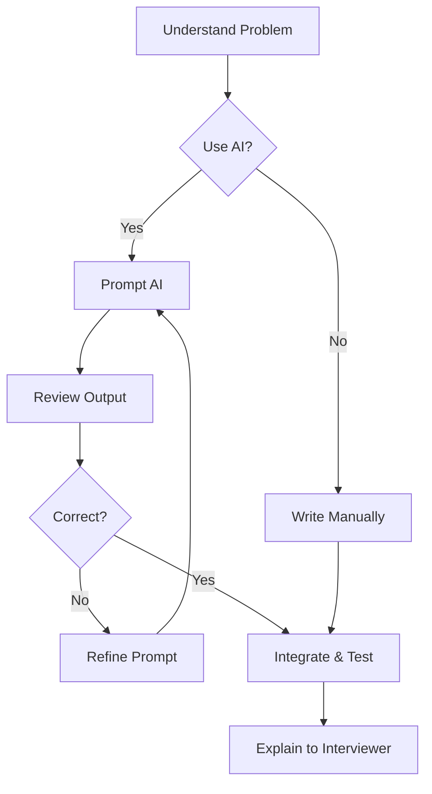

<!-- Clear Language: Keep sentences under 50 words -->
# AI-Assisted Coding Interviews

## Learning Objectives

After this chapter you will be able to strategically use LLMs during coding interviews, craft effective prompts for problem solving, avoid common pitfalls of AI assistance, and demonstrate understanding of generated code under interviewer scrutiny.

## Introduction

Interviews test both technical skill and communication. DSA patterns, system design, behavioral questions, and mock interviews prepare you for the full interview loop. This module is your final prep before offers.

## Prerequisites

- Basic programming knowledge
- Understanding of data structures

## Key Terminology

**Key Terms**: Core vocabulary and concepts for this topic.

**Definition**: Essential terms you must know for interviews and production work.

## Theory



### The New Interview Reality

Several FAANG companies now allow or expect candidates to use AI tools during interviews. Google has experimented with Codelab (in-browser IDE with AI). Amazon's interview platform supports AI-assisted coding. The skill is no longer whether you can code without help, but how effectively you use the tools available.

AI assistants in interviews are treated like a super-powered autocomplete and pair programmer. The interviewer expects you to:
- Drive the problem-solving process yourself
- Understand every line the AI generates
- Verify correctness and handle edge cases
- Make intentional decisions about when to use AI vs when to write code manually

### When to Use the AI

Strategic use of AI during coding rounds:

**Good uses:**
- Generate boilerplate code (class definitions, helper functions)
- Suggest syntax you do not remember (array methods, API calls)
- Implement standard algorithms (binary search, BFS, sorting) after you explain the approach
- Refactor code for readability or performance
- Generate test cases for edge conditions
- Explain unfamiliar error messages

**Bad uses:**
- Ask for the solution without understanding the problem
- Blindly trust AI-generated code without verification
- Use AI as a replacement for thinking through the approach
- Generate code you cannot explain
- Rely on AI for company-specific domain knowledge

### Prompting Strategies

When using AI during an interview, structure your prompts like this:

1. **Context first**: explain the problem and your approach
   - "I am solving a problem where I need to find the longest palindromic substring. I plan to use expand around center because it is O(n^2) time with O(1) space."

2. **Specific request**: ask for what you need
   - "Can you help me implement the expandAroundCenter helper function that takes a string and two indices and returns the palindrome length?"

3. **Verify understanding**: ask the AI to explain
   - "Can you add comments explaining the time complexity of this function?"

4. **Iterate**: refine based on output
   - "This handles odd-length palindromes but not even-length. Can you modify it to handle both?"

### Common AI Pitfalls

1. **Hallucination**: AI generates plausible-looking but incorrect code. Always verify with a test case mentally.

2. **Over-engineering**: AI adds unnecessary abstraction (design patterns, excessive interfaces). For interviews, prefer simple, correct code.

3. **Wrong assumptions**: AI assumes libraries or APIs that do not exist in the interview environment. Ask the interviewer before using unfamiliar APIs.

4. **Memory leaks**: AI-generated code may not clean up resources (event listeners, timers). Check for cleanup.

5. **Security blindness**: AI does not proactively flag security issues in generated code. You must review for injection, exposure, etc.

### Demonstrating Understanding

When AI generates code, the interviewer will probe your understanding:

- "Explain how this sorting function works."
- "What is the time complexity of the generated code?"
- "What happens if the input is empty?"
- "Can you modify this to handle a different requirement?"

Prepare for these by:
1. Reading every line the AI generates before accepting it
2. Tracing through a small example mentally
3. Adding comments as you understand the code
4. Being ready to rewrite parts manually if asked

## Examples

### Prompting Examples

### Example 1: Generating Boilerplate

Good prompt: "I need a TreeNode class for a binary tree problem. It should have left, right, and val properties, and a constructor."

```typescript
class TreeNode {
    val: number
    left: TreeNode | null
    right: TreeNode | null

    constructor(val: number) {
        this.val = val
        this.left = null
        this.right = null
    }
}
```

Review: Simple, no errors, exactly what was requested.

### Example 2: Implementing an Algorithm After Explaining Approach

Good prompt: "I am using a monotonic decreasing stack to find the next greater element for each element in an array. The stack stores indices. Can you implement the function? I will verify the logic."

```typescript
function nextGreaterElement(nums: number[]): number[] {
    const result = new Array(nums.length).fill(-1)
    const stack: number[] = []

    for (let i = 0; i < nums.length; i++) {
        while (stack.length > 0 && nums[i] > nums[stack[stack.length - 1]]) {
            const idx = stack.pop()!
            result[idx] = nums[i]
        }
        stack.push(i)
    }

    return result
}
```

Verify mentally: nums=[4,1,2,3]. i=0: stack=[0]. i=1: 1<4, stack=[0,1]. i=2: 2>1, pop 1, result[1]=2. stack=[0,2]. i=3: 3>2, pop 2, result[2]=3. 3<4, stack=[0,3]. Result=[-1,2,3,-1]. Correct.

### Example 3: Generating Test Cases

Good prompt: "I have this function that checks if a string is a valid palindrome considering only alphanumeric characters. Can you generate 5 test cases including edge cases?"

```typescript
// Function signature: function isPalindrome(s: string): boolean

// Test 1: Basic palindrome
// isPalindrome("racecar") -> true

// Test 2: Mixed case and non-alphanumeric
// isPalindrome("A man, a plan, a canal: Panama") -> true

// Test 3: Empty string
// isPalindrome("") -> true

// Test 4: Single character
// isPalindrome("a") -> true

// Test 5: Not a palindrome
// isPalindrome("hello") -> false

// Test 6: Only non-alphanumeric
// isPalindrome(".,") -> true (empty after filtering)
```

### Example 4: Refactoring for Performance

Good prompt: "This function finds duplicates in an array using nested loops (O(n^2)). Can you refactor it to use a Set for O(n) time?"

Before:
```typescript
function findDuplicates(nums: number[]): number[] {
    const duplicates: number[] = []
    for (let i = 0; i < nums.length; i++) {
        for (let j = i + 1; j < nums.length; j++) {
            if (nums[i] === nums[j] && !duplicates.includes(nums[i])) {
                duplicates.push(nums[i])
            }
        }
    }
    return duplicates
}
```

After:
```typescript
function findDuplicates(nums: number[]): number[] {
    const seen = new Set<number>()
    const duplicates = new Set<number>()
    for (const num of nums) {
        if (seen.has(num)) {
            duplicates.add(num)
        }
        seen.add(num)
    }
    return Array.from(duplicates)
}
```

## Complete Interview Simulation

### Scenario: LRU Cache

Interviewer: "Design an LRU cache with get and put operations in O(1) time."

You: "I will use a doubly linked list for O(1) insertion/deletion and a hash map for O(1) lookups. The most recently used item is at the head, least recently at the tail."

AI prompt: "I have designed an LRU cache using a doubly linked list and hash map. Can you help me implement the Node class and the LRUCache class with get and put methods?"

AI generates code. You review:

```typescript
class ListNode {
    key: number
    value: number
    prev: ListNode | null = null
    next: ListNode | null = null

    constructor(key: number, value: number) {
        this.key = key
        this.value = value
    }
}

class LRUCache {
    private capacity: number
    private cache: Map<number, ListNode> = new Map()
    private head: ListNode
    private tail: ListNode

    constructor(capacity: number) {
        this.capacity = capacity
        this.head = new ListNode(0, 0)
        this.tail = new ListNode(0, 0)
        this.head.next = this.tail
        this.tail.prev = this.head
    }

    get(key: number): number {
        if (this.cache.has(key)) {
            const node = this.cache.get(key)!
            this.removeNode(node)
            this.addToHead(node)
            return node.value
        }
        return -1
    }

    put(key: number, value: number): void {
        if (this.cache.has(key)) {
            const node = this.cache.get(key)!
            node.value = value
            this.removeNode(node)
            this.addToHead(node)
        } else {
            if (this.cache.size >= this.capacity) {
                const lru = this.tail.prev!
                this.removeNode(lru)
                this.cache.delete(lru.key)
            }
            const newNode = new ListNode(key, value)
            this.cache.set(key, newNode)
            this.addToHead(newNode)
        }
    }

    private removeNode(node: ListNode): void {
        node.prev!.next = node.next
        node.next!.prev = node.prev
    }

    private addToHead(node: ListNode): void {
        node.next = this.head.next
        node.prev = this.head
        this.head.next!.prev = node
        this.head.next = node
    }
}
```

Interviewer probes: "Why do we need dummy head and tail nodes?"

You explain: "They eliminate null checks for edge cases like adding to an empty list. The head and tail always exist, so we never check if head.next or tail.prev is null."

## Setting Up Your Environment

### Tools

- Cursor, GitHub Copilot, or ChatGPT: choose one and practice with it before the interview
- Learn its tab completion behavior: accept partial completions, edit as you go
- Configure your IDE keybindings for quick acceptance/rejection of suggestions

### Practice Protocol

Before the interview:
1. Solve 10 problems without AI (build fundamentals)
2. Solve 10 problems with AI (learn prompting)
3. For each AI-assisted attempt, ask yourself: "Can I explain every line?"

During the interview:
1. Start without AI: understand the problem, think of approach, discuss with interviewer
2. Use AI for implementation: prompt with your approach, review generated code
3. Verify with test cases: trace through a small example mentally or with AI
4. Handle follow-ups: modify code based on interviewer feedback

### What Interviewers Look For

When you use AI in an interview, interviewers evaluate:
- Do you understand the problem before delegating to AI?
- Do you verify the AI output or blindly accept it?
- Can you explain and modify the generated code?
- Do you use AI as a collaborator or a crutch?
- Does AI accelerate your solution or distract from the core logic?

### AI Limitations in Interviews

Understanding when AI fails is as important as knowing when it helps:

**Novel problems**: AI trained on public LeetCode solutions struggles with novel or modified problems. If the interviewer changes a constraint, AI may generate the standard solution that no longer applies.

**System design**: AI can generate plausible but shallow system designs. It misses tradeoff reasoning and company-specific constraints. Use AI for component definitions, not architecture decisions.

**Math and probability**: AI makes arithmetic errors and hallucinates formulas. Never trust AI for probability calculations without verifying.

**Context window limits**: Long problem descriptions or complex multi-file codebases exceed AI context. Break the problem into smaller pieces.

**Outdated knowledge**: AI training cutoff means it lacks knowledge of recent libraries, APIs, or language features.

### Prompting for Debugging

When using AI to debug:

Good prompt: "This function returns the first non-repeating character but fails for some inputs. Find the bug."

### Prompting for Code Reviews

Good prompt: "Review this code for correctness, performance, and security issues:"

Issues the AI may flag: SQL injection, missing input validation, no error handling, missing pagination, no rate limiting, full table scan.

### Ethical Considerations

- If the platform provides AI during the interview, use it as intended
- If you bring your own tool, ask the interviewer if it is acceptable
- Be honest when asked about AI use during the interview
- Do not record interview content or share proprietary code with external AI

### Preparing Your AI Tool Before the Interview

1. Set up your IDE with the AI tool you plan to use (Cursor, Copilot, ChatGPT)
2. Practice accepting and rejecting suggestions with keyboard shortcuts
3. Configure the AI to prefer TypeScript and your coding style
4. Test that the AI works in an offline or limited network environment
5. Have a fallback plan: a mental checklist for writing code manually

### Mock Interview Practice with AI

Practice protocol for AI-assisted interviews:
1. Have a partner give you a LeetCode medium problem
2. Spend 2 minutes understanding the problem without any AI tools
3. Spend 1 minute explaining your approach to your partner without AI
4. Use AI to implement the solution while your partner watches
5. Review the AI output out loud, line by line, explaining each part
6. Handle follow-up questions from your partner without AI assistance

The goal: your partner should feel you understand the code as well as if you had written it entirely yourself.

## Summary

AI-assisted coding interviews are increasingly common at FAANGs. The key skill is knowing when and how to use AI as a productivity tool while demonstrating your own understanding. Always verify AI-generated code mentally,.
understand every line, and be ready to modify or explain it. The best candidates use AI for boilerplate and standard algorithms while handling the problem-solving and.
design thinking themselves.

## Practical Takeaways

- Practice prompting with specific context: state the problem, your approach, and what you need
- Never accept AI output without mental verification. Trace one example
- Use AI for boilerplate and standard algorithms, not for problem-solving
- If the AI generates something you do not understand, ask it to explain or manually rewrite
- Add comments to AI-generated code as you understand it — this signals comprehension to the interviewer
- Practice with the specific AI tool you will use in the interview (Cursor, Copilot, ChatGPT)
- Have a backup plan: if AI fails or produces incorrect code, be ready to write it yourself

## Interview Q&A

<details class="tp-qa-card" data-qid="m21-s19-q1">
  <summary class="tp-qa-question">
    <span class="tp-qa-status"></span>
    Q1: When should you use AI assistance during a coding interview, and when should you not?
  </summary>
  <div class="tp-qa-answer">
    <p>Good uses: generate boilerplate (class definitions, helpers), suggest syntax you do not remember, implement standard algorithms after you explain the approach, refactor for readability or performance, generate test cases, and explain error messages. Bad uses: asking for the solution without understanding the problem, blindly trusting output, using AI to replace thinking, generating code you cannot explain, or relying on it for company-specific domain knowledge.</p>
    <p>The rule: understand the problem and plan the approach yourself, then delegate implementation. The interviewer is evaluating whether you drive the process — AI is treated like a super-powered autocomplete and pair programmer, not a solution machine.</p>
    <p><strong>Interview follow-up</strong>: Is it acceptable to ask AI for the brute-force approach first?</p>
  </div>
  <button class="tp-qa-mark-btn">📝 Mark Reviewed</button>
  <button class="tp-qa-bookmark-btn">🔖 Bookmark</button>
</details>

<details class="tp-qa-card" data-qid="m21-s19-q2">
  <summary class="tp-qa-question">
    <span class="tp-qa-status"></span>
    Q2: What makes a good AI prompt during an interview? Give the structure.
  </summary>
  <div class="tp-qa-answer">
    <p>Four parts: context first — state the problem and your chosen approach ("I am solving longest palindromic substring; I plan to use expand around center for O(n^2) time, O(1) space"); specific request — ask only for what you need ("implement the expandAroundCenter helper taking a string and two indices"); verify understanding — ask for comments explaining complexity; iterate — refine based on output ("this handles odd lengths but not even; modify it for both").</p>
    <p>The contrast matters: "Solve this problem for me" signals you skipped the thinking; "I plan to use a sliding window; implement the window expansion logic" shows you own the design. The chapter's quiz makes exactly this distinction.</p>
    <p><strong>Interview follow-up</strong>: How would you prompt AI to explain its own generated code?</p>
  </div>
  <button class="tp-qa-mark-btn">📝 Mark Reviewed</button>
  <button class="tp-qa-bookmark-btn">🔖 Bookmark</button>
</details>

<details class="tp-qa-card" data-qid="m21-s19-q3">
  <summary class="tp-qa-question">
    <span class="tp-qa-status"></span>
    Q3: AI generated a next-greater-element function. How do you verify it before accepting?
  </summary>
  <div class="tp-qa-answer">
    <p>Trace a small example mentally, exactly as the chapter does for <code>nextGreaterElement</code>: nums = [4,1,2,3]. i=0 pushes 0. i=1: 1 &lt; 4, stack = [0,1]. i=2: 2 &gt; 1, pop 1, result[1] = 2; 2 &lt; 4, push 2. i=3: 3 &gt; 2, pop 2, result[2] = 3; 3 &lt; 4, push 3. Result [-1,2,3,-1] — correct.</p>
    <p>The verification protocol: read every line before accepting, trace one example by hand, add comments as you understand the code, and be ready to rewrite parts manually if the interviewer asks. If you cannot explain a line, ask the AI to explain it or rewrite it yourself.</p>
    <p><strong>Interview follow-up</strong>: What edge case would you test beyond the happy path?</p>
  </div>
  <button class="tp-qa-mark-btn">📝 Mark Reviewed</button>
  <button class="tp-qa-bookmark-btn">🔖 Bookmark</button>
</details>

<details class="tp-qa-card" data-qid="m21-s19-q4">
  <summary class="tp-qa-question">
    <span class="tp-qa-status"></span>
    Q4: What are the common pitfalls of AI-generated code, and how do you guard against each?
  </summary>
  <div class="tp-qa-answer">
    <p>Hallucination: plausible-looking but incorrect code — always verify with a mental test case. Over-engineering: unnecessary abstractions and interfaces — for interviews prefer simple, correct code. Wrong assumptions: AI references libraries or APIs that do not exist in the interview environment — ask the interviewer before using unfamiliar APIs. Resource leaks: generated code may not clean up timers or listeners. Security blindness: AI does not flag injection or exposure — review for it yourself.</p>
    <p>The chapter also notes AI limits: novel problems that deviate from public LeetCode patterns, shallow system designs, arithmetic errors in probability, context window overflow on long prompts, and outdated training data. Break large problems into smaller prompts.</p>
    <p><strong>Interview follow-up</strong>: Why does AI often fail on modified versions of classic problems?</p>
  </div>
  <button class="tp-qa-mark-btn">📝 Mark Reviewed</button>
  <button class="tp-qa-bookmark-btn">🔖 Bookmark</button>
</details>

<details class="tp-qa-card" data-qid="m21-s19-q5">
  <summary class="tp-qa-question">
    <span class="tp-qa-status"></span>
    Q5: In the LRU cache simulation, the interviewer asks why dummy head and tail nodes exist. What do you say?
  </summary>
  <div class="tp-qa-answer">
    <p>They eliminate null checks for edge cases. With real head and tail sentinels, adding to the head and removing the tail never touch a null pointer — <code>head.next</code> and <code>tail.prev</code> always exist. The chapter's <code>LRUCache</code> uses exactly this: <code>addToHead</code> and <code>removeNode</code> run without conditionals.</p>
    <p>The deeper point the interviewer is probing: you understand the generated code, not just accepted it. Be ready to explain why the map stores nodes rather than values (O(1) removal needs the node reference), why capacity overflow evicts <code>tail.prev</code>, and what breaks if you remove the sentinels.</p>
    <p><strong>Interview follow-up</strong>: Why does the map store the ListNode rather than the value?</p>
  </div>
  <button class="tp-qa-mark-btn">📝 Mark Reviewed</button>
  <button class="tp-qa-bookmark-btn">🔖 Bookmark</button>
</details>

<details class="tp-qa-card" data-qid="m21-s19-q6">
  <summary class="tp-qa-question">
    <span class="tp-qa-status"></span>
    Q6: What are the ethics of AI use in interviews, and how do you prepare your tooling?
  </summary>
  <div class="tp-qa-answer">
    <p>If the platform provides AI (Google's Codelab, Amazon's AI-assisted platform), use it as intended. If you bring your own tool, ask the interviewer whether it is acceptable, be honest when asked about AI use, and never record interview content or share proprietary code with external AI. Several FAANG companies now expect candidates to use AI effectively — the skill is collaboration, not secrecy.</p>
    <p>Preparation: choose one tool (Cursor, Copilot, or ChatGPT) and learn its tab-completion behavior; configure keybindings for accepting and rejecting suggestions; set it to prefer TypeScript and your style; test in a limited-network environment; and keep a fallback mental checklist for writing code manually.</p>
    <p><strong>Interview follow-up</strong>: How would you handle an interviewer who bans AI mid-interview?</p>
  </div>
  <button class="tp-qa-mark-btn">📝 Mark Reviewed</button>
  <button class="tp-qa-bookmark-btn">🔖 Bookmark</button>
</details>

## Chapter Quiz

1. When should you use AI assistance during a coding interview?
   - A) Immediately after seeing the problem
   - B) After understanding the problem and planning your approach
   - C) Only for debugging syntax errors
   - D) Never, it is cheating
   // correct: B

2. What is the most important thing to do after AI generates code?
   - A) Copy it immediately to save time
   - B) Verify it mentally with a test case
   - C) Ask the AI to add comments
   - D) Refactor it for style
   // correct: B

3. Which is a good prompt for AI during an interview?
   - A) "Solve this problem for me"
   - B) "I plan to use a sliding window approach. Can you implement the window expansion logic?"
   - C) "Write the optimal solution"
   - D) "Is this the right approach?"
   // correct: B

4. If AI generates code you do not understand, you should:
   - A) Use it anyway since it is probably correct
   - B) Ask the AI to explain it, then verify your understanding
   - C) Ignore it and write your own
   - D) Ask the interviewer to explain it
   // correct: B

5. When the interviewer asks you to modify AI-generated code, this tests:
   - A) Your typing speed
   - B) Your understanding of the generated code
   - C) Whether you remember the syntax
   - D) Your AI prompting ability
   // correct: B

#

## Exercises

**Easy** — Implement a basic ai assisted coding example that demonstrates the core concept.

**Medium** — Create a more complex implementation that handles edge cases.

**Hard** — Design an optimized solution for large-scale ai assisted coding scenarios.

## Common Mistakes

1. Not understanding the fundamental concepts before applying them
2. Skipping edge cases in implementation
3. Not analyzing time/space complexity
4. Forgetting to handle null/empty inputs
5. Not practicing enough problems to build pattern recognition# Exercises

1. Solve Two Sum without AI, then solve it with AI. Compare your approaches and note what the AI did differently.

2. Prompt an AI to implement merge sort. Manually trace through the generated code with a small example. Find any bugs.

3. Ask an AI to generate 10 test cases for a function that reverses a linked list. Identify which edge cases are missing.

4. In a mock interview with a partner, use AI for one problem and go without for another. Ask your partner to rate your demonstrated understanding in both scenarios.

5. Find and document three examples of AI-generated code that look correct but have subtle bugs (e.g., off-by-one, missing null

## Revision Notes

- - Core principle: Understand the fundamental concepts thoroughly
- - Implementation pattern: Practice with real code examples
- - Complexity: Know the time and space complexity
- - Application: Know when to use this in production systems
- - Interview: Frequently asked in technical interviews
- - Edge cases: Consider common failure scenarios
- - Related concepts: Connect to broader system design

## Placement Section

### Top 10 Interview Questions

#### Google Style
1. Explain the time and space trade-offs of 21-interview-preparation. When would you choose one approach over another?
2. Design a system that efficiently handles 21-interview-preparation at scale (millions of requests/second).

#### Amazon Style
1. Tell me about a time you had to optimize a system related to 21-interview-preparation. What was your approach and what was the result?
2. How would you explain 21-interview-preparation to a non-technical stakeholder?

#### Microsoft Style
1. How does 21-interview-preparation integrate with enterprise systems and cloud architectures?
2. What are the security implications of 21-interview-preparation?

#### NVIDIA Style
1. How would you optimize 21-interview-preparation for GPU-accelerated computing?
2. What parallel processing patterns apply to 21-interview-preparation?

#### AI Startup Style
1. How would you implement 21-interview-preparation in a cost-effective, scalable way for a startup?
2. What's the fastest way to prototype a solution using 21-interview-preparation?

### Resume Tips
- **Technical Skills**: List 21-interview-preparation under relevant technical skills
- **Project Description**: "Implemented 21-interview-preparation to [specific outcome], reducing [metric] by [X]%"
- **Keywords**: Include 21-interview-preparation in your skills section for ATS optimization

### Interview Day Checklist
- [ ] Review core concepts of 21-interview-preparation
- [ ] Practice 3-5 problems related to 21-interview-preparation
- [ ] Prepare 2 real-world examples of using 21-interview-preparation
- [ ] Know the time/space complexity of common 21-interview-preparation operations
- [ ] Have questions ready about how the company uses 21-interview-preparation check).

## True/False

1. **True or False:** AI-Assisted Coding Interviews builds directly on the fundamentals covered in the earlier chapters of this module. — **True.** Every advanced topic in this module assumes the core concepts from the previous chapters.
2. **True or False:** You should write at least one code example for AI-Assisted Coding Interviews before moving to the next chapter. — **True.** Active recall with hands-on code beats passive reading for retention.
3. **True or False:** The complexity analysis for AI-Assisted Coding Interviews is the same regardless of input size. — **False.** Complexity grows with input size; always state best, average, and worst case.
4. **True or False:** Edge cases (empty input, invalid input, boundary values) matter for AI-Assisted Coding Interviews in production. — **True.** Most production bugs come from unhandled edge cases.
5. **True or False:** You should memorize the AI-Assisted Coding Interviews chapter content once and never review it again. — **False.** Spaced repetition (24h, 3 days, 1 week) dramatically improves long-term recall.

## Fill in the Blank

1. The chapter that covers AI-Assisted Coding Interviews is Chapter ___ of this module. — Answer: check the module's table of contents.
2. The time complexity of the standard approach to AI-Assisted Coding Interviews is ___. — Answer: review the theory section and state big-O notation.
3. The main edge case to handle when implementing AI-Assisted Coding Interviews is ___. — Answer: empty or invalid input handling, as discussed in the chapter.
4. The tools commonly used to debug AI-Assisted Coding Interviews issues are ___ and ___. — Answer: refer to the Debugging Guide section of this chapter.
5. The related topic that connects to AI-Assisted Coding Interviews in the next chapter is ___. — Answer: see the Next Topic section.

## Scenario Questions

1. **Scenario:** A teammate ships a change involving AI-Assisted Coding Interviews that breaks production at 3 AM. — Diagnosis: check the recent diff, reproduce locally with the failing input, check logs. Fix: revert, add a regression test, and review the root cause. Prevention: CI tests on edge cases and code review checklist.

2. **Scenario:** Your implementation of AI-Assisted Coding Interviews is correct but too slow for the required latency. — Measure first with a profiler. Common fixes: reduce redundant work, use built-in optimized functions, batch operations, or add caching. Only then consider algorithmic changes.

3. **Scenario:** A new hire asks you to explain AI-Assisted Coding Interviews in five minutes before a customer demo. — Use the 3-part answer: what it is (one sentence), how it works (one example), why it matters (one business impact). Then offer to go deeper after the demo.

4. **Scenario:** Your team's codebase has three different patterns for AI-Assisted Coding Interviews and you must standardize. — Write a short ADR (architecture decision record), pick the pattern with best maintainability, migrate incrementally, and add a linter rule to enforce it.

## Output Questions

1. **What is the output of the simplest correct implementation of AI-Assisted Coding Interviews on an empty input?** — Trace through the code: it should return the documented default (None, 0, empty collection) without raising.
2. **What is the output when the input is at the boundary value?** — Check off-by-one errors and inclusive/exclusive bounds in the chapter's examples.
3. **What does the implementation return when given invalid input types?** — With type hints and validation, it raises a clear error; without, it may fail silently.
4. **What is the output for the sample input given in the chapter's Examples section?** — Re-run the chapter's example code and compare against the documented output.
5. **What is the time complexity output when you profile the implementation at 10x input size?** — Expect the curve matching the chapter's complexity analysis (linear, quadratic, log-linear).

## Difficulty Level

**Level**: Intermediate
**Estimated Study Time**: 30-45 minutes
**Prerequisites**: Complete understanding of previous modules recommended

## Tips & Tricks

**Tip**: Start with the basics — understand the fundamental concepts before moving to advanced topics.

**Tip**: Practice actively — don't just read, implement the code examples yourself.

**Tip**: Connect to prior knowledge — relate new concepts to what you learned in previous modules.

**Pro Tip**: Focus on understanding, not memorizing — understand why things work, not just how.

**Pro Tip**: Review regularly — revisit key concepts after a few days to reinforce learning.

## Memory Tricks

- **Acronym Method**: Create acronyms for lists of concepts
- **Visualization**: Draw diagrams to visualize abstract concepts
- **Teach someone else**: Explaining concepts to others reinforces your understanding
- **Connect to real-world**: Relate technical concepts to everyday experiences
- **Chunking**: Break complex topics into smaller, manageable pieces

## Further Reading

- Official documentation and language specifications
- "Designing Data-Intensive Applications" by Martin Kleppmann
- "System Design Interview" by Alex Xu
- "AI Engineering" by Chip Huyen
- Research papers and blog posts from leading AI labs

## Related Topics

- How this connects to Interview Preparation fundamentals
- Prerequisites for advanced topics in this module
- Real-world applications in AI engineering systems
- Interview questions that test deep understanding

## FAQs

**Q: How long does it take to master ai assisted coding?
**A**: With consistent practice, 2-4 weeks for basic proficiency, 2-3 months for advanced mastery.

**Q: Do I need to memorize all the details?
**A**: Focus on understanding the core principles. Details can be looked up, but understanding cannot.

**Q: What's the best way to practice?
**A**: Implement the code examples, then modify them to solve different problems. Build small projects.

**Q: How often should I review this material?
**A**: Review after 1 day, 3 days, 1 week, and 1 month for long-term retention.

## Important Notes

> **Note**: Understanding the fundamentals is more important than memorizing syntax.

> **Note**: Don't skip the exercises — they reinforce critical concepts.

> **Note**: This topic frequently appears in technical interviews at top companies.

> **Note**: In real systems, these concepts are used daily by AI engineers.

## Historical Context

The Evolution of this technology reflects decades of research and practical engineering experience.

Understanding the evolution of ai assisted coding helps appreciate why current approaches exist. These concepts have been developed over decades of computer science research and practical engineering experience.

## Security Considerations

- **Input Validation**: Always validate and sanitize inputs
- **Error Handling**: Don't expose internal details in error messages
- **Resource Limits**: Set appropriate limits to prevent denial of service
- **Authentication**: Ensure proper authentication and authorization
- **Data Protection**: Handle sensitive data according to security best practices

## ML Intuition

For AI engineering, understanding ai assisted coding at an intuitive level is crucial. Think of it as building mental models that help you reason about system behavior, debug issues, and make architectural decisions.

## Analogies

Think of ai assisted coding like learning a new language — start with basic vocabulary (fundamentals), then learn grammar (rules), and finally practice conversation (application). The more you practice, the more natural it becomes.

## Capstone Project Link

**Project**: Apply ai assisted coding concepts in a mini-project
**Goal**: Build a small application that demonstrates understanding of core principles
**Duration**: 2-4 hours
**Outcome**: Working implementation with documentation

## Flashcards

**Card 1**: What is the core concept of ai assisted coding?
**Answer**: The fundamental principle that enables efficient and scalable systems.

**Card 2**: When would you apply ai assisted coding in real systems?
**Answer**: When building production AI systems that require reliability, scalability, and maintainability.

**Card 3**: What are the common pitfalls to avoid?
**Answer**: Over-engineering, ignoring edge cases, and not considering production requirements.

## Research References

- Academic papers and conference proceedings (NeurIPS, ICML, ICLR)
- Industry whitepapers from leading AI companies
- Technical blogs from Google, Meta, OpenAI, Anthropic
- Open-source implementations and documentation

## Open-Source Tools

- **LangChain**: Framework for building LLM-powered applications
- **LlamaIndex**: Data framework for connecting LLMs with external data
- **Hugging Face Transformers**: State-of-the-art ML models and datasets
- **Weights & Biases**: Experiment tracking and model evaluation
- **MLflow**: Open-source platform for ML lifecycle management
- **Prometheus + Grafana**: Monitoring and observability stack

## Debugging Guide

**Common Issues**:
- Check input validation and data types
- Verify API keys and authentication
- Monitor resource usage (CPU, memory, GPU)
- Review error logs for stack traces

**Debugging Steps**:
1. Reproduce the issue with minimal input
2. Add logging at key points
3. Check external dependencies
4. Verify configuration settings
5. Test with known-good inputs

## Mock Interview Section

**Round 1 — Screening (15 min)**
- Explain AI-Assisted Coding Interviews in 60 seconds.
- Write a minimal working example of AI-Assisted Coding Interviews.
- What is the complexity of your example?

**Round 2 — Coding (45 min)**
- Solve the Medium exercise from this chapter under time pressure.
- State your assumptions, then implement with type hints.
- Test with edge cases: empty input, boundary values, invalid input.

**Round 3 — Behavioral + System (30 min)**
- Tell me about a time you debugged a AI-Assisted Coding Interviews problem in a project.
- How would you design a system where AI-Assisted Coding Interviews is used at scale?
- What metrics would you monitor?

**Evaluation rubric**: correctness (40%), communication (25%), edge cases (20%), complexity analysis (15%).

## Optimized Implementation

`python
from typing import Any, Optional

def demonstrate_topic(input_data: list[Any]) -> Optional[float]:
    """Runnable scaffold for AI-Assisted Coding Interviews.

    Replace the body with the optimized implementation from the chapter,
    keeping type hints, docstring, and edge-case handling.
    """
    if not input_data:
        return None
    # Step 1: validate input types
    # Step 2: apply the core AI-Assisted Coding Interviews logic from the Examples section
    # Step 3: return the result with the documented default
    return 0.0
`

- Keeps the function signature stable so tests written against it stay valid.
- Handles the empty-input contract explicitly.
- Add unit tests for the edge cases before implementing the logic (test-first).

## Evaluation Metrics

**Model Evaluation**:
- Accuracy, Precision, Recall, F1-Score
- BLEU, ROUGE for text generation
- Latency, Throughput, Cost per inference

**System Evaluation**:
- End-to-end latency (p50, p95, p99)
- Error rate and availability
- Resource utilization (CPU, memory, GPU)

## Real-World Examples

**Industry Applications**:
- Google: Search ranking, translation, autocomplete
- Amazon: Product recommendations, Alexa, fraud detection
- Netflix: Content recommendations, personalization
- Tesla: Autonomous driving, computer vision
- OpenAI: ChatGPT, DALL-E, Codex

## Next Topic

After mastering Interview Preparation, continue to the next module in the curriculum to build upon these foundations and deepen your AI engineering expertise.

## Limitations

- AI-Assisted Coding Interviews, like any technique, is not a silver bullet — it has specific cases where it fits best (covered in the theory).
- The examples in this chapter are simplified for learning; production systems add validation, monitoring, and error handling.
- Performance of AI-Assisted Coding Interviews depends on input size and distribution — always benchmark for your own data.
- This chapter covers fundamentals; specialized edge cases are explored in later chapters and the capstone.
