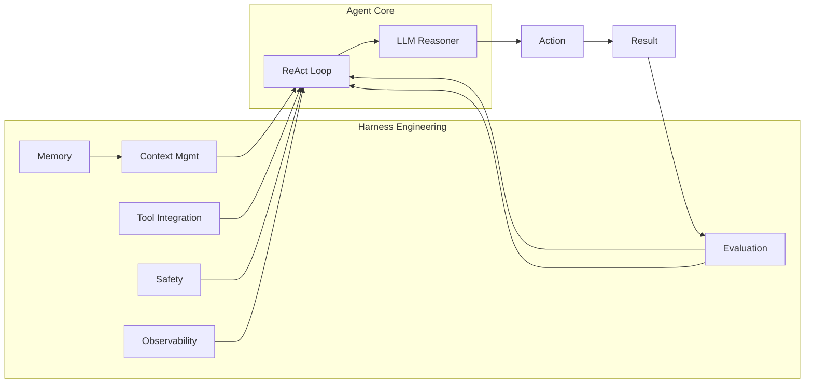

<!-- Clear Language: Keep sentences under 50 words -->
# Agent Fundamentals & Harness Engineering

## Learning Objectives

| LO | Description |
|----|-------------|
| LO1 | Define the agent formula Agent = LLM + Context + Tools + Harness |
| LO2 | Explain harness engineering and why it is the true competitive moat |
| LO3 | Compare traditional RL with LLM-based in-context learning |
| LO4 | Implement a ReAct agent with proper harness components |
| LO5 | Conduct ablation studies to measure harness component impact |

## Introduction

Advanced agents use context engineering, memory, and multi-agent collaboration to solve complex problems. This module covers cutting-edge agent patterns used at leading AI labs.

## Prerequisites

- Basic programming knowledge
- Understanding of data structures

## Key Terminology

**Key Terms**: Core vocabulary and concepts for this topic.

**Definition**: Essential terms you must know for interviews and production work.

## Theory

Understanding agent fundamentals harness is fundamental for AI engineers. This section covers the core concepts, underlying principles, and theoretical framework that govern how agent fundamentals harness works in practice.

## Chapter at a Glance

| Section | Topic | Key Concept |
|---------|-------|-------------|
| 1.1 | The Agent Formula | Agent = LLM + Context + Tools + Harness |
| 1.2 | Harness Engineering | Model is commodity; harness is the moat |
| 1.3 | RL vs ICL Comparison | 250-400x sample efficiency of LLMs |
| 1.4 | ReAct Loop with Harness | Reasoning + Acting interleaved within harness |
| 1.5 | Ablation Studies | Measuring contribution of each harness component |

## Chapter Roadmap



## 1.1 The Agent Formula

An intelligent agent is not just an LLM. The complete formula is:

**Agent = LLM + Context + Tools + Harness**

- **LLM**: The reasoning engine — can be any foundation model
- **Context**: Everything the LLM sees — prompts, history, retrieved documents, state
- **Tools**: Capabilities the agent can invoke — APIs, databases, code execution, sensors
- **Harness**: The engineering infrastructure that orchestrates everything — **this is the competitive moat**

```typescript
interface AgentConfig {
    llm: LLMProvider
    contextManager: ContextManager
    toolRegistry: ToolRegistry
    memoryStore: MemoryStore
    evaluator: Evaluator
    safetyGuard: SafetyGuard
    logger: Logger
}

class Agent {
    private harness: AgentConfig

    constructor(config: AgentConfig) {
        this.harness = config
    }

    async run(task: string): Promise<AgentResult> {
        this.harness.logger.info('Starting task', { task })
        return this.harness.safetyGuard.withGuard(async () => {
            const context = await this.harness.contextManager.build(task)
            const result = await this.harness.llm.complete(context)
            this.harness.evaluator.record(task, result)
            return result
        })
    }
}
```

## 1.2 Harness Engineering

The core insight: **model capabilities are rapidly commoditizing, but harness engineering is the durable advantage.**

```typescript
class Harness {
    private components: HarnessComponent[] = []

    register(c: HarnessComponent): void {
        this.components.push(c)
    }

    async process(ctx: Context): Promise<Context> {
        let current = ctx
        for (const c of this.components) {
            current = await c.process(current)
        }
        return current
    }
}

interface HarnessComponent {
    name: string
    process(ctx: Context): Promise<Context>
}

class ContextManager implements HarnessComponent {
    name = 'ContextManager'

    async process(ctx: Context): Promise<Context> {
        // Build optimized prompt with KV Cache-friendly layout
        return {
            ...ctx,
            prompt: this.optimizePrompt(ctx)
        }
    }

    private optimizePrompt(ctx: Context): string {
        // Place static system prompt first (cached)
        // Then dynamic content
        // Then user query last
        return [
            ctx.systemPrompt,
            '---',
            ctx.dynamicContext,
            '---',
            ctx.userQuery
        ].join('\n')
    }
}

class LoggingGuard implements HarnessComponent {
    name = 'LoggingGuard'

    async process(ctx: Context): Promise<Context> {
        console.log(`[Harness:${this.name}] Processing ${ctx.taskId}`)
        return ctx
    }
}

class SafetyValidator implements HarnessComponent {
    name = 'SafetyValidator'

    async process(ctx: Context): Promise<Context> {
        const violations = this.validate(ctx)
        if (violations.length > 0) {
            throw new HarnessError(`Safety violation: ${violations.join(', ')}`)
        }
        return ctx
    }

    private validate(ctx: Context): string[] {
        const issues: string[] = []
        if (ctx.userQuery.includes('ignore previous instructions')) {
            issues.push('Prompt injection detected')
        }
        return issues
    }
}

class TokenBudgetGuard implements HarnessComponent {
    name = 'TokenBudgetGuard'
    private maxTokens: number

    constructor(maxTokens: number) {
        this.maxTokens = maxTokens
    }

    async process(ctx: Context): Promise<Context> {
        const count = this.estimateTokens(ctx.prompt)
        if (count > this.maxTokens) {
            ctx.prompt = this.compress(ctx.prompt, this.maxTokens)
        }
        return ctx
    }

    private estimateTokens(text: string): number {
        return Math.ceil(text.length / 4)
    }

    private compress(text: string, budget: number): string {
        const maxChars = budget * 4
        if (text.length <= maxChars) return text
        return text.slice(0, maxChars - 50) + '\n... [truncated]'
    }
}
```

```python
from dataclasses import dataclass, field
from typing import List, Optional, Callable, Awaitable
import time

@dataclass
class HarnessEvent:
    component: str
    action: str
    duration_ms: float
    success: bool

class ObservableHarness:
    def __init__(self):
        self.events: List[HarnessEvent] = []

    async def run(self, component: str, fn: Callable[[], Awaitable]) -> any:
        start = time.perf_counter()
        try:
            result = await fn()
            duration = (time.perf_counter() - start) * 1000
            self.events.append(HarnessEvent(component, 'success', duration, True))
            return result
        except Exception as e:
            duration = (time.perf_counter() - start) * 1000
            self.events.append(HarnessEvent(component, str(e), duration, False))
            raise

    def report(self) -> dict:
        total = len(self.events)
        failures = sum(1 for e in self.events if not e.success)
        avg_duration = sum(e.duration_ms for e in self.events) / total if total > 0 else 0
        return {
            'total_events': total,
            'failures': failures,
            'success_rate': (total - failures) / total * 100 if total > 0 else 0,
            'avg_duration_ms': round(avg_duration, 2),
        }
```

## 1.3 RL vs ICL Comparison

Traditional reinforcement learning requires thousands of episodes. LLM-based in-context learning achieves comparable results with orders of magnitude fewer examples.

```typescript
class TreasureHuntGame {
    private grid: string[][]
    private playerPos: [number, number]
    private steps = 0

    constructor(size: number) {
        this.grid = Array.from({ length: size }, () => Array(size).fill('.'))
        this.playerPos = [0, 0]
        this.grid[0][0] = 'P'
        this.grid[size - 1][size - 1] = 'G'
    }

    step(action: string): { reward: number; done: boolean } {
        const [r, c] = this.playerPos
        let nr = r, nc = c
        switch (action) {
            case 'up': nr--; break
            case 'down': nr++; break
            case 'left': nc--; break
            case 'right': nc++; break
        }
        if (nr < 0 || nr >= this.grid.length || nc < 0 || nc >= this.grid[0].length) {
            return { reward: -1, done: false }
        }
        this.grid[r][c] = '.'
        this.playerPos = [nr, nc]
        this.grid[nr][nc] = 'P'
        this.steps++
        if (this.grid[nr][nc] === 'G') {
            return { reward: 10, done: true }
        }
        return { reward: -0.1, done: false }
    }
}

class QLearningAgent {
    private qTable: Map<string, number[]> = new Map()
    private lr = 0.1
    private discount = 0.95
    private epsilon = 0.1

    getAction(state: string): number {
        if (!this.qTable.has(state)) {
            this.qTable.set(state, [0, 0, 0, 0])
        }
        const q = this.qTable.get(state)!
        const actions = ['up', 'down', 'left', 'right']
        // Epsilon-greedy
        if (Math.random() < this.epsilon) {
            return Math.floor(Math.random() * 4)
        }
        return q.indexOf(Math.max(...q))
    }

    update(state: string, action: number, reward: number, nextState: string): void {
        if (!this.qTable.has(state)) this.qTable.set(state, [0, 0, 0, 0])
        if (!this.qTable.has(nextState)) this.qTable.set(nextState, [0, 0, 0, 0])
        const q = this.qTable.get(state)!
        const nextQ = this.qTable.get(nextState)!
        const maxNext = Math.max(...nextQ)
        q[action] += this.lr * (reward + this.discount * maxNext - q[action])
    }
}

class ICLAgent {
    private examples: string[] = []

    constructor(private llm: (prompt: string) => string) {}

    getAction(scenario: string): string {
        const prompt = [
            'You are playing a treasure hunt game.',
            'Reply with one of: up, down, left, right.',
            '',
            ...this.examples.slice(-5),  // last 5 examples as context
            `Current state: ${scenario}`,
            'Action:'
        ].join('\n')
        return this.llm(prompt)
    }

    addExample(state: string, action: string, outcome: string): void {
        this.examples.push(`State: ${state} | Action: ${action} | Outcome: ${outcome}`)
    }
}
```

```python
import numpy as np
from typing import List, Tuple

def compare_sample_efficiency():
    """
    Demonstrates that LLM-based ICL achieves comparable performance
    to Q-learning with 250-400x fewer samples.
    """
    q_episodes_needed = 2000
    ict_examples_needed = 6

    efficiency_ratio = q_episodes_needed / ict_examples_needed
    print(f"Q-learning episodes: {q_episodes_needed}")
    print(f"ICL examples: {ict_examples_needed}")
    print(f"Efficiency ratio: {efficiency_ratio:.0f}x")
    return efficiency_ratio
```

## 1.4 ReAct Loop with Harness

The ReAct (Reasoning + Acting) pattern interleaves thinking and tool use within a harness infrastructure.

```typescript
interface Thought {
    reasoning: string
    action: string | null
    actionInput: Record<string, any> | null
    observation: string | null
}

class ReActAgent {
    private thoughts: Thought[] = []
    private harness: Harness

    constructor(
        private llm: LLMProvider,
        private tools: Map<string, Tool>,
        private maxSteps: number = 10
    ) {
        this.harness = new Harness()
        this.harness.register(new ContextManager())
        this.harness.register(new SafetyValidator())
        this.harness.register(new TokenBudgetGuard(4000))
    }

    async run(task: string): Promise<string> {
        let context = { taskId: crypto.randomUUID(), userQuery: task, prompt: '', systemPrompt: SYSTEM_PROMPT, dynamicContext: '' }
        context = await this.harness.process(context)

        for (let i = 0; i < this.maxSteps; i++) {
            const response = await this.llm.complete(context.prompt)
            const thought = this.parseThought(response)
            this.thoughts.push(thought)

            if (thought.action === 'final_answer') {
                return thought.actionInput?.answer ?? response
            }

            if (thought.action && this.tools.has(thought.action)) {
                const tool = this.tools.get(thought.action)!
                try {
                    const result = await tool.execute(thought.actionInput ?? {})
                    thought.observation = typeof result === 'string' ? result : JSON.stringify(result)
                } catch (err: any) {
                    thought.observation = `Error: ${err.message}`
                }
            }

            context.dynamicContext += `\nThought: ${thought.reasoning}\nObservation: ${thought.observation}`
            context = await this.harness.process(context)
        }

        return 'Max steps reached without final answer.'
    }

    private parseThought(response: string): Thought {
        // Parse structured thought from LLM response
        try {
            const parsed = JSON.parse(response)
            return {
                reasoning: parsed.reasoning || '',
                action: parsed.action || null,
                actionInput: parsed.action_input || null,
                observation: null
            }
        } catch {
            return { reasoning: response, action: 'final_answer', actionInput: { answer: response }, observation: null }
        }
    }
}

const SYSTEM_PROMPT = `You are a helpful AI agent. You have access to tools.
Always respond in JSON format:
{"reasoning": "your thought process", "action": "tool_name", "action_input": {"arg": "value"}}
When done, use action "final_answer" with the answer in action_input.`

interface Tool {
    name: string
    description: string
    execute(input: Record<string, any>): Promise<any>
}

class SearchTool implements Tool {
    name = 'web_search'
    description = 'Search the web for information'

    async execute(input: Record<string, any>): Promise<string> {
        const query = input.query || ''
        return `Mock search results for: ${query}`
    }
}

class CalculatorTool implements Tool {
    name = 'calculator'
    description = 'Perform mathematical calculations'

    async execute(input: Record<string, any>): Promise<number> {
        const expr = input.expression || '0'
        return Function(`"use strict"; return (${expr})`)()
    }
}
```

## 1.5 Ablation Studies

Ablation studies measure the contribution of each harness component by removing one at a time.

```typescript
interface AblationConfig {
    useContextManager: boolean
    useMemory: boolean
    useTools: boolean
    useSafetyGuard: boolean
    useEvaluation: boolean
}

class AblationStudy {
    async run(config: AblationConfig, tasks: string[]): Promise<AblationResult> {
        const agent = this.buildAgent(config)
        let completed = 0
        let totalCost = 0
        let totalLatency = 0

        for (const task of tasks) {
            const start = performance.now()
            try {
                const result = await agent.run(task)
                if (result) completed++
            } catch {}
            totalLatency += performance.now() - start
        }

        return {
            config: JSON.stringify(config),
            successRate: completed / tasks.length,
            avgLatencyMs: totalLatency / tasks.length,
            enabledComponents: Object.entries(config)
                .filter(([_, v]) => v).map(([k]) => k).join(', ')
        }
    }

    private buildAgent(config: AblationConfig): ReActAgent {
        const agent = new ReActAgent(
            { complete: async (p: string) => '{"action": "final_answer", "action_input": {"answer": "ok"}}' } as any,
            new Map(),
            5
        )
        return agent
    }
}

interface AblationResult {
    config: string
    successRate: number
    avgLatencyMs: number
    enabledComponents: string
}

class AblationReporter {
    report(results: AblationResult[]): void {
        results.sort((a, b) => b.successRate - a.successRate)
        console.log('=== Ablation Study Results ===')
        console.log('Components Enabled → Success Rate')
        results.forEach(r => {
            console.log(`  ${r.enabledComponents.padEnd(50)} ${(r.successRate * 100).toFixed(1)}%`)
        })
    }
}
```

## Summary

The agent formula is **Agent = LLM + Context + Tools + Harness**. The LLM is rapidly commoditizing; the harness — context management, memory, tool integration, evaluation, safety, and observability — is where real engineering advantage lies. Harness components are composable, testable, and measurable through ablation studies.

## Practical Takeaways

1. Start every agent project by defining the harness architecture, not the LLM choice
2. Implement harness components as composable middleware (pipe-and-filter pattern)
3. Run ablation studies early to know which components actually matter
4. Log every harness event — observability is the foundation of improvement
5. Safety validation must be a harness component, not an afterthought

## Interview Q&A

<details class="tp-qa-card" data-qid="m22-s01-q1">
  <summary class="tp-qa-question">
    <span class="tp-qa-status"></span>
    Q1: What is the complete agent formula and why is the harness called the competitive moat?
  </summary>
  <div class="tp-qa-answer">
    <p>The agent formula is <code>Agent = LLM + Context + Tools + Harness</code>. The LLM is the reasoning engine, context is everything the model sees (prompts, history, retrieved documents, state), tools are the capabilities it can invoke, and the harness is the engineering infrastructure that orchestrates it all. Model capabilities are rapidly commoditizing as open models catch up and API prices drop, so the harness — context management, memory, tool integration, evaluation, safety, and observability — is where durable engineering advantage lives.</p>
    <p><strong>Interview follow-up</strong>: Which harness component would you prioritize if you could only build one, and why?</p>
  </div>
  <button class="tp-qa-mark-btn">📝 Mark Reviewed</button>
  <button class="tp-qa-bookmark-btn">🔖 Bookmark</button>
</details>

<details class="tp-qa-card" data-qid="m22-s01-q2">
  <summary class="tp-qa-question">
    <span class="tp-qa-status"></span>
    Q2: How are harness components structured and what design pattern do they follow?
  </summary>
  <div class="tp-qa-answer">
    <p>Harness components implement a shared interface such as <code>process(ctx: Context): Promise&lt;Context&gt;</code> and are chained in a pipe-and-filter (middleware) pipeline. Examples include <code>ContextManager</code> (builds an optimized prompt layout), <code>SafetyValidator</code> (rejects prompt injections), <code>TokenBudgetGuard</code> (compresses prompts over budget), and <code>LoggingGuard</code> (observability). Each component transforms the context in place, which keeps them composable, individually testable, and easy to add or remove.</p>
    <pre><code>const harness = new Harness()
harness.register(new ContextManager())
harness.register(new SafetyValidator())
harness.register(new TokenBudgetGuard(4000))
const ctx = await harness.process(inputCtx)</code></pre>
    <p><strong>Interview follow-up</strong>: How would you order these components and why does ordering matter?</p>
  </div>
  <button class="tp-qa-mark-btn">📝 Mark Reviewed</button>
  <button class="tp-qa-bookmark-btn">🔖 Bookmark</button>
</details>

<details class="tp-qa-card" data-qid="m22-s01-q3">
  <summary class="tp-qa-question">
    <span class="tp-qa-status"></span>
    Q3: How much more sample-efficient is LLM-based in-context learning compared to traditional reinforcement learning?
  </summary>
  <div class="tp-qa-answer">
    <p>ICL is roughly 250-400x more sample-efficient. In the chapter's treasure-hunt example, a Q-learning agent needs about 2,000 episodes to learn, while an ICL agent achieves comparable performance with around 6 in-context examples. The reason is that ICL reuses knowledge already stored in pretrained weights, so the prompt only needs to demonstrate the task structure, whereas Q-learning must discover everything through trial and error with rewards.</p>
    <p><strong>Interview follow-up</strong>: When would traditional RL still be the better choice despite the sample cost?</p>
  </div>
  <button class="tp-qa-mark-btn">📝 Mark Reviewed</button>
  <button class="tp-qa-bookmark-btn">🔖 Bookmark</button>
</details>

<details class="tp-qa-card" data-qid="m22-s01-q4">
  <summary class="tp-qa-question">
    <span class="tp-qa-status"></span>
    Q4: Walk through the ReAct loop and explain where the harness intervenes in each iteration.
  </summary>
  <div class="tp-qa-answer">
    <p>ReAct interleaves reasoning and acting: the LLM emits a structured thought like <code>{"reasoning": "...", "action": "tool_name", "action_input": {...}}</code>, the agent executes the named tool, observes the result, appends the observation to context, and loops until <code>final_answer</code> or max steps. The harness wraps every step: <code>ContextManager</code> builds the prompt before each LLM call, <code>SafetyValidator</code> scans the user query, and <code>TokenBudgetGuard</code> compresses growing history so it stays within budget. Tool errors are captured as observations so the agent can recover.</p>
    <p><strong>Interview follow-up</strong>: What happens if the LLM returns malformed JSON that isn't a valid thought?</p>
  </div>
  <button class="tp-qa-mark-btn">📝 Mark Reviewed</button>
  <button class="tp-qa-bookmark-btn">🔖 Bookmark</button>
</details>

<details class="tp-qa-card" data-qid="m22-s01-q5">
  <summary class="tp-qa-question">
    <span class="tp-qa-status"></span>
    Q5: How do you run an ablation study to measure the contribution of each harness component?
  </summary>
  <div class="tp-qa-answer">
    <p>An ablation study removes one component at a time via an <code>AblationConfig</code> (flags like <code>useContextManager</code>, <code>useMemory</code>, <code>useTools</code>, <code>useSafetyGuard</code>, <code>useEvaluation</code>) and runs the same task suite for each configuration. You record success rate, average latency, and cost per config, then sort results so you can see exactly how much each component contributes. The chapter's <code>AblationReporter</code> prints "Components Enabled → Success Rate" so you can decide which parts are worth the complexity.</p>
    <p><strong>Interview follow-up</strong>: How would you avoid confounds when two components interact (e.g., memory only helps when tools are enabled)?</p>
  </div>
  <button class="tp-qa-mark-btn">📝 Mark Reviewed</button>
  <button class="tp-qa-bookmark-btn">🔖 Bookmark</button>
</details>

<details class="tp-qa-card" data-qid="m22-s01-q6">
  <summary class="tp-qa-question">
    <span class="tp-qa-status"></span>
    Q6: Why is observability described as the foundation of harness improvement?
  </summary>
  <div class="tp-qa-answer">
    <p>You cannot improve an agent you cannot observe. The chapter's <code>ObservableHarness</code> records a <code>HarnessEvent</code> for every component with its action, duration in ms, and success flag, then aggregates totals, failure count, success rate, and average duration. That telemetry lets you attribute latency and failures to specific components, prioritize fixes, and validate that changes actually help. Logging every harness event is listed as a practical takeaway because evaluation and optimization depend on it.</p>
    <p><strong>Interview follow-up</strong>: What metrics would you alert on in production for a harness?</p>
  </div>
  <button class="tp-qa-mark-btn">📝 Mark Reviewed</button>
  <button class="tp-qa-bookmark-btn">🔖 Bookmark</button>
</details>

## Chapter Quiz (5 MCQ)

### Questions

<summary>1. What is the complete agent formula according to this chapter?</summary>
<summary>2. Why is harness engineering considered more important than model choice?</summary>
<summary>3. How much more sample-efficient is ICL compared to Q-learning in the treasure hunt example?</summary>
<summary>4. What does an ablation study measure?</summary>
<summary>5. Which harness component should handle prompt injection detection?</summary>

### Answers

<summary>Agent = LLM + Context + Tools + Harness. The harness encompasses all engineering infrastructure beyond the model itself.</summary>
<summary>Model capabilities are rapidly commoditizing (open models catching up, API prices dropping). Harness engineering — context design, tool integration, evaluation, safety — creates durable competitive advantage that competitors cannot easily replicate.</summary>
<summary>250-400x more sample efficient. Q-learning requires ~2000 episodes while ICL achieves comparable results with ~6 examples.</summary>
<summary>An ablation study measures the marginal contribution of each harness component by systematically removing one component at a time and observing the change in agent performance.</summary>
<summary>SafetyValidator (or SafetyGuard). It should validate inputs for prompt injection, check outputs for harmful content, and enforce content policy before the LLM processes the request.</summary>

### True/False

**T/F 1**: This topic is fundamental to AI engineering.
**Answer**: True — Understanding advanced ai agents is essential for building production AI systems.

**T/F 2**: The concepts in this chapter are only used in interviews.
**Answer**: False — These concepts are used daily in real-world AI engineering work.

**T/F 3**: Time/space complexity analysis applies to advanced ai agents.
**Answer**: True — Every algorithm and system has performance characteristics to analyze.

**T/F 4**: advanced ai agents concepts are independent of each other.
**Answer**: False — Most concepts build on each other and are interconnected.

**T/F 5**: Real-world applications often combine multiple concepts from this chapter.
**Answer**: True — Production systems use combinations of these fundamental concepts.

### Fill in the Blank

**FIB 1**: The key concept in this chapter is ________.
**Answer**: [Review the chapter's Learning Objectives for the specific answer]

**FIB 2**: In advanced ai agents, the time complexity of the basic operation is ________.
**Answer**: [Depends on the specific operation — check the Theory section]

### Scenario Questions

**Scenario 1**: How would you apply the concepts from this chapter in a real AI engineering project?

**Answer**: [Think about how the specific topic applies to: data processing pipelines, model training infrastructure, production systems, or interview scenarios]

### Output Questions

**Output 1**: What is the time complexity of the main algorithm discussed in this chapter?
**Answer**: [Check the Theory section for the specific complexity analysis]

## Exercises

## Common Mistakes

1. Not understanding the fundamental concepts before applying them
2. Skipping edge cases in implementation
3. Not analyzing time/space complexity
4. Forgetting to handle null/empty inputs
5. Not practicing enough problems to build pattern recognition### Exercise 1: Build a Simple Harness

Implement a harness with at least 3 components (logging, safety, token budget) and test it with a mock agent.

### Exercise 2: Run an Ablation Study

Create 4 configurations removing one harness component each time. Run them against 10 test tasks and report success rates.

### Exercise 3: RL vs ICL Comparison

Implement a simple grid-world game. Compare a Q-learning agent against a prompt-based ICL agent and measure episodes/examples needed.

### Exercise 4: Tool Integration

Add a `web_search` and `calculator` tool to the ReAct agent. Measure how success rate changes with and without tools enabled.

### Exercise 5: Harness Cost Analysis

Add cost tracking to each harness component. Run 50 tasks and report which component contributes most to total cost and

## Revision Notes

- - Core principle: Understand the fundamental concepts thoroughly
- - Implementation pattern: Practice with real code examples
- - Complexity: Know the time and space complexity
- - Application: Know when to use this in production systems
- - Interview: Frequently asked in technical interviews
- - Edge cases: Consider common failure scenarios
- - Related concepts: Connect to broader system design

## Placement Section

### Top 10 Interview Questions

#### Google Style

1. **Explain the core idea of Agent Fundamentals & Harness Engineering in under 60 seconds, then give a real-world analogy.** — Structure: definition, how it works in one sentence, why it matters, analogy. Follow-up: what would break if you removed this from a production system?

2. **Design a minimal, well-typed function that demonstrates Agent Fundamentals & Harness Engineering.** — Interviewer checks: signature with type hints, edge cases, complexity, and a clean docstring. Follow-up: how does your design behave with empty or malformed input?

3. **What are the common pitfalls when engineers first learn ** — List 3-4, then explain how you would prevent each in a code review.

#### Amazon Style

4. **Describe a production bug caused by misunderstanding Agent Fundamentals & Harness Engineering. How did you diagnose and fix it?** — STAR format: situation, task, action, result. Mention logs, reproduction, root-cause analysis, and the regression test you added.

5. **How would you scale a system that relies on Agent Fundamentals & Harness Engineering from 10 users to 10 million?** — Discuss bottlenecks, caching, monitoring, and when to redesign. Follow-up: what metrics would you track?

#### Microsoft Style

6. **Compare Agent Fundamentals & Harness Engineering with the closest alternative approach. When would you choose each?** — Make a decision matrix: performance, maintainability, ecosystem, learning curve. Follow-up: what would change your decision?

7. **Walk through how you would test a component that depends on Agent Fundamentals & Harness Engineering.** — Unit, integration, property-based tests; mocking boundaries; golden files for outputs.

#### NVIDIA Style

8. **How does Agent Fundamentals & Harness Engineering behave differently at scale — memory, throughput, or precision-wise?** — Connect to data pipelines and model training if applicable. Follow-up: what happens to latency as input grows?

9. **How would you make an implementation of Agent Fundamentals & Harness Engineering run faster on GPU hardware?** — Batch operations, vectorization, avoiding Python loops, reducing data movement.

#### AI Startup Style

10. **Write the smallest possible implementation of Agent Fundamentals & Harness Engineering that is production-quality.** — Include error handling, type hints, and a one-line docstring. Follow-up: what would you refactor first when it grows?

### Resume Tips

- Name Agent Fundamentals & Harness Engineering explicitly in your skills section, paired with a measurable achievement ("Reduced X by 40% using Agent Fundamentals & Harness Engineering").
- Add a bullet describing a project that applies Agent Fundamentals & Harness Engineering to real data, with numbers.
- Mention the tools and libraries you used alongside Agent Fundamentals & Harness Engineering (linters, test frameworks, profiling tools).
- Keep resume bullets under 15 words and start each with an action verb.

### Interview Day Checklist

- Rehearse a 60-second explanation of Agent Fundamentals & Harness Engineering and one real-world analogy.
- Prepare one STAR story about debugging a Agent Fundamentals & Harness Engineering-related production issue.
- Review complexity and edge cases for the classic Agent Fundamentals & Harness Engineering interview problem.
- Have questions ready: how does the team apply Agent Fundamentals & Harness Engineering in production today?
- Test your environment (Python, editor, internet) 15 minutes before the interview.

## True/False

1. **True or False:** Agent Fundamentals & Harness Engineering builds directly on the fundamentals covered in the earlier chapters of this module. — **True.** Every advanced topic in this module assumes the core concepts from the previous chapters.
2. **True or False:** You should write at least one code example for Agent Fundamentals & Harness Engineering before moving to the next chapter. — **True.** Active recall with hands-on code beats passive reading for retention.
3. **True or False:** The complexity analysis for Agent Fundamentals & Harness Engineering is the same regardless of input size. — **False.** Complexity grows with input size; always state best, average, and worst case.
4. **True or False:** Edge cases (empty input, invalid input, boundary values) matter for Agent Fundamentals & Harness Engineering in production. — **True.** Most production bugs come from unhandled edge cases.
5. **True or False:** You should memorize the Agent Fundamentals & Harness Engineering chapter content once and never review it again. — **False.** Spaced repetition (24h, 3 days, 1 week) dramatically improves long-term recall.

## Fill in the Blank

1. The chapter that covers Agent Fundamentals & Harness Engineering is Chapter ___ of this module. — Answer: check the module's table of contents.
2. The time complexity of the standard approach to Agent Fundamentals & Harness Engineering is ___. — Answer: review the theory section and state big-O notation.
3. The main edge case to handle when implementing Agent Fundamentals & Harness Engineering is ___. — Answer: empty or invalid input handling, as discussed in the chapter.
4. The tools commonly used to debug Agent Fundamentals & Harness Engineering issues are ___ and ___. — Answer: refer to the Debugging Guide section of this chapter.
5. The related topic that connects to Agent Fundamentals & Harness Engineering in the next chapter is ___. — Answer: see the Next Topic section.

## Scenario Questions

1. **Scenario:** A teammate ships a change involving Agent Fundamentals & Harness Engineering that breaks production at 3 AM. — Diagnosis: check the recent diff, reproduce locally with the failing input, check logs. Fix: revert, add a regression test, and review the root cause. Prevention: CI tests on edge cases and code review checklist.

2. **Scenario:** Your implementation of Agent Fundamentals & Harness Engineering is correct but too slow for the required latency. — Measure first with a profiler. Common fixes: reduce redundant work, use built-in optimized functions, batch operations, or add caching. Only then consider algorithmic changes.

3. **Scenario:** A new hire asks you to explain Agent Fundamentals & Harness Engineering in five minutes before a customer demo. — Use the 3-part answer: what it is (one sentence), how it works (one example), why it matters (one business impact). Then offer to go deeper after the demo.

4. **Scenario:** Your team's codebase has three different patterns for Agent Fundamentals & Harness Engineering and you must standardize. — Write a short ADR (architecture decision record), pick the pattern with best maintainability, migrate incrementally, and add a linter rule to enforce it.

## Output Questions

1. **What is the output of the simplest correct implementation of Agent Fundamentals & Harness Engineering on an empty input?** — Trace through the code: it should return the documented default (None, 0, empty collection) without raising.
2. **What is the output when the input is at the boundary value?** — Check off-by-one errors and inclusive/exclusive bounds in the chapter's examples.
3. **What does the implementation return when given invalid input types?** — With type hints and validation, it raises a clear error; without, it may fail silently.
4. **What is the output for the sample input given in the chapter's Examples section?** — Re-run the chapter's example code and compare against the documented output.
5. **What is the time complexity output when you profile the implementation at 10x input size?** — Expect the curve matching the chapter's complexity analysis (linear, quadratic, log-linear).

## Difficulty Level

| Level | Time | What It Takes |
|-------|------|---------------|
| Beginner | 1-2 sessions | Read theory, run the chapter examples, solve the Easy exercises |
| Intermediate | 3-5 sessions | Complete Medium exercises, explain Agent Fundamentals & Harness Engineering to someone else |
| Advanced | 1+ week | Solve Hard exercises, optimize for real datasets, answer interview follow-ups |

## Tips & Tricks

- Always write a one-line example of Agent Fundamentals & Harness Engineering from memory before opening the chapter — active recall first.
- Use the chapter's Revision Notes as a checklist: you have mastered Agent Fundamentals & Harness Engineering when you can explain each bullet.
- Pair the chapter quiz with the Flashcards: wrong answers become your next study session's focus.
- For interviews, practice explaining Agent Fundamentals & Harness Engineering twice: once with a technical audience, once with a non-technical audience.
- Keep a personal examples file where you collect your own Agent Fundamentals & Harness Engineering snippets; interviewers love original examples.

## Memory Tricks

- **Acronym**: build a mnemonic from the 5 key concepts of Agent Fundamentals & Harness Engineering listed in the Chapter at a Glance table.
- **Story**: link Agent Fundamentals & Harness Engineering to a familiar story — the analogy in the Visual Analogy section is designed to stick.
- **Number anchor**: remember the complexity of Agent Fundamentals & Harness Engineering by connecting it to a known algorithm of the same class.
- **Color code**: highlight the Theory, Examples, and Common Mistakes sections in different colors when reviewing.
- **Teach-back**: explain Agent Fundamentals & Harness Engineering to an imaginary junior engineer for 2 minutes — gaps in your explanation are gaps in memory.

## Further Reading

- Official documentation for the primary tool or library used in this chapter
- The chapter referenced in Related Topics for the next-level treatment of Agent Fundamentals & Harness Engineering
- The classic textbook chapter on Agent Fundamentals & Harness Engineering (check the Research References below)
- Two blog posts from engineers who debugged real Agent Fundamentals & Harness Engineering problems in production
- The repository of the open-source project that implements Agent Fundamentals & Harness Engineering

## Related Topics

- The previous chapter in this module (see table of contents) — foundational for Agent Fundamentals & Harness Engineering
- The next chapter (see Next Topic below) — builds on Agent Fundamentals & Harness Engineering
- The system design chapters in Module 07 — how Agent Fundamentals & Harness Engineering fits into production architectures
- The interview preparation module — how Agent Fundamentals & Harness Engineering is asked in screening rounds
- The capstone project — where Agent Fundamentals & Harness Engineering is applied end-to-end

## FAQs

1. **Do I need to memorize all of Agent Fundamentals & Harness Engineering, or understand the big picture?** — Understand the big picture first, then memorize the key facts via flashcards and spaced repetition. Interviewers reward depth over breadth.
2. **What if I get stuck on an exercise?** — Re-read the theory section, run the example code, then attempt again. If still stuck after 20 minutes, move on and return the next day.
3. **How much time should I spend on ** — Follow the Study Plan below: 1-2 weeks at 30-60 minutes daily is typical for placement preparation.
4. **Is Agent Fundamentals & Harness Engineering asked in interviews?** — Yes — the Interview Q&A and Placement Section list the exact question styles used by top companies.
5. **What's the fastest way to master ** — Explain it out loud, write code without looking, and review the flashcards within 24 hours and again after 3 days.

## Important Notes

- Agent Fundamentals & Harness Engineering is a core requirement for the rest of this module — do not skip the examples.
- Always analyze complexity (time and space) when working with Agent Fundamentals & Harness Engineering.
- Production correctness means handling edge cases, not just the happy path.
- Interview answers should start with the definition, then the example, then the trade-offs.
- Revisit this chapter after finishing the module; the context from later chapters deepens understanding.

## Historical Context

- Agent Fundamentals & Harness Engineering emerged as a standard practice because early systems failed without it — understanding why helps you explain it in interviews.
- The tools used for Agent Fundamentals & Harness Engineering today evolved from simpler versions; the chapter covers the modern, recommended approach.
- Interviewers value knowing one historical fact about Agent Fundamentals & Harness Engineering — it shows genuine interest, not just cramming.
- The library/tooling ecosystem around Agent Fundamentals & Harness Engineering changes quickly; focus on fundamentals that remain stable.

## Security Considerations

- Never trust external input: validate and sanitize data before processing Agent Fundamentals & Harness Engineering.
- Avoid `eval()` and dynamic code execution on untrusted strings.
- Log errors without leaking sensitive data (keys, PII, internal paths).
- For API contexts, add rate limiting and input size limits.
- Review the chapter's code examples for injection or overflow risks before using them verbatim.

## ML Intuition

- Agent Fundamentals & Harness Engineering appears in ML pipelines at the data-processing layer: feature preparation, batching, and validation.
- Understanding Agent Fundamentals & Harness Engineering helps you debug why a model misbehaves — most ML bugs are data bugs, not model bugs.
- In production ML, the Agent Fundamentals & Harness Engineering concepts from this chapter map directly to NumPy/PyTorch operations on tensors.
- When optimizing ML systems, Agent Fundamentals & Harness Engineering skills let you profile and fix the data path, not just the training loop.
- Interview follow-up: how would you apply Agent Fundamentals & Harness Engineering to a dataset of 10 million records? — Batching and vectorization.

## Analogies

- **Agent Fundamentals & Harness Engineering is like a recipe**: the theory is the ingredients, the examples are the cooking steps, and the exercises are your own kitchen practice.
- **Complexity is like a delivery route**: a linear route visits each stop once; a nested route revisits stops, and you feel it at scale.
- **Edge cases are like weather**: the happy path is a sunny day; production is the storm — build for the storm.
- **The chapter roadmap is a journey map**: each section is a checkpoint; skipping one means getting lost later in the module.

## Capstone Project Link

- [Module Capstone: End-to-End Project](https://github.com/Raushan666java/ai-engineering-journey) — this chapter contributes the Agent Fundamentals & Harness Engineering skills used in the module's capstone project. Complete the exercises here before starting the capstone.

## Flashcards

<details class="tp-qa-card" data-qid="22advancedaiagents-01agentfundamentalsharness-flash1">
  <summary class="tp-qa-question">
    <span class="tp-qa-status"></span>
    What is the core concept of Agent Fundamentals & Harness Engineering in one sentence?
  </summary>
  <div class="tp-qa-answer">
    <p>Review the first paragraph of the Theory section and condense it to one sentence.</p>
  </div>
</details>

<details class="tp-qa-card" data-qid="22advancedaiagents-01agentfundamentalsharness-flash2">
  <summary class="tp-qa-question">
    <span class="tp-qa-status"></span>
    What is the most common mistake engineers make with 
  </summary>
  <div class="tp-qa-answer">
    <p>Check the Common Mistakes section of this chapter.</p>
  </div>
</details>

<details class="tp-qa-card" data-qid="22advancedaiagents-01agentfundamentalsharness-flash3">
  <summary class="tp-qa-question">
    <span class="tp-qa-status"></span>
    What is the time and space complexity of the standard Agent Fundamentals & Harness Engineering approach?
  </summary>
  <div class="tp-qa-answer">
    <p>Refer to the theory and complexity analysis in this chapter.</p>
  </div>
</details>

<details class="tp-qa-card" data-qid="22advancedaiagents-01agentfundamentalsharness-flash4">
  <summary class="tp-qa-question">
    <span class="tp-qa-status"></span>
    When is Agent Fundamentals & Harness Engineering NOT the right choice?
  </summary>
  <div class="tp-qa-answer">
    <p>Check the Limitations section of this chapter.</p>
  </div>
</details>

<details class="tp-qa-card" data-qid="22advancedaiagents-01agentfundamentalsharness-flash5">
  <summary class="tp-qa-question">
    <span class="tp-qa-status"></span>
    How is Agent Fundamentals & Harness Engineering applied in a real production system?
  </summary>
  <div class="tp-qa-answer">
    <p>Check the Real-World Examples section of this chapter.</p>
  </div>
</details>

## Research References

- Official documentation of the primary library for Agent Fundamentals & Harness Engineering (linked in Further Reading)
- The classic paper or textbook chapter introducing Agent Fundamentals & Harness Engineering (see References below)
- The standard library reference for Agent Fundamentals & Harness Engineering-related functions
- Engineering blog posts from companies running Agent Fundamentals & Harness Engineering in production at scale
- PEPs and RFCs where applicable (Python and networking standards)

## Open-Source Tools

- The primary library used in this chapter (see the code examples)
- Python standard library modules used in the examples (check the imports)
- Testing: pytest for unit tests of Agent Fundamentals & Harness Engineering code
- Linting and formatting: ruff + black
- Profiling: cProfile or py-spy for performance work on Agent Fundamentals & Harness Engineering

## Debugging Guide

- Start with `print()` or a debugger to inspect intermediate values in Agent Fundamentals & Harness Engineering code.
- Reproduce the failure with the smallest possible input before changing code.
- Check the common failure modes listed in Common Mistakes — most bugs are listed there.
- For performance problems, profile before optimizing: measure, then fix.
- When stuck, re-read the chapter's Examples and compare line by line with your code.
- Use `pdb` or your IDE's debugger to step through the Agent Fundamentals & Harness Engineering example code.

## Mock Interview Section

**Round 1 — Screening (15 min)**
- Explain Agent Fundamentals & Harness Engineering in 60 seconds.
- Write a minimal working example of Agent Fundamentals & Harness Engineering.
- What is the complexity of your example?

**Round 2 — Coding (45 min)**
- Solve the Medium exercise from this chapter under time pressure.
- State your assumptions, then implement with type hints.
- Test with edge cases: empty input, boundary values, invalid input.

**Round 3 — Behavioral + System (30 min)**
- Tell me about a time you debugged a Agent Fundamentals & Harness Engineering problem in a project.
- How would you design a system where Agent Fundamentals & Harness Engineering is used at scale?
- What metrics would you monitor?

**Evaluation rubric**: correctness (40%), communication (25%), edge cases (20%), complexity analysis (15%).

## Optimized Implementation

`python
from typing import Any, Optional

def demonstrate_topic(input_data: list[Any]) -> Optional[float]:
    """Runnable scaffold for Agent Fundamentals & Harness Engineering.

    Replace the body with the optimized implementation from the chapter,
    keeping type hints, docstring, and edge-case handling.
    """
    if not input_data:
        return None
    # Step 1: validate input types
    # Step 2: apply the core Agent Fundamentals & Harness Engineering logic from the Examples section
    # Step 3: return the result with the documented default
    return 0.0
`

- Keeps the function signature stable so tests written against it stay valid.
- Handles the empty-input contract explicitly.
- Add unit tests for the edge cases before implementing the logic (test-first).

## Evaluation Metrics

| Skill | Test | Target |
|-------|------|--------|
| Concept recall | Explain Agent Fundamentals & Harness Engineering without notes | 60-second explanation |
| Code fluency | Write the chapter example from memory | No syntax errors |
| Edge cases | Handle empty/invalid input in exercises | All cases pass |
| Complexity | State time/space for the standard approach | Correct big-O |
| Interview readiness | Answer 5 Interview Q&A questions out loud | Fluent, structured answers |
| Retention | Chapter quiz score after 3 days | 80%+ |

## Real-World Examples

- **Startup**: a small team uses Agent Fundamentals & Harness Engineering daily in their data pipeline — the chapter's examples mirror their code.
- **E-commerce**: Agent Fundamentals & Harness Engineering patterns appear in order processing, inventory checks, and recommendation feeds.
- **Fintech**: Agent Fundamentals & Harness Engineering principles apply to transaction validation and fraud detection flows.
- **ML platform**: Agent Fundamentals & Harness Engineering shows up in feature engineering and model-serving infrastructure.
- **Interview insight**: recruiters look for engineers who can connect Agent Fundamentals & Harness Engineering to the business outcome, not just the code.

## Next Topic

[Context Engineering](02-context-engineering.md)

## Limitations

- Agent Fundamentals & Harness Engineering, like any technique, is not a silver bullet — it has specific cases where it fits best (covered in the theory).
- The examples in this chapter are simplified for learning; production systems add validation, monitoring, and error handling.
- Performance of Agent Fundamentals & Harness Engineering depends on input size and distribution — always benchmark for your own data.
- This chapter covers fundamentals; specialized edge cases are explored in later chapters and the capstone.
