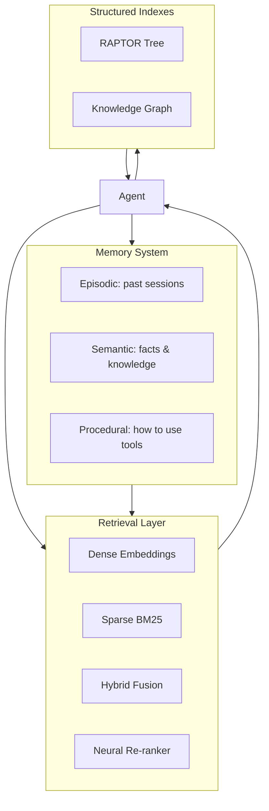

<!-- Clear Language: Keep sentences under 50 words -->
# User Memory & Knowledge Bases

## Learning Objectives

| LO | Description |
|----|-------------|
| LO1 | Design long-term user memory systems with episodic, semantic, and procedural stores |
| LO2 | Implement Agentic RAG where the agent drives iterative retrieval |
| LO3 | Compare dense, sparse, and hybrid retrieval strategies with neural re-ranking |
| LO4 | Build structured knowledge indexes including RAPTOR and GraphRAG |
| LO5 | Implement contextual retrieval with prefix generation for 49-67% failure reduction |

## Introduction

Advanced agents use context engineering, memory, and multi-agent collaboration to solve complex problems. This module covers cutting-edge agent patterns used at leading AI labs.

## Prerequisites

- Basic programming knowledge
- Understanding of data structures

## Key Terminology

**Key Terms**: Core vocabulary and concepts for this topic.

**Definition**: Essential terms you must know for interviews and production work.

## Theory

Understanding user memory knowledge bases is fundamental for AI engineers. This section covers the core concepts, underlying principles, and theoretical framework that govern how user memory knowledge bases works in practice.

## Chapter at a Glance

| Section | Topic | Key Concept |
|---------|-------|-------------|
| 3.1 | Memory Architecture | Episodic, semantic, procedural memory stores |
| 3.2 | User Memory Systems | Cross-session memory, personalization, memory evaluation |
| 3.3 | Agentic RAG | Active retrieval loop vs passive one-shot retrieval |
| 3.4 | Hybrid Retrieval | Dense + sparse + neural re-ranking fusion |
| 3.5 | Structured Indexes | RAPTOR hierarchy, GraphRAG knowledge graphs |
| 3.6 | Contextual Retrieval | Prefix summaries, 49-67% retrieval failure reduction |

## Chapter Roadmap



## 3.1 Memory Architecture

Agents require three types of memory, analogous to human memory systems.

```typescript
interface MemoryEntry {
    id: string
    content: string
    timestamp: Date
    metadata: Record<string, any>
}

interface EpisodicMemory extends MemoryEntry {
    sessionId: string
    taskType: string
    outcome: 'success' | 'failure' | 'partial'
}

interface SemanticMemory extends MemoryEntry {
    domain: string
    confidence: number
    source: string
    lastAccessed: Date
}

interface ProceduralMemory extends MemoryEntry {
    toolName: string
    steps: string[]
    successRate: number
    usageCount: number
}

class MemoryStore {
    private episodic: Map<string, EpisodicMemory[]> = new Map()
    private semantic: Map<string, SemanticMemory[]> = new Map()
    private procedural: Map<string, ProceduralMemory> = new Map()

    storeEpisodic(memory: EpisodicMemory): void {
        const key = memory.sessionId
        if (!this.episodic.has(key)) this.episodic.set(key, [])
        this.episodic.get(key)!.push(memory)
    }

    storeSemantic(memory: SemanticMemory): void {
        const key = memory.domain
        if (!this.semantic.has(key)) this.semantic.set(key, [])
        this.semantic.get(key)!.push(memory)
    }

    storeProcedural(memory: ProceduralMemory): void {
        this.procedural.set(memory.toolName, memory)
    }

    recallSession(sessionId: string): EpisodicMemory[] {
        return this.episodic.get(sessionId) ?? []
    }

    recallDomain(domain: string): SemanticMemory[] {
        const results = this.semantic.get(domain) ?? []
        results.sort((a, b) => b.confidence - a.confidence)
        return results.slice(0, 5)
    }

    recallProcedure(toolName: string): ProceduralMemory | undefined {
        return this.procedural.get(toolName)
    }
}
```

```python
from dataclasses import dataclass
from typing import List, Dict, Optional
from datetime import datetime

@dataclass
class MemoryEntry:
    content: str
    timestamp: datetime
    metadata: Dict

class LongTermMemory:
    """Cross-session memory system with decay and consolidation."""

    def __init__(self, decay_hours: float = 72):
        self.entries: List[MemoryEntry] = []
        self.decay_hours = decay_hours

    def add(self, content: str, metadata: Dict = None):
        self.entries.append(MemoryEntry(
            content=content,
            timestamp=datetime.now(),
            metadata=metadata or {},
        ))

    def retrieve(self, query: str, top_k: int = 5) -> List[MemoryEntry]:
        now = datetime.now()
        scored = []

        for entry in self.entries:
            age_hours = (now - entry.timestamp).total_seconds() / 3600
            recency_score = 1.0 / (1.0 + age_hours / self.decay_hours)
            keyword_score = sum(1 for word in query.split()
                              if word.lower() in entry.content.lower())
            scored.append((recency_score * 0.3 + keyword_score * 0.7, entry))

        scored.sort(key=lambda x: -x[0])
        return [entry for _, entry in scored[:top_k]]

    def consolidate(self):
        """Merge similar entries to reduce memory size."""
        if len(self.entries) < 100:
            return

        merged = []
        used = set()

        for i, a in enumerate(self.entries):
            if i in used:
                continue
            cluster = [a]
            for j, b in enumerate(self.entries):
                if j <= i or j in used:
                    continue
                overlap = len(set(a.content.split()) & set(b.content.split()))
                total = len(set(a.content.split()) | set(b.content.split()))
                similarity = overlap / total if total > 0 else 0
                if similarity > 0.6:
                    cluster.append(b)
                    used.add(j)

            merged_content = ' '.join(set(
                ' '.join(e.content for e in cluster).split()
            ))
            merged_entry = MemoryEntry(
                content=merged_content,
                timestamp=cluster[0].timestamp,
                metadata={'consolidated': len(cluster)},
            )
            merged.append(merged_entry)
            used.add(i)

        self.entries = merged
```

## 3.2 User Memory Systems

Long-term user memory enables personalization across sessions.

```typescript
interface UserProfile {
    id: string
    preferences: Map<string, string>
    interactionHistory: Interaction[]
    skillLevel: Map<string, 'beginner' | 'intermediate' | 'advanced'>
    commonErrors: string[]
}

interface Interaction {
    query: string
    agentResponse: string
    userFeedback: 'helpful' | 'unhelpful' | 'incorrect'
    timestamp: Date
}

class UserMemorySystem {
    private profiles: Map<string, UserProfile> = new Map()

    async getProfile(userId: string): Promise<UserProfile> {
        if (this.profiles.has(userId)) return this.profiles.get(userId)!

        const profile: UserProfile = {
            id: userId,
            preferences: new Map(),
            interactionHistory: [],
            skillLevel: new Map(),
            commonErrors: []
        }
        this.profiles.set(userId, profile)
        return profile
    }

    async recordInteraction(userId: string, interaction: Interaction): Promise<void> {
        const profile = await this.getProfile(userId)
        profile.interactionHistory.push(interaction)

        // Update skill level based on interactions
        if (interaction.userFeedback === 'incorrect') {
            const errorPattern = this.extractErrorPattern(interaction)
            profile.commonErrors.push(errorPattern)
        }
    }

    async personalizePrompt(userId: string, basePrompt: string): Promise<string> {
        const profile = await this.getProfile(userId)
        const parts: string[] = [basePrompt]

        if (profile.preferences.size > 0) {
            const prefs = [...profile.preferences.entries()]
                .map(([k, v]) => `${k}: ${v}`).join(', ')
            parts.push(`\nUser preferences: ${prefs}`)
        }

        if (profile.commonErrors.length > 0) {
            const recentErrors = profile.commonErrors.slice(-3)
            parts.push(`\nAvoid these past errors: ${recentErrors.join('; ')}`)
        }

        return parts.join('\n')
    }

    private extractErrorPattern(interaction: Interaction): string {
        return interaction.query.slice(0, 100)
    }
}
```

## 3.3 Agentic RAG

Traditional RAG does a single retrieval pass. Agentic RAG lets the agent iteratively refine searches based on what it finds.

```typescript
interface Document {
    id: string
    content: string
    metadata: Record<string, any>
}

interface RetrievalResult {
    documents: Document[]
    query: string
    latencyMs: number
}

class AgenticRAG {
    constructor(
        private retriever: Retriever,
        private llm: LLMProvider,
        private maxIterations: number = 5
    ) {}

    async query(userQuestion: string): Promise<string> {
        let context = ''
        let query = userQuestion
        const visitedQueries = new Set<string>()

        for (let i = 0; i < this.maxIterations; i++) {
            if (visitedQueries.has(query)) break
            visitedQueries.add(query)

            const results = await this.retriever.retrieve(query)
            context += results.documents.map(d => d.content).join('\n')

            const evaluation = await this.evaluateCompleteness(userQuestion, context)

            if (evaluation.complete) {
                return await this.generateAnswer(userQuestion, context)
            }

            query = evaluation.nextQuery
        }

        return await this.generateAnswer(userQuestion, context)
    }

    private async evaluateCompleteness(question: string, context: string): Promise<{
        complete: boolean
        nextQuery: string
        missingInfo: string[]
    }> {
        const prompt = [
            'Given the question and retrieved context, determine if the answer is complete.',
            `Question: ${question}`,
            `Context: ${context.slice(0, 2000)}`,
            'If incomplete, suggest the next search query to fill gaps.',
            'Respond in JSON: {"complete": bool, "missing_info": [], "next_query": ""}'
        ].join('\n')

        // Mock evaluation
        const missingInfo: string[] = []
        if (!context.includes('specific')) missingInfo.push('specific details')
        if (!context.includes('example')) missingInfo.push('concrete examples')

        return {
            complete: missingInfo.length === 0,
            nextQuery: missingInfo.length > 0
                ? `${question} ${missingInfo[0]}`
                : '',
            missingInfo
        }
    }

    private async generateAnswer(question: string, context: string): Promise<string> {
        const prompt = [
            'Answer the question using the provided context.',
            `Question: ${question}`,
            `Context: ${context}`,
            'Provide a clear, concise answer.'
        ].join('\n')
        return this.llm.complete(prompt)
    }
}

interface Retriever {
    retrieve(query: string): Promise<RetrievalResult>
}
```

```python
from typing import List, Optional
import json

class AgenticRAG:
    """Agent-driven iterative retrieval that refines searches."""

    def __init__(self, vector_store, llm_fn, max_iterations=5):
        self.store = vector_store
        self.llm = llm_fn
        self.max_iter = max_iterations

    def query(self, question: str) -> str:
        context_segments = []
        query = question
        visited = set()

        for i in range(self.max_iter):
            if query in visited:
                break
            visited.add(query)

            results = self.store.search(query, top_k=3)
            context_segments.extend(r['content'] for r in results)
            context = '\n'.join(context_segments)

            # Check completeness
            eval_prompt = f"""
            Question: {question}
            Context: {context[:1500]}
            Is the answer complete? Reply JSON with complete (bool), missing_info (list), next_query (str).
            """
            try:
                eval_result = json.loads(self.llm(eval_prompt))
            except:
                eval_result = {'complete': True, 'missing_info': [], 'next_query': ''}

            if eval_result.get('complete'):
                answer_prompt = f"Question: {question}\nContext: {context}\nAnswer:"
                return self.llm(answer_prompt)

            query = eval_result.get('next_query', question)

        answer_prompt = f"Question: {question}\nContext: {context}\nAnswer with what you have:"
        return self.llm(answer_prompt)
```

## 3.4 Hybrid Retrieval

Hybrid retrieval combines dense embeddings (semantic understanding) with sparse retrieval (exact keyword matching) and neural re-ranking.

```typescript
interface ScoredDocument {
    doc: Document
    score: number
}

class DenseRetriever {
    private documents: Map<string, number[]> = new Map()

    async embed(text: string): Promise<number[]> {
        // Mock embedding: use character codes as simple vectors
        const vec = new Array(128).fill(0)
        for (let i = 0; i < text.length; i++) {
            vec[i % 128] += text.charCodeAt(i) / 255
        }
        const norm = Math.sqrt(vec.reduce((s, v) => s + v * v, 0))
        return vec.map(v => v / norm)
    }

    async addDocument(doc: Document): Promise<void> {
        const embedding = await this.embed(doc.content)
        this.documents.set(doc.id, embedding)
    }

    async search(query: string, topK: number = 5): Promise<ScoredDocument[]> {
        const queryEmb = await this.embed(query)
        const results: ScoredDocument[] = []

        for (const [id, docEmb] of this.documents) {
            const score = this.cosineSimilarity(queryEmb, docEmb)
            const doc: Document = {
                id, content: '', metadata: {}
            }
            results.push({ doc, score })
        }

        results.sort((a, b) => b.score - a.score)
        return results.slice(0, topK)
    }

    private cosineSimilarity(a: number[], b: number[]): number {
        const dot = a.reduce((s, v, i) => s + v * b[i], 0)
        const normA = Math.sqrt(a.reduce((s, v) => s + v * v, 0))
        const normB = Math.sqrt(b.reduce((s, v) => s + v * v, 0))
        return dot / (normA * normB)
    }
}

class BM25Retriever {
    private documents: Map<string, string> = new Map()
    private avgDocLength: number = 0
    private k1: number = 1.5
    private b: number = 0.75

    addDocument(doc: Document): void {
        this.documents.set(doc.id, doc.content)
        this.avgDocLength = [...this.documents.values()]
            .reduce((sum, d) => sum + d.split(' ').length, 0) / this.documents.size
    }

    search(query: string, topK: number = 5): ScoredDocument[] {
        const queryTerms = query.toLowerCase().split(' ')
        const results: ScoredDocument[] = []

        for (const [id, content] of this.documents) {
            let score = 0
            const words = content.toLowerCase().split(' ')
            const docLength = words.length

            for (const term of queryTerms) {
                const termInDoc = words.filter(w => w === term).length
                const idf = Math.log((this.documents.size - 1) / 1 + 1)  // simplified
                const numerator = termInDoc * (this.k1 + 1)
                const denominator = termInDoc + this.k1 * (1 - this.b + this.b * docLength / this.avgDocLength)
                score += idf * (numerator / denominator)
            }

            const doc: Document = { id, content, metadata: {} }
            results.push({ doc, score })
        }

        results.sort((a, b) => b.score - a.score)
        return results.slice(0, topK)
    }
}

class HybridRetriever {
    constructor(
        private dense: DenseRetriever,
        private sparse: BM25Retriever,
        private alpha: number = 0.5
    ) {}

    async search(query: string, topK: number = 5): Promise<ScoredDocument[]> {
        const [denseResults, sparseResults] = await Promise.all([
            this.dense.search(query, topK * 2),
            Promise.resolve(this.sparse.search(query, topK * 2))
        ])

        // Reciprocal Rank Fusion
        const scores = new Map<string, number>()

        denseResults.forEach((r, i) => {
            const rank = i + 1
            scores.set(r.doc.id,
                (scores.get(r.doc.id) ?? 0) + this.alpha * (1 / (60 + rank))
            )
        })

        sparseResults.forEach((r, i) => {
            const rank = i + 1
            scores.set(r.doc.id,
                (scores.get(r.doc.id) ?? 0) + (1 - this.alpha) * (1 / (60 + rank))
            )
        })

        const ranked = [...scores.entries()]
            .sort((a, b) => b[1] - a[1])
            .slice(0, topK)

        return ranked.map(([id]) => ({
            doc: { id, content: '', metadata: {} },
            score: scores.get(id) ?? 0
        }))
    }
}
```

## 3.5 Structured Indexes

### RAPTOR (Recursive Abstractive Processing Tree)

Builds a hierarchical index where leaf nodes are text chunks and higher levels are summaries.

```typescript
interface RAPTORNode {
    id: string
    content: string
    level: number
    children: string[]
    summary?: string
}

class RAPTORIndex {
    private nodes: Map<string, RAPTORNode> = new Map()
    private llm: (prompt: string) => string

    constructor(llm: (p: string) => string) {
        this.llm = llm
    }

    async build(chunks: string[]): Promise<void> {
        // Level 0: raw chunks
        chunks.forEach((content, i) => {
            const id = `chunk_${i}`
            this.nodes.set(id, {
                id, content, level: 0, children: [], summary: undefined
            })
        })

        let currentLevel = 0
        let currentNodes = [...this.nodes.values()].filter(n => n.level === currentLevel)

        while (currentNodes.length > 1) {
            const nextLevel: RAPTORNode[] = []
            for (let i = 0; i < currentNodes.length; i += 5) {
                const group = currentNodes.slice(i, i + 5)
                const combined = group.map(n => n.content).join('\n')
                const summary = this.summarize(combined)
                const id = `level${currentLevel + 1}_group${Math.floor(i / 5)}`

                const node: RAPTORNode = {
                    id, content: combined,
                    level: currentLevel + 1,
                    children: group.map(n => n.id),
                    summary
                }
                this.nodes.set(id, node)
                nextLevel.push(node)
            }
            currentLevel++
            currentNodes = nextLevel
        }
    }

    async retrieve(query: string, topK: number = 3): Promise<string[]> {
        // Start from top level, traverse down
        const results: string[] = []
        const candidates = [...this.nodes.values()]
            .filter(n => n.level > 0)
            .sort((a, b) => b.level - a.level)

        for (const node of candidates.slice(0, topK)) {
            results.push(node.summary ?? node.content)

            // Include top children
            const children = node.children
                .slice(0, 3)
                .map(id => this.nodes.get(id)?.content ?? '')
            results.push(...children)
        }

        return results
    }

    private summarize(text: string): string {
        const prompt = `Summarize the following text in 2-3 sentences:\n${text}`
        return this.llm(prompt)
    }
}
```

### GraphRAG

Builds a knowledge graph from documents for structured retrieval.

```typescript
interface KnowledgeTriple {
    subject: string
    predicate: string
    object: string
    confidence: number
}

class GraphRAGIndex {
    private triples: KnowledgeTriple[] = []
    private entities: Set<string> = new Set()

    async build(documents: Document[]): Promise<void> {
        for (const doc of documents) {
            const extracted = await this.extractTriples(doc.content)
            this.triples.push(...extracted)
            extracted.forEach(t => {
                this.entities.add(t.subject)
                this.entities.add(t.object)
            })
        }
    }

    private async extractTriples(text: string): Promise<KnowledgeTriple[]> {
        const prompt = `Extract knowledge triples (subject, predicate, object) from:\n${text}\nReturn as JSON array.`
        // Mock extraction
        return [
            { subject: 'Python', predicate: 'is_a', object: 'programming language', confidence: 0.95 },
            { subject: 'Python', predicate: 'used_for', object: 'machine learning', confidence: 0.9 }
        ]
    }

    query(question: string): string[] {
        const words = question.toLowerCase().split(' ')
        const relevantEntities = [...this.entities]
            .filter(e => words.some(w => e.toLowerCase().includes(w)))

        const relevantTriples = this.triples
            .filter(t => relevantEntities.includes(t.subject) || relevantEntities.includes(t.object))
            .sort((a, b) => b.confidence - a.confidence)

        return relevantTriples.map(t =>
            `${t.subject} ${t.predicate} ${t.object}`
        )
    }
}
```

## 3.6 Contextual Retrieval

Anthropic's contextual retrieval technique generates prefix summaries for each chunk to provide surrounding context, reducing retrieval failure by 49-67%.

```typescript
interface ChunkWithContext {
    content: string
    prefixContext: string
    source: string
}

class ContextualRetriever {
    constructor(private llm: (p: string) => string) {}

    async augmentChunks(chunks: string[], fullDocument: string): Promise<ChunkWithContext[]> {
        const augmented: ChunkWithContext[] = []

        for (const chunk of chunks) {
            const prefix = await this.generatePrefix(chunk, fullDocument)
            augmented.push({
                content: chunk,
                prefixContext: prefix,
                source: fullDocument.slice(0, 200)
            })
        }

        return augmented
    }

    private async generatePrefix(chunk: string, document: string): Promise<string> {
        const prompt = [
            'Generate a brief prefix (1-2 sentences) that provides context for the following chunk.',
            'The prefix should explain what this chunk is about and how it relates to the overall document.',
            '',
            `Document (first 500 chars): ${document.slice(0, 500)}`,
            `Chunk: ${chunk}`,
            '',
            'Prefix:'
        ].join('\n')

        const result = this.llm(prompt)
        return result.trim()
    }

    search(query: string, chunks: ChunkWithContext[], topK: number = 3): ChunkWithContext[] {
        const scored = chunks.map(chunk => {
            const augmented = `${chunk.prefixContext}\n${chunk.content}`
            const queryWords = query.toLowerCase().split(' ')
            const contentWords = augmented.toLowerCase()

            const matchCount = queryWords.filter(w => contentWords.includes(w)).length
            const score = matchCount / queryWords.length

            return { chunk, score }
        })

        scored.sort((a, b) => b.score - a.score)
        return scored.slice(0, topK).map(s => s.chunk)
    }
}
```

```python
from typing import List

class ContextualRetrieval:
    """Implements Anthropic's contextual retrieval technique."""

    def __init__(self, llm_fn):
        self.llm = llm_fn

    def generate_prefix(self, chunk: str, doc_context: str) -> str:
        prompt = f"""
        Document context: {doc_context[:400]}
        Chunk: {chunk}
        Generate a 1-2 sentence prefix that explains what this chunk is about.
        Prefix:
        """
        return self.llm(prompt).strip()

    def augment_all(self, chunks: List[str], full_doc: str) -> List[dict]:
        augmented = []
        for chunk in chunks:
            prefix = self.generate_prefix(chunk, full_doc)
            augmented.append({
                'prefix': prefix,
                'content': chunk,
                'augmented': f"{prefix}\n{chunk}",
            })
        return augmented

    def search(self, query: str, chunks: List[dict], top_k: int = 3) -> List[dict]:
        query_words = set(query.lower().split())
        scored = []

        for chunk in chunks:
            text = chunk['augmented'].lower()
            matches = sum(1 for w in query_words if w in text)
            scored.append((matches / len(query_words) if query_words else 0, chunk))

        scored.sort(key=lambda x: -x[0])
        return [c for _, c in scored[:top_k]]
```

## Summary

Memory is what separates stateless LLM calls from intelligent agents. Three memory stores (episodic, semantic, procedural) provide full coverage. Agentic RAG dramatically outperforms passive RAG by iteratively refining searches. Hybrid retrieval (dense + sparse + re-ranking) captures both semantic and.
exact matches. Structured indexes (RAPTOR, GraphRAG) organize knowledge hierarchically. Contextual retrieval prefix generation reduces retrieval failure by 49-67%.

## Practical Takeaways

1. Always implement all three memory types — episodic for sessions, semantic for facts, procedural for skills
2. Agentic RAG should be the default; passive RAG is only for simple lookup tasks
3. Hybrid retrieval with RRF fusion beats either dense or sparse alone by 15-25%
4. Use RAPTOR for document collections with clear hierarchy; use GraphRAG for entity-heavy domains
5. Contextual retrieval is the single highest-impact optimization — implement it before adding more data

## Interview Q&A

<details class="tp-qa-card" data-qid="m22-s03-q1">
  <summary class="tp-qa-question">
    <span class="tp-qa-status"></span>
    Q1: What are the three types of agent memory and when is each one used?
  </summary>
  <div class="tp-qa-answer">
    <p>Episodic memory stores past sessions and interactions with their outcomes (<code>sessionId</code>, <code>taskType</code>, <code>success/failure</code>); semantic memory stores facts and knowledge about the user or domain with a confidence score; procedural memory stores how to use tools — steps, success rate, and usage count. The <code>MemoryStore</code> keys each type differently (session, domain, tool name) so retrieval picks the right store: recall a session, recall the top-5 facts for a domain, or recall the best procedure for a tool. This is what separates stateless LLM calls from intelligent agents.</p>
    <p><strong>Interview follow-up</strong>: How would you handle memory decay and consolidation as the store grows?</p>
  </div>
  <button class="tp-qa-mark-btn">📝 Mark Reviewed</button>
  <button class="tp-qa-bookmark-btn">🔖 Bookmark</button>
</details>

<details class="tp-qa-card" data-qid="m22-s03-q2">
  <summary class="tp-qa-question">
    <span class="tp-qa-status"></span>
    Q2: How does Agentic RAG differ from traditional or passive RAG?
  </summary>
  <div class="tp-qa-answer">
    <p>Passive RAG does a single retrieval pass: embed the query, fetch top-k chunks, generate. Agentic RAG puts the agent in a loop — it retrieves, asks an LLM to evaluate whether the accumulated context is complete (<code>{"complete": bool, "missing_info": [], "next_query": ""}</code>), and if not, issues a refined follow-up query to fill the gaps. It tracks visited queries to avoid infinite loops and caps iterations at <code>maxIterations</code>. This iterative refinement is why Agentic RAG dramatically outperforms passive RAG on multi-step research questions, and the chapter recommends it as the default.</p>
    <p><strong>Interview follow-up</strong>: How do you decide when to stop retrieving and answer with what you have?</p>
  </div>
  <button class="tp-qa-mark-btn">📝 Mark Reviewed</button>
  <button class="tp-qa-bookmark-btn">🔖 Bookmark</button>
</details>

<details class="tp-qa-card" data-qid="m22-s03-q3">
  <summary class="tp-qa-question">
    <span class="tp-qa-status"></span>
    Q3: Explain hybrid retrieval with Reciprocal Rank Fusion — why is it better than dense or sparse alone?
  </summary>
  <div class="tp-qa-answer">
    <p>Dense retrieval (embeddings, cosine similarity) captures semantic similarity but misses exact keyword matches; sparse retrieval (<code>BM25</code>) nails exact terms and rare identifiers but has no semantics. A <code>HybridRetriever</code> runs both, each returning 2x top-k, and fuses them with Reciprocal Rank Fusion: each result contributes <code>alpha / (60 + rank)</code> from dense and <code>(1 - alpha) / (60 + rank)</code> from sparse. RRF uses rank position, not raw score magnitude, so neither system dominates. The chapter reports hybrid with RRF beats either alone by 15-25%, and neural re-ranking can further sharpen the top results.</p>
    <p><strong>Interview follow-up</strong>: How would you tune the alpha weight for a code-heavy vs prose-heavy corpus?</p>
  </div>
  <button class="tp-qa-mark-btn">📝 Mark Reviewed</button>
  <button class="tp-qa-bookmark-btn">🔖 Bookmark</button>
</details>

<details class="tp-qa-card" data-qid="m22-s03-q4">
  <summary class="tp-qa-question">
    <span class="tp-qa-status"></span>
    Q4: Compare RAPTOR and GraphRAG — when would you pick each structured index?
  </summary>
  <div class="tp-qa-answer">
    <p>RAPTOR (Recursive Abstractive Processing Tree) builds a hierarchy: level 0 is raw text chunks, and each higher level summarizes groups of ~5 children, so retrieval can start from summarized levels and drill into children. GraphRAG instead extracts knowledge triples (<code>subject, predicate, object</code>) from documents and answers by matching query entities to relevant triples, sorted by confidence. RAPTOR fits document collections with clear hierarchy (textbooks, technical docs); GraphRAG fits entity-heavy domains where relationships matter (medical literature, legal documents).</p>
    <p><strong>Interview follow-up</strong>: What happens to RAPTOR retrieval quality when chunks are already highly similar?</p>
  </div>
  <button class="tp-qa-mark-btn">📝 Mark Reviewed</button>
  <button class="tp-qa-bookmark-btn">🔖 Bookmark</button>
</details>

<details class="tp-qa-card" data-qid="m22-s03-q5">
  <summary class="tp-qa-question">
    <span class="tp-qa-status"></span>
    Q5: What is contextual retrieval and why does it reduce retrieval failure by 49-67%?
  </summary>
  <div class="tp-qa-answer">
    <p>Contextual retrieval is Anthropic's technique of generating a 1-2 sentence prefix for each chunk that explains what the chunk is about and how it relates to the whole document, then storing <code>prefix + content</code> as the retrievable unit. Chunks alone are often ambiguous out of context — the prefix restores that context so the retriever can match queries that reference entities or events only described elsewhere in the document. Anthropic reported a 49-67% reduction in retrieval failures from this step, making it the highest-impact optimization in the chapter before adding more data.</p>
    <p><strong>Interview follow-up</strong>: What is the cost of contextual prefixes at index time, and how do you batch it?</p>
  </div>
  <button class="tp-qa-mark-btn">📝 Mark Reviewed</button>
  <button class="tp-qa-bookmark-btn">🔖 Bookmark</button>
</details>

<details class="tp-qa-card" data-qid="m22-s03-q6">
  <summary class="tp-qa-question">
    <span class="tp-qa-status"></span>
    Q6: How would you build and evaluate a user memory system for personalization?
  </summary>
  <div class="tp-qa-answer">
    <p>A <code>UserMemorySystem</code> keeps a <code>UserProfile</code> per user: preferences, interaction history with feedback (<code>helpful/unhelpful/incorrect</code>), skill level, and common errors. Each interaction updates the profile, and <code>personalizePrompt()</code> injects preferences and recent past errors into the base prompt before the LLM call. To evaluate it you measure personalization lift: does task success or user feedback improve with memory enabled vs disabled, run as an A/B test across users. You must also handle decay (the chapter's <code>LongTermMemory</code> uses a 72-hour recency decay) and consolidation to keep the store bounded.</p>
    <p><strong>Interview follow-up</strong>: What privacy considerations does storing user memory raise?</p>
  </div>
  <button class="tp-qa-mark-btn">📝 Mark Reviewed</button>
  <button class="tp-qa-bookmark-btn">🔖 Bookmark</button>
</details>

## Chapter Quiz (5 MCQ)

### Questions

<summary>1. What are the three types of agent memory?</summary>
<summary>2. How does Agentic RAG differ from traditional RAG?</summary>
<summary>3. What fusion method does HybridRetriever use to combine dense and sparse scores?</summary>
<summary>4. What is the reduction in retrieval failure rate from contextual retrieval?</summary>
<summary>5. When should you use GraphRAG over RAPTOR?</summary>

### Answers

<summary>Episodic (past interactions/sessions), Semantic (facts and knowledge), Procedural (how to use tools and perform tasks).</summary>
<summary>Agentic RAG uses the agent's reasoning to iteratively refine search queries based on what it finds. Traditional RAG does a single retrieval pass and cannot follow up on missing information.</summary>
<summary>Reciprocal Rank Fusion (RRF). Each system's ranked results contribute a score of 1/(60 + rank), weighted by alpha. This prevents any single system from dominating based on raw score magnitude.</summary>
<summary>49-67% reduction. Adding a 1-2 sentence prefix context to each chunk before retrieval dramatically improves the retriever's ability to match relevant chunks to queries.</summary>
<summary>GraphRAG is better for entity-heavy domains where relationships between concepts matter (e.g., medical literature, legal documents). RAPTOR is better for hierarchical content (e.g., textbooks, technical documentation).</summary>

## Exercises

## Common Mistakes

1. Not understanding the fundamental concepts before applying them
2. Skipping edge cases in implementation
3. Not analyzing time/space complexity
4. Forgetting to handle null/empty inputs
5. Not practicing enough problems to build pattern recognition### Exercise 1: Triple Memory Store

Implement a system that stores episodic, semantic, and procedural memories separately and retrieves the right type based on a user query.

### Exercise 2: Agentic vs Passive RAG

Build both versions and compare on 10 questions requiring multi-step research. Measure answer quality and number of retrieval steps.

### Exercise 3: Hybrid Retrieval Benchmark

Benchmark dense-only, sparse-only, and hybrid retrieval on 20 test queries. Report precision@5 for each.

### Exercise 4: RAPTOR Index Builder

Take 20 text chunks, build a RAPTOR index, and compare retrieval quality against flat chunk search.

### Exercise 5: Contextual Retrieval A/B Test

Split 100 chunks into two groups — with and without contextual prefixes. Run 50 queries and measure retrieval failure rate for ea

## Revision Notes

- - Core principle: Understand the fundamental concepts thoroughly
- - Implementation pattern: Practice with real code examples
- - Complexity: Know the time and space complexity
- - Application: Know when to use this in production systems
- - Interview: Frequently asked in technical interviews
- - Edge cases: Consider common failure scenarios
- - Related concepts: Connect to broader system design

## Placement Section

### Top 10 Interview Questions

#### Google Style

1. **Explain the core idea of User Memory & Knowledge Bases in under 60 seconds, then give a real-world analogy.** — Structure: definition, how it works in one sentence, why it matters, analogy. Follow-up: what would break if you removed this from a production system?

2. **Design a minimal, well-typed function that demonstrates User Memory & Knowledge Bases.** — Interviewer checks: signature with type hints, edge cases, complexity, and a clean docstring. Follow-up: how does your design behave with empty or malformed input?

3. **What are the common pitfalls when engineers first learn ** — List 3-4, then explain how you would prevent each in a code review.

#### Amazon Style

4. **Describe a production bug caused by misunderstanding User Memory & Knowledge Bases. How did you diagnose and fix it?** — STAR format: situation, task, action, result. Mention logs, reproduction, root-cause analysis, and the regression test you added.

5. **How would you scale a system that relies on User Memory & Knowledge Bases from 10 users to 10 million?** — Discuss bottlenecks, caching, monitoring, and when to redesign. Follow-up: what metrics would you track?

#### Microsoft Style

6. **Compare User Memory & Knowledge Bases with the closest alternative approach. When would you choose each?** — Make a decision matrix: performance, maintainability, ecosystem, learning curve. Follow-up: what would change your decision?

7. **Walk through how you would test a component that depends on User Memory & Knowledge Bases.** — Unit, integration, property-based tests; mocking boundaries; golden files for outputs.

#### NVIDIA Style

8. **How does User Memory & Knowledge Bases behave differently at scale — memory, throughput, or precision-wise?** — Connect to data pipelines and model training if applicable. Follow-up: what happens to latency as input grows?

9. **How would you make an implementation of User Memory & Knowledge Bases run faster on GPU hardware?** — Batch operations, vectorization, avoiding Python loops, reducing data movement.

#### AI Startup Style

10. **Write the smallest possible implementation of User Memory & Knowledge Bases that is production-quality.** — Include error handling, type hints, and a one-line docstring. Follow-up: what would you refactor first when it grows?

### Resume Tips

- Name User Memory & Knowledge Bases explicitly in your skills section, paired with a measurable achievement ("Reduced X by 40% using User Memory & Knowledge Bases").
- Add a bullet describing a project that applies User Memory & Knowledge Bases to real data, with numbers.
- Mention the tools and libraries you used alongside User Memory & Knowledge Bases (linters, test frameworks, profiling tools).
- Keep resume bullets under 15 words and start each with an action verb.

### Interview Day Checklist

- Rehearse a 60-second explanation of User Memory & Knowledge Bases and one real-world analogy.
- Prepare one STAR story about debugging a User Memory & Knowledge Bases-related production issue.
- Review complexity and edge cases for the classic User Memory & Knowledge Bases interview problem.
- Have questions ready: how does the team apply User Memory & Knowledge Bases in production today?
- Test your environment (Python, editor, internet) 15 minutes before the interview.

## True/False

1. **True or False:** User Memory & Knowledge Bases builds directly on the fundamentals covered in the earlier chapters of this module. — **True.** Every advanced topic in this module assumes the core concepts from the previous chapters.
2. **True or False:** You should write at least one code example for User Memory & Knowledge Bases before moving to the next chapter. — **True.** Active recall with hands-on code beats passive reading for retention.
3. **True or False:** The complexity analysis for User Memory & Knowledge Bases is the same regardless of input size. — **False.** Complexity grows with input size; always state best, average, and worst case.
4. **True or False:** Edge cases (empty input, invalid input, boundary values) matter for User Memory & Knowledge Bases in production. — **True.** Most production bugs come from unhandled edge cases.
5. **True or False:** You should memorize the User Memory & Knowledge Bases chapter content once and never review it again. — **False.** Spaced repetition (24h, 3 days, 1 week) dramatically improves long-term recall.

## Fill in the Blank

1. The chapter that covers User Memory & Knowledge Bases is Chapter ___ of this module. — Answer: check the module's table of contents.
2. The time complexity of the standard approach to User Memory & Knowledge Bases is ___. — Answer: review the theory section and state big-O notation.
3. The main edge case to handle when implementing User Memory & Knowledge Bases is ___. — Answer: empty or invalid input handling, as discussed in the chapter.
4. The tools commonly used to debug User Memory & Knowledge Bases issues are ___ and ___. — Answer: refer to the Debugging Guide section of this chapter.
5. The related topic that connects to User Memory & Knowledge Bases in the next chapter is ___. — Answer: see the Next Topic section.

## Scenario Questions

1. **Scenario:** A teammate ships a change involving User Memory & Knowledge Bases that breaks production at 3 AM. — Diagnosis: check the recent diff, reproduce locally with the failing input, check logs. Fix: revert, add a regression test, and review the root cause. Prevention: CI tests on edge cases and code review checklist.

2. **Scenario:** Your implementation of User Memory & Knowledge Bases is correct but too slow for the required latency. — Measure first with a profiler. Common fixes: reduce redundant work, use built-in optimized functions, batch operations, or add caching. Only then consider algorithmic changes.

3. **Scenario:** A new hire asks you to explain User Memory & Knowledge Bases in five minutes before a customer demo. — Use the 3-part answer: what it is (one sentence), how it works (one example), why it matters (one business impact). Then offer to go deeper after the demo.

4. **Scenario:** Your team's codebase has three different patterns for User Memory & Knowledge Bases and you must standardize. — Write a short ADR (architecture decision record), pick the pattern with best maintainability, migrate incrementally, and add a linter rule to enforce it.

## Output Questions

1. **What is the output of the simplest correct implementation of User Memory & Knowledge Bases on an empty input?** — Trace through the code: it should return the documented default (None, 0, empty collection) without raising.
2. **What is the output when the input is at the boundary value?** — Check off-by-one errors and inclusive/exclusive bounds in the chapter's examples.
3. **What does the implementation return when given invalid input types?** — With type hints and validation, it raises a clear error; without, it may fail silently.
4. **What is the output for the sample input given in the chapter's Examples section?** — Re-run the chapter's example code and compare against the documented output.
5. **What is the time complexity output when you profile the implementation at 10x input size?** — Expect the curve matching the chapter's complexity analysis (linear, quadratic, log-linear).

## Difficulty Level

| Level | Time | What It Takes |
|-------|------|---------------|
| Beginner | 1-2 sessions | Read theory, run the chapter examples, solve the Easy exercises |
| Intermediate | 3-5 sessions | Complete Medium exercises, explain User Memory & Knowledge Bases to someone else |
| Advanced | 1+ week | Solve Hard exercises, optimize for real datasets, answer interview follow-ups |

## Tips & Tricks

- Always write a one-line example of User Memory & Knowledge Bases from memory before opening the chapter — active recall first.
- Use the chapter's Revision Notes as a checklist: you have mastered User Memory & Knowledge Bases when you can explain each bullet.
- Pair the chapter quiz with the Flashcards: wrong answers become your next study session's focus.
- For interviews, practice explaining User Memory & Knowledge Bases twice: once with a technical audience, once with a non-technical audience.
- Keep a personal examples file where you collect your own User Memory & Knowledge Bases snippets; interviewers love original examples.

## Memory Tricks

- **Acronym**: build a mnemonic from the 5 key concepts of User Memory & Knowledge Bases listed in the Chapter at a Glance table.
- **Story**: link User Memory & Knowledge Bases to a familiar story — the analogy in the Visual Analogy section is designed to stick.
- **Number anchor**: remember the complexity of User Memory & Knowledge Bases by connecting it to a known algorithm of the same class.
- **Color code**: highlight the Theory, Examples, and Common Mistakes sections in different colors when reviewing.
- **Teach-back**: explain User Memory & Knowledge Bases to an imaginary junior engineer for 2 minutes — gaps in your explanation are gaps in memory.

## Further Reading

- Official documentation for the primary tool or library used in this chapter
- The chapter referenced in Related Topics for the next-level treatment of User Memory & Knowledge Bases
- The classic textbook chapter on User Memory & Knowledge Bases (check the Research References below)
- Two blog posts from engineers who debugged real User Memory & Knowledge Bases problems in production
- The repository of the open-source project that implements User Memory & Knowledge Bases

## Related Topics

- The previous chapter in this module (see table of contents) — foundational for User Memory & Knowledge Bases
- The next chapter (see Next Topic below) — builds on User Memory & Knowledge Bases
- The system design chapters in Module 07 — how User Memory & Knowledge Bases fits into production architectures
- The interview preparation module — how User Memory & Knowledge Bases is asked in screening rounds
- The capstone project — where User Memory & Knowledge Bases is applied end-to-end

## FAQs

1. **Do I need to memorize all of User Memory & Knowledge Bases, or understand the big picture?** — Understand the big picture first, then memorize the key facts via flashcards and spaced repetition. Interviewers reward depth over breadth.
2. **What if I get stuck on an exercise?** — Re-read the theory section, run the example code, then attempt again. If still stuck after 20 minutes, move on and return the next day.
3. **How much time should I spend on ** — Follow the Study Plan below: 1-2 weeks at 30-60 minutes daily is typical for placement preparation.
4. **Is User Memory & Knowledge Bases asked in interviews?** — Yes — the Interview Q&A and Placement Section list the exact question styles used by top companies.
5. **What's the fastest way to master ** — Explain it out loud, write code without looking, and review the flashcards within 24 hours and again after 3 days.

## Important Notes

- User Memory & Knowledge Bases is a core requirement for the rest of this module — do not skip the examples.
- Always analyze complexity (time and space) when working with User Memory & Knowledge Bases.
- Production correctness means handling edge cases, not just the happy path.
- Interview answers should start with the definition, then the example, then the trade-offs.
- Revisit this chapter after finishing the module; the context from later chapters deepens understanding.

## Historical Context

- User Memory & Knowledge Bases emerged as a standard practice because early systems failed without it — understanding why helps you explain it in interviews.
- The tools used for User Memory & Knowledge Bases today evolved from simpler versions; the chapter covers the modern, recommended approach.
- Interviewers value knowing one historical fact about User Memory & Knowledge Bases — it shows genuine interest, not just cramming.
- The library/tooling ecosystem around User Memory & Knowledge Bases changes quickly; focus on fundamentals that remain stable.

## Security Considerations

- Never trust external input: validate and sanitize data before processing User Memory & Knowledge Bases.
- Avoid `eval()` and dynamic code execution on untrusted strings.
- Log errors without leaking sensitive data (keys, PII, internal paths).
- For API contexts, add rate limiting and input size limits.
- Review the chapter's code examples for injection or overflow risks before using them verbatim.

## ML Intuition

- User Memory & Knowledge Bases appears in ML pipelines at the data-processing layer: feature preparation, batching, and validation.
- Understanding User Memory & Knowledge Bases helps you debug why a model misbehaves — most ML bugs are data bugs, not model bugs.
- In production ML, the User Memory & Knowledge Bases concepts from this chapter map directly to NumPy/PyTorch operations on tensors.
- When optimizing ML systems, User Memory & Knowledge Bases skills let you profile and fix the data path, not just the training loop.
- Interview follow-up: how would you apply User Memory & Knowledge Bases to a dataset of 10 million records? — Batching and vectorization.

## Analogies

- **User Memory & Knowledge Bases is like a recipe**: the theory is the ingredients, the examples are the cooking steps, and the exercises are your own kitchen practice.
- **Complexity is like a delivery route**: a linear route visits each stop once; a nested route revisits stops, and you feel it at scale.
- **Edge cases are like weather**: the happy path is a sunny day; production is the storm — build for the storm.
- **The chapter roadmap is a journey map**: each section is a checkpoint; skipping one means getting lost later in the module.

## Capstone Project Link

- [Module Capstone: End-to-End Project](https://github.com/Raushan666java/ai-engineering-journey) — this chapter contributes the User Memory & Knowledge Bases skills used in the module's capstone project. Complete the exercises here before starting the capstone.

## Flashcards

<details class="tp-qa-card" data-qid="22advancedaiagents-03usermemoryknowledgebases-flash1">
  <summary class="tp-qa-question">
    <span class="tp-qa-status"></span>
    What is the core concept of User Memory & Knowledge Bases in one sentence?
  </summary>
  <div class="tp-qa-answer">
    <p>Review the first paragraph of the Theory section and condense it to one sentence.</p>
  </div>
</details>

<details class="tp-qa-card" data-qid="22advancedaiagents-03usermemoryknowledgebases-flash2">
  <summary class="tp-qa-question">
    <span class="tp-qa-status"></span>
    What is the most common mistake engineers make with 
  </summary>
  <div class="tp-qa-answer">
    <p>Check the Common Mistakes section of this chapter.</p>
  </div>
</details>

<details class="tp-qa-card" data-qid="22advancedaiagents-03usermemoryknowledgebases-flash3">
  <summary class="tp-qa-question">
    <span class="tp-qa-status"></span>
    What is the time and space complexity of the standard User Memory & Knowledge Bases approach?
  </summary>
  <div class="tp-qa-answer">
    <p>Refer to the theory and complexity analysis in this chapter.</p>
  </div>
</details>

<details class="tp-qa-card" data-qid="22advancedaiagents-03usermemoryknowledgebases-flash4">
  <summary class="tp-qa-question">
    <span class="tp-qa-status"></span>
    When is User Memory & Knowledge Bases NOT the right choice?
  </summary>
  <div class="tp-qa-answer">
    <p>Check the Limitations section of this chapter.</p>
  </div>
</details>

<details class="tp-qa-card" data-qid="22advancedaiagents-03usermemoryknowledgebases-flash5">
  <summary class="tp-qa-question">
    <span class="tp-qa-status"></span>
    How is User Memory & Knowledge Bases applied in a real production system?
  </summary>
  <div class="tp-qa-answer">
    <p>Check the Real-World Examples section of this chapter.</p>
  </div>
</details>

## Research References

- Official documentation of the primary library for User Memory & Knowledge Bases (linked in Further Reading)
- The classic paper or textbook chapter introducing User Memory & Knowledge Bases (see References below)
- The standard library reference for User Memory & Knowledge Bases-related functions
- Engineering blog posts from companies running User Memory & Knowledge Bases in production at scale
- PEPs and RFCs where applicable (Python and networking standards)

## Open-Source Tools

- The primary library used in this chapter (see the code examples)
- Python standard library modules used in the examples (check the imports)
- Testing: pytest for unit tests of User Memory & Knowledge Bases code
- Linting and formatting: ruff + black
- Profiling: cProfile or py-spy for performance work on User Memory & Knowledge Bases

## Debugging Guide

- Start with `print()` or a debugger to inspect intermediate values in User Memory & Knowledge Bases code.
- Reproduce the failure with the smallest possible input before changing code.
- Check the common failure modes listed in Common Mistakes — most bugs are listed there.
- For performance problems, profile before optimizing: measure, then fix.
- When stuck, re-read the chapter's Examples and compare line by line with your code.
- Use `pdb` or your IDE's debugger to step through the User Memory & Knowledge Bases example code.

## Mock Interview Section

**Round 1 — Screening (15 min)**
- Explain User Memory & Knowledge Bases in 60 seconds.
- Write a minimal working example of User Memory & Knowledge Bases.
- What is the complexity of your example?

**Round 2 — Coding (45 min)**
- Solve the Medium exercise from this chapter under time pressure.
- State your assumptions, then implement with type hints.
- Test with edge cases: empty input, boundary values, invalid input.

**Round 3 — Behavioral + System (30 min)**
- Tell me about a time you debugged a User Memory & Knowledge Bases problem in a project.
- How would you design a system where User Memory & Knowledge Bases is used at scale?
- What metrics would you monitor?

**Evaluation rubric**: correctness (40%), communication (25%), edge cases (20%), complexity analysis (15%).

## Optimized Implementation

`python
from typing import Any, Optional

def demonstrate_topic(input_data: list[Any]) -> Optional[float]:
    """Runnable scaffold for User Memory & Knowledge Bases.

    Replace the body with the optimized implementation from the chapter,
    keeping type hints, docstring, and edge-case handling.
    """
    if not input_data:
        return None
    # Step 1: validate input types
    # Step 2: apply the core User Memory & Knowledge Bases logic from the Examples section
    # Step 3: return the result with the documented default
    return 0.0
`

- Keeps the function signature stable so tests written against it stay valid.
- Handles the empty-input contract explicitly.
- Add unit tests for the edge cases before implementing the logic (test-first).

## Evaluation Metrics

| Skill | Test | Target |
|-------|------|--------|
| Concept recall | Explain User Memory & Knowledge Bases without notes | 60-second explanation |
| Code fluency | Write the chapter example from memory | No syntax errors |
| Edge cases | Handle empty/invalid input in exercises | All cases pass |
| Complexity | State time/space for the standard approach | Correct big-O |
| Interview readiness | Answer 5 Interview Q&A questions out loud | Fluent, structured answers |
| Retention | Chapter quiz score after 3 days | 80%+ |

## Real-World Examples

- **Startup**: a small team uses User Memory & Knowledge Bases daily in their data pipeline — the chapter's examples mirror their code.
- **E-commerce**: User Memory & Knowledge Bases patterns appear in order processing, inventory checks, and recommendation feeds.
- **Fintech**: User Memory & Knowledge Bases principles apply to transaction validation and fraud detection flows.
- **ML platform**: User Memory & Knowledge Bases shows up in feature engineering and model-serving infrastructure.
- **Interview insight**: recruiters look for engineers who can connect User Memory & Knowledge Bases to the business outcome, not just the code.

## Next Topic

[MCP Protocol & Tools](04-mcp-protocol-tools.md)

## Limitations

- User Memory & Knowledge Bases, like any technique, is not a silver bullet — it has specific cases where it fits best (covered in the theory).
- The examples in this chapter are simplified for learning; production systems add validation, monitoring, and error handling.
- Performance of User Memory & Knowledge Bases depends on input size and distribution — always benchmark for your own data.
- This chapter covers fundamentals; specialized edge cases are explored in later chapters and the capstone.
