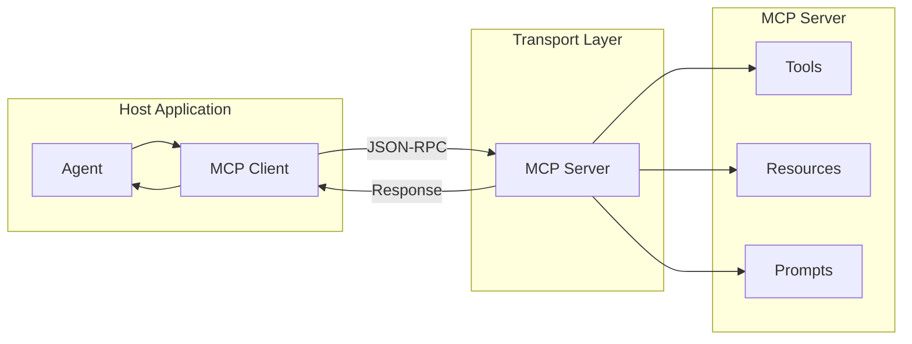

<!-- Clear Language: Keep sentences under 50 words -->
# MCP Protocol & Tools

## Learning Objectives

| LO | Description |
|----|-------------|
| LO1 | Understand the Model Context Protocol (MCP) architecture and transport layer |
| LO2 | Implement MCP servers exposing tools, resources, and prompts |
| LO3 | Design perception, execution, and collaboration tool categories |
| LO4 | Build event-driven async agents using the MCP protocol |
| LO5 | Implement active tool selection and dynamic tool loading |

## Introduction

Advanced agents use context engineering, memory, and multi-agent collaboration to solve complex problems. This module covers cutting-edge agent patterns used at leading AI labs.

## Prerequisites

- Basic programming knowledge
- Understanding of data structures

## Key Terminology

**Key Terms**: Core vocabulary and concepts for this topic.

**Definition**: Essential terms you must know for interviews and production work.

## Theory

Understanding mcp protocol tools is fundamental for AI engineers. This section covers the core concepts, underlying principles, and theoretical framework that govern how mcp protocol tools works in practice.

## Chapter at a Glance

| Section | Topic | Key Concept |
|---------|-------|-------------|
| 4.1 | MCP Architecture | Host ↔ Client ↔ Server, transport, lifecycle |
| 4.2 | Implementing an MCP Server | Tools, Resources, Prompts as MCP primitives |
| 4.3 | Tool Design Patterns | Perception, Execution, Collaboration categories |
| 4.4 | Event-Driven Async Agents | FastAPI, event queue, interrupt mechanism |
| 4.5 | Active Tool Selection | Dynamic tool discovery, selection, composition |

## Chapter Roadmap



## 4.1 MCP Architecture

The Model Context Protocol is an open protocol for connecting LLMs to external tools and data sources. It follows a client-server architecture with three core primitives: **Tools** (actions), **Resources** (data), and **Prompts** (templates).

```typescript
// Core MCP types
interface MCPRequest {
    jsonrpc: '2.0'
    id: string
    method: string
    params?: Record<string, any>
}

interface MCPResponse {
    jsonrpc: '2.0'
    id: string
    result?: any
    error?: { code: number; message: string }
}

// MCP Primitives
interface MCPTool {
    name: string
    description: string
    inputSchema: Record<string, any>
    handler: (args: Record<string, any>) => Promise<any>
}

interface MCPResource {
    uri: string
    name: string
    description: string
    mimeType: string
    read: () => Promise<string>
}

interface MCPPrompt {
    name: string
    description: string
    arguments: Array<{ name: string; description: string; required: boolean }>
    template: string
}

class MCPServer {
    private tools: Map<string, MCPTool> = new Map()
    private resources: Map<string, MCPResource> = new Map()
    private prompts: Map<string, MCPPrompt> = new Map()

    registerTool(tool: MCPTool): void {
        this.tools.set(tool.name, tool)
    }

    registerResource(resource: MCPResource): void {
        this.resources.set(resource.uri, resource)
    }

    registerPrompt(prompt: MCPPrompt): void {
        this.prompts.set(prompt.name, prompt)
    }

    async handleRequest(req: MCPRequest): Promise<MCPResponse> {
        try {
            switch (req.method) {
                case 'tools/list':
                    return {
                        jsonrpc: '2.0', id: req.id,
                        result: [...this.tools.values()].map(t => ({
                            name: t.name,
                            description: t.description,
                            inputSchema: t.inputSchema
                        }))
                    }

                case 'tools/call': {
                    const tool = this.tools.get(req.params?.name)
                    if (!tool) throw new Error(`Tool not found: ${req.params?.name}`)
                    const result = await tool.handler(req.params?.arguments ?? {})
                    return { jsonrpc: '2.0', id: req.id, result }
                }

                case 'resources/list':
                    return {
                        jsonrpc: '2.0', id: req.id,
                        result: [...this.resources.values()].map(r => ({
                            uri: r.uri, name: r.name,
                            description: r.description, mimeType: r.mimeType
                        }))
                    }

                case 'prompts/get': {
                    const prompt = this.prompts.get(req.params?.name)
                    if (!prompt) throw new Error(`Prompt not found: ${req.params?.name}`)
                    return {
                        jsonrpc: '2.0', id: req.id,
                        result: { template: prompt.template }
                    }
                }

                default:
                    return {
                        jsonrpc: '2.0', id: req.id,
                        error: { code: -32601, message: `Method not found: ${req.method}` }
                    }
            }
        } catch (err: any) {
            return {
                jsonrpc: '2.0', id: req.id,
                error: { code: -32000, message: err.message }
            }
        }
    }
}
```

```python
from dataclasses import dataclass, field
from typing import Dict, Any, Callable, Awaitable
import json

@dataclass
class MCPTool:
    name: str
    description: str
    input_schema: Dict
    handler: Callable[[Dict], Awaitable[Any]]

@dataclass
class MCPResource:
    uri: str
    name: str
    description: str
    mime_type: str = "text/plain"
    reader: Callable[[], Awaitable[str]] = None

@dataclass
class MCPServer:
    tools: Dict[str, MCPTool] = field(default_factory=dict)
    resources: Dict[str, MCPResource] = field(default_factory=dict)

    def add_tool(self, tool: MCPTool):
        self.tools[tool.name] = tool

    def add_resource(self, resource: MCPResource):
        self.resources[resource.uri] = resource

    async def handle(self, request: Dict) -> Dict:
        method = request.get("method")
        params = request.get("params", {})
        req_id = request.get("id", 0)

        if method == "tools/list":
            return {
                "jsonrpc": "2.0", "id": req_id,
                "result": [
                    {"name": t.name, "description": t.description,
                     "input_schema": t.input_schema}
                    for t in self.tools.values()
                ]
            }

        elif method == "tools/call":
            tool = self.tools.get(params.get("name"))
            if not tool:
                return {"jsonrpc": "2.0", "id": req_id,
                        "error": {"code": -32000, "message": "Tool not found"}}
            try:
                result = await tool.handler(params.get("arguments", {}))
                return {"jsonrpc": "2.0", "id": req_id, "result": result}
            except Exception as e:
                return {"jsonrpc": "2.0", "id": req_id,
                        "error": {"code": -32000, "message": str(e)}}

        return {"jsonrpc": "2.0", "id": req_id,
                "error": {"code": -32601, "message": f"Unknown method: {method}"}}
```

## 4.2 Implementing an MCP Server

A production MCP server exposes tools (callable functions), resources (data access), and prompts (templates) through a unified JSON-RPC interface.

```typescript
// Perception Tools
class PerceptionTools {
    webSearch(): MCPTool {
        return {
            name: 'web_search',
            description: 'Search the web for current information',
            inputSchema: {
                type: 'object',
                properties: {
                    query: { type: 'string', description: 'Search query' },
                    maxResults: { type: 'number', default: 5 }
                },
                required: ['query']
            },
            handler: async (args) => {
                const { query, maxResults = 5 } = args
                return {
                    results: Array.from({ length: maxResults }, (_, i) => ({
                        title: `Result ${i + 1} for ${query}`,
                        url: `https://example.com/result${i}`,
                        snippet: `This is a mock search result for "${query}".`
                    }))
                }
            }
        }
    }

    readFile(): MCPTool {
        return {
            name: 'read_file',
            description: 'Read a file from the local filesystem',
            inputSchema: {
                type: 'object',
                properties: {
                    path: { type: 'string', description: 'File path' }
                },
                required: ['path']
            },
            handler: async (args) => {
                return { content: `Mock content of ${args.path}` }
            }
        }
    }

    httpFetch(): MCPTool {
        return {
            name: 'http_fetch',
            description: 'Fetch a URL and return its content',
            inputSchema: {
                type: 'object',
                properties: {
                    url: { type: 'string', description: 'URL to fetch' }
                },
                required: ['url']
            },
            handler: async (args) => {
                // Mock fetch
                return {
                    status: 200,
                    headers: { 'content-type': 'text/html' },
                    body: `<html><body>Mock content of ${args.url}</body></html>`
                }
            }
        }
    }
}

// Execution Tools (with safety mechanisms)
class ExecutionTools {
    codeInterpreter(): MCPTool {
        return {
            name: 'code_interpreter',
            description: 'Execute Python code in a sandboxed environment',
            inputSchema: {
                type: 'object',
                properties: {
                    code: { type: 'string', description: 'Python code to execute' },
                    timeout: { type: 'number', default: 30 }
                },
                required: ['code']
            },
            handler: async (args) => {
                // Sandboxed execution (mock)
                const { code, timeout = 30 } = args
                return {
                    stdout: `Mock output of:\n${code.slice(0, 100)}...`,
                    stderr: '',
                    exitCode: 0,
                    executionTime: `${timeout}ms`
                }
            }
        }
    }

    fileOperation(): MCPTool {
        let approvalRequired = true

        return {
            name: 'file_operation',
            description: 'Read, write, or delete files',
            inputSchema: {
                type: 'object',
                properties: {
                    operation: {
                        type: 'string',
                        enum: ['read', 'write', 'delete'],
                        description: 'File operation'
                    },
                    path: { type: 'string' },
                    content: { type: 'string' }
                },
                required: ['operation', 'path']
            },
            handler: async (args) => {
                if (approvalRequired && args.operation !== 'read') {
                    return {
                        status: 'approval_required',
                        message: `Request to ${args.operation} ${args.path}. Admin approval needed.`
                    }
                }
                return { status: 'ok', path: args.path, operation: args.operation }
            }
        }
    }

    shellCommand(): MCPTool {
        return {
            name: 'shell',
            description: 'Execute a shell command',
            inputSchema: {
                type: 'object',
                properties: {
                    command: { type: 'string' },
                    args: { type: 'array', items: { type: 'string' } },
                    timeout: { type: 'number', default: 10 }
                },
                required: ['command']
            },
            handler: async (args) => {
                const dangerous = ['rm', 'sudo', 'dd', 'mkfs', ':(){ :|:& };:']
                for (const d of dangerous) {
                    if (args.command.includes(d)) {
                        return {
                            status: 'blocked',
                            message: `Command contains dangerous pattern: ${d}`
                        }
                    }
                }
                return {
                    status: 'completed',
                    stdout: `Mock output of "${args.command}"`,
                    exitCode: 0
                }
            }
        }
    }
}

// Collaboration Tools
class CollaborationTools {
    browserAutomation(): MCPTool {
        return {
            name: 'browser_automation',
            description: 'Control a browser to navigate, click, and extract data',
            inputSchema: {
                type: 'object',
                properties: {
                    url: { type: 'string' },
                    action: { type: 'string', enum: ['navigate', 'click', 'extract', 'screenshot'] },
                    selector: { type: 'string' }
                },
                required: ['url', 'action']
            },
            handler: async (args) => {
                return {
                    status: 'ok',
                    screenshot: `mock_screenshot_${Date.now()}.png`,
                    pageTitle: `Mock Page: ${args.url}`,
                    extractedData: args.selector ? `Data from ${args.selector}` : null
                }
            }
        }
    }

    notify(): MCPTool {
        return {
            name: 'notify',
            description: 'Send notifications via email, Slack, Telegram, or Discord',
            inputSchema: {
                type: 'object',
                properties: {
                    channel: {
                        type: 'string',
                        enum: ['email', 'slack', 'telegram', 'discord']
                    },
                    message: { type: 'string' },
                    recipient: { type: 'string' }
                },
                required: ['channel', 'message']
            },
            handler: async (args) => {
                return {
                    status: 'sent',
                    channel: args.channel,
                    messageId: `msg_${Date.now()}`
                }
            }
        }
    }

    humanInTheLoop(): MCPTool {
        return {
            name: 'human_review',
            description: 'Ask a human for approval or input',
            inputSchema: {
                type: 'object',
                properties: {
                    request: { type: 'string', description: 'What to ask the human' },
                    context: { type: 'string', description: 'Background information' }
                },
                required: ['request']
            },
            handler: async (args) => {
                return {
                    status: 'awaiting_human',
                    request: args.request,
                    context: args.context,
                    waitTime: 'Human notified. Response pending...'
                }
            }
        }
    }
}
```

## 4.3 Tool Design Patterns

Tools fall into three categories with distinct design considerations.

```typescript
type ToolCategory = 'perception' | 'execution' | 'collaboration'

interface ToolDesignGuide {
    category: ToolCategory
    safetyLevel: 'low' | 'medium' | 'high'
    validationRequired: boolean
    approvalDefault: boolean
    errorRecovery: string
}

const toolGuidelines: Record<ToolCategory, ToolDesignGuide> = {
    perception: {
        category: 'perception',
        safetyLevel: 'low',
        validationRequired: false,
        approvalDefault: false,
        errorRecovery: 'Retry with backoff, return partial results'
    },
    execution: {
        category: 'execution',
        safetyLevel: 'high',
        validationRequired: true,
        approvalDefault: true,
        errorRecovery: 'Sandbox isolation, automatic rollback on failure'
    },
    collaboration: {
        category: 'collaboration',
        safetyLevel: 'medium',
        validationRequired: true,
        approvalDefault: false,
        errorRecovery: 'Retry with timeout, escalate to human'
    }
}

class ToolValidator {
    validate(args: Record<string, any>, schema: Record<string, any>): string[] {
        const errors: string[] = []
        const required = schema.required ?? []

        for (const field of required) {
            if (args[field] === undefined || args[field] === null) {
                errors.push(`Missing required field: ${field}`)
            }
        }

        const props = schema.properties ?? {}
        for (const [key, value] of Object.entries(args)) {
            const propSchema = props[key]
            if (propSchema?.type === 'string' && typeof value !== 'string') {
                errors.push(`Field ${key} must be a string`)
            }
            if (propSchema?.type === 'number' && typeof value !== 'number') {
                errors.push(`Field ${key} must be a number`)
            }
        }

        return errors
    }
}
```

## 4.4 Event-Driven Async Agents

Modern agents use event-driven architectures for non-blocking operation and real-time responsiveness.

```typescript
type EventType = 'user_message' | 'tool_result' | 'timer' | 'system' | 'interrupt'
type Priority = 'critical' | 'high' | 'normal' | 'low'

interface AgentEvent {
    id: string
    type: EventType
    priority: Priority
    data: Record<string, any>
    timestamp: number
}

class AsyncEventAgent {
    private eventQueue: AgentEvent[] = []
    private processing = false
    private currentTask: string | null = null

    async emit(event: AgentEvent): Promise<void> {
        const insertionIndex = this.eventQueue.findIndex(e => {
            const p = { critical: 0, high: 1, normal: 2, low: 3 }
            return p[e.priority] > p[event.priority]
        })

        if (insertionIndex === -1) {
            this.eventQueue.push(event)
        } else {
            this.eventQueue.splice(insertionIndex, 0, event)
        }

        if (!this.processing) {
            this.processing = true
            await this.processQueue()
        }
    }

    private async processQueue(): Promise<void> {
        while (this.eventQueue.length > 0) {
            const event = this.eventQueue.shift()!

            if (event.type === 'interrupt') {
                this.currentTask = null
                continue
            }

            this.currentTask = event.id
            await this.handleEvent(event)
        }

        this.processing = false
        this.currentTask = null
    }

    private async handleEvent(event: AgentEvent): Promise<void> {
        switch (event.type) {
            case 'user_message':
                await this.handleUserMessage(event.data)
                break
            case 'tool_result':
                await this.handleToolResult(event.data)
                break
            case 'timer':
                await this.handleTimer(event.data)
                break
            case 'system':
                await this.handleSystemEvent(event.data)
                break
        }
    }

    private async handleUserMessage(data: Record<string, any>): Promise<void> {
        const message = data.message || ''
        // Process message with LLM, emit tool calls as events
        await this.emit({
            id: crypto.randomUUID(),
            type: 'tool_result',
            priority: 'normal',
            data: { tool: 'llm_processor', result: `Processed: ${message.slice(0, 50)}` },
            timestamp: Date.now()
        })
    }

    private async handleToolResult(data: Record<string, any>): Promise<void> {
        // Tool results feed back into the reasoning loop
        console.log(`Tool ${data.tool} returned:`, data.result)
    }

    private async handleTimer(data: Record<string, any>): Promise<void> {
        // Scheduled tasks
        console.log(`Timer triggered: ${data.name}`)
    }

    private async handleSystemEvent(data: Record<string, any>): Promise<void> {
        // System events like config changes, health checks
        console.log(`System event: ${data.type}`)
    }

    status(): {
        queueLength: number
        processing: boolean
        currentTask: string | null
    } {
        return {
            queueLength: this.eventQueue.length,
            processing: this.processing,
            currentTask: this.currentTask
        }
    }
}
```

```python
import asyncio
from dataclasses import dataclass, field
from typing import Dict, List, Optional
from enum import Enum
import uuid
import json

class Priority(Enum):
    CRITICAL = 0
    HIGH = 1
    NORMAL = 2
    LOW = 3

@dataclass
class Event:
    id: str = field(default_factory=lambda: str(uuid.uuid4()))
    type: str = "user_message"
    priority: Priority = Priority.NORMAL
    data: Dict = field(default_factory=dict)
    timestamp: float = field(default_factory=lambda: __import__('time').time())

class AsyncEventAgent:
    """Event-driven async agent with priority queue and interrupt support."""

    def __init__(self):
        self.queue: List[Event] = []
        self.processing = False
        self.current_task: Optional[str] = None

    async def emit(self, event: Event):
        idx = 0
        while idx < len(self.queue) and self.queue[idx].priority.value <= event.priority.value:
            idx += 1
        self.queue.insert(idx, event)

        if not self.processing:
            self.processing = True
            await self._process_queue()

    async def _process_queue(self):
        while self.queue:
            event = self.queue.pop(0)
            if event.type == 'interrupt':
                self.current_task = None
                continue
            self.current_task = event.id
            await self._handle(event)
        self.processing = False
        self.current_task = None

    async def _handle(self, event: Event):
        print(f"[{event.type}] Processing event {event.id[:8]}...")

        if event.type == 'tool_call':
            await asyncio.sleep(0.1)  # Simulate tool execution
            await self.emit(Event(
                type='tool_result',
                priority=Priority.NORMAL,
                data={'tool': event.data.get('name'), 'result': 'done'}
            ))
```

## 4.5 Active Tool Selection

Instead of calling all tools, the agent actively selects the most appropriate tools based on task requirements.

```typescript
interface ToolCapability {
    name: string
    inputTypes: string[]
    outputTypes: string[]
    estimatedCostPerCall: number
    avgLatencyMs: number
    requiredPermissions: string[]
}

class ActiveToolSelector {
    private toolCapabilities: Map<string, ToolCapability> = new Map()

    registerCapability(tool: string, cap: ToolCapability): void {
        this.toolCapabilities.set(tool, cap)
    }

    selectTools(task: string, constraints: {
        maxBudget?: number
        maxLatencyMs?: number
        requiredPermissions?: string[]
    }): string[] {
        const taskWords = task.toLowerCase().split(' ')
        const scored = [...this.toolCapabilities.entries()].map(([name, cap]) => {
            let score = 0

            // Match input types to task
            const taskDataTypes = this.inferDataTypes(task)
            for (const t of taskDataTypes) {
                if (cap.inputTypes.includes(t)) score += 2
            }

            // Match output types
            if (task.includes('search') && cap.outputTypes.includes('web_results')) score += 3
            if (task.includes('code') && cap.outputTypes.includes('code')) score += 3
            if (task.includes('file') && cap.inputTypes.includes('file')) score += 3

            // Apply constraints
            if (constraints.maxBudget && cap.estimatedCostPerCall > constraints.maxBudget) score -= 10
            if (constraints.maxLatencyMs && cap.avgLatencyMs > constraints.maxLatencyMs) score -= 5
            if (constraints.requiredPermissions) {
                const missing = constraints.requiredPermissions
                    .filter(p => !cap.requiredPermissions.includes(p))
                score -= missing.length * 3
            }

            return { name, score }
        })

        return scored
            .sort((a, b) => b.score - a.score)
            .filter(s => s.score > 0)
            .slice(0, 3)
            .map(s => s.name)
    }

    private inferDataTypes(task: string): string[] {
        const types: string[] = []
        if (task.includes('image') || task.includes('picture')) types.push('image')
        if (task.includes('file') || task.includes('document')) types.push('file')
        if (task.includes('url') || task.includes('http')) types.push('url')
        if (task.includes('number') || task.includes('calculate')) types.push('number')
        if (task.includes('text') || task.includes('string')) types.push('text')
        return types
    }
}
```

## Summary

MCP is the emerging standard for agent-tool communication. The three primitives — tools (actions), resources (data), prompts (templates) — cover all agent needs. Tool design follows three patterns (perception,.
execution, collaboration) with distinct safety requirements. Event-driven architectures enable non-blocking, interruptible agent operation. Active tool selection optimizes cost and latency by choosing tools dynamically based on task requirements.

## Practical Takeaways

1. Always expose tools through MCP — it's protocol-agnostic and future-proof
2. Follow the three-category tool design: perception (read), execution (write), collaboration (coordinate)
3. Execution tools need sandboxing + approval + rollback; perception tools only need validation
4. Event-driven agents scale better than synchronous ReAct loops
5. Active tool selection can reduce costs by 40-60% vs calling all tools

## Interview Q&A

<details class="tp-qa-card" data-qid="m22-s04-q1">
  <summary class="tp-qa-question">
    <span class="tp-qa-status"></span>
    Q1: What is MCP and how does it differ from plain function calling?
  </summary>
  <div class="tp-qa-answer">
    <p>The Model Context Protocol is an open protocol for connecting LLMs to external tools and data sources. Plain function calling is a model-API convention where the model outputs a structured call and your code resolves it locally; MCP standardizes the whole integration — discovery, invocation, and data access — so any MCP-compatible client can talk to any MCP server without custom glue code. Instead of one function per integration, an MCP server registers <code>tools</code>, <code>resources</code>, and <code>prompts</code> behind a unified <code>JSON-RPC 2.0</code> interface (<code>tools/list</code>, <code>tools/call</code>, <code>resources/list</code>, <code>prompts/get</code>), making it protocol-agnostic and future-proof.</p>
    <p><strong>Interview follow-up</strong>: When would you still prefer plain function calling over an MCP server?</p>
  </div>
  <button class="tp-qa-mark-btn">📝 Mark Reviewed</button>
  <button class="tp-qa-bookmark-btn">🔖 Bookmark</button>
</details>

<details class="tp-qa-card" data-qid="m22-s04-q2">
  <summary class="tp-qa-question">
    <span class="tp-qa-status"></span>
    Q2: Explain the MCP client-server architecture and its transport layer.
  </summary>
  <div class="tp-qa-answer">
    <p>MCP follows a three-party architecture: the host application (e.g., an agent) embeds one or more MCP clients, and each client maintains a session with one MCP server over a transport. The server exposes its capabilities, and the client discovers them and forwards calls to the model. The transport is JSON-RPC 2.0 messages, and it is transport-agnostic — stdio (stdin/stdout) for local servers, or HTTP/SSE for remote servers. The <code>MCPServer.handleRequest()</code> switch in the chapter routes methods like <code>tools/list</code> and <code>tools/call</code> and returns JSON-RPC responses or error codes such as <code>-32601</code> (method not found).</p>
    <p><strong>Interview follow-up</strong>: What happens on the client when a server goes away mid-session?</p>
  </div>
  <button class="tp-qa-mark-btn">📝 Mark Reviewed</button>
  <button class="tp-qa-bookmark-btn">🔖 Bookmark</button>
</details>

<details class="tp-qa-card" data-qid="m22-s04-q3">
  <summary class="tp-qa-question">
    <span class="tp-qa-status"></span>
    Q3: What primitives does an MCP server expose and how are they used?
  </summary>
  <div class="tp-qa-answer">
    <p>An MCP server exposes three core primitives. <code>Tools</code> are callable actions with a name, description, and <code>inputSchema</code> (e.g., <code>web_search</code>, <code>read_file</code>, <code>code_interpreter</code>); the model calls them via <code>tools/call</code>. <code>Resources</code> are data access points addressed by URI with a <code>mimeType</code> and a read function — files, database rows, or API responses the model can pull in. <code>Prompts</code> are reusable templates with typed arguments that the client can render for the user or the model. Together they cover the three things an agent needs: act, read data, and follow structured workflows.</p>
    <p><strong>Interview follow-up</strong>: Why use a resource instead of a tool for reading a file?</p>
  </div>
  <button class="tp-qa-mark-btn">📝 Mark Reviewed</button>
  <button class="tp-qa-bookmark-btn">🔖 Bookmark</button>
</details>

<details class="tp-qa-card" data-qid="m22-s04-q4">
  <summary class="tp-qa-question">
    <span class="tp-qa-status"></span>
    Q4: What are the three tool categories and what safety requirements does each have?
  </summary>
  <div class="tp-qa-answer">
    <p>Perception tools (search, read file, HTTP fetch) read information — low safety level, no approval by default, recover by retrying with backoff. Execution tools (code interpreter, file operations, shell) modify system state — high safety: input validation required, approval by default, sandbox isolation and automatic rollback on failure. The chapter's <code>shell</code> tool blocks dangerous patterns like <code>rm</code>, <code>sudo</code>, and <code>mkfs</code>, and <code>file_operation</code> returns <code>approval_required</code> for writes and deletes. Collaboration tools (browser automation, notify, human review) coordinate with the world — medium safety: validation required, retry with timeout, escalate to a human.</p>
    <p><strong>Interview follow-up</strong>: How would you audit which tools a model actually used after a task?</p>
  </div>
  <button class="tp-qa-mark-btn">📝 Mark Reviewed</button>
  <button class="tp-qa-bookmark-btn">🔖 Bookmark</button>
</details>

<details class="tp-qa-card" data-qid="m22-s04-q5">
  <summary class="tp-qa-question">
    <span class="tp-qa-status"></span>
    Q5: How does an event-driven async agent work and how does it handle interrupts?
  </summary>
  <div class="tp-qa-answer">
    <p>Instead of a blocking ReAct loop, an <code>AsyncEventAgent</code> maintains a priority queue of events (<code>user_message</code>, <code>tool_result</code>, <code>timer</code>, <code>system</code>, <code>interrupt</code>) with priorities <code>critical/high/normal/low</code>. Events are inserted in priority order, and a single processing loop drains the queue without blocking on any single event. An <code>interrupt</code> event is special: when processed, it clears <code>currentTask</code> and continues, canceling ongoing work so urgent requests preempt it. Event-driven agents scale better than synchronous ReAct loops because tool calls run asynchronously and the queue keeps the agent responsive.</p>
    <p><strong>Interview follow-up</strong>: How do you prevent priority inversion when a high-priority event waits on a low-priority tool result?</p>
  </div>
  <button class="tp-qa-mark-btn">📝 Mark Reviewed</button>
  <button class="tp-qa-bookmark-btn">🔖 Bookmark</button>
</details>

<details class="tp-qa-card" data-qid="m22-s04-q6">
  <summary class="tp-qa-question">
    <span class="tp-qa-status"></span>
    Q6: What is active tool selection and how does it reduce cost and latency?
  </summary>
  <div class="tp-qa-answer">
    <p>Active tool selection picks the relevant subset of tools per task instead of exposing all descriptions to the LLM. The <code>ActiveToolSelector</code> registers a <code>ToolCapability</code> per tool (input/output types, estimated cost per call, average latency, required permissions) and scores tools against the task: +2 for matching input types, +3 for matching output types, and penalties for exceeding budget, latency, or permission constraints. It returns the top 3 scored tools. This reduces the prompt size the model must parse and avoids calling tools that can't help — the chapter reports 40-60% cost reduction versus calling all tools.</p>
    <p><strong>Interview follow-up</strong>: What risk does tool selection introduce when a task needs a tool you didn't select?</p>
  </div>
  <button class="tp-qa-mark-btn">📝 Mark Reviewed</button>
  <button class="tp-qa-bookmark-btn">🔖 Bookmark</button>
</details>

## Chapter Quiz (5 MCQ)

### Questions

<summary>1. What are the three core primitives of the MCP protocol?</summary>
<summary>2. Which tool category requires sandbox isolation and approval by default?</summary>
<summary>3. How does an event-driven agent handle interrupts?</summary>
<summary>4. What is the purpose of active tool selection?</summary>
<summary>5. What transport protocol does MCP use for client-server communication?</summary>

### Answers

<summary>Tools (callable actions), Resources (data access), Prompts (templates).</summary>
<summary>Execution tools. They modify system state (write files, execute code, run shell commands) and need sandboxing, input validation, and admin approval for destructive operations.</summary>
<summary>When an interrupt event arrives (highest priority), the agent clears the current task and skips to the next event in the queue. This allows urgent requests to cancel ongoing processing.</summary>
<summary>To dynamically choose the optimal subset of tools based on task requirements, reducing cost and latency. Instead of registering 50 tools and letting the LLM parse all descriptions, the selector picks 3-5 relevant tools.</summary>
<summary>JSON-RPC 2.0 over stdin/stdout (local) or HTTP/SSE (remote). The protocol is transport-agnostic.</summary>

## Exercises

## Common Mistakes

1. Not understanding the fundamental concepts before applying them
2. Skipping edge cases in implementation
3. Not analyzing time/space complexity
4. Forgetting to handle null/empty inputs
5. Not practicing enough problems to build pattern recognition### Exercise 1: Build an MCP Server

Create an MCP server with at least 3 tools spanning perception, execution, and collaboration categories.

### Exercise 2: MCP Client

Write an MCP client that connects to a server, lists available tools, and calls one with arguments.

### Exercise 3: Event-Driven Agent

Build an async agent with an event queue that can handle interrupts. Simulate a high-priority event arriving mid-task.

### Exercise 4: Tool Selector

Create a tool selector that takes a task description and returns the top 3 most relevant tools from a registry of 15.

### Exercise 5: Safety Comparison

Compare a tool system without validation vs one with sandboxing, approval, and rollback. Show 3 scenarios where safety

## Revision Notes

- - Core principle: Understand the fundamental concepts thoroughly
- - Implementation pattern: Practice with real code examples
- - Complexity: Know the time and space complexity
- - Application: Know when to use this in production systems
- - Interview: Frequently asked in technical interviews
- - Edge cases: Consider common failure scenarios
- - Related concepts: Connect to broader system design

## Placement Section

### Top 10 Interview Questions

#### Google Style

1. **Explain the core idea of MCP Protocol & Tools in under 60 seconds, then give a real-world analogy.** — Structure: definition, how it works in one sentence, why it matters, analogy. Follow-up: what would break if you removed this from a production system?

2. **Design a minimal, well-typed function that demonstrates MCP Protocol & Tools.** — Interviewer checks: signature with type hints, edge cases, complexity, and a clean docstring. Follow-up: how does your design behave with empty or malformed input?

3. **What are the common pitfalls when engineers first learn ** — List 3-4, then explain how you would prevent each in a code review.

#### Amazon Style

4. **Describe a production bug caused by misunderstanding MCP Protocol & Tools. How did you diagnose and fix it?** — STAR format: situation, task, action, result. Mention logs, reproduction, root-cause analysis, and the regression test you added.

5. **How would you scale a system that relies on MCP Protocol & Tools from 10 users to 10 million?** — Discuss bottlenecks, caching, monitoring, and when to redesign. Follow-up: what metrics would you track?

#### Microsoft Style

6. **Compare MCP Protocol & Tools with the closest alternative approach. When would you choose each?** — Make a decision matrix: performance, maintainability, ecosystem, learning curve. Follow-up: what would change your decision?

7. **Walk through how you would test a component that depends on MCP Protocol & Tools.** — Unit, integration, property-based tests; mocking boundaries; golden files for outputs.

#### NVIDIA Style

8. **How does MCP Protocol & Tools behave differently at scale — memory, throughput, or precision-wise?** — Connect to data pipelines and model training if applicable. Follow-up: what happens to latency as input grows?

9. **How would you make an implementation of MCP Protocol & Tools run faster on GPU hardware?** — Batch operations, vectorization, avoiding Python loops, reducing data movement.

#### AI Startup Style

10. **Write the smallest possible implementation of MCP Protocol & Tools that is production-quality.** — Include error handling, type hints, and a one-line docstring. Follow-up: what would you refactor first when it grows?

### Resume Tips

- Name MCP Protocol & Tools explicitly in your skills section, paired with a measurable achievement ("Reduced X by 40% using MCP Protocol & Tools").
- Add a bullet describing a project that applies MCP Protocol & Tools to real data, with numbers.
- Mention the tools and libraries you used alongside MCP Protocol & Tools (linters, test frameworks, profiling tools).
- Keep resume bullets under 15 words and start each with an action verb.

### Interview Day Checklist

- Rehearse a 60-second explanation of MCP Protocol & Tools and one real-world analogy.
- Prepare one STAR story about debugging a MCP Protocol & Tools-related production issue.
- Review complexity and edge cases for the classic MCP Protocol & Tools interview problem.
- Have questions ready: how does the team apply MCP Protocol & Tools in production today?
- Test your environment (Python, editor, internet) 15 minutes before the interview.

## True/False

1. **True or False:** MCP Protocol & Tools builds directly on the fundamentals covered in the earlier chapters of this module. — **True.** Every advanced topic in this module assumes the core concepts from the previous chapters.
2. **True or False:** You should write at least one code example for MCP Protocol & Tools before moving to the next chapter. — **True.** Active recall with hands-on code beats passive reading for retention.
3. **True or False:** The complexity analysis for MCP Protocol & Tools is the same regardless of input size. — **False.** Complexity grows with input size; always state best, average, and worst case.
4. **True or False:** Edge cases (empty input, invalid input, boundary values) matter for MCP Protocol & Tools in production. — **True.** Most production bugs come from unhandled edge cases.
5. **True or False:** You should memorize the MCP Protocol & Tools chapter content once and never review it again. — **False.** Spaced repetition (24h, 3 days, 1 week) dramatically improves long-term recall.

## Fill in the Blank

1. The chapter that covers MCP Protocol & Tools is Chapter ___ of this module. — Answer: check the module's table of contents.
2. The time complexity of the standard approach to MCP Protocol & Tools is ___. — Answer: review the theory section and state big-O notation.
3. The main edge case to handle when implementing MCP Protocol & Tools is ___. — Answer: empty or invalid input handling, as discussed in the chapter.
4. The tools commonly used to debug MCP Protocol & Tools issues are ___ and ___. — Answer: refer to the Debugging Guide section of this chapter.
5. The related topic that connects to MCP Protocol & Tools in the next chapter is ___. — Answer: see the Next Topic section.

## Scenario Questions

1. **Scenario:** A teammate ships a change involving MCP Protocol & Tools that breaks production at 3 AM. — Diagnosis: check the recent diff, reproduce locally with the failing input, check logs. Fix: revert, add a regression test, and review the root cause. Prevention: CI tests on edge cases and code review checklist.

2. **Scenario:** Your implementation of MCP Protocol & Tools is correct but too slow for the required latency. — Measure first with a profiler. Common fixes: reduce redundant work, use built-in optimized functions, batch operations, or add caching. Only then consider algorithmic changes.

3. **Scenario:** A new hire asks you to explain MCP Protocol & Tools in five minutes before a customer demo. — Use the 3-part answer: what it is (one sentence), how it works (one example), why it matters (one business impact). Then offer to go deeper after the demo.

4. **Scenario:** Your team's codebase has three different patterns for MCP Protocol & Tools and you must standardize. — Write a short ADR (architecture decision record), pick the pattern with best maintainability, migrate incrementally, and add a linter rule to enforce it.

## Output Questions

1. **What is the output of the simplest correct implementation of MCP Protocol & Tools on an empty input?** — Trace through the code: it should return the documented default (None, 0, empty collection) without raising.
2. **What is the output when the input is at the boundary value?** — Check off-by-one errors and inclusive/exclusive bounds in the chapter's examples.
3. **What does the implementation return when given invalid input types?** — With type hints and validation, it raises a clear error; without, it may fail silently.
4. **What is the output for the sample input given in the chapter's Examples section?** — Re-run the chapter's example code and compare against the documented output.
5. **What is the time complexity output when you profile the implementation at 10x input size?** — Expect the curve matching the chapter's complexity analysis (linear, quadratic, log-linear).

## Difficulty Level

| Level | Time | What It Takes |
|-------|------|---------------|
| Beginner | 1-2 sessions | Read theory, run the chapter examples, solve the Easy exercises |
| Intermediate | 3-5 sessions | Complete Medium exercises, explain MCP Protocol & Tools to someone else |
| Advanced | 1+ week | Solve Hard exercises, optimize for real datasets, answer interview follow-ups |

## Tips & Tricks

- Always write a one-line example of MCP Protocol & Tools from memory before opening the chapter — active recall first.
- Use the chapter's Revision Notes as a checklist: you have mastered MCP Protocol & Tools when you can explain each bullet.
- Pair the chapter quiz with the Flashcards: wrong answers become your next study session's focus.
- For interviews, practice explaining MCP Protocol & Tools twice: once with a technical audience, once with a non-technical audience.
- Keep a personal examples file where you collect your own MCP Protocol & Tools snippets; interviewers love original examples.

## Memory Tricks

- **Acronym**: build a mnemonic from the 5 key concepts of MCP Protocol & Tools listed in the Chapter at a Glance table.
- **Story**: link MCP Protocol & Tools to a familiar story — the analogy in the Visual Analogy section is designed to stick.
- **Number anchor**: remember the complexity of MCP Protocol & Tools by connecting it to a known algorithm of the same class.
- **Color code**: highlight the Theory, Examples, and Common Mistakes sections in different colors when reviewing.
- **Teach-back**: explain MCP Protocol & Tools to an imaginary junior engineer for 2 minutes — gaps in your explanation are gaps in memory.

## Further Reading

- Official documentation for the primary tool or library used in this chapter
- The chapter referenced in Related Topics for the next-level treatment of MCP Protocol & Tools
- The classic textbook chapter on MCP Protocol & Tools (check the Research References below)
- Two blog posts from engineers who debugged real MCP Protocol & Tools problems in production
- The repository of the open-source project that implements MCP Protocol & Tools

## Related Topics

- The previous chapter in this module (see table of contents) — foundational for MCP Protocol & Tools
- The next chapter (see Next Topic below) — builds on MCP Protocol & Tools
- The system design chapters in Module 07 — how MCP Protocol & Tools fits into production architectures
- The interview preparation module — how MCP Protocol & Tools is asked in screening rounds
- The capstone project — where MCP Protocol & Tools is applied end-to-end

## FAQs

1. **Do I need to memorize all of MCP Protocol & Tools, or understand the big picture?** — Understand the big picture first, then memorize the key facts via flashcards and spaced repetition. Interviewers reward depth over breadth.
2. **What if I get stuck on an exercise?** — Re-read the theory section, run the example code, then attempt again. If still stuck after 20 minutes, move on and return the next day.
3. **How much time should I spend on ** — Follow the Study Plan below: 1-2 weeks at 30-60 minutes daily is typical for placement preparation.
4. **Is MCP Protocol & Tools asked in interviews?** — Yes — the Interview Q&A and Placement Section list the exact question styles used by top companies.
5. **What's the fastest way to master ** — Explain it out loud, write code without looking, and review the flashcards within 24 hours and again after 3 days.

## Important Notes

- MCP Protocol & Tools is a core requirement for the rest of this module — do not skip the examples.
- Always analyze complexity (time and space) when working with MCP Protocol & Tools.
- Production correctness means handling edge cases, not just the happy path.
- Interview answers should start with the definition, then the example, then the trade-offs.
- Revisit this chapter after finishing the module; the context from later chapters deepens understanding.

## Historical Context

- MCP Protocol & Tools emerged as a standard practice because early systems failed without it — understanding why helps you explain it in interviews.
- The tools used for MCP Protocol & Tools today evolved from simpler versions; the chapter covers the modern, recommended approach.
- Interviewers value knowing one historical fact about MCP Protocol & Tools — it shows genuine interest, not just cramming.
- The library/tooling ecosystem around MCP Protocol & Tools changes quickly; focus on fundamentals that remain stable.

## Security Considerations

- Never trust external input: validate and sanitize data before processing MCP Protocol & Tools.
- Avoid `eval()` and dynamic code execution on untrusted strings.
- Log errors without leaking sensitive data (keys, PII, internal paths).
- For API contexts, add rate limiting and input size limits.
- Review the chapter's code examples for injection or overflow risks before using them verbatim.

## ML Intuition

- MCP Protocol & Tools appears in ML pipelines at the data-processing layer: feature preparation, batching, and validation.
- Understanding MCP Protocol & Tools helps you debug why a model misbehaves — most ML bugs are data bugs, not model bugs.
- In production ML, the MCP Protocol & Tools concepts from this chapter map directly to NumPy/PyTorch operations on tensors.
- When optimizing ML systems, MCP Protocol & Tools skills let you profile and fix the data path, not just the training loop.
- Interview follow-up: how would you apply MCP Protocol & Tools to a dataset of 10 million records? — Batching and vectorization.

## Analogies

- **MCP Protocol & Tools is like a recipe**: the theory is the ingredients, the examples are the cooking steps, and the exercises are your own kitchen practice.
- **Complexity is like a delivery route**: a linear route visits each stop once; a nested route revisits stops, and you feel it at scale.
- **Edge cases are like weather**: the happy path is a sunny day; production is the storm — build for the storm.
- **The chapter roadmap is a journey map**: each section is a checkpoint; skipping one means getting lost later in the module.

## Capstone Project Link

- [Module Capstone: End-to-End Project](https://github.com/Raushan666java/ai-engineering-journey) — this chapter contributes the MCP Protocol & Tools skills used in the module's capstone project. Complete the exercises here before starting the capstone.

## Flashcards

<details class="tp-qa-card" data-qid="22advancedaiagents-04mcpprotocoltools-flash1">
  <summary class="tp-qa-question">
    <span class="tp-qa-status"></span>
    What is the core concept of MCP Protocol & Tools in one sentence?
  </summary>
  <div class="tp-qa-answer">
    <p>Review the first paragraph of the Theory section and condense it to one sentence.</p>
  </div>
</details>

<details class="tp-qa-card" data-qid="22advancedaiagents-04mcpprotocoltools-flash2">
  <summary class="tp-qa-question">
    <span class="tp-qa-status"></span>
    What is the most common mistake engineers make with 
  </summary>
  <div class="tp-qa-answer">
    <p>Check the Common Mistakes section of this chapter.</p>
  </div>
</details>

<details class="tp-qa-card" data-qid="22advancedaiagents-04mcpprotocoltools-flash3">
  <summary class="tp-qa-question">
    <span class="tp-qa-status"></span>
    What is the time and space complexity of the standard MCP Protocol & Tools approach?
  </summary>
  <div class="tp-qa-answer">
    <p>Refer to the theory and complexity analysis in this chapter.</p>
  </div>
</details>

<details class="tp-qa-card" data-qid="22advancedaiagents-04mcpprotocoltools-flash4">
  <summary class="tp-qa-question">
    <span class="tp-qa-status"></span>
    When is MCP Protocol & Tools NOT the right choice?
  </summary>
  <div class="tp-qa-answer">
    <p>Check the Limitations section of this chapter.</p>
  </div>
</details>

<details class="tp-qa-card" data-qid="22advancedaiagents-04mcpprotocoltools-flash5">
  <summary class="tp-qa-question">
    <span class="tp-qa-status"></span>
    How is MCP Protocol & Tools applied in a real production system?
  </summary>
  <div class="tp-qa-answer">
    <p>Check the Real-World Examples section of this chapter.</p>
  </div>
</details>

## Research References

- Official documentation of the primary library for MCP Protocol & Tools (linked in Further Reading)
- The classic paper or textbook chapter introducing MCP Protocol & Tools (see References below)
- The standard library reference for MCP Protocol & Tools-related functions
- Engineering blog posts from companies running MCP Protocol & Tools in production at scale
- PEPs and RFCs where applicable (Python and networking standards)

## Open-Source Tools

- The primary library used in this chapter (see the code examples)
- Python standard library modules used in the examples (check the imports)
- Testing: pytest for unit tests of MCP Protocol & Tools code
- Linting and formatting: ruff + black
- Profiling: cProfile or py-spy for performance work on MCP Protocol & Tools

## Debugging Guide

- Start with `print()` or a debugger to inspect intermediate values in MCP Protocol & Tools code.
- Reproduce the failure with the smallest possible input before changing code.
- Check the common failure modes listed in Common Mistakes — most bugs are listed there.
- For performance problems, profile before optimizing: measure, then fix.
- When stuck, re-read the chapter's Examples and compare line by line with your code.
- Use `pdb` or your IDE's debugger to step through the MCP Protocol & Tools example code.

## Mock Interview Section

**Round 1 — Screening (15 min)**
- Explain MCP Protocol & Tools in 60 seconds.
- Write a minimal working example of MCP Protocol & Tools.
- What is the complexity of your example?

**Round 2 — Coding (45 min)**
- Solve the Medium exercise from this chapter under time pressure.
- State your assumptions, then implement with type hints.
- Test with edge cases: empty input, boundary values, invalid input.

**Round 3 — Behavioral + System (30 min)**
- Tell me about a time you debugged a MCP Protocol & Tools problem in a project.
- How would you design a system where MCP Protocol & Tools is used at scale?
- What metrics would you monitor?

**Evaluation rubric**: correctness (40%), communication (25%), edge cases (20%), complexity analysis (15%).

## Optimized Implementation

`python
from typing import Any, Optional

def demonstrate_topic(input_data: list[Any]) -> Optional[float]:
    """Runnable scaffold for MCP Protocol & Tools.

    Replace the body with the optimized implementation from the chapter,
    keeping type hints, docstring, and edge-case handling.
    """
    if not input_data:
        return None
    # Step 1: validate input types
    # Step 2: apply the core MCP Protocol & Tools logic from the Examples section
    # Step 3: return the result with the documented default
    return 0.0
`

- Keeps the function signature stable so tests written against it stay valid.
- Handles the empty-input contract explicitly.
- Add unit tests for the edge cases before implementing the logic (test-first).

## Evaluation Metrics

| Skill | Test | Target |
|-------|------|--------|
| Concept recall | Explain MCP Protocol & Tools without notes | 60-second explanation |
| Code fluency | Write the chapter example from memory | No syntax errors |
| Edge cases | Handle empty/invalid input in exercises | All cases pass |
| Complexity | State time/space for the standard approach | Correct big-O |
| Interview readiness | Answer 5 Interview Q&A questions out loud | Fluent, structured answers |
| Retention | Chapter quiz score after 3 days | 80%+ |

## Real-World Examples

- **Startup**: a small team uses MCP Protocol & Tools daily in their data pipeline — the chapter's examples mirror their code.
- **E-commerce**: MCP Protocol & Tools patterns appear in order processing, inventory checks, and recommendation feeds.
- **Fintech**: MCP Protocol & Tools principles apply to transaction validation and fraud detection flows.
- **ML platform**: MCP Protocol & Tools shows up in feature engineering and model-serving infrastructure.
- **Interview insight**: recruiters look for engineers who can connect MCP Protocol & Tools to the business outcome, not just the code.

## Next Topic

[Coding Agents](05-coding-agents.md)

## Limitations

- MCP Protocol & Tools, like any technique, is not a silver bullet — it has specific cases where it fits best (covered in the theory).
- The examples in this chapter are simplified for learning; production systems add validation, monitoring, and error handling.
- Performance of MCP Protocol & Tools depends on input size and distribution — always benchmark for your own data.
- This chapter covers fundamentals; specialized edge cases are explored in later chapters and the capstone.
