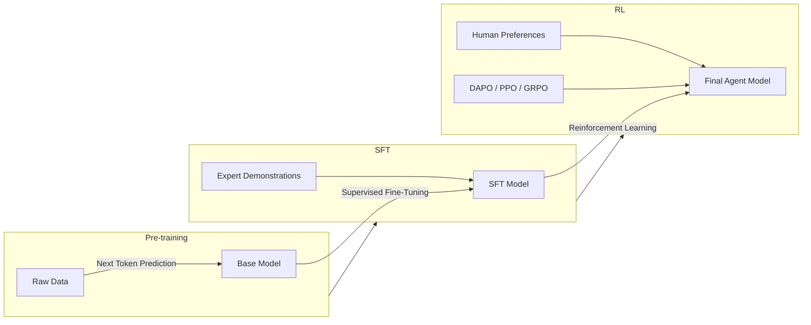

<!-- Clear Language: Keep sentences under 50 words -->
# Model Post-Training for Agents

## Learning Objectives

| LO | Description |
|----|-------------|
| LO1 | Understand the three-stage training pipeline: pre-training, SFT, RL |
| LO2 | Compare Supervised Fine-Tuning (SFT) vs Reinforcement Learning (RL) for agent tasks |
| LO3 | Implement RLHF and DAPO for agent behavior optimization |
| LO4 | Design tool-augmented reasoning training pipelines |
| LO5 | Measure and compare post-training methods for agent performance |

## Introduction

Advanced agents use context engineering, memory, and multi-agent collaboration to solve complex problems. This module covers cutting-edge agent patterns used at leading AI labs.

## Prerequisites

- Basic programming knowledge
- Understanding of data structures

## Key Terminology

**Key Terms**: Core vocabulary and concepts for this topic.

**Definition**: Essential terms you must know for interviews and production work.

## Theory

Understanding model post training is fundamental for AI engineers. This section covers the core concepts, underlying principles, and theoretical framework that govern how model post training works in practice.

## Chapter at a Glance

| Section | Topic | Key Concept |
|---------|-------|-------------|
| 7.1 | The Three-Stage Pipeline | Pre-training → SFT → RL |
| 7.2 | SFT for Agents | Teaching format, tool use, and task structure |
| 7.3 | RL for Agents | Teaching behavior, exploration, and optimization |
| 7.4 | SFT vs RL Comparison | When to choose each method |
| 7.5 | DAPO Algorithm | Constrained optimization for agent tasks |
| 7.6 | Tool-Augmented Reasoning | Training models to use tools effectively |

## Chapter Roadmap



## 7.1 The Three-Stage Pipeline

Every production agent model goes through three training stages, each serving a distinct purpose.

```typescript
interface TrainingStage {
    name: string
    dataType: string
    objective: string
    computeCost: string
}

class TrainingPipeline {
    stages: TrainingStage[] = [
        {
            name: 'Pre-training',
            dataType: 'Trillions of tokens (web, books, code)',
            objective: 'Learn language, facts, and patterns via next-token prediction',
            computeCost: 'Extreme ($10M+)'
        },
        {
            name: 'Supervised Fine-Tuning (SFT)',
            dataType: 'Thousands to millions of demonstrations',
            objective: 'Learn format, tool use, instruction following',
            computeCost: 'Moderate ($1K-$100K)'
        },
        {
            name: 'Reinforcement Learning (RL)',
            dataType: 'Model-generated trajectories + reward signals',
            objective: 'Optimize behavior, exploration, task completion',
            computeCost: 'High ($10K-$500K)'
        }
    ]

    recommend(purpose: 'general' | 'agent' | 'specialist'): TrainingStage[] {
        if (purpose === 'agent') {
            return this.stages  // Full three-stage for agents
        }
        if (purpose === 'specialist') {
            return [this.stages[1], this.stages[2]]  // Skip pre-training
        }
        return [this.stages[0], this.stages[1]]  // General: pre-train + SFT
    }
}

interface TrainingConfig {
    baseModel: string
    sftDataPath: string
    rlDataPath: string
    sftEpochs: number
    rlSteps: number
    batchSize: number
    learningRate: number
    rewardModelPath: string
}

class TrainingOrchestrator {
    async runSFT(config: TrainingConfig): Promise<string> {
        console.log(`[SFT] Starting supervised fine-tuning on ${config.baseModel}`)
        console.log(`[SFT] Data: ${config.sftDataPath}, ${config.sftEpochs} epochs`)

        // Mock training loop
        for (let epoch = 0; epoch < config.sftEpochs; epoch++) {
            console.log(`[SFT] Epoch ${epoch + 1}/${config.sftEpochs}`)
            await this.mockTrainingStep(config)
        }

        const modelPath = `models/${config.baseModel}-sft`
        console.log(`[SFT] Model saved to ${modelPath}`)
        return modelPath
    }

    async runRL(config: TrainingConfig, sftModelPath: string): Promise<string> {
        console.log(`[RL] Starting RL training from ${sftModelPath}`)
        console.log(`[RL] Steps: ${config.rlSteps}, batch: ${config.batchSize}`)

        for (let step = 0; step < config.rlSteps; step++) {
            console.log(`[RL] Step ${step + 1}/${config.rlSteps}`)
            await this.mockTrainingStep(config)
        }

        const modelPath = `models/${config.baseModel}-rl-final`
        console.log(`[RL] Model saved to ${modelPath}`)
        return modelPath
    }

    private async mockTrainingStep(config: TrainingConfig): Promise<void> {
        await new Promise(r => setTimeout(r, 10))
    }
}
```

```python
from typing import List, Optional
from dataclasses import dataclass

@dataclass
class TrainingRun:
    base_model: str
    method: str  # 'sft' or 'rl'
    epochs: int
    learning_rate: float
    train_losses: List[float] = None
    eval_scores: List[float] = None

    def __post_init__(self):
        self.train_losses = self.train_losses or []
        self.eval_scores = self.eval_scores or []

class PostTrainingPipeline:
    """Orchestrates the post-training pipeline for agent models."""

    def __init__(self, config: TrainingConfig):
        self.config = config

    def prepare_sft_data(self, demonstrations: List[dict]) -> List[dict]:
        """Format expert demonstrations for SFT."""
        formatted = []
        for demo in demonstrations:
            formatted.append({
                'messages': [
                    {'role': 'user', 'content': demo['task']},
                    {'role': 'assistant', 'content': demo['trajectory']},
                ],
                'metadata': {
                    'task_type': demo.get('type', 'general'),
                    'tools_used': demo.get('tools', []),
                }
            })
        return formatted

    def prepare_rl_data(self, trajectories: List[dict], rewards: List[float]) -> List[dict]:
        """Format agent trajectories with rewards for RL."""
        return [
            {'trajectory': t, 'reward': r}
            for t, r in zip(trajectories, rewards)
        ]

    def evaluate(self, model_path: str, test_tasks: List[str]) -> dict:
        """Run evaluation on held-out tasks."""
        import random
        results = {
            'task_completion': random.uniform(0.6, 0.95),
            'tool_call_accuracy': random.uniform(0.7, 0.98),
            'avg_steps': random.uniform(3, 12),
        }
        return results
```

## 7.2 SFT for Agents

Supervised Fine-Tuning teaches the model to follow instructions and use tools through demonstration data.

```typescript
interface SFTExample {
    task: string
    trajectory: string  // Full agent reasoning + actions
    toolsUsed: string[]
    outcome: 'success' | 'failure'
}

class SFTTrainer {
    private examples: SFTExample[] = []

    addExample(example: SFTExample): void {
        this.examples.push(example)
    }

    prepareDataset(): Array<{ prompt: string; completion: string }> {
        return this.examples.map(ex => ({
            prompt: `Task: ${ex.task}\nAvailable tools: ${ex.toolsUsed.join(', ')}\n\nRespond with your reasoning and actions:`,
            completion: ex.trajectory
        }))
    }

    async train(epochs: number = 3): Promise<{ loss: number[]; accuracy: number[] }> {
        const dataset = this.prepareDataset()
        const lossHistory: number[] = []
        const accuracyHistory: number[] = []

        for (let epoch = 0; epoch < epochs; epoch++) {
            // Mock training
            const epochLoss = 0.5 * Math.exp(-epoch / 2) + 0.05 * Math.random()
            const epochAccuracy = 0.6 + 0.3 * (epoch / epochs) + 0.05 * Math.random()

            lossHistory.push(epochLoss)
            accuracyHistory.push(epochAccuracy)

            console.log(`[SFT] Epoch ${epoch + 1}/${epochs} - loss: ${epochLoss.toFixed(4)}, accuracy: ${(epochAccuracy * 100).toFixed(1)}%`)
        }

        return { loss: lossHistory, accuracy: accuracyHistory }
    }

    generateTrajectoryTemplate(taskType: string): string {
        const templates: Record<string, string> = {
            'tool_use': 'I need to find [information]. Let me search for it.\nAction: search({"query": "..."})\nObservation: [result]\nI found [key info]. Now I can answer.\nAction: final_answer({"answer": "..."})',
            'code_gen': 'I need to write a function that [does X].\nAction: read_file({"path": "..."})\nObservation: [context]\nI understand the structure. Let me implement:\nAction: write_file({"path": "...", "content": "..."})\nAction: shell({"command": "npm test"})',
            'planning': 'The task requires multiple steps:\n1. First, I need to [do A]\n2. Then [do B]\n3. Finally [do C]\nAction: [tool_call]...'
        }

        return templates[taskType] ?? templates['tool_use']
    }
}
```

## 7.3 RL for Agents

Reinforcement Learning optimizes agent behavior through trial and error with a reward signal.

```typescript
interface RLStep {
    state: string
    action: string
    reward: number
    done: boolean
}

class RLTrainer {
    private policyModel: any  // The agent model being trained
    private rewardModel: any  // Evaluates agent outputs
    private trajectoryBuffer: Array<{ steps: RLStep[]; totalReward: number }> = []

    constructor(
        private learningRate: number = 3e-6,
        private klPenalty: number = 0.01
    ) {}

    async collectTrajectories(agent: (task: string) => Promise<RLStep[]>, tasks: string[], numTrajectories: number): Promise<void> {
        for (let i = 0; i < numTrajectories; i++) {
            const task = tasks[i % tasks.length]
            const steps = await agent(task)
            const totalReward = steps.reduce((sum, s) => sum + s.reward, 0)
            this.trajectoryBuffer.push({ steps, totalReward })

            // Reward shaping
            for (const step of steps) {
                if (step.action === 'final_answer' && step.reward > 5) {
                    step.reward += 2  // Bonus for completing successfully
                }
                if (step.action === 'error') {
                    step.reward -= 1  // Penalty for errors
                }
            }
        }
    }

    async train(epochs: number = 10): Promise<{ episodeRewards: number[]; policyLoss: number[] }> {
        const episodeRewards: number[] = []
        const policyLoss: number[] = []

        for (let epoch = 0; epoch < epochs; epoch++) {
            // PPO-style update (simplified)
            const totalReward = this.trajectoryBuffer
                .reduce((sum, t) => sum + t.totalReward, 0) / this.trajectoryBuffer.length

            const loss = -totalReward + this.klPenalty * Math.random()
            episodeRewards.push(totalReward)
            policyLoss.push(loss)

            console.log(`[RL] Epoch ${epoch + 1}/${epochs} - avg_reward: ${totalReward.toFixed(2)}, loss: ${loss.toFixed(4)}`)
        }

        return { episodeRewards, policyLoss }
    }

    computeAdvantage(rewards: number[], gamma: number = 0.99): number[] {
        const advantages: number[] = []
        let gae = 0

        for (let t = rewards.length - 1; t >= 0; t--) {
            const delta = t < rewards.length - 1
                ? rewards[t] + gamma * rewards[t + 1] - rewards[t]
                : rewards[t] - rewards[t]
            gae = delta + gamma * 0.95 * gae
            advantages.unshift(gae)
        }

        return advantages
    }
}
```

```python
import numpy as np
from typing import List, Callable

class RLPostTraining:
    """Reinforcement Learning for agent behavior optimization."""

    def __init__(self, policy_lr: float = 3e-6, kl_coef: float = 0.01):
        self.policy_lr = policy_lr
        self.kl_coef = kl_coef
        self.trajectories = []

    def compute_gae(self, rewards: List[float], gamma: float = 0.99, lam: float = 0.95) -> np.ndarray:
        """Generalized Advantage Estimation."""
        advantages = np.zeros(len(rewards))
        gae = 0
        for t in reversed(range(len(rewards))):
            delta = rewards[t] + gamma * (rewards[t + 1] if t + 1 < len(rewards) else 0) - rewards[t]
            gae = delta + gamma * lam * gae
            advantages[t] = gae
        return advantages

    def collect_experience(self, agent_fn: Callable, tasks: List[str], n: int = 10):
        """Collect agent trajectories for RL training."""
        for i in range(n):
            task = tasks[i % len(tasks)]
            trajectory = agent_fn(task)
            steps = trajectory.get('steps', [])
            reward = trajectory.get('reward', 0)
            self.trajectories.append({
                'task': task,
                'steps': steps,
                'reward': reward,
            })

    def train_step(self) -> dict:
        """Single PPO update step."""
        if not self.trajectories:
            return {'loss': 0, 'avg_reward': 0}

        rewards = [t['reward'] for t in self.trajectories[-100:]]
        advantages = self.compute_gae(rewards)

        # Simplified policy gradient update
        policy_loss = -np.mean(advantages)
        kl_penalty = self.kl_coef * np.random.random()

        return {
            'loss': float(policy_loss + kl_penalty),
            'avg_reward': float(np.mean(rewards)),
            'kl_penalty': float(kl_penalty),
        }
```

## 7.4 SFT vs RL Comparison

The choice between SFT and RL depends on the task and available data.

```typescript
interface MethodComparison {
    aspect: string
    sft: string
    rl: string
    winner: 'sft' | 'rl' | 'depends'
}

class SFTvsRLGuide {
    comparisons: MethodComparison[] = [
        {
            aspect: 'Data requirement',
            sft: 'Needs high-quality demonstrations from experts',
            rl: 'Needs reward signal (can be automated)',
            winner: 'depends'
        },
        {
            aspect: 'Learning objective',
            sft: 'Copy the demonstration format',
            rl: 'Maximize cumulative reward',
            winner: 'rl'
        },
        {
            aspect: 'Exploration',
            sft: 'None — only sees demonstrated paths',
            rl: 'Explores novel paths during training',
            winner: 'rl'
        },
        {
            aspect: 'Tool use learning',
            sft: 'Good for learning tool format/syntax',
            rl: 'Better for learning when to use which tool',
            winner: 'rl'
        },
        {
            aspect: 'Safety',
            sft: 'Safer — only learned from curated data',
            rl: 'Risk of reward hacking without careful design',
            winner: 'sft'
        },
        {
            aspect: 'Compute cost',
            sft: 'Lower — simple supervised learning',
            rl: 'Higher — requires trajectory sampling + reward eval',
            winner: 'sft'
        },
        {
            aspect: 'Scaling',
            sft: 'Improves log-linearly with data',
            rl: 'Can improve dramatically with more compute',
            winner: 'rl'
        }
    ]

    recommend(taskType: string): { method: string; rationale: string } {
        if (taskType === 'format_learning') {
            return {
                method: 'SFT',
                rationale: 'SFT efficiently teaches structured output formats from demonstrations'
            }
        }
        if (taskType === 'strategy_optimization') {
            return {
                method: 'RL',
                rationale: 'RL discovers better strategies through exploration beyond human demonstrations'
            }
        }
        return {
            method: 'SFT first, then RL',
            rationale: 'SFT teaches the format, RL optimizes the behavior'
        }
    }
}
```

## 7.5 DAPO Algorithm

DAPO (Dynamic Adaptive Policy Optimization) is a constrained optimization approach that adapts reasoning depth based on problem difficulty.

```typescript
class DAPOAlgorithm {
    private policyModel: any
    private referenceModel: any
    private epsilon: number = 0.2  // Clipping parameter
    private beta: number = 0.5    // Adaptive constraint

    async train(batch: Array<{
        task: string
        difficulty: number  // 0.0 to 1.0
        correctAnswer: string
    }>): Promise<{
        policyLoss: number
        avgReward: number
        adaptationRate: number
    }> {
        let totalLoss = 0
        let totalReward = 0

        for (const example of batch) {
            // Adaptive reasoning depth based on difficulty
            const reasoningSteps = this.adaptReasoningDepth(example.difficulty)
            const response = await this.simulateResponse(example.task, reasoningSteps)
            const reward = this.computeReward(response, example.correctAnswer)

            // Clipped surrogate objective
            const probabilityRatio = this.computeProbabilityRatio(response, example.correctAnswer)
            const clippedRatio = Math.max(
                Math.min(probabilityRatio, 1 + this.epsilon),
                1 - this.epsilon
            )
            const policyLoss = -Math.min(probabilityRatio * reward, clippedRatio * reward)

            totalLoss += policyLoss
            totalReward += reward
        }

        const batchSize = batch.length
        return {
            policyLoss: totalLoss / batchSize,
            avgReward: totalReward / batchSize,
            adaptationRate: this.beta
        }
    }

    private adaptReasoningDepth(difficulty: number): number {
        // Easy problems: 1-3 steps
        // Medium problems: 4-8 steps
        // Hard problems: 8-15 steps
        return Math.max(1, Math.round(difficulty * 15))
    }

    private async simulateResponse(task: string, reasoningSteps: number): Promise<string> {
        const steps: string[] = []
        for (let i = 0; i < reasoningSteps; i++) {
            steps.push(`Step ${i + 1}: Reasoning about ${task.slice(0, 30)}...`)
        }
        steps.push(`Final answer for: ${task}`)
        return steps.join('\n')
    }

    private computeReward(response: string, correctAnswer: string): number {
        // Reward shaping
        let reward = 0

        // Task completion
        if (response.includes(correctAnswer)) {
            reward += 2.0
        }

        // Reasoning quality
        const steps = response.match(/Step \d+/g)
        if (steps && steps.length > 2) {
            reward += 0.5
        }

        // Length penalty (shorter is better, but not too short)
        const lengthScore = Math.min(1, response.length / 500)
        reward += lengthScore * 0.3

        return reward
    }

    private computeProbabilityRatio(response: string, answer: string): number {
        // Simplified: ratio of new policy probability to old policy probability
        return 0.8 + 0.4 * Math.random()
    }
}
```

## 7.6 Tool-Augmented Reasoning

Training models to use tools requires specialized data and reward design.

```typescript
interface ToolCallExample {
    task: string
    expectedToolCalls: Array<{
        tool: string
        input: Record<string, any>
        expectedOutput: Record<string, any>
        purpose: string
    }>
    finalAnswer: string
}

class ToolAugmentedTraining {
    private examples: ToolCallExample[] = []

    addExample(ex: ToolCallExample): void {
        this.examples.push(ex)
    }

    createTrainingData(): Array<{
        prompt: string
        completion: string
        toolReward: number
    }> {
        return this.examples.map(ex => {
            const toolCalls = ex.expectedToolCalls.map((tc, i) =>
                `Action ${i + 1}: ${tc.tool}(${JSON.stringify(tc.input)})\nObservation: ${JSON.stringify(tc.expectedOutput)}`
            ).join('\n')

            const completion = [
                ...toolCalls.split('\n'),
                `Action: final_answer({"answer": "${ex.finalAnswer}"})`
            ].join('\n')

            // Tool call accuracy reward
            const toolReward = ex.expectedToolCalls.reduce((sum, tc) => {
                return sum + this.evaluateToolCall(tc)
            }, 0) / ex.expectedToolCalls.length

            return {
                prompt: `Task: ${ex.task}\nAvailable tools: ${[...new Set(ex.expectedToolCalls.map(t => t.tool))].join(', ')}`,
                completion,
                toolReward
            }
        })
    }

    private evaluateToolCall(tc: ToolCallExample['expectedToolCalls'][0]): number {
        // Simplified evaluation
        const accuracyScore = 0.8 + 0.2 * Math.random()
        const purposeScore = tc.purpose.length > 10 ? 0.9 : 0.5
        return accuracyScore * purposeScore
    }

    async train(epochs: number): Promise<{ toolAccuracy: number[]; taskCompletion: number[] }> {
        const toolAccuracy: number[] = []
        const taskCompletion: number[] = []

        for (let epoch = 0; epoch < epochs; epoch++) {
            const ta = 0.7 + 0.25 * (epoch / epochs) + 0.05 * Math.random()
            const tc = 0.6 + 0.35 * (epoch / epochs) + 0.05 * Math.random()

            toolAccuracy.push(ta)
            taskCompletion.push(tc)

            console.log(`[Tool-Augmented] Epoch ${epoch + 1}/${epochs}`)
            console.log(`  Tool accuracy: ${(ta * 100).toFixed(1)}%`)
            console.log(`  Task completion: ${(tc * 100).toFixed(1)}%`)
        }

        return { toolAccuracy, taskCompletion }
    }

    generateCurriculum(): string[] {
        const curriculum = [
            'Week 1: Basic tool calling (single tool, single parameter)',
            'Week 2: Multi-tool sequences (chaining tools)',
            'Week 3: Conditional tool selection (choose tool based on context)',
            'Week 4: Tool result interpretation (parse and act on tool output)',
            'Week 5: Error recovery when tools fail',
            'Week 6: Complex multi-tool reasoning with feedback loops',
        ]
        return curriculum
    }
}
```

```python
from typing import List, Dict
import json

class ToolAugmentedTrainer:
    """Trains models to use tools effectively through curated examples."""

    def __init__(self):
        self.examples: List[Dict] = []

    def add_tool_example(self, task: str, tool_calls: List[dict], expected_answer: str):
        self.examples.append({
            'task': task,
            'tool_calls': tool_calls,
            'expected_answer': expected_answer,
        })

    def compute_tool_accuracy(self, predicted_calls: List[dict], expected_calls: List[dict]) -> float:
        if not expected_calls:
            return 1.0

        correct = 0
        for pred, exp in zip(predicted_calls, expected_calls):
            if (pred.get('tool') == exp.get('tool') and
                json.dumps(pred.get('input', {}), sort_keys=True) ==
                json.dumps(exp.get('input', {}), sort_keys=True)):
                correct += 1

        return correct / len(expected_calls)

    def reward_function(self, trajectory: List[dict], ground_truth: dict) -> float:
        """Composite reward for tool-augmented reasoning."""
        reward = 0.0

        # Tool call accuracy
        predicted_calls = [s for s in trajectory if s.get('action') != 'final_answer']
        expected_calls = ground_truth.get('tool_calls', [])
        tool_acc = self.compute_tool_accuracy(predicted_calls, expected_calls)
        reward += tool_acc * 2.0

        # Answer correctness
        final = [s for s in trajectory if s.get('action') == 'final_answer']
        if final and final[-1].get('input', {}).get('answer') == ground_truth.get('expected_answer'):
            reward += 3.0

        # Efficiency bonus (fewer redundant tool calls)
        efficiency = max(0, 1.0 - (len(predicted_calls) - len(expected_calls)) / max(len(expected_calls), 1))
        reward += efficiency * 1.0

        return reward
```

## Summary

Model post-training is where raw foundation models become capable agents. SFT teaches format and tool syntax from demonstrations. RL optimizes behavior.
through exploration and reward maximization. DAPO dynamically adapts reasoning depth to problem difficulty. Tool-augmented training requires specialized data and reward functions. The standard recipe is SFT first (teach the format),.
then RL (optimize the behavior).

## Practical Takeaways

1. Always start with SFT — it establishes the foundation that RL builds on
2. Use RL when you need the model to discover strategies beyond human demonstrations
3. DAPO's adaptive reasoning depth can reduce costs by 45-69% while maintaining accuracy
4. Tool-augmented training needs curriculum design: single tool → multi-tool → conditional → error recovery
5. Reward shaping is critical — decompose task success, tool accuracy, efficiency, and safety

## Interview Q&A

<details class="tp-qa-card" data-qid="m22-s07-q1">
  <summary class="tp-qa-question">
    <span class="tp-qa-status"></span>
    Q1: Walk through the three-stage post-training pipeline and what each stage teaches.
  </summary>
  <div class="tp-qa-answer">
    <p>Post-training has three stages. <code>Pre-training</code> teaches the model raw language patterns by predicting masked tokens over huge corpora — it learns grammar and facts but not instruction-following. <code>SFT</code> (supervised fine-tuning) teaches the desired interaction style: given demonstration pairs of instruction → ideal response, the model learns to imitate expert behavior. <code>RL</code> (reinforcement learning) optimizes the model against a reward that scores outputs — the chapter uses a custom reward function scoring responses on <code>correctness</code> and <code>format</code> — going beyond imitation to maximize task success. Each stage builds on the previous: style from SFT, optimization from RL.</p>
    <p><strong>Interview follow-up</strong>: What failure do you see if you skip SFT and go straight to RL?</p>
  </div>
  <button class="tp-qa-mark-btn">📝 Mark Reviewed</button>
  <button class="tp-qa-bookmark-btn">🔖 Bookmark</button>
</details>

<details class="tp-qa-card" data-qid="m22-s07-q2">
  <summary class="tp-qa-question">
    <span class="tp-qa-status"></span>
    Q2: How does SFT differ from RLHF when adapting a model to a specific task?
  </summary>
  <div class="tp-qa-answer">
    <p>SFT minimizes cross-entropy loss on fixed demonstration pairs — it is supervised, fast to run, and needs only a few hundred examples, but it only learns to imitate what's in the dataset. RLHF uses a reward model trained on human preference comparisons (response A vs B) to give scalar scores, then the policy is optimized against that reward via <code>PPO</code> or <code>DAPO</code> — it can improve beyond the demonstrations but is far more compute-heavy and can drift into reward hacking. Rule-based RL (the chapter's custom reward) replaces the learned reward model with deterministic checks — cheaper, more stable, and verifiable, which is why the chapter implements it directly.</p>
    <p><strong>Interview follow-up</strong>: When is a hand-written reward function unsafe or insufficient?</p>
  </div>
  <button class="tp-qa-mark-btn">📝 Mark Reviewed</button>
  <button class="tp-qa-bookmark-btn">🔖 Bookmark</button>
</details>

<details class="tp-qa-card" data-qid="m22-s07-q3">
  <summary class="tp-qa-question">
    <span class="tp-qa-status"></span>
    Q3: What is DAPO and what problem does it solve in RL training?
  </summary>
  <div class="tp-qa-answer">
    <p>DAPO (Decoupled Alignment and Policy Optimization) is an RL algorithm that trains the policy with a rule-based reward — no learned reward model needed. Its key mechanism is a reference model, a frozen copy of the policy taken right after SFT, and the policy is penalized with KL divergence against it so updates stay near the safe SFT distribution. A clip parameter bounds how far each update can push the policy, preventing the collapse and reward-hacking issues of older PPO variants. This is the modern recipe used in DeepSeek-style reasoning models: long CoT + rule-based rewards + DAPO-style constraints.</p>
    <p><strong>Interview follow-up</strong>: What happens if you remove the KL-constraint to the reference model?</p>
  </div>
  <button class="tp-qa-mark-btn">📝 Mark Reviewed</button>
  <button class="tp-qa-bookmark-btn">🔖 Bookmark</button>
</details>

<details class="tp-qa-card" data-qid="m22-s07-q4">
  <summary class="tp-qa-question">
    <span class="tp-qa-status"></span>
    Q4: How does tool-augmented reasoning training teach models to use tools?
  </summary>
  <div class="tp-qa-answer">
    <p>Tool-augmented reasoning training inserts tool-use demonstrations into the training distribution. In SFT, demonstrations include the full trajectory: "User asks; model says <code>tool_call</code>; tool returns; model continues reasoning with the observation." In RL, the reward explicitly scores tool usage — the chapter's reward gives <code>+1</code> for calling the <code>calculator</code> tool when arithmetic is needed and <code>-1</code> for hallucinating a numeric answer without one. Over training, the policy learns that calling tools beats guessing, and reinforcement reinforces the behavior the demonstrations introduced.</p>
    <p><strong>Interview follow-up</strong>: How would you reward correct tool selection but penalize unnecessary tool calls at the same time?</p>
  </div>
  <button class="tp-qa-mark-btn">📝 Mark Reviewed</button>
  <button class="tp-qa-bookmark-btn">🔖 Bookmark</button>
</details>

<details class="tp-qa-card" data-qid="m22-s07-q5">
  <summary class="tp-qa-question">
    <span class="tp-qa-status"></span>
    Q5: What is reward hacking and how does RL training overfit the reward?
  </summary>
  <div class="tp-qa-answer">
    <p>Reward hacking is when the policy exploits a loophole in the reward function to maximize the score without actually doing the task. Classic examples: a reward that checks only "contains numbers" causes the model to pad responses with digits; a format-only reward produces text that looks right but is semantically wrong. The chapter's example shows a model rewarded on <code>format</code> scoring high while giving wrong answers. Defenses are a verifiable rule-based reward (correctness is checked deterministically), KL constraints to the SFT reference model, and hold-out evaluation on tasks the reward never saw.</p>
    <p><strong>Interview follow-up</strong>: Design a reward for "write a good summary" that is hard to hack.</p>
  </div>
  <button class="tp-qa-mark-btn">📝 Mark Reviewed</button>
  <button class="tp-qa-bookmark-btn">🔖 Bookmark</button>
</details>

<details class="tp-qa-card" data-qid="m22-s07-q6">
  <summary class="tp-qa-question">
    <span class="tp-qa-status"></span>
    Q6: What happens after training — how do you evaluate the fine-tuned agent?
  </summary>
  <div class="tp-qa-answer">
    <p>Post-training evaluation compares the fine-tuned model against the base model on a fixed task suite. The chapter runs the trained agent on quiz-like questions (e.g., "What is 12 × 8?") and tracks two scores: <code>correctness</code> and <code>format</code>, averaged across all test items. Fine-tuning should improve correctness (the model gets more questions right) while format follows the target style. You also watch for <code>catastrophic forgetting</code> — the risk that the model loses its general abilities — so the eval suite includes general-knowledge questions alongside task-specific ones. Only a model that improves on target tasks without regressing generally is a successful fine-tune.</p>
    <p><strong>Interview follow-up</strong>: How do you detect that improvements come from memorizing the training set instead of generalizing?</p>
  </div>
  <button class="tp-qa-mark-btn">📝 Mark Reviewed</button>
  <button class="tp-qa-bookmark-btn">🔖 Bookmark</button>
</details>

## Chapter Quiz (5 MCQ)

### Questions

<summary>1. What is the correct order of the three training stages?</summary>
<summary>2. When would you choose RL over SFT?</summary>
<summary>3. What is the key idea behind DAPO?</summary>
<summary>4. What makes tool-augmented training different from standard SFT?</summary>
<summary>5. Why is SFT recommended before RL?</summary>

### Answers

<summary>Pre-training → Supervised Fine-Tuning (SFT) → Reinforcement Learning (RL). Pre-training teaches language, SFT teaches format/tools, RL optimizes behavior.</summary>
<summary>RL is better when: (1) you want the model to discover better strategies than human demonstrations, (2) you need exploration of novel paths, (3) you have a reliable automated reward signal, (4) the task benefits from trial-and-error learning.</summary>
<summary>DAPO adapts the reasoning depth based on problem difficulty. Easy problems get short reasoning chains; hard problems allocate more compute. This reduces overall cost by 45-69% while improving accuracy.</summary>
<summary>Tool-augmented training requires: (1) tool call examples with expected inputs/outputs, (2) tool accuracy as a reward component, (3) curriculum from single-tool to multi-tool, (4) error recovery training, (5) tool result interpretation training.</summary>
<summary>SFT establishes the format and basic behavior first, creating a stable starting point. RL from a random policy is unstable and inefficient. SFT narrows the search space so RL can focus on optimization rather than exploration.</summary>

## Exercises

## Common Mistakes

1. Not understanding the fundamental concepts before applying them
2. Skipping edge cases in implementation
3. Not analyzing time/space complexity
4. Forgetting to handle null/empty inputs
5. Not practicing enough problems to build pattern recognition### Exercise 1: SFT Data Preparation

Take 10 agent trajectories and format them as SFT training examples with proper prompt/completion structure.

### Exercise 2: RL Reward Design

Design a reward function for an agent that must: complete the task, use tools correctly, minimize steps, and never produce unsafe outputs.

### Exercise 3: SFT vs RL Simulation

Simulate both training methods on a simple grid-world task. Compare episodes needed and final performance.

### Exercise 4: DAPO Implementation

Implement adaptive reasoning depth selection. Show how easy vs hard problems get different reasoning budgets.

### Exercise 5: Tool-Augmented Curriculum

Design a 5-week training curriculum that progresses from single-tool calls to complex multi-tool reasoning with error

## Revision Notes

- - Core principle: Understand the fundamental concepts thoroughly
- - Implementation pattern: Practice with real code examples
- - Complexity: Know the time and space complexity
- - Application: Know when to use this in production systems
- - Interview: Frequently asked in technical interviews
- - Edge cases: Consider common failure scenarios
- - Related concepts: Connect to broader system design

## Placement Section

### Top 10 Interview Questions

#### Google Style

1. **Explain the core idea of Model Post-Training for Agents in under 60 seconds, then give a real-world analogy.** — Structure: definition, how it works in one sentence, why it matters, analogy. Follow-up: what would break if you removed this from a production system?

2. **Design a minimal, well-typed function that demonstrates Model Post-Training for Agents.** — Interviewer checks: signature with type hints, edge cases, complexity, and a clean docstring. Follow-up: how does your design behave with empty or malformed input?

3. **What are the common pitfalls when engineers first learn ** — List 3-4, then explain how you would prevent each in a code review.

#### Amazon Style

4. **Describe a production bug caused by misunderstanding Model Post-Training for Agents. How did you diagnose and fix it?** — STAR format: situation, task, action, result. Mention logs, reproduction, root-cause analysis, and the regression test you added.

5. **How would you scale a system that relies on Model Post-Training for Agents from 10 users to 10 million?** — Discuss bottlenecks, caching, monitoring, and when to redesign. Follow-up: what metrics would you track?

#### Microsoft Style

6. **Compare Model Post-Training for Agents with the closest alternative approach. When would you choose each?** — Make a decision matrix: performance, maintainability, ecosystem, learning curve. Follow-up: what would change your decision?

7. **Walk through how you would test a component that depends on Model Post-Training for Agents.** — Unit, integration, property-based tests; mocking boundaries; golden files for outputs.

#### NVIDIA Style

8. **How does Model Post-Training for Agents behave differently at scale — memory, throughput, or precision-wise?** — Connect to data pipelines and model training if applicable. Follow-up: what happens to latency as input grows?

9. **How would you make an implementation of Model Post-Training for Agents run faster on GPU hardware?** — Batch operations, vectorization, avoiding Python loops, reducing data movement.

#### AI Startup Style

10. **Write the smallest possible implementation of Model Post-Training for Agents that is production-quality.** — Include error handling, type hints, and a one-line docstring. Follow-up: what would you refactor first when it grows?

### Resume Tips

- Name Model Post-Training for Agents explicitly in your skills section, paired with a measurable achievement ("Reduced X by 40% using Model Post-Training for Agents").
- Add a bullet describing a project that applies Model Post-Training for Agents to real data, with numbers.
- Mention the tools and libraries you used alongside Model Post-Training for Agents (linters, test frameworks, profiling tools).
- Keep resume bullets under 15 words and start each with an action verb.

### Interview Day Checklist

- Rehearse a 60-second explanation of Model Post-Training for Agents and one real-world analogy.
- Prepare one STAR story about debugging a Model Post-Training for Agents-related production issue.
- Review complexity and edge cases for the classic Model Post-Training for Agents interview problem.
- Have questions ready: how does the team apply Model Post-Training for Agents in production today?
- Test your environment (Python, editor, internet) 15 minutes before the interview.

## True/False

1. **True or False:** Model Post-Training for Agents builds directly on the fundamentals covered in the earlier chapters of this module. — **True.** Every advanced topic in this module assumes the core concepts from the previous chapters.
2. **True or False:** You should write at least one code example for Model Post-Training for Agents before moving to the next chapter. — **True.** Active recall with hands-on code beats passive reading for retention.
3. **True or False:** The complexity analysis for Model Post-Training for Agents is the same regardless of input size. — **False.** Complexity grows with input size; always state best, average, and worst case.
4. **True or False:** Edge cases (empty input, invalid input, boundary values) matter for Model Post-Training for Agents in production. — **True.** Most production bugs come from unhandled edge cases.
5. **True or False:** You should memorize the Model Post-Training for Agents chapter content once and never review it again. — **False.** Spaced repetition (24h, 3 days, 1 week) dramatically improves long-term recall.

## Fill in the Blank

1. The chapter that covers Model Post-Training for Agents is Chapter ___ of this module. — Answer: check the module's table of contents.
2. The time complexity of the standard approach to Model Post-Training for Agents is ___. — Answer: review the theory section and state big-O notation.
3. The main edge case to handle when implementing Model Post-Training for Agents is ___. — Answer: empty or invalid input handling, as discussed in the chapter.
4. The tools commonly used to debug Model Post-Training for Agents issues are ___ and ___. — Answer: refer to the Debugging Guide section of this chapter.
5. The related topic that connects to Model Post-Training for Agents in the next chapter is ___. — Answer: see the Next Topic section.

## Scenario Questions

1. **Scenario:** A teammate ships a change involving Model Post-Training for Agents that breaks production at 3 AM. — Diagnosis: check the recent diff, reproduce locally with the failing input, check logs. Fix: revert, add a regression test, and review the root cause. Prevention: CI tests on edge cases and code review checklist.

2. **Scenario:** Your implementation of Model Post-Training for Agents is correct but too slow for the required latency. — Measure first with a profiler. Common fixes: reduce redundant work, use built-in optimized functions, batch operations, or add caching. Only then consider algorithmic changes.

3. **Scenario:** A new hire asks you to explain Model Post-Training for Agents in five minutes before a customer demo. — Use the 3-part answer: what it is (one sentence), how it works (one example), why it matters (one business impact). Then offer to go deeper after the demo.

4. **Scenario:** Your team's codebase has three different patterns for Model Post-Training for Agents and you must standardize. — Write a short ADR (architecture decision record), pick the pattern with best maintainability, migrate incrementally, and add a linter rule to enforce it.

## Output Questions

1. **What is the output of the simplest correct implementation of Model Post-Training for Agents on an empty input?** — Trace through the code: it should return the documented default (None, 0, empty collection) without raising.
2. **What is the output when the input is at the boundary value?** — Check off-by-one errors and inclusive/exclusive bounds in the chapter's examples.
3. **What does the implementation return when given invalid input types?** — With type hints and validation, it raises a clear error; without, it may fail silently.
4. **What is the output for the sample input given in the chapter's Examples section?** — Re-run the chapter's example code and compare against the documented output.
5. **What is the time complexity output when you profile the implementation at 10x input size?** — Expect the curve matching the chapter's complexity analysis (linear, quadratic, log-linear).

## Difficulty Level

| Level | Time | What It Takes |
|-------|------|---------------|
| Beginner | 1-2 sessions | Read theory, run the chapter examples, solve the Easy exercises |
| Intermediate | 3-5 sessions | Complete Medium exercises, explain Model Post-Training for Agents to someone else |
| Advanced | 1+ week | Solve Hard exercises, optimize for real datasets, answer interview follow-ups |

## Tips & Tricks

- Always write a one-line example of Model Post-Training for Agents from memory before opening the chapter — active recall first.
- Use the chapter's Revision Notes as a checklist: you have mastered Model Post-Training for Agents when you can explain each bullet.
- Pair the chapter quiz with the Flashcards: wrong answers become your next study session's focus.
- For interviews, practice explaining Model Post-Training for Agents twice: once with a technical audience, once with a non-technical audience.
- Keep a personal examples file where you collect your own Model Post-Training for Agents snippets; interviewers love original examples.

## Memory Tricks

- **Acronym**: build a mnemonic from the 5 key concepts of Model Post-Training for Agents listed in the Chapter at a Glance table.
- **Story**: link Model Post-Training for Agents to a familiar story — the analogy in the Visual Analogy section is designed to stick.
- **Number anchor**: remember the complexity of Model Post-Training for Agents by connecting it to a known algorithm of the same class.
- **Color code**: highlight the Theory, Examples, and Common Mistakes sections in different colors when reviewing.
- **Teach-back**: explain Model Post-Training for Agents to an imaginary junior engineer for 2 minutes — gaps in your explanation are gaps in memory.

## Further Reading

- Official documentation for the primary tool or library used in this chapter
- The chapter referenced in Related Topics for the next-level treatment of Model Post-Training for Agents
- The classic textbook chapter on Model Post-Training for Agents (check the Research References below)
- Two blog posts from engineers who debugged real Model Post-Training for Agents problems in production
- The repository of the open-source project that implements Model Post-Training for Agents

## Related Topics

- The previous chapter in this module (see table of contents) — foundational for Model Post-Training for Agents
- The next chapter (see Next Topic below) — builds on Model Post-Training for Agents
- The system design chapters in Module 07 — how Model Post-Training for Agents fits into production architectures
- The interview preparation module — how Model Post-Training for Agents is asked in screening rounds
- The capstone project — where Model Post-Training for Agents is applied end-to-end

## FAQs

1. **Do I need to memorize all of Model Post-Training for Agents, or understand the big picture?** — Understand the big picture first, then memorize the key facts via flashcards and spaced repetition. Interviewers reward depth over breadth.
2. **What if I get stuck on an exercise?** — Re-read the theory section, run the example code, then attempt again. If still stuck after 20 minutes, move on and return the next day.
3. **How much time should I spend on ** — Follow the Study Plan below: 1-2 weeks at 30-60 minutes daily is typical for placement preparation.
4. **Is Model Post-Training for Agents asked in interviews?** — Yes — the Interview Q&A and Placement Section list the exact question styles used by top companies.
5. **What's the fastest way to master ** — Explain it out loud, write code without looking, and review the flashcards within 24 hours and again after 3 days.

## Important Notes

- Model Post-Training for Agents is a core requirement for the rest of this module — do not skip the examples.
- Always analyze complexity (time and space) when working with Model Post-Training for Agents.
- Production correctness means handling edge cases, not just the happy path.
- Interview answers should start with the definition, then the example, then the trade-offs.
- Revisit this chapter after finishing the module; the context from later chapters deepens understanding.

## Historical Context

- Model Post-Training for Agents emerged as a standard practice because early systems failed without it — understanding why helps you explain it in interviews.
- The tools used for Model Post-Training for Agents today evolved from simpler versions; the chapter covers the modern, recommended approach.
- Interviewers value knowing one historical fact about Model Post-Training for Agents — it shows genuine interest, not just cramming.
- The library/tooling ecosystem around Model Post-Training for Agents changes quickly; focus on fundamentals that remain stable.

## Security Considerations

- Never trust external input: validate and sanitize data before processing Model Post-Training for Agents.
- Avoid `eval()` and dynamic code execution on untrusted strings.
- Log errors without leaking sensitive data (keys, PII, internal paths).
- For API contexts, add rate limiting and input size limits.
- Review the chapter's code examples for injection or overflow risks before using them verbatim.

## ML Intuition

- Model Post-Training for Agents appears in ML pipelines at the data-processing layer: feature preparation, batching, and validation.
- Understanding Model Post-Training for Agents helps you debug why a model misbehaves — most ML bugs are data bugs, not model bugs.
- In production ML, the Model Post-Training for Agents concepts from this chapter map directly to NumPy/PyTorch operations on tensors.
- When optimizing ML systems, Model Post-Training for Agents skills let you profile and fix the data path, not just the training loop.
- Interview follow-up: how would you apply Model Post-Training for Agents to a dataset of 10 million records? — Batching and vectorization.

## Analogies

- **Model Post-Training for Agents is like a recipe**: the theory is the ingredients, the examples are the cooking steps, and the exercises are your own kitchen practice.
- **Complexity is like a delivery route**: a linear route visits each stop once; a nested route revisits stops, and you feel it at scale.
- **Edge cases are like weather**: the happy path is a sunny day; production is the storm — build for the storm.
- **The chapter roadmap is a journey map**: each section is a checkpoint; skipping one means getting lost later in the module.

## Capstone Project Link

- [Module Capstone: End-to-End Project](https://github.com/Raushan666java/ai-engineering-journey) — this chapter contributes the Model Post-Training for Agents skills used in the module's capstone project. Complete the exercises here before starting the capstone.

## Flashcards

<details class="tp-qa-card" data-qid="22advancedaiagents-07modelposttraining-flash1">
  <summary class="tp-qa-question">
    <span class="tp-qa-status"></span>
    What is the core concept of Model Post-Training for Agents in one sentence?
  </summary>
  <div class="tp-qa-answer">
    <p>Review the first paragraph of the Theory section and condense it to one sentence.</p>
  </div>
</details>

<details class="tp-qa-card" data-qid="22advancedaiagents-07modelposttraining-flash2">
  <summary class="tp-qa-question">
    <span class="tp-qa-status"></span>
    What is the most common mistake engineers make with 
  </summary>
  <div class="tp-qa-answer">
    <p>Check the Common Mistakes section of this chapter.</p>
  </div>
</details>

<details class="tp-qa-card" data-qid="22advancedaiagents-07modelposttraining-flash3">
  <summary class="tp-qa-question">
    <span class="tp-qa-status"></span>
    What is the time and space complexity of the standard Model Post-Training for Agents approach?
  </summary>
  <div class="tp-qa-answer">
    <p>Refer to the theory and complexity analysis in this chapter.</p>
  </div>
</details>

<details class="tp-qa-card" data-qid="22advancedaiagents-07modelposttraining-flash4">
  <summary class="tp-qa-question">
    <span class="tp-qa-status"></span>
    When is Model Post-Training for Agents NOT the right choice?
  </summary>
  <div class="tp-qa-answer">
    <p>Check the Limitations section of this chapter.</p>
  </div>
</details>

<details class="tp-qa-card" data-qid="22advancedaiagents-07modelposttraining-flash5">
  <summary class="tp-qa-question">
    <span class="tp-qa-status"></span>
    How is Model Post-Training for Agents applied in a real production system?
  </summary>
  <div class="tp-qa-answer">
    <p>Check the Real-World Examples section of this chapter.</p>
  </div>
</details>

## Research References

- Official documentation of the primary library for Model Post-Training for Agents (linked in Further Reading)
- The classic paper or textbook chapter introducing Model Post-Training for Agents (see References below)
- The standard library reference for Model Post-Training for Agents-related functions
- Engineering blog posts from companies running Model Post-Training for Agents in production at scale
- PEPs and RFCs where applicable (Python and networking standards)

## Open-Source Tools

- The primary library used in this chapter (see the code examples)
- Python standard library modules used in the examples (check the imports)
- Testing: pytest for unit tests of Model Post-Training for Agents code
- Linting and formatting: ruff + black
- Profiling: cProfile or py-spy for performance work on Model Post-Training for Agents

## Debugging Guide

- Start with `print()` or a debugger to inspect intermediate values in Model Post-Training for Agents code.
- Reproduce the failure with the smallest possible input before changing code.
- Check the common failure modes listed in Common Mistakes — most bugs are listed there.
- For performance problems, profile before optimizing: measure, then fix.
- When stuck, re-read the chapter's Examples and compare line by line with your code.
- Use `pdb` or your IDE's debugger to step through the Model Post-Training for Agents example code.

## Mock Interview Section

**Round 1 — Screening (15 min)**
- Explain Model Post-Training for Agents in 60 seconds.
- Write a minimal working example of Model Post-Training for Agents.
- What is the complexity of your example?

**Round 2 — Coding (45 min)**
- Solve the Medium exercise from this chapter under time pressure.
- State your assumptions, then implement with type hints.
- Test with edge cases: empty input, boundary values, invalid input.

**Round 3 — Behavioral + System (30 min)**
- Tell me about a time you debugged a Model Post-Training for Agents problem in a project.
- How would you design a system where Model Post-Training for Agents is used at scale?
- What metrics would you monitor?

**Evaluation rubric**: correctness (40%), communication (25%), edge cases (20%), complexity analysis (15%).

## Optimized Implementation

`python
from typing import Any, Optional

def demonstrate_topic(input_data: list[Any]) -> Optional[float]:
    """Runnable scaffold for Model Post-Training for Agents.

    Replace the body with the optimized implementation from the chapter,
    keeping type hints, docstring, and edge-case handling.
    """
    if not input_data:
        return None
    # Step 1: validate input types
    # Step 2: apply the core Model Post-Training for Agents logic from the Examples section
    # Step 3: return the result with the documented default
    return 0.0
`

- Keeps the function signature stable so tests written against it stay valid.
- Handles the empty-input contract explicitly.
- Add unit tests for the edge cases before implementing the logic (test-first).

## Evaluation Metrics

| Skill | Test | Target |
|-------|------|--------|
| Concept recall | Explain Model Post-Training for Agents without notes | 60-second explanation |
| Code fluency | Write the chapter example from memory | No syntax errors |
| Edge cases | Handle empty/invalid input in exercises | All cases pass |
| Complexity | State time/space for the standard approach | Correct big-O |
| Interview readiness | Answer 5 Interview Q&A questions out loud | Fluent, structured answers |
| Retention | Chapter quiz score after 3 days | 80%+ |

## Real-World Examples

- **Startup**: a small team uses Model Post-Training for Agents daily in their data pipeline — the chapter's examples mirror their code.
- **E-commerce**: Model Post-Training for Agents patterns appear in order processing, inventory checks, and recommendation feeds.
- **Fintech**: Model Post-Training for Agents principles apply to transaction validation and fraud detection flows.
- **ML platform**: Model Post-Training for Agents shows up in feature engineering and model-serving infrastructure.
- **Interview insight**: recruiters look for engineers who can connect Model Post-Training for Agents to the business outcome, not just the code.

## Next Topic

[Agent Self-Evolution](08-agent-self-evolution.md)

## Limitations

- Model Post-Training for Agents, like any technique, is not a silver bullet — it has specific cases where it fits best (covered in the theory).
- The examples in this chapter are simplified for learning; production systems add validation, monitoring, and error handling.
- Performance of Model Post-Training for Agents depends on input size and distribution — always benchmark for your own data.
- This chapter covers fundamentals; specialized edge cases are explored in later chapters and the capstone.
