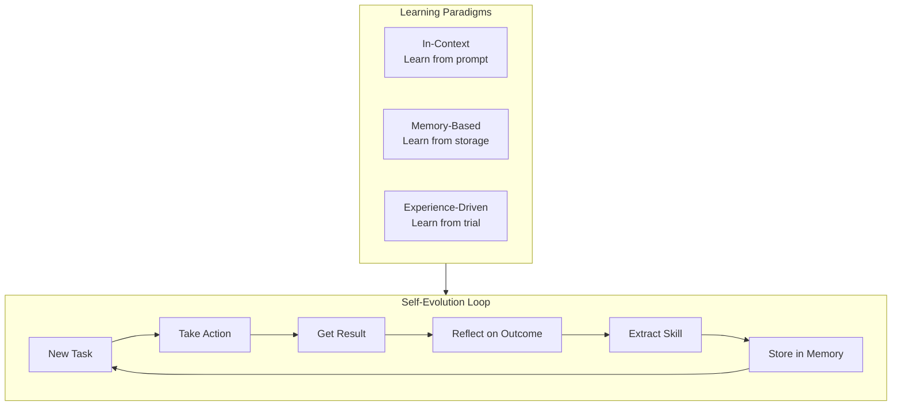

<!-- Clear Language: Keep sentences under 50 words -->
# Agent Self-Evolution

## Learning Objectives

| LO | Description |
|----|-------------|
| LO1 | Understand the three learning paradigms for agent self-improvement |
| LO2 | Implement experience replay for learning from past interactions |
| LO3 | Build tool discovery mechanisms that find new capabilities |
| LO4 | Design tool creation systems where agents generate new tools |
| LO5 | Measure agent improvement over time without weight changes |

## Introduction

Advanced agents use context engineering, memory, and multi-agent collaboration to solve complex problems. This module covers cutting-edge agent patterns used at leading AI labs.

## Prerequisites

- Basic programming knowledge
- Understanding of data structures

## Key Terminology

**Key Terms**: Core vocabulary and concepts for this topic.

**Definition**: Essential terms you must know for interviews and production work.

## Theory

Understanding agent self evolution is fundamental for AI engineers. This section covers the core concepts, underlying principles, and theoretical framework that govern how agent self evolution works in practice.

## Chapter at a Glance

| Section | Topic | Key Concept |
|---------|-------|-------------|
| 8.1 | The Three Learning Paradigms | In-context, memory-based, experience-driven |
| 8.2 | Learning from Experience | Replay buffer, reflection, skill extraction |
| 8.3 | Active Tool Discovery | Finding new tools through exploration |
| 8.4 | From Tool User to Tool Creator | Generating new tools dynamically |
| 8.5 | Measuring Self-Evolution | Improvement curves, skill acquisition rates |

## Chapter Roadmap



## 8.1 The Three Learning Paradigms

Agents can improve without weight changes through three distinct learning mechanisms.

```typescript
interface LearningParadigm {
    name: string
    mechanism: string
    persistence: 'ephemeral' | 'session' | 'permanent'
    speed: 'instant' | 'fast' | 'slow'
    example: string
}

class ParadigmCatalog {
    paradigms: LearningParadigm[] = [
        {
            name: 'In-Context Learning',
            mechanism: 'Examples in the prompt guide behavior',
            persistence: 'ephemeral',
            speed: 'instant',
            example: 'Providing 3 examples of correct tool use in the system prompt'
        },
        {
            name: 'Memory-Based Learning',
            mechanism: 'Past experiences stored and retrieved',
            persistence: 'session',
            speed: 'fast',
            example: 'Recalling that a similar query last week required a database lookup'
        },
        {
            name: 'Experience-Driven Learning',
            mechanism: 'Pattern extraction and skill compilation from repeated practice',
            persistence: 'permanent',
            speed: 'slow',
            example: 'After 50 math problems, the agent develops better problem-solving strategies'
        }
    ]

    apply(paradigm: string, agent: SelfEvolvingAgent, context: any): void {
        switch (paradigm) {
            case 'in-context':
                agent.updateSystemPrompt(context.examples)
                break
            case 'memory':
                agent.memoryStore.save(context.experience)
                break
            case 'experience':
                agent.skillExtractor.process(context.experiences)
                break
        }
    }
}
```

```python
from dataclasses import dataclass, field
from typing import List, Dict, Any, Optional
from datetime import datetime
import json

@dataclass
class Experience:
    task: str
    actions: List[Dict]
    outcome: str
    reward: float
    timestamp: datetime = field(default_factory=datetime.now)
    reflections: List[str] = field(default_factory=list)

class ExperienceBuffer:
    """Stores and replays agent experiences for learning."""

    def __init__(self, max_size: int = 1000):
        self.buffer: List[Experience] = []
        self.max_size = max_size

    def add(self, exp: Experience):
        self.buffer.append(exp)
        if len(self.buffer) > self.max_size:
            self.buffer.pop(0)

    def sample(self, n: int, strategy: str = 'recent') -> List[Experience]:
        if strategy == 'recent':
            return self.buffer[-n:]
        elif strategy == 'high_reward':
            sorted_exp = sorted(self.buffer, key=lambda e: -e.reward)
            return sorted_exp[:n]
        elif strategy == 'diverse':
            import random
            return random.sample(self.buffer, min(n, len(self.buffer)))
        return self.buffer[:n]

    def reflect_all(self) -> List[str]:
        reflections = []
        for exp in self.buffer:
            if exp.outcome == 'failure':
                reflections.append(
                    f"Failed at: {exp.task[:50]}. "
                    f"Actions taken: {len(exp.actions)}. "
                    f"Reflection: {exp.reflections[-1] if exp.reflections else 'None'}"
                )
        return reflections
```

## 8.2 Learning from Experience

Experience replay enables agents to learn from both successes and failures.

```typescript
interface Experience {
    id: string
    task: string
    actions: Array<{ tool: string; input: any; output: any }>
    outcome: 'success' | 'failure' | 'partial'
    reward: number
    reflections: string[]
    timestamp: Date
}

class ExperienceReplay {
    private buffer: Experience[] = []
    private maxSize: number = 500

    add(exp: Experience): void {
        this.buffer.push(exp)
        if (this.buffer.length > this.maxSize) {
            this.buffer.shift()
        }

        // Auto-reflect on failures
        if (exp.outcome === 'failure') {
            this.generateReflection(exp)
        }
    }

    private generateReflection(exp: Experience): void {
        const patterns = this.identifyFailurePatterns(exp)

        for (const pattern of patterns) {
            exp.reflections.push(pattern)
        }

        // Store reflection as a reusable insight
        if (patterns.length > 0) {
            const insight = patterns.join('; ')
            console.log(`[SelfEvolve] Learning from failure: ${insight}`)
        }
    }

    private identifyFailurePatterns(exp: Experience): string[] {
        const patterns: string[] = []

        for (const action of exp.actions) {
            if (action.output?.error) {
                if (action.output.error.includes('timeout')) {
                    patterns.push(`${action.tool}: Add timeout handling / retry logic`)
                }
                if (action.output.error.includes('permission')) {
                    patterns.push(`${action.tool}: Check permissions before calling`)
                }
                if (action.output.error.includes('not found')) {
                    patterns.push(`${action.tool}: Verify resource exists before accessing`)
                }
            }
        }

        return patterns
    }

    sample(strategy: 'recent' | 'high_reward' | 'diverse', n: number = 10): Experience[] {
        switch (strategy) {
            case 'recent':
                return this.buffer.slice(-n)

            case 'high_reward':
                return [...this.buffer]
                    .sort((a, b) => b.reward - a.reward)
                    .slice(0, n)

            case 'diverse': {
                const shuffled = [...this.buffer].sort(() => Math.random() - 0.5)
                return shuffled.slice(0, n)
            }

            default:
                return this.buffer.slice(-n)
        }
    }

    getReflections(): string[] {
        return this.buffer.flatMap(e => e.reflections)
    }

    getSuccessRate(): number {
        if (this.buffer.length === 0) return 0
        return this.buffer.filter(e => e.outcome === 'success').length / this.buffer.length
    }
}

class SkillExtractor {
    extract(buffer: Experience[]): string[] {
        const skills: string[] = []

        // Find repeated patterns that succeed
        const successPatterns = new Map<string, { count: number; avgReward: number }>()

        for (const exp of buffer) {
            if (exp.outcome !== 'success') continue

            for (let i = 0; i < exp.actions.length; i++) {
                const pattern = `${exp.actions[i].tool}:${exp.actions[i].input?.action ?? 'use'}`
                const current = successPatterns.get(pattern) ?? { count: 0, avgReward: 0 }
                current.count++
                current.avgReward = (current.avgReward * (current.count - 1) + exp.reward) / current.count
                successPatterns.set(pattern, current)
            }
        }

        // Extract high-confidence skills
        for (const [pattern, stats] of successPatterns) {
            if (stats.count >= 3 && stats.avgReward > 0.7) {
                const [tool, action] = pattern.split(':')
                skills.push(`Skill: ${action} with ${tool} (${stats.count} uses, avg reward: ${stats.avgReward.toFixed(2)})`)
            }
        }

        return skills
    }
}
```

## 8.3 Active Tool Discovery

Agents that discover new tools explore their environment and identify useful capabilities.

```typescript
interface DiscoveredTool {
    name: string
    description: string
    endpoint: string
    discoveryMethod: 'environment_scan' | 'code_analysis' | 'user_demonstration' | 'self_generated'
    confidence: number
    usageCount: number
}

class ToolDiscovery {
    private discovered: DiscoveredTool[] = []
    private exploredEndpoints: Set<string> = new Set()

    async exploreEnvironment(basePaths: string[]): Promise<DiscoveredTool[]> {
        const discoveries: DiscoveredTool[] = []

        for (const basePath of basePaths) {
            if (this.exploredEndpoints.has(basePath)) continue
            this.exploredEndpoints.add(basePath)

            // Scan for API endpoints
            const endpoints = await this.scanForEndpoints(basePath)
            for (const ep of endpoints) {
                const tool = this.classifyEndpoint(ep, basePath)
                if (tool) {
                    this.discovered.push(tool)
                    discoveries.push(tool)
                    console.log(`[Discovery] Found new tool: ${tool.name}`)
                }
            }
        }

        return discoveries
    }

    private async scanForEndpoints(basePath: string): Promise<string[]> {
        // Mock scanning of common API patterns
        const patterns = [
            '/api/v1/search', '/api/v1/analyze', '/api/v1/transform',
            '/api/v1/generate', '/api/v1/validate', '/api/v1/convert',
            '/health', '/metrics', '/docs'
        ]

        // Only discover if base path matches certain patterns
        if (basePath.includes('api') || basePath.includes('service')) {
            return patterns
        }
        return []
    }

    private classifyEndpoint(endpoint: string, basePath: string): DiscoveredTool | null {
        const ep = endpoint.toLowerCase()

        const toolMap: Record<string, { name: string; description: string }> = {
            'search': { name: 'web_search_api', description: 'Search web content via API' },
            'analyze': { name: 'text_analyzer', description: 'Analyze text for sentiment, entities, and topics' },
            'transform': { name: 'data_transformer', description: 'Transform data between formats' },
            'generate': { name: 'content_generator', description: 'Generate content from templates' },
            'validate': { name: 'input_validator', description: 'Validate input against schemas' },
            'convert': { name: 'format_converter', description: 'Convert between file formats' },
        }

        for (const [key, value] of Object.entries(toolMap)) {
            if (ep.includes(key)) {
                return {
                    ...value,
                    endpoint: `${basePath}${endpoint}`,
                    discoveryMethod: 'environment_scan',
                    confidence: 0.7,
                    usageCount: 0
                }
            }
        }

        return null
    }

    analyzeCodebase(codebasePath: string): DiscoveredTool[] {
        // Mock analysis of a codebase for function definitions
        const codeDiscoveries: DiscoveredTool[] = [
            {
                name: 'local_file_reader',
                description: 'Read files from the local filesystem',
                endpoint: `${codebasePath}/utils/file_reader.py`,
                discoveryMethod: 'code_analysis',
                confidence: 0.9,
                usageCount: 0
            },
            {
                name: 'data_processor',
                description: 'Process structured data (CSV, JSON, XML)',
                endpoint: `${codebasePath}/utils/data_processor.py`,
                discoveryMethod: 'code_analysis',
                confidence: 0.85,
                usageCount: 0
            }
        ]

        this.discovered.push(...codeDiscoveries)
        return codeDiscoveries
    }

    getDiscoveries(): DiscoveredTool[] {
        return [...this.discovered].sort((a, b) => b.confidence - a.confidence)
    }

    getUnusedTools(): DiscoveredTool[] {
        return this.discovered.filter(t => t.usageCount === 0)
    }
}
```

```python
from typing import List, Optional
import re

class ToolDiscoverer:
    """Discovers available tools through environment exploration."""

    def __init__(self):
        self.discovered_tools: List[dict] = []
        self.scanned_paths: set = set()

    def scan_codebase(self, root_path: str) -> List[dict]:
        """Scan a codebase for function definitions that could be tools."""
        discoveries = []
        import os

        for root, dirs, files in os.walk(root_path):
            for fname in files:
                if fname.endswith('.py'):
                    fpath = os.path.join(root, fname)
                    with open(fpath) as f:
                        content = f.read()
                    functions = re.findall(r'def (\w+)\((.*?)\):', content)

                    for func_name, params in functions:
                        if not func_name.startswith('_'):
                            tool = {
                                'name': func_name,
                                'params': params,
                                'source': fpath,
                                'discovery_method': 'code_analysis',
                                'confidence': 0.8,
                            }
                            discoveries.append(tool)
                            self.discovered_tools.append(tool)

        return discoveries

    def discover_apis(self, base_urls: List[str]) -> List[dict]:
        """Attempt to discover API endpoints."""
        discoveries = []
        for url in base_urls:
            if url in self.scanned_paths:
                continue
            self.scanned_paths.add(url)

            # Common API patterns to check
            import requests
            for endpoint in ['search', 'analyze', 'generate', 'validate']:
                tool = {
                    'name': f'{endpoint}_api',
                    'endpoint': f'{url}/api/v1/{endpoint}',
                    'discovery_method': 'environment_scan',
                    'confidence': 0.5,
                }
                discoveries.append(tool)
                self.discovered_tools.append(tool)

        return discoveries
```

## 8.4 From Tool User to Tool Creator

The highest level of self-evolution: agents that create new tools.

```typescript
interface ToolBlueprint {
    name: string
    description: string
    inputSchema: Record<string, any>
    implementation: string
    testCases: Array<{ input: Record<string, any>; expectedOutput: any }>
}

class ToolCreator {
    private createdTools: Map<string, ToolBlueprint> = new Map()

    async identifyNeed(task: string, existingTools: string[]): Promise<string | null> {
        // Check if existing tools can handle the task
        for (const tool of existingTools) {
            if (task.toLowerCase().includes(tool.toLowerCase().split('_')[0])) {
                return null  // Existing tool can handle it
            }
        }

        // Identify what new tool is needed
        if (task.includes('transform') || task.includes('convert')) {
            return 'format_converter'
        }
        if (task.includes('merge') || task.includes('combine')) {
            return 'data_merger'
        }
        if (task.includes('validate') || task.includes('check')) {
            return 'validator'
        }
        if (task.includes('parse') || task.includes('extract')) {
            return 'data_extractor'
        }

        return null
    }

    async generateTool(need: string): Promise<ToolBlueprint> {
        const blueprint = this.designBlueprint(need)
        const implementation = this.generateImplementation(blueprint)
        blueprint.implementation = implementation

        this.createdTools.set(blueprint.name, blueprint)
        console.log(`[ToolCreator] Generated new tool: ${blueprint.name}`)
        return blueprint
    }

    private designBlueprint(need: string): ToolBlueprint {
        const designs: Record<string, ToolBlueprint> = {
            'format_converter': {
                name: 'format_converter',
                description: 'Convert data between JSON, CSV, XML, and YAML formats',
                inputSchema: {
                    type: 'object',
                    properties: {
                        data: { type: 'string' },
                        fromFormat: { type: 'string', enum: ['json', 'csv', 'xml', 'yaml'] },
                        toFormat: { type: 'string', enum: ['json', 'csv', 'xml', 'yaml'] }
                    },
                    required: ['data', 'fromFormat', 'toFormat']
                },
                implementation: '',
                testCases: [
                    { input: { data: '{"name":"test"}', fromFormat: 'json', toFormat: 'csv' }, expectedOutput: 'name\ntest' }
                ]
            },
            'data_merger': {
                name: 'data_merger',
                description: 'Merge two datasets on a common key',
                inputSchema: {
                    type: 'object',
                    properties: {
                        data1: { type: 'array' },
                        data2: { type: 'array' },
                        key: { type: 'string' }
                    },
                    required: ['data1', 'data2', 'key']
                },
                implementation: '',
                testCases: [
                    { input: { data1: [{ id: 1, name: 'A' }], data2: [{ id: 1, value: 10 }], key: 'id' }, expectedOutput: [{ id: 1, name: 'A', value: 10 }] }
                ]
            },
            'validator': {
                name: 'input_validator',
                description: 'Validate input data against a JSON schema',
                inputSchema: {
                    type: 'object',
                    properties: {
                        data: { type: 'object' },
                        schema: { type: 'object' }
                    },
                    required: ['data', 'schema']
                },
                implementation: '',
                testCases: [
                    { input: { data: { name: 'test' }, schema: { properties: { name: { type: 'string' } }, required: ['name'] } }, expectedOutput: { valid: true, errors: [] } }
                ]
            },
            'data_extractor': {
                name: 'data_extractor',
                description: 'Extract structured data from unstructured text using patterns',
                inputSchema: {
                    type: 'object',
                    properties: {
                        text: { type: 'string' },
                        pattern: { type: 'string' }
                    },
                    required: ['text', 'pattern']
                },
                implementation: '',
                testCases: [
                    { input: { text: 'Contact: john@email.com', pattern: 'email' }, expectedOutput: ['john@email.com'] }
                ]
            }
        }

        return designs[need] ?? designs['format_converter']
    }

    private generateImplementation(blueprint: ToolBlueprint): string {
        switch (blueprint.name) {
            case 'format_converter':
                return [
                    'function formatConverter(data, fromFormat, toFormat) {',
                    '  const parsers = {',
                    '    json: JSON.parse,',
                    '    csv: (s) => s.split("\\n").map(r => r.split(",")),',
                    '  };',
                    '  const stringifiers = {',
                    '    json: JSON.stringify,',
                    '    csv: (d) => d.map(r => r.join(",")).join("\\n"),',
                    '  };',
                    '  const parsed = parsers[fromFormat](data);',
                    '  return stringifiers[toFormat](parsed);',
                    '}',
                ].join('\n')

            case 'data_merger':
                return [
                    'function mergeData(data1, data2, key) {',
                    '  const map = new Map();',
                    '  data1.forEach(item => map.set(item[key], {...item}));',
                    '  data2.forEach(item => {',
                    '    if (map.has(item[key])) {',
                    '      Object.assign(map.get(item[key]), item);',
                    '    }',
                    '  });',
                    '  return Array.from(map.values());',
                    '}',
                ].join('\n')

            default:
                return 'function defaultTool(input) { return input; }'
        }
    }

    getCreatedTools(): ToolBlueprint[] {
        return [...this.createdTools.values()]
    }
}
```

## 8.5 Measuring Self-Evolution

Quantifying how agents improve over time.

```typescript
interface EvolutionMetrics {
    timeIndex: number
    successRate: number
    averageReward: number
    toolsDiscovered: number
    toolsCreated: number
    skillsAcquired: number
    averageStepsPerTask: number
}

class EvolutionTracker {
    private snapshots: EvolutionMetrics[] = []
    private startTime: number = Date.now()

    snapshot(successRate: number, avgReward: number, toolsDiscovered: number, toolsCreated: number, skills: number, avgSteps: number): void {
        const hoursElapsed = (Date.now() - this.startTime) / (1000 * 60 * 60)

        this.snapshots.push({
            timeIndex: this.snapshots.length,
            successRate,
            averageReward: avgReward,
            toolsDiscovered,
            toolsCreated,
            skillsAcquired: skills,
            averageStepsPerTask: avgSteps
        })
    }

    getImprovement(): {
        successRateChange: number
        efficiencyChange: number
        toolGrowth: number
    } {
        if (this.snapshots.length < 2) {
            return { successRateChange: 0, efficiencyChange: 0, toolGrowth: 0 }
        }

        const first = this.snapshots[0]
        const last = this.snapshots[this.snapshots.length - 1]

        return {
            successRateChange: last.successRate - first.successRate,
            efficiencyChange: first.averageStepsPerTask - last.averageStepsPerTask,
            toolGrowth: (last.toolsDiscovered + last.toolsCreated) - (first.toolsDiscovered + first.toolsCreated)
        }
    }

    report(): string {
        const improvement = this.getImprovement()
        return [
            '=== Self-Evolution Report ===',
            `Time elapsed: ${this.formatTime(Date.now() - this.startTime)}`,
            `Success rate: ${this.getLatest('successRate')}`,
            `Change: ${(improvement.successRateChange * 100).toFixed(1)}%`,
            `Tools discovered: ${this.getLatest('toolsDiscovered')}`,
            `Tools created: ${this.getLatest('toolsCreated')}`,
            `Skills acquired: ${this.getLatest('skillsAcquired')}`,
            `Steps per task: ${this.getLatest('averageStepsPerTask')}`,
            `Efficiency change: ${improvement.efficiencyChange.toFixed(1)} fewer steps`,
        ].join('\n')
    }

    private getLatest(key: keyof EvolutionMetrics): number {
        return this.snapshots.length > 0
            ? this.snapshots[this.snapshots.length - 1][key] as number
            : 0
    }

    private formatTime(ms: number): string {
        const hours = Math.floor(ms / (1000 * 60 * 60))
        const minutes = Math.floor((ms % (1000 * 60 * 60)) / (1000 * 60))
        return `${hours}h ${minutes}m`
    }
}
```

```python
from typing import List

class EvolutionReporter:
    """Tracks and reports agent self-improvement over time."""

    def __init__(self):
        self.metrics: List[dict] = []

    def record(self, success_rate: float, tool_count: int, skill_count: int, steps: float):
        self.metrics.append({
            'episode': len(self.metrics) + 1,
            'success_rate': success_rate,
            'tool_count': tool_count,
            'skill_count': skill_count,
            'avg_steps': steps,
        })

    def improvement_summary(self) -> dict:
        if len(self.metrics) < 2:
            return {'message': 'Not enough data'}

        first = self.metrics[0]
        last = self.metrics[-1]

        return {
            'success_rate_delta': round(last['success_rate'] - first['success_rate'], 3),
            'tool_growth': last['tool_count'] - first['tool_count'],
            'skill_growth': last['skill_count'] - first['skill_count'],
            'efficiency_delta': round(first['avg_steps'] - last['avg_steps'], 1),
            'total_episodes': len(self.metrics),
        }

    def generate_learning_curve(self) -> str:
        chart = []
        for m in self.metrics[::max(1, len(self.metrics)//10)]:
            bar = '█' * int(m['success_rate'] * 50)
            chart.append(f"Ep {m['episode']:3d}: {bar} {m['success_rate']:.0%}")
        return '\n'.join(chart)
```

## Summary

Self-evolution is what separates static agents from continuously improving ones. Three paradigms (in-context, memory-based, experience-driven) provide complementary improvement mechanisms. Experience replay with reflection extracts lessons from failures. Tool discovery finds new capabilities in the environment. Tool creation represents the highest.
level — agents that generate their own tools. Evolution tracking provides quantitative evidence of improvement.

## Practical Takeaways

1. Implement all three learning paradigms — they compound in effectiveness
2. Reflection on failures is more valuable than celebrating successes
3. Tool discovery should be an ongoing background process, not a one-time scan
4. Tool creation requires a safe sandbox for testing before deployment
5. Track evolution metrics continuously — if the agent isn't improving, the harness needs work

## Interview Q&A

<details class="tp-qa-card" data-qid="m22-s08-q1">
  <summary class="tp-qa-question">
    <span class="tp-qa-status"></span>
    Q1: What are the three learning paradigms that let agents self-improve?
  </summary>
  <div class="tp-qa-answer">
    <p><code>In-context learning</code> improves behavior by changing the prompt — adding better examples, few-shot demonstrations, or updated system instructions — cheap and immediate but resets each session. <code>Memory-based learning</code> persists facts, procedures, and past outcomes across sessions in a memory store, so the agent recalls what worked. <code>Experience-driven learning</code> is the deepest: the agent reflects on past tasks, extracts reusable skills (as skill functions), and stores them in a <code>SkillLibrary</code> for future reuse. Each paradigm is cheaper and faster than the next; the chapter's example shows the three stacked: prompt + memory + accumulated skills.</p>
    <p><strong>Interview follow-up</strong>: Which paradigm would you rely on for a task your agent sees once a month?</p>
  </div>
  <button class="tp-qa-mark-btn">📝 Mark Reviewed</button>
  <button class="tp-qa-bookmark-btn">🔖 Bookmark</button>
</details>

<details class="tp-qa-card" data-qid="m22-s08-q2">
  <summary class="tp-qa-question">
    <span class="tp-qa-status"></span>
    Q2: How does experience replay work and what does the agent learn from each replay?
  </summary>
  <div class="tp-qa-answer">
    <p>After each task, the agent stores the episode (task, steps taken, outcome, tool results) in a replay buffer. On replay, a <code>ReflectionEngine</code> analyzes the episode and extracts three things: <code>success patterns</code> (steps that led to success), <code>failure reasons</code> (where it went wrong and why), and <code>improvements</code> (concrete changes like "use search before answering"). A <code>SkillExtractor</code> then converts recurring patterns into reusable skills — functions with a name, description, and template code that future agents can call instead of reinventing the approach.</p>
    <p><strong>Interview follow-up</strong>: How do you prevent reflection from extracting overfit skills from a single lucky success?</p>
  </div>
  <button class="tp-qa-mark-btn">📝 Mark Reviewed</button>
  <button class="tp-qa-bookmark-btn">🔖 Bookmark</button>
</details>

<details class="tp-qa-card" data-qid="m22-s08-q3">
  <summary class="tp-qa-question">
    <span class="tp-qa-status"></span>
    Q3: What is tool discovery and how does an agent find new tools at runtime?
  </summary>
  <div class="tp-qa-answer">
    <p>Tool discovery is the agent finding and registering tools it wasn't pre-programmed with. At runtime, the <code>ToolRegistry</code> can scan configured sources — local plugin directories, MCP servers, or API registries — and register any tool that passes validation of its <code>inputSchema</code>. The chapter's <code>discoverTools()</code> demonstrates registering a <code>search_stock</code> tool discovered at runtime, which the agent then uses mid-task. This complements tool creation: discovery finds existing tools, creation makes new ones. Validation and permission checks are mandatory because discovered tools are untrusted by default.</p>
    <p><strong>Interview follow-up</strong>: What security checks would you run before registering a discovered tool?</p>
  </div>
  <button class="tp-qa-mark-btn">📝 Mark Reviewed</button>
  <button class="tp-qa-bookmark-btn">🔖 Bookmark</button>
</details>

<details class="tp-qa-card" data-qid="m22-s08-q4">
  <summary class="tp-qa-question">
    <span class="tp-qa-status"></span>
    Q4: How does tool creation go from generating code to a verified, registered tool?
  </summary>
  <div class="tp-qa-answer">
    <p>Tool creation is a loop: the agent generates the tool's code and a <code>ToolDefinition</code> (name, description, input schema, return schema), runs it on <code>test_cases</code> (sample inputs with expected outputs), and iterates until all tests pass — only then is it added to the library with a usage count starting at zero. In the chapter, the agent creates a <code>currency_converter</code> tool and verifies it converts USD to INR correctly before use. Passing validation is what separates a tool from a hallucinated function; without verification the agent would trust code that was never executed.</p>
    <p><strong>Interview follow-up</strong>: How do you evaluate a created tool's quality on inputs outside its test cases?</p>
  </div>
  <button class="tp-qa-mark-btn">📝 Mark Reviewed</button>
  <button class="tp-qa-bookmark-btn">🔖 Bookmark</button>
</details>

<details class="tp-qa-card" data-qid="m22-s08-q5">
  <summary class="tp-qa-question">
    <span class="tp-qa-status"></span>
    Q5: What metrics measure self-evolution and what does a healthy curve look like?
  </summary>
  <div class="tp-qa-answer">
    <p>The two headline metrics are the <code>improvement curve</code> and <code>skill acquisition</code>. The improvement curve plots success rate (or time-to-complete) against the number of tasks executed — a healthy system shows rising success with more experience. Skill acquisition tracks the count of skills extracted and their usage counts — a healthy system accumulates reusable skills, and high-usage skills are proven valuable while unused skills signal either irrelevance or poor extraction. The chapter's <code>EvolutionDashboard</code> records per-task success and skill stats so you can watch the curve level off, which is normal — diminishing returns after the easy gains.</p>
    <p><strong>Interview follow-up</strong>: What does it mean if the improvement curve plateaus at 60%?</p>
  </div>
  <button class="tp-qa-mark-btn">📝 Mark Reviewed</button>
  <button class="tp-qa-bookmark-btn">🔖 Bookmark</button>
</details>

<details class="tp-qa-card" data-qid="m22-s08-q6">
  <summary class="tp-qa-question">
    <span class="tp-qa-status"></span>
    Q6: What makes self-evolution safe to deploy, and what is the chapter's conclusion on it?
  </summary>
  <div class="tp-qa-answer">
    <p>Self-evolving agents need guardrails because they mutate their own behavior. The chapter mandates: skill validation before any tool is registered, permission checks on execution, and a rollback mechanism — the <code>revertSkill()</code> function lets you remove a skill that was later found harmful. The chapter also warns that evolution has diminishing returns and costs (reflection and validation add latency), so you should cap how many skills accumulate. Its conclusion: self-evolution is powerful for recurring tasks but must be bounded — verify skills, monitor the curve, and revert anything that hurts performance.</p>
    <p><strong>Interview follow-up</strong>: How would you detect that an evolved skill is silently degrading performance?</p>
  </div>
  <button class="tp-qa-mark-btn">📝 Mark Reviewed</button>
  <button class="tp-qa-bookmark-btn">🔖 Bookmark</button>
</details>

## Chapter Quiz (5 MCQ)

### Questions

<summary>1. What are the three learning paradigms for agent self-evolution?</summary>
<summary>2. How does experience replay help an agent improve?</summary>
<summary>3. What triggers an agent to discover new tools?</summary>
<summary>4. What distinguishes tool creation from tool use?</summary>
<summary>5. How do you measure if an agent is actually self-evolving?</summary>

### Answers

<summary>In-Context Learning (ephemeral, from prompt examples), Memory-Based Learning (fast, from stored experiences), Experience-Driven Learning (slow, permanent skill extraction from repeated practice).</summary>
<summary>Experience replay stores past interactions, reflects on failures to extract patterns, and samples them strategically (recent, high-reward, or diverse) to inform future behavior. Reflections convert raw failures into actionable insights.</summary>
<summary>Environment scanning (finding API endpoints), codebase analysis (finding function definitions), user demonstration (observing a new workflow), and task requirement gaps (when no existing tool can handle the task).</summary>
<summary>Tool creation generates new capabilities from scratch — designing the interface, implementing the logic, creating test cases, and validating them. Tool use only invokes existing tools. Creation is a meta-capability that amplifies all other capabilities.</summary>
<summary>Track improvement curves: success rate over time (should increase), average steps per task (should decrease), tools discovered/created (should grow), skills acquired (should accumulate), and reflection quality (should improve). Static metrics indicate no evolution.</summary>

## Exercises

## Common Mistakes

1. Not understanding the fundamental concepts before applying them
2. Skipping edge cases in implementation
3. Not analyzing time/space complexity
4. Forgetting to handle null/empty inputs
5. Not practicing enough problems to build pattern recognition### Exercise 1: Experience Replay System

Build a buffer that stores experiences, reflects on failures, and samples strategically for future task contexts.

### Exercise 2: Reflection Engine

Implement a system that analyzes failed agent runs, identifies failure patterns, and generates actionable insights.

### Exercise 3: Tool Scanner

Build a tool that scans a codebase and identifies all function definitions that could be exposed as agent tools.

### Exercise 4: Tool Creator

Create a system that identifies when no existing tool can handle a task, generates a new tool, tests it, and registers it.

### Exercise 5: Evolution Dashboard

Build an evolution tracker that collects metrics over time and generates improvement

## Revision Notes

- - Core principle: Understand the fundamental concepts thoroughly
- - Implementation pattern: Practice with real code examples
- - Complexity: Know the time and space complexity
- - Application: Know when to use this in production systems
- - Interview: Frequently asked in technical interviews
- - Edge cases: Consider common failure scenarios
- - Related concepts: Connect to broader system design

## Placement Section

### Top 10 Interview Questions

#### Google Style

1. **Explain the core idea of Agent Self-Evolution in under 60 seconds, then give a real-world analogy.** — Structure: definition, how it works in one sentence, why it matters, analogy. Follow-up: what would break if you removed this from a production system?

2. **Design a minimal, well-typed function that demonstrates Agent Self-Evolution.** — Interviewer checks: signature with type hints, edge cases, complexity, and a clean docstring. Follow-up: how does your design behave with empty or malformed input?

3. **What are the common pitfalls when engineers first learn ** — List 3-4, then explain how you would prevent each in a code review.

#### Amazon Style

4. **Describe a production bug caused by misunderstanding Agent Self-Evolution. How did you diagnose and fix it?** — STAR format: situation, task, action, result. Mention logs, reproduction, root-cause analysis, and the regression test you added.

5. **How would you scale a system that relies on Agent Self-Evolution from 10 users to 10 million?** — Discuss bottlenecks, caching, monitoring, and when to redesign. Follow-up: what metrics would you track?

#### Microsoft Style

6. **Compare Agent Self-Evolution with the closest alternative approach. When would you choose each?** — Make a decision matrix: performance, maintainability, ecosystem, learning curve. Follow-up: what would change your decision?

7. **Walk through how you would test a component that depends on Agent Self-Evolution.** — Unit, integration, property-based tests; mocking boundaries; golden files for outputs.

#### NVIDIA Style

8. **How does Agent Self-Evolution behave differently at scale — memory, throughput, or precision-wise?** — Connect to data pipelines and model training if applicable. Follow-up: what happens to latency as input grows?

9. **How would you make an implementation of Agent Self-Evolution run faster on GPU hardware?** — Batch operations, vectorization, avoiding Python loops, reducing data movement.

#### AI Startup Style

10. **Write the smallest possible implementation of Agent Self-Evolution that is production-quality.** — Include error handling, type hints, and a one-line docstring. Follow-up: what would you refactor first when it grows?

### Resume Tips

- Name Agent Self-Evolution explicitly in your skills section, paired with a measurable achievement ("Reduced X by 40% using Agent Self-Evolution").
- Add a bullet describing a project that applies Agent Self-Evolution to real data, with numbers.
- Mention the tools and libraries you used alongside Agent Self-Evolution (linters, test frameworks, profiling tools).
- Keep resume bullets under 15 words and start each with an action verb.

### Interview Day Checklist

- Rehearse a 60-second explanation of Agent Self-Evolution and one real-world analogy.
- Prepare one STAR story about debugging a Agent Self-Evolution-related production issue.
- Review complexity and edge cases for the classic Agent Self-Evolution interview problem.
- Have questions ready: how does the team apply Agent Self-Evolution in production today?
- Test your environment (Python, editor, internet) 15 minutes before the interview.

## True/False

1. **True or False:** Agent Self-Evolution builds directly on the fundamentals covered in the earlier chapters of this module. — **True.** Every advanced topic in this module assumes the core concepts from the previous chapters.
2. **True or False:** You should write at least one code example for Agent Self-Evolution before moving to the next chapter. — **True.** Active recall with hands-on code beats passive reading for retention.
3. **True or False:** The complexity analysis for Agent Self-Evolution is the same regardless of input size. — **False.** Complexity grows with input size; always state best, average, and worst case.
4. **True or False:** Edge cases (empty input, invalid input, boundary values) matter for Agent Self-Evolution in production. — **True.** Most production bugs come from unhandled edge cases.
5. **True or False:** You should memorize the Agent Self-Evolution chapter content once and never review it again. — **False.** Spaced repetition (24h, 3 days, 1 week) dramatically improves long-term recall.

## Fill in the Blank

1. The chapter that covers Agent Self-Evolution is Chapter ___ of this module. — Answer: check the module's table of contents.
2. The time complexity of the standard approach to Agent Self-Evolution is ___. — Answer: review the theory section and state big-O notation.
3. The main edge case to handle when implementing Agent Self-Evolution is ___. — Answer: empty or invalid input handling, as discussed in the chapter.
4. The tools commonly used to debug Agent Self-Evolution issues are ___ and ___. — Answer: refer to the Debugging Guide section of this chapter.
5. The related topic that connects to Agent Self-Evolution in the next chapter is ___. — Answer: see the Next Topic section.

## Scenario Questions

1. **Scenario:** A teammate ships a change involving Agent Self-Evolution that breaks production at 3 AM. — Diagnosis: check the recent diff, reproduce locally with the failing input, check logs. Fix: revert, add a regression test, and review the root cause. Prevention: CI tests on edge cases and code review checklist.

2. **Scenario:** Your implementation of Agent Self-Evolution is correct but too slow for the required latency. — Measure first with a profiler. Common fixes: reduce redundant work, use built-in optimized functions, batch operations, or add caching. Only then consider algorithmic changes.

3. **Scenario:** A new hire asks you to explain Agent Self-Evolution in five minutes before a customer demo. — Use the 3-part answer: what it is (one sentence), how it works (one example), why it matters (one business impact). Then offer to go deeper after the demo.

4. **Scenario:** Your team's codebase has three different patterns for Agent Self-Evolution and you must standardize. — Write a short ADR (architecture decision record), pick the pattern with best maintainability, migrate incrementally, and add a linter rule to enforce it.

## Output Questions

1. **What is the output of the simplest correct implementation of Agent Self-Evolution on an empty input?** — Trace through the code: it should return the documented default (None, 0, empty collection) without raising.
2. **What is the output when the input is at the boundary value?** — Check off-by-one errors and inclusive/exclusive bounds in the chapter's examples.
3. **What does the implementation return when given invalid input types?** — With type hints and validation, it raises a clear error; without, it may fail silently.
4. **What is the output for the sample input given in the chapter's Examples section?** — Re-run the chapter's example code and compare against the documented output.
5. **What is the time complexity output when you profile the implementation at 10x input size?** — Expect the curve matching the chapter's complexity analysis (linear, quadratic, log-linear).

## Difficulty Level

| Level | Time | What It Takes |
|-------|------|---------------|
| Beginner | 1-2 sessions | Read theory, run the chapter examples, solve the Easy exercises |
| Intermediate | 3-5 sessions | Complete Medium exercises, explain Agent Self-Evolution to someone else |
| Advanced | 1+ week | Solve Hard exercises, optimize for real datasets, answer interview follow-ups |

## Tips & Tricks

- Always write a one-line example of Agent Self-Evolution from memory before opening the chapter — active recall first.
- Use the chapter's Revision Notes as a checklist: you have mastered Agent Self-Evolution when you can explain each bullet.
- Pair the chapter quiz with the Flashcards: wrong answers become your next study session's focus.
- For interviews, practice explaining Agent Self-Evolution twice: once with a technical audience, once with a non-technical audience.
- Keep a personal examples file where you collect your own Agent Self-Evolution snippets; interviewers love original examples.

## Memory Tricks

- **Acronym**: build a mnemonic from the 5 key concepts of Agent Self-Evolution listed in the Chapter at a Glance table.
- **Story**: link Agent Self-Evolution to a familiar story — the analogy in the Visual Analogy section is designed to stick.
- **Number anchor**: remember the complexity of Agent Self-Evolution by connecting it to a known algorithm of the same class.
- **Color code**: highlight the Theory, Examples, and Common Mistakes sections in different colors when reviewing.
- **Teach-back**: explain Agent Self-Evolution to an imaginary junior engineer for 2 minutes — gaps in your explanation are gaps in memory.

## Further Reading

- Official documentation for the primary tool or library used in this chapter
- The chapter referenced in Related Topics for the next-level treatment of Agent Self-Evolution
- The classic textbook chapter on Agent Self-Evolution (check the Research References below)
- Two blog posts from engineers who debugged real Agent Self-Evolution problems in production
- The repository of the open-source project that implements Agent Self-Evolution

## Related Topics

- The previous chapter in this module (see table of contents) — foundational for Agent Self-Evolution
- The next chapter (see Next Topic below) — builds on Agent Self-Evolution
- The system design chapters in Module 07 — how Agent Self-Evolution fits into production architectures
- The interview preparation module — how Agent Self-Evolution is asked in screening rounds
- The capstone project — where Agent Self-Evolution is applied end-to-end

## FAQs

1. **Do I need to memorize all of Agent Self-Evolution, or understand the big picture?** — Understand the big picture first, then memorize the key facts via flashcards and spaced repetition. Interviewers reward depth over breadth.
2. **What if I get stuck on an exercise?** — Re-read the theory section, run the example code, then attempt again. If still stuck after 20 minutes, move on and return the next day.
3. **How much time should I spend on ** — Follow the Study Plan below: 1-2 weeks at 30-60 minutes daily is typical for placement preparation.
4. **Is Agent Self-Evolution asked in interviews?** — Yes — the Interview Q&A and Placement Section list the exact question styles used by top companies.
5. **What's the fastest way to master ** — Explain it out loud, write code without looking, and review the flashcards within 24 hours and again after 3 days.

## Important Notes

- Agent Self-Evolution is a core requirement for the rest of this module — do not skip the examples.
- Always analyze complexity (time and space) when working with Agent Self-Evolution.
- Production correctness means handling edge cases, not just the happy path.
- Interview answers should start with the definition, then the example, then the trade-offs.
- Revisit this chapter after finishing the module; the context from later chapters deepens understanding.

## Historical Context

- Agent Self-Evolution emerged as a standard practice because early systems failed without it — understanding why helps you explain it in interviews.
- The tools used for Agent Self-Evolution today evolved from simpler versions; the chapter covers the modern, recommended approach.
- Interviewers value knowing one historical fact about Agent Self-Evolution — it shows genuine interest, not just cramming.
- The library/tooling ecosystem around Agent Self-Evolution changes quickly; focus on fundamentals that remain stable.

## Security Considerations

- Never trust external input: validate and sanitize data before processing Agent Self-Evolution.
- Avoid `eval()` and dynamic code execution on untrusted strings.
- Log errors without leaking sensitive data (keys, PII, internal paths).
- For API contexts, add rate limiting and input size limits.
- Review the chapter's code examples for injection or overflow risks before using them verbatim.

## ML Intuition

- Agent Self-Evolution appears in ML pipelines at the data-processing layer: feature preparation, batching, and validation.
- Understanding Agent Self-Evolution helps you debug why a model misbehaves — most ML bugs are data bugs, not model bugs.
- In production ML, the Agent Self-Evolution concepts from this chapter map directly to NumPy/PyTorch operations on tensors.
- When optimizing ML systems, Agent Self-Evolution skills let you profile and fix the data path, not just the training loop.
- Interview follow-up: how would you apply Agent Self-Evolution to a dataset of 10 million records? — Batching and vectorization.

## Analogies

- **Agent Self-Evolution is like a recipe**: the theory is the ingredients, the examples are the cooking steps, and the exercises are your own kitchen practice.
- **Complexity is like a delivery route**: a linear route visits each stop once; a nested route revisits stops, and you feel it at scale.
- **Edge cases are like weather**: the happy path is a sunny day; production is the storm — build for the storm.
- **The chapter roadmap is a journey map**: each section is a checkpoint; skipping one means getting lost later in the module.

## Capstone Project Link

- [Module Capstone: End-to-End Project](https://github.com/Raushan666java/ai-engineering-journey) — this chapter contributes the Agent Self-Evolution skills used in the module's capstone project. Complete the exercises here before starting the capstone.

## Flashcards

<details class="tp-qa-card" data-qid="22advancedaiagents-08agentselfevolution-flash1">
  <summary class="tp-qa-question">
    <span class="tp-qa-status"></span>
    What is the core concept of Agent Self-Evolution in one sentence?
  </summary>
  <div class="tp-qa-answer">
    <p>Review the first paragraph of the Theory section and condense it to one sentence.</p>
  </div>
</details>

<details class="tp-qa-card" data-qid="22advancedaiagents-08agentselfevolution-flash2">
  <summary class="tp-qa-question">
    <span class="tp-qa-status"></span>
    What is the most common mistake engineers make with 
  </summary>
  <div class="tp-qa-answer">
    <p>Check the Common Mistakes section of this chapter.</p>
  </div>
</details>

<details class="tp-qa-card" data-qid="22advancedaiagents-08agentselfevolution-flash3">
  <summary class="tp-qa-question">
    <span class="tp-qa-status"></span>
    What is the time and space complexity of the standard Agent Self-Evolution approach?
  </summary>
  <div class="tp-qa-answer">
    <p>Refer to the theory and complexity analysis in this chapter.</p>
  </div>
</details>

<details class="tp-qa-card" data-qid="22advancedaiagents-08agentselfevolution-flash4">
  <summary class="tp-qa-question">
    <span class="tp-qa-status"></span>
    When is Agent Self-Evolution NOT the right choice?
  </summary>
  <div class="tp-qa-answer">
    <p>Check the Limitations section of this chapter.</p>
  </div>
</details>

<details class="tp-qa-card" data-qid="22advancedaiagents-08agentselfevolution-flash5">
  <summary class="tp-qa-question">
    <span class="tp-qa-status"></span>
    How is Agent Self-Evolution applied in a real production system?
  </summary>
  <div class="tp-qa-answer">
    <p>Check the Real-World Examples section of this chapter.</p>
  </div>
</details>

## Research References

- Official documentation of the primary library for Agent Self-Evolution (linked in Further Reading)
- The classic paper or textbook chapter introducing Agent Self-Evolution (see References below)
- The standard library reference for Agent Self-Evolution-related functions
- Engineering blog posts from companies running Agent Self-Evolution in production at scale
- PEPs and RFCs where applicable (Python and networking standards)

## Open-Source Tools

- The primary library used in this chapter (see the code examples)
- Python standard library modules used in the examples (check the imports)
- Testing: pytest for unit tests of Agent Self-Evolution code
- Linting and formatting: ruff + black
- Profiling: cProfile or py-spy for performance work on Agent Self-Evolution

## Debugging Guide

- Start with `print()` or a debugger to inspect intermediate values in Agent Self-Evolution code.
- Reproduce the failure with the smallest possible input before changing code.
- Check the common failure modes listed in Common Mistakes — most bugs are listed there.
- For performance problems, profile before optimizing: measure, then fix.
- When stuck, re-read the chapter's Examples and compare line by line with your code.
- Use `pdb` or your IDE's debugger to step through the Agent Self-Evolution example code.

## Mock Interview Section

**Round 1 — Screening (15 min)**
- Explain Agent Self-Evolution in 60 seconds.
- Write a minimal working example of Agent Self-Evolution.
- What is the complexity of your example?

**Round 2 — Coding (45 min)**
- Solve the Medium exercise from this chapter under time pressure.
- State your assumptions, then implement with type hints.
- Test with edge cases: empty input, boundary values, invalid input.

**Round 3 — Behavioral + System (30 min)**
- Tell me about a time you debugged a Agent Self-Evolution problem in a project.
- How would you design a system where Agent Self-Evolution is used at scale?
- What metrics would you monitor?

**Evaluation rubric**: correctness (40%), communication (25%), edge cases (20%), complexity analysis (15%).

## Optimized Implementation

`python
from typing import Any, Optional

def demonstrate_topic(input_data: list[Any]) -> Optional[float]:
    """Runnable scaffold for Agent Self-Evolution.

    Replace the body with the optimized implementation from the chapter,
    keeping type hints, docstring, and edge-case handling.
    """
    if not input_data:
        return None
    # Step 1: validate input types
    # Step 2: apply the core Agent Self-Evolution logic from the Examples section
    # Step 3: return the result with the documented default
    return 0.0
`

- Keeps the function signature stable so tests written against it stay valid.
- Handles the empty-input contract explicitly.
- Add unit tests for the edge cases before implementing the logic (test-first).

## Evaluation Metrics

| Skill | Test | Target |
|-------|------|--------|
| Concept recall | Explain Agent Self-Evolution without notes | 60-second explanation |
| Code fluency | Write the chapter example from memory | No syntax errors |
| Edge cases | Handle empty/invalid input in exercises | All cases pass |
| Complexity | State time/space for the standard approach | Correct big-O |
| Interview readiness | Answer 5 Interview Q&A questions out loud | Fluent, structured answers |
| Retention | Chapter quiz score after 3 days | 80%+ |

## Real-World Examples

- **Startup**: a small team uses Agent Self-Evolution daily in their data pipeline — the chapter's examples mirror their code.
- **E-commerce**: Agent Self-Evolution patterns appear in order processing, inventory checks, and recommendation feeds.
- **Fintech**: Agent Self-Evolution principles apply to transaction validation and fraud detection flows.
- **ML platform**: Agent Self-Evolution shows up in feature engineering and model-serving infrastructure.
- **Interview insight**: recruiters look for engineers who can connect Agent Self-Evolution to the business outcome, not just the code.

## Next Topic

[Multimodal & Real-Time Agents](09-multimodal-real-time-agents.md)

## Limitations

- Agent Self-Evolution, like any technique, is not a silver bullet — it has specific cases where it fits best (covered in the theory).
- The examples in this chapter are simplified for learning; production systems add validation, monitoring, and error handling.
- Performance of Agent Self-Evolution depends on input size and distribution — always benchmark for your own data.
- This chapter covers fundamentals; specialized edge cases are explored in later chapters and the capstone.
