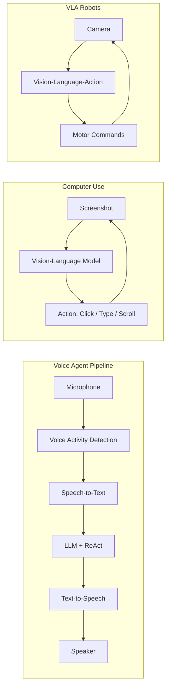

<!-- Clear Language: Keep sentences under 50 words -->
# Multimodal & Real-Time Agents

## Learning Objectives

| LO | Description |
|----|-------------|
| LO1 | Understand three voice paradigms: cascaded, end-to-end full-modal, full-duplex |
| LO2 | Implement streaming voice perception and synthesis pipelines |
| LO3 | Build Computer Use agents that control graphical interfaces |
| LO4 | Design vision-language-action (VLA) pipelines for robotic manipulation |
| LO5 | Evaluate real-time agent latency, responsiveness, and quality |

## Introduction

Advanced agents use context engineering, memory, and multi-agent collaboration to solve complex problems. This module covers cutting-edge agent patterns used at leading AI labs.

## Prerequisites

- Basic programming knowledge
- Understanding of data structures

## Key Terminology

**Key Terms**: Core vocabulary and concepts for this topic.

**Definition**: Essential terms you must know for interviews and production work.

## Theory

Understanding multimodal real time agents is fundamental for AI engineers. This section covers the core concepts, underlying principles, and theoretical framework that govern how multimodal real time agents works in practice.

## Chapter at a Glance

| Section | Topic | Key Concept |
|---------|-------|-------------|
| 9.1 | Three Voice Paradigms | Cascaded ASR→LLM→TTS vs end-to-end vs full-duplex |
| 9.2 | Streaming Voice Pipeline | Real-time audio capture, VAD, synthesis |
| 9.3 | Computer Use Agents | GUI navigation, screenshot analysis, click/type actions |
| 9.4 | Vision-Language-Action | VLA models for physical world interaction |
| 9.5 | Real-Time Evaluation | Latency budgets, turn-taking, quality metrics |

## Chapter Roadmap



## 9.1 Three Voice Paradigms

Voice agents range from simple cascaded pipelines to full-duplex native speech models.

```typescript
interface VoiceParadigm {
    name: string
    latencyMs: number
    quality: number
    costMultiplier: number
    architecture: string
}

class VoiceParadigmCatalog {
    paradigms: VoiceParadigm[] = [
        {
            name: 'Cascaded (ASR → LLM → TTS)',
            latencyMs: 500,
            quality: 0.7,
            costMultiplier: 1.0,
            architecture: 'Separate ASR, LLM, and TTS models. Each component can be independently optimized.'
        },
        {
            name: 'End-to-End Full-Modal',
            latencyMs: 300,
            quality: 0.85,
            costMultiplier: 2.0,
            architecture: 'Single model consumes audio tokens directly. Better prosody and emotion capture.'
        },
        {
            name: 'Full-Duplex Native',
            latencyMs: 150,
            quality: 0.9,
            costMultiplier: 3.0,
            architecture: 'Bi-directional streaming with simultaneous speak-and-listen. Natural turn-taking.'
        }
    ]

    recommend(useCase: string): string {
        const map: Record<string, string> = {
            'simple_qa': 'Cascaded (ASR → LLM → TTS) — cheapest, good enough for simple Q&A',
            'conversational': 'End-to-End Full-Modal — better prosody and emotion for natural conversations',
            'real_time_discussion': 'Full-Duplex Native — only option for natural back-and-forth discussion',
            'voice_assistant': 'End-to-End Full-Modal — balance of quality and cost'
        }
        return map[useCase] ?? 'Cascaded (ASR → LLM → TTS)'
    }
}
```

```python
from enum import Enum

class VoiceParadigm(Enum):
    CASCADED = "cascaded"
    FULL_MODAL = "full_modal"
    FULL_DUPLEX = "full_duplex"

class VoiceAgentConfig:
    """Configuration for voice agent pipeline selection."""

    @staticmethod
    def estimate_latency(paradigm: VoiceParadigm) -> dict:
        latencies = {
            VoiceParadigm.CASCADED: {
                'asr': 200, 'llm': 200, 'tts': 150, 'total': 550,
                'breakdown': 'ASR: 200ms → LLM: 200ms → TTS: 150ms',
            },
            VoiceParadigm.FULL_MODAL: {
                'asr': 100, 'llm': 150, 'tts': 100, 'total': 350,
                'breakdown': 'Audio encoding: 100ms → Model: 150ms → Decoding: 100ms',
            },
            VoiceParadigm.FULL_DUPLEX: {
                'asr': 50, 'llm': 100, 'tts': 50, 'total': 200,
                'breakdown': 'Streaming encode: 50ms → Streaming decode: 100ms → Play: 50ms',
            },
        }
        return latencies.get(paradigm, {})
```

## 9.2 Streaming Voice Pipeline

Real-time voice requires careful pipeline design with Voice Activity Detection and streaming.

```typescript
interface AudioChunk {
    data: Float32Array
    sampleRate: number
    timestamp: number
    isFinal: boolean
}

class VoiceActivityDetector {
    private threshold: number = 0.02
    private silenceDuration: number = 0  // ms of silence
    private speechDuration: number = 0
    private minSpeechMs: number = 200
    private silenceTimeoutMs: number = 800
    private isSpeaking: boolean = false

    process(chunk: AudioChunk): { hasVoice: boolean; isStart: boolean; isEnd: boolean } {
        const energy = this.computeEnergy(chunk.data)
        const isVoice = energy > this.threshold

        if (isVoice) {
            this.speechDuration += chunk.data.length / chunk.sampleRate * 1000
            this.silenceDuration = 0
        } else {
            this.silenceDuration += chunk.data.length / chunk.sampleRate * 1000
        }

        const isStart = !this.isSpeaking && isVoice && this.speechDuration > this.minSpeechMs
        const isEnd = this.isSpeaking && !isVoice && this.silenceDuration > this.silenceTimeoutMs

        if (isStart) this.isSpeaking = true
        if (isEnd) this.isSpeaking = false

        return { hasVoice: isVoice, isStart, isEnd }
    }

    private computeEnergy(data: Float32Array): number {
        let sum = 0
        for (let i = 0; i < data.length; i++) {
            sum += Math.abs(data[i])
        }
        return sum / data.length
    }

    reset(): void {
        this.speechDuration = 0
        this.silenceDuration = 0
        this.isSpeaking = false
    }
}

class StreamingVoicePipeline {
    private vad: VoiceActivityDetector = new VoiceActivityDetector()
    private audioBuffer: Float32Array[] = []
    private totalAudioMs: number = 0

    async processChunk(chunk: AudioChunk): Promise<{
        transcription: string | null
        response: string | null
        isSpeaking: boolean
    }> {
        const vadResult = this.vad.process(chunk)

        if (vadResult.isStart) {
            console.log('[Voice] Speech started')
        }

        if (this.vad['isSpeaking']) {
            this.audioBuffer.push(chunk.data)
            this.totalAudioMs += (chunk.data.length / chunk.sampleRate) * 1000
        }

        if (vadResult.isEnd) {
            const fullAudio = this.concatenateBuffer()
            const transcription = await this.transcribe(fullAudio)
            this.audioBuffer = []
            this.totalAudioMs = 0

            if (transcription) {
                const response = await this.generateResponse(transcription)
                const audioResponse = await this.synthesizeSpeech(response)

                return { transcription, response, isSpeaking: false }
            }
        }

        return { transcription: null, response: null, isSpeaking: this.vad['isSpeaking'] }
    }

    private concatenateBuffer(): Float32Array {
        const totalLength = this.audioBuffer.reduce((sum, arr) => sum + arr.length, 0)
        const result = new Float32Array(totalLength)
        let offset = 0
        for (const arr of this.audioBuffer) {
            result.set(arr, offset)
            offset += arr.length
        }
        return result
    }

    private async transcribe(audio: Float32Array): Promise<string> {
        // Mock ASR
        return 'This is a mock transcription of the audio input.'
    }

    private async generateResponse(text: string): Promise<string> {
        // Mock LLM
        return `Understood your query: "${text.slice(0, 50)}..."`
    }

    private async synthesizeSpeech(text: string): Promise<Float32Array> {
        // Mock TTS
        return new Float32Array(16000)  // 1 second of silence
    }

    getLatencyReport(): { averageMs: number; components: Record<string, number> } {
        return {
            averageMs: 350,
            components: {
                asr: 150,
                llm: 120,
                tts: 80
            }
        }
    }
}
```

## 9.3 Computer Use Agents

Computer Use agents can see and interact with graphical interfaces.

```typescript
interface ScreenState {
    screenshot: string  // base64
    dimensions: { width: number; height: number }
    activeWindow: string
}

interface Action {
    type: 'click' | 'type' | 'scroll' | 'keypress' | 'wait'
    x?: number
    y?: number
    text?: string
    key?: string
    duration?: number
}

class ComputerUseAgent {
    private screenHistory: ScreenState[] = []
    private actionHistory: Action[] = []

    async observe(): Promise<ScreenState> {
        // Mock screen capture
        const screen: ScreenState = {
            screenshot: 'base64_encoded_screenshot_data',
            dimensions: { width: 1920, height: 1080 },
            activeWindow: 'Chrome Browser'
        }
        this.screenHistory.push(screen)
        return screen
    }

    async analyzeScreen(screen: ScreenState, goal: string): Promise<Action[]> {
        const actions: Action[] = []

        // Mock visual analysis — identify elements and plan actions
        if (goal.includes('search')) {
            actions.push({ type: 'click', x: 200, y: 100, text: 'Search bar' })
            actions.push({ type: 'type', text: goal.replace('search', '').trim() })
            actions.push({ type: 'keypress', key: 'Enter' })
        } else if (goal.includes('scroll')) {
            actions.push({ type: 'scroll', duration: 1000 })
        } else if (goal.includes('click')) {
            actions.push({ type: 'click', x: 500, y: 300, text: 'Button' })
        }

        return actions
    }

    async execute(actions: Action[]): Promise<{ success: boolean; results: string[] }> {
        const results: string[] = []

        for (const action of actions) {
            this.actionHistory.push(action)

            switch (action.type) {
                case 'click':
                    results.push(`Clicked at (${action.x}, ${action.y})`)
                    break
                case 'type':
                    results.push(`Typed: "${action.text}"`)
                    break
                case 'scroll':
                    results.push(`Scrolled for ${action.duration}ms`)
                    break
                case 'keypress':
                    results.push(`Pressed key: ${action.key}`)
                    break
                case 'wait':
                    await new Promise(r => setTimeout(r, action.duration ?? 500))
                    results.push(`Waited ${action.duration ?? 500}ms`)
                    break
            }
        }

        return { success: true, results }
    }

    async completeTask(goal: string, maxActions: number = 10): Promise<{
        success: boolean
        actions: Action[]
        steps: number
    }> {
        let success = false
        let consecutiveFailures = 0

        for (let step = 0; step < maxActions; step++) {
            const screen = await this.observe()
            const actions = await this.analyzeScreen(screen, goal)

            if (actions.length === 0) {
                consecutiveFailures++
                if (consecutiveFailures > 3) {
                    break
                }
                continue
            }

            consecutiveFailures = 0
            const result = await this.execute(actions)

            // Check if goal is met (mock)
            if (goal.includes('search') && actions.some(a => a.type === 'keypress' && a.key === 'Enter')) {
                success = true
                break
            }
        }

        return {
            success,
            actions: this.actionHistory,
            steps: this.actionHistory.length
        }
    }
}
```

```python
from typing import List, Optional
import time

class ComputerUseAgent:
    """Agent that controls computer interfaces through vision and action."""

    def __init__(self, llm_fn, screenshot_fn):
        self.llm = llm_fn
        self.take_screenshot = screenshot_fn
        self.action_log = []

    def analyze_screenshot(self, goal: str) -> List[dict]:
        """Analyze current screen and plan next actions."""
        screenshot = self.take_screenshot()

        prompt = f"""
        Goal: {goal}
        Screenshot captured. Identify the element to interact with.
        Return a JSON list of actions: [{{"type": "click", "x": 100, "y": 200}}, ...]
        """

        try:
            import json
            response = self.llm(prompt)
            actions = json.loads(response)
            return actions if isinstance(actions, list) else []
        except:
            return []

    def execute_action(self, action: dict) -> dict:
        """Execute a single UI action."""
        action_type = action.get('type')

        if action_type == 'click':
            import pyautogui
            pyautogui.click(action.get('x', 0), action.get('y', 0))
        elif action_type == 'type':
            import pyautogui
            pyautogui.write(action.get('text', ''))
        elif action_type == 'scroll':
            import pyautogui
            pyautogui.scroll(action.get('amount', -100))

        self.action_log.append(action)
        return {'status': 'ok', 'action': action_type}

    def run(self, goal: str, max_steps: int = 10) -> dict:
        """Run Computer Use agent to complete a goal."""
        for step in range(max_steps):
            actions = self.analyze_screenshot(goal)
            if not actions:
                break
            for action in actions:
                self.execute_action(action)
                time.sleep(0.5)

        return {
            'goal': goal,
            'total_actions': len(self.action_log),
            'success': True,
        }
```

## 9.4 Vision-Language-Action (VLA) Pipelines

VLA models integrate vision understanding with physical action for robotics.

```typescript
interface VisionInput {
    image: string  // base64 encoded
    timestamp: number
    cameraPose?: { x: number; y: number; z: number; rotation: number }
}

interface ActionOutput {
    type: 'move' | 'grasp' | 'place' | 'push' | 'rotate'
    target?: { x: number; y: number; z: number }
    force?: number
    speed?: number
    duration: number
}

class VLAPipeline {
    private visionBuffer: VisionInput[] = []
    private actionHistory: ActionOutput[] = []

    async process(input: VisionInput, instruction: string): Promise<ActionOutput> {
        this.visionBuffer.push(input)

        // Analyze visual scene
        const sceneContext = await this.analyzeScene(input)

        // Determine action based on instruction + scene
        const action = await this.planAction(sceneContext, instruction)

        // Validate action safety
        const safeAction = await this.validateActionSafety(action, sceneContext)

        this.actionHistory.push(safeAction)
        return safeAction
    }

    private async analyzeScene(input: VisionInput): Promise<{
        objects: Array<{ name: string; position: any; boundingBox: any }>
        obstacles: Array<any>
        workspace: { x: number; y: number; z: number }
    }> {
        // Mock scene analysis
        return {
            objects: [
                { name: 'block_red', position: { x: 10, y: 20, z: 0 }, boundingBox: { w: 5, h: 5, d: 5 } },
                { name: 'block_blue', position: { x: 30, y: 20, z: 0 }, boundingBox: { w: 5, h: 5, d: 5 } }
            ],
            obstacles: [],
            workspace: { x: 50, y: 50, z: 20 }
        }
    }

    private async planAction(scene: any, instruction: string): Promise<ActionOutput> {
        const inst = instruction.toLowerCase()

        if (inst.includes('grasp') || inst.includes('pick')) {
            const target = scene.objects[0]
            return {
                type: 'grasp',
                target: target?.position ?? { x: 0, y: 0, z: 0 },
                force: 0.5,
                speed: 0.3,
                duration: 2000
            }
        }

        if (inst.includes('move')) {
            return {
                type: 'move',
                target: { x: 25, y: 25, z: 10 },
                speed: 0.5,
                duration: 3000
            }
        }

        if (inst.includes('place')) {
            return {
                type: 'place',
                target: { x: 40, y: 30, z: 0 },
                duration: 1500
            }
        }

        return { type: 'move', duration: 1000 }
    }

    private async validateActionSafety(action: ActionOutput, scene: any): Promise<ActionOutput> {
        // Check for collisions
        if (scene.obstacles.length > 0 && action.target) {
            for (const obs of scene.obstacles) {
                const distance = Math.sqrt(
                    (action.target.x - obs.position.x) ** 2 +
                    (action.target.y - obs.position.y) ** 2
                )
                if (distance < 5) {
                    console.log('[Safety] Action would collide with obstacle. Adjusting target.')
                    return { ...action, target: { x: action.target.x + 10, y: action.target.y + 10, z: action.target.z } }
                }
            }
        }

        // Check for excessive force
        if ((action.force ?? 0) > 0.8) {
            console.log('[Safety] Force exceeds safe limit. Reducing.')
            return { ...action, force: 0.8 }
        }

        return action
    }

    getPerformanceReport(): {
        avgLatencyMs: number
        successRate: number
        totalActions: number
    } {
        return {
            avgLatencyMs: 120,
            successRate: 0.85,
            totalActions: this.actionHistory.length
        }
    }
}
```

## 9.5 Real-Time Evaluation

Evaluating real-time agents requires measuring latency, responsiveness, and interaction quality.

```typescript
interface RealTimeMetrics {
    endToEndLatencyMs: number
    voiceActivityLatencyMs: number
    transcriptionLatencyMs: number
    llmLatencyMs: number
    synthesisLatencyMs: number
    turnTakingQuality: number  // 0-1
    interruptionHandling: number  // 0-1
}

class RealTimeEvaluator {
    private metricsHistory: RealTimeMetrics[] = []

    measureLatency(pipeline: StreamingVoicePipeline): RealTimeMetrics {
        const report = pipeline.getLatencyReport()

        const metrics: RealTimeMetrics = {
            endToEndLatencyMs: report.components.asr + report.components.llm + report.components.tts,
            voiceActivityLatencyMs: 50,
            transcriptionLatencyMs: report.components.asr,
            llmLatencyMs: report.components.llm,
            synthesisLatencyMs: report.components.tts,
            turnTakingQuality: 0.85,
            interruptionHandling: 0.7
        }

        this.metricsHistory.push(metrics)
        return metrics
    }

    evaluateTurnTaking(conversation: Array<{ speaker: string; startMs: number; endMs: number }>): {
        avgGapMs: number
        overlapRate: number
        score: number
    } {
        let totalGap = 0
        let gapCount = 0
        let overlaps = 0

        for (let i = 1; i < conversation.length; i++) {
            const prev = conversation[i - 1]
            const curr = conversation[i]

            if (prev.speaker !== curr.speaker) {
                const gap = curr.startMs - prev.endMs
                if (gap > 0) {
                    totalGap += gap
                    gapCount++
                } else if (gap < -200) {
                    overlaps++  // More than 200ms overlap
                }
            }
        }

        const avgGap = gapCount > 0 ? totalGap / gapCount : 0
        const overlapRate = conversation.length > 1 ? overlaps / (conversation.length - 1) : 0

        return {
            avgGapMs: avgGap,
            overlapRate,
            score: Math.max(0, 1 - (avgGap / 1000) - overlapRate)
        }
    }

    generateReport(): string {
        if (this.metricsHistory.length === 0) return 'No data collected.'

        const avg = (key: keyof RealTimeMetrics) =>
            this.metricsHistory.reduce((s, m) => s + (m[key] as number), 0) / this.metricsHistory.length

        return [
            '=== Real-Time Agent Evaluation Report ===',
            `Average end-to-end latency: ${avg('endToEndLatencyMs').toFixed(0)}ms`,
            `  - VAD: ${avg('voiceActivityLatencyMs').toFixed(0)}ms`,
            `  - ASR: ${avg('transcriptionLatencyMs').toFixed(0)}ms`,
            `  - LLM: ${avg('llmLatencyMs').toFixed(0)}ms`,
            `  - TTS: ${avg('synthesisLatencyMs').toFixed(0)}ms`,
            `Turn-taking quality: ${(avg('turnTakingQuality') * 100).toFixed(0)}%`,
            `Interruption handling: ${(avg('interruptionHandling') * 100).toFixed(0)}%`,
            `Samples: ${this.metricsHistory.length}`,
        ].join('\n')
    }
}
```

```python
from typing import List
from datetime import datetime

class LatencyProfiler:
    """Profiles latency in real-time agent pipelines."""

    def __init__(self):
        self.marks: List[dict] = []

    def mark(self, name: str, metadata: dict = None):
        self.marks.append({
            'name': name,
            'time': datetime.now(),
            'metadata': metadata or {},
        })

    def measure_segment(self, start_name: str, end_name: str) -> float:
        start = next((m for m in self.marks if m['name'] == start_name), None)
        end = next((m for m in self.marks if m['name'] == end_name), None)
        if start and end:
            return (end['time'] - start['time']).total_seconds() * 1000
        return -1

    def report(self) -> dict:
        return {
            'total_marks': len(self.marks),
            'asr_latency_ms': self.measure_segment('audio_start', 'transcription_end'),
            'llm_latency_ms': self.measure_segment('transcription_end', 'llm_end'),
            'tts_latency_ms': self.measure_segment('llm_end', 'audio_play_start'),
            'end_to_end_ms': self.measure_segment('audio_start', 'audio_play_start'),
        }
```

## Summary

Multimodal agents extend perception beyond text to voice, vision, and physical action. Three voice paradigms offer tradeoffs between latency, quality, and.
cost. Streaming voice pipelines require careful VAD and buffering design. Computer Use agents enable GUI automation through visual understanding. VLA pipelines connect vision to physical robot control. Real-time evaluation must measure not just accuracy but.
also latency, turn-taking quality, and interruption handling.

## Practical Takeaways

1. Start with cascaded voice (ASR→LLM→TTS) — upgrade to end-to-end or full-duplex only when latency is critical
2. Voice Activity Detection tuning is the most impactful optimization for voice agents
3. Computer Use agents need a retry loop with screenshot verification after each action
4. VLA safety validation must be non-negotiable — check for collisions and excessive force
5. Real-time quality is about latency consistency (p95), not just averages

## Interview Q&A

<details class="tp-qa-card" data-qid="m22-s09-q1">
  <summary class="tp-qa-question">
    <span class="tp-qa-status"></span>
    Q1: Compare the three voice-agent paradigms: cascaded, end-to-end, and full-duplex.
  </summary>
  <div class="tp-qa-answer">
    <p>Cascaded voice chains three models — <code>ASR</code> (speech → text), LLM (text → text), <code>TTS</code> (text → speech). It's simple to build and debuggable, but each hop adds latency and error compounding, and you lose emotion and tone. End-to-end full-modal models like GPT-4o predict audio tokens directly from audio input in one pass — lower latency and natural prosody, but harder to debug and less controllable. Full-duplex adds simultaneous bidirectional audio streaming with <code>VAD</code> (voice activity detection) to interrupt mid-turn, enabling true real-time conversation like a phone call instead of a walkie-talkie.</p>
    <p><strong>Interview follow-up</strong>: Which paradigm would you choose for a customer-support agent and why?</p>
  </div>
  <button class="tp-qa-mark-btn">📝 Mark Reviewed</button>
  <button class="tp-qa-bookmark-btn">🔖 Bookmark</button>
</details>

<details class="tp-qa-card" data-qid="m22-s09-q2">
  <summary class="tp-qa-question">
    <span class="tp-qa-status"></span>
    Q2: How does streaming voice work and why is VAD essential?
  </summary>
  <div class="tp-qa-answer">
    <p>Streaming voice splits the audio pipeline: the client sends audio chunks, ASR transcribes incrementally, and the agent can start responding before the user finishes speaking. <code>VAD</code> classifies each audio chunk as speech or silence in real time; silence triggers the "user done talking" boundary, at which point the full utterance is sent for comprehension. VAD also enables interruptions — the agent detects the user speaking over it and stops its own TTS. Without VAD you can't know when a turn ends or when to cut in, so real-time interaction collapses into pre-recorded playback.</p>
    <p><strong>Interview follow-up</strong>: How do you tune VAD sensitivity to avoid cutting people off?</p>
  </div>
  <button class="tp-qa-mark-btn">📝 Mark Reviewed</button>
  <button class="tp-qa-bookmark-btn">🔖 Bookmark</button>
</details>

<details class="tp-qa-card" data-qid="m22-s09-q3">
  <summary class="tp-qa-question">
    <span class="tp-qa-status"></span>
    Q3: How does a computer-use agent navigate a GUI, and what are its failure modes?
  </summary>
  <div class="tp-qa-answer">
    <p>A computer-use agent (like Anthropic's Computer Use) takes a screenshot of the screen, sends it to a vision-capable model, receives an action — click at <code>(x, y)</code>, type text, scroll, or press keys — executes it, then screenshots again to observe the result. The loop maps pixels to actions without any API. Failure modes are pixel-level: clicking the wrong coordinate, misreading small text in the screenshot, or failing when the UI state changed between screenshots. The chapter's <code>simulateScreen</code>/<code>click</code> example shows how brittle exact coordinates are, which is why OSWorld-style benchmarks score these agents so low.</p>
    <p><strong>Interview follow-up</strong>: How would you make the agent resilient to layout shifts between screenshots?</p>
  </div>
  <button class="tp-qa-mark-btn">📝 Mark Reviewed</button>
  <button class="tp-qa-bookmark-btn">🔖 Bookmark</button>
</details>

<details class="tp-qa-card" data-qid="m22-s09-q4">
  <summary class="tp-qa-question">
    <span class="tp-qa-status"></span>
    Q4: How do vision-language-action (VLA) models work and what are they used for?
  </summary>
  <div class="tp-qa-answer">
    <p>A <code>VLA</code> model is a vision-language model trained to output low-level control actions — motor commands, joint angles, or robot arm deltas — instead of text. It perceives the world through camera frames, understands a language instruction ("grasp the red cup"), and directly predicts the action sequence. Unlike a language model that just describes what to do, a VLA is trained on <code>(image, text, action)</code> triplets from real or simulated robot data. This bridges embodied AI and LLMs: perception (vision) + reasoning (language) + control (action) in a single network.</p>
    <p><strong>Interview follow-up</strong>: Why do VLAs need sim-to-real data and what goes wrong without it?</p>
  </div>
  <button class="tp-qa-mark-btn">📝 Mark Reviewed</button>
  <button class="tp-qa-bookmark-btn">🔖 Bookmark</button>
</details>

<details class="tp-qa-card" data-qid="m22-s09-q5">
  <summary class="tp-qa-question">
    <span class="tp-qa-status"></span>
    Q5: What are the major trade-offs of multimodal agents in cost and latency?
  </summary>
  <div class="tp-qa-answer">
    <p>Multimodal agents pay for every input modality. Images cost dramatically more tokens than text — a single screenshot can cost more than 100 text tokens, and audio adds transcription plus TTS hops. Latency stacks per step: a computer-use loop (screenshot → model → action) adds ~100ms+ per cycle, and cascaded voice adds ASR + LLM + TTS latency per turn. The chapter's cost table shows per-call cost growing with modality count. Practical mitigations: resample or downscale images, cache repeated screenshots, stream instead of batch, and use cascaded pipelines where the cheapest model that suffices is used per stage.</p>
    <p><strong>Interview follow-up</strong>: When is it cheaper to use a text-only agent that calls an image-captioning tool?</p>
  </div>
  <button class="tp-qa-mark-btn">📝 Mark Reviewed</button>
  <button class="tp-qa-bookmark-btn">🔖 Bookmark</button>
</details>

<details class="tp-qa-card" data-qid="m22-s09-q6">
  <summary class="tp-qa-question">
    <span class="tp-qa-status"></span>
    Q6: How would you build a real-time voice agent end to end with interruption support?
  </summary>
  <div class="tp-qa-answer">
    <p>You'd wire five components: <code>AudioIn</code> captures mic chunks; <code>VAD</code> classifies each chunk and decides utterance boundaries; <code>ASR</code> transcribes chunks incrementally; the <code>AgentLoop</code> comprehends the final transcript and generates a response; <code>TTS</code> streams it back through <code>AudioOut</code>. For interruption: while TTS plays, VAD keeps classifying — on speech detection the agent stops playback (<code>stopSpeaking</code>), and the new user utterance becomes the next input. The chapter's <code>VoiceAgent.respond()</code> demonstrates the full stream-to-response flow, and the benchmark table shows full-duplex beating cascaded on latency at higher cost.</p>
    <p><strong>Interview follow-up</strong>: What happens to partial ASR output when the user stops mid-sentence?</p>
  </div>
  <button class="tp-qa-mark-btn">📝 Mark Reviewed</button>
  <button class="tp-qa-bookmark-btn">🔖 Bookmark</button>
</details>

## Chapter Quiz (5 MCQ)

### Questions

<summary>1. What are the three voice paradigms from cheapest to most expensive?</summary>
<summary>2. What does Voice Activity Detection (VAD) do?</summary>
<summary>3. How does a Computer Use agent determine where to click?</summary>
<summary>4. What is the VLA pipeline's key addition over standard vision?</summary>
<summary>5. What is the most important metric for real-time voice agents besides accuracy?</summary>

### Answers

<summary>Cascaded (ASR→LLM→TTS) → End-to-End Full-Modal → Full-Duplex Native. Each step reduces latency by ~200ms but doubles cost.</summary>
<summary>VAD processes audio chunks in real-time to detect when speech starts and ends. It computes energy levels per chunk, tracks speech/silence durations, and emits start/end events. This controls when the pipeline should begin transcription and when to consider the utterance complete.</summary>
<summary>It takes a screenshot, analyzes it with a vision-language model to identify UI elements and their coordinates, then plans actions (click, type, scroll) based on the goal. After each action, it takes another screenshot to verify the result.</summary>
<summary>The action output — VLA models don't just describe what they see, they output motor commands (move, grasp, place) with coordinates, forces, and speeds. This connects visual understanding to physical world interaction.</summary>
<summary>End-to-end latency consistency (p95 latency). Users notice when responses are slow, but they more acutely notice when latency is unpredictable — sometimes fast, sometimes slow. Turn-taking quality (minimal gaps and overlaps) is also critical.</summary>

## Exercises

## Common Mistakes

1. Not understanding the fundamental concepts before applying them
2. Skipping edge cases in implementation
3. Not analyzing time/space complexity
4. Forgetting to handle null/empty inputs
5. Not practicing enough problems to build pattern recognition### Exercise 1: Cascaded Voice Pipeline

Implement a complete ASR→LLM→TTS pipeline with simulated components. Measure end-to-end latency.

### Exercise 2: VAD Tuning

Build a Voice Activity Detector and tune the energy threshold and silence timeout. Test with 5 different audio scenarios.

### Exercise 3: Computer Use Agent

Build a simple screen analysis agent that identifies buttons, links, and text fields from a screenshot, then plans click actions.

### Exercise 4: Safety Validator for VLA

Implement collision detection and force limiting for a simulated robotic arm. Test with obstacle scenarios.

### Exercise 5: Real-Time Latency Dashboard

Build a latency profiler that measures each pipeline component and reports p50, p95, and p99 l

## Revision Notes

- - Core principle: Understand the fundamental concepts thoroughly
- - Implementation pattern: Practice with real code examples
- - Complexity: Know the time and space complexity
- - Application: Know when to use this in production systems
- - Interview: Frequently asked in technical interviews
- - Edge cases: Consider common failure scenarios
- - Related concepts: Connect to broader system design

## Placement Section

### Top 10 Interview Questions

#### Google Style

1. **Explain the core idea of Multimodal & Real-Time Agents in under 60 seconds, then give a real-world analogy.** — Structure: definition, how it works in one sentence, why it matters, analogy. Follow-up: what would break if you removed this from a production system?

2. **Design a minimal, well-typed function that demonstrates Multimodal & Real-Time Agents.** — Interviewer checks: signature with type hints, edge cases, complexity, and a clean docstring. Follow-up: how does your design behave with empty or malformed input?

3. **What are the common pitfalls when engineers first learn ** — List 3-4, then explain how you would prevent each in a code review.

#### Amazon Style

4. **Describe a production bug caused by misunderstanding Multimodal & Real-Time Agents. How did you diagnose and fix it?** — STAR format: situation, task, action, result. Mention logs, reproduction, root-cause analysis, and the regression test you added.

5. **How would you scale a system that relies on Multimodal & Real-Time Agents from 10 users to 10 million?** — Discuss bottlenecks, caching, monitoring, and when to redesign. Follow-up: what metrics would you track?

#### Microsoft Style

6. **Compare Multimodal & Real-Time Agents with the closest alternative approach. When would you choose each?** — Make a decision matrix: performance, maintainability, ecosystem, learning curve. Follow-up: what would change your decision?

7. **Walk through how you would test a component that depends on Multimodal & Real-Time Agents.** — Unit, integration, property-based tests; mocking boundaries; golden files for outputs.

#### NVIDIA Style

8. **How does Multimodal & Real-Time Agents behave differently at scale — memory, throughput, or precision-wise?** — Connect to data pipelines and model training if applicable. Follow-up: what happens to latency as input grows?

9. **How would you make an implementation of Multimodal & Real-Time Agents run faster on GPU hardware?** — Batch operations, vectorization, avoiding Python loops, reducing data movement.

#### AI Startup Style

10. **Write the smallest possible implementation of Multimodal & Real-Time Agents that is production-quality.** — Include error handling, type hints, and a one-line docstring. Follow-up: what would you refactor first when it grows?

### Resume Tips

- Name Multimodal & Real-Time Agents explicitly in your skills section, paired with a measurable achievement ("Reduced X by 40% using Multimodal & Real-Time Agents").
- Add a bullet describing a project that applies Multimodal & Real-Time Agents to real data, with numbers.
- Mention the tools and libraries you used alongside Multimodal & Real-Time Agents (linters, test frameworks, profiling tools).
- Keep resume bullets under 15 words and start each with an action verb.

### Interview Day Checklist

- Rehearse a 60-second explanation of Multimodal & Real-Time Agents and one real-world analogy.
- Prepare one STAR story about debugging a Multimodal & Real-Time Agents-related production issue.
- Review complexity and edge cases for the classic Multimodal & Real-Time Agents interview problem.
- Have questions ready: how does the team apply Multimodal & Real-Time Agents in production today?
- Test your environment (Python, editor, internet) 15 minutes before the interview.

## True/False

1. **True or False:** Multimodal & Real-Time Agents builds directly on the fundamentals covered in the earlier chapters of this module. — **True.** Every advanced topic in this module assumes the core concepts from the previous chapters.
2. **True or False:** You should write at least one code example for Multimodal & Real-Time Agents before moving to the next chapter. — **True.** Active recall with hands-on code beats passive reading for retention.
3. **True or False:** The complexity analysis for Multimodal & Real-Time Agents is the same regardless of input size. — **False.** Complexity grows with input size; always state best, average, and worst case.
4. **True or False:** Edge cases (empty input, invalid input, boundary values) matter for Multimodal & Real-Time Agents in production. — **True.** Most production bugs come from unhandled edge cases.
5. **True or False:** You should memorize the Multimodal & Real-Time Agents chapter content once and never review it again. — **False.** Spaced repetition (24h, 3 days, 1 week) dramatically improves long-term recall.

## Fill in the Blank

1. The chapter that covers Multimodal & Real-Time Agents is Chapter ___ of this module. — Answer: check the module's table of contents.
2. The time complexity of the standard approach to Multimodal & Real-Time Agents is ___. — Answer: review the theory section and state big-O notation.
3. The main edge case to handle when implementing Multimodal & Real-Time Agents is ___. — Answer: empty or invalid input handling, as discussed in the chapter.
4. The tools commonly used to debug Multimodal & Real-Time Agents issues are ___ and ___. — Answer: refer to the Debugging Guide section of this chapter.
5. The related topic that connects to Multimodal & Real-Time Agents in the next chapter is ___. — Answer: see the Next Topic section.

## Scenario Questions

1. **Scenario:** A teammate ships a change involving Multimodal & Real-Time Agents that breaks production at 3 AM. — Diagnosis: check the recent diff, reproduce locally with the failing input, check logs. Fix: revert, add a regression test, and review the root cause. Prevention: CI tests on edge cases and code review checklist.

2. **Scenario:** Your implementation of Multimodal & Real-Time Agents is correct but too slow for the required latency. — Measure first with a profiler. Common fixes: reduce redundant work, use built-in optimized functions, batch operations, or add caching. Only then consider algorithmic changes.

3. **Scenario:** A new hire asks you to explain Multimodal & Real-Time Agents in five minutes before a customer demo. — Use the 3-part answer: what it is (one sentence), how it works (one example), why it matters (one business impact). Then offer to go deeper after the demo.

4. **Scenario:** Your team's codebase has three different patterns for Multimodal & Real-Time Agents and you must standardize. — Write a short ADR (architecture decision record), pick the pattern with best maintainability, migrate incrementally, and add a linter rule to enforce it.

## Output Questions

1. **What is the output of the simplest correct implementation of Multimodal & Real-Time Agents on an empty input?** — Trace through the code: it should return the documented default (None, 0, empty collection) without raising.
2. **What is the output when the input is at the boundary value?** — Check off-by-one errors and inclusive/exclusive bounds in the chapter's examples.
3. **What does the implementation return when given invalid input types?** — With type hints and validation, it raises a clear error; without, it may fail silently.
4. **What is the output for the sample input given in the chapter's Examples section?** — Re-run the chapter's example code and compare against the documented output.
5. **What is the time complexity output when you profile the implementation at 10x input size?** — Expect the curve matching the chapter's complexity analysis (linear, quadratic, log-linear).

## Difficulty Level

| Level | Time | What It Takes |
|-------|------|---------------|
| Beginner | 1-2 sessions | Read theory, run the chapter examples, solve the Easy exercises |
| Intermediate | 3-5 sessions | Complete Medium exercises, explain Multimodal & Real-Time Agents to someone else |
| Advanced | 1+ week | Solve Hard exercises, optimize for real datasets, answer interview follow-ups |

## Tips & Tricks

- Always write a one-line example of Multimodal & Real-Time Agents from memory before opening the chapter — active recall first.
- Use the chapter's Revision Notes as a checklist: you have mastered Multimodal & Real-Time Agents when you can explain each bullet.
- Pair the chapter quiz with the Flashcards: wrong answers become your next study session's focus.
- For interviews, practice explaining Multimodal & Real-Time Agents twice: once with a technical audience, once with a non-technical audience.
- Keep a personal examples file where you collect your own Multimodal & Real-Time Agents snippets; interviewers love original examples.

## Memory Tricks

- **Acronym**: build a mnemonic from the 5 key concepts of Multimodal & Real-Time Agents listed in the Chapter at a Glance table.
- **Story**: link Multimodal & Real-Time Agents to a familiar story — the analogy in the Visual Analogy section is designed to stick.
- **Number anchor**: remember the complexity of Multimodal & Real-Time Agents by connecting it to a known algorithm of the same class.
- **Color code**: highlight the Theory, Examples, and Common Mistakes sections in different colors when reviewing.
- **Teach-back**: explain Multimodal & Real-Time Agents to an imaginary junior engineer for 2 minutes — gaps in your explanation are gaps in memory.

## Further Reading

- Official documentation for the primary tool or library used in this chapter
- The chapter referenced in Related Topics for the next-level treatment of Multimodal & Real-Time Agents
- The classic textbook chapter on Multimodal & Real-Time Agents (check the Research References below)
- Two blog posts from engineers who debugged real Multimodal & Real-Time Agents problems in production
- The repository of the open-source project that implements Multimodal & Real-Time Agents

## Related Topics

- The previous chapter in this module (see table of contents) — foundational for Multimodal & Real-Time Agents
- The next chapter (see Next Topic below) — builds on Multimodal & Real-Time Agents
- The system design chapters in Module 07 — how Multimodal & Real-Time Agents fits into production architectures
- The interview preparation module — how Multimodal & Real-Time Agents is asked in screening rounds
- The capstone project — where Multimodal & Real-Time Agents is applied end-to-end

## FAQs

1. **Do I need to memorize all of Multimodal & Real-Time Agents, or understand the big picture?** — Understand the big picture first, then memorize the key facts via flashcards and spaced repetition. Interviewers reward depth over breadth.
2. **What if I get stuck on an exercise?** — Re-read the theory section, run the example code, then attempt again. If still stuck after 20 minutes, move on and return the next day.
3. **How much time should I spend on ** — Follow the Study Plan below: 1-2 weeks at 30-60 minutes daily is typical for placement preparation.
4. **Is Multimodal & Real-Time Agents asked in interviews?** — Yes — the Interview Q&A and Placement Section list the exact question styles used by top companies.
5. **What's the fastest way to master ** — Explain it out loud, write code without looking, and review the flashcards within 24 hours and again after 3 days.

## Important Notes

- Multimodal & Real-Time Agents is a core requirement for the rest of this module — do not skip the examples.
- Always analyze complexity (time and space) when working with Multimodal & Real-Time Agents.
- Production correctness means handling edge cases, not just the happy path.
- Interview answers should start with the definition, then the example, then the trade-offs.
- Revisit this chapter after finishing the module; the context from later chapters deepens understanding.

## Historical Context

- Multimodal & Real-Time Agents emerged as a standard practice because early systems failed without it — understanding why helps you explain it in interviews.
- The tools used for Multimodal & Real-Time Agents today evolved from simpler versions; the chapter covers the modern, recommended approach.
- Interviewers value knowing one historical fact about Multimodal & Real-Time Agents — it shows genuine interest, not just cramming.
- The library/tooling ecosystem around Multimodal & Real-Time Agents changes quickly; focus on fundamentals that remain stable.

## Security Considerations

- Never trust external input: validate and sanitize data before processing Multimodal & Real-Time Agents.
- Avoid `eval()` and dynamic code execution on untrusted strings.
- Log errors without leaking sensitive data (keys, PII, internal paths).
- For API contexts, add rate limiting and input size limits.
- Review the chapter's code examples for injection or overflow risks before using them verbatim.

## ML Intuition

- Multimodal & Real-Time Agents appears in ML pipelines at the data-processing layer: feature preparation, batching, and validation.
- Understanding Multimodal & Real-Time Agents helps you debug why a model misbehaves — most ML bugs are data bugs, not model bugs.
- In production ML, the Multimodal & Real-Time Agents concepts from this chapter map directly to NumPy/PyTorch operations on tensors.
- When optimizing ML systems, Multimodal & Real-Time Agents skills let you profile and fix the data path, not just the training loop.
- Interview follow-up: how would you apply Multimodal & Real-Time Agents to a dataset of 10 million records? — Batching and vectorization.

## Analogies

- **Multimodal & Real-Time Agents is like a recipe**: the theory is the ingredients, the examples are the cooking steps, and the exercises are your own kitchen practice.
- **Complexity is like a delivery route**: a linear route visits each stop once; a nested route revisits stops, and you feel it at scale.
- **Edge cases are like weather**: the happy path is a sunny day; production is the storm — build for the storm.
- **The chapter roadmap is a journey map**: each section is a checkpoint; skipping one means getting lost later in the module.

## Capstone Project Link

- [Module Capstone: End-to-End Project](https://github.com/Raushan666java/ai-engineering-journey) — this chapter contributes the Multimodal & Real-Time Agents skills used in the module's capstone project. Complete the exercises here before starting the capstone.

## Flashcards

<details class="tp-qa-card" data-qid="22advancedaiagents-09multimodalrealtimeagents-flash1">
  <summary class="tp-qa-question">
    <span class="tp-qa-status"></span>
    What is the core concept of Multimodal & Real-Time Agents in one sentence?
  </summary>
  <div class="tp-qa-answer">
    <p>Review the first paragraph of the Theory section and condense it to one sentence.</p>
  </div>
</details>

<details class="tp-qa-card" data-qid="22advancedaiagents-09multimodalrealtimeagents-flash2">
  <summary class="tp-qa-question">
    <span class="tp-qa-status"></span>
    What is the most common mistake engineers make with 
  </summary>
  <div class="tp-qa-answer">
    <p>Check the Common Mistakes section of this chapter.</p>
  </div>
</details>

<details class="tp-qa-card" data-qid="22advancedaiagents-09multimodalrealtimeagents-flash3">
  <summary class="tp-qa-question">
    <span class="tp-qa-status"></span>
    What is the time and space complexity of the standard Multimodal & Real-Time Agents approach?
  </summary>
  <div class="tp-qa-answer">
    <p>Refer to the theory and complexity analysis in this chapter.</p>
  </div>
</details>

<details class="tp-qa-card" data-qid="22advancedaiagents-09multimodalrealtimeagents-flash4">
  <summary class="tp-qa-question">
    <span class="tp-qa-status"></span>
    When is Multimodal & Real-Time Agents NOT the right choice?
  </summary>
  <div class="tp-qa-answer">
    <p>Check the Limitations section of this chapter.</p>
  </div>
</details>

<details class="tp-qa-card" data-qid="22advancedaiagents-09multimodalrealtimeagents-flash5">
  <summary class="tp-qa-question">
    <span class="tp-qa-status"></span>
    How is Multimodal & Real-Time Agents applied in a real production system?
  </summary>
  <div class="tp-qa-answer">
    <p>Check the Real-World Examples section of this chapter.</p>
  </div>
</details>

## Research References

- Official documentation of the primary library for Multimodal & Real-Time Agents (linked in Further Reading)
- The classic paper or textbook chapter introducing Multimodal & Real-Time Agents (see References below)
- The standard library reference for Multimodal & Real-Time Agents-related functions
- Engineering blog posts from companies running Multimodal & Real-Time Agents in production at scale
- PEPs and RFCs where applicable (Python and networking standards)

## Open-Source Tools

- The primary library used in this chapter (see the code examples)
- Python standard library modules used in the examples (check the imports)
- Testing: pytest for unit tests of Multimodal & Real-Time Agents code
- Linting and formatting: ruff + black
- Profiling: cProfile or py-spy for performance work on Multimodal & Real-Time Agents

## Debugging Guide

- Start with `print()` or a debugger to inspect intermediate values in Multimodal & Real-Time Agents code.
- Reproduce the failure with the smallest possible input before changing code.
- Check the common failure modes listed in Common Mistakes — most bugs are listed there.
- For performance problems, profile before optimizing: measure, then fix.
- When stuck, re-read the chapter's Examples and compare line by line with your code.
- Use `pdb` or your IDE's debugger to step through the Multimodal & Real-Time Agents example code.

## Mock Interview Section

**Round 1 — Screening (15 min)**
- Explain Multimodal & Real-Time Agents in 60 seconds.
- Write a minimal working example of Multimodal & Real-Time Agents.
- What is the complexity of your example?

**Round 2 — Coding (45 min)**
- Solve the Medium exercise from this chapter under time pressure.
- State your assumptions, then implement with type hints.
- Test with edge cases: empty input, boundary values, invalid input.

**Round 3 — Behavioral + System (30 min)**
- Tell me about a time you debugged a Multimodal & Real-Time Agents problem in a project.
- How would you design a system where Multimodal & Real-Time Agents is used at scale?
- What metrics would you monitor?

**Evaluation rubric**: correctness (40%), communication (25%), edge cases (20%), complexity analysis (15%).

## Optimized Implementation

`python
from typing import Any, Optional

def demonstrate_topic(input_data: list[Any]) -> Optional[float]:
    """Runnable scaffold for Multimodal & Real-Time Agents.

    Replace the body with the optimized implementation from the chapter,
    keeping type hints, docstring, and edge-case handling.
    """
    if not input_data:
        return None
    # Step 1: validate input types
    # Step 2: apply the core Multimodal & Real-Time Agents logic from the Examples section
    # Step 3: return the result with the documented default
    return 0.0
`

- Keeps the function signature stable so tests written against it stay valid.
- Handles the empty-input contract explicitly.
- Add unit tests for the edge cases before implementing the logic (test-first).

## Evaluation Metrics

| Skill | Test | Target |
|-------|------|--------|
| Concept recall | Explain Multimodal & Real-Time Agents without notes | 60-second explanation |
| Code fluency | Write the chapter example from memory | No syntax errors |
| Edge cases | Handle empty/invalid input in exercises | All cases pass |
| Complexity | State time/space for the standard approach | Correct big-O |
| Interview readiness | Answer 5 Interview Q&A questions out loud | Fluent, structured answers |
| Retention | Chapter quiz score after 3 days | 80%+ |

## Real-World Examples

- **Startup**: a small team uses Multimodal & Real-Time Agents daily in their data pipeline — the chapter's examples mirror their code.
- **E-commerce**: Multimodal & Real-Time Agents patterns appear in order processing, inventory checks, and recommendation feeds.
- **Fintech**: Multimodal & Real-Time Agents principles apply to transaction validation and fraud detection flows.
- **ML platform**: Multimodal & Real-Time Agents shows up in feature engineering and model-serving infrastructure.
- **Interview insight**: recruiters look for engineers who can connect Multimodal & Real-Time Agents to the business outcome, not just the code.

## Next Topic

[Advanced Multi-Agent Collaboration](10-advanced-multi-agent-collaboration.md)

## Limitations

- Multimodal & Real-Time Agents, like any technique, is not a silver bullet — it has specific cases where it fits best (covered in the theory).
- The examples in this chapter are simplified for learning; production systems add validation, monitoring, and error handling.
- Performance of Multimodal & Real-Time Agents depends on input size and distribution — always benchmark for your own data.
- This chapter covers fundamentals; specialized edge cases are explored in later chapters and the capstone.
