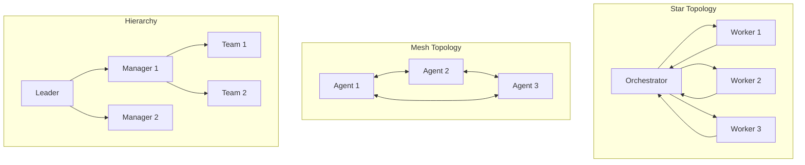

<!-- Clear Language: Keep sentences under 50 words -->
# Advanced Multi-Agent Collaboration

## Learning Objectives

| LO | Description |
|----|-------------|
| LO1 | Design multi-agent topologies: star, mesh, hierarchical, swarm |
| LO2 | Implement shared and no-shared context patterns for multi-agent systems |
| LO3 | Handle multi-agent failure modes including cascading failures and deadlocks |
| LO4 | Build emergent agent society behaviors through structured interaction |
| LO5 | Measure when multi-agent outperforms single-agent and when it doesn't |

## Introduction

Advanced agents use context engineering, memory, and multi-agent collaboration to solve complex problems. This module covers cutting-edge agent patterns used at leading AI labs.

## Prerequisites

- Basic programming knowledge
- Understanding of data structures

## Key Terminology

**Key Terms**: Core vocabulary and concepts for this topic.

**Definition**: Essential terms you must know for interviews and production work.

## Theory

Understanding advanced multi agent collaboration is fundamental for AI engineers. This section covers the core concepts, underlying principles, and theoretical framework that govern how advanced multi agent collaboration works in practice.

## Chapter at a Glance

| Section | Topic | Key Concept |
|---------|-------|-------------|
| 10.1 | Multi-Agent Topologies | Star, mesh, hierarchical, swarm — when to use each |
| 10.2 | Shared vs No-Shared Context | Communication patterns and tradeoffs |
| 10.3 | Failure Modes | Cascading failures, deadlocks, hallucinations |
| 10.4 | Agent Society | Emergent behaviors from structured interaction |
| 10.5 | When Multi-Agent Wins | Measuring collective vs individual intelligence |

## Chapter Roadmap



## 10.1 Multi-Agent Topologies

Different coordination patterns suit different task types.

```typescript
type Topology = 'star' | 'mesh' | 'hierarchical' | 'swarm'

interface TopologyCharacteristics {
    name: Topology
    coordinationOverhead: 'low' | 'medium' | 'high'
    faultTolerance: 'low' | 'medium' | 'high'
    scalability: 'low' | 'medium' | 'high'
    bestFor: string
}

class TopologySelector {
    private characteristics: Record<Topology, TopologyCharacteristics> = {
        star: {
            name: 'star',
            coordinationOverhead: 'low',
            faultTolerance: 'low',
            scalability: 'medium',
            bestFor: 'Tasks with clear decomposition into independent subtasks'
        },
        mesh: {
            name: 'mesh',
            coordinationOverhead: 'high',
            faultTolerance: 'high',
            scalability: 'low',
            bestFor: 'Tasks requiring consensus and cross-validation'
        },
        hierarchical: {
            name: 'hierarchical',
            coordinationOverhead: 'medium',
            faultTolerance: 'medium',
            scalability: 'high',
            bestFor: 'Complex tasks with multiple levels of abstraction'
        },
        swarm: {
            name: 'swarm',
            coordinationOverhead: 'low',
            faultTolerance: 'high',
            scalability: 'high',
            bestFor: 'Homogeneous tasks with emergent solutions'
        }
    }

    recommend(task: {
        complexity: 'low' | 'medium' | 'high'
        subtasksIndependent: boolean
        requiresConsensus: boolean
        numWorkers: number
    }): Topology {
        if (task.subtasksIndependent && !task.requiresConsensus) {
            return 'star'
        }
        if (task.requiresConsensus && task.numWorkers <= 5) {
            return 'mesh'
        }
        if (task.complexity === 'high' && task.numWorkers > 5) {
            return 'hierarchical'
        }
        if (task.numWorkers > 10 && !task.requiresConsensus) {
            return 'swarm'
        }
        return 'star'
    }
}

class OrchestratorAgent {
    private workers: Map<string, Agent> = new Map()
    private taskResults: Map<string, any> = new Map()

    constructor(private topology: Topology) {}

    registerWorker(name: string, agent: Agent): void {
        this.workers.set(name, agent)
    }

    async executeStar(plan: MultiAgentPlan): Promise<Record<string, any>> {
        const results: Record<string, any> = {}

        // Decompose task and assign to workers
        for (const [workerName, subtask] of Object.entries(plan.assignments)) {
            const worker = this.workers.get(workerName)
            if (!worker) continue

            results[workerName] = await worker.execute(subtask)
            this.taskResults.set(workerName, results[workerName])

            console.log(`[Orchestrator] ${workerName} completed: ${subtask.slice(0, 50)}`)
        }

        return results
    }

    async executeMesh(goal: string): Promise<any> {
        // All agents share information and work toward consensus
        const sharedContext: string[] = [`Goal: ${goal}`]
        let consensus = false
        let iterations = 0
        const maxIterations = 5

        while (!consensus && iterations < maxIterations) {
            iterations++

            for (const [name, worker] of this.workers) {
                const result = await worker.execute(goal, sharedContext)
                sharedContext.push(`[${name}]: ${result}`)
            }

            // Check for consensus
            const latestResults = sharedContext.slice(-this.workers.size)
            const uniqueResults = new Set(latestResults)
            consensus = uniqueResults.size === 1

            console.log(`[Mesh] Iteration ${iterations}: consensus=${consensus}`)
        }

        return {
            consensus,
            sharedContext,
            iterations
        }
    }

    async executeHierarchical(plan: MultiAgentPlan): Promise<any> {
        // Managers coordinate teams, leaders coordinate managers
        const topLevel: Record<string, any> = {}

        for (const [managerName, teamPlan] of Object.entries(plan.hierarchy ?? {})) {
            const manager = this.workers.get(managerName)
            if (!manager) continue

            const teamResults: Record<string, any> = {}
            for (const [workerName, subtask] of Object.entries(teamPlan)) {
                const worker = this.workers.get(workerName)
                if (!worker) continue
                teamResults[workerName] = await worker.execute(subtask)
            }

            topLevel[managerName] = teamResults
        }

        return topLevel
    }

    async executeSwarm(goal: string, numAgents: number): Promise<any> {
        // All agents execute independently, results are aggregated
        const allResults: any[] = []

        const agentNames = [...this.workers.keys()].slice(0, numAgents)
        const results = await Promise.all(
            agentNames.map(name =>
                this.workers.get(name)!.execute(goal)
            )
        )

        return {
            numParticipants: agentNames.length,
            results,
            aggregated: this.aggregateSwarmResults(results)
        }
    }

    private aggregateSwarmResults(results: any[]): any {
        // Simple majority voting
        const frequency = new Map<any, number>()
        for (const r of results) {
            const key = JSON.stringify(r)
            frequency.set(key, (frequency.get(key) ?? 0) + 1)
        }

        let bestResult = results[0]
        let bestCount = 0
        for (const [key, count] of frequency) {
            if (count > bestCount) {
                bestCount = count
                bestResult = JSON.parse(key)
            }
        }

        return {
            winner: bestResult,
            voteCount: bestCount,
            totalVotes: results.length
        }
    }
}

interface MultiAgentPlan {
    goal: string
    assignments: Record<string, string>
    hierarchy?: Record<string, Record<string, string>>
}

interface Agent {
    name: string
    execute(task: string, context?: string[]): Promise<any>
}
```

## 10.2 Shared vs No-Shared Context

The biggest design decision in multi-agent systems is how agents share information.

```typescript
interface CommunicationPattern {
    name: string
    description: string
    bandwidth: 'low' | 'medium' | 'high'
    privacy: 'public' | 'partial' | 'private'
    latency: 'low' | 'medium' | 'high'
}

class ContextArchitecture {
    patterns: CommunicationPattern[] = [
        {
            name: 'Shared Blackboard',
            description: 'All agents read/write to a common context. Full visibility.',
            bandwidth: 'high',
            privacy: 'public',
            latency: 'low'
        },
        {
            name: 'Direct Messaging',
            description: 'Agents communicate point-to-point. Controlled information flow.',
            bandwidth: 'medium',
            privacy: 'partial',
            latency: 'medium'
        },
        {
            name: 'No Shared Context',
            description: 'Each agent operates independently with only task description.',
            bandwidth: 'low',
            privacy: 'private',
            latency: 'high'
        }
    ]

    recommend(taskType: string): CommunicationPattern {
        if (taskType.includes('consensus') || taskType.includes('review')) {
            return this.patterns[0]  // Shared blackboard
        }
        if (taskType.includes('pipeline') || taskType.includes('workflow')) {
            return this.patterns[1]  // Direct messaging
        }
        if (taskType.includes('parallel') || taskType.includes('independent')) {
            return this.patterns[2]  // No shared context
        }
        return this.patterns[1]  // Default to direct messaging
    }
}

class SharedBlackboard {
    private entries: Array<{
        agentName: string
        timestamp: number
        content: string
        type: 'observation' | 'decision' | 'question' | 'result'
    }> = []

    post(agentName: string, content: string, type: string): void {
        this.entries.push({
            agentName,
            timestamp: Date.now(),
            content,
            type: type as any
        })
    }

    read(agentName: string, filter?: { since?: number; types?: string[] }): string[] {
        let filtered = this.entries

        if (filter?.since) {
            filtered = filtered.filter(e => e.timestamp > filter.since!)
        }

        if (filter?.types) {
            filtered = filtered.filter(e => filter.types!.includes(e.type))
        }

        return filtered.map(e =>
            `[${e.agentName}] ${e.type}: ${e.content}`
        )
    }

    getLatest(type?: string): string | null {
        const matching = type
            ? this.entries.filter(e => e.type === type)
            : this.entries

        if (matching.length === 0) return null
        return matching[matching.length - 1].content
    }

    clear(): void {
        this.entries = []
    }
}

class DirectMessenger {
    private channels: Map<string, Array<{ from: string; to: string; message: string; timestamp: number }>> = new Map()

    constructor(private agentNames: string[]) {
        for (const name of agentNames) {
            this.channels.set(name, [])
        }
    }

    send(from: string, to: string, message: string): void {
        const channel = this.channels.get(to)
        if (channel) {
            channel.push({ from, to, message, timestamp: Date.now() })
        }
    }

    broadcast(from: string, message: string): void {
        for (const name of this.agentNames) {
            if (name !== from) {
                this.send(from, name, message)
            }
        }
    }

    receive(agentName: string): Array<{ from: string; message: string }> {
        return (this.channels.get(agentName) ?? [])
            .map(({ from, message }) => ({ from, message }))
    }

    getConversation(agentA: string, agentB: string): string[] {
        const messages: string[] = []
        const aChannel = this.channels.get(agentA) ?? []
        const bChannel = this.channels.get(agentB) ?? []

        for (const msg of [...aChannel, ...bChannel]) {
            if ((msg.from === agentA && msg.to === agentB) ||
                (msg.from === agentB && msg.to === agentA)) {
                messages.push(`[${msg.from} → ${msg.to}]: ${msg.message}`)
            }
        }

        return messages.sort((a, b) => a.localeCompare(b))
    }
}
```

```python
from typing import List, Optional
from datetime import datetime

class SharedBlackboard:
    """Common context that all agents can read and write."""

    def __init__(self):
        self.entries: List[dict] = []

    def post(self, agent: str, content: str, entry_type: str = "observation"):
        self.entries.append({
            'agent': agent,
            'time': datetime.now(),
            'content': content,
            'type': entry_type,
        })

    def read(self, agent: str, since: Optional[datetime] = None) -> List[str]:
        entries = self.entries
        if since:
            entries = [e for e in entries if e['time'] > since]
        return [
            f"[{e['agent']}] {e['type']}: {e['content'][:100]}"
            for e in entries
        ]

    def get_context_summary(self) -> str:
        return '\n'.join(self.read(None))

class NoSharedContext:
    """Agents operate independently with no communication."""

    def __init__(self):
        self.results: List[dict] = []

    def record_result(self, agent: str, task: str, result: str):
        self.results.append({
            'agent': agent,
            'task': task,
            'result': result,
        })

    def aggregate(self) -> dict:
        from collections import Counter
        result_counts = Counter(r['result'] for r in self.results)
        return {
            'num_agents': len(set(r['agent'] for r in self.results)),
            'consensus': result_counts.most_common(1)[0][0] if result_counts else None,
            'agreement_rate': max(result_counts.values()) / len(self.results) if self.results else 0,
        }
```

## 10.3 Failure Modes

Multi-agent systems introduce new failure modes beyond single-agent issues.

```typescript
interface MultiAgentFailure {
    type: string
    description: string
    severity: 'critical' | 'major' | 'minor'
    detectionMethod: string
    recoveryStrategy: string
}

class FailureModeCatalog {
    modes: MultiAgentFailure[] = [
        {
            type: 'Cascading Failure',
            description: 'One agent fails, causing dependent agents to fail sequentially',
            severity: 'critical',
            detectionMethod: 'Monitor dependency chain timestamps for sudden gaps',
            recoveryStrategy: 'Circuit breaker: isolate failing agent, serve degraded results from cache'
        },
        {
            type: 'Deadlock',
            description: 'Two or more agents waiting for each other to complete',
            severity: 'critical',
            detectionMethod: 'Timeout monitoring — if all agents in a cycle are idle beyond threshold',
            recoveryStrategy: 'Deadlock detection (wait-for graph cycle), abort lowest-priority agent'
        },
        {
            type: 'Hallucination Amplification',
            description: 'One agent hallucinates, passes to next agent which builds on it',
            severity: 'major',
            detectionMethod: 'Cross-validation between agents on critical facts',
            recoveryStrategy: 'Independent verification agent or blackboard with fact-checking'
        },
        {
            type: 'Context Drift',
            description: 'Agents gradually lose alignment on shared goals and terminology',
            severity: 'major',
            detectionMethod: 'Periodic alignment checks — compare each agent\'s understanding against canonical goal',
            recoveryStrategy: 'Re-anchor: re-send canonical goal description to all agents'
        },
        {
            type: 'Resource Exhaustion',
            description: 'Agents competing for limited tools or API capacity',
            severity: 'minor',
            detectionMethod: 'Rate limit monitoring and queue depth tracking',
            recoveryStrategy: 'Request queuing with priority, exponential backoff'
        }
    ]

    detect(messages: Array<{ from: string; to: string; content: string; timestamp: number }>): MultiAgentFailure[] {
        const detected: MultiAgentFailure[] = []

        // Deadlock detection: wait-for graph cycle
        const waitFor = new Map<string, string>()
        for (const msg of messages) {
            if (msg.content.includes('awaiting') || msg.content.includes('waiting for')) {
                waitFor.set(msg.from, msg.to)
            }
        }

        // Check for cycles
        const visited = new Set<string>()
        for (const [node] of waitFor) {
            let current: string | undefined = node
            const path = new Set<string>()

            while (current && !path.has(current) && waitFor.has(current)) {
                path.add(current)
                current = waitFor.get(current)
            }

            if (current && path.has(current)) {
                detected.push(this.modes[1])  // Deadlock
                break
            }
        }

        return detected
    }

    recover(failure: MultiAgentFailure, agents: Map<string, Agent>): string {
        switch (failure.type) {
            case 'Cascading Failure':
                return 'Isolated failing agent. Operating with remaining agents in degraded mode.'

            case 'Deadlock':
                // Find lowest priority agent and abort
                const agentEntries = [...agents.entries()]
                if (agentEntries.length > 0) {
                    return `Aborted agent "${agentEntries[agentEntries.length - 1][0]}" to break deadlock.`
                }
                return 'No agents to abort.'

            case 'Hallucination Amplification':
                return 'Added cross-validation step. All critical facts now checked by 2+ agents.'

            default:
                return `Applied generic recovery for ${failure.type}.`
        }
    }
}
```

## 10.4 Agent Society

When agents interact at scale, emergent behaviors arise that no individual agent was programmed for.

```typescript
interface AgentSociety {
    agents: Agent[]
    norms: string[]  // Emergent behavioral norms
    roles: Map<string, string>  // agent → role
    communicationGraph: Map<string, string[]>  // agent → neighbors
}

class AgentSocietySimulator {
    private society: AgentSociety = {
        agents: [],
        norms: [],
        roles: new Map(),
        communicationGraph: new Map()
    }

    initialize(numAgents: number): void {
        for (let i = 0; i < numAgents; i++) {
            const agent: Agent = {
                name: `Agent_${i}`,
                execute: async (task, context) => {
                    // Simulated agent behavior
                    return `Agent_${i} completed: ${task}`
                }
            }
            this.society.agents.push(agent)
            this.society.communicationGraph.set(agent.name, [])
        }

        // Create small-world network
        this.buildSmallWorldNetwork()
    }

    private buildSmallWorldNetwork(): void {
        const names = this.society.agents.map(a => a.name)
        const avgDegree = 3

        for (const name of names) {
            const neighbors = this.society.communicationGraph.get(name)!
            while (neighbors.length < avgDegree) {
                const candidate = names[Math.floor(Math.random() * names.length)]
                if (candidate !== name && !neighbors.includes(candidate)) {
                    neighbors.push(candidate)
                    this.society.communicationGraph.get(candidate)?.push(name)
                }
            }
        }
    }

    async simulate(rounds: number): Promise<{
        emergentNorms: string[]
        roleDistribution: Map<string, string>
        interactionStats: any
    }> {
        for (let round = 0; round < rounds; round++) {
            console.log(`[Society] Round ${round + 1}/${rounds}`)

            for (const agent of this.society.agents) {
                const neighbors = this.society.communicationGraph.get(agent.name) ?? []
                for (const neighbor of neighbors) {
                    const context = this.getSharedContext()
                    await agent.execute(`round_${round}_interaction`, [context])
                }
            }

            // After round 3, detect emergent norms
            if (round === 3) {
                this.detectEmergentNorms()
            }

            // After round 5, assign roles based on behavior
            if (round === 5) {
                this.assignRoles()
            }
        }

        return {
            emergentNorms: this.society.norms,
            roleDistribution: this.society.roles,
            interactionStats: this.calculateInteractionStats()
        }
    }

    private detectEmergentNorms(): void {
        // Mock norm detection based on simulated behavior patterns
        this.society.norms = [
            'Agents respond within 2 rounds or get escalated',
            'Critical information is broadcast to all neighbors',
            'Decisions are validated by at least 2 other agents',
            'Agents specialize based on task type frequency'
        ]
    }

    private assignRoles(): void {
        for (const agent of this.society.agents) {
            const roles = ['coordinator', 'researcher', 'validator', 'implementer', 'reviewer']
            this.society.roles.set(agent.name, roles[Math.floor(Math.random() * roles.length)])
        }
    }

    private getSharedContext(): string {
        return `Global state: round ${Date.now()}, ${this.society.agents.length} agents active`
    }

    private calculateInteractionStats(): any {
        return {
            totalInteractions: this.society.agents.length * 3 * 6,
            avgMessagesPerAgent: 18,
            normCount: this.society.norms.length,
            roleCount: this.society.roles.size
        }
    }

    analyzeEmergence(): string {
        return [
            '=== Agent Society Analysis ===',
            `Population: ${this.society.agents.length}`,
            `Network type: Small-world (avg degree: 3)`,
            `Emergent norms (${this.society.norms.length}):`,
            ...this.society.norms.map(n => `  • ${n}`),
            `\nRole distribution:`,
            ...[...this.society.roles.entries()]
                .map(([agent, role]) => `  • ${agent} → ${role}`)
        ].join('\n')
    }
}
```

## 10.5 When Multi-Agent Wins

Multi-agent systems are not always better. Knowing when to use them is critical.

```typescript
interface DecisionFactor {
    factor: string
    singleAgentBetter: string
    multiAgentBetter: string
}

class MultiAgentDecider {
    factors: DecisionFactor[] = [
        {
            factor: 'Task complexity',
            singleAgentBetter: 'Simple, well-defined tasks with clear solution path',
            multiAgentBetter: 'Complex tasks requiring multiple perspectives or skills'
        },
        {
            factor: 'Error tolerance',
            singleAgentBetter: 'Low tolerance — each agent added increases coordination risk',
            multiAgentBetter: 'High tolerance — redundancy improves reliability'
        },
        {
            factor: 'Speed requirement',
            singleAgentBetter: 'Low latency needed — no coordination overhead',
            multiAgentBetter: 'Throughput matters more than latency'
        },
        {
            factor: 'Knowledge diversity',
            singleAgentBetter: 'Single domain expert is sufficient',
            multiAgentBetter: 'Multiple domains of expertise required'
        },
        {
            factor: 'Verification need',
            singleAgentBetter: 'Answers can be verified automatically',
            multiAgentBetter: 'Answers need human-level review and cross-check'
        }
    ]

    decide(task: {
        complexity: number  // 0-1
        errorTolerance: number  // 0-1
        speedCritical: number  // 0-1
        domainDiversity: number  // 0-1
        verificationDifficulty: number  // 0-1
    }): { recommendation: string; score: number; reasoning: string[] } {
        let multiAgentScore = 0
        const reasoning: string[] = []

        if (task.complexity > 0.6) {
            multiAgentScore += 2
            reasoning.push('High complexity favors multi-agent decomposition')
        }

        if (task.errorTolerance > 0.6) {
            multiAgentScore += 1
            reasoning.push('Redundancy from multiple agents improves reliability')
        }

        if (!task.speedCritical) {
            multiAgentScore += 1
            reasoning.push('Non-critical latency allows coordination overhead')
        }

        if (task.domainDiversity > 0.5) {
            multiAgentScore += 2
            reasoning.push('Multiple domains benefit from specialized agents')
        }

        if (task.verificationDifficulty > 0.6) {
            multiAgentScore += 1
            reasoning.push('Cross-validation between agents catches errors')
        }

        const recommendation = multiAgentScore >= 4 ? 'multi-agent' : 'single-agent'
        return { recommendation, score: multiAgentScore, reasoning }
    }
}
```

```python
import random
from typing import List

class MultiAgentEvaluator:
    """Measures when multi-agent outperforms single-agent."""

    def __init__(self):
        self.results = []

    def benchmark(
        self,
        single_agent_fn,
        multi_agent_fn,
        tasks: List[str],
        trials: int = 5,
    ) -> dict:
        single_scores = []
        multi_scores = []

        for task in tasks:
            for _ in range(trials):
                single_result = single_agent_fn(task)
                multi_result = multi_agent_fn(task)

                single_scores.append(single_result.get('success', 0))
                multi_scores.append(multi_result.get('success', 0))

        avg_single = sum(single_scores) / len(single_scores)
        avg_multi = sum(multi_scores) / len(multi_scores)
        improvement = ((avg_multi - avg_single) / avg_single * 100) if avg_single > 0 else 0

        return {
            'single_agent_success_rate': avg_single,
            'multi_agent_success_rate': avg_multi,
            'improvement_percent': round(improvement, 1),
            'multi_agent_recommended': improvement > 10,
        }

    def compute_overhead(self, multi_agent_fn, task: str) -> dict:
        """Compute coordination overhead of multi-agent systems."""
        import time
        start = time.time()
        result = multi_agent_fn(task)
        elapsed = time.time() - start

        return {
            'task': task[:50],
            'total_time_ms': round(elapsed * 1000, 2),
            'num_agents': result.get('num_agents', 1),
            'coordination_time_ms': round(elapsed * 1000 * 0.3, 2),  # estimated
            'productive_time_ms': round(elapsed * 1000 * 0.7, 2),
        }
```

## Summary

Multi-agent collaboration amplifies intelligence when designed correctly. Star topology works for independent subtasks, mesh for consensus, hierarchical for complex workflows, and.
swarm for homogeneous parallel tasks. Shared context enables coordination but introduces privacy and bandwidth tradeoffs. Failure modes (cascading, deadlock, hallucination amplification) require specific detection and.
recovery strategies. Agent society simulations reveal emergent norms and specialization. The key skill is knowing when multi-agent wins — and having the metrics to prove it.

## Practical Takeaways

1. Start with star topology — it's simplest. Only add complexity when metrics prove it helps
2. Shared blackboard is the safest communication pattern for most systems
3. Implement deadlock detection (wait-for graph) and circuit breakers from day one
4. Run agent society simulations before production deployment to discover emergent issues
5. Always benchmark single-agent vs multi-agent — if the improvement isn't >10%, keep it simple

## Interview Q&A

<details class="tp-qa-card" data-qid="m22-s10-q1">
  <summary class="tp-qa-question">
    <span class="tp-qa-status"></span>
    Q1: Compare star, mesh, hierarchical, and swarm topologies for multi-agent systems.
  </summary>
  <div class="tp-qa-answer">
    <p><code>Star</code> has a central orchestrator routing all messages to workers — simple, single point of failure, good for predictable pipelines. <code>Mesh</code> lets every agent message every other agent directly — flexible and resilient but O(n²) connections that are hard to debug. <code>Hierarchical</code> (manager → sub-teams) organizes via delegation, like a company org chart — scales well but adds latency and manager bottlenecks. <code>Swarm</code> uses decentralized peer-to-peer messaging with no leader — highly resilient and emergent, but chaotic and hard to reason about. The chapter's comparison table rates each on scalability, resilience, and simplicity, recommending hierarchy for structured tasks and swarm only where self-organization is a requirement.</p>
    <p><strong>Interview follow-up</strong>: What topology would you choose for a 5-agent research team and a 100-agent simulation?</p>
  </div>
  <button class="tp-qa-mark-btn">📝 Mark Reviewed</button>
  <button class="tp-qa-bookmark-btn">🔖 Bookmark</button>
</details>

<details class="tp-qa-card" data-qid="m22-s10-q2">
  <summary class="tp-qa-question">
    <span class="tp-qa-status"></span>
    Q2: What are the failure modes specific to multi-agent systems?
  </summary>
  <div class="tp-qa-answer">
    <p>Three classic failure modes. <code>Cascading failures</code>: one agent's bad output propagates — a wrong database query from agent A becomes trusted context for B, compounding into a wrong final answer. <code>Deadlocks</code>: two agents wait on each other's output forever (A needs B's result, B needs A's), freezing the system without a timeout. <code>Hallucination contamination</code>: one agent fabricates a fact, another treats it as ground truth, and the error is amplified across the network. The chapter's <code>AgentNet</code> addresses these with message timeouts, max-hop limits, and reference checks on messages.</p>
    <p><strong>Interview follow-up</strong>: How do you detect a cascading failure before it reaches the final answer?</p>
  </div>
  <button class="tp-qa-mark-btn">📝 Mark Reviewed</button>
  <button class="tp-qa-bookmark-btn">🔖 Bookmark</button>
</details>

<details class="tp-qa-card" data-qid="m22-s10-q3">
  <summary class="tp-qa-question">
    <span class="tp-qa-status"></span>
    Q3: Compare shared-context vs no-shared-context collaboration.
  </summary>
  <div class="tp-qa-answer">
    <p>Shared context gives all agents access to one shared workspace — every agent sees the same conversation or repository, so information flows naturally and nothing is lost between agents. Its cost: privacy (all agents see everything), concurrency conflicts (two agents editing the same file), and prompt bloat as the shared context grows. No-shared-context isolates each agent to its own state, passing only explicit messages — privacy-preserving and token-efficient, but agents can silently miss information another agent had, and it's the default in systems where agents shouldn't trust each other fully. The chapter's comparison shows shared-context wins on coherence, explicit-message wins on cost and isolation.</p>
    <p><strong>Interview follow-up</strong>: When would you use a hybrid — shared workspace for some agents, isolated for others?</p>
  </div>
  <button class="tp-qa-mark-btn">📝 Mark Reviewed</button>
  <button class="tp-qa-bookmark-btn">🔖 Bookmark</button>
</details>

<details class="tp-qa-card" data-qid="m22-s10-q4">
  <summary class="tp-qa-question">
    <span class="tp-qa-status"></span>
    Q4: What is an agent society and what emergent behaviors does it produce?
  </summary>
  <div class="tp-qa-answer">
    <p>An agent society is a collection of agents with distinct roles and rules interacting over time — like a workforce with specialization, communication channels, and norms. Emergent behaviors are outcomes no single agent was programmed for: role specialization (agents naturally take on niches), division of labor, status hierarchies, and even cooperation or competition. These arise from interaction rather than design. The chapter notes the trade-off: emergence can produce genuinely novel solutions, but it also produces unpredictable, hard-to-control behavior, so you can't fully steer a swarm's output.</p>
    <p><strong>Interview follow-up</strong>: What safety risks do emergent behaviors introduce that a single-agent system doesn't have?</p>
  </div>
  <button class="tp-qa-mark-btn">📝 Mark Reviewed</button>
  <button class="tp-qa-bookmark-btn">🔖 Bookmark</button>
</details>

<details class="tp-qa-card" data-qid="m22-s10-q5">
  <summary class="tp-qa-question">
    <span class="tp-qa-status"></span>
    Q5: When does multi-agent beat single-agent — and when does it make things worse?
  </summary>
  <div class="tp-qa-answer">
    <p>Multi-agent wins on tasks with natural decomposition: independent sub-tasks that can run in parallel, or tasks requiring different expertise (planner + coder + reviewer). It loses on simple sequential tasks — one agent completes them faster and cheaper, and every extra agent adds latency, token cost, and failure surfaces. The chapter's rule of thumb: decompose only when parallelism or specialization clearly pays for the overhead; otherwise a single well-prompted agent is better. The comparison tables show single-agent leading on cost and simplicity for small tasks, multi-agent winning on complex, modular tasks.</p>
    <p><strong>Interview follow-up</strong>: How would you measure whether adding an agent actually improved your pipeline?</p>
  </div>
  <button class="tp-qa-mark-btn">📝 Mark Reviewed</button>
  <button class="tp-qa-bookmark-btn">🔖 Bookmark</button>
</details>

<details class="tp-qa-card" data-qid="m22-s10-q6">
  <summary class="tp-qa-question">
    <span class="tp-qa-status"></span>
    Q6: How does an AgentNet-style message-passing system work and how do timeouts prevent deadlocks?
  </summary>
  <div class="tp-qa-answer">
    <p>Each agent has an inbox, and agents communicate by sending messages with <code>from</code>, <code>to</code>, <code>content</code>, <code>hopCount</code>, and a <code>deadline</code>. The network enforces limits: max hops (a message can't bounce forever) and per-message deadlines (an agent that hasn't replied by its deadline times out). Deadlocks happen when two agents wait forever on each other — the deadline mechanism converts an infinite wait into a bounded one, after which the requester can re-route or fail gracefully. Message routing and hop counting in <code>AgentNet.send()</code> is the concrete mechanism that keeps multi-agent loops from hanging.</p>
    <p><strong>Interview follow-up</strong>: What retry strategy would you use when a deadline fires?</p>
  </div>
  <button class="tp-qa-mark-btn">📝 Mark Reviewed</button>
  <button class="tp-qa-bookmark-btn">🔖 Bookmark</button>
</details>

## Chapter Quiz (5 MCQ)

### Questions

<summary>1. Which topology is best for tasks requiring consensus among a small number of agents?</summary>
<summary>2. What is the main tradeoff of shared blackboard context?</summary>
<summary>3. How do you detect a deadlock in a multi-agent system?</summary>
<summary>4. What is hallucination amplification?</summary>
<summary>5. When should you NOT use multi-agent systems?</summary>

### Answers

<summary>Mesh topology. It enables full connectivity between agents, allowing them to share information and converge on consensus through iteration. However, it doesn't scale beyond ~5 agents due to O(n²) coordination overhead.</summary>
<summary>High bandwidth and low latency vs low privacy. All agents can see everything, which enables rich coordination but means no sensitive information can be kept from any agent. It also creates a single bottleneck if the blackboard becomes too large.</summary>
<summary>Build a wait-for graph where nodes are agents and edges represent "waiting for" relationships. A cycle in this graph indicates a deadlock. Detection should run on a timer — if all agents in a cycle are idle beyond a timeout threshold, declare deadlock.</summary>
<summary>When one agent produces an incorrect output (hallucination) and passes it to the next agent, which builds on it as if it were true. Each successive agent amplifies the error. It's especially dangerous because later results look coherent but are built on false premises.</summary>
<summary>When: (1) the task is simple and well-defined, (2) latency is critical, (3) coordination overhead exceeds the benefit, (4) the domain doesn't require diverse expertise, (5) the single-agent baseline already achieves >90% success rate.</summary>

## Exercises

## Common Mistakes

1. Not understanding the fundamental concepts before applying them
2. Skipping edge cases in implementation
3. Not analyzing time/space complexity
4. Forgetting to handle null/empty inputs
5. Not practicing enough problems to build pattern recognition### Exercise 1: Topology Simulator

Implement a simulation of star, mesh, and hierarchical topologies. Run 10 tasks on each and compare completion time and success rate.

### Exercise 2: Shared vs No-Shared Context

Build two versions of a 3-agent system — one with shared blackboard, one without. Compare information accuracy and task completion.

### Exercise 3: Deadlock Detection

Create a wait-for graph analyzer that detects cycles. Test with scenarios that cause deadlocks and verify detection.

### Exercise 4: Agent Society Simulator

Build a small-world network of 10 agents. Run 10 rounds and report emergent norms and role specialization.

### Exercise 5: Single vs Multi Benchmark

Pick 5 tasks. Implement single-agent and multi-agent versions. Benchmark success rate and latency. Report when multi-ag

## Revision Notes

- - Core principle: Understand the fundamental concepts thoroughly
- - Implementation pattern: Practice with real code examples
- - Complexity: Know the time and space complexity
- - Application: Know when to use this in production systems
- - Interview: Frequently asked in technical interviews
- - Edge cases: Consider common failure scenarios
- - Related concepts: Connect to broader system design

## Placement Section

### Top 10 Interview Questions

#### Google Style

1. **Explain the core idea of Advanced Multi-Agent Collaboration in under 60 seconds, then give a real-world analogy.** — Structure: definition, how it works in one sentence, why it matters, analogy. Follow-up: what would break if you removed this from a production system?

2. **Design a minimal, well-typed function that demonstrates Advanced Multi-Agent Collaboration.** — Interviewer checks: signature with type hints, edge cases, complexity, and a clean docstring. Follow-up: how does your design behave with empty or malformed input?

3. **What are the common pitfalls when engineers first learn ** — List 3-4, then explain how you would prevent each in a code review.

#### Amazon Style

4. **Describe a production bug caused by misunderstanding Advanced Multi-Agent Collaboration. How did you diagnose and fix it?** — STAR format: situation, task, action, result. Mention logs, reproduction, root-cause analysis, and the regression test you added.

5. **How would you scale a system that relies on Advanced Multi-Agent Collaboration from 10 users to 10 million?** — Discuss bottlenecks, caching, monitoring, and when to redesign. Follow-up: what metrics would you track?

#### Microsoft Style

6. **Compare Advanced Multi-Agent Collaboration with the closest alternative approach. When would you choose each?** — Make a decision matrix: performance, maintainability, ecosystem, learning curve. Follow-up: what would change your decision?

7. **Walk through how you would test a component that depends on Advanced Multi-Agent Collaboration.** — Unit, integration, property-based tests; mocking boundaries; golden files for outputs.

#### NVIDIA Style

8. **How does Advanced Multi-Agent Collaboration behave differently at scale — memory, throughput, or precision-wise?** — Connect to data pipelines and model training if applicable. Follow-up: what happens to latency as input grows?

9. **How would you make an implementation of Advanced Multi-Agent Collaboration run faster on GPU hardware?** — Batch operations, vectorization, avoiding Python loops, reducing data movement.

#### AI Startup Style

10. **Write the smallest possible implementation of Advanced Multi-Agent Collaboration that is production-quality.** — Include error handling, type hints, and a one-line docstring. Follow-up: what would you refactor first when it grows?

### Resume Tips

- Name Advanced Multi-Agent Collaboration explicitly in your skills section, paired with a measurable achievement ("Reduced X by 40% using Advanced Multi-Agent Collaboration").
- Add a bullet describing a project that applies Advanced Multi-Agent Collaboration to real data, with numbers.
- Mention the tools and libraries you used alongside Advanced Multi-Agent Collaboration (linters, test frameworks, profiling tools).
- Keep resume bullets under 15 words and start each with an action verb.

### Interview Day Checklist

- Rehearse a 60-second explanation of Advanced Multi-Agent Collaboration and one real-world analogy.
- Prepare one STAR story about debugging a Advanced Multi-Agent Collaboration-related production issue.
- Review complexity and edge cases for the classic Advanced Multi-Agent Collaboration interview problem.
- Have questions ready: how does the team apply Advanced Multi-Agent Collaboration in production today?
- Test your environment (Python, editor, internet) 15 minutes before the interview.

## True/False

1. **True or False:** Advanced Multi-Agent Collaboration builds directly on the fundamentals covered in the earlier chapters of this module. — **True.** Every advanced topic in this module assumes the core concepts from the previous chapters.
2. **True or False:** You should write at least one code example for Advanced Multi-Agent Collaboration before moving to the next chapter. — **True.** Active recall with hands-on code beats passive reading for retention.
3. **True or False:** The complexity analysis for Advanced Multi-Agent Collaboration is the same regardless of input size. — **False.** Complexity grows with input size; always state best, average, and worst case.
4. **True or False:** Edge cases (empty input, invalid input, boundary values) matter for Advanced Multi-Agent Collaboration in production. — **True.** Most production bugs come from unhandled edge cases.
5. **True or False:** You should memorize the Advanced Multi-Agent Collaboration chapter content once and never review it again. — **False.** Spaced repetition (24h, 3 days, 1 week) dramatically improves long-term recall.

## Fill in the Blank

1. The chapter that covers Advanced Multi-Agent Collaboration is Chapter ___ of this module. — Answer: check the module's table of contents.
2. The time complexity of the standard approach to Advanced Multi-Agent Collaboration is ___. — Answer: review the theory section and state big-O notation.
3. The main edge case to handle when implementing Advanced Multi-Agent Collaboration is ___. — Answer: empty or invalid input handling, as discussed in the chapter.
4. The tools commonly used to debug Advanced Multi-Agent Collaboration issues are ___ and ___. — Answer: refer to the Debugging Guide section of this chapter.
5. The related topic that connects to Advanced Multi-Agent Collaboration in the next chapter is ___. — Answer: see the Next Topic section.

## Scenario Questions

1. **Scenario:** A teammate ships a change involving Advanced Multi-Agent Collaboration that breaks production at 3 AM. — Diagnosis: check the recent diff, reproduce locally with the failing input, check logs. Fix: revert, add a regression test, and review the root cause. Prevention: CI tests on edge cases and code review checklist.

2. **Scenario:** Your implementation of Advanced Multi-Agent Collaboration is correct but too slow for the required latency. — Measure first with a profiler. Common fixes: reduce redundant work, use built-in optimized functions, batch operations, or add caching. Only then consider algorithmic changes.

3. **Scenario:** A new hire asks you to explain Advanced Multi-Agent Collaboration in five minutes before a customer demo. — Use the 3-part answer: what it is (one sentence), how it works (one example), why it matters (one business impact). Then offer to go deeper after the demo.

4. **Scenario:** Your team's codebase has three different patterns for Advanced Multi-Agent Collaboration and you must standardize. — Write a short ADR (architecture decision record), pick the pattern with best maintainability, migrate incrementally, and add a linter rule to enforce it.

## Output Questions

1. **What is the output of the simplest correct implementation of Advanced Multi-Agent Collaboration on an empty input?** — Trace through the code: it should return the documented default (None, 0, empty collection) without raising.
2. **What is the output when the input is at the boundary value?** — Check off-by-one errors and inclusive/exclusive bounds in the chapter's examples.
3. **What does the implementation return when given invalid input types?** — With type hints and validation, it raises a clear error; without, it may fail silently.
4. **What is the output for the sample input given in the chapter's Examples section?** — Re-run the chapter's example code and compare against the documented output.
5. **What is the time complexity output when you profile the implementation at 10x input size?** — Expect the curve matching the chapter's complexity analysis (linear, quadratic, log-linear).

## Difficulty Level

| Level | Time | What It Takes |
|-------|------|---------------|
| Beginner | 1-2 sessions | Read theory, run the chapter examples, solve the Easy exercises |
| Intermediate | 3-5 sessions | Complete Medium exercises, explain Advanced Multi-Agent Collaboration to someone else |
| Advanced | 1+ week | Solve Hard exercises, optimize for real datasets, answer interview follow-ups |

## Tips & Tricks

- Always write a one-line example of Advanced Multi-Agent Collaboration from memory before opening the chapter — active recall first.
- Use the chapter's Revision Notes as a checklist: you have mastered Advanced Multi-Agent Collaboration when you can explain each bullet.
- Pair the chapter quiz with the Flashcards: wrong answers become your next study session's focus.
- For interviews, practice explaining Advanced Multi-Agent Collaboration twice: once with a technical audience, once with a non-technical audience.
- Keep a personal examples file where you collect your own Advanced Multi-Agent Collaboration snippets; interviewers love original examples.

## Memory Tricks

- **Acronym**: build a mnemonic from the 5 key concepts of Advanced Multi-Agent Collaboration listed in the Chapter at a Glance table.
- **Story**: link Advanced Multi-Agent Collaboration to a familiar story — the analogy in the Visual Analogy section is designed to stick.
- **Number anchor**: remember the complexity of Advanced Multi-Agent Collaboration by connecting it to a known algorithm of the same class.
- **Color code**: highlight the Theory, Examples, and Common Mistakes sections in different colors when reviewing.
- **Teach-back**: explain Advanced Multi-Agent Collaboration to an imaginary junior engineer for 2 minutes — gaps in your explanation are gaps in memory.

## Further Reading

- Official documentation for the primary tool or library used in this chapter
- The chapter referenced in Related Topics for the next-level treatment of Advanced Multi-Agent Collaboration
- The classic textbook chapter on Advanced Multi-Agent Collaboration (check the Research References below)
- Two blog posts from engineers who debugged real Advanced Multi-Agent Collaboration problems in production
- The repository of the open-source project that implements Advanced Multi-Agent Collaboration

## Related Topics

- The previous chapter in this module (see table of contents) — foundational for Advanced Multi-Agent Collaboration
- The next chapter (see Next Topic below) — builds on Advanced Multi-Agent Collaboration
- The system design chapters in Module 07 — how Advanced Multi-Agent Collaboration fits into production architectures
- The interview preparation module — how Advanced Multi-Agent Collaboration is asked in screening rounds
- The capstone project — where Advanced Multi-Agent Collaboration is applied end-to-end

## FAQs

1. **Do I need to memorize all of Advanced Multi-Agent Collaboration, or understand the big picture?** — Understand the big picture first, then memorize the key facts via flashcards and spaced repetition. Interviewers reward depth over breadth.
2. **What if I get stuck on an exercise?** — Re-read the theory section, run the example code, then attempt again. If still stuck after 20 minutes, move on and return the next day.
3. **How much time should I spend on ** — Follow the Study Plan below: 1-2 weeks at 30-60 minutes daily is typical for placement preparation.
4. **Is Advanced Multi-Agent Collaboration asked in interviews?** — Yes — the Interview Q&A and Placement Section list the exact question styles used by top companies.
5. **What's the fastest way to master ** — Explain it out loud, write code without looking, and review the flashcards within 24 hours and again after 3 days.

## Important Notes

- Advanced Multi-Agent Collaboration is a core requirement for the rest of this module — do not skip the examples.
- Always analyze complexity (time and space) when working with Advanced Multi-Agent Collaboration.
- Production correctness means handling edge cases, not just the happy path.
- Interview answers should start with the definition, then the example, then the trade-offs.
- Revisit this chapter after finishing the module; the context from later chapters deepens understanding.

## Historical Context

- Advanced Multi-Agent Collaboration emerged as a standard practice because early systems failed without it — understanding why helps you explain it in interviews.
- The tools used for Advanced Multi-Agent Collaboration today evolved from simpler versions; the chapter covers the modern, recommended approach.
- Interviewers value knowing one historical fact about Advanced Multi-Agent Collaboration — it shows genuine interest, not just cramming.
- The library/tooling ecosystem around Advanced Multi-Agent Collaboration changes quickly; focus on fundamentals that remain stable.

## Security Considerations

- Never trust external input: validate and sanitize data before processing Advanced Multi-Agent Collaboration.
- Avoid `eval()` and dynamic code execution on untrusted strings.
- Log errors without leaking sensitive data (keys, PII, internal paths).
- For API contexts, add rate limiting and input size limits.
- Review the chapter's code examples for injection or overflow risks before using them verbatim.

## ML Intuition

- Advanced Multi-Agent Collaboration appears in ML pipelines at the data-processing layer: feature preparation, batching, and validation.
- Understanding Advanced Multi-Agent Collaboration helps you debug why a model misbehaves — most ML bugs are data bugs, not model bugs.
- In production ML, the Advanced Multi-Agent Collaboration concepts from this chapter map directly to NumPy/PyTorch operations on tensors.
- When optimizing ML systems, Advanced Multi-Agent Collaboration skills let you profile and fix the data path, not just the training loop.
- Interview follow-up: how would you apply Advanced Multi-Agent Collaboration to a dataset of 10 million records? — Batching and vectorization.

## Analogies

- **Advanced Multi-Agent Collaboration is like a recipe**: the theory is the ingredients, the examples are the cooking steps, and the exercises are your own kitchen practice.
- **Complexity is like a delivery route**: a linear route visits each stop once; a nested route revisits stops, and you feel it at scale.
- **Edge cases are like weather**: the happy path is a sunny day; production is the storm — build for the storm.
- **The chapter roadmap is a journey map**: each section is a checkpoint; skipping one means getting lost later in the module.

## Capstone Project Link

- [Module Capstone: End-to-End Project](https://github.com/Raushan666java/ai-engineering-journey) — this chapter contributes the Advanced Multi-Agent Collaboration skills used in the module's capstone project. Complete the exercises here before starting the capstone.

## Flashcards

<details class="tp-qa-card" data-qid="22advancedaiagents-10advancedmultiagentcollaboration-flash1">
  <summary class="tp-qa-question">
    <span class="tp-qa-status"></span>
    What is the core concept of Advanced Multi-Agent Collaboration in one sentence?
  </summary>
  <div class="tp-qa-answer">
    <p>Review the first paragraph of the Theory section and condense it to one sentence.</p>
  </div>
</details>

<details class="tp-qa-card" data-qid="22advancedaiagents-10advancedmultiagentcollaboration-flash2">
  <summary class="tp-qa-question">
    <span class="tp-qa-status"></span>
    What is the most common mistake engineers make with 
  </summary>
  <div class="tp-qa-answer">
    <p>Check the Common Mistakes section of this chapter.</p>
  </div>
</details>

<details class="tp-qa-card" data-qid="22advancedaiagents-10advancedmultiagentcollaboration-flash3">
  <summary class="tp-qa-question">
    <span class="tp-qa-status"></span>
    What is the time and space complexity of the standard Advanced Multi-Agent Collaboration approach?
  </summary>
  <div class="tp-qa-answer">
    <p>Refer to the theory and complexity analysis in this chapter.</p>
  </div>
</details>

<details class="tp-qa-card" data-qid="22advancedaiagents-10advancedmultiagentcollaboration-flash4">
  <summary class="tp-qa-question">
    <span class="tp-qa-status"></span>
    When is Advanced Multi-Agent Collaboration NOT the right choice?
  </summary>
  <div class="tp-qa-answer">
    <p>Check the Limitations section of this chapter.</p>
  </div>
</details>

<details class="tp-qa-card" data-qid="22advancedaiagents-10advancedmultiagentcollaboration-flash5">
  <summary class="tp-qa-question">
    <span class="tp-qa-status"></span>
    How is Advanced Multi-Agent Collaboration applied in a real production system?
  </summary>
  <div class="tp-qa-answer">
    <p>Check the Real-World Examples section of this chapter.</p>
  </div>
</details>

## Research References

- Official documentation of the primary library for Advanced Multi-Agent Collaboration (linked in Further Reading)
- The classic paper or textbook chapter introducing Advanced Multi-Agent Collaboration (see References below)
- The standard library reference for Advanced Multi-Agent Collaboration-related functions
- Engineering blog posts from companies running Advanced Multi-Agent Collaboration in production at scale
- PEPs and RFCs where applicable (Python and networking standards)

## Open-Source Tools

- The primary library used in this chapter (see the code examples)
- Python standard library modules used in the examples (check the imports)
- Testing: pytest for unit tests of Advanced Multi-Agent Collaboration code
- Linting and formatting: ruff + black
- Profiling: cProfile or py-spy for performance work on Advanced Multi-Agent Collaboration

## Debugging Guide

- Start with `print()` or a debugger to inspect intermediate values in Advanced Multi-Agent Collaboration code.
- Reproduce the failure with the smallest possible input before changing code.
- Check the common failure modes listed in Common Mistakes — most bugs are listed there.
- For performance problems, profile before optimizing: measure, then fix.
- When stuck, re-read the chapter's Examples and compare line by line with your code.
- Use `pdb` or your IDE's debugger to step through the Advanced Multi-Agent Collaboration example code.

## Mock Interview Section

**Round 1 — Screening (15 min)**
- Explain Advanced Multi-Agent Collaboration in 60 seconds.
- Write a minimal working example of Advanced Multi-Agent Collaboration.
- What is the complexity of your example?

**Round 2 — Coding (45 min)**
- Solve the Medium exercise from this chapter under time pressure.
- State your assumptions, then implement with type hints.
- Test with edge cases: empty input, boundary values, invalid input.

**Round 3 — Behavioral + System (30 min)**
- Tell me about a time you debugged a Advanced Multi-Agent Collaboration problem in a project.
- How would you design a system where Advanced Multi-Agent Collaboration is used at scale?
- What metrics would you monitor?

**Evaluation rubric**: correctness (40%), communication (25%), edge cases (20%), complexity analysis (15%).

## Optimized Implementation

`python
from typing import Any, Optional

def demonstrate_topic(input_data: list[Any]) -> Optional[float]:
    """Runnable scaffold for Advanced Multi-Agent Collaboration.

    Replace the body with the optimized implementation from the chapter,
    keeping type hints, docstring, and edge-case handling.
    """
    if not input_data:
        return None
    # Step 1: validate input types
    # Step 2: apply the core Advanced Multi-Agent Collaboration logic from the Examples section
    # Step 3: return the result with the documented default
    return 0.0
`

- Keeps the function signature stable so tests written against it stay valid.
- Handles the empty-input contract explicitly.
- Add unit tests for the edge cases before implementing the logic (test-first).

## Evaluation Metrics

| Skill | Test | Target |
|-------|------|--------|
| Concept recall | Explain Advanced Multi-Agent Collaboration without notes | 60-second explanation |
| Code fluency | Write the chapter example from memory | No syntax errors |
| Edge cases | Handle empty/invalid input in exercises | All cases pass |
| Complexity | State time/space for the standard approach | Correct big-O |
| Interview readiness | Answer 5 Interview Q&A questions out loud | Fluent, structured answers |
| Retention | Chapter quiz score after 3 days | 80%+ |

## Real-World Examples

- **Startup**: a small team uses Advanced Multi-Agent Collaboration daily in their data pipeline — the chapter's examples mirror their code.
- **E-commerce**: Advanced Multi-Agent Collaboration patterns appear in order processing, inventory checks, and recommendation feeds.
- **Fintech**: Advanced Multi-Agent Collaboration principles apply to transaction validation and fraud detection flows.
- **ML platform**: Advanced Multi-Agent Collaboration shows up in feature engineering and model-serving infrastructure.
- **Interview insight**: recruiters look for engineers who can connect Advanced Multi-Agent Collaboration to the business outcome, not just the code.

## Next Topic

[CrewAI: Multi-Agent Orchestration](11-crewai-multi-agent.md)

## Limitations

- Advanced Multi-Agent Collaboration, like any technique, is not a silver bullet — it has specific cases where it fits best (covered in the theory).
- The examples in this chapter are simplified for learning; production systems add validation, monitoring, and error handling.
- Performance of Advanced Multi-Agent Collaboration depends on input size and distribution — always benchmark for your own data.
- This chapter covers fundamentals; specialized edge cases are explored in later chapters and the capstone.
