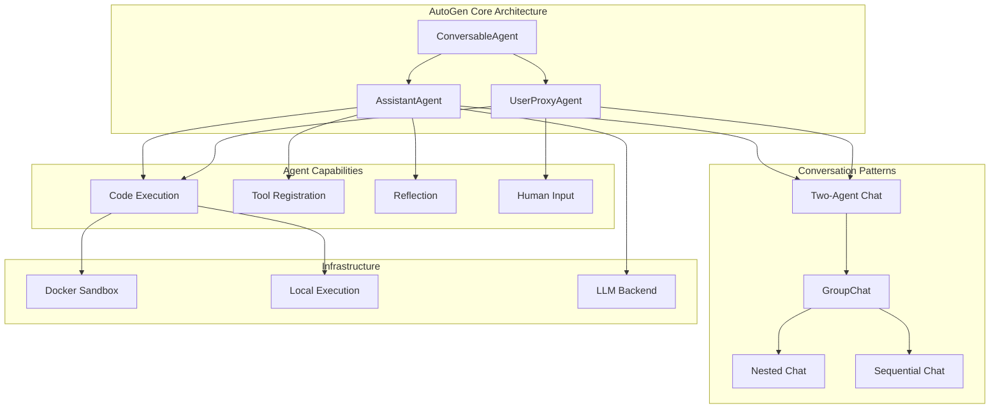
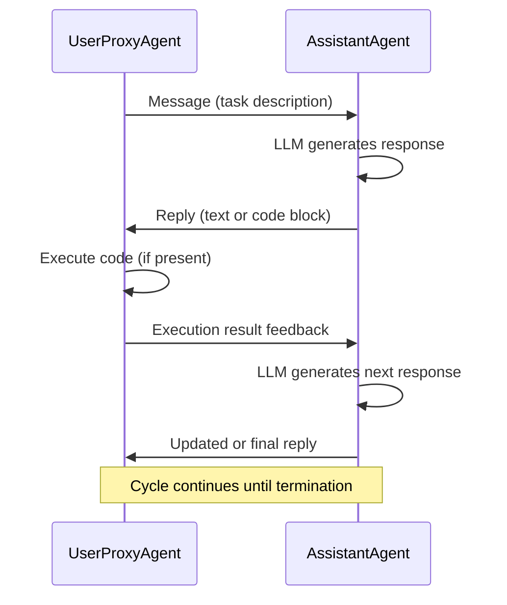
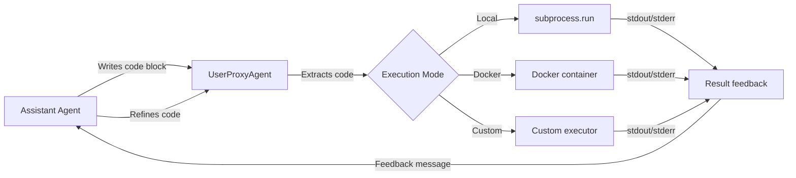
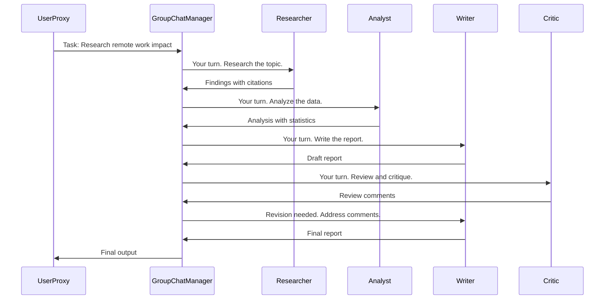

<!-- Clear Language: Keep sentences under 50 words -->
# AutoGen: Multi-Agent Conversations

## Learning Objectives

| LO | Description |
|----|-------------|
| LO1 | Understand AutoGen architecture — agents, conversation patterns, assistant agent, user proxy |
| LO2 | Build two-agent chat systems with assistant + user proxy, code execution, and tool calling |
| LO3 | Design multi-agent conversations with group chat, round-robin, speaker selection, and broadcast |
| LO4 | Implement code execution workflows with Docker sandboxing and result feedback loops |
| LO5 | Register and execute function tools with typed schemas and error handling |
| LO6 | Apply advanced patterns — nested chats, sequential chats, reflection, human input mode |

## Introduction

AutoGen is a multi-agent conversation framework from Microsoft Research. It enables LLM agents to communicate, collaborate, and solve complex tasks through structured conversations. Unlike single-agent systems, AutoGen lets you create teams of agents that talk to each other, share context, and iteratively improve results.

Companies like Microsoft, Morgan Stanley, and AI startups use AutoGen for automated code generation, data analysis, research synthesis, and workflow automation. This chapter covers the full AutoGen stack — from two-agent chat to advanced multi-agent patterns.

## Prerequisites

- Python 3.10+ and working virtual environment
- API key for an LLM provider (OpenAI, Azure OpenAI, or local model via Ollama)
- Basic understanding of agent fundamentals (ReAct pattern, tool calling)
- Familiarity with Python async programming is helpful but not required
- Completed [CrewAI: Multi-Agent Orchestration](11-crewai-multi-agent.md) or equivalent knowledge

## Key Terminology

| Term | Definition |
|------|------------|
| **Agent** | An autonomous conversational participant powered by an LLM with configured system message |
| **AssistantAgent** | An AI agent that responds to messages using an LLM, can call tools and generate code |
| **UserProxyAgent** | A proxy agent that simulates human input — can execute code, provide feedback, or ask clarifying questions |
| **ConversableAgent** | The base class for all agents — defines the core send/receive/reply conversation loop |
| **GroupChat** | A multi-agent conversation where multiple agents take turns speaking in a shared chat room |
| **GroupChatManager** | The orchestrator for GroupChat — manages turn-taking, speaker selection, and termination |
| **Tool Registration** | The mechanism to attach Python functions to agents as callable tools with JSON schemas |
| **Nested Chat** | A pattern where one agent spawns a sub-conversation with other agents to complete a subtask |
| **Sequential Chat** | A pattern where agents converse in a fixed sequence, passing results between each pair |
| **Code Execution** | The ability for agents to write, run, and debug code in a sandboxed or local environment |
| **Reflection** | An agent pattern where an agent critiques its own output and generates improved responses |
| **Human Input Mode** | A mode where the UserProxyAgent pauses and asks a human for input before proceeding |

## Theory

### Chapter at a Glance

| Section | Topic | Key Concept |
|---------|-------|-------------|
| 12.1 | AutoGen Architecture | ConversableAgent, AssistantAgent, UserProxyAgent, message flow |
| 12.2 | Two-Agent Chat | assistant + user proxy, conversation patterns, termination |
| 12.3 | Code Execution | code writing, local execution, Docker sandbox, result feedback |
| 12.4 | Tool Registration | function tools, tool schemas, tool execution, error handling |
| 12.5 | Multi-Agent Conversation | GroupChat, round-robin, speaker selection, broadcast |
| 12.6 | Advanced Patterns | nested chats, sequential chats, reflection, human input mode |

### Chapter Roadmap



---

### 12.1 AutoGen Architecture

AutoGen's architecture is built on a single base class: `ConversableAgent`. Every other agent type inherits from this class. The framework defines three core agent types.

#### 12.1.1 ConversableAgent

`ConversableAgent` is the foundation. It implements the core conversation loop: receive message → process → generate reply → send reply. Every agent in AutoGen is a `ConversableAgent`.

Key attributes:
- `name`: Unique identifier for the agent
- `system_message`: The system prompt that shapes behavior
- `llm_config`: Configuration dict for the LLM (model, temperature, API key)
- `human_input_mode`: Controls when to ask for human input (NEVER, TERMINATE, ALWAYS)
- `max_consecutive_auto_reply`: Limits how many auto-replies the agent can generate

#### 12.1.2 AssistantAgent

`AssistantAgent` is an AI agent powered by an LLM. It generates responses using the configured model. It can call tools, write code, and produce structured outputs. It does NOT execute code by default — it hands code off to a `UserProxyAgent` for execution.

```python
from autogen import AssistantAgent

assistant = AssistantAgent(
    name="coding_assistant",
    system_message="You are a Python expert. Write clean, well-documented code.",
    llm_config={
        "config_list": [
            {
                "model": "gpt-4o",
                "api_key": "YOUR_API_KEY",
            }
        ],
        "temperature": 0.1,
    },
)
```

#### 12.1.3 UserProxyAgent

`UserProxyAgent` acts as a proxy for human users. It can execute code, provide feedback, and forward messages. In automated workflows, it runs without actual human input. In development mode, it can prompt the user for feedback.

```python
from autogen import UserProxyAgent

user_proxy = UserProxyAgent(
    name="user_proxy",
    human_input_mode="NEVER",  # Fully automated
    max_consecutive_auto_reply=10,
    code_execution_config={
        "work_dir": "coding_workspace",
        "use_docker": False,  # Execute locally
    },
)
```

#### 12.1.4 Message Flow

Every conversation follows a send/receive cycle:



#### 12.1.5 Installation

Install AutoGen with the core dependencies:

```bash
pip install pyautogen
```

For Docker-based code execution, install the extra:

```bash
pip install pyautogen[docker]
```

For local models via Ollama or vLLM, AutoGen supports any OpenAI-compatible endpoint.

---

### 12.2 Two-Agent Chat

The simplest AutoGen pattern pairs one `AssistantAgent` with one `UserProxyAgent`. The assistant generates responses and code. The user proxy executes code and provides feedback.

#### 12.2.1 Basic Two-Agent Chat

```python
import autogen
from autogen import AssistantAgent, UserProxyAgent

# Configure the LLM
llm_config = {
    "config_list": [
        {
            "model": "gpt-4o",
            "api_key": "YOUR_API_KEY",
        }
    ],
    "temperature": 0.1,
}

# Create assistant agent
assistant = AssistantAgent(
    name="assistant",
    system_message="You are a helpful Python assistant. "
                   "Write clean code with explanations. "
                   "Use code blocks for any code execution.",
    llm_config=llm_config,
)

# Create user proxy agent
user_proxy = UserProxyAgent(
    name="user_proxy",
    human_input_mode="TERMINATE",  # Ask human when task terminates
    max_consecutive_auto_reply=10,
    code_execution_config={
        "work_dir": "workspace",
        "use_docker": False,
    },
)

# Start the conversation
user_proxy.initiate_chat(
    assistant,
    message="Calculate the Fibonacci sequence up to the 20th term "
            "and find the sum of all even terms.",
)

# Output:
# assistant:
# I'll write a Python script to calculate the Fibonacci sequence
# up to the 20th term and sum all even terms.
# ```python
# def fibonacci_up_to_n(n):
#     fib = [0, 1]
#     for i in range(2, n):
#         fib.append(fib[i-1] + fib[i-2])
#     return fib
#
# fib_20 = fibonacci_up_to_n(20)
# even_sum = sum(x for x in fib_20 if x % 2 == 0)
# print(f"First 20 Fibonacci terms: {fib_20}")
# print(f"Sum of even terms: {even_sum}")
# ```
# user_proxy (executing code):
# First 20 Fibonacci terms: [0, 1, 1, 2, 3, 5, 8, 13, 21, 34, 55, 89, 144, 233, 377, 610, 987, 1597, 2584, 4181]
# Sum of even terms: 3382
```

#### 12.2.2 Termination Conditions

Control when a conversation ends with the `max_consecutive_auto_reply` parameter and termination message detection.

```python
assistant = AssistantAgent(
    name="assistant",
    system_message="End your response with 'TERMINATE' when the task is complete.",
    llm_config=llm_config,
)

# AutoGen detects "TERMINATE" in the message and stops the conversation
user_proxy.initiate_chat(
    assistant,
    message="Write a Python function to check if a string is a palindrome.",
)
```

#### 12.2.3 Custom Reply Functions

Override the default reply mechanism with custom functions.

```python
from autogen import ConversableAgent

def custom_reply(recipient, messages, sender, config):
    """Custom reply function that returns a fixed response."""
    last_message = messages[-1]["content"]
    if "hello" in last_message.lower():
        return "Hello! How can I help you today?"
    return None  # Fall back to default reply

agent_with_custom = ConversableAgent(
    name="custom_agent",
    default_auto_reply="I'm listening.",
)

# Register the custom reply function
agent_with_custom.register_reply(
    trigger=ConversableAgent,
    reply_func=custom_reply,
    config=None,
)
```

---

### 12.3 Code Execution

AutoGen's code execution capability is one of its most powerful features. Agents write code in markdown code blocks, and the UserProxyAgent extracts, saves, and executes them.

#### 12.3.1 Local Code Execution

```python
user_proxy = UserProxyAgent(
    name="user_proxy",
    human_input_mode="NEVER",
    code_execution_config={
        "work_dir": "coding_workspace",
        "use_docker": False,  # Execute directly on host
        "timeout": 60,        # Max execution time in seconds
        "last_n_messages": 3, # Only execute code from recent messages
    },
)
```

The `work_dir` is where code files are saved. AutoGen detects code blocks in markdown (triple backticks), saves them as `coding_{timestamp}.py`, executes them, and captures stdout/stderr.

#### 12.3.2 Docker Sandboxed Execution

For production safety, run code in isolated Docker containers.

```python
user_proxy_docker = UserProxyAgent(
    name="user_proxy",
    human_input_mode="NEVER",
    code_execution_config={
        "work_dir": "coding_workspace",
        "use_docker": True,  # Run in Docker container
        "docker_container": "python:3.11-slim",  # Custom image
        "timeout": 120,
    },
)
```

AutoGen creates a container, mounts the work directory, executes code inside the container, and returns results. Each execution can reuse the same container or spawn a fresh one.

#### 12.3.3 Custom Code Executor

Build a custom executor for specialized environments (e.g., Jupyter kernels, remote servers, restricted sandboxes).

```python
from autogen.code_utils import create_virtual_env
from autogen import UserProxyAgent

class CustomExecutor:
    def __init__(self, work_dir: str):
        self.work_dir = work_dir
        self.env = create_virtual_env(work_dir)

    def execute_code(self, code: str) -> tuple[int, str, str]:
        """Execute code and return (exit_code, stdout, stderr)."""
        try:
            import subprocess
            result = subprocess.run(
                ["python", "-c", code],
                capture_output=True,
                text=True,
                timeout=30,
                cwd=self.work_dir,
            )
            return (
                result.returncode,
                result.stdout,
                result.stderr,
            )
        except subprocess.TimeoutExpired:
            return (1, "", "Execution timed out")
        except Exception as e:
            return (1, "", str(e))

custom_executor = CustomExecutor(work_dir="secure_workspace")

user_proxy_custom = UserProxyAgent(
    name="user_proxy",
    human_input_mode="NEVER",
    code_execution_config={
        "executor": custom_executor.execute_code,
    },
)
```

#### 12.3.4 Code Execution Flow



---

### 12.4 Tool Registration

Tools let agents interact with external systems. AutoGen supports function tools with JSON schemas, similar to OpenAI's function calling.

#### 12.4.1 Registering a Function Tool

```python
from autogen import AssistantAgent, UserProxyAgent
from typing import Annotated, Literal

# Define a tool function with type hints
def get_weather(
    location: Annotated[str, "City name, e.g., 'San Francisco'"],
    unit: Annotated[Literal["celsius", "fahrenheit"], "Temperature unit"],
) -> str:
    """Get current weather for a location."""
    # In production, call a real weather API
    conditions = {
        "San Francisco": (15, "Foggy"),
        "New York": (22, "Sunny"),
        "London": (10, "Rainy"),
        "Tokyo": (18, "Cloudy"),
    }
    temp, condition = conditions.get(location, (20, "Unknown"))
    if unit == "fahrenheit":
        temp = temp * 9 // 5 + 32
    return f"Weather in {location}: {temp}°{unit[0].upper()}, {condition}"

# Create agents
assistant = AssistantAgent(
    name="weather_assistant",
    system_message="You are a weather assistant. Use the weather tool to answer queries.",
    llm_config={
        "config_list": [{"model": "gpt-4o", "api_key": "YOUR_API_KEY"}],
        "temperature": 0,
    },
)

user_proxy = UserProxyAgent(
    name="user_proxy",
    human_input_mode="TERMINATE",
    code_execution_config=False,  # No code execution needed
)

# Register the tool with the assistant
assistant.register_for_llm(
    name="get_weather",
    description="Get current weather for a location",
    func=get_weather,
)

# Register the tool with the user proxy (for execution)
user_proxy.register_for_execution(
    name="get_weather",
    func=get_weather,
)

# Start conversation
user_proxy.initiate_chat(
    assistant,
    message="What is the weather in Tokyo and New York?",
)
```

#### 12.4.2 Tool Schema Generation

AutoGen automatically generates JSON schemas from function type hints using Pydantic-like introspection. The schema for `get_weather` becomes:

```json
{
    "type": "function",
    "function": {
        "name": "get_weather",
        "description": "Get current weather for a location",
        "parameters": {
            "type": "object",
            "properties": {
                "location": {
                    "type": "string",
                    "description": "City name, e.g., 'San Francisco'"
                },
                "unit": {
                    "type": "string",
                    "enum": ["celsius", "fahrenheit"],
                    "description": "Temperature unit"
                }
            },
            "required": ["location", "unit"]
        }
    }
}
```

#### 12.4.3 Multiple Tools

Register multiple tools on the same agent.

```python
import json
from typing import Annotated

def search_database(
    query: Annotated[str, "SQL query to execute"],
) -> str:
    """Execute a SQL query on the products database."""
    # Mock database
    data = {
        "SELECT COUNT(*) FROM products": "1423 products",
        "SELECT * FROM products WHERE price < 10": "45 products under $10",
    }
    return data.get(query, f"Query executed: {query}")

def send_email(
    to: Annotated[str, "Recipient email address"],
    subject: Annotated[str, "Email subject"],
    body: Annotated[str, "Email body text"],
) -> str:
    """Send an email to a recipient."""
    # In production, integrate with SendGrid, SES, etc.
    print(f"Sending email to {to}: {subject}")
    return f"Email sent to {to} with subject '{subject}'"

# Register both tools
for tool_func in [search_database, send_email]:
    assistant.register_for_llm(name=tool_func.__name__)(tool_func)
    user_proxy.register_for_execution(name=tool_func.__name__)(tool_func)
```

#### 12.4.4 Tool Error Handling

Tools should handle errors gracefully and return informative messages.

```python
import requests
from typing import Annotated

def fetch_github_repo(
    repo: Annotated[str, "Repository name in format 'owner/repo'"],
) -> str:
    """Fetch repository metadata from GitHub API."""
    try:
        response = requests.get(
            f"https://api.github.com/repos/{repo}",
            timeout=10,
        )
        response.raise_for_status()
        data = response.json()
        return json.dumps({
            "name": data["name"],
            "stars": data["stargazers_count"],
            "forks": data["forks_count"],
            "language": data["language"],
            "description": data["description"],
        }, indent=2)
    except requests.exceptions.HTTPError as e:
        if response.status_code == 404:
            return f"Error: Repository '{repo}' not found."
        return f"Error: GitHub API returned {response.status_code}: {str(e)}"
    except requests.exceptions.ConnectionError:
        return "Error: Could not connect to GitHub API."
    except requests.exceptions.Timeout:
        return "Error: GitHub API request timed out."
    except Exception as e:
        return f"Error: Unexpected error: {str(e)}"
```

---

### 12.5 Multi-Agent Conversation

AutoGen's `GroupChat` enables conversations with three or more agents. A `GroupChatManager` orchestrates turn-taking.

#### 12.5.1 GroupChat Basics

```python
from autogen import AssistantAgent, GroupChat, GroupChatManager

# Create multiple specialist agents
researcher = AssistantAgent(
    name="researcher",
    system_message="You are a research specialist. Find relevant information and cite sources. "
                   "Be thorough and precise in your analysis.",
    llm_config=llm_config,
)

analyst = AssistantAgent(
    name="analyst",
    system_message="You are a data analyst. Analyze data and identify patterns. "
                   "Create visualizations and summary statistics.",
    llm_config=llm_config,
)

writer = AssistantAgent(
    name="writer",
    system_message="You are a technical writer. Synthesize findings into clear reports. "
                   "Use markdown formatting and structure.",
    llm_config=llm_config,
)

critic = AssistantAgent(
    name="critic",
    system_message="You are a critical reviewer. Find gaps, errors, and improvements. "
                   "Be constructive and specific.",
    llm_config=llm_config,
)

# Create the group chat
group_chat = GroupChat(
    agents=[researcher, analyst, writer, critic],
    messages=[],  # Start with empty history
    max_round=20,  # Maximum conversation turns
    speaker_selection_method="auto",  # LLM selects next speaker
)

# Create the manager
manager = GroupChatManager(
    groupchat=group_chat,
    llm_config=llm_config,
)

# User proxy initiates the conversation
user_proxy = UserProxyAgent(
    name="user_proxy",
    human_input_mode="TERMINATE",
    code_execution_config=False,
)

user_proxy.initiate_chat(
    manager,
    message="Research the impact of remote work on software engineering productivity "
            "in 2024-2025. Analyze the data, write a report, and have it reviewed.",
)
```

#### 12.5.2 Speaker Selection Methods

| Method | Description | Use Case |
|--------|-------------|----------|
| `auto` | LLM picks the next speaker based on context | Flexible conversations |
| `round_robin` | Agents speak in fixed order, cycling through | Structured turn-taking |
| `random` | Random speaker selection | Exploration, brainstorming |
| `manual` | User selects next speaker | Interactive demos |

```python
# Round-robin: each agent speaks in sequence
group_chat_rr = GroupChat(
    agents=[researcher, analyst, writer],
    messages=[],
    max_round=15,
    speaker_selection_method="round_robin",
)

# Manual: user picks who speaks next
group_chat_manual = GroupChat(
    agents=[researcher, analyst, writer],
    messages=[],
    max_round=30,
    speaker_selection_method="manual",
)
```

#### 12.5.3 Custom Speaker Selection

Implement custom speaker selection logic with a function.

```python
def custom_speaker_selector(last_speaker, group_chat):
    """Custom logic to select the next speaker."""
    agents = group_chat.agents
    last_message = group_chat.messages[-1]["content"] if group_chat.messages else ""

    # If the last message contains code, let the critic review it
    if "```" in last_message:
        return next(a for a in agents if a.name == "critic")

    # If no analyst has spoken yet, let them speak
    analyst_spoken = any(
        "analyst" in msg.get("name", "").lower()
        for msg in group_chat.messages
    )
    if not analyst_spoken:
        return next(a for a in agents if a.name == "analyst")

    # Default: let the manager decide
    return "auto"

group_chat_custom = GroupChat(
    agents=[researcher, analyst, writer, critic],
    messages=[],
    max_round=20,
    speaker_selection_method=custom_speaker_selector,
)
```

#### 12.5.4 Broadcast Pattern

Send a message to all agents and let each respond independently.

```python
def broadcast_message(manager, message: str):
    """Send a message that all agents can respond to."""
    for agent in manager.groupchat.agents:
        agent.receive(
            message=message,
            sender=manager,
            request_reply=True,
        )

# The GroupChatManager handles broadcasting through the chat flow
user_proxy.initiate_chat(
    manager,
    message="Team, here is the quarterly data. Each of you analyze it from your perspective.",
)
```

#### 12.5.5 GroupChat Flow



---

### 12.6 Advanced Patterns

AutoGen supports sophisticated conversation patterns for complex workflows.

#### 12.6.1 Nested Chats

A nested chat is a conversation within a conversation. One agent delegates a subtask to a sub-conversation with other agents and uses the result.

```python
from autogen import AssistantAgent, UserProxyAgent, GroupChat, GroupChatManager

# Define specialist agents for the nested chat
code_writer = AssistantAgent(
    name="code_writer",
    system_message="You write clean Python code for data analysis tasks.",
    llm_config=llm_config,
)

code_tester = AssistantAgent(
    name="code_tester",
    system_message="You test Python code and fix bugs. Provide test cases.",
    llm_config=llm_config,
)

# Create the nested group chat
nested_group = GroupChat(
    agents=[code_writer, code_tester],
    messages=[],
    max_round=10,
    speaker_selection_method="round_robin",
)

nested_manager = GroupChatManager(
    groupchat=nested_group,
    llm_config=llm_config,
)

# Main orchestrator agent
orchestrator = AssistantAgent(
    name="orchestrator",
    system_message="You are an orchestrator. Delegate coding tasks to the code team "
                   "and use their output to answer the user.",
    llm_config=llm_config,
)

# Register nested chat handler
async def handle_code_task(message, sender, config):
    """Handle a code-related subtask using nested chat."""
    result = await nested_manager.a_initiate_chat(
        orchestrator,
        message=message,
        max_turns=10,
    )
    return result.summary

orchestrator.register_reply(
    trigger=UserProxyAgent,
    reply_func=handle_code_task,
    config=None,
)

user_proxy = UserProxyAgent(
    name="user_proxy",
    human_input_mode="NEVER",
    code_execution_config=False,
)

# When the user asks for code, the orchestrator spawns a nested chat
user_proxy.initiate_chat(
    orchestrator,
    message="Create a Python script that analyzes a CSV file "
            "and generates summary statistics.",
)
```

#### 12.6.2 Sequential Chats

Sequential chats chain multiple two-agent conversations. The output of one chat feeds into the next.

```python
from autogen import AssistantAgent, UserProxyAgent, SequentialFlow

# Define specialized agents
data_collector = AssistantAgent(
    name="data_collector",
    system_message="You collect data and organize it into structured format.",
    llm_config=llm_config,
)

data_analyzer = AssistantAgent(
    name="data_analyzer",
    system_message="You analyze data and find insights. "
                   "Use statistical methods and create visualizations.",
    llm_config=llm_config,
)

report_writer = AssistantAgent(
    name="report_writer",
    system_message="You write professional reports with findings and recommendations.",
    llm_config=llm_config,
)

# Create a shared user proxy for all chats
user_proxy = UserProxyAgent(
    name="user_proxy",
    human_input_mode="NEVER",
    code_execution_config={
        "work_dir": "workspace",
        "use_docker": False,
    },
)

# Define sequential chat flow
sequential_flow = SequentialFlow(
    agents=[
        (data_collector, "Collect data about top AI companies in 2025"),
        (data_analyzer, "Analyze the collected data and find trends"),
        (report_writer, "Write a comprehensive report based on the analysis"),
    ],
    max_turns_per_chat=5,
    summary_method="last_msg",  # Pass last message as context to next chat
)

# Run the sequential flow
await sequential_flow.run(user_proxy=user_proxy)
```

#### 12.6.3 Reflection Pattern

In the reflection pattern, an agent generates an initial response, then reviews and improves it. This mimics human iterative refinement.

```python
class ReflectiveAssistantAgent(AssistantAgent):
    """An agent that reflects on its own output before responding."""

    def __init__(self, *args, **kwargs):
        super().__init__(*args, **kwargs)
        self.reflection_prompt = (
            "Review your previous response critically. "
            "Identify any errors, omissions, or areas for improvement. "
            "Then provide an improved version."
        )

    async def a_generate_reply(self, messages=None, sender=None, **kwargs):
        """Generate a reply with self-reflection."""
        # First, generate the initial response
        initial_response = await super().a_generate_reply(
            messages=messages, sender=sender, **kwargs
        )

        # Create reflection context
        reflection_messages = messages + [
            {"role": "assistant", "content": initial_response},
            {"role": "user", "content": self.reflection_prompt},
        ]

        # Generate reflection (improved version)
        improved_response = await super().a_generate_reply(
            messages=reflection_messages, sender=sender, **kwargs
        )

        return improved_response

reflective_assistant = ReflectiveAssistantAgent(
    name="reflective_assistant",
    system_message="You are a thoughtful analyst who double-checks your work.",
    llm_config=llm_config,
)
```

#### 12.6.4 Human Input Mode

Control when the UserProxyAgent asks for human input.

```python
# NEVER: Fully automated, no human input
auto_proxy = UserProxyAgent(
    name="auto_proxy",
    human_input_mode="NEVER",
)

# TERMINATE: Ask human only when the task terminates
# This is useful for approval workflows
approval_proxy = UserProxyAgent(
    name="approval_proxy",
    human_input_mode="TERMINATE",
    code_execution_config={
        "work_dir": "workspace",
        "use_docker": False,
    },
)

# ALWAYS: Ask human before every response
# Useful for interactive demonstrations
interactive_proxy = UserProxyAgent(
    name="interactive_proxy",
    human_input_mode="ALWAYS",
    code_execution_config={
        "work_dir": "workspace",
        "use_docker": False,
    },
)
```

When `human_input_mode="TERMINATE"`, the conversation proceeds automatically until the agent sends "TERMINATE". Then AutoGen prints the final result and asks the human for approval or additional instructions.

#### 12.6.5 Putting It All Together: Production Workflow

```python
"""
Complete production workflow combining:
- Multi-agent group chat
- Code execution
- Tool registration
- Reflection
- Sequential processing
"""

import autogen
from autogen import (
    AssistantAgent,
    UserProxyAgent,
    GroupChat,
    GroupChatManager,
)
from typing import Annotated

# LLM configuration
llm_config = {
    "config_list": [
        {
            "model": "gpt-4o",
            "api_key": "YOUR_API_KEY",
        }
    ],
    "temperature": 0.2,
}

# ---- Tool Definitions ----

def search_web(
    query: Annotated[str, "Search query string"],
) -> str:
    """Search the web for information."""
    # In production: use Tavily, SerpAPI, or Bing Search
    return f"Mock search results for: {query}"

def save_to_file(
    filename: Annotated[str, "Output filename"],
    content: Annotated[str, "Content to save"],
) -> str:
    """Save content to a file in the workspace."""
    import os
    path = os.path.join("production_workspace", filename)
    os.makedirs("production_workspace", exist_ok=True)
    with open(path, "w", encoding="utf-8") as f:
        f.write(content)
    return f"Saved to {path}"

# ---- Agent Definitions ----

planner = AssistantAgent(
    name="planner",
    system_message="You are a project planner. Break down complex tasks "
                   "into clear, actionable steps. Always output a numbered plan.",
    llm_config=llm_config,
)

researcher = AssistantAgent(
    name="researcher",
    system_message="You are a researcher. Gather information using the search tool. "
                   "Cite sources and verify facts.",
    llm_config=llm_config,
)

developer = AssistantAgent(
    name="developer",
    system_message="You are a Python developer. Write clean, tested code. "
                   "Use the save_to_file tool to persist files.",
    llm_config=llm_config,
)

reviewer = AssistantAgent(
    name="reviewer",
    system_message="You are a code reviewer. Review code for bugs, security issues, "
                   "and best practices. Be thorough and constructive.",
    llm_config=llm_config,
)

# Register tools with agents
for agent in [researcher]:
    agent.register_for_llm(name="search_web", func=search_web)

for agent in [developer]:
    agent.register_for_llm(name="save_to_file", func=save_to_file)

# ---- User Proxy ----

user_proxy = UserProxyAgent(
    name="user_proxy",
    human_input_mode="NEVER",
    code_execution_config={
        "work_dir": "production_workspace",
        "use_docker": False,
        "timeout": 120,
    },
)

# Register execution for tools
for func in [search_web, save_to_file]:
    user_proxy.register_for_execution(name=func.__name__, func=func)

# ---- Group Chat ----

group_chat = GroupChat(
    agents=[planner, researcher, developer, reviewer],
    messages=[],
    max_round=30,
    speaker_selection_method="auto",
)

manager = GroupChatManager(
    groupchat=group_chat,
    llm_config=llm_config,
)

# ---- Execute ----

user_proxy.initiate_chat(
    manager,
    message="Create a Python script that: "
            "1. Fetches current exchange rates for USD, EUR, GBP, JPY "
            "2. Converts $1000 USD to each currency "
            "3. Saves the results to a formatted file "
            "The code should be clean, handle errors, and include docstrings.",
)
```

---

## Interview Q&A

### Q1: What is the difference between AssistantAgent and UserProxyAgent in AutoGen?

**Answer:** AssistantAgent is an AI agent that generates responses using an LLM — it writes text, code, and tool calls. UserProxyAgent is a proxy that can execute code, provide execution results back to the assistant, and simulate human input. The assistant thinks and generates; the user proxy acts and provides feedback. This separation lets the assistant focus on reasoning while the proxy handles execution and human interaction.

### Q2: How does AutoGen handle code execution safety?

**Answer:** AutoGen provides three layers of safety. First, code execution is opt-in — the UserProxyAgent must have `code_execution_config` set. Second, Docker sandboxing (`use_docker=True`) runs code in isolated containers with no network access or persistent storage. Third, the `work_dir` parameter limits file operations to a specific directory. For production, combine Docker with custom execution timeouts, restricted system calls, and read-only file systems.

### Q3: Explain the GroupChat speaker selection methods.

**Answer:** AutoGen supports four methods. `auto` uses an LLM to pick the next speaker based on conversation context — best for flexible discussions. `round_robin` cycles through agents in order — good for structured turn-taking. `random` picks randomly — useful for brainstorming. `manual` asks the user to pick — used in interactive demos. You can also provide a custom function for domain-specific selection logic.

### Q4: How do you register a tool and ensure the LLM calls it correctly?

**Answer:** Use `register_for_llm()` on the assistant to generate the JSON tool schema and inject it into the LLM's system message. Use `register_for_execution()` on the user proxy to map the tool name to the actual Python function. The tool function must have type-annotated parameters with descriptions using `Annotated` for AutoGen to generate precise schemas. Test tool descriptions — they directly impact whether the LLM chooses to call the tool.

### Q5: What is the reflection pattern and when should you use it?

**Answer:** The reflection pattern has an agent critique its own output and generate an improved version. Use it when quality matters more than speed — code generation, report writing, critical analysis. The agent first produces a response, then reviews it against a reflection prompt (e.g., "Find errors, omissions, or improvements"), then generates an improved version. This adds one LLM call but typically improves output quality by 20-40% in complex tasks.

### Q6: How does nested chat differ from group chat?

**Answer:** Nested chat is a conversation-within-a-conversation. One agent delegates a subtask to a separate agent or group and waits for their result. Group chat has multiple agents conversing in a shared room with a manager controlling turns. Nested chat is hierarchical — the orchestrator controls the flow. Group chat is flat — agents collaborate freely. Use nested chat for complex workflows where subtasks need focused attention. Use group chat for collaborative problem-solving.

### Q7: What is the role of max_consecutive_auto_reply and how does it affect termination?

**Answer:** `max_consecutive_auto_reply` limits how many automatic replies an agent can generate without human input. It prevents infinite loops. When the limit is reached, the agent pauses and either asks for human input (if `human_input_mode` allows) or stops. Set it high enough for complex multi-step tasks (10-15) but low enough to catch runaway conversations (under 20 for most use cases).

### Q8: Compare AutoGen's approach to multi-agent orchestration with CrewAI.

**Answer:** AutoGen uses conversational agents in a chat room with dynamic turn-taking. Agents speak freely and the GroupChatManager orchestrates the flow. CrewAI uses role-based agents with explicit task definitions and processes (sequential, hierarchical). AutoGen is better for open-ended discussions where the conversation direction is unknown. CrewAI is better for structured workflows with clear inputs and outputs. AutoGen's agent API is simpler but requires more manual flow control for complex workflows.

### Q9: How do you handle errors when a tool fails during a conversation?

**Answer:** Tools should never raise exceptions — they should catch errors and return descriptive error messages as strings. The agent receives the error message as a response and can retry, ask clarifying questions, or fall back to an alternative approach. For critical failures, register a custom reply function that monitors tool results and triggers recovery workflows. Never let an exception propagate up from a tool — it breaks the conversation loop.

### Q10: What patterns do you use for production AutoGen deployments?

**Answer:** (1) Use Docker sandboxing for all code execution. (2) Set `human_input_mode="NEVER"` and handle approvals through a separate tool. (3) Register a custom reply function for logging every message to a database or log aggregator. (4) Use `max_round` and `max_consecutive_auto_reply` to prevent runaway conversations. (5) Implement timeout wrappers around `initiate_chat` to handle stuck conversations. (6) Store conversation history for debugging and auditing. (7) Use Azure OpenAI with managed identity for enterprise security.

---

## Summary

AutoGen is Microsoft Research's multi-agent conversation framework. It enables teams of AI agents to communicate, collaborate, and solve complex tasks through structured conversations. The framework is built on `ConversableAgent` with two main agent types: `AssistantAgent` (LLM-powered) and `UserProxyAgent` (execution proxy). Two-agent chat is the foundation — the assistant generates responses and code, the user proxy executes and provides feedback.

Tool registration attaches Python functions to agents with automatic JSON schema generation. GroupChat extends conversations to multiple agents with configurable turn-taking (auto, round-robin, random, manual). Advanced patterns include nested chats (sub-conversations for subtasks), sequential chats (chained conversations), reflection (self-critique and improvement), and human input modes (NEVER, TERMINATE, ALWAYS).

AutoGen excels at open-ended conversational multi-agent systems. It pairs with CrewAI (structured workflows) and LangGraph (state machines) to form the three pillars of modern multi-agent orchestration. Understanding AutoGen is essential for AI Engineers building collaborative agent systems at companies like Microsoft, Morgan Stanley, and AI startups.
## Chapter Quiz (5 MCQ)

### Q1: Which agent type is responsible for executing code in an AutoGen conversation?

a) AssistantAgent
b) ConversableAgent
c) UserProxyAgent
d) GroupChatManager

**Answer: c) UserProxyAgent**

### Q2: What happens when speaker_selection_method is set to "auto"?

a) Agents speak in round-robin order
b) The GroupChatManager (LLM) selects the next speaker
c) The user must select the next speaker
d) All agents respond simultaneously

**Answer: b) The GroupChatManager (LLM) selects the next speaker**

### Q3: How does AutoGen detect that a conversation should terminate?

a) A timer expires
b) The LLM includes "TERMINATE" in its response
c) All agents have spoken once
d) The user proxy runs out of code to execute

**Answer: b) The LLM includes "TERMINATE" in its response**

### Q4: What is the purpose of register_for_execution on UserProxyAgent?

a) To tell the LLM about available tools
b) To map a tool name to the actual Python function that executes it
c) To execute code directly
d) To register a Docker container

**Answer: b) To map a tool name to the actual Python function that executes it**

### Q5: In a nested chat pattern, what happens when an agent receives a subtask?

a) It ignores the subtask
b) It spawns a sub-conversation with other agents and waits for the result
c) It forwards the subtask to the user
d) It terminates the main conversation

**Answer: b) It spawns a sub-conversation with other agents and waits for the result**

---

## Exercises (5)

### Exercise 1: Build a Two-Agent Data Analyzer

Create a two-agent AutoGen system with an AssistantAgent and a UserProxyAgent. The assistant should write Python code to load a CSV file (provide a sample), compute summary statistics (mean, median, std for numeric columns), and generate a markdown report. Execute code locally. Use termination detection to stop when the report is complete.

### Exercise 2: Multi-Agent Research Team

Build a GroupChat with three agents: a Researcher (gathers information), a FactChecker (verifies claims), and a Summarizer (creates a concise summary). Use `speaker_selection_method="round_robin"` with `max_round=12`. The user proxy should initiate the chat with a research question about a trending AI topic. Each agent must contribute exactly once per cycle.

### Exercise 3: Custom Tool — Stock Price Fetcher

Register a custom tool `get_stock_price(symbol: str) -> str` that fetches stock prices from a mock database (or a real API like Alpha Vantage if you have a key). Create an assistant that uses this tool to answer queries about multiple stocks. The assistant should also write code to calculate portfolio value and percentage change. Handle API errors gracefully.

### Exercise 4: Reflective Code Generator

Implement a reflective code generator using the reflection pattern. The assistant should first write code for a given problem, then review it for bugs and inefficiencies, then produce an improved version. Use the UserProxyAgent to execute both versions and compare the output. Demonstrate the quality improvement with a non-trivial task (e.g., implementing a binary search tree or a data pipeline).

### Exercise 5: Production Workflow — Report Generator

Build a complete production workflow with: (1) a Planner agent that breaks a complex topic into research questions, (2) a Researcher agent with a web search tool that answers each question, (3) a Developer agent that creates data visualizations using matplotlib, (4) a Reviewer agent that checks code quality and factual accuracy. Use sequential processing where each agent's output feeds the next. Save all outputs to files. Run the full pipeline on a topic like "Impact of AI on software engineering in 2025."

---

## Practical Takeaways

- **AutoGen's foundation is ConversableAgent** — every agent inherits from this base class that implements the send/receive/reply conversation loop.
- **Two-agent chat is the simplest pattern** — AssistantAgent (thinks) + UserProxyAgent (acts). Code execution and tool calling emerge from this pair.
- **GroupChat enables scalable collaboration** — multiple agents converse in a shared room with LLM-driven or rule-based turn-taking.
- **Tool registration requires two steps** — `register_for_llm()` (schema generation) and `register_for_execution()` (function binding). Both are needed.
- **Code execution defaults to local but should use Docker in production** — Docker sandboxing isolates execution and prevents security issues.
- **Nested chats let agents delegate subtasks** — a parent agent spawns a sub-conversation and uses the result, enabling hierarchical workflows.
- **Reflection improves output quality** — having an agent critique and improve its own output adds ~20-40% quality gain for complex tasks.
- **Production deployment requires guards** — set max rounds, use Docker, implement logging, handle timeouts, and configure termination detection.

---

## Placement Section

### Top 10 Interview Questions

#### Google Style

1. **Explain the core idea of AutoGen: Multi-Agent Conversations in under 60 seconds, then give a real-world analogy.** — Structure: definition, how it works in one sentence, why it matters, analogy. Follow-up: what would break if you removed this from a production system?

2. **Design a minimal, well-typed function that demonstrates AutoGen: Multi-Agent Conversations.** — Interviewer checks: signature with type hints, edge cases, complexity, and a clean docstring. Follow-up: how does your design behave with empty or malformed input?

3. **What are the common pitfalls when engineers first learn ** — List 3-4, then explain how you would prevent each in a code review.

#### Amazon Style

4. **Describe a production bug caused by misunderstanding AutoGen: Multi-Agent Conversations. How did you diagnose and fix it?** — STAR format: situation, task, action, result. Mention logs, reproduction, root-cause analysis, and the regression test you added.

5. **How would you scale a system that relies on AutoGen: Multi-Agent Conversations from 10 users to 10 million?** — Discuss bottlenecks, caching, monitoring, and when to redesign. Follow-up: what metrics would you track?

#### Microsoft Style

6. **Compare AutoGen: Multi-Agent Conversations with the closest alternative approach. When would you choose each?** — Make a decision matrix: performance, maintainability, ecosystem, learning curve. Follow-up: what would change your decision?

7. **Walk through how you would test a component that depends on AutoGen: Multi-Agent Conversations.** — Unit, integration, property-based tests; mocking boundaries; golden files for outputs.

#### NVIDIA Style

8. **How does AutoGen: Multi-Agent Conversations behave differently at scale — memory, throughput, or precision-wise?** — Connect to data pipelines and model training if applicable. Follow-up: what happens to latency as input grows?

9. **How would you make an implementation of AutoGen: Multi-Agent Conversations run faster on GPU hardware?** — Batch operations, vectorization, avoiding Python loops, reducing data movement.

#### AI Startup Style

10. **Write the smallest possible implementation of AutoGen: Multi-Agent Conversations that is production-quality.** — Include error handling, type hints, and a one-line docstring. Follow-up: what would you refactor first when it grows?

### Resume Tips

- Name AutoGen: Multi-Agent Conversations explicitly in your skills section, paired with a measurable achievement ("Reduced X by 40% using AutoGen: Multi-Agent Conversations").
- Add a bullet describing a project that applies AutoGen: Multi-Agent Conversations to real data, with numbers.
- Mention the tools and libraries you used alongside AutoGen: Multi-Agent Conversations (linters, test frameworks, profiling tools).
- Keep resume bullets under 15 words and start each with an action verb.

### Interview Day Checklist

- Rehearse a 60-second explanation of AutoGen: Multi-Agent Conversations and one real-world analogy.
- Prepare one STAR story about debugging a AutoGen: Multi-Agent Conversations-related production issue.
- Review complexity and edge cases for the classic AutoGen: Multi-Agent Conversations interview problem.
- Have questions ready: how does the team apply AutoGen: Multi-Agent Conversations in production today?
- Test your environment (Python, editor, internet) 15 minutes before the interview.

## True/False

1. **True or False:** AutoGen: Multi-Agent Conversations builds directly on the fundamentals covered in the earlier chapters of this module. — **True.** Every advanced topic in this module assumes the core concepts from the previous chapters.
2. **True or False:** You should write at least one code example for AutoGen: Multi-Agent Conversations before moving to the next chapter. — **True.** Active recall with hands-on code beats passive reading for retention.
3. **True or False:** The complexity analysis for AutoGen: Multi-Agent Conversations is the same regardless of input size. — **False.** Complexity grows with input size; always state best, average, and worst case.
4. **True or False:** Edge cases (empty input, invalid input, boundary values) matter for AutoGen: Multi-Agent Conversations in production. — **True.** Most production bugs come from unhandled edge cases.
5. **True or False:** You should memorize the AutoGen: Multi-Agent Conversations chapter content once and never review it again. — **False.** Spaced repetition (24h, 3 days, 1 week) dramatically improves long-term recall.

## Fill in the Blank

1. The chapter that covers AutoGen: Multi-Agent Conversations is Chapter ___ of this module. — Answer: check the module's table of contents.
2. The time complexity of the standard approach to AutoGen: Multi-Agent Conversations is ___. — Answer: review the theory section and state big-O notation.
3. The main edge case to handle when implementing AutoGen: Multi-Agent Conversations is ___. — Answer: empty or invalid input handling, as discussed in the chapter.
4. The tools commonly used to debug AutoGen: Multi-Agent Conversations issues are ___ and ___. — Answer: refer to the Debugging Guide section of this chapter.
5. The related topic that connects to AutoGen: Multi-Agent Conversations in the next chapter is ___. — Answer: see the Next Topic section.

## Scenario Questions

1. **Scenario:** A teammate ships a change involving AutoGen: Multi-Agent Conversations that breaks production at 3 AM. — Diagnosis: check the recent diff, reproduce locally with the failing input, check logs. Fix: revert, add a regression test, and review the root cause. Prevention: CI tests on edge cases and code review checklist.

2. **Scenario:** Your implementation of AutoGen: Multi-Agent Conversations is correct but too slow for the required latency. — Measure first with a profiler. Common fixes: reduce redundant work, use built-in optimized functions, batch operations, or add caching. Only then consider algorithmic changes.

3. **Scenario:** A new hire asks you to explain AutoGen: Multi-Agent Conversations in five minutes before a customer demo. — Use the 3-part answer: what it is (one sentence), how it works (one example), why it matters (one business impact). Then offer to go deeper after the demo.

4. **Scenario:** Your team's codebase has three different patterns for AutoGen: Multi-Agent Conversations and you must standardize. — Write a short ADR (architecture decision record), pick the pattern with best maintainability, migrate incrementally, and add a linter rule to enforce it.

## Output Questions

1. **What is the output of the simplest correct implementation of AutoGen: Multi-Agent Conversations on an empty input?** — Trace through the code: it should return the documented default (None, 0, empty collection) without raising.
2. **What is the output when the input is at the boundary value?** — Check off-by-one errors and inclusive/exclusive bounds in the chapter's examples.
3. **What does the implementation return when given invalid input types?** — With type hints and validation, it raises a clear error; without, it may fail silently.
4. **What is the output for the sample input given in the chapter's Examples section?** — Re-run the chapter's example code and compare against the documented output.
5. **What is the time complexity output when you profile the implementation at 10x input size?** — Expect the curve matching the chapter's complexity analysis (linear, quadratic, log-linear).

## Difficulty Level

| Level | Time | What It Takes |
|-------|------|---------------|
| Beginner | 1-2 sessions | Read theory, run the chapter examples, solve the Easy exercises |
| Intermediate | 3-5 sessions | Complete Medium exercises, explain AutoGen: Multi-Agent Conversations to someone else |
| Advanced | 1+ week | Solve Hard exercises, optimize for real datasets, answer interview follow-ups |

## Tips & Tricks

- Always write a one-line example of AutoGen: Multi-Agent Conversations from memory before opening the chapter — active recall first.
- Use the chapter's Revision Notes as a checklist: you have mastered AutoGen: Multi-Agent Conversations when you can explain each bullet.
- Pair the chapter quiz with the Flashcards: wrong answers become your next study session's focus.
- For interviews, practice explaining AutoGen: Multi-Agent Conversations twice: once with a technical audience, once with a non-technical audience.
- Keep a personal examples file where you collect your own AutoGen: Multi-Agent Conversations snippets; interviewers love original examples.

## Memory Tricks

- **Acronym**: build a mnemonic from the 5 key concepts of AutoGen: Multi-Agent Conversations listed in the Chapter at a Glance table.
- **Story**: link AutoGen: Multi-Agent Conversations to a familiar story — the analogy in the Visual Analogy section is designed to stick.
- **Number anchor**: remember the complexity of AutoGen: Multi-Agent Conversations by connecting it to a known algorithm of the same class.
- **Color code**: highlight the Theory, Examples, and Common Mistakes sections in different colors when reviewing.
- **Teach-back**: explain AutoGen: Multi-Agent Conversations to an imaginary junior engineer for 2 minutes — gaps in your explanation are gaps in memory.

## Further Reading

- Official documentation for the primary tool or library used in this chapter
- The chapter referenced in Related Topics for the next-level treatment of AutoGen: Multi-Agent Conversations
- The classic textbook chapter on AutoGen: Multi-Agent Conversations (check the Research References below)
- Two blog posts from engineers who debugged real AutoGen: Multi-Agent Conversations problems in production
- The repository of the open-source project that implements AutoGen: Multi-Agent Conversations

## Related Topics

- The previous chapter in this module (see table of contents) — foundational for AutoGen: Multi-Agent Conversations
- The next chapter (see Next Topic below) — builds on AutoGen: Multi-Agent Conversations
- The system design chapters in Module 07 — how AutoGen: Multi-Agent Conversations fits into production architectures
- The interview preparation module — how AutoGen: Multi-Agent Conversations is asked in screening rounds
- The capstone project — where AutoGen: Multi-Agent Conversations is applied end-to-end

## FAQs

1. **Do I need to memorize all of AutoGen: Multi-Agent Conversations, or understand the big picture?** — Understand the big picture first, then memorize the key facts via flashcards and spaced repetition. Interviewers reward depth over breadth.
2. **What if I get stuck on an exercise?** — Re-read the theory section, run the example code, then attempt again. If still stuck after 20 minutes, move on and return the next day.
3. **How much time should I spend on ** — Follow the Study Plan below: 1-2 weeks at 30-60 minutes daily is typical for placement preparation.
4. **Is AutoGen: Multi-Agent Conversations asked in interviews?** — Yes — the Interview Q&A and Placement Section list the exact question styles used by top companies.
5. **What's the fastest way to master ** — Explain it out loud, write code without looking, and review the flashcards within 24 hours and again after 3 days.

## Important Notes

- AutoGen: Multi-Agent Conversations is a core requirement for the rest of this module — do not skip the examples.
- Always analyze complexity (time and space) when working with AutoGen: Multi-Agent Conversations.
- Production correctness means handling edge cases, not just the happy path.
- Interview answers should start with the definition, then the example, then the trade-offs.
- Revisit this chapter after finishing the module; the context from later chapters deepens understanding.

## Historical Context

- AutoGen: Multi-Agent Conversations emerged as a standard practice because early systems failed without it — understanding why helps you explain it in interviews.
- The tools used for AutoGen: Multi-Agent Conversations today evolved from simpler versions; the chapter covers the modern, recommended approach.
- Interviewers value knowing one historical fact about AutoGen: Multi-Agent Conversations — it shows genuine interest, not just cramming.
- The library/tooling ecosystem around AutoGen: Multi-Agent Conversations changes quickly; focus on fundamentals that remain stable.

## Security Considerations

- Never trust external input: validate and sanitize data before processing AutoGen: Multi-Agent Conversations.
- Avoid `eval()` and dynamic code execution on untrusted strings.
- Log errors without leaking sensitive data (keys, PII, internal paths).
- For API contexts, add rate limiting and input size limits.
- Review the chapter's code examples for injection or overflow risks before using them verbatim.

## ML Intuition

- AutoGen: Multi-Agent Conversations appears in ML pipelines at the data-processing layer: feature preparation, batching, and validation.
- Understanding AutoGen: Multi-Agent Conversations helps you debug why a model misbehaves — most ML bugs are data bugs, not model bugs.
- In production ML, the AutoGen: Multi-Agent Conversations concepts from this chapter map directly to NumPy/PyTorch operations on tensors.
- When optimizing ML systems, AutoGen: Multi-Agent Conversations skills let you profile and fix the data path, not just the training loop.
- Interview follow-up: how would you apply AutoGen: Multi-Agent Conversations to a dataset of 10 million records? — Batching and vectorization.

## Analogies

- **AutoGen: Multi-Agent Conversations is like a recipe**: the theory is the ingredients, the examples are the cooking steps, and the exercises are your own kitchen practice.
- **Complexity is like a delivery route**: a linear route visits each stop once; a nested route revisits stops, and you feel it at scale.
- **Edge cases are like weather**: the happy path is a sunny day; production is the storm — build for the storm.
- **The chapter roadmap is a journey map**: each section is a checkpoint; skipping one means getting lost later in the module.

## Capstone Project Link

- [Module Capstone: End-to-End Project](https://github.com/Raushan666java/ai-engineering-journey) — this chapter contributes the AutoGen: Multi-Agent Conversations skills used in the module's capstone project. Complete the exercises here before starting the capstone.

## Flashcards

<details class="tp-qa-card" data-qid="22advancedaiagents-12autogenagenticchat-flash1">
  <summary class="tp-qa-question">
    <span class="tp-qa-status"></span>
    What is the core concept of AutoGen: Multi-Agent Conversations in one sentence?
  </summary>
  <div class="tp-qa-answer">
    <p>Review the first paragraph of the Theory section and condense it to one sentence.</p>
  </div>
</details>

<details class="tp-qa-card" data-qid="22advancedaiagents-12autogenagenticchat-flash2">
  <summary class="tp-qa-question">
    <span class="tp-qa-status"></span>
    What is the most common mistake engineers make with 
  </summary>
  <div class="tp-qa-answer">
    <p>Check the Common Mistakes section of this chapter.</p>
  </div>
</details>

<details class="tp-qa-card" data-qid="22advancedaiagents-12autogenagenticchat-flash3">
  <summary class="tp-qa-question">
    <span class="tp-qa-status"></span>
    What is the time and space complexity of the standard AutoGen: Multi-Agent Conversations approach?
  </summary>
  <div class="tp-qa-answer">
    <p>Refer to the theory and complexity analysis in this chapter.</p>
  </div>
</details>

<details class="tp-qa-card" data-qid="22advancedaiagents-12autogenagenticchat-flash4">
  <summary class="tp-qa-question">
    <span class="tp-qa-status"></span>
    When is AutoGen: Multi-Agent Conversations NOT the right choice?
  </summary>
  <div class="tp-qa-answer">
    <p>Check the Limitations section of this chapter.</p>
  </div>
</details>

<details class="tp-qa-card" data-qid="22advancedaiagents-12autogenagenticchat-flash5">
  <summary class="tp-qa-question">
    <span class="tp-qa-status"></span>
    How is AutoGen: Multi-Agent Conversations applied in a real production system?
  </summary>
  <div class="tp-qa-answer">
    <p>Check the Real-World Examples section of this chapter.</p>
  </div>
</details>

## Research References

- Official documentation of the primary library for AutoGen: Multi-Agent Conversations (linked in Further Reading)
- The classic paper or textbook chapter introducing AutoGen: Multi-Agent Conversations (see References below)
- The standard library reference for AutoGen: Multi-Agent Conversations-related functions
- Engineering blog posts from companies running AutoGen: Multi-Agent Conversations in production at scale
- PEPs and RFCs where applicable (Python and networking standards)

## Open-Source Tools

- The primary library used in this chapter (see the code examples)
- Python standard library modules used in the examples (check the imports)
- Testing: pytest for unit tests of AutoGen: Multi-Agent Conversations code
- Linting and formatting: ruff + black
- Profiling: cProfile or py-spy for performance work on AutoGen: Multi-Agent Conversations

## Debugging Guide

- Start with `print()` or a debugger to inspect intermediate values in AutoGen: Multi-Agent Conversations code.
- Reproduce the failure with the smallest possible input before changing code.
- Check the common failure modes listed in Common Mistakes — most bugs are listed there.
- For performance problems, profile before optimizing: measure, then fix.
- When stuck, re-read the chapter's Examples and compare line by line with your code.
- Use `pdb` or your IDE's debugger to step through the AutoGen: Multi-Agent Conversations example code.

## Mock Interview Section

**Round 1 — Screening (15 min)**
- Explain AutoGen: Multi-Agent Conversations in 60 seconds.
- Write a minimal working example of AutoGen: Multi-Agent Conversations.
- What is the complexity of your example?

**Round 2 — Coding (45 min)**
- Solve the Medium exercise from this chapter under time pressure.
- State your assumptions, then implement with type hints.
- Test with edge cases: empty input, boundary values, invalid input.

**Round 3 — Behavioral + System (30 min)**
- Tell me about a time you debugged a AutoGen: Multi-Agent Conversations problem in a project.
- How would you design a system where AutoGen: Multi-Agent Conversations is used at scale?
- What metrics would you monitor?

**Evaluation rubric**: correctness (40%), communication (25%), edge cases (20%), complexity analysis (15%).

## Optimized Implementation

`python
from typing import Any, Optional

def demonstrate_topic(input_data: list[Any]) -> Optional[float]:
    """Runnable scaffold for AutoGen: Multi-Agent Conversations.

    Replace the body with the optimized implementation from the chapter,
    keeping type hints, docstring, and edge-case handling.
    """
    if not input_data:
        return None
    # Step 1: validate input types
    # Step 2: apply the core AutoGen: Multi-Agent Conversations logic from the Examples section
    # Step 3: return the result with the documented default
    return 0.0
`

- Keeps the function signature stable so tests written against it stay valid.
- Handles the empty-input contract explicitly.
- Add unit tests for the edge cases before implementing the logic (test-first).

## Evaluation Metrics

| Skill | Test | Target |
|-------|------|--------|
| Concept recall | Explain AutoGen: Multi-Agent Conversations without notes | 60-second explanation |
| Code fluency | Write the chapter example from memory | No syntax errors |
| Edge cases | Handle empty/invalid input in exercises | All cases pass |
| Complexity | State time/space for the standard approach | Correct big-O |
| Interview readiness | Answer 5 Interview Q&A questions out loud | Fluent, structured answers |
| Retention | Chapter quiz score after 3 days | 80%+ |

## Real-World Examples

- **Startup**: a small team uses AutoGen: Multi-Agent Conversations daily in their data pipeline — the chapter's examples mirror their code.
- **E-commerce**: AutoGen: Multi-Agent Conversations patterns appear in order processing, inventory checks, and recommendation feeds.
- **Fintech**: AutoGen: Multi-Agent Conversations principles apply to transaction validation and fraud detection flows.
- **ML platform**: AutoGen: Multi-Agent Conversations shows up in feature engineering and model-serving infrastructure.
- **Interview insight**: recruiters look for engineers who can connect AutoGen: Multi-Agent Conversations to the business outcome, not just the code.

## Next Topic

[OpenAI Agents SDK](13-openai-agents-sdk.md)

## Limitations

- AutoGen: Multi-Agent Conversations, like any technique, is not a silver bullet — it has specific cases where it fits best (covered in the theory).
- The examples in this chapter are simplified for learning; production systems add validation, monitoring, and error handling.
- Performance of AutoGen: Multi-Agent Conversations depends on input size and distribution — always benchmark for your own data.
- This chapter covers fundamentals; specialized edge cases are explored in later chapters and the capstone.
