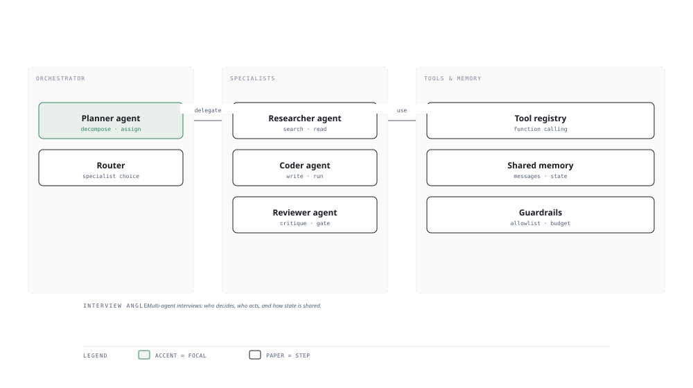

# Visual Notes — Multi-Agent Orchestration

> One diagram, the full picture. This page is meant to be glanced at before reading the chapters, and again before interviews.

# What the diagram shows

1. **Orchestrator** — A planner decomposes the task and assigns subtasks to specialists.
1. **Specialists** — Researcher, coder and reviewer agents each own one capability, using tools and shared memory.
1. **Governance** — A tool registry, shared memory and guardrails keep the swarm safe and consistent.

# Why this matters for placement

- Agent orchestration is the cutting edge of hiring for 2026 — leading edge questions land here.
- Being fluent across harness vs framework (MCP, CrewAI, AutoGen, OpenAI Agents SDK) shows depth.

# Quick revision

- Prefer a single agent with tools over orchestration unless tasks truly parallelise.
- MCP standardises how agents reach external tools/data.
- Share state explicitly; hidden coupling between agents is the #1 failure mode.
- Guardrails: budgets, allowlists and human-in-the-loop gates scale to teams.
- Evaluate the whole loop (task completion), not just single LLM outputs.

# Related chapters

- [Context engineering](02-context-engineering.md)
- [MCP protocol tools](04-mcp-protocol-tools.md)
- [CrewAI multi-agent](11-crewai-multi-agent.md)
- [A2A protocol](15-a2a-protocol.md)

---

**One-line answer for interviews:** *"A planner delegates to specialist agents, each with tools, memory and guardrails."*
