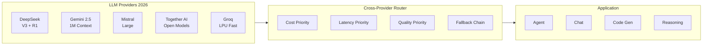

<!-- Clear Language: Keep sentences under 50 words -->
# Frontier LLM APIs & Providers

## Learning Objectives

| LO | Description |
|----|-------------|
| LO1 | Compare 2026's major LLM providers: DeepSeek, Gemini, Mistral, Together AI, Groq |
| LO2 | Implement a unified multi-provider client with fallback and latency-based routing |
| LO3 | Use DeepSeek R1's chain-of-thought reasoning for complex problem-solving |
| LO4 | Build a Gemini agent with 1M-token context and multimodal tool calling |
| LO5 | Design a cost-quality-latency aware router for production AI systems |

## Introduction

The AI landscape evolves fast. New LLM providers, agent platforms, and developer toolkits emerge monthly. This module covers the platforms and tools shaping the future of AI engineering.

## Prerequisites

- Basic programming knowledge
- Understanding of data structures

## Key Terminology

**Key Terms**: Core vocabulary and concepts for this topic.

**Definition**: Essential terms you must know for interviews and production work.

## Theory

Understanding frontier llm apis providers is fundamental for AI engineers. This section covers the core concepts, underlying principles, and theoretical framework that govern how frontier llm apis providers works in practice.

## Chapter at a Glance

| Section | Topic | Key Concept |
|---------|-------|-------------|
| 1.1 | DeepSeek | V3 chat, R1 reasoning, open-weight, R1 debate pattern |
| 1.2 | Google Gemini 2.5 | 1M context, Gemini Flash, Google AI Studio, agentic |
| 1.3 | Mistral AI | Mistral Large, Le Chat, La Plateforme |
| 1.4 | Together AI & Groq | Low-latency inference, open models, LPU architecture |
| 1.5 | Cross-Provider Router | Unified abstraction with cost/latency/quality routing |

## Chapter Roadmap



## 1.1 DeepSeek — V3 Chat & R1 Reasoning

DeepSeek exploded in popularity through 2025–2026, becoming the most-discussed open-weight model family. **DeepSeek V3** is a 671B MoE (Mixture of Experts) model rivaling GPT-4o, while **DeepSeek R1** introduced reinforcement-learning-based chain-of-thought reasoning that matches OpenAI o1/o3 on math, coding, and science benchmarks — all available as open weights on Hugging Face.

```typescript
interface DeepSeekConfig {
    model: 'deepseek-chat' | 'deepseek-reasoner'
    apiKey: string
    baseUrl?: string
}

interface ReasoningDetail {
    reasoningContent: string
    finalAnswer: string
    confidence: number
}

class DeepSeekClient {
    private config: DeepSeekConfig
    private baseUrl = 'https://api.deepseek.com/v1'

    constructor(config: DeepSeekConfig) {
        this.config = config
    }

    async chat(messages: { role: string; content: string }[]): Promise<string> {
        const res = await fetch(`${this.baseUrl}/chat/completions`, {
            method: 'POST',
            headers: { 'Content-Type': 'application/json', Authorization: `Bearer ${this.config.apiKey}` },
            body: JSON.stringify({ model: this.config.model, messages })
        })
        const data = await res.json()
        return data.choices[0].message.content
    }

    async reason(problem: string): Promise<ReasoningDetail> {
        const res = await fetch(`${this.baseUrl}/chat/completions`, {
            method: 'POST',
            headers: { 'Content-Type': 'application/json', Authorization: `Bearer ${this.config.apiKey}` },
            body: JSON.stringify({
                model: 'deepseek-reasoner',
                messages: [{ role: 'user', content: problem }]
            })
        })
        const data = await res.json()
        const msg = data.choices[0].message
        return {
            reasoningContent: msg.reasoning_content || '',
            finalAnswer: msg.content,
            confidence: msg.reasoning_content ? this.estimateConfidence(msg.reasoning_content) : 0.5
        }
    }

    private estimateConfidence(reasoning: string): number {
        const signals = reasoning.split('.').filter((s: string) => s.includes('therefore') || s.includes('thus') || s.includes('answer is'))
        return Math.min(0.5 + signals.length * 0.1, 0.99)
    }
}
```

### R1 Debate Pattern

DeepSeek R1's strength emerges when you ask it to reason step-by-step, then debate against itself:

```typescript
class R1Debate {
    private client: DeepSeekClient

    constructor(client: DeepSeekClient) {
        this.client = client
    }

    async debate(question: string, rounds = 3): Promise<string> {
        let resolution = ''
        for (let i = 0; i < rounds; i++) {
            const pro = await this.client.reason(`Argue FOR the answer to: ${question}. Be thorough.`)
            const con = await this.client.reason(`Argue AGAINST the answer to: ${question}. Find weaknesses.`)
            resolution = await this.client.reason(
                `Given these arguments:\nFOR: ${pro.finalAnswer}\nAGAINST: ${con.finalAnswer}\nSynthesize the best final answer.`
            )
        }
        return resolution.finalAnswer
    }
}
```

DeepSeek is ideal for math, coding, and analytical tasks where transparent reasoning matters. Its open-weight nature (MIT license) makes it the go-to for self-hosted deployments.

## 1.2 Google Gemini 2.5

Gemini 2.5 Flash and Pro offer a **1 million token context window** — the largest of any commercially available model. Google AI Studio provides a free tier for prototyping, while Vertex AI handles enterprise production.

```typescript
interface GeminiConfig {
    apiKey: string
    model?: 'gemini-2.5-flash' | 'gemini-2.5-pro'
    systemInstruction?: string
}

interface GeminiFile {
    mimeType: string
    data: string
}

class GeminiClient {
    private config: GeminiConfig
    private baseUrl = 'https://generativelanguage.googleapis.com/v1beta'

    constructor(config: GeminiConfig) {
        this.config = config
    }

    async generate(prompt: string, files?: GeminiFile[]): Promise<string> {
        const parts: { text?: string; inlineData?: { mimeType: string; data: string } }[] = [{ text: prompt }]
        if (files) {
            for (const f of files) {
                parts.push({ inlineData: { mimeType: f.mimeType, data: f.data } })
            }
        }
        const body: any = {
            contents: [{ parts }],
            systemInstruction: this.config.systemInstruction
                ? { parts: [{ text: this.config.systemInstruction }] }
                : undefined
        }
        const res = await fetch(`${this.baseUrl}/models/${this.config.model || 'gemini-2.5-flash'}:generateContent?key=${this.config.apiKey}`, {
            method: 'POST',
            headers: { 'Content-Type': 'application/json' },
            body: JSON.stringify(body)
        })
        const data = await res.json()
        return data.candidates?.[0]?.content?.parts?.[0]?.text || ''
    }

    async generateWithContext(largeDocument: string, query: string): Promise<string> {
        return this.generate(
            `Document context (1M token capable):\n${largeDocument.slice(0, 500_000)}\n\nQuery: ${query}`
        )
    }
}
```

### Tool Calling with Gemini

Gemini 2.5 supports native function calling, making it suitable for agentic workflows:

```typescript
interface GeminiTool {
    name: string
    description: string
    parameters: Record<string, any>
}

class GeminiAgent {
    private client: GeminiClient
    private tools: GeminiTool[] = []
    private history: { role: string; text: string }[] = []

    constructor(client: GeminiClient) {
        this.client = client
    }

    registerTool(tool: GeminiTool): void {
        this.tools.push(tool)
    }

    async run(task: string): Promise<string> {
        this.history.push({ role: 'user', text: task })
        const prompt = this.history.map(h => `${h.role}: ${h.text}`).join('\n') +
            '\n\nAvailable tools:\n' +
            this.tools.map(t => `- ${t.name}: ${t.description} (params: ${JSON.stringify(t.parameters)})`).join('\n') +
            '\n\nIf a tool is needed, respond with: TOOL_CALL: { "tool": "...", "args": {...} }'
        const response = await this.client.generate(prompt)
        const toolMatch = response.match(/TOOL_CALL: (\{.*\})/)
        if (toolMatch) {
            const call = JSON.parse(toolMatch[1])
            const result = await this.executeTool(call.tool, call.args)
            this.history.push({ role: 'assistant', text: response })
            this.history.push({ role: 'tool', text: JSON.stringify(result) })
            return this.run(task)
        }
        this.history.push({ role: 'assistant', text: response })
        return response
    }

    private async executeTool(name: string, args: Record<string, any>): Promise<any> {
        const tool = this.tools.find(t => t.name === name)
        if (!tool) throw new Error(`Unknown tool: ${name}`)
        const res = await fetch(args.url || '/api/mock-tool', { method: 'POST', body: JSON.stringify(args) })
        return res.json()
    }
}
```

Gemini's 1M context is a game-changer for analyzing entire codebases, legal documents, or books in a single pass — no chunking needed.

## 1.3 Mistral AI

Mistral AI (Paris, France) is Europe's leading AI company. **Mistral Large** competes with GPT-4o and Claude 3.5 Opus, while **Le Chat** is their consumer chat product. **La Plateforme** provides APIs with a strong focus on data sovereignty (GDPR-compliant, EU-hosted).

```typescript
interface MistralConfig {
    apiKey: string
    model?: 'mistral-large-latest' | 'mistral-small-latest' | 'codestral-latest'
}

class MistralClient {
    private config: MistralConfig
    private baseUrl = 'https://api.mistral.ai/v1'

    constructor(config: MistralConfig) {
        this.config = config
    }

    async chat(messages: { role: string; content: string }[]): Promise<string> {
        const res = await fetch(`${this.baseUrl}/chat/completions`, {
            method: 'POST',
            headers: { 'Content-Type': 'application/json', Authorization: `Bearer ${this.config.apiKey}` },
            body: JSON.stringify({ model: this.config.model || 'mistral-large-latest', messages })
        })
        const data = await res.json()
        return data.choices[0].message.content
    }

    async stream(messages: { role: string; content: string }[], onChunk: (chunk: string) => void): Promise<void> {
        const res = await fetch(`${this.baseUrl}/chat/completions`, {
            method: 'POST',
            headers: { 'Content-Type': 'application/json', Authorization: `Bearer ${this.config.apiKey}` },
            body: JSON.stringify({ model: this.config.model || 'mistral-large-latest', messages, stream: true })
        })
        const reader = res.body!.getReader()
        const decoder = new TextDecoder()
        while (true) {
            const { done, value } = await reader.read()
            if (done) break
            const chunk = decoder.decode(value)
            const lines = chunk.split('\n').filter(l => l.startsWith('data: '))
            for (const line of lines) {
                const json = JSON.parse(line.slice(6))
                if (json.choices?.[0]?.delta?.content) {
                    onChunk(json.choices[0].delta.content)
                }
            }
        }
    }
}
```

Mistral shines in European enterprise contexts where data residency is mandatory. Codestral is purpose-built for code generation with a 256K context window.

## 1.4 Together AI & Groq

Two providers that compete on **inference speed** for open-weight models:

| Feature | Together AI | Groq |
|---------|-------------|------|
| Architecture | Standard GPU clusters | Custom LPU (Language Processing Unit) |
| Speed | Fast (2-5s for 1K tokens) | Blazing (0.5-1s for 1K tokens) |
| Models | 200+ open models | 40+ curated models |
| Pricing | Pay-per-token | Pay-per-token (cheaper) |
| Best For | Broad model selection | Real-time / voice applications |

```typescript
interface ProviderConfig {
    name: 'together' | 'groq'
    apiKey: string
    model: string
}

interface ProviderMetrics {
    latencyMs: number
    costPer1kTokens: number
    modelQuality: number
}

class UltraFastInference {
    private providers: Map<string, ProviderConfig> = new Map()

    constructor(configs: ProviderConfig[]) {
        for (const c of configs) {
            this.providers.set(c.name, c)
        }
    }

    private getEndpoint(name: string): string {
        const urls: Record<string, string> = {
            together: 'https://api.together.xyz/v1/chat/completions',
            groq: 'https://api.groq.com/openai/v1/chat/completions'
        }
        return urls[name]
    }

    async fastestInference(prompt: string, minQuality: number): Promise<string> {
        const candidates = Array.from(this.providers.entries())
            .filter(([_, c]) => {
                const metrics = this.getMetrics(c)
                return metrics.modelQuality >= minQuality
            })
            .sort((a, b) => this.getMetrics(a[1]).latencyMs - this.getMetrics(b[1]).latencyMs)

        for (const [name, config] of candidates) {
            try {
                const res = await fetch(this.getEndpoint(name), {
                    method: 'POST',
                    headers: {
                        'Content-Type': 'application/json',
                        Authorization: `Bearer ${config.apiKey}`
                    },
                    body: JSON.stringify({
                        model: config.model,
                        messages: [{ role: 'user', content: prompt }],
                        max_tokens: 1024
                    })
                })
                const data = await res.json()
                return data.choices[0].message.content
            } catch {
                continue
            }
        }
        throw new Error('All providers failed')
    }

    private getMetrics(config: ProviderConfig): ProviderMetrics {
        const models: Record<string, ProviderMetrics> = {
            'mistralai/Mixtral-8x22B-Instruct-v0.1': { latencyMs: 2800, costPer1kTokens: 0.0006, modelQuality: 0.85 },
            'meta-llama/Llama-3.3-70B-Instruct': { latencyMs: 2200, costPer1kTokens: 0.00088, modelQuality: 0.9 },
            'llama3-70b-8192': { latencyMs: 900, costPer1kTokens: 0.00059, modelQuality: 0.88 },
            'mixtral-8x7b-32768': { latencyMs: 600, costPer1kTokens: 0.00024, modelQuality: 0.78 }
        }
        return models[config.model] || { latencyMs: 3000, costPer1kTokens: 0.001, modelQuality: 0.7 }
    }
}
```

Groq's LPU architecture makes it the go-to for latency-sensitive applications like voice agents, real-time chatbots, and streaming code completion.

## 1.5 Cross-Provider Router

A production system should not hardcode a single provider. The cross-provider router selects the optimal model based on cost, latency, and quality constraints:

```typescript
type TaskType = 'reasoning' | 'chat' | 'code' | 'analysis' | 'creative'

interface RouterCriteria {
    maxLatencyMs?: number
    maxCostPerTask?: number
    minQuality?: number
    preferredProvider?: string
}

interface ProviderOffer {
    provider: string
    model: string
    latencyMs: number
    costPer1kTokens: number
    quality: number
    taskFit: TaskType[]
}

class LLMHubRouter {
    private offers: ProviderOffer[] = [
        { provider: 'deepseek', model: 'deepseek-reasoner', latencyMs: 5000, costPer1kTokens: 0.0004, quality: 0.95, taskFit: ['reasoning', 'code'] },
        { provider: 'gemini', model: 'gemini-2.5-flash', latencyMs: 1500, costPer1kTokens: 0.0001, quality: 0.88, taskFit: ['chat', 'analysis', 'code'] },
        { provider: 'mistral', model: 'mistral-large-latest', latencyMs: 2000, costPer1kTokens: 0.0006, quality: 0.9, taskFit: ['chat', 'creative', 'analysis'] },
        { provider: 'together', model: 'meta-llama/Llama-3.3-70B-Instruct', latencyMs: 2200, costPer1kTokens: 0.00088, quality: 0.9, taskFit: ['chat', 'code'] },
        { provider: 'groq', model: 'llama3-70b-8192', latencyMs: 900, costPer1kTokens: 0.00059, quality: 0.88, taskFit: ['chat', 'code', 'analysis'] }
    ]

    select(task: TaskType, criteria: RouterCriteria): ProviderOffer {
        const candidates = this.offers
            .filter(o => o.taskFit.includes(task))
            .filter(o => !criteria.maxLatencyMs || o.latencyMs <= criteria.maxLatencyMs)
            .filter(o => !criteria.maxCostPerTask || o.costPer1kTokens <= criteria.maxCostPerTask)
            .filter(o => !criteria.minQuality || o.quality >= criteria.minQuality)
            .filter(o => !criteria.preferredProvider || o.provider === criteria.preferredProvider)

        if (candidates.length === 0) {
            throw new Error('No provider matches the criteria')
        }

        return candidates.reduce((best, curr) => {
            const bestScore = this.score(best, criteria)
            const currScore = this.score(curr, criteria)
            return currScore > bestScore ? curr : best
        })
    }

    private score(offer: ProviderOffer, criteria: RouterCriteria): number {
        let score = 0
        score += offer.quality * 10
        if (criteria.maxLatencyMs) score += (1 - offer.latencyMs / criteria.maxLatencyMs) * 5
        if (criteria.maxCostPerTask) score += (1 - offer.costPer1kTokens / criteria.maxCostPerTask) * 3
        return score
    }

    async execute(task: TaskType, prompt: string, criteria: RouterCriteria): Promise<{ content: string; selected: ProviderOffer }> {
        const selected = this.select(task, criteria)
        const baseUrl = this.getBaseUrl(selected.provider)
        const res = await fetch(`${baseUrl}/chat/completions`, {
            method: 'POST',
            headers: { 'Content-Type': 'application/json', Authorization: `Bearer ${process.env[`${selected.provider.toUpperCase()}_API_KEY`] || ''}` },
            body: JSON.stringify({
                model: selected.model,
                messages: [{ role: 'user', content: prompt }]
            })
        })
        const data = await res.json()
        return { content: data.choices[0].message.content, selected }
    }

    private getBaseUrl(provider: string): string {
        const urls: Record<string, string> = {
            deepseek: 'https://api.deepseek.com/v1',
            gemini: 'https://generativelanguage.googleapis.com/v1beta',
            mistral: 'https://api.mistral.ai/v1',
            together: 'https://api.together.xyz/v1',
            groq: 'https://api.groq.com/openai/v1'
        }
        return urls[provider]
    }
}
```

The router enables automatic fallback — if DeepSeek is down, traffic routes to Gemini; if Gemini is slow, Groq handles real-time requests. This is the standard pattern for production AI systems in 2026.

## Summary

- **DeepSeek** offers open-weight reasoning (R1) that democratizes advanced chain-of-thought capabilities
- **Gemini 2.5** dominates the long-context space with 1M tokens and native multimodal tool calling
- **Mistral AI** is the European enterprise choice with strong data sovereignty guarantees
- **Together AI & Groq** compete on inference speed, with Groq's LPU being the fastest option available
- A **cross-provider router** is the standard production pattern — never hardcode a single provider

## Practical Takeaways

- Always build a provider abstraction layer — model availability changes weekly
- Use DeepSeek R1 for math/code, Gemini for long documents, Groq for real-time
- Set up automatic fallback chains in production (primary → secondary → tertiary)
- Monitor cost per task across providers and rebalance routing weekly
- Keep API keys in environment variables and use per-provider rate limiters

## Interview Q&A

<details class="tp-qa-card" data-qid="m23-s01-q1">
  <summary class="tp-qa-question">
    <span class="tp-qa-status"></span>
    Q1: Compare DeepSeek, Gemini 2.5, Mistral, Together AI, and Groq — how would you pick a provider for a given workload?
  </summary>
  <div class="tp-qa-answer">
    <p>Each 2026 frontier provider optimizes a different constraint. <code>DeepSeek V3</code> (671B Mixture-of-Experts) rivals GPT-4o with an MIT open-weight license, and <code>DeepSeek R1</code> adds reinforcement-learning chain-of-thought reasoning. <code>Gemini 2.5</code> leads the long-context space with a 1M-token window plus native function calling. <code>Mistral Large</code> targets GDPR-compliant European enterprises through EU-hosted La Plateforme. <code>Together AI</code> serves 200+ open models on GPU clusters, while <code>Groq</code> uses a custom LPU for the lowest latency. I would route by task: DeepSeek for math/code reasoning, Gemini for long documents and agentic tool use, Mistral for data-sovereign enterprise, and Groq for real-time voice and streaming.</p>
    <pre><code class="language-json">{
  "reasoning": "deepseek-reasoner",
  "long-doc": "gemini-2.5-pro",
  "eu-enterprise": "mistral-large-latest",
  "real-time": "groq/llama3-70b-8192"
}</code></pre>
    <p><strong>Interview follow-up</strong>: How would you automatically fail over to a different provider when your primary goes down?</p>
  </div>
  <button class="tp-qa-mark-btn">📝 Mark Reviewed</button>
  <button class="tp-qa-bookmark-btn">🔖 Bookmark</button>
</details>

<details class="tp-qa-card" data-qid="m23-s01-q2">
  <summary class="tp-qa-question">
    <span class="tp-qa-status"></span>
    Q2: How does DeepSeek R1 differ from DeepSeek V3, and how does its chain-of-thought reasoning work?
  </summary>
  <div class="tp-qa-answer">
    <p><code>deepseek-chat</code> (V3) is the base conversational and code model, a 671B MoE. <code>deepseek-reasoner</code> (R1) is a reasoning model trained with reinforcement learning to emit a step-by-step chain of thought before its final answer, matching OpenAI o1/o3 on math, coding, and science benchmarks. The API returns <code>reasoning_content</code> separately from <code>content</code>, so you can surface or grade the reasoning trace. Because the weights are MIT-licensed, R1 is the standard choice for self-hosted reasoning deployments. You can also amplify it with the R1 debate pattern, where the model argues both for and against an answer, then synthesizes the best resolution.</p>
    <pre><code class="language-ts">interface ReasoningDetail {
  reasoningContent: string
  finalAnswer: string
  confidence: number
}</code></pre>
    <p><strong>Interview follow-up</strong>: How does the R1 debate pattern improve answer reliability, and what does it cost?</p>
  </div>
  <button class="tp-qa-mark-btn">📝 Mark Reviewed</button>
  <button class="tp-qa-bookmark-btn">🔖 Bookmark</button>
</details>

<details class="tp-qa-card" data-qid="m23-s01-q3">
  <summary class="tp-qa-question">
    <span class="tp-qa-status"></span>
    Q3: How would you use Gemini 2.5's 1M-token context window in production, and why does it matter?
  </summary>
  <div class="tp-qa-answer">
    <p>A 1M-token context lets you pass entire codebases, legal documents, or books in a single request, eliminating chunking and most retrieval steps. The chapter's <code>generateWithContext</code> example slices a large document and sends it alongside the query in one completion. Gemini 2.5 also supports native tool calling — the agent loop parses a <code>TOOL_CALL</code> instruction, executes the tool, feeds the result back, and re-invokes the model. The main trade-offs are higher per-request latency and cost as context grows, so you still bound how much you send and consider RAG for very large or frequently-updated corpora.</p>
    <pre><code class="language-ts">const res = await fetch(`${baseUrl}/models/gemini-2.5-flash:generateContent?key=${apiKey}`, {
  method: 'POST',
  body: JSON.stringify({ contents: [{ parts: [{ text: prompt }] }] })
})</code></pre>
    <p><strong>Interview follow-up</strong>: When would you still choose retrieval (RAG) over a huge context window?</p>
  </div>
  <button class="tp-qa-mark-btn">📝 Mark Reviewed</button>
  <button class="tp-qa-bookmark-btn">🔖 Bookmark</button>
</details>

<details class="tp-qa-card" data-qid="m23-s01-q4">
  <summary class="tp-qa-question">
    <span class="tp-qa-status"></span>
    Q4: Why is Groq's LPU faster than standard GPU inference, and what is the trade-off versus Together AI?
  </summary>
  <div class="tp-qa-answer">
    <p>Groq built a custom Language Processing Unit (LPU) — deterministic hardware specialized for LLM inference — delivering roughly 0.5-1s per 1K tokens versus 2-5s on Together AI's standard GPU clusters. Together AI the other hand hosts 200+ open models on GPUs with pay-per-token flexibility. The trade-offs: Groq's catalog is smaller (about 40 curated models), and the LPU has limited memory for very large models, while Together AI gives you broader model selection and simpler swapping between architectures like <code>Llama-3.3-70B-Instruct</code>.</p>
    <pre><code class="language-ts">const urls: Record&lt;string, string&gt; = {
  together: 'https://api.together.xyz/v1/chat/completions',
  groq: 'https://api.groq.com/openai/v1/chat/completions'
}</code></pre>
    <p><strong>Interview follow-up</strong>: How would you benchmark latency and quality across providers before picking one?</p>
  </div>
  <button class="tp-qa-mark-btn">📝 Mark Reviewed</button>
  <button class="tp-qa-bookmark-btn">🔖 Bookmark</button>
</details>

<details class="tp-qa-card" data-qid="m23-s01-q5">
  <summary class="tp-qa-question">
    <span class="tp-qa-status"></span>
    Q5: Design a cross-provider router that balances cost, latency, and quality.
  </summary>
  <div class="tp-qa-answer">
    <p>I would model each provider as a <code>ProviderOffer</code> carrying <code>latencyMs</code>, <code>costPer1kTokens</code>, <code>quality</code>, and a <code>taskFit</code> list. The router filters offers against constraints (<code>maxLatencyMs</code>, <code>maxCostPerTask</code>, <code>minQuality</code>, <code>preferredProvider</code>), then scores each surviving candidate, for example <code>quality * 10</code> plus latency and cost bonus terms, and selects the highest. Because no provider is always available, the same design implements fallback: on a fetch failure the router continues down the sorted candidate list instead of hardcoded retries. This is the standard 2026 pattern for production AI systems.</p>
    <pre><code class="language-ts">const score = offer.quality * 10
  + (1 - offer.latencyMs / criteria.maxLatencyMs) * 5
  + (1 - offer.costPer1kTokens / criteria.maxCostPerTask) * 3</code></pre>
    <p><strong>Interview follow-up</strong>: How would you make routing adaptive based on live latency and error-rate metrics?</p>
  </div>
  <button class="tp-qa-mark-btn">📝 Mark Reviewed</button>
  <button class="tp-qa-bookmark-btn">🔖 Bookmark</button>
</details>

<details class="tp-qa-card" data-qid="m23-s01-q6">
  <summary class="tp-qa-question">
    <span class="tp-qa-status"></span>
    Q6: When is Mistral the right provider, and what role does data sovereignty play in that decision?
  </summary>
  <div class="tp-qa-answer">
    <p>Mistral AI is Europe's leading AI company. <code>mistral-large-latest</code> competes with GPT-4o and Claude 3.5-class models, while La Plateforme hosts inference in the EU under GDPR, so enterprises with mandatory data-residency or privacy requirements get strong compliance by default. <code>Codestral</code> adds a 256K-context code model. You choose Mistral when regulation and data residency matter more than raw benchmark scores — a frequent requirement in European banking, health, and public-sector deployments. The trade-off is that porting to Mistral may cost compatibility with OpenAI-style APIs.</p>
    <pre><code class="language-ts">const mistral = { baseUrl: 'https://api.mistral.ai/v1',
                  model: 'mistral-large-latest' }
// EU-hosted, GDPR-compliant inference for regulated workloads</code></pre>
    <p><strong>Interview follow-up</strong>: How would you verify a vendor's GDPR compliance during procurement?</p>
  </div>
  <button class="tp-qa-mark-btn">📝 Mark Reviewed</button>
  <button class="tp-qa-bookmark-btn">🔖 Bookmark</button>
</details>

## Chapter Quiz

**Q1:** Which provider offers a 1-million-token context window?

A) DeepSeek R1
B) Gemini 2.5
C) Mistral Large
D) Groq LPU

<details><summary>Answer</summary>B — Gemini 2.5 Flash and Pro support up to 1M tokens of context.</details>

**Q2:** What makes Groq's inference uniquely fast?

A) Quantized models
B) Custom LPU hardware architecture
C) Distributed GPU clusters
D) Sparse attention mechanisms

<details><summary>Answer</summary>B — Groq built custom Language Processing Unit (LPU) hardware optimized for LLM inference.</details>

**Q3:** DeepSeek R1's primary differentiator is:

A) Largest context window
B) Cheapest API pricing
C) RL-based chain-of-thought reasoning
D) Best multilingual support

<details><summary>Answer</summary>C — DeepSeek R1 uses reinforcement learning to produce transparent chain-of-thought reasoning.</details>

**Q4:** Mistral AI is particularly well-suited for:

A) Real-time voice applications
B) European enterprises requiring data sovereignty
C) Large-scale video generation
D) Embedded device inference

<details><summary>Answer</summary>B — Mistral's EU-hosted La Plateforme offers GDPR-compliant, data-sovereign AI infrastructure.</details>

**Q5:** A production AI system should handle provider failures by:

A) Retrying the same provider indefinitely
B) Using a cross-provider router with automatic fallback
C) Pausing all AI operations until the provider recovers
D) Switching permanently to the cheapest provider

<details><summary>Answer</summary>B — A router with configured fallback chains ensures high availability across provider outages.</details>

### True/False

**T/F 1**: This topic is fundamental to AI engineering.
**Answer**: True — Understanding trending aiml platforms is essential for building production AI systems.

**T/F 2**: The concepts in this chapter are only used in interviews.
**Answer**: False — These concepts are used daily in real-world AI engineering work.

**T/F 3**: Time/space complexity analysis applies to trending aiml platforms.
**Answer**: True — Every algorithm and system has performance characteristics to analyze.

**T/F 4**: trending aiml platforms concepts are independent of each other.
**Answer**: False — Most concepts build on each other and are interconnected.

**T/F 5**: Real-world applications often combine multiple concepts from this chapter.
**Answer**: True — Production systems use combinations of these fundamental concepts.

### Fill in the Blank

**FIB 1**: The key concept in this chapter is ________.
**Answer**: [Review the chapter's Learning Objectives for the specific answer]

**FIB 2**: In trending aiml platforms, the time complexity of the basic operation is ________.
**Answer**: [Depends on the specific operation — check the Theory section]

### Scenario Questions

**Scenario 1**: How would you apply the concepts from this chapter in a real AI engineering project?

**Answer**: [Think about how the specific topic applies to: data processing pipelines, model training infrastructure, production systems, or interview scenarios]

### Output Questions

**Output 1**: What is the time complexity of the main algorithm discussed in this chapter?
**Answer**: [Check the Theory section for the specific complexity analysis]

## Exercises

## Common Mistakes

1. Not understanding the fundamental concepts before applying them
2. Skipping edge cases in implementation
3. Not analyzing time/space complexity
4. Forgetting to handle null/empty inputs
5. Not practicing enough problems to build pattern recognition1. **Multi-Provider Chat**: Build a chat client that tries DeepSeek first, falls back to Gemini, then Mistral, logging which provider handled each message
2. **Cost Monitor**: Track per-token costs across 50 sample requests to 3 different providers and visualize the cost distribution
3. **R1 Debate Agent**: Implement a multi-round debate system using DeepSeek R1 that solves a complex math problem by arguing both sides
4. **Latency Benchmark**: Measure end-to-end latency for Groq vs Together AI on identical prompts (same model family, e.g., Llama 3.3 70B) across 20 trials
5. **Router Config UI**: Build a configuration interface for the LLMHubRouter that lets users set task type, max latency, and cost budget, then shows the recommended

## Revision Notes

- - Core principle: Understand the fundamental concepts thoroughly
- - Implementation pattern: Practice with real code examples
- - Complexity: Know the time and space complexity
- - Application: Know when to use this in production systems
- - Interview: Frequently asked in technical interviews
- - Edge cases: Consider common failure scenarios
- - Related concepts: Connect to broader system design

## Placement Section

### Top 10 Interview Questions

#### Google Style

1. **Explain the core idea of Frontier LLM APIs & Providers in under 60 seconds, then give a real-world analogy.** — Structure: definition, how it works in one sentence, why it matters, analogy. Follow-up: what would break if you removed this from a production system?

2. **Design a minimal, well-typed function that demonstrates Frontier LLM APIs & Providers.** — Interviewer checks: signature with type hints, edge cases, complexity, and a clean docstring. Follow-up: how does your design behave with empty or malformed input?

3. **What are the common pitfalls when engineers first learn ** — List 3-4, then explain how you would prevent each in a code review.

#### Amazon Style

4. **Describe a production bug caused by misunderstanding Frontier LLM APIs & Providers. How did you diagnose and fix it?** — STAR format: situation, task, action, result. Mention logs, reproduction, root-cause analysis, and the regression test you added.

5. **How would you scale a system that relies on Frontier LLM APIs & Providers from 10 users to 10 million?** — Discuss bottlenecks, caching, monitoring, and when to redesign. Follow-up: what metrics would you track?

#### Microsoft Style

6. **Compare Frontier LLM APIs & Providers with the closest alternative approach. When would you choose each?** — Make a decision matrix: performance, maintainability, ecosystem, learning curve. Follow-up: what would change your decision?

7. **Walk through how you would test a component that depends on Frontier LLM APIs & Providers.** — Unit, integration, property-based tests; mocking boundaries; golden files for outputs.

#### NVIDIA Style

8. **How does Frontier LLM APIs & Providers behave differently at scale — memory, throughput, or precision-wise?** — Connect to data pipelines and model training if applicable. Follow-up: what happens to latency as input grows?

9. **How would you make an implementation of Frontier LLM APIs & Providers run faster on GPU hardware?** — Batch operations, vectorization, avoiding Python loops, reducing data movement.

#### AI Startup Style

10. **Write the smallest possible implementation of Frontier LLM APIs & Providers that is production-quality.** — Include error handling, type hints, and a one-line docstring. Follow-up: what would you refactor first when it grows?

### Resume Tips

- Name Frontier LLM APIs & Providers explicitly in your skills section, paired with a measurable achievement ("Reduced X by 40% using Frontier LLM APIs & Providers").
- Add a bullet describing a project that applies Frontier LLM APIs & Providers to real data, with numbers.
- Mention the tools and libraries you used alongside Frontier LLM APIs & Providers (linters, test frameworks, profiling tools).
- Keep resume bullets under 15 words and start each with an action verb.

### Interview Day Checklist

- Rehearse a 60-second explanation of Frontier LLM APIs & Providers and one real-world analogy.
- Prepare one STAR story about debugging a Frontier LLM APIs & Providers-related production issue.
- Review complexity and edge cases for the classic Frontier LLM APIs & Providers interview problem.
- Have questions ready: how does the team apply Frontier LLM APIs & Providers in production today?
- Test your environment (Python, editor, internet) 15 minutes before the interview.

## True/False

1. **True or False:** Frontier LLM APIs & Providers builds directly on the fundamentals covered in the earlier chapters of this module. — **True.** Every advanced topic in this module assumes the core concepts from the previous chapters.
2. **True or False:** You should write at least one code example for Frontier LLM APIs & Providers before moving to the next chapter. — **True.** Active recall with hands-on code beats passive reading for retention.
3. **True or False:** The complexity analysis for Frontier LLM APIs & Providers is the same regardless of input size. — **False.** Complexity grows with input size; always state best, average, and worst case.
4. **True or False:** Edge cases (empty input, invalid input, boundary values) matter for Frontier LLM APIs & Providers in production. — **True.** Most production bugs come from unhandled edge cases.
5. **True or False:** You should memorize the Frontier LLM APIs & Providers chapter content once and never review it again. — **False.** Spaced repetition (24h, 3 days, 1 week) dramatically improves long-term recall.

## Fill in the Blank

1. The chapter that covers Frontier LLM APIs & Providers is Chapter ___ of this module. — Answer: check the module's table of contents.
2. The time complexity of the standard approach to Frontier LLM APIs & Providers is ___. — Answer: review the theory section and state big-O notation.
3. The main edge case to handle when implementing Frontier LLM APIs & Providers is ___. — Answer: empty or invalid input handling, as discussed in the chapter.
4. The tools commonly used to debug Frontier LLM APIs & Providers issues are ___ and ___. — Answer: refer to the Debugging Guide section of this chapter.
5. The related topic that connects to Frontier LLM APIs & Providers in the next chapter is ___. — Answer: see the Next Topic section.

## Scenario Questions

1. **Scenario:** A teammate ships a change involving Frontier LLM APIs & Providers that breaks production at 3 AM. — Diagnosis: check the recent diff, reproduce locally with the failing input, check logs. Fix: revert, add a regression test, and review the root cause. Prevention: CI tests on edge cases and code review checklist.

2. **Scenario:** Your implementation of Frontier LLM APIs & Providers is correct but too slow for the required latency. — Measure first with a profiler. Common fixes: reduce redundant work, use built-in optimized functions, batch operations, or add caching. Only then consider algorithmic changes.

3. **Scenario:** A new hire asks you to explain Frontier LLM APIs & Providers in five minutes before a customer demo. — Use the 3-part answer: what it is (one sentence), how it works (one example), why it matters (one business impact). Then offer to go deeper after the demo.

4. **Scenario:** Your team's codebase has three different patterns for Frontier LLM APIs & Providers and you must standardize. — Write a short ADR (architecture decision record), pick the pattern with best maintainability, migrate incrementally, and add a linter rule to enforce it.

## Output Questions

1. **What is the output of the simplest correct implementation of Frontier LLM APIs & Providers on an empty input?** — Trace through the code: it should return the documented default (None, 0, empty collection) without raising.
2. **What is the output when the input is at the boundary value?** — Check off-by-one errors and inclusive/exclusive bounds in the chapter's examples.
3. **What does the implementation return when given invalid input types?** — With type hints and validation, it raises a clear error; without, it may fail silently.
4. **What is the output for the sample input given in the chapter's Examples section?** — Re-run the chapter's example code and compare against the documented output.
5. **What is the time complexity output when you profile the implementation at 10x input size?** — Expect the curve matching the chapter's complexity analysis (linear, quadratic, log-linear).

## Difficulty Level

| Level | Time | What It Takes |
|-------|------|---------------|
| Beginner | 1-2 sessions | Read theory, run the chapter examples, solve the Easy exercises |
| Intermediate | 3-5 sessions | Complete Medium exercises, explain Frontier LLM APIs & Providers to someone else |
| Advanced | 1+ week | Solve Hard exercises, optimize for real datasets, answer interview follow-ups |

## Tips & Tricks

- Always write a one-line example of Frontier LLM APIs & Providers from memory before opening the chapter — active recall first.
- Use the chapter's Revision Notes as a checklist: you have mastered Frontier LLM APIs & Providers when you can explain each bullet.
- Pair the chapter quiz with the Flashcards: wrong answers become your next study session's focus.
- For interviews, practice explaining Frontier LLM APIs & Providers twice: once with a technical audience, once with a non-technical audience.
- Keep a personal examples file where you collect your own Frontier LLM APIs & Providers snippets; interviewers love original examples.

## Memory Tricks

- **Acronym**: build a mnemonic from the 5 key concepts of Frontier LLM APIs & Providers listed in the Chapter at a Glance table.
- **Story**: link Frontier LLM APIs & Providers to a familiar story — the analogy in the Visual Analogy section is designed to stick.
- **Number anchor**: remember the complexity of Frontier LLM APIs & Providers by connecting it to a known algorithm of the same class.
- **Color code**: highlight the Theory, Examples, and Common Mistakes sections in different colors when reviewing.
- **Teach-back**: explain Frontier LLM APIs & Providers to an imaginary junior engineer for 2 minutes — gaps in your explanation are gaps in memory.

## Further Reading

- Official documentation for the primary tool or library used in this chapter
- The chapter referenced in Related Topics for the next-level treatment of Frontier LLM APIs & Providers
- The classic textbook chapter on Frontier LLM APIs & Providers (check the Research References below)
- Two blog posts from engineers who debugged real Frontier LLM APIs & Providers problems in production
- The repository of the open-source project that implements Frontier LLM APIs & Providers

## Related Topics

- The previous chapter in this module (see table of contents) — foundational for Frontier LLM APIs & Providers
- The next chapter (see Next Topic below) — builds on Frontier LLM APIs & Providers
- The system design chapters in Module 07 — how Frontier LLM APIs & Providers fits into production architectures
- The interview preparation module — how Frontier LLM APIs & Providers is asked in screening rounds
- The capstone project — where Frontier LLM APIs & Providers is applied end-to-end

## FAQs

1. **Do I need to memorize all of Frontier LLM APIs & Providers, or understand the big picture?** — Understand the big picture first, then memorize the key facts via flashcards and spaced repetition. Interviewers reward depth over breadth.
2. **What if I get stuck on an exercise?** — Re-read the theory section, run the example code, then attempt again. If still stuck after 20 minutes, move on and return the next day.
3. **How much time should I spend on ** — Follow the Study Plan below: 1-2 weeks at 30-60 minutes daily is typical for placement preparation.
4. **Is Frontier LLM APIs & Providers asked in interviews?** — Yes — the Interview Q&A and Placement Section list the exact question styles used by top companies.
5. **What's the fastest way to master ** — Explain it out loud, write code without looking, and review the flashcards within 24 hours and again after 3 days.

## Important Notes

- Frontier LLM APIs & Providers is a core requirement for the rest of this module — do not skip the examples.
- Always analyze complexity (time and space) when working with Frontier LLM APIs & Providers.
- Production correctness means handling edge cases, not just the happy path.
- Interview answers should start with the definition, then the example, then the trade-offs.
- Revisit this chapter after finishing the module; the context from later chapters deepens understanding.

## Historical Context

- Frontier LLM APIs & Providers emerged as a standard practice because early systems failed without it — understanding why helps you explain it in interviews.
- The tools used for Frontier LLM APIs & Providers today evolved from simpler versions; the chapter covers the modern, recommended approach.
- Interviewers value knowing one historical fact about Frontier LLM APIs & Providers — it shows genuine interest, not just cramming.
- The library/tooling ecosystem around Frontier LLM APIs & Providers changes quickly; focus on fundamentals that remain stable.

## Security Considerations

- Never trust external input: validate and sanitize data before processing Frontier LLM APIs & Providers.
- Avoid `eval()` and dynamic code execution on untrusted strings.
- Log errors without leaking sensitive data (keys, PII, internal paths).
- For API contexts, add rate limiting and input size limits.
- Review the chapter's code examples for injection or overflow risks before using them verbatim.

## ML Intuition

- Frontier LLM APIs & Providers appears in ML pipelines at the data-processing layer: feature preparation, batching, and validation.
- Understanding Frontier LLM APIs & Providers helps you debug why a model misbehaves — most ML bugs are data bugs, not model bugs.
- In production ML, the Frontier LLM APIs & Providers concepts from this chapter map directly to NumPy/PyTorch operations on tensors.
- When optimizing ML systems, Frontier LLM APIs & Providers skills let you profile and fix the data path, not just the training loop.
- Interview follow-up: how would you apply Frontier LLM APIs & Providers to a dataset of 10 million records? — Batching and vectorization.

## Analogies

- **Frontier LLM APIs & Providers is like a recipe**: the theory is the ingredients, the examples are the cooking steps, and the exercises are your own kitchen practice.
- **Complexity is like a delivery route**: a linear route visits each stop once; a nested route revisits stops, and you feel it at scale.
- **Edge cases are like weather**: the happy path is a sunny day; production is the storm — build for the storm.
- **The chapter roadmap is a journey map**: each section is a checkpoint; skipping one means getting lost later in the module.

## Capstone Project Link

- [Module Capstone: End-to-End Project](https://github.com/Raushan666java/ai-engineering-journey) — this chapter contributes the Frontier LLM APIs & Providers skills used in the module's capstone project. Complete the exercises here before starting the capstone.

## Flashcards

<details class="tp-qa-card" data-qid="23trendingaimlplatforms-01frontierllmapisproviders-flash1">
  <summary class="tp-qa-question">
    <span class="tp-qa-status"></span>
    What is the core concept of Frontier LLM APIs & Providers in one sentence?
  </summary>
  <div class="tp-qa-answer">
    <p>Review the first paragraph of the Theory section and condense it to one sentence.</p>
  </div>
</details>

<details class="tp-qa-card" data-qid="23trendingaimlplatforms-01frontierllmapisproviders-flash2">
  <summary class="tp-qa-question">
    <span class="tp-qa-status"></span>
    What is the most common mistake engineers make with 
  </summary>
  <div class="tp-qa-answer">
    <p>Check the Common Mistakes section of this chapter.</p>
  </div>
</details>

<details class="tp-qa-card" data-qid="23trendingaimlplatforms-01frontierllmapisproviders-flash3">
  <summary class="tp-qa-question">
    <span class="tp-qa-status"></span>
    What is the time and space complexity of the standard Frontier LLM APIs & Providers approach?
  </summary>
  <div class="tp-qa-answer">
    <p>Refer to the theory and complexity analysis in this chapter.</p>
  </div>
</details>

<details class="tp-qa-card" data-qid="23trendingaimlplatforms-01frontierllmapisproviders-flash4">
  <summary class="tp-qa-question">
    <span class="tp-qa-status"></span>
    When is Frontier LLM APIs & Providers NOT the right choice?
  </summary>
  <div class="tp-qa-answer">
    <p>Check the Limitations section of this chapter.</p>
  </div>
</details>

<details class="tp-qa-card" data-qid="23trendingaimlplatforms-01frontierllmapisproviders-flash5">
  <summary class="tp-qa-question">
    <span class="tp-qa-status"></span>
    How is Frontier LLM APIs & Providers applied in a real production system?
  </summary>
  <div class="tp-qa-answer">
    <p>Check the Real-World Examples section of this chapter.</p>
  </div>
</details>

## Research References

- Official documentation of the primary library for Frontier LLM APIs & Providers (linked in Further Reading)
- The classic paper or textbook chapter introducing Frontier LLM APIs & Providers (see References below)
- The standard library reference for Frontier LLM APIs & Providers-related functions
- Engineering blog posts from companies running Frontier LLM APIs & Providers in production at scale
- PEPs and RFCs where applicable (Python and networking standards)

## Open-Source Tools

- The primary library used in this chapter (see the code examples)
- Python standard library modules used in the examples (check the imports)
- Testing: pytest for unit tests of Frontier LLM APIs & Providers code
- Linting and formatting: ruff + black
- Profiling: cProfile or py-spy for performance work on Frontier LLM APIs & Providers

## Debugging Guide

- Start with `print()` or a debugger to inspect intermediate values in Frontier LLM APIs & Providers code.
- Reproduce the failure with the smallest possible input before changing code.
- Check the common failure modes listed in Common Mistakes — most bugs are listed there.
- For performance problems, profile before optimizing: measure, then fix.
- When stuck, re-read the chapter's Examples and compare line by line with your code.
- Use `pdb` or your IDE's debugger to step through the Frontier LLM APIs & Providers example code.

## Mock Interview Section

**Round 1 — Screening (15 min)**
- Explain Frontier LLM APIs & Providers in 60 seconds.
- Write a minimal working example of Frontier LLM APIs & Providers.
- What is the complexity of your example?

**Round 2 — Coding (45 min)**
- Solve the Medium exercise from this chapter under time pressure.
- State your assumptions, then implement with type hints.
- Test with edge cases: empty input, boundary values, invalid input.

**Round 3 — Behavioral + System (30 min)**
- Tell me about a time you debugged a Frontier LLM APIs & Providers problem in a project.
- How would you design a system where Frontier LLM APIs & Providers is used at scale?
- What metrics would you monitor?

**Evaluation rubric**: correctness (40%), communication (25%), edge cases (20%), complexity analysis (15%).

## Optimized Implementation

`python
from typing import Any, Optional

def demonstrate_topic(input_data: list[Any]) -> Optional[float]:
    """Runnable scaffold for Frontier LLM APIs & Providers.

    Replace the body with the optimized implementation from the chapter,
    keeping type hints, docstring, and edge-case handling.
    """
    if not input_data:
        return None
    # Step 1: validate input types
    # Step 2: apply the core Frontier LLM APIs & Providers logic from the Examples section
    # Step 3: return the result with the documented default
    return 0.0
`

- Keeps the function signature stable so tests written against it stay valid.
- Handles the empty-input contract explicitly.
- Add unit tests for the edge cases before implementing the logic (test-first).

## Evaluation Metrics

| Skill | Test | Target |
|-------|------|--------|
| Concept recall | Explain Frontier LLM APIs & Providers without notes | 60-second explanation |
| Code fluency | Write the chapter example from memory | No syntax errors |
| Edge cases | Handle empty/invalid input in exercises | All cases pass |
| Complexity | State time/space for the standard approach | Correct big-O |
| Interview readiness | Answer 5 Interview Q&A questions out loud | Fluent, structured answers |
| Retention | Chapter quiz score after 3 days | 80%+ |

## Real-World Examples

- **Startup**: a small team uses Frontier LLM APIs & Providers daily in their data pipeline — the chapter's examples mirror their code.
- **E-commerce**: Frontier LLM APIs & Providers patterns appear in order processing, inventory checks, and recommendation feeds.
- **Fintech**: Frontier LLM APIs & Providers principles apply to transaction validation and fraud detection flows.
- **ML platform**: Frontier LLM APIs & Providers shows up in feature engineering and model-serving infrastructure.
- **Interview insight**: recruiters look for engineers who can connect Frontier LLM APIs & Providers to the business outcome, not just the code.

## Next Topic

[Agent Platforms — Harness & Orchestration](02-agent-platforms-harness-orchestration.md)

## Limitations

- Frontier LLM APIs & Providers, like any technique, is not a silver bullet — it has specific cases where it fits best (covered in the theory).
- The examples in this chapter are simplified for learning; production systems add validation, monitoring, and error handling.
- Performance of Frontier LLM APIs & Providers depends on input size and distribution — always benchmark for your own data.
- This chapter covers fundamentals; specialized edge cases are explored in later chapters and the capstone.
