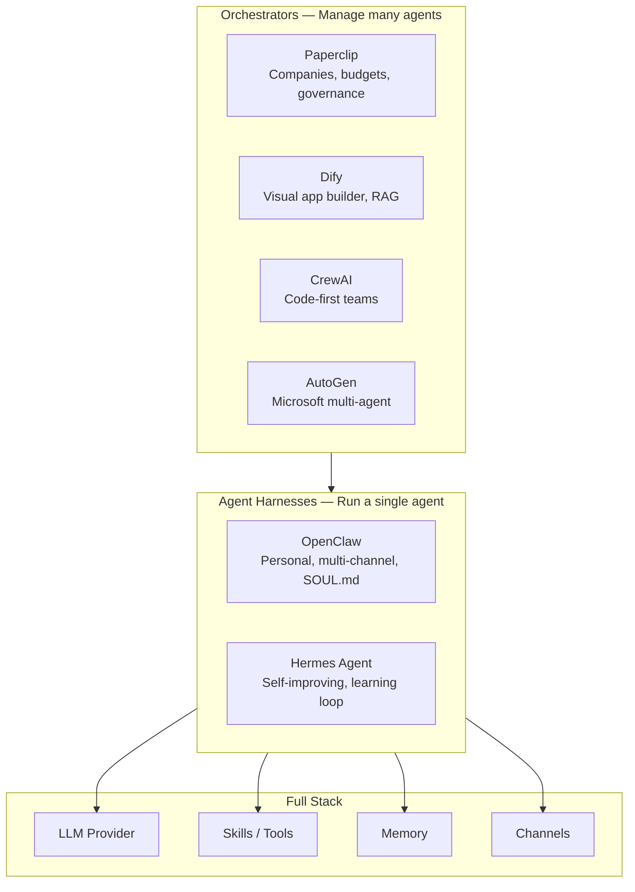

<!-- Clear Language: Keep sentences under 50 words -->
# Agent Platforms — Harness & Orchestration

## Learning Objectives

| LO | Description |
|----|-------------|
| LO1 | Distinguish agent harnesses (OpenClaw, Hermes) from orchestrators (Paperclip, Dify, CrewAI, AutoGen) |
| LO2 | Implement a custom OpenClaw skill with cron scheduling, tools, and persistent memory |
| LO3 | Use Hermes Agent's self-improvement loop to auto-create skills from experience |
| LO4 | Orchestrate a multi-agent company in Paperclip with org charts, budgets, and goal alignment |
| LO5 | Compare Dify, CrewAI, and AutoGen for no-code vs code-first multi-agent patterns |

## Introduction

The AI landscape evolves fast. New LLM providers, agent platforms, and developer toolkits emerge monthly. This module covers the platforms and tools shaping the future of AI engineering.

## Prerequisites

- Basic programming knowledge
- Understanding of data structures

## Key Terminology

**Key Terms**: Core vocabulary and concepts for this topic.

**Definition**: Essential terms you must know for interviews and production work.

## Theory

Understanding agent platforms harness orchestration is fundamental for AI engineers. This section covers the core concepts, underlying principles, and theoretical framework that govern how agent platforms harness orchestration works in practice.

## Chapter at a Glance

| Section | Topic | Key Concept |
|---------|-------|-------------|
| 2.1 | OpenClaw | Personal agent harness, SOUL.md, ClawHub, heartbeat cron |
| 2.2 | Hermes Agent | Self-improving, FTS5 memory, subagents, Desktop GUI |
| 2.3 | Paperclip | "Agent company", org charts, budgets, governance |
| 2.4 | Dify | Visual LLM app builder, RAG pipeline, agent workflow |
| 2.5 | CrewAI, AutoGen & Comparison | Code-first multi-agent frameworks |

## Chapter Roadmap



## 2.1 OpenClaw — Personal AI Agent Harness

OpenClaw (346k+ GitHub stars, MIT license, created by Peter Steinberger) is the most-starred open-source project of 2026. It started as Clawdbot in late 2025 and became a phenomenon — a personal AI agent that lives in your messaging apps and executes tasks autonomously.

**Philosophy**: OpenClaw is an **employee** — a single agent that connects to WhatsApp, Telegram, Signal, Slack, Discord, and iMessage through a unified gateway. It maintains persistent memory (MEMORY.md), runs skills on a heartbeat cron, and stores everything as plain Markdown files on your disk.

```typescript
interface SkillConfig {
    name: string
    description: string
    tools: ToolDef[]
    cron?: string
    memoryScope: 'session' | 'persistent'
}

interface ToolDef {
    name: string
    description: string
    exec: 'shell' | 'http' | 'file' | 'script'
    parameters: Record<string, string>
}

interface SkillContext {
    memory: string[]
    conversation: { role: string; content: string }[]
    lastRun: Date | null
}

class OpenClawSkill {
    protected config: SkillConfig
    protected context: SkillContext = { memory: [], conversation: [], lastRun: null }

    constructor(config: SkillConfig) {
        this.config = config
    }

    getName(): string { return this.config.name }

    shouldRun(lastHeartbeat: Date): boolean {
        if (!this.config.cron) return false
        const parts = this.config.cron.split(' ')
        if (parts.length < 2) return false
        const intervalMin = parseInt(parts[0]) || 60
        const elapsed = (Date.now() - lastHeartbeat.getTime()) / 60000
        return elapsed >= intervalMin
    }

    async execute(input: string): Promise<string> {
        this.context.conversation.push({ role: 'user', content: input })
        const result = await this.run(input)
        this.context.conversation.push({ role: 'assistant', content: result })
        this.context.lastRun = new Date()
        if (this.config.memoryScope === 'persistent') {
            await this.writeMemory(result)
        }
        return result
    }

    protected async run(_input: string): Promise<string> {
        throw new Error('Subclasses must implement run()')
    }

    protected async readMemory(): Promise<string[]> {
        try {
            const data = localStorage.getItem(`claw_memory_${this.config.name}`)
            return data ? JSON.parse(data) : []
        } catch { return [] }
    }

    protected async writeMemory(entry: string): Promise<void> {
        this.context.memory.push(entry)
        localStorage.setItem(`claw_memory_${this.config.name}`, JSON.stringify(this.context.memory.slice(-100)))
    }

    getToolDefs(): ToolDef[] { return this.config.tools }
}
```

### Concrete Skill: Morning Briefing

A typical OpenClaw use case — a skill that runs on a cron heartbeat:

```typescript
class MorningBriefingSkill extends OpenClawSkill {
    constructor() {
        super({
            name: 'morning-briefing',
            description: 'Fetches weather, calendar events, and top news each morning',
            cron: '1440 */6 * * *',
            memoryScope: 'persistent',
            tools: [
                { name: 'get_weather', description: 'Get current weather', exec: 'http', parameters: { city: 'string' } },
                { name: 'get_calendar', description: 'Get today\'s calendar events', exec: 'http', parameters: {} },
                { name: 'get_headlines', description: 'Get top news headlines', exec: 'http', parameters: { category: 'string' } }
            ]
        })
    }

    async run(input: string): Promise<string> {
        const previousBriefings = await this.readMemory()
        const weather = await this.callTool('get_weather', { city: 'San Francisco' })
        const calendar = await this.callTool('get_calendar', {})
        const headlines = await this.callTool('get_headlines', { category: 'technology' })
        const summary = [
            `☀️ **Morning Briefing**`,
            `Weather: ${weather}`,
            `📅 Calendar: ${calendar}`,
            `📰 Tech News: ${headlines}`,
            previousBriefings.length > 0 ? `📊 Previous briefings: ${previousBriefings.length}` : ''
        ].filter(Boolean).join('\n\n')
        return summary
    }

    private async callTool(name: string, args: Record<string, any>): Promise<string> {
        const tool = this.config.tools.find(t => t.name === name)
        if (!tool) return `Unknown tool: ${name}`
        const url = `https://api.mock-tool.com/${name}?${new URLSearchParams(args).toString()}`
        try {
            const res = await fetch(url)
            return await res.text()
        } catch {
            return `[${name} returned mock data]`
        }
    }
}
```

The skill registers with the OpenClaw gateway and runs automatically on its cron schedule. All memory is persisted as Markdown on disk — zero cloud dependency.

## 2.2 Hermes Agent — Self-Improving Agent

Hermes Agent (217k+ stars, Nous Research) is the **self-improving agent**. Unlike OpenClaw's static skills, Hermes has a built-in learning loop — it creates new skills from experience, improves existing skills during use, and persists knowledge across sessions via FTS5 search.

```typescript
interface HermesSkill {
    name: string
    version: number
    code: string
    usageCount: number
    successRate: number
    lastImproved: Date
}

interface HermesMemory {
    sessionSummary: string
    keyFacts: string[]
    userPreferences: Record<string, any>
    skillRegistry: HermesSkill[]
}

class HermesAgentClient {
    private skills: Map<string, HermesSkill> = new Map()
    private memory: HermesMemory = { sessionSummary: '', keyFacts: [], userPreferences: {}, skillRegistry: [] }
    private learningEnabled = true

    constructor() {
        this.loadMemory()
    }

    private loadMemory(): void {
        try {
            const data = localStorage.getItem('hermes_memory')
            if (data) this.memory = JSON.parse(data)
        } catch { /* fresh start */ }
    }

    private saveMemory(): void {
        localStorage.setItem('hermes_memory', JSON.stringify(this.memory))
    }

    async runTask(task: string): Promise<string> {
        const existingSkill = this.findBestSkill(task)
        if (existingSkill) {
            try {
                const result = await this.executeSkill(existingSkill, task)
                existingSkill.usageCount++
                existingSkill.successRate = (existingSkill.successRate * (existingSkill.usageCount - 1) + 1) / existingSkill.usageCount
                this.saveMemory()
                return result
            } catch {
                existingSkill.successRate = (existingSkill.successRate * (existingSkill.usageCount - 1)) / Math.max(existingSkill.usageCount, 1)
            }
        }
        const result = await this.generalExecute(task)
        if (this.learningEnabled && this.shouldCreateSkill(task, result)) {
            const newSkill = this.createSkill(task, result)
            this.skills.set(newSkill.name, newSkill)
            if (!this.memory.skillRegistry.find(s => s.name === newSkill.name)) {
                this.memory.skillRegistry.push(newSkill)
            }
            this.saveMemory()
        }
        return result
    }

    spawnSubAgent(task: string, context: string): HermesAgentClient {
        const sub = new HermesAgentClient()
        sub.memory.keyFacts = [...this.memory.keyFacts, `Context: ${context}`]
        sub.learningEnabled = false
        return sub
    }

    private findBestSkill(task: string): HermesSkill | undefined {
        const lower = task.toLowerCase()
        return Array.from(this.skills.values())
            .filter(s => lower.includes(s.name.toLowerCase()))
            .sort((a, b) => b.successRate - a.successRate)[0]
    }

    private async executeSkill(skill: HermesSkill, task: string): Promise<string> {
        const fn = new Function('task', skill.code)
        return fn(task)
    }

    private shouldCreateSkill(task: string, result: string): boolean {
        return task.length > 50 && result.length > 100 && this.skills.size < 10
    }

    private createSkill(task: string, result: string): HermesSkill {
        return {
            name: `auto_skill_${this.skills.size + 1}`,
            version: 1,
            code: `return "Executed: ${task.slice(0, 40)}..."`,
            usageCount: 1,
            successRate: 1.0,
            lastImproved: new Date()
        }
    }

    private async generalExecute(task: string): Promise<string> {
        return `[Hermes] Processed: ${task}`
    }

    queryMemory(query: string): string[] {
        const lower = query.toLowerCase()
        return this.memory.keyFacts.filter(f => f.toLowerCase().includes(lower))
    }
}
```

### Hermes Desktop

Hermes Desktop is an Electron-based GUI (macOS, Windows, Linux) that wraps the Hermes agent in a native window with chat, streaming tool output, file browser, voice input/output, and side-by-side previews. Install with `hermes desktop` from the CLI.

## 2.3 Paperclip — Multi-Agent Orchestration

Paperclip (74k+ stars, launched March 2026, by Nate Herk) solves the problem of managing **many** agents. The mantra: "OpenClaw is an employee — Paperclip is the company." It provides a dashboard where agents are employees with org charts, budgets, goals, and governance.

```typescript
interface CompanyConfig {
    name: string
    mission: string
    budget: number
    agents: AgentConfig[]
    projects: ProjectConfig[]
}

interface AgentConfig {
    id: string
    role: string
    model: string
    budget: number
    soul: string
    heartbeat: string
    tools: string[]
    teamId: string
}

interface ProjectConfig {
    name: string
    goal: string
    deadline: Date
    assignedAgentIds: string[]
    status: 'active' | 'completed' | 'blocked'
}

class PaperclipCompany {
    private config: CompanyConfig
    private issueCounter = 0

    constructor(config: CompanyConfig) {
        this.config = config
    }

    hireAgent(agent: AgentConfig): string {
        this.config.agents.push(agent)
        return agent.id
    }

    assignGoal(project: ProjectConfig): void {
        this.config.projects.push(project)
        for (const agentId of project.assignedAgentIds) {
            const issue = this.createIssue(project.name, `Work on: ${project.goal}`, agentId)
            console.log(`[Paperclip] Issue #${issue.id} assigned to agent ${agentId}`)
        }
    }

    private createIssue(title: string, description: string, assigneeId: string): { id: string; title: string; status: string } {
        this.issueCounter++
        return { id: `ISS-${this.issueCounter}`, title, status: 'open' }
    }

    trackBudget(): { total: number; spent: number; remaining: number } {
        const total = this.config.budget
        const spent = this.config.agents.reduce((sum, a) => sum + a.budget, 0)
        return { total, spent, remaining: total - spent }
    }

    getOrgChart(): string {
        const teams = new Map<string, AgentConfig[]>()
        for (const agent of this.config.agents) {
            const team = teams.get(agent.teamId) || []
            team.push(agent)
            teams.set(agent.teamId, team)
        }
        let chart = `🏢 ${this.config.name}\nMission: ${this.config.mission}\n\n`
        for (const [teamId, members] of teams) {
            chart += `  📁 Team ${teamId}\n`
            for (const m of members) {
                chart += `    👤 ${m.role} (${m.id}) — $${\n                    m.budget}\n`
            }
        }
        return chart
    }
}
```

### Paperclip Agent Config Generator

Paperclip agents are configured with 4 files. This generator produces them:

```typescript
interface AgentConfigFiles {
    soul: string
    heartbeat: string
    agents: string
    tools: string
}

class PaperclipAgentConfig {
    static generate(role: string, goal: string, tools: string[]): AgentConfigFiles {
        return {
            soul: `# SOUL.md — ${role}\n## Identity\nYou are ${role}, working for an AI company.\n## Goal\n${goal}\n## Constraints\nStay within budget. Report blockers immediately.`,
            heartbeat: `# HEARTBEAT.md — Wake Checklist\n1. Check for new issues\n2. Review project status\n3. Execute next action\n4. Update issue tracker\n5. Log progress`,
            agents: `# AGENTS.md — Collaboration\nYou report to: CEO\nYou collaborate with: ${tools.filter(t => t !== role).join(', ') || 'none'}`,
            tools: `# TOOLS.md — Available Tools\n${tools.map(t => `- ${t}: [capability]`).join('\n')}`
        }
    }
}
```

Paperclip's killer feature is **budget governance** — each agent has a spend cap, and the platform auto-pauses agents that exceed it. Combined with goal alignment, this makes Paperclip the standard for teams running multiple concurrent AI agents.

## 2.4 Dify — Visual LLM App Builder

Dify (60k+ stars) is an open-source visual platform for building LLM applications. Unlike OpenClaw (single agent) or Paperclip (agent orchestration), Dify focuses on **applications** — chatbots, AI assistants, RAG pipelines, and agent workflows built through a drag-and-drop interface.

```typescript
interface DifyAppConfig {
    name: string
    mode: 'chat' | 'agent' | 'workflow'
    model: string
    promptTemplate: string
    tools: DifyToolConfig[]
    knowledgeBases: string[]
}

interface DifyToolConfig {
    type: 'builtin' | 'api' | 'code'
    name: string
    config: Record<string, any>
}

class DifyAppBuilder {
    private apps: Map<string, DifyAppConfig> = new Map()

    createApp(config: DifyAppConfig): string {
        this.apps.set(config.name, config)
        return config.name
    }

    async runApp(name: string, input: string): Promise<string> {
        const app = this.apps.get(name)
        if (!app) throw new Error(`App ${name} not found`)
        if (app.mode === 'agent') {
            return this.runAgentMode(app, input)
        }
        return this.runChatMode(app, input)
    }

    private async runChatMode(app: DifyAppConfig, input: string): Promise<string> {
        return `[${app.name}] Response: ${input}`
    }

    private async runAgentMode(app: DifyAppConfig, input: string): Promise<string> {
        let result = `Thinking about: ${input}\n`
        for (const tool of app.tools) {
            result += `  → Using tool: ${tool.name}\n`
        }
        result += `Final answer: ${input} processed.`
        return result
    }
}
```

Dify's key advantage is accessibility — non-developers can build AI apps without writing code, while developers can extend with custom tools and API integrations.

## 2.5 CrewAI, AutoGen & Comparison

| Feature | CrewAI | AutoGen (AG2) | OpenClaw | Paperclip |
|---------|--------|---------------|----------|-----------|
| Stars | 60k+ | 56k+ | 346k+ | 74k+ |
| Approach | Code-first (Python) | Code-first (Python) | Config-first (SOUL.md) | Dashboard-first (React UI) |
| Focus | Role-based agent teams | Multi-agent conversations | Single agent harness | Agent company management |
| Learning Curve | Medium | Medium | Low | Low |
| Best For | Developers building agent teams | Research & complex conversations | Personal automation | Business agent operations |

```typescript
type Framework = 'crewai' | 'autogen' | 'openclaw' | 'paperclip'

interface FrameworkRecommendation {
    framework: Framework
    useCase: string
    complexity: number
    teamSize: number
    codeRequired: boolean
}

class AgentFrameworkSelector {
    private recommendations: FrameworkRecommendation[] = [
        { framework: 'crewai', useCase: 'Task-specific agent teams with defined roles', complexity: 3, teamSize: 5, codeRequired: true },
        { framework: 'autogen', useCase: 'Research, multi-agent conversation, debugging', complexity: 4, teamSize: 4, codeRequired: true },
        { framework: 'openclaw', useCase: 'Single personal agent across messaging channels', complexity: 1, teamSize: 1, codeRequired: false },
        { framework: 'paperclip', useCase: 'Multi-agent business operations with budgets', complexity: 2, teamSize: 10, codeRequired: false }
    ]

    recommend(task: string, teamSize: number, noCode: boolean): FrameworkRecommendation[] {
        return this.recommendations
            .filter(r => r.teamSize >= teamSize)
            .filter(r => !noCode || !r.codeRequired)
            .sort((a, b) => a.complexity - b.complexity)
    }
}
```

**CrewAI** excels at role-based agent teams where each agent has a defined persona (Researcher, Writer, Critic) working on a shared goal. **AutoGen** is more flexible for research-style multi-agent conversations with dynamic agent discovery. Both require Python coding, while OpenClaw and Paperclip offer config-first or UI-first approaches.

## Summary

- **OpenClaw** is the #1 personal agent harness — ideal for a single always-on assistant across messaging channels
- **Hermes Agent** adds a closed learning loop that auto-creates and improves skills from experience
- **Paperclip** orchestrates many agents into a company with org charts, budgets, and goal governance
- **Dify** enables no-code LLM application building with RAG and agent workflows
- **CrewAI/AutoGen** are code-first frameworks for teams needing fine-grained multi-agent control

## Practical Takeaways

- Start with OpenClaw for personal automation, migrate to Paperclip when managing 3+ agents
- Enable Hermes Agent's learning loop for long-running autonomous systems
- Set per-agent budgets in Paperclip to prevent runaway API costs
- Use Dify for prototyping LLM apps without writing code, then migrate to code if needed
- CrewAI is better for structured role-based teams; AutoGen for exploratory multi-agent conversations

## Interview Q&A

<details class="tp-qa-card" data-qid="m23-s02-q1">
  <summary class="tp-qa-question">
    <span class="tp-qa-status"></span>
    Q1: What is the difference between an agent harness and an orchestrator, and where do OpenClaw, Paperclip, Dify, CrewAI, and AutoGen fit?
  </summary>
  <div class="tp-qa-answer">
    <p>A harness runs a single always-on agent, while an orchestrator manages many agents. OpenClaw is a harness — one "employee" connected to WhatsApp, Telegram, Slack, and iMessage, storing state as plain Markdown on disk. Paperclip is an orchestrator that turns agents into a company with org charts, budgets, and governance ("OpenClaw is an employee — Paperclip is the company"). Dify is a visual LLM app builder for no-code applications, and CrewAI/AutoGen are code-first Python multi-agent frameworks. Rule of thumb: start with OpenClaw for personal automation, then migrate to Paperclip once you manage 3+ agents.</p>
    <pre><code class="language-ts">type Platform = 'harness' | 'orchestrator' | 'visual-builder' | 'code-first'
const map = { openclaw: 'harness', paperclip: 'orchestrator',
              dify: 'visual-builder', crewai: 'code-first', autogen: 'code-first' }</code></pre>
    <p><strong>Interview follow-up</strong>: Give a real scenario where a single harness is insufficient and you must orchestrate multiple agents.</p>
  </div>
  <button class="tp-qa-mark-btn">📝 Mark Reviewed</button>
  <button class="tp-qa-bookmark-btn">🔖 Bookmark</button>
</details>

<details class="tp-qa-card" data-qid="m23-s02-q2">
  <summary class="tp-qa-question">
    <span class="tp-qa-status"></span>
    Q2: How does OpenClaw differ from a normal chatbot, and what role do SOUL.md, heartbeat cron, and memory play?
  </summary>
  <div class="tp-qa-answer">
    <p>A chatbot only answers when prompted; OpenClaw is a proactive agent. SOUL.md defines its identity and behavior, skills run on a heartbeat cron schedule — like a Morning Briefing skill that wakes every morning — and each skill can call tools (<code>shell</code>, <code>http</code>, <code>file</code>) with configurable parameters. Persistent memory (MEMORY.md style) stores context across sessions, and everything is stored as plain Markdown files on the local disk with zero cloud dependency. MIT-licensed and created by Peter Steinberger, OpenClaw became the most-starred open-source project of 2026 with 346k+ GitHub stars.</p>
    <pre><code class="language-ts">const skill = {
  name: 'morning-briefing',
  cron: '1440 */6 * * *',
  memoryScope: 'persistent',
  tools: [{ name: 'get_weather', exec: 'http' }]
}</code></pre>
    <p><strong>Interview follow-up</strong>: How would you handle conflicting or stale memory across long-running sessions?</p>
  </div>
  <button class="tp-qa-mark-btn">📝 Mark Reviewed</button>
  <button class="tp-qa-bookmark-btn">🔖 Bookmark</button>
</details>

<details class="tp-qa-card" data-qid="m23-s02-q3">
  <summary class="tp-qa-question">
    <span class="tp-qa-status"></span>
    Q3: How would you build a self-improving agent loop like Hermes Agent into a production system?
  </summary>
  <div class="tp-qa-answer">
    <p>Model each skill with <code>version</code>, <code>usageCount</code>, and <code>successRate</code>. On every task, find the best matching skill, execute it, and update its success rate with a running average; if a complex task has no matching skill and the learning flag is on, synthesize a new skill and register it in the <code>skillRegistry</code>. Persist the whole <code>HermesMemory</code> (session summary, key facts, preferences, skill registry) so learning survives restarts — Hermes uses FTS5 search for retrieval. Spawn subagents with learning disabled for focused subtasks. This closes the loop: experience becomes reusable skills.</p>
    <pre><code class="language-ts">existingSkill.successRate =
  (existingSkill.successRate * (existingSkill.usageCount - 1) + 1) / existingSkill.usageCount</code></pre>
    <p><strong>Interview follow-up</strong>: How do you prevent the loop from creating low-quality or duplicate skills?</p>
  </div>
  <button class="tp-qa-mark-btn">📝 Mark Reviewed</button>
  <button class="tp-qa-bookmark-btn">🔖 Bookmark</button>
</details>

<details class="tp-qa-card" data-qid="m23-s02-q4">
  <summary class="tp-qa-question">
    <span class="tp-qa-status"></span>
    Q4: How does Paperclip use budgets and governance to control costs when orchestrating many agents?
  </summary>
  <div class="tp-qa-answer">
    <p>Each Paperclip agent carries a budget, and the platform auto-pauses agents that exceed their spend cap, preventing runaway API costs. <code>trackBudget()</code> sums agent budgets against the company total to report spent and remaining. Governance also comes from org charts (teams) and goal alignment: projects are broken into issues assigned to agents, and each agent is configured with four files — SOUL.md (identity), HEARTBEAT.md (wake checklist), AGENTS.md (collaboration), and TOOLS.md (capabilities). This makes multi-agent operation a manageable, auditable business process.</p>
    <pre><code class="language-ts">const { total, spent, remaining } = company.trackBudget()
if (agent.budget &gt; remaining) pauseAgent(agent.id)</code></pre>
    <p><strong>Interview follow-up</strong>: What should happen when an agent hits its budget in the middle of a task?</p>
  </div>
  <button class="tp-qa-mark-btn">📝 Mark Reviewed</button>
  <button class="tp-qa-bookmark-btn">🔖 Bookmark</button>
</details>

<details class="tp-qa-card" data-qid="m23-s02-q5">
  <summary class="tp-qa-question">
    <span class="tp-qa-status"></span>
    Q5: Compare CrewAI and AutoGen (AG2) — when would you choose each for a multi-agent system?
  </summary>
  <div class="tp-qa-answer">
    <p>Both are code-first Python frameworks. CrewAI excels at role-based agent teams: each agent has a defined persona (Researcher, Writer, Critic) working toward a shared goal, which suits structured, repeatable pipelines. AutoGen is more flexible for research-style multi-agent conversations with dynamic agent discovery, so it fits open-ended problems where agents debate or hand off work. CrewAI gives you predictable role hierarchies; AutoGen gives you conversational flexibility. Both require Python coding, unlike config-first OpenClaw or dashboard-first Paperclip.</p>
    <pre><code class="language-ts">type Framework = 'crewai' | 'autogen'
const pick = (task: string) =&gt;
  task.includes('pipeline') ? 'crewai' : 'autogen'</code></pre>
    <p><strong>Interview follow-up</strong>: How do you decide between one strong agent and a multi-agent team for a given task?</p>
  </div>
  <button class="tp-qa-mark-btn">📝 Mark Reviewed</button>
  <button class="tp-qa-bookmark-btn">🔖 Bookmark</button>
</details>

<details class="tp-qa-card" data-qid="m23-s02-q6">
  <summary class="tp-qa-question">
    <span class="tp-qa-status"></span>
    Q6: When would you choose a no-code visual builder like Dify over a code-first framework?
  </summary>
  <div class="tp-qa-answer">
    <p>Dify is a visual LLM app builder (60k+ stars) focused on applications — chatbots, AI assistants, RAG pipelines, and agent workflows — built through drag-and-drop, so non-developers can ship AI apps without writing code while developers extend with custom tools and API integrations. Choose Dify for fast prototyping and business teams; choose CrewAI/AutoGen when you need fine-grained control over agent logic, versioned code, and rigorous testing. The standard pattern is to prototype in Dify, then migrate to code-first once the application grows beyond the visual canvas.</p>
    <pre><code class="language-ts">const app = { name: 'support-bot', mode: 'agent', model: 'gpt-4o', tools: ['kb-search'] }
builder.createApp(app) // drag-and-drop equivalent</code></pre>
    <p><strong>Interview follow-up</strong>: What are the limits of a visual builder for complex multi-agent workflows?</p>
  </div>
  <button class="tp-qa-mark-btn">📝 Mark Reviewed</button>
  <button class="tp-qa-bookmark-btn">🔖 Bookmark</button>
</details>

## Chapter Quiz

**Q1:** What distinguishes OpenClaw from other agent platforms?

A) It has the largest context window
B) It is a multi-channel personal agent harness with persistent disk-based memory
C) It only supports OpenAI models
D) It requires cloud deployment

<details><summary>Answer</summary>B — OpenClaw connects to WhatsApp, Telegram, Slack, etc. and stores all data as plain Markdown files on disk.</details>

**Q2:** Hermes Agent's self-improvement loop refers to:

A) Automatically updating its own code from GitHub
B) Creating and improving skills based on usage patterns
C) Rewriting its own prompts every hour
D) Migrating to better hardware automatically

<details><summary>Answer</summary>B — Hermes autonomously creates skills from complex tasks and improves their success rate over time.</details>

**Q3:** Paperclip's core value proposition is:

A) Running a single agent faster than OpenClaw
B) Orchestrating multiple AI agents with org charts, budgets, and governance
C) Providing the cheapest LLM API access
D) Building chatbots without code

<details><summary>Answer</summary>B — Paperclip manages agent teams like a company with organizational structure and financial controls.</details>

**Q4:** Which platform is best suited for a non-developer building a custom AI chatbot?

A) CrewAI
B) OpenClaw
C) Dify
D) AutoGen

<details><summary>Answer</summary>C — Dify provides a visual drag-and-drop interface for building LLM applications without coding.</details>

**Q5:** When should you choose CrewAI over Paperclip?

A) When you need a dashboard UI
B) When you need fine-grained Python control over agent roles and interactions
C) When you need multi-channel messaging
D) When you need budget governance

<details><summary>Answer</summary>B — CrewAI offers code-first role-based agent teams for developers who need programmatic control.</details>

## Exercises

## Common Mistakes

1. Not understanding the fundamental concepts before applying them
2. Skipping edge cases in implementation
3. Not analyzing time/space complexity
4. Forgetting to handle null/empty inputs
5. Not practicing enough problems to build pattern recognition1. **OpenClaw Skill**: Create a `DailyDigestSkill` that fetches weather, news, and calendar, runs on a 12-hour cron, and persists a summary to memory
2. **Hermes Sub-Agent**: Spawn a Hermes sub-agent for a specific research task, give it context from the parent agent, and return structured findings
3. **Paperclip Company**: Design a 4-agent company (CEO, Engineer, QA, Marketer) with budgets, assign a project, and print the org chart
4. **Dify Workflow**: Model a customer support triage workflow with classification → knowledge base search → escalation rules using Dify's app configuration DSL
5. **Comparison Report**: Given a scenario (2 developers, 5 agents, $500/month budget, need Slack integration), recommend the optimal platform mix an

## Revision Notes

- - Core principle: Understand the fundamental concepts thoroughly
- - Implementation pattern: Practice with real code examples
- - Complexity: Know the time and space complexity
- - Application: Know when to use this in production systems
- - Interview: Frequently asked in technical interviews
- - Edge cases: Consider common failure scenarios
- - Related concepts: Connect to broader system design

## Placement Section

### Top 10 Interview Questions

#### Google Style

1. **Explain the core idea of Agent Platforms — Harness & Orchestration in under 60 seconds, then give a real-world analogy.** — Structure: definition, how it works in one sentence, why it matters, analogy. Follow-up: what would break if you removed this from a production system?

2. **Design a minimal, well-typed function that demonstrates Agent Platforms — Harness & Orchestration.** — Interviewer checks: signature with type hints, edge cases, complexity, and a clean docstring. Follow-up: how does your design behave with empty or malformed input?

3. **What are the common pitfalls when engineers first learn ** — List 3-4, then explain how you would prevent each in a code review.

#### Amazon Style

4. **Describe a production bug caused by misunderstanding Agent Platforms — Harness & Orchestration. How did you diagnose and fix it?** — STAR format: situation, task, action, result. Mention logs, reproduction, root-cause analysis, and the regression test you added.

5. **How would you scale a system that relies on Agent Platforms — Harness & Orchestration from 10 users to 10 million?** — Discuss bottlenecks, caching, monitoring, and when to redesign. Follow-up: what metrics would you track?

#### Microsoft Style

6. **Compare Agent Platforms — Harness & Orchestration with the closest alternative approach. When would you choose each?** — Make a decision matrix: performance, maintainability, ecosystem, learning curve. Follow-up: what would change your decision?

7. **Walk through how you would test a component that depends on Agent Platforms — Harness & Orchestration.** — Unit, integration, property-based tests; mocking boundaries; golden files for outputs.

#### NVIDIA Style

8. **How does Agent Platforms — Harness & Orchestration behave differently at scale — memory, throughput, or precision-wise?** — Connect to data pipelines and model training if applicable. Follow-up: what happens to latency as input grows?

9. **How would you make an implementation of Agent Platforms — Harness & Orchestration run faster on GPU hardware?** — Batch operations, vectorization, avoiding Python loops, reducing data movement.

#### AI Startup Style

10. **Write the smallest possible implementation of Agent Platforms — Harness & Orchestration that is production-quality.** — Include error handling, type hints, and a one-line docstring. Follow-up: what would you refactor first when it grows?

### Resume Tips

- Name Agent Platforms — Harness & Orchestration explicitly in your skills section, paired with a measurable achievement ("Reduced X by 40% using Agent Platforms — Harness & Orchestration").
- Add a bullet describing a project that applies Agent Platforms — Harness & Orchestration to real data, with numbers.
- Mention the tools and libraries you used alongside Agent Platforms — Harness & Orchestration (linters, test frameworks, profiling tools).
- Keep resume bullets under 15 words and start each with an action verb.

### Interview Day Checklist

- Rehearse a 60-second explanation of Agent Platforms — Harness & Orchestration and one real-world analogy.
- Prepare one STAR story about debugging a Agent Platforms — Harness & Orchestration-related production issue.
- Review complexity and edge cases for the classic Agent Platforms — Harness & Orchestration interview problem.
- Have questions ready: how does the team apply Agent Platforms — Harness & Orchestration in production today?
- Test your environment (Python, editor, internet) 15 minutes before the interview.

## True/False

1. **True or False:** Agent Platforms — Harness & Orchestration builds directly on the fundamentals covered in the earlier chapters of this module. — **True.** Every advanced topic in this module assumes the core concepts from the previous chapters.
2. **True or False:** You should write at least one code example for Agent Platforms — Harness & Orchestration before moving to the next chapter. — **True.** Active recall with hands-on code beats passive reading for retention.
3. **True or False:** The complexity analysis for Agent Platforms — Harness & Orchestration is the same regardless of input size. — **False.** Complexity grows with input size; always state best, average, and worst case.
4. **True or False:** Edge cases (empty input, invalid input, boundary values) matter for Agent Platforms — Harness & Orchestration in production. — **True.** Most production bugs come from unhandled edge cases.
5. **True or False:** You should memorize the Agent Platforms — Harness & Orchestration chapter content once and never review it again. — **False.** Spaced repetition (24h, 3 days, 1 week) dramatically improves long-term recall.

## Fill in the Blank

1. The chapter that covers Agent Platforms — Harness & Orchestration is Chapter ___ of this module. — Answer: check the module's table of contents.
2. The time complexity of the standard approach to Agent Platforms — Harness & Orchestration is ___. — Answer: review the theory section and state big-O notation.
3. The main edge case to handle when implementing Agent Platforms — Harness & Orchestration is ___. — Answer: empty or invalid input handling, as discussed in the chapter.
4. The tools commonly used to debug Agent Platforms — Harness & Orchestration issues are ___ and ___. — Answer: refer to the Debugging Guide section of this chapter.
5. The related topic that connects to Agent Platforms — Harness & Orchestration in the next chapter is ___. — Answer: see the Next Topic section.

## Scenario Questions

1. **Scenario:** A teammate ships a change involving Agent Platforms — Harness & Orchestration that breaks production at 3 AM. — Diagnosis: check the recent diff, reproduce locally with the failing input, check logs. Fix: revert, add a regression test, and review the root cause. Prevention: CI tests on edge cases and code review checklist.

2. **Scenario:** Your implementation of Agent Platforms — Harness & Orchestration is correct but too slow for the required latency. — Measure first with a profiler. Common fixes: reduce redundant work, use built-in optimized functions, batch operations, or add caching. Only then consider algorithmic changes.

3. **Scenario:** A new hire asks you to explain Agent Platforms — Harness & Orchestration in five minutes before a customer demo. — Use the 3-part answer: what it is (one sentence), how it works (one example), why it matters (one business impact). Then offer to go deeper after the demo.

4. **Scenario:** Your team's codebase has three different patterns for Agent Platforms — Harness & Orchestration and you must standardize. — Write a short ADR (architecture decision record), pick the pattern with best maintainability, migrate incrementally, and add a linter rule to enforce it.

## Output Questions

1. **What is the output of the simplest correct implementation of Agent Platforms — Harness & Orchestration on an empty input?** — Trace through the code: it should return the documented default (None, 0, empty collection) without raising.
2. **What is the output when the input is at the boundary value?** — Check off-by-one errors and inclusive/exclusive bounds in the chapter's examples.
3. **What does the implementation return when given invalid input types?** — With type hints and validation, it raises a clear error; without, it may fail silently.
4. **What is the output for the sample input given in the chapter's Examples section?** — Re-run the chapter's example code and compare against the documented output.
5. **What is the time complexity output when you profile the implementation at 10x input size?** — Expect the curve matching the chapter's complexity analysis (linear, quadratic, log-linear).

## Difficulty Level

| Level | Time | What It Takes |
|-------|------|---------------|
| Beginner | 1-2 sessions | Read theory, run the chapter examples, solve the Easy exercises |
| Intermediate | 3-5 sessions | Complete Medium exercises, explain Agent Platforms — Harness & Orchestration to someone else |
| Advanced | 1+ week | Solve Hard exercises, optimize for real datasets, answer interview follow-ups |

## Tips & Tricks

- Always write a one-line example of Agent Platforms — Harness & Orchestration from memory before opening the chapter — active recall first.
- Use the chapter's Revision Notes as a checklist: you have mastered Agent Platforms — Harness & Orchestration when you can explain each bullet.
- Pair the chapter quiz with the Flashcards: wrong answers become your next study session's focus.
- For interviews, practice explaining Agent Platforms — Harness & Orchestration twice: once with a technical audience, once with a non-technical audience.
- Keep a personal examples file where you collect your own Agent Platforms — Harness & Orchestration snippets; interviewers love original examples.

## Memory Tricks

- **Acronym**: build a mnemonic from the 5 key concepts of Agent Platforms — Harness & Orchestration listed in the Chapter at a Glance table.
- **Story**: link Agent Platforms — Harness & Orchestration to a familiar story — the analogy in the Visual Analogy section is designed to stick.
- **Number anchor**: remember the complexity of Agent Platforms — Harness & Orchestration by connecting it to a known algorithm of the same class.
- **Color code**: highlight the Theory, Examples, and Common Mistakes sections in different colors when reviewing.
- **Teach-back**: explain Agent Platforms — Harness & Orchestration to an imaginary junior engineer for 2 minutes — gaps in your explanation are gaps in memory.

## Further Reading

- Official documentation for the primary tool or library used in this chapter
- The chapter referenced in Related Topics for the next-level treatment of Agent Platforms — Harness & Orchestration
- The classic textbook chapter on Agent Platforms — Harness & Orchestration (check the Research References below)
- Two blog posts from engineers who debugged real Agent Platforms — Harness & Orchestration problems in production
- The repository of the open-source project that implements Agent Platforms — Harness & Orchestration

## Related Topics

- The previous chapter in this module (see table of contents) — foundational for Agent Platforms — Harness & Orchestration
- The next chapter (see Next Topic below) — builds on Agent Platforms — Harness & Orchestration
- The system design chapters in Module 07 — how Agent Platforms — Harness & Orchestration fits into production architectures
- The interview preparation module — how Agent Platforms — Harness & Orchestration is asked in screening rounds
- The capstone project — where Agent Platforms — Harness & Orchestration is applied end-to-end

## FAQs

1. **Do I need to memorize all of Agent Platforms — Harness & Orchestration, or understand the big picture?** — Understand the big picture first, then memorize the key facts via flashcards and spaced repetition. Interviewers reward depth over breadth.
2. **What if I get stuck on an exercise?** — Re-read the theory section, run the example code, then attempt again. If still stuck after 20 minutes, move on and return the next day.
3. **How much time should I spend on ** — Follow the Study Plan below: 1-2 weeks at 30-60 minutes daily is typical for placement preparation.
4. **Is Agent Platforms — Harness & Orchestration asked in interviews?** — Yes — the Interview Q&A and Placement Section list the exact question styles used by top companies.
5. **What's the fastest way to master ** — Explain it out loud, write code without looking, and review the flashcards within 24 hours and again after 3 days.

## Important Notes

- Agent Platforms — Harness & Orchestration is a core requirement for the rest of this module — do not skip the examples.
- Always analyze complexity (time and space) when working with Agent Platforms — Harness & Orchestration.
- Production correctness means handling edge cases, not just the happy path.
- Interview answers should start with the definition, then the example, then the trade-offs.
- Revisit this chapter after finishing the module; the context from later chapters deepens understanding.

## Historical Context

- Agent Platforms — Harness & Orchestration emerged as a standard practice because early systems failed without it — understanding why helps you explain it in interviews.
- The tools used for Agent Platforms — Harness & Orchestration today evolved from simpler versions; the chapter covers the modern, recommended approach.
- Interviewers value knowing one historical fact about Agent Platforms — Harness & Orchestration — it shows genuine interest, not just cramming.
- The library/tooling ecosystem around Agent Platforms — Harness & Orchestration changes quickly; focus on fundamentals that remain stable.

## Security Considerations

- Never trust external input: validate and sanitize data before processing Agent Platforms — Harness & Orchestration.
- Avoid `eval()` and dynamic code execution on untrusted strings.
- Log errors without leaking sensitive data (keys, PII, internal paths).
- For API contexts, add rate limiting and input size limits.
- Review the chapter's code examples for injection or overflow risks before using them verbatim.

## ML Intuition

- Agent Platforms — Harness & Orchestration appears in ML pipelines at the data-processing layer: feature preparation, batching, and validation.
- Understanding Agent Platforms — Harness & Orchestration helps you debug why a model misbehaves — most ML bugs are data bugs, not model bugs.
- In production ML, the Agent Platforms — Harness & Orchestration concepts from this chapter map directly to NumPy/PyTorch operations on tensors.
- When optimizing ML systems, Agent Platforms — Harness & Orchestration skills let you profile and fix the data path, not just the training loop.
- Interview follow-up: how would you apply Agent Platforms — Harness & Orchestration to a dataset of 10 million records? — Batching and vectorization.

## Analogies

- **Agent Platforms — Harness & Orchestration is like a recipe**: the theory is the ingredients, the examples are the cooking steps, and the exercises are your own kitchen practice.
- **Complexity is like a delivery route**: a linear route visits each stop once; a nested route revisits stops, and you feel it at scale.
- **Edge cases are like weather**: the happy path is a sunny day; production is the storm — build for the storm.
- **The chapter roadmap is a journey map**: each section is a checkpoint; skipping one means getting lost later in the module.

## Capstone Project Link

- [Module Capstone: End-to-End Project](https://github.com/Raushan666java/ai-engineering-journey) — this chapter contributes the Agent Platforms — Harness & Orchestration skills used in the module's capstone project. Complete the exercises here before starting the capstone.

## Flashcards

<details class="tp-qa-card" data-qid="23trendingaimlplatforms-02agentplatformsharnessorchestration-flash1">
  <summary class="tp-qa-question">
    <span class="tp-qa-status"></span>
    What is the core concept of Agent Platforms — Harness & Orchestration in one sentence?
  </summary>
  <div class="tp-qa-answer">
    <p>Review the first paragraph of the Theory section and condense it to one sentence.</p>
  </div>
</details>

<details class="tp-qa-card" data-qid="23trendingaimlplatforms-02agentplatformsharnessorchestration-flash2">
  <summary class="tp-qa-question">
    <span class="tp-qa-status"></span>
    What is the most common mistake engineers make with 
  </summary>
  <div class="tp-qa-answer">
    <p>Check the Common Mistakes section of this chapter.</p>
  </div>
</details>

<details class="tp-qa-card" data-qid="23trendingaimlplatforms-02agentplatformsharnessorchestration-flash3">
  <summary class="tp-qa-question">
    <span class="tp-qa-status"></span>
    What is the time and space complexity of the standard Agent Platforms — Harness & Orchestration approach?
  </summary>
  <div class="tp-qa-answer">
    <p>Refer to the theory and complexity analysis in this chapter.</p>
  </div>
</details>

<details class="tp-qa-card" data-qid="23trendingaimlplatforms-02agentplatformsharnessorchestration-flash4">
  <summary class="tp-qa-question">
    <span class="tp-qa-status"></span>
    When is Agent Platforms — Harness & Orchestration NOT the right choice?
  </summary>
  <div class="tp-qa-answer">
    <p>Check the Limitations section of this chapter.</p>
  </div>
</details>

<details class="tp-qa-card" data-qid="23trendingaimlplatforms-02agentplatformsharnessorchestration-flash5">
  <summary class="tp-qa-question">
    <span class="tp-qa-status"></span>
    How is Agent Platforms — Harness & Orchestration applied in a real production system?
  </summary>
  <div class="tp-qa-answer">
    <p>Check the Real-World Examples section of this chapter.</p>
  </div>
</details>

## Research References

- Official documentation of the primary library for Agent Platforms — Harness & Orchestration (linked in Further Reading)
- The classic paper or textbook chapter introducing Agent Platforms — Harness & Orchestration (see References below)
- The standard library reference for Agent Platforms — Harness & Orchestration-related functions
- Engineering blog posts from companies running Agent Platforms — Harness & Orchestration in production at scale
- PEPs and RFCs where applicable (Python and networking standards)

## Open-Source Tools

- The primary library used in this chapter (see the code examples)
- Python standard library modules used in the examples (check the imports)
- Testing: pytest for unit tests of Agent Platforms — Harness & Orchestration code
- Linting and formatting: ruff + black
- Profiling: cProfile or py-spy for performance work on Agent Platforms — Harness & Orchestration

## Debugging Guide

- Start with `print()` or a debugger to inspect intermediate values in Agent Platforms — Harness & Orchestration code.
- Reproduce the failure with the smallest possible input before changing code.
- Check the common failure modes listed in Common Mistakes — most bugs are listed there.
- For performance problems, profile before optimizing: measure, then fix.
- When stuck, re-read the chapter's Examples and compare line by line with your code.
- Use `pdb` or your IDE's debugger to step through the Agent Platforms — Harness & Orchestration example code.

## Mock Interview Section

**Round 1 — Screening (15 min)**
- Explain Agent Platforms — Harness & Orchestration in 60 seconds.
- Write a minimal working example of Agent Platforms — Harness & Orchestration.
- What is the complexity of your example?

**Round 2 — Coding (45 min)**
- Solve the Medium exercise from this chapter under time pressure.
- State your assumptions, then implement with type hints.
- Test with edge cases: empty input, boundary values, invalid input.

**Round 3 — Behavioral + System (30 min)**
- Tell me about a time you debugged a Agent Platforms — Harness & Orchestration problem in a project.
- How would you design a system where Agent Platforms — Harness & Orchestration is used at scale?
- What metrics would you monitor?

**Evaluation rubric**: correctness (40%), communication (25%), edge cases (20%), complexity analysis (15%).

## Optimized Implementation

`python
from typing import Any, Optional

def demonstrate_topic(input_data: list[Any]) -> Optional[float]:
    """Runnable scaffold for Agent Platforms — Harness & Orchestration.

    Replace the body with the optimized implementation from the chapter,
    keeping type hints, docstring, and edge-case handling.
    """
    if not input_data:
        return None
    # Step 1: validate input types
    # Step 2: apply the core Agent Platforms — Harness & Orchestration logic from the Examples section
    # Step 3: return the result with the documented default
    return 0.0
`

- Keeps the function signature stable so tests written against it stay valid.
- Handles the empty-input contract explicitly.
- Add unit tests for the edge cases before implementing the logic (test-first).

## Evaluation Metrics

| Skill | Test | Target |
|-------|------|--------|
| Concept recall | Explain Agent Platforms — Harness & Orchestration without notes | 60-second explanation |
| Code fluency | Write the chapter example from memory | No syntax errors |
| Edge cases | Handle empty/invalid input in exercises | All cases pass |
| Complexity | State time/space for the standard approach | Correct big-O |
| Interview readiness | Answer 5 Interview Q&A questions out loud | Fluent, structured answers |
| Retention | Chapter quiz score after 3 days | 80%+ |

## Real-World Examples

- **Startup**: a small team uses Agent Platforms — Harness & Orchestration daily in their data pipeline — the chapter's examples mirror their code.
- **E-commerce**: Agent Platforms — Harness & Orchestration patterns appear in order processing, inventory checks, and recommendation feeds.
- **Fintech**: Agent Platforms — Harness & Orchestration principles apply to transaction validation and fraud detection flows.
- **ML platform**: Agent Platforms — Harness & Orchestration shows up in feature engineering and model-serving infrastructure.
- **Interview insight**: recruiters look for engineers who can connect Agent Platforms — Harness & Orchestration to the business outcome, not just the code.

## Next Topic

[AI Developer Toolkits & Workflows](03-ai-developer-toolkits-workflows.md)

## Limitations

- Agent Platforms — Harness & Orchestration, like any technique, is not a silver bullet — it has specific cases where it fits best (covered in the theory).
- The examples in this chapter are simplified for learning; production systems add validation, monitoring, and error handling.
- Performance of Agent Platforms — Harness & Orchestration depends on input size and distribution — always benchmark for your own data.
- This chapter covers fundamentals; specialized edge cases are explored in later chapters and the capstone.
