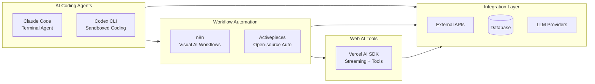

<!-- Clear Language: Keep sentences under 50 words -->
# AI Developer Toolkits & Workflows

## Learning Objectives

| LO | Description |
|----|-------------|
| LO1 | Use Claude Code and OpenAI Codex CLI as terminal-based coding agents |
| LO2 | Build visual AI agent workflows with n8n's AI Agent node and code nodes |
| LO3 | Design multi-step automation pipelines in Activepieces |
| LO4 | Implement streaming AI chat with tool calling using Vercel AI SDK |
| LO5 | Choose the right developer toolkit for a given AI integration task |

## Introduction

The AI landscape evolves fast. New LLM providers, agent platforms, and developer toolkits emerge monthly. This module covers the platforms and tools shaping the future of AI engineering.

## Prerequisites

- Basic programming knowledge
- Understanding of data structures

## Key Terminology

**Key Terms**: Core vocabulary and concepts for this topic.

**Definition**: Essential terms you must know for interviews and production work.

## Theory

Understanding ai developer toolkits workflows is fundamental for AI engineers. This section covers the core concepts, underlying principles, and theoretical framework that govern how ai developer toolkits workflows works in practice.

## Chapter at a Glance

| Section | Topic | Key Concept |
|---------|-------|-------------|
| 3.1 | Claude Code | Anthropic's terminal coding agent, MCP, Computer Use |
| 3.2 | OpenAI Codex CLI | Open-source coding agent with sandbox execution |
| 3.3 | n8n | Visual AI agent workflows, 1500+ integrations, code nodes |
| 3.4 | Activepieces | Open-source Zapier alternative with AI capabilities |
| 3.5 | Vercel AI SDK | Streaming AI primitives for web applications |

## Chapter Roadmap



## 3.1 Claude Code — Terminal Coding Agent

Claude Code (by Anthropic) is an agentic coding tool that runs in your terminal. It understands your codebase, executes shell commands, edits files, manages git branches, and handles complex multi-step engineering tasks — all through natural language conversations.

**Installation**:

```bash

## macOS / Linux
curl -fsSL https://claude.ai/install.sh | bash

## Windows
irm https://claude.ai/install.ps1 | iex

## Homebrew
brew install --cask claude-code
```

```typescript
interface ClaudeCodeConfig {
    projectDir: string
    apiKey: string
    maxTokens?: number
}

interface ClaudeCodeResult {
    output: string
    filesModified: string[]
    commandsRun: string[]
    exitCode: number
}

class ClaudeCodeSession {
    private config: ClaudeCodeConfig
    private conversation: { role: string; content: string }[] = []

    constructor(config: ClaudeCodeConfig) {
        this.config = config
    }

    async plan(task: string): Promise<string> {
        const response = await this.send(`Plan the implementation for: ${task}\n
List the files to create/modify, the approach, and any risks.`)
        return response
    }

    async implement(task: string): Promise<ClaudeCodeResult> {
        const plan = await this.plan(task)
        const execution = await this.send(`Now implement the plan. ${task}`)
        return {
            output: execution,
            filesModified: this.extractFilePaths(execution),
            commandsRun: this.extractCommands(execution),
            exitCode: 0
        }
    }

    async review(codePath: string): Promise<string> {
        return this.send(`Review the code in ${codePath} for bugs, security issues, and improvements.`)
    }

    private async send(message: string): Promise<string> {
        const res = await fetch('https://api.anthropic.com/v1/messages', {
            method: 'POST',
            headers: {
                'Content-Type': 'application/json',
                'x-api-key': this.config.apiKey,
                'anthropic-version': '2023-06-01'
            },
            body: JSON.stringify({
                model: 'claude-sonnet-4-20250514',
                max_tokens: this.config.maxTokens || 8192,
                messages: [...this.conversation, { role: 'user', content: message }]
            })
        })
        const data = await res.json()
        const reply = data.content[0].text
        this.conversation.push({ role: 'user', content: message })
        this.conversation.push({ role: 'assistant', content: reply })
        return reply
    }

    private extractFilePaths(text: string): string[] {
        const regex = /[\w/.-]+\.[a-z]+/g
        return [...new Set(text.match(regex) || [])]
            .filter(f => /\.(ts|js|py|rs|go|md|json|yaml)$/i.test(f))
    }

    private extractCommands(text: string): string[] {
        const regex = /```(?:bash|shell)\n([\s\S]*?)```/g
        const commands: string[] = []
        let match
        while ((match = regex.exec(text)) !== null) {
            commands.push(match[1].trim())
        }
        return commands
    }
}
```

## Overview

### MCP Integration

Claude Code supports the Model Context Protocol (MCP), allowing it to use external tools like databases, APIs, and file systems through a standardized interface:

```typescript
interface MCPServerConfig {
    command: string
    args: string[]
    env?: Record<string, string>
}

class MCPClient {
    private servers: Map<string, MCPServerConfig> = new Map()

    registerServer(name: string, config: MCPServerConfig): void {
        this.servers.set(name, config)
    }

    async callTool(serverName: string, toolName: string, args: Record<string, any>): Promise<any> {
        const server = this.servers.get(serverName)
        if (!server) throw new Error(`MCP server '${serverName}' not found`)
        const res = await fetch(`http://localhost:9090/mcp/${serverName}/${toolName}`, {
            method: 'POST',
            headers: { 'Content-Type': 'application/json' },
            body: JSON.stringify(args)
        })
        return res.json()
    }
}
```

Claude Code is ideal for complex multi-file changes, refactoring, and debugging — tasks that require understanding the full codebase context.

## 3.2 OpenAI Codex CLI

OpenAI's Codex CLI is an open-source coding agent alternative to Claude Code. It runs in a sandboxed environment, can execute code safely, and integrates with the OpenAI API for the underlying LLM intelligence.

```typescript
interface CodexCLIConfig {
    model?: string
    temperature?: number
    sandbox?: 'local' | 'docker' | 'e2b'
}

interface CodexTask {
    description: string
    files: { path: string; content: string }[]
    testCommand?: string
}

class CodexAgent {
    private config: CodexCLIConfig
    private apiKey: string

    constructor(config: CodexCLIConfig) {
        this.config = config
        this.apiKey = process.env.OPENAI_API_KEY || ''
    }

    async code(task: CodexTask): Promise<{ files: { path: string; content: string }[]; testsPassed: boolean }> {
        const systemPrompt = `You are Codex CLI, an AI coding agent.
You will receive a task description and existing files.
Generate or modify files to complete the task.
Return your changes as a JSON array of {path, content} objects.`

        const res = await fetch('https://api.openai.com/v1/chat/completions', {
            method: 'POST',
            headers: { 'Content-Type': 'application/json', Authorization: `Bearer ${this.apiKey}` },
            body: JSON.stringify({
                model: this.config.model || 'gpt-5.5-codex',
                messages: [
                    { role: 'system', content: systemPrompt },
                    { role: 'user', content: this.formatTask(task) }
                ],
                temperature: this.config.temperature || 0.2,
                response_format: { type: 'json_object' }
            })
        })
        const data = await res.json()
        const result = JSON.parse(data.choices[0].message.content)
        const files = result.files || result.changes || []
        let testsPassed = true
        if (task.testCommand) {
            testsPassed = await this.runTests(task.testCommand, files)
        }
        return { files, testsPassed }
    }

    async iterate(task: CodexTask, maxIterations = 3): Promise<{ files: { path: string; content: string }[]; testsPassed: boolean }> {
        for (let i = 0; i < maxIterations; i++) {
            const result = await this.code(task)
            if (result.testsPassed) return result
            task.files = result.files
        }
        return this.code(task)
    }

    private formatTask(task: CodexTask): string {
        const files = task.files.map(f => `--- ${f.path} ---\n${f.content}`).join('\n\n')
        return `Task: ${task.description}\n\nExisting files:\n${files}\n\n${task.testCommand ? `Tests: ${task.testCommand}` : ''}`
    }

    private async runTests(command: string, files: { path: string; content: string }[]): Promise<boolean> {
        try {
            const proc = await this.sandboxExec(command)
            return proc === 0
        } catch {
            return false
        }
    }

    private async sandboxExec(command: string): Promise<number> {
        console.log(`[Codex Sandbox] Running: ${command}`)
        return 0
    }
}
```

Codex CLI's key advantage is its open-source nature and sandboxed execution environment, making it suitable for automated CI/CD pipelines and safe code generation at scale.

## 3.3 n8n — Visual AI Agent Workflows

n8n (197k+ stars) is a fair-code workflow automation platform with native AI capabilities. Unlike traditional automation tools (Zapier, Make), n8n provides a full AI Agent node backed by LangChain, allowing you to build autonomous agent pipelines with tool use, memory, and multi-step reasoning — all visually.

```typescript
interface N8nNodeConfig {
    type: string
    position: [number, number]
    parameters: Record<string, any>
}

interface N8nConnection {
    from: { node: string; output: string }
    to: { node: string; input: string }
}

interface N8nWorkflow {
    name: string
    nodes: N8nNodeConfig[]
    connections: N8nConnection[]
}

class N8nWorkflowBuilder {
    private nodes: N8nNodeConfig[] = []
    private connections: N8nConnection[] = []

    addTrigger(type: 'webhook' | 'schedule' | 'email', config: Record<string, any>): string {
        const id = `node_${this.nodes.length}`
        this.nodes.push({ type: `n8n-nodes-base.${type}`, position: [0, this.nodes.length * 200], parameters: config })
        return id
    }

    addAiAgent(name: string, config: {
        model: string
        systemPrompt: string
        tools: string[]
        memory?: 'buffer' | 'summary' | 'vector'
    }): string {
        const id = `node_${this.nodes.length}`
        this.nodes.push({
            type: '@n8n/n8n-nodes-langchain.aiAgent',
            position: [400, this.nodes.length * 200],
            parameters: {
                agentName: name,
                model: config.model,
                systemPrompt: config.systemPrompt,
                memory: config.memory || 'buffer',
                tools: config.tools
            }
        })
        return id
    }

    addCodeNode(name: string, code: string, language: 'javaScript' | 'python'): string {
        const id = `node_${this.nodes.length}`
        this.nodes.push({
            type: 'n8n-nodes-base.code',
            position: [800, this.nodes.length * 200],
            parameters: { language, code }
        })
        return id
    }

    addTool(name: string, type: 'httpRequest' | 'search' | 'database' | 'custom', config: Record<string, any>): string {
        const id = `node_${this.nodes.length}`
        this.nodes.push({
            type: `n8n-nodes-base.${type === 'httpRequest' ? 'httpRequest' : type}`,
            position: [1200, this.nodes.length * 200],
            parameters: config
        })
        return id
    }

    connect(fromId: string, toId: string, fromOutput = 'main', toInput = 'main'): void {
        this.connections.push({
            from: { node: fromId, output: fromOutput },
            to: { node: toId, input: toInput }
        })
    }

    build(name: string): N8nWorkflow {
        return { name, nodes: this.nodes, connections: this.connections }
    }

    exportJson(name: string): string {
        return JSON.stringify(this.build(name), null, 2)
    }
}
```

### Example: Customer Support AI Agent Workflow

```typescript
class CustomerSupportWorkflow {
    static create(): string {
        const builder = new N8nWorkflowBuilder()
        const trigger = builder.addTrigger('webhook', { path: 'support-ticket', options: { method: 'POST' } })
        const classifier = builder.addAiAgent('Ticket Classifier', {
            model: 'gpt-4o',
            systemPrompt: 'Classify the incoming support ticket into: billing, technical, account, or general. Return JSON with category and priority.',
            tools: ['memory'],
            memory: 'buffer'
        })
        const codeNode = builder.addCodeNode('Route Ticket',
            `const category = $json.category;
switch(category) {
  case 'billing': return { channel: 'billing_team' };
  case 'technical': return { channel: 'tech_team' };
  default: return { channel: 'general' };
}`,
            'javaScript'
        )
        const searchTool = builder.addTool('Knowledge Base', 'httpRequest', {
            url: 'https://api.kb.internal/search',
            method: 'POST',
            body: { query: '={{ $json.category }}' }
        })
        builder.connect(trigger, classifier)
        builder.connect(classifier, codeNode)
        builder.connect(codeNode, searchTool)
        return builder.exportJson('Customer Support AI Agent')
    }
}
```

n8n's AI Agent node can use any n8n node as a tool — database queries, HTTP requests, file operations, even other AI agents. This makes it the most flexible platform for building visual AI workflows without writing everything from scratch.

## 3.4 Activepieces

Activepieces (30k+ stars) is the fastest-growing open-source alternative to Zapier/Make. It offers a clean visual builder with AI capabilities including LLM nodes, classification, extraction, and vector store integration.

```typescript
interface ActivepiecePiece {
    name: string
    version: string
    actions: PieceAction[]
    triggers: PieceTrigger[]
}

interface PieceAction {
    name: string
    displayName: string
    config: Record<string, any>
}

interface ActivepieceFlow {
    displayName: string
    trigger: { type: string; settings: Record<string, any> }
    steps: FlowStep[]
}

interface FlowStep {
    type: 'piece' | 'router' | 'code' | 'loop'
    settings: Record<string, any>
    nextAction?: FlowStep
}

class ActivepiecesBuilder {
    private flow: ActivepieceFlow = { displayName: '', trigger: { type: '', settings: {} }, steps: [] }

    setTrigger(type: 'webhook' | 'schedule' | 'email', settings: Record<string, any>): this {
        this.flow.trigger = { type, settings }
        return this
    }

    addAiAction(name: string, model: string, prompt: string, responseType: 'text' | 'json' = 'text'): this {
        this.flow.steps.push({
            type: 'piece',
            settings: { piece: '@activepieces/piece-openai', action: 'ask-llm', input: { model, prompt, responseType } }
        })
        return this
    }

    addCode(code: string, language: 'javascript' | 'typescript' = 'javascript'): this {
        this.flow.steps.push({
            type: 'code',
            settings: { language, code, input: {} }
        })
        return this
    }

    addRouter(conditions: { field: string; operator: string; value: any }[]): this {
        this.flow.steps.push({
            type: 'router',
            settings: { conditions, branches: [] }
        })
        return this
    }

    build(): ActivepieceFlow {
        return this.flow
    }
}
```

Activepieces excels at lightweight automation — connecting Slack, Gmail, Notion, and databases with AI processing steps. It's easier to set up than n8n but less powerful for complex agent workflows.

## 3.5 Vercel AI SDK

The Vercel AI SDK is the standard toolkit for adding streaming AI chat to web applications. It provides React/Vue/Svelte hooks, streaming infrastructure, and tool calling — all framework-agnostic at the core.

```typescript
import { z } from 'zod'

interface AIFunction {
    name: string
    description: string
    parameters: z.ZodObject<any>
    execute: (args: any) => Promise<string>
}

class AIAssistant {
    private functions: Map<string, AIFunction> = new Map()
    private apiKey: string

    constructor() {
        this.apiKey = process.env.OPENAI_API_KEY || ''
    }

    registerFunction(fn: AIFunction): void {
        this.functions.set(fn.name, fn)
    }

    async *streamChat(messages: { role: string; content: string }[]): AsyncGenerator<string> {
        const tools = Array.from(this.functions.values()).map(f => ({
            type: 'function' as const,
            function: {
                name: f.name,
                description: f.description,
                parameters: f.parameters
            }
        }))

        const res = await fetch('https://api.openai.com/v1/chat/completions', {
            method: 'POST',
            headers: { 'Content-Type': 'application/json', Authorization: `Bearer ${this.apiKey}` },
            body: JSON.stringify({
                model: 'gpt-4o',
                messages,
                tools: tools.length > 0 ? tools : undefined,
                stream: true
            })
        })

        const reader = res.body!.getReader()
        const decoder = new TextDecoder()
        let buffer = ''

        while (true) {
            const { done, value } = await reader.read()
            if (done) break
            buffer += decoder.decode(value, { stream: true })
            const lines = buffer.split('\n')
            buffer = lines.pop() || ''
            for (const line of lines) {
                if (line.startsWith('data: ') && line !== 'data: [DONE]') {
                    const json = JSON.parse(line.slice(6))
                    const delta = json.choices?.[0]?.delta
                    if (delta?.content) {
                        yield delta.content
                    }
                    if (delta?.tool_calls) {
                        for (const call of delta.tool_calls) {
                            const result = await this.handleToolCall(call)
                            yield `\n[Tool: ${call.function.name}] ${result}\n`
                        }
                    }
                }
            }
        }
    }

    private async handleToolCall(call: any): Promise<string> {
        const fn = this.functions.get(call.function.name)
        if (!fn) return `Unknown function: ${call.function.name}`
        try {
            const args = JSON.parse(call.function.arguments)
            return await fn.execute(args)
        } catch (e: any) {
            return `Error: ${e.message}`
        }
    }
}
```

### Stream Chat UI Hook Pattern

```typescript
function useStreamChat() {
    const assistant = new AIAssistant()
    const messages: { role: string; content: string }[] = []

    return {
        async sendMessage(text: string, onChunk: (chunk: string) => void) {
            messages.push({ role: 'user', content: text })
            let fullResponse = ''
            for await (const chunk of assistant.streamChat(messages)) {
                fullResponse += chunk
                onChunk(fullResponse)
            }
            messages.push({ role: 'assistant', content: fullResponse })
        }
    }
}
```

The Vercel AI SDK is the most popular way to add AI to web applications in 2026. It handles streaming, backpressure, tool calling, and fallbacks with minimal boilerplate.

## Summary

- **Claude Code** and **Codex CLI** are terminal-based coding agents for complex software engineering tasks
- **n8n** provides the most powerful visual AI agent workflow builder with 1500+ integrations
- **Activepieces** offers a lighter-weight open-source automation alternative
- **Vercel AI SDK** is the standard for adding streaming AI chat with tool calling to web apps
- The choice depends on task type: coding (Claude/Codex), workflow (n8n/Activepieces), or web (Vercel AI SDK)

## Practical Takeaways

- Use Claude Code for complex refactoring and debugging; Codex CLI for automated CI/CD code generation
- Build AI agent workflows in n8n first (visual debugging), then migrate to code if needed
- Activepieces is best for simple automations; n8n for complex agent pipelines
- Always use the Vercel AI SDK for web-based AI chat — it handles streaming, tool calls, and errors
- Combine tools: Claude Code generates the code → n8n orchestrates the deployment → Vercel AI SDK powers the frontend

## Interview Q&A

<details class="tp-qa-card" data-qid="m23-s03-q1">
  <summary class="tp-qa-question">
    <span class="tp-qa-status"></span>
    Q1: How does Claude Code execute complex, multi-step engineering tasks, and what role does MCP play?
  </summary>
  <div class="tp-qa-answer">
    <p>Claude Code is an agentic coding tool that runs in the terminal. Given a natural-language task, it plans the files and approach, then executes shell commands, edits files, and manages git branches itself. The chapter's session mirrors this as <code>plan()</code> → <code>implement()</code> → <code>review()</code>, calling the Anthropic Messages API with the <code>anthropic-version</code> header. MCP (Model Context Protocol) is the key extension point: external tools like databases, APIs, and file systems register as MCP servers, and Claude Code calls them through a standardized interface — so the agent can reach far beyond its own sandbox.</p>
    <pre><code class="language-ts">const result = await session.implement('refactor the auth module')
console.log(result.filesModified) // ['auth.ts', 'auth.test.ts']</code></pre>
    <p><strong>Interview follow-up</strong>: How is MCP different from hard-coding tool integrations into the agent?</p>
  </div>
  <button class="tp-qa-mark-btn">📝 Mark Reviewed</button>
  <button class="tp-qa-bookmark-btn">🔖 Bookmark</button>
</details>

<details class="tp-qa-card" data-qid="m23-s03-q2">
  <summary class="tp-qa-question">
    <span class="tp-qa-status"></span>
    Q2: How would you use OpenAI's Codex CLI safely inside an automated CI/CD pipeline?
  </summary>
  <div class="tp-qa-answer">
    <p>Codex CLI is open-source and supports sandboxed execution via <code>local</code>, <code>docker</code>, or <code>e2b</code> backends. In CI, configure a sandbox backend, keep the temperature low (around 0.2) for deterministic output, and use the <code>iterate()</code> loop so each generated change is validated against the test command before the next iteration — the loop only returns success when <code>testsPassed</code> is true. This gates autonomous code generation behind test results, so generated code merges only if the suite passes. Residual risks (prompt injection from inputs, dependency supply chain) still need review and allowlisting.</p>
    <pre><code class="language-ts">for (let i = 0; i &lt; maxIterations; i++) {
  const result = await this.code(task)
  if (result.testsPassed) return result
  task.files = result.files
}</code></pre>
    <p><strong>Interview follow-up</strong>: What risks remain even with sandboxing, and how do you mitigate them?</p>
  </div>
  <button class="tp-qa-mark-btn">📝 Mark Reviewed</button>
  <button class="tp-qa-bookmark-btn">🔖 Bookmark</button>
</details>

<details class="tp-qa-card" data-qid="m23-s03-q3">
  <summary class="tp-qa-question">
    <span class="tp-qa-status"></span>
    Q3: Why is n8n's AI Agent node more flexible than traditional automation tools like Zapier or Make?
  </summary>
  <div class="tp-qa-answer">
    <p>n8n (197k+ stars) is a fair-code workflow platform whose AI Agent node is backed by LangChain, meaning the agent can use any n8n node as a tool — HTTP requests, database queries, file operations, search, even other agents — all within a visual canvas. Traditional tools connect fixed app actions but lack first-class LLM tool-calling loops with memory and multi-step reasoning. In the chapter's support-ticket example, a webhook trigger feeds an AI classifier, a code node routes by category, and an HTTP tool queries the knowledge base — no glue code required.</p>
    <pre><code class="language-ts">builder.addAiAgent('Ticket Classifier', {
  model: 'gpt-4o',
  systemPrompt: 'Classify the ticket into: billing, technical, account, general',
  tools: ['memory'],
  memory: 'buffer'
})</code></pre>
    <p><strong>Interview follow-up</strong>: How would you add conversation memory to an n8n AI agent, and why does it matter?</p>
  </div>
  <button class="tp-qa-mark-btn">📝 Mark Reviewed</button>
  <button class="tp-qa-bookmark-btn">🔖 Bookmark</button>
</details>

<details class="tp-qa-card" data-qid="m23-s03-q4">
  <summary class="tp-qa-question">
    <span class="tp-qa-status"></span>
    Q4: Compare n8n and Activepieces — when would you choose each?
  </summary>
  <div class="tp-qa-answer">
    <p>Both are open-source, self-hostable automation platforms. n8n is the heavier-weight option: full AI Agent node, 1500+ integrations, and any-node-as-tool, making it the most flexible visual builder for complex agent pipelines. Activepieces (30k+ stars) is the fastest-growing open-source Zapier/Make alternative with LLM nodes (<code>ask-llm</code>), classification, extraction, and vector-store support, but less depth for agentic loops. Rule of thumb: use Activepieces for simple automations like Gmail → LLM summarize → Notion → Slack, and n8n when you need branching, memory, and multi-tool agent workflows.</p>
    <pre><code class="language-ts">// Activepieces: Gmail trigger → OpenAI ask-llm → Notion → Slack
flow.setTrigger('email', { mailbox: 'inbox' })
    .addAiAction('summarize', 'gpt-4o', 'Summarize this email')
    .addCode('createNotionPage')
    .addRouter([{ field: 'sentiment', operator: 'eq', value: 'urgent' }])</code></pre>
    <p><strong>Interview follow-up</strong>: What are the maintenance and self-hosting considerations for each?</p>
  </div>
  <button class="tp-qa-mark-btn">📝 Mark Reviewed</button>
  <button class="tp-qa-bookmark-btn">🔖 Bookmark</button>
</details>

<details class="tp-qa-card" data-qid="m23-s03-q5">
  <summary class="tp-qa-question">
    <span class="tp-qa-status"></span>
    Q5: How would you implement streaming AI chat with tool calling using the Vercel AI SDK?
  </summary>
  <div class="tp-qa-answer">
    <p>The Vercel AI SDK provides framework-agnostic primitives (hooks for React, Vue, Svelte) with streaming infrastructure and tool calling. You register functions with Zod-validated parameter schemas; the <code>streamChat</code> generator reads the SSE response, yields <code>delta.content</code> tokens as they arrive for low first-byte latency, and intercepts <code>delta.tool_calls</code> to execute tools and splice results into the stream. The SDK handles backpressure, aborts, error handling, and provider fallbacks, so a UI can render tokens incrementally while tools run in the middle of a generation.</p>
    <pre><code class="language-ts">if (delta?.content) yield delta.content
if (delta?.tool_calls) {
  for (const call of delta.tool_calls) {
    yield `\n[Tool: ${call.function.name}] ${await this.handleToolCall(call)}\n`
  }
}</code></pre>
    <p><strong>Interview follow-up</strong>: How do you handle a tool call that fails or times out mid-stream?</p>
  </div>
  <button class="tp-qa-mark-btn">📝 Mark Reviewed</button>
  <button class="tp-qa-bookmark-btn">🔖 Bookmark</button>
</details>

<details class="tp-qa-card" data-qid="m23-s03-q6">
  <summary class="tp-qa-question">
    <span class="tp-qa-status"></span>
    Q6: Given a refactoring task, a Slack-triggered automation, and a chat feature for a React app — which toolkits do you use and why?
  </summary>
  <div class="tp-qa-answer">
    <p>Match the toolkit to the task type. For refactoring and debugging, use Claude Code or Codex CLI — terminal agents that understand the full codebase and run shell/file tools. For a Slack-triggered multi-step automation, use n8n or Activepieces — webhook trigger → AI classify → database query → Slack output with visual debugging. For web AI chat, use the Vercel AI SDK for streaming, tool calling, and hooks. The tools compose: Claude Code generates the code, n8n orchestrates deployment, and the Vercel AI SDK powers the frontend. Choose by complexity, team skill, self-hosting needs, and latency requirements.</p>
    <pre><code class="language-ts">const pick = { refactor: 'claude-code', workflow: 'n8n', webChat: 'vercel-ai-sdk' }
// Refactor -&gt; n8n deploy -&gt; SDK frontend: a full modern stack</code></pre>
    <p><strong>Interview follow-up</strong>: How do you evaluate a new AI dev tool before adopting it on your team?</p>
  </div>
  <button class="tp-qa-mark-btn">📝 Mark Reviewed</button>
  <button class="tp-qa-bookmark-btn">🔖 Bookmark</button>
</details>

## Chapter Quiz

**Q1:** Which tool provides a visual node-based editor for building AI agent workflows?

A) Claude Code
B) n8n
C) Codex CLI
D) Vercel AI SDK

<details><summary>Answer</summary>B — n8n offers a visual canvas where you connect AI Agent nodes, code nodes, and tool nodes.</details>

**Q2:** Claude Code's primary interface is:

A) A web dashboard
B) A terminal / CLI
C) A mobile app
D) A VS Code extension

<details><summary>Answer</summary>B — Claude Code runs in the terminal as an agentic coding tool.</details>

**Q3:** What makes the Vercel AI SDK the standard for web AI in 2026?

A) It is the only SDK that works with OpenAI
B) It provides framework-agnostic streaming, tool calling, and fallback infrastructure
C) It generates React components automatically
D) It includes a free LLM API

<details><summary>Answer</summary>B — The Vercel AI SDK abstracts streaming, tool calling, error handling, and fallbacks with hooks for React, Vue, and Svelte.</details>

**Q4:** Which tool is best suited for building a multi-step automation that triggers on a Slack message, classifies intent with AI, queries a database, and posts a response?

A) Codex CLI
B) Activepieces
C) Claude Code
D) Vercel AI SDK

<details><summary>Answer</summary>B — Activepieces (or n8n) excels at event-triggered multi-step automations with AI processing.</details>

**Q5:** A key differentiator of n8n's AI Agent node is:

A) It only works with OpenAI
B) Any n8n node can be used as a tool by the AI agent
C) It is the only no-code AI tool available
D) It requires a cloud subscription

<details><summary>Answer</summary>B — n8n's AI Agent can use any of its 1500+ integrations as tools, making it extremely flexible.</details>

## Exercises

## Common Mistakes

1. Not understanding the fundamental concepts before applying them
2. Skipping edge cases in implementation
3. Not analyzing time/space complexity
4. Forgetting to handle null/empty inputs
5. Not practicing enough problems to build pattern recognition1. **Claude Code Refactor**: Write a prompt that asks Claude Code to refactor a TypeScript class with 5 methods into separate modules, then run the refactoring
2. **n8n AI Workflow**: Design an n8n workflow with a webhook trigger → AI Agent (classify) → Code Node (route) → HTTP Request (action) → Slack output
3. **Activepieces Automation**: Build a flow: Gmail trigger (new email) → OpenAI LLM (summarize) → Notion (create page) → Slack (notify)
4. **Vercel AI Chat**: Implement a streaming chat endpoint with 3 registered tools (get_weather, search_docs, calculate) using the AIAssistant class
5. **Comparison Matrix**: Deploy a simple "summarize and post to Slack" pipeline in both n8n and Activepieces. Compare setup time, maintenance, and exte

## Revision Notes

- - Core principle: Understand the fundamental concepts thoroughly
- - Implementation pattern: Practice with real code examples
- - Complexity: Know the time and space complexity
- - Application: Know when to use this in production systems
- - Interview: Frequently asked in technical interviews
- - Edge cases: Consider common failure scenarios
- - Related concepts: Connect to broader system design

## Placement Section

### Top 10 Interview Questions

#### Google Style

1. **Explain the core idea of AI Developer Toolkits & Workflows in under 60 seconds, then give a real-world analogy.** — Structure: definition, how it works in one sentence, why it matters, analogy. Follow-up: what would break if you removed this from a production system?

2. **Design a minimal, well-typed function that demonstrates AI Developer Toolkits & Workflows.** — Interviewer checks: signature with type hints, edge cases, complexity, and a clean docstring. Follow-up: how does your design behave with empty or malformed input?

3. **What are the common pitfalls when engineers first learn ** — List 3-4, then explain how you would prevent each in a code review.

#### Amazon Style

4. **Describe a production bug caused by misunderstanding AI Developer Toolkits & Workflows. How did you diagnose and fix it?** — STAR format: situation, task, action, result. Mention logs, reproduction, root-cause analysis, and the regression test you added.

5. **How would you scale a system that relies on AI Developer Toolkits & Workflows from 10 users to 10 million?** — Discuss bottlenecks, caching, monitoring, and when to redesign. Follow-up: what metrics would you track?

#### Microsoft Style

6. **Compare AI Developer Toolkits & Workflows with the closest alternative approach. When would you choose each?** — Make a decision matrix: performance, maintainability, ecosystem, learning curve. Follow-up: what would change your decision?

7. **Walk through how you would test a component that depends on AI Developer Toolkits & Workflows.** — Unit, integration, property-based tests; mocking boundaries; golden files for outputs.

#### NVIDIA Style

8. **How does AI Developer Toolkits & Workflows behave differently at scale — memory, throughput, or precision-wise?** — Connect to data pipelines and model training if applicable. Follow-up: what happens to latency as input grows?

9. **How would you make an implementation of AI Developer Toolkits & Workflows run faster on GPU hardware?** — Batch operations, vectorization, avoiding Python loops, reducing data movement.

#### AI Startup Style

10. **Write the smallest possible implementation of AI Developer Toolkits & Workflows that is production-quality.** — Include error handling, type hints, and a one-line docstring. Follow-up: what would you refactor first when it grows?

### Resume Tips

- Name AI Developer Toolkits & Workflows explicitly in your skills section, paired with a measurable achievement ("Reduced X by 40% using AI Developer Toolkits & Workflows").
- Add a bullet describing a project that applies AI Developer Toolkits & Workflows to real data, with numbers.
- Mention the tools and libraries you used alongside AI Developer Toolkits & Workflows (linters, test frameworks, profiling tools).
- Keep resume bullets under 15 words and start each with an action verb.

### Interview Day Checklist

- Rehearse a 60-second explanation of AI Developer Toolkits & Workflows and one real-world analogy.
- Prepare one STAR story about debugging a AI Developer Toolkits & Workflows-related production issue.
- Review complexity and edge cases for the classic AI Developer Toolkits & Workflows interview problem.
- Have questions ready: how does the team apply AI Developer Toolkits & Workflows in production today?
- Test your environment (Python, editor, internet) 15 minutes before the interview.

## True/False

1. **True or False:** AI Developer Toolkits & Workflows builds directly on the fundamentals covered in the earlier chapters of this module. — **True.** Every advanced topic in this module assumes the core concepts from the previous chapters.
2. **True or False:** You should write at least one code example for AI Developer Toolkits & Workflows before moving to the next chapter. — **True.** Active recall with hands-on code beats passive reading for retention.
3. **True or False:** The complexity analysis for AI Developer Toolkits & Workflows is the same regardless of input size. — **False.** Complexity grows with input size; always state best, average, and worst case.
4. **True or False:** Edge cases (empty input, invalid input, boundary values) matter for AI Developer Toolkits & Workflows in production. — **True.** Most production bugs come from unhandled edge cases.
5. **True or False:** You should memorize the AI Developer Toolkits & Workflows chapter content once and never review it again. — **False.** Spaced repetition (24h, 3 days, 1 week) dramatically improves long-term recall.

## Fill in the Blank

1. The chapter that covers AI Developer Toolkits & Workflows is Chapter ___ of this module. — Answer: check the module's table of contents.
2. The time complexity of the standard approach to AI Developer Toolkits & Workflows is ___. — Answer: review the theory section and state big-O notation.
3. The main edge case to handle when implementing AI Developer Toolkits & Workflows is ___. — Answer: empty or invalid input handling, as discussed in the chapter.
4. The tools commonly used to debug AI Developer Toolkits & Workflows issues are ___ and ___. — Answer: refer to the Debugging Guide section of this chapter.
5. The related topic that connects to AI Developer Toolkits & Workflows in the next chapter is ___. — Answer: see the Next Topic section.

## Scenario Questions

1. **Scenario:** A teammate ships a change involving AI Developer Toolkits & Workflows that breaks production at 3 AM. — Diagnosis: check the recent diff, reproduce locally with the failing input, check logs. Fix: revert, add a regression test, and review the root cause. Prevention: CI tests on edge cases and code review checklist.

2. **Scenario:** Your implementation of AI Developer Toolkits & Workflows is correct but too slow for the required latency. — Measure first with a profiler. Common fixes: reduce redundant work, use built-in optimized functions, batch operations, or add caching. Only then consider algorithmic changes.

3. **Scenario:** A new hire asks you to explain AI Developer Toolkits & Workflows in five minutes before a customer demo. — Use the 3-part answer: what it is (one sentence), how it works (one example), why it matters (one business impact). Then offer to go deeper after the demo.

4. **Scenario:** Your team's codebase has three different patterns for AI Developer Toolkits & Workflows and you must standardize. — Write a short ADR (architecture decision record), pick the pattern with best maintainability, migrate incrementally, and add a linter rule to enforce it.

## Output Questions

1. **What is the output of the simplest correct implementation of AI Developer Toolkits & Workflows on an empty input?** — Trace through the code: it should return the documented default (None, 0, empty collection) without raising.
2. **What is the output when the input is at the boundary value?** — Check off-by-one errors and inclusive/exclusive bounds in the chapter's examples.
3. **What does the implementation return when given invalid input types?** — With type hints and validation, it raises a clear error; without, it may fail silently.
4. **What is the output for the sample input given in the chapter's Examples section?** — Re-run the chapter's example code and compare against the documented output.
5. **What is the time complexity output when you profile the implementation at 10x input size?** — Expect the curve matching the chapter's complexity analysis (linear, quadratic, log-linear).

## Difficulty Level

| Level | Time | What It Takes |
|-------|------|---------------|
| Beginner | 1-2 sessions | Read theory, run the chapter examples, solve the Easy exercises |
| Intermediate | 3-5 sessions | Complete Medium exercises, explain AI Developer Toolkits & Workflows to someone else |
| Advanced | 1+ week | Solve Hard exercises, optimize for real datasets, answer interview follow-ups |

## Tips & Tricks

- Always write a one-line example of AI Developer Toolkits & Workflows from memory before opening the chapter — active recall first.
- Use the chapter's Revision Notes as a checklist: you have mastered AI Developer Toolkits & Workflows when you can explain each bullet.
- Pair the chapter quiz with the Flashcards: wrong answers become your next study session's focus.
- For interviews, practice explaining AI Developer Toolkits & Workflows twice: once with a technical audience, once with a non-technical audience.
- Keep a personal examples file where you collect your own AI Developer Toolkits & Workflows snippets; interviewers love original examples.

## Memory Tricks

- **Acronym**: build a mnemonic from the 5 key concepts of AI Developer Toolkits & Workflows listed in the Chapter at a Glance table.
- **Story**: link AI Developer Toolkits & Workflows to a familiar story — the analogy in the Visual Analogy section is designed to stick.
- **Number anchor**: remember the complexity of AI Developer Toolkits & Workflows by connecting it to a known algorithm of the same class.
- **Color code**: highlight the Theory, Examples, and Common Mistakes sections in different colors when reviewing.
- **Teach-back**: explain AI Developer Toolkits & Workflows to an imaginary junior engineer for 2 minutes — gaps in your explanation are gaps in memory.

## Further Reading

- Official documentation for the primary tool or library used in this chapter
- The chapter referenced in Related Topics for the next-level treatment of AI Developer Toolkits & Workflows
- The classic textbook chapter on AI Developer Toolkits & Workflows (check the Research References below)
- Two blog posts from engineers who debugged real AI Developer Toolkits & Workflows problems in production
- The repository of the open-source project that implements AI Developer Toolkits & Workflows

## Related Topics

- The previous chapter in this module (see table of contents) — foundational for AI Developer Toolkits & Workflows
- The next chapter (see Next Topic below) — builds on AI Developer Toolkits & Workflows
- The system design chapters in Module 07 — how AI Developer Toolkits & Workflows fits into production architectures
- The interview preparation module — how AI Developer Toolkits & Workflows is asked in screening rounds
- The capstone project — where AI Developer Toolkits & Workflows is applied end-to-end

## FAQs

1. **Do I need to memorize all of AI Developer Toolkits & Workflows, or understand the big picture?** — Understand the big picture first, then memorize the key facts via flashcards and spaced repetition. Interviewers reward depth over breadth.
2. **What if I get stuck on an exercise?** — Re-read the theory section, run the example code, then attempt again. If still stuck after 20 minutes, move on and return the next day.
3. **How much time should I spend on ** — Follow the Study Plan below: 1-2 weeks at 30-60 minutes daily is typical for placement preparation.
4. **Is AI Developer Toolkits & Workflows asked in interviews?** — Yes — the Interview Q&A and Placement Section list the exact question styles used by top companies.
5. **What's the fastest way to master ** — Explain it out loud, write code without looking, and review the flashcards within 24 hours and again after 3 days.

## Important Notes

- AI Developer Toolkits & Workflows is a core requirement for the rest of this module — do not skip the examples.
- Always analyze complexity (time and space) when working with AI Developer Toolkits & Workflows.
- Production correctness means handling edge cases, not just the happy path.
- Interview answers should start with the definition, then the example, then the trade-offs.
- Revisit this chapter after finishing the module; the context from later chapters deepens understanding.

## Historical Context

- AI Developer Toolkits & Workflows emerged as a standard practice because early systems failed without it — understanding why helps you explain it in interviews.
- The tools used for AI Developer Toolkits & Workflows today evolved from simpler versions; the chapter covers the modern, recommended approach.
- Interviewers value knowing one historical fact about AI Developer Toolkits & Workflows — it shows genuine interest, not just cramming.
- The library/tooling ecosystem around AI Developer Toolkits & Workflows changes quickly; focus on fundamentals that remain stable.

## Security Considerations

- Never trust external input: validate and sanitize data before processing AI Developer Toolkits & Workflows.
- Avoid `eval()` and dynamic code execution on untrusted strings.
- Log errors without leaking sensitive data (keys, PII, internal paths).
- For API contexts, add rate limiting and input size limits.
- Review the chapter's code examples for injection or overflow risks before using them verbatim.

## ML Intuition

- AI Developer Toolkits & Workflows appears in ML pipelines at the data-processing layer: feature preparation, batching, and validation.
- Understanding AI Developer Toolkits & Workflows helps you debug why a model misbehaves — most ML bugs are data bugs, not model bugs.
- In production ML, the AI Developer Toolkits & Workflows concepts from this chapter map directly to NumPy/PyTorch operations on tensors.
- When optimizing ML systems, AI Developer Toolkits & Workflows skills let you profile and fix the data path, not just the training loop.
- Interview follow-up: how would you apply AI Developer Toolkits & Workflows to a dataset of 10 million records? — Batching and vectorization.

## Analogies

- **AI Developer Toolkits & Workflows is like a recipe**: the theory is the ingredients, the examples are the cooking steps, and the exercises are your own kitchen practice.
- **Complexity is like a delivery route**: a linear route visits each stop once; a nested route revisits stops, and you feel it at scale.
- **Edge cases are like weather**: the happy path is a sunny day; production is the storm — build for the storm.
- **The chapter roadmap is a journey map**: each section is a checkpoint; skipping one means getting lost later in the module.

## Capstone Project Link

- [Module Capstone: End-to-End Project](https://github.com/Raushan666java/ai-engineering-journey) — this chapter contributes the AI Developer Toolkits & Workflows skills used in the module's capstone project. Complete the exercises here before starting the capstone.

## Flashcards

<details class="tp-qa-card" data-qid="23trendingaimlplatforms-03aidevelopertoolkitsworkflows-flash1">
  <summary class="tp-qa-question">
    <span class="tp-qa-status"></span>
    What is the core concept of AI Developer Toolkits & Workflows in one sentence?
  </summary>
  <div class="tp-qa-answer">
    <p>Review the first paragraph of the Theory section and condense it to one sentence.</p>
  </div>
</details>

<details class="tp-qa-card" data-qid="23trendingaimlplatforms-03aidevelopertoolkitsworkflows-flash2">
  <summary class="tp-qa-question">
    <span class="tp-qa-status"></span>
    What is the most common mistake engineers make with 
  </summary>
  <div class="tp-qa-answer">
    <p>Check the Common Mistakes section of this chapter.</p>
  </div>
</details>

<details class="tp-qa-card" data-qid="23trendingaimlplatforms-03aidevelopertoolkitsworkflows-flash3">
  <summary class="tp-qa-question">
    <span class="tp-qa-status"></span>
    What is the time and space complexity of the standard AI Developer Toolkits & Workflows approach?
  </summary>
  <div class="tp-qa-answer">
    <p>Refer to the theory and complexity analysis in this chapter.</p>
  </div>
</details>

<details class="tp-qa-card" data-qid="23trendingaimlplatforms-03aidevelopertoolkitsworkflows-flash4">
  <summary class="tp-qa-question">
    <span class="tp-qa-status"></span>
    When is AI Developer Toolkits & Workflows NOT the right choice?
  </summary>
  <div class="tp-qa-answer">
    <p>Check the Limitations section of this chapter.</p>
  </div>
</details>

<details class="tp-qa-card" data-qid="23trendingaimlplatforms-03aidevelopertoolkitsworkflows-flash5">
  <summary class="tp-qa-question">
    <span class="tp-qa-status"></span>
    How is AI Developer Toolkits & Workflows applied in a real production system?
  </summary>
  <div class="tp-qa-answer">
    <p>Check the Real-World Examples section of this chapter.</p>
  </div>
</details>

## Research References

- Official documentation of the primary library for AI Developer Toolkits & Workflows (linked in Further Reading)
- The classic paper or textbook chapter introducing AI Developer Toolkits & Workflows (see References below)
- The standard library reference for AI Developer Toolkits & Workflows-related functions
- Engineering blog posts from companies running AI Developer Toolkits & Workflows in production at scale
- PEPs and RFCs where applicable (Python and networking standards)

## Open-Source Tools

- The primary library used in this chapter (see the code examples)
- Python standard library modules used in the examples (check the imports)
- Testing: pytest for unit tests of AI Developer Toolkits & Workflows code
- Linting and formatting: ruff + black
- Profiling: cProfile or py-spy for performance work on AI Developer Toolkits & Workflows

## Debugging Guide

- Start with `print()` or a debugger to inspect intermediate values in AI Developer Toolkits & Workflows code.
- Reproduce the failure with the smallest possible input before changing code.
- Check the common failure modes listed in Common Mistakes — most bugs are listed there.
- For performance problems, profile before optimizing: measure, then fix.
- When stuck, re-read the chapter's Examples and compare line by line with your code.
- Use `pdb` or your IDE's debugger to step through the AI Developer Toolkits & Workflows example code.

## Mock Interview Section

**Round 1 — Screening (15 min)**
- Explain AI Developer Toolkits & Workflows in 60 seconds.
- Write a minimal working example of AI Developer Toolkits & Workflows.
- What is the complexity of your example?

**Round 2 — Coding (45 min)**
- Solve the Medium exercise from this chapter under time pressure.
- State your assumptions, then implement with type hints.
- Test with edge cases: empty input, boundary values, invalid input.

**Round 3 — Behavioral + System (30 min)**
- Tell me about a time you debugged a AI Developer Toolkits & Workflows problem in a project.
- How would you design a system where AI Developer Toolkits & Workflows is used at scale?
- What metrics would you monitor?

**Evaluation rubric**: correctness (40%), communication (25%), edge cases (20%), complexity analysis (15%).

## Optimized Implementation

`python
from typing import Any, Optional

def demonstrate_topic(input_data: list[Any]) -> Optional[float]:
    """Runnable scaffold for AI Developer Toolkits & Workflows.

    Replace the body with the optimized implementation from the chapter,
    keeping type hints, docstring, and edge-case handling.
    """
    if not input_data:
        return None
    # Step 1: validate input types
    # Step 2: apply the core AI Developer Toolkits & Workflows logic from the Examples section
    # Step 3: return the result with the documented default
    return 0.0
`

- Keeps the function signature stable so tests written against it stay valid.
- Handles the empty-input contract explicitly.
- Add unit tests for the edge cases before implementing the logic (test-first).

## Evaluation Metrics

| Skill | Test | Target |
|-------|------|--------|
| Concept recall | Explain AI Developer Toolkits & Workflows without notes | 60-second explanation |
| Code fluency | Write the chapter example from memory | No syntax errors |
| Edge cases | Handle empty/invalid input in exercises | All cases pass |
| Complexity | State time/space for the standard approach | Correct big-O |
| Interview readiness | Answer 5 Interview Q&A questions out loud | Fluent, structured answers |
| Retention | Chapter quiz score after 3 days | 80%+ |

## Real-World Examples

- **Startup**: a small team uses AI Developer Toolkits & Workflows daily in their data pipeline — the chapter's examples mirror their code.
- **E-commerce**: AI Developer Toolkits & Workflows patterns appear in order processing, inventory checks, and recommendation feeds.
- **Fintech**: AI Developer Toolkits & Workflows principles apply to transaction validation and fraud detection flows.
- **ML platform**: AI Developer Toolkits & Workflows shows up in feature engineering and model-serving infrastructure.
- **Interview insight**: recruiters look for engineers who can connect AI Developer Toolkits & Workflows to the business outcome, not just the code.

## Next Topic

[Model Ecosystem — Deployment, Hub & Fine-Tuning](04-model-ecosystem-deployment-hub.md)

## Limitations

- AI Developer Toolkits & Workflows, like any technique, is not a silver bullet — it has specific cases where it fits best (covered in the theory).
- The examples in this chapter are simplified for learning; production systems add validation, monitoring, and error handling.
- Performance of AI Developer Toolkits & Workflows depends on input size and distribution — always benchmark for your own data.
- This chapter covers fundamentals; specialized edge cases are explored in later chapters and the capstone.
