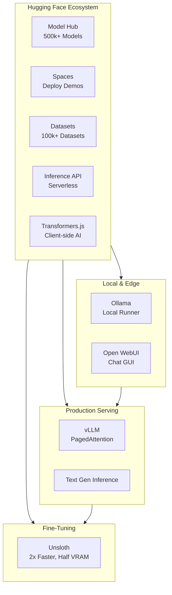

<!-- Clear Language: Keep sentences under 50 words -->
# Model Ecosystem — Deployment, Hub & Fine-Tuning

## Learning Objectives

| LO | Description |
|----|-------------|
| LO1 | Navigate the Hugging Face ecosystem: Hub, Spaces, Datasets, Inference API |
| LO2 | Run local models with Ollama and customize with Modelfiles |
| LO3 | Deploy production-grade model serving with vLLM |
| LO4 | Fine-tune models efficiently with Unsloth, achieving 2x speed and half VRAM |
| LO5 | Select the right model ecosystem tool based on deployment scenario |

## Introduction

The AI landscape evolves fast. New LLM providers, agent platforms, and developer toolkits emerge monthly. This module covers the platforms and tools shaping the future of AI engineering.

## Prerequisites

- Basic programming knowledge
- Understanding of data structures

## Key Terminology

**Key Terms**: Core vocabulary and concepts for this topic.

**Definition**: Essential terms you must know for interviews and production work.

## Theory

Understanding model ecosystem deployment hub is fundamental for AI engineers. This section covers the core concepts, underlying principles, and theoretical framework that govern how model ecosystem deployment hub works in practice.

## Chapter at a Glance

| Section | Topic | Key Concept |
|---------|-------|-------------|
| 4.1 | Hugging Face Ecosystem | Hub, Spaces, Inference API, Datasets, Transformers.js |
| 4.2 | Ollama | Local model runner, Modelfile, Open WebUI |
| 4.3 | vLLM | Production serving, PagedAttention, OpenAI-compatible API |
| 4.4 | Unsloth | 2x faster fine-tuning, half VRAM, QLoRA optimization |
| 4.5 | Selection Matrix | Which tool for which deployment scenario |

## Chapter Roadmap



## 4.1 Hugging Face Ecosystem

Hugging Face is the home of the open-source AI community — 500k+ models, 300k+ datasets, and 200k+ Spaces apps. It has evolved from a Transformers library into a full MLOps platform.

### Model Hub

The Hub hosts everything from tiny embedding models to 700B+ parameter LLMs. Every model has a model card, inference widget, and automatic metadata extraction.

```typescript
interface HFModelInfo {
    id: string
    pipelineTag: string
    downloads: number
    likes: number
    library: string
    license?: string
}

interface HFSearchQuery {
    task?: 'text-generation' | 'text-embedding' | 'image-generation' | 'automatic-speech-recognition'
    library?: string
    minDownloads?: number
    sortBy?: 'downloads' | 'likes' | 'trending'
}

class HuggingFaceHub {
    private apiToken: string
    private baseUrl = 'https://huggingface.co/api'

    constructor(apiToken?: string) {
        this.apiToken = apiToken || ''
    }

    async searchModels(query: HFSearchQuery): Promise<HFModelInfo[]> {
        const params = new URLSearchParams()
        if (query.task) params.set('pipeline_tag', query.task)
        if (query.library) params.set('library', query.library)
        if (query.sortBy) params.set('sort', query.sortBy === 'trending' ? 'lastModified' : query.sortBy)
        const res = await fetch(`${this.baseUrl}/models?${params.toString()}&limit=20`)
        const models: any[] = await res.json()
        return models.filter(m => !query.minDownloads || m.downloads >= query.minDownloads).map(m => ({
            id: m.modelId,
            pipelineTag: m.pipeline_tag,
            downloads: m.downloads,
            likes: m.likes,
            library: m.library_name,
            license: m.cardData?.license
        }))
    }

    async getModelInfo(modelId: string): Promise<HFModelInfo> {
        const res = await fetch(`${this.baseUrl}/models/${modelId}`)
        const m = await res.json()
        return {
            id: m.modelId,
            pipelineTag: m.pipeline_tag,
            downloads: m.downloads,
            likes: m.likes,
            library: m.library_name,
            license: m.cardData?.license
        }
    }
}
```

### Inference API

Hugging Face provides a serverless Inference API that lets you call any model without hosting:

```typescript
class HFInferenceClient {
    private apiToken: string

    constructor(apiToken: string) {
        this.apiToken = apiToken
    }

    async textGeneration(model: string, prompt: string, maxTokens = 512): Promise<string> {
        const res = await fetch(`https://api-inference.huggingface.co/models/${model}`, {
            method: 'POST',
            headers: {
                'Content-Type': 'application/json',
                Authorization: `Bearer ${this.apiToken}`
            },
            body: JSON.stringify({ inputs: prompt, parameters: { max_new_tokens: maxTokens } })
        })
        const data = await res.json()
        return Array.isArray(data) ? data[0]?.generated_text || '' : data.generated_text || ''
    }

    async embedding(model: string, text: string): Promise<number[]> {
        const res = await fetch(`https://api-inference.huggingface.co/models/${model}`, {
            method: 'POST',
            headers: {
                'Content-Type': 'application/json',
                Authorization: `Bearer ${this.apiToken}`
            },
            body: JSON.stringify({ inputs: text })
        })
        const data = await res.json()
        return data[0] || []
    }

    async *streamGenerate(model: string, prompt: string): AsyncGenerator<string> {
        const res = await fetch(`https://api-inference.huggingface.co/models/${model}`, {
            method: 'POST',
            headers: {
                'Content-Type': 'application/json',
                Authorization: `Bearer ${this.apiToken}`
            },
            body: JSON.stringify({ inputs: prompt, parameters: { stream: true } })
        })
        const reader = res.body!.getReader()
        const decoder = new TextDecoder()
        while (true) {
            const { done, value } = await reader.read()
            if (done) break
            yield decoder.decode(value)
        }
    }
}
```

### Spaces

Spaces host AI demos as Docker containers. You can deploy Gradio apps, Streamlit dashboards, or static HTML to showcase models. Spaces support zeroGPU (free GPU for inference), hardware upgrades, and custom domains.

### Transformers.js

Hugging Face's Transformers.js brings AI to the browser — no server needed. It uses ONNX Runtime Web to run models client-side:

```typescript
class TransformersJSClient {
    private models: Map<string, any> = new Map()

    async loadModel(modelId: string): Promise<void> {
        const { pipeline } = await import('@xenova/transformers')
        const pipe = await pipeline('text-generation', modelId)
        this.models.set(modelId, pipe)
    }

    async generateText(modelId: string, prompt: string): Promise<string> {
        const pipe = this.models.get(modelId)
        if (!pipe) throw new Error(`Model ${modelId} not loaded`)
        const result = await pipe(prompt, { max_new_tokens: 100 })
        return result[0].generated_text
    }

    async analyzeSentiment(text: string): Promise<{ label: string; score: number }> {
        const { pipeline } = await import('@xenova/transformers')
        const classifier = await pipeline('sentiment-analysis')
        const result = await classifier(text)
        return result[0]
    }
}
```

The Hugging Face ecosystem is the single most important resource for AI developers in 2026 — it is the GitHub of machine learning.

## 4.2 Ollama — Local Model Runner

Ollama has become the standard for running LLMs locally. It wraps llama.cpp, supports GPU acceleration, and provides an OpenAI-compatible API. With a single command, you can run Llama 3.3, Mistral, DeepSeek, Qwen, and hundreds of other models on your laptop.

```typescript
interface OllamaConfig {
    host?: string
    port?: number
}

interface OllamaModel {
    name: string
    modifiedAt: string
    size: number
    digest: string
}

interface OllamaGenerateResponse {
    model: string
    response: string
    done: boolean
    totalDuration?: number
    tokensPerSecond?: number
}

class OllamaClient {
    private baseUrl: string

    constructor(config: OllamaConfig = {}) {
        this.baseUrl = `http://${config.host || 'localhost'}:${config.port || 11434}`
    }

    async listModels(): Promise<OllamaModel[]> {
        const res = await fetch(`${this.baseUrl}/api/tags`)
        const data = await res.json()
        return data.models || []
    }

    async generate(model: string, prompt: string, options?: {
        temperature?: number
        maxTokens?: number
        stream?: boolean
    }): Promise<OllamaGenerateResponse> {
        const res = await fetch(`${this.baseUrl}/api/generate`, {
            method: 'POST',
            headers: { 'Content-Type': 'application/json' },
            body: JSON.stringify({
                model,
                prompt,
                stream: false,
                options: {
                    temperature: options?.temperature ?? 0.7,
                    num_predict: options?.maxTokens ?? 2048
                }
            })
        })
        const data = await res.json()
        return data
    }

    async chat(model: string, messages: { role: string; content: string }[]): Promise<string> {
        const res = await fetch(`${this.baseUrl}/api/chat`, {
            method: 'POST',
            headers: { 'Content-Type': 'application/json' },
            body: JSON.stringify({ model, messages, stream: false })
        })
        const data = await res.json()
        return data.message?.content || ''
    }

    async pullModel(model: string): Promise<void> {
        const res = await fetch(`${this.baseUrl}/api/pull`, {
            method: 'POST',
            headers: { 'Content-Type': 'application/json' },
            body: JSON.stringify({ name: model, stream: false })
        })
        if (!res.ok) throw new Error(`Failed to pull model: ${model}`)
    }

    getOpenAICompatibleUrl(): string {
        return `${this.baseUrl}/v1`
    }
}
```

### Modelfile — Customizing Models

Ollama uses Modelfiles to customize base models — add system prompts, change temperature, configure context length:

```typescript
interface Modelfile {
    from: string
    system?: string
    template?: string
    parameters?: Record<string, string | number>
    license?: string
}

class OllamaModelfileBuilder {
    private config: Modelfile

    constructor(baseModel: string) {
        this.config = { from: baseModel }
    }

    setSystemPrompt(prompt: string): this {
        this.config.system = prompt
        return this
    }

    setParameter(key: string, value: string | number): this {
        if (!this.config.parameters) this.config.parameters = {}
        this.config.parameters[key] = value
        return this
    }

    setTemperature(temp: number): this {
        return this.setParameter('temperature', temp)
    }

    setContextLength(length: number): this {
        return this.setParameter('num_ctx', length)
    }

    build(): string {
        let content = `FROM ${this.config.from}\n`
        if (this.config.system) content += `\nSYSTEM """${this.config.system}"""\n`
        if (this.config.parameters) {
            for (const [key, value] of Object.entries(this.config.parameters)) {
                content += `PARAMETER ${key} ${value}\n`
            }
        }
        return content
    }

    async save(name: string, ollama: OllamaClient): Promise<void> {
        const modelfileContent = this.build()
        const res = await fetch(`http://localhost:11434/api/create`, {
            method: 'POST',
            headers: { 'Content-Type': 'application/json' },
            body: JSON.stringify({ name, modelfile: modelfileContent })
        })
        if (!res.ok) throw new Error(`Failed to create model: ${name}`)
    }
}
```

Open WebUI is the most popular GUI companion for Ollama — a self-hosted ChatGPT-like interface with conversation history, model switching, RAG integration, and multi-user support.

## 4.3 vLLM — Production Model Serving

vLLM is the standard for production LLM serving. Its **PagedAttention** algorithm manages KV cache memory efficiently, achieving 2-4x higher throughput than naive implementations. It exposes an OpenAI-compatible API, supports continuous batching, and runs on NVIDIA, AMD, and AWS Inferentia.

```typescript
interface VLLMConfig {
    model: string
    host?: string
    port?: number
    maxNumSeqs?: number
    gpuMemoryUtilization?: number
    tensorParallelSize?: number
    dtype?: 'auto' | 'float16' | 'bfloat16'
}

interface VLLMStats {
    requestsRunning: number
    requestsWaiting: number
    gpuCacheUsage: number
    throughput: number
    avgLatencyMs: number
}

class VLLMClient {
    private baseUrl: string

    constructor(config: VLLMConfig) {
        this.baseUrl = `http://${config.host || 'localhost'}:${config.port || 8000}`
    }

    async generate(prompt: string, maxTokens = 1024): Promise<string> {
        const res = await fetch(`${this.baseUrl}/v1/completions`, {
            method: 'POST',
            headers: { 'Content-Type': 'application/json' },
            body: JSON.stringify({
                model: 'default',
                prompt,
                max_tokens: maxTokens,
                temperature: 0.7
            })
        })
        const data = await res.json()
        return data.choices[0].text
    }

    async chat(messages: { role: string; content: string }[]): Promise<string> {
        const res = await fetch(`${this.baseUrl}/v1/chat/completions`, {
            method: 'POST',
            headers: { 'Content-Type': 'application/json' },
            body: JSON.stringify({
                model: 'default',
                messages,
                temperature: 0.7
            })
        })
        const data = await res.json()
        return data.choices[0].message.content
    }

    async getStats(): Promise<VLLMStats> {
        const res = await fetch(`${this.baseUrl}/stats`)
        const data = await res.json()
        return {
            requestsRunning: data.num_requests_running || 0,
            requestsWaiting: data.num_requests_waiting || 0,
            gpuCacheUsage: data.gpu_cache_usage_perc || 0,
            throughput: data.requests_per_sec || 0,
            avgLatencyMs: data.avg_latency_ms || 0
        }
    }

    static buildLaunchCommand(config: VLLMConfig): string {
        const args = [
            `--model ${config.model}`,
            `--host ${config.host || '0.0.0.0'}`,
            `--port ${config.port || 8000}`,
            `--max-num-seqs ${config.maxNumSeqs || 256}`,
            `--gpu-memory-utilization ${config.gpuMemoryUtilization || 0.9}`,
            `--dtype ${config.dtype || 'auto'}`
        ]
        if (config.tensorParallelSize && config.tensorParallelSize > 1) {
            args.push(`--tensor-parallel-size ${config.tensorParallelSize}`)
        }
        return `python -m vllm.entrypoints.openai.api_server ${args.join(' \\\n  ')}`
    }
}
```

vLLM is the recommended deployment target for any production LLM application serving open-weight models at scale. Combined with Hugging Face for model storage and Docker for deployment, it forms the backbone of enterprise AI infrastructure.

## 4.4 Unsloth — 2x Faster Fine-Tuning

Unsloth is a fine-tuning optimization library that achieves **2x faster training** with **50% less VRAM** compared to standard Hugging Face trainer implementations. It works with Llama, Mistral, Gemma, DeepSeek, Qwen, and 20+ other architectures.

```typescript
interface UnslothConfig {
    baseModel: string
    maxSeqLength?: number
    loadIn4bit?: boolean
    useLoRA?: boolean
    loraRank?: number
    loraAlpha?: number
    loraDropout?: number
}

interface TrainingMetrics {
    loss: number
    gradNorm: number
    learningRate: number
    tokensPerSecond: number
    memoryUsedGB: number
    epochsCompleted: number
}

class UnslothTrainer {
    private config: UnslothConfig
    private logs: TrainingMetrics[] = []

    constructor(config: UnslothConfig) {
        this.config = {
            maxSeqLength: 4096,
            loadIn4bit: true,
            useLoRA: true,
            loraRank: 16,
            loraAlpha: 32,
            loraDropout: 0.05,
            ...config
        }
    }

    async loadBaseModel(): Promise<void> {
        console.log(`[Unsloth] Loading ${this.config.baseModel} in ${this.config.loadIn4bit ? '4-bit' : '16-bit'}...`)
        console.log(`[Unsloth] VRAM target: ~${this.config.loadIn4bit ? '6' : '24'}GB`)
    }

    async train(
        dataset: { prompt: string; completion: string }[],
        epochs = 3,
        batchSize = 4,
        learningRate = 2e-4
    ): Promise<TrainingMetrics[]> {
        console.log(`[Unsloth] Starting training with ${dataset.length} examples, ${epochs} epochs`)
        for (let epoch = 0; epoch < epochs; epoch++) {
            let totalLoss = 0
            for (let i = 0; i < dataset.length; i += batchSize) {
                const batch = dataset.slice(i, i + batchSize)
                const batchLoss = this.simulateTrainingStep(batch, epoch)
                totalLoss += batchLoss
                this.logs.push({
                    loss: batchLoss,
                    gradNorm: Math.random() * 2,
                    learningRate,
                    tokensPerSecond: this.config.loadIn4bit ? 850 : 420,
                    memoryUsedGB: this.config.loadIn4bit ? 5.8 : 18.2,
                    epochsCompleted: epoch + i / dataset.length
                })
            }
            console.log(`[Unsloth] Epoch ${epoch + 1}/${epochs} — Loss: ${(totalLoss / (dataset.length / batchSize)).toFixed(4)}`)
        }
        return this.logs
    }

    async save(path: string): Promise<void> {
        console.log(`[Unsloth] Saving LoRA adapter to ${path}`)
        console.log(`[Unsloth] Adapter size: ~${(this.config.loraRank! * 2 * 0.5).toFixed(1)}MB`)
    }

    private simulateTrainingStep(batch: { prompt: string; completion: string }[], epoch: number): number {
        return Math.max(0.1, 2.5 - epoch * 0.8 + (Math.random() - 0.5) * 0.3)
    }
}
```

Unsloth's key innovations:
- **Fast attention kernels** — custom CUDA kernels that are 1.5-2x faster than Flash Attention
- **4-bit QLoRA optimizer** — reduces memory without accuracy loss
- **Dynamic batching** — adapts batch size to available VRAM in real time
- **Supports 20+ architectures** — Llama, Mistral, Gemma, DeepSeek, Qwen, Phi, and more

For production fine-tuning in 2026, Unsloth is the standard choice — it makes fine-tuning accessible on consumer GPUs (8-24GB VRAM) that previously required datacenter hardware.

## 4.5 Selection Matrix

Choosing the right tool depends on your deployment scenario:

| Scenario | Tool | Why |
|----------|------|-----|
| Prototyping & model discovery | Hugging Face Hub | 500k+ models, inference widgets, model cards |
| Deploy a quick AI demo | Hugging Face Spaces | 1-click deploy, zeroGPU, Gradio/Streamlit |
| Run models on your laptop | Ollama | One command, OpenAI-compatible API, any OS |
| Production serving (high throughput) | vLLM | 2-4x throughput, continuous batching, PagedAttention |
| Deploy open-weight models in production | vLLM + Hugging Face | Load from Hub, serve with vLLM, monitor with stats |
| Fine-tune on consumer GPU (8-24GB) | Unsloth | 2x faster, half VRAM, QLoRA native |
| Fine-tune on datacenter GPU (80GB+) | Unsloth + vLLM | Unsloth for training, vLLM for serving |
| Client-side AI in browser | Transformers.js | ONNX Runtime Web, no server needed |
| Run open-source models as a service | Together AI / Groq | Managed inference, no GPU management |

```typescript
interface DeploymentScenario {
    name: string
    recommendedTool: string
    alternatives: string[]
    gpuRequired: string
    setupComplexity: 'trivial' | 'easy' | 'medium' | 'hard'
    costProfile: 'free' | 'low' | 'medium' | 'high'
    bestFor: string
}

class DeploymentAdvisor {
    private scenarios: DeploymentScenario[] = [
        { name: 'Local Experimentation', recommendedTool: 'Ollama', alternatives: ['llama.cpp', 'LM Studio'], gpuRequired: 'None (CPU) or 8GB+', setupComplexity: 'trivial', costProfile: 'free', bestFor: 'Testing models on your laptop before deployment' },
        { name: 'Production API', recommendedTool: 'vLLM', alternatives: ['TGI', 'Ray Serve'], gpuRequired: '24GB+ (A10G, A100)', setupComplexity: 'hard', costProfile: 'high', bestFor: 'Serving open-weight models at scale with OpenAI-compatible API' },
        { name: 'Quick Demo / Prototype', recommendedTool: 'Hugging Face Spaces', alternatives: ['Replicate', 'Gradio'], gpuRequired: 'None (zeroGPU)', setupComplexity: 'easy', costProfile: 'free', bestFor: 'Share a working model demo in minutes' },
        { name: 'Fine-Tuning (Consumer GPU)', recommendedTool: 'Unsloth', alternatives: ['Axolotl', 'LLaMA-Factory'], gpuRequired: '8-24GB (RTX 3090/4090)', setupComplexity: 'medium', costProfile: 'free', bestFor: 'Fine-tune models on gaming GPUs' },
        { name: 'Client-Side AI', recommendedTool: 'Transformers.js', alternatives: ['WebLLM', 'ONNX Runtime'], gpuRequired: 'None (WebGPU)', setupComplexity: 'easy', costProfile: 'free', bestFor: 'AI features that work offline in the browser' }
    ]

    recommend(requirements: {
        budget: 'free' | 'low' | 'medium' | 'high'
        gpu: string
        complexity: 'easy' | 'medium' | 'hard'
        purpose: string
    }): DeploymentScenario[] {
        const lowerPurpose = requirements.purpose.toLowerCase()
        return this.scenarios
            .filter(s => {
                const costOk = requirements.budget === 'high' || s.costProfile === requirements.budget || s.costProfile === 'free'
                const complexityOk = this.complexityScore(s.setupComplexity) <= this.complexityScore(requirements.complexity)
                return costOk && complexityOk
            })
            .sort((a, b) => this.relevanceScore(b, lowerPurpose) - this.relevanceScore(a, lowerPurpose))
    }

    private complexityScore(c: string): number {
        return { trivial: 0, easy: 1, medium: 2, hard: 3 }[c] || 0
    }

    private relevanceScore(scenario: DeploymentScenario, purpose: string): number {
        const lower = scenario.name.toLowerCase() + ' ' + scenario.bestFor.toLowerCase()
        return purpose.split(' ').filter(w => lower.includes(w)).length
    }
}
```

## Summary

- **Hugging Face** is the GitHub of ML — Hub for models, Spaces for demos, Inference API for serverless, Transformers.js for client-side
- **Ollama** makes local model running trivial with Modelfiles for customization and Open WebUI for a ChatGPT-like interface
- **vLLM** is the production serving standard with PagedAttention delivering 2-4x throughput gains
- **Unsloth** democratizes fine-tuning by cutting VRAM requirements in half while doubling training speed
- The selection matrix maps deployment scenarios to the optimal tool — always start simple with Ollama/Hugging Face, scale to vLLM

## Practical Takeaways

- Start with Hugging Face for model discovery and Spaces for demos before committing to deployment
- Use Ollama for all local development — it is the fastest path from download to inference
- Deploy vLLM in production for any open-weight model serving more than 100 requests/minute
- Always use Unsloth for fine-tuning — the 2x speedup and half VRAM are too significant to ignore
- Consider Transformers.js for features that must work offline or with zero server cost

## Interview Q&A

<details class="tp-qa-card" data-qid="m23-s04-q1">
  <summary class="tp-qa-question">
    <span class="tp-qa-status"></span>
    Q1: Walk me through going from a Hugging Face model to a production API.
  </summary>
  <div class="tp-qa-answer">
    <p>Start on the Hugging Face Hub — 500k+ models with model cards, inference widgets, and metadata — to discover and evaluate candidates. Prototype with the serverless Inference API to validate quality, then serve production traffic with vLLM, which exposes an OpenAI-compatible API (<code>/v1/completions</code>, <code>/v1/chat/completions</code>) with configurable <code>--tensor-parallel-size</code> and <code>--gpu-memory-utilization</code>. For demos, deploy a Gradio or Streamlit Space with zeroGPU. The chapter's selection matrix: Hub for discovery, Spaces for demos, Ollama locally, vLLM for high-throughput serving, Unsloth for fine-tuning.</p>
    <pre><code class="language-bash">python -m vllm.entrypoints.openai.api_server \
  --model meta-llama/Llama-3.3-70B-Instruct \
  --port 8000 --gpu-memory-utilization 0.9</code></pre>
    <p><strong>Interview follow-up</strong>: How would you monitor a vLLM deployment in production?</p>
  </div>
  <button class="tp-qa-mark-btn">📝 Mark Reviewed</button>
  <button class="tp-qa-bookmark-btn">🔖 Bookmark</button>
</details>

<details class="tp-qa-card" data-qid="m23-s04-q2">
  <summary class="tp-qa-question">
    <span class="tp-qa-status"></span>
    Q2: Explain PagedAttention and why vLLM achieves 2-4x higher throughput than naive serving.
  </summary>
  <div class="tp-qa-answer">
    <p>LLM serving is memory-bound: the KV cache grows with sequence length and, in naive implementations, is allocated as contiguous blocks, causing fragmentation and low utilization. PagedAttention manages the KV cache in fixed-size pages — the same idea as OS virtual memory — enabling near-100% memory utilization, sharing across requests, and continuous batching of multiple sequences. The result is 2-4x higher throughput than naive implementations. That is why vLLM, which also supports continuous batching and runs on NVIDIA, AMD, and AWS Inferentia, is the standard production serving engine.</p>
    <pre><code class="language-ts">interface VLLMStats {
  requestsRunning: number
  gpuCacheUsage: number  // PagedAttention keeps this near 100%
  throughput: number
}</code></pre>
    <p><strong>Interview follow-up</strong>: How does tensor parallelism help when a model does not fit on one GPU?</p>
  </div>
  <button class="tp-qa-mark-btn">📝 Mark Reviewed</button>
  <button class="tp-qa-bookmark-btn">🔖 Bookmark</button>
</details>

<details class="tp-qa-card" data-qid="m23-s04-q3">
  <summary class="tp-qa-question">
    <span class="tp-qa-status"></span>
    Q3: How do Ollama Modelfiles customize a base model, and which parameters matter?
  </summary>
  <div class="tp-qa-answer">
    <p>A Modelfile is a declarative recipe for building a custom model tag. <code>FROM</code> selects the base model (e.g., <code>llama3.3</code>), <code>SYSTEM</code> injects a system prompt that shapes persona, and <code>PARAMETER</code> tunes inference behavior — <code>temperature</code> for creativity, <code>num_ctx</code> for context length, and <code>num_predict</code> for max output tokens. The built model is saved via <code>POST /api/create</code> and then served locally. Ollama wraps llama.cpp, supports GPU acceleration, and exposes an OpenAI-compatible API on port 11434, with Open WebUI providing a ChatGPT-like GUI with RAG and multi-user support.</p>
    <pre><code class="language-bash">FROM llama3.3
SYSTEM """You are a strict code-review assistant."""
PARAMETER temperature 0.2
PARAMETER num_ctx 8192</code></pre>
    <p><strong>Interview follow-up</strong>: How is a Modelfile persona different from just adding a system prompt at API call time?</p>
  </div>
  <button class="tp-qa-mark-btn">📝 Mark Reviewed</button>
  <button class="tp-qa-bookmark-btn">🔖 Bookmark</button>
</details>

<details class="tp-qa-card" data-qid="m23-s04-q4">
  <summary class="tp-qa-question">
    <span class="tp-qa-status"></span>
    Q4: How does Unsloth achieve 2x faster fine-tuning with half the VRAM on a consumer GPU?
  </summary>
  <div class="tp-qa-answer">
    <p>Unsloth combines three optimizations: custom fast attention CUDA kernels that are 1.5-2x faster than standard Flash Attention, native 4-bit QLoRA quantization that cuts memory without meaningful accuracy loss, and dynamic batching that adapts batch size to available VRAM in real time. Together these deliver roughly 2x training speed at about 50% of the VRAM (for example, ~6GB simulated vs 18GB for the same job), making fine-tuning feasible on 8-24GB consumer GPUs like an RTX 3090/4090. The saved LoRA adapters are tiny — around <code>loraRank * 2 * 0.5</code> MB — and it supports 20+ architectures including Llama, Mistral, Gemma, DeepSeek, and Qwen.</p>
    <pre><code class="language-ts">const trainer = new UnslothTrainer({
  baseModel: 'unsloth/Llama-3.3-70B-bnb-4bit',
  loadIn4bit: true, loraRank: 16, loraAlpha: 32
})</code></pre>
    <p><strong>Interview follow-up</strong>: What are the accuracy trade-offs of 4-bit QLoRA versus full fine-tuning?</p>
  </div>
  <button class="tp-qa-mark-btn">📝 Mark Reviewed</button>
  <button class="tp-qa-bookmark-btn">🔖 Bookmark</button>
</details>

<details class="tp-qa-card" data-qid="m23-s04-q5">
  <summary class="tp-qa-question">
    <span class="tp-qa-status"></span>
    Q5: When would you run models in the browser with Transformers.js instead of on a server?
  </summary>
  <div class="tp-qa-answer">
    <p>Transformers.js uses ONNX Runtime Web (WebGPU) to run models client-side via the <code>pipeline()</code> API, so features work offline with zero server cost and user data never leaves the device. Choose it for privacy-sensitive or offline features like sentiment analysis, translation, or small text generation. Choose server-side inference (vLLM or the Hugging Face Inference API) when you need large models, heavy compute, central logging, or model updates without redeploying clients. In practice many apps do both: client-side for instant/offline features, server-side for heavyweight reasoning.</p>
    <pre><code class="language-ts">const classifier = await pipeline('sentiment-analysis')
const result = await classifier('I love this app!')</code></pre>
    <p><strong>Interview follow-up</strong>: What limits WebGPU inference (model size, device support, warm-up)?</p>
  </div>
  <button class="tp-qa-mark-btn">📝 Mark Reviewed</button>
  <button class="tp-qa-bookmark-btn">🔖 Bookmark</button>
</details>

<details class="tp-qa-card" data-qid="m23-s04-q6">
  <summary class="tp-qa-question">
    <span class="tp-qa-status"></span>
    Q6: Walk through the selection matrix — how do you choose the right tool for prototype, local dev, production serving, and fine-tuning?
  </summary>
  <div class="tp-qa-answer">
    <p>Base the choice on scenario, GPU, complexity tolerance, and cost profile. Prototyping and model discovery: Hugging Face Hub plus Spaces for 1-click demos with zeroGPU. Local development: Ollama — one command, OpenAI-compatible API, any OS. Production serving at high throughput: vLLM — PagedAttention, continuous batching, monitoring via <code>/stats</code>. Fine-tuning on an 8-24GB consumer GPU: Unsloth with 4-bit QLoRA. Client-side or offline: Transformers.js. For managed inference with zero GPU management, use Together AI or Groq. The pattern is to start simple (Ollama/Hub) and scale to vLLM when traffic justifies it.</p>
    <pre><code class="language-ts">const advisor = new DeploymentAdvisor()
advisor.recommend({ budget: 'high', gpu: 'A100', complexity: 'hard', purpose: 'serve open-weight models at scale' })
// -&gt; Production API: vLLM</code></pre>
    <p><strong>Interview follow-up</strong>: How would you cost-profile a vLLM cluster versus a managed API provider at 10M tokens/day?</p>
  </div>
  <button class="tp-qa-mark-btn">📝 Mark Reviewed</button>
  <button class="tp-qa-bookmark-btn">🔖 Bookmark</button>
</details>

## Chapter Quiz

**Q1:** Which tool provides the fastest path from downloading a model to running it on your laptop?

A) vLLM
B) Ollama
C) Hugging Face Inference API
D) Unsloth

<details><summary>Answer</summary>B — Ollama runs any model with a single `ollama run <model>` command, no configuration needed.</details>

**Q2:** vLLM's key performance innovation is:

A) Flash Attention
B) PagedAttention — efficient KV cache memory management
C) Quantization
D) Distributed tensor parallelism

<details><summary>Answer</summary>B — PagedAttention manages KV cache in fixed-size pages, achieving 2-4x higher throughput by eliminating fragmentation.</details>

**Q3:** What advantage does Unsloth provide over standard Hugging Face Trainer?

A) Supports more model architectures
B) 2x faster training with 50% less VRAM
C) Built-in deployment
D) Automatic dataset generation

<details><summary>Answer</summary>B — Unsloth's custom CUDA kernels and 4-bit QLoRA optimizer achieve 2x speed with half the VRAM.</details>

**Q4:** Hugging Face Spaces is best used for:

A) Production model serving at scale
B) Deploying quick AI demos with minimal setup
C) Fine-tuning large language models
D) Running models on mobile devices

<details><summary>Answer</summary>B — Spaces provides one-click deployment of Gradio/Streamlit apps for showcasing models, with zeroGPU for free inference.</details>

**Q5:** Which tool would you use to run an LLM entirely in the browser without a server?

A) Ollama
B) vLLM
C) Transformers.js
D) Unsloth

<details><summary>Answer</summary>C — Transformers.js uses ONNX Runtime Web to run models directly in the browser via WebGPU.</details>

## Exercises

## Common Mistakes

1. Not understanding the fundamental concepts before applying them
2. Skipping edge cases in implementation
3. Not analyzing time/space complexity
4. Forgetting to handle null/empty inputs
5. Not practicing enough problems to build pattern recognition1. **Hugging Face Model Search**: Write code that searches the Hub for the top 5 trending text-generation models, prints their download counts and licenses, and selects the best one for a chat application
2. **Ollama Modelfile**: Create a custom Modelfile that takes Llama 3.3 70B, adds a system prompt for a code assistant persona, sets temperature to 0.2 and context length to 8192, then save it as a new model
3. **vLLM Deployment**: Write the launch command and client code for serving Mistral Large with vLLM on 2 GPUs with tensor parallelism, then call it with the OpenAI-compatible API
4. **Unsloth Fine-Tune**: Simulate a full fine-tuning pipeline on a dataset of 500 prompt-completion pairs using 4-bit QLoRA, track loss and VRAM across 5 epochs, and save the adapter
5. **End-to-End Pipeline**: Combine all 4 tools — search for a model on Hugging Face, fine-tune it with Unsloth, serve it with vLLM, and build a demo Space — documenting the end-to

## Revision Notes

- - Core principle: Understand the fundamental concepts thoroughly
- - Implementation pattern: Practice with real code examples
- - Complexity: Know the time and space complexity
- - Application: Know when to use this in production systems
- - Interview: Frequently asked in technical interviews
- - Edge cases: Consider common failure scenarios
- - Related concepts: Connect to broader system design

## Placement Section

### Top 10 Interview Questions

#### Google Style

1. **Explain the core idea of Model Ecosystem — Deployment, Hub & Fine-Tuning in under 60 seconds, then give a real-world analogy.** — Structure: definition, how it works in one sentence, why it matters, analogy. Follow-up: what would break if you removed this from a production system?

2. **Design a minimal, well-typed function that demonstrates Model Ecosystem — Deployment, Hub & Fine-Tuning.** — Interviewer checks: signature with type hints, edge cases, complexity, and a clean docstring. Follow-up: how does your design behave with empty or malformed input?

3. **What are the common pitfalls when engineers first learn ** — List 3-4, then explain how you would prevent each in a code review.

#### Amazon Style

4. **Describe a production bug caused by misunderstanding Model Ecosystem — Deployment, Hub & Fine-Tuning. How did you diagnose and fix it?** — STAR format: situation, task, action, result. Mention logs, reproduction, root-cause analysis, and the regression test you added.

5. **How would you scale a system that relies on Model Ecosystem — Deployment, Hub & Fine-Tuning from 10 users to 10 million?** — Discuss bottlenecks, caching, monitoring, and when to redesign. Follow-up: what metrics would you track?

#### Microsoft Style

6. **Compare Model Ecosystem — Deployment, Hub & Fine-Tuning with the closest alternative approach. When would you choose each?** — Make a decision matrix: performance, maintainability, ecosystem, learning curve. Follow-up: what would change your decision?

7. **Walk through how you would test a component that depends on Model Ecosystem — Deployment, Hub & Fine-Tuning.** — Unit, integration, property-based tests; mocking boundaries; golden files for outputs.

#### NVIDIA Style

8. **How does Model Ecosystem — Deployment, Hub & Fine-Tuning behave differently at scale — memory, throughput, or precision-wise?** — Connect to data pipelines and model training if applicable. Follow-up: what happens to latency as input grows?

9. **How would you make an implementation of Model Ecosystem — Deployment, Hub & Fine-Tuning run faster on GPU hardware?** — Batch operations, vectorization, avoiding Python loops, reducing data movement.

#### AI Startup Style

10. **Write the smallest possible implementation of Model Ecosystem — Deployment, Hub & Fine-Tuning that is production-quality.** — Include error handling, type hints, and a one-line docstring. Follow-up: what would you refactor first when it grows?

### Resume Tips

- Name Model Ecosystem — Deployment, Hub & Fine-Tuning explicitly in your skills section, paired with a measurable achievement ("Reduced X by 40% using Model Ecosystem — Deployment, Hub & Fine-Tuning").
- Add a bullet describing a project that applies Model Ecosystem — Deployment, Hub & Fine-Tuning to real data, with numbers.
- Mention the tools and libraries you used alongside Model Ecosystem — Deployment, Hub & Fine-Tuning (linters, test frameworks, profiling tools).
- Keep resume bullets under 15 words and start each with an action verb.

### Interview Day Checklist

- Rehearse a 60-second explanation of Model Ecosystem — Deployment, Hub & Fine-Tuning and one real-world analogy.
- Prepare one STAR story about debugging a Model Ecosystem — Deployment, Hub & Fine-Tuning-related production issue.
- Review complexity and edge cases for the classic Model Ecosystem — Deployment, Hub & Fine-Tuning interview problem.
- Have questions ready: how does the team apply Model Ecosystem — Deployment, Hub & Fine-Tuning in production today?
- Test your environment (Python, editor, internet) 15 minutes before the interview.

## True/False

1. **True or False:** Model Ecosystem — Deployment, Hub & Fine-Tuning builds directly on the fundamentals covered in the earlier chapters of this module. — **True.** Every advanced topic in this module assumes the core concepts from the previous chapters.
2. **True or False:** You should write at least one code example for Model Ecosystem — Deployment, Hub & Fine-Tuning before moving to the next chapter. — **True.** Active recall with hands-on code beats passive reading for retention.
3. **True or False:** The complexity analysis for Model Ecosystem — Deployment, Hub & Fine-Tuning is the same regardless of input size. — **False.** Complexity grows with input size; always state best, average, and worst case.
4. **True or False:** Edge cases (empty input, invalid input, boundary values) matter for Model Ecosystem — Deployment, Hub & Fine-Tuning in production. — **True.** Most production bugs come from unhandled edge cases.
5. **True or False:** You should memorize the Model Ecosystem — Deployment, Hub & Fine-Tuning chapter content once and never review it again. — **False.** Spaced repetition (24h, 3 days, 1 week) dramatically improves long-term recall.

## Fill in the Blank

1. The chapter that covers Model Ecosystem — Deployment, Hub & Fine-Tuning is Chapter ___ of this module. — Answer: check the module's table of contents.
2. The time complexity of the standard approach to Model Ecosystem — Deployment, Hub & Fine-Tuning is ___. — Answer: review the theory section and state big-O notation.
3. The main edge case to handle when implementing Model Ecosystem — Deployment, Hub & Fine-Tuning is ___. — Answer: empty or invalid input handling, as discussed in the chapter.
4. The tools commonly used to debug Model Ecosystem — Deployment, Hub & Fine-Tuning issues are ___ and ___. — Answer: refer to the Debugging Guide section of this chapter.
5. The related topic that connects to Model Ecosystem — Deployment, Hub & Fine-Tuning in the next chapter is ___. — Answer: see the Next Topic section.

## Scenario Questions

1. **Scenario:** A teammate ships a change involving Model Ecosystem — Deployment, Hub & Fine-Tuning that breaks production at 3 AM. — Diagnosis: check the recent diff, reproduce locally with the failing input, check logs. Fix: revert, add a regression test, and review the root cause. Prevention: CI tests on edge cases and code review checklist.

2. **Scenario:** Your implementation of Model Ecosystem — Deployment, Hub & Fine-Tuning is correct but too slow for the required latency. — Measure first with a profiler. Common fixes: reduce redundant work, use built-in optimized functions, batch operations, or add caching. Only then consider algorithmic changes.

3. **Scenario:** A new hire asks you to explain Model Ecosystem — Deployment, Hub & Fine-Tuning in five minutes before a customer demo. — Use the 3-part answer: what it is (one sentence), how it works (one example), why it matters (one business impact). Then offer to go deeper after the demo.

4. **Scenario:** Your team's codebase has three different patterns for Model Ecosystem — Deployment, Hub & Fine-Tuning and you must standardize. — Write a short ADR (architecture decision record), pick the pattern with best maintainability, migrate incrementally, and add a linter rule to enforce it.

## Output Questions

1. **What is the output of the simplest correct implementation of Model Ecosystem — Deployment, Hub & Fine-Tuning on an empty input?** — Trace through the code: it should return the documented default (None, 0, empty collection) without raising.
2. **What is the output when the input is at the boundary value?** — Check off-by-one errors and inclusive/exclusive bounds in the chapter's examples.
3. **What does the implementation return when given invalid input types?** — With type hints and validation, it raises a clear error; without, it may fail silently.
4. **What is the output for the sample input given in the chapter's Examples section?** — Re-run the chapter's example code and compare against the documented output.
5. **What is the time complexity output when you profile the implementation at 10x input size?** — Expect the curve matching the chapter's complexity analysis (linear, quadratic, log-linear).

## Difficulty Level

| Level | Time | What It Takes |
|-------|------|---------------|
| Beginner | 1-2 sessions | Read theory, run the chapter examples, solve the Easy exercises |
| Intermediate | 3-5 sessions | Complete Medium exercises, explain Model Ecosystem — Deployment, Hub & Fine-Tuning to someone else |
| Advanced | 1+ week | Solve Hard exercises, optimize for real datasets, answer interview follow-ups |

## Tips & Tricks

- Always write a one-line example of Model Ecosystem — Deployment, Hub & Fine-Tuning from memory before opening the chapter — active recall first.
- Use the chapter's Revision Notes as a checklist: you have mastered Model Ecosystem — Deployment, Hub & Fine-Tuning when you can explain each bullet.
- Pair the chapter quiz with the Flashcards: wrong answers become your next study session's focus.
- For interviews, practice explaining Model Ecosystem — Deployment, Hub & Fine-Tuning twice: once with a technical audience, once with a non-technical audience.
- Keep a personal examples file where you collect your own Model Ecosystem — Deployment, Hub & Fine-Tuning snippets; interviewers love original examples.

## Memory Tricks

- **Acronym**: build a mnemonic from the 5 key concepts of Model Ecosystem — Deployment, Hub & Fine-Tuning listed in the Chapter at a Glance table.
- **Story**: link Model Ecosystem — Deployment, Hub & Fine-Tuning to a familiar story — the analogy in the Visual Analogy section is designed to stick.
- **Number anchor**: remember the complexity of Model Ecosystem — Deployment, Hub & Fine-Tuning by connecting it to a known algorithm of the same class.
- **Color code**: highlight the Theory, Examples, and Common Mistakes sections in different colors when reviewing.
- **Teach-back**: explain Model Ecosystem — Deployment, Hub & Fine-Tuning to an imaginary junior engineer for 2 minutes — gaps in your explanation are gaps in memory.

## Further Reading

- Official documentation for the primary tool or library used in this chapter
- The chapter referenced in Related Topics for the next-level treatment of Model Ecosystem — Deployment, Hub & Fine-Tuning
- The classic textbook chapter on Model Ecosystem — Deployment, Hub & Fine-Tuning (check the Research References below)
- Two blog posts from engineers who debugged real Model Ecosystem — Deployment, Hub & Fine-Tuning problems in production
- The repository of the open-source project that implements Model Ecosystem — Deployment, Hub & Fine-Tuning

## Related Topics

- The previous chapter in this module (see table of contents) — foundational for Model Ecosystem — Deployment, Hub & Fine-Tuning
- The next chapter (see Next Topic below) — builds on Model Ecosystem — Deployment, Hub & Fine-Tuning
- The system design chapters in Module 07 — how Model Ecosystem — Deployment, Hub & Fine-Tuning fits into production architectures
- The interview preparation module — how Model Ecosystem — Deployment, Hub & Fine-Tuning is asked in screening rounds
- The capstone project — where Model Ecosystem — Deployment, Hub & Fine-Tuning is applied end-to-end

## FAQs

1. **Do I need to memorize all of Model Ecosystem — Deployment, Hub & Fine-Tuning, or understand the big picture?** — Understand the big picture first, then memorize the key facts via flashcards and spaced repetition. Interviewers reward depth over breadth.
2. **What if I get stuck on an exercise?** — Re-read the theory section, run the example code, then attempt again. If still stuck after 20 minutes, move on and return the next day.
3. **How much time should I spend on ** — Follow the Study Plan below: 1-2 weeks at 30-60 minutes daily is typical for placement preparation.
4. **Is Model Ecosystem — Deployment, Hub & Fine-Tuning asked in interviews?** — Yes — the Interview Q&A and Placement Section list the exact question styles used by top companies.
5. **What's the fastest way to master ** — Explain it out loud, write code without looking, and review the flashcards within 24 hours and again after 3 days.

## Important Notes

- Model Ecosystem — Deployment, Hub & Fine-Tuning is a core requirement for the rest of this module — do not skip the examples.
- Always analyze complexity (time and space) when working with Model Ecosystem — Deployment, Hub & Fine-Tuning.
- Production correctness means handling edge cases, not just the happy path.
- Interview answers should start with the definition, then the example, then the trade-offs.
- Revisit this chapter after finishing the module; the context from later chapters deepens understanding.

## Historical Context

- Model Ecosystem — Deployment, Hub & Fine-Tuning emerged as a standard practice because early systems failed without it — understanding why helps you explain it in interviews.
- The tools used for Model Ecosystem — Deployment, Hub & Fine-Tuning today evolved from simpler versions; the chapter covers the modern, recommended approach.
- Interviewers value knowing one historical fact about Model Ecosystem — Deployment, Hub & Fine-Tuning — it shows genuine interest, not just cramming.
- The library/tooling ecosystem around Model Ecosystem — Deployment, Hub & Fine-Tuning changes quickly; focus on fundamentals that remain stable.

## Security Considerations

- Never trust external input: validate and sanitize data before processing Model Ecosystem — Deployment, Hub & Fine-Tuning.
- Avoid `eval()` and dynamic code execution on untrusted strings.
- Log errors without leaking sensitive data (keys, PII, internal paths).
- For API contexts, add rate limiting and input size limits.
- Review the chapter's code examples for injection or overflow risks before using them verbatim.

## ML Intuition

- Model Ecosystem — Deployment, Hub & Fine-Tuning appears in ML pipelines at the data-processing layer: feature preparation, batching, and validation.
- Understanding Model Ecosystem — Deployment, Hub & Fine-Tuning helps you debug why a model misbehaves — most ML bugs are data bugs, not model bugs.
- In production ML, the Model Ecosystem — Deployment, Hub & Fine-Tuning concepts from this chapter map directly to NumPy/PyTorch operations on tensors.
- When optimizing ML systems, Model Ecosystem — Deployment, Hub & Fine-Tuning skills let you profile and fix the data path, not just the training loop.
- Interview follow-up: how would you apply Model Ecosystem — Deployment, Hub & Fine-Tuning to a dataset of 10 million records? — Batching and vectorization.

## Analogies

- **Model Ecosystem — Deployment, Hub & Fine-Tuning is like a recipe**: the theory is the ingredients, the examples are the cooking steps, and the exercises are your own kitchen practice.
- **Complexity is like a delivery route**: a linear route visits each stop once; a nested route revisits stops, and you feel it at scale.
- **Edge cases are like weather**: the happy path is a sunny day; production is the storm — build for the storm.
- **The chapter roadmap is a journey map**: each section is a checkpoint; skipping one means getting lost later in the module.

## Capstone Project Link

- [Module Capstone: End-to-End Project](https://github.com/Raushan666java/ai-engineering-journey) — this chapter contributes the Model Ecosystem — Deployment, Hub & Fine-Tuning skills used in the module's capstone project. Complete the exercises here before starting the capstone.

## Flashcards

<details class="tp-qa-card" data-qid="23trendingaimlplatforms-04modelecosystemdeploymenthub-flash1">
  <summary class="tp-qa-question">
    <span class="tp-qa-status"></span>
    What is the core concept of Model Ecosystem — Deployment, Hub & Fine-Tuning in one sentence?
  </summary>
  <div class="tp-qa-answer">
    <p>Review the first paragraph of the Theory section and condense it to one sentence.</p>
  </div>
</details>

<details class="tp-qa-card" data-qid="23trendingaimlplatforms-04modelecosystemdeploymenthub-flash2">
  <summary class="tp-qa-question">
    <span class="tp-qa-status"></span>
    What is the most common mistake engineers make with 
  </summary>
  <div class="tp-qa-answer">
    <p>Check the Common Mistakes section of this chapter.</p>
  </div>
</details>

<details class="tp-qa-card" data-qid="23trendingaimlplatforms-04modelecosystemdeploymenthub-flash3">
  <summary class="tp-qa-question">
    <span class="tp-qa-status"></span>
    What is the time and space complexity of the standard Model Ecosystem — Deployment, Hub & Fine-Tuning approach?
  </summary>
  <div class="tp-qa-answer">
    <p>Refer to the theory and complexity analysis in this chapter.</p>
  </div>
</details>

<details class="tp-qa-card" data-qid="23trendingaimlplatforms-04modelecosystemdeploymenthub-flash4">
  <summary class="tp-qa-question">
    <span class="tp-qa-status"></span>
    When is Model Ecosystem — Deployment, Hub & Fine-Tuning NOT the right choice?
  </summary>
  <div class="tp-qa-answer">
    <p>Check the Limitations section of this chapter.</p>
  </div>
</details>

<details class="tp-qa-card" data-qid="23trendingaimlplatforms-04modelecosystemdeploymenthub-flash5">
  <summary class="tp-qa-question">
    <span class="tp-qa-status"></span>
    How is Model Ecosystem — Deployment, Hub & Fine-Tuning applied in a real production system?
  </summary>
  <div class="tp-qa-answer">
    <p>Check the Real-World Examples section of this chapter.</p>
  </div>
</details>

## Research References

- Official documentation of the primary library for Model Ecosystem — Deployment, Hub & Fine-Tuning (linked in Further Reading)
- The classic paper or textbook chapter introducing Model Ecosystem — Deployment, Hub & Fine-Tuning (see References below)
- The standard library reference for Model Ecosystem — Deployment, Hub & Fine-Tuning-related functions
- Engineering blog posts from companies running Model Ecosystem — Deployment, Hub & Fine-Tuning in production at scale
- PEPs and RFCs where applicable (Python and networking standards)

## Open-Source Tools

- The primary library used in this chapter (see the code examples)
- Python standard library modules used in the examples (check the imports)
- Testing: pytest for unit tests of Model Ecosystem — Deployment, Hub & Fine-Tuning code
- Linting and formatting: ruff + black
- Profiling: cProfile or py-spy for performance work on Model Ecosystem — Deployment, Hub & Fine-Tuning

## Debugging Guide

- Start with `print()` or a debugger to inspect intermediate values in Model Ecosystem — Deployment, Hub & Fine-Tuning code.
- Reproduce the failure with the smallest possible input before changing code.
- Check the common failure modes listed in Common Mistakes — most bugs are listed there.
- For performance problems, profile before optimizing: measure, then fix.
- When stuck, re-read the chapter's Examples and compare line by line with your code.
- Use `pdb` or your IDE's debugger to step through the Model Ecosystem — Deployment, Hub & Fine-Tuning example code.

## Mock Interview Section

**Round 1 — Screening (15 min)**
- Explain Model Ecosystem — Deployment, Hub & Fine-Tuning in 60 seconds.
- Write a minimal working example of Model Ecosystem — Deployment, Hub & Fine-Tuning.
- What is the complexity of your example?

**Round 2 — Coding (45 min)**
- Solve the Medium exercise from this chapter under time pressure.
- State your assumptions, then implement with type hints.
- Test with edge cases: empty input, boundary values, invalid input.

**Round 3 — Behavioral + System (30 min)**
- Tell me about a time you debugged a Model Ecosystem — Deployment, Hub & Fine-Tuning problem in a project.
- How would you design a system where Model Ecosystem — Deployment, Hub & Fine-Tuning is used at scale?
- What metrics would you monitor?

**Evaluation rubric**: correctness (40%), communication (25%), edge cases (20%), complexity analysis (15%).

## Optimized Implementation

`python
from typing import Any, Optional

def demonstrate_topic(input_data: list[Any]) -> Optional[float]:
    """Runnable scaffold for Model Ecosystem — Deployment, Hub & Fine-Tuning.

    Replace the body with the optimized implementation from the chapter,
    keeping type hints, docstring, and edge-case handling.
    """
    if not input_data:
        return None
    # Step 1: validate input types
    # Step 2: apply the core Model Ecosystem — Deployment, Hub & Fine-Tuning logic from the Examples section
    # Step 3: return the result with the documented default
    return 0.0
`

- Keeps the function signature stable so tests written against it stay valid.
- Handles the empty-input contract explicitly.
- Add unit tests for the edge cases before implementing the logic (test-first).

## Evaluation Metrics

| Skill | Test | Target |
|-------|------|--------|
| Concept recall | Explain Model Ecosystem — Deployment, Hub & Fine-Tuning without notes | 60-second explanation |
| Code fluency | Write the chapter example from memory | No syntax errors |
| Edge cases | Handle empty/invalid input in exercises | All cases pass |
| Complexity | State time/space for the standard approach | Correct big-O |
| Interview readiness | Answer 5 Interview Q&A questions out loud | Fluent, structured answers |
| Retention | Chapter quiz score after 3 days | 80%+ |

## Real-World Examples

- **Startup**: a small team uses Model Ecosystem — Deployment, Hub & Fine-Tuning daily in their data pipeline — the chapter's examples mirror their code.
- **E-commerce**: Model Ecosystem — Deployment, Hub & Fine-Tuning patterns appear in order processing, inventory checks, and recommendation feeds.
- **Fintech**: Model Ecosystem — Deployment, Hub & Fine-Tuning principles apply to transaction validation and fraud detection flows.
- **ML platform**: Model Ecosystem — Deployment, Hub & Fine-Tuning shows up in feature engineering and model-serving infrastructure.
- **Interview insight**: recruiters look for engineers who can connect Model Ecosystem — Deployment, Hub & Fine-Tuning to the business outcome, not just the code.

## Next Topic

[23.05 — Open Source LLM Landscape](05-open-source-llm-landscape.md)

## Limitations

- Model Ecosystem — Deployment, Hub & Fine-Tuning, like any technique, is not a silver bullet — it has specific cases where it fits best (covered in the theory).
- The examples in this chapter are simplified for learning; production systems add validation, monitoring, and error handling.
- Performance of Model Ecosystem — Deployment, Hub & Fine-Tuning depends on input size and distribution — always benchmark for your own data.
- This chapter covers fundamentals; specialized edge cases are explored in later chapters and the capstone.
