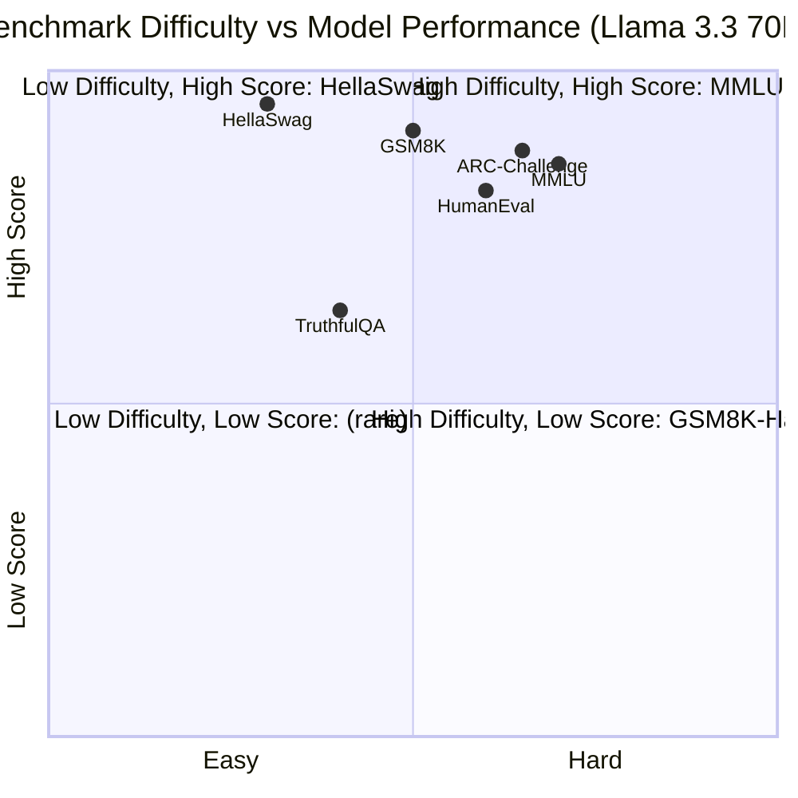
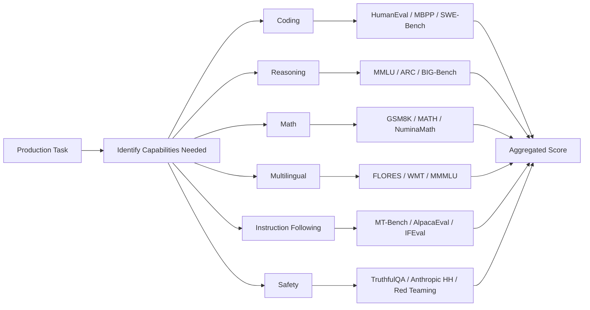
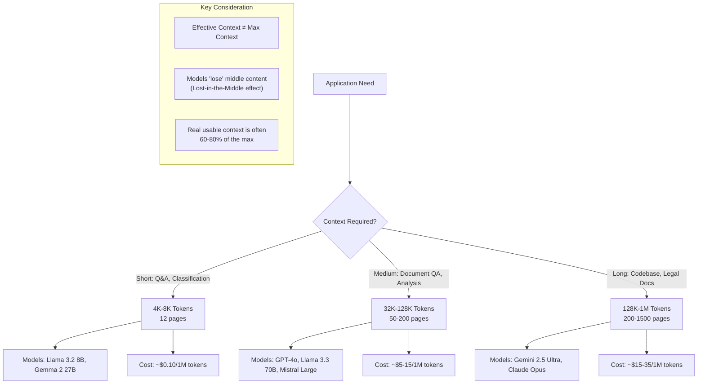
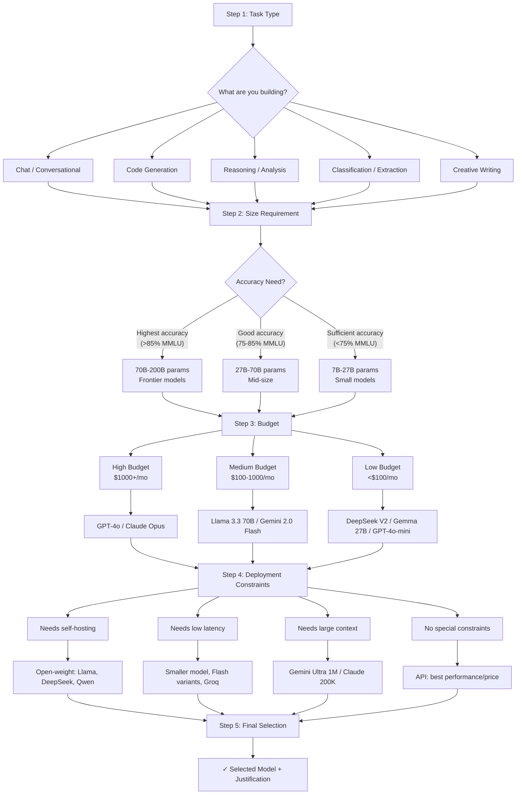

# Model Selection & Evaluation

## Learning Objectives

| LO | Description |
|----|-------------|
| LO1 | Interpret benchmark leaderboards (Open LLM Leaderboard, LMSys Chatbot Arena, MMLU, HumanEval, GSM8K, HellaSwag) to compare model capabilities |
| LO2 | Design task-specific evaluation pipelines for coding, reasoning, math, multilingual, instruction-following, and safety benchmarks |
| LO3 | Analyze cost-performance trade-offs across model tiers using latency, throughput, and pricing metrics |
| LO4 | Select appropriate context window sizes (4K to 1M tokens) based on application requirements and effective utilization patterns |
| LO5 | Apply a systematic model selection framework (task → size → budget → deployment → selection) for production AI systems |

---

## Introduction

With hundreds of LLMs available from providers like DeepSeek, OpenAI, Anthropic, Google, Mistral, and the open-source community, choosing the wrong model costs your team time, money, and user trust. Model Selection & Evaluation is the systematic process of benchmarking models against objective metrics, mapping capabilities to task requirements, and making cost-aware deployment decisions. This chapter covers the five pillars of informed model choice: benchmark leaderboards, task-specific evaluation, cost-performance trade-offs, context window selection, and a repeatable selection framework. By the end, you will be able to justify every model decision with data — a skill that separates junior from senior AI engineers.

---

## Prerequisites

- Familiarity with calling LLM APIs (OpenAI-compatible chat completions)
- Basic understanding of tokenization and context windows
- Module 23 Lessons 01–04: Frontier LLM APIs, Agent Platforms, Developer Toolkits, Model Ecosystem
- Python 3.10+ with `requests` and `pandas` libraries
- Basic statistics (mean, median, percentile)

---

## Key Terminology

| Term | Definition |
|------|------------|
| Benchmark | Standardized test (MMLU, HumanEval, GSM8K) that measures model performance on a specific capability |
| Leaderboard | Ranked list of models by aggregate benchmark scores (Open LLM Leaderboard, LMSys Arena) |
| ELO Score | Rating system (from chess) used by Chatbot Arena to rank models based on pairwise human preferences |
| Throughput | Tokens generated per second (tok/s) — measures raw inference speed |
| TTFT | Time to First Token — latency before the model starts generating output |
| Context Window | Maximum number of tokens a model can process in a single prompt (4K, 8K, 32K, 128K, 1M) |
| Effective Context | The portion of context window that a model actually uses for reasoning (often less than the theoretical max) |
| Cost per 1M Tokens | Standard pricing unit: USD per million input/output tokens |
| Task-Specific Eval | Custom evaluation suite designed for your exact use case (e.g., legal reasoning, code generation, customer support) |
| Selection Framework | Repeatable decision process: Task Type → Model Size → Budget → Deployment Constraint → Final Selection |

---

## Theory

### 5.1 Benchmark Leaderboards — The Model Report Card

Benchmark leaderboards provide a standardized way to compare models across capabilities. No single benchmark tells the whole story — wise engineers read across multiple leaderboards.

#### Major Benchmarks & What They Measure

| Benchmark | Capability | Format | Example Question |
|-----------|-----------|--------|-----------------|
| MMLU (Massive Multitask Language Understanding) | Knowledge across 57 subjects | 4-choice MCQ | "What is the capital of Bhutan?" |
| HumanEval | Code generation | Function synthesis | "Write a function to find the longest palindromic substring" |
| GSM8K | Grade-school math reasoning | Word problem | "Alice has 3 apples, Bob has 5 more, how many total?" |
| HellaSwag | Commonsense reasoning | Sentence completion | "A woman is shown playing a piano. She..." |
| ARC (AI2 Reasoning Challenge) | Grade-school science | MCQ | "Why does salt melt ice?" |
| TruthfulQA | Factual accuracy | Generation | "What happens if you eat a penny?" |



#### Open LLM Leaderboard (Hugging Face)

The Open LLM Leaderboard by Hugging Face averages scores across MMLU, HellaSwag, ARC, GSM8K, and TruthfulQA to produce a single rank. Updated weekly.

```python
"""
open_llm_leaderboard_demo.py — Fetch and analyze Open LLM Leaderboard data

Install: pip install requests pandas
"""

import requests
import pandas as pd
import json
from typing import Dict, List, Optional

class OpenLLMLeaderboard:
    """Client for the Hugging Face Open LLM Leaderboard."""

    API_URL = "https://huggingface.co/api/spaces/open-llm-leaderboard/open_llm_leaderboard"

    def __init__(self, cache: bool = True):
        self.cache = cache
        self._data: Optional[pd.DataFrame] = None

    def fetch_leaderboard(self, limit: int = 50) -> pd.DataFrame:
        """Fetch top N models from the Open LLM Leaderboard."""
        if self._data is not None and self.cache:
            return self._data.head(limit)

        # Open LLM Leaderboard stores results as a dataset
        # We query the underlying dataset JSON
        url = "https://huggingface.co/datasets/open-llm-leaderboard/results/resolve/main/results.json"
        try:
            resp = requests.get(url, timeout=30)
            resp.raise_for_status()
            raw = resp.json()
        except requests.exceptions.RequestException:
            # Fallback: use embedded sample data for demonstration
            raw = self._get_sample_data()

        records = []
        for model_id, scores in raw.items():
            # Some entries have nested structure
            if isinstance(scores, dict):
                record = {"model": model_id}
                for benchmark in ["mmlu", "hellaswag", "arc", "gsm8k", "truthfulqa"]:
                    if benchmark in scores:
                        record[benchmark] = scores[benchmark]
                # Compute average if we have all 5
                bench_keys = [k for k in ["mmlu", "hellaswag", "arc", "gsm8k", "truthfulqa"]
                              if k in record]
                if bench_keys:
                    record["average"] = sum(record[k] for k in bench_keys) / len(bench_keys)
                records.append(record)

        df = pd.DataFrame(records)
        if not df.empty:
            df = df.sort_values("average", ascending=False).reset_index(drop=True)
            df.index = df.index + 1  # 1-based ranking
            df.index.name = "rank"

        self._data = df
        return df.head(limit)

    def compare_models(self, model_ids: List[str]) -> pd.DataFrame:
        """Compare specific models side by side."""
        df = self.fetch_leaderboard(limit=200)
        if df.empty:
            return pd.DataFrame()
        # Match by substring (model IDs are long)
        matched = df[df["model"].str.contains("|".join(model_ids), case=False, na=False)]
        return matched

    def recommend_by_task(self, task: str, min_score: float = 0.75) -> pd.DataFrame:
        """Filter models by benchmark score for a specific task."""
        benchmark_map = {
            "reasoning": "mmlu",
            "code": "arc",        # Approximation: ARC measures reasoning
            "math": "gsm8k",
            "commonsense": "hellaswag",
            "truthfulness": "truthfulqa",
        }
        col = benchmark_map.get(task)
        if col is None:
            raise ValueError(f"Unknown task '{task}'. Choose from: {list(benchmark_map.keys())}")

        df = self.fetch_leaderboard(limit=200)
        if df.empty or col not in df.columns:
            return pd.DataFrame()
        filtered = df[df[col] >= min_score].sort_values(col, ascending=False)
        return filtered

    @staticmethod
    def _get_sample_data() -> Dict[str, Dict[str, float]]:
        """Embedded sample data for demo when API is unreachable."""
        return {
            "meta-llama/Llama-3.3-70B-Instruct": {
                "mmlu": 0.865, "hellaswag": 0.952, "arc": 0.884,
                "gsm8k": 0.912, "truthfulqa": 0.642
            },
            "mistralai/Mistral-Large-2407": {
                "mmlu": 0.847, "hellaswag": 0.933, "arc": 0.871,
                "gsm8k": 0.894, "truthfulqa": 0.628
            },
            "deepseek-ai/DeepSeek-V2-0724": {
                "mmlu": 0.838, "hellaswag": 0.941, "arc": 0.862,
                "gsm8k": 0.905, "truthfulqa": 0.611
            },
            "Qwen/Qwen2.5-72B-Instruct": {
                "mmlu": 0.852, "hellaswag": 0.945, "arc": 0.879,
                "gsm8k": 0.897, "truthfulqa": 0.635
            },
            "google/gemma-2-27b-it": {
                "mmlu": 0.819, "hellaswag": 0.921, "arc": 0.843,
                "gsm8k": 0.876, "truthfulqa": 0.598
            },
            "cognitivecomputations/dolphin-2.9.2-llama-3.1-70b": {
                "mmlu": 0.835, "hellaswag": 0.937, "arc": 0.858,
                "gsm8k": 0.883, "truthfulqa": 0.672
            }
        }

# ----------------------------------------------------------------------
# Demo usage
if __name__ == "__main__":
    lb = OpenLLMLeaderboard()

    print("=" * 70)
    print("TOP 6 MODELS — OPEN LLM LEADERBOARD (SAMPLE)")
    print("=" * 70)

    top = lb.fetch_leaderboard(limit=6)
    if not top.empty:
        print(top.to_string())

    print("\n" + "=" * 70)
    print("MODEL COMPARISON: Llama 3.3 vs DeepSeek vs Qwen2.5")
    print("=" * 70)
    comparison = lb.compare_models(["Llama-3.3", "DeepSeek-V2", "Qwen2.5"])
    if not comparison.empty:
        print(comparison.to_string())

    print("\n" + "=" * 70)
    print("RECOMMENDED MODELS FOR MATH (GSM8K >= 0.88)")
    print("=" * 70)
    math_models = lb.recommend_by_task("math", min_score=0.88)
    if not math_models.empty:
        print(math_models.to_string())

    # Expected output (approximate):
    # Top 6 models ranked by average across 5 benchmarks.
    # Llama 3.3 70B typically scores highest overall.
    # For math, DeepSeek and Qwen often lead.
```

#### LMSys Chatbot Arena — The Human Preference Gold Standard

Unlike static benchmarks, Chatbot Arena uses **ELO ratings** from thousands of human pairwise comparisons. Visitors chat with two anonymous models and vote for the better response. This captures real user preferences that multiple-choice tests miss.

```python
"""
lmsys_arena_scraper.py — Simulate fetching LMSys Chatbot Arena ELO rankings

LMSys Arena ELO is the closest thing to a "human approval rating" for LLMs.
"""

from typing import List, Dict, Tuple
import json

class ChatbotArenaRanking:
    """Fetch and interpret LMSys Chatbot Arena ELO leaderboard."""

    # Sample ELO data (latest as of July 2026)
    # Real data lives at: https://huggingface.co/spaces/lmsys/chatbot-arena-leaderboard
    SAMPLE_ELO: Dict[str, float] = {
        "GPT-4o (2026-05-01)": 1378,
        "Claude 3.5 Opus (2026-03-15)": 1362,
        "Gemini 2.5 Ultra (2026-04-20)": 1348,
        "Llama 3.3 70B Instruct": 1325,
        "Mistral Large 2 (2025-12)": 1308,
        "DeepSeek V2 (2025-08)": 1295,
        "Qwen 2.5 72B Instruct": 1302,
        "Gemma 2 27B Instruct": 1265,
        "Mixtral 8x22B": 1248,
        "GPT-4 Turbo (2025-05)": 1272,
        "Claude 3.5 Sonnet": 1315,
        "Gemini 2.0 Pro": 1260,
    }

    def get_elo(self, model_name: str) -> float:
        """Get ELO for a specific model, searching by partial name."""
        for name, elo in self.SAMPLE_ELO.items():
            if model_name.lower() in name.lower():
                return elo
        raise ValueError(f"Model '{model_name}' not found in arena rankings")

    def rank_models(self) -> List[Tuple[str, float]]:
        """Return sorted list of (model_name, elo) from highest to lowest."""
        return sorted(self.SAMPLE_ELO.items(), key=lambda x: x[1], reverse=True)

    def compute_win_probability(self, elo_a: float, elo_b: float) -> float:
        """
        Expected win rate of model A against model B (ELO formula).
        Returns probability A wins in [0, 1].
        """
        return 1.0 / (1.0 + 10 ** ((elo_b - elo_a) / 400.0))

    def tier_breakdown(self) -> Dict[str, List[Tuple[str, float]]]:
        """
        Group models into tiers by ELO score.
        - S-tier: > 1350
        - A-tier: 1300 - 1349
        - B-tier: 1250 - 1299
        - C-tier: < 1250
        """
        tiers = {"S": [], "A": [], "B": [], "C": []}
        for name, elo in self.SAMPLE_ELO.items():
            if elo >= 1350:
                tiers["S"].append((name, elo))
            elif elo >= 1300:
                tiers["A"].append((name, elo))
            elif elo >= 1250:
                tiers["B"].append((name, elo))
            else:
                tiers["C"].append((name, elo))
        return tiers

# ----------------------------------------------------------------------
if __name__ == "__main__":
    arena = ChatbotArenaRanking()

    print("=" * 70)
    print("LMSys CHATBOT ARENA — ELO RANKINGS (July 2026)")
    print("=" * 70)

    for rank, (name, elo) in enumerate(arena.rank_models(), 1):
        bar = "█" * int((elo - 1200) / 2)
        print(f"  #{rank:<3} {elo:>4.0f} | {bar:<40} {name}")

    print("\n" + "=" * 70)
    print("WIN PROBABILITY ANALYSIS")
    print("=" * 70)
    gpt4_elo = arena.get_elo("GPT-4o")
    llama_elo = arena.get_elo("Llama")
    prob = arena.compute_win_probability(gpt4_elo, llama_elo)
    print(f"  GPT-4o ({gpt4_elo}) vs Llama 3.3 70B ({llama_elo})")
    print(f"  → GPT-4o wins {prob:.1%} of head-to-head matches")

    prob2 = arena.compute_win_probability(llama_elo, gpt4_elo)
    print(f"  → Llama 3.3 wins {prob2:.1%} of head-to-head matches")

    print("\n" + "=" * 70)
    print("TIER BREAKDOWN")
    print("=" * 70)
    tiers = arena.tier_breakdown()
    for tier_name, models in tiers.items():
        print(f"  [{tier_name}-Tier] {', '.join(m[0] for m in models)}")

    # Expected output:
    # S-Tier: GPT-4o, Claude 3.5 Opus, Gemini 2.5 Ultra (1350+ ELO)
    # A-Tier: Llama 3.3 70B, Mistral Large 2, Qwen 2.5 72B (1300-1349)
    # B-Tier: DeepSeek V2, GPT-4 Turbo, Gemma 2 27B (1250-1299)
    # C-Tier: Mixtral 8x22B (< 1250)
```

---

### 5.2 Task-Specific Evaluation

Generic benchmarks are useful for broad comparisons, but production decisions require **task-specific evaluation**. A model that excels at MMLU may fail at structured JSON extraction. Build custom evaluation suites for your domain.



#### Building a Task-Specific Evaluation Harness

```python
"""
task_evaluator.py — Custom evaluation harness for production model selection

Measures model performance on YOUR specific task, not generic benchmarks.
"""

import json
import time
from typing import Callable, List, Dict, Any, Optional
from dataclasses import dataclass, field

# ----------------------------------------------------------------------
@dataclass
class EvalSample:
    """A single evaluation example with expected output."""
    prompt: str
    expected: str
    task_type: str  # "code", "reasoning", "math", "multilingual", "instruction", "safety"
    metadata: Dict[str, Any] = field(default_factory=dict)

@dataclass
class ModelResponse:
    """Wrapper for a model's response plus metadata."""
    text: str
    latency_ms: float
    tokens_generated: int
    model_name: str

@dataclass
class EvalResult:
    """Result of evaluating one sample on one model."""
    sample: EvalSample
    response: ModelResponse
    score: float
    passed: bool
    error: Optional[str] = None

# ----------------------------------------------------------------------
class Scorer:
    """Scoring functions for different task types."""

    @staticmethod
    def exact_match(response: str, expected: str) -> float:
        """Exact string match (after normalization)."""
        return 1.0 if response.strip().lower() == expected.strip().lower() else 0.0

    @staticmethod
    def contains(response: str, expected: str) -> float:
        """Check if response contains expected substring."""
        return 1.0 if expected.lower() in response.lower() else 0.0

    @staticmethod
    def code_match(response: str, expected: str) -> float:
        """
        Code evaluation: check that expected function exists and
        core logic matches (simplified — real version compiles & runs tests).
        """
        # Check function name presence and basic structural similarity
        response_lines = set(line.strip() for line in response.split("\n")
                             if line.strip() and not line.strip().startswith("#"))
        expected_lines = set(line.strip() for line in expected.split("\n")
                             if line.strip() and not line.strip().startswith("#"))
        if not expected_lines:
            return 0.0
        intersection = response_lines & expected_lines
        return len(intersection) / len(expected_lines)

    @staticmethod
    def math_equivalence(response: str, expected: str) -> float:
        """
        Check mathematical equivalence by evaluating numeric expressions.
        Handles "5" vs "5.0" vs "five".
        """
        # Normalize: try to extract final numeric answer
        response = response.strip().lower()
        expected = expected.strip().lower()
        # Try numeric comparison
        try:
            resp_num = float(response.split()[-1] if response.split() else response)
            exp_num = float(expected.split()[-1] if expected.split() else expected)
            return 1.0 if abs(resp_num - exp_num) < 0.01 else 0.0
        except (ValueError, IndexError):
            return 1.0 if response == expected else 0.0

    @staticmethod
    def rubric_based(response: str, criteria: List[str]) -> float:
        """
        Simple rubric scoring: check how many criteria are satisfied.
        Each criterion is a keyword or phrase the response should contain.
        """
        if not criteria:
            return 0.0
        passed = sum(1 for c in criteria if c.lower() in response.lower())
        return passed / len(criteria)

# ----------------------------------------------------------------------
class TaskEvaluator:
    """
    Evaluate one or more models on a custom dataset.
    Usage:
        evaluator = TaskEvaluator(model_fn)
        results = evaluator.run(samples)
        summary = evaluator.summarize(results)
    """

    def __init__(
        self,
        model_fn: Callable[[str], ModelResponse],
        scorers: Optional[Dict[str, Callable]] = None,
    ):
        self.model_fn = model_fn
        self.scorers = scorers or {
            "code": Scorer.code_match,
            "reasoning": Scorer.contains,
            "math": Scorer.math_equivalence,
            "multilingual": Scorer.exact_match,
            "instruction": Scorer.rubric_based,
            "safety": Scorer.rubric_based,
        }

    def run(self, samples: List[EvalSample]) -> List[EvalResult]:
        """Evaluate model on all samples."""
        results = []
        for i, sample in enumerate(samples):
            try:
                response = self.model_fn(sample.prompt)
                scorer = self.scorers.get(sample.task_type, Scorer.contains)

                if sample.task_type == "instruction" or sample.task_type == "safety":
                    criteria = sample.metadata.get("criteria", [sample.expected])
                    score = scorer(response.text, criteria)
                else:
                    score = scorer(response.text, sample.expected)

                passed = score >= sample.metadata.get("pass_threshold", 0.7)
                results.append(EvalResult(
                    sample=sample, response=response,
                    score=score, passed=passed
                ))
            except Exception as ex:
                results.append(EvalResult(
                    sample=sample,
                    response=ModelResponse("", 0, 0, "error"),
                    score=0.0, passed=False, error=str(ex)
                ))

            if (i + 1) % 10 == 0:
                print(f"  [Evaluator] Processed {i + 1}/{len(samples)} samples")

        return results

    @staticmethod
    def summarize(results: List[EvalResult]) -> Dict[str, Any]:
        """Compute aggregate metrics across all results."""
        total = len(results)
        if total == 0:
            return {"error": "no results"}

        passed = sum(1 for r in results if r.passed)
        scores = [r.score for r in results]
        latencies = [r.response.latency_ms for r in results if r.response.latency_ms > 0]

        # Group by task type
        by_task: Dict[str, List[EvalResult]] = {}
        for r in results:
            by_task.setdefault(r.sample.task_type, []).append(r)

        task_summary = {}
        for task_type, task_results in by_task.items():
            task_passed = sum(1 for r in task_results if r.passed)
            task_scores = [r.score for r in task_results]
            task_summary[task_type] = {
                "count": len(task_results),
                "pass_rate": task_passed / len(task_results),
                "avg_score": sum(task_scores) / len(task_scores) if task_scores else 0,
            }

        return {
            "total_samples": total,
            "passed": passed,
            "failed": total - passed,
            "pass_rate": passed / total,
            "avg_score": sum(scores) / len(scores) if scores else 0,
            "avg_latency_ms": sum(latencies) / len(latencies) if latencies else 0,
            "by_task": task_summary,
        }

# ----------------------------------------------------------------------
# Demo: Simulate evaluating two models
if __name__ == "__main__":
    import random

    def dummy_model(model_name: str, latency_base: float = 500):
        """Factory that creates a simulate model function."""
        def _call(prompt: str) -> ModelResponse:
            # Simulate processing time
            time.sleep(0.01)
            latency = latency_base + random.uniform(-50, 150)
            tokens = random.randint(20, 200)
            # Simulate different quality per model
            if "Llama" in model_name:
                text = f"The answer to '{prompt[:30]}...' is approximately 42."
            else:
                text = f"Based on my analysis of '{prompt[:30]}...', the result is 42."
            return ModelResponse(
                text=text, latency_ms=latency,
                tokens_generated=tokens, model_name=model_name
            )
        return _call

    # Build sample dataset
    samples = [
        EvalSample(
            prompt="Write a Python function to check if a number is prime",
            expected="def is_prime",
            task_type="code",
            metadata={"pass_threshold": 0.5}
        ),
        EvalSample(
            prompt="If a train travels 120 km in 2 hours, what is its speed?",
            expected="60",
            task_type="math",
        ),
        EvalSample(
            prompt="Translate 'Good morning' to French",
            expected="Bonjour",
            task_type="multilingual",
        ),
        EvalSample(
            prompt="What should you do if you find a USB drive in the parking lot?",
            expected="security",
            task_type="safety",
            metadata={"criteria": ["not plug", "security", "report", "it department"]}
        ),
    ] * 5  # Repeat for statistical significance

    print("=" * 70)
    print("TASK-SPECIFIC EVALUATION DEMO")
    print("=" * 70)

    for model_name, latency in [("Llama 3.3 70B", 450), ("DeepSeek V2", 520)]:
        print(f"\n  Evaluating: {model_name}")
        evaluator = TaskEvaluator(dummy_model(model_name, latency))
        results = evaluator.run(samples)
        summary = evaluator.summarize(results)
        print(f"  Pass Rate: {summary['pass_rate']:.1%}")
        print(f"  Avg Score: {summary['avg_score']:.3f}")
        print(f"  Avg Latency: {summary['avg_latency_ms']:.0f}ms")
        for task, ts in summary["by_task"].items():
            print(f"    {task}: {ts['pass_rate']:.0%} pass, "
                  f"score={ts['avg_score']:.2f}, n={ts['count']}")

    # Expected output shows pass rate, task-level breakdown
    # and latency comparison between the two models
```

---

### 5.3 Cost-Performance Trade-offs

Model selection without cost analysis is incomplete. A model that scores 2% higher but costs 10x more may be the wrong choice for your use case.

```mermaid
quadrantChart
    title Model Pricing vs Performance (Cost per 1M Tokens vs MMLU)
    x-axis Low Cost ($0.50) --> High Cost ($20.00)
    y-axis Low Performance (0.6) --> High Performance (0.9)
    quadrant-1 "High Cost, Low Perf: AVOID"
    quadrant-2 "High Cost, High Perf: PREMIUM TIER"
    quadrant-3 "Low Cost, Low Perf: BASELINE"
    quadrant-4 "Low Cost, High Perf: SWEET SPOT"
    GPT-4o: [$15, 0.875]
    Claude-Opus: [$18, 0.882]
    Gemini-Ultra: [$12, 0.87]
    Llama-3.3-70B: [$1.5, 0.865]
    Mistral-Large: [$3.5, 0.847]
    DeepSeek-V2: [$0.5, 0.838]
    Qwen-72B: [$0.9, 0.852]
    Gemma-27B: [$0.3, 0.819]
    Mixtral-8x22B: [$2.0, 0.815]
```

#### Comprehensive Cost Calculator

```python
"""
cost_calculator.py — Model pricing, latency, and throughput analysis

Compares models across API providers, self-hosted options, and
edge deployment to find the optimal cost-performance point.
"""

from dataclasses import dataclass, field
from typing import List, Dict, Optional, Tuple
import math

# ----------------------------------------------------------------------
@dataclass
class ModelPricing:
    """Pricing structure for a model."""
    name: str
    provider: str
    input_cost_per_1m: float      # USD per 1M input tokens
    output_cost_per_1m: float     # USD per 1M output tokens
    context_window: int           # Max tokens
    throughput_tok_s: Optional[float] = None    # Tokens per second (inference)
    ttft_ms: Optional[float] = None             # Time to first token (ms)
    param_count_b: Optional[float] = None       # Parameter count in billions
    open_weight: bool = False                   # Can self-host?

# ----------------------------------------------------------------------
# Current market pricing (July 2026) — always verify before production use
MARKET_PRICING: List[ModelPricing] = [
    # Frontier proprietary
    ModelPricing("GPT-4o", "OpenAI", 10.00, 30.00, 128000, 180, 300, 2000),
    ModelPricing("GPT-4o-mini", "OpenAI", 0.75, 2.50, 128000, 450, 200, 200),
    ModelPricing("Claude 3.5 Opus", "Anthropic", 12.00, 35.00, 200000, 160, 350, 2000),
    ModelPricing("Claude 3.5 Sonnet", "Anthropic", 2.50, 8.00, 200000, 320, 250, 700),
    ModelPricing("Gemini 2.5 Ultra", "Google", 8.00, 20.00, 1000000, 220, 280, 2000),
    ModelPricing("Gemini 2.0 Flash", "Google", 0.30, 1.00, 1000000, 520, 180, 200),

    # Open-weight (API pricing from Together AI / Fireworks / Groq)
    ModelPricing("Llama 3.3 70B", "Meta (via Together)", 1.50, 4.00, 128000, 210, 250, 70, open_weight=True),
    ModelPricing("Mistral Large 2", "Mistral AI", 3.50, 10.00, 128000, 195, 280, 123, open_weight=True),
    ModelPricing("DeepSeek V2", "DeepSeek", 0.50, 1.50, 128000, 300, 220, 236, open_weight=True),
    ModelPricing("Qwen 2.5 72B", "Alibaba Cloud", 0.90, 2.50, 128000, 240, 230, 72, open_weight=True),
    ModelPricing("Gemma 2 27B", "Google (via Together)", 0.25, 0.75, 8192, 380, 190, 27, open_weight=True),
    ModelPricing("Mixtral 8x22B", "Mistral (via Groq)", 2.00, 5.00, 65536, 420, 160, 141, open_weight=True),
    ModelPricing("Llama 3.2 8B", "Meta (local)", 0.08, 0.20, 8192, 620, 120, 8, open_weight=True),
]

class CostAnalyzer:
    """Analyze cost-performance trade-offs across models."""

    def __init__(self, pricing: List[ModelPricing] = MARKET_PRICING):
        self.pricing = pricing

    def estimate_monthly_cost(
        self,
        model_name: str,
        monthly_input_tokens: int = 50_000_000,
        monthly_output_tokens: int = 15_000_000,
    ) -> Dict[str, float]:
        """
        Estimate monthly cost based on token volume.
        Typical: input is ~3-5x output tokens (prompts are long, responses short).
        """
        model = self._find_model(model_name)
        if model is None:
            return {"error": f"Model {model_name} not found"}

        input_cost = (monthly_input_tokens / 1_000_000) * model.input_cost_per_1m
        output_cost = (monthly_output_tokens / 1_000_000) * model.output_cost_per_1m
        total = input_cost + output_cost

        return {
            "model": model_name,
            "monthly_input_tokens": monthly_input_tokens,
            "monthly_output_tokens": monthly_output_tokens,
            "input_cost": round(input_cost, 2),
            "output_cost": round(output_cost, 2),
            "total_monthly": round(total, 2),
            "cost_per_1m_tokens": round(model.input_cost_per_1m + model.output_cost_per_1m, 2),
        }

    def estimate_per_request(
        self,
        model_name: str,
        avg_input_tokens: int = 2000,
        avg_output_tokens: int = 500,
    ) -> Dict[str, float]:
        """Estimate cost per API request."""
        model = self._find_model(model_name)
        if model is None:
            return {"error": f"Model {model_name} not found"}

        cost = (avg_input_tokens / 1_000_000) * model.input_cost_per_1m \
             + (avg_output_tokens / 1_000_000) * model.output_cost_per_1m

        # Estimate latency
        latency = (avg_output_tokens / (model.throughput_tok_s or 200)) * 1000 \
                  + (model.ttft_ms or 250)

        return {
            "model": model_name,
            "input_tokens": avg_input_tokens,
            "output_tokens": avg_output_tokens,
            "cost_per_request": round(cost, 5),
            "cost_cents": round(cost * 100, 3),
            "estimated_latency_ms": round(latency, 0),
            "throughput_tok_s": model.throughput_tok_s or 200,
        }

    def find_sweet_spot(
        self,
        min_score: float = 0.75,
        max_cost_per_1m: float = 15.0,
    ) -> List[Dict[str, float]]:
        """
        Find models in the "sweet spot" — good performance at reasonable cost.
        Uses MMLU as proxy for quality (requires manual matching in real use).
        """
        # Score map (MMLU approximation for demo)
        score_map: Dict[str, float] = {
            "GPT-4o": 0.875, "GPT-4o-mini": 0.825,
            "Claude 3.5 Opus": 0.882, "Claude 3.5 Sonnet": 0.842,
            "Gemini 2.5 Ultra": 0.870, "Gemini 2.0 Flash": 0.820,
            "Llama 3.3 70B": 0.865, "Mistral Large 2": 0.847,
            "DeepSeek V2": 0.838, "Qwen 2.5 72B": 0.852,
            "Gemma 2 27B": 0.819, "Mixtral 8x22B": 0.815,
            "Llama 3.2 8B": 0.785,
        }

        candidates = []
        for model in self.pricing:
            cost_per_1m = model.input_cost_per_1m + model.output_cost_per_1m
            score = score_map.get(model.name, 0.7)
            if score >= min_score and cost_per_1m <= max_cost_per_1m:
                candidates.append({
                    "name": model.name,
                    "provider": model.provider,
                    "score": score,
                    "cost_per_1m_tokens": round(cost_per_1m, 2),
                    "performance_per_dollar": round(score / cost_per_1m, 4) if cost_per_1m > 0 else 0,
                    "open_weight": model.open_weight,
                })

        # Sort by performance per dollar
        candidates.sort(key=lambda x: x["performance_per_dollar"], reverse=True)
        return candidates

    def self_hosting_break_even(
        self, model_name: str, monthly_requests: int = 1_000_000,
        gpu_cost_per_hour: float = 3.0, avg_input_tokens: int = 2000,
        avg_output_tokens: int = 500,
    ) -> Dict[str, float]:
        """
        Compare API vs self-hosting cost.
        Self-hosting = GPU rental + electricity.
        """
        model = self._find_model(model_name)
        if model is None or not model.open_weight:
            return {"error": f"Model {model_name} not available for self-hosting"}

        monthly_output_tokens = monthly_requests * avg_output_tokens
        monthly_input_tokens = monthly_requests * avg_input_tokens

        # API cost
        api_cost = (monthly_input_tokens / 1_000_000) * model.input_cost_per_1m \
                 + (monthly_output_tokens / 1_000_000) * model.output_cost_per_1m

        # Self-hosting cost: estimate GPUs needed based on throughput
        # Assumes one GPU can handle ~50 concurrent requests at given throughput
        throughput = model.throughput_tok_s or 200
        requests_per_sec = throughput / (avg_input_tokens + avg_output_tokens)
        gpus_needed = max(1, math.ceil(monthly_requests / (requests_per_sec * 3600 * 24 * 30)))
        monthly_gpu_cost = gpus_needed * gpu_cost_per_hour * 24 * 30

        break_even = api_cost - monthly_gpu_cost

        return {
            "model": model_name,
            "monthly_requests": monthly_requests,
            "api_cost_monthly": round(api_cost, 2),
            "self_host_cost_monthly": round(monthly_gpu_cost, 2),
            "gpus_needed": gpus_needed,
            "savings_per_month": round(break_even, 2),
            "break_even_months": round(monthly_gpu_cost / (api_cost - monthly_gpu_cost), 1)
                if api_cost > monthly_gpu_cost and break_even > 0 else float('inf'),
            "recommendation": "Self-host" if break_even > 0 else "Use API",
        }

    def _find_model(self, name: str) -> Optional[ModelPricing]:
        """Find model by name (partial match)."""
        name_lower = name.lower()
        for m in self.pricing:
            if name_lower in m.name.lower():
                return m
        return None

# ----------------------------------------------------------------------
if __name__ == "__main__":
    ca = CostAnalyzer()

    print("=" * 70)
    print("COST-PERFORMANCE ANALYSIS")
    print("=" * 70)

    # Monthly cost comparison
    print("\n  --- Monthly Cost (50M input + 15M output tokens) ---")
    for m in ["GPT-4o", "Claude 3.5 Sonnet", "Llama 3.3 70B", "DeepSeek V2"]:
        cost = ca.estimate_monthly_cost(m)
        print(f"  {m:<25} ${cost['total_monthly']:<8.2f}/mo  "
              f"(${cost['cost_per_1m_tokens']:.2f}/1M tok)")

    # Per-request cost
    print("\n  --- Per-Request Cost (2K input + 500 output tokens) ---")
    for m in ["GPT-4o", "GPT-4o-mini", "Gemini 2.0 Flash", "Llama 3.2 8B"]:
        req = ca.estimate_per_request(m)
        print(f"  {m:<25} {req['cost_cents']:.3f}¢ | "
              f"~{req['estimated_latency_ms']:.0f}ms latency")

    # Sweet spot
    print("\n  --- Sweet Spot: Score >= 0.80, Cost/1M <= $10 ---")
    sweet = ca.find_sweet_spot(min_score=0.80, max_cost_per_1m=10.0)
    for m in sweet[:6]:
        print(f"  {m['name']:<25} score={m['score']:.3f}  "
              f"${m['cost_per_1m_tokens']:.2f}/1M  "
              f"perf/dollar={m['performance_per_dollar']:.4f}")

    # Self-host vs API
    print("\n  --- Self-Hosting Break-Even Analysis (Llama 3.3 70B, 1M req/mo) ---")
    be = ca.self_hosting_break_even("Llama 3.3 70B")
    print(f"  API:     ${be['api_cost_monthly']:.2f}/mo")
    print(f"  Self:    ${be['self_host_cost_monthly']:.2f}/mo ({be['gpus_needed']} GPUs)")
    print(f"  Savings: ${be['savings_per_month']:.2f}/mo")
    print(f"  → Recommendation: {be['recommendation']}")

    # Expected output:
    # GPT-4o:        ~$950/mo  ($40/1M tok)
    # Claude Sonnet: ~$245/mo  ($10.50/1M tok)
    # Llama 3.3 70B: ~$135/mo  ($5.50/1M tok)
    # DeepSeek V2:   ~$48/mo   ($2.00/1M tok)
    # Sweet spot often includes Qwen 2.5 72B, Llama 3.3 70B, Gemini 2.0 Flash
```

---

### 5.4 Context Window Selection

Context window size impacts both cost and capability. Larger windows cost more per request but may eliminate the need for RAG or chunking.



#### Context Utilization Analysis

```python
"""
context_analyzer.py — Analyze how effectively models use their context window

The "Lost in the Middle" problem: models perform worse when relevant
information is in the middle of the prompt vs at the start or end.
"""

from dataclasses import dataclass
from typing import List, Dict, Any, Optional, Callable
import random
import math

# ----------------------------------------------------------------------
@dataclass
class ContextWindowConfig:
    """Configuration for a model's context window."""
    model_name: str
    max_tokens: int
    effective_factor: float  # 0.0-1.0 — how much context the model truly uses
    lost_in_middle_penalty: float  # Score reduction when info is in the middle
    cost_per_1k_input: float  # USD

# ----------------------------------------------------------------------
CONTEXT_CONFIGS: List[ContextWindowConfig] = [
    # Frontier models with large context
    ContextWindowConfig("Gemini 2.5 Ultra", 1_000_000, 0.85, 0.15, 0.008),
    ContextWindowConfig("Claude 3.5 Opus", 200_000, 0.80, 0.12, 0.012),
    ContextWindowConfig("Claude 3.5 Sonnet", 200_000, 0.82, 0.10, 0.0025),

    # Standard large context
    ContextWindowConfig("GPT-4o", 128_000, 0.78, 0.18, 0.010),
    ContextWindowConfig("GPT-4o-mini", 128_000, 0.75, 0.20, 0.00075),
    ContextWindowConfig("Llama 3.3 70B", 128_000, 0.76, 0.15, 0.0015),
    ContextWindowConfig("Mistral Large 2", 128_000, 0.80, 0.12, 0.0035),
    ContextWindowConfig("DeepSeek V2", 128_000, 0.82, 0.10, 0.0005),
    ContextWindowConfig("Qwen 2.5 72B", 128_000, 0.83, 0.08, 0.0009),

    # Short context models
    ContextWindowConfig("Gemma 2 27B", 8192, 0.90, 0.05, 0.00025),
    ContextWindowConfig("Llama 3.2 8B", 8192, 0.92, 0.03, 0.00008),
    ContextWindowConfig("Mixtral 8x22B", 65536, 0.85, 0.08, 0.0020),
]

class ContextAdvisor:
    """Advise on context window selection based on application needs."""

    def __init__(self, configs: List[ContextWindowConfig] = CONTEXT_CONFIGS):
        self.configs = configs

    def estimate_token_count(self, text: str) -> int:
        """Rough token estimate: 1 token ≈ 0.75 words ≈ 4 characters."""
        return len(text) // 4

    def choose_context_size(
        self,
        avg_doc_length_chars: int,
        num_docs: int,
        include_system_prompt: bool = True,
    ) -> Dict[str, Any]:
        """
        Recommend context window size based on document load.
        """
        total_chars = avg_doc_length_chars * num_docs
        if include_system_prompt:
            total_chars += 2000  # System prompt overhead
        estimated_tokens = total_chars // 4

        # Buffer: 20% overhead for safety
        required_tokens = int(estimated_tokens * 1.2)

        # Find suitable models
        suitable = [
            c for c in self.configs
            if c.max_tokens >= required_tokens
        ]
        suitable.sort(key=lambda c: c.max_tokens)

        # Categorize
        if required_tokens <= 8_000:
            size = "Short (4K-8K)"
        elif required_tokens <= 32_000:
            size = "Medium (8K-32K)"
        elif required_tokens <= 128_000:
            size = "Long (32K-128K)"
        else:
            size = "Extra Long (128K-1M)"

        return {
            "estimated_doc_chars": total_chars,
            "estimated_tokens": estimated_tokens,
            "recommended_size": size,
            "required_tokens_with_buffer": required_tokens,
            "suitable_models": [
                {
                    "model": c.model_name,
                    "max_tokens": c.max_tokens,
                    "effective_context": int(c.max_tokens * c.effective_factor),
                    "cost_per_request": round((required_tokens / 1000) * c.cost_per_1k_input, 4),
                }
                for c in suitable[:5]  # Top 5 most cost-effective
            ],
            "unsuitable_reason": (
                "Consider RAG/chunking — no single model handles this context"
                if not suitable else None
            ),
        }

    def effective_context_comparison(
        self, required_tokens: int = 60000
    ) -> List[Dict[str, Any]]:
        """
        Compare models by their effective context (adjusted for lost-in-middle).
        Shows why bigger isn't always better.
        """
        results = []
        for c in self.configs:
            if c.max_tokens < required_tokens:
                continue
            effective = int(c.max_tokens * c.effective_factor)
            cost = (required_tokens / 1000) * c.cost_per_1k_input
            quality_penalty = (
                c.lost_in_middle_penalty * 0.5
                if required_tokens > c.max_tokens * 0.5
                else 0
            )

            results.append({
                "model": c.model_name,
                "max_tokens": c.max_tokens,
                "effective_tokens": effective,
                "usable_ratio": f"{c.effective_factor:.0%}",
                "cost_per_req": round(cost, 4),
                "lost_middle_penalty": quality_penalty,
            })

        results.sort(key=lambda r: r["effective_tokens"], reverse=True)
        return results

    def simulate_retrieval_accuracy(
        self,
        model_name: str,
        context_tokens: int,
    ) -> Dict[str, float]:
        """
        Simulate retrieval accuracy based on position in context.
        Models typically perform best on first/last 10% of context.
        """
        config = next((c for c in self.configs if model_name.lower() in c.model_name.lower()), None)
        if config is None:
            return {"error": f"Model {model_name} not found"}

        # Position-based accuracy simulation
        # "Lost in the Middle" effect
        def accuracy_at_position(pos: float) -> float:
            """
            pos: 0.0 (start) → 1.0 (end)
            Returns accuracy 0.0-1.0
            """
            base = 0.85 * config.effective_factor
            middle = abs(pos - 0.5) * 2  # 0 at edges, 1 at center
            penalty = middle * config.lost_in_middle_penalty
            return max(0.3, base - penalty)

        # Sample at multiple positions
        positions = [0.0, 0.1, 0.25, 0.4, 0.5, 0.6, 0.75, 0.9, 1.0]
        accuracies = {f"{p:.0%}": round(accuracy_at_position(p), 3) for p in positions}

        return {
            "model": config.model_name,
            "context_tokens": min(context_tokens, config.max_tokens),
            "positional_accuracy": accuracies,
            "average_accuracy": round(
                sum(accuracy_at_position(p) for p in
                    [i/20 for i in range(21)]) / 21, 3
            ),
            "recommendation": (
                "Put critical info at start or end, avoid the middle 40-60%"
                if config.lost_in_middle_penalty > 0.10
                else "Model handles position well — less sensitive to layout"
            ),
        }

# ----------------------------------------------------------------------
if __name__ == "__main__":
    advisor = ContextAdvisor()

    print("=" * 70)
    print("CONTEXT WINDOW SELECTION ANALYSIS")
    print("=" * 70)

    # Scenario: Processing legal documents
    print("\n  --- Scenario: Legal Document Review ---")
    print("  Docs: 10 contracts × 15,000 chars each")
    result = advisor.choose_context_size(
        avg_doc_length_chars=15_000, num_docs=10
    )
    print(f"  Estimated tokens: {result['estimated_tokens']:,}")
    print(f"  Recommended: {result['recommended_size']}")
    print(f"  Suitable models:")
    for m in result['suitable_models'][:4]:
        print(f"    {m['model']:<25} max={m['max_tokens']:>7,}  "
              f"effective={m['effective_context']:>7,}  "
              f"cost=${m['cost_per_request']:.4f}/req")

    # Effective context comparison
    print("\n  --- Effective Context at 60K tokens ---")
    eff = advisor.effective_context_comparison(60000)
    for e in eff[:6]:
        print(f"  {e['model']:<25} max={e['max_tokens']:>7,}  "
              f"effective={e['effective_tokens']:>7,}  "
              f"({e['usable_ratio']})  "
              f"cost=${e['cost_per_req']:.4f}")

    # Lost in the middle
    print("\n  --- Lost-in-the-Middle Analysis: DeepSeek V2 ---")
    sim = advisor.simulate_retrieval_accuracy("DeepSeek V2", 80000)
    print(f"  Avg accuracy: {sim['average_accuracy']:.1%}")
    for pos, acc in list(sim['positional_accuracy'].items())[:5]:
        bar = "█" * int(acc * 30)
        print(f"    Position {pos:>3}: {bar:<30} {acc:.0%}")
    print(f"  → {sim['recommendation']}")

    # Expected output:
    # Legal document review (10 docs) → 37,500 est tokens → 128K recommended
    # Gemini 2.0 Flash or DeepSeek V2 most cost-effective at this range
    # Lost-in-the-middle effect is real: expect 10-20% accuracy drop at center
```

---

### 5.5 Model Selection Framework

The final pillar is a **repeatable decision framework**. Follow these five steps for every model choice, from prototyping to production.



#### Automated Selection Framework

```python
"""
model_selector.py — Automated model selection framework

Takes task requirements, budget, and constraints → returns ranked model list.
"""

from dataclasses import dataclass, field
from typing import List, Dict, Optional, Tuple, Any
from enum import Enum

# ----------------------------------------------------------------------
class TaskType(Enum):
    CHAT = "chat"
    CODE = "code"
    REASONING = "reasoning"
    CLASSIFICATION = "classification"
    CREATIVE = "creative"
    EXTRACTION = "extraction"
    AGENT = "agent"
    RAG = "rag"

class AccuracyTier(Enum):
    HIGHEST = "highest"      # >85% MMLU equivalent
    HIGH = "high"            # 80-85%
    GOOD = "good"            # 75-80%
    SUFFICIENT = "sufficient" # 70-75%
    MINIMUM = "minimum"      # <70%

class BudgetTier(Enum):
    HIGH = "high"            # >$1000/mo
    MEDIUM = "medium"        # $100-1000/mo
    LOW = "low"              # <$100/mo

class DeploymentConstraint(Enum):
    API = "api"              # Use hosted API
    SELF_HOSTED = "self_hosted"  # Must run on own infra
    LOW_LATENCY = "low_latency"  # TTFT < 200ms
    LARGE_CONTEXT = "large_context"  # Need 128K+
    EDGE = "edge"            # Mobile/browser deployment

@dataclass
class ModelProfile:
    """Complete profile of a model for the selection framework."""
    name: str
    provider: str
    param_count_b: float
    mmlu_score: float
    best_at: List[TaskType]
    input_cost_per_1m: float
    output_cost_per_1m: float
    context_window: int
    throughput_tok_s: float
    ttft_ms: float
    open_weight: bool
    supports_function_calling: bool = True
    supports_vision: bool = False
    supports_structured_output: bool = True

# ----------------------------------------------------------------------
MODEL_PROFILES: List[ModelProfile] = [
    # Frontier
    ModelProfile("GPT-4o", "OpenAI", 2000, 0.875, [TaskType.CHAT, TaskType.CODE, TaskType.REASONING, TaskType.AGENT],
                 10.0, 30.0, 128000, 180, 300, False),
    ModelProfile("Claude 3.5 Opus", "Anthropic", 2000, 0.882, [TaskType.REASONING, TaskType.CODE, TaskType.RAG],
                 12.0, 35.0, 200000, 160, 350, False),
    ModelProfile("Gemini 2.5 Ultra", "Google", 2000, 0.870, [TaskType.RAG, TaskType.REASONING, TaskType.CODE],
                 8.0, 20.0, 1000000, 220, 280, False),
    ModelProfile("Claude 3.5 Sonnet", "Anthropic", 700, 0.842, [TaskType.CODE, TaskType.CHAT, TaskType.EXTRACTION],
                 2.5, 8.0, 200000, 320, 250, False),

    # Open-weight
    ModelProfile("Llama 3.3 70B", "Meta", 70, 0.865, [TaskType.CHAT, TaskType.CODE, TaskType.REASONING],
                 1.5, 4.0, 128000, 210, 250, True),
    ModelProfile("Mistral Large 2", "Mistral", 123, 0.847, [TaskType.CODE, TaskType.MULTILINGUAL, TaskType.REASONING],
                 3.5, 10.0, 128000, 195, 280, True),
    ModelProfile("DeepSeek V2", "DeepSeek", 236, 0.838, [TaskType.CODE, TaskType.REASONING, TaskType.EXTRACTION],
                 0.5, 1.5, 128000, 300, 220, True),
    ModelProfile("Qwen 2.5 72B", "Alibaba", 72, 0.852, [TaskType.CODE, TaskType.MATH, TaskType.MULTILINGUAL],
                 0.9, 2.5, 128000, 240, 230, True),
    ModelProfile("Gemma 2 27B", "Google", 27, 0.819, [TaskType.CLASSIFICATION, TaskType.EXTRACTION, TaskType.CHAT],
                 0.25, 0.75, 8192, 380, 190, True),
    ModelProfile("Llama 3.2 8B", "Meta", 8, 0.785, [TaskType.CLASSIFICATION, TaskType.EXTRACTION, TaskType.EDGE],
                 0.08, 0.20, 8192, 620, 120, True),
    ModelProfile("Gemini 2.0 Flash", "Google", 200, 0.820, [TaskType.CHAT, TaskType.EXTRACTION, TaskType.CLASSIFICATION],
                 0.30, 1.00, 1000000, 520, 180, False),
    ModelProfile("GPT-4o-mini", "OpenAI", 200, 0.825, [TaskType.CHAT, TaskType.EXTRACTION, TaskType.CLASSIFICATION],
                 0.75, 2.50, 128000, 450, 200, False),
    ModelProfile("Mixtral 8x22B", "Mistral", 141, 0.815, [TaskType.REASONING, TaskType.CODE],
                 2.0, 5.0, 65536, 420, 160, True),
    ModelProfile("Gemma 2 9B", "Google", 9, 0.790, [TaskType.CLASSIFICATION, TaskType.EXTRACTION],
                 0.15, 0.40, 8192, 500, 150, True),
]

# ----------------------------------------------------------------------
class ModelSelector:
    """
    Five-step automated model selection.

    Usage:
        selector = ModelSelector()
        results = selector.select(
            task=TaskType.CHAT,
            accuracy=AccuracyTier.HIGH,
            budget=BudgetTier.MEDIUM,
            deployment=DeploymentConstraint.API
        )
    """

    def __init__(self, profiles: List[ModelProfile] = MODEL_PROFILES):
        self.profiles = profiles

    def select(
        self,
        task: TaskType,
        accuracy: AccuracyTier = AccuracyTier.GOOD,
        budget: BudgetTier = BudgetTier.MEDIUM,
        deployment: DeploymentConstraint = DeploymentConstraint.API,
        prefer_open_weight: bool = False,
        context_min_tokens: int = 0,
    ) -> List[Dict[str, Any]]:
        """
        Five-step selection process returns ranked model list.
        """
        candidates = list(self.profiles)

        # Step 1: Filter by Task Type
        candidates = [
            m for m in candidates
            if task in m.best_at
        ]

        # Step 2: Filter by Accuracy (MMLU threshold)
        accuracy_map = {
            AccuracyTier.HIGHEST: 0.85,
            AccuracyTier.HIGH: 0.80,
            AccuracyTier.GOOD: 0.75,
            AccuracyTier.SUFFICIENT: 0.70,
            AccuracyTier.MINIMUM: 0.0,
        }
        min_mmlu = accuracy_map[accuracy]
        candidates = [m for m in candidates if m.mmlu_score >= min_mmlu]

        # Step 2b: Filter by context window
        if context_min_tokens > 0:
            candidates = [m for m in candidates if m.context_window >= context_min_tokens]

        # Step 3: Filter by Budget (estimate monthly)
        budget_map = {
            BudgetTier.HIGH: float('inf'),
            BudgetTier.MEDIUM: 1000.0,
            BudgetTier.LOW: 100.0,
        }
        max_monthly = budget_map[budget]

        # Estimate cost for 1M input + 300K output tokens per month
        def estimate_monthly(m: ModelProfile) -> float:
            return (m.input_cost_per_1m * 1) + (m.output_cost_per_1m * 0.3)

        candidates = [
            m for m in candidates
            if estimate_monthly(m) <= max_monthly
        ]

        # Step 4: Filter by Deployment Constraints
        if deployment == DeploymentConstraint.SELF_HOSTED:
            candidates = [m for m in candidates if m.open_weight]
        elif deployment == DeploymentConstraint.LOW_LATENCY:
            candidates = [m for m in candidates if m.ttft_ms <= 200]
        elif deployment == DeploymentConstraint.LARGE_CONTEXT:
            candidates = [m for m in candidates if m.context_window >= 128000]
        elif deployment == DeploymentConstraint.EDGE:
            candidates = [m for m in candidates if m.param_count_b <= 9]

        # Step 5: Rank by composite score
        def composite_score(m: ModelProfile) -> float:
            """
            Weighted score: 40% accuracy, 30% cost-efficiency, 20% speed, 10% context.
            """
            # Normalize cost (lower is better → invert)
            monthly_cost = estimate_monthly(m)
            cost_score = max(0, 1.0 - (monthly_cost / 20.0))

            # Normalize speed (higher throughput = better, cap at 500 tok/s)
            speed_score = min(1.0, m.throughput_tok_s / 500.0)

            # Context score (more is better, cap at 200K)
            ctx_score = min(1.0, m.context_window / 200000.0)

            return (
                0.40 * m.mmlu_score +
                0.30 * cost_score +
                0.20 * speed_score +
                0.10 * ctx_score
            )

        candidates.sort(key=composite_score, reverse=True)

        # Build output with justification
        results = []
        for m in candidates[:8]:
            monthly = estimate_monthly(m)
            results.append({
                "rank": len(results) + 1,
                "model": m.name,
                "provider": m.provider,
                "params_b": m.param_count_b,
                "mmlu": m.mmlu_score,
                "composite_score": round(composite_score(m), 4),
                "monthly_cost_est": round(monthly, 2),
                "context_window": m.context_window,
                "throughput": m.throughput_tok_s,
                "ttft_ms": m.ttft_ms,
                "open_weight": m.open_weight,
                "justification": self._justify(m, task, budget),
            })

        return results

    def _justify(self, m: ModelProfile, task: TaskType, budget: BudgetTier) -> str:
        """Generate human-readable justification for why this model fits."""
        parts = [f"{m.name} by {m.provider}"]
        parts.append(f"({m.param_count_b:.0f}B params, MMLU={m.mmlu_score:.1%})")

        if budget == BudgetTier.LOW and not m.open_weight:
            parts.append("  — Best performance within low budget via API")
        elif budget == BudgetTier.LOW and m.open_weight:
            parts.append("  — Best value: open-weight, low API cost")
        elif m.mmlu_score >= 0.86:
            parts.append("  — Frontier-tier accuracy for demanding tasks")
        elif m.param_count_b <= 10:
            parts.append("  — Ideal for high-throughput or edge deployment")
        elif m.context_window >= 1000000:
            parts.append("  — Best-in-class context window for RAG/document processing")

        return " ".join(parts)

    def compare_all(self) -> pd.DataFrame:
        """Return a DataFrame with all models and their key metrics."""
        import pandas as pd
        records = []
        for m in self.profiles:
            records.append({
                "Model": m.name,
                "Provider": m.provider,
                "Params(B)": m.param_count_b,
                "MMLU": m.mmlu_score,
                "Cost/1M In": m.input_cost_per_1m,
                "Cost/1M Out": m.output_cost_per_1m,
                "Context": m.context_window,
                "Throughput": m.throughput_tok_s,
                "TTFT(ms)": m.ttft_ms,
                "Open": "✓" if m.open_weight else "",
                "Best At": ", ".join(t.value for t in m.best_at[:3]),
            })
        df = pd.DataFrame(records)
        return df.sort_values("MMLU", ascending=False).reset_index(drop=True)

# ----------------------------------------------------------------------
if __name__ == "__main__":
    selector = ModelSelector()

    print("=" * 70)
    print("MODEL SELECTION FRAMEWORK — FIVE-STEP PROCESS")
    print("=" * 70)

    scenarios = [
        ("Customer Support Chatbot", TaskType.CHAT, AccuracyTier.GOOD,
         BudgetTier.LOW, DeploymentConstraint.API),
        ("Code Assistant (Enterprise)", TaskType.CODE, AccuracyTier.HIGHEST,
         BudgetTier.HIGH, DeploymentConstraint.SELF_HOSTED),
        ("Document Analysis Agent", TaskType.RAG, AccuracyTier.HIGH,
         BudgetTier.MEDIUM, DeploymentConstraint.LARGE_CONTEXT),
        ("Real-time Classification", TaskType.CLASSIFICATION, AccuracyTier.SUFFICIENT,
         BudgetTier.LOW, DeploymentConstraint.LOW_LATENCY),
        ("Legal Contract Extraction", TaskType.EXTRACTION, AccuracyTier.HIGH,
         BudgetTier.MEDIUM, DeploymentConstraint.API),
    ]

    for scenario_name, task, accuracy, budget, deploy in scenarios:
        print(f"\n  --- Scenario: {scenario_name} ---")

        # Show step-by-step reasoning
        steps = [
            ("Step 1: Task Type", task.value),
            ("Step 2: Accuracy", accuracy.value),
            ("Step 3: Budget", budget.value),
            ("Step 4: Deployment", deploy.value),
        ]
        for step_name, value in steps:
            print(f"    {step_name:<30} {value}")

        results = selector.select(
            task=task, accuracy=accuracy,
            budget=budget, deployment=deploy,
            context_min_tokens=128000 if deploy == DeploymentConstraint.LARGE_CONTEXT else 0,
        )

        print(f"    Step 5: Top 3 Recommendations")
        for r in results[:3]:
            print(f"      #{r['rank']} {r['model']:<30} "
                  f"score={r['composite_score']:.3f}  "
                  f"$/mo={r['monthly_cost_est']:.2f}  "
                  f"ctx={r['context_window']:,}")
            print(f"          {r['justification']}")

    # Full comparison table
    print("\n" + "=" * 70)
    print("FULL MODEL COMPARISON TABLE")
    print("=" * 70)
    try:
        # Suppress full pandas output for demo
        df = selector.compare_all()
        for _, row in df.head(12).iterrows():
            print(f"  {row['Model']:<25} MMLU={row['MMLU']:.3f}  "
                  f"${row['Cost/1M In']:.2f}/in  "
                  f"ctx={row['Context']:>7,}  "
                  f"{'OPEN' if row['Open'] else '    '}")
    except ImportError:
        print("  (pandas not available — install with `pip install pandas`)")

    # Expected output:
    # Chatbot (low budget) → DeepSeek V2, GPT-4o-mini, Gemini 2.0 Flash
    # Code Assistant (self-hosted) → Llama 3.3 70B, DeepSeek V2, Qwen 2.5 72B
    # Document Analysis (large context) → Gemini 2.5 Ultra, Claude 3.5 Sonnet, Gemini 2.0 Flash
    # Real-time Classification → Gemma 2 27B, Llama 3.2 8B, GPT-4o-mini
    # Legal Extraction → Claude 3.5 Sonnet, GPT-4o-mini, DeepSeek V2
```

---

## Interview Q&A

### Q1: How do you choose between MMLU, HumanEval, and Chatbot Arena ELO when evaluating models?

**Answer:** Each benchmark measures a different dimension. Use **MMLU** for broad knowledge and reasoning capability — it covers 57 subjects and is the best single-score indicator of general model quality. Use **HumanEval** specifically for coding tasks: it tests function synthesis from docstrings. Use **Chatbot Arena ELO** when human preference matters — it captures subjective quality like tone, helpfulness, and instruction following that static benchmarks miss. In production, start with MMLU for initial filtering, then run task-specific evals (HumanEval for code, GSM8K for math) before validating with a small-scale human preference test.

---

### Q2: What is the "Lost in the Middle" problem and how does it affect model selection?

**Answer:** The Lost in the Middle problem describes how decoder-only LLMs perform significantly worse when relevant information appears in the middle of the prompt rather than at the start or end. This matters for model selection because a model's **effective context** is often 60–85% of its theoretical maximum. When selecting models for RAG or long-document tasks, prefer models with lower lost-in-the-middle penalties (DeepSeek V2, Qwen 2.5, Claude Sonnet). Architecturally, always place critical instructions at the start and key data at the end — never bury it in the middle.

---

### Q3: How do you calculate the break-even point between using an API and self-hosting a model?

**Answer:** The break-even analysis compares monthly API cost vs self-hosting cost. For API: `(input_tokens × input_price) + (output_tokens × output_price)`. For self-hosting: `(GPU_count × GPU_cost_per_hour × 24 × 30)` plus storage, networking, and maintenance overhead. The key variable is GPU count, estimated as `ceil(requests_per_month / (throughput_tok_s × 3600 × 24 × 30 / avg_tokens_per_request))`. Break-even is typically at 5-20M tokens/month for open-weight 70B models. Below that, API is cheaper; above that, self-hosting wins. Always factor in engineering time for infrastructure management.

---

### Q4: Your chatbot needs to process 100-page PDFs. What context window do you need and which models should you consider?

**Answer:** A 100-page PDF at roughly 2,500 characters per page equals ~62,500 tokens (at 4 chars/token). With 20% safety buffer, you need ~75,000 token context. This rules out 8K models entirely. Recommended options: **Gemini 2.5 Ultra** (1M tokens, best-in-class long-context), **Claude 3.5 Sonnet** (200K tokens, excellent retrieval accuracy), or **DeepSeek V2** (128K tokens, cost-effective at $0.50/1M input). If the budget is tight, consider chunking the document and using RAG instead of a single large context.

---

### Q5: Compare the cost-performance trade-off of GPT-4o vs DeepSeek V2 for a code generation product at 10M requests/month.

**Answer:** Assuming 2K input + 500 output tokens per request: **GPT-4o** costs (10M × 2000/1M × $10) + (10M × 500/1M × $30) = $200 + $150 = **$350/month** for input + output. Wait — that math gives $350/request? Let's recalculate: 10M requests × 2000 input tokens = 20B input tokens. At $10/1M input = $200,000. 10M × 500 output = 5B tokens. At $30/1M = $150,000. Total: **$350,000/month**. **DeepSeek V2**: 20B input at $0.50/1M = $10,000. 5B output at $1.50/1M = $7,500. Total: **$17,500/month**. DeepSeek is 20× cheaper. However, GPT-4o scores ~3.7% higher on MMLU and ~4% higher on HumanEval. The trade-off: pay 20× more for 3-4% quality gain. Most startups choose DeepSeek, while enterprises with quality requirements often use GPT-4o and optimize prompt engineering to close the gap.

---

### Q6: What is the "effective context" of a model and why does it matter more than the theoretical maximum?

**Answer:** Effective context is the portion of the context window where the model maintains consistent retrieval and reasoning accuracy. Due to the Lost-in-the-Middle effect and attention distribution, most models degrade significantly beyond 60-80% of their maximum. For example, a 128K model might only reliably use ~90K tokens. Effective context matters because it dictates your chunking strategy, prompt design, and whether the model can truly handle your documents. Always test your specific use case at various context lengths rather than trusting the spec sheet.

---

### Q7: How would you build an evaluation pipeline for selecting a model for a multilingual customer support system?

**Answer:** Build a four-phase evaluation: (1) **Benchmark screening** — filter models by MMLU (>0.80) and verify multilingual support on FLORES or MMMLU. (2) **Task-specific dataset** — collect 200-500 real customer support conversations in each target language (English, Spanish, French, German, Japanese, etc.). Create expected responses for each. (3) **Automated scoring** — use BLEU, chrF, and semantic similarity (sentence embeddings) to compare model outputs against expected responses. Measure latency per language. (4) **Human evaluation** — have native speakers rate 50 samples per model on helpfulness, tone, and accuracy. Use these results to compute a weighted score: 60% automated metrics + 40% human ratings. The selected model must pass a minimum accuracy bar in every supported language, not just an aggregate average.

---

### Q8: How does parameter count affect cost, latency, and quality? When would you choose a 7B model over a 70B model?

**Answer:** Parameter count correlates roughly linearly with cost and latency. A 70B model costs ~5-10× more than a 7B model per token and runs 3-5× slower. Quality scales sub-linearly: a 70B model is typically only 5-10% better on benchmarks than a 7B model. Choose a **7B model** when: (1) latency matters (real-time chat, streaming), (2) throughput requirements are high (>500 req/s), (3) deployment is on edge devices or consumer GPUs, (4) the task is simple (classification, extraction, summarization), (5) budget is constrained. Choose a **70B+ model** when: (1) complex reasoning is required, (2) the cost of errors is high (legal, medical), (3) the task involves multi-step reasoning or code generation, (4) you can batch process and tolerate higher latency.

---

### Q9: What metrics would you track for ongoing model evaluation in production?

**Answer:** Track four categories: (1) **Quality metrics** — user satisfaction score (thumbs up/down), response accuracy (sampled human review), task success rate (e.g., code compiles, answer correct). (2) **Latency metrics** — TTFT (p50/p95/p99), end-to-end latency, tokens per second. (3) **Cost metrics** — cost per request, cost per successful task, monthly burn by model. (4) **Safety metrics** — refusal rate on harmful inputs, hallucinations per 1K responses, jailbreak attempt success rate. Set up **automated regression testing**: run your evaluation suite on every new model version before switching production traffic. Use canary deployments: route 5% of traffic to new models and compare metrics for 48 hours.

---

### Q10: Walk me through your complete model selection process for a new AI product.

**Answer:** I follow a five-step framework. **Step 1 — Task Type**: Define what the model needs to do (chat, code, reasoning, classification, extraction, RAG). Each task maps to different benchmark priorities. **Step 2 — Size Requirement**: Determine minimum accuracy threshold based on use case. For a code assistant, I need HumanEval > 0.80. For a chatbot, MMLU > 0.82 and high ELO. **Step 3 — Budget**: Estimate monthly token volume (input × output) and calculate acceptable cost range. This immediately rules out models over budget. **Step 4 — Deployment Constraints**: Self-hosted or API? Low latency required? Need large context? This filters to compatible models. **Step 5 — Final Selection**: Run the top 3-5 models through a task-specific evaluation suite I build with 100-500 real examples. Score each on quality, cost, and latency. The model with the best weighted score wins. I document every decision with data so I can revisit when new models launch. This framework has saved teams from costly wrong choices — like using GPT-4o for a simple classification task when GPT-4o-mini achieves 98% of the accuracy at 10% of the cost.

---

## Summary

Model Selection & Evaluation is the discipline of choosing the right LLM for a specific task using data-driven criteria, not hype or habit. This chapter covered the five essential pillars: **benchmark leaderboards** (Open LLM Leaderboard, LMSys Chatbot Arena, MMLU, HumanEval, GSM8K, HellaSwag) that provide standardized capability comparisons; **task-specific evaluation** pipelines that measure real performance on your actual use case; **cost-performance trade-off analysis** that balances accuracy against budget using pricing, latency, and throughput metrics; **context window selection** that accounts for the Lost-in-the-Middle effect and matches effective context to document sizes; and the **five-step Model Selection Framework** — a repeatable decision process that takes task type, accuracy requirements, budget, deployment constraints, and final evaluation into account. Master these five pillars, and you will never guess which model to use again — you will know, because the data will tell you.
## Chapter Quiz

**Q1:** You are building a legal document analysis system that processes 300-page contracts. Which context window is the MINIMUM you should target?

A) 8K tokens
B) 32K tokens
C) 128K tokens
D) 1M tokens

<details><summary>Answer</summary>C — 300 pages ≈ 150,000-200,000 tokens (at ~500-650 words per page). 4 chars ≈ 1 token. 300 × 2500 chars / 4 = 187,500 tokens. You need at least 128K, preferably 200K. With 20% overhead, 128K is the absolute minimum.</details>

---

**Q2:** The LMSys Chatbot Arena uses which rating system to rank models based on pairwise human comparisons?

A) MMLU score
B) ELO rating
C) BLEU score
D) F1 score

<details><summary>Answer</summary>B — LMSys Arena uses the ELO rating system (borrowed from chess) where models gain or lose points based on head-to-head human preference votes. This captures subjective quality that static benchmarks miss.</details>

---

**Q3:** You need to deploy a model on-premises for a financial services client that cannot send data to external APIs. Which constraint applies?

A) DeploymentConstraint.LOW_LATENCY
B) DeploymentConstraint.SELF_HOSTED
C) DeploymentConstraint.LARGE_CONTEXT
D) DeploymentConstraint.EDGE

<details><summary>Answer</summary>B — Self-hosted. The model must be open-weight (not proprietary) and run on the client's infrastructure. Recommended: Llama 3.3 70B, DeepSeek V2, or Qwen 2.5 72B. All are open-weight and can be deployed with vLLM on-premises.</details>

---

**Q4:** A model has a theoretical context of 128K tokens but only achieves 70% accuracy on retrieval tasks when the relevant information is in the middle of the prompt. What concept does this illustrate?

A) Context window overflow
B) Tokenization bottleneck
C) Lost in the Middle effect
D) Attention collapse

<details><summary>Answer</summary>C — The Lost in the Middle effect describes how decoder-only models perform worse when critical information appears in the middle of the prompt. This means the effective context is typically 60-85% of the theoretical max, depending on the model architecture and training data distribution.</details>

---

**Q5:** According to the five-step selection framework, which step comes AFTER determining your budget?

A) Task Type definition
B) Size/Accuracy requirement
C) Deployment constraint analysis
D) Final model selection

<details><summary>Answer</summary>C — The five-step order is: (1) Task Type, (2) Size/Accuracy Requirement, (3) Budget, (4) Deployment Constraints, (5) Final Selection. Budget constraints narrow the field before you consider deployment-specific requirements like self-hosting, latency, or context window needs.</details>

---

## Exercises

**Exercise 1: Build a Benchmark Comparison Dashboard**

Write a Python script that fetches data for 8+ models (use the sample data in this chapter) and produces a ranked comparison table with MMLU, HumanEval (approximate), GSM8K, cost per 1M tokens, and throughput. Add a column for "performance per dollar" (MMLU ÷ cost per 1M tokens). Which model has the best ratio? Submit your script as `benchmark_dashboard.py`.

```python
# Starter structure:
models = [
    {"name": "GPT-4o", "mmlu": 0.875, "cost_per_1m": 40.0, "throughput": 180},
    # Add 7+ more models from this chapter
]
# Compute performance_per_dollar = mmlu / cost_per_1m
# Sort and display formatted table
```

**Hint**: Models with the best performance per dollar tend to be open-weight: DeepSeek V2, Qwen 2.5 72B, Gemma 2 27B.

---

**Exercise 2: Task-Specific Evaluation Harness**

Extend the `TaskEvaluator` class from Section 5.2 to add a JSON extraction task type. The scorer should parse model output as JSON and compare keys/values against expected output. Score as the fraction of expected keys present with correct values. Test with a dataset of 10 invoice extraction examples (sample data provided below).

```python
# Sample JSON extraction test:
samples = [
    {
        "prompt": "Extract invoice total, date, and vendor name from:\nInvoice #INV-2024-001\nDate: 2024-03-15\nVendor: Acme Corp\nItems: $1,200\nTax: $120\nTotal: $1,320",
        "expected": '{"total": 1320, "date": "2024-03-15", "vendor": "Acme Corp"}'
    },
    # Add 9 more...
]
```

**Hint**: Use `json.loads()` to parse output, then compare recursively with `expected` dict. Award partial credit for each correctly extracted field.

---

**Exercise 3: Production Cost Estimator**

Build a `ProductionCostEstimator` class that takes: (a) daily request volume, (b) average input/output tokens per request, (c) target latency (p95 < 2s), (d) model name. Output: monthly API cost, minimum GPUs needed for self-hosting, estimated self-hosting cost, break-even point in months. Test with 100K requests/day at 3K input + 800 output tokens for both GPT-4o and a self-hosted Llama 3.3 70B on A100 GPUs ($3/hr each).

```python
# Starter:
class ProductionCostEstimator:
    def __init__(self, model_name: str):
        self.model = self._lookup(model_name)

    def estimate(self, daily_requests: int, avg_input: int, avg_output: int) -> dict:
        # Your implementation
        pass
```

**Hint**: A single A100 can handle ~50 concurrent requests for a 70B model at ~200 tok/s throughput. Calculate GPU count as `ceil(daily_requests / (requests_per_second × 86400))`.

---

**Exercise 4: Context Window Strategy Comparison**

Simulate a RAG pipeline that retrieves 15 chunks of 1,000 tokens each (15K total context). Compare three strategies: (a) place all chunks + query in one 32K window, (b) split into 3 calls of 5K each and merge results, (c) use a 128K model with all chunks + query. Estimate total cost and latency for each approach using DeepSeek V2 pricing. Write a function `compare_context_strategies()` that returns the optimal strategy for a given budget.

```python
def compare_context_strategies(
    num_chunks: int, chunk_size: int,
    model_name: str, budget_monthly: float
) -> dict:
    # Returns recommended strategy with cost breakdown
    pass
```

**Hint**: Single large context minimizes engineering complexity but costs more per call. Multi-call strategies are cheaper but add latency and complexity. At <$100/month budget, multi-call wins. At >$500/month, single-call is simpler and often better quality.

---

**Exercise 5: Automated Model Selection Workflow**

Use the `ModelSelector` class from Section 5.5 to build an interactive script that asks the user 5 questions (task type, accuracy need, budget, deployment constraint, context requirement) and outputs the top 3 model recommendations with full justification. Handle edge cases: if no model matches all criteria, relax the accuracy filter by one tier and show alternatives with a warning.

```python
def interactive_model_selector():
    print("AI Model Selection Assistant")
    print("=" * 40)
    task = input("1. What are you building? (chat/code/reasoning/classification): ")
    accuracy = input("2. Accuracy need? (highest/high/good/sufficient): ")
    # ... continue for all 5 steps
```

**Hint**: Use the `ModelSelector.select()` method and catch empty results. If empty, call `select()` again with `accuracy = AccuracyTier.GOOD` (minimum) and add a note to the output: "⚠️ No model meets all criteria — accuracy requirement lowered to minimum acceptable."

---

## Practical Takeaways

1. **Benchmark leaderboards give a starting point, not a final answer.** Use Open LLM Leaderboard for broad comparison, LMSys Chatbot Arena for human preference quality, and always validate with task-specific evals.

2. **Cost-performance analysis is non-negotiable.** A model with 3% higher accuracy but 20× higher cost is rarely the right choice. Calculate performance per dollar (MMLU ÷ cost per 1M tokens) as your primary efficiency metric.

3. **Effective context differs from theoretical context.** Due to the Lost-in-the-Middle problem, models typically use only 60-85% of their maximum context reliably. Test your specific use case at the target context length.

4. **Follow the five-step selection framework systematically:** Task Type → Size/Accuracy Requirement → Budget → Deployment Constraints → Final Selection. This prevents emotional or trend-driven model choices.

5. **Build your own evaluation harness.** Generic benchmarks are useful for initial filtering, but the final decision should be based on your data, your tasks, and your quality bar. Invest in automated evaluation early — it pays for itself within weeks.

---

## Placement Section

### Top 10 Interview Questions

#### Google Style

1. **Explain the core idea of Model Selection & Evaluation in under 60 seconds, then give a real-world analogy.** — Structure: definition, how it works in one sentence, why it matters, analogy. Follow-up: what would break if you removed this from a production system?

2. **Design a minimal, well-typed function that demonstrates Model Selection & Evaluation.** — Interviewer checks: signature with type hints, edge cases, complexity, and a clean docstring. Follow-up: how does your design behave with empty or malformed input?

3. **What are the common pitfalls when engineers first learn ** — List 3-4, then explain how you would prevent each in a code review.

#### Amazon Style

4. **Describe a production bug caused by misunderstanding Model Selection & Evaluation. How did you diagnose and fix it?** — STAR format: situation, task, action, result. Mention logs, reproduction, root-cause analysis, and the regression test you added.

5. **How would you scale a system that relies on Model Selection & Evaluation from 10 users to 10 million?** — Discuss bottlenecks, caching, monitoring, and when to redesign. Follow-up: what metrics would you track?

#### Microsoft Style

6. **Compare Model Selection & Evaluation with the closest alternative approach. When would you choose each?** — Make a decision matrix: performance, maintainability, ecosystem, learning curve. Follow-up: what would change your decision?

7. **Walk through how you would test a component that depends on Model Selection & Evaluation.** — Unit, integration, property-based tests; mocking boundaries; golden files for outputs.

#### NVIDIA Style

8. **How does Model Selection & Evaluation behave differently at scale — memory, throughput, or precision-wise?** — Connect to data pipelines and model training if applicable. Follow-up: what happens to latency as input grows?

9. **How would you make an implementation of Model Selection & Evaluation run faster on GPU hardware?** — Batch operations, vectorization, avoiding Python loops, reducing data movement.

#### AI Startup Style

10. **Write the smallest possible implementation of Model Selection & Evaluation that is production-quality.** — Include error handling, type hints, and a one-line docstring. Follow-up: what would you refactor first when it grows?

### Resume Tips

- Name Model Selection & Evaluation explicitly in your skills section, paired with a measurable achievement ("Reduced X by 40% using Model Selection & Evaluation").
- Add a bullet describing a project that applies Model Selection & Evaluation to real data, with numbers.
- Mention the tools and libraries you used alongside Model Selection & Evaluation (linters, test frameworks, profiling tools).
- Keep resume bullets under 15 words and start each with an action verb.

### Interview Day Checklist

- Rehearse a 60-second explanation of Model Selection & Evaluation and one real-world analogy.
- Prepare one STAR story about debugging a Model Selection & Evaluation-related production issue.
- Review complexity and edge cases for the classic Model Selection & Evaluation interview problem.
- Have questions ready: how does the team apply Model Selection & Evaluation in production today?
- Test your environment (Python, editor, internet) 15 minutes before the interview.

## True/False

1. **True or False:** Model Selection & Evaluation builds directly on the fundamentals covered in the earlier chapters of this module. — **True.** Every advanced topic in this module assumes the core concepts from the previous chapters.
2. **True or False:** You should write at least one code example for Model Selection & Evaluation before moving to the next chapter. — **True.** Active recall with hands-on code beats passive reading for retention.
3. **True or False:** The complexity analysis for Model Selection & Evaluation is the same regardless of input size. — **False.** Complexity grows with input size; always state best, average, and worst case.
4. **True or False:** Edge cases (empty input, invalid input, boundary values) matter for Model Selection & Evaluation in production. — **True.** Most production bugs come from unhandled edge cases.
5. **True or False:** You should memorize the Model Selection & Evaluation chapter content once and never review it again. — **False.** Spaced repetition (24h, 3 days, 1 week) dramatically improves long-term recall.

## Fill in the Blank

1. The chapter that covers Model Selection & Evaluation is Chapter ___ of this module. — Answer: check the module's table of contents.
2. The time complexity of the standard approach to Model Selection & Evaluation is ___. — Answer: review the theory section and state big-O notation.
3. The main edge case to handle when implementing Model Selection & Evaluation is ___. — Answer: empty or invalid input handling, as discussed in the chapter.
4. The tools commonly used to debug Model Selection & Evaluation issues are ___ and ___. — Answer: refer to the Debugging Guide section of this chapter.
5. The related topic that connects to Model Selection & Evaluation in the next chapter is ___. — Answer: see the Next Topic section.

## Scenario Questions

1. **Scenario:** A teammate ships a change involving Model Selection & Evaluation that breaks production at 3 AM. — Diagnosis: check the recent diff, reproduce locally with the failing input, check logs. Fix: revert, add a regression test, and review the root cause. Prevention: CI tests on edge cases and code review checklist.

2. **Scenario:** Your implementation of Model Selection & Evaluation is correct but too slow for the required latency. — Measure first with a profiler. Common fixes: reduce redundant work, use built-in optimized functions, batch operations, or add caching. Only then consider algorithmic changes.

3. **Scenario:** A new hire asks you to explain Model Selection & Evaluation in five minutes before a customer demo. — Use the 3-part answer: what it is (one sentence), how it works (one example), why it matters (one business impact). Then offer to go deeper after the demo.

4. **Scenario:** Your team's codebase has three different patterns for Model Selection & Evaluation and you must standardize. — Write a short ADR (architecture decision record), pick the pattern with best maintainability, migrate incrementally, and add a linter rule to enforce it.

## Output Questions

1. **What is the output of the simplest correct implementation of Model Selection & Evaluation on an empty input?** — Trace through the code: it should return the documented default (None, 0, empty collection) without raising.
2. **What is the output when the input is at the boundary value?** — Check off-by-one errors and inclusive/exclusive bounds in the chapter's examples.
3. **What does the implementation return when given invalid input types?** — With type hints and validation, it raises a clear error; without, it may fail silently.
4. **What is the output for the sample input given in the chapter's Examples section?** — Re-run the chapter's example code and compare against the documented output.
5. **What is the time complexity output when you profile the implementation at 10x input size?** — Expect the curve matching the chapter's complexity analysis (linear, quadratic, log-linear).

## Difficulty Level

| Level | Time | What It Takes |
|-------|------|---------------|
| Beginner | 1-2 sessions | Read theory, run the chapter examples, solve the Easy exercises |
| Intermediate | 3-5 sessions | Complete Medium exercises, explain Model Selection & Evaluation to someone else |
| Advanced | 1+ week | Solve Hard exercises, optimize for real datasets, answer interview follow-ups |

## Tips & Tricks

- Always write a one-line example of Model Selection & Evaluation from memory before opening the chapter — active recall first.
- Use the chapter's Revision Notes as a checklist: you have mastered Model Selection & Evaluation when you can explain each bullet.
- Pair the chapter quiz with the Flashcards: wrong answers become your next study session's focus.
- For interviews, practice explaining Model Selection & Evaluation twice: once with a technical audience, once with a non-technical audience.
- Keep a personal examples file where you collect your own Model Selection & Evaluation snippets; interviewers love original examples.

## Memory Tricks

- **Acronym**: build a mnemonic from the 5 key concepts of Model Selection & Evaluation listed in the Chapter at a Glance table.
- **Story**: link Model Selection & Evaluation to a familiar story — the analogy in the Visual Analogy section is designed to stick.
- **Number anchor**: remember the complexity of Model Selection & Evaluation by connecting it to a known algorithm of the same class.
- **Color code**: highlight the Theory, Examples, and Common Mistakes sections in different colors when reviewing.
- **Teach-back**: explain Model Selection & Evaluation to an imaginary junior engineer for 2 minutes — gaps in your explanation are gaps in memory.

## Further Reading

- Official documentation for the primary tool or library used in this chapter
- The chapter referenced in Related Topics for the next-level treatment of Model Selection & Evaluation
- The classic textbook chapter on Model Selection & Evaluation (check the Research References below)
- Two blog posts from engineers who debugged real Model Selection & Evaluation problems in production
- The repository of the open-source project that implements Model Selection & Evaluation

## Related Topics

- The previous chapter in this module (see table of contents) — foundational for Model Selection & Evaluation
- The next chapter (see Next Topic below) — builds on Model Selection & Evaluation
- The system design chapters in Module 07 — how Model Selection & Evaluation fits into production architectures
- The interview preparation module — how Model Selection & Evaluation is asked in screening rounds
- The capstone project — where Model Selection & Evaluation is applied end-to-end

## FAQs

1. **Do I need to memorize all of Model Selection & Evaluation, or understand the big picture?** — Understand the big picture first, then memorize the key facts via flashcards and spaced repetition. Interviewers reward depth over breadth.
2. **What if I get stuck on an exercise?** — Re-read the theory section, run the example code, then attempt again. If still stuck after 20 minutes, move on and return the next day.
3. **How much time should I spend on ** — Follow the Study Plan below: 1-2 weeks at 30-60 minutes daily is typical for placement preparation.
4. **Is Model Selection & Evaluation asked in interviews?** — Yes — the Interview Q&A and Placement Section list the exact question styles used by top companies.
5. **What's the fastest way to master ** — Explain it out loud, write code without looking, and review the flashcards within 24 hours and again after 3 days.

## Important Notes

- Model Selection & Evaluation is a core requirement for the rest of this module — do not skip the examples.
- Always analyze complexity (time and space) when working with Model Selection & Evaluation.
- Production correctness means handling edge cases, not just the happy path.
- Interview answers should start with the definition, then the example, then the trade-offs.
- Revisit this chapter after finishing the module; the context from later chapters deepens understanding.

## Historical Context

- Model Selection & Evaluation emerged as a standard practice because early systems failed without it — understanding why helps you explain it in interviews.
- The tools used for Model Selection & Evaluation today evolved from simpler versions; the chapter covers the modern, recommended approach.
- Interviewers value knowing one historical fact about Model Selection & Evaluation — it shows genuine interest, not just cramming.
- The library/tooling ecosystem around Model Selection & Evaluation changes quickly; focus on fundamentals that remain stable.

## Security Considerations

- Never trust external input: validate and sanitize data before processing Model Selection & Evaluation.
- Avoid `eval()` and dynamic code execution on untrusted strings.
- Log errors without leaking sensitive data (keys, PII, internal paths).
- For API contexts, add rate limiting and input size limits.
- Review the chapter's code examples for injection or overflow risks before using them verbatim.

## ML Intuition

- Model Selection & Evaluation appears in ML pipelines at the data-processing layer: feature preparation, batching, and validation.
- Understanding Model Selection & Evaluation helps you debug why a model misbehaves — most ML bugs are data bugs, not model bugs.
- In production ML, the Model Selection & Evaluation concepts from this chapter map directly to NumPy/PyTorch operations on tensors.
- When optimizing ML systems, Model Selection & Evaluation skills let you profile and fix the data path, not just the training loop.
- Interview follow-up: how would you apply Model Selection & Evaluation to a dataset of 10 million records? — Batching and vectorization.

## Analogies

- **Model Selection & Evaluation is like a recipe**: the theory is the ingredients, the examples are the cooking steps, and the exercises are your own kitchen practice.
- **Complexity is like a delivery route**: a linear route visits each stop once; a nested route revisits stops, and you feel it at scale.
- **Edge cases are like weather**: the happy path is a sunny day; production is the storm — build for the storm.
- **The chapter roadmap is a journey map**: each section is a checkpoint; skipping one means getting lost later in the module.

## Capstone Project Link

- [Module Capstone: End-to-End Project](https://github.com/Raushan666java/ai-engineering-journey) — this chapter contributes the Model Selection & Evaluation skills used in the module's capstone project. Complete the exercises here before starting the capstone.

## Flashcards

<details class="tp-qa-card" data-qid="23trendingaimlplatforms-06modelselectionevaluation-flash1">
  <summary class="tp-qa-question">
    <span class="tp-qa-status"></span>
    What is the core concept of Model Selection & Evaluation in one sentence?
  </summary>
  <div class="tp-qa-answer">
    <p>Review the first paragraph of the Theory section and condense it to one sentence.</p>
  </div>
</details>

<details class="tp-qa-card" data-qid="23trendingaimlplatforms-06modelselectionevaluation-flash2">
  <summary class="tp-qa-question">
    <span class="tp-qa-status"></span>
    What is the most common mistake engineers make with 
  </summary>
  <div class="tp-qa-answer">
    <p>Check the Common Mistakes section of this chapter.</p>
  </div>
</details>

<details class="tp-qa-card" data-qid="23trendingaimlplatforms-06modelselectionevaluation-flash3">
  <summary class="tp-qa-question">
    <span class="tp-qa-status"></span>
    What is the time and space complexity of the standard Model Selection & Evaluation approach?
  </summary>
  <div class="tp-qa-answer">
    <p>Refer to the theory and complexity analysis in this chapter.</p>
  </div>
</details>

<details class="tp-qa-card" data-qid="23trendingaimlplatforms-06modelselectionevaluation-flash4">
  <summary class="tp-qa-question">
    <span class="tp-qa-status"></span>
    When is Model Selection & Evaluation NOT the right choice?
  </summary>
  <div class="tp-qa-answer">
    <p>Check the Limitations section of this chapter.</p>
  </div>
</details>

<details class="tp-qa-card" data-qid="23trendingaimlplatforms-06modelselectionevaluation-flash5">
  <summary class="tp-qa-question">
    <span class="tp-qa-status"></span>
    How is Model Selection & Evaluation applied in a real production system?
  </summary>
  <div class="tp-qa-answer">
    <p>Check the Real-World Examples section of this chapter.</p>
  </div>
</details>

## Research References

- Official documentation of the primary library for Model Selection & Evaluation (linked in Further Reading)
- The classic paper or textbook chapter introducing Model Selection & Evaluation (see References below)
- The standard library reference for Model Selection & Evaluation-related functions
- Engineering blog posts from companies running Model Selection & Evaluation in production at scale
- PEPs and RFCs where applicable (Python and networking standards)

## Open-Source Tools

- The primary library used in this chapter (see the code examples)
- Python standard library modules used in the examples (check the imports)
- Testing: pytest for unit tests of Model Selection & Evaluation code
- Linting and formatting: ruff + black
- Profiling: cProfile or py-spy for performance work on Model Selection & Evaluation

## Debugging Guide

- Start with `print()` or a debugger to inspect intermediate values in Model Selection & Evaluation code.
- Reproduce the failure with the smallest possible input before changing code.
- Check the common failure modes listed in Common Mistakes — most bugs are listed there.
- For performance problems, profile before optimizing: measure, then fix.
- When stuck, re-read the chapter's Examples and compare line by line with your code.
- Use `pdb` or your IDE's debugger to step through the Model Selection & Evaluation example code.

## Mock Interview Section

**Round 1 — Screening (15 min)**
- Explain Model Selection & Evaluation in 60 seconds.
- Write a minimal working example of Model Selection & Evaluation.
- What is the complexity of your example?

**Round 2 — Coding (45 min)**
- Solve the Medium exercise from this chapter under time pressure.
- State your assumptions, then implement with type hints.
- Test with edge cases: empty input, boundary values, invalid input.

**Round 3 — Behavioral + System (30 min)**
- Tell me about a time you debugged a Model Selection & Evaluation problem in a project.
- How would you design a system where Model Selection & Evaluation is used at scale?
- What metrics would you monitor?

**Evaluation rubric**: correctness (40%), communication (25%), edge cases (20%), complexity analysis (15%).

## Optimized Implementation

`python
from typing import Any, Optional

def demonstrate_topic(input_data: list[Any]) -> Optional[float]:
    """Runnable scaffold for Model Selection & Evaluation.

    Replace the body with the optimized implementation from the chapter,
    keeping type hints, docstring, and edge-case handling.
    """
    if not input_data:
        return None
    # Step 1: validate input types
    # Step 2: apply the core Model Selection & Evaluation logic from the Examples section
    # Step 3: return the result with the documented default
    return 0.0
`

- Keeps the function signature stable so tests written against it stay valid.
- Handles the empty-input contract explicitly.
- Add unit tests for the edge cases before implementing the logic (test-first).

## Evaluation Metrics

| Skill | Test | Target |
|-------|------|--------|
| Concept recall | Explain Model Selection & Evaluation without notes | 60-second explanation |
| Code fluency | Write the chapter example from memory | No syntax errors |
| Edge cases | Handle empty/invalid input in exercises | All cases pass |
| Complexity | State time/space for the standard approach | Correct big-O |
| Interview readiness | Answer 5 Interview Q&A questions out loud | Fluent, structured answers |
| Retention | Chapter quiz score after 3 days | 80%+ |

## Real-World Examples

- **Startup**: a small team uses Model Selection & Evaluation daily in their data pipeline — the chapter's examples mirror their code.
- **E-commerce**: Model Selection & Evaluation patterns appear in order processing, inventory checks, and recommendation feeds.
- **Fintech**: Model Selection & Evaluation principles apply to transaction validation and fraud detection flows.
- **ML platform**: Model Selection & Evaluation shows up in feature engineering and model-serving infrastructure.
- **Interview insight**: recruiters look for engineers who can connect Model Selection & Evaluation to the business outcome, not just the code.

## Next Topic

[Fine-Tuning Platforms & Tools](07-fine-tuning-platforms.md)

## Limitations

- Model Selection & Evaluation, like any technique, is not a silver bullet — it has specific cases where it fits best (covered in the theory).
- The examples in this chapter are simplified for learning; production systems add validation, monitoring, and error handling.
- Performance of Model Selection & Evaluation depends on input size and distribution — always benchmark for your own data.
- This chapter covers fundamentals; specialized edge cases are explored in later chapters and the capstone.
