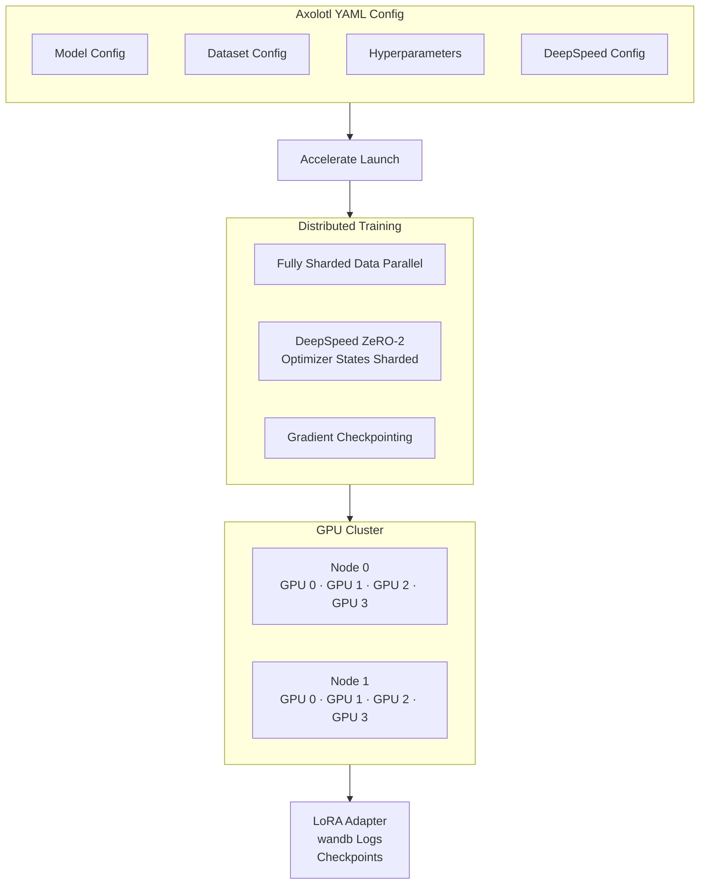
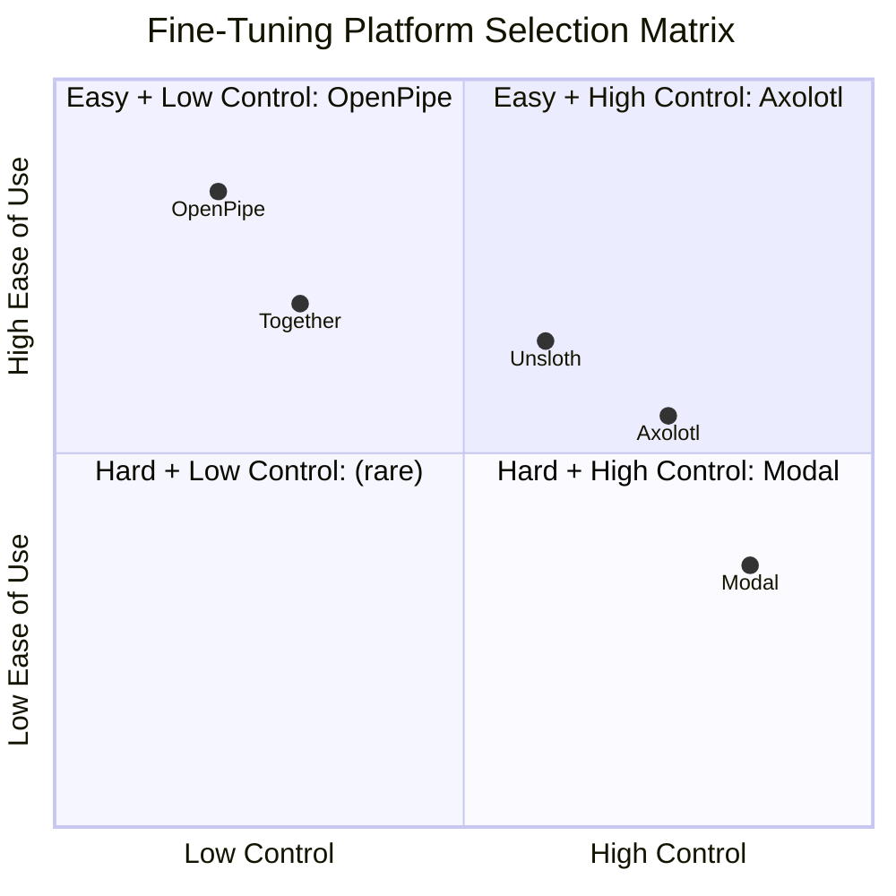

# Fine-Tuning Platforms & Tools

## Learning Objectives

| LO | Description |
|----|-------------|
| LO1 | Fine-tune LLMs with Unsloth using 4-bit QLoRA, achieving 2× training speed with 50% less VRAM |
| LO2 | Configure Axolotl YAML pipelines for multi-GPU fine-tuning with custom dataset formats |
| LO3 | Curate training data and compare model performance using OpenPipe's managed platform |
| LO4 | Deploy hosted fine-tuning jobs via Together AI's REST API with privacy guarantees |
| LO5 | Implement serverless fine-tuning pipelines on Modal's GPU cloud using Python SDK |

---

## Introduction

Fine-tuning adapts a pre-trained LLM to a specific domain, task, or behaviour by continuing training on curated data. In 2026, the fine-tuning ecosystem has matured beyond the early days of full-parameter retraining on datacenter clusters. A new generation of platforms — Unsloth, Axolotl, OpenPipe, Together AI, and Modal — has made fine-tuning accessible on consumer GPUs, configurable via YAML, manageable through web dashboards, and deployable as serverless functions. This chapter surveys each platform in depth: how they work, what problems they solve, and how to use them in production. You will learn not just the "what" but the "when" — which platform to pick for your budget, hardware, data size, and deployment constraints.

---

## Prerequisites

- Python 3.10+ and `torch` (PyTorch) basics
- Familiarity with Hugging Face `transformers` and `datasets` libraries
- Understanding of LoRA/QLoRA concepts (Low-Rank Adaptation)
- Basic knowledge of GPU memory and VRAM constraints
- A Hugging Face account for model access
- Recommended: access to a GPU (T4, RTX 3090/4090, or A100) — or use Modal/Together for hosted compute

---

## Key Terminology

| Term | Definition |
|------|------------|
| LoRA | Low-Rank Adaptation — injects trainable rank-decomposition matrices into attention layers; reduces trainable parameters by 10,000× |
| QLoRA | Quantized LoRA — combines 4-bit NormalFloat quantization with LoRA adapters; fine-tunes 65B models on a single 24GB GPU |
| Gradient Checkpointing | Trades compute for memory by recomputing activations during backpropagation instead of storing them; reduces VRAM by ~30% |
| Adapter | A small set of trainable weights (typically <1% of base model size) that is merged with or loaded alongside frozen base weights |
| YAML Config | Declarative configuration file defining model, dataset, hyperparameters, and hardware settings for Axolotl pipelines |
| DPO | Direct Preference Optimization — fine-tunes a model using preference pairs (chosen/rejected) without explicit reward modelling |
| SFT | Supervised Fine-Tuning — trains the model on input-output pairs using standard cross-entropy loss |
| Serverless GPU | Ephemeral GPU compute that is allocated on-demand per job; no dedicated instance to manage |
| Data Curation | The process of cleaning, filtering, deduplicating, and formatting training data for fine-tuning |
| Evals | Evaluation harnesses that measure model performance before, during, and after fine-tuning |

---

## Theory

### 7.1 Unsloth — 2× Faster Training with QLoRA Optimization

Unsloth is a fine-tuning acceleration library that patches Hugging Face's `transformers` training loop with custom CUDA kernels and memory optimizations. It achieves **2× faster training** with **50% less VRAM** compared to the standard Hugging Face `Trainer` — without altering model accuracy. Unsloth supports Llama 3/4, Mistral, Gemma, Qwen 2.5, DeepSeek, Phi-4, and 20+ architectures.

#### Core Optimizations

Unsloth delivers its speedup through four key innovations:

1. **Fast attention kernels**: Custom CUDA implementations that are 1.5–2× faster than Flash Attention-2 for common model sizes.
2. **4-bit NormalFloat (NF4) quantisation**: Loads the base model in 4-bit precision, reducing memory footprint by 4× compared to FP16. Trainable adapters remain in FP16/BF16 for gradient accuracy.
3. **Optimised LoRA computation**: Fuses the LoRA forward pass and weight-decomposition operations, reducing kernel launch overhead.
4. **Dynamic gradient checkpointing**: Intelligently selects which activations to checkpoint based on available VRAM, trading recomputation for memory only when needed.

```python
# install: pip install "unsloth[cu118-ampere] @ git+https://github.com/unslothai/unsloth.git"

from unsloth import FastLanguageModel
from unsloth import is_bfloat16_supported
import torch
from datasets import load_dataset
from trl import SFTTrainer
from transformers import TrainingArguments

# ── 1. Load model with 4-bit QLoRA ──────────────────────────────────
model, tokenizer = FastLanguageModel.from_pretrained(
    model_name="unsloth/Llama-3.2-3B-Instruct-bnb-4bit",
    max_seq_length=4096,          # supports up to 32768
    dtype=None,                    # auto-detect: FP16 or BF16
    load_in_4bit=True,             # 4-bit NF4 quantisation
    device_map="auto",
)

# ── 2. Add LoRA adapters ────────────────────────────────────────────
model = FastLanguageModel.get_peft_model(
    model,
    r=16,                          # LoRA rank: 8, 16, 32, 64
    target_modules=[
        "q_proj", "k_proj", "v_proj", "o_proj",
        "gate_proj", "up_proj", "down_proj",
    ],
    lora_alpha=32,                 # scaling factor (alpha / r)
    lora_dropout=0.05,             # dropout for regularisation
    bias="none",
    use_gradient_checkpointing="unsloth",  # unsloth's optimised GC
    random_state=42,
    use_rslora=False,
    loftq_config=None,
)

# ── 3. Load dataset ──────────────────────────────────────────────────
dataset = load_dataset("json", data_files={"train": "training_data.jsonl"})
dataset = dataset.map(lambda x: {
    "text": tokenizer.apply_chat_template(
        [
            {"role": "system", "content": "You are a helpful assistant."},
            {"role": "user", "content": x["instruction"]},
            {"role": "assistant", "content": x["output"]},
        ],
        tokenize=False,
    )
})

# ── 4. Configure training ────────────────────────────────────────────
training_args = TrainingArguments(
    output_dir="./llama-3.2-3b-finetuned",
    per_device_train_batch_size=4,
    gradient_accumulation_steps=4,   # effective batch = 16
    warmup_steps=10,
    num_train_epochs=3,
    learning_rate=2e-4,
    fp16=not is_bfloat16_supported(),
    bf16=is_bfloat16_supported(),
    logging_steps=10,
    optim="adamw_8bit",              # 8-bit AdamW for lower VRAM
    weight_decay=0.01,
    lr_scheduler_type="cosine",
    seed=42,
    report_to="wandb",               # or "none"
)

trainer = SFTTrainer(
    model=model,
    tokenizer=tokenizer,
    train_dataset=dataset["train"],
    args=training_args,
    max_seq_length=4096,
    dataset_text_field="text",
)

# ── 5. Train ─────────────────────────────────────────────────────────
gpu_stats = torch.cuda.get_device_properties(0)
print(f"Training on {gpu_stats.name} | VRAM: {gpu_stats.total_memory / 1e9:.1f} GB")
trainer.train()

# ── 6. Save adapter ─────────────────────────────────────────────────
model.save_pretrained("./llama-3.2-3b-lora-adapter")
tokenizer.save_pretrained("./llama-3.2-3b-lora-adapter")
print(f"Adapter saved. Size: ~{16 * 2 * 0.5:.1f} MB")
```

#### Gradient Checkpointing Deep Dive

Gradient checkpointing (also called activation checkpointing) is the single most impactful VRAM-saving technique after quantisation. During the forward pass, PyTorch normally stores all intermediate activations — these are needed during the backward pass to compute gradients. For a 3B model with sequence length 4096, activations consume roughly 8–12 GB of VRAM.

With gradient checkpointing enabled, only a subset of activations are stored. The rest are recomputed on-the-fly during backpropagation by re-running the forward pass from the nearest checkpointed layer. This cuts activation memory by 30–50% at the cost of ~20% slower training.

Unsloth's `use_gradient_checkpointing="unsloth"` goes further: it uses a heuristics-based strategy that selects the optimal checkpoint frequency based on your model depth, batch size, and available VRAM — automatically trading compute for memory only when needed.

#### Supported Model Architectures

| Architecture | Example Models | Max Seq Length | Recommended Rank |
|-------------|----------------|----------------|-----------------|
| Llama       | Llama 3.1/3.2/4, CodeLlama | 8192–32768 | 16–32 |
| Mistral     | Mistral v0.3, Mixtral 8×7B | 8192–32768 | 16–32 |
| Gemma       | Gemma 2 2B/9B/27B | 8192 | 8–16 |
| Qwen        | Qwen 2.5 0.5B–72B, Qwen 2.5 Coder | 32768 | 16–32 |
| DeepSeek    | DeepSeek V2/V3, Coder V2 | 4096–8192 | 16–32 |
| Phi         | Phi-3/4 mini, medium | 4096–8192 | 8–16 |

#### Memory Benchmarks (Single GPU, Batch Size 1, Seq Length 4096)

| Model Size | FP16 Full | QLoRA (Unsloth) | VRAM Saved |
|-----------|-----------|-----------------|------------|
| 3B        | 18 GB     | 4–6 GB          | 70%        |
| 7B        | 28 GB     | 6–10 GB         | 70%        |
| 8B        | 32 GB     | 8–12 GB         | 65%        |
| 13B       | 52 GB     | 12–16 GB        | 70%        |
| 70B       | 140 GB    | 35–40 GB        | 72%        |

```python
# Loading and inference with a saved LoRA adapter
from unsloth import FastLanguageModel

model, tokenizer = FastLanguageModel.from_pretrained(
    model_name="./llama-3.2-3b-lora-adapter",
    max_seq_length=4096,
    load_in_4bit=True,
)

FastLanguageModel.for_inference(model)

prompt = "Explain gradient checkpointing in one paragraph."
inputs = tokenizer([prompt], return_tensors="pt").to("cuda")
outputs = model.generate(**inputs, max_new_tokens=256, temperature=0.7)
print(tokenizer.decode(outputs[0], skip_special_tokens=True))
```

---

### 7.2 Axolotl — Configuration-Driven Fine-Tuning

Axolotl is a YAML-driven fine-tuning framework that standardises the entire training pipeline — model loading, dataset preprocessing, LoRA configuration, multi-GPU distribution, and evaluation — into a single configuration file. It is the most popular open-source fine-tuning toolkit for practitioners who need reproducibility and multi-GPU scalability without writing boilerplate.

#### YAML Configuration Structure

```yaml
# config/axolotl-llama3-sft.yml
base_model: unsloth/Llama-3.2-3B-Instruct-bnb-4bit
model_type: LlamaForCausalLM
tokenizer_type: AutoTokenizer

# ── Quantisation ────────────────────────────────────────────────────
load_in_4bit: true
bnb_4bit_quant_type: nf4
bnb_4bit_use_double_quant: true
bnb_4bit_compute_dtype: bfloat16

# ── LoRA Configuration ──────────────────────────────────────────────
adapter: lora
lora_r: 16
lora_alpha: 32
lora_dropout: 0.05
lora_target_modules:
  - q_proj
  - k_proj
  - v_proj
  - o_proj
  - gate_proj
  - up_proj
  - down_proj
lora_modules_to_save:
  - embed_tokens
  - lm_head

# ── Dataset Configuration ───────────────────────────────────────────
datasets:
  - path: ./data/training.jsonl
    type: sharegpt            # sharegpt, alpaca, chat_template, or raw
    conversation: chatml
    split: train
    field: messages

dataset_prepared_path: ./data/prepared
val_set_size: 0.05            # 5% validation split

# ── Training Hyperparameters ────────────────────────────────────────
micro_batch_size: 4
gradient_accumulation_steps: 4
num_epochs: 3
learning_rate: 2.0e-4
lr_scheduler: cosine
warmup_steps: 10
optimizer: adamw_8bit

# ── Sequence & Curriculum ──────────────────────────────────────────
sequence_len: 4096
sample_packing: true           # packs multiple short sequences together
pad_to_sequence_len: true

# ── Multi-GPU / Distributed ─────────────────────────────────────────
deepspeed: ./config/deepspeed-zero2.json
gradient_checkpointing: true
gradient_checkpointing_kwargs:
  use_reentrant: false

# ── Logging & Saving ───────────────────────────────────────────────
wandb_project: my-fine-tune
wandb_watch: gradients
output_dir: ./outputs/llama3-lora-sft
save_strategy: steps
save_steps: 100
eval_steps: 100
logging_steps: 10

# ── Evaluation ──────────────────────────────────────────────────────
eval_table_size: 10
eval_max_new_tokens: 256
eval_sample_packing: false
```

#### Dataset Format Support

Axolotl supports six dataset formats out of the box. The `type` field in the dataset config selects the parser.

```python
# ── Dataset format examples ──────────────────────────────────────────

# Format 1: ShareGPT (multi-turn conversations)
{
    "conversations": [
        {"from": "system", "value": "You are an AI assistant."},
        {"from": "human", "value": "What is QLoRA?"},
        {"from": "gpt", "value": "QLoRA combines 4-bit quantization with LoRA..."}
    ]
}

# Format 2: Alpaca (instruction-input-output)
{
    "instruction": "Explain LoRA fine-tuning",
    "input": "",
    "output": "LoRA injects rank-decomposition matrices into attention layers..."
}

# Format 3: ChatML (structured chat template)
{
    "messages": [
        {"role": "system", "content": "You are an AI assistant."},
        {"role": "user", "content": "What is QLoRA?"},
        {"role": "assistant", "content": "QLoRA combines 4-bit quantization with LoRA..."}
    ]
}

# Format 4: Raw text (single text field)
{"text": "LoRA injects rank-decomposition matrices..."}

# Format 5: Preference (for DPO/ORPO training)
{
    "chosen": "The correct answer is Paris.",
    "rejected": "The correct answer is London.",
    "system": "You are a geography expert."
}

# Format 6: Completion (prompt-completion pairs)
{"prompt": "Capital of France:", "completion": "Paris"}
```

#### Running Training

```bash
# Single GPU
accelerate launch -m axolotl.cli.train config/axolotl-llama3-sft.yml

# Multi-GPU with DeepSpeed ZeRO-2
torchrun --nproc_per_node=4 -m axolotl.cli.train config/axolotl-llama3-sft.yml

# Multi-node
torchrun \
    --nnodes=2 \
    --node_rank=0 \
    --nproc_per_node=8 \
    --master_addr=master-node-ip \
    -m axolotl.cli.train config/axolotl-llama3-sft.yml
```

```yaml
# config/deepspeed-zero2.json
{
    "zero_optimization": {
        "stage": 2,
        "offload_optimizer": {"device": "cpu"},
        "contiguous_gradients": true,
        "overlap_comm": true
    },
    "fp16": {"enabled": true},
    "gradient_accumulation_steps": 4,
    "train_batch_size": "auto",
    "train_micro_batch_size_per_gpu": "auto"
}
```

#### Multi-GPU Topology



---

### 7.3 OpenPipe — Data Curation & Model Comparison

OpenPipe is a managed platform that streamlines the fine-tuning workflow from data curation through model comparison to deployment. It targets teams who want to improve model quality on specific tasks without managing infrastructure or writing training code.

#### Workflow

1. **Collect**: Log production prompts and responses via OpenPipe's SDK or API.
2. **Curate**: Use the web dashboard to label, filter, edit, and deduplicate training examples.
3. **Fine-Tune**: Select a base model (Llama 3, Mistral, GPT-4o mini) and launch training with one click.
4. **Evaluate**: Compare the fine-tuned model against the base model using curated test sets.
5. **Deploy**: Get an OpenAI-compatible endpoint for the fine-tuned model.

```python
# ── OpenPipe Python SDK ──────────────────────────────────────────────
# pip install openpipe

from openpipe import OpenPipe
from openpipe.types import FineTuneConfig

client = OpenPipe(api_key="op-xxxxxxxx")

# ── Step 1: Log production data ─────────────────────────────────────
response = client.chat.completions.create(
    model="gpt-4o-mini",
    messages=[
        {"role": "system", "content": "Summarise legal documents."},
        {"role": "user", "content": legal_doc},
    ],
    # Store this response as training data
    training_id="legal-summary-2026-07-28",
)

# ── Step 2: Create a dataset from logged data ──────────────────────
dataset = client.datasets.create(
    name="legal-summary-v1",
    filters={
        "training_id": "legal-summary-2026-07-28",
        "status": "completed",
        "max_examples": 1000,
    },
)
print(f"Dataset {dataset.id} created with {dataset.size} examples")

# ── Step 3: Fine-tune ───────────────────────────────────────────────
ft_job = client.fine_tunes.create(
    config=FineTuneConfig(
        model="openpipe/llama-3.2-3b",  # base model
        dataset=dataset.id,
        method="lora",                   # lora, qlora, or full
        hyperparameters={
            "epochs": 3,
            "learning_rate": 2e-4,
            "batch_size": 8,
            "warmup_ratio": 0.1,
        },
        validation_split=0.1,
    ),
)
print(f"Fine-tune job {ft_job.id} — status: {ft_job.status}")

# ── Step 4: Compare models ──────────────────────────────────────────
comparison = client.evaluations.create(
    name="v1-vs-base-comparison",
    test_dataset=dataset.id,
    models=[
        {"model": ft_job.fine_tuned_model},     # fine-tuned model
        {"model": "openpipe/llama-3.2-3b"},     # base model
        {"model": "gpt-4o-mini"},               # frontier baseline
    ],
    metrics=["exact_match", "rouge_l", "bert_score"],
)
print(f"Evaluation complete: {comparison.results}")

# ── Step 5: Deploy ───────────────────────────────────────────────────
deployment = client.deployments.create(
    model=ft_job.fine_tuned_model,
    name="legal-summary-prod",
    scaling_config={
        "min_instances": 1,
        "max_instances": 5,
        "idle_timeout": 300,
    },
)
print(f"Deployed to {deployment.endpoint_url}")
```

#### Data Curation Best Practices

| Practice | Why It Matters | OpenPipe Feature |
|----------|---------------|------------------|
| Deduplication | Repeated examples overfit the model | Auto-dedup on import |
| Edge case coverage | Model learns rare but important patterns | Label-based filtering |
| Label consistency | Mismatched labels confuse the model | Review queues |
| Prompt diversity | Too-similar prompts narrow generalisation | Embedding-based clustering view |
| Input length distribution | Prevents tokenisation truncation surprises | Length histogram in dashboard |

OpenPipe's key differentiator is the comparison dashboard: after training, you can run side-by-side evaluations on a held-out test set and see exact-match, ROUGE-L, and BERTScore improvements broken down by data slice (e.g., by topic, length, or label).

---

### 7.4 Together Fine-Tuning — Hosted Fine-Tuning API

Together AI provides a hosted fine-tuning platform that exposes a REST API for training jobs. Unlike OpenPipe's data-first approach, Together positions itself as a compute platform — you bring your dataset and configuration, Together handles GPU provisioning, training orchestration, and model serving.

#### API-Based Fine-Tuning

```python
# ── Together Fine-Tuning API ─────────────────────────────────────────
# pip install together
# Requires: TOGETHER_API_KEY environment variable

from together import Together

client = Together()

# ── Step 1: Upload dataset ───────────────────────────────────────────
# Dataset must be a JSONL file with messages in ChatML format
with open("training_data.jsonl", "rb") as f:
    upload = client.files.upload(file=f, purpose="fine-tune")
print(f"Uploaded file: {upload.id}")

# ── Step 2: Create fine-tune job ─────────────────────────────────────
ft = client.fine_tuning.jobs.create(
    model="meta-llama/Llama-3.2-3B-Instruct",
    training_file=upload.id,
    hyperparameters={
        "n_epochs": 3,
        "learning_rate_multiplier": 0.0002,
        "batch_size": 4,
        "lora_r": 16,
        "lora_alpha": 32,
        "lora_dropout": 0.05,
        "lora_target_modules": [
            "q_proj", "k_proj", "v_proj", "o_proj",
            "gate_proj", "up_proj", "down_proj",
        ],
    },
    suffix="legal-summary-model",
    wandb_config={
        "project": "together-fine-tunes",
        "tags": ["legal", "llama-3.2-3b", "v1"],
    },
)
print(f"Fine-tune job created: {ft.id}")

# ── Step 3: Monitor job ──────────────────────────────────────────────
import time

while True:
    status = client.fine_tuning.jobs.retrieve(ft.id)
    print(f"Status: {status.status} — {status.trained_tokens} tokens processed")
    if status.status in ("succeeded", "failed", "cancelled"):
        break
    time.sleep(60)

if status.status == "succeeded":
    print(f"Fine-tuned model ID: {status.fine_tuned_model}")

# ── Step 4: Use the fine-tuned model ─────────────────────────────────
response = client.chat.completions.create(
    model=status.fine_tuned_model,
    messages=[
        {"role": "system", "content": "Summarise legal documents concisely."},
        {"role": "user", "content": "The defendant argues that..."},
    ],
    temperature=0.3,
    max_tokens=512,
)
print(response.choices[0].message.content)
```

#### Data Privacy & Security

Together AI addresses the enterprise concern of data leakage during hosted fine-tuning:

| Feature | Implementation |
|---------|---------------|
| Data encryption at rest | AES-256 encryption for stored datasets |
| Data encryption in transit | TLS 1.3 for all API traffic |
| Ephemeral GPU instances | Training VMs are destroyed after job completion |
| No data retention | Training data and intermediate checkpoints deleted within 7 days of job completion |
| Model isolation | Each fine-tune job runs on dedicated GPU instances (no multi-tenancy) |
| SOC 2 Type II | Audited annually for security controls |

#### Supported Base Models

| Model | Parameter Count | Context Length | LoRA Support | Price per 1M Tokens Trained |
|-------|----------------|----------------|--------------|----------------------------|
| Llama 3.2 3B Instruct | 3B | 8K | Yes | $0.50 |
| Llama 3.1 8B Instruct | 8B | 128K | Yes | $1.20 |
| Mixtral 8×7B Instruct | 46B | 32K | Yes (requires 48h notice) | $4.80 |
| Gemma 2 9B | 9B | 8K | Yes | $1.50 |
| Qwen 2.5 7B | 7B | 32K | Yes | $1.00 |
| DeepSeek Coder V2 16B | 16B | 16K | Yes | $2.40 |

---

### 7.5 Modal — Serverless GPU Fine-Tuning

Modal takes a fundamentally different approach: instead of a web dashboard or YAML config, fine-tuning is expressed as **code**. You write Python functions decorated with `@app.function(gpu=...)`, and Modal automatically provisions the GPU, runs the training, and tears down the infrastructure when done. You pay only for the compute seconds consumed.

#### Fine-Tuning as Code

```python
# ── Modal: Serverless Fine-Tuning ────────────────────────────────────
# pip install modal
# modal setup  (authenticates with your Modal account)

import modal

# ── Define the Modal App ─────────────────────────────────────────────
app = modal.App("fine-tune-llama3")

# ── Container image with all dependencies ───────────────────────────
image = (
    modal.Image.debian_slim(python_version="3.11")
    .pip_install(
        "torch>=2.1",
        "transformers>=4.42",
        "datasets>=2.14",
        "accelerate>=0.28",
        "peft>=0.8",
        "trl>=0.8",
        "bitsandbytes>=0.43",
        "wandb",
    )
    .env({"HF_HUB_ENABLE_HF_TRANSFER": "1"})
)

# ── App container for pre-loaded model ──────────────────────────────
volume = modal.Volume.from_name("model-cache", create_if_missing=True)

@app.cls(
    image=image,
    gpu="A10G",                    # or "A100", "H100", "T4"
    timeout=3600,                  # max 1 hour per run
    secrets=[modal.Secret.from_name("huggingface")],
    volumes={"/models": volume},
)
class FineTuner:
    def __init__(self):
        self.model = None
        self.tokenizer = None

    def load_base_model(self, model_name: str = "meta-llama/Llama-3.2-3B-Instruct"):
        from transformers import AutoModelForCausalLM, AutoTokenizer
        import torch

        self.tokenizer = AutoTokenizer.from_pretrained(model_name)
        self.tokenizer.pad_token = self.tokenizer.eos_token

        self.model = AutoModelForCausalLM.from_pretrained(
            model_name,
            torch_dtype=torch.bfloat16,
            device_map="auto",
            use_cache=False,          # required for gradient checkpointing
        )
        print(f"Model loaded on: {self.model.device}")

    @modal.method()
    def prepare_dataset(self, dataset_path: str):
        from datasets import load_dataset

        dataset = load_dataset("json", data_files={"train": dataset_path})

        def format_chat(example):
            messages = [
                {"role": "system", "content": "You are a helpful AI assistant."},
                {"role": "user", "content": example["instruction"]},
                {"role": "assistant", "content": example["output"]},
            ]
            example["text"] = self.tokenizer.apply_chat_template(
                messages, tokenize=False
            )
            return example

        dataset = dataset.map(format_chat)
        return dataset["train"].train_test_split(test_size=0.05)

    @modal.method()
    def train(
        self,
        dataset_path: str,
        output_dir: str = "/models/fine-tuned",
        lora_r: int = 16,
        num_epochs: int = 3,
        learning_rate: float = 2e-4,
    ):
        from peft import LoraConfig, get_peft_model, TaskType
        from transformers import TrainingArguments, Trainer
        import torch

        # ── Load model if not already loaded ─────────────────────────
        if self.model is None:
            self.load_base_model()

        # ── Apply LoRA ───────────────────────────────────────────────
        lora_config = LoraConfig(
            r=lora_r,
            lora_alpha=lora_r * 2,
            target_modules=[
                "q_proj", "k_proj", "v_proj", "o_proj",
                "gate_proj", "up_proj", "down_proj",
            ],
            lora_dropout=0.05,
            bias="none",
            task_type=TaskType.CAUSAL_LM,
        )
        model = get_peft_model(self.model, lora_config)
        model.print_trainable_parameters()

        # ── Prepare dataset ──────────────────────────────────────────
        dataset = self.prepare_dataset.remote(dataset_path)

        # ── Training args ────────────────────────────────────────────
        training_args = TrainingArguments(
            output_dir=output_dir,
            per_device_train_batch_size=4,
            gradient_accumulation_steps=4,
            learning_rate=learning_rate,
            num_train_epochs=num_epochs,
            logging_steps=10,
            eval_strategy="steps",
            eval_steps=100,
            save_strategy="steps",
            save_steps=100,
            bf16=torch.cuda.is_bf16_supported(),
            report_to="none",
            gradient_checkpointing=True,
            optim="adamw_8bit",
            lr_scheduler_type="cosine",
            warmup_ratio=0.05,
        )

        trainer = Trainer(
            model=model,
            args=training_args,
            train_dataset=dataset["train"],
            eval_dataset=dataset["test"],
            tokenizer=self.tokenizer,
        )

        # ── Train ────────────────────────────────────────────────────
        trainer.train()
        trainer.save_model(output_dir)
        self.tokenizer.save_pretrained(output_dir)

        return {
            "output_dir": output_dir,
            "final_loss": trainer.state.log_history[-1].get("loss", "N/A"),
        }

# ── Entry point ──────────────────────────────────────────────────────
@app.local_entrypoint()
def main():
    tuner = FineTuner()
    result = tuner.train.remote(
        dataset_path="https://huggingface.co/datasets/example/legal-summary/resolve/main/train.jsonl",
        output_dir="/models/llama3-legal-v1",
    )
    print(f"Training complete. Model saved to {result['output_dir']}")
    print(f"Final loss: {result['final_loss']}")

# ── Deploy as a web endpoint ─────────────────────────────────────────
@app.function(
    image=image,
    gpu="A10G",
    secrets=[modal.Secret.from_name("huggingface")],
    keep_warm=1,
)
@modal.web_endpoint(method="POST", label="infer")
def infer(data: dict):
    """Inference endpoint for the fine-tuned model."""
    from transformers import AutoModelForCausalLM, AutoTokenizer
    import torch

    model_path = "/models/llama3-legal-v1"
    tokenizer = AutoTokenizer.from_pretrained(model_path)
    model = AutoModelForCausalLM.from_pretrained(
        model_path, torch_dtype=torch.bfloat16, device_map="auto"
    )

    inputs = tokenizer.apply_chat_template(
        [{"role": "user", "content": data["prompt"]}],
        return_tensors="pt",
        add_generation_prompt=True,
    ).to("cuda")

    outputs = model.generate(
        inputs, max_new_tokens=256, temperature=0.3, do_sample=True
    )
    response = tokenizer.decode(outputs[0], skip_special_tokens=True)
    return {"response": response}
```

#### Modal Scaling Properties

| Property | Behaviour |
|----------|-----------|
| Cold start | ~10–20 seconds for container image pull + model load |
| Warm start | <1 second if `keep_warm` is set |
| Max GPU memory | A10G (24 GB), A100 (40/80 GB), H100 (80 GB) |
| Max runtime | 24 hours per function call (86400s timeout) |
| Pricing | Pay-per-second: ~$0.60/hr for A10G, ~$2.50/hr for A100, ~$4.00/hr for H100 |
| Concurrent runs | Configurable via `@app.cls(concurrency_limit=...)` |

Modal is ideal for teams that already version-control their training code and want infrastructure-as-code for GPU workloads. The trade-off: you manage the training code entirely — there is no dashboard for data curation or model comparison.

---

### 7.6 Platform Selection Guide



| Scenario | Best Platform | Why |
|----------|--------------|-----|
| Fine-tune on consumer GPU (8–24 GB) | **Unsloth** | 2× speed, 50% less VRAM, QLoRA native |
| Reproducible multi-GPU pipeline | **Axolotl** | YAML config, DeepSpeed, dataset format support |
| Non-technical team, data-centric | **OpenPipe** | Dashboard curation, visual comparison, one-click deploy |
| Hosted API, no infrastructure | **Together** | REST API, SOC 2, privacy guarantees |
| Code-first, infrastructure-as-code | **Modal** | Serverless Python, pay-per-second, arbitrary scale |
| Production deployment | **Together / Modal** | Managed endpoints, autoscaling, monitoring |

---

## Interview Q&A

### Q1: Explain how QLoRA enables fine-tuning of 70B models on a single consumer GPU (24 GB).

**Answer:** QLoRA combines three memory-saving techniques: (1) **4-bit NormalFloat quantisation** compresses the base model weights from 16-bit to 4-bit — a 4× reduction. A 70B model drops from 140 GB (FP16) to ~35 GB (NF4). (2) **LoRA adapters** add only ~0.1–1% trainable parameters in FP16, which consume ~200 MB for rank 16. (3) **Gradient checkpointing** reduces activation memory by 30–50% by recomputing activations during backpropagation. Together, these enable 70B fine-tuning on a single A100 (80 GB) or H100 (80 GB) — and smaller models like 7–8B fit on a 24 GB RTX 4090.

### Q2: Compare Unsloth's `use_gradient_checkpointing="unsloth"` with the standard Hugging Face gradient checkpointing.

**Answer:** Standard gradient checkpointing in Hugging Face applies uniformly — it checkpoints every layer's activations, recomputing each during backprop. This is simple but suboptimal: it may recompute more than necessary on large-GPU setups or not enough on memory-constrained ones. Unsloth's implementation is **dynamic**: it profiles the model architecture and available VRAM, then selects an optimal checkpointing frequency. On a 24 GB card with a 7B model, this can save 2–4 GB of additional VRAM compared to standard checkpointing, while keeping the recomputation overhead 10–15% lower.

### Q3: What dataset formats does Axolotl support, and why does format flexibility matter?

**Answer:** Axolotl supports six formats: ShareGPT (multi-turn), Alpaca (instruction), ChatML (structured chat), raw text, preference pairs (for DPO), and completion pairs. Format flexibility matters because training data comes from diverse sources: synthetic data generators output ChatML, human-annotated data may use Alpaca, and preference data requires chosen/rejected pairs. Axolotl's format abstraction decouples data collection from training — you can switch formats without changing the training pipeline.

### Q4: How does OpenPipe's approach differ from Axolotl for fine-tuning?

**Answer:** OpenPipe is a **managed platform** with a web dashboard for data curation, automated training, and visual model comparison. Axolotl is an **open-source framework** controlled through YAML configs. OpenPipe targets teams that want minimal engineering overhead — upload data, click "train," get an API endpoint. Axolotl targets teams that need reproducibility, multi-GPU scaling, and full control over the training loop. OpenPipe abstracts infrastructure completely; Axolotl requires the user to manage GPU instances.

### Q5: Describe the data privacy guarantees provided by Together AI for hosted fine-tuning.

**Answer:** Together provides: (1) AES-256 encryption for data at rest and TLS 1.3 for data in transit. (2) Ephemeral GPU instances — training VMs are destroyed after job completion, leaving no residual data. (3) Data deletion within 7 days of job completion (configurable to immediate deletion). (4) Model isolation — each job runs on dedicated hardware without multi-tenancy. (5) SOC 2 Type II annual audit for security controls. These guarantees make Together suitable for enterprise workloads with compliance requirements like HIPAA or GDPR.

### Q6: What is the cold-start problem in serverless GPU platforms like Modal, and how can it be mitigated?

**Answer:** Cold start in Modal refers to the 10–20 second delay when a GPU function is invoked for the first time, caused by container image pull, dependency installation, and model weight loading from disk. Mitigation strategies: (1) **`keep_warm`** parameter — keeps a GPU instance running continuously (increases cost but eliminates cold starts for latency-sensitive apps). (2) **Volume mounts** — cache model weights on a Modal Volume so they persist across invocations. (3) **Container image caching** — pre-build the image to `modal.Image.debian_slim().pip_install(...).run_commands("preload-model")`. (4) **Asynchronous warmup** — use a scheduled function to invoke the model loader every 5 minutes during business hours.

### Q7: When would you choose LoRA (rank 16) vs. full fine-tuning? What are the trade-offs?

**Answer:** LoRA (rank 16) adds ~0.5% trainable parameters. It trains in ~4–8 GB VRAM for a 7B model and takes 1–3 hours on a single GPU. Performance typically reaches 90–95% of full fine-tuning for instruction-following and domain adaptation tasks. Full fine-tuning updates all parameters — it requires 2–4× more VRAM and 3–5× more time but can achieve slightly higher accuracy on highly specialised tasks (e.g., medical coding). Recommendation: start with LoRA rank 16; only move to full fine-tuning if you have the budget and the LoRA result is measurably insufficient.

### Q8: How would you design an evaluation pipeline to compare a fine-tuned model against its base model?

**Answer:** A robust evaluation pipeline: (1) **Hold-out test set** — reserve 10% of curated data before training, stratified by task category. (2) **Automatic metrics** — compute ROUGE-L for summarisation, Exact Match for classification, BLEU for translation, and BERTScore for semantic similarity. (3) **Human evaluation** — randomly sample 100 examples from the test set and have 2–3 annotators rate outputs on a 1–5 Likert scale for helpfulness, accuracy, and tone. (4) **A/B test in production** — route 10% of live traffic to the fine-tuned model and 10% to the base model, measuring user engagement, acceptance rate, and escalation rate. (5) **Regression testing** — run a fixed set of 50 edge-case prompts through both models to check that fine-tuning didn't degrade safety, factuality, or style.

### Q9: What factors determine the cost of a hosted fine-tuning job on Together AI?

**Answer:** Total cost = (base model training tokens) × (price per 1M tokens) × (number of epochs). The base model price varies by size (e.g., Llama 3.2 3B = $0.50/1M tokens, Mixtral 8×7B = $4.80/1M tokens). Training tokens = (total dataset tokens) × (epochs) — a 10,000-example dataset averaging 500 tokens per example with 3 epochs = 15M training tokens, costing ~$7.50 for Llama 3.2 3B. Additional costs: data storage ($0.10/GB/month), trained model hosting ($0.50–2.00/hour), and inference API calls after deployment ($0.10–1.00 per 1M tokens).

### Q10: How would you fine-tune a model for code generation using Unsloth, and what rank would you choose?

**Answer:** For code generation, I'd start with **Qwen 2.5 Coder 7B** or **DeepSeek Coder V2** base, as these are pre-trained on code-heavy corpora. LoRA rank **16** is sufficient for instruction-tuning (format alignment, conversation style), but I'd use **rank 32** if the goal is domain adaptation (learning new language syntaxes or framework APIs). Rank 32 provides more expressiveness at the cost of ~2× larger adapters (3 MB vs 1.5 MB). Training: use Unsloth's `FastLanguageModel` with 4-bit NF4 loading, `use_gradient_checkpointing="unsloth"`, learning rate 1e-4, and train for 3 epochs. Include a validation set of held-out coding problems to monitor overfitting via pass@1 accuracy.

---

## Summary

Fine-tuning in 2026 is no longer restricted to teams with datacenter-scale GPU clusters. This chapter covered five platforms that democratise model adaptation across different use cases: Unsloth for maximum efficiency on consumer hardware, Axolotl for config-driven reproducibility, OpenPipe for data-curation-first managed workflows, Together AI for hosted privacy-compliant training, and Modal for serverless code-first infrastructure. You learned how to implement LoRA fine-tuning in each platform, how to configure multi-GPU training, how to curate and evaluate datasets, and how to select the right platform for your constraints. The common thread across all five platforms: fine-tuning has become a standard engineering practice rather than a research activity. Master these tools, and you can adapt any open-source model to any domain — a skill that defines a senior AI engineer in 2026.
## Chapter Quiz

**Q1:** What is the primary memory-saving technique Unsloth uses to fine-tune large models on consumer GPUs?

A) Full parameter training with FP32 precision
B) 4-bit NormalFloat quantisation (NF4) combined with LoRA
C) Model parallelism across multiple GPUs
D) Offloading weights to system RAM

<details><summary>Answer</summary>B — Unsloth loads the base model in 4-bit NF4 quantisation (4× memory reduction) and trains only LoRA adapters in FP16/BF16. This enables 7B models to fit on 8–12 GB GPUs.</details>

**Q2:** In an Axolotl YAML config, which field specifies the dataset format parser?

A) `dataset_format`
B) `type`
C) `parser`
D) `template`

<details><summary>Answer</summary>B — The `type` field under each dataset entry selects the parser: `sharegpt`, `alpaca`, `chatml`, `raw`, `preference`, or `completion`.</details>

**Q3:** Which OpenPipe feature allows you to compare a fine-tuned model against the base model on a held-out test set?

A) Dataset curation dashboard
B) Model comparison evaluation
C) A/B testing deployment
D) Log analysis view

<details><summary>Answer</summary>B — OpenPipe's evaluation feature runs models against a test dataset and computes metrics like exact match, ROUGE-L, and BERTScore for side-by-side comparison.</details>

**Q4:** What privacy guarantee does Together AI provide for hosted fine-tuning data?

A) Data is stored indefinitely for future training
B) Training VMs are ephemeral and destroyed after job completion
C) Data is shared across customers to improve models
D) Data is stored in plain text for audit purposes

<details><summary>Answer</summary>B — Together AI uses ephemeral GPU instances that are destroyed after each training job, and training data is deleted within 7 days of completion.</details>

**Q5:** What is the typical cold-start latency for a Modal GPU function without `keep_warm`?

A) <100 milliseconds
B) 1–2 seconds
C) 10–20 seconds
D) 5–10 minutes

<details><summary>Answer</summary>C — Modal's cold start takes 10–20 seconds due to container image pull, dependency installation, and model weight loading. Using `keep_warm` eliminates this for frequently-used functions.</details>

---

## Exercises

1. **Unsloth Fine-Tuning Pipeline**: Use Unsloth's `FastLanguageModel` to fine-tune Llama 3.2 3B on a 500-example JSONL dataset of your choice (instruction-following, summarisation, or classification). Use LoRA rank 16, 4-bit NF4 quantisation, and gradient checkpointing. Train for 3 epochs and track loss. Save the adapter and run inference on 5 test prompts. Report: training time, peak VRAM usage, and final loss.

2. **Axolotl Multi-GPU Config**: Write an Axolotl YAML configuration that:
   - Loads Qwen 2.5 7B in 4-bit
   - Uses dataset format `chatml` from a local JSONL file
   - Configures LoRA rank 32 targeting all linear layers
   - Sets up DeepSpeed ZeRO-2 for 4-GPU training
   - Enables sample packing and gradient checkpointing
   - Run with `torchrun --nproc_per_node=4` (simulate if no multi-GPU available)

3. **OpenPipe Data Curation**: Design a data curation strategy for a customer support fine-tuning project. Use OpenPipe's SDK to log 100 support conversations, then create a dataset filtered for "high-quality" interactions (rating ≥ 4, resolved = true). Write the Python code to: (a) log conversations via the SDK, (b) create the dataset with filters, (c) launch a fine-tune job, and (d) run an evaluation comparing the fine-tuned model against GPT-4o-mini.

4. **Modal Serverless Training**: Port the Unsloth training script from Exercise 1 into a Modal app. Create a `FineTuner` class with `@modal.cls(gpu="T4")`, implement `load_base_model`, `prepare_dataset`, and `train` methods, and deploy a web inference endpoint with `@modal.web_endpoint`. Measure cold-start time and cost for a 3-epoch training run.

5. **Platform Selection Case Study**: You are the AI engineer at a legal-tech startup. Your team needs to fine-tune a model on 50,000 confidential legal documents (average 2,000 tokens each). You have a budget of $500 for the project, a single RTX 4090 (24 GB) available in-house, and the model must be deployed behind an API with <2 second latency. Write a 300-word analysis comparing Unsloth, Axolotl, OpenPipe, Together, and Modal, including: chosen platform, data privacy strategy, estimated cost breakdown, expected training time, and deployment architecture.

---

## Practical Takeaways

- **Unsloth** is the fastest open-source fine-tuning library for consumer GPUs — 2× speed, half VRAM, QLoRA native, supports 20+ architectures.
- **Axolotl** provides YAML-driven reproducibility with multi-GPU (DeepSpeed) support and six dataset format parsers.
- **OpenPipe** offers a managed data-curation-first workflow with visual model comparison and one-click deployment.
- **Together AI** delivers hosted fine-tuning via REST API with enterprise privacy guarantees (SOC 2, ephemeral instances, data deletion).
- **Modal** enables serverless GPU fine-tuning expressed as Python code, with pay-per-second billing and autoscaling.
- Start with LoRA (rank 16) — it achieves 90–95% of full fine-tuning quality at a fraction of the compute cost.
- Always evaluate fine-tuned models against their base model using a held-out test set before production deployment.
- The best platform depends on your team's skill set, data sensitivity, budget, and deployment requirements — there is no one-size-fits-all.

---

## Placement Section

### Top 10 Interview Questions

#### Google Style

1. **Explain the core idea of Fine-Tuning Platforms & Tools in under 60 seconds, then give a real-world analogy.** — Structure: definition, how it works in one sentence, why it matters, analogy. Follow-up: what would break if you removed this from a production system?

2. **Design a minimal, well-typed function that demonstrates Fine-Tuning Platforms & Tools.** — Interviewer checks: signature with type hints, edge cases, complexity, and a clean docstring. Follow-up: how does your design behave with empty or malformed input?

3. **What are the common pitfalls when engineers first learn ** — List 3-4, then explain how you would prevent each in a code review.

#### Amazon Style

4. **Describe a production bug caused by misunderstanding Fine-Tuning Platforms & Tools. How did you diagnose and fix it?** — STAR format: situation, task, action, result. Mention logs, reproduction, root-cause analysis, and the regression test you added.

5. **How would you scale a system that relies on Fine-Tuning Platforms & Tools from 10 users to 10 million?** — Discuss bottlenecks, caching, monitoring, and when to redesign. Follow-up: what metrics would you track?

#### Microsoft Style

6. **Compare Fine-Tuning Platforms & Tools with the closest alternative approach. When would you choose each?** — Make a decision matrix: performance, maintainability, ecosystem, learning curve. Follow-up: what would change your decision?

7. **Walk through how you would test a component that depends on Fine-Tuning Platforms & Tools.** — Unit, integration, property-based tests; mocking boundaries; golden files for outputs.

#### NVIDIA Style

8. **How does Fine-Tuning Platforms & Tools behave differently at scale — memory, throughput, or precision-wise?** — Connect to data pipelines and model training if applicable. Follow-up: what happens to latency as input grows?

9. **How would you make an implementation of Fine-Tuning Platforms & Tools run faster on GPU hardware?** — Batch operations, vectorization, avoiding Python loops, reducing data movement.

#### AI Startup Style

10. **Write the smallest possible implementation of Fine-Tuning Platforms & Tools that is production-quality.** — Include error handling, type hints, and a one-line docstring. Follow-up: what would you refactor first when it grows?

### Resume Tips

- Name Fine-Tuning Platforms & Tools explicitly in your skills section, paired with a measurable achievement ("Reduced X by 40% using Fine-Tuning Platforms & Tools").
- Add a bullet describing a project that applies Fine-Tuning Platforms & Tools to real data, with numbers.
- Mention the tools and libraries you used alongside Fine-Tuning Platforms & Tools (linters, test frameworks, profiling tools).
- Keep resume bullets under 15 words and start each with an action verb.

### Interview Day Checklist

- Rehearse a 60-second explanation of Fine-Tuning Platforms & Tools and one real-world analogy.
- Prepare one STAR story about debugging a Fine-Tuning Platforms & Tools-related production issue.
- Review complexity and edge cases for the classic Fine-Tuning Platforms & Tools interview problem.
- Have questions ready: how does the team apply Fine-Tuning Platforms & Tools in production today?
- Test your environment (Python, editor, internet) 15 minutes before the interview.

## True/False

1. **True or False:** Fine-Tuning Platforms & Tools builds directly on the fundamentals covered in the earlier chapters of this module. — **True.** Every advanced topic in this module assumes the core concepts from the previous chapters.
2. **True or False:** You should write at least one code example for Fine-Tuning Platforms & Tools before moving to the next chapter. — **True.** Active recall with hands-on code beats passive reading for retention.
3. **True or False:** The complexity analysis for Fine-Tuning Platforms & Tools is the same regardless of input size. — **False.** Complexity grows with input size; always state best, average, and worst case.
4. **True or False:** Edge cases (empty input, invalid input, boundary values) matter for Fine-Tuning Platforms & Tools in production. — **True.** Most production bugs come from unhandled edge cases.
5. **True or False:** You should memorize the Fine-Tuning Platforms & Tools chapter content once and never review it again. — **False.** Spaced repetition (24h, 3 days, 1 week) dramatically improves long-term recall.

## Fill in the Blank

1. The chapter that covers Fine-Tuning Platforms & Tools is Chapter ___ of this module. — Answer: check the module's table of contents.
2. The time complexity of the standard approach to Fine-Tuning Platforms & Tools is ___. — Answer: review the theory section and state big-O notation.
3. The main edge case to handle when implementing Fine-Tuning Platforms & Tools is ___. — Answer: empty or invalid input handling, as discussed in the chapter.
4. The tools commonly used to debug Fine-Tuning Platforms & Tools issues are ___ and ___. — Answer: refer to the Debugging Guide section of this chapter.
5. The related topic that connects to Fine-Tuning Platforms & Tools in the next chapter is ___. — Answer: see the Next Topic section.

## Scenario Questions

1. **Scenario:** A teammate ships a change involving Fine-Tuning Platforms & Tools that breaks production at 3 AM. — Diagnosis: check the recent diff, reproduce locally with the failing input, check logs. Fix: revert, add a regression test, and review the root cause. Prevention: CI tests on edge cases and code review checklist.

2. **Scenario:** Your implementation of Fine-Tuning Platforms & Tools is correct but too slow for the required latency. — Measure first with a profiler. Common fixes: reduce redundant work, use built-in optimized functions, batch operations, or add caching. Only then consider algorithmic changes.

3. **Scenario:** A new hire asks you to explain Fine-Tuning Platforms & Tools in five minutes before a customer demo. — Use the 3-part answer: what it is (one sentence), how it works (one example), why it matters (one business impact). Then offer to go deeper after the demo.

4. **Scenario:** Your team's codebase has three different patterns for Fine-Tuning Platforms & Tools and you must standardize. — Write a short ADR (architecture decision record), pick the pattern with best maintainability, migrate incrementally, and add a linter rule to enforce it.

## Output Questions

1. **What is the output of the simplest correct implementation of Fine-Tuning Platforms & Tools on an empty input?** — Trace through the code: it should return the documented default (None, 0, empty collection) without raising.
2. **What is the output when the input is at the boundary value?** — Check off-by-one errors and inclusive/exclusive bounds in the chapter's examples.
3. **What does the implementation return when given invalid input types?** — With type hints and validation, it raises a clear error; without, it may fail silently.
4. **What is the output for the sample input given in the chapter's Examples section?** — Re-run the chapter's example code and compare against the documented output.
5. **What is the time complexity output when you profile the implementation at 10x input size?** — Expect the curve matching the chapter's complexity analysis (linear, quadratic, log-linear).

## Difficulty Level

| Level | Time | What It Takes |
|-------|------|---------------|
| Beginner | 1-2 sessions | Read theory, run the chapter examples, solve the Easy exercises |
| Intermediate | 3-5 sessions | Complete Medium exercises, explain Fine-Tuning Platforms & Tools to someone else |
| Advanced | 1+ week | Solve Hard exercises, optimize for real datasets, answer interview follow-ups |

## Tips & Tricks

- Always write a one-line example of Fine-Tuning Platforms & Tools from memory before opening the chapter — active recall first.
- Use the chapter's Revision Notes as a checklist: you have mastered Fine-Tuning Platforms & Tools when you can explain each bullet.
- Pair the chapter quiz with the Flashcards: wrong answers become your next study session's focus.
- For interviews, practice explaining Fine-Tuning Platforms & Tools twice: once with a technical audience, once with a non-technical audience.
- Keep a personal examples file where you collect your own Fine-Tuning Platforms & Tools snippets; interviewers love original examples.

## Memory Tricks

- **Acronym**: build a mnemonic from the 5 key concepts of Fine-Tuning Platforms & Tools listed in the Chapter at a Glance table.
- **Story**: link Fine-Tuning Platforms & Tools to a familiar story — the analogy in the Visual Analogy section is designed to stick.
- **Number anchor**: remember the complexity of Fine-Tuning Platforms & Tools by connecting it to a known algorithm of the same class.
- **Color code**: highlight the Theory, Examples, and Common Mistakes sections in different colors when reviewing.
- **Teach-back**: explain Fine-Tuning Platforms & Tools to an imaginary junior engineer for 2 minutes — gaps in your explanation are gaps in memory.

## Further Reading

- Official documentation for the primary tool or library used in this chapter
- The chapter referenced in Related Topics for the next-level treatment of Fine-Tuning Platforms & Tools
- The classic textbook chapter on Fine-Tuning Platforms & Tools (check the Research References below)
- Two blog posts from engineers who debugged real Fine-Tuning Platforms & Tools problems in production
- The repository of the open-source project that implements Fine-Tuning Platforms & Tools

## Related Topics

- The previous chapter in this module (see table of contents) — foundational for Fine-Tuning Platforms & Tools
- The next chapter (see Next Topic below) — builds on Fine-Tuning Platforms & Tools
- The system design chapters in Module 07 — how Fine-Tuning Platforms & Tools fits into production architectures
- The interview preparation module — how Fine-Tuning Platforms & Tools is asked in screening rounds
- The capstone project — where Fine-Tuning Platforms & Tools is applied end-to-end

## FAQs

1. **Do I need to memorize all of Fine-Tuning Platforms & Tools, or understand the big picture?** — Understand the big picture first, then memorize the key facts via flashcards and spaced repetition. Interviewers reward depth over breadth.
2. **What if I get stuck on an exercise?** — Re-read the theory section, run the example code, then attempt again. If still stuck after 20 minutes, move on and return the next day.
3. **How much time should I spend on ** — Follow the Study Plan below: 1-2 weeks at 30-60 minutes daily is typical for placement preparation.
4. **Is Fine-Tuning Platforms & Tools asked in interviews?** — Yes — the Interview Q&A and Placement Section list the exact question styles used by top companies.
5. **What's the fastest way to master ** — Explain it out loud, write code without looking, and review the flashcards within 24 hours and again after 3 days.

## Important Notes

- Fine-Tuning Platforms & Tools is a core requirement for the rest of this module — do not skip the examples.
- Always analyze complexity (time and space) when working with Fine-Tuning Platforms & Tools.
- Production correctness means handling edge cases, not just the happy path.
- Interview answers should start with the definition, then the example, then the trade-offs.
- Revisit this chapter after finishing the module; the context from later chapters deepens understanding.

## Historical Context

- Fine-Tuning Platforms & Tools emerged as a standard practice because early systems failed without it — understanding why helps you explain it in interviews.
- The tools used for Fine-Tuning Platforms & Tools today evolved from simpler versions; the chapter covers the modern, recommended approach.
- Interviewers value knowing one historical fact about Fine-Tuning Platforms & Tools — it shows genuine interest, not just cramming.
- The library/tooling ecosystem around Fine-Tuning Platforms & Tools changes quickly; focus on fundamentals that remain stable.

## Security Considerations

- Never trust external input: validate and sanitize data before processing Fine-Tuning Platforms & Tools.
- Avoid `eval()` and dynamic code execution on untrusted strings.
- Log errors without leaking sensitive data (keys, PII, internal paths).
- For API contexts, add rate limiting and input size limits.
- Review the chapter's code examples for injection or overflow risks before using them verbatim.

## ML Intuition

- Fine-Tuning Platforms & Tools appears in ML pipelines at the data-processing layer: feature preparation, batching, and validation.
- Understanding Fine-Tuning Platforms & Tools helps you debug why a model misbehaves — most ML bugs are data bugs, not model bugs.
- In production ML, the Fine-Tuning Platforms & Tools concepts from this chapter map directly to NumPy/PyTorch operations on tensors.
- When optimizing ML systems, Fine-Tuning Platforms & Tools skills let you profile and fix the data path, not just the training loop.
- Interview follow-up: how would you apply Fine-Tuning Platforms & Tools to a dataset of 10 million records? — Batching and vectorization.

## Analogies

- **Fine-Tuning Platforms & Tools is like a recipe**: the theory is the ingredients, the examples are the cooking steps, and the exercises are your own kitchen practice.
- **Complexity is like a delivery route**: a linear route visits each stop once; a nested route revisits stops, and you feel it at scale.
- **Edge cases are like weather**: the happy path is a sunny day; production is the storm — build for the storm.
- **The chapter roadmap is a journey map**: each section is a checkpoint; skipping one means getting lost later in the module.

## Capstone Project Link

- [Module Capstone: End-to-End Project](https://github.com/Raushan666java/ai-engineering-journey) — this chapter contributes the Fine-Tuning Platforms & Tools skills used in the module's capstone project. Complete the exercises here before starting the capstone.

## Flashcards

<details class="tp-qa-card" data-qid="23trendingaimlplatforms-07finetuningplatforms-flash1">
  <summary class="tp-qa-question">
    <span class="tp-qa-status"></span>
    What is the core concept of Fine-Tuning Platforms & Tools in one sentence?
  </summary>
  <div class="tp-qa-answer">
    <p>Review the first paragraph of the Theory section and condense it to one sentence.</p>
  </div>
</details>

<details class="tp-qa-card" data-qid="23trendingaimlplatforms-07finetuningplatforms-flash2">
  <summary class="tp-qa-question">
    <span class="tp-qa-status"></span>
    What is the most common mistake engineers make with 
  </summary>
  <div class="tp-qa-answer">
    <p>Check the Common Mistakes section of this chapter.</p>
  </div>
</details>

<details class="tp-qa-card" data-qid="23trendingaimlplatforms-07finetuningplatforms-flash3">
  <summary class="tp-qa-question">
    <span class="tp-qa-status"></span>
    What is the time and space complexity of the standard Fine-Tuning Platforms & Tools approach?
  </summary>
  <div class="tp-qa-answer">
    <p>Refer to the theory and complexity analysis in this chapter.</p>
  </div>
</details>

<details class="tp-qa-card" data-qid="23trendingaimlplatforms-07finetuningplatforms-flash4">
  <summary class="tp-qa-question">
    <span class="tp-qa-status"></span>
    When is Fine-Tuning Platforms & Tools NOT the right choice?
  </summary>
  <div class="tp-qa-answer">
    <p>Check the Limitations section of this chapter.</p>
  </div>
</details>

<details class="tp-qa-card" data-qid="23trendingaimlplatforms-07finetuningplatforms-flash5">
  <summary class="tp-qa-question">
    <span class="tp-qa-status"></span>
    How is Fine-Tuning Platforms & Tools applied in a real production system?
  </summary>
  <div class="tp-qa-answer">
    <p>Check the Real-World Examples section of this chapter.</p>
  </div>
</details>

## Research References

- Official documentation of the primary library for Fine-Tuning Platforms & Tools (linked in Further Reading)
- The classic paper or textbook chapter introducing Fine-Tuning Platforms & Tools (see References below)
- The standard library reference for Fine-Tuning Platforms & Tools-related functions
- Engineering blog posts from companies running Fine-Tuning Platforms & Tools in production at scale
- PEPs and RFCs where applicable (Python and networking standards)

## Open-Source Tools

- The primary library used in this chapter (see the code examples)
- Python standard library modules used in the examples (check the imports)
- Testing: pytest for unit tests of Fine-Tuning Platforms & Tools code
- Linting and formatting: ruff + black
- Profiling: cProfile or py-spy for performance work on Fine-Tuning Platforms & Tools

## Debugging Guide

- Start with `print()` or a debugger to inspect intermediate values in Fine-Tuning Platforms & Tools code.
- Reproduce the failure with the smallest possible input before changing code.
- Check the common failure modes listed in Common Mistakes — most bugs are listed there.
- For performance problems, profile before optimizing: measure, then fix.
- When stuck, re-read the chapter's Examples and compare line by line with your code.
- Use `pdb` or your IDE's debugger to step through the Fine-Tuning Platforms & Tools example code.

## Mock Interview Section

**Round 1 — Screening (15 min)**
- Explain Fine-Tuning Platforms & Tools in 60 seconds.
- Write a minimal working example of Fine-Tuning Platforms & Tools.
- What is the complexity of your example?

**Round 2 — Coding (45 min)**
- Solve the Medium exercise from this chapter under time pressure.
- State your assumptions, then implement with type hints.
- Test with edge cases: empty input, boundary values, invalid input.

**Round 3 — Behavioral + System (30 min)**
- Tell me about a time you debugged a Fine-Tuning Platforms & Tools problem in a project.
- How would you design a system where Fine-Tuning Platforms & Tools is used at scale?
- What metrics would you monitor?

**Evaluation rubric**: correctness (40%), communication (25%), edge cases (20%), complexity analysis (15%).

## Optimized Implementation

`python
from typing import Any, Optional

def demonstrate_topic(input_data: list[Any]) -> Optional[float]:
    """Runnable scaffold for Fine-Tuning Platforms & Tools.

    Replace the body with the optimized implementation from the chapter,
    keeping type hints, docstring, and edge-case handling.
    """
    if not input_data:
        return None
    # Step 1: validate input types
    # Step 2: apply the core Fine-Tuning Platforms & Tools logic from the Examples section
    # Step 3: return the result with the documented default
    return 0.0
`

- Keeps the function signature stable so tests written against it stay valid.
- Handles the empty-input contract explicitly.
- Add unit tests for the edge cases before implementing the logic (test-first).

## Evaluation Metrics

| Skill | Test | Target |
|-------|------|--------|
| Concept recall | Explain Fine-Tuning Platforms & Tools without notes | 60-second explanation |
| Code fluency | Write the chapter example from memory | No syntax errors |
| Edge cases | Handle empty/invalid input in exercises | All cases pass |
| Complexity | State time/space for the standard approach | Correct big-O |
| Interview readiness | Answer 5 Interview Q&A questions out loud | Fluent, structured answers |
| Retention | Chapter quiz score after 3 days | 80%+ |

## Real-World Examples

- **Startup**: a small team uses Fine-Tuning Platforms & Tools daily in their data pipeline — the chapter's examples mirror their code.
- **E-commerce**: Fine-Tuning Platforms & Tools patterns appear in order processing, inventory checks, and recommendation feeds.
- **Fintech**: Fine-Tuning Platforms & Tools principles apply to transaction validation and fraud detection flows.
- **ML platform**: Fine-Tuning Platforms & Tools shows up in feature engineering and model-serving infrastructure.
- **Interview insight**: recruiters look for engineers who can connect Fine-Tuning Platforms & Tools to the business outcome, not just the code.

## Next Topic

[08 — Deployment Stack Comparison: vLLM vs SGLang vs Ollama vs TGI](08-deployment-stack-comparison.md)

## Limitations

- Fine-Tuning Platforms & Tools, like any technique, is not a silver bullet — it has specific cases where it fits best (covered in the theory).
- The examples in this chapter are simplified for learning; production systems add validation, monitoring, and error handling.
- Performance of Fine-Tuning Platforms & Tools depends on input size and distribution — always benchmark for your own data.
- This chapter covers fundamentals; specialized edge cases are explored in later chapters and the capstone.
