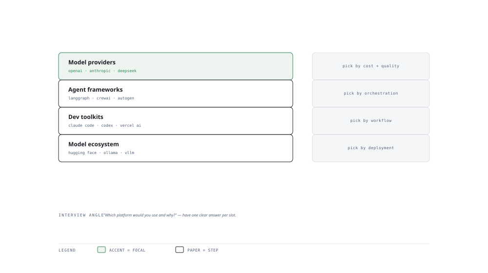

# Visual Notes — Choosing Your AI Stack

> One diagram, the full picture. This page is meant to be glanced at before reading the chapters, and again before interviews.

# What the diagram shows

1. **Providers** — Frontier LLM APIs (DeepSeek, Gemini, Mistral, Together/Groq) expose models you call by token.
1. **Frameworks** — Agent harnesses (CrewAI, AutoGen, LangGraph) and dev toolkits (Claude Code, Codex CLI, Vercel AI SDK) shape how you build.
1. **Ecosystem** — Open-source deployment (Ollama, vLLM, Unsloth) and orchestration (Dify, n8n) complete the stack.

# Why this matters for placement

- "Which platform would you use and why?" needs one crisp answer per slot, not a menu.
- Tasteful stack choice (API vs framework vs self-host) signals real judgment.

# Quick revision

- API vs self-host: cost control and data control vs convenience; vLLM for throughput, Ollama for local.
- Frameworks standardise multi-step agents; pick one and know it deeply.
- Model selection: benchmark + cost + latency + data residency + license.
- Fine-tune with Unsloth/Ollama for private/bespoke behaviour.
- No single tool does all — draw the boundary between provider, framework and infra.

# Related chapters

- [Frontier LLM APIs](01-frontier-llm-apis-providers.md)
- [Agent platforms](02-agent-platforms-harness-orchestration.md)
- [AI developer toolkits](03-ai-developer-toolkits-workflows.md)
- [Deployment stack](08-deployment-stack-comparison.md)

---

**One-line answer for interviews:** *"Providers grant API access, frameworks orchestrate agents, and ecosystems of tools surround each model."*
